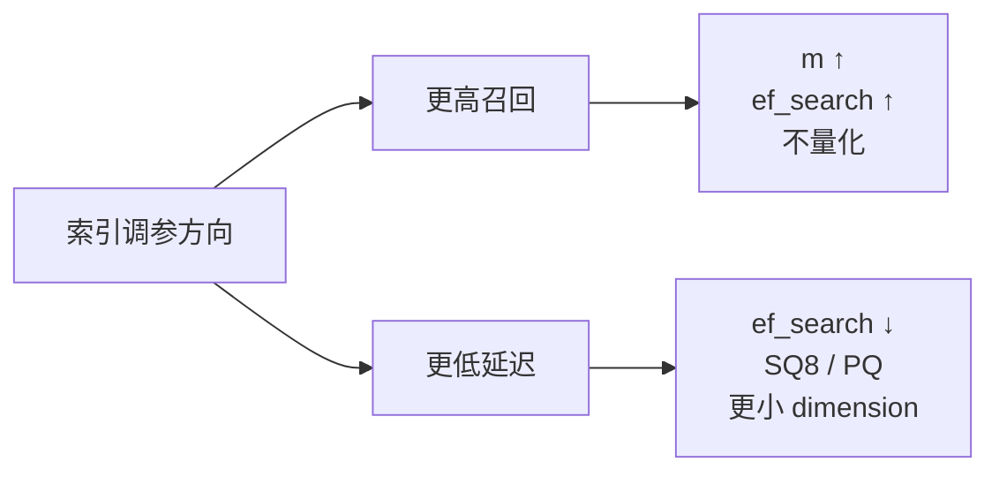

# 精通 Embedding 与向量库：pgvector / Pinecone / Milvus / Qdrant / Weaviate

> 课程编号：A06
> 路线图来源：AI / LLM 后端工程 · 模块二 检索基础
> 难度：⭐⭐⭐⭐
> 预计阅读时间：70 分钟
> 内容基准：2026 年 6 月

---

## 引言：为什么需要 Embedding

```
"苹果手机"      → [0.123, -0.456, 0.789, ...] (768 维)
"iPhone"        → [0.119, -0.451, 0.792, ...] (768 维)
"葡萄"          → [0.876, 0.231, -0.345, ...] (768 维)
```

把语义压缩成数值向量后，**语义相似的文本在向量空间里距离近**。这就是 embedding 的全部魔法。

为什么 LLM 应用离不开它：

- **RAG**：用户问"如何重置密码"，要从 10 万篇文档里找出最相关的 5 篇——传统 BM25 在同义词/换种说法时失效，embedding 不在乎用词只在乎意思
- **语义缓存**：用户问"今天天气怎么样"和"今天的天气情况如何"——LLM 调用应该缓存命中（甚至重用回答）
- **去重 / 聚类**：清洗训练数据时去除语义重复
- **推荐 / 相似召回**：找"和这篇文章相似的内容"
- **分类 / 路由**：用户 query embedding 与 N 个意图 prototype embedding 比较，路由到对应 agent
- **异常检测**：embedding 距离平均向量远的内容可能是脏数据

2026 年 5 月，embedding 已经是 AI 应用的"数据库索引"——前 5 年 SQL 系统怎么不能没有 B-tree，后 5 年 AI 系统就不能没有向量索引。本章拆开生产级 embedding + 向量库的完整工程实践。

---

## 第一章：Embedding 基础

### 1.1 向量空间

文本（或图片、音频）经过 embedding 模型映射到 R^d 空间。常见维度：

| 模型 | 维度 |
|---|---|
| OpenAI text-embedding-3-small | 1536（默认）/ 512（可缩减） |
| OpenAI text-embedding-3-large | 3072（默认）/ 1024 / 256（可缩减）|
| Voyage voyage-3 | 1024 |
| Cohere embed-v3 | 1024 / 384 |
| BGE-M3 | 1024 |
| Anthropic Claude embeddings | 通过 Voyage 提供 |

**维度选择**：

- 越高表达力越强，但**存储 + 计算成本线性增加**
- 现代模型（OpenAI 3 系列、Voyage、BGE）支持 **Matryoshka representation**——同一向量截断到更低维度仍保留主要信息（损失 5-15% recall 换 4-6 倍速度）

### 1.2 余弦相似度

两个向量的"相似度"。最常用度量：

```
cos(A, B) = (A · B) / (|A| * |B|)
```

值域 [-1, 1]，1 表示完全同向，0 表示正交，-1 表示反向。

文本 embedding 中实际取值往往集中在 [0, 0.8]——很少接近 1（除非完全重复）、很少接近 -1（自然语言里"反义"不会真正反向）。

**典型阈值**（OpenAI text-embedding-3 系列）：

| Cosine | 关系 |
|---|---|
| > 0.85 | 几乎完全等价 |
| 0.7 - 0.85 | 高度相关 |
| 0.5 - 0.7 | 主题相关 |
| 0.3 - 0.5 | 弱相关 |
| < 0.3 | 大概率不相关 |

注意：**阈值因模型不同差异大**——不要假设 BGE 和 OpenAI 同分。每个模型要建立自己的阈值经验。

### 1.3 归一化

```go
func Normalize(v []float32) []float32 {
    var sum float64
    for _, x := range v { sum += float64(x) * float64(x) }
    norm := float32(math.Sqrt(sum))
    if norm == 0 { return v }
    out := make([]float32, len(v))
    for i, x := range v { out[i] = x / norm }
    return out
}
```

归一化后 `|v| = 1`，余弦相似度就退化为**点积**：

```
cos(A, B) = A · B   (if |A| = |B| = 1)
```

**生产黄金法则**：**所有 embedding 都归一化存储**。理由：

- 计算更快（省一次开方两次平方和）
- 大多数 ANN 索引（HNSW、IVF、PQ）在归一化向量上表现更好
- 简化代码——下游不用判断是否归一化

OpenAI、Voyage、Cohere 等 API 返回的向量已经归一化（norm ≈ 1）；BGE 需要自己归一化；自己 fine-tune 的模型也要。

### 1.4 距离度量

`distance = 1 - similarity` 或者直接用其他度量：

| 度量 | 公式 | 适用 |
|---|---|---|
| Cosine | 1 - (A·B)/(|A||B|) | 文本语义（标准） |
| Dot product | -A·B | 已归一化时等价 cosine；不归一化时考虑向量"大小" |
| L2 (Euclidean) | sqrt(Σ(A_i - B_i)^2) | 计算机视觉、点云 |
| Manhattan / L1 | Σ|A_i - B_i| | 稀疏向量（如 BM25-like） |
| Hamming | 二进制位差异 | 二进制 embedding |

**文本 embedding 几乎都用 cosine 或归一化向量的 dot product**——两者数学上等价。

### 1.5 Embedding 不是嵌入完所有信息

要破除幻觉：**embedding 是有损压缩**。

- 长文档压成 1024 维向量，必然丢细节
- 否定句、数字、时间、专有名词常常被模糊化（"2024 年" 和 "2025 年" embedding 可能很相似）
- 跨语言能力依赖训练数据——中文/英文/日文跨语言相似度只在 multilingual 模型上靠谱

**所以**：embedding 是**召回**工具，不是**精排**工具。生产 RAG 都是 embedding 召回 → reranker 精排 → LLM 阅读三段式。

---

## 第二章：Embedding 模型选型

2026 年 5 月，主流选择：

### 2.1 商业 API

| 模型 | 维度 | 多语言 | 长上下文 | 价格 (USD/1M tokens) | 适合 |
|---|---|---|---|---|---|
| OpenAI text-embedding-3-large | 3072 | 强 | 8191 | $0.13 | 默认主力，质量高 |
| OpenAI text-embedding-3-small | 1536 | 中 | 8191 | $0.02 | 大规模 / 低成本 |
| Voyage voyage-3 / voyage-3-large | 1024 | 强 | 32k | $0.12 | RAG 评测领先 |
| Voyage voyage-3-lite | 512 | 中 | 32k | $0.02 | 大规模轻量 |
| Cohere embed-v3 | 1024/384 | 强 | 512 | $0.10 | 多语言、企业部署 |
| Cohere embed-multilingual-v3 | 1024 | 极强（100+ 语言） | 512 | $0.10 | 多语言主力 |
| Google text-embedding-gecko | 768 | 中 | 2048 | $0.025 | Google Cloud 生态 |
| Anthropic via Voyage | 1024 | 强 | 32k | $0.12 | Claude 推荐搭配 |

**Anthropic 没有自己的 embedding API**——官方推荐合作伙伴 Voyage AI；Voyage AI 于 2025-02-24 被 MongoDB 收购（与 Anthropic 的关系仅为推荐/合作）。

### 2.2 开源模型

| 模型 | 维度 | 多语言 | 上下文 | 部署 | 适合 |
|---|---|---|---|---|---|
| BGE-M3 | 1024 | 极强 | 8192 | 自托管（GPU） | 中文 RAG 顶尖 |
| BGE-large-en-v1.5 | 1024 | 仅英 | 512 | CPU 可跑 | 英文中小规模 |
| BGE-base-en-v1.5 | 768 | 仅英 | 512 | CPU 友好 | 资源有限 |
| nomic-embed-text-v2 | 768 | 强 | 8192 | 自托管 | 开源平替 |
| gte-large | 1024 | 中 | 512 | 自托管 | 阿里达摩院 |
| jina-embeddings-v3 | 1024 | 强 | 8192 | 自托管 | 任务可控（输入 task type） |
| MiniLM-L6-v2 | 384 | 弱 | 512 | CPU 轻量 | 边缘 / Demo |
| E5-Mistral | 4096 | 强 | 4096 | 大模型，需 GPU | SOTA 但慢 |

**MTEB / C-MTEB 排行榜**是参考起点：[huggingface.co/spaces/mteb/leaderboard](https://huggingface.co/spaces/mteb/leaderboard)。但**不要只看分数**——还要考虑速度、维度、上下文长度、部署成本。

### 2.3 决策树

```
是否中文为主？
├─ 是 → BGE-M3 (自托管) / Voyage-3 (商业) / Cohere multilingual-v3
└─ 否 → 
    数据量大（> 1 亿 chunk）？
    ├─ 是 → text-embedding-3-small (1536d) 或 voyage-3-lite (512d)
    └─ 否 →
        预算紧 / 私有部署？
        ├─ 是 → BGE-M3 / nomic-embed-text-v2
        └─ 否 → text-embedding-3-large / voyage-3-large
```

### 2.4 Go 调用示例

OpenAI:

```go
import openai "github.com/openai/openai-go"

client := openai.NewClient()
resp, _ := client.Embeddings.New(ctx, openai.EmbeddingNewParams{
    Model: openai.F(openai.EmbeddingNewParamsModelTextEmbedding3Large),
    Input: openai.F(openai.EmbeddingNewParamsInputUnion(
        shared.UnionString("hello world"),
    )),
    Dimensions: openai.F(int64(1024)),  // Matryoshka 截断
})
vec := resp.Data[0].Embedding
```

Voyage（OpenAI 兼容 endpoint）:

```go
client := openai.NewClient(
    option.WithBaseURL("https://api.voyageai.com/v1/"),
    option.WithAPIKey(os.Getenv("VOYAGE_API_KEY")),
)
resp, _ := client.Embeddings.New(ctx, openai.EmbeddingNewParams{
    Model: openai.F("voyage-3"),
    Input: ...,
})
```

BGE 自托管（用 `text-embeddings-inference` 服务）:

```go
type EmbedRequest struct {
    Inputs []string `json:"inputs"`
}
type EmbedResponse [][]float32

req, _ := json.Marshal(EmbedRequest{Inputs: texts})
resp, _ := http.Post("http://embedder:8080/embed", "application/json", bytes.NewReader(req))
var result EmbedResponse
json.NewDecoder(resp.Body).Decode(&result)
```

### 2.5 批量与速率

embedding API 通常支持**单次请求多文本**：

```go
Input: openai.F(openai.EmbeddingNewParamsInputUnion(
    shared.UnionStringArray([]string{"text1", "text2", ..., "text100"}),
))
```

OpenAI 单批最多 2048 个 input；token 总数限制看模型。**生产推荐**：每批 100-500，并发 5-10——既能跑满 RPS 又不撞限流。

---

## 第三章：距离度量在向量库的实现

### 3.1 同一个 cosine，三种存储方式

向量库通常支持三种内置度量：

```
cosine        → 库内部自动归一化或计算
dot product   → 假设你已归一化，最快
euclidean     → L2 距离
```

**生产 99% 用 cosine（或归一化后用 dot）**。

### 3.2 选 cosine 还是 dot

- 应用层归一化向量 → 用 dot（向量库省一次归一化计算，索引构建快、查询快）
- 不归一化、混用 → 用 cosine

**强烈建议**：应用层归一化 + 库内用 dot——明确、可控、最快。

### 3.3 一个常见 bug

向量库内用 `dot product` 度量，但写入的向量未归一化 —— 检索结果会偏向"长向量"的内容（比如文本长的更容易胜出，无论语义）。

```go
// 错误：直接写入未归一化的向量，库度量是 dot
db.Insert(rawVec)  

// 正确
normalized := Normalize(rawVec)
db.Insert(normalized)
```

---

## 第四章：向量库选型矩阵

2026 年 5 月主流向量库：

### 4.1 矩阵

| 库 | 部署 | 索引 | 标量过滤 | Hybrid Search | Multi-tenancy | 适合 |
|---|---|---|---|---|---|---|
| **pgvector** | PostgreSQL 扩展 | HNSW / IVFFlat | 强（SQL） | 中（FTS + pgvector） | 强（schema） | 已有 PG / < 1 亿向量 |
| **Pinecone** | SaaS | proprietary | 强 | 强 | 强（namespaces） | 完全托管、不想运维 |
| **Milvus** | 自托管 / Zilliz Cloud | 11 种索引 | 强 | 强 | 中（collections） | 大规模 > 1 亿向量 |
| **Qdrant** | 自托管 / Cloud | HNSW | 强 | 强 | 强（payload + collections） | 严格过滤 / 现代 API |
| **Weaviate** | 自托管 / Cloud | HNSW | 强 | 内置 hybrid | 强 | 模块化、内置 vectorizer |
| **Chroma** | 嵌入式 / 服务端 | HNSW | 中 | 弱 | 中 | 原型 / 小规模 |
| **LanceDB** | 嵌入式 | IVF / PQ | 中 | 中 | 中 | Serverless / 边缘 |
| **Vespa** | 自托管 | 多种 | 极强 | 强 | 强 | 大规模 + 复杂排序 |
| **Elasticsearch** | 自托管 / Cloud | HNSW (Lucene) | 极强 | 强（lex + vec） | 强 | 已有 ES |
| **Redis Stack** | 自托管 / Cloud | HNSW / Flat | 中 | 中 | 中 | KV + 向量统一 |
| **MongoDB Atlas** | SaaS | HNSW (Lucene) | 强 | 中 | 强 | 已有 Mongo |

### 4.2 决策矩阵

| 场景 | 推荐 |
|---|---|
| 已有 PostgreSQL，< 1 亿向量 | **pgvector** |
| 已有 Elasticsearch | **Elasticsearch dense_vector** |
| 完全托管、零运维 | **Pinecone Serverless** |
| 大规模 (> 1 亿)、自托管 | **Milvus** |
| 现代 Rust 实现、严格过滤 | **Qdrant** |
| 想要内置 vectorizer / hybrid | **Weaviate** |
| 嵌入式 / 边缘 | **LanceDB / Chroma** |
| 复杂多阶段排序（推荐场景） | **Vespa** |
| 中型混合 KV + 向量 | **Redis Stack** |

### 4.3 真实世界使用模式

2026 年的常见栈：

- **pgvector** 占了"中小 RAG"的最大份额——因为团队已经有 PG，迁移成本 0
- **Pinecone** 在 SaaS / 创业团队里仍很流行
- **Milvus / Qdrant** 在大规模生产里五五开
- **Weaviate** 模块化优势在快速搭 demo / hackathon 突出
- **Elasticsearch** 因为已经在很多公司部署，被"顺路"用作向量库

---

## 第五章：pgvector 实战

```sql
CREATE EXTENSION IF NOT EXISTS vector;
```

pgvector 0.5.0（2023）引入 HNSW，0.7.0（2024）引入 binary quantization，0.8.0（2024-10）引入 iterative index scans。2026 年 5 月稳定版是 0.8.x。

### 5.1 表设计

```sql
CREATE TABLE documents (
    id          UUID PRIMARY KEY,
    user_id     UUID NOT NULL,
    title       TEXT,
    content     TEXT,
    embedding   vector(1024) NOT NULL,
    metadata    JSONB,
    created_at  TIMESTAMPTZ DEFAULT now()
);

-- 标量过滤的辅助索引
CREATE INDEX idx_documents_user_id ON documents(user_id);
CREATE INDEX idx_documents_metadata ON documents USING GIN (metadata);
```

### 5.2 索引选择

**HNSW**（推荐默认）：

```sql
CREATE INDEX ON documents USING hnsw (embedding vector_ip_ops)
WITH (m = 16, ef_construction = 64);
```

参数：

- `m`（16-48）：每个节点保留多少邻居。大 → 召回高、内存大
- `ef_construction`（64-256）：构建时探索深度。大 → 索引质量好、构建慢

度量算子：

- `vector_ip_ops` — inner product（dot），用于已归一化向量
- `vector_cosine_ops` — cosine
- `vector_l2_ops` — L2

**IVFFlat**（适合数据量 > 1000 万）：

```sql
CREATE INDEX ON documents USING ivfflat (embedding vector_ip_ops)
WITH (lists = 1000);  -- ≈ sqrt(N)
```

参数：

- `lists`：聚类数，经验值 `sqrt(N)`，最小 10、最大 10000
- 查询时：`SET ivfflat.probes = 10` 控制扫描多少 lists（大 → 召回高、慢）

**何时 IVFFlat 优于 HNSW**：

- 数据量极大（> 5000 万），HNSW 索引内存装不下
- 写入吞吐高，HNSW 构建慢
- 召回略低也能接受

**何时坚持 HNSW**：

- 数据量 < 千万级
- 查询延迟敏感
- 召回是第一指标

### 5.3 Go 客户端

使用 `pgx` + `pgvector-go`：

```go
import (
    "github.com/jackc/pgx/v5/pgxpool"
    "github.com/pgvector/pgvector-go"
)

pool, _ := pgxpool.New(ctx, "postgres://...")

// 注册 vector 类型
err := pgxConnRegisterVector(ctx, pool)
```

写入：

```go
type Document struct {
    ID        uuid.UUID
    UserID    uuid.UUID
    Content   string
    Embedding []float32
}

func Insert(ctx context.Context, doc Document) error {
    _, err := pool.Exec(ctx, `
        INSERT INTO documents (id, user_id, content, embedding)
        VALUES ($1, $2, $3, $4)
    `, doc.ID, doc.UserID, doc.Content, pgvector.NewVector(doc.Embedding))
    return err
}
```

查询（带过滤）：

```go
func Search(ctx context.Context, userID uuid.UUID, queryVec []float32, k int) ([]Document, error) {
    rows, err := pool.Query(ctx, `
        SELECT id, content, embedding <#> $1 AS distance
        FROM documents
        WHERE user_id = $2
        ORDER BY embedding <#> $1
        LIMIT $3
    `, pgvector.NewVector(queryVec), userID, k)
    if err != nil { return nil, err }
    defer rows.Close()
    
    var results []Document
    for rows.Next() {
        var d Document
        var dist float32
        rows.Scan(&d.ID, &d.Content, &dist)
        results = append(results, d)
    }
    return results, rows.Err()
}
```

操作符速查：

| 操作符 | 度量 |
|---|---|
| `<->` | L2 距离 |
| `<#>` | 负内积（`-(A·B)`）—— ORDER BY 升序就是按相似度降序 |
| `<=>` | 余弦距离（`1 - cos`） |

**注意 `<#>` 是负内积**——返回值是负数。ORDER BY 升序就找到最相似的。

### 5.4 调参

```sql
-- 查询时调整 HNSW 搜索深度
SET hnsw.ef_search = 40;  -- 默认 40，大值召回高但慢
```

会话级别 SET 是临时的，重连失效。生产中：

- 配置文件 `postgresql.conf` 设全局默认
- 应用按场景动态 SET（如对延迟敏感的查询调小、对召回敏感的调大）

### 5.5 Hybrid Search（BM25 + Vector）

```sql
-- 全文索引
CREATE INDEX idx_documents_content_fts ON documents USING GIN (to_tsvector('chinese', content));

-- 混合查询：RRF（reciprocal rank fusion）
WITH vec_search AS (
    SELECT id, ROW_NUMBER() OVER (ORDER BY embedding <#> $1) AS rank
    FROM documents
    WHERE user_id = $3
    ORDER BY embedding <#> $1
    LIMIT 50
),
text_search AS (
    SELECT id, ROW_NUMBER() OVER (ORDER BY ts_rank_cd(to_tsvector('chinese', content), plainto_tsquery('chinese', $2)) DESC) AS rank
    FROM documents
    WHERE user_id = $3 AND to_tsvector('chinese', content) @@ plainto_tsquery('chinese', $2)
    LIMIT 50
)
SELECT d.id, d.content,
       COALESCE(1.0 / (60 + v.rank), 0) + COALESCE(1.0 / (60 + t.rank), 0) AS rrf_score
FROM documents d
LEFT JOIN vec_search v ON d.id = v.id
LEFT JOIN text_search t ON d.id = t.id
WHERE v.id IS NOT NULL OR t.id IS NOT NULL
ORDER BY rrf_score DESC
LIMIT 10;
```

中文要装 `zhparser` 或 `pg_jieba` 扩展才能做中文分词。

---

## 第六章：Pinecone 实战

Pinecone 2024 推出 **Serverless**——按用量计费、无需管节点。Pod-based 模式仍存在但已不推荐新项目。

### 6.1 创建 index

```go
import "github.com/pinecone-io/go-pinecone/pinecone"

pc, _ := pinecone.NewClient(pinecone.NewClientParams{
    ApiKey: os.Getenv("PINECONE_API_KEY"),
})

_, err := pc.CreateServerlessIndex(ctx, &pinecone.CreateServerlessIndexRequest{
    Name:      "documents",
    Dimension: 1024,
    Metric:    pinecone.Dotproduct,
    Cloud:     pinecone.Aws,
    Region:    "us-east-1",
})
```

度量必须**创建时确定**，事后不能改。

### 6.2 写入

```go
idx, _ := pc.Index(pinecone.NewIndexConnParams{
    Host: "documents-xyz.svc.us-east-1-aws.pinecone.io",
})

vectors := []*pinecone.Vector{
    {
        Id:     "doc_001",
        Values: embedding, // []float32, 已归一化
        Metadata: &pinecone.Metadata{
            Fields: map[string]*structpb.Value{
                "user_id": structpb.NewStringValue("u_123"),
                "title":   structpb.NewStringValue("..."),
            },
        },
    },
    // ... 一批最多 1000 个
}

_, err := idx.UpsertVectors(ctx, vectors)
```

### 6.3 查询

```go
resp, _ := idx.QueryByVectorValues(ctx, &pinecone.QueryByVectorValuesRequest{
    Vector:          queryEmbedding,
    TopK:            10,
    IncludeMetadata: true,
    MetadataFilter: &pinecone.MetadataFilter{
        Fields: map[string]*structpb.Value{
            "user_id": structpb.NewStringValue("u_123"),
        },
    },
    Namespace: "default",
})

for _, m := range resp.Matches {
    fmt.Println(m.Vector.Id, m.Score, m.Vector.Metadata)
}
```

### 6.4 Namespaces

Namespace 是 Pinecone 的多租户隔离：

```go
idx, _ := pc.IndexWithNamespace(host, "tenant_abc")
```

每个 namespace 是独立的向量集合——查询只在 namespace 内、删除以 namespace 为单位。**强多租户场景必用**。

### 6.5 Serverless vs Pod 对比

| 维度 | Serverless | Pod |
|---|---|---|
| 计费 | 按读 / 写 / 存储量 | 按 pod-hour 固定 |
| 扩展 | 自动 | 手动 |
| 冷启动 | 有（首次访问 ~ 100ms） | 无 |
| 最低延迟 | ~ 50-100ms | ~ 20-50ms |
| 推荐场景 | 不稳定流量、不想运维 | 高 QPS 稳定流量、超低延迟要求 |

2026 年 Serverless 已经是默认选项——Pod 主要给老用户或对延迟极端敏感的场景。

---

## 第七章：Milvus 与 Qdrant 自托管

### 7.1 Milvus

Milvus 是中国出身的大规模向量库，2026 年 5 月版本 2.4.x。Zilliz Cloud 是它的托管服务。

**架构**：分布式、计算存储分离、依赖 etcd + MinIO + Pulsar（或简化版的 Milvus Lite / Standalone）。

**索引种类丰富**：

```
FLAT          → 暴力遍历，小数据 100% 召回
IVF_FLAT      → 倒排聚类，无压缩
IVF_SQ8       → 倒排 + 标量量化（4x 压缩）
IVF_PQ        → 倒排 + 乘积量化（10-100x 压缩）
HNSW          → 图索引（默认推荐 < 10 亿）
DISKANN       → 磁盘索引（10 亿以上）
GPU_IVF_FLAT  → GPU 加速
GPU_CAGRA     → GPU 顶级图索引
```

**Go 客户端**：

```go
import "github.com/milvus-io/milvus-sdk-go/v2/client"

c, _ := client.NewClient(ctx, client.Config{
    Address: "localhost:19530",
})

// 创建 collection
schema := &entity.Schema{
    CollectionName: "documents",
    Fields: []*entity.Field{
        {Name: "id", DataType: entity.FieldTypeInt64, PrimaryKey: true, AutoID: true},
        {Name: "user_id", DataType: entity.FieldTypeVarChar, MaxLength: 64},
        {Name: "embedding", DataType: entity.FieldTypeFloatVector, Dim: 1024},
    },
}
c.CreateCollection(ctx, schema, 2 /* shards */)

// 创建索引
idx, _ := entity.NewIndexHNSW(entity.IP, 16, 64)
c.CreateIndex(ctx, "documents", "embedding", idx, false)

// 加载到内存
c.LoadCollection(ctx, "documents", false)

// 插入
c.Insert(ctx, "documents", "",
    entity.NewColumnVarChar("user_id", []string{"u1", "u2"}),
    entity.NewColumnFloatVector("embedding", 1024, [][]float32{vec1, vec2}),
)

// 查询
sp, _ := entity.NewIndexHNSWSearchParam(40)  // ef
results, _ := c.Search(ctx, "documents", []string{},
    `user_id == "u1"`,  // 过滤表达式
    []string{},          // output fields
    []entity.Vector{entity.FloatVector(queryVec)},
    "embedding",
    entity.IP,
    10,                  // topK
    sp,
)
```

**Milvus 特点**：

- 大规模（数十亿向量）成熟方案
- 索引类型最全（含 GPU、磁盘）
- 部署复杂度高——Standalone 单机够小项目，集群要 K8s
- Milvus Lite 是嵌入式版本——适合开发 / 测试

### 7.2 Qdrant

Qdrant 是 Rust 实现的现代向量库。架构简洁：单二进制、内置存储。2026 年 5 月版本 1.10+。

**Go 客户端**：

```go
import "github.com/qdrant/go-client/qdrant"

client, _ := qdrant.NewClient(&qdrant.Config{
    Host: "localhost",
    Port: 6334,
})

// 创建 collection
_, err := client.CreateCollection(ctx, &qdrant.CreateCollection{
    CollectionName: "documents",
    VectorsConfig: qdrant.NewVectorsConfig(&qdrant.VectorParams{
        Size:     1024,
        Distance: qdrant.Distance_Dot,
    }),
})

// 创建 payload 索引（标量过滤要）
_, err = client.CreateFieldIndex(ctx, &qdrant.CreateFieldIndexCollection{
    CollectionName: "documents",
    FieldName:      "user_id",
    FieldType:      qdrant.FieldType_FieldTypeKeyword.Enum(),
})

// 写入
points := []*qdrant.PointStruct{
    {
        Id: qdrant.NewIDUUID(uuid.NewString()),
        Vectors: qdrant.NewVectors(vec...),
        Payload: qdrant.NewValueMap(map[string]any{
            "user_id": "u_123",
            "title":   "...",
        }),
    },
}
client.Upsert(ctx, &qdrant.UpsertPoints{
    CollectionName: "documents",
    Points:         points,
})

// 查询
filter := &qdrant.Filter{
    Must: []*qdrant.Condition{
        qdrant.NewMatch("user_id", "u_123"),
    },
}
result, _ := client.Query(ctx, &qdrant.QueryPoints{
    CollectionName: "documents",
    Query:          qdrant.NewQuery(queryVec...),
    Filter:         filter,
    Limit:          qdrant.PtrOf(uint64(10)),
    WithPayload:    qdrant.NewWithPayload(true),
})
```

**Qdrant 特点**：

- 标量过滤性能极强——payload 索引基于 mmap，过滤后再 ANN 而不是 ANN 后过滤
- HNSW + scalar quantization 一体化
- 单机性能很好；分布式也支持但相对简单
- API 现代化、文档清晰
- **写入性能略弱于 Milvus**——Milvus 在大批量写入场景更快

### 7.3 选 Milvus 还是 Qdrant

| 偏向 | 推荐 |
|---|---|
| 极大规模（数十亿）| Milvus |
| 高性能标量过滤 | Qdrant |
| 写入吞吐第一 | Milvus |
| 部署简单 | Qdrant |
| 索引类型丰富（含 GPU）| Milvus |
| 新项目从零开始 | Qdrant |
| 已有 K8s 大集群 | Milvus |

---

## 第八章：Weaviate

Weaviate 是另一个主流自托管方案，特色是**内置 vectorizer 模块**。

### 8.1 内置 vectorizer

很多向量库要求你"自己 embedding 后写入"。Weaviate 可以让你**写入纯文本**，库内部用配置好的 vectorizer 模块自动 embedding：

```graphql
{
  Class: "Document",
  Vectorizer: "text2vec-openai",
  ModuleConfig: {
    text2vec-openai: { model: "text-embedding-3-large" }
  },
  Properties: [
    { name: "content", dataType: ["text"] }
  ]
}
```

写入时只发文本：

```go
import "github.com/weaviate/weaviate-go-client/v4/weaviate"

client, _ := weaviate.NewClient(weaviate.Config{
    Host:   "localhost:8080",
    Scheme: "http",
})

_, err := client.Data().Creator().
    WithClassName("Document").
    WithProperties(map[string]any{
        "content": "向量检索是 RAG 的核心",
    }).
    Do(ctx)
```

vectorizer 在服务端调 OpenAI / Cohere / HuggingFace 等接口生成向量。

### 8.2 内置 Hybrid Search

```go
result, _ := client.GraphQL().HybridArgBuilder().
    WithQuery("向量检索").
    WithAlpha(0.5).  // 0 纯 BM25，1 纯 vector
    Build()

response, _ := client.GraphQL().Get().
    WithClassName("Document").
    WithFields(graphql.Field{Name: "content"}).
    WithHybrid(result).
    WithLimit(10).
    Do(ctx)
```

Hybrid 是 Weaviate 的招牌——开箱即用、BM25 + 向量的 RRF 融合，alpha 控制权重。

### 8.3 选 Weaviate 的理由

- 想要**最少代码**搭起 RAG —— vectorizer 模块大量减少 embedding 调用代码
- 需要 hybrid search 不想自己拼装
- 想要 generative 模块（用配置好的 LLM 直接生成回答）

不选的理由：

- vectorizer 模块绑定了 embedding 调用——可能不灵活
- 性能比 Qdrant 稍慢
- 部署生态比 Milvus 小

---

## 第九章：向量量化与压缩

存 1 亿条 1024 维 float32 = 400 GB 内存。哪怕用 SSD 也很贵。**量化**是把每个 dimension 的精度降低，换 4-32 倍空间节省。

### 9.1 三种主流量化

**Scalar Quantization (SQ8)**：

- float32 → uint8（每个 dim 0-255）
- 4x 压缩
- 召回损失 < 2%
- 几乎无脑可用

**Product Quantization (PQ)**：

- 把向量切分成 M 段，每段独立聚类成 256 类
- 1024 维 / 16 段 / 每段 64 维 → 每个向量只存 16 字节
- 64x 压缩（vs float32）
- 召回损失 5-15%
- IVF_PQ 是 Milvus 大规模场景的金牌方案

**Binary Quantization (BQ / BBQ)**：

- 每个 dim 取符号（1 位）
- 32x 压缩
- 现代 BBQ（better binary quantization）召回损失 5-10%
- 检索时用 Hamming 距离——极快

### 9.2 量化时的常见模式

```
全精度向量          → 持久化（磁盘）
量化向量            → 内存索引（HNSW）
查询：
  1. 在量化索引上找 top-K * 5 候选
  2. 用全精度向量重排（rerank）
  3. 返回真正 top-K
```

这种"量化召回 + 全精度精排"是 Pinecone、Qdrant、Milvus 都采用的标准模式，能保住召回的同时大幅省内存。

### 9.3 pgvector 的 BQ

pgvector 0.7+ 支持 binary quantization：

```sql
-- 存原始向量
ALTER TABLE documents ADD COLUMN embedding_bit bit(1024);

-- 触发器或应用层维护：embedding_bit = 对 embedding 做 BQ

CREATE INDEX ON documents USING hnsw (embedding_bit bit_hamming_ops);

-- 查询：先用 BQ 召回，再用 float 重排
SELECT id, content
FROM (
    SELECT id, content, embedding
    FROM documents
    ORDER BY embedding_bit <~> $1_bit
    LIMIT 100
) AS coarse
ORDER BY embedding <#> $1
LIMIT 10;
```

### 9.4 量化的代价

- **召回损失**：必须用 eval 集量化前后对比，确认业务可接受
- **构建时间**：训练量化器（特别是 PQ）耗时
- **更新难度**：增量数据可能不适配现有量化器，要定期重训
- **可读性 / 调试**：量化向量不易解释

**经验法则**：

- < 1000 万向量：不量化（性能不需要）
- 1000 万 - 1 亿：SQ8
- 1 亿 - 10 亿：BQ + 重排 或 PQ
- 10 亿+：DiskANN + PQ

---

## 第十章：生产实践

### 10.1 索引调优

**HNSW 参数**：

| 参数 | 影响 | 推荐 |
|---|---|---|
| `m` | 邻居数，索引内存、构建时间、召回 | 16-32 |
| `ef_construction` | 构建质量 | 100-200 |
| `ef_search` | 查询深度 | 40-100，动态调整 |

调优流程：

1. 建立 eval 集（1000 个 query + ground truth top-10）
2. 先固定 `m = 16`，调 `ef_construction` 从 64 试到 256
3. 选 recall@10 > 95% 的最小 `ef_construction`
4. 再调 `ef_search` 找延迟和召回的平衡点

**recall 计算**：

```go
func recall(retrieved, groundTruth []string, k int) float64 {
    rSet := make(map[string]bool)
    for i, id := range retrieved { 
        if i >= k { break }
        rSet[id] = true 
    }
    hit := 0
    for i, id := range groundTruth { 
        if i >= k { break }
        if rSet[id] { hit++ }
    }
    return float64(hit) / float64(min(k, len(groundTruth)))
}
```

### 10.2 召回 / 延迟权衡



90% 的 RAG 场景下 **recall@10 ≥ 95% 就足够**——重点放在延迟和成本。

### 10.3 写入 / 索引模式

**模式一：写时建索引**（默认）：每次 upsert 都更新索引。简单，但写入慢、索引可能 fragmentation。

**模式二：批量重建**：先关索引、批量写、再建索引。适合大批量初始化。

**模式三：双索引滚动**：A 索引服务查询，B 索引后台重建，重建完原子切换。适合定期全量刷新（如每周）。

### 10.4 元数据 / 过滤优化

**标量过滤要建索引**：

- pgvector：B-tree / GIN
- Milvus / Qdrant：scalar / payload index
- Pinecone：metadata 自动索引

**过滤选择性**：

- 选择性高（如 `user_id = X` 只剩 0.1% 数据）：过滤后再 ANN，几乎全表扫
- 选择性低（如 `category = "tech"` 还剩 30%）：ANN 后过滤更快

不同库的处理：

- **Qdrant**：pre-filter（先过滤再 ANN），适合高选择性
- **Pinecone**：post-filter（先 ANN 再过滤），适合低选择性
- **Milvus / pgvector**：混合策略，看代价模型

**生产建议**：测试你的实际数据——别假设。

### 10.5 多租户

三种模式：

| 模式 | 实现 | 优点 | 缺点 |
|---|---|---|---|
| 单 collection + 过滤 | metadata.tenant_id | 简单 | 大租户拖小租户 |
| 每租户 namespace | Pinecone namespace / Qdrant collection | 隔离好 | 管理复杂 |
| 每租户独立 collection | 物理隔离 | 最佳隔离 | 大量小 collection 性能差 |

Pinecone Serverless 的 namespace、Qdrant 的 collection + tenant payload index、Weaviate 的 multi-tenancy mode 都是产品级方案。**强多租户从这里开始**而不是 metadata 过滤。

### 10.6 Embedding 管道

```go
type EmbedPipeline struct {
    embedder Embedder
    queue    chan EmbedJob
    workers  int
}

type EmbedJob struct {
    ID     string
    Text   string
    Result chan<- EmbedResult
}

func (p *EmbedPipeline) Start(ctx context.Context) {
    for i := 0; i < p.workers; i++ {
        go p.worker(ctx)
    }
}

func (p *EmbedPipeline) worker(ctx context.Context) {
    batch := make([]EmbedJob, 0, 100)
    timer := time.NewTimer(100 * time.Millisecond)
    
    flush := func() {
        if len(batch) == 0 { return }
        texts := make([]string, len(batch))
        for i, j := range batch { texts[i] = j.Text }
        
        embs, err := p.embedder.Embed(ctx, texts)
        for i, j := range batch {
            if err != nil {
                j.Result <- EmbedResult{Err: err}
            } else {
                j.Result <- EmbedResult{ID: j.ID, Embedding: embs[i]}
            }
        }
        batch = batch[:0]
        timer.Reset(100 * time.Millisecond)
    }
    
    for {
        select {
        case <-ctx.Done(): return
        case job := <-p.queue:
            batch = append(batch, job)
            if len(batch) >= 100 { flush() }
        case <-timer.C:
            flush()
        }
    }
}
```

要点：

- **批量**：embedding API 单批 100-500 远比单条调用经济
- **超时合批**：100ms 强制 flush 防止延迟过高
- **限流 / 重试**：embedding API 也会 429
- **去重**：同一文本不要 embedding 两次——内存里加 LRU 缓存

### 10.7 监控指标

```go
type VectorMetrics struct {
    QPS              float64
    P50LatencyMs     float64
    P95LatencyMs     float64
    P99LatencyMs     float64
    AvgTopK          float64
    AvgRecallVsBrute float64  // 定期 vs 暴力扫的 recall
    IndexSizeMB      float64
    EmbeddingQueueLen int
    EmbeddingErrorRate float64
}
```

**特别关注**：

- 召回率随时间漂移（数据分布变化时）
- 索引膨胀（HNSW 删除不真正回收空间，需要定期 rebuild）
- 写入 / 查询延迟之比（写入慢 → 索引 fragmentation）

---

## 第十一章：陷阱清单

### 1. Embedding 版本漂移

OpenAI 升级 `text-embedding-3-large` 内部模型 → 同样文本的 embedding 变了 → 老向量和新 query 不匹配。

**对策**：

- 在 metadata 里存 embedding 模型版本（`"embedder": "text-embedding-3-large-v1"`）
- 升级时**双写双查**过渡：新数据用新模型，老数据继续用老模型查
- 必要时全量 reindex

### 2. 维度迁移

从 768 维换到 1024 维 → 表 schema 变了，索引要重建。

**对策**：

- 选模型时尽量考虑长期——Matryoshka 模型可以无痛降维
- pgvector 的 `vector(1024)` 是固定的——dim 变化必重建
- 大表 reindex 极慢——预留 downtime 或双跑

### 3. 未归一化 + dot product

库度量 dot，写入未归一化向量——长文本"自动加分"，召回偏差。

**对策**：永远归一化、用 dot 度量；或者用 cosine 度量（库内自动处理）。

### 4. 距离值方向搞反

```sql
ORDER BY embedding <#> $1 DESC  -- 错！<#> 是负内积，DESC 反了
```

`<#>`、`<=>` 是距离（越小越相似），ORDER BY **升序**找最相似。

### 5. Scale 后召回突然下降

数据从 1000 万增到 1 亿：

- HNSW 的 `ef_search` 没调大 → 召回降
- IVF 的 `nlist` 没改 → 每个 cluster 平均向量数增加，召回降
- 文档分布变化 → embedding 不再"分散均匀"，更密集区域召回差

**对策**：

- 定期跑 eval 集监控召回趋势
- 大规模时优先 IVF_PQ 或 DiskANN

### 6. 过度依赖 embedding

用户问"2024 年和 2025 年营收对比" —— embedding 把两个年份当作几乎相同。结果检索可能丢失关键年份信息。

**对策**：

- 数字、日期、专有名词类查询：BM25 / Hybrid 必加
- Reranker 二次排序
- 让 LLM 看到原始查询，能主动改写

### 7. Chunk 太长 / 太短

- 太短（< 200 token）：丢失上下文，模型看不清主题
- 太长（> 2000 token）：embedding 把太多信息塞进单一向量，效果稀释

**经验**：

- 一般 RAG：512-1000 token / chunk
- 长上下文模型：可以 chunk 大一点
- 跨段共享上下文：用 overlap（50-100 token）或层级摘要

### 8. Chunk 边界切断语义

简单按字符长度切 → 切在句子或段落中间 → 单个 chunk 语义残缺。

**对策**：

- 按段落 / 句子边界切（用 langchain 的 RecursiveCharacterTextSplitter 之类）
- 加 overlap
- 带上层 metadata（文档标题、章节、上一段最后一句）

### 9. 测试数据集污染

eval 集和训练数据有重叠 → 召回指标虚高。

**对策**：

- eval 集与生产数据严格 holdout
- 用真实用户 query（采样后人工审核 ground truth）
- 定期"重置" eval 集，跟踪长期质量

### 10. 单点向量库

向量库挂了 → RAG 全瘫。

**对策**：

- 主备 / 副本
- 优雅降级：向量库不可用时回退到 BM25 / 历史 cache
- 持久化向量到对象存储（S3）——可以快速重建索引

### 11. 内存索引装不下

HNSW 全部在内存。数据增长 → OOM。

**对策**：

- 早期就规划好——估算 (N × dim × 4) + 索引开销
- 大于内存时切换到 IVF_PQ / DiskANN / 分片
- Pinecone Serverless / Qdrant 内置磁盘模式

### 12. 中文分词 / 多语言混

中文用英文 tokenizer 的 embedding 模型——上下文窗口"虚高"，因为 1 个汉字 ≈ 1-2 token 但实际信息密度高。

**对策**：

- 中文用专门 multilingual 模型（BGE-M3、Voyage-3、Cohere multilingual-v3）
- 别用单语 model 当跨语言用

---

## 第十二章：2026 现状

### 12.1 Embedding 模型版图

```
质量第一（钱不缺）:  Voyage voyage-3-large / OpenAI text-embedding-3-large
中文 RAG:           Voyage voyage-3 / BGE-M3 / Cohere multilingual-v3
大规模 / 低成本:     text-embedding-3-small / voyage-3-lite / BGE-base
自托管:             BGE-M3 / nomic-embed-text-v2 / jina-embeddings-v3
边缘 / 嵌入式:      MiniLM-L6-v2 / all-MiniLM-L12-v2
```

### 12.2 向量库市场

- **pgvector** 仍是"中小 RAG"的实质标准——PostgreSQL 生态太大
- **Pinecone** Serverless 后定价更友好，仍是 SaaS 第一梯队
- **Milvus / Zilliz** 在大规模生产稳定增长
- **Qdrant** 因为 Rust + 开发者体验好，2024-2025 增长最快
- **Weaviate** 模块化吸引快速开发场景
- **Elasticsearch / OpenSearch** 仍占据"已有搜索基础设施"的市场

### 12.3 Hybrid Search 标准化

2025-2026 几乎所有主流向量库都内置或推荐 hybrid search：

- Weaviate：内置 BM25 + vector
- Pinecone：sparse-dense hybrid
- Qdrant：dense + sparse vectors
- Elasticsearch：lex + dense
- Milvus 2.4+：hybrid search

**纯 vector search 已不再是默认推荐**——hybrid 在大多数 RAG 场景中表现更好，尤其是有专有名词、数字、代码的查询。

### 12.4 多模态 Embedding

- **CLIP 系列**：图文统一向量空间
- **Voyage multimodal**：原生多模态
- **Cohere Embed v3 image**：图片 + 文本
- **OpenAI text-embedding-3** 实际只支持文本——多模态走 GPT-4o 的 vision pathway

2026 年的"图文混合向量库"已成熟——可以把图片和文本放进同一索引同度量。

### 12.5 量化技术成熟

- BBQ / Matryoshka / PQ 都已工业级稳定
- pgvector 0.8 内置 BQ
- Pinecone / Qdrant / Milvus 内置多种量化
- **"召回 + 全精度精排"** 已成默认模式

### 12.6 Reranker 同步进化

- Cohere rerank v3 / v3.5 仍是商业 reranker 首选
- BGE-reranker-v2-m3 / jina-reranker-v2 是开源主力
- 现代 RAG 标配：embedding 召回 top 100 → reranker 精排 top 10 → LLM 阅读

### 12.7 行业共识

- **Hybrid search > pure vector search**
- **Reranker 不可省略**——单 embedding 召回质量天花板有限
- **量化 + 多级召回**是大规模标配
- **embedding 模型至少每年评估一次升级**

---

## 第十三章：练习题

**练习 1**：解释为什么"归一化向量 + dot product"与"非归一化向量 + cosine"在数学上等价但工程上前者更优。

**练习 2**：你的 RAG 有 100 万文档（每个 chunk 平均 600 token），需要支持 1000 QPS、P95 延迟 < 200ms、recall@10 ≥ 95%。给出完整方案：embedding 模型、向量库、索引、量化、硬件。

**练习 3**：以下 pgvector 查询有什么问题？

```sql
SELECT id, content FROM documents
WHERE user_id = $1
ORDER BY embedding <#> $2 DESC
LIMIT 10;
```

**练习 4**：你升级 embedding 模型从 voyage-3 到 voyage-3-large（1024 维变 2048 维）。生产数据有 5000 万 chunk。设计无停机升级方案。

**练习 5**：写一段 Go 代码，给定一组 chunk 和一个 query，演示**召回 + reranker 精排**的完整两阶段流程。

**练习 6**：解释为什么 hybrid search（BM25 + vector）在"数字 / 代码 / 专有名词"查询中明显优于纯 vector search。

**练习 7**：你发现向量库召回率从 96% 跌到 78%。给出系统性排查清单。

**练习 8**：用户问"我去年提交的关于 OOM 的工单"。RAG 检索效果不好。分析为什么、怎么改。

---

## 参考答案

**练习 1**：

数学上：当 |A| = |B| = 1 时，`A · B = cos(A, B)`，所以二者等价。

工程上前者更优的原因：

1. **计算更快**：cosine 要除以 `|A| * |B|`，每次查询都要算开方——dot 只要乘加
2. **索引兼容性**：大多数 ANN 索引（HNSW、IVF）的距离函数是 dot 或 L2 优化的，cosine 是"包装"
3. **数值稳定性**：归一化一次后所有向量在同一量级，避免边缘 case（如全零向量）
4. **代码简洁**：约定"所有向量都已归一化"消除歧义，避免"该归一化的没归"bug

**练习 2**：

```
Embedding:
  - 模型: Voyage voyage-3-lite (512 维) 或 text-embedding-3-small + Matryoshka 到 768 维
  - 理由: 1000 QPS 下 embedding API 成本可控，512-768 维存储紧凑
  - 应用层归一化、批量调用

向量库:
  - Qdrant (单机 + 2 个副本) 或 Milvus 集群
  - 不选 Pinecone：1000 QPS 成本太高
  - 不选 pgvector：到 100 万 / 1000 QPS 边界，性能勉强但每秒成本不优

索引:
  - HNSW m=24, ef_construction=200
  - 查询 ef_search=64（先做 eval 找最佳点）
  - Scalar quantization SQ8（节省内存，召回损失 < 1%）

存储估算:
  - 100 万 × 512 dim × 1 byte (SQ8) = 512 MB
  - 加 HNSW 索引开销 ~ 2 GB 内存
  - 全精度备份在磁盘 ~ 2 GB

硬件:
  - 应用层: 4 instance, 4 core / 8GB ram 每个
  - Qdrant: 2 instance (主备), 16 core / 32GB ram 每个
  - Embedding service: 自托管 BGE-M3 (GPU) 或买 OpenAI/Voyage API

监控:
  - P50/P95/P99 延迟
  - 召回率（每日 eval）
  - QPS 与限流
  - 索引大小趋势
```

**练习 3**：

```sql
ORDER BY embedding <#> $2 DESC  -- ❌
```

`<#>` 是负内积（返回负数）。最相似的负值最小（如 -0.95），最不相似的负值大（如 -0.1）。`DESC` 把最不相似的排前面 → 完全反了。

正确：

```sql
ORDER BY embedding <#> $2  -- ASC，默认即可
```

或用 `<=>` (cosine distance) 也是 ASC。

**练习 4**：

```
1. 双表过渡:
   - 创建新表 documents_v2 (embedding vector(2048))
   - 老表 documents 保留，继续承担读

2. 双写:
   - 新写入: 同时写 documents 和 documents_v2 (双 embedding)
   - 监控写入延迟、错误率

3. 后台重建:
   - 离线 worker: 拉老表数据 → 用 voyage-3-large 重新 embedding → 写新表
   - 5000 万 chunk × 1 ms/embedding(批量) ≈ 14 小时 (并发 100)
   - embedding API 成本: $0.12/M tokens × 5000w × 600 ≈ $3600

4. 查询切换:
   - 第一阶段: 100% 查老表
   - 第二阶段: 5% 流量查新表 + 召回质量对比 (A/B test eval)
   - 第三阶段: 验证 recall 不降 (或更好) → 50% → 100%

5. 索引调优:
   - 新表索引在 100% 切换前重新 tune (HNSW m / ef_search)
   - 留 2 周双跑期监控指标

6. 清理:
   - 完全切换 + 2 周稳定后删老表
```

**练习 5**：

```go
type RAG struct {
    embedder    Embedder
    vectorDB    VectorDB
    reranker    Reranker
}

type Document struct {
    ID      string
    Content string
    Score   float32
}

func (r *RAG) Retrieve(ctx context.Context, query string, k int) ([]Document, error) {
    // 1. embedding query
    qVec, err := r.embedder.Embed(ctx, []string{query})
    if err != nil { return nil, err }
    
    // 2. 向量召回 top 100
    candidates, err := r.vectorDB.Search(ctx, qVec[0], 100)
    if err != nil { return nil, err }
    
    if len(candidates) == 0 { return nil, nil }
    
    // 3. reranker 精排
    docs := make([]string, len(candidates))
    for i, c := range candidates { docs[i] = c.Content }
    
    scores, err := r.reranker.Rerank(ctx, query, docs)
    if err != nil {
        // 降级: 返回 vector 召回 top k
        if len(candidates) > k { candidates = candidates[:k] }
        return candidates, nil
    }
    
    // 4. 按 reranker 分数排序
    for i := range candidates {
        candidates[i].Score = scores[i]
    }
    sort.Slice(candidates, func(i, j int) bool {
        return candidates[i].Score > candidates[j].Score
    })
    
    // 5. 返回 top k
    if len(candidates) > k { candidates = candidates[:k] }
    return candidates, nil
}

// Cohere reranker 示例
type CohereReranker struct {
    apiKey string
    model  string
}

func (r *CohereReranker) Rerank(ctx context.Context, query string, docs []string) ([]float32, error) {
    payload, _ := json.Marshal(map[string]any{
        "model":     r.model,
        "query":     query,
        "documents": docs,
        "top_n":     len(docs),
    })
    req, _ := http.NewRequestWithContext(ctx, "POST",
        "https://api.cohere.com/v1/rerank", bytes.NewReader(payload))
    req.Header.Set("Authorization", "Bearer "+r.apiKey)
    req.Header.Set("Content-Type", "application/json")
    
    resp, err := http.DefaultClient.Do(req)
    if err != nil { return nil, err }
    defer resp.Body.Close()
    
    var result struct {
        Results []struct {
            Index          int     `json:"index"`
            RelevanceScore float32 `json:"relevance_score"`
        } `json:"results"`
    }
    json.NewDecoder(resp.Body).Decode(&result)
    
    scores := make([]float32, len(docs))
    for _, r := range result.Results {
        scores[r.Index] = r.RelevanceScore
    }
    return scores, nil
}
```

**练习 6**：

embedding 模型在训练时主要学习"语义相似性"——同义词、同主题。但：

1. **数字**：`"销售额 1234 万"` 和 `"销售额 4321 万"` 在 embedding 空间几乎相同——都是"销售额数字"的模式。BM25 直接看 token，1234 ≠ 4321 显著
2. **专有名词**：`"PostgreSQL"` 和 `"MySQL"` 都是数据库，embedding 距离不大；但 BM25 看是不是同一个 token
3. **代码**：函数名、变量名、API name 是高度精确的——`getUserById` 和 `findUserByID` embedding 上很近但精确字符串很重要
4. **罕见词**：embedding 训练数据中出现少的词向量质量差；BM25 不挑

Hybrid 用 RRF 或加权融合，让两边各自的优势都被保留——这就是为什么生产 RAG 几乎都是 hybrid。

**练习 7**：

排查清单：

```
1. 数据层
   ☐ 是否有大量新写入？数据分布是否漂移？
   ☐ 是否有大量删除导致索引 fragmentation？(HNSW 删除不真正回收)
   ☐ embedding 模型版本是否变了 (API 端、自托管端)？

2. 索引层
   ☐ 索引是否需要 rebuild (查 fragmentation 比例)？
   ☐ HNSW ef_search / IVF probes 设置是否合理？
   ☐ 索引大小是否超过内存导致换页？

3. 查询层
   ☐ query embedding 是否归一化？(写入时归一化但查询时没归化是常见 bug)
   ☐ query 内容是否突然变了风格 / 语言？
   ☐ 标量过滤是否变了 (新的过滤条件让结果集缩小)？

4. eval 层
   ☐ eval 数据集本身是否还有效 (是否被生产数据"污染")？
   ☐ ground truth 是否需要更新？
   ☐ recall 计算逻辑是否变化？

5. 系统层
   ☐ 向量库版本是否升级了？升级日志看有无算法变更？
   ☐ 硬件 / 内存压力？
   ☐ 网络抖动导致部分查询超时被丢？
```

**练习 8**：

为什么不好：

1. **embedding 对时间不敏感**："去年提交"对 embedding 来说就是"提交时间偏向过去的某个点"，模糊
2. **"我去年"是 query 写法**：embedding 主要学到"工单查询"模式，不会显式过滤时间
3. **"OOM"是缩写**：如果 embedding 模型不熟悉，会把"OOM"当陌生 token

改造方案：

```
1. Query 改写 (用 LLM):
   原 query: "我去年提交的关于 OOM 的工单"
   改写: 
     - 关键词: ["OOM", "out of memory", "内存溢出"]
     - 时间过滤: created_at >= '2025-01-01' AND created_at <= '2025-12-31'
     - 用户过滤: user_id = current_user

2. Hybrid Search:
   - BM25 部分: 命中 "OOM" / "out of memory" / "内存溢出" 显著加分
   - Vector 部分: 召回相关工单
   - 标量过滤: 时间 + 用户

3. Reranker 重排:
   - 让 reranker 看 query 原文 "我去年提交的关于 OOM 的工单"
   - reranker 通常对实体匹配比 embedding 敏感

4. 长期方案:
   - 给 embedding 模型加入"时间" prefix:
     "[date: 2025-03-15] [user: u_123] 工单内容..."
     这样 embedding 学到时间和用户的关联
   - 或者用专门的检索改写 agent (HyDE 模式): 让 LLM 先生成假想答案，再用假答案 embedding 检索
```

---

## 小结

| 知识点 | 关键记忆 |
|---|---|
| Embedding 基础 | 高维向量 + 归一化 + cosine/dot |
| 模型选型 | 中文 BGE-M3/Voyage，英文 text-embedding-3，大规模 voyage-3-lite |
| 距离度量 | 归一化 + dot 是工程默认 |
| 向量库矩阵 | pgvector（默认）/Pinecone（SaaS）/Milvus（大规模）/Qdrant（现代） |
| pgvector | HNSW 索引、`<#>` 负内积、Hybrid 用 RRF |
| Pinecone | Serverless + namespaces |
| Milvus | 多索引类型、大规模分布式 |
| Qdrant | Rust、payload index、pre-filter |
| Weaviate | 内置 vectorizer + hybrid |
| 量化 | SQ8 通用、PQ 大规模、BQ 极致压缩 |
| 生产实践 | 召回 + reranker 精排、批量 embedding、监控召回漂移 |
| 2026 现状 | Hybrid + Reranker 已成标配；量化广泛 |

铁律：

- 所有 embedding 归一化存储 + dot product 度量
- 中文 RAG 用 BGE-M3 或 Voyage / Cohere multilingual
- 永远 hybrid search + reranker，不要纯 vector
- 索引调参用 eval 集驱动，不靠拍脑袋
- 大规模上量化，但要监控召回损失
- embedding 模型版本要持久化、双写双查过渡
- 多租户从产品级机制开始（namespace / collection），不要靠 metadata 过滤
- 监控召回率漂移、索引膨胀、embedding 队列延迟

下一篇 **A07 — 精通 RAG 架构** 将拆开 chunk 策略、HyDE、Self-RAG、Multi-Query、Reranker 选型、引用追溯的完整 RAG 工程化体系。

---
