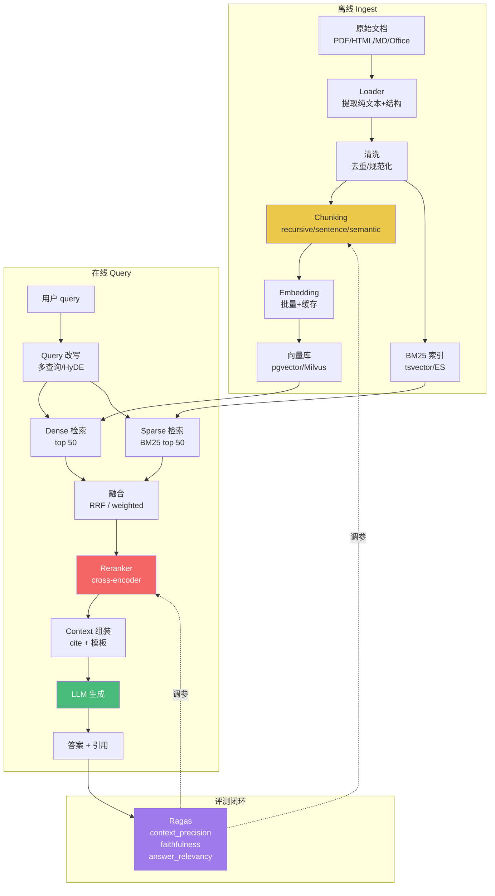
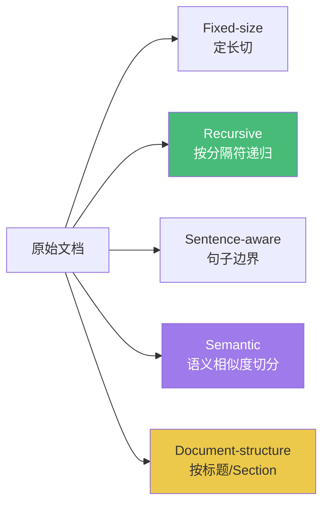
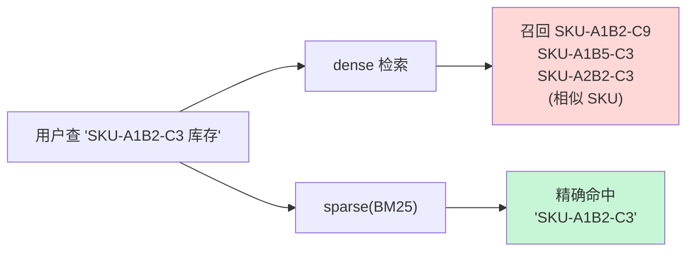
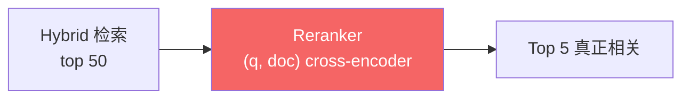
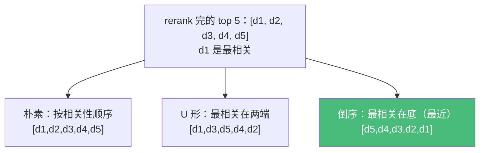
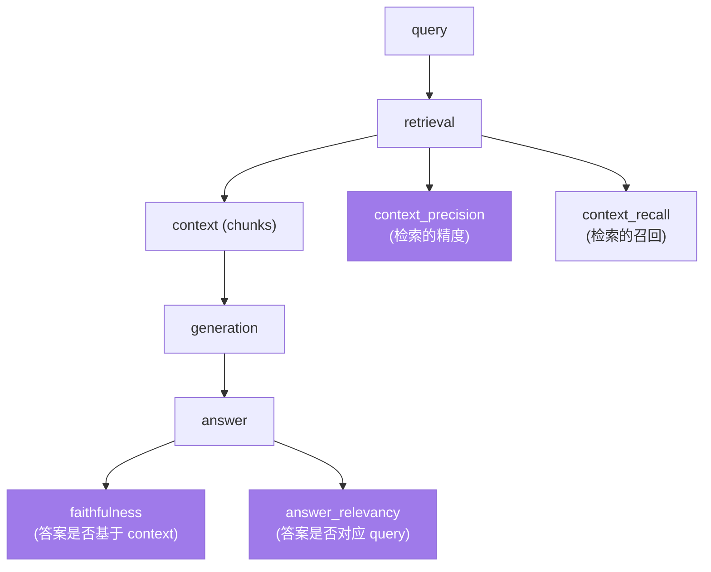
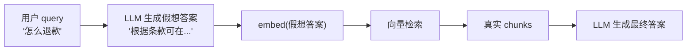
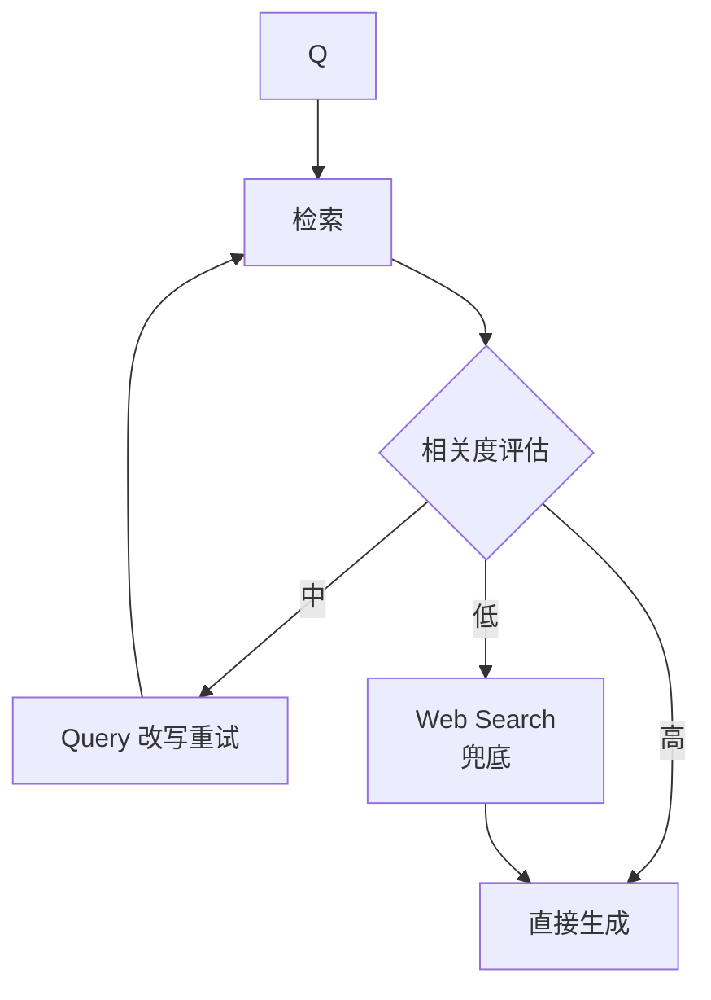

# 精通 RAG 架构：从 Chunking 到 Reranking 到评测

> 课程编号：A07
> 路线图来源：AI / LLM 后端工程 · 模块三 检索增强
> 难度：⭐⭐⭐⭐⭐
> 预计阅读时间：90 分钟
> 内容基准：2026 年 6 月

---

## 引言：RAG 不是"塞文档进 prompt"

2023 年的 RAG 教程长这样：

```go
// 把文档切 1000 字一段
chunks := splitText(doc, 1000)
// 全 embed
for _, c := range chunks {
    vec := embed(c)
    db.Insert(c, vec)
}
// 查询时
qvec := embed(query)
top5 := db.Search(qvec, 5)
prompt := strings.Join(top5, "\n") + "\n问题：" + query
answer := llm.Complete(prompt)
```

三年过去，**这套"朴素 RAG"在生产几乎必死**。原因不是单一的，而是一整条流水线每一环都会出错：

- **Chunking 选错**：固定 1000 字切，把表格切两半、把 "Section 3.2" 标题和正文分离
- **Embedding 模型选错**：用了 OpenAI ada-002（2022 年的产物），对中英文混排和长文档语义打折
- **检索召回不全**：纯向量搜索遇到"型号 SKU-A123"这类**精确字符串**直接漏召
- **Top-K 排序差**：召回正确文档，但排到第 8 位被截断
- **Lost in the middle**：放进 prompt 中段的关键信息被模型忽略
- **生成幻觉**：模型答了，但答案和检索内容无关；或者说"根据上下文……"然后自己编

2026 年 5 月的生产 RAG 系统至少包含：**document loader → 多策略 chunking → 混合检索（dense + BM25）→ reranker → context 组装（含 cite）→ 生成 → 评测闭环（Ragas / 人工标注）**。本章把这一整条拆开，每一环讲原理、Go 代码、生产坑、2026 现状。

读完之后你能：

- 设计一个适合自己语料的 chunking 策略
- 写一个 hybrid 检索（pgvector + tsvector / 外接 ES）
- 接入 Cohere Rerank / Voyage Rerank / bge-reranker
- 用 Ragas 三指标评测 RAG 系统
- 知道什么时候用 HyDE / Self-RAG / CRAG / Agentic RAG

---

## 第一章：RAG 全流程图

### 1.1 一图概览



### 1.2 三阶段 + 三时间维度

| 阶段 | 离线（Ingest） | 在线（Query） | 评测（Eval） |
|---|---|---|---|
| 主要任务 | 解析 / 切块 / 向量化 | 召回 / 重排 / 生成 | 自动指标 + 人工 |
| 时间预算 | 小时-天 | <1s（首字节） | 持续 |
| 失败代价 | 重跑全量 ingest | 用户当场不满 | 缓慢恶化 |

朴素 RAG 把所有精力放在"在线"，忽略 ingest 和 eval——这是 80% 失败案例的根因。

### 1.3 RAG 七大典型失败模式（FAILS）

记忆术：**FAILS-PE**

1. **F**ragmentation：chunk 切碎了，关键信息被切两半
2. **A**bsent：根本没召回，向量搜不到 / BM25 没匹配
3. **I**rrelevant：召回了一堆，但不相关的排在前面
4. **L**ost in the middle：关键 chunk 排到 prompt 中段，模型忽略
5. **S**tale：文档更新了，索引没更新，答陈旧信息
6. **P**rompt injection：检索内容里有"忽略之前指令"
7. **E**vidence missing：生成时不引用 chunk，幻觉

后面每章会标出处理的是哪个 F。

---

## 第二章：文档预处理——别把"垃圾"喂给 embedding

### 2.1 文档形态

生产中常见的输入：

| 格式 | 难度 | 工具（Go 生态） |
|---|---|---|
| Markdown / 纯文本 | ⭐ | 标准库 |
| HTML | ⭐⭐ | `golang.org/x/net/html`、`PuerkitoBio/goquery` |
| PDF（文字版） | ⭐⭐⭐ | `pdfcpu/pdfcpu`、`ledongthuc/pdf`、unstructured.io（外部服务） |
| PDF（扫描版） | ⭐⭐⭐⭐⭐ | OCR：Tesseract / 商用 OCR |
| Office（docx/pptx/xlsx） | ⭐⭐⭐⭐ | `unidoc/unioffice`、外部 LibreOffice headless |
| 网页（动态 JS） | ⭐⭐⭐⭐ | Chromedp、Playwright |

**真相**：Go 生态在 PDF / Office 解析能力远弱于 Python（PyMuPDF、unstructured.io、Docling）。**生产做法**通常是：

- Go 做编排、入库、检索
- Python 微服务 / 外部 API 做文档解析

或直接用 **unstructured.io** / **Reducto** / **LlamaParse** 等托管 API（按页计费）。

### 2.2 PDF 解析的两难

文字版 PDF 用 `pdfcpu` 提取文本：

```go
import "github.com/pdfcpu/pdfcpu/pkg/api"

// 提取文字到目录（按页一个 .txt）
err := api.ExtractContentFile(in, outDir, nil, nil)
```

但 PDF 提取的常见问题：

- **两栏 / 三栏布局**：文本按视觉顺序混乱（左右交错）
- **表格**：变成一行行散乱字符
- **页眉页脚**：重复出现，污染语义
- **图表**：纯图，没文字

2026 年解决方案：**Docling / LlamaParse 等带 layout-aware 解析**——用视觉模型识别表格、栏、标题。Go 项目通过 HTTP 调用。

### 2.3 HTML 清洗

```go
import "github.com/PuerkitoBio/goquery"

func htmlToText(html string) string {
    doc, _ := goquery.NewDocumentFromReader(strings.NewReader(html))
    // 去掉 script/style/nav/footer
    doc.Find("script, style, nav, footer, aside").Remove()
    // 主体提取（简单版本）
    main := doc.Find("article, main, .content").First()
    if main.Length() == 0 {
        main = doc.Find("body").First()
    }
    return strings.TrimSpace(main.Text())
}
```

更好的做法是 **Readability 算法**（Mozilla 开源），Go 移植有 `go-shiori/go-readability`。

### 2.4 元数据提取——不要只保留文本

每个 chunk 应该带元数据：

```go
type Document struct {
    ID       string
    Text     string
    Metadata Metadata
}

type Metadata struct {
    Source    string    // 原始 URL / 文件路径
    Title     string    // 文档标题
    Section   string    // 章节路径，如 "Chapter 3 > 3.2"
    Page      int       // PDF 页码
    UpdatedAt time.Time // 最后更新时间
    Author    string
    Lang      string
    Tags      []string
}
```

元数据有两大用途：

1. **检索过滤**：`metadata.lang = 'zh'` / `updated_at > 2025-01-01`
2. **生成时引用**：让模型在答案里标 `[Source: xxx p.12]`

---

## 第三章：Chunking 策略——RAG 第一性原理

> 治理失败模式：**F**ragmentation

### 3.1 为什么不能"一刀切"

设想一个销售合同条款：

> 3.2 退款政策
> 客户可在签约后 30 天内申请全额退款，但不包括以下情况：(a) 已使用超过 50% 套餐时长；(b) 涉及定制化开发；(c) 因客户违约导致的中止。

固定 200 字切 chunk：

- chunk1: "3.2 退款政策 客户可在签约后 30 天内申请全额退款，但不包括以下情况：(a) 已使用超过 50% 套餐时长；"
- chunk2: "(b) 涉及定制化开发；(c) 因客户违约导致的中止。"

用户问"涉及定制化开发能退款吗"，只召回 chunk2，**但 chunk2 没有"3.2 退款政策"上下文**，模型不知道这是什么的规则。

### 3.2 五种 chunking 策略



**Fixed-size（最差）**：

```go
func fixedSizeChunk(text string, size int) []string {
    var chunks []string
    runes := []rune(text)
    for i := 0; i < len(runes); i += size {
        end := i + size
        if end > len(runes) {
            end = len(runes)
        }
        chunks = append(chunks, string(runes[i:end]))
    }
    return chunks
}
```

只在**调试**或**完全无结构文本**（log 流）使用。

**Recursive（默认推荐）**：

按分隔符列表递归切分，靠前的优先（段落 → 句子 → 词）：

```go
type RecursiveSplitter struct {
    Separators []string // ["\n\n", "\n", "。", "！", "？", ".", "!", "?", " "]
    ChunkSize  int      // 目标长度（字符或 token）
    Overlap    int      // 相邻 chunk 重叠
}

func (r *RecursiveSplitter) Split(text string) []string {
    return r.split(text, r.Separators)
}

func (r *RecursiveSplitter) split(text string, seps []string) []string {
    if utf8.RuneCountInString(text) <= r.ChunkSize {
        return []string{text}
    }
    if len(seps) == 0 {
        // 兜底硬切
        return fixedSizeChunk(text, r.ChunkSize)
    }
    sep := seps[0]
    parts := strings.Split(text, sep)
    var chunks []string
    var buf strings.Builder
    for _, p := range parts {
        // 当前块加上新句还能放下？
        if utf8.RuneCountInString(buf.String())+utf8.RuneCountInString(p) <= r.ChunkSize {
            if buf.Len() > 0 {
                buf.WriteString(sep)
            }
            buf.WriteString(p)
        } else {
            // 已满，输出当前块
            if buf.Len() > 0 {
                chunks = append(chunks, buf.String())
                buf.Reset()
            }
            // 当前单 part 仍超长 → 递归用下一级分隔符
            if utf8.RuneCountInString(p) > r.ChunkSize {
                chunks = append(chunks, r.split(p, seps[1:])...)
            } else {
                buf.WriteString(p)
            }
        }
    }
    if buf.Len() > 0 {
        chunks = append(chunks, buf.String())
    }
    return r.withOverlap(chunks)
}

func (r *RecursiveSplitter) withOverlap(chunks []string) []string {
    if r.Overlap <= 0 || len(chunks) < 2 {
        return chunks
    }
    out := make([]string, 0, len(chunks))
    for i, c := range chunks {
        if i == 0 {
            out = append(out, c)
            continue
        }
        // 把上一个 chunk 末尾 N 字符拼到本 chunk 开头
        prev := []rune(chunks[i-1])
        start := len(prev) - r.Overlap
        if start < 0 {
            start = 0
        }
        out = append(out, string(prev[start:])+c)
    }
    return out
}
```

LangChain `RecursiveCharacterTextSplitter` 的核心逻辑就是这个。

**Sentence-aware**：

需要句子切分器：

- 英文：`jdkato/prose`、`neurosnap/sentences`
- 中文：用标点（`。！？`）配合"前后引号闭合"
- 混合：开源中文/英文 BERT 切句

```go
import "github.com/neurosnap/sentences/english"

tokenizer, _ := english.NewSentenceTokenizer(nil)
sentences := tokenizer.Tokenize(text)
```

**Semantic chunking**：

按"相邻句子语义相似度变化"切——相似度突降处即"主题切换"。LangChain `SemanticChunker` 的思路：

1. 句子级切分
2. 每个句子 embed
3. 相邻句子 cosine similarity
4. 找 similarity 局部最小值，作为分界

Go 伪代码：

```go
func semanticChunk(sentences []string, embedder Embedder, threshold float64) [][]string {
    embeds := embedder.BatchEmbed(sentences)
    var sims []float64
    for i := 0; i < len(embeds)-1; i++ {
        sims = append(sims, cosine(embeds[i], embeds[i+1]))
    }
    // 找 sims 中 < threshold 的位置 = 切点
    var cuts []int
    for i, s := range sims {
        if s < threshold {
            cuts = append(cuts, i+1) // 切在 i 和 i+1 之间 → 边界 i+1
        }
    }
    return splitByCuts(sentences, cuts)
}
```

**问题**：semantic chunking 需要先对**每个句子** embed，成本 / 延迟极高。生产慎用，或在 ingest 阶段离线计算。

**Document-structure（强烈推荐）**：

如果文档天然有结构（Markdown headings / HTML h1-h6 / PDF outline / 法律条款编号），**沿用结构切**：

```go
// Markdown header splitter
func splitByMarkdownHeaders(md string, levels []int) []Chunk {
    // 按 ## / ### 等切，并保留祖先标题作为元数据
    lines := strings.Split(md, "\n")
    var chunks []Chunk
    var cur Chunk
    var headerStack []string
    for _, l := range lines {
        if level := headerLevel(l); level > 0 && contains(levels, level) {
            if cur.Text != "" {
                chunks = append(chunks, cur)
            }
            // 更新 stack
            updateStack(&headerStack, level, l)
            cur = Chunk{
                Text:     "",
                Metadata: Metadata{Section: strings.Join(headerStack, " > ")},
            }
        } else {
            cur.Text += l + "\n"
        }
    }
    if cur.Text != "" {
        chunks = append(chunks, cur)
    }
    return chunks
}
```

每个 chunk 自带"我在哪个章节"，召回时**把章节名也加进生成 prompt**——大幅减少 fragmentation 问题。

### 3.3 ChunkSize 怎么选

这是 RAG 第一个争议问题。经验值：

| 用途 | ChunkSize | Overlap |
|---|---|---|
| QA（问答） | 300-800 tokens | 50-100 |
| 摘要 / 总结 | 1000-2000 tokens | 100-200 |
| 代码 / 技术文档 | 500-1500 tokens | 100 |
| 法律 / 长合同 | 按条款（数百到 2000） | 0（条款自含） |
| 对话记录 | 单次发言或多轮 | 0 |

**不要拍脑袋定**——后面讲评测，用 Ragas `context_precision` 试三组（小 / 中 / 大）。

### 3.4 父子文档（Parent-Child）

一个聪明的折中：

- **小 chunk** 用于检索（300 tokens，语义聚焦）
- **大 chunk / 整段** 用于生成（1500-3000 tokens，上下文丰富）

实现：每个小 chunk 关联一个 `parent_id`；召回小 chunk 后查父 chunk 给 LLM。

```go
type SmallChunk struct {
    ID       string
    Text     string
    Vector   []float32
    ParentID string
}

type ParentChunk struct {
    ID   string
    Text string
}

// 召回流程
smallTops := vectorDB.Search(qvec, 20)
parentIDs := uniqueParents(smallTops)
parents := parentDB.GetMany(parentIDs)
context := assembleContext(parents)
```

这套在 LangChain 叫 `ParentDocumentRetriever`，是生产 RAG 的常见模式。

---

## 第四章：Embedding 阶段优化

### 4.1 模型选型（2026 年 5 月主流）

详见 A06。简要列表：

| 模型 | 维度 | 价格 / 1M tokens | 备注 |
|---|---|---|---|
| OpenAI text-embedding-3-large | 3072（可缩） | $0.13 | 默认稳妥 |
| OpenAI text-embedding-3-small | 1536（可缩） | $0.02 | 便宜 6 倍 |
| Voyage voyage-3-large | 1024 | $0.18 | RAG 评测常居榜首 |
| Voyage voyage-3-lite | 512 | $0.02 | 低成本 |
| Cohere embed-v4 | 1536 | $0.10 | 多语言强 |
| BGE / BAAI bge-m3 | 1024 | 自托管 | 中文 + 多任务最佳开源 |
| BGE bge-large-zh-v1.5 | 1024 | 自托管 | 纯中文 |
| Jina jina-embeddings-v4 | 1024 | $0.06 | 长文档（8k tokens） |

### 4.2 批量 embedding

OpenAI 单请求最多 2048 inputs，但实际不建议放满（容易超 token 限）。**生产经验**：每批 32-128 inputs，并发 5-10。

```go
type EmbedClient struct {
    BatchSize  int
    Concurrent int
}

func (c *EmbedClient) BatchEmbed(ctx context.Context, texts []string) ([][]float32, error) {
    out := make([][]float32, len(texts))
    sem := make(chan struct{}, c.Concurrent)
    var wg sync.WaitGroup
    var firstErr atomic.Value

    for i := 0; i < len(texts); i += c.BatchSize {
        end := i + c.BatchSize
        if end > len(texts) {
            end = len(texts)
        }
        wg.Add(1)
        sem <- struct{}{}
        go func(start, end int) {
            defer wg.Done()
            defer func() { <-sem }()

            batch := texts[start:end]
            vecs, err := c.callOpenAI(ctx, batch)
            if err != nil {
                firstErr.CompareAndSwap(nil, err)
                return
            }
            for j, v := range vecs {
                out[start+j] = v
            }
        }(i, end)
    }
    wg.Wait()
    if err := firstErr.Load(); err != nil {
        return nil, err.(error)
    }
    return out, nil
}
```

### 4.3 缓存——embedding 是"内容的函数"

同一段文本永远 embed 出同一个向量（同模型同版本）。值得缓存：

```go
type CachedEmbedder struct {
    Inner Embedder
    Cache *redis.Client
    Model string
}

func (c *CachedEmbedder) Embed(ctx context.Context, text string) ([]float32, error) {
    key := fmt.Sprintf("emb:%s:%x", c.Model, sha256.Sum256([]byte(text)))
    if val, err := c.Cache.Get(ctx, key).Bytes(); err == nil {
        return bytesToVec(val), nil
    }
    vec, err := c.Inner.Embed(ctx, text)
    if err != nil {
        return nil, err
    }
    c.Cache.Set(ctx, key, vecToBytes(vec), 7*24*time.Hour)
    return vec, nil
}
```

**何时缓存**：

- **Query embedding**：用户重复问题很多，命中率可达 30-60%
- **Chunk embedding**：增量 ingest 场景，避免重复 embed 未变更文档

key 包含模型名——换模型时旧缓存自动失效。

### 4.4 切换 embedding 模型 = 全量重 embed

**这是新手 #1 大坑**。Embedding 模型的向量空间**不互通**：OpenAI ada-002 的 [0.1, 0.2, ...] 与 voyage-3 的 [0.1, 0.2, ...] 完全不是一个东西。

切换模型必须：

1. 重新 embed 全量
2. 单独建新索引或新 collection
3. 切流量（蓝绿）

**绝不**能新文档用新模型、老文档用老模型混搭——召回完全错乱。

---

## 第五章：检索——dense / sparse / hybrid

> 治理失败模式：**A**bsent

### 5.1 Dense（向量）检索的盲点

向量检索的本质：**找语义相似**。它对以下情况强：

- "退款政策" ↔ "如何申请退款"
- "认证" ↔ "OAuth login"

但弱在**精确字符串、罕见词、专有名词**：

- "SKU-A1B2-C3"——这种字符串向量化后会泛化，召回一堆相似但不同的 SKU
- "Section 3.2"——模型不一定 embedding 出"这是第 3 章第 2 节"
- 公司名、人名、缩写——OOV（out of vocabulary）的"长尾"



### 5.2 Sparse（BM25）补足

BM25 详见 [Elasticsearch 07 章](../elasticsearch/07-精通-BM25-与-Reranking.md)。要点：

- 基于词频 + IDF
- 精确字符串、专业术语强
- 同义词、近义词弱（"car" ↔ "automobile" 召不回）

Postgres 内置 `tsvector` 可以做 BM25 近似（其实是 `ts_rank`，不是真 BM25 但效果相近）；要真 BM25 用 ParadeDB 扩展或外接 ES / Tantivy / Bleve。

```sql
-- Postgres tsvector + dense vector 同库（pgvector）
CREATE TABLE chunks (
    id BIGSERIAL PRIMARY KEY,
    text TEXT NOT NULL,
    text_search tsvector GENERATED ALWAYS AS (to_tsvector('simple', text)) STORED,
    embedding vector(1536),
    metadata JSONB
);

CREATE INDEX ON chunks USING GIN(text_search);
CREATE INDEX ON chunks USING ivfflat (embedding vector_cosine_ops);
```

### 5.3 Hybrid——融合 dense + sparse

两种主流融合：

#### 5.3.1 RRF（Reciprocal Rank Fusion）

不看分数绝对值，只看名次：

```
RRF_score(d) = Σ_q  1 / (k + rank_q(d))
```

`k` 一般取 60。直觉：dense 排第 1 的得 1/61，sparse 排第 1 的也得 1/61，相加。两路都靠前 → 总分高。

Go 实现：

```go
type ScoredDoc struct {
    ID    string
    Score float64
}

func ReciprocalRankFusion(rankings [][]ScoredDoc, k float64) []ScoredDoc {
    score := make(map[string]float64)
    seen := make(map[string]struct{})
    for _, r := range rankings {
        for rank, d := range r {
            score[d.ID] += 1.0 / (k + float64(rank+1))
            seen[d.ID] = struct{}{}
        }
    }
    out := make([]ScoredDoc, 0, len(seen))
    for id, s := range score {
        out = append(out, ScoredDoc{ID: id, Score: s})
    }
    sort.Slice(out, func(i, j int) bool { return out[i].Score > out[j].Score })
    return out
}
```

#### 5.3.2 Weighted Sum

分数归一化（min-max）后加权：

```
score(d) = α × normalize(dense_score) + (1-α) × normalize(bm25_score)
```

`α` 在 0.5-0.7 区间常见，需要评测调。

**对比**：

| 方法 | 优点 | 缺点 |
|---|---|---|
| RRF | 无需归一化、稳定、参数少 | 丢失分数信息 |
| Weighted | 可调权、保留分数 | 归一化敏感、需调 α |

**默认 RRF**——简单稳，再说一遍：reranker 才是真正决定分数的下一环。

### 5.4 元数据过滤——pre-filter vs post-filter

```sql
-- pre-filter (推荐)：在向量索引上加过滤
SELECT id, text FROM chunks
WHERE metadata->>'lang' = 'zh'
  AND updated_at > '2025-01-01'
ORDER BY embedding <=> $1
LIMIT 50;
```

但 pgvector 早期版本对带 WHERE 的向量查询性能差（先全扫再过滤）。新版本 + HNSW 索引 + `iterative_scan` 已经大幅改善（2024 年 10 月发布的 pgvector 0.8+）。

**Pinecone / Milvus / Qdrant** 都内置 metadata filter，性能好。**自托管选 Milvus / Qdrant / Weaviate / Vespa**，托管选 Pinecone。

---

## 第六章：Reranking——RAG 的"质量飞跃"

> 治理失败模式：**I**rrelevant

### 6.1 为什么需要 reranker

dense + sparse 召回 top 50，**真正相关的可能在第 30 位**——直接截前 5 就漏了。Reranker 是 cross-encoder：

- 把 (query, candidate) 一起喂模型
- 输出 0-1 的相关度分
- 重排，取真正相关的前 5-10



为什么向量检索本身不够好？**Bi-encoder（embedding）vs Cross-encoder（rerank）**：

| | Bi-encoder | Cross-encoder |
|---|---|---|
| 推理方式 | q 和 doc 分别 encode → cosine | q 和 doc 拼起来一起过 transformer |
| 速度 | 极快（cosine 索引） | 慢（每对都要前向） |
| 精度 | 中 | 高 |
| 适用 | 召回（百万-千万规模） | 重排（几十-几百） |

### 6.2 三大 reranker 选型

| 服务 / 模型 | 类型 | 价格 / 性能 | 备注 |
|---|---|---|---|
| Cohere Rerank v3.5 | 托管 API | $2.00 / 1k 搜索 | 多语言强、business 默认 |
| Voyage rerank-2.5 | 托管 API | $0.05 / 1M tokens | 多语言、性价比高 |
| Jina jina-reranker-v3 | 托管 / 自托管 | 自托管免费 | 8k 上下文 |
| BAAI bge-reranker-v2-m3 | 自托管 | 中等性能 | 中文 + 多语言 |
| BAAI bge-reranker-large | 自托管 | 重 / 精度高 | 仅英文为佳 |
| 本地 mxbai-rerank-large-v2 | 自托管 | 2026 新出 | 与 Cohere 接近 |

### 6.3 Cohere Rerank Go 实现

```go
import "github.com/cohere-ai/cohere-go/v2"

type CohereReranker struct {
    Client *cohere.Client
    Model  string // "rerank-v3.5"
}

func (r *CohereReranker) Rerank(ctx context.Context, query string, docs []string, topN int) ([]int, []float64, error) {
    resp, err := r.Client.V2.Rerank(ctx, &cohere.V2RerankRequest{
        Model:     r.Model,
        Query:     query,
        Documents: docs,
        TopN:      &topN,
    })
    if err != nil {
        return nil, nil, err
    }
    idxs := make([]int, len(resp.Results))
    scores := make([]float64, len(resp.Results))
    for i, r := range resp.Results {
        idxs[i] = r.Index
        scores[i] = r.RelevanceScore
    }
    return idxs, scores, nil
}
```

### 6.4 自托管 bge-reranker

Triton / TGI / vLLM 起服务，通过 HTTP 调用：

```go
type LocalReranker struct {
    Endpoint string // "http://reranker:8080/rerank"
}

type rerankReq struct {
    Query string   `json:"query"`
    Docs  []string `json:"docs"`
}

type rerankResp struct {
    Scores []float64 `json:"scores"`
}

func (r *LocalReranker) Rerank(ctx context.Context, q string, docs []string, topN int) ([]int, []float64, error) {
    body, _ := json.Marshal(rerankReq{Query: q, Docs: docs})
    req, _ := http.NewRequestWithContext(ctx, "POST", r.Endpoint, bytes.NewReader(body))
    req.Header.Set("Content-Type", "application/json")
    resp, err := http.DefaultClient.Do(req)
    if err != nil {
        return nil, nil, err
    }
    defer resp.Body.Close()
    var rr rerankResp
    if err := json.NewDecoder(resp.Body).Decode(&rr); err != nil {
        return nil, nil, err
    }
    // 排序选 topN
    type pair struct{ idx int; score float64 }
    pairs := make([]pair, len(rr.Scores))
    for i, s := range rr.Scores {
        pairs[i] = pair{i, s}
    }
    sort.Slice(pairs, func(i, j int) bool { return pairs[i].score > pairs[j].score })
    if topN > len(pairs) {
        topN = len(pairs)
    }
    idxs := make([]int, topN)
    scores := make([]float64, topN)
    for i := 0; i < topN; i++ {
        idxs[i] = pairs[i].idx
        scores[i] = pairs[i].score
    }
    return idxs, scores, nil
}
```

### 6.5 Latency / Recall 权衡

Rerank 是 RAG 流水线**延迟最大的一环**：

| 候选数 | Cohere v3.5 | bge-reranker-v2 (GPU) | bge-reranker (CPU) |
|---|---|---|---|
| 25 | 80-150ms | 50-100ms | 500ms+ |
| 50 | 120-250ms | 100-200ms | 1s+ |
| 100 | 200-400ms | 200-400ms | 2s+ |
| 200 | 400-700ms | 400-800ms | 4s+ |

**经验**：召回 top 50 → rerank → top 5。再多召回收益递减。

**早期截断技巧**：分数 < threshold（0.3-0.5）的直接丢，可能 top N 不足，但不喂 LLM 垃圾。

---

## 第七章：上下文组装与 prompt 模板

> 治理失败模式：**L**ost in the middle、**E**vidence missing

### 7.1 "Lost in the middle" 现象

Liu et al. 2023 论文经典发现：

> 把"答案所在 chunk"放在 prompt 不同位置：
> 头部 / 尾部 → 模型准确率 70%+
> 中段（第 5/10 位置）→ 准确率掉到 50%

虽然 2024-2026 模型大幅改善（特别是长上下文模型 Claude / Gemini），**但中段惩罚没完全消失**。

### 7.2 排列策略



经验：

- **GPT / Claude 长上下文**：U 形或倒序更稳
- **短上下文（< 8k）**：随便都差不多
- **超长上下文（> 100k）**：必须 reranker 控制总量，否则成本爆炸

### 7.3 Prompt 模板（含引用）

让模型**强制引用**——大幅减少幻觉：

```go
const RAGPromptTemplate = `你是 {{.Persona}}。基于下面给出的"参考资料"回答用户问题。

规则：
1. 只用参考资料里的信息，不要凭借自身知识回答。
2. 如果参考资料不足以回答，明确说"根据提供的资料无法回答"。
3. 在每个事实陈述后用 [n] 标注引用编号，n 对应资料的序号。
4. 用简体中文回答。

参考资料：
{{range $i, $doc := .Docs}}
[{{add $i 1}}] (来源: {{$doc.Source}})
{{$doc.Text}}
---
{{end}}

用户问题：{{.Query}}

回答：`
```

用 Anthropic 的话，**XML 标签**形式更稳：

```go
const ClaudeRAGTemplate = `<documents>
{{range $i, $doc := .Docs}}
<document index="{{add $i 1}}">
<source>{{$doc.Source}}</source>
<content>{{$doc.Text}}</content>
</document>
{{end}}
</documents>

<question>{{.Query}}</question>

请基于 <documents> 中的内容回答 <question>。每个事实后用 [n] 引用对应文档编号。`
```

### 7.4 Context 截断

Token 预算受限时（特别是低成本模型）：

```go
func (a *Assembler) Assemble(query string, docs []Doc, budget int) string {
    tmpl := mustParseTemplate()
    var buf bytes.Buffer
    used := 0
    selected := make([]Doc, 0)
    for _, d := range docs {
        // 估算 token：1 token ≈ 0.75 个英文词 ≈ 1.5 个汉字
        cost := estimateTokens(d.Text) + 30 // 头尾标签开销
        if used+cost > budget {
            break
        }
        selected = append(selected, d)
        used += cost
    }
    tmpl.Execute(&buf, map[string]any{
        "Docs":  selected,
        "Query": query,
    })
    return buf.String()
}
```

### 7.5 Citations API（Anthropic 原生）

2025 年起 Anthropic Messages API 支持 **Citations**：直接传 document blocks，模型回答自带 cite，无需手动 prompt 教学。

```go
msg, _ := client.Messages.New(ctx, anthropic.MessageNewParams{
    Model:     anthropic.ModelClaudeSonnet4_6,
    MaxTokens: 1024,
    Messages: []anthropic.MessageParam{
        anthropic.NewUserMessage(
            anthropic.NewDocumentBlock(
                anthropic.PlainTextSource{Data: doc1Text, MediaType: "text/plain"},
                anthropic.DocumentBlockParam{Citations: anthropic.CitationsConfigParam{Enabled: anthropic.Bool(true)}},
            ),
            anthropic.NewDocumentBlock(/* doc2 */),
            anthropic.NewTextBlock("基于文档回答：什么是 BM25？"),
        ),
    },
})

// 响应里每段 text block 会带 citations: [{document_index, start, end, ...}]
for _, block := range msg.Content {
    if block.Type == "text" {
        fmt.Println(block.Text)
        for _, c := range block.Citations {
            fmt.Printf("  引用 doc[%d] %d-%d\n", c.DocumentIndex, c.StartCharIndex, c.EndCharIndex)
        }
    }
}
```

OpenAI Responses API 也有类似的 `file_citation`。**生产 RAG 强烈用原生 citations 而非 prompt 教学**——准确性高、机器可解析。

---

## 第八章：评测——RAG 的指南针

### 8.1 没有评测 = 没有 RAG

新手最大错觉：**"我看着结果还行，应该 OK"**。

- 你看到的 case：5 个
- 用户真实查询：每天 5000 个
- 主观 vs 客观：你看舒服 ≠ 用户满意

**评测必须在 day 1 就有**。哪怕只是 50 条手工标注的 (query, expected_answer)，也比没有强。

### 8.2 Ragas 三大指标

[Ragas](https://github.com/explodinggradients/ragas)（Python 库）成了 RAG 评测事实标准：



| 指标 | 定义 | 计算 |
|---|---|---|
| `context_precision` | 检索的 top-K 中真正相关的比例 | LLM 评：每个 chunk 是否对回答有用 |
| `context_recall` | 标准答案 ground truth 的事实，多少能在 context 找到 | LLM 评：把 GT 拆事实，逐条检查 |
| `faithfulness` | 答案的每个事实是否能从 context 推出 | LLM 评：拆答案 → 对应 context |
| `answer_relevancy` | 答案是否在回答 query 本身 | LLM 倒推 query：相似度 |

**注意**：Ragas 用 LLM 做评判（GPT-4 / Claude）→ **评测本身有成本和噪声**。生产做法是：

- 小评测集（50-200 条）用 LLM-as-judge
- 大评测集（1000+ 条）用更便宜模型 + 抽样人工复审
- 关键指标（如 `faithfulness`）必须有人工标注 baseline 校准

### 8.3 自建评测集

Ragas 提供合成数据生成器：给定文档，自动出 (query, answer, context) 三元组。但效果有限——**最有价值的评测集是真实用户 query**。

```go
// 评测集结构
type EvalCase struct {
    ID            string   `json:"id"`
    Query         string   `json:"query"`
    GroundTruth   string   `json:"ground_truth"` // 人工标注的标准答案
    GoldenChunks  []string `json:"golden_chunks"` // 必须召回的 chunk ID
    Difficulty    string   `json:"difficulty"`    // easy/medium/hard
    Category      string   `json:"category"`      // FAQ / 政策 / 技术
}
```

收集途径：

1. **客服记录 / 工单**——真实问题
2. **生产 LLM Gateway 日志**——脱敏后取代表性 query
3. **AB 失败案例**——用户点踩 / 投诉

### 8.4 Go 端调用 Ragas

Ragas 是 Python，Go 项目通过 HTTP 服务包装。或者，自己实现简化版（核心是 LLM-as-judge）：

```go
type Judge struct {
    LLM Client // Claude / GPT
}

// 简化 faithfulness：把答案 statements 拆出，逐条问 LLM 是否能从 context 推出
func (j *Judge) Faithfulness(ctx context.Context, answer, retrievedCtx string) (float64, error) {
    statements, err := j.extractStatements(ctx, answer)
    if err != nil {
        return 0, err
    }
    if len(statements) == 0 {
        return 0, nil
    }
    var supported int
    for _, s := range statements {
        ok, err := j.isSupported(ctx, s, retrievedCtx)
        if err != nil {
            return 0, err
        }
        if ok {
            supported++
        }
    }
    return float64(supported) / float64(len(statements)), nil
}

func (j *Judge) extractStatements(ctx context.Context, answer string) ([]string, error) {
    prompt := fmt.Sprintf(`把下面回答拆成独立、原子的事实陈述。每条一行。不要补充内容。

回答：%s

陈述：`, answer)
    out, err := j.LLM.Complete(ctx, prompt)
    if err != nil {
        return nil, err
    }
    var stmts []string
    for _, line := range strings.Split(out, "\n") {
        if s := strings.TrimSpace(line); s != "" {
            stmts = append(stmts, s)
        }
    }
    return stmts, nil
}

func (j *Judge) isSupported(ctx context.Context, stmt, retrievedCtx string) (bool, error) {
    prompt := fmt.Sprintf(`下面"参考资料"是否能直接推出"陈述"？只回答 YES 或 NO。

参考资料：%s

陈述：%s

回答：`, retrievedCtx, stmt)
    out, err := j.LLM.Complete(ctx, prompt)
    if err != nil {
        return false, err
    }
    return strings.HasPrefix(strings.ToUpper(strings.TrimSpace(out)), "YES"), nil
}
```

### 8.5 评测在 CI 里跑

每次改 chunking / rerank / prompt 都跑一遍：

```yaml
# .github/workflows/rag-eval.yml
- name: Run RAG eval
  run: |
    go run ./cmd/rag-eval \
      --dataset ./eval/cases.json \
      --output ./eval/result.json
    go run ./cmd/rag-eval/compare \
      --baseline ./eval/baseline.json \
      --current ./eval/result.json \
      --threshold 0.02
```

如果新版本相比 baseline 任一指标降 > 2%，CI 红灯。

---

## 第九章：高级 RAG 模式

### 9.1 HyDE（Hypothetical Document Embedding）

**问题**：用户 query 太短，向量化后语义太"贫瘠"，检索差。

**思路**：用 LLM 先**生成一个假想答案**，对答案 embed，用答案的向量去检索文档。



适用：query 很短 / 抽象 / 噪声多。**代价**：多一次 LLM 调用 + 假想答案错了反而误导。

### 9.2 Multi-query

**问题**：单一 query 角度受限。

**思路**：让 LLM 把 query 改写成 3-5 个变体，每个都检索，结果合并去重。

```go
prompt := `把下面的查询改写成 5 个不同角度的相关查询。每行一个。

查询：%s`

variants := llm.Complete(prompt, query)
allHits := []ScoredDoc{}
for _, v := range strings.Split(variants, "\n") {
    hits := retriever.Search(v, 20)
    allHits = append(allHits, hits...)
}
unique := dedupAndRerank(allHits)
```

### 9.3 Self-RAG（自反思 RAG）

Asai et al. 2023：让 LLM 学会**自己决定**要不要检索、检索后**自己评估**是否相关。

实操方式（不需要 fine-tune）：

1. 第一步问 LLM：这个 query 需要外部知识吗？（YES/NO）
2. 需要 → 检索 → 第二步问 LLM：召回的内容相关吗？
3. 不相关 → 不用，避免污染

```go
func selfRAG(ctx context.Context, query string) (string, error) {
    if needsRetrieval(ctx, query) {
        docs := retrieve(query)
        if relevant(ctx, query, docs) {
            return generateWithContext(ctx, query, docs), nil
        }
    }
    return generateDirect(ctx, query), nil
}
```

### 9.4 Corrective RAG（CRAG）

升级版：检索质量差时**自动切换知识源**（如调用 web search 兜底）。



### 9.5 Agentic RAG（2026 主流方向）

把 RAG 当成 Agent 的一个 tool。让模型**自主决定**：

- 何时检索
- 用什么 query 检索
- 何时检索多次
- 何时停止

```
User: 公司 2025 年 Q3 营收和同行对比如何？

Agent thinking:
  1. 检索"公司 2025 Q3 营收" → 得财报数字
  2. 检索"同行 2025 Q3 营收对比" → 不足
  3. 调 web_search("行业 Q3 报告 2025")
  4. 综合输出
```

这部分详见 A09 Agent 章。**RAG 不再是孤立的流水线，而是 Agent 的检索能力**——这是 2026 年最大变化。

---

## 第十章：Go 实战——pgvector + Claude 最小 RAG

### 10.1 schema

```sql
CREATE EXTENSION IF NOT EXISTS vector;

CREATE TABLE documents (
    id BIGSERIAL PRIMARY KEY,
    source TEXT,
    section TEXT,
    text TEXT NOT NULL,
    text_search tsvector GENERATED ALWAYS AS (to_tsvector('simple', text)) STORED,
    embedding vector(1536),
    metadata JSONB,
    created_at TIMESTAMPTZ DEFAULT NOW()
);

CREATE INDEX docs_emb_idx ON documents USING hnsw (embedding vector_cosine_ops);
CREATE INDEX docs_search_idx ON documents USING GIN (text_search);
CREATE INDEX docs_meta_idx ON documents USING GIN (metadata);
```

### 10.2 ingest

```go
package main

import (
    "context"
    "fmt"

    "github.com/jackc/pgx/v5/pgxpool"
)

type Ingester struct {
    DB       *pgxpool.Pool
    Embedder Embedder
    Splitter *RecursiveSplitter
}

func (in *Ingester) Ingest(ctx context.Context, source, text string) error {
    chunks := in.Splitter.Split(text)
    vecs, err := in.Embedder.BatchEmbed(ctx, chunks)
    if err != nil {
        return fmt.Errorf("embed: %w", err)
    }
    batch := pgxBatch()
    for i, c := range chunks {
        batch.Queue(`
            INSERT INTO documents (source, text, embedding, metadata)
            VALUES ($1, $2, $3, $4)`,
            source, c, pgvector.NewVector(vecs[i]), map[string]any{"chunk_idx": i})
    }
    return in.DB.SendBatch(ctx, batch).Close()
}
```

### 10.3 hybrid 检索

```go
type Retriever struct {
    DB       *pgxpool.Pool
    Embedder Embedder
    Reranker Reranker
}

type Hit struct {
    ID      int64
    Source  string
    Text    string
    Score   float64
}

func (r *Retriever) Retrieve(ctx context.Context, query string, k int) ([]Hit, error) {
    qvec, err := r.Embedder.Embed(ctx, query)
    if err != nil {
        return nil, err
    }

    // dense top 50
    dense, err := r.denseSearch(ctx, qvec, 50)
    if err != nil {
        return nil, err
    }
    // sparse top 50
    sparse, err := r.sparseSearch(ctx, query, 50)
    if err != nil {
        return nil, err
    }

    // RRF 融合
    fused := reciprocalRankFusion([][]Hit{dense, sparse}, 60)

    // 取前 25 喂 reranker
    if len(fused) > 25 {
        fused = fused[:25]
    }
    docs := make([]string, len(fused))
    for i, h := range fused {
        docs[i] = h.Text
    }
    idxs, scores, err := r.Reranker.Rerank(ctx, query, docs, k)
    if err != nil {
        return nil, err
    }
    out := make([]Hit, len(idxs))
    for i, idx := range idxs {
        out[i] = fused[idx]
        out[i].Score = scores[i]
    }
    return out, nil
}

func (r *Retriever) denseSearch(ctx context.Context, qvec []float32, k int) ([]Hit, error) {
    rows, err := r.DB.Query(ctx, `
        SELECT id, source, text, 1 - (embedding <=> $1) AS score
        FROM documents
        ORDER BY embedding <=> $1
        LIMIT $2`, pgvector.NewVector(qvec), k)
    if err != nil {
        return nil, err
    }
    defer rows.Close()
    var hits []Hit
    for rows.Next() {
        var h Hit
        if err := rows.Scan(&h.ID, &h.Source, &h.Text, &h.Score); err != nil {
            return nil, err
        }
        hits = append(hits, h)
    }
    return hits, nil
}

func (r *Retriever) sparseSearch(ctx context.Context, query string, k int) ([]Hit, error) {
    rows, err := r.DB.Query(ctx, `
        SELECT id, source, text, ts_rank(text_search, plainto_tsquery('simple', $1)) AS score
        FROM documents
        WHERE text_search @@ plainto_tsquery('simple', $1)
        ORDER BY score DESC
        LIMIT $2`, query, k)
    if err != nil {
        return nil, err
    }
    defer rows.Close()
    var hits []Hit
    for rows.Next() {
        var h Hit
        if err := rows.Scan(&h.ID, &h.Source, &h.Text, &h.Score); err != nil {
            return nil, err
        }
        hits = append(hits, h)
    }
    return hits, nil
}
```

### 10.4 生成（Claude + citations）

```go
import "github.com/anthropics/anthropic-sdk-go"

type Generator struct {
    Client anthropic.Client
    Model  anthropic.Model
}

func (g *Generator) Answer(ctx context.Context, query string, hits []Hit) (string, []Citation, error) {
    blocks := []anthropic.ContentBlockParamUnion{}
    for _, h := range hits {
        blocks = append(blocks, anthropic.NewDocumentBlock(
            anthropic.PlainTextSourceParam{Data: h.Text, MediaType: "text/plain"},
            anthropic.DocumentBlockParam{
                Title:     anthropic.String(h.Source),
                Citations: anthropic.CitationsConfigParam{Enabled: anthropic.Bool(true)},
            },
        ))
    }
    blocks = append(blocks, anthropic.NewTextBlock(query))

    msg, err := g.Client.Messages.New(ctx, anthropic.MessageNewParams{
        Model:     g.Model,
        MaxTokens: 1024,
        Messages:  []anthropic.MessageParam{anthropic.NewUserMessage(blocks...)},
    })
    if err != nil {
        return "", nil, err
    }
    var text string
    var cites []Citation
    for _, b := range msg.Content {
        if b.Type == "text" {
            text += b.Text
            for _, c := range b.Citations {
                cites = append(cites, Citation{
                    Source: hits[c.DocumentIndex].Source,
                    Start:  c.StartCharIndex,
                    End:    c.EndCharIndex,
                })
            }
        }
    }
    return text, cites, nil
}
```

### 10.5 串起来

```go
func main() {
    ctx := context.Background()
    db := pgxpool.New(ctx, os.Getenv("PG_DSN"))
    embedder := NewOpenAIEmbedder(os.Getenv("OPENAI_API_KEY"))
    reranker := NewCohereReranker(os.Getenv("COHERE_API_KEY"))
    claude := anthropic.NewClient()

    retriever := &Retriever{DB: db, Embedder: embedder, Reranker: reranker}
    gen := &Generator{Client: claude, Model: anthropic.ModelClaudeSonnet4_6}

    query := "我们的退款政策具体是什么？"
    hits, _ := retriever.Retrieve(ctx, query, 5)
    answer, cites, _ := gen.Answer(ctx, query, hits)

    fmt.Println("答案:", answer)
    for _, c := range cites {
        fmt.Printf("  引用 %s (%d-%d)\n", c.Source, c.Start, c.End)
    }
}
```

约 300 行 Go 代码就有一个可演示的 RAG 系统。生产化时还要加：trace、缓存、错误处理、超时、降级。

---

## 第十一章：生产实践

### 11.1 增量更新

不能每次更新文档都全量重 embed。设计 ingest 接口：

```go
type Ingester interface {
    Upsert(ctx context.Context, source string, text string) error
    Delete(ctx context.Context, source string) error
}
```

Upsert 时：

1. 查 source 已有的 chunks → 删
2. 新文本切 chunk
3. 计算每个 chunk 的内容哈希
4. 与旧 chunks 哈希比对：完全相同的 skip embed
5. 新增的 chunks embed + 插入

**节省点**：内容没变的 chunk 不重 embed（embedding 调用是金钱）。

### 11.2 版本化 / Shadow Indexing

切换 embedding 模型 / chunking 策略 → 不能影响线上。做法：

```
documents_v1  (生产用，使用 voyage-3 + recursive_500)
documents_v2  (后台 ingest，使用 voyage-3.5 + semantic)
```

灰度切流：app 配置切表名。

更高级用 view + 标签：

```sql
CREATE VIEW documents AS
SELECT * FROM documents_v2 WHERE version = 'v2'
UNION ALL
SELECT * FROM documents_v1 WHERE version = 'v1';
```

### 11.3 A/B 评测

线上 2% 流量分到新版本检索，对比关键指标：

- 自动指标：faithfulness、relevancy（如果客户端有反馈）
- 用户指标：点击率、跳出、人工"满意"

Langfuse / Arize Phoenix 支持 RAG trace 录制 + 对比视图。

### 11.4 监控（结合 A13）

每个 RAG 请求应记录：

| 字段 | 说明 |
|---|---|
| query | 原始 query |
| retrieved_count | 检索到的 chunks 数 |
| top_score | 最高分 |
| reranker_latency_ms | rerank 耗时 |
| total_latency_ms | 总耗时 |
| token_in / token_out | LLM token |
| has_citation | 是否产生引用 |
| eval_faithfulness | 抽样 Ragas 得分 |

异常告警：

- top_score < 0.3 (相关度太低 → 可能 query 不在知识范围)
- has_citation == false 但 retrieved_count > 0 (模型可能在幻觉)
- 总延迟 P99 > 5s

### 11.5 多租户隔离

SaaS RAG 必须租户隔离：

```sql
-- pre-filter
SELECT ... FROM documents
WHERE tenant_id = $1
  AND embedding <=> $2 < 0.5
ORDER BY embedding <=> $2 LIMIT 50;
```

切忌跨租户**串数据**——客户最敏感。Pinecone / Weaviate / Qdrant 都支持 namespace / collection 级隔离，比同表 + tenant_id 更稳。

---

## 第十二章：陷阱清单

| # | 陷阱 | 对策 |
|---|---|---|
| 1 | 切 chunk 时不保留 section 标题 | 用 document-structure 或父子文档 |
| 2 | 切完忘记 overlap | 至少 10-20% overlap |
| 3 | 换 embedding 模型不全量重 embed | 强制蓝绿、版本化表 |
| 4 | 只用 dense，遇到 SKU / 专有名词漏召 | 必上 hybrid（BM25 + dense） |
| 5 | rerank 候选数太少（< 20） | 召回 50-100，rerank 5-10 |
| 6 | rerank 用了，但所有结果都进 prompt | 设阈值，分数太低不传 |
| 7 | prompt 没要求引用 | 用 Citations API 或 prompt 强制 [n] |
| 8 | 用户 query 直接 embed，忽略改写 | HyDE / multi-query |
| 9 | 评测在生产凭直觉 | 建评测集 + Ragas + CI |
| 10 | 文档更新不入索引 | watch + 增量 ingest pipeline |
| 11 | 全量 ingest 不算成本 | 估算：1M docs × $0.1/M tokens ≈ $$$ |
| 12 | pgvector 不建 HNSW 索引 | `CREATE INDEX USING hnsw` |
| 13 | top_K 截断没 token 控制 | 按 token budget 装 chunks |
| 14 | 把检索内容当 LLM 指令处理 | 用 XML 标签 / role 隔离避免 prompt injection |
| 15 | retrieved chunks 不去重 | 同 doc 多个 chunk 命中 → 合并 / 去重 |
| 16 | 长文档放进 prompt 中段 | U 形 / 倒序排列 |
| 17 | 评测只看准确度，不看延迟 | 加 P95/P99 延迟 SLO |
| 18 | 全靠 vector DB，不考虑数据库一致性 | 用 outbox / CDC 同步业务表到向量库 |
| 19 | 中文用英文 embedding 模型 | bge-m3 / voyage / 多语言模型 |
| 20 | 同义词扩展依赖 LLM | 用 BM25 + 同义词词典更便宜 |

---

## 第十三章：2026 现状

### 13.1 ColBERT / ColPali：late interaction 上位

ColBERT（2020）的"晚交互"理念在 2024-2025 重新走红：

- 传统 dense：query / doc 各编码成 **1 个向量**
- ColBERT：query / doc 编码成 **多个 token 级向量**，检索时做 token-level 最大匹配

效果：召回质量逼近 cross-encoder，但速度接近 bi-encoder。代价：存储成本 10-100x（每 token 一个向量）。

**ColPali**（2024）把这套用到**多模态文档**：直接 embed 文档**图像页**（不需 OCR），检索时做 token-level 匹配。对于扫描版 PDF / 富格式文档**革命性**。

Go 生态目前支持有限——Qdrant / Vespa / 自托管 ColBERT-AI 工具链可用。

### 13.2 Agentic RAG 成主流

2025 年起：

- 单步 RAG（一次检索 → 一次生成）退居简单 FAQ 场景
- **多步迭代** RAG（LLM 自决检索次数和 query）成为复杂场景默认

Anthropic / OpenAI 推出**内置 web_search、computer_use 工具**——让"RAG"边界模糊：检索的源可以是私有 KB、可以是网页、可以是数据库 SQL。详见 A08 / A09。

### 13.3 长上下文 ≠ RAG 终结

2024 一度盛传"Gemini 2M context，RAG 死了"。事实是：

- 长上下文**降低**对"完美检索"的依赖（多塞点也没事）
- 长上下文**不解决** ingest 成本（每次都塞 1M tokens 不现实）
- 长上下文**不解决** 数据新鲜度（模型只看你这次给的）

2026 年共识：**长上下文 + RAG 互补**，不是替代。

### 13.4 多模态 RAG

文档不只是文本——图表、截图、公式：

- **VLM**（视觉语言模型）embed：CLIP / Jina-CLIP / Voyage Multimodal
- ColPali（前述）：直接 embed 文档图像
- 关键改变：ingest 时**保留**图像 / 表格的视觉信息

Go 项目通过外部 VLM 服务（Voyage / Cohere 多模态 API）接入。

### 13.5 GraphRAG

微软 2024 发布 GraphRAG：

- ingest 时用 LLM 抽取**实体 + 关系 + 社区结构**
- 检索时按图谱遍历（不是单点检索）
- 强在**全局问题**："总结这本书的主旨"

成本极高（ingest 是普通 RAG 的 10-50x），但在企业知识库、研究文献场景效果显著。

### 13.6 评测工具栈

| 工具 | 类型 | 用途 |
|---|---|---|
| Ragas | 开源 | 离线评测 |
| Phoenix (Arize) | 开源 | trace + 评测 |
| Langfuse | 开源 / 托管 | trace + LLM-as-judge |
| Braintrust | 商用 | 评测 + 实验对比 |
| DeepEval | 开源 | pytest 风格 |
| Promptfoo | 开源 / 商用 | 评测 + CI |

2026 年事实标准：Langfuse + Ragas 做开发期评测，Phoenix 做生产监控。

---

## 第十四章：练习题

1. **Chunking 边界**：找一个 PDF 销售合同（或下载样本），用三种策略切（fixed-500、recursive-500、按章节）。问"违约责任有哪些"，对比三种召回质量。

2. **Hybrid 检索**：用 pgvector + tsvector 实现 RRF 融合。准备 20 条 query，其中 10 条含专有名词（SKU、人名）、10 条含语义同义（用 GPT 生成）。看 dense / sparse / hybrid 三种方式各自的 recall@5。

3. **Rerank 增益**：同样的 hybrid 召回 top 50，分别 (a) 直接取前 5；(b) 用 bge-reranker-v2-m3 重排取前 5。在 50 条 query 上对比 hit rate。

4. **Lost in the middle**：构造一个 prompt，5 个相关 chunks 放在不同位置（开头、第 2 位、中间、第 4 位、最后）。逐一测 Claude Sonnet 答对率。

5. **Citations 强制**：实现两个版本的 prompt——
   - v1：手写引用要求
   - v2：用 Anthropic Citations API
   分别测 50 条 query，对比答案的 `faithfulness` 和"是否引用"率。

6. **评测 CI**：写一个 Go 程序，读取 JSON 评测集，跑 RAG 系统，调用 OpenAI 做 LLM-as-judge 计算 faithfulness。如果均分 < 0.85 退出码 1。

7. **HyDE 实验**：5 条短 query（< 5 字）vs 5 条长 query（> 50 字）。每组测 (a) 直接检索 (b) HyDE 检索。看哪类 query HyDE 帮助大。

8. **增量 ingest**：实现 `Upsert(source, text)`：先查 source 已有 chunks，删除，再 ingest 新文本。但**只对内容变了的 chunk 重 embed**——用内容哈希。

9. **多租户**：扩展 retriever，加入 `tenant_id` 字段。压测 100 个租户共 1000 万 chunks 时的 P95 延迟。pgvector vs Pinecone 对比。

10. **ColPali 体验**：找 5 页扫描版 PDF（含表格、图表）。用 (a) Tesseract OCR + 普通 RAG (b) ColPali 多模态 embed + Qdrant。对"表格里的某数值"类问题对比召回质量。

<details>
<summary>📝 参考答案</summary>

1. **Chunking 边界**：fixed-500 容易把"违约条款"切两半导致答案不全；recursive-500 沿换行/段落边界切，相对完整；按章节切语义最完整但 chunk 过大会稀释相关性。预期：recursive ≥ 章节 > fixed。回答"半截"基本就是 fixed 的锅。
2. **Hybrid 检索**：SKU/人名等"字面词"用 dense embedding 召回率低（被映射到相似的"型号"空间），sparse（BM25 / tsvector）召回高；语义同义反之。RRF 公式 `score = Σ 1/(k+rank_i)`，k=60。Hybrid 在两组上都不低于单一方案。
3. **Rerank 增益**：top-50 召回里相关项常在 10-40 位之间，直接取 top-5 错失多；cross-encoder reranker 把相关项推到前 5。经验：hit@5 通常从 60-70% 提到 85-92%。
4. **Lost in the middle**：U 型曲线——开头、末尾位置答对率高（90%+），中间位置（特别是第 3/5）显著掉到 60-70%。Sonnet/Opus 比小模型耐 middle 但仍存在。修法：rerank 后只放 3-5 条；或把最相关 chunk 重排到首尾。
5. **Citations**：v1 手写 prompt 引用率 60-80%，幻觉引用号常见；v2 Citations API 由模型在 token 层产出 `<cite>` block，引用率 ≥ 95%、字符级精确。faithfulness 通常 +0.1-0.2。
6. **评测 CI**：Go 程序读 JSONL（query / ground_truth / contexts），跑 RAG 拿 answer，调用 LLM judge 计算 faithfulness；`if mean < 0.85 { os.Exit(1) }`。把上次结果存 baseline.json 做相对比较更稳。
7. **HyDE**：短 query 信息量不足，dense 召回飘移；HyDE 先让 LLM 生成"假设答案"再 embed，召回 hit@5 +10-20%。长 query 本身已有足够语义信号，HyDE 帮助小、还多花 1 次 LLM call。
8. **增量 ingest**：先 `SELECT chunk_hash FROM chunks WHERE source=?`；对新文本切 chunk + SHA256；diff 出新增 / 删除 / 不变三组；只对新增 chunk 调 embedding API，老 chunk 复用旧向量。可省 80%+ embedding 成本。
9. **多租户**：pgvector 用 `tenant_id` 加 WHERE 过滤 + 复合索引（HNSW + tenant_id partition），百万级 chunk 内 P95 < 50ms；千万级要分表/分库或上 Pinecone namespace（天然每租户独立索引）。Pinecone namespace 是租户隔离最佳实践。
10. **ColPali**：OCR pipeline 在含合并单元格 / 旋转表格的 PDF 上召回崩盘；ColPali 把页面当图像 embed 绕过 OCR 误差，"表格数值"类 hit@5 从 OCR 的 30-40% 提到 75-85%。代价是 patch-level embedding 维度大，存储+检索贵 3-5×。

</details>

---

## 总结

朴素 RAG 的 30 行 Demo 可以骗一次老板；生产 RAG 是一套**评测驱动的、多组件的流水线**：

> chunking 决定能不能召回 → hybrid 决定召回是否够全 → rerank 决定召回里好的能不能升上来 → prompt + citations 决定生成能不能用上召回 → 评测决定每一环值不值得改

记住三件事：

1. **从评测开始**——没有 50 条评测集就别上生产
2. **混合检索 + reranker** 是默认而非可选
3. **Agentic RAG** 是 2026 趋势，但单步 RAG 在 FAQ / 简单查询仍然是最佳性价比

接下来 A08 讲 **Tool Use**——让 RAG 不再是孤立流水线，而是 Agent 工具箱的一员。
