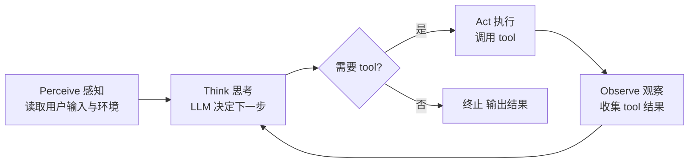
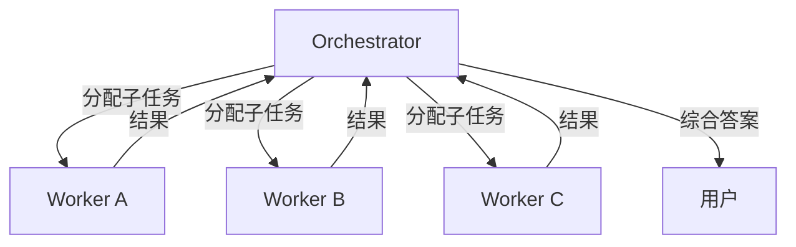
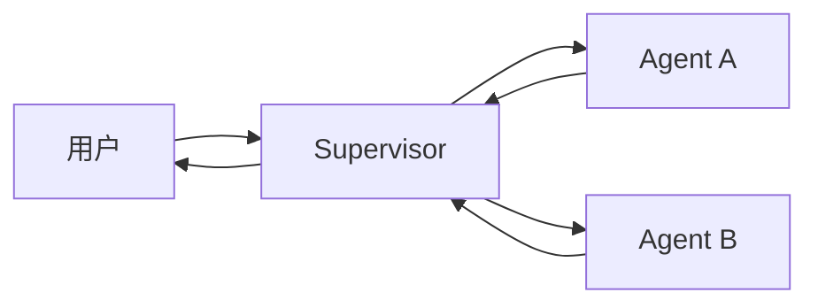
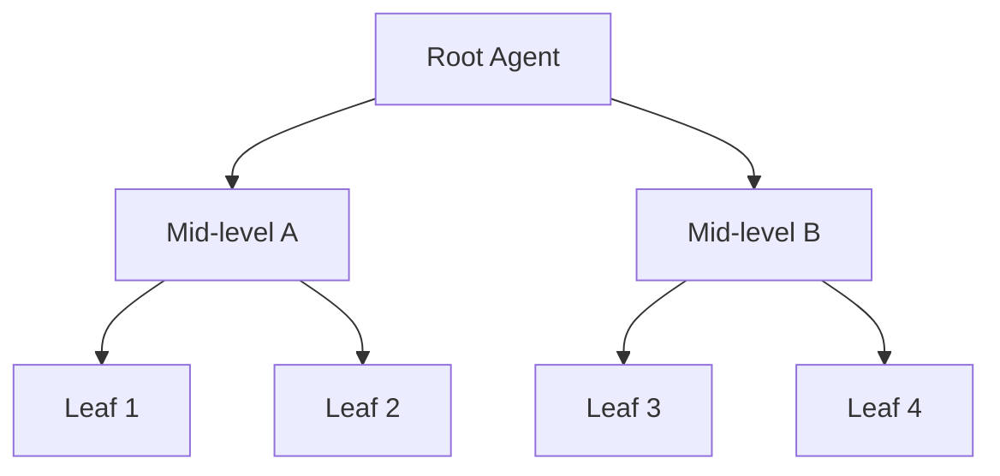
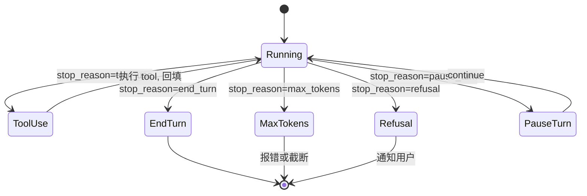

# 精通 Agent 系统设计：ReAct、Planning、Reflection 与 Multi-Agent

> 课程编号：A09
> 路线图来源：AI / LLM 后端工程 · 模块四 Agent 与工具
> 难度：⭐⭐⭐⭐⭐
> 预计阅读时间：75 分钟
> 内容基准：2026 年 8 月

---

## 引言：从"会聊天"到"能做事"

```go
for {
    resp := client.Messages.New(ctx, params)
    if resp.StopReason != "tool_use" {
        break
    }
    results := executeTools(resp.Content)
    params.Messages = append(params.Messages, asAssistant(resp), asUser(results))
}
```

四行代码——这是 2026 年绝大多数生产 Agent 的核心循环。模型说要调 tool，业务执行 tool，把结果回填，再让模型继续——直到模型说"我做完了"。

听起来简单。但生产里要回答的问题接踵而至：

- 怎么避免模型陷入无限循环？（10 步、100 步、1000 步该停？）
- 一个 task 给多少预算？token 用完怎么办？
- 模型决定调 50 次 `read_file` 把 codebase 全扫一遍——拦还是不拦？
- 需要让两个 Agent 协作（一个 planner、一个 coder）——怎么编排？
- 长任务跑 10 分钟用户中途取消——怎么干净退出？
- 模型 hallucinate 出一个不存在的 tool name——怎么处理？
- 任务跨多次会话——怎么让 Agent "记得"上次做到哪儿？

这就是 **Agent 系统工程**。它**不是**模型问题，是**软件工程**问题——状态机、资源管理、错误处理、可观测性的总和。

2026 年 5 月，Agent 已从研究 demo 走到生产。Anthropic 的 Claude Code、Cursor、Devin、Replit Agent、OpenAI Operator 都把 Agent loop 跑成事实产品。**核心模式**已收敛：

```
显式循环 + tool registry + memory + 终止条件 + 可观测性
```

抽象层（LangChain、AutoGen、LangGraph、CrewAI）很多，但**生产 Agent 的趋势是去抽象化**——直接看 raw messages、自己写循环、自己控成本，远比套框架稳。本章就拆开这一套，从原理到 Go 实现到生产实践。

---

## 第一章：什么是 LLM Agent

### 1.1 Agent 的工业定义

业界没有统一定义，但有效共识：

> **Agent** = LLM + 一组 tool + 一个 loop + 一段 memory + 一个终止条件

Anthropic 2024 年的 "Building Effective Agents" 一文（业界最被引用）划分了两个相关概念：

- **Workflow（工作流）**：LLM 与 tool 的编排路径**预先确定**——开发者写死 step 1 → step 2 → step 3，每步可能调 LLM 也可能不调
- **Agent（智能体）**：LLM **自主决定**走哪条路径、调哪个 tool、什么时候停——开发者只给目标和 toolset

"自主性"是关键——不是说模型说什么我就执行什么，而是模型在循环中**根据观察结果决定下一步**。

### 1.2 与传统软件的差别

```
传统软件：     代码定义控制流，数据流过函数
LLM Agent：    模型定义控制流，token 流过 loop
```

| 维度 | 传统软件 | LLM Agent |
|---|---|---|
| 控制流 | 编程时确定（if/for/switch） | 运行时由模型决定 |
| 状态空间 | 可枚举 | 几乎无限（自然语言） |
| 测试 | 单元测试 + 集成测试 | 评测集 + 行为评估 |
| 错误模式 | 异常 / 崩溃 | hallucination / 死循环 / 错误判断 |
| 性能上限 | 由架构决定 | 由模型能力决定 |
| 调试 | stack trace | trace + tool call 链 |
| 成本 | CPU/RAM | token + tool 调用 |

最大的认知错位：**传统软件出 bug 改代码就行；Agent 出 bug 可能是 prompt 不够、tool 设计差、context 没传对、模型本身能力不到**。改代码不一定救得了。

### 1.3 Agent 适合什么场景

适合：

- **开放性问题**——客户的问题千变万化，不可能 if/else 穷举（客服、研究、写代码）
- **多步骤决策**——下一步依赖上一步结果（修 bug：先 reproduce、再 grep、再读相关代码、再改、再测）
- **工具组合不固定**——同一类问题不同实例可能用完全不同 tool 子集
- **错误恢复需要"理解"**——遇到错误能调整策略，不是简单 retry

**不适合**：

- 确定的流水线（ETL、定时报表） → 写普通代码
- 高频低价值任务（每秒 100 次的分类） → 直接调 LLM 一次，不用 Agent loop
- 严格审计 / 合规场景 → Agent 路径不可预测，审核地狱
- 实时（< 1s 响应） → Agent loop 至少几秒

---

## 第二章：Agent 核心循环——Perceive / Think / Act / Observe

### 2.1 抽象循环



这是 Russell & Norvig 经典 AI 教材里的 "agent function" 在 LLM 时代的复现：

```
agent_function(percept_history) → action
```

LLM 版本把 percept 和 action 都换成自然语言 + 结构化 tool call。

### 2.2 Anthropic 的"agentic loop"

Anthropic 在 Claude Code、computer-use 等产品里使用的 canonical loop：

```
1. user 发起任务
2. LLM 接收 [system, history, user, tool_results]
3. LLM 输出 [thinking?, text?, tool_use*]
4. 检查 stop_reason:
   - end_turn:    任务完成，输出 text，退出
   - tool_use:    执行所有 tool_use blocks
   - max_tokens:  截断，需要 continue（罕见）
   - refusal:     模型拒绝，退出并通知用户
5. 把 tool_results 作为 user message 追加到 history
6. 回到 step 2
```

**核心特征**：

- **stop_reason 是唯一的"程序计数器"**——你看它就知道 Agent 在哪一步
- **messages 数组是唯一的"内存"**——所有状态都在里面
- **tool_use → tool_result 必须严格配对**——错配会让 API 报 400
- **循环显式**——你能看到每一次 LLM call、每一次 tool 执行

这种"显式 loop + 状态全在 messages"模式是 2025-2026 年生产 Agent 的事实标准——比 LangChain 早期黑盒抽象更容易调试、限流、replay。

### 2.3 Perceive / Observe 的边界

很多人把 Perceive 和 Observe 混着用。区分：

- **Perceive**：进入 loop 前接收用户最初输入（"修这个 bug"）
- **Observe**：loop 中接收 tool 结果（`grep` 输出、API 响应、文件内容）

设计 tool 时区分：

- **传感器型 tool**（observe）：`read_file`、`search`、`http_get`——只读，不改世界
- **执行器型 tool**（act）：`write_file`、`run_command`、`send_email`——改世界

**生产建议**：执行器型 tool 必须可审批 / 可 dry-run / 可回滚（详见第 12 章）。

---

## 第三章：ReAct 模式

### 3.1 论文与思想

ReAct（**Re**ason + **Act**）是 Yao et al. 2022 年提出的 prompting 技术——让 LLM 在每一步都先写"我现在想什么"再决定动作：

```
Thought: 用户问"巴黎天气"。我需要查实时天气，要用 get_weather tool。
Action: get_weather(city="Paris")
Observation: {"temp": 18, "condition": "cloudy"}
Thought: 18 度阴天。现在可以回答用户了。
Final Answer: 巴黎现在 18 度，阴天。
```

**关键洞察**：把模型的"思考过程"显式地写出来，模型行动质量会显著提升——这与人类"think aloud"的原理一致。

ReAct 在 2022-2023 年是 "纯文本 prompting"——模型按 `Thought:` / `Action:` / `Observation:` 格式自由输出。而在 2024-2026 年的工业实践里，结构化 tool use（Anthropic 的 `tool_use` block、OpenAI 的 `function_call`）**取代了文本解析**，但 ReAct 的核心精神保留：**先思考、再行动**。

### 3.2 现代 ReAct = tool_use + thinking

```
[user] 巴黎现在多少度？
[assistant]
  - thinking: "用户问天气，我需要调 get_weather tool"
  - tool_use(get_weather, {city: "Paris"})
[user]
  - tool_result(toolu_xxx, "18°C cloudy")
[assistant]
  - text: "巴黎现在 18°C，阴天。"
```

`thinking` block 由 Anthropic 的 extended thinking 提供；OpenAI 的 reasoning model（o-系列）也有类似 reasoning trace。这相当于把 ReAct 论文里的 `Thought:` 变成了 API 一等公民。

### 3.3 何时 ReAct 失效

- **任务超长** → thinking + 多轮 tool 让 context 膨胀，最终爆窗口
- **决策路径明显** → 不需要"想"，直接 if/else 用代码写更快
- **tool 太多（>50）** → 模型记不住 tool 列表，瞎选；要走 hierarchical agent 或 RAG-on-tools

### 3.4 Go 实现一个 ReAct Agent

```go
package agent

import (
    "context"
    "fmt"

    "github.com/anthropics/anthropic-sdk-go"
)

type ReActAgent struct {
    Client  anthropic.Client
    Model   string
    Tools   []anthropic.ToolParam
    Execute func(name string, input map[string]any) (string, error)
    MaxSteps int
}

func (a *ReActAgent) Run(ctx context.Context, userInput string) (string, error) {
    messages := []anthropic.MessageParam{
        anthropic.NewUserMessage(anthropic.NewTextBlock(userInput)),
    }

    for step := 0; step < a.MaxSteps; step++ {
        resp, err := a.Client.Messages.New(ctx, anthropic.MessageNewParams{
            Model:     anthropic.F(a.Model),
            MaxTokens: anthropic.F(int64(4096)),
            Tools:     anthropic.F(a.Tools),
            Messages:  anthropic.F(messages),
            Thinking: anthropic.F(anthropic.ThinkingConfigEnabledParam{
                Type:         anthropic.F("enabled"),
                BudgetTokens: anthropic.F(int64(2000)),
            }),
        })
        if err != nil {
            return "", err
        }

        // 收集 assistant 输出（thinking + tool_use + text）
        messages = append(messages, anthropic.NewAssistantMessage(resp.Content...))

        if resp.StopReason != "tool_use" {
            // end_turn / refusal / max_tokens
            return extractText(resp), nil
        }

        // 执行所有 tool_use
        var results []anthropic.ContentBlockParamUnion
        for _, block := range resp.Content {
            if tu, ok := block.AsAny().(anthropic.ToolUseBlock); ok {
                out, err := a.Execute(tu.Name, tu.Input)
                isError := err != nil
                if isError {
                    out = err.Error()
                }
                results = append(results, anthropic.NewToolResultBlock(tu.ID, out, isError))
            }
        }
        messages = append(messages, anthropic.NewUserMessage(results...))
    }
    return "", fmt.Errorf("agent exceeded %d steps", a.MaxSteps)
}

func extractText(msg *anthropic.Message) string {
    for _, b := range msg.Content {
        if tb, ok := b.AsAny().(anthropic.TextBlock); ok {
            return tb.Text
        }
    }
    return ""
}
```

这就是一个 production-grade ReAct Agent 的最小骨架——**60 行**。后续章节我们会在这个骨架上加 memory、cost cap、observability。

---

## 第四章：Plan-and-Execute——先规划再分步

### 4.1 为什么需要先规划

ReAct 是**反应式**的——每一步只考虑当前观察。问题：

- 长任务里"贪心"决策容易走错路（局部最优 ≠ 全局最优）
- 每轮都做长 prompt（系统 + 历史 + tool 列表）→ 重复成本高
- 中间步骤出错时不知道偏离了原计划多远

**Plan-and-Execute**（也叫 Plan-and-Solve）把任务拆两阶段：

```
阶段 1（Planner，Opus 5 等强模型）：
  - 接收用户任务
  - 输出 step-by-step 计划（结构化 JSON）

阶段 2（Executor，Sonnet/Haiku 等便宜模型）：
  - 按 plan 一步步执行
  - 每步可能调 tool
  - 收集结果给下一步
```

经典论文：Wang et al. 2023, "Plan-and-Solve Prompting"。工业实现：LangChain 的 Plan-and-Execute、Microsoft 的 AutoGen Planner、OpenAI Operator 的内部 planner。

### 4.2 Plan 的结构

```json
{
  "goal": "找出过去 7 天 5xx 错误率最高的服务并发告警",
  "steps": [
    {"id": 1, "action": "query_logs", "args": {"timeframe": "7d", "level": "error"}},
    {"id": 2, "action": "aggregate_by_service", "depends_on": [1]},
    {"id": 3, "action": "find_max", "depends_on": [2]},
    {"id": 4, "action": "send_alert", "depends_on": [3]}
  ]
}
```

特征：

- 每步有 `id`（用作 reference）
- 每步声明 `depends_on`——可以做 DAG 并行
- `action` 对应 tool name 或自然语言描述（更高层 plan）

### 4.3 Replan 机制

执行过程中**计划往往会失效**——`query_logs` 返回 0 条记录，原计划的"找 max"就没意义了。处理方式：

```
执行每一步后:
  if step_result_unexpected or step_failed:
      → 回 Planner，给定原 plan + 当前进展 + 失败原因
      → Planner 输出新 plan（剩余步骤）
  else:
      → 继续下一步
```

这是 **Replan** 机制。代价是多花一次 Planner 调用，但能避免按死板计划走错路。

### 4.4 Go 实现（骨架）

```go
type Plan struct {
    Goal  string  `json:"goal"`
    Steps []Step  `json:"steps"`
}

type Step struct {
    ID         int             `json:"id"`
    Action     string          `json:"action"`
    Args       map[string]any  `json:"args"`
    DependsOn  []int           `json:"depends_on"`
    Result     string          `json:"result,omitempty"`
    Status     string          `json:"status,omitempty"`  // pending/done/failed
}

type PlanAndExecuteAgent struct {
    Planner   *ReActAgent     // 用 Opus
    Executor  *ReActAgent     // 用 Sonnet
    MaxReplans int
}

func (a *PlanAndExecuteAgent) Run(ctx context.Context, task string) (string, error) {
    plan, err := a.makePlan(ctx, task)
    if err != nil { return "", err }

    for replan := 0; replan < a.MaxReplans; replan++ {
        if err := a.execute(ctx, plan); err == nil {
            return plan.summarize(), nil
        }
        // 失败，replan
        plan, err = a.replan(ctx, task, plan)
        if err != nil { return "", err }
    }
    return "", fmt.Errorf("max replans exceeded")
}

func (a *PlanAndExecuteAgent) makePlan(ctx context.Context, task string) (*Plan, error) {
    prompt := fmt.Sprintf(`你是计划生成器。把任务拆成可执行步骤，输出 JSON。
任务: %s
可用 tool: %v
输出格式: {"goal":..., "steps":[{"id":1,"action":"tool_name","args":{...}},...]}`, task, a.Executor.Tools)
    out, err := a.Planner.Run(ctx, prompt)
    if err != nil { return nil, err }
    var plan Plan
    if err := json.Unmarshal([]byte(out), &plan); err != nil { return nil, err }
    return &plan, nil
}
```

### 4.5 与 ReAct 的差异

| 维度 | ReAct | Plan-and-Execute |
|---|---|---|
| 决策时机 | 每步动态 | 一次性规划 |
| 模型用量 | 每步重复 system prompt | Planner 重 / Executor 轻 |
| 适合任务 | 短、探索性 | 长、明确目标 |
| 错误恢复 | 即时调整 | 需要 replan |
| 可观测 | 看 tool trace | 看 plan + step status |

**实际选择**：**混合模式**——用 Plan-and-Execute 做顶层结构，每个 step 内部用 ReAct loop 自由探索。这是 Devin、Claude Code 等的实际做法。

---

## 第五章：Reflection / Self-critique

### 5.1 原理

模型生成完答案后，让**同一个或另一个**模型**审视自己的答案**：

```
[user] 写一段 Go 代码读 CSV 并按某列求和
[assistant] <初版代码>
[user] [system: 你是 code reviewer] 请审视上面代码，列出问题
[assistant] <批评列表：1. 没处理 BOM 2. 没 close file 3. ...>
[user] 请按批评修复
[assistant] <修订版代码>
```

这一模式叫 **Reflection**（也叫 self-critique、self-refine）。Madaan et al. 2023 的 "Self-Refine" 论文是经典参考。

### 5.2 何时收益最大

- **代码生成 / 修改** → 第一版 60% 正确，加 reflection 能到 85%+
- **写作 / 报告** → reflection 后逻辑漏洞、事实错误显著减少
- **数学 / 推理** → 强模型已自带 thinking，reflection 收益小
- **结构化抽取** → 收益小（schema 已约束）

### 5.3 Single-agent vs Two-agent reflection

**Single-agent**：同一个 prompt 对话内自我批评。便宜但偏见——模型不太会"批评自己"。

**Two-agent**：

- Agent A 生成
- Agent B（不同 system prompt / 不同模型）批评
- Agent A 接受批评修订

Two-agent 更有效——B 的 system prompt 强调"找问题"，避免 confirmation bias。

### 5.4 Go 示例

```go
type ReflectionAgent struct {
    Generator *ReActAgent  // Sonnet
    Critic    *ReActAgent  // Opus 或 Sonnet（不同 system prompt）
    MaxRounds int
}

func (a *ReflectionAgent) Run(ctx context.Context, task string) (string, error) {
    answer, err := a.Generator.Run(ctx, task)
    if err != nil { return "", err }

    for round := 0; round < a.MaxRounds; round++ {
        critique, err := a.Critic.Run(ctx, fmt.Sprintf(
            `任务: %s
当前答案: %s
请指出答案中的问题。如果没问题就只回答"OK"。`, task, answer))
        if err != nil { return answer, nil }

        if strings.TrimSpace(critique) == "OK" {
            return answer, nil
        }

        answer, err = a.Generator.Run(ctx, fmt.Sprintf(
            `任务: %s
之前答案: %s
批评: %s
请根据批评改进答案。`, task, answer, critique))
        if err != nil { return answer, nil }
    }
    return answer, nil
}
```

### 5.5 Reflection 的代价与陷阱

- **成本翻倍**：每轮 reflection 多两次 LLM 调用
- **"过度修改"**：模型每次都"找点改"——答案越改越差。需要严格的 critic prompt：只在真有问题时报告
- **陷入震荡**：版本 A → 批评 → 版本 B → 批评 → 版本 A → ...。给 round 上限或检测 hash 重复

---

## 第六章：ReWOO——解耦 reasoning 与 tool execution

### 6.1 问题

ReAct 的循环每一步都要调一次 LLM。如果 tool 执行需要 30 秒（如 web 抓取），那 N 步任务里：

- N 次 LLM 调用（每次 100ms-5s）
- N 次 tool 调用（每次几秒到几十秒）
- **每次 LLM 调用都要带前面所有 history**——context 膨胀，成本爆炸

而且很多任务的 tool 调用顺序**和 tool 输出无关**——比如"查 Paris、London、Tokyo 三个城市天气"——三次 `get_weather` 完全独立、可并行。

### 6.2 ReWOO 思想

Xu et al. 2023 的 **ReWOO**（Reasoning WithOut Observation）拆三阶段：

```
1. Planner（一次 LLM 调用）：生成"全部 tool 调用计划"，用 #E1, #E2 占位输出结果
   Plan: 
     #E1 = get_weather(Paris)
     #E2 = get_weather(London)
     #E3 = get_weather(Tokyo)
     #E4 = summarize(#E1, #E2, #E3)

2. Worker（无 LLM，纯 tool 执行）：按 DAG 并行执行 #E1-#E3，#E4 等前面完成

3. Solver（一次 LLM 调用）：拿到所有 evidence #E1-#E4，生成最终答案
```

LLM 调用从 **N+1 次**（ReAct）降到 **2 次**（ReWOO）——成本巨降，延迟也降（并行）。

### 6.3 适用条件

- Tool 调用可独立 / 可并行
- 计划阶段就能确定要调哪些 tool
- 中间结果不会改变后续路径

**不适用**：

- 强依赖中间结果决定下一步（如 debug：grep 结果决定接下来读哪个文件）→ 还是 ReAct

### 6.4 Go 实现（并行执行）

```go
type ReWOOAgent struct {
    Planner  *ReActAgent
    Solver   *ReActAgent
    ToolFn   func(name string, args map[string]any) (string, error)
}

type ToolCall struct {
    ID   string                 // "#E1"
    Name string
    Args map[string]any
    Deps []string               // ["#E1"] 表示等 #E1 完成
}

func (a *ReWOOAgent) Run(ctx context.Context, task string) (string, error) {
    plan, err := a.makePlan(ctx, task)
    if err != nil { return "", err }

    // 并行执行 tool（按 DAG 拓扑）
    results := make(map[string]string)
    results, err = a.executeDAG(ctx, plan, results)
    if err != nil { return "", err }

    // Solver 综合
    evidence := ""
    for _, c := range plan {
        evidence += fmt.Sprintf("%s = %s\n", c.ID, results[c.ID])
    }
    return a.Solver.Run(ctx, fmt.Sprintf("任务: %s\nEvidence:\n%s\n请综合给最终答案", task, evidence))
}

func (a *ReWOOAgent) executeDAG(ctx context.Context, plan []ToolCall, done map[string]string) (map[string]string, error) {
    var mu sync.Mutex
    var wg sync.WaitGroup
    sem := make(chan struct{}, 4)  // 并发 4

    for _, call := range plan {
        call := call
        depsReady := true
        for _, d := range call.Deps {
            if _, ok := done[d]; !ok { depsReady = false; break }
        }
        if !depsReady { continue }

        wg.Add(1)
        sem <- struct{}{}
        go func() {
            defer wg.Done()
            defer func() { <-sem }()
            // 替换 args 里的 #Ex 引用为实际结果
            args := substitute(call.Args, done)
            r, err := a.ToolFn(call.Name, args)
            if err != nil { r = err.Error() }
            mu.Lock()
            done[call.ID] = r
            mu.Unlock()
        }()
    }
    wg.Wait()

    // 检查所有 step 都完成；如有未完成（说明有循环依赖或 deps 不满足）报错
    for _, c := range plan {
        if _, ok := done[c.ID]; !ok {
            return done, fmt.Errorf("step %s not executed", c.ID)
        }
    }
    return done, nil
}
```

### 6.5 ReAct vs Plan-Execute vs ReWOO 对比

| 模式 | LLM 调用次数 | tool 调用 | 并行 | 适合 |
|---|---|---|---|---|
| ReAct | N+1（每步一次） | 串行 | 难 | 探索性、动态 |
| Plan-and-Execute | 2-3 | 受 plan 约束 | DAG | 长任务、明确目标 |
| ReWOO | 2 | 并行 | 是 | 独立 tool 调用集合 |

---

## 第七章：Multi-Agent —— Orchestrator-Worker、Supervisor、Hierarchical

### 7.1 为什么要多 Agent

单 Agent 上限：

- 一个 agent 顶多管 ~20 tool（再多就糊涂）
- 一个 agent 一份 system prompt——"什么都能干"的 prompt 容易稀释专项能力
- context 受限——一个 agent 干完整任务，context 会撑爆

Multi-Agent 让每个 Agent 专精一域、各管各的 context、协作完成大任务。

### 7.2 三大经典模式

#### Orchestrator-Worker



- **Orchestrator**：拆任务、分配、综合（强模型，如 Opus）
- **Workers**：执行子任务（轻模型，如 Sonnet/Haiku，按专项配 tool）

Anthropic 在 "Building Effective Agents" 里把这种模式当作 multi-agent 默认形态。Claude Code 的内部架构就是 Orchestrator + 多 sub-agent。

#### Supervisor



Supervisor 不分发任务，而是**控制对话轮次**——每轮决定该让哪个 Agent 发言。LangGraph 的 supervisor 模式是这种。适合"专家小组对话"。

#### Hierarchical



多层 Orchestrator-Worker。Root 拆给 mid，mid 再拆给 leaf。**少用**——层次越多越难调试、越易失控。

### 7.3 Sub-agent as Tool

一个被低估的视角：**sub-agent 就是父 agent 的一个 tool**。父 agent 看到的"工具"包括：

```go
tools := []anthropic.ToolParam{
    {Name: "read_file", ...},
    {Name: "code_writer_agent", Description: "Spawn a sub-agent specialized in writing Go code. Input: task description.", ...},
    {Name: "researcher_agent", Description: "Spawn a sub-agent for web research.", ...},
}
```

当父 agent 调 `code_writer_agent`：

```go
case "code_writer_agent":
    subAgent := newCoderAgent()
    result, _ := subAgent.Run(ctx, args["task"].(string))
    return result, nil
```

子 agent 拿到子任务后**用自己的 context 跑完整 loop**——父 agent 看到的只是最终结果。**Context 隔离**是 multi-agent 最大的工程价值——避免长任务 context 爆窗口。

### 7.4 何时多 Agent

- **明确专业划分**（research → coder → reviewer）
- **可并行子任务**（同时调研三家竞品）
- **不同子任务需要不同 tool set**
- **context isolation 重要**（避免某子任务的细节污染主对话）

**不要**：

- 简单任务硬上 multi-agent → 沟通开销远大于收益
- 子 agent 之间高度耦合（每个都要看完整 context）→ 实际就是一个 agent
- 没有清晰的"指挥层级" → "Agent 委员会"模式会陷入扯皮

### 7.5 Go 实现 Orchestrator-Worker

```go
type Orchestrator struct {
    Client   anthropic.Client
    Model    string
    Workers  map[string]*ReActAgent  // "coder" -> agent, "researcher" -> agent
}

func (o *Orchestrator) Run(ctx context.Context, task string) (string, error) {
    workerTools := []anthropic.ToolParam{}
    for name := range o.Workers {
        workerTools = append(workerTools, anthropic.ToolParam{
            Name:        anthropic.F(name + "_agent"),
            Description: anthropic.F(fmt.Sprintf("Delegate to %s sub-agent. Input: task description.", name)),
            InputSchema: anthropic.F(anthropic.ToolInputSchemaParam{
                Type: anthropic.F("object"),
                Properties: anthropic.F(map[string]any{
                    "task": map[string]any{"type": "string"},
                }),
                Required: anthropic.F([]string{"task"}),
            }),
        })
    }

    orch := &ReActAgent{
        Client:   o.Client,
        Model:    o.Model,
        Tools:    workerTools,
        MaxSteps: 20,
        Execute: func(name string, input map[string]any) (string, error) {
            workerName := strings.TrimSuffix(name, "_agent")
            worker, ok := o.Workers[workerName]
            if !ok {
                return "", fmt.Errorf("unknown worker: %s", workerName)
            }
            return worker.Run(ctx, input["task"].(string))
        },
    }
    return orch.Run(ctx, task)
}
```

注意——这只是骨架。生产里要加：

- 子 agent 的 cost 也要计入父 agent 预算
- 子 agent 失败要可重试 / 可降级
- 父 agent 的 trace 里要嵌套子 agent 的 trace（hierarchical observability）

---

## 第八章：Anthropic agentic loop —— 工业实现规范

### 8.1 Anthropic 官方建议

Anthropic 在 2024-2025 的多篇博客（"Building Effective Agents"、"Effective Agents"）反复强调几条原则：

1. **从简单开始**：先看能否用单次 LLM call + RAG 解决，再考虑加 tool，再考虑加 loop
2. **显式胜过隐式**：raw messages + 自己写 loop > LangChain 高度抽象
3. **少抽象**：避免封装"通用 Agent 框架"——不同任务最佳实践不同
4. **Tool 设计 > prompt 设计**：tool 描述写得好，模型行为质量提升明显
5. **Token 用 thinking 换准确率**：复杂任务开 extended thinking

### 8.2 Stop reason 状态机



| stop_reason | 含义 | 处理 |
|---|---|---|
| `end_turn` | 模型说"我做完了" | 退出，返回最终 text |
| `tool_use` | 模型要调 tool | 执行 tool，回填，继续 |
| `max_tokens` | 输出长度限制触发 | 提高 MaxTokens，或重试 / 截断 |
| `stop_sequence` | 命中自定义停止串 | 按业务处理 |
| `refusal` | 模型拒绝（安全策略） | 通知用户，不重试 |
| `pause_turn` | 长任务暂停 | 把整个 message 原样回传调用 `messages.create` 续 |

`pause_turn` 是 2025 引入的：超长 tool 调用任务允许模型"自己暂停"，避免单次 API call 超时。你只需要把"暂停"的 message 作为最后一条 history 再请求一次，模型会继续。

### 8.3 Stop conditions（业务层）

Anthropic 提供 4 种 API 层 stop_reason，但**业务层必须再加 stop conditions**：

```go
type StopConditions struct {
    MaxSteps      int            // 最多 loop 次数（如 50）
    MaxTokens     int            // 累计 token 上限
    MaxCost       float64        // 累计 USD 上限
    MaxDuration   time.Duration  // 总耗时
    HumanApproval func(action string) bool  // 高风险操作要审批
}

func (sc *StopConditions) Check(state *AgentState) error {
    if state.Steps >= sc.MaxSteps {
        return ErrMaxSteps
    }
    if state.TotalTokens >= sc.MaxTokens {
        return ErrTokenBudget
    }
    if state.Cost >= sc.MaxCost {
        return ErrCostBudget
    }
    if time.Since(state.Start) > sc.MaxDuration {
        return ErrTimeout
    }
    return nil
}
```

**最容易忽略的**是 `MaxCost`——一个 Agent 跑飞调 1000 次 tool、每次都给 Opus 长 context，分分钟烧几百美金。下文第 12 章详谈。

---

## 第九章：Memory 模式——short-term vs long-term

### 9.1 Short-term Memory

= 当前 loop 的 messages 数组本身。

```
[user] 帮我修 bug
[assistant] [thinking] ... [tool_use read_file]
[user] [tool_result ...]
[assistant] ... 
...
```

特征：

- 范围只在当前 task / loop 内
- 一旦 task 结束或 context 满 → 丢失
- 越长越贵（每次 LLM call 都要全发）

**管理策略**：

- **总长度上限**：把 messages 总 token 估算后限制（如 100k token 上限）
- **压缩**：旧 history → summarize → 用 summary 替代
- **截断**：保留 system + 最新 N 轮，中间删掉（粗暴但有效）

### 9.2 Long-term Memory

= 跨 task / 跨会话持久化的"知识"。

存储位置：

- **向量库**（Pinecone、pgvector、Milvus）：embedding + 语义检索
- **结构化 DB**：事实（用户偏好、上次结论、待办事项）
- **键值存储**（Redis）：快速访问的"工作记忆"

工作模式：

```
loop 开始前:
  - 从 long-term store 检索相关 memory
  - 注入 system prompt 或第一条 user message

loop 进行中:
  - 模型决定"这条信息要存"→ 调 store_memory tool
  - 模型决定"我需要历史信息"→ 调 retrieve_memory tool

loop 结束:
  - 总结本次 task → 存 long-term store
```

### 9.3 Anthropic Memory Tool

Anthropic 在 2025-09 推出了 beta 版 **memory tool**（需 beta header `context-management-2025-06-27`）。它是**基于文件**的：模型在 memory 目录下对文件做增删改查：

```
create  → 在 memory 目录创建文件
read    → 读取 memory 目录下的文件
update  → 修改文件内容
delete  → 删除文件
```

存储后端由开发者在客户端侧实现（没有模型内置的 `recall(query)` 语义检索原语）。常与 context editing 配合使用。模型决定**何时存、何时查**。

### 9.4 Memory 类型分类

| 类型 | 内容 | 存储 | 例子 |
|---|---|---|---|
| Episodic（情景） | "上次发生了什么" | 向量库 + 时间戳 | "用户上次问的是 RAG 问题" |
| Semantic（语义） | 概念事实 | 知识图 / 文档库 | "用户技术栈是 Go" |
| Procedural（程序） | 怎么做某件事 | playbook / prompt 库 | "deploy 流程：1. lint 2. test 3. push" |
| Working（工作） | 当前任务相关 | 短期 cache | "刚 grep 出来的 5 个文件" |

### 9.5 Go 简单实现

```go
type Memory interface {
    Recall(ctx context.Context, query string, topK int) ([]MemoryItem, error)
    Store(ctx context.Context, item MemoryItem) error
}

type MemoryItem struct {
    ID        string
    Content   string
    Embedding []float32
    Tags      []string
    CreatedAt time.Time
}

// 暴露给 agent 作为 tool
func memoryTools(mem Memory) []anthropic.ToolParam {
    return []anthropic.ToolParam{
        {
            Name:        anthropic.F("memory_recall"),
            Description: anthropic.F("Retrieve relevant memory from long-term store. Use when you need past context."),
            InputSchema: anthropic.F(anthropic.ToolInputSchemaParam{
                Type: anthropic.F("object"),
                Properties: anthropic.F(map[string]any{
                    "query": map[string]any{"type": "string"},
                }),
                Required: anthropic.F([]string{"query"}),
            }),
        },
        {
            Name:        anthropic.F("memory_store"),
            Description: anthropic.F("Save important information for future tasks."),
            InputSchema: anthropic.F(anthropic.ToolInputSchemaParam{
                Type: anthropic.F("object"),
                Properties: anthropic.F(map[string]any{
                    "content": map[string]any{"type": "string"},
                    "tags":    map[string]any{"type": "array", "items": map[string]any{"type": "string"}},
                }),
                Required: anthropic.F([]string{"content"}),
            }),
        },
    }
}
```

### 9.6 Memory 的工程陷阱

- **过度依赖 long-term memory**：每次 task 都猛塞历史进 prompt → context 爆炸
- **没有 forgetting 机制**：垃圾信息永远在 → 检索精度下降
- **隐私问题**：long-term memory 跨 user 时 PII 泄漏（**必须**分租户存储）
- **memory poisoning**：恶意 user 把"假事实"存进去 → 后续 task 全部受污染。要给 memory 加来源、可信度

---

## 第十章：终止条件——max steps / cost ceiling / model stop

### 10.1 三层终止

```
1. API 层（最快）
   - stop_reason == end_turn / refusal / pause_turn（罕见）

2. 业务层（程序判断）
   - max_steps 达到
   - cost / token 预算用完
   - 超时（context.WithTimeout）
   - 检测到死循环（连续 N 步重复相同 tool 相同 args）

3. 用户层（人为）
   - 用户主动取消（前端 cancel）
   - 人工审批被拒
```

### 10.2 死循环检测

```go
type LoopDetector struct {
    History   []string  // 每步 tool_name+args_hash
    WindowSize int      // 比如 6（连续 3 个相同操作）
}

func (d *LoopDetector) Push(toolName string, args map[string]any) bool {
    b, _ := json.Marshal(args)
    h := fmt.Sprintf("%s:%x", toolName, sha256.Sum256(b))
    d.History = append(d.History, h)
    if len(d.History) < d.WindowSize { return false }
    
    // 检测：最近 N 步全相同
    last := d.History[len(d.History)-1]
    for i := len(d.History) - d.WindowSize; i < len(d.History); i++ {
        if d.History[i] != last { return false }
    }
    return true  // 死循环！
}
```

或更宽松：A-B-A-B 循环：

```go
// 简单：最近 4 步是 [X,Y,X,Y] 模式
n := len(d.History)
if n >= 4 && d.History[n-4] == d.History[n-2] && d.History[n-3] == d.History[n-1] {
    return true
}
```

### 10.3 用户取消

```go
ctx, cancel := context.WithCancel(parentCtx)
defer cancel()

// 前端发来取消信号
go func() {
    <-cancelChan
    cancel()
}()

result, err := agent.Run(ctx, task)
if errors.Is(err, context.Canceled) {
    // 干净返回，告诉用户已取消
    // 注意：已花的 token 钱要不回——记账要按 cancel 前的 usage 计算
}
```

**关键**：Agent loop 的每个 step（LLM call、tool 执行）都要传 `ctx`，并定期 check `ctx.Err()`。

### 10.4 Cost ceiling

```go
type CostGuard struct {
    Budget  float64
    Spent   atomic.Value  // float64
    Pricing map[string]ModelPricing
}

func (g *CostGuard) AddUsage(model string, in, cacheRead, cacheCreate, out int) error {
    p := g.Pricing[model]
    cost := float64(in)*p.InputPerM/1e6 +
            float64(cacheRead)*p.CacheReadPerM/1e6 +
            float64(cacheCreate)*p.CacheWritePerM/1e6 +
            float64(out)*p.OutputPerM/1e6
    
    for {
        cur := g.Spent.Load().(float64)
        next := cur + cost
        if next > g.Budget {
            return fmt.Errorf("budget %.2f exceeded by %.4f", g.Budget, next-g.Budget)
        }
        if g.Spent.CompareAndSwap(cur, next) { break }
    }
    return nil
}
```

每次 LLM 返回都 `AddUsage`；超预算 → Agent loop 终止，把已完成部分返回。

---

## 第十一章：Go 实现一个完整的 Agent

把前面所有要素整合成一个生产可用的 Agent：

```go
package agent

import (
    "context"
    "encoding/json"
    "errors"
    "fmt"
    "log/slog"
    "sync"
    "time"

    "github.com/anthropics/anthropic-sdk-go"
)

// === 类型定义 ===

type Tool struct {
    Name        string
    Description string
    InputSchema map[string]any
    Execute     func(ctx context.Context, input map[string]any) (string, error)
    Approve     func(input map[string]any) bool  // nil 表示无须审批
}

type AgentConfig struct {
    Model        string
    SystemPrompt string
    MaxSteps     int
    MaxCost      float64
    MaxDuration  time.Duration
    ThinkingBudget int64
    EnableMemory bool
}

type AgentState struct {
    Steps         int
    TotalTokens   int
    TotalCost     float64
    Start         time.Time
    LoopDetector  *LoopDetector
    Messages      []anthropic.MessageParam
}

type Agent struct {
    Client  anthropic.Client
    Cfg     AgentConfig
    Tools   map[string]Tool
    Memory  Memory
    Logger  *slog.Logger
    Guard   *CostGuard
}

// === 入口 ===

func (a *Agent) Run(ctx context.Context, userInput string) (string, error) {
    ctx, cancel := context.WithTimeout(ctx, a.Cfg.MaxDuration)
    defer cancel()

    state := &AgentState{
        Start:        time.Now(),
        LoopDetector: &LoopDetector{WindowSize: 6},
        Messages:     []anthropic.MessageParam{anthropic.NewUserMessage(anthropic.NewTextBlock(userInput))},
    }

    // 如启用 memory，先注入相关记忆
    if a.Cfg.EnableMemory && a.Memory != nil {
        items, _ := a.Memory.Recall(ctx, userInput, 5)
        if len(items) > 0 {
            mem := "Relevant past context:\n"
            for _, it := range items {
                mem += "- " + it.Content + "\n"
            }
            state.Messages = append([]anthropic.MessageParam{
                anthropic.NewUserMessage(anthropic.NewTextBlock(mem)),
                anthropic.NewAssistantMessage(anthropic.NewTextBlock("Got it. Proceeding with task.")),
            }, state.Messages...)
        }
    }

    for state.Steps = 0; state.Steps < a.Cfg.MaxSteps; state.Steps++ {
        if err := ctx.Err(); err != nil {
            return a.lastText(state), fmt.Errorf("agent cancelled: %w", err)
        }
        if a.Guard.Spent.Load().(float64) > a.Cfg.MaxCost {
            return a.lastText(state), errors.New("cost budget exceeded")
        }

        resp, err := a.callLLM(ctx, state)
        if err != nil {
            return a.lastText(state), err
        }

        state.Messages = append(state.Messages, anthropic.NewAssistantMessage(resp.Content...))

        if resp.StopReason != "tool_use" {
            // 任务结束（end_turn / refusal / max_tokens）
            a.maybeSaveMemory(ctx, userInput, resp)
            return extractText(resp), nil
        }

        // 执行 tool_use blocks
        toolResults, err := a.executeTools(ctx, resp, state)
        if err != nil {
            return a.lastText(state), err
        }
        state.Messages = append(state.Messages, anthropic.NewUserMessage(toolResults...))
    }
    return a.lastText(state), fmt.Errorf("max steps %d exceeded", a.Cfg.MaxSteps)
}

// === LLM call ===

func (a *Agent) callLLM(ctx context.Context, state *AgentState) (*anthropic.Message, error) {
    tools := a.toAnthropicTools()
    params := anthropic.MessageNewParams{
        Model:     anthropic.F(a.Cfg.Model),
        MaxTokens: anthropic.F(int64(4096)),
        System:    anthropic.F([]anthropic.TextBlockParam{{Type: anthropic.F("text"), Text: anthropic.F(a.Cfg.SystemPrompt)}}),
        Messages:  anthropic.F(state.Messages),
        Tools:     anthropic.F(tools),
    }
    if a.Cfg.ThinkingBudget > 0 {
        params.Thinking = anthropic.F(anthropic.ThinkingConfigEnabledParam{
            Type:         anthropic.F("enabled"),
            BudgetTokens: anthropic.F(a.Cfg.ThinkingBudget),
        })
    }

    start := time.Now()
    resp, err := a.Client.Messages.New(ctx, params)
    latency := time.Since(start)
    if err != nil {
        a.Logger.Error("llm call failed", "err", err, "step", state.Steps)
        return nil, err
    }

    // 记录 usage / cost
    _ = a.Guard.AddUsage(a.Cfg.Model,
        resp.Usage.InputTokens,
        resp.Usage.CacheReadInputTokens,
        resp.Usage.CacheCreationInputTokens,
        resp.Usage.OutputTokens)
    a.Logger.Info("llm step",
        "step", state.Steps,
        "stop_reason", resp.StopReason,
        "in", resp.Usage.InputTokens,
        "out", resp.Usage.OutputTokens,
        "cache_read", resp.Usage.CacheReadInputTokens,
        "latency_ms", latency.Milliseconds(),
    )
    return resp, nil
}

// === Tool 执行（含审批 / 死循环检测 / 并行）===

func (a *Agent) executeTools(ctx context.Context, resp *anthropic.Message, state *AgentState) ([]anthropic.ContentBlockParamUnion, error) {
    var toolUses []anthropic.ToolUseBlock
    for _, b := range resp.Content {
        if tu, ok := b.AsAny().(anthropic.ToolUseBlock); ok {
            toolUses = append(toolUses, tu)
        }
    }

    results := make([]anthropic.ContentBlockParamUnion, len(toolUses))
    var wg sync.WaitGroup

    for i, tu := range toolUses {
        i, tu := i, tu

        if a.Cfg.MaxSteps > 0 && state.LoopDetector.Push(tu.Name, tu.Input) {
            results[i] = anthropic.NewToolResultBlock(tu.ID, "ERROR: detected infinite loop—same tool+args repeated. Try a different approach.", true)
            continue
        }

        wg.Add(1)
        go func() {
            defer wg.Done()
            tool, ok := a.Tools[tu.Name]
            if !ok {
                results[i] = anthropic.NewToolResultBlock(tu.ID, fmt.Sprintf("unknown tool: %s", tu.Name), true)
                return
            }
            // 审批检查
            if tool.Approve != nil && !tool.Approve(tu.Input) {
                results[i] = anthropic.NewToolResultBlock(tu.ID, "DENIED: action requires user approval and was rejected.", true)
                return
            }
            out, err := tool.Execute(ctx, tu.Input)
            if err != nil {
                a.Logger.Warn("tool error", "tool", tu.Name, "err", err)
                results[i] = anthropic.NewToolResultBlock(tu.ID, err.Error(), true)
                return
            }
            results[i] = anthropic.NewToolResultBlock(tu.ID, out, false)
        }()
    }
    wg.Wait()
    return results, nil
}

func (a *Agent) toAnthropicTools() []anthropic.ToolParam {
    out := make([]anthropic.ToolParam, 0, len(a.Tools))
    for name, t := range a.Tools {
        out = append(out, anthropic.ToolParam{
            Name:        anthropic.F(name),
            Description: anthropic.F(t.Description),
            InputSchema: anthropic.F(anthropic.ToolInputSchemaParam{
                Type:       anthropic.F("object"),
                Properties: anthropic.F(t.InputSchema["properties"]),
                Required:   anthropic.F(t.InputSchema["required"].([]string)),
            }),
        })
    }
    return out
}

func (a *Agent) lastText(state *AgentState) string {
    // ...遍历 state.Messages 找最后一个 assistant text...
    return ""
}

func (a *Agent) maybeSaveMemory(ctx context.Context, task string, resp *anthropic.Message) {
    if !a.Cfg.EnableMemory || a.Memory == nil { return }
    summary := fmt.Sprintf("Task: %s\nResult: %s", task, extractText(resp))
    _ = a.Memory.Store(ctx, MemoryItem{Content: summary, CreatedAt: time.Now()})
}
```

300 行——这是一个生产可用的 Agent。注意它**没有**用任何"Agent 框架"，全是 stdlib + Anthropic SDK。

---

## 第十二章：生产实践

### 12.1 Observability：trace 是生命线

一个 Agent run 是**一棵嵌套树**：

```
Agent run (root)
├── Step 1
│   ├── LLM call (in, out, latency, cost)
│   └── Tool: read_file (args, result, latency)
├── Step 2
│   ├── LLM call
│   ├── Tool: grep (args, result)
│   └── Tool: read_file (args, result)
├── Step 3 (sub-agent)
│   └── Sub-agent run
│       ├── Step 1 ...
│       └── Step 2 ...
└── Step N: final answer
```

最少要记录的字段：

```go
type StepLog struct {
    AgentID       string
    ParentAgentID string  // sub-agent 时填父
    StepIdx       int
    Type          string  // "llm" | "tool"
    Name          string  // tool 名 / "claude-sonnet-5"
    Input         json.RawMessage
    Output        json.RawMessage
    Tokens        int
    Cost          float64
    LatencyMS     int64
    Error         string
    Timestamp     time.Time
}
```

工具选型（2026 主流）：

- **Langfuse**：开源 + SaaS，原生支持 Agent trace、Anthropic / OpenAI 自动接入
- **Arize Phoenix**：开源，专注 LLM observability
- **OpenTelemetry GenAI semconv**：标准化语义约定，可接入任何 OTel backend（Jaeger、Tempo、Datadog）
- **自建**：把上面 StepLog 写到 PostgreSQL / ClickHouse，按 trace_id 查

集成方式（伪代码）：

```go
import "github.com/langfuse/langfuse-go"

trace := langfuse.NewTrace(ctx, "agent_run", task)
defer trace.End()

for step := 0; ...; step++ {
    span := trace.NewSpan(fmt.Sprintf("step_%d", step), "llm_call")
    resp, _ := a.callLLM(ctx, state)
    span.SetUsage(resp.Usage)
    span.End()
    // ...tool spans...
}
```

详细 LLM 可观测性见 A13。

### 12.2 Cost cap：双轨预算

- **Per-run budget**：单次 Agent run 上限（防一次任务烧太多）
- **Per-user/tenant budget**：单用户 / 单租户日上限（防滥用）

```go
type BudgetManager struct {
    PerRun    float64
    PerUserPerDay  map[string]float64  // user_id -> $
    CurrentDay     time.Time
    Spent          map[string]float64
}

func (b *BudgetManager) BeforeRun(userID string) (*CostGuard, error) {
    if b.Spent[userID] >= b.PerUserPerDay[userID] {
        return nil, errors.New("daily budget exhausted")
    }
    remaining := b.PerUserPerDay[userID] - b.Spent[userID]
    cap := b.PerRun
    if remaining < cap { cap = remaining }
    return &CostGuard{Budget: cap}, nil
}
```

### 12.3 Human-in-the-loop

高风险 tool 必须人工审批：

```go
"send_email": Tool{
    Name: "send_email",
    Approve: func(input map[string]any) bool {
        // 异步 webhook → Slack 给运营审批
        return waitForApproval(input)
    },
    Execute: ...,
},
"run_command": Tool{
    Approve: func(input map[string]any) bool {
        cmd := input["command"].(string)
        // 白名单匹配
        return commandAllowed(cmd)
    },
},
```

**最小化人工干预**的做法是 **dry-run**：

```
模型 → 提议 tool 调用
后端 → 模型告知"这是 dry-run，未真执行"，给模拟结果
模型 → 看模拟结果决定要不要真做
模型 → 真做（这次 approve = true）
```

### 12.4 并发与限流

```go
// 全局并发限制（不要一个 user 一个 Agent，每个 Agent N 步并发 tool 把 LLM 限流打爆）
var llmSem = semaphore.NewWeighted(50)

func (a *Agent) callLLM(ctx context.Context, ...) {
    llmSem.Acquire(ctx, 1)
    defer llmSem.Release(1)
    // ...
}

// 每 user 同时只跑 1 个 Agent
var userLocks sync.Map
func (a *Agent) Run(ctx context.Context, userID, task string) {
    lock, _ := userLocks.LoadOrStore(userID, &sync.Mutex{})
    lock.(*sync.Mutex).Lock()
    defer lock.(*sync.Mutex).Unlock()
    // ...
}
```

### 12.5 Replay 与 audit

把每次 Agent run 的全部 messages 持久化——出问题时能 replay：

```go
type RunRecord struct {
    ID        string
    UserID    string
    Task      string
    Messages  []anthropic.MessageParam  // 全部上下文
    Steps     []StepLog
    StartedAt time.Time
    EndedAt   time.Time
    Result    string
    Error     string
}
```

存到对象存储（S3 / OSS）+ 索引到数据库。审计、debug、改进 prompt 都靠它。

### 12.6 prompt 模板与版本化

System prompt 是 Agent 行为的"DNA"。版本化它：

```go
type PromptTemplate struct {
    ID       string
    Version  string  // "v1.2.3"
    System   string
    Tools    []string  // 引用 tool 名
    UpdatedAt time.Time
    Author   string
}
```

每次 Agent run 记录 prompt 版本——后续 A/B 测试、回滚都依赖。

---

## 第十三章：陷阱清单

### 1. 无限循环（最常见）

模型陷入"调 read_file 调 grep 再 read_file 再 grep"——永远不结束。

**预防**：

- `MaxSteps`（如 50）必须设
- 死循环检测（上面 LoopDetector）
- prompt 里写"Don't repeat the same tool call; if a result is empty, change strategy"

### 2. Tool 滥用

模型每次都先 `list_files`、再 `read_file`、再 `grep`——明明可以一步 grep。

**预防**：

- Tool description 写明"prefer X over Y when ..."
- 设计 composite tool（`grep_in_dir` 比 `list_files + read_file + grep` 强）
- 在 prompt 里给 few-shot 示例展示高效路径

### 3. 幻觉链式放大

第 1 步模型读错文件、第 2 步基于错读做错总结、第 3 步基于错总结建错索引——错误指数级。

**预防**：

- 关键步骤后让模型**自我验证**（reflection）
- 每个 tool 输出末尾让模型简短回答"This result means: ..."——强迫确认
- 提供 ground-truth 检查 tool（如 `verify_fact`）

### 4. Context 爆窗口

100 步 loop 后 context 50 万 token——成本爆、模型反应慢。

**预防**：

- 监控 `InputTokens`，超阈值（如 100k）触发 compaction
- compaction：把前 N 轮总结成一条 assistant message
- 用 sub-agent 隔离 context（参考第 7 章）

### 5. Tool 描述写得差

```go
// 差
{Name: "search", Description: "search"}

// 好
{Name: "search", Description: "Search the internal knowledge base for documents matching the query. Use this when the user asks factual questions about company policies, products, or past tickets. Returns top 5 results with title, snippet, and url."}
```

Anthropic 反复强调：**Tool description 是 prompt engineering 最重要的环节之一**。

### 6. 没区分 dry-run / real

模型一次性把 100 封邮件发出去——后悔莫及。

**预防**：

- 默认 dry-run，特殊参数 `confirm: true` 才真执行
- 高危 tool 二次确认

### 7. tool_result 错配 tool_use_id

```go
// 错：手动写 tool_result 时 ID 错
NewToolResultBlock("toolu_wrong", result, false)
```

API 报 400。永远用 `tu.ID` 而不是手写。

### 8. 模型不存在的 tool 名

模型 hallucinate：调一个不存在的 `delete_file` tool（你只给了 `read_file`）。

**处理**：

```go
tool, ok := a.Tools[tu.Name]
if !ok {
    return anthropic.NewToolResultBlock(tu.ID,
        fmt.Sprintf("Unknown tool: %s. Available tools: %s", tu.Name, listToolNames(a.Tools)),
        true), nil
}
```

把可用 tool 列表回填给模型——模型下一步会换正确 tool。

### 9. Streaming 时丢 tool_use

流式 SSE 里 `tool_use` 的 input 是分多个 `input_json_delta` 增量给的。如果你只看完整事件没拼装 delta → 拿不到 input。用 SDK 的 streaming helper 会自动拼装。

### 10. parallel tool 半路失败

5 个 parallel tool 中 1 个 panic—— Go routine 没 recover → 整个 Agent 崩。

**预防**：每个 tool 执行用 `defer recover()`：

```go
defer func() {
    if r := recover(); r != nil {
        results[i] = anthropic.NewToolResultBlock(tu.ID, fmt.Sprintf("panic: %v", r), true)
    }
}()
```

### 11. Sub-agent cost 不计入父预算

```go
// 错：子 agent 用自己独立的 CostGuard
sub := &Agent{Guard: newGuard($10)}

// 对：共享父 guard
sub := &Agent{Guard: parent.Guard}
```

否则一个 task 派 10 个 sub-agent，每个 $10 → 实际 $100。

### 12. Memory 跨用户污染

```go
mem.Recall(ctx, query)  // 没过滤 user_id
```

User A 的 memory 检索给 User B → 数据泄漏。Memory 实现里必须按 `user_id` 强隔离。

### 13. 用户取消不传 ctx

```go
// Tool 执行没传 ctx
go func() { time.Sleep(10*time.Minute); ... }()  // 用户取消后还在跑
```

每个 tool 必须接 `ctx context.Context` 并尊重 `ctx.Done()`。

### 14. 不缓存 system prompt

每次 Agent run 都重新发完整 system prompt（可能 5-10k token）。Prompt Caching（A01 第三章）能把这部分降到 0.1x。

```go
System: anthropic.F([]anthropic.TextBlockParam{{
    Text:         anthropic.F(longSystemPrompt),
    Type:         anthropic.F("text"),
    CacheControl: anthropic.F(anthropic.CacheControlEphemeralParam{Type: anthropic.F("ephemeral")}),
}}),
```

Tool 定义同样可缓存（独立的 cache breakpoint）。长 Agent run 不开 caching 是直接烧钱。

---

## 第十四章：2026 现状

### 14.1 三大方向

```
Anthropic Agent SDK + Claude Code（业界事实标杆）
       │
       ▼
   显式 loop + raw messages + MCP + Claude API
       │
OpenAI Agents SDK（2025 推出，2026 收敛）
       │
       ▼
   Responses API + built-in tools + handoff
       │
LangGraph（开源框架）
       │
       ▼
   显式 graph + state machine + checkpointing
```

#### Anthropic Agent SDK

- 与 Claude API 紧绑定
- 推崇"少抽象"——直接 messages loop + tool 定义
- Claude Code 是 reference 应用
- MCP 集成原生
- 2025-2026 在 Python / TypeScript SDK 中提供 `Agent` helper，Go SDK 也有等效原语

```python
# Python SDK 示例（Go 等价同样的 pattern）
from anthropic import Agent
agent = Agent(client=client, model="claude-sonnet-5", tools=[...], system="...")
result = agent.run("修这个 bug")
```

#### OpenAI Agents SDK

2025 年 3 月 OpenAI 发布 Agents SDK（Python 优先，Go 由社区维护）：

- 基于 Responses API
- 内置 web_search、computer_use、code_interpreter 等托管 tool
- "Handoff"原语——agent 之间显式交接
- Tracing 内置 OpenAI dashboard

```python
from agents import Agent, Runner
agent = Agent(name="Researcher", model="gpt-5", tools=[web_search, ...])
result = Runner.run_sync(agent, "Research X")
```

#### LangGraph

LangChain 子项目，2024-2026 发展为生产级 graph-based agent 编排：

- 显式定义 state machine（节点 = 函数，边 = 转移）
- 内置 checkpointing（任务可中断 / 恢复）
- 适合复杂 multi-agent 流程
- 仍以 Python 为主（Go 用户不多）

### 14.2 框架 vs 自己写

经验法则：

```
学习 / demo:       直接用 Anthropic / OpenAI SDK 示例
原型:              用 Anthropic Agent SDK (Python) 或自写循环
生产单 agent:      自写循环（透明、易调试）
生产 multi-agent:  自写 orchestrator + sub-agent；或 LangGraph
跨厂多模型:        加 LLM Gateway（A11），底层仍是自写循环
```

Anthropic 2024 年的口号"avoid agent frameworks that hide raw messages"在 2026 年成为业界共识。Anthropic Agent SDK / OpenAI Agents SDK 都是**薄封装**——能看到底层 messages、能注入自己的 tool / hook。

### 14.3 MCP 的位置

**MCP**（Model Context Protocol，A10 详谈）2025-2026 成为 Agent 接入工具的事实标准：

- IDE（Claude Code、Cursor、Windsurf、VS Code）原生支持
- 工具 / API 通过 MCP server 暴露给任意 Agent
- 减少"每个 Agent 框架重新写一遍 tool 集成"的重复

Agent 系统设计与 MCP 的边界：

- **Agent loop** = 怎么决策（本章主题）
- **MCP** = tool 怎么暴露（A10 主题）

两者正交，组合使用。

### 14.4 经典任务的 SOTA

2026 年 5 月几个公认强势的 Agent 任务：

- **代码工程**：Claude Code（Opus 5）—— SWE-bench Verified ~70%+
- **网络浏览**：OpenAI Operator / Anthropic computer use ——能完成基础订机票、填表
- **数据分析**：Code Interpreter（多家） + agent loop ——已能跑完整 EDA
- **客服**：客户专属 Agent ——回答率 ~80%+，剩余 20% 转人工
- **运维**：DevOps Agent ——自动排查告警、生成 runbook

未解决的：

- 超长任务（>1 day）——记忆 / 一致性问题
- 物理世界（机器人）—— Anthropic / Figure / 1X 早期探索
- 跨 Agent 协作的高效协议（A2A）

### 14.5 Agent 的"上限"

每个 Agent 的能力 = `min(模型能力, tool 设计, prompt 工程, 评测体系)`。模型在变强，但**生产 Agent 上限通常被后三者限制**——这是软件工程师能做的部分，正是本章的核心。

---

## 第十五章：练习题

**练习 1**：你有一个 Agent 跑了 100 步——经费爆 $50。事后分析日志，发现 `read_file` 调了 60 次，其中 40 次重复读了同一个文件。如何防止？至少给两个层面的防御。

**练习 2**：设计一个 "research" Agent：用户给一个开放问题（如"对比 Snowflake 和 Databricks 在 2026 的优劣"）。可用 tool：`web_search`、`fetch_url`、`save_note`、`final_report`。写出：a) system prompt 大意；b) 你认为合理的 max_steps；c) 用 Plan-and-Execute 还是 ReAct 还是 ReWOO。

**练习 3**：以下 Go 代码有什么问题？

```go
func (a *Agent) Run(ctx context.Context, task string) (string, error) {
    msgs := []anthropic.MessageParam{anthropic.NewUserMessage(anthropic.NewTextBlock(task))}
    for {
        resp, _ := a.Client.Messages.New(ctx, anthropic.MessageNewParams{
            Messages: anthropic.F(msgs),
        })
        if resp.StopReason == "end_turn" {
            return extractText(resp), nil
        }
        msgs = append(msgs, anthropic.NewAssistantMessage(resp.Content...))
        for _, b := range resp.Content {
            if tu, ok := b.AsAny().(anthropic.ToolUseBlock); ok {
                r, _ := a.executeTool(tu.Name, tu.Input)
                msgs = append(msgs, anthropic.NewUserMessage(anthropic.NewToolResultBlock(tu.ID, r, false)))
            }
        }
    }
}
```

至少找出 5 个问题。

**练习 4**：Reflection Agent 在第二轮 critique 时模型说"answer is OK"，但答案实际有错。如何检测 "false OK"？

**练习 5**：Multi-Agent 场景：Orchestrator 给 3 个 sub-agent 派任务并行执行，其中一个 sub-agent 跑 5 分钟超时（context.Canceled）。Orchestrator 怎么处理？把它的结果当 ""，还是终止全部，还是 retry？写出决策逻辑。

**练习 6**：解释为什么"用 ReWOO 处理 debug 任务（找 codebase 中 bug）"是糟糕选择。

**练习 7**：你的 Agent 用 Claude Sonnet 5，平均一次 task 跑 20 步、每步 input 5000 token + output 200 token。一天 1000 次 task。算一下日均成本（用 A01 的价格）。然后说明开 prompt caching 后能省多少。

**练习 8**：实现一个 `compactMessages(msgs []MessageParam, maxTokens int)` 函数——当 messages 总 token 超 `maxTokens` 时，把前半部分用 summary 替代。给出函数签名 + 算法描述。

**练习 9**：当 Agent 跑到一半遇到 `stop_reason == "refusal"`，你的代码应该做什么？日志记什么？给用户什么提示？

**练习 10**：用 ASCII 画出"用户 → Orchestrator → 3 个 Worker (其中 2 个失败) → Orchestrator 重试 → 综合"的完整 trace 树（包含 LLM call 和 tool call 节点）。

---

## 参考答案

**练习 1**：

a) **客户端缓存层**：给 `read_file` tool 加进程内 cache（path → content）。重复读直接命中，不计 token。

```go
var fileCache sync.Map
func readFile(path string) (string, error) {
    if v, ok := fileCache.Load(path); ok { return v.(string), nil }
    data, err := os.ReadFile(path)
    if err != nil { return "", err }
    fileCache.Store(path, string(data))
    return string(data), nil
}
```

b) **模型层**：在 system prompt 写"已经读过的文件不要再读，回顾之前的对话历史"。还可以在 tool 描述里说明"This tool is cached"。

c) **死循环检测**：LoopDetector 监测连续 N 步同 tool 同 args → 强制终止或回填错误。

d) **可观测性**：监控每个 task 的 tool_call distribution，alert "single tool > 50% of calls"。

**练习 2**：

a) System prompt 关键要点：
   - 你是研究助理，目标是写出客观、有引用的对比报告
   - 先列出 3-5 个对比维度（性能、价格、生态、易用性等），再针对每维度搜索
   - 信息一定要来自最近 12 个月，注明来源
   - 不要超过 30 步；不要重复搜索同一查询；记得 save_note 每步关键发现
   - 最后用 final_report 提交结构化报告

b) `max_steps = 30`（research 任务通常 15-25 步够；30 留余量）。`max_cost = $2`。`max_duration = 5 分钟`。

c) **Plan-and-Execute**：明确目标 + 明确维度 → 适合先规划再执行。Planner 先列 5 个维度，Executor 对每个维度走 ReAct（search → fetch → note）。`save_note` 累积信息，最后 `final_report` 合成。

**练习 3** 至少 5 个问题：

1. **没设 MaxTokens** → API 报 400
2. **没设 Model** → API 报 400  
3. **`for { ... }` 无限循环** → 没有 max_steps，可能死循环
4. **错误被忽略** (`resp, _ := ...`) → API 错误直接吞掉，无法处理
5. **没传 `tools`** → 模型永远不会输出 tool_use，但代码却 check tool_use；逻辑错乱
6. **`refusal` / `max_tokens` 等其他 stop_reason 没处理** → 死循环（不是 end_turn 就继续）
7. **parallel tool 没合并到一个 user message**：每个 tool_use 各自一个 user message → API 报 400（必须把 parallel tool results 放在同一个 user message）
8. **tool 错误没传 `is_error`**——模型不知道失败
9. **没传 ctx 取消支持**
10. **`extractText` 没考虑 thinking block**

**练习 4**：

- **Two-agent critic**：用更强模型或不同 system prompt 第二次审视。"如果你是 reviewer，你会接受这个 PR 吗？指出至少一个潜在问题"
- **基线检查**：对于事实类问题，单独跑 `verify_fact` tool 校验关键事实
- **结构化 critic**：critic 必须按 schema 输出（issues: [{severity, description}, ...]），数组为空才算 OK——比"OK"字符串更难"作假"
- **抽样人工**：critic 说 OK 的样本里随机抽 5% 人工复核，建立 critic 可靠性指标

**练习 5**：

```go
func (o *Orchestrator) Run(ctx context.Context, task string) (string, error) {
    plan := o.makePlan(task)  // 3 个 sub-task
    
    type subResult struct { idx int; result string; err error }
    ch := make(chan subResult, len(plan))
    
    for i, sub := range plan {
        i, sub := i, sub
        go func() {
            subCtx, cancel := context.WithTimeout(ctx, 3*time.Minute)
            defer cancel()
            r, e := o.Workers[sub.WorkerName].Run(subCtx, sub.Task)
            ch <- subResult{i, r, e}
        }()
    }
    
    results := make([]string, len(plan))
    failed := []int{}
    for range plan {
        r := <-ch
        if errors.Is(r.err, context.DeadlineExceeded) {
            failed = append(failed, r.idx)
            results[r.idx] = "[sub-task timeout]"
        } else if r.err != nil {
            results[r.idx] = "[sub-task error: " + r.err.Error() + "]"
        } else {
            results[r.idx] = r.result
        }
    }
    
    // 决策：< 50% 失败就降级合成；> 50% 失败就 retry 失败的；retry 仍失败就给用户部分结果
    if len(failed) > len(plan)/2 {
        // retry once
    }
    return o.synthesize(task, results), nil
}
```

关键：**不要中止其他 sub-agent**——它们的工作有价值。失败 sub-agent 的结果作为 "[error]" 字符串给 orchestrator，模型自己决定要不要 retry 或者使用部分结果。

**练习 6**：ReWOO 假设 tool 调用计划在第一次 Planner 时就能确定。Debug 任务恰恰相反——**第一次 grep 的结果决定接下来读什么文件、读完文件再决定改哪里**。中间路径强依赖中间结果。如果 Planner 一次性写 `grep("foo"); read_file(?); modify(?)`——后两步根本填不出具体参数。**Debug 是 ReAct 的经典场景**。

**练习 7**：

```
单次 task: 20 步 × (5000 input + 200 output) = 100,000 input + 4,000 output
价格（Sonnet 5）: input $3/M, output $15/M
单次成本: 100k × 3/1M + 4k × 15/1M = $0.30 + $0.06 = $0.36
日成本: $0.36 × 1000 = $360/day = ~$10,800/月
```

开 prompt caching 后（假设 system prompt 5k tokens 稳定）：

```
首步 5k 走 cache write (1.25x) = 5k × 3.75/1M = $0.01875
后 19 步 5k 走 cache read (0.1x) = 19 × 5k × 0.3/1M = $0.0285
原 20 步 5k input 部分:        20 × 5k × 3/1M = $0.30
节省: $0.30 - $0.01875 - $0.0285 ≈ $0.25 per task
日节省: $0.25 × 1000 = $250/day ≈ $7,500/月
```

约**70% 输入成本节省**（实际还要考虑动态 messages 部分不缓存，整体节省约 50-60%）。

**练习 8**：

```go
// 把 messages 压缩到 maxTokens 以内
func compactMessages(ctx context.Context, client anthropic.Client, msgs []anthropic.MessageParam, maxTokens int) []anthropic.MessageParam {
    // 1. 估算总 token（用 count_tokens API 或近似算法 chars/4）
    total := estimateTokens(msgs)
    if total <= maxTokens { return msgs }
    
    // 2. 保留 system + 最新 N 轮（确保 N 轮也在预算内）
    keepRecent := 6 // 保留最近 3 个 user/assistant pair
    if len(msgs) <= keepRecent { return msgs }
    
    toSummarize := msgs[:len(msgs)-keepRecent]
    recent := msgs[len(msgs)-keepRecent:]
    
    // 3. 让 LLM 总结 toSummarize 成一段 text
    summaryReq := anthropic.MessageNewParams{
        Model: anthropic.F(anthropic.ModelClaudeHaiku4_5),  // 用便宜模型
        MaxTokens: anthropic.F(int64(1000)),
        System: anthropic.F([]anthropic.TextBlockParam{{Type: anthropic.F("text"), Text: anthropic.F("Summarize the conversation below preserving key facts, decisions, and tool results.")}}),
        Messages: anthropic.F(toSummarize),
    }
    summary, _ := client.Messages.New(ctx, summaryReq)
    sumText := extractText(summary)
    
    // 4. 构造 compact 后的 messages：[summary as user, "got it" as assistant, ...recent]
    return append([]anthropic.MessageParam{
        anthropic.NewUserMessage(anthropic.NewTextBlock("[PREVIOUS CONTEXT SUMMARY]:\n" + sumText)),
        anthropic.NewAssistantMessage(anthropic.NewTextBlock("Understood. Continuing with the task.")),
    }, recent...)
}
```

**练习 9**：

- **日志**：记录 `stop_reason=refusal`、当前 messages 内容（脱敏）、user_id、task。这是安全事件。
- **告警**：如果同一 user 短期内多次 refusal → 可能是 prompt injection / 滥用尝试，自动告警。
- **用户提示**：不要暴露 raw refusal 原因。给"无法处理这个请求，请联系支持"这种通用消息。
- **不重试**：Refusal 是模型主动判断的——重试同样请求大概率仍然 refusal。如果你重试它会 evade safety 政策。
- **退出 loop**：return 部分结果（如果有的话）+ refusal 标记。

**练习 10**：

```
agent_run [Orchestrator] task="X"
├── step_0 llm_call [orch] → tool_use [worker_A, worker_B, worker_C]
├── step_1 tool [worker_A] sub_agent_run
│   ├── step_0 llm_call → tool_use [search]
│   ├── step_1 tool [search] OK
│   ├── step_2 llm_call → end_turn
│   └── return "A result"
├── step_1 tool [worker_B] sub_agent_run
│   ├── step_0 llm_call → tool_use [fetch_url]
│   ├── step_1 tool [fetch_url] ERROR: 502
│   ├── step_2 llm_call → tool_use [fetch_url] (retry)
│   ├── step_3 tool [fetch_url] ERROR: 502
│   └── return error "all fetches failed"
├── step_1 tool [worker_C] sub_agent_run
│   ├── ... 
│   └── return error "timeout"
├── step_2 llm_call [orch] (sees 1 success, 2 fails) → tool_use [worker_B retry, worker_C retry]
├── step_3 tool [worker_B] sub_agent_run → return "B result"
├── step_3 tool [worker_C] sub_agent_run → return "C result"
├── step_4 llm_call [orch] → end_turn (synthesize)
└── final_text "..."
```

trace 树体现了：sub-agent 嵌套、tool 错误回填、orchestrator retry 决策、最终综合。

---

## 小结

| 知识点 | 关键记忆 |
|---|---|
| Agent 定义 | LLM + tools + loop + memory + 终止条件；模型自主决策控制流 |
| 核心循环 | Perceive → Think → Act → Observe → 回 Think |
| ReAct | thinking + tool_use；现代等价于 extended thinking + tool 循环 |
| Plan-and-Execute | Planner 拆任务 → Executor 分步；适合长任务、明确目标 |
| Reflection | 自我批评 + 修订；适合代码 / 写作；注意成本翻倍 |
| ReWOO | Planner 一次出全部 tool 调用 → 并行执行 → Solver 综合；适合独立 tool |
| Multi-Agent | Orchestrator-Worker / Supervisor / Hierarchical；sub-agent as tool |
| Anthropic loop | stop_reason 状态机；显式 messages；少抽象 |
| Memory | short-term (messages) + long-term (向量库 / KV / 知识图)；Anthropic memory tool |
| 终止条件 | API 层 (stop_reason) + 业务层 (max steps/cost/time) + 用户层 (cancel) |
| Cost cap | per-run + per-user/day 双轨；超预算立即停 |
| 死循环检测 | LoopDetector + tool description + system prompt 提示 |
| Tool 设计 | description 写得详细、给 few-shot、composite tool 强于原子组合 |
| 可观测性 | trace 嵌套树；Langfuse / Phoenix / OTel GenAI；记 cost / latency / quality |
| 2026 框架 | Anthropic Agent SDK / OpenAI Agents SDK / LangGraph；趋势是少抽象 |

铁律：

- **从简单开始**——单次 LLM > RAG > tool use > Agent loop > multi-agent。能用上一档就不用下一档
- **显式 loop 胜过框架抽象**——能 debug 才是真生产
- **MaxSteps / MaxCost / MaxDuration / Loop detector** 是 Agent 的"安全气囊"
- **Tool description 是 prompt 工程的一等公民**
- **Prompt caching 必开**——长 system prompt + 稳定 tool 列表
- **trace 嵌套要记录到 sub-agent 内部**
- **Human-in-the-loop 用 approve 钩子，不要直接放权**
- **Memory 严格按 user 隔离，必须有 forgetting**

下一篇 **A10 — 精通 MCP** 将拆开 Model Context Protocol——Agent 接入 tool 的事实标准协议、Go 实现 MCP server、客户端集成、部署模式。

---
