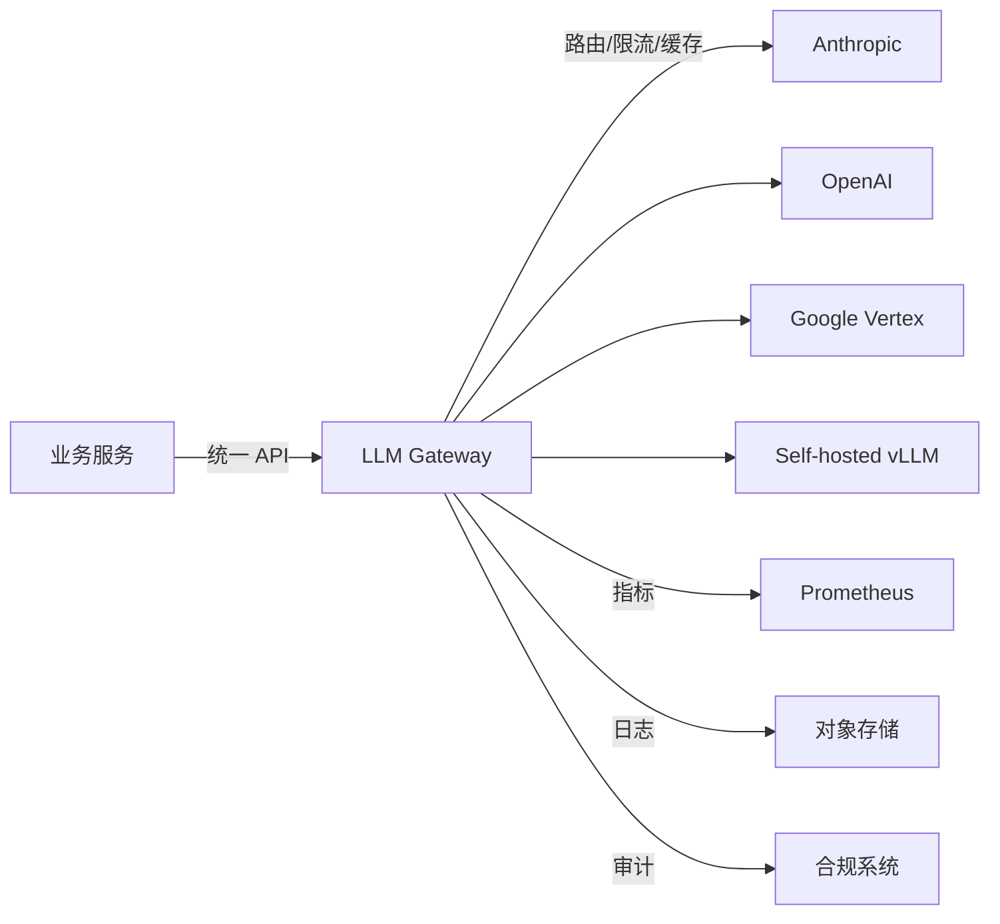
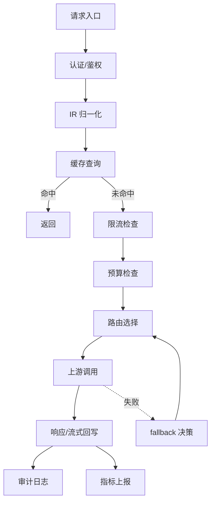
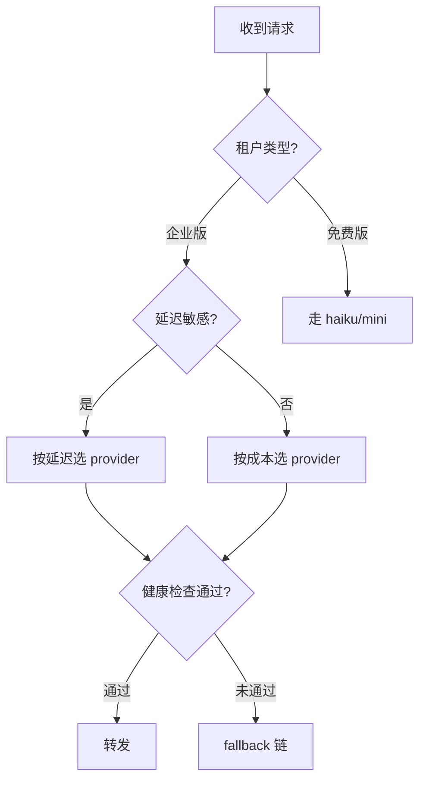
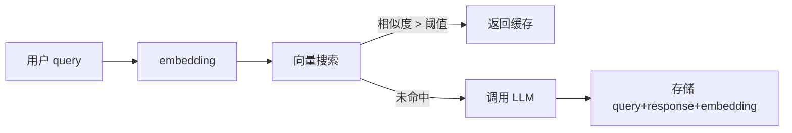
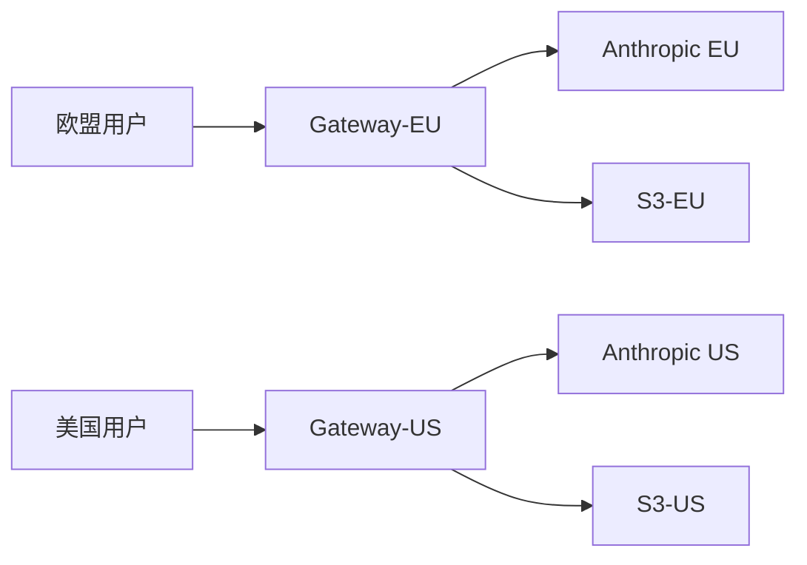
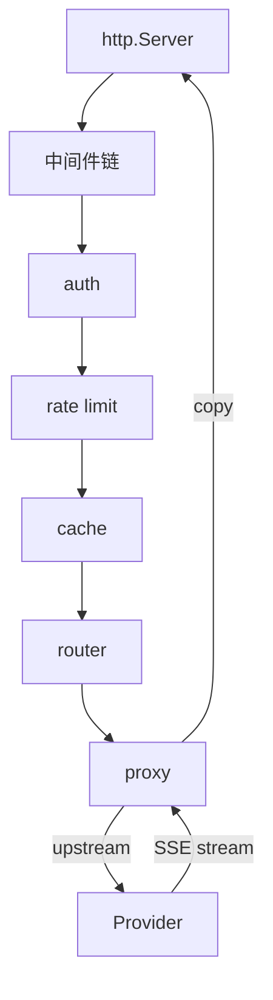

# A11 - 精通 LLM Gateway 与流量治理

> 当你的应用从单一调用 `claude.Messages.Create` 演进到每天数百万次跨多个 provider 的混合调用时，"直接打到上游"这个模式就会从优雅变成灾难。LLM Gateway 是把这层混乱重新治理起来的中枢。本文以 2026 年 5 月的生态为基准,带你用 Go 从零设计并实现一个生产级 LLM Gateway。

## 1. 引言:为什么需要 LLM Gateway

让我们先从一个真实的故事开始。某中型 SaaS 公司在 2024 年初接入了 Claude API 用于内容生成。最初的代码大概是这样的:

```go
client := anthropic.NewClient(os.Getenv("ANTHROPIC_API_KEY"))
resp, err := client.Messages.New(ctx, anthropic.MessageNewParams{
    Model:     anthropic.F("claude-sonnet-4-6"),
    MaxTokens: anthropic.F(int64(1024)),
    Messages:  anthropic.F([]anthropic.MessageParam{...}),
})
```

这段代码运行了 8 个月,然后开始崩溃:

- **provider 故障**:Anthropic 区域性 incident 导致 P0 业务中断 2 小时。
- **成本失控**:某次产品上线后,一个隐藏 bug 让单日成本从 800 美元飙升到 27000 美元。
- **限流频发**:大客户批量任务把 ITPM 配额用光,小客户的实时请求被 429。
- **审计缺失**:GDPR 调查要求列出过去 90 天某用户的所有 prompt,而日志只在 stdout。
- **A/B 测试痛苦**:产品想对比 Sonnet 4 和 GPT-5 的效果,要在 17 个微服务里手动改代码。
- **新模型迁移**:Claude 4.5 发布后,要在 200+ 处调用点更新模型 ID。

这些问题不是 LLM 独有的,但 LLM 调用因为单价高、延迟长、流式输出、token 计费等特性,把它们放大了一个数量级。LLM Gateway 就是这层治理的产物 - 它在你的业务代码和上游 provider 之间,扮演**反向代理 + 策略中枢 + 可观测平面**的三重角色。

一个清晰的心智模型:



Gateway 让业务代码只关心**"我要做什么"**(生成、嵌入、工具调用),而把**"用谁做、怎么做、能不能做、做了多少钱"**这些横切关注点交给基础设施。这就像 2010 年代的 API Gateway(Kong、APISIX)对普通 HTTP API 做的事,只是 LLM 的特性让它的形态略有不同。

什么时候你需要 LLM Gateway?这里是一个粗略的判断标准:

| 信号 | 含义 |
|------|------|
| 你的业务跨 2 个以上 LLM provider | 多 provider 抽象、故障切换、成本路由 |
| 单日 LLM 成本 > 1000 美元 | 缓存、成本告警、租户级配额 |
| 有多租户/多团队共享 LLM 预算 | 配额隔离、按团队核算 |
| 受合规约束(SOC2/GDPR/HIPAA) | 集中审计、PII 脱敏、数据驻留 |
| 上下文长且重复(RAG、长 system prompt) | prompt 缓存命中率优化 |
| 想做 A/B 测试或灰度新模型 | 流量切分、对照指标 |
| 有低延迟要求(< 1s TTFT) | 上游延迟监控、就近路由 |

如果只命中 1 条,通常 SDK + 一个 wrapper 包就够了。命中 3 条以上,自建或采购 Gateway 几乎是必然选择。

## 2. 核心能力:Gateway 到底做什么

一个成熟的 LLM Gateway 通常提供下面 7 类能力。

### 2.1 统一 API

不同 provider 的 API schema 差异很大。Anthropic 的 messages、OpenAI 的 chat completions、Google 的 generateContent,字段名、消息角色、tool 定义格式都不一样。Gateway 通常会提供一层统一的 schema,典型选择有三种:

1. **OpenAI 兼容**:把所有 provider 翻译成 OpenAI 的 chat completions 格式。优点是生态最大(几乎所有 LLM 客户端库都支持),缺点是它无法表达 Anthropic 特有的能力(如 prompt caching ephemeral block、interleaved thinking)。
2. **Anthropic 兼容**:翻译成 messages 格式。在做 Claude 为主的应用时这是更优雅的选择,因为它原生支持 system blocks、content blocks、tool_use blocks。
3. **自有 schema**:为多 provider 设计一个超集。最灵活但生态最小。

2026 年的主流选择是**双协议网关**:同时暴露 OpenAI 兼容和 Anthropic 兼容两套端点,内部用统一的中间表示(IR)处理。LiteLLM、Portkey 都已经支持这种模式。

### 2.2 多 provider 路由

路由的决策维度后面专门讲(第 3 节)。这里先建立心智模型:Gateway 收到一个请求后,要决定**把它送到哪个上游、用哪个模型、走哪条网络路径**。这个决策可能是静态的(配置文件指定),也可能是动态的(基于实时延迟、配额、成本)。

### 2.3 限流

LLM 限流和普通 API 限流的最大区别是:**它必须按 token 计**,不能只按 request 计。一个 256K 上下文的请求消耗的资源是一个 100 token 请求的 2500 倍。如果你只按 QPS 限流,大上下文请求会轻易把 provider 的 ITPM(input tokens per minute)配额打满,导致后续请求全部 429。

### 2.4 降级与 fallback

provider 故障时自动切换到备用 provider。这是 Gateway 最常被引用的卖点,但也是最容易做错的能力之一。后面会讲为什么"无脑 fallback"反而会让事情变得更糟。

### 2.5 缓存

LLM 的缓存有两层:

- **Exact match 缓存**:输入完全相同时直接返回缓存结果。适用于 deterministic 调用(temperature=0、相同 prompt)。
- **Semantic 缓存**:用 embedding 计算输入相似度,相似度高于阈值时返回历史结果。适用于客服 FAQ、知识问答等高重复场景。

注意 Gateway 缓存和 provider 自身的 prompt cache 不是一回事 - 后者是 provider 内部对 KV cache 的复用,Gateway 缓存的是**完整的请求-响应对**。

### 2.6 审计与合规

每个请求需要记录:谁(user_id)、什么时候(timestamp)、用了哪个模型、消耗了多少 token、产生了多少成本、prompt 内容(可脱敏后存储)、响应内容。这些数据是事后回溯、合规审计、成本核算的基础。

### 2.7 成本控制

实时统计每个用户/团队/项目的消耗,在接近配额时告警,超出时拒绝或降级。这部分需要紧密配合限流和审计。

把这 7 类能力放在一起,Gateway 的内部结构大致是这样:



## 3. 路由策略:不只是负载均衡

LLM 路由比传统 API 路由复杂得多,因为决策维度本身就是多元的。下面是 6 种常见维度,生产 Gateway 通常组合使用。

### 3.1 按模型路由

最基础的策略。客户端指定 `model: claude-sonnet-4-6`,Gateway 查表把它路由到 Anthropic。如果客户端用了 alias(如 `model: smart`),Gateway 解析 alias 后选择具体模型。alias 机制非常实用,因为它让你可以**在不改业务代码的前提下**全局升级模型。

```go
type ModelAlias struct {
    Alias    string
    Provider string
    ModelID  string
    Weight   int
}

var aliases = map[string][]ModelAlias{
    "smart": {
        {Alias: "smart", Provider: "anthropic", ModelID: "claude-sonnet-4-6", Weight: 100},
    },
    "fast": {
        {Alias: "fast", Provider: "anthropic", ModelID: "claude-haiku-4-5", Weight: 80},
        {Alias: "fast", Provider: "openai", ModelID: "gpt-5-mini", Weight: 20},
    },
}
```

### 3.2 按用户/租户路由

不同用户/租户路由到不同的 provider 或 API key。常见场景:

- 企业版用户走专属 API key 享受更高配额。
- 试用用户走便宜的模型。
- 数据驻留要求:欧盟用户走 Anthropic EU 端点,美国用户走 US 端点。

实现上通常基于 JWT 的 claim 或 API key 元数据做决策。

### 3.3 按成本路由

在精度要求不高的场景下,Gateway 可以自动把请求路由到最便宜的可用 provider。2026 年 5 月几个主流模型的参考价格(blended,可能随时变化):

| 模型 | Input $/MTok | Output $/MTok | 适合场景 |
|------|-------------:|--------------:|---------|
| claude-haiku-4-5 | 1.00 | 5.00 | 快速分类、简单摘要 |
| claude-sonnet-4-6 | 3.00 | 15.00 | 通用任务、agentic |
| claude-opus-4-7 | 15.00 | 75.00 | 复杂推理 |
| gpt-5-mini | 0.50 | 2.00 | 高并发简单任务 |
| gpt-5 | 5.00 | 20.00 | 通用 |
| gemini-2.5-pro | 2.50 | 10.00 | 多模态 |
| 自建 vLLM (70B) | ~0.30 | ~0.30 | 离线批处理 |

按成本路由的陷阱在于:**便宜的模型可能输出更多 token**(冗长、不准确导致需要重试),最终总成本反而更高。健康的实现需要把"完成单位任务的总成本"作为决策依据,而不是单价。

### 3.4 按延迟路由

实时监控每个 provider 的 TTFT(Time To First Token)和 tokens-per-second,自动把延迟敏感的请求路由到最快的 provider。这种策略对 chatbot 场景特别有效。实现上通常用滑动窗口统计 P50/P95 延迟,结合 circuit breaker。

### 3.5 按可用性路由(健康检查)

每个 provider 都有自己的故障模式:

- **5xx 故障**:服务器内部错误,通常很短。
- **529 overloaded**:provider 内部排队满了,需要后退。
- **区域性故障**:某个 region endpoint 不可达。
- **API key 失效**:个别 key 被吊销。

Gateway 需要为每个(provider, model, key)组合维护一个健康分数,基于近 N 次请求的成功率、错误类型、延迟综合计算。健康分低于阈值时停止路由,经过冷却时间后做小流量试探(probe)恢复。

### 3.6 按能力路由

不同模型支持不同能力:

| 能力 | Claude Sonnet 4.5 | GPT-5 | Gemini 2.5 Pro |
|------|:-:|:-:|:-:|
| 200K+ 上下文 | ✓ | ✓ | ✓(1M) |
| 视觉输入 | ✓ | ✓ | ✓ |
| 音频输入 | ✗ | ✓ | ✓ |
| extended thinking | ✓ | ✓ | ✓ |
| 文件 API | ✓ | ✓ | ✓ |
| computer use | ✓ | ✗ | ✗ |

Gateway 解析请求的 content blocks,如果包含音频,自动路由到支持的 provider;如果要求 computer use,只能路由到 Anthropic。

### 3.7 组合策略

实际生产中是多维度组合的决策。一个典型的决策树:



下面是一个简化但可工作的路由器 Go 实现:

```go
package gateway

import (
    "context"
    "errors"
    "sort"
    "sync"
    "sync/atomic"
    "time"
)

type Upstream struct {
    Name      string
    Provider  string
    Model     string
    APIKey    string
    BaseURL   string
    CostInput float64 // $/MTok
    CostOutput float64
    health    *HealthTracker
}

type HealthTracker struct {
    successes   atomic.Uint64
    failures    atomic.Uint64
    lastFailure atomic.Int64
    p95Latency  atomic.Int64 // microseconds
}

func (h *HealthTracker) Score() float64 {
    s, f := h.successes.Load(), h.failures.Load()
    total := s + f
    if total < 10 {
        return 1.0 // 数据不足,先信任
    }
    return float64(s) / float64(total)
}

type Router struct {
    upstreams map[string][]*Upstream // alias -> upstreams
    mu        sync.RWMutex
    policy    RoutingPolicy
}

type RoutingPolicy func(req *Request, candidates []*Upstream) (*Upstream, error)

func (r *Router) Route(ctx context.Context, req *Request) (*Upstream, error) {
    r.mu.RLock()
    candidates := r.upstreams[req.Alias]
    r.mu.RUnlock()
    if len(candidates) == 0 {
        return nil, errors.New("no upstream for alias " + req.Alias)
    }
    // 过滤健康分低的
    healthy := make([]*Upstream, 0, len(candidates))
    for _, u := range candidates {
        if u.health.Score() > 0.7 {
            healthy = append(healthy, u)
        }
    }
    if len(healthy) == 0 {
        // 都不健康,选最少坏的做 probe
        sort.Slice(candidates, func(i, j int) bool {
            return candidates[i].health.Score() > candidates[j].health.Score()
        })
        return candidates[0], nil
    }
    return r.policy(req, healthy)
}

// PolicyByLatency 选 P95 延迟最低的
func PolicyByLatency(req *Request, candidates []*Upstream) (*Upstream, error) {
    sort.Slice(candidates, func(i, j int) bool {
        return candidates[i].health.p95Latency.Load() < candidates[j].health.p95Latency.Load()
    })
    return candidates[0], nil
}

// PolicyByCost 选预估总成本最低的
func PolicyByCost(req *Request, candidates []*Upstream) (*Upstream, error) {
    inputTokens := float64(req.EstimatedInputTokens)
    expectedOutput := float64(req.EstimatedOutputTokens)
    sort.Slice(candidates, func(i, j int) bool {
        ci := candidates[i].CostInput*inputTokens/1e6 + candidates[i].CostOutput*expectedOutput/1e6
        cj := candidates[j].CostInput*inputTokens/1e6 + candidates[j].CostOutput*expectedOutput/1e6
        return ci < cj
    })
    return candidates[0], nil
}

func (h *HealthTracker) RecordSuccess(latency time.Duration) {
    h.successes.Add(1)
    // 简化的 P95 跟踪,生产实现请用 t-digest 或 HDRHistogram
    cur := h.p95Latency.Load()
    sample := latency.Microseconds()
    if sample > cur {
        h.p95Latency.Store(cur + (sample-cur)/20)
    } else {
        h.p95Latency.Store(cur - (cur-sample)/20)
    }
}

func (h *HealthTracker) RecordFailure() {
    h.failures.Add(1)
    h.lastFailure.Store(time.Now().Unix())
}
```

注意几个关键设计:

1. **健康分使用滑动窗口**:这里简化为累计计数,生产实现应该用 `time-bucketed counter` 或 `EWMA`(指数加权移动平均)。
2. **probe 机制**:全部 unhealthy 时仍要尝试,否则永远恢复不了。
3. **P95 跟踪用近似算法**:精确 P95 需要保留所有样本,内存开销大。t-digest 是工业标准。

## 4. 限流:token 才是真正的资源

回到那个关键认知:LLM 限流必须按 token 计。但我们具体怎么做?

### 4.1 限流的多个维度

一个 LLM Gateway 通常要同时维护下面 5-6 个维度的限流:

| 维度 | 单位 | 用途 |
|------|------|------|
| 全局 RPM | requests/min | 防止 Gateway 自身过载 |
| 上游 ITPM | input tokens/min | 不超过 provider 配额 |
| 上游 OTPM | output tokens/min | 不超过 provider 配额 |
| 租户 budget | $/day | 财务控制 |
| 用户 RPM | requests/min | 防滥用 |
| 用户 token/day | tokens/day | 防滥用 |

每个请求要同时通过所有相关维度的检查。任何一个维度拒绝,整个请求拒绝。

### 4.2 Token bucket vs sliding window

两种主流限流算法的对比:

**Token bucket**:容量 C,以速率 R 补充。请求到来时尝试取 N 个 token,够就放行,不够就拒绝或等待。优点是允许突发(burst up to C),实现简单。缺点是边界处可能允许 2C 的瞬时流量。

**Sliding window**:统计最近 W 时间内的总消耗,超过 limit 拒绝。优点是严格控制,缺点是需要保留事件历史(或近似算法),状态开销大。

对于 LLM:

- **请求数限流**用 token bucket 已经足够。
- **token 数限流**也用 token bucket,但容量设为 0(不允许突发),因为 LLM 流量本身就是大颗粒。
- **预算控制**用 sliding window 或固定窗口,因为预算是严格的。

### 4.3 限流的难点:预估 token

LLM 限流的根本难点在于:**请求到达时你不知道它会消耗多少 token**。你需要预估:

- **input tokens**:可以用 tokenizer 精确计算,但成本不可忽略(每秒数千次 tokenize 会消耗 CPU)。近似方法是字符数 / 3.5 或 BPE 的快速近似。
- **output tokens**:必须预估。两种思路:
  1. 使用 `max_tokens` 作为上界:保守,但浪费配额。
  2. 用历史数据训练一个预测模型:基于 prompt 类型/长度预测平均输出长度。

实际生产中,一种实用做法是:**入站时按 max_tokens 预扣**,**出站时按实际用量退还/补扣**。这种"乐观锁"风格保证了不超过 provider 配额,代价是会拒绝一些原本可以通过的请求。

### 4.4 Go 实现:多维度 token bucket

```go
package gateway

import (
    "context"
    "errors"
    "sync"
    "time"
)

type Bucket struct {
    mu         sync.Mutex
    capacity   int64
    tokens     int64
    refillRate int64 // tokens per second
    lastRefill time.Time
}

func NewBucket(capacity, refillRate int64) *Bucket {
    return &Bucket{
        capacity:   capacity,
        tokens:     capacity,
        refillRate: refillRate,
        lastRefill: time.Now(),
    }
}

func (b *Bucket) refill() {
    now := time.Now()
    elapsed := now.Sub(b.lastRefill).Seconds()
    add := int64(elapsed * float64(b.refillRate))
    if add > 0 {
        b.tokens += add
        if b.tokens > b.capacity {
            b.tokens = b.capacity
        }
        b.lastRefill = now
    }
}

// TryTake 尝试取 n 个 token,不阻塞
func (b *Bucket) TryTake(n int64) bool {
    b.mu.Lock()
    defer b.mu.Unlock()
    b.refill()
    if b.tokens >= n {
        b.tokens -= n
        return true
    }
    return false
}

// Return 退还 n 个 token(用于实际消耗 < 预扣的场景)
func (b *Bucket) Return(n int64) {
    b.mu.Lock()
    defer b.mu.Unlock()
    b.tokens += n
    if b.tokens > b.capacity {
        b.tokens = b.capacity
    }
}

// Overdraft 透支 n 个 token(用于实际消耗 > 预扣)
func (b *Bucket) Overdraft(n int64) {
    b.mu.Lock()
    defer b.mu.Unlock()
    b.tokens -= n
}

type Limiter struct {
    buckets map[string]*Bucket
    mu      sync.RWMutex
}

type LimitDimension struct {
    Key       string // 例如 "tenant:acme:itpm"
    EstUsage  int64
}

// CheckAndReserve 多维度检查,全部通过才扣减,有一个失败就回滚
func (l *Limiter) CheckAndReserve(ctx context.Context, dims []LimitDimension) error {
    reserved := make([]LimitDimension, 0, len(dims))
    for _, d := range dims {
        l.mu.RLock()
        b, ok := l.buckets[d.Key]
        l.mu.RUnlock()
        if !ok {
            continue // 无限制
        }
        if !b.TryTake(d.EstUsage) {
            // 回滚已扣减的
            for _, r := range reserved {
                l.buckets[r.Key].Return(r.EstUsage)
            }
            return errors.New("rate limit exceeded on " + d.Key)
        }
        reserved = append(reserved, d)
    }
    return nil
}

func (l *Limiter) Settle(ctx context.Context, dims []LimitDimension, actualUsage map[string]int64) {
    for _, d := range dims {
        actual := actualUsage[d.Key]
        diff := actual - d.EstUsage
        l.mu.RLock()
        b, ok := l.buckets[d.Key]
        l.mu.RUnlock()
        if !ok {
            continue
        }
        if diff > 0 {
            b.Overdraft(diff)
        } else if diff < 0 {
            b.Return(-diff)
        }
    }
}
```

注意 `CheckAndReserve` 的关键设计:**多维度检查必须是原子的**。如果维度 A 通过、维度 B 失败,要回滚 A 的扣减。这避免了 "通过 ITPM 检查但被 RPM 拒" 后 ITPM 配额被吃掉的问题。

### 4.5 分布式限流

单机 token bucket 在多副本 Gateway 中会失效 - 每个副本独立维护状态,实际限流会变成 N 倍。生产环境通常有两种方案:

1. **Redis 集中式**:用 Lua 脚本保证原子性。延迟代价约 0.5-2ms,在 LLM 场景下几乎可忽略。
2. **本地近似**:每个副本本地维护 1/N 的配额,定期对账修正。延迟为零,但精度差。

下面是 Redis 版本的关键 Lua 脚本:

```lua
-- KEYS[1] = bucket key
-- ARGV[1] = capacity
-- ARGV[2] = refill_rate (tokens/sec)
-- ARGV[3] = now_ms
-- ARGV[4] = requested_tokens

local data = redis.call("HMGET", KEYS[1], "tokens", "last_refill")
local tokens = tonumber(data[1]) or tonumber(ARGV[1])
local last_refill = tonumber(data[2]) or tonumber(ARGV[3])

local elapsed = (tonumber(ARGV[3]) - last_refill) / 1000.0
local refilled = elapsed * tonumber(ARGV[2])
tokens = math.min(tonumber(ARGV[1]), tokens + refilled)

local requested = tonumber(ARGV[4])
if tokens >= requested then
    tokens = tokens - requested
    redis.call("HMSET", KEYS[1], "tokens", tokens, "last_refill", ARGV[3])
    redis.call("EXPIRE", KEYS[1], 600)
    return {1, tokens}
else
    redis.call("HMSET", KEYS[1], "tokens", tokens, "last_refill", ARGV[3])
    return {0, tokens}
end
```

## 5. 降级与 fallback:谨慎使用的强力工具

provider 故障时自动 fallback 听起来很美好,但生产实践中它经常引入更大的问题。让我先讲一个反面案例。

某团队在 Claude 主线上配置了"故障自动 fallback 到 GPT"。某天 Anthropic 出现区域性慢响应(每请求 30 秒),Gateway 在 5 秒超时后切到 GPT。结果:

- GPT 端的 RPM 配额是为日常流量准备的,只有 Claude 的 10%。
- 大量切流到 GPT 后,GPT 也开始 429。
- 团队没有做 GPT 的 fallback 链,业务直接挂掉。
- 同时 Anthropic 也恢复了,但因为 health check 数据有滞后,流量还在 GPT 那边死扛。

教训:**fallback 不是"零成本的保险"**。它会改变流量分布,可能把次要 provider 也打挂。

### 5.1 健康的 fallback 设计原则

1. **fallback 链上的每一级都要做容量规划**:fallback 到 N 级时,N 级要能承担 1 级的全部流量(至少能承担一段时间)。
2. **fallback 必须有触发条件和退出条件**:不是"失败一次就切",而是"近 1 分钟失败率 > 30% 且至少 50 个样本"。退出也要有条件,通过 probe 试探恢复。
3. **fallback 要分级**:5xx/超时 fallback,4xx(参数错误)不 fallback - 后者是业务问题,fallback 也救不了。
4. **fallback 要降级而非平移**:从 Sonnet fallback 到 Haiku 是合理的(便宜、配额大),fallback 到 GPT-5 反而风险更大(没保护、能力差异大)。
5. **fallback 要可观测**:每次 fallback 触发要打指标,产品/SRE 要能看到。

### 5.2 Circuit breaker

Circuit breaker 是 fallback 的标准前置组件。它有三个状态:

- **Closed**:正常放行,统计失败率。
- **Open**:失败率超阈值,直接拒绝(或 fallback),不再打上游。
- **Half-open**:冷却时间过后,放行少量请求试探,成功则回到 Closed,失败则继续 Open。

Go 生态里 `sony/gobreaker` 是经典实现,但 LLM 场景下你通常需要自定义版本,因为:

- 失败定义要分类(5xx 算,4xx 不算,529 算但权重低)。
- 半开状态的 probe 要按 token 控制,不能让 probe 也产生大成本。

```go
type CircuitBreaker struct {
    mu              sync.Mutex
    state           State
    failureThreshold float64
    minRequests     int
    cooldown        time.Duration
    halfOpenProbes  int

    successes uint64
    failures  uint64
    openedAt  time.Time
}

type State int

const (
    StateClosed State = iota
    StateOpen
    StateHalfOpen
)

func (cb *CircuitBreaker) Allow() bool {
    cb.mu.Lock()
    defer cb.mu.Unlock()
    switch cb.state {
    case StateOpen:
        if time.Since(cb.openedAt) > cb.cooldown {
            cb.state = StateHalfOpen
            return true
        }
        return false
    case StateHalfOpen:
        return true
    default:
        return true
    }
}

func (cb *CircuitBreaker) Record(success bool) {
    cb.mu.Lock()
    defer cb.mu.Unlock()
    if success {
        cb.successes++
        if cb.state == StateHalfOpen {
            cb.state = StateClosed
            cb.successes, cb.failures = 0, 0
        }
    } else {
        cb.failures++
        total := cb.successes + cb.failures
        if total >= uint64(cb.minRequests) {
            rate := float64(cb.failures) / float64(total)
            if rate > cb.failureThreshold {
                cb.state = StateOpen
                cb.openedAt = time.Now()
                cb.successes, cb.failures = 0, 0
            }
        }
    }
}
```

### 5.3 fallback 链示例

一个典型的 fallback 配置:

```yaml
chains:
  smart_chat:
    - provider: anthropic
      model: claude-sonnet-4-6
      timeout: 30s
      retry: 1
    - provider: anthropic
      model: claude-haiku-4-5
      timeout: 20s
      retry: 0
      condition: "primary failure rate > 30% in 60s OR primary 5xx"
    - provider: openai
      model: gpt-5-mini
      timeout: 20s
      retry: 0
      condition: "anthropic fully down for 5min"
```

注意第二级是同 provider 的便宜模型 - 这是更优的设计,因为:

- 同 provider 故障时切换是单点问题,只切模型不切 provider 大概率仍然不可用。
- 但**仍然有意义**:因为 Anthropic 内部不同模型可能跑在不同的 inference 集群,故障未必同步。
- 第三级才跨 provider,且要求"完全不可用"才触发,避免误切。

## 6. Semantic Cache:相似就够了

Exact match 缓存的命中率通常很低(< 5%),因为用户的输入文本几乎不会完全一致。Semantic cache 通过 embedding 相似度匹配,在客服 FAQ、知识问答场景能把命中率推到 30-50%。

### 6.1 Semantic cache 的工作流程



关键参数:

- **相似度阈值**:cosine similarity > 0.95 通常意味着语义几乎相同,> 0.85 已经有可能语义不同。
- **embedding 模型**:`text-embedding-3-small`(OpenAI)或 `voyage-3-lite`(Anthropic 推荐)是性价比之选。
- **TTL**:LLM 输出可能随时间过时(如新闻、价格),需要按内容类型设置 TTL。

### 6.2 Go 实现要点

```go
type SemanticCache struct {
    embedder  Embedder
    store     VectorStore
    threshold float64
    ttl       time.Duration
}

type CachedEntry struct {
    Query     string
    Response  []byte
    Embedding []float32
    CreatedAt time.Time
    ModelID   string
    Hits      int
}

func (c *SemanticCache) Get(ctx context.Context, req *Request) (*CachedEntry, error) {
    queryText := extractQueryText(req)
    if len(queryText) > 8000 {
        return nil, nil // 太长的 prompt 通常不适合 cache
    }
    emb, err := c.embedder.Embed(ctx, queryText)
    if err != nil {
        return nil, err
    }
    candidates, err := c.store.Search(ctx, emb, 5)
    if err != nil {
        return nil, err
    }
    for _, cand := range candidates {
        if cand.Similarity < c.threshold {
            continue
        }
        if time.Since(cand.Entry.CreatedAt) > c.ttl {
            continue
        }
        if cand.Entry.ModelID != req.ResolvedModel {
            continue // 不同模型的输出不互相缓存
        }
        return cand.Entry, nil
    }
    return nil, nil
}
```

### 6.3 semantic cache 的陷阱

这是 Gateway 设计中最容易翻车的能力。常见错误:

1. **阈值设太低**:0.85 看起来差不多,但语义差异已经足够大。"如何注销账号" 和 "如何注册账号"的 embedding 相似度可能高达 0.92。
2. **忽略 system prompt**:同一个用户问题,在不同的 system prompt 下应该有不同答案。cache key 必须包含 system。
3. **忽略 tool 列表**:相同 query 但 tool 不同,期望的响应完全不同。
4. **缓存了不该缓存的**:涉及实时数据、用户特定信息的查询不能缓存。需要应用层声明 `cacheable: true/false`。
5. **缓存污染**:用户输入恶意 prompt 后,如果命中阈值,会污染未来的查询。

**经验法则**:semantic cache 默认应该是 opt-in,而不是 opt-out。让业务方明确声明 "这条 query 适合 semantic cache",而不是 Gateway 默认缓存一切。

## 7. AB 测试:科学切流

Gateway 是做 A/B 测试的理想位置 - 业务代码完全无感,流量分发完全可控。

### 7.1 切流维度

最常见的切流维度:

- **按用户**(基于 user_id 的稳定哈希):同一用户始终看到同一变体,避免体验跳变。
- **按请求**(随机或基于 request_id):每个请求独立分配,可以快速收集大量样本。
- **按租户/团队**:整个团队作为实验单位,适合需要团队级反馈的实验。

```go
type Experiment struct {
    Name     string
    Variants []Variant
    Salt     string
    Strategy string // "user", "request"
}

type Variant struct {
    Name     string
    Weight   int
    ModelID  string
    Provider string
}

func (e *Experiment) Assign(req *Request) Variant {
    var key string
    switch e.Strategy {
    case "user":
        key = e.Salt + req.UserID
    default:
        key = e.Salt + req.RequestID
    }
    h := fnv.New32()
    h.Write([]byte(key))
    n := int(h.Sum32() % 100)
    cum := 0
    for _, v := range e.Variants {
        cum += v.Weight
        if n < cum {
            return v
        }
    }
    return e.Variants[len(e.Variants)-1]
}
```

### 7.2 对照指标

LLM A/B 测试的特点是结果质量很难量化。常见指标:

- **TTFT、tokens/sec、E2E latency**:延迟类,容易测。
- **完成率**:用户是否读完输出。
- **后续编辑率**:用户拿到输出后是否手动改了多少。
- **用户反馈**:点赞/点踩。
- **下游业务指标**:转化率、留存等。
- **LLM-as-judge**:用更强的模型评估两个变体输出的优劣。

### 7.3 统计显著性

LLM 输出的方差通常很大,需要的样本量比传统 A/B 测试多得多。一个粗略经验:

- 延迟类指标:N > 1000 即可看到差异。
- 业务转化指标:N > 10000 是常见门槛。
- 质量评分:取决于评分方法,LLM-as-judge 通常需要 N > 500。

Gateway 通常不负责统计计算,而是把对照数据导出到 BI 系统。但 Gateway 必须保证**每个请求记录了变体标签**,否则后续分析无从下手。

## 8. 成本控制:实时与精确

成本控制是 LLM Gateway 最重要的"杀手级特性"之一,因为 LLM 单价高、波动大、容易失控。

### 8.1 预算模型

一个生产级 Gateway 通常实现 3 层预算:

1. **租户级月度预算**:`$10000/月`。这是销售和合同层面的硬约束。
2. **团队级日度预算**:`$500/团队/天`。这是公司内部财务分账的依据。
3. **用户级小时预算**:`$50/用户/小时`。这是滥用防护。

每个请求要同时通过所有相关预算的检查。

### 8.2 成本计算

成本计算公式:

```
cost = input_tokens * input_price / 1e6 
     + output_tokens * output_price / 1e6
     + cached_tokens * cache_price / 1e6   // 不同 provider 不同
     + ...
```

注意:

- **cached tokens 通常便宜 10x**:Anthropic 的 cache hit 是 input price 的 10%。
- **batch API 通常便宜 50%**:适合非实时场景。
- **vision/audio 输入**:通常按 token 计,但 token 换算率不同。
- **extended thinking** 算 output tokens,且通常用量大。

Gateway 必须维护一张持续更新的 `pricing.json`,每个 provider 模型的最新价格。建议自动化抓取 + 人工审核。

### 8.3 实时统计

成本统计的难点在于:**响应是流式的,token 数要等到流结束才知道**。两种方案:

1. **流结束后再扣**:简单但有滞后,可能允许超过预算。
2. **流式累加**:每收到一个 chunk 估算 token 累加,接近预算时主动中断流。

第二种方案在 Anthropic 的 SSE 响应里很容易实现,因为 `message_delta` 事件携带 usage 增量。下面是 Go 实现:

```go
type StreamCostTracker struct {
    budget       *BudgetBucket
    inputPrice   float64
    outputPrice  float64
    accumulated  float64
    onExceed     func()
    inputTokens  int64
}

func (t *StreamCostTracker) Init(inputTokens int64) {
    t.inputTokens = inputTokens
    t.accumulated = float64(inputTokens) * t.inputPrice / 1e6
    t.budget.Reserve(t.accumulated)
}

func (t *StreamCostTracker) OnDelta(outputTokensDelta int64) bool {
    deltaCost := float64(outputTokensDelta) * t.outputPrice / 1e6
    t.accumulated += deltaCost
    if !t.budget.Allow(deltaCost) {
        if t.onExceed != nil {
            t.onExceed()
        }
        return false // 信号让上层中断流
    }
    return true
}
```

### 8.4 部门核算

大公司通常需要按部门核算 LLM 成本。Gateway 必须在每个请求上携带"成本归属"信息:

```http
X-Cost-Center: marketing
X-Project: campaign-q2-2026
X-User: alice@corp.com
```

Gateway 按这些维度聚合数据,定期生成账单 CSV/dashboard。

## 9. 审计与合规

### 9.1 日志保留

合规要求(SOC2、GDPR、HIPAA)通常规定:

- 操作日志保留至少 12 个月。
- 包含完整的 prompt 和 response。
- 不可篡改(WORM 存储或哈希链)。

Gateway 是收集这些日志最自然的位置。但完整 prompt + response 的存储量可能很大:每条记录 ~10KB,1M req/day 就是 10GB/day,一年 3.6TB。建议:

- 用对象存储(S3 + Glacier)而非数据库,成本低一个数量级。
- 按时间分区(daily folder)便于过期删除。
- 启用 server-side encryption。

### 9.2 PII 脱敏

某些场景下你不能把原始 prompt 存到日志:

- 用户输入了信用卡号、身份证号、邮箱。
- 数据驻留约束:欧盟用户数据不能存到美东。

Gateway 可以提供 PII detection + masking pipeline,在写日志前对 prompt/response 做替换。但要注意:

- PII detector 本身可能误报,误把正常文本替换掉。
- PII detector 通常本身就是个 LLM 调用,性能开销大。建议异步做。
- 完全脱敏的日志在调试时几乎没用。生产实践是**保留原始 + 哈希索引**,只在合规审计时按需解密。

### 9.3 数据驻留



Gateway 按用户区域分发,数据在区域内闭环。这是 GDPR 的标准做法。

## 10. 开源方案对比

2026 年 5 月,主流 LLM Gateway 方案及其特点:

| 方案 | 语言 | 部署模式 | 主要特色 | 短板 |
|------|------|---------|---------|------|
| LiteLLM | Python | self-hosted/SaaS | 支持 100+ provider,OpenAI 兼容 | 性能(Python)、复杂场景需扩展 |
| Portkey | TS | SaaS/self-hosted | 强大的 dashboard、A/B 测试 | 自建版本功能受限 |
| Helicone | TS | SaaS/self-hosted | 观测性强,async logging 优秀 | 主要做观测,治理偏弱 |
| OpenRouter | -- | SaaS only | 极简,统一 API | 不能自建 |
| Kong AI Gateway | Lua | self-hosted | 基于 Kong 网关 | 配置复杂,LLM 特性较少 |
| 自建 (Go/Rust) | -- | -- | 完全可控,性能极致 | 工程量大,容易踩坑 |

选型经验:

- **创业公司、< 100K req/day**:直接用 SaaS(Portkey/OpenRouter),省事。
- **中型公司、合规要求高**:LiteLLM self-hosted,或买 Portkey Enterprise。
- **大型公司、流量 > 1M req/day**:自建 Go/Rust Gateway,LiteLLM 性能跟不上。
- **金融/医疗**:几乎都是自建,因为开源/SaaS 的合规审计成本比工程成本还高。

## 11. 用 Go 自建一个 Gateway

下面我们用 `net/http` 构建一个最小可工作的 LLM Gateway 骨架。完整代码省略业务细节,聚焦核心架构。

### 11.1 整体结构



### 11.2 核心反代

```go
package gateway

import (
    "bytes"
    "context"
    "encoding/json"
    "fmt"
    "io"
    "net/http"
    "time"
)

type Gateway struct {
    router    *Router
    limiter   *Limiter
    cache     *SemanticCache
    budgets   *BudgetManager
    auditor   Auditor
    metrics   *Metrics
    client    *http.Client
}

func New() *Gateway {
    return &Gateway{
        client: &http.Client{
            Timeout: 0, // 流式不能设全局 timeout
            Transport: &http.Transport{
                MaxIdleConns:        500,
                MaxIdleConnsPerHost: 100,
                IdleConnTimeout:     90 * time.Second,
            },
        },
    }
}

func (g *Gateway) ServeHTTP(w http.ResponseWriter, r *http.Request) {
    ctx := r.Context()
    req, err := g.parseRequest(r)
    if err != nil {
        writeError(w, 400, err)
        return
    }
    // 认证
    principal, err := g.authenticate(r)
    if err != nil {
        writeError(w, 401, err)
        return
    }
    req.Principal = principal
    // 缓存
    if req.Cacheable {
        if cached, _ := g.cache.Get(ctx, req); cached != nil {
            g.metrics.CacheHit(req)
            w.Write(cached.Response)
            return
        }
    }
    // 限流
    dims := g.computeLimitDimensions(req)
    if err := g.limiter.CheckAndReserve(ctx, dims); err != nil {
        writeError(w, 429, err)
        return
    }
    defer func() {
        // settle 用实际 usage,在调用结束后
    }()
    // 预算
    if !g.budgets.Allow(ctx, principal, req.EstimatedCost) {
        writeError(w, 402, fmt.Errorf("budget exceeded"))
        return
    }
    // 路由
    upstream, err := g.router.Route(ctx, req)
    if err != nil {
        writeError(w, 503, err)
        return
    }
    // 转发
    if err := g.forward(ctx, w, r, req, upstream); err != nil {
        // fallback 逻辑
        if g.shouldFallback(err) {
            for _, fb := range g.router.Fallbacks(req) {
                if err = g.forward(ctx, w, r, req, fb); err == nil {
                    return
                }
            }
        }
        writeError(w, 502, err)
    }
}

func (g *Gateway) forward(
    ctx context.Context,
    w http.ResponseWriter,
    r *http.Request,
    req *Request,
    up *Upstream,
) error {
    body, err := g.translateRequest(req, up)
    if err != nil {
        return err
    }
    upReq, err := http.NewRequestWithContext(ctx, "POST", up.BaseURL+"/v1/messages", bytes.NewReader(body))
    if err != nil {
        return err
    }
    upReq.Header.Set("Content-Type", "application/json")
    upReq.Header.Set("x-api-key", up.APIKey)
    upReq.Header.Set("anthropic-version", "2023-06-01")
    start := time.Now()
    resp, err := g.client.Do(upReq)
    if err != nil {
        up.health.RecordFailure()
        return err
    }
    defer resp.Body.Close()
    if resp.StatusCode >= 500 {
        up.health.RecordFailure()
        return fmt.Errorf("upstream %d", resp.StatusCode)
    }
    // 流式与非流式分支
    if isSSE(resp) {
        return g.proxyStream(ctx, w, resp, req, up, start)
    }
    return g.proxyNonStream(ctx, w, resp, req, up, start)
}

func (g *Gateway) proxyStream(
    ctx context.Context,
    w http.ResponseWriter,
    resp *http.Response,
    req *Request,
    up *Upstream,
    start time.Time,
) error {
    w.Header().Set("Content-Type", "text/event-stream")
    w.Header().Set("Cache-Control", "no-cache")
    w.Header().Set("Connection", "keep-alive")
    flusher, ok := w.(http.Flusher)
    if !ok {
        return fmt.Errorf("streaming unsupported")
    }
    parser := NewSSEParser(resp.Body)
    audit := g.auditor.Begin(req)
    defer audit.End()
    for {
        event, err := parser.Next()
        if err == io.EOF {
            break
        }
        if err != nil {
            return err
        }
        // 透传给客户端
        if _, err := fmt.Fprintf(w, "event: %s\ndata: %s\n\n", event.Type, event.Data); err != nil {
            return err // 客户端断开
        }
        flusher.Flush()
        // 统计
        if event.Type == "message_delta" {
            var d struct {
                Usage struct {
                    InputTokens  int64 `json:"input_tokens"`
                    OutputTokens int64 `json:"output_tokens"`
                } `json:"usage"`
            }
            json.Unmarshal(event.Data, &d)
            audit.AddTokens(d.Usage.InputTokens, d.Usage.OutputTokens)
        }
    }
    up.health.RecordSuccess(time.Since(start))
    return nil
}
```

### 11.3 中间件设计

Go 风格的中间件链:

```go
type Middleware func(http.Handler) http.Handler

func Chain(h http.Handler, mws ...Middleware) http.Handler {
    for i := len(mws) - 1; i >= 0; i-- {
        h = mws[i](h)
    }
    return h
}

func RequestIDMiddleware(next http.Handler) http.Handler {
    return http.HandlerFunc(func(w http.ResponseWriter, r *http.Request) {
        id := r.Header.Get("X-Request-ID")
        if id == "" {
            id = uuid.NewString()
        }
        w.Header().Set("X-Request-ID", id)
        ctx := context.WithValue(r.Context(), ctxKeyRequestID, id)
        next.ServeHTTP(w, r.WithContext(ctx))
    })
}

func LoggingMiddleware(logger *slog.Logger) Middleware {
    return func(next http.Handler) http.Handler {
        return http.HandlerFunc(func(w http.ResponseWriter, r *http.Request) {
            start := time.Now()
            sw := &statusWriter{ResponseWriter: w, status: 200}
            next.ServeHTTP(sw, r)
            logger.Info("request",
                "method", r.Method,
                "path", r.URL.Path,
                "status", sw.status,
                "duration_ms", time.Since(start).Milliseconds(),
            )
        })
    }
}

type statusWriter struct {
    http.ResponseWriter
    status int
}

func (sw *statusWriter) WriteHeader(code int) {
    sw.status = code
    sw.ResponseWriter.WriteHeader(code)
}
```

### 11.4 流量切分实现

```go
type TrafficSplitter struct {
    experiments map[string]*Experiment
}

func (ts *TrafficSplitter) Apply(req *Request) {
    for _, exp := range ts.experiments {
        if !exp.Matches(req) {
            continue
        }
        variant := exp.Assign(req)
        req.ResolvedProvider = variant.Provider
        req.ResolvedModel = variant.ModelID
        req.Labels["experiment"] = exp.Name
        req.Labels["variant"] = variant.Name
        break // 同一请求只参与一个实验
    }
}
```

### 11.5 main 函数

```go
func main() {
    cfg := loadConfig()
    g := New()
    g.LoadConfig(cfg)

    mux := http.NewServeMux()
    mux.HandleFunc("/v1/messages", g.ServeHTTP)
    mux.HandleFunc("/v1/chat/completions", g.ServeOpenAI)
    mux.Handle("/metrics", promhttp.Handler())
    mux.HandleFunc("/healthz", healthz)

    handler := Chain(mux,
        RequestIDMiddleware,
        LoggingMiddleware(slog.Default()),
        CORSMiddleware,
        RecoveryMiddleware,
    )

    srv := &http.Server{
        Addr:              ":8080",
        Handler:           handler,
        ReadHeaderTimeout: 10 * time.Second,
        // 注意:WriteTimeout 在流式场景必须为 0 或非常大
        WriteTimeout:      0,
        IdleTimeout:       120 * time.Second,
    }
    log.Fatal(srv.ListenAndServe())
}
```

## 12. 生产实践

下面是从多个真实部署里提炼出来的实践清单。

### 12.1 部署拓扑

- **多 region 部署**:Gateway 必须就近部署,因为它在用户和 LLM 之间增加了一跳。常见拓扑:US-East、US-West、EU-Frankfurt、AP-Singapore 各部署一组。
- **Anycast IP 或 GeoDNS**:让用户自动连接到最近的 Gateway。
- **健康检查**:LB 上配置主动健康检查,/healthz 返回上游聚合状态。
- **优雅停机**:`http.Server.Shutdown` 在 Go 里很好用,但流式连接会阻塞它 - 需要在 context 里加 deadline。

### 12.2 性能调优

LLM Gateway 的性能瓶颈通常不在 CPU,而在:

- **goroutine 数**:流式连接长且多,每个连接 2 个 goroutine(read/write)。10K 并发流 = 20K goroutine,内存可控但要监控。
- **网络连接数**:每个 stream 占用一个 socket 到上游。需要调高 `ulimit -n` 到 1M。
- **GC 压力**:JSON 序列化产生大量短命对象。建议用 `bytebufferpool` 或 `sync.Pool` 复用 buffer。
- **TLS 握手**:HTTP/2 + keepalive 可以让多个请求复用一个 TCP+TLS 连接。

`http.Transport` 关键参数:

```go
&http.Transport{
    MaxIdleConns:        2000,
    MaxIdleConnsPerHost: 500,
    MaxConnsPerHost:     0, // 不限
    IdleConnTimeout:     90 * time.Second,
    ResponseHeaderTimeout: 60 * time.Second,
    ExpectContinueTimeout: 1 * time.Second,
    ForceAttemptHTTP2:   true,
}
```

### 12.3 可观测性

至少要暴露这些指标:

| 指标 | 类型 | 含义 |
|------|------|------|
| `llmgw_requests_total{provider,model,status}` | counter | 请求计数 |
| `llmgw_request_duration_seconds` | histogram | E2E 延迟 |
| `llmgw_ttft_seconds{provider,model}` | histogram | Time To First Token |
| `llmgw_tokens_total{kind,provider,model}` | counter | input/output/cached tokens |
| `llmgw_cost_usd_total{provider,model}` | counter | 累计成本 |
| `llmgw_cache_hits_total{type}` | counter | exact/semantic cache 命中 |
| `llmgw_rate_limit_rejections{dim}` | counter | 限流拒绝 |
| `llmgw_circuit_breaker_state{upstream}` | gauge | 0=closed, 1=open, 2=half |
| `llmgw_active_streams` | gauge | 当前活跃流数 |

### 12.4 配置热更新

Gateway 的配置(路由表、限流参数、实验配置)会频繁变更。重启 Gateway 会中断所有活跃流,不可接受。两种方案:

1. **文件 watch**:`fsnotify` 监听 yaml 文件变化,解析后原子替换内存中的配置。
2. **Control plane**:Gateway 主动 pull 配置中心(Consul、etcd、Apollo 等)。

```go
type ConfigManager struct {
    current atomic.Pointer[Config]
    path    string
}

func (m *ConfigManager) Load() *Config {
    return m.current.Load()
}

func (m *ConfigManager) Watch(ctx context.Context) error {
    w, err := fsnotify.NewWatcher()
    if err != nil {
        return err
    }
    defer w.Close()
    w.Add(m.path)
    for {
        select {
        case <-ctx.Done():
            return nil
        case event := <-w.Events:
            if event.Op&fsnotify.Write != 0 {
                if cfg, err := loadConfig(m.path); err == nil {
                    m.current.Store(cfg)
                }
            }
        }
    }
}
```

### 12.5 灰度发布

Gateway 自身的代码灰度也很关键 - 一个 bug 会影响所有 LLM 流量。常见做法:

- **金丝雀部署**:新版本只接 5% 流量,观察 1 小时无异常再放量。
- **shadow traffic**:把生产流量复制一份打到新版本,只看响应不返回给用户。
- **快速回滚**:必须能在 5 分钟内回滚到上一版本。

## 13. 陷阱清单

下面是 Gateway 工程师反复踩过的坑,优先级从高到低。

1. **流式响应不能设 `WriteTimeout`**:`http.Server.WriteTimeout` 是全请求的超时,会强制断开长流。改用 per-write timeout 或 idle timeout。
2. **fallback 链没做容量规划**:fallback 触发时把次要 provider 也打挂,见第 5 节反面案例。
3. **限流只按 request 不按 token**:大上下文请求绕过限流,把 provider 配额吃光。
4. **semantic cache 阈值过低**:0.85 看似相似的 query 实际语义不同,污染响应。
5. **circuit breaker 没有 probe**:全部 open 后永远恢复不了,需要 half-open 探测。
6. **预算检查在请求结束后做**:用户已经看到响应了,扣费失败也没法回滚。预扣是正解。
7. **审计日志写在请求路径里**:同步写慢存储会拖慢 P99。改成 async write 加内存 buffer。
8. **配置热更新有 race**:读配置和写配置在不同 goroutine,用 mutex 或 atomic.Pointer。
9. **没有为 PII 脱敏失败做兜底**:detector 偶尔挂掉就让日志带 PII 进入归档,合规事故。
10. **HTTP/2 stream 多路复用导致 head-of-line blocking**:一个慢请求拖慢同连接其他请求。建议关闭 HTTP/2 多路复用(或限制 per-connection concurrent streams)。
11. **没有为 SSE 加 padding/heartbeat**:某些 ISP 的 transparent proxy 会在 30 秒无字节时断开连接。每 15 秒发心跳。
12. **健康检查策略平均化**:一个 100% 失败和一个 50% 失败被同等对待,但前者明显应该立即下线。
13. **TTFT 没监控**:用户感受的是 TTFT 而不是 E2E latency,但很多团队只监控后者。
14. **Tokenizer 调用占满 CPU**:每个请求都跑 tokenizer 是浪费,做近似估算或异步处理。
15. **logging 把整个 stream 写到一行**:一次 message 几 KB,日志会爆炸。结构化日志只记摘要。
16. **未处理 `429` 的 `retry-after`**:provider 已经告诉你等多久,Gateway 还在死循环重试。

## 14. 2026 现状

截至 2026 年 5 月,LLM Gateway 生态有几个明显趋势。

### 14.1 Provider 原生 Gateway 能力增强

Anthropic、OpenAI、Google 都在自己的 API 平台上集成了部分 Gateway 能力:

- **Anthropic Workspaces**:按 workspace 隔离配额、API key、用量统计。某种程度上是"轻量 Gateway"。
- **OpenAI Project**:类似 Anthropic 的 workspaces,加上更精细的 budget controls。
- **Google AI Studio**:基于 Vertex AI 提供配额和审计。

但这些都是单 provider 的,没法跨 provider 治理。所以独立 Gateway 仍然是多 provider 场景的刚需。

### 14.2 Semantic cache 进入主流

2024 年还在实验室,2026 年已经是 Portkey、LiteLLM 的标配。embedding 模型本身的成本降到了 `$0.02/MTok` 量级,让 semantic cache 的 ROI 显著为正。

### 14.3 Edge Gateway

CDN 厂商(Cloudflare、Fastly)推出了"AI Gateway"产品,在 edge 节点就完成路由、限流、缓存,减少回源延迟。但 edge Gateway 的能力受限(persistent storage 弱、复杂逻辑难表达),目前还只适合简单场景。

### 14.4 OpenAI 兼容 API 成为事实标准

2026 年几乎所有 LLM provider 都提供 OpenAI 兼容端点(Anthropic 的 `https://api.anthropic.com/v1/`（OpenAI SDK 形式，路径 /chat/completions）,Google 的 OpenAI-compatible mode)。这让 Gateway 的协议层大幅简化 - 双协议网关(OpenAI + Anthropic 兼容)已经够用。

### 14.5 Token-based pricing 趋向统一

各 provider 在向"$/MTok"统一表达。Anthropic 还区分了 `read_input`、`cache_read`、`cache_creation`、`output`,但格式上已经收敛。Gateway 的成本计算逻辑因此变简单。

### 14.6 Self-hosted LLM 整合

vLLM、SGLang 等推理引擎都提供 OpenAI 兼容 API,可以直接挂到 Gateway 里。让"私有部署 + 公有 fallback" 的混合架构变得简单。

### 14.7 标准化的尝试

OpenTelemetry 提出了 [GenAI semantic conventions](https://opentelemetry.io/docs/specs/semconv/gen-ai/),为 LLM 调用定义了统一的指标和日志格式。2026 年 Q1 这套规范已经达到 stable,主流 Gateway 开始支持。

### 14.8 安全治理收紧

Prompt injection、prompt extraction、jailbreak 攻击让 Gateway 不得不集成安全层:

- **Prompt firewall**:Lakera Guard、Prompt Armor 等工具被集成进 Gateway。
- **Output moderation**:在响应返回前过滤违规内容。
- **Tool use 沙箱**:对 LLM 调用的 tool 做权限隔离。

## 15. 练习题

1. **多维度限流的优先级**:你的 Gateway 同时维护 (tenant_rpm, user_rpm, upstream_itpm) 三个维度。某次请求 tenant 通过、user 通过、upstream_itpm 失败。如何回滚已扣减的配额,并避免 race condition?写出 Go 代码。

2. **Fallback 的容量规划**:主线 Claude Sonnet 4.5(峰值 RPM=10K),fallback 1 是 Haiku 4.5(峰值 RPM=20K),fallback 2 是 GPT-5(RPM=5K)。设计触发条件,使得 Sonnet 故障时不会立刻把 GPT-5 也打挂。

3. **Semantic cache 的 cache key**:相同的 query 文本,在不同 system prompt、不同 tool list、不同 user_id 下,什么时候可以共享缓存?写出你的 cache key 公式。

4. **circuit breaker 的状态机**:你监控到 Anthropic API 在 5 分钟内有 100 个请求,其中 30 个超时(读不到响应)、10 个 5xx、5 个 4xx。circuit breaker 应该如何反应?写一个状态转换表。

5. **流式响应的成本控制**:用户配额还剩 $0.50。当前流式响应已经输出了 1000 tokens(成本 $0.015),accumulator 显示再 5000 tokens 就到上限。你如何在不破坏 SSE 协议的前提下,优雅地告诉客户端"预算超了,我提前结束流"?

6. **A/B 测试的样本量**:你要对比 Sonnet 和 Haiku 在客服场景的"用户满意度"(二元指标,baseline 70%)。希望以 95% 置信度检出 ≥ 2% 的差异。需要每组多少样本?如果 Gateway QPS=100,实验要跑多久?

7. **PII 脱敏 + 审计**:GDPR 要求你能"按用户 ID 检索过去 90 天的所有 prompt 内容并删除"。但你的日志为了性能写到 S3 + parquet 格式。如何设计 schema 让删除操作高效(不需要重写整个 parquet)?

8. **跨 region 路由**:某用户在欧洲,但他的 tenant 配置了"必须用美国的 Anthropic key"。如何在符合 GDPR 数据驻留的前提下处理这个冲突?有几种合规方案?

9. **配置热更新的原子性**:你的路由表有 1000 个 alias,某次更新涉及 200 个改动。如何在不中断流式连接的前提下,让所有"已开始的请求"用旧配置,"新到来的请求"用新配置?

10. **健康分计算**:近 100 个请求里,80 个 200、10 个 529、5 个 500、5 个超时。请用 EWMA(α=0.1)计算这个 upstream 当前的健康分。如果阈值是 0.85,它应该被下线吗?

<details>
<summary>📝 参考答案</summary>

1. **多维度限流回滚**：用"先预占、再确认"模式——三个维度都用 token bucket，请求开始时各扣 1 个 token 进 pending；任一失败就把已成功的 token 归还。Go 实现关键：
   ```go
   acquired := []string{}
   defer func() {
       if !committed {
           for _, k := range acquired { quotas[k].Release(1) }
       }
   }()
   for _, dim := range dims {
       if !quotas[dim].Acquire(1) { return ErrQuota }
       acquired = append(acquired, dim)
   }
   committed = true
   ```
   race condition 用每个 quota 自己的 mutex/atomic，不要全局锁。
2. **Fallback 容量规划**：触发条件分层——① Sonnet 5xx 比例 > 5% 才切 Haiku，且只切 20% 流量做"压力释放"；② Haiku 也撑不住时再切 GPT-5，但 GPT-5 的 RPM=5K 是 Sonnet 1/2，必须配合限流降级（关闭非核心功能、对长 prompt 拒服务）。永远不要 100% 切到容量最小的 fallback。
3. **Semantic cache key**：`key = hash(model_family + system_hash + tools_hash + normalized_query_embedding_bucket + tenant_id_if_isolation_required)`。user_id 通常**不**进 key（同一公司用户问相同问题应共享）；但医疗/金融/含 PII 场景必须分租户/用户。tools list 必须进 key 否则会拿"上次有不同工具时的答案"。
4. **Circuit breaker 状态机**：超时 30 个权重 ×2（比 5xx 严重）、5xx ×1.5、4xx ×0.5（多半是业务错不是 upstream 错）。总分 = 30×2 + 10×1.5 + 5×1 = 80 > 阈值（如 60）→ 进 open；5min 后 half-open 放 5% 流量试探，连续 10 个成功才回 closed，否则回 open 翻倍 backoff。
5. **流式预算超限**：SSE 协议下，再发一个自定义 event `event: budget_exceeded\ndata: {"reason":"...","tokens_used":1000}\n\n` + 标准 `event: done`，然后正常关闭流。客户端解析这个 event 显示"已超预算"提示。注意**不要直接 close 连接**——客户端会以为是网络错试图重连。
6. **A/B 样本量**：用比例差异检验，n = (Zα/2 + Zβ)² × [p1(1-p1)+p2(1-p2)] / δ²。p=0.70, δ=0.02, α=0.05, β=0.20 → 每组 ~6800 样本。QPS=100，假设 5% 分到这个实验 → 5 QPS × 86400 = 432K/天，每组 ~216K/天，跑 ~1 小时就够样本，但**最少跑 1 周**抗时段偏置。
7. **PII 审计 + GDPR**：parquet 改不友好，方案：① 按 `user_id` 分区（partition by user_id hash bucket），删除时只删该用户的分区文件；② 或写入时同时维护一个"逻辑删除标记表"（Iceberg / Delta Lake 原生支持 row-level delete），后台异步重写。绝不要扫全表。
8. **跨 region 路由冲突**：① 让欧洲用户访问 US key 的请求**全量过 PII redaction 再发**；② 部署一个"DMZ"代理在合规允许的中转 region 做数据落地审计；③ 跟法务确认 SCC（Standard Contractual Clauses）合规路径；④ 最干净——业务侧加 `eu_only` flag，符合 flag 的租户拒绝 US key 路由，强制回 EU。
9. **热更新原子性**：用**版本号 + COW**——配置整体用 `atomic.Pointer[Config]`，新配置生成完整副本后一次 swap；每个请求开始时记录当时的 `cfg := configPtr.Load()`，整条请求生命周期都用同一份。流式连接天然安全。版本号写到 trace，方便回溯哪条请求用了哪版配置。
10. **EWMA 健康分**：单次成功=1、失败=0，加权失败有 10+5+5=20 个。EWMA(α=0.1) 起始 score=1，按事件序列迭代 `s = (1-α)·s + α·x`。简化稳态：成功率=0.8 → 长期 score ≈ 0.8。0.8 < 0.85 → 应下线（或限流）。但如果是突发抖动应等 30s/2min 滑窗确认，避免误下线。

</details>

---

设计 LLM Gateway 的本质,是把"调用 LLM"这件事从"业务代码的一行 SDK 调用"提升到"基础设施的一类资源"。当你成功地让业务工程师不再关心"用哪个模型、走哪条网络、花多少钱",而你的 SRE 团队能像管理数据库连接池一样管理 LLM 流量,你的 Gateway 就成功了。

