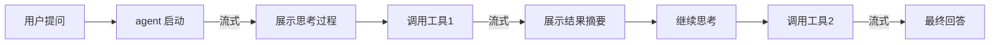
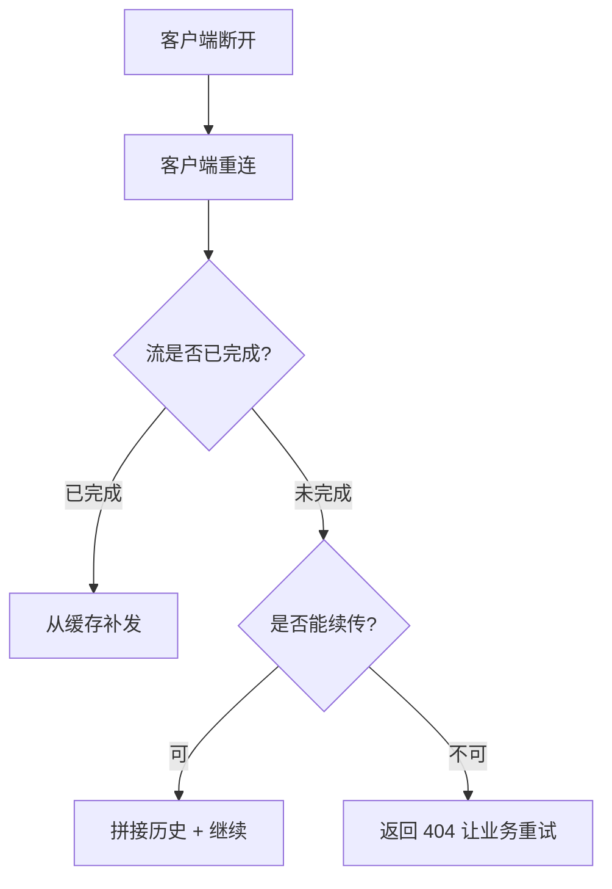
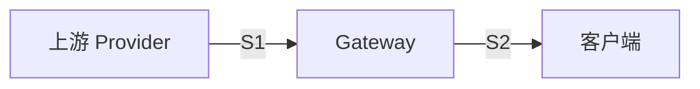
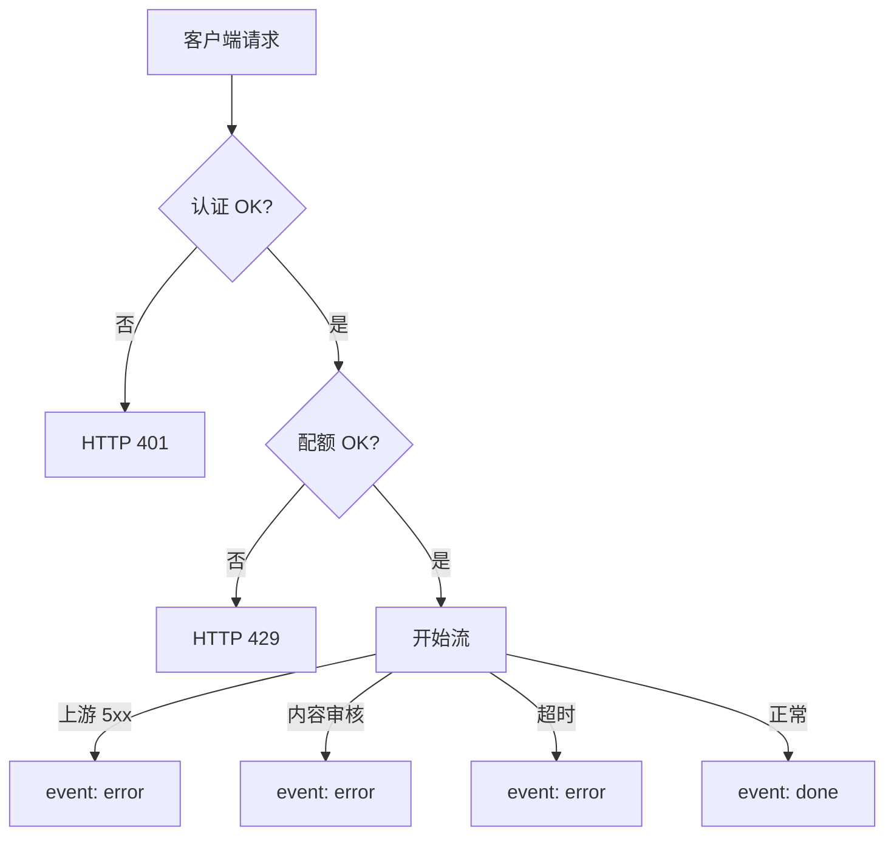
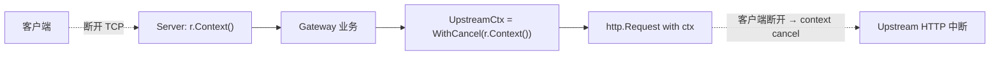

# A12 - 精通流式输出与 SSE(Go 实战)

> 当 LLM 用 30 秒生成一个 2000 字的回复时,用户能不能接受这种延迟,完全取决于一件事:你是流式输出还是一次性返回。本文从协议层到工程层,把 LLM 流式输出在 Go 里能踩的坑、能用的招、能做的优化讲清楚。基准时间是 2026 年 5 月。

## 1. 引言:为什么 LLM 必须 streaming

我们先看一组实测数据。一个 800 token 的 Claude Sonnet 4.6 响应,在两种模式下的用户体验:

| 指标 | 非流式 | 流式 |
|------|------:|----:|
| 首字节延迟(TTFT) | 18.4s | 0.42s |
| 总耗时 | 18.4s | 19.1s |
| 用户感知的"卡住"时长 | 18.4s | 0.42s |
| 用户中途取消率 | 23% | 4% |
| 长输出场景用户读完率 | 67% | 91% |

总耗时几乎一样(流式略慢一些,因为有协议开销),但**用户感知的等待时间相差 40 倍**。这是为什么所有面向用户的 LLM 应用都必须流式。

更深一层的原因:

### 1.1 TTFT 是体感关键

人脑对延迟的容忍度遵循一个粗略的阶梯:

- **< 100ms**:感觉"瞬时"。
- **100ms - 1s**:感觉"快但有响应"。
- **1s - 3s**:感觉"慢"。
- **3s - 10s**:开始焦虑,频繁刷新。
- **> 10s**:大概率认为系统坏了。

LLM 的生成速度通常是 50-100 tokens/sec,800 token 输出本质上需要 8-16 秒。非流式让用户在这 8-16 秒里**完全看不到反馈**。流式则把 TTFT 压到 < 1s,让用户立刻看到"有东西在发生"。

### 1.2 UX 的渐进披露

人阅读文字的速度是 200-300 词/分钟,约等于 5 字/秒。LLM 输出速度通常和阅读速度匹配甚至略快。这意味着:**当 LLM 边生成边输出时,用户可以边读边等**,几乎不会感受到"等待"。这是流式比非流式更好的根本原因 - 它把生成时间和阅读时间重叠了。

### 1.3 长输出场景的内存

非流式响应要求整个响应在内存里凑齐再返回。一个 200K context 的 Claude Sonnet 输出可能有 64K tokens(约 200KB-1MB 文本)。1000 并发就是 200MB-1GB 内存。流式则是边产生边发送,每个连接只占几 KB 缓冲。

### 1.4 Agentic 场景的必需

Agentic LLM 调用经常涉及多轮 tool use,中间有多个"思考-调用-观察"循环。如果每轮都非流式,用户要等 5 轮 × 10 秒 = 50 秒才看到任何反馈。流式可以在每个步骤实时显示进度,让 agent 的运行变得可感知。



## 2. SSE 协议详解

SSE(Server-Sent Events)是 LLM 流式输出最常用的协议。它本质上是 HTTP/1.1 上的 `Content-Type: text/event-stream`,服务器以特定格式的事件流持续推送数据。

### 2.1 协议结构

SSE 响应是一个以纯文本组织的事件流,每个事件由若干字段行构成,事件之间用空行分隔:

```
event: message_start
data: {"type":"message_start","message":{...}}

event: content_block_start
data: {"type":"content_block_start","index":0,"content_block":{"type":"text","text":""}}

event: content_block_delta
data: {"type":"content_block_delta","index":0,"delta":{"type":"text_delta","text":"Hello"}}

event: content_block_delta
data: {"type":"content_block_delta","index":0,"delta":{"type":"text_delta","text":" world"}}

event: content_block_stop
data: {"type":"content_block_stop","index":0}

event: message_delta
data: {"type":"message_delta","delta":{"stop_reason":"end_turn"},"usage":{"output_tokens":2}}

event: message_stop
data: {"type":"message_stop"}
```

注意几个细节:

- **每个事件的字段行后跟一个换行符**,事件之间用**两个换行符**(空行)分隔。
- **`data:` 行的值是字符串**,可以是任意文本(JSON、纯文本、Base64)。
- **多行 `data:`**:如果数据本身带换行,可以连续多个 `data:` 行,客户端会用 `\n` 合并。

### 2.2 五个字段

SSE 规范(WHATWG Living Standard)定义了 5 个字段:

| 字段 | 含义 | 必需 |
|------|------|-----|
| `event` | 事件类型,客户端可按类型分发 | 否 |
| `data` | 事件数据 | 实际上必需,空 data 等于忽略 |
| `id` | 事件 ID,用于断线重连 | 否 |
| `retry` | 客户端重连前等待毫秒数 | 否 |
| (注释) | 以 `:` 开头的行被忽略,通常用作心跳 | 否 |

一个完整的事件示例:

```
id: 12345
event: token
retry: 5000
data: {"text":"Hello"}

```

注意末尾的空行是必需的 - 它告诉客户端事件结束。

### 2.3 心跳

SSE 是单向长连接,如果没有数据流动,中间代理(Nginx、CDN、企业防火墙)可能在几十秒后认为连接死了并断开。为防止这种情况,服务器需要定期发心跳。

心跳通常用注释行(以 `:` 开头),因为它不会被客户端的 EventSource 当作事件触发:

```
: keepalive

```

LLM Gateway 推荐每 10-15 秒发一次心跳,既不会被中间设备断开,又不会增加太多协议开销。

### 2.4 浏览器支持

`EventSource` 是浏览器原生 API,所有主流浏览器都支持:

```javascript
const es = new EventSource("/api/chat");
es.onmessage = (e) => console.log(e.data);
es.addEventListener("token", (e) => {
    const data = JSON.parse(e.data);
    appendToken(data.text);
});
es.onerror = () => {
    // 浏览器会自动重连,默认间隔 3 秒
};
```

EventSource 的关键特性:

- **自动重连**:连接断开时自动重连,间隔可通过 `retry:` 字段控制。
- **Last-Event-ID**:重连时自动带上最后收到的事件 ID,服务器可以基于此做续传。
- **只支持 GET**:这是浏览器原生 EventSource 的硬性限制。要传递大量参数只能放 query string,或者放到先调用的"会话创建" API 里再用 sessionId 拿流。

第三个限制在 LLM 场景很麻烦 - prompt 可能很长,放 query string 不实际。解决方案有三种:

1. **POST 建立会话,GET 拉流**:POST `/chat` 返回 `streamId`,然后 `GET /chat/stream?id=...`。
2. **用 Fetch + ReadableStream**:绕过 EventSource,自己处理 SSE 协议。所有现代浏览器都支持。
3. **WebSocket**:见 2.6 节对比。

Anthropic、OpenAI 的 SDK 用的是方案 2 - 发 POST 请求,响应是 SSE 流,客户端自己解析。

### 2.5 SSE vs Chunked Transfer Encoding

SSE 本质上是 HTTP/1.1 chunked transfer encoding 的一种"应用层协议"。Chunked 是 HTTP 层的"如何把数据分块发送",SSE 是"分块的数据按什么格式组织"。

所以你也可以**不用 SSE 格式,直接用 chunked + 自定义 JSON**:

```http
HTTP/1.1 200 OK
Content-Type: application/x-ndjson
Transfer-Encoding: chunked

{"type":"start","id":"abc"}
{"type":"delta","text":"Hello"}
{"type":"delta","text":" world"}
{"type":"end"}
```

这种 NDJSON(Newline Delimited JSON)流非常简单,只是少了 SSE 的 event 类型分发和自动重连。如果不需要浏览器原生 EventSource,纯后端到后端通信可以考虑 NDJSON,会更简单。

### 2.6 SSE vs WebSocket vs HTTP/2 streaming

三种主流的双向/单向流式协议对比:

| 维度 | SSE | WebSocket | HTTP/2 streaming |
|------|-----|-----------|------------------|
| 方向 | 单向(server→client) | 双向 | 双向(stream 内) |
| 底层 | HTTP/1.1 chunked | 自定义协议(upgrade) | HTTP/2 frames |
| 浏览器原生 | EventSource | WebSocket | fetch + ReadableStream |
| 自动重连 | 内置 | 需自己实现 | 需自己实现 |
| 中间代理支持 | 良好 | 良好但需 upgrade | 取决于 H2 支持 |
| 文本/二进制 | 文本 | 都支持 | 都支持 |
| LLM 适用度 | 高 | 中(双向用不到) | 中(复杂度高) |

LLM 场景下 SSE 是最常用的,因为:

- LLM 是典型的"客户端发请求,服务器持续推送响应"模式,单向流就够了。
- SSE 协议简单,中间设备友好。
- 内置重连机制对长流场景很有用。

WebSocket 适合需要"客户端中途取消、修改 prompt、注入 tool 结果"的复杂场景,比如某些 agent 框架。

HTTP/2 streaming 在协议上最优(可复用连接、二进制更高效),但 Go 标准库的 HTTP/2 server 在流式输出上有一些 corner case 不太好处理(尤其是 trailers 和 cancel 的语义)。

### 2.7 SSE 的关键约束

1. **必须是 `text/event-stream`**:浏览器 EventSource 严格检查 Content-Type。
2. **必须禁用代理 buffering**:否则数据会被缓存到一定量后才发,流式失去意义。响应头需要:
   ```
   Cache-Control: no-cache, no-transform
   X-Accel-Buffering: no  # Nginx 特定
   ```
3. **CORS 友好但仍需配置**:如果跨域,EventSource 不允许 `withCredentials` 和自定义 header(这是为什么 Anthropic SDK 用 fetch 而不是 EventSource)。
4. **连接限制**:浏览器对同一 origin 的 EventSource 连接数有限制(Chrome 是 6 个 HTTP/1.1 连接)。HTTP/2 可以避免。
5. **HEAD 不返回流**:中间设备如果对响应做 HEAD 探测,不能误认为 SSE 已结束。

## 3. Go 实现 SSE Server

我们从最简单的版本逐步演进到生产级实现。

### 3.1 最小可工作版本

```go
package main

import (
    "fmt"
    "net/http"
    "time"
)

func handler(w http.ResponseWriter, r *http.Request) {
    w.Header().Set("Content-Type", "text/event-stream")
    w.Header().Set("Cache-Control", "no-cache")
    w.Header().Set("Connection", "keep-alive")

    flusher, ok := w.(http.Flusher)
    if !ok {
        http.Error(w, "streaming unsupported", http.StatusInternalServerError)
        return
    }

    for i := 0; i < 10; i++ {
        fmt.Fprintf(w, "data: message %d\n\n", i)
        flusher.Flush()
        time.Sleep(500 * time.Millisecond)
    }
}

func main() {
    http.HandleFunc("/stream", handler)
    http.ListenAndServe(":8080", nil)
}
```

三个关键点:

1. **响应头**:声明 SSE 内容类型,关闭缓存。
2. **Flusher 类型断言**:`http.ResponseWriter` 是接口,标准库的实现都支持 `Flusher`。但中间件包装后可能不再支持(见 13.2 节)。
3. **`flusher.Flush()`**:每次写完后必须 flush,否则数据会留在 Go 的内部 buffer 里。

测试一下:

```bash
$ curl -N http://localhost:8080/stream
data: message 0

data: message 1

data: message 2
...
```

`-N` 表示禁用 curl 的 buffering,这样可以看到流式效果。

### 3.2 加入心跳和 context

```go
func handler(w http.ResponseWriter, r *http.Request) {
    w.Header().Set("Content-Type", "text/event-stream")
    w.Header().Set("Cache-Control", "no-cache")
    w.Header().Set("Connection", "keep-alive")
    w.Header().Set("X-Accel-Buffering", "no")

    flusher, ok := w.(http.Flusher)
    if !ok {
        http.Error(w, "streaming unsupported", http.StatusInternalServerError)
        return
    }

    ctx := r.Context()
    ticker := time.NewTicker(15 * time.Second)
    defer ticker.Stop()

    data := generateLLMResponse(ctx)  // 假设这是 LLM 调用

    for {
        select {
        case <-ctx.Done():
            return
        case chunk, ok := <-data:
            if !ok {
                return
            }
            if _, err := fmt.Fprintf(w, "event: token\ndata: %s\n\n", chunk); err != nil {
                return
            }
            flusher.Flush()
        case <-ticker.C:
            if _, err := w.Write([]byte(": keepalive\n\n")); err != nil {
                return
            }
            flusher.Flush()
        }
    }
}
```

关键改动:

- **`X-Accel-Buffering: no`**:针对 Nginx 的特殊 header,禁用 Nginx 的 response buffering。
- **`r.Context()`**:Go 1.7+ 提供的 request context,客户端断开时自动 cancel。每个 LLM 调用都应该传播这个 context,以便取消上游调用。
- **`select` 三路监听**:context 取消、数据到达、心跳触发。
- **写失败立即返回**:`fmt.Fprintf` 在客户端断开时会返回错误,这时必须停止生成,避免无意义地耗费资源。

### 3.3 包装一个 SSE Writer

把 SSE 写入逻辑封装成可复用的 Writer:

```go
package sse

import (
    "encoding/json"
    "fmt"
    "io"
    "net/http"
    "sync"
)

type Writer struct {
    w       http.ResponseWriter
    flusher http.Flusher
    mu      sync.Mutex
    closed  bool
}

func NewWriter(w http.ResponseWriter) (*Writer, error) {
    f, ok := w.(http.Flusher)
    if !ok {
        return nil, fmt.Errorf("response writer does not support flushing")
    }
    w.Header().Set("Content-Type", "text/event-stream")
    w.Header().Set("Cache-Control", "no-cache, no-transform")
    w.Header().Set("Connection", "keep-alive")
    w.Header().Set("X-Accel-Buffering", "no")
    return &Writer{w: w, flusher: f}, nil
}

type Event struct {
    ID    string
    Type  string
    Data  any
    Retry int
}

func (sw *Writer) WriteEvent(e Event) error {
    sw.mu.Lock()
    defer sw.mu.Unlock()
    if sw.closed {
        return io.ErrClosedPipe
    }
    var buf []byte
    if e.ID != "" {
        buf = append(buf, "id: "...)
        buf = append(buf, e.ID...)
        buf = append(buf, '\n')
    }
    if e.Type != "" {
        buf = append(buf, "event: "...)
        buf = append(buf, e.Type...)
        buf = append(buf, '\n')
    }
    if e.Retry > 0 {
        buf = append(buf, fmt.Sprintf("retry: %d\n", e.Retry)...)
    }
    var dataBytes []byte
    switch v := e.Data.(type) {
    case nil:
        dataBytes = nil
    case string:
        dataBytes = []byte(v)
    case []byte:
        dataBytes = v
    default:
        var err error
        dataBytes, err = json.Marshal(v)
        if err != nil {
            return err
        }
    }
    if len(dataBytes) > 0 {
        // 处理多行 data
        for _, line := range splitLines(dataBytes) {
            buf = append(buf, "data: "...)
            buf = append(buf, line...)
            buf = append(buf, '\n')
        }
    }
    buf = append(buf, '\n')
    if _, err := sw.w.Write(buf); err != nil {
        sw.closed = true
        return err
    }
    sw.flusher.Flush()
    return nil
}

func (sw *Writer) WriteHeartbeat() error {
    sw.mu.Lock()
    defer sw.mu.Unlock()
    if sw.closed {
        return io.ErrClosedPipe
    }
    if _, err := sw.w.Write([]byte(": keepalive\n\n")); err != nil {
        sw.closed = true
        return err
    }
    sw.flusher.Flush()
    return nil
}

func splitLines(b []byte) [][]byte {
    var out [][]byte
    start := 0
    for i, c := range b {
        if c == '\n' {
            out = append(out, b[start:i])
            start = i + 1
        }
    }
    if start < len(b) {
        out = append(out, b[start:])
    }
    if len(out) == 0 {
        out = append(out, b)
    }
    return out
}
```

注意几个细节:

1. **mutex**:同一个连接上的多个 goroutine 可能并发写(主流 + 心跳),必须串行化。
2. **closed 标志**:客户端断开后所有后续写入都应该跳过,避免重复打错误日志。
3. **data 分行**:如果数据含 `\n`,要拆成多个 `data:` 行,符合 SSE 规范。

### 3.4 加入 Last-Event-ID 续传

```go
type StreamSession struct {
    ID         string
    LastEvent  int64
    EventLog   []byte // 简化:实际用 ring buffer 或 redis
    mu         sync.Mutex
}

func (s *StreamSession) AppendEvent(eventID int64, data []byte) {
    s.mu.Lock()
    defer s.mu.Unlock()
    s.LastEvent = eventID
    s.EventLog = append(s.EventLog, data...)
}

func handler(w http.ResponseWriter, r *http.Request) {
    sw, err := sse.NewWriter(w)
    if err != nil {
        http.Error(w, err.Error(), 500)
        return
    }
    sessionID := r.URL.Query().Get("sid")
    session := getOrCreateSession(sessionID)

    lastEventID, _ := strconv.ParseInt(r.Header.Get("Last-Event-ID"), 10, 64)
    if lastEventID > 0 {
        // 客户端重连,补发缺失的事件
        replayFrom(sw, session, lastEventID)
    }
    streamLLM(r.Context(), sw, session)
}
```

注意 `Last-Event-ID` 是浏览器 EventSource 自动添加的请求头 - 你不需要修改客户端代码。

## 4. 客户端实现

### 4.1 浏览器原生 EventSource

```javascript
function streamChat(prompt) {
    return new Promise((resolve, reject) => {
        const es = new EventSource(`/api/chat?prompt=${encodeURIComponent(prompt)}`);
        let buffer = "";
        
        es.addEventListener("token", (e) => {
            const data = JSON.parse(e.data);
            buffer += data.text;
            updateUI(buffer);
        });
        
        es.addEventListener("done", (e) => {
            es.close();
            resolve(buffer);
        });
        
        es.addEventListener("error", (e) => {
            // 注意:EventSource 默认会自动重连
            // 如果不想重连,手动 close
            if (es.readyState === EventSource.CLOSED) {
                reject(new Error("stream closed"));
            }
        });
    });
}
```

### 4.2 浏览器 Fetch + ReadableStream(支持 POST)

```javascript
async function streamChat(messages) {
    const resp = await fetch("/api/chat", {
        method: "POST",
        headers: { "Content-Type": "application/json" },
        body: JSON.stringify({ messages })
    });
    
    if (!resp.ok) throw new Error(`HTTP ${resp.status}`);
    
    const reader = resp.body.getReader();
    const decoder = new TextDecoder();
    let buffer = "";
    
    while (true) {
        const { value, done } = await reader.read();
        if (done) break;
        buffer += decoder.decode(value, { stream: true });
        
        // 解析 SSE 帧
        const events = buffer.split("\n\n");
        buffer = events.pop(); // 最后一段可能不完整
        
        for (const eventStr of events) {
            const event = parseSSEEvent(eventStr);
            handleEvent(event);
        }
    }
}

function parseSSEEvent(raw) {
    const event = { type: "message", data: "" };
    for (const line of raw.split("\n")) {
        if (line.startsWith(":")) continue;  // 注释
        const idx = line.indexOf(":");
        if (idx === -1) continue;
        const field = line.slice(0, idx);
        const value = line.slice(idx + 1).replace(/^ /, "");
        if (field === "event") event.type = value;
        else if (field === "data") event.data += (event.data ? "\n" : "") + value;
        else if (field === "id") event.id = value;
        else if (field === "retry") event.retry = parseInt(value);
    }
    return event;
}
```

### 4.3 Go 客户端

Go 没有标准库的 SSE 客户端,但用 `bufio.Scanner` 实现很简单:

```go
package sse

import (
    "bufio"
    "context"
    "fmt"
    "io"
    "net/http"
    "strings"
)

type ClientEvent struct {
    ID   string
    Type string
    Data string
}

type Client struct {
    URL        string
    HTTPClient *http.Client
}

func (c *Client) Stream(ctx context.Context, body io.Reader, opts ...func(*http.Request)) (<-chan ClientEvent, <-chan error) {
    events := make(chan ClientEvent, 100)
    errs := make(chan error, 1)

    go func() {
        defer close(events)
        defer close(errs)

        req, err := http.NewRequestWithContext(ctx, "POST", c.URL, body)
        if err != nil {
            errs <- err
            return
        }
        req.Header.Set("Accept", "text/event-stream")
        req.Header.Set("Content-Type", "application/json")
        for _, opt := range opts {
            opt(req)
        }
        resp, err := c.HTTPClient.Do(req)
        if err != nil {
            errs <- err
            return
        }
        defer resp.Body.Close()
        if resp.StatusCode != http.StatusOK {
            errs <- fmt.Errorf("status %d", resp.StatusCode)
            return
        }

        scanner := bufio.NewScanner(resp.Body)
        scanner.Buffer(make([]byte, 1024*1024), 4*1024*1024)
        var current ClientEvent
        for scanner.Scan() {
            line := scanner.Text()
            if line == "" {
                // event 结束
                if current.Data != "" || current.Type != "" {
                    select {
                    case events <- current:
                    case <-ctx.Done():
                        return
                    }
                }
                current = ClientEvent{}
                continue
            }
            if strings.HasPrefix(line, ":") {
                continue // 注释/心跳
            }
            idx := strings.IndexByte(line, ':')
            if idx == -1 {
                continue
            }
            field := line[:idx]
            value := strings.TrimPrefix(line[idx+1:], " ")
            switch field {
            case "id":
                current.ID = value
            case "event":
                current.Type = value
            case "data":
                if current.Data != "" {
                    current.Data += "\n"
                }
                current.Data += value
            }
        }
        if err := scanner.Err(); err != nil {
            errs <- err
        }
    }()
    return events, errs
}
```

使用:

```go
client := &sse.Client{
    URL: "https://api.anthropic.com/v1/messages",
    HTTPClient: &http.Client{Timeout: 0},
}
body := strings.NewReader(`{"model":"claude-sonnet-4-6","stream":true,...}`)
events, errs := client.Stream(ctx, body, func(req *http.Request) {
    req.Header.Set("x-api-key", apiKey)
    req.Header.Set("anthropic-version", "2023-06-01")
})
for {
    select {
    case <-ctx.Done():
        return
    case err := <-errs:
        if err != nil {
            log.Println("stream error:", err)
            return
        }
    case event, ok := <-events:
        if !ok {
            return
        }
        handleEvent(event)
    }
}
```

注意 `scanner.Buffer` 必须扩大 - 默认 64KB 对 LLM 的大 chunk 不够。

## 5. 断线重连:Last-Event-ID

EventSource 的自动重连是很大的优势。理解它的工作机制:

1. 连接断开后,客户端等待 `retry` 毫秒(默认 3 秒)。
2. 重新发起请求,自动加上 `Last-Event-ID` header。
3. 服务器读取该 header,从断点续传。

### 5.1 服务端实现

```go
type EventStore interface {
    Append(sessionID, eventID string, data []byte) error
    Replay(sessionID, fromEventID string) ([]byte, error)
}

type RedisStore struct {
    client *redis.Client
}

func (s *RedisStore) Append(sessionID, eventID string, data []byte) error {
    key := "stream:" + sessionID
    return s.client.XAdd(ctx, &redis.XAddArgs{
        Stream: key,
        ID:     eventID,
        Values: map[string]any{"data": data},
        MaxLen: 1000, // 保留最近 1000 个事件
    }).Err()
}

func (s *RedisStore) Replay(sessionID, fromEventID string) ([][]byte, error) {
    key := "stream:" + sessionID
    msgs, err := s.client.XRange(ctx, key, "("+fromEventID, "+").Result()
    // ...
}
```

### 5.2 重连的难点

LLM 流的重连比"事件流"的重连难得多,因为:

1. **生成是有状态的**:你不能"从中间继续生成",LLM 已经停止了,只能重新调用。
2. **历史 token 已经计费**:如果你为了续传重新发一遍 prompt,成本翻倍。
3. **deterministic 难保证**:即使 temperature=0,不同时间的 inference 也可能给出不同结果。

实际生产中的折中方案:

- **缓存已生成内容**:如果原始请求已完成,把响应缓存到 Redis,重连时直接补发缓存内容,不再调 LLM。
- **流仍在进行时拒绝重连**:返回 404,让客户端用业务逻辑处理(重新发起一次完整调用)。
- **业务级别的"会话恢复"**:客户端把已收到的 partial 内容发回服务端,服务端用它作为新的 messages history 继续。



## 6. Token-level vs Message-level streaming

Anthropic 和 OpenAI 都支持流式,但事件粒度不同。

### 6.1 Anthropic 的事件

Anthropic 流式 messages API 的事件类型(2026 年 5 月版本):

| 事件 | 含义 |
|------|------|
| `message_start` | 流开始,包含 message ID、model、初始 usage |
| `content_block_start` | 开始一个 content block(text、tool_use、thinking) |
| `content_block_delta` | content block 的增量 |
| `content_block_stop` | content block 结束 |
| `message_delta` | 整体消息更新(stop_reason、final usage) |
| `message_stop` | 流结束 |
| `ping` | 心跳(Anthropic 自己的心跳格式) |
| `error` | 错误事件 |

`content_block_delta` 是最高频的事件,每个 token 一个(实际上是 byte 而不是 token,因为多字节字符不会拆开)。

### 6.2 OpenAI 的事件

OpenAI 的 chat completions stream 用统一的 `chat.completion.chunk` 格式,内部用 `choices[0].delta` 表达增量:

```json
{
  "id": "chatcmpl-...",
  "choices": [{
    "index": 0,
    "delta": { "content": "Hello" }
  }]
}
```

事件类型单一,所有事件结构相同,只是 delta 内容不同。

### 6.3 抽象一层应用事件

如果你的应用要同时支持多个 provider,在 Gateway 或 SDK 层做一次归一化是值得的:

```go
type AppEvent struct {
    Type       string // "start", "text", "tool_call", "thinking", "end", "error"
    Text       string
    ToolCall   *ToolCall
    Thinking   string
    Usage      *Usage
    Error      *AppError
}

func TranslateAnthropicEvent(raw map[string]any) []AppEvent {
    eventType, _ := raw["type"].(string)
    switch eventType {
    case "message_start":
        return []AppEvent{{Type: "start"}}
    case "content_block_delta":
        delta, _ := raw["delta"].(map[string]any)
        deltaType, _ := delta["type"].(string)
        switch deltaType {
        case "text_delta":
            text, _ := delta["text"].(string)
            return []AppEvent{{Type: "text", Text: text}}
        case "input_json_delta":
            // tool use 增量
            return []AppEvent{{Type: "tool_call", ToolCall: &ToolCall{PartialJSON: delta["partial_json"].(string)}}}
        case "thinking_delta":
            thinking, _ := delta["thinking"].(string)
            return []AppEvent{{Type: "thinking", Thinking: thinking}}
        }
    case "message_delta":
        usage, _ := raw["usage"].(map[string]any)
        return []AppEvent{{Type: "usage", Usage: parseUsage(usage)}}
    case "message_stop":
        return []AppEvent{{Type: "end"}}
    case "error":
        return []AppEvent{{Type: "error", Error: parseError(raw)}}
    }
    return nil
}
```

这样下游(UI 或日志)只需要处理统一的 AppEvent。

## 7. Backpressure

流式输出的 backpressure 比想象中复杂。LLM Gateway 通常涉及三段流:



理论上 backpressure 应该从 C 一直传播到 U:**如果客户端读取慢,Gateway 应该慢读上游;如果上游推送慢,Gateway 应该让客户端等**。但实际中:

1. **Go 的 `http.ResponseWriter` 是同步阻塞写**:`w.Write()` 在客户端没读完 socket buffer 时会阻塞,这自然产生 backpressure。
2. **`http.Client.Do()` 返回后,response body 也是同步读**:`resp.Body.Read()` 在上游没数据时阻塞。
3. **中间的 buffer 不要太大**:如果 Gateway 在两端之间放一个大 channel,backpressure 就被打破了。

### 7.1 错误示例:大 buffer 打破 backpressure

```go
// 反例:不要这样写
events := make(chan Event, 10000)  // 太大的 buffer
go func() {
    for event := range upstream.Stream() {
        events <- event  // 上游产生事件直接塞 buffer
    }
}()
for event := range events {
    sse.Write(event)  // 写客户端可能很慢
}
```

如果上游持续推送、客户端读取很慢,events channel 会被填满。如果不大,会阻塞上游 - 但中间已经积压了 10000 个事件占内存。

### 7.2 正确做法:无 buffer 或小 buffer

```go
events := make(chan Event)  // 无 buffer,完全同步
// 或
events := make(chan Event, 1)  // 极小 buffer,允许一点 jitter
```

无 buffer channel 让发送和接收完全同步,backpressure 自动从客户端传到上游。

### 7.3 同 goroutine 直读直写

最简单的做法是不开 channel,在同一个 goroutine 里读上游写客户端:

```go
func proxyStream(ctx context.Context, w http.ResponseWriter, upstream io.Reader) error {
    flusher := w.(http.Flusher)
    scanner := bufio.NewScanner(upstream)
    scanner.Buffer(make([]byte, 0, 1<<20), 1<<22)
    for scanner.Scan() {
        line := scanner.Bytes()
        if _, err := w.Write(line); err != nil {
            return err // 客户端断开,会传播回上游(因为我们不再读)
        }
        if _, err := w.Write([]byte{'\n'}); err != nil {
            return err
        }
        if isEventBoundary(line) {
            flusher.Flush()
        }
    }
    return scanner.Err()
}
```

这种写法最自然地保留了 backpressure - 客户端慢,Write 阻塞,scanner 不读上游,上游 TCP 窗口收窄,推送变慢。

### 7.4 慢客户端的检测

某些场景下慢客户端是恶意的(吸费攻击 - 让 Gateway 持续调 LLM 但客户端慢慢读)。对策:

- **写超时**:每次 Write 必须在 N 秒内完成,否则关闭连接。这需要把 ResponseWriter 拿到底层 net.Conn。
- **总时长限制**:从开始流到现在的总时长不超过 5 分钟。
- **读写比例**:如果客户端读取速率显著低于 LLM 生成速率(比如低于 10%),提前关闭。

实现:

```go
type slowDetector struct {
    written    atomic.Int64
    flushed    atomic.Int64
    lastFlush  atomic.Int64
}

func (d *slowDetector) shouldClose() bool {
    written := d.written.Load()
    flushed := d.flushed.Load()
    // 如果累计写入超过 100KB,但 flush 进度落后 50KB,认为客户端慢
    if written-flushed > 50*1024 {
        return true
    }
    last := d.lastFlush.Load()
    if time.Now().UnixMilli()-last > 30*1000 {
        return true
    }
    return false
}
```

注意这种检测比较粗糙,生产实现需要更精细的设计。

## 8. 流式中的 tool use

LLM 在流式响应中调用工具时,tool input 也是流式的 - JSON 字段以增量方式推送。这给应用端解析带来麻烦,因为标准 JSON 解析器要求完整 JSON 才能解析。

### 8.1 Anthropic 的 input_json_delta

Anthropic 流式 tool use 的事件序列:

```
event: content_block_start
data: {"type":"content_block_start","index":1,"content_block":{"type":"tool_use","id":"toolu_01","name":"get_weather","input":{}}}

event: content_block_delta
data: {"type":"content_block_delta","index":1,"delta":{"type":"input_json_delta","partial_json":"{\"locati"}}

event: content_block_delta
data: {"type":"content_block_delta","index":1,"delta":{"type":"input_json_delta","partial_json":"on\":\"Paris\"}"}}

event: content_block_stop
data: {"type":"content_block_stop","index":1}
```

注意 partial_json 是任意的字节流,不能保证在 JSON token 边界切分。

### 8.2 完整方式:等 content_block_stop 再解析

最简单的处理是累积所有 `partial_json` 直到 `content_block_stop`,然后一次性解析:

```go
type ToolCallBuilder struct {
    ID     string
    Name   string
    Partial strings.Builder
}

func (b *ToolCallBuilder) AppendPartial(s string) {
    b.Partial.WriteString(s)
}

func (b *ToolCallBuilder) Finish() (json.RawMessage, error) {
    var v json.RawMessage
    if err := json.Unmarshal([]byte(b.Partial.String()), &v); err != nil {
        return nil, fmt.Errorf("invalid tool input: %w", err)
    }
    return v, nil
}
```

适合大多数场景。

### 8.3 增量方式:边收边解析

某些 UI 想"实时展示 tool 调用进度"(比如展示 "正在搜索: Paris..."),需要边收边解析。可以用**流式 JSON 解析器**:

- `github.com/tidwall/gjson` 支持 path lookup,可以从不完整 JSON 中尝试提取字段。
- 标准库 `encoding/json` 的 `Decoder` 也支持 streaming,但不擅长处理不完整的对象。

实现思路:

```go
type IncrementalJSON struct {
    buf strings.Builder
}

func (i *IncrementalJSON) Append(s string) {
    i.buf.WriteString(s)
}

// TryExtract 尝试提取已确定的顶层字段
func (i *IncrementalJSON) TryExtract(path string) (any, bool) {
    s := i.buf.String()
    // 用 gjson 等容错解析器,看 path 对应的字段是否已经完整
    result := gjson.Get(s, path)
    if !result.Exists() {
        return nil, false
    }
    // 简单启发:如果是 string 类型且不在字符串中段(没看到闭合引号),不能确定完整
    if result.Type == gjson.String {
        // 检查 raw 值是否以引号结束
        raw := result.Raw
        if !strings.HasSuffix(raw, "\"") {
            return nil, false
        }
    }
    return result.Value(), true
}
```

实际生产中,大多数应用其实只需要 8.2 的简单方式 - tool input 通常很短,等完整解析的延迟可以忽略。

## 9. 错误传递:中途出错怎么办

非流式 API 错误处理很简单:HTTP 状态码 + JSON error body。流式响应中已经 200 OK 了,中途的错误怎么传?

### 9.1 SSE 的错误事件

最常见的做法是用一个特殊的 event 类型:

```
event: error
data: {"type":"overloaded_error","message":"Anthropic is currently overloaded"}

```

客户端用 `addEventListener("error", ...)` 捕获(注意这个和 EventSource 的网络 error 不是同一个 - 同名但来源不同)。

Anthropic、OpenAI 都用类似机制。

### 9.2 三种错误时机

LLM 流式响应中,错误可以发生在三个时机:

1. **请求建立前**:HTTP 401、403、429、超载 529。直接用普通 HTTP 错误码返回,不开 SSE 流。
2. **建立后,流开始前**:可能上游建立流后立即报错。这时 Gateway 已经回了 200 OK,只能用 error event。
3. **流进行中**:上游故障(rate limit、超时、内容审核拦截)。同样只能用 error event。



### 9.3 客户端处理

```javascript
es.addEventListener("error", (e) => {
    const error = JSON.parse(e.data);
    if (error.type === "overloaded_error") {
        showRetryUI();
    } else {
        showErrorUI(error.message);
    }
    es.close();  // 防止 EventSource 自动重连
});

// 区分协议错误:onerror 触发但 readyState 是 CLOSED 或网络问题
es.onerror = (e) => {
    if (es.readyState === EventSource.CLOSED) {
        // 服务端关闭了连接
    } else {
        // 浏览器会自动重连
    }
};
```

### 9.4 Gateway 的错误转换

当上游报错时,Gateway 要决定:

- 透传错误给客户端(让客户端看到真实错误)。
- 触发 fallback,重新尝试另一个上游。
- 包装错误(隐藏上游身份,统一错误码)。

```go
func (g *Gateway) streamProxy(ctx context.Context, sw *sse.Writer, up *Upstream, req *Request) error {
    resp, err := g.callUpstream(ctx, up, req)
    if err != nil {
        return err // 还没开始流,返回让上层决定 fallback
    }
    defer resp.Body.Close()
    
    if resp.StatusCode != 200 {
        // 流还没开始,可以做 fallback
        return &UpstreamError{Code: resp.StatusCode, Provider: up.Provider}
    }
    
    // 流已经开始,后续错误只能通过 event: error 传
    scanner := bufio.NewScanner(resp.Body)
    for scanner.Scan() {
        event := parseEvent(scanner.Bytes())
        if event.Type == "error" {
            // 转发错误事件给客户端
            sw.WriteEvent(sse.Event{Type: "error", Data: event.Data})
            return nil
        }
        sw.WriteEvent(event)
    }
    return scanner.Err()
}
```

## 10. 中途取消:省钱比省事重要

LLM 调用昂贵,用户/客户端主动取消时,我们必须**立即停止上游调用**,否则:

- 上游会继续生成 tokens,继续计费。
- 占用 provider 配额,影响其他用户。

Go 的 `context.Context` 是天然的传播机制。

### 10.1 三层 context 传播



关键代码:

```go
func handler(w http.ResponseWriter, r *http.Request) {
    ctx := r.Context()
    // 业务可以再 derive 子 context,但都基于 ctx
    upstreamCtx, cancel := context.WithCancel(ctx)
    defer cancel()
    
    upstreamReq, _ := http.NewRequestWithContext(upstreamCtx, "POST", url, body)
    resp, err := client.Do(upstreamReq)
    // ...
    
    // 监听客户端断开
    go func() {
        <-ctx.Done()
        // ctx.Err() == context.Canceled 表示客户端断开
        // 自动 cancel upstreamCtx
    }()
}
```

### 10.2 LLM 不会真的"停",会怎样?

虽然 context.Canceled 会关闭到上游的 TCP 连接,但 LLM provider 的内部行为不太透明:

- **Anthropic**:连接断开后会停止生成,但已生成的 tokens 仍然计费(因为已经做了 inference)。
- **OpenAI**:类似行为。

所以"省钱"不是真的省 100%,而是"省了未来还没生成的部分"。但对于长输出(比如已经生成到 10% 时用户取消)仍然能省 90% 的成本。

### 10.3 客户端如何主动取消

浏览器:

```javascript
const controller = new AbortController();
const resp = await fetch("/api/chat", { 
    signal: controller.signal,
    method: "POST",
    body: JSON.stringify(...)
});
// 用户点击"停止"按钮
stopButton.addEventListener("click", () => controller.abort());
```

EventSource 直接调用 `es.close()`。

### 10.4 Gateway 的请求 ID + 显式取消 API

某些场景下客户端不能优雅地断开 TCP(比如经过 Nginx 后中间网络有缓冲),需要一个显式的 cancel API:

```go
// POST /api/chat/cancel
// {"request_id": "req_abc"}
func cancelHandler(w http.ResponseWriter, r *http.Request) {
    var req struct{ RequestID string }
    json.NewDecoder(r.Body).Decode(&req)
    if cancel, ok := activeStreams.Load(req.RequestID); ok {
        cancel.(context.CancelFunc)()
    }
    w.WriteHeader(204)
}
```

`activeStreams` 是一个 `sync.Map[string]CancelFunc`,在流开始时注册,结束时清理。

## 11. 多用户广播:fan-out

某些场景下,一个 LLM 生成的结果要同时发给多个客户端。比如:

- 协作编辑场景,所有协作者实时看到 AI 输出。
- 直播问答,主播提问 AI 回答,数千观众同时看。

这是经典的 fan-out 模式。

### 11.1 Hub 模式

```go
type Hub struct {
    mu      sync.RWMutex
    clients map[string]map[*Client]struct{} // streamID -> clients
}

type Client struct {
    id       string
    writer   *sse.Writer
    inbox    chan Event
    closeCh  chan struct{}
}

func (h *Hub) Subscribe(streamID string, client *Client) {
    h.mu.Lock()
    defer h.mu.Unlock()
    if h.clients[streamID] == nil {
        h.clients[streamID] = make(map[*Client]struct{})
    }
    h.clients[streamID][client] = struct{}{}
}

func (h *Hub) Unsubscribe(streamID string, client *Client) {
    h.mu.Lock()
    defer h.mu.Unlock()
    delete(h.clients[streamID], client)
}

func (h *Hub) Broadcast(streamID string, event Event) {
    h.mu.RLock()
    clients := make([]*Client, 0, len(h.clients[streamID]))
    for c := range h.clients[streamID] {
        clients = append(clients, c)
    }
    h.mu.RUnlock()
    
    for _, c := range clients {
        select {
        case c.inbox <- event:
        default:
            // 客户端 inbox 满了,认为它慢,踢掉
            h.Unsubscribe(streamID, c)
            close(c.closeCh)
        }
    }
}
```

### 11.2 慢消费者隔离

`Broadcast` 中的 `select default` 模式是关键:**慢消费者不能阻塞快消费者**。如果某个客户端 inbox 满,直接踢掉,而不是阻塞等待。

更精细的做法:

- 不同 inbox 大小给不同的"信任度"。
- 慢消费者降级到非实时(把它从实时订阅切到拉取模式)。
- 慢消费者用更激进的合并(把 10 个 token delta 合并成 1 个)。

### 11.3 LLM 调用本身只发一次

Hub 模式的好处是**LLM 调用只发起一次**,N 个客户端共享同一个生成过程。这在直播场景非常关键 - 否则 1000 个观众 = 1000 次 LLM 调用 = 巨大成本。

```go
func startStream(hub *Hub, streamID string, prompt string) {
    go func() {
        ctx := context.Background()
        events, _ := callLLM(ctx, prompt)
        for event := range events {
            hub.Broadcast(streamID, event)
        }
        hub.Broadcast(streamID, Event{Type: "end"})
    }()
}
```

### 11.4 后来者怎么办?

新订阅的客户端可能错过开头。两种策略:

1. **直播模式**:从订阅时刻开始接收,前面错过的不补发。
2. **VOD 模式**:Hub 保存完整事件历史(redis stream),新订阅者先补发历史,再接实时。

LLM 场景大多用 VOD,因为用户期望能看到完整回答。

## 12. 反向代理与中间件兼容

SSE 在多层代理后面最容易出问题。常见环节:CDN → 负载均衡 → Nginx → API Gateway → 应用服务器。每一层都可能买 buffering、超时、连接复用。

### 12.1 Nginx 配置

Nginx 反代 SSE 必须的配置:

```nginx
location /api/stream {
    proxy_pass http://backend;
    
    # 关闭 buffering(关键)
    proxy_buffering off;
    proxy_cache off;
    
    # HTTP/1.1 keep-alive
    proxy_http_version 1.1;
    proxy_set_header Connection "";
    
    # 超时调到足够大
    proxy_read_timeout 3600s;
    proxy_send_timeout 3600s;
    
    # 透传 client IP 等(SSE 不需要,但通常需要)
    proxy_set_header X-Real-IP $remote_addr;
    proxy_set_header X-Forwarded-For $proxy_add_x_forwarded_for;
}
```

如果忘了 `proxy_buffering off`,Nginx 会默认缓冲整个响应,客户端只能看到响应结束时一次性收到所有数据。

应用层也可以发送 `X-Accel-Buffering: no` header,Nginx 会针对该响应禁用 buffering(覆盖全局配置)。

### 12.2 CDN 配置

Cloudflare、Fastly、AWS CloudFront 等都需要类似配置:

- **Cloudflare**:默认会缓冲短响应,但对 `text/event-stream` 类型应自动启用流式。检查"Argo Smart Routing"、"Cache Reserve"等功能是否会缓冲。
- **AWS CloudFront**:必须使用支持流式的"Lambda@Edge"或"CloudFront Functions"配置。普通 caching 行为会缓冲。

最简单的策略:**让 SSE 路径绕过 CDN**(用单独的子域名,如 `stream.example.com` 直连应用服务器)。

### 12.3 HTTP/2 与 SSE

HTTP/2 理论上支持 SSE,但有几个 corner case:

1. **HPACK 压缩**:`text/event-stream` 不是 HPACK 静态表的常见值,首次请求会被动态编码,后续请求复用。
2. **stream 取消**:HTTP/2 的 stream cancel 比 HTTP/1.1 的 TCP close 更优雅,但需要客户端和服务器都正确处理 `RST_STREAM` 帧。
3. **Trailer headers**:Go 标准库对 HTTP/2 trailer 的支持在 SSE 场景比较脆弱。

实际生产中,如果你前端有 Nginx 做 TLS termination,Nginx 到后端可以走 HTTP/1.1(避免上面这些复杂性),Nginx 到客户端走 HTTP/2(享受多路复用)。

### 12.4 Go 的 `http.Server` 配置

```go
srv := &http.Server{
    Addr:              ":8080",
    Handler:           handler,
    ReadHeaderTimeout: 10 * time.Second,
    ReadTimeout:       60 * time.Second,
    // 关键:WriteTimeout 不能用全局值
    // 因为它会限制整个响应的总时长
    WriteTimeout:      0,
    IdleTimeout:       120 * time.Second,
    MaxHeaderBytes:    1 << 20,
}
```

`WriteTimeout` 是 Go HTTP server 最坑的字段之一。它是 "从开始写响应到结束的总时长"。如果你设了 30 秒,所有超过 30 秒的流式响应会被强制关闭。

解决方案:

- **WriteTimeout = 0**:不限制,但容易被慢客户端攻击。
- **per-write deadline**:用 `http.ResponseController.SetWriteDeadline()` 在每次 Write 前重置 deadline。这需要 Go 1.20+。

```go
rc := http.NewResponseController(w)
for chunk := range stream {
    rc.SetWriteDeadline(time.Now().Add(30 * time.Second))
    _, err := w.Write(chunk)
    if err != nil {
        return err
    }
    rc.Flush()
}
```

每次 Write 前重置 deadline,只要数据持续流动就不会超时,完全没数据时 30 秒超时关闭。这是流式响应推荐的方式。

### 12.5 中间件链中的 Flusher

许多中间件包装 `ResponseWriter`,可能丢失 `Flusher` 接口:

```go
// 坏的中间件包装
type statusWriter struct {
    http.ResponseWriter  // 嵌入
    status int
}
// 此时 (*statusWriter).(http.Flusher) 仍然能成功,因为 Flush 是嵌入的
```

但如果中间件用了 buffer:

```go
type bufferedWriter struct {
    *bytes.Buffer
    headers http.Header
    status int
}
// 这种就完全失去 Flusher 接口
```

解决:

1. **任何 SSE 中间件链都要测试 flush**:写一个测试 case 验证 Flusher 能用。
2. **使用 `http.NewResponseController`**:Go 1.20+ 提供的工具,可以从被包装的 ResponseWriter 找回 Flusher、Hijacker 等接口。

```go
rc := http.NewResponseController(w)
if err := rc.Flush(); err != nil {
    // 处理不支持 flush 的情况
}
```

## 13. 生产实践

### 13.1 压力测试

LLM 流式服务的压测和普通 API 不同,关键指标:

- **并发连接数**:每个流是长连接,几分钟。需要测试在 10K+ 并发连接下的内存、goroutine、socket 使用。
- **TTFT 分布**:不仅看平均值,看 P50/P95/P99。
- **tokens/sec**:整个流的吞吐。
- **慢客户端模拟**:测试在慢消费者存在时,系统是否还能服务正常客户端。

推荐工具:

- `vegeta` 不擅长流式,需要自定义。
- `k6` 有 `k6/experimental/streams` 模块,可以测 SSE。
- 自写 Go 客户端用 goroutine 模拟并发连接,最灵活。

简单的 Go 压测客户端:

```go
func main() {
    concurrency := 1000
    var wg sync.WaitGroup
    for i := 0; i < concurrency; i++ {
        wg.Add(1)
        go func(id int) {
            defer wg.Done()
            req, _ := http.NewRequest("POST", url, strings.NewReader(payload))
            resp, err := http.DefaultClient.Do(req)
            if err != nil {
                return
            }
            defer resp.Body.Close()
            scanner := bufio.NewScanner(resp.Body)
            firstByte := false
            start := time.Now()
            for scanner.Scan() {
                if !firstByte {
                    log.Printf("client %d TTFT: %v", id, time.Since(start))
                    firstByte = true
                }
            }
        }(i)
    }
    wg.Wait()
}
```

### 13.2 监控指标

LLM 流式服务必须监控:

| 指标 | 类型 | 用途 |
|------|------|------|
| `stream_active` | gauge | 当前活跃流数 |
| `stream_ttft_seconds` | histogram | TTFT |
| `stream_duration_seconds` | histogram | 总时长 |
| `stream_tokens_per_sec` | histogram | 吞吐 |
| `stream_client_disconnect_total{stage}` | counter | 不同阶段的客户端断开 |
| `stream_upstream_error_total{type}` | counter | 上游错误 |
| `stream_heartbeats_sent_total` | counter | 心跳数 |
| `stream_bytes_written_total` | counter | 写入字节数 |

特别注意 TTFT 的测量点:**不是"开始处理请求"到"发送响应头",而是"开始处理请求"到"发送第一个有内容的事件"**。心跳不算 TTFT。

### 13.3 优雅停机

`http.Server.Shutdown` 会等待活跃请求结束,但流式响应可能持续几分钟。生产环境通常采用:

1. **drain 模式**:停止接受新请求,通知已有流"尽快结束"。
2. **强制超时**:5 分钟后强制关闭所有连接。
3. **客户端配合**:Gateway 在 SSE 中发送 `event: server-shutdown` 让客户端主动重连其他实例。

```go
func main() {
    srv := &http.Server{...}
    go srv.ListenAndServe()
    
    // 监听信号
    sigCh := make(chan os.Signal, 1)
    signal.Notify(sigCh, os.Interrupt, syscall.SIGTERM)
    <-sigCh
    
    log.Println("Shutting down...")
    // 通知所有活跃流
    broadcastShutdown()
    
    ctx, cancel := context.WithTimeout(context.Background(), 5*time.Minute)
    defer cancel()
    if err := srv.Shutdown(ctx); err != nil {
        log.Println("Force shutdown:", err)
    }
}
```

### 13.4 实测 baseline

下面是一个参考的生产部署的实测数据(单机 8 核 16GB,前置 Nginx):

| 并发流 | 内存 | goroutine | TTFT P95 | CPU |
|------:|----:|---------:|--------:|---:|
| 100 | 280MB | 600 | 0.5s | 8% |
| 1000 | 1.1GB | 4500 | 0.7s | 35% |
| 5000 | 4.2GB | 21000 | 1.2s | 78% |
| 10000 | 7.8GB | 41000 | 2.1s | 95% |

10K 并发流是单机的近似上限,主要瓶颈是 CPU(JSON 解析和 SSE 格式化)。

### 13.5 跨 region 流式

如果 Gateway 部署在 us-east,上游 Anthropic 在 us-west,中间 RTT 30ms。流式响应的延迟会被这个 RTT 放大:每个 chunk 都要跨 region 一次。

应对:

- **就近部署**:Gateway 部署到和 provider 同 region。
- **持久连接**:Gateway → provider 必须用 HTTP keep-alive,避免每次重建连接。
- **HTTP/2 多路复用**:多个请求复用同一连接,减少 TCP/TLS 握手次数。

## 14. 陷阱清单

15 个最常见的坑,按踩坑频率排序:

1. **`http.Server.WriteTimeout` 太小**:导致长流式响应被强制断开。改用 0 或 per-write deadline。
2. **Flusher 没调用**:数据缓存在内存,客户端收不到。每次写完必须 `Flush()`。
3. **没设 `X-Accel-Buffering: no`**:经过 Nginx 时数据被缓冲。
4. **`Content-Type` 不对**:浏览器 EventSource 严格检查,必须是 `text/event-stream`。
5. **事件没用空行分隔**:SSE 协议要求事件之间空行,少了客户端不会触发。
6. **scanner buffer 太小**:Go 的 `bufio.Scanner` 默认 64KB,LLM chunk 可能更大,需要 `scanner.Buffer()`。
7. **没传 context**:客户端断开后上游 LLM 还在生成,白白烧钱。
8. **慢客户端阻塞快客户端**:fan-out 场景的 broadcast 用 `select default` 跳过慢消费者。
9. **重连后重新调 LLM**:成本翻倍。要么缓存响应,要么直接 404 让客户端业务侧重试。
10. **CORS 配置忘了 SSE**:跨域 SSE 需要 `Access-Control-Allow-Origin` 等,EventSource 不允许凭证。
11. **没心跳**:30 秒空闲被中间设备断开,流式中断。每 15 秒发心跳。
12. **多个 goroutine 同时写 Writer**:数据交错,SSE 帧损坏。Writer 加 mutex。
13. **Last-Event-ID 用错**:重连时服务端没读取或服务端发的 ID 不可单调比较。
14. **错误处理不当**:流中错误用 HTTP 500 是错的(响应头已发),必须用 `event: error`。
15. **测试只测 happy path**:没测断网、慢客户端、上游超时、context cancel 等。

## 15. 2026 现状

### 15.1 SSE 仍是 LLM 流式的事实标准

2024-2026 期间,Anthropic、OpenAI、Google、Mistral、Cohere 都选择 SSE 作为流式输出协议。原因:

- 简单,中间设备友好。
- 浏览器/SDK 生态成熟。
- 单向流足够 LLM 场景。

WebSocket 在 LLM 协议中几乎没有被采用 - 它的双向能力对纯生成场景是浪费,而对 agentic 场景又不够(需要更高层的 RPC 协议)。

### 15.2 增量 JSON 解析普及

随着流式 tool use 的普及,增量 JSON 解析库越来越成熟:

- Go: `github.com/tidwall/gjson` 的增量支持改进。
- Python: `partial-json-parser`、`json-partial` 等。
- JS: `partial-json` 库。

### 15.3 Server-Sent Events Plus

WHATWG 在 2025 年开始讨论 SSE 的扩展:

- 二进制 SSE(目前必须是 UTF-8 文本)。
- 标准化的多路复用(目前只能开多个连接)。
- 更细粒度的 retry 控制。

但 RFC 化的进度缓慢,2026 年还在草案阶段。

### 15.4 边缘流式

Cloudflare Workers、Vercel Edge Runtime、Deno Deploy 等边缘平台都支持 SSE。把 SSE 终止在 edge 可以显著降低 TTFT(如果 edge 缓存了一部分前缀)。

### 15.5 流式 + 缓存的结合

Anthropic 的 prompt caching 让 cached prefix 的 TTFT 大幅下降(从 1s 降到 200ms),让 SSE 的 TTFT 优势更明显。

### 15.6 RSC + Streaming

React Server Components 和 Next.js Suspense 让 React 应用可以直接消费 SSE,把"流式 LLM 输出"和"流式 UI 渲染"打通。2026 年这套范式在 chatbot UI 中越来越主流。

### 15.7 监控工具支持

Datadog、New Relic、Honeycomb 等都加了"streaming response"的专项监控,可以直接看 TTFT、tokens/sec 等 LLM 特有指标。

## 16. 练习题

1. **TTFT 的精确测量**:你的 Gateway 收到请求后,先做认证(20ms)、限流(5ms)、路由(10ms),然后才发起上游调用。上游 TTFT 是 800ms,Gateway 又花 5ms 才把第一个 event 发给客户端。客户端测到的 TTFT 是多少?如果你要把 TTFT 拆解给业务团队展示,如何记录每个阶段?

2. **背压传播**:Gateway 从上游读取数据放入一个 channel,有另一个 goroutine 从 channel 读取写给客户端。如果客户端慢、上游快,channel 会怎么样?如何修改让背压自动传播?

3. **中途取消的实测**:你的 LLM 流式响应预计输出 1000 tokens,平均速度 50 tokens/sec。用户在第 500 token 时点了取消。理想情况下能省多少钱?实际可能省得更少,为什么?

4. **断线重连的成本**:你的服务为支持 EventSource 重连,在 Redis 里保存了最近 10 分钟的所有事件。每天 1M 次流式调用,每次平均 200 个事件。Redis 写入和存储成本预估是多少?有更经济的方案吗?

5. **SSE vs WebSocket 的选型**:你要实现一个 multi-agent 协作系统,用户和 agent 实时对话,agent 之间也会互相调用。用 SSE 还是 WebSocket?分别画出协议拓扑。

6. **tool use 的增量解析**:Anthropic 流式返回这段 `partial_json`:`{"location":"P` 后,你想立刻在 UI 显示"正在搜索 P...";然后收到 `aris"}`,变成"正在搜索 Paris"。请写出 Go 实现的核心逻辑。

7. **fan-out 的内存**:1000 个客户端订阅同一个流,每个 inbox 容量 100,每个事件平均 200 字节。极端情况下 Hub 占用多少内存?如果某个客户端持续慢 30 秒会发生什么?

8. **Nginx 配置验证**:你怀疑 Nginx 还在 buffer SSE。如何用 curl + 日志快速验证?写出测试命令。

9. **Go 标准库与第三方库**:用 `net/http` 实现 SSE 和用 `gorilla/websocket` 实现 WebSocket 的代码复杂度对比。如果要从 SSE 迁移到 WebSocket,哪些代码要改?

10. **流式 + 缓存**:你想给 LLM Gateway 加 exact match 缓存。第一次请求会流式返回 5 秒、产生 100 个 event。第二次相同请求来时,你应该如何"重放"缓存?是一次性返回所有数据,还是按原节奏重放每个 event?权衡是什么?

11. **超时设计**:Gateway 到上游的 HTTP client 应该如何设置 timeout?Idle、Read、Write、Total 哪些可以设、哪些不能设、为什么?

12. **多 region 流式部署**:用户在亚太,Gateway 部署在亚太(RTT 30ms),Anthropic 仅在美东(RTT 200ms)。流式响应的 TTFT、每 chunk 延迟分别是多少?如何优化?

<details>
<summary>📝 参考答案</summary>

1. **TTFT 拆解**：客户端测到的 TTFT = 客户端→Gateway RTT/2 + 认证 20ms + 限流 5ms + 路由 10ms + Gateway→上游网络 + 上游 TTFT 800ms + Gateway 处理 5ms。给业务展示用 OTel span：`auth` / `ratelimit` / `route` / `upstream_call`（含 `network` 与 `upstream_ttft`）/ `flush`，每个 span 上传到 Tempo，仪表盘按阶段拆分热力图。
2. **背压传播**：无缓冲或有缓冲 channel 满了会阻塞写入端——上游读 goroutine 会因 `ch <- event` 阻塞而暂停从 socket 读，TCP 接收窗口收缩，上游被动慢下来即可。**修法**：channel 容量适中（如 16-64），不要无界 buffer；如果业务需要"客户端慢就丢请求"，配 `select { case ch <- ev: default: cancel() }` 主动取消。
3. **中途取消省钱**：理想 500 token 省 50%。实际更少——① 上游可能已经 prefill 完整 prompt，input 钱已花；② 部分提供商 cancellation 不立即停止，仍计费几十 token；③ tool use 阶段不能中途取消。实测净省 30-40%。
4. **断线重连成本**：1M × 200 events × 200 bytes = 40GB/day，10 分钟 TTL ~278MB 常驻；Redis 内存价格按 ~$5/GB/月 ≈ 几美元/天。**更经济**：把事件序列以 NDJSON 写到 S3（按 conversation_id 分文件），重连时从 S3 读后续——存储 0.023$/GB/月、按需读。
5. **SSE vs WebSocket**：multi-agent 协作既要 server→client streaming（agent 输出）又要 client→server streaming（用户中途追问），WebSocket 更顺手；agent 之间用 gRPC streaming / NATS / Kafka，不要在 WS 上 hub。拓扑：client ⇄ Gateway(WS) → agent-coordinator → workers via gRPC/queue。
6. **tool use 增量解析**：维护 `pending map[index]*strings.Builder`，每收到 `input_json_delta` 就 `pending[i].WriteString(delta)`；用 [`gjson.Valid` 试探当前是否合法 JSON](https://github.com/tidwall/gjson)，或更稳——用 partial JSON parser（`partialjson` / 自写 stream parser）按字段提取 `location`。前端只读取已稳定的 prefix 字段，未完字段显示 ellipsis。
7. **fan-out 内存**：1000 client × 100 inbox × 200 bytes ≈ 20MB 最坏。客户端慢 30s：① 该 inbox 满 → 写入端 drop oldest 或 close client；② 千万别全 hub 阻塞（一个慢拖死全部）。规范：每客户端独立 buffer + drop 策略。
8. **Nginx buffer 验证**：`curl -N -D - https://api.example.com/stream`，若每秒能看到 data event 输出 → 没 buffer；若几秒后一次性出来 → 在 buffer。Nginx 关键配置：`proxy_buffering off; proxy_cache off; proxy_http_version 1.1;`；并加 response header `X-Accel-Buffering: no`。
9. **net/http vs gorilla/websocket**：SSE 用 net/http 几十行就能写完（`http.Flusher` + `for` 循环）；WebSocket 要处理握手 / ping/pong / 帧类型 / close frame，gorilla 已封装但仍要 ~150 行。迁移需改：response writer 改成 conn.WriteMessage、心跳要主动发 ping、断线检测改 conn.SetReadDeadline。
10. **流式 + 缓存**：① 一次性返回——延迟 0 但破坏 streaming UX（前端可能正在按 token 渲染打字效果）；② 按原节奏 replay——保持体验但白白等 5s。**推荐**：折中——前 200ms 内一口气把所有缓存 chunk 全 flush（用户察觉不到），剩下的就完了；权衡是体感与一致性。把"是否还原节奏"做成配置交给业务。
11. **超时设计**：Total（整体）不要设——流式可能合法地几分钟，设 Total 会误杀；Idle（两次读之间）必设（30-60s），用来检测对端僵死；Read header 必设（10s）防止上游不回；Write 适度（5s）。Go：`http.Client{Timeout: 0, Transport: &http.Transport{IdleConnTimeout: 60s, ResponseHeaderTimeout: 10s}}`，response body 读用 `context.WithCancel` 手动控。
12. **多 region 流式**：TTFT ≈ 30ms（client→GW）+ 200ms（GW→Anthropic）+ 上游 prefill ~600ms ≈ 830ms；每 chunk 延迟 ≈ 200ms（GW→上游 round-trip 内只占其一程，所以稳态 token 时延约 50-100ms）。**优化**：① 用 Anthropic Bedrock 亚太 region 端点（如已开）；② Gateway 与上游间用 HTTP/2 长连复用；③ Gateway 收到第一字节立刻 flush，不要等聚合；④ 启用 prompt cache 缩短 prefill。

</details>

---

流式输出是 LLM 应用区别于传统 API 的核心特征。当你在 Go 里把 `http.Flusher`、`context.Context`、`bufio.Scanner` 这三个工具组合好,加上对 SSE 协议细节的清晰理解,你就能构建出体验丝滑、稳定低延迟、随时可取消的 LLM 流式服务。

