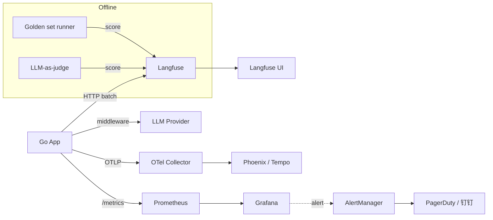

# A13 精通 LLM 可观测性

> 适用读者：中高级 Go 工程师、AI 平台架构师、LLM 应用运维负责人
> 内容基准：2026 年 8 月
> 配套阅读：A01《精通 Claude API 工程化》、A12《精通 RAG 评测》、B24《精通可观测性》

---

## 0. 引言：LLM 系统的可观测性挑战

可观测性（Observability）这个词，对于做过传统后端的人来说并不陌生。我们用 Prometheus 抓指标、用 Jaeger 看 trace、用 Loki/ELK 查日志，对一个 Web 服务做出诊断：QPS 多少、p99 延迟多少、错误率多少、CPU 内存多少。这些数字几乎是确定性的——同样的请求，今天和昨天的延迟分布大体一致，错误率突然抖动一定有原因。

但 LLM 应用打破了这种确定性。

第一次为生产 LLM 系统接监控的工程师，往往会被以下问题困扰：

- **同一个请求，不同时刻返回的 token 数不同**。延迟从 800ms 飘到 8s 是常态，p99/p50 比值可以到 10 倍。这不是 bug，是模型本身的特性。
- **延迟的"形状"变了**。传统 API 是一个原子的请求-响应，延迟就是端到端时间。LLM 流式 API 有两个关键指标：TTFT（Time To First Token，首 token 延迟）和 total latency；如果是 agent，还有 tool call 延迟、step 数、链路深度。
- **"对错"不再是 200 / 500**。模型可能返回了一个 200，但内容是错的、是幻觉、是被 prompt injection 劫持的。HTTP 状态码无法捕捉质量退化。
- **Cost 是一等公民**。传统服务的成本主要是 CPU/内存/带宽，LLM 服务的成本主要是 token，而且 input/output token 价格差几倍。一个糟糕的 prompt 模板上线，可能一夜烧光预算。
- **多模型混用**。同一个业务流可能调 Claude Sonnet 做主推理、调 Haiku 做分类、调 GPT-4o 做 fallback、调本地 Llama 3 做嵌入。每个模型的指标维度都要分开统计。
- **新维度爆炸**。user_id、session_id、agent_step、tool_name、model、provider、prompt_version、cache_status……一个 trace 上动辄十几个 dimension。

正因为这些新挑战，"LLM Observability" 在 2024-2026 年成为一个独立的细分领域，催生了 Langfuse、Phoenix、Helicone、Traceloop 等一批专业工具，OpenTelemetry 也在推进 GenAI Semantic Convention（截至 2026-05 仍处于 experimental/Development 阶段、正在快速演进、尚未 stable），推动 LLM 可观测性走向标准化。

本文目标：用 Go 工程师能落地的方式，把 LLM 可观测性的"三柱再造"——trace、metric、log——讲透，并给出 Langfuse / Phoenix / OTel 三套真实可跑的集成代码，覆盖从单次调用到 agent 链路、从在线监控到离线评测的完整闭环。

---

## 1. 三柱再造：为什么 LLM 需要"新三柱"

传统可观测性的三柱（Three Pillars）是 trace、metric、log。在 LLM 场景下，三柱的内容、粒度、采样策略都需要重新设计。

### 1.1 Trace：从扁平 span 到嵌套 observation

传统 trace 模型：一个 trace 由一组 span 组成，span 之间通过 parent_id 形成树。一个 HTTP 请求是一个 trace，下面挂数据库查询、外部 API 调用等 span。

LLM trace 模型需要表达更丰富的层次：

```
trace (一次用户对话或一次任务)
├── observation: chat-completion (主 LLM 调用)
│   ├── input: messages, system prompt
│   ├── output: completion, finish_reason
│   ├── usage: input_tokens, output_tokens, cost
│   └── attributes: model, temperature, ttft
├── observation: tool-call (函数调用)
│   ├── name: get_weather
│   ├── input: {city: "Beijing"}
│   └── output: {temp: 20}
├── observation: retrieval (RAG 检索)
│   ├── query: "..."
│   ├── documents: [{id, score, content}]
│   └── reranker: cohere-v3
├── observation: chat-completion (基于 RAG 的二次调用)
└── score: faithfulness=0.92, helpfulness=4/5
```

Langfuse 把这种结构抽象为 `trace → observation → score`：trace 是顶层会话，observation 是子单元（可以是 generation、span、event 三种类型），score 是质量评分。这种模型比 OTel 的扁平 span 更适合 LLM 业务。

### 1.2 Metric：从 RED 到 RED + Cost + Quality

传统 RED 指标：Rate（QPS）、Errors（错误率）、Duration（延迟）。LLM 服务在 RED 之上需要补充：

- **Cost**：每次调用的美元成本、每用户/每小时的 burn rate
- **Token throughput**：input_tps / output_tps，反映模型实际产出能力
- **Quality**：在线评分（user feedback）、离线评分（LLM-as-judge）的滑动窗口
- **TTFT**：流式场景的首 token 延迟，影响用户感知

### 1.3 Log：从结构化日志到"对话日志"

LLM 系统的日志有一个独特问题：input 和 output 都是自然语言，体积大、可能含 PII、可能含商业机密。

最佳实践：
- 日志只存元数据（model、tokens、duration、user_id）
- input/output 内容存到专门的 LLM observability 平台（Langfuse/Phoenix），并启用脱敏
- 高敏感场景采用 hash + reference，原文加密保存

---

## 2. LLM 专属指标体系

下面分别细说三大类指标。

### 2.1 Cost 指标

```
cost_usd = input_tokens * input_price + output_tokens * output_price
       + cache_read_tokens * cache_read_price
       + cache_write_tokens * cache_write_price
```

需要监控的：

| 指标 | 含义 | 告警阈值参考 |
|------|------|-------------|
| `llm_cost_usd_total` | 累计花费（counter） | hourly budget * 1.2 |
| `llm_cost_per_request_usd` | 单次成本（histogram） | p99 > 0.5 USD |
| `llm_cost_per_user_per_day_usd` | 单用户日成本 | > 10 USD（防滥用） |
| `llm_cache_hit_ratio` | 缓存命中率（gauge） | < 30%（成本优化目标） |

**采样规则**：cost 不能采样！每一次调用的 token 都要计入，否则成本统计偏差累积巨大。

### 2.2 Latency 指标

LLM 延迟比传统 API 复杂得多：

- **TTFT（Time To First Token）**：从请求发出到收到第一个 token，决定用户"开始看到回复"的感受
- **TPOT（Time Per Output Token）**：生成单个 token 的平均时间，与模型/硬件相关
- **Total Latency**：端到端总时间
- **Tokens Per Second（TPS）**：output_tokens / generation_time，吞吐指标

对流式接口，必须分别监控 TTFT 和 total，否则你只能看到一个被严重拉长的 p99。

| 指标 | p50 参考 | p99 参考 |
|------|---------|---------|
| TTFT (Claude Sonnet 5) | 400ms | 1500ms |
| TPS (Claude Sonnet 5) | 70 t/s | - |
| TTFT (Claude Haiku 4) | 200ms | 800ms |
| TPS (Claude Haiku 4) | 120 t/s | - |
| TTFT (GPT-5) | 350ms | 1200ms |

### 2.3 Quality 指标

质量指标分为：

- **隐式反馈**：用户是否复制了回答、是否继续追问、是否点踩
- **显式反馈**：thumbs up/down、星级评分
- **自动评测**：LLM-as-judge 给出的 faithfulness、helpfulness 等分数
- **业务指标**：任务完成率、首次回答解决率（FCR）

质量指标的关键是要"在线 + 离线"双通道：在线指标实时反映退化，离线指标基于 golden set 防止 prompt 改动引发 regression。

---

## 3. OpenTelemetry GenAI Semantic Convention

OpenTelemetry 的 GenAI Semantic Convention 截至 2026-05 仍处于 experimental/Development 阶段、正在快速演进、尚未 stable。即便如此，它已成为 LLM 可观测性走向厂商中立标准的重要方向，OTel 是 trace 的"通用语"，Langfuse/Phoenix/Datadog 都向其兼容。

### 3.1 核心 attribute 命名空间

| 属性 | 含义 | 示例 |
|------|------|------|
| `gen_ai.system` | 提供商 | `anthropic`, `openai`, `google` |
| `gen_ai.request.model` | 请求模型 | `claude-sonnet-5` |
| `gen_ai.response.model` | 实际响应模型 | `claude-sonnet-5` |
| `gen_ai.operation.name` | 操作类型 | `chat`, `embeddings`, `text_completion` |
| `gen_ai.request.temperature` | 温度 | `0.7` |
| `gen_ai.request.max_tokens` | 最大 token | `4096` |
| `gen_ai.usage.input_tokens` | 输入 token | `1234` |
| `gen_ai.usage.output_tokens` | 输出 token | `567` |
| `gen_ai.response.finish_reasons` | 结束原因 | `["stop"]`, `["length"]` |
| `gen_ai.conversation.id` | 会话 ID | `conv_abc123` |

Span name 规范：`{operation} {model}`，例如 `chat claude-sonnet-5`。

### 3.2 Event 命名（消息体不放 attribute）

为避免 attribute 体积爆炸，message 内容通过 OTel event 携带：

| Event 名 | 含义 |
|---------|------|
| `gen_ai.system.message` | system prompt |
| `gen_ai.user.message` | user message |
| `gen_ai.assistant.message` | assistant 回复 |
| `gen_ai.tool.message` | tool 返回 |
| `gen_ai.choice` | 最终 choice |

这些 event 的 body 字段是消息体（JSON），可被 trace backend 完整展示。

---

## 4. 工具生态对比

2026 年 5 月，LLM 可观测性生态相对成熟，主流工具如下：

| 工具 | 部署模式 | 协议 | 核心场景 | 价格 |
|------|---------|------|---------|------|
| **Langfuse 3.x** | OSS / Cloud / Self-host | 自有 SDK + OTel 兼容 | trace + eval + prompt management | OSS 免费，Cloud 按 event 计费 |
| **Arize Phoenix 4.x** | OSS / Cloud | OTel native | trace + LLM evaluation | OSS 免费 |
| **Helicone** | Cloud / Self-host | HTTP 代理（透明） | proxy-based logging + analytics | 免费 10w/月 |
| **Datadog LLM Observability** | SaaS | 自有 SDK + OTel | 与 APM 深度集成 | 按 host/log 计费 |
| **Traceloop / OpenLLMetry** | OSS SDK + 自有 backend | OTel native | OTel SDK 集合 | SDK 免费 |
| **LangSmith** | SaaS（LangChain 公司） | 自有 SDK | LangChain/LangGraph 用户首选 | 按 trace 计费 |
| **W&B Weave** | SaaS | 自有 SDK | 与 W&B Models 深度集成 | 按 trace 计费 |

**选型建议**：

- **小团队 / 自建可控**：Langfuse self-host（Docker Compose 起 5 个容器搞定）
- **OTel 原生栈**：Phoenix（直接发 OTel）+ Tempo/Jaeger
- **零侵入快速接入**：Helicone（改 base_url 就行）
- **已有 Datadog**：直接用 DD LLM Observability
- **LangChain/LangGraph 重度用户**：LangSmith

下面我们重点讲 Langfuse、Phoenix、OTel 三种方式的 Go 集成。

---

## 5. Langfuse 集成（Go）

Langfuse 是 2024-2026 年最流行的开源 LLM observability 平台。它的数据模型适合复杂 agent 场景。

> 说明：Langfuse 官方 Go SDK 在 2026 年 5 月仍处于 community 维护状态。下面给出的实现既可以通过其 OpenAPI 调用，也可以通过 OTLP 推送（Langfuse 3.x 已原生兼容 OTel GenAI convention）。本节示例采用 HTTP 直传方式，代码自包含、易于审阅。

### 5.1 数据模型

```
Trace
 ├── id, name, user_id, session_id, tags, metadata
 ├── input, output
 └── Observations (一个 trace 下多个)
       ├── type: GENERATION | SPAN | EVENT
       ├── name, start_time, end_time
       ├── input, output
       ├── model, modelParameters
       ├── usage: input, output, total, unit
       └── parent_observation_id (可嵌套)
 └── Scores
       ├── name: helpfulness | faithfulness | toxicity
       ├── value: 0-1 / 1-5 / boolean
       └── comment
```

### 5.2 Go 客户端骨架

```go
package langfuse

import (
    "bytes"
    "context"
    "encoding/json"
    "fmt"
    "net/http"
    "sync"
    "time"

    "github.com/google/uuid"
)

// Client 是一个轻量的 Langfuse 客户端，使用批量发送降低开销。
type Client struct {
    baseURL    string
    publicKey  string
    secretKey  string
    httpClient *http.Client

    mu      sync.Mutex
    batch   []event
    flushAt int           // 累积到多少条触发一次 flush
    flushIv time.Duration // 定时 flush
    stop    chan struct{}
}

type event struct {
    ID        string      `json:"id"`
    Type      string      `json:"type"`
    Timestamp time.Time   `json:"timestamp"`
    Body      interface{} `json:"body"`
}

func NewClient(baseURL, pub, sec string) *Client {
    c := &Client{
        baseURL:    baseURL,
        publicKey:  pub,
        secretKey:  sec,
        httpClient: &http.Client{Timeout: 5 * time.Second},
        flushAt:    50,
        flushIv:    2 * time.Second,
        stop:       make(chan struct{}),
    }
    go c.loop()
    return c
}

func (c *Client) loop() {
    t := time.NewTicker(c.flushIv)
    defer t.Stop()
    for {
        select {
        case <-c.stop:
            c.Flush(context.Background())
            return
        case <-t.C:
            c.Flush(context.Background())
        }
    }
}

func (c *Client) enqueue(e event) {
    c.mu.Lock()
    c.batch = append(c.batch, e)
    shouldFlush := len(c.batch) >= c.flushAt
    c.mu.Unlock()
    if shouldFlush {
        go c.Flush(context.Background())
    }
}

func (c *Client) Flush(ctx context.Context) error {
    c.mu.Lock()
    if len(c.batch) == 0 {
        c.mu.Unlock()
        return nil
    }
    batch := c.batch
    c.batch = nil
    c.mu.Unlock()

    payload, err := json.Marshal(map[string]interface{}{"batch": batch})
    if err != nil {
        return err
    }
    req, _ := http.NewRequestWithContext(ctx, "POST",
        c.baseURL+"/api/public/ingestion", bytes.NewReader(payload))
    req.SetBasicAuth(c.publicKey, c.secretKey)
    req.Header.Set("Content-Type", "application/json")

    resp, err := c.httpClient.Do(req)
    if err != nil {
        return err
    }
    defer resp.Body.Close()
    if resp.StatusCode >= 300 {
        return fmt.Errorf("langfuse ingestion failed: %d", resp.StatusCode)
    }
    return nil
}

func (c *Client) Close() { close(c.stop) }

// ---------- 业务 API ----------

type TraceParams struct {
    ID        string                 `json:"id"`
    Name      string                 `json:"name"`
    UserID    string                 `json:"userId,omitempty"`
    SessionID string                 `json:"sessionId,omitempty"`
    Input     interface{}            `json:"input,omitempty"`
    Output    interface{}            `json:"output,omitempty"`
    Tags      []string               `json:"tags,omitempty"`
    Metadata  map[string]interface{} `json:"metadata,omitempty"`
}

func (c *Client) Trace(p TraceParams) string {
    if p.ID == "" {
        p.ID = uuid.NewString()
    }
    c.enqueue(event{
        ID:        uuid.NewString(),
        Type:      "trace-create",
        Timestamp: time.Now().UTC(),
        Body:      p,
    })
    return p.ID
}

type Usage struct {
    Input  int    `json:"input"`
    Output int    `json:"output"`
    Total  int    `json:"total"`
    Unit   string `json:"unit"` // TOKENS / CHARACTERS / SECONDS
}

type GenerationParams struct {
    ID                  string                 `json:"id"`
    TraceID             string                 `json:"traceId"`
    ParentObservationID string                 `json:"parentObservationId,omitempty"`
    Name                string                 `json:"name"`
    StartTime           time.Time              `json:"startTime"`
    EndTime             *time.Time             `json:"endTime,omitempty"`
    Model               string                 `json:"model"`
    ModelParameters     map[string]interface{} `json:"modelParameters,omitempty"`
    Input               interface{}            `json:"input,omitempty"`
    Output              interface{}            `json:"output,omitempty"`
    Usage               *Usage                 `json:"usage,omitempty"`
    Level               string                 `json:"level,omitempty"` // DEFAULT / WARNING / ERROR
    StatusMessage       string                 `json:"statusMessage,omitempty"`
    Metadata            map[string]interface{} `json:"metadata,omitempty"`
}

func (c *Client) Generation(p GenerationParams) string {
    if p.ID == "" {
        p.ID = uuid.NewString()
    }
    eventType := "generation-create"
    if p.EndTime != nil {
        eventType = "generation-update"
    }
    c.enqueue(event{
        ID:        uuid.NewString(),
        Type:      eventType,
        Timestamp: time.Now().UTC(),
        Body:      p,
    })
    return p.ID
}

type ScoreParams struct {
    TraceID       string  `json:"traceId"`
    ObservationID string  `json:"observationId,omitempty"`
    Name          string  `json:"name"`
    Value         float64 `json:"value"`
    Comment       string  `json:"comment,omitempty"`
    DataType      string  `json:"dataType,omitempty"` // NUMERIC / BOOLEAN / CATEGORICAL
}

func (c *Client) Score(p ScoreParams) {
    c.enqueue(event{
        ID:        uuid.NewString(),
        Type:      "score-create",
        Timestamp: time.Now().UTC(),
        Body:      p,
    })
}
```

### 5.3 在 Anthropic 调用中埋点

```go
package llm

import (
    "context"
    "time"

    "github.com/anthropics/anthropic-sdk-go"
    "yourapp/langfuse"
)

type ObservedAnthropic struct {
    Client   *anthropic.Client
    Langfuse *langfuse.Client
}

func (o *ObservedAnthropic) Chat(
    ctx context.Context,
    traceID, userID, sessionID string,
    req anthropic.MessageNewParams,
) (*anthropic.Message, error) {
    if traceID == "" {
        traceID = o.Langfuse.Trace(langfuse.TraceParams{
            Name:      "chat",
            UserID:    userID,
            SessionID: sessionID,
        })
    }

    genID := o.Langfuse.Generation(langfuse.GenerationParams{
        TraceID:   traceID,
        Name:      "anthropic.messages.create",
        StartTime: time.Now().UTC(),
        Model:     string(req.Model),
        ModelParameters: map[string]interface{}{
            "max_tokens":  req.MaxTokens.Value,
            "temperature": req.Temperature.Value,
        },
        Input: req.Messages,
    })

    start := time.Now()
    msg, err := o.Client.Messages.New(ctx, req)
    end := time.Now()

    update := langfuse.GenerationParams{
        ID:        genID,
        TraceID:   traceID,
        Name:      "anthropic.messages.create",
        StartTime: start.UTC(),
        EndTime:   ptr(end.UTC()),
        Model:     string(req.Model),
    }
    if err != nil {
        update.Level = "ERROR"
        update.StatusMessage = err.Error()
    } else {
        update.Output = msg.Content
        update.Usage = &langfuse.Usage{
            Input:  int(msg.Usage.InputTokens),
            Output: int(msg.Usage.OutputTokens),
            Total:  int(msg.Usage.InputTokens + msg.Usage.OutputTokens),
            Unit:   "TOKENS",
        }
    }
    o.Langfuse.Generation(update)
    return msg, err
}

func ptr[T any](v T) *T { return &v }
```

### 5.4 流式调用的 TTFT 埋点

```go
func (o *ObservedAnthropic) ChatStream(
    ctx context.Context, traceID string, req anthropic.MessageNewParams,
) error {
    genID := o.Langfuse.Generation(langfuse.GenerationParams{
        TraceID:   traceID,
        Name:      "anthropic.messages.stream",
        StartTime: time.Now().UTC(),
        Model:     string(req.Model),
        Input:     req.Messages,
    })

    start := time.Now()
    var firstTokenAt time.Time
    var fullText string
    var inputTok, outputTok int

    stream := o.Client.Messages.NewStreaming(ctx, req)
    for stream.Next() {
        ev := stream.Current()
        if firstTokenAt.IsZero() {
            firstTokenAt = time.Now()
        }
        // 累积文本和用量（伪代码，实际取决于 SDK 事件类型）
        // fullText += ev.Delta.Text
        // inputTok = ev.Usage.InputTokens
        // outputTok = ev.Usage.OutputTokens
        _ = ev
    }
    if err := stream.Err(); err != nil {
        o.Langfuse.Generation(langfuse.GenerationParams{
            ID:            genID,
            TraceID:       traceID,
            EndTime:       ptr(time.Now().UTC()),
            Level:         "ERROR",
            StatusMessage: err.Error(),
        })
        return err
    }

    end := time.Now()
    ttft := firstTokenAt.Sub(start).Milliseconds()
    total := end.Sub(start).Milliseconds()
    tps := float64(outputTok) / end.Sub(firstTokenAt).Seconds()

    o.Langfuse.Generation(langfuse.GenerationParams{
        ID:        genID,
        TraceID:   traceID,
        EndTime:   ptr(end.UTC()),
        Output:    fullText,
        Usage:     &langfuse.Usage{Input: inputTok, Output: outputTok, Total: inputTok + outputTok, Unit: "TOKENS"},
        Metadata: map[string]interface{}{
            "ttft_ms":           ttft,
            "total_ms":          total,
            "tokens_per_second": tps,
        },
    })
    return nil
}
```

注意 TTFT 和 TPS 是放在 metadata 里。Langfuse 自带的 latency 指标只看 start/end，而 TTFT 是 LLM 特有指标，需要自己埋。

---

## 6. Arize Phoenix（OTel 原生）

Phoenix 是 Arize 开源的 LLM 可观测性平台，它的最大特点是**原生使用 OTel**。如果你已经有 OTel 栈，Phoenix 是最省心的选择。

启动 Phoenix：

```bash
docker run -p 6006:6006 -p 4317:4317 -p 4318:4318 \
  arizephoenix/phoenix:version-4.36.0
```

- 6006: Phoenix UI
- 4317: OTLP gRPC
- 4318: OTLP HTTP

Phoenix 4.x 完整支持 OTel GenAI Semantic Convention，所以你只要按规范打 OTel span，Phoenix UI 自动渲染 LLM 视图（消息列表、token 用量、cost）。

---

## 7. OpenTelemetry GenAI Convention：Go 实现

下面用 OTel 原生 API 实现 GenAI 规范的 trace。这套代码可以同时发到 Phoenix、Datadog、Tempo、Jaeger 等任何 OTel backend。

### 7.1 初始化 TracerProvider

```go
package telemetry

import (
    "context"

    "go.opentelemetry.io/otel"
    "go.opentelemetry.io/otel/exporters/otlp/otlptrace/otlptracegrpc"
    "go.opentelemetry.io/otel/sdk/resource"
    sdktrace "go.opentelemetry.io/otel/sdk/trace"
    semconv "go.opentelemetry.io/otel/semconv/v1.27.0"
)

func InitTracer(ctx context.Context, serviceName, endpoint string) (*sdktrace.TracerProvider, error) {
    exp, err := otlptracegrpc.New(ctx,
        otlptracegrpc.WithEndpoint(endpoint),
        otlptracegrpc.WithInsecure(),
    )
    if err != nil {
        return nil, err
    }

    res, _ := resource.New(ctx,
        resource.WithAttributes(
            semconv.ServiceName(serviceName),
            semconv.ServiceVersion("1.0.0"),
        ),
    )

    tp := sdktrace.NewTracerProvider(
        sdktrace.WithBatcher(exp,
            sdktrace.WithMaxQueueSize(2048),
            sdktrace.WithMaxExportBatchSize(512),
        ),
        sdktrace.WithResource(res),
        sdktrace.WithSampler(sdktrace.AlwaysSample()), // 生产建议 RatioBased(0.1)
    )
    otel.SetTracerProvider(tp)
    return tp, nil
}
```

### 7.2 GenAI Span 封装

```go
package genai

import (
    "context"
    "time"

    "go.opentelemetry.io/otel"
    "go.opentelemetry.io/otel/attribute"
    "go.opentelemetry.io/otel/codes"
    "go.opentelemetry.io/otel/trace"
)

const (
    SystemAnthropic = "anthropic"
    SystemOpenAI    = "openai"
    OpChat          = "chat"
    OpEmbed         = "embeddings"
)

type ChatRequest struct {
    System         string
    Model          string
    Operation      string
    Temperature    float64
    MaxTokens      int
    ConversationID string
    Messages       []map[string]any // role + content
}

type ChatResult struct {
    Model        string
    InputTokens  int
    OutputTokens int
    CacheReadTokens  int
    CacheWriteTokens int
    FinishReason string
    Response     string
    TTFT         time.Duration
    Total        time.Duration
}

func StartChatSpan(ctx context.Context, req ChatRequest) (context.Context, trace.Span) {
    tracer := otel.Tracer("genai")
    ctx, span := tracer.Start(ctx, req.Operation+" "+req.Model,
        trace.WithSpanKind(trace.SpanKindClient),
        trace.WithAttributes(
            attribute.String("gen_ai.system", req.System),
            attribute.String("gen_ai.operation.name", req.Operation),
            attribute.String("gen_ai.request.model", req.Model),
            attribute.Float64("gen_ai.request.temperature", req.Temperature),
            attribute.Int("gen_ai.request.max_tokens", req.MaxTokens),
            attribute.String("gen_ai.conversation.id", req.ConversationID),
        ),
    )

    // 用 event 携带 message 内容
    for _, m := range req.Messages {
        evName := "gen_ai.user.message"
        if r, ok := m["role"].(string); ok {
            switch r {
            case "system":
                evName = "gen_ai.system.message"
            case "assistant":
                evName = "gen_ai.assistant.message"
            case "tool":
                evName = "gen_ai.tool.message"
            }
        }
        span.AddEvent(evName, trace.WithAttributes(
            attribute.String("content", toJSON(m["content"])),
        ))
    }
    return ctx, span
}

func FinishChatSpan(span trace.Span, res ChatResult, err error) {
    if err != nil {
        span.RecordError(err)
        span.SetStatus(codes.Error, err.Error())
        return
    }
    span.SetAttributes(
        attribute.String("gen_ai.response.model", res.Model),
        attribute.Int("gen_ai.usage.input_tokens", res.InputTokens),
        attribute.Int("gen_ai.usage.output_tokens", res.OutputTokens),
        attribute.Int("gen_ai.usage.cache_read_tokens", res.CacheReadTokens),
        attribute.Int("gen_ai.usage.cache_write_tokens", res.CacheWriteTokens),
        attribute.StringSlice("gen_ai.response.finish_reasons", []string{res.FinishReason}),
        attribute.Int64("gen_ai.latency.ttft_ms", res.TTFT.Milliseconds()),
        attribute.Int64("gen_ai.latency.total_ms", res.Total.Milliseconds()),
    )
    span.AddEvent("gen_ai.choice", trace.WithAttributes(
        attribute.String("content", res.Response),
        attribute.String("finish_reason", res.FinishReason),
    ))
    span.SetStatus(codes.Ok, "")
}

func toJSON(v any) string {
    // 在生产中使用 encoding/json 并做长度裁剪与脱敏
    return ""
}
```

### 7.3 用 Prometheus 暴露 LLM Metric

OTel 也可以推 metric，但很多团队仍习惯 Prometheus pull 模型。下面给出一个 Prometheus collector：

```go
package metrics

import (
    "github.com/prometheus/client_golang/prometheus"
    "github.com/prometheus/client_golang/prometheus/promauto"
)

var (
    LlmRequests = promauto.NewCounterVec(prometheus.CounterOpts{
        Name: "llm_requests_total",
        Help: "Total LLM requests",
    }, []string{"model", "operation", "status"})

    LlmTokens = promauto.NewCounterVec(prometheus.CounterOpts{
        Name: "llm_tokens_total",
        Help: "Total tokens consumed",
    }, []string{"model", "kind"}) // kind=input/output/cache_read/cache_write

    LlmCost = promauto.NewCounterVec(prometheus.CounterOpts{
        Name: "llm_cost_usd_total",
        Help: "Total USD spent",
    }, []string{"model"})

    LlmLatency = promauto.NewHistogramVec(prometheus.HistogramOpts{
        Name:    "llm_latency_seconds",
        Help:    "End-to-end latency",
        Buckets: []float64{0.1, 0.25, 0.5, 1, 2, 5, 10, 30, 60},
    }, []string{"model", "operation"})

    LlmTTFT = promauto.NewHistogramVec(prometheus.HistogramOpts{
        Name:    "llm_ttft_seconds",
        Help:    "Time to first token",
        Buckets: []float64{0.1, 0.25, 0.5, 1, 2, 5},
    }, []string{"model"})

    LlmTPS = promauto.NewHistogramVec(prometheus.HistogramOpts{
        Name:    "llm_tokens_per_second",
        Help:    "Output tokens per second",
        Buckets: []float64{20, 40, 60, 80, 100, 150, 200},
    }, []string{"model"})
)
```

调用 LLM 后批量更新：

```go
LlmRequests.WithLabelValues(model, op, status).Inc()
LlmTokens.WithLabelValues(model, "input").Add(float64(in))
LlmTokens.WithLabelValues(model, "output").Add(float64(out))
LlmCost.WithLabelValues(model).Add(cost)
LlmLatency.WithLabelValues(model, op).Observe(total.Seconds())
LlmTTFT.WithLabelValues(model).Observe(ttft.Seconds())
```

### 7.4 计算成本的 pricing 表

```go
package pricing

// PriceUSD per million tokens
type Price struct {
    Input      float64
    Output     float64
    CacheRead  float64
    CacheWrite float64
}

// 2026-05 参考价格（实际以官方为准）
var Table = map[string]Price{
    "claude-opus-5":    {5, 25, 0.50, 6.25},
    "claude-sonnet-5":  {3, 15, 0.30, 3.75},
    "claude-haiku-4-5":   {1.00, 5.00, 0.10, 1.25},
    "gpt-5":              {1.25, 10, 0.125, 1.25},
    "gpt-5-mini":         {0.25, 2.00, 0.025, 0.25},
}

func Compute(model string, inTok, outTok, cacheReadTok, cacheWriteTok int) float64 {
    p, ok := Table[model]
    if !ok {
        return 0
    }
    return (float64(inTok)*p.Input +
        float64(outTok)*p.Output +
        float64(cacheReadTok)*p.CacheRead +
        float64(cacheWriteTok)*p.CacheWrite) / 1_000_000
}
```

---

## 8. 业务维度：user / session / agent step

LLM 系统的痛点之一是"按业务维度切片分析"。下面给出几个常用的维度模式。

### 8.1 User / Session 注入

```go
ctx = context.WithValue(ctx, userIDKey{}, "u_123")
ctx = context.WithValue(ctx, sessionIDKey{}, "s_abc")

span.SetAttributes(
    attribute.String("user.id", "u_123"),
    attribute.String("session.id", "s_abc"),
)
```

Langfuse / Phoenix 都会按 user_id / session_id 自动聚合视图。

### 8.2 Agent 多步链路

Agent 一次任务可能涉及 5-20 个 step。建议用一个父 span，每个 step 一个子 span：

```
span: agent.run (root)
├── span: planner.llm-call
├── span: tool.search_web
├── span: tool.read_file
├── span: synthesizer.llm-call
└── span: validator.llm-call
```

在 Langfuse 里，对应 trace + 多个 observation（type=GENERATION/SPAN）。

### 8.3 Prompt 版本追踪

每次 prompt 改动都在 trace 上记一个属性：

```go
span.SetAttributes(attribute.String("prompt.version", "rag-qa-v1.4"))
```

这样可以在 A/B 实验时按 prompt.version 切片对比成功率、cost、latency。

---

## 9. 评测自动化：在线 + 离线

可观测性最终要回到"判断模型是否在变好/变差"。这就要把 **评测（evaluation）** 闭环接进来。

### 9.1 在线评测（lightweight LLM-as-judge）

对每条线上 trace 随机采样 1-5%，用一个小模型（如 Claude Haiku）打分，分数写回 Langfuse：

```go
func OnlineEvalAsync(traceID, question, answer string) {
    go func() {
        score := runLLMJudge(question, answer) // 返回 0-1
        lfClient.Score(langfuse.ScoreParams{
            TraceID:  traceID,
            Name:     "online_helpfulness",
            Value:    score,
            DataType: "NUMERIC",
        })
    }()
}
```

注意：在线评测会增加成本。建议用便宜模型 + 低采样率。

### 9.2 离线 Golden Set 回归

维护一个 200-500 条的 golden set（覆盖关键业务场景）。每次 prompt / 模型变更：

1. 用新版本跑 golden set
2. 用 LLM judge / 字符串匹配 / 业务规则评分
3. 与历史 baseline 对比
4. 退化超过阈值（如 helpfulness 下降 5%）则 CI 阻断

```go
type GoldenCase struct {
    ID       string
    Input    string
    Expected string
    Tags     []string
}

type EvalResult struct {
    CaseID       string
    Score        float64
    Latency      time.Duration
    CostUSD      float64
    PassRegress  bool
}

func RunGolden(cases []GoldenCase, llm Caller, judge Judger) []EvalResult {
    results := make([]EvalResult, 0, len(cases))
    for _, c := range cases {
        start := time.Now()
        out, usage := llm(c.Input)
        score := judge(c.Input, out, c.Expected)
        cost := pricing.Compute("claude-sonnet-5", usage.In, usage.Out, 0, 0)
        results = append(results, EvalResult{
            CaseID: c.ID, Score: score,
            Latency: time.Since(start), CostUSD: cost,
        })
    }
    return results
}
```

把每次回归结果存数据库，用 Grafana 画曲线，能直观看到 prompt / 模型迭代的质量变化。

---

## 10. 告警策略

LLM 系统典型告警如下：

| 告警 | 触发条件 | 严重程度 | 处置 |
|------|---------|---------|------|
| Cost 暴涨 | 1 小时花费 > 预算 1.5 倍 | P1 | 自动降级到便宜模型 |
| 错误率高 | 5 分钟错误率 > 5% | P1 | 检查 provider 状态 |
| TTFT p99 高 | 10 分钟 p99 > 5s | P2 | 切换 fallback provider |
| Quality 下降 | 在线评分 1h MA 下降 > 10% | P2 | 检查最近 prompt 变更 |
| 单用户滥用 | 单用户 1h cost > 5 USD | P3 | 限流 / 联系用户 |
| Cache 命中率低 | 24h cache_hit_ratio < 20% | P3 | 检查 prompt 模板 |
| Rate limit | 5 分钟内 RL 错误 > 10 次 | P2 | 检查并发与配额 |

Prometheus 告警规则示例：

```yaml
groups:
  - name: llm
    rules:
      - alert: LLMCostSpike
        expr: increase(llm_cost_usd_total[1h]) > 100
        labels: {severity: critical}
        annotations:
          summary: "LLM hourly cost > $100"

      - alert: LLMHighTTFT
        expr: histogram_quantile(0.99, rate(llm_ttft_seconds_bucket[10m])) > 5
        for: 5m
        labels: {severity: warning}

      - alert: LLMErrorRate
        expr: |
          sum(rate(llm_requests_total{status="error"}[5m]))
          / sum(rate(llm_requests_total[5m])) > 0.05
        for: 5m
        labels: {severity: critical}
```

---

## 11. 生产实践

### 11.1 采样策略

| 数据 | 采样建议 |
|------|---------|
| Cost / Token / 错误 metric | 100%，不采样 |
| 成功的 trace | 1-10% 即可 |
| 错误的 trace | 100% |
| 慢请求（>3s）trace | 100% |
| User feedback / Score | 100% |

Langfuse 客户端可以做"先全部收，后端按规则保留"，OTel 可以做 head sampling（请求开始时决定）。生产推荐 **tail-based sampling**（请求结束后决定，便于保留所有错误/慢请求）。

### 11.2 PII 脱敏

LLM 的 input/output 经常含 PII：邮箱、手机号、身份证、地址、银行卡。建议：

1. 在 SDK 层做正则脱敏（手机号、邮箱、身份证）
2. 高敏感场景调用 Microsoft Presidio / AWS Comprehend
3. 提供 redact_input/redact_output 开关，默认在生产开启

```go
var (
    rePhone = regexp.MustCompile(`1[3-9]\d{9}`)
    reEmail = regexp.MustCompile(`[\w.+-]+@[\w-]+\.[\w.-]+`)
    reIDCN  = regexp.MustCompile(`[1-9]\d{5}(19|20)\d{2}(0[1-9]|1[0-2])(0[1-9]|[12]\d|3[01])\d{3}[0-9Xx]`)
)

func Redact(s string) string {
    s = rePhone.ReplaceAllString(s, "[PHONE]")
    s = reEmail.ReplaceAllString(s, "[EMAIL]")
    s = reIDCN.ReplaceAllString(s, "[ID_CN]")
    return s
}
```

### 11.3 数据保留期

| 数据 | 保留期 | 原因 |
|------|-------|------|
| Metric（无 PII） | 12-24 月 | 容量小，需长期趋势 |
| Trace（无 input/output） | 30-90 天 | 排障窗口 |
| Trace（含 input/output） | 7-30 天 | 合规 / 容量 |
| Score / Eval 结果 | 12 月以上 | 长期质量监控 |

### 11.4 多租户隔离

SaaS LLM 平台要为每个 tenant 隔离观测数据。Langfuse 支持 project 维度隔离；自研可以在所有 metric / trace 加 `tenant_id` label，并在 Grafana 设 RBAC。

### 11.5 一个完整中间件

```go
type LLMMiddleware struct {
    Lf       *langfuse.Client
    Pricing  func(model string, in, out, cr, cw int) float64
    Redact   func(string) string
}

func (m *LLMMiddleware) Wrap(
    ctx context.Context, model, op, userID, sessionID string,
    input any,
    call func(ctx context.Context) (output any, usage Usage, err error),
) (any, error) {
    traceID := m.Lf.Trace(langfuse.TraceParams{
        Name:      op,
        UserID:    userID,
        SessionID: sessionID,
        Input:     input,
    })

    ctx, span := genai.StartChatSpan(ctx, genai.ChatRequest{
        System:         "anthropic",
        Model:          model,
        Operation:      op,
        ConversationID: sessionID,
    })
    defer span.End()

    start := time.Now()
    out, usage, err := call(ctx)
    dur := time.Since(start)

    cost := m.Pricing(model, usage.Input, usage.Output, usage.CacheRead, usage.CacheWrite)

    LlmRequests.WithLabelValues(model, op, statusOf(err)).Inc()
    LlmTokens.WithLabelValues(model, "input").Add(float64(usage.Input))
    LlmTokens.WithLabelValues(model, "output").Add(float64(usage.Output))
    LlmCost.WithLabelValues(model).Add(cost)
    LlmLatency.WithLabelValues(model, op).Observe(dur.Seconds())

    genai.FinishChatSpan(span, genai.ChatResult{
        Model:        model,
        InputTokens:  usage.Input,
        OutputTokens: usage.Output,
        Total:        dur,
    }, err)

    m.Lf.Generation(langfuse.GenerationParams{
        TraceID:   traceID,
        Name:      op,
        StartTime: start.UTC(),
        EndTime:   ptr(time.Now().UTC()),
        Model:     model,
        Input:     m.redactAny(input),
        Output:    m.redactAny(out),
        Usage: &langfuse.Usage{
            Input:  usage.Input,
            Output: usage.Output,
            Total:  usage.Input + usage.Output,
            Unit:   "TOKENS",
        },
        Metadata: map[string]interface{}{
            "cost_usd": cost,
        },
    })
    return out, err
}

func (m *LLMMiddleware) redactAny(v any) any {
    if s, ok := v.(string); ok {
        return m.Redact(s)
    }
    return v
}
```

### 11.6 总体架构



---

## 12. 陷阱清单

1. **Cost 采样**。任何形式的 cost 数据都不能采样，否则统计偏差越积越大。
2. **TTFT 与 total 不分**。流式接口只看 total latency 会把 p99 拉到天上，必须分开监控。
3. **input/output 全量入 metric**。token 数应当作为 metric，但内容只放 trace/log，否则 metric backend 会爆。
4. **PII 直接进 Langfuse Cloud**。Cloud 版默认非 EU 区域，敏感数据务必先脱敏或选 self-host。
5. **忘了把 cache_read_tokens 计成本**。Anthropic / OpenAI 缓存命中价格不为零（约 1/10 input 价格），不算入会低估总成本。
6. **以 finish_reason=stop 当成功**。`stop` 只代表模型主动结束，业务上可能根本没解决用户问题；要靠 quality score。
7. **trace 嵌套不画 parent_id**。导致 agent 的 trace 在 UI 里散乱不成树。
8. **Prompt 改了不打版本号**。事后想看 A/B 退化原因，找不到分隔点。
9. **Backend 压力反压到主流程**。Langfuse / OTel 发送必须异步 + 队列 + 容量上限，掉数据也不能阻塞业务。
10. **多 region 时区不一致**。trace 时间用 UTC，metric 用 unix 秒，否则跨区域排障对不齐。
11. **没有 sandbox 区分**。dev/staging/prod 共用一个 Langfuse project 会污染金线数据。
12. **采样率全局一刀切**。错误请求 100% 采、慢请求 100% 采、其他 1% 采，是更优策略。
13. **忽略 OTel attribute cardinality 上限**。user_id / session_id 作为 attribute 会撑爆 metric backend，应只放 trace。
14. **token 数靠自己估**。务必使用 provider 返回的 usage；不要用 tiktoken（OpenAI 分词器）去估 Claude token，跨模型分词器不同，偏差很大。
15. **golden set 永远不更新**。golden set 会随业务漂移老化，至少季度审查一次。

---

## 13. 2026 年现状速览

- **OTel GenAI Convention**（截至 2026-05 仍为 experimental/Development、尚未 stable）：正朝厂商中立的事实标准演进。Anthropic、OpenAI、Google 的官方 SDK 在 2026 年陆续集成。
- **Langfuse 3.x**（2025 年发布）：核心新增 prompt management、自定义 evaluator、与 OTel 双向兼容（既能接收 OTLP，也能导出 OTLP）；OSS self-host 仍是首选；Langfuse Cloud 推出 EU/US 双 region。
- **Arize Phoenix 4.x**（2026 年初）：完整 OTel GenAI 支持、内置 30+ evaluator、与 Arize AX 商业产品打通；最受欢迎的"OTel 原生"开源选项。
- **Helicone 2.x**：新增对 Anthropic 的 prompt caching 透明计费、自动 PII redaction；对低代码团队仍是最快的接入方式。
- **Datadog LLM Observability**：2025 GA，原生支持 OTel GenAI，与 APM、Trace、Log 一体化；适合企业级 Datadog 用户。
- **Traceloop / OpenLLMetry**：捐赠给 OTel SIG，成为 OTel 官方推荐的 Python/Go/JS SDK 集合；Go SDK 在 2026 Q1 进入 beta。
- **W&B Weave**：与 Models / Eval 打通，是研究团队的首选。
- **Anthropic 官方 dashboard**：新增 organization-level cost 与 abuse detection（2025 末），但仍非通用 observability 工具，建议自建 + Anthropic 控制台双视图。
- **EU AI Act 2025-08 生效**：高风险 LLM 应用必须保留 trace 日志至少 6 个月、PII 处理需有 DPIA；这对观测系统的保留期与合规审计提出明确要求。
- **NIST AI RMF 1.0**（2023）+ **Generative AI Profile**（NIST AI 600-1, 2024-07）：把"可观测性"列为 Manage 函数下的明确控制项，企业内审将要求覆盖 cost / quality / 安全事件全链路。

---

## 14. 练习题

1. **TTFT 实现**：在已有的 Anthropic Go SDK 调用上接入 Langfuse，并在流式调用中正确测量 TTFT。要求 TTFT 误差 ≤ 10ms。
2. **Cost dashboard**：基于 Prometheus + Grafana，搭一个按 model / user / hour 切片的 cost 看板，并实现"小时预算超额自动降级到便宜模型"的告警-动作链路。
3. **Agent trace**：实现一个 5 步 agent（plan → search → read → synthesize → validate），用 OTel 嵌套 span 表达，并在 Phoenix UI 验证 trace 树正确。
4. **GenAI Convention 适配**：把第 7 节代码扩展为通用 wrapper，支持 Anthropic、OpenAI、Google 三家 SDK，使用统一的 `gen_ai.*` attribute 命名。
5. **Quality 退化报警**：实现一个在线评测器，对每条 trace 5% 采样，用 Haiku 评分，并在 1 小时滑动窗口 quality 下降 > 10% 时触发告警。
6. **PII 脱敏**：实现一个 `Redactor` 接口，支持手机号、邮箱、身份证号、信用卡号的脱敏；编写 100 条测试用例，覆盖边界情况（如号码中间含空格 / 短横线）。
7. **采样优化**：实现 tail-based sampling，规则：错误 100%、>3s 100%、其他 5%；要求队列容量不超过 10k，溢出时优先丢弃成功请求。
8. **Golden set CI**：实现一个 GitHub Action，PR 触发时跑 200 条 golden set，并在 helpfulness 下降 > 5% 时阻断 merge；输出 markdown 报告评论到 PR。
9. **多 provider fallback 可观测性**：实现一个 fallback 中间件（主 Claude，失败切 GPT），并保证 trace 上能完整看到 "尝试 Claude → 失败 → 切换 GPT → 成功" 的两段 span，每段有独立的 usage / cost。
10. **合规导出**：实现一个工具，按用户 ID 导出该用户过去 90 天所有 trace 的 input/output / usage / score，输出 JSON 格式，并对 PII 做不可逆 hash 化（用于响应 GDPR / EU AI Act 数据主体请求）。

<details>
<summary>📝 参考答案</summary>

1. **TTFT 实现**：流式 API 在 `stream.Recv()` 第一次返回前记录 `t0 := time.Now()`；首个非空 event 到达时 `ttft := time.Since(t0)`。注意：① 在 SDK 的 Stream 抽象内层测，外层逻辑可能 buffer；② Langfuse 把 ttft 作为 generation observation 的自定义 attribute 上报；③ 用 `time.Now()` 而非 metric 采样，避免 `defer` 滞后。
2. **Cost dashboard**：Prom metric `llm_cost_usd_total{model,user_id}` counter；Grafana 用 `rate(...[1h])` + sum by 维度。降级：PromQL `sum by(user) (rate(llm_cost_usd_total[1h])) > 5` 触发 alert，alertmanager webhook 调内部"降级 API"把用户 flag 写 Redis，Gateway 读 flag 路由到 Haiku。
3. **Agent trace**：根 span `agent.run`，子 span `plan`/`search`/`read`/`synthesize`/`validate`，每个 span 设 `gen_ai.operation.name`。Phoenix 看到树状结构、每步耗时。关键：`context.WithValue` 透传 SpanContext，每步用 `tracer.Start(parentCtx, "plan")`。
4. **GenAI Convention 适配**：抽象 `interface LLMClient { Complete(ctx, req) (resp, error) }`，每家 SDK 一个 adapter；wrapper 统一写入 `gen_ai.system` / `gen_ai.request.model` / `gen_ai.usage.input_tokens` 等 OTel GenAI semantic convention attribute。
5. **Quality 退化报警**：采样 `if hash(traceID) % 100 < 5` 入 eval queue；worker 用 Haiku 评分 1-5；写 ClickHouse `score_table(ts, score)`；告警 PromQL：`avg_over_time(quality_score[1h]) / avg_over_time(quality_score[1h] offset 1d) < 0.9` 持续 15min 触发。
6. **PII 脱敏**：接口 `Redactor.Redact(text) string`，按优先级跑正则——身份证 18 位优先（避免被手机号误匹配）；号码中间空格/短横线用 `\d[\s\-]?\d` 模式；邮箱用 RFC 5322 简化版。100 用例覆盖：纯数字、含分隔符、国际区号、混在长文本、贴近边界。
7. **Tail-based sampling**：`buffer chan *Trace` 容量 10k；trace 完成时按规则（error 100% / latency>3s 100% / else 5%）判定；溢出策略：`select { case buffer <- t: default: if t.IsSuccess() { drop } else { evict_oldest_success } }`。
8. **Golden set CI**：GitHub Action 起 Go 程序读 200 条 golden，调 PR 分支构建的服务，LLM judge 算 helpfulness 均分；与 baseline.json 对比：`if (mean_new - mean_baseline) < -0.05 { os.Exit(1) }`；生成 markdown 表格用 `gh pr comment` 贴回 PR。
9. **Fallback 可观测**：每次尝试独立 span：`tracer.Start(ctx, "llm.call", attrs{provider:"claude"})`；失败 span 设 `status=error` 后再起 `provider:gpt` span；最外层 `fallback.invoke` span 包住两者。Phoenix / Tempo 看到 sibling spans 且都有独立 usage / cost。
10. **合规导出**：从 trace 后端（Langfuse / ClickHouse）按 `user_id=X AND ts > now-90d` 查询；对 input/output 跑 Redactor（PII 替换为 `sha256(user_salt+pii)`）；输出 JSON `{user_id, exported_at, traces:[{ts, input, output, usage, scores}]}`。export 操作本身也要写审计 trail。

</details>

