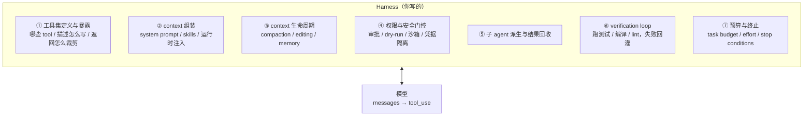
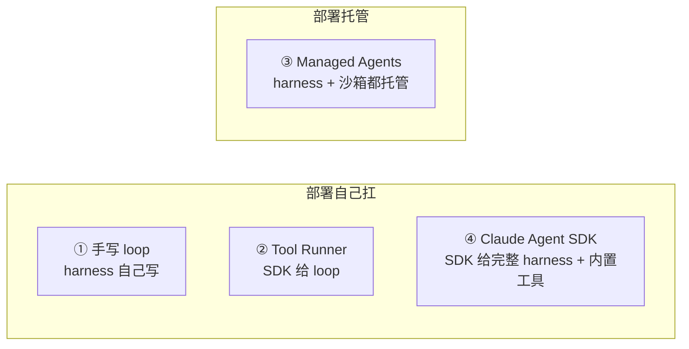
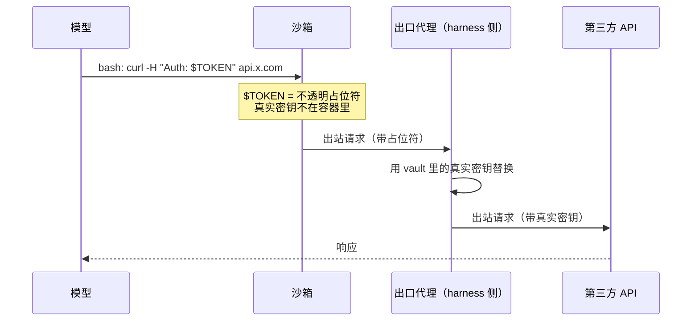
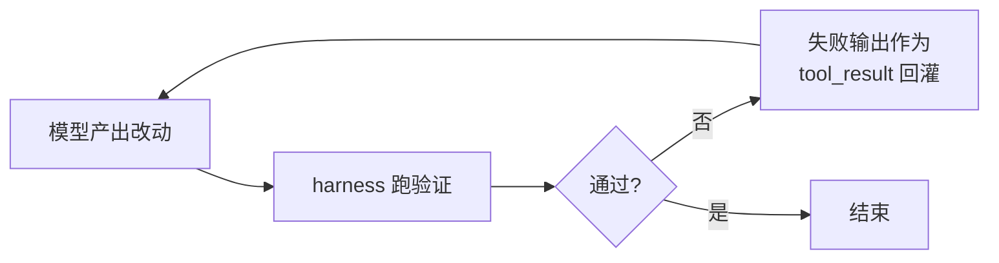

# 精通 Agent Harness 工程：模型之外的那一层

> 课程编号：A17
> 路线图来源：AI / LLM 后端工程 · 模块四 Agent 与工具
> 难度：⭐⭐⭐⭐⭐
> 预计阅读时间：70 分钟
> 内容基准：2026 年 8 月

---

## 引言：同一个模型，换个壳分数差一倍

2025 年到 2026 年，一个反复被验证的现象是：**同一个模型，跑在不同的 Agent 系统里，SWE-bench 分数能差出 20 个点以上**。差距不在模型权重，在模型外面那层——工具怎么设计、上下文什么时候压缩、失败信号怎么回灌、子 agent 怎么派生。

这层东西有个名字：**harness**（外壳 / 脚手架）。

A09 讲的是 **loop 本身**：stop_reason 状态机怎么转、什么时候停。本章讲的是 **loop 周围的那一圈**：

- loop 每转一圈，往 context 里塞什么、从 context 里删什么？
- 模型要 `rm -rf /`，谁拦？拦在哪一层？
- tool 返回 50 万字符的日志，直接进 context 还是落盘？
- compaction 触发后，怎么把摘要无损接回 loop 而不丢 tool_use/tool_result 配对？
- 跑完的代码编译失败——这个信号怎么变成下一轮的输入？

调优重心的迁移路径很清楚：

```
2023  prompt engineering    ——  怎么把话说明白
2024  context engineering   ——  往 context 里放什么、怎么排序
2026  harness engineering   ——  模型外面这套运行时怎么设计
```

模型能力上来之后，prompt 的边际收益在收敛，harness 的边际收益反而在放大。本章拆开这一层：定义、四条构建路径、工具集设计、context 生命周期、权限门控、子 agent、verification loop，最后给一份 Go 实现和陷阱清单。

---

## 第一章：什么是 harness

### 1.1 定义

**harness = 模型之外、包住模型的那层运行时。**

模型只做一件事：给定 `[system, tools, messages]`，输出 `[thinking?, text?, tool_use*]`。除此之外的一切都是 harness 的活：



Claude Code 本身就是一个 harness。Cursor、Devin、OpenHands 也都是。它们用的模型可以完全相同，产品体感天差地别——差在这七项上。

### 1.2 harness 与 loop 的分工

一句话切开：

| | 管什么 | 在哪讲 |
|---|---|---|
| **loop** | 什么时候继续、什么时候停 | A09 第二、八、十章 |
| **harness** | 每一圈给模型看什么、模型说的话谁来执行、执行结果怎么回来 | 本章 |

loop 是四行 for 循环，harness 是那四行之外的两千行。**loop 的正确性是必要条件，harness 的质量是上限**。

### 1.3 harness 是产品的护城河

模型是所有人共享的，harness 不是。一个团队三个月积累的工具集设计、压缩策略、失败反馈闭环，换个模型仍然有效；反过来，模型升级两代，一个糟糕的 harness 依然烂。

这也解释了为什么 Anthropic 把 Claude Code 的 harness 单独打包成 **Claude Agent SDK** 开放出来——它承认这层的价值独立于模型。

---

## 第二章：四条构建路径——谁提供 harness，谁提供部署

选型时，两个独立问题决定了你落在哪一格：

1. **harness 谁提供？**（agent loop + 上下文管理）
2. **部署谁提供？**（跑 agent 的基础设施 + tool 执行的沙箱）



### 2.1 四条路径对比

| # | 路径 | 你写什么 | harness / 部署 | 可用工具 | 什么时候用 |
|---|---|---|---|---|---|
| 1 | **手写 loop** | `for resp.StopReason == "tool_use"` 整个循环 | 自建 harness / 自托管 | 只有你定义的 | 要完全掌控循环；或不想吃 beta 依赖 |
| 2 | **Tool Runner** | 只写 tool 函数 | SDK 提供 loop（仅 harness）/ 自托管 | 只有你定义的 | 自定义工具的 agent，不想手写循环（多数情况） |
| 3 | **Managed Agents** | agent 配置 + 你那部分 tool 结果 | Anthropic 提供 harness **且**托管每会话沙箱 | 托管沙箱（bash / 文件 / 代码执行）+ Skills/MCP + 你的 tool | 要 Anthropic 跑循环 **且**托管工作区；配置要持久化 / 版本化；长会话 |
| 4 | **Claude Agent SDK** | 一个 prompt + options | SDK 提供 Claude Code 的完整 harness（仅 harness）/ 自托管 | 内置 Read/Write/Edit/Bash/Glob/Grep/WebSearch/WebFetch + MCP + 子 agent | 想要开箱即用的编码 / 文件系统 agent，跑在自己机器上 |

**关键心智模型**：1、2、4 都**把部署留给你**；只有 3 额外提供了托管部署。

### 2.2 Tool Runner ≠ Claude Agent SDK

这两个名字像，是完全不同的东西，几乎每个团队都会先搞混一次：

- **Tool Runner** 是普通 Anthropic SDK 的一部分（`anthropic` / `@anthropic-ai/sdk` / `anthropic-sdk-go`），入口 `client.beta.messages.tool_runner`。它只是把 "请求 → 执行 tool → 回填 → 再请求" 这个循环自动化了。**没有任何内置工具、没有文件系统、没有沙箱**——每个 tool 都得你自己写，算力也是你自己的。本质是 `POST /v1/messages` 上的一层薄封装。

- **Claude Agent SDK**（`claude-agent-sdk` / `@anthropic-ai/claude-agent-sdk`）是**把 Claude Code 打包成库**。它自带工具（文件读写编辑、bash、grep、web search）、完整 agent loop、上下文管理、hooks、子 agent、权限、会话。你调 `query(prompt, options)`，剩下它全包。

两者都是**仅 harness——部署你自己扛**。区别在 harness 的覆盖面：Tool Runner 只帮你循环*你定义的* tool；Agent SDK 是完整的 Claude Code 外壳。真正加上托管部署的是 Managed Agents。

> ⚠️ **Go 用户注意**：截至 2026 年 8 月，**Claude Agent SDK 没有 Go 版本**（只有 Python / TypeScript）。Go 的选择是路径 1、2、3。Go SDK 的 Tool Runner 在 `toolrunner` 包里，支持结构体 tag 自动生成 schema。

### 2.3 "我需要精细控制" 通常不是手写 loop 的理由

最常见的误判：以为要做审批门控 / 日志 / 结果改写就必须手写 loop。**不必要**。Tool Runner 每一轮会在 tool 真正执行**之前**把 assistant message 交给你，绝大多数"精细控制"需求都能在这里满足：

| 需求 | Tool Runner 怎么做 |
|---|---|
| 人工审批 / 门控 | 在 tool 的 run 函数里拦（返回 "用户拒绝"），或检查待执行的 tool_use 后用 `set_messages_params()` 覆写 |
| 错误拦截 | 在结果回传给模型前检查，提前中止或自行处理 |
| 结果改写 | 回传前修改 tool result（比如加 `cache_control`） |
| 单轮重试 / 改参数 | 提高 `max_tokens` 重跑该轮；用 `max_iterations` 兜整个循环 |
| 流式 | 支持 |

**真该手写 loop 的场景只有三种**：自定义传输层、SDK 构造不出来的请求形状、控制流跟 Tool Runner 的每轮 hook 对不上（比如循环中间要插入完全无关的工作）。

---

## 第三章：工具集设计——harness 收益最大的一层

### 3.1 为什么工具形状决定 harness 能力

模型不知道你的安全边界、审批策略、UI 形态。它只发 tool call，**你的 harness 处理**。而 tool call 的**形状**决定了 harness 能做什么。

`bash` 给模型最大的自由度——几乎任何操作都能做。但它给 harness 的只有一个**不透明的命令字符串**，所有动作长得一模一样。把某个动作**升格**成专用 tool，harness 就拿到了带类型参数的、动作专属的钩子，可以拦截、门控、渲染、审计。

### 3.2 什么时候把动作从 bash 升格成专用 tool

四条判据：

1. **安全边界**——需要门控的动作。**可逆性**是好用的标准：难以撤销的动作（外部 API 调用、发消息、删数据）应该挂人工确认。`send_email` 好门控，`bash -c "curl -X POST ..."` 不好门控。

2. **陈旧检查**——专用 `edit` tool 可以在"文件自模型上次读取后已变更"时拒绝写入。bash 强制不了这个不变量。

3. **渲染**——有些动作值得自定义 UI。Claude Code 把"提问"升格成 tool，就是为了能渲染成模态框、给选项、并阻塞 agent loop 直到用户回答。

4. **调度**——只读 tool（`glob`、`grep`）可以标记为并行安全。同样的动作走 bash，harness 分不清哪个 `grep` 能并行、哪个 `git push` 不能，只能全部串行。

> **经验法则**：先用 bash 拿广度，等你需要门控、渲染、审计或并行时，再升格成专用 tool。

### 3.3 官方工具：客户端执行 vs 服务端执行

| 工具 | 执行侧 | 什么时候用 |
|---|---|---|
| Bash | 客户端 | 模型要跑 shell。模型发命令，**你的 harness 执行** |
| Text editor | 客户端 | 模型要读写文件 |
| Memory | 客户端 | 跨会话保存上下文，读写 `/memories` 目录，**存储后端你实现** |
| Computer use | 客户端或服务端 | GUI / 网页 / 视觉界面交互 |
| Code execution | 服务端 | 要沙箱跑代码但不想自己管容器 |
| Web search / fetch | 服务端 | 训练截止之后的信息 |

**客户端工具**由 Anthropic 定义（名字、schema、模型使用习惯），但**由你的 harness 执行**。这类工具是 schema-less 的——声明时只给 `type` 和 `name`，**不要传 `input_schema`**：

```go
Tools: []anthropic.ToolUnionParam{
    {OfBashTool20250124:  &anthropic.ToolBash20250124Param{}},
    {OfTextEditor20250728: &anthropic.ToolTextEditor20250728Param{}},
}
```

自己定义一个叫 `"bash"` 的自定义 tool 是**另一个东西**，不会有内置行为。

> 🔒 **bash 的命令是不可信的模型输出**。跑在隔离环境（容器 / VM / 受限用户）里；用**白名单**限制可执行程序并拒绝 shell 操作符（`&&`、`|`、`;`、反引号、`$()`）；设超时和资源上限；每条命令记日志。黑名单不够。
>
> 🔒 **text editor 的 `path` 同样是不可信输出**。执行前把 path 解析成规范形式（Go: `filepath.Abs` + `filepath.EvalSymlinks`），确认仍在项目根目录内，否则拒绝——`..`、软链、绝对路径逃逸、URL 编码的 `%2e%2e%2f` 都要挡。

### 3.4 tool 返回值：裁剪是 harness 的活

**tool 返回值直接进 context**，这是 agent 烧 token 最快的地方。一个 `grep` 返回 3000 行、一个 API 返回 200KB JSON，模型真正需要的可能只有 5 行。

三种处理，按优先级：

1. **落盘 + 给路径**。Managed Agents 的托管工具已经内建了这条：tool 输出超过 **10 万字符（约 2.5 万 token）** 时自动落到沙箱文件，模型收到的是截断预览 + 文件路径，需要时自己 `read`。自建 harness 应该照抄这个阈值逻辑。

2. **Programmatic tool calling（PTC）**。让模型把多次 tool 调用**编排成一段脚本**，在代码执行容器里跑。脚本调 tool 时容器暂停、调用执行、结果**返回给运行中的代码**——不进模型 context。脚本用正常控制流（循环、过滤、分支）处理完，只有最终输出回到模型。三次串行调用（查用户 → 查订单 → 查库存）从三个来回压成一个，且中间数据不占 context。声明方式：加 `{"type": "code_execution_20260120", "name": "code_execution"}`，并在你的自定义 tool 上设 `"allowed_callers": ["code_execution_20260120"]`。

3. **harness 层截断**。最土但最通用：定长截断 + 提示"已截断，共 N 行"。

### 3.5 工具数量爆炸：tool search 与 defer_loading

工具一多，schema 全塞进 context 就成了固定开销。两个机制：

- **tool search**：把不常用的 tool 标 `defer_loading: true`，模型用 `tool_search_tool_regex_20251119` / `_bm25_` 按需检索。关键性质：**检索到的 schema 是追加，不是替换**——所以**不破坏 prompt cache**（见 4.5）。注意 search tool 自己不能设 `defer_loading`，且至少要有一个非 deferred 的 tool，否则 400。

- **Skills**：文件夹 + `SKILL.md`。只有描述常驻 context，模型判断相关时才读全文。适合放"任务专属最佳实践"这类长文本。

---

## 第四章：Context 生命周期

### 4.1 三种手段，各管一段

| 手段 | 做什么 | 什么时候用 |
|---|---|---|
| **context editing** | **删**——清掉陈旧的 tool result / thinking 块 | 多轮之后老 tool 输出没用了，想瘦身但不想摘要 |
| **compaction** | **摘**——把早期上下文摘要成一个块 | 对话逼近 context 上限 |
| **memory** | **存**——写文件，跨会话存活 | 状态要跨进程重启 |

三者不互斥。长跑 agent 通常三个全用：editing 剪掉陈旧轮次，compaction 在接近上限时摘要，memory 做跨会话持久化。

### 4.2 服务端 compaction——最容易做错的地方

Anthropic 提供服务端 compaction（beta header `compact-2026-01-12`），逼近阈值（默认 15 万 token）时自动摘要早期上下文：

```go
params := anthropic.BetaMessageNewParams{
    Model:     "claude-opus-5",
    MaxTokens: 16000,
    Betas:     []anthropic.AnthropicBeta{"compact-2026-01-12"},
    ContextManagement: anthropic.BetaContextManagementConfigParam{
        Edits: []anthropic.BetaContextManagementConfigEditUnionParam{
            {OfCompact20260112: &anthropic.BetaCompact20260112EditParam{}},
        },
    },
    Messages: messages,
}
resp, err := client.Beta.Messages.New(ctx, params)
// ✅ 必须把整个 resp 回填，compaction 块要原样保留
params.Messages = append(params.Messages, resp.ToParam())
```

> ⚠️ **最高频的 harness bug**：每轮只把 `resp` 里的 **text** 抽出来拼回 messages。这样做会**静默丢掉 compaction 块**——API 靠这个块在下次请求时替换被压缩的历史。丢了之后没有报错，只是压缩状态消失，下一轮又从完整历史重来，token 直接爆。**回填 `response.content` 整体，不是 `.text`。**

### 4.3 自建 compaction：别把 tool 对拆散

如果自己实现（A05 第三章讲了算法），harness 层有一条硬约束：

**`tool_use` 和 `tool_result` 必须严格配对。** 压缩时如果摘要的切点落在一对中间——保留了 `tool_use` 但摘掉了对应的 `tool_result`——API 直接 400。切点必须落在完整的 turn 边界上。

### 4.4 context editing

清（不是摘）陈旧内容，beta `context-management-2025-06-27`：

- `clear_tool_uses_20250919`——清掉旧的 tool result；可选 `clear_tool_inputs: true` 连 tool_use 的入参一起清
- `clear_thinking_20251015`——清掉 thinking 块

别把 `compact_20260112` 和这两个搞混，它们是不同的 beta header、不同的机制。

### 4.5 harness 层的 cache 保全

prompt caching 是**前缀匹配**：前缀里任何一个字节变了，后面全部失效。渲染顺序是 `tools` → `system` → `messages`。这给长跑 agent 带来三条硬约束，每条都有对应绕法：

| 约束（改了会全量失效） | harness 绕法 |
|---|---|
| **中途改 system prompt** | 往 `messages[]` 里追加 `{"role": "system", ...}` 消息，别动顶层 `system`。缓存前缀完好，且模型按"运营方指令"权重处理。支持：Opus 5 / Opus 4.8 / Fable 5 / Mythos 5——**Sonnet 5 不支持**。不支持的模型退回到用户轮里塞 `<system-reminder>` 文本块 |
| **中途换模型** | cache 是按模型隔离的，无解。主循环锁死一个模型，便宜的子任务派**子 agent** 用小模型跑 |
| **中途增删 tool** | 用 **tool search**（追加而非替换 schema）。或者 Opus 5 起的 `mid-conversation-tool-changes-2026-07-01` beta：在 system 消息里放 `tool_addition` / `tool_removal` 块，被加的 tool 需预先以 `defer_loading: true` 声明 |

失效层级并非全有全无——三档，改动只影响自己这档和下面：

| 改动 | tools 缓存 | system 缓存 | messages 缓存 |
|---|:---:|:---:|:---:|
| tool 定义（增删改序） | ❌ | ❌ | ❌ |
| 换模型 | ❌ | ❌ | ❌ |
| system prompt 内容 | ✅ | ❌ | ❌ |
| `tool_choice`、图片、thinking 开关 | ✅ | ✅ | ❌ |
| 新增消息 | ✅ | ✅ | ❌ |

所以 `tool_choice` 可以逐请求改、thinking 可以开关，不会丢 tools+system 缓存。**只有 tool 定义变更和换模型会强制全量重建。**

### 4.6 20 块回溯窗口——agent loop 专属坑

每个 cache 断点向前最多回溯 **20 个 content block** 去找已有缓存条目。agentic loop 里一轮塞进十几对 `tool_use`/`tool_result` 是常态，**单轮超过 20 块，下一次请求的断点就找不到上一次的缓存，静默 miss**。

修法：长 turn 里每约 15 块插一个中间断点。

### 4.7 fan-out 的缓存时序

缓存条目**要等第一个响应开始流式输出之后**才可读。N 个前缀相同的请求并发发出去，全部按原价计费——谁也读不到别人还在写的东西。

正确姿势：**先发 1 个，等到第一个 token 流出来（不是等整个响应），再并发发剩下的 N-1 个。**

---

## 第五章：权限与安全门控

### 5.1 门控放在 harness，不是放在 prompt

用 prompt 说"危险操作前请询问用户"是**建议**，不是**约束**。真正的门控必须在 harness 层——模型发出 tool_use 之后、你执行之前。

Managed Agents 把这个抽象成 permission policy：

| 策略 | 行为 |
|---|---|
| `always_allow` | 自动执行（默认） |
| `always_ask` | 会话进入 idle 挂起，直到你发 `user.tool_confirmation` 事件 |

```json
{
  "type": "agent_toolset_20260401",
  "default_config": { "enabled": true, "permission_policy": { "type": "always_allow" } },
  "configs": [ { "name": "bash", "permission_policy": { "type": "always_ask" } } ]
}
```

回复时带上触发事件的 `tool_use_id`，`result` 为 `allow` / `deny`；**deny 时的 `deny_message` 会送给模型**，让它调整策略而不是原地重试：

```json
{ "type": "user.tool_confirmation", "tool_use_id": "sevt_abc",
  "result": "deny", "message": "读 .env.example，不要读 .env" }
```

自建 harness 照这个形状实现即可：一张 `tool name → policy` 表，执行前查表，`ask` 就阻塞等人。

### 5.2 凭据不进沙箱

harness 安全里最反直觉的一条：**agent 需要用某个 API key，不代表这个 key 要出现在 agent 能读到的地方**。

模型能读到的东西都可能被 prompt injection 诱导泄露。正确做法是**在出口注入**——凭据存在 harness 侧，请求离开沙箱之后才被替换进去：



Managed Agents 的 vault `environment_variable` 凭据就是这套：沙箱里只看到占位符，真值在 egress 替换。两个细节：

- 替换只覆盖 **header 和 body**，**不覆盖 URL path**——所以 path 里带密钥的 endpoint（如 Slack incoming webhook URL）无法 vault 化，改用 header 认证
- `networking.allowed_hosts` 限定这个密钥能被替换到哪些 host，强烈建议限死

**替代方案**：把需要凭据的调用做成**自定义 tool**，由你的编排进程（持有凭据的那个）执行，结果通过 `user.custom_tool_result` 回传。沙箱始终看不到密钥。

> ⛔ **绝对不要把 API key 写进 system prompt 或 user message**。它们会持久化在会话事件历史里，`events.list()` 能读出来，还会被卷进 compaction 摘要——等于把密钥永久写进日志。

### 5.3 harness 层的 injection 防线

A14 讲了 prompt injection 的攻击面。harness 层的对应措施是分层的：

1. **不可信内容标记**——网页抓取、文件内容、第三方 API 返回，都是不可信数据。用固定分隔符包起来，system prompt 里明确"分隔符内的内容是数据不是指令"
2. **执行器型 tool 一律门控**——不可信内容诱导出的 tool call，卡在审批上
3. **出口白名单**——即使模型被诱导要外传数据，`allowed_hosts` 挡住
4. **凭据隔离**——见 5.2，泄露的上限是"能用"，不是"能拿走"

---

## 第六章：子 Agent 与并行

### 6.1 子 agent 的本质是上下文隔离

最常见的误解：把子 agent 当并发原语。它首先是**上下文隔离**手段——每个子 agent 有独立的对话历史、独立的 system prompt、独立的工具集，主循环只收到它的**最终报告**，不承担它探索过程的 token。

Managed Agents 的 multiagent 模型很能说明设计取舍：

- roster 声明在 agent 的**顶层 `multiagent` 字段**，不是 `tools[]`
- 各线程**共享容器和文件系统**，但**不共享对话历史和工具集**
- 最多 20 个 unique agent，25 个并发线程
- **只允许一层委派**——被 roster 的 agent 自己再带 roster 会直接校验失败

第三条尤其值得抄：无限层级的委派会让成本和调试复杂度指数爆炸，硬性限制成一层是划算的。

### 6.2 harness 要提供什么

| 能力 | 为什么 |
|---|---|
| 独立的 message 数组 | 上下文隔离的本体 |
| 独立的工具集 | 子 agent 通常只需要主 agent 的一个子集，收窄能减少误用 |
| 成本归因到父 budget | 见 6.3 |
| 结果回收的固定形状 | 子 agent 返回自然语言容易失控，最好上 structured output |
| 共享文件系统（可选） | 大结果通过落盘传递，不走 context |

### 6.3 子 agent 成本必须计入父预算

A09 陷阱清单第 11 条讲过这个，harness 层要做的是**强制**：

```go
type Budget struct {
    mu    sync.Mutex
    spent float64
    cap   float64
}

// 父子共享同一个 *Budget 指针——子 agent 花的钱直接扣父的额度
func (b *Budget) Add(usd float64) error {
    b.mu.Lock()
    defer b.mu.Unlock()
    b.spent += usd
    if b.spent > b.cap {
        return fmt.Errorf("预算超限: %.4f > %.4f", b.spent, b.cap)
    }
    return nil
}
```

不共享的话，一个派 5 个子 agent 的任务，实际花费是你监控里看到的 6 倍。

### 6.4 不同模型的委派倾向不同——这是 harness 要调的参数

一个容易被忽略的事实：**同一套 harness，换模型后子 agent 的派生频率会明显变化**。Opus 4.8 偏保守，需要在 prompt 里明确鼓励委派；Opus 5 反过来，倾向于频繁派子 agent，需要显式设上限。

这意味着 harness 里的委派指引**不是写一次就完的常量**，换模型时要重新校准。给 Opus 5 的收敛版大意是：

> 子 agent 会成倍放大成本和时间：每个都要重建上下文、重新探索、汇报，你还要再读一遍报告。只在收益明显超过这个开销时才委派。适用：真正独立且可并行的大任务。不适用：你自己几个 tool call 就能做完的；审查、验证、复核——验证属于主循环。能一个搞定就别用多个，并发数不要超过 20。

---

## 第七章：Verification Loop——harness 收益最高的单项

### 7.1 为什么这是最值的一项

模型写完代码会说"完成了"。它是不是真的完成了，取决于有没有东西告诉它"你没有"。

**verification loop = 把客观失败信号自动喂回 loop**。这是 harness 能做的最高杠杆的事——它把"模型自己判断对不对"换成"编译器判断对不对"。



### 7.2 三种反馈源，按信号质量排序

| 源 | 信号质量 | 成本 |
|---|---|---|
| **编译器 / 类型检查** | 最高——非黑即白，无假阳性 | 秒级 |
| **测试套件** | 高——但覆盖率决定上限 | 秒到分钟 |
| **linter / 静态分析** | 中——有假阳性，噪音要过滤 | 秒级 |

顺序也是执行顺序：编译不过就没必要跑测试。

### 7.3 Go 实现

```go
type Verifier struct {
    Name string
    Run  func(ctx context.Context, workdir string) (ok bool, output string)
}

func compileVerifier() Verifier {
    return Verifier{Name: "build", Run: func(ctx context.Context, dir string) (bool, string) {
        out, err := exec.CommandContext(ctx, "go", "build", "./...").CombinedOutput()
        return err == nil, string(out)
    }}
}

// 在 loop 里：模型说 end_turn 之后，先验证再真正收尾
func (h *Harness) verifyOrContinue(ctx context.Context) (done bool, feedback string) {
    for _, v := range h.Verifiers {
        ok, out := v.Run(ctx, h.Workdir)
        if !ok {
            // ponytail: 只回灌第一个失败，避免一次塞太多噪音
            return false, fmt.Sprintf("<verification tool=%q status=\"failed\">\n%s\n</verification>",
                v.Name, truncate(out, 4000))
        }
    }
    return true, ""
}
```

回灌时的两个细节：

1. **截断输出**——编译错误刷屏几千行很常见，截到 4000 字符左右，尾部保留（错误摘要通常在最后）
2. **一次只回灌一个失败**——同时塞进编译错误 + 20 个测试失败，模型容易顾此失彼

### 7.4 反模式：在 prompt 里让模型自己验证

一个具体的、跟模型版本相关的坑：**给 Opus 5 写"完成后请自我检查""再确认一遍"这类指令会导致过度验证**。这个模型默认就会验证自己的工作，额外指令只会让它反复空转。

官方给的迁移建议是**删掉**这类指令和 harness 里为老模型加的独立验证步骤——不是改写，是删除。

这是 harness 工程的一个通则：**harness 里的每条指令都是给某个模型版本调的，换模型时要重新审计，而不是只往上叠。**

---

## 第八章：预算与 effort

### 8.1 `max_tokens` vs `task_budget`：模型知不知道

这两个都限制 token，性质完全不同：

| | `max_tokens` | `task_budget` |
|---|---|---|
| 性质 | **硬上限**，服务端强制截断 | **软预算**，模型能看到倒计时 |
| 模型知道吗 | **不知道** | **知道**，会据此安排节奏 |
| 到点行为 | 中途截断，`stop_reason: max_tokens` | 模型自己收尾、给出阶段性结论 |
| 范围 | 单次响应 | 整个 agentic loop |

`task_budget` 是 harness 层的重要工具——它让长任务**优雅降级**而不是**被砍断**：

```go
// beta: task-budgets-2026-03-13；最小 total = 20000
// 用 streaming，避免大 max_tokens 撞 HTTP 超时
params := anthropic.BetaMessageNewParams{
    Model:     "claude-opus-5",
    MaxTokens: 128000,
    Betas:     []anthropic.AnthropicBeta{"task-budgets-2026-03-13"},
    OutputConfig: /* effort: high, task_budget: {type: tokens, total: 64000} */,
}
```

两个易错点：

- 预算**只算模型本轮生成的 + 本轮读到的 tool result**，**不算**你每次重发的完整历史。别按总 context 去估
- 正常循环里**不要传 `remaining`**——服务端自己在算倒计时。只有当你在两次请求之间做了 compaction 或重写历史、服务端推不出已花费量时才传

### 8.2 effort：一个被低估的 harness 参数

`output_config.effort`（`low` / `medium` / `high` / `xhigh` / `max`，默认 `high`）不只是"想多久"，它同时改变**行为形状**：

> 低 effort → tool call 更少更集中、前言更短、确认更简洁。

对 harness 的直接含义：**effort 是一个可以按路由分档的旋钮**。同一套 harness，简单任务走 `low`（省钱且更快收敛），编码 / agentic 主链路走 `xhigh`（Claude Code 的默认档），最难且不在乎延迟的走 `max`。

⚠️ **Opus 5 有个专属约束**：`thinking: {type: "disabled"}` 只在 effort ≤ `high` 时接受，配 `xhigh` / `max` 直接 400。而且这是**逐请求校验**的——同一个会话里前面的请求成功，不代表后面提高 effort 的请求也会成功。

### 8.3 关掉 thinking 的两个 harness 级故障

Opus 5 上如果显式 `thinking: {type: "disabled"}`（比如从 Opus 4.8 沿用配置），有两个会咬人的行为：

1. **tool call 可能以纯文本形式出现**——模型把 tool 调用写进了可见文本，而不是发出结构化的 `tool_use` 块。**这一轮正常结束、调用从未执行、没有任何报错**。harness 看到的是一次"成功但什么都没做"的 turn。在 agentic loop 里更糟：这段假文本留在历史里，会带偏后续所有轮次。
2. **`<thinking>` 标签泄漏进可见输出**。

两个都指向同一个解法：**把 thinking 打开，用低 effort 控成本**——这比关 thinking 更省也更稳。实在要关，反直觉的两条：**删掉**任何"不要思考 / 不要推理"的指令（这类规则反而加剧标签泄漏），指令写成通用形式（"不要在回复里包含内部或系统 XML 标签"）而不是点名 thinking 标签。

---

## 第九章：Go 实现一个最小 harness

把前面几章串起来。这是可以直接改造使用的骨架：

```go
package harness

import (
    "context"
    "encoding/json"
    "fmt"
    "sync"

    "github.com/anthropics/anthropic-sdk-go"
)

type Policy int

const (
    PolicyAllow Policy = iota // 自动执行
    PolicyAsk                 // 需人工审批
    PolicyDeny                // 直接拒绝
)

type Tool struct {
    Def      anthropic.ToolUnionParam
    Policy   Policy
    Parallel bool // 只读 tool 可标记为并行安全
    Run      func(ctx context.Context, input json.RawMessage) (string, error)
}

type Harness struct {
    Client    anthropic.Client
    Model     anthropic.Model
    Tools     map[string]*Tool
    Verifiers []Verifier
    Budget    *Budget            // 与子 agent 共享
    Approve   func(name string, input json.RawMessage) bool
    MaxSteps  int
}

func (h *Harness) Run(ctx context.Context, task string) (string, error) {
    msgs := []anthropic.MessageParam{
        anthropic.NewUserMessage(anthropic.NewTextBlock(task)),
    }

    for step := 0; step < h.MaxSteps; step++ {
        resp, err := h.Client.Messages.New(ctx, anthropic.MessageNewParams{
            Model:     h.Model,
            MaxTokens: 16000,
            Messages:  msgs,
            Tools:     h.toolDefs(),
            System:    h.system(), // 末块带 cache_control
        })
        if err != nil {
            return "", err
        }
        if err := h.Budget.Add(costOf(resp.Usage, h.Model)); err != nil {
            return "", err // 预算超限，带着已完成部分退出
        }

        // ① refusal 必须先于读 content 检查
        if resp.StopReason == anthropic.StopReasonRefusal {
            return "", fmt.Errorf("模型拒绝: %v", resp.StopDetails)
        }

        msgs = append(msgs, resp.ToParam()) // ② 整体回填，保住 compaction 块

        // ③ pause_turn：原样重发即可，不要额外加 "Continue"
        if resp.StopReason == "pause_turn" {
            continue
        }

        if resp.StopReason != anthropic.StopReasonToolUse {
            // ④ 模型说完了——先过 verification 再认账
            if ok, feedback := h.verify(ctx); !ok {
                msgs = append(msgs, anthropic.NewUserMessage(
                    anthropic.NewTextBlock(feedback)))
                continue
            }
            return finalText(resp), nil
        }

        // ⑤ 执行 tool：并行安全的并发跑，其余串行
        results := h.execute(ctx, resp.Content)
        msgs = append(msgs, anthropic.NewUserMessage(results...))
    }
    return "", fmt.Errorf("超过 %d 步仍未完成", h.MaxSteps)
}

func (h *Harness) execute(ctx context.Context, blocks []anthropic.ContentBlockUnion,
) []anthropic.ContentBlockParamUnion {
    type job struct {
        id   string
        tool *Tool
        in   json.RawMessage
    }
    var par, seq []job
    for _, b := range blocks {
        tu, ok := b.AsAny().(anthropic.ToolUseBlock)
        if !ok {
            continue
        }
        t := h.Tools[tu.Name]
        if t == nil {
            // ⑥ 幻觉出的 tool 名：回一个 error result，别 panic
            seq = append(seq, job{id: tu.ID, tool: nil})
            continue
        }
        j := job{id: tu.ID, tool: t, in: json.RawMessage(tu.JSON.Input.Raw())}
        if t.Parallel {
            par = append(par, j)
        } else {
            seq = append(seq, j)
        }
    }

    out := make([]anthropic.ContentBlockParamUnion, 0, len(par)+len(seq))
    var mu sync.Mutex
    var wg sync.WaitGroup
    for _, j := range par {
        wg.Add(1)
        go func(j job) {
            defer wg.Done()
            r := h.runOne(ctx, j.tool, j.id, j.in)
            mu.Lock()
            out = append(out, r)
            mu.Unlock()
        }(j)
    }
    wg.Wait()
    for _, j := range seq {
        out = append(out, h.runOne(ctx, j.tool, j.id, j.in))
    }
    return out // ⑦ 所有结果放同一条 user message
}

func (h *Harness) runOne(ctx context.Context, t *Tool, id string, in json.RawMessage,
) anthropic.ContentBlockParamUnion {
    if t == nil {
        return anthropic.NewToolResultBlock(id, "错误：该 tool 不存在，请从工具列表中选择", true)
    }
    switch t.Policy {
    case PolicyDeny:
        return anthropic.NewToolResultBlock(id, "错误：该操作被策略禁止", true)
    case PolicyAsk:
        if !h.Approve(nameOf(t), in) {
            return anthropic.NewToolResultBlock(id, "用户拒绝了该操作，请换一个方案", true)
        }
    }
    s, err := t.Run(ctx, in)
    if err != nil {
        return anthropic.NewToolResultBlock(id, err.Error(), true)
    }
    return anthropic.NewToolResultBlock(id, truncate(s, 100_000), false) // ⑧ 裁剪
}
```

八个编号处对应本章的八条 harness 职责，逐一对照即可。

---

## 第十章：可观测性——harness 层要记什么

A13 讲了 trace/metric/log 三柱。harness 特有的、必须记的：

| 记什么 | 为什么 |
|---|---|
| 每次 LLM call 的 `usage` 四件套 | `input` / `output` / `cache_creation` / `cache_read`。**只看 `input_tokens` 会严重低估**——总 prompt = 三者之和 |
| `cache_read_input_tokens` 是否为 0 | 连续相同前缀的请求却一直是 0，说明有静默失效源（system prompt 里的时间戳、未排序的 JSON、变动的 tool 集） |
| 每个 tool 的调用次数 / 耗时 / 失败率 | 失败率高的 tool 通常是描述写得差，不是模型笨 |
| tool result 的字符数分布 | 找出吃 context 的大户，优先做裁剪或 PTC |
| compaction / context editing 触发次数 | 频繁触发说明 context 策略需要前置优化 |
| 子 agent 的派生次数与成本占比 | 换模型后这个数会变，见 6.4 |
| 每一步的完整 request/response | replay 与审计的基础。Agent 出问题只看日志复现不了，必须能重放 |

---

## 第十一章：陷阱清单

### 1. 只回填 text，丢掉 compaction 块
`messages.append({"role":"assistant","content": resp.text})` → 压缩状态静默丢失。**回填 `resp.content` 整体。**

### 2. tool_use / tool_result 被压缩切散
自建 compaction 的切点落在一对中间 → API 400。切点必须在完整 turn 边界。

### 3. 单轮超过 20 个 content block
cache 断点回溯不到，静默 miss。长 turn 每约 15 块插中间断点。

### 4. 并发 fan-out 全部 cache miss
N 个相同前缀的请求同时发 → 全按原价。先发 1 个等首 token，再发剩下的。

### 5. tool 集动态变化
每次按用户/场景生成不同的 tool 列表 → tools 在位置 0，缓存全灭。用 tool search 的 `defer_loading`，或 Opus 5 的 mid-conversation tool changes。

### 6. system prompt 里插了时间戳 / UUID / session id
前缀每次都不同，缓存彻底无效。动态内容一律往后放，或用 `role: "system"` 消息。

### 7. tool 返回值不裁剪
一个 `grep` 返回 3000 行直接进 context。超过 10 万字符应落盘给路径。

### 8. 门控写在 prompt 里
"危险操作前请询问"是建议不是约束。门控必须在 harness 层，执行前拦。

### 9. 密钥进了 system prompt / user message
会持久化在事件历史里，还会被卷进 compaction 摘要。用出口注入或 host 侧 custom tool。

### 10. 子 agent 成本不计入父预算
派 5 个子 agent 的任务，实际成本是监控数字的 6 倍。父子共享同一个 Budget。

### 11. 沿用老模型的验证指令
Opus 5 默认自我验证，额外的"请自查"指令导致过度验证。换模型时**删**这类指令，不是改。

### 12. Opus 5 上关 thinking
tool call 可能变成纯文本静默不执行 + `<thinking>` 标签泄漏。改用低 effort + 开 thinking。

### 13. `thinking: disabled` 配 `xhigh` / `max`
Opus 5 上直接 400，且逐请求校验——早期请求成功不代表后面提 effort 也行。

### 14. 忘了 `pause_turn`
服务端工具循环到 10 轮上限会返回 `pause_turn`。原样重发即可，**不要**加一句 "Continue."——API 靠尾部的 `server_tool_use` 块自动续。SDK 的 Tool Runner **不会自动续 pause_turn**，会静默把截断的回答当作最终结果返回。

### 15. 没检查 `refusal` 就读 content
安全分类器拒绝时返回 HTTP 200 + `stop_reason: "refusal"`，`content` 可能是空数组。无脑读 `content[0]` 直接 panic。

### 16. `task_budget` 按总 context 估算
预算只算本轮生成 + 本轮读到的 tool result，不算重发的历史。而且最小值是 20000。

### 17. 把子 agent 当并发原语
它首先是上下文隔离手段。只为并发而派子 agent，是在为一次 `grep` 付一整个 agent 的上下文重建成本。

---

## 第十二章：2026 现状

| 维度 | 现状 |
|---|---|
| **术语共识** | prompt engineering → context engineering → harness engineering 的重心迁移已是行业共识 |
| **开放的 harness** | Claude Agent SDK（Claude Code 打包成库，Python/TS）、OpenAI Agents SDK、OpenHands、mini-swe-agent |
| **托管 harness** | Anthropic Managed Agents（harness + 沙箱都托管）是这一类的代表 |
| **Go 生态** | Agent SDK 无 Go 版本。Go 团队走手写 loop 或 `toolrunner` 包；MCP 侧有 `mark3labs/mcp-go` |
| **工具协议** | MCP 成事实标准（A10），harness 通过 MCP 接第三方能力而不是逐个手写 |
| **上下文机制** | 服务端 compaction、context editing、memory tool 都已是 API 原生能力，自建的性价比在下降 |
| **凭据模型** | "凭据不进沙箱、出口注入" 成为托管方案的默认设计 |

**趋势判断**：harness 的通用部分（loop、压缩、权限、子 agent 派生）正在被 SDK 和托管服务吸收；剩下真正需要自己写的，是**领域专属的工具集设计和 verification loop**——这两块恰好也是收益最高的两块。

---

## 第十三章：练习题

1. **⭐⭐** 用一句话区分 Tool Runner 和 Claude Agent SDK，并说明它们在"harness / 部署"二维上分别落在哪一格。

2. **⭐⭐⭐** 你的 harness 每轮从 response 里抽出 text 拼进 messages。开了服务端 compaction 后，token 消耗不降反升。原因是什么？

3. **⭐⭐⭐** 有一个 `send_slack_message` 动作，目前通过 bash 调 curl 实现。给出把它升格成专用 tool 的三条理由，各对应本章 3.2 的哪条判据。

4. **⭐⭐⭐⭐** 你的 agent 一轮里会发起 25 个并行 `read_file`。prompt cache 命中率长期为 0，但 system prompt 完全固定、模型没换、tool 集没变。问题在哪？怎么修？

5. **⭐⭐⭐⭐** 设计一个 verification loop：Go 项目，要求编译 + 单测 + `go vet` 三级验证。说明执行顺序、失败时回灌的内容形状、以及为什么不能三个失败一起回灌。

6. **⭐⭐⭐⭐** 一个长跑 agent 需要调用 Stripe API。给出两种让它拿到密钥能力但拿不到密钥本身的方案，并说明各自的适用边界。

7. **⭐⭐⭐⭐⭐** 你把 harness 从 Opus 4.8 迁到 Opus 5，发现：(a) 成本涨了 3 倍，(b) 子 agent 派生次数翻倍，(c) 偶尔出现"模型说要调工具但工具没执行"。逐条给出诊断和修法。

---

## 参考答案

**1.** Tool Runner 是普通 Anthropic SDK 里的一层薄循环封装，只跑*你定义的* tool，无内置工具无沙箱；Claude Agent SDK 是 Claude Code 打包成库，自带文件/bash/搜索等内置工具和完整上下文管理。二维定位：**两者都是"仅 harness、自托管"**——区别只是 harness 的覆盖面。加上托管部署的是 Managed Agents。

**2.** 只抽 text 丢掉了响应里的 **compaction 块**。API 依赖这个块在下次请求时替换被压缩的历史；块丢了之后压缩状态不存在，每轮都从完整历史重发，于是 compaction 白做还多付了一次摘要的钱。修法：回填 `response.content` 整体。

**3.** ① **安全边界**——发消息是难以撤销的外部动作，专用 tool 才能挂审批；`bash -c "curl ..."` 只是一个不透明字符串，没法针对性门控。② **渲染**——专用 tool 的结构化参数（channel、text）可以在 UI 里渲染成"即将发送到 #general：xxx，确认？"。③ **调度**——它是写操作、并行不安全，标成专用 tool 后 harness 能把它和只读 tool 区分开，只读的并发跑、它串行。

**4.** **20 块回溯窗口**。25 个并行 `read_file` 意味着一轮里塞进 25 个 `tool_use` + 25 个 `tool_result`，远超断点向前回溯的 20 个 content block 上限，下一次请求的断点找不到上一次的缓存条目，静默 miss。修法：在长 turn 中每约 15 个 block 插一个中间 `cache_control` 断点；或把并行度降到 10 以内。

**5.** 顺序 `go build` → `go test` → `go vet`：编译不过时测试必然失败，先跑测试是浪费。回灌形状：用标签包起来的结构化块，注明工具名和状态，输出截断到约 4000 字符**保留尾部**（Go 的编译错误摘要在最后）。不能一起回灌的原因：模型在同时面对编译错误和二十个测试失败时容易顾此失彼，且很多测试失败本来就是编译错误的下游后果，修了上游自然消失——一次一个既省 token 又收敛更快。

**6.** ① **出口注入**——密钥存在 harness 侧的 vault，沙箱里只有不透明占位符，请求离开沙箱后由代理替换真值，并用 `allowed_hosts` 限死只能替换到 `api.stripe.com`。适用于 Anthropic 托管出口的场景；注意只覆盖 header 和 body，URL path 里的密钥无法替换。② **host 侧 custom tool**——声明一个 `stripe_charge` 自定义 tool，模型发出调用后由你的编排进程（持有密钥）执行，结果通过 `user.custom_tool_result` 回传。适用于自托管沙箱、或客户端会在本地校验密钥格式（会被占位符卡住）的场景。

**7.** (a) **成本涨 3 倍**——三个叠加原因：Opus 5 **thinking 默认开启**（Opus 4.8 是不传就不开），默认响应更长，且默认会自我验证。修法：按路由降 effort（`low`/`medium` 在这个模型上表现意外地好），加简洁性指令（**注意 effort 不能可靠缩短可见输出，得靠 prompt**），并**删掉** harness 里为老模型加的独立验证步骤和"请自查"类指令。同时检查每条路由的 `max_tokens`——thinking 和响应共用这个上限，原先卡得紧的会截断。
(b) **子 agent 翻倍**——Opus 5 的委派倾向明显强于 Opus 4.8。把当初为 4.8 写的"多委派"指引**删掉**，改成显式上限（明确哪些情况不委派 + 并发数硬顶）。
(c) **工具没执行**——典型症状是 harness 里显式设了 `thinking: {type: "disabled"}`（多半是从 4.8 沿用的）。这个组合下模型偶尔把 tool 调用写进可见文本，turn 正常结束、调用从未执行、无报错，且假文本留在历史里带偏后续。修法：**打开 thinking，用低 effort 控成本**。必须关的话，加一句"使用工具前可以先说一句话"，并删掉任何"不要思考"类指令。

---

## 小结

- **harness 是模型之外那层运行时**，七项职责：工具集、context 组装、context 生命周期、权限门控、子 agent、verification loop、预算终止。loop 管"何时停"，harness 管"每圈看到什么"。
- **四条构建路径**按"谁给 harness / 谁给部署"划分：手写 loop、Tool Runner、Managed Agents、Claude Agent SDK。**Tool Runner ≠ Agent SDK**，前者是薄循环封装，后者是 Claude Code 打包成库；Go 目前没有 Agent SDK。
- **"需要精细控制"通常不是手写 loop 的理由**——Tool Runner 的每轮 hook 已经覆盖审批、拦截、改写、重试。
- **工具形状决定 harness 能力**。先用 bash 拿广度，需要门控 / 渲染 / 审计 / 并行时再升格成专用 tool。tool 返回值必须裁剪，超 10 万字符落盘给路径。
- **context 生命周期三件套**：editing 删、compaction 摘、memory 存。最高频的 bug 是只回填 text 丢掉 compaction 块。
- **cache 保全是 harness 的硬约束**：改 system prompt 用 `role: "system"` 消息绕、换模型用子 agent 绕、增删 tool 用 tool search 绕；注意 20 块回溯窗口和 fan-out 时序。
- **门控在 harness 层，凭据不进沙箱**。prompt 里的"请询问用户"是建议不是约束。
- **verification loop 是收益最高的单项**——把编译器/测试的客观信号回灌，比让模型自我判断可靠一个数量级。
- **harness 里的每条指令都是给某个模型版本调的**。换模型时要审计并**删除**过时项，而不是只往上叠——Opus 5 的验证指令、Opus 4.8 的委派指引，都是该删的例子。

下一步：把本章的 harness 骨架和 A09 的 loop、A10 的 MCP、A13 的可观测性、A14 的安全接起来，就是一套完整的生产 Agent 系统。
