# AI / LLM 后端工程路线图 · Mermaid 可视化

> 配合 [INDEX.md](./INDEX.md) 与 [QUIZ.md](./QUIZ.md) 使用
>
> **📅 内容基准：2026 年 5 月**——Claude 4.x / GPT-5 / Gemini 2.5、MCP 主流化、prompt caching 普及、Langfuse / Phoenix 事实标准、pgvector / Pinecone / Milvus 三足鼎立。

---

## 🗺️ 全景路线图

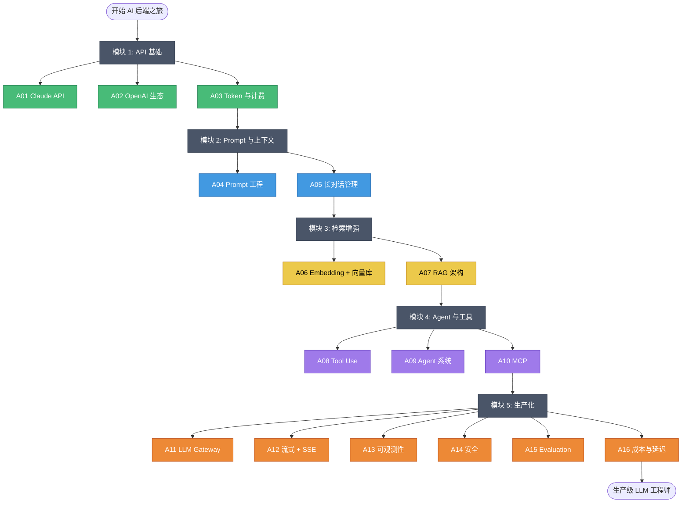

---

## 🟢 模块 1：API 基础（A01-A03）

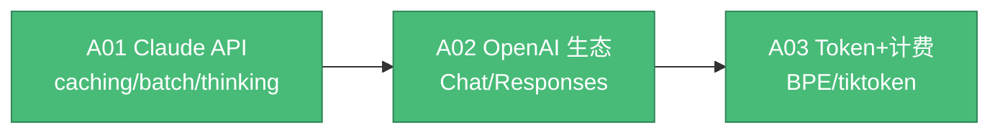

**API 选型决策**：

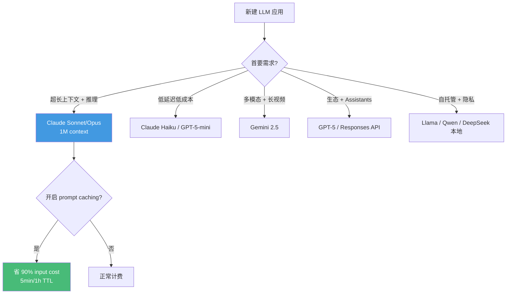

---

## 🔵 模块 2：Prompt 与上下文（A04-A05）

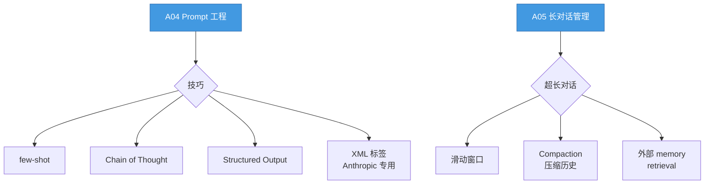

---

## 🟡 模块 3：检索增强（A06-A07）

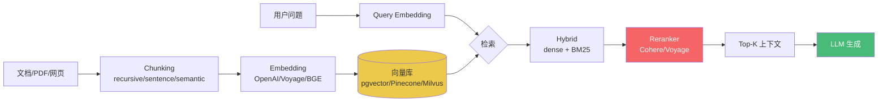

**向量库选型**：

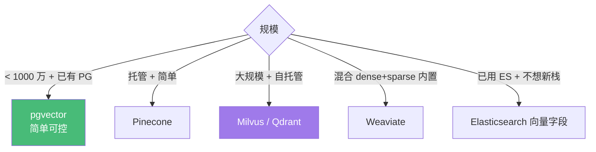

---

## 🔴 模块 4：Agent 与工具（A08-A10）

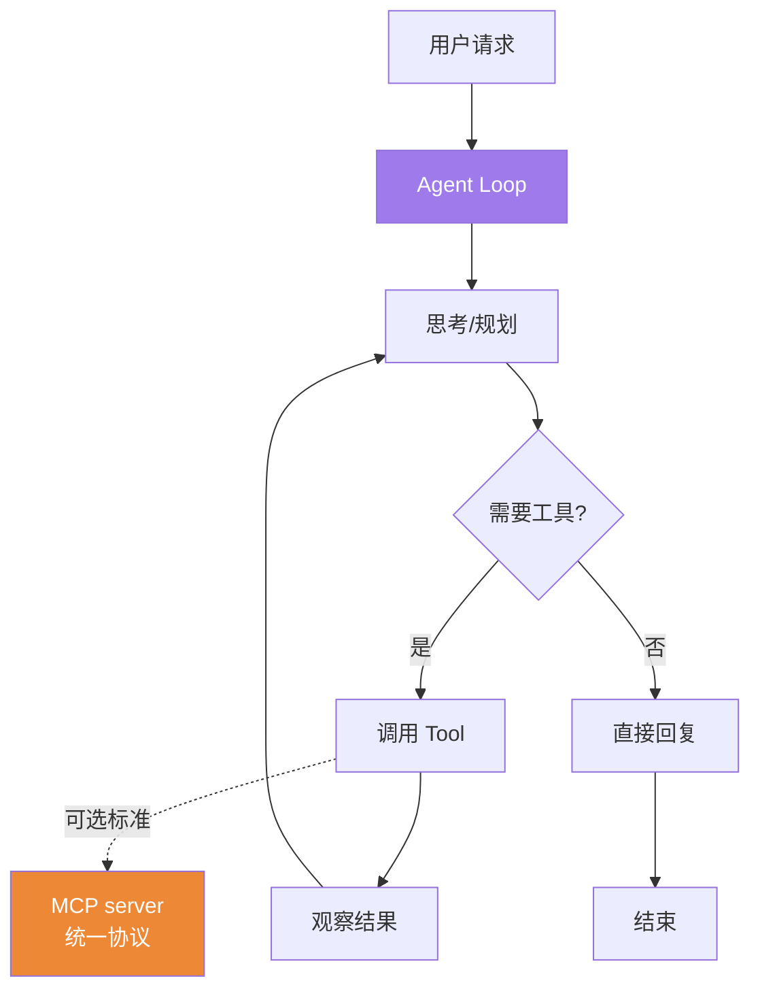

**Agent 模式对比**：

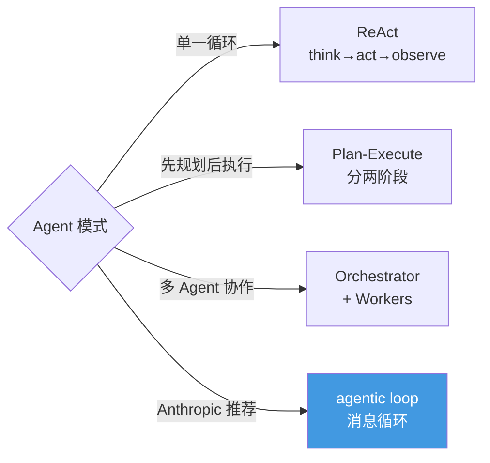

---

## 🟣 模块 5：生产化（A11-A14）

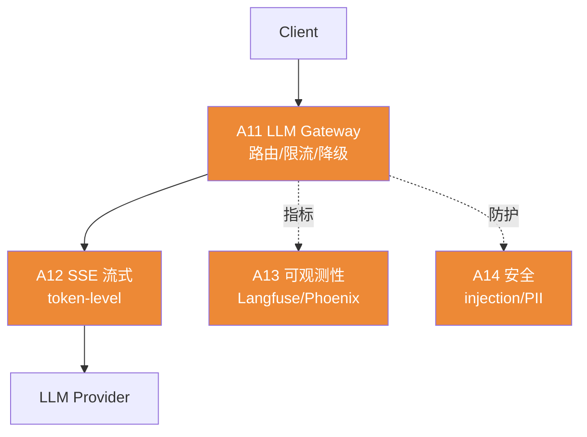

**生产架构图**：

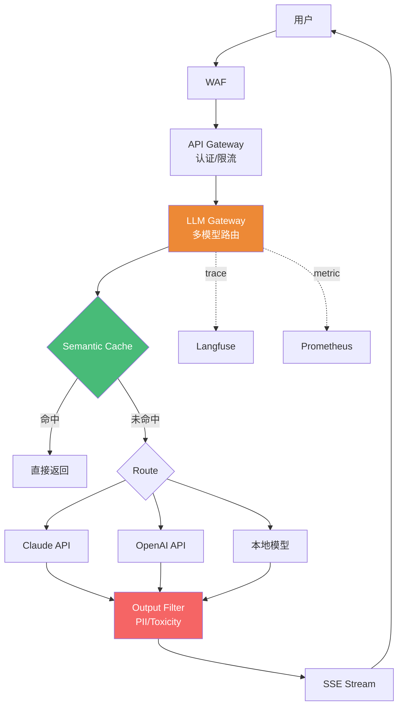

---

## 🎯 学习路径可视化

### 路径 A：完整通学（3 个月）

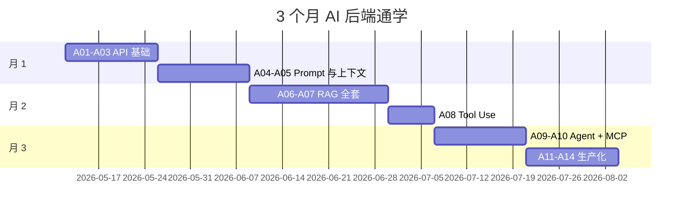

### 路径 B：RAG 工程师特化

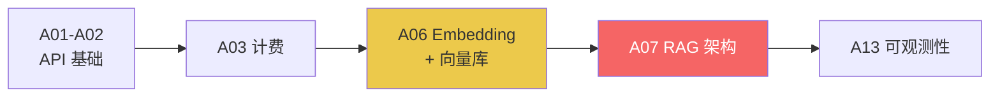

### 路径 C：Agent 工程师特化

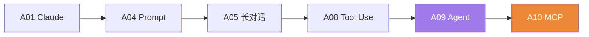

---

## 🧠 AI 后端核心知识思维导图

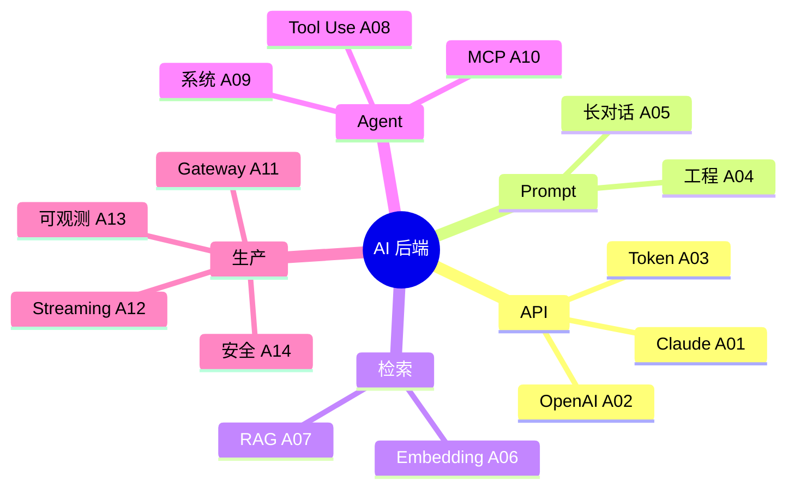

---

## 📊 难度与重要性矩阵

| 课程 | 难度 | 重要性 | 备注 |
|---|---|---|---|
| A01 Claude API | ⭐⭐⭐ | 🔥🔥🔥🔥🔥 | 任何 LLM 项目的起点 |
| A02 OpenAI 生态 | ⭐⭐⭐ | 🔥🔥🔥🔥🔥 | 必备第二个 provider |
| A03 Token 与计费 | ⭐⭐⭐ | 🔥🔥🔥🔥 | 成本失控的常见根因 |
| A04 Prompt 工程 | ⭐⭐⭐⭐ | 🔥🔥🔥🔥🔥 | 决定模型上限 |
| A05 长对话 | ⭐⭐⭐⭐ | 🔥🔥🔥🔥 | 聊天产品必踩坑 |
| A06 Embedding+向量库 | ⭐⭐⭐⭐ | 🔥🔥🔥🔥 | RAG 前置 |
| A07 RAG | ⭐⭐⭐⭐⭐ | 🔥🔥🔥🔥🔥 | LLM 最常见应用形态 |
| A08 Tool Use | ⭐⭐⭐⭐ | 🔥🔥🔥🔥🔥 | Agent 基本盘 |
| A09 Agent | ⭐⭐⭐⭐⭐ | 🔥🔥🔥🔥 | 2026 最热方向 |
| A10 MCP | ⭐⭐⭐⭐ | 🔥🔥🔥🔥 | 新协议但已成主流 |
| A11 LLM Gateway | ⭐⭐⭐⭐ | 🔥🔥🔥🔥 | 多 provider 必须 |
| A12 SSE | ⭐⭐⭐⭐ | 🔥🔥🔥🔥🔥 | UX 决定生死 |
| A13 可观测性 | ⭐⭐⭐⭐ | 🔥🔥🔥🔥🔥 | 没有就是黑盒 |
| A14 安全 | ⭐⭐⭐⭐ | 🔥🔥🔥🔥 | 上线前必看 |

---

## 🔗 与已有课程的关系

| AI 后端章节 | 关联已有课程 |
|---|---|
| A01 Claude API | backend/B02 HTTP、B22 认证 |
| A06 向量库 | backend/B14 NoSQL、elasticsearch/08 向量检索 |
| A07 RAG | elasticsearch 全套（特别是 BM25 + 向量） |
| A11 LLM Gateway | backend/B20 韧性、B21 限流 |
| A12 SSE | golang/G27 net/http、backend/B02 HTTP |
| A13 可观测性 | backend/B24 可观测性、golang/G22 pprof |
| A14 安全 | backend/B23 OWASP（含 OWASP LLM Top 10）、B22 认证 |

---

## 🆕 2026 关键技术演进图

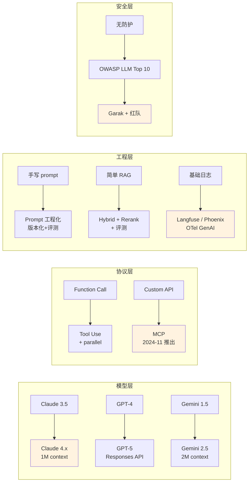
