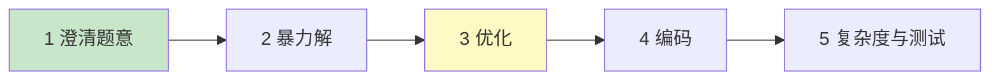

# 精通复杂度分析与算法面试方法论

> 算法面试不只考"能不能写出来"，更考"怎么分析、怎么沟通、怎么从暴力解优化到最优"。复杂度分析是算法的"通用语言"，方法论是面试拿分的框架。本篇是整个算法专题（01-20）的总纲。
>
> **📅 基准：2026 年 6 月。** 代码示例用 Go。

---

## 一、为什么复杂度是算法的语言

面试官问"你这个解法多快？"——答案不是"很快"，而是 **O(n)、O(n log n)、O(n²)**。复杂度用**与机器无关**的方式描述算法随输入规模增长的资源消耗，是评价算法优劣、和面试官沟通的统一语言。

两个维度：**时间复杂度**（运算次数随 n 怎么增长）和**空间复杂度**（额外内存随 n 怎么增长）。算法优化的本质，就是降低这两者的"阶"。

---

## 二、大 O 表示法

**大 O（Big-O）** 描述的是**最坏情况下的渐进上界**——当 n 足够大时，运算次数的增长量级。规则：
- **只看最高阶项**：`3n² + 5n + 100` → O(n²)。
- **忽略常数系数**：`2n` 和 `100n` 都是 O(n)。
- 因为 n 趋于无穷时，低阶项和常数都微不足道。

常见复杂度阶（从快到慢）：

| 复杂度 | 名称 | 典型场景 |
|---|---|---|
| O(1) | 常数 | 数组按下标访问、哈希查找 |
| O(log n) | 对数 | 二分查找、平衡树 |
| O(n) | 线性 | 遍历一遍 |
| O(n log n) | 线性对数 | 快排/归并/堆排 |
| O(n²) | 平方 | 双重循环、冒泡 |
| O(2ⁿ) | 指数 | 暴力枚举子集、未剪枝递归 |
| O(n!) | 阶乘 | 全排列暴力 |

数量级直觉：n=10⁶ 时，O(n) 可接受，O(n²)=10¹² 通常超时。**面试时先估算 n 的规模，反推能接受的复杂度**（如 n≤10⁵ 提示要 O(n log n) 或更优）。

---

## 三、时间复杂度分析

分析套路：
- **顺序执行**：取最大阶。
- **循环**：循环次数 × 循环体复杂度。`for i in n { for j in n }` → O(n²)。
- **递归**：递归次数 × 每次的工作量，或用递推/主定理（见第六节）。

```go
// O(n)：单层循环
func sum(nums []int) int {
    s := 0
    for _, x := range nums { // 执行 n 次
        s += x
    }
    return s
}

// O(n²)：嵌套循环
func pairs(nums []int) int {
    cnt := 0
    for i := 0; i < len(nums); i++ {
        for j := i + 1; j < len(nums); j++ { // 内层随 i 减少，但仍是 O(n²)
            cnt++
        }
    }
    return cnt
}
```

注意陷阱：内层循环次数依赖外层时（如 j 从 i 开始），总次数是 n+(n-1)+...+1 = n(n+1)/2，仍是 **O(n²)**（系数 1/2 被忽略）。

---

## 四、空间复杂度

空间复杂度 = 算法运行时**额外**占用的内存（不含输入本身）随 n 的增长：

- **O(1)**：只用常数个变量（原地算法，如原地反转数组）。
- **O(n)**：开了和输入同阶的辅助数组/哈希表/递归栈。
- **递归的空间**：别忘了**递归调用栈**也占空间——深度 n 的递归是 O(n) 空间（栈溢出风险）。

```go
// 时间 O(n)，空间 O(n)：用哈希表换时间
func twoSum(nums []int, target int) []int {
    seen := make(map[int]int) // O(n) 空间
    for i, x := range nums {
        if j, ok := seen[target-x]; ok {
            return []int{j, i}
        }
        seen[x] = i
    }
    return nil
}
```

**时间和空间常可互换**（空间换时间是最常见的优化方向，如上面的哈希表把 O(n²) 暴力降到 O(n)）。

---

## 五、均摊复杂度

**均摊复杂度（Amortized）**：把一系列操作的总代价平均到每次操作上。单次可能很贵，但平均很便宜。

经典例子：**动态数组（Go 的 slice）的 append**。
- 容量满时，append 要扩容（分配新数组 + 拷贝旧元素），这次是 O(n)。
- 但扩容是**翻倍**的，n 次 append 中只有 log n 次扩容，总拷贝代价是 n + n/2 + n/4 + ... ≈ 2n = O(n)。
- 平均到每次 append：**均摊 O(1)**。

```go
s := make([]int, 0)
for i := 0; i < n; i++ {
    s = append(s, i) // 单次最坏 O(n)（扩容时），但均摊 O(1)
}
```

均摊分析让我们正确评价"偶尔贵、通常便宜"的操作（动态数组、哈希表扩容都是均摊 O(1)）。别把单次最坏当成整体复杂度。

---

## 六、递归复杂度与主定理

递归的复杂度看"递归树"：
- **每层的工作量 × 层数**。
- 例：归并排序，每层 O(n) 合并，递归 log n 层 → O(n log n)。

**主定理（Master Theorem）** 给分治递归 `T(n) = a·T(n/b) + f(n)` 一个快速判断（a 个子问题、规模 n/b、合并代价 f(n)）：
- 归并排序：`T(n) = 2T(n/2) + O(n)` → O(n log n)。
- 二分查找：`T(n) = T(n/2) + O(1)` → O(log n)。

面试不一定要背主定理公式，但要会画递归树估算（见 [09 分治](./09-精通-分治与归并思想.md)）。

---

## 七、算法面试方法论（五步法）

**面试不是默写答案，是展示思考过程。** 拿到题别急着写代码，按五步走：



1. **澄清题意**：确认输入输出、数据范围、边界（空输入？负数？重复？）、是否有序。**别假设，要问**。
2. **举例 + 暴力解**：先给一个能跑通的暴力解（哪怕 O(n²)），说清思路——"先有，再优化"。
3. **找瓶颈、优化**：识别题型（套哪个模板）、找重复计算、用空间换时间/预处理/双指针/二分/DP 优化。
4. **编码**：写清晰的代码，注意边界。
5. **复杂度 + 测试**：说出时间/空间复杂度，用例子（含边界）走一遍验证。

**沟通是加分项**：边想边说，让面试官跟上你的思路；卡住时说出你在考虑什么，面试官会引导。这和 [系统设计方法论](../system-design/S01-精通-系统设计面试方法论.md) 一脉相承。

---

## 八、如何从暴力解优化

暴力解之后，常见的优化方向（"优化"这一步的工具箱）：

| 优化方向 | 手段 | 例子 |
|---|---|---|
| **空间换时间** | 哈希表/预处理/缓存 | 两数之和 O(n²)→O(n) |
| **排序预处理** | 先排序再双指针/二分 | 三数之和 |
| **双指针/滑窗** | 避免重复扫描 | 子数组/子串问题 |
| **二分** | 有序结构 / 二分答案 | O(n)→O(log n) |
| **去重叠子问题** | 记忆化 / DP | 斐波那契、DP |
| **数据结构加速** | 堆/单调栈/前缀和 | Top K、区间和 |
| **剪枝** | 提前终止无效分支 | 回溯 |

优化的核心思路：**找出暴力解里的"重复劳动"**（重复计算、重复扫描），用预处理、缓存、更好的数据结构消除它。整个专题的后续章节，就是这些优化手段的展开。

---

## 陷阱清单

- **只看最好/平均情况报复杂度**：大 O 默认说最坏情况（除非特别说均摊/平均，如快排平均 O(n log n) 最坏 O(n²)）。
- **忽略递归栈空间**：递归深度 n 是 O(n) 空间，深递归有栈溢出风险。
- **把均摊当单次**：动态数组 append 单次最坏 O(n)，但均摊 O(1)，整体仍高效。
- **保留常数和低阶项**：O(2n+100) 就是 O(n)，别写成 O(2n)。
- **不问数据范围就动手**：n 的规模决定能接受的复杂度，先问。
- **上来就追最优解**：先给暴力解（展示有思路），再优化——卡在想最优解上反而冷场。
- **不说复杂度**：写完不分析复杂度是面试大忌，主动说。

---

## 2026 现状

- **算法面试仍是大厂标配**：尤其大厂和中高级岗，编码轮（Coding）+ 系统设计轮（见 [system-design](../system-design/INDEX.md)）是主流组合。
- **AI 辅助下的算法面试**：AI 能秒解 LeetCode，所以面试更看重**现场沟通、思路推导、变体应对、复杂度权衡**，而非默写答案——本专题强调的"方法论 + 模板理解"比死记答案更重要。
- **本专题定位**：讲思路和模板，**配合 LeetCode 实战**（见 [20 刷题路线](./20-精通-高频题型与刷题路线.md)），不替代刷题。
- **语言**：本专题代码用 Go；算法思路语言无关，Java/Python 实现见对应生态。

---

## 练习题

1. 分析以下代码的时间复杂度：两层循环，外层 i 从 0 到 n，内层 j 从 i 到 n。

<details><summary>参考答案</summary>

时间复杂度是 **O(n²)**。虽然内层循环的次数随外层 i 的增大而减少（i=0 时内层执行 n 次，i=1 时 n-1 次，……，i=n-1 时 1 次），但总执行次数 = n + (n-1) + (n-2) + ... + 1 = n(n+1)/2 = (n² + n)/2。按大 O 规则：只保留最高阶项 n²、忽略常数系数 1/2 和低阶项 n，所以是 O(n²)。常见误区是看到"内层从 i 开始、次数变少"就以为是 O(n) 或 O(n log n)——实际上等差数列求和仍是平方级。判断嵌套循环复杂度时要算总的执行次数，而不是只看某一层；只要内外层次数都与 n 成正比（即使有递减），整体就是 O(n²)。

</details>

2. 时间复杂度和空间复杂度可以互相转换吗？举一个"空间换时间"的例子。

<details><summary>参考答案</summary>

可以，时间和空间常常可以互换，"空间换时间"是算法优化最常用的方向之一（反之"时间换空间"较少但也存在，如不开辅助数组而重复计算）。经典例子是"两数之和"（在数组中找两个数之和等于 target）：**暴力解**用双重循环枚举所有数对，时间 O(n²)、空间 O(1)；**空间换时间**用一个哈希表，遍历数组时把每个元素存入哈希表（值→下标），对当前元素 x 检查 target-x 是否已在哈希表中——这样只需遍历一遍，时间降到 O(n)，但额外用了 O(n) 的哈希表空间。这就是用 O(n) 的额外空间，把时间从 O(n²) 降到 O(n)。其本质是：用哈希表"记住"已经见过的元素，避免了内层循环的重复扫描（消除重复劳动）。类似地，记忆化（缓存子问题结果）、前缀和（预处理）、各种查找表都是空间换时间的体现。面试中遇到 O(n²) 暴力解，"能不能用哈希表/预处理把某层循环省掉"是首选的优化思路。

</details>

3. 什么是均摊复杂度？为什么动态数组（slice）的 append 是均摊 O(1)？

<details><summary>参考答案</summary>

均摊复杂度（Amortized Complexity）是指把一连串操作的**总代价平均分摊到每一次操作**上得到的平均代价——它衡量的是"长期来看每次操作的平均成本"，适用于"大多数操作很便宜、偶尔某次很贵"的场景，比单纯看单次最坏情况更能反映真实性能。动态数组 append 均摊 O(1) 的原因：动态数组（如 Go 的 slice）容量满时 append 需要扩容——分配一块更大的新数组、把旧元素全部拷贝过去，这一次是 O(n)。但关键在于扩容是**成倍增长**的（如容量翻倍）：从空数组开始连续 append n 个元素，扩容只会发生在容量边界（如 1、2、4、8、…、n），总共约 log n 次扩容，所有扩容拷贝的总代价是 1 + 2 + 4 + ... + n ≈ 2n = O(n)；再加上 n 次 append 本身的 O(n)，n 次 append 的总代价是 O(n)。把这个总代价 O(n) 平均到 n 次 append 上，每次的均摊代价就是 **O(1)**。所以虽然单次 append 在扩容时最坏是 O(n)，但绝大多数次是 O(1)、扩容很少发生，整体均摊下来是 O(1)，动态数组的追加操作整体是高效的。注意不要把"单次最坏 O(n)"误当成整体复杂度。

</details>

4. 描述算法面试的五步解题法。为什么不建议上来就追求最优解？

<details><summary>参考答案</summary>

五步解题法：①**澄清题意**——确认输入输出格式、数据范围/规模、边界情况（空输入、负数、重复元素、是否有序等），主动提问而不是擅自假设；②**举例 + 暴力解**——先用具体例子理解题目，并给出一个能正确解决问题的暴力/朴素解法（哪怕复杂度高），说清思路，做到"先有一个能跑的解"；③**找瓶颈、优化**——分析暴力解的重复劳动在哪，识别题型套用合适的模板（双指针/滑窗/二分/DP 等），用空间换时间、预处理、更好的数据结构等手段优化；④**编码**——写出清晰、处理好边界的代码，边写边解释；⑤**复杂度分析 + 测试**——说出时间和空间复杂度，用例子（包括边界用例）走查验证正确性。**不建议上来就追最优解的原因**：①算法面试考察的是**思考和沟通过程**，不是只看最终答案——先给暴力解能展示你有清晰思路、能解决问题，再逐步优化能展示你的分析和优化能力，这个"演进过程"本身就是得分点；②直接憋最优解风险很大——可能想很久想不出来导致冷场、可能想错方向、可能漏掉边界，而面试时间有限；③有了暴力解作为基准，面试官能看到你的下限、也方便引导你优化，即使最终没到最优解也有分；④很多最优解是在暴力解基础上发现重复计算后自然推导出来的。所以正确策略是"先沟通澄清、给暴力解保底、再逐步优化、全程讲清楚"，而不是沉默地憋大招。

</details>

5. n = 10⁶ 时，O(n)、O(n log n)、O(n²) 的算法大致各需要多少次运算？这对选择算法有什么指导意义？

<details><summary>参考答案</summary>

粗略估算（n = 10⁶ = 一百万）：**O(n)** ≈ 10⁶ 次（一百万），非常快，毫秒级；**O(n log n)** ≈ 10⁶ × log₂(10⁶) ≈ 10⁶ × 20 = 2×10⁷ 次（两千万），仍然很快；**O(n²)** ≈ (10⁶)² = 10¹² 次（一万亿），以现代 CPU 每秒约处理 10⁸~10⁹ 次简单操作估算，需要约几百到上千秒——**远超一般的时间限制（通常 1-2 秒），会超时**。指导意义：①**从数据规模反推可接受的复杂度**——这是面试和竞赛的重要技巧。看到 n 的规模就能大致判断需要什么量级的算法：n ≤ 10⁶~10⁷ 通常要求 O(n) 或 O(n log n)；n ≤ 10⁵ 时 O(n²) 一般也会超时、需要 O(n log n) 或更优；n ≤ 几千时 O(n²) 可接受；n ≤ 20 左右才可能允许 O(2ⁿ) 这类指数级（如状态压缩、暴力枚举子集）。②**指导优化目标**——如果暴力解是 O(n²) 而 n=10⁶，就知道必须优化到 O(n log n) 或 O(n)，于是去想"能不能排序+双指针、能不能哈希、能不能二分"。所以面试时第一步澄清数据范围，不仅是为了边界，更是为了据此确定算法的目标复杂度，避免写出注定超时的解法。

</details>

6. 大 O 表示法为什么要忽略常数系数和低阶项？这样做有什么利弊？

<details><summary>参考答案</summary>

大 O 描述的是算法复杂度的**渐进行为**——即当输入规模 n 趋于无穷大时，资源消耗的增长趋势/量级。忽略常数系数和低阶项的原因：当 n 足够大时，最高阶项会完全主导总量，低阶项和常数系数的影响相对可以忽略不计。例如 `3n² + 100n + 5000`，当 n=10⁶ 时，n² 项是 3×10¹²，而 100n 项只有 10⁸、常数 5000 更微不足道——低阶项占比趋近于 0，所以只保留 n²、记作 O(n²)；同理 2n 和 100n 增长趋势相同（都随 n 线性增长），都记作 O(n)。这样做的**好处**：①提供了一个**与具体机器、编程语言、常数细节无关**的、统一的算法效率度量，便于在抽象层面比较算法的优劣（O(n log n) 一定比 O(n²) 在大数据下更好）；②抓住主要矛盾（增长量级），简化分析，不必纠缠精确的运算次数。**弊端/局限**：①忽略了常数系数，但**实际运行时常数有时很重要**——比如两个都是 O(n) 的算法，常数差 10 倍实际性能就差 10 倍；某些"理论更优"的算法（如复杂度更低但常数巨大的算法）在实际数据规模下反而更慢；②对**小规模数据**不准——n 很小时低阶项和常数可能占主导（这也是为什么有些库在小数组时用插入排序而非快排）；③只描述上界趋势，不反映最好/平均情况（需配合 Θ、Ω 或专门说明）。所以大 O 是宏观比较的利器，但工程中还要结合实际数据规模和常数因子综合判断。

</details>
