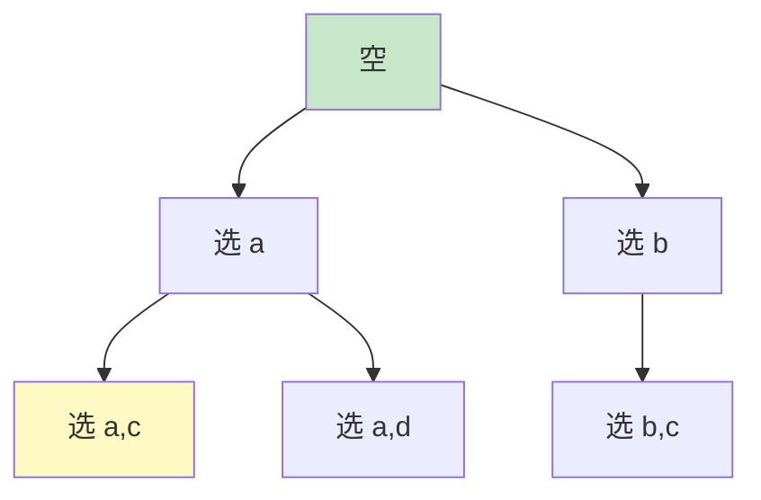
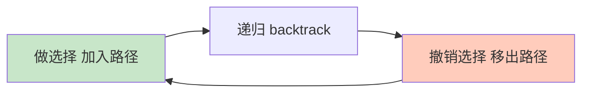

# 精通递归、回溯与 DFS

> 回溯是"暴力搜索的艺术"——系统地试探所有可能、不行就撤销重来。子集、排列、组合、N 皇后、岛屿、解数独全靠它。本篇讲清递归三要素、回溯通用模板和剪枝，是面试高频难点。
>
> **📅 基准：2026 年 6 月。** 代码用 Go。

---

## 一、递归三要素

写递归先想清三件事（**缺一不可**）：

1. **终止条件（base case）**：什么时候停？（否则无限递归栈溢出）
2. **递归关系**：大问题怎么拆成更小的子问题、怎么调用自己？
3. **返回值 / 状态**：每层返回什么、传递什么状态？

```go
// 例：斐波那契（朴素递归，仅示意三要素）
func fib(n int) int {
    if n < 2 { // 1. 终止条件
        return n
    }
    return fib(n-1) + fib(n-2) // 2. 递归关系
}
```

注意朴素递归 fib 有**大量重复计算**（O(2ⁿ)），这是后面 DP（[15](./15-精通-动态规划基础.md)）要解决的——递归 + 重叠子问题 = DP 的信号。

**递归的代价**：调用栈空间 O(深度)，深递归有栈溢出风险（见 [01](./01-精通-复杂度分析与算法面试方法论.md)）。

---

## 二、回溯的本质

**回溯（Backtracking）= DFS + 撤销选择**。它系统地遍历"决策树"的所有路径：在每一步做一个选择、递归深入、**回来时撤销这个选择**（恢复现场），从而试探所有可能。



本质是 **DFS 遍历决策树**，每个叶子（或满足条件的节点）是一个解。"回溯"指的是**递归返回时撤销选择**，让状态回到做选择之前，以便尝试其他分支。

---

## 三、回溯通用模板

**背下这个模板，回溯题就有了统一框架**：

```go
func backtrack(路径, 选择列表) {
    if 满足结束条件 {
        记录结果(路径的拷贝) // 注意拷贝，否则后续修改会污染
        return
    }
    for _, 选择 := range 选择列表 {
        if 不合法 { // 剪枝
            continue
        }
        做选择(把选择加入路径)
        backtrack(新路径, 新选择列表) // 递归
        撤销选择(把选择移出路径)       // 回溯，恢复现场
    }
}
```

三个关键动作：**做选择 → 递归 → 撤销选择**。其中"撤销选择"是回溯的灵魂——让状态恢复，才能正确尝试下一个分支。



---

## 四、子集、组合、排列

回溯三大经典，区别在"选择列表"和"是否去重/有序"：

```go
// 子集：每个元素选或不选（所有节点都是解）
func subsets(nums []int) [][]int {
    var res [][]int
    var path []int
    var bt func(start int)
    bt = func(start int) {
        res = append(res, append([]int{}, path...)) // 每个节点都记录（拷贝！）
        for i := start; i < len(nums); i++ {
            path = append(path, nums[i]) // 做选择
            bt(i + 1)                    // start=i+1 避免重复用、保证组合不重复
            path = path[:len(path)-1]    // 撤销
        }
    }
    bt(0)
    return res
}

// 全排列：用 used 标记已用，每层从头选未用的
func permute(nums []int) [][]int {
    var res [][]int
    var path []int
    used := make([]bool, len(nums))
    var bt func()
    bt = func() {
        if len(path) == len(nums) { // 排列：长度满了才是解
            res = append(res, append([]int{}, path...))
            return
        }
        for i := 0; i < len(nums); i++ {
            if used[i] {
                continue
            }
            used[i] = true
            path = append(path, nums[i])
            bt()
            path = path[:len(path)-1]
            used[i] = false // 撤销 used
        }
    }
    bt()
    return res
}
```

要点区别：
- **子集/组合**：用 `start` 参数控制只往后选（避免重复组合），每个节点（或特定层）都是解。
- **排列**：用 `used` 数组标记，每层从头选未用的（顺序不同算不同排列），只有满长才是解。
- **去重**（含重复元素）：先排序，同层跳过相同值（`if i>start && nums[i]==nums[i-1] continue`）。

**记录结果要拷贝路径**（`append([]int{}, path...)`）——否则存的是引用，后续修改会污染已存结果（高频坑）。

---

## 五、剪枝

**剪枝（Pruning）**：提前判断某分支不可能产生解，直接跳过，大幅减少搜索量。是回溯优化的关键。

```go
// 组合总和：选数字使和为 target，剪枝
func combinationSum(candidates []int, target int) [][]int {
    sort.Ints(candidates) // 排序便于剪枝
    var res [][]int
    var path []int
    var bt func(start, remain int)
    bt = func(start, remain int) {
        if remain == 0 {
            res = append(res, append([]int{}, path...))
            return
        }
        for i := start; i < len(candidates); i++ {
            if candidates[i] > remain { // 剪枝：排序后，当前数已超，后面更大，全跳
                break
            }
            path = append(path, candidates[i])
            bt(i, remain-candidates[i]) // i 不+1：可重复用
            path = path[:len(path)-1]
        }
    }
    bt(0, target)
    return res
}
```

常见剪枝：超出目标提前 break（需排序）、用过的跳过、不满足约束提前返回（如 N 皇后判断冲突）。剪枝不改变正确性，只减少无效搜索，是回溯能跑得动的关键。

---

## 六、DFS 在矩阵/图

DFS 也常用于**矩阵/图的遍历**（不一定要撤销，看是否需要复用格子）：

```go
// 岛屿数量：DFS 把连通的陆地标记为已访问
func numIslands(grid [][]byte) int {
    count := 0
    var dfs func(i, j int)
    dfs = func(i, j int) {
        if i < 0 || i >= len(grid) || j < 0 || j >= len(grid[0]) || grid[i][j] != '1' {
            return // 越界或非陆地，终止
        }
        grid[i][j] = '0' // 标记已访问（沉岛）
        dfs(i+1, j)      // 上下左右四个方向
        dfs(i-1, j)
        dfs(i, j+1)
        dfs(i, j-1)
    }
    for i := range grid {
        for j := range grid[0] {
            if grid[i][j] == '1' {
                count++  // 发现一块新陆地
                dfs(i, j) // 淹掉整块
            }
        }
    }
    return count
}
```

矩阵 DFS 套路：**越界/不符合 → 终止；标记访问 → 向四个方向递归**。岛屿、单词搜索、被围绕的区域都是这个套路。图的 DFS/BFS 见 [14 图论](./14-精通-图论.md)。

---

## 七、回溯 vs DP

回溯（暴力搜索所有可能）和动态规划（[15](./15-精通-动态规划基础.md)）的关系：
- **都是"试探所有可能"**，但回溯枚举每个**具体解**（指数级），DP 只算**最优值/计数**（多项式）。
- **回溯 + 记忆化 = DP**：如果回溯过程中有**重叠子问题**（同一状态被重复计算，如朴素 fib），加缓存（记忆化）就变成 DP，复杂度从指数降到多项式。
- **何时用哪个**：要列举所有方案/路径 → 回溯；只要最优值/方案数且有重叠子问题 → DP。

这是算法面试的重要分水岭——看到"求所有方案"想回溯，看到"求最优值/方案数 + 重叠子问题"想 DP。

---

## 陷阱清单

- **记录结果不拷贝路径**：直接存 path 引用，后续修改污染已存结果。必须 `append([]int{}, path...)` 拷贝。
- **忘记撤销选择**：做了选择不撤销，状态错乱、结果错误。回溯的灵魂是"做选择→递归→撤销"。
- **缺终止条件**：无限递归栈溢出。先写 base case。
- **子集/组合用 used 而非 start**：会产生重复组合。组合用 start 控制只往后选。
- **含重复元素不去重**：先排序，同层跳过相同值。
- **不剪枝导致超时**：能提前判断无效就剪，否则指数爆炸。
- **矩阵 DFS 不标记访问**：重复访问导致死循环/超时。访问后标记。
- **递归过深栈溢出**：回溯深度大时注意栈，必要时改迭代 + 显式栈。

---

## 2026 现状

- **回溯是面试高频难点**：子集/排列/组合/N皇后/数独/单词搜索是常考题，模板化但需理解"做选择-撤销"。
- **回溯 → DP 的演进**是核心考点：能识别"重叠子问题"把回溯优化成记忆化/DP，体现算法功底（见 [15](./15-精通-动态规划基础.md)）。
- **DFS/BFS 是图论基础**：矩阵和图的搜索（见 [14](./14-精通-图论.md)）大量用 DFS/BFS。
- **配合刷题**：LeetCode 回溯标签（子集、排列、组合总和、N皇后、岛屿、单词搜索）必刷，配合本篇模板（见 [20](./20-精通-高频题型与刷题路线.md)）。

---

## 练习题

1. 递归的三要素是什么？为什么必须先确定终止条件？

<details><summary>参考答案</summary>

递归三要素：①**终止条件（base case，递归出口）**——确定递归在什么情况下停止、不再继续调用自己、直接返回结果（如 fib 中 n<2 时直接返回 n）；②**递归关系（递推公式）**——确定如何把当前的大问题分解成规模更小的同类子问题，并调用自身求解子问题（如 fib(n)=fib(n-1)+fib(n-2)）；③**返回值/状态**——确定每层递归返回什么、向下传递什么状态（参数），以便层层组合出最终答案。**为什么必须先确定终止条件**：终止条件是递归能够停止的保证——递归的本质是"问题不断缩小、最终缩小到一个可以直接回答的最小情况"。如果没有正确的终止条件（或终止条件写错、永远达不到），递归就会无限地调用自己、问题规模无法收敛到 base case，最终导致**调用栈不断增长直到栈溢出（StackOverflow）**，程序崩溃。终止条件就像递归的"地基"，它定义了最小子问题的答案，递归关系才能在此基础上层层向上拼出大问题的解。所以写递归的第一步永远是想清楚"什么时候停、停的时候返回什么"，再考虑如何递推。一个完整正确的递归必须保证：每次递归调用都让问题朝终止条件靠近，且终止条件一定能被触达。

</details>

2. 回溯的本质是什么？写出回溯的通用模板。

<details><summary>参考答案</summary>

**回溯的本质是"DFS（深度优先搜索）+ 撤销选择"**——它把问题的所有可能解组织成一棵"决策树"，通过深度优先地遍历这棵树来系统地尝试每一种选择组合：在每一步做出一个选择、沿着这个选择递归深入下去探索，当这条路探索完（到达解或走不通）返回时，**撤销刚才做的选择（恢复到选择之前的状态）**，再去尝试同一层的其他选择。这种"试探—递归—撤销—再试探"的过程能不重不漏地遍历所有可能，找出全部满足条件的解。"回溯"二字正是指**递归返回时撤销选择、回到上一个状态**这个动作，它是回溯区别于普通 DFS 的关键。**通用模板**：
```
func backtrack(路径, 选择列表):
    if 满足结束条件:
        记录结果(路径的拷贝)   // 注意要拷贝路径，否则后续修改会污染已记录的解
        return
    for 选择 in 选择列表:
        if 该选择不合法: continue   // 剪枝，跳过无效分支
        做选择(把选择加入路径)
        backtrack(更新后的路径, 更新后的选择列表)   // 递归深入
        撤销选择(把选择从路径移除)   // 回溯，恢复现场
```
三个核心动作是**做选择 → 递归 → 撤销选择**，配合"结束条件判断"和"剪枝"。理解并记住这个模板，子集、排列、组合、N 皇后、数独、单词搜索等回溯题都能套用，差别只在于"选择列表怎么定义、结束条件是什么、如何剪枝/去重"。

</details>

3. 子集、组合、排列在回溯实现上有什么区别？

<details><summary>参考答案</summary>

三者都用回溯，但在"如何控制选择列表、何时记录结果、如何避免重复"上不同：①**子集**——求所有可能的子集（每个元素可选可不选）。实现上用一个 **start 参数**控制每次只能从当前位置往后选（i 从 start 开始、递归传 i+1），保证不会重复选已经考虑过的前面的元素（从而 {1,2} 和 {2,1} 不会都出现，子集无序）；**决策树的每个节点都是一个有效子集**，所以进入递归就记录结果（不需要等到特定长度）。②**组合**——从 n 个里选 k 个（无序）。和子集几乎一样用 **start 控制只往后选**避免重复组合，区别只是**结束/记录条件是"路径长度等于 k"**时才记录（子集是任意长度都记录，组合是固定长度 k 才记录）。组合本质是"特定大小的子集"。③**排列**——求所有排列（有序，{1,2} 和 {2,1} 算不同）。因为顺序不同算不同结果，所以**不能用 start 限制只往后选**（那样会丢掉逆序的排列），而要**每层都能从头选所有还没用过的元素**；为此用一个 **used 布尔数组**标记哪些元素已在当前路径中，每层循环跳过 used 的、选未用的，选后标记 used、撤销时取消标记；**结束条件是路径长度等于 n（用满所有元素）**才记录。**核心区别总结**：子集/组合用 **start 参数**（保证只往后选、结果无序不重复），排列用 **used 数组**（允许每层从头选、保证不重复使用同一元素、结果有序）；记录时机：子集每个节点都记、组合在长度=k 时记、排列在长度=n 时记。此外若元素**含重复值**要去重，三者都需先排序、并在"同一层"跳过与前一个相同的值（if i>start && nums[i]==nums[i-1] continue）。还要注意记录结果时都要**拷贝路径**。

</details>

4. 回溯中"记录结果时要拷贝路径"是什么意思？不拷贝会出什么问题？

<details><summary>参考答案</summary>

"拷贝路径"指：当在回溯过程中找到一个满足条件的解、要把当前的 path（记录当前已做选择的列表/切片）加入结果集时，**不能直接把 path 本身（的引用）加进去，而要新建一个 path 的副本（深拷贝其内容）再加入**，例如 Go 里写 `res = append(res, append([]int{}, path...))` 而不是 `res = append(res, path)`。**不拷贝会出的问题**：path 在整个回溯过程中是**被复用、不断被修改**的同一个底层数组/切片——回溯的本质就是"做选择（往 path 加元素）→ 递归 → 撤销选择（从 path 删元素）"，path 的内容会随着搜索不停变化，最终回溯结束时 path 通常会变回空或某个中间状态。如果记录结果时直接存了 path 的**引用**，那么结果集里所有元素其实都指向**同一个**会被后续修改的 path——当回溯继续进行、path 被改动（增删元素）时，已经"记录"在结果集里的那些引用所指向的内容也跟着变了，最终所有记录要么变成相同的（最后一次 path 的状态）、要么变成空/错乱的数据，得到完全错误的结果。这是回溯最经典、最高频的 bug。所以必须在记录时**拷贝一份当前 path 的快照**存入结果，这样结果里保存的是那一刻 path 内容的独立副本，不受后续 path 修改的影响。在 Go 中要特别注意切片是引用语义、且可能共享底层数组，必须显式拷贝（如 `append([]int{}, path...)` 或 make+copy）。

</details>

5. 什么是剪枝？为什么剪枝对回溯算法很重要？

<details><summary>参考答案</summary>

**剪枝（Pruning）**是指在回溯（搜索）过程中，提前判断出"当前这个分支/选择不可能产生有效解（或不可能比已有解更优）"，于是**直接跳过它、不再继续往下递归探索**，从而"剪掉"决策树上大量无效的分支。常见剪枝方式：①**可行性剪枝**——当前选择已违反约束（如组合总和里当前数已大于剩余目标、N 皇后里该位置与已放皇后冲突、数独里数字重复），直接跳过或返回；②**边界剪枝**——配合排序，当当前候选已超出限制时，由于后面的更大/更不可能，直接 break 整个循环（如 candidates 排序后 `if candidates[i] > remain break`）；③**去重剪枝**——含重复元素时，同一层跳过与前一个相同的值，避免产生重复解；④**最优性剪枝**——求最优解时，若当前部分解已不可能优于已找到的最优解，剪掉。**为什么剪枝对回溯很重要**：回溯本质是暴力地遍历决策树，而决策树的规模通常是**指数级**的（如 n 个元素的子集有 2ⁿ 个、排列有 n! 个）。如果不剪枝、把所有分支都走一遍，对稍大的输入就会**搜索空间爆炸、严重超时**，回溯算法根本跑不出结果。剪枝通过尽早排除掉"注定无效/无用"的大片分支，能把实际需要探索的节点数大幅减少（有时能从指数级降到可接受范围），是让回溯算法在实际数据规模下"能跑得动"的关键优化手段。剪枝**只是跳过不可能有解的分支、不会漏掉任何有效解**，所以不改变算法的正确性，只提升效率。一句话：回溯保证"不漏"，剪枝保证"不浪费"——好的剪枝往往决定了回溯解能否通过。

</details>

6. 回溯和动态规划有什么联系和区别？什么时候用哪个？

<details><summary>参考答案</summary>

**联系**：两者都源于"穷举/试探所有可能性"的思想，都可以看作在状态空间里搜索。很多问题既能用回溯（暴力搜索）解、也能用 DP 解；关键的桥梁是——**当回溯过程中存在"重叠子问题"（同一个子问题/状态被反复重复计算）时，给回溯加上"记忆化"（缓存已算过的子问题结果）就变成了记忆化搜索，本质上就是自顶向下的动态规划**。例如朴素递归求斐波那契是 O(2ⁿ) 的"回溯式"重复计算，加个 memo 缓存后就降到 O(n)，这就是 DP。**区别**：①**目标/产出不同**——回溯通常用来**枚举出所有具体的解/方案/路径**（如所有子集、所有排列、所有满足条件的组合），其复杂度往往是指数级（因为解的数量本身就是指数级）；DP 通常用来求**最优值、方案总数、是否可行**等一个**聚合结果**，不需要列出每个具体方案，复杂度通常是多项式级。②**是否有重叠子问题与缓存**——回溯一般不缓存、把决策树所有分支都走（靠剪枝减负）；DP 的前提正是存在重叠子问题，通过缓存/递推**避免重复计算**，把指数降为多项式。③实现上回溯是"做选择-递归-撤销"的搜索，DP 是"定义状态-写转移方程-按序递推（或记忆化）"。**何时用哪个**：①需要**列举/输出所有具体方案、路径、组合**（"找出所有……"）→ 用**回溯**（必要时剪枝）；②只需要**最优解的值、方案的数量、能否达到**等聚合结果，且问题具有**最优子结构 + 重叠子问题** → 用**动态规划**（自顶向下记忆化或自底向上递推）。识别口诀：要"所有方案"想回溯；要"最优值/方案数 + 有重叠子问题"想 DP。这也是算法面试的重要分水岭，能从回溯发现重叠子问题进而优化成 DP，是功底的体现（见 15）。

</details>
