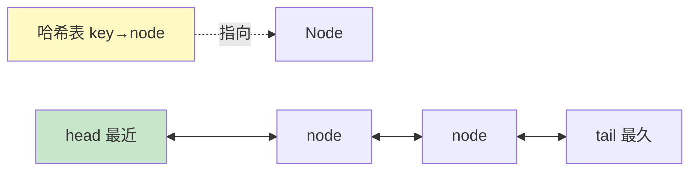

# 精通哈希表与设计题

> 哈希表是"以空间换时间"的利器，O(1) 增删查，几乎是优化暴力解的第一选择。而"设计题"（如 LRU 缓存）考验你把哈希表和其他结构**组合**起来实现特定功能的能力。本篇讲清哈希表套路和高频设计题。
>
> **📅 基准：2026 年 6 月。** 代码用 Go。

---

## 一、哈希表原理

**哈希表（Hash Table）** 通过哈希函数把 key 映射到桶，实现平均 **O(1)** 的增删查（原理见 [Java HashMap](../java/J02-精通-HashMap与ConcurrentHashMap.md)）。Go 用内置 `map`：

```go
m := make(map[string]int)
m["a"] = 1          // 增/改 O(1)
v, ok := m["a"]     // 查 O(1)，ok 表示是否存在
delete(m, "a")      // 删 O(1)
for k, v := range m // 遍历（无序！）
```

要点：
- 平均 O(1)，但**遍历无序**（Go map 故意随机化遍历顺序）。
- key 必须可哈希（可比较类型；slice/map 不能做 key，可用 array 或拼成 string）。
- 值域小的整数 key 用**数组**更快（[02](./02-精通-数组与字符串技巧.md)）。

---

## 二、哈希表解题套路

哈希表是优化的"瑞士军刀"，常见套路：

| 套路 | 说明 | 例子 |
|---|---|---|
| **计数** | 统计频次 | 字符/数字出现次数、众数 |
| **查找/判重** | O(1) 判断是否存在 | 两数之和、判断重复 |
| **映射关系** | key→value 关联 | 字母异位词分组 |
| **前缀和 + 哈希** | 配合前缀和找子数组 | 和为 k 的子数组（[02](./02-精通-数组与字符串技巧.md)、[05](./05-精通-滑动窗口.md)） |

```go
// 两数之和：哈希表 O(n)（暴力是 O(n²)）
func twoSum(nums []int, target int) []int {
    seen := make(map[int]int) // 值 → 下标
    for i, x := range nums {
        if j, ok := seen[target-x]; ok { // 查"另一半"是否见过
            return []int{j, i}
        }
        seen[x] = i // 记录当前
    }
    return nil
}

// 字母异位词分组：把排序后的字符串作为 key
func groupAnagrams(strs []string) [][]string {
    groups := make(map[string][]string)
    for _, s := range strs {
        key := sortString(s) // 异位词排序后相同 → 同一组
        groups[key] = append(groups[key], s)
    }
    var res [][]string
    for _, g := range groups {
        res = append(res, g)
    }
    return res
}
```

**遇到 O(n²) 暴力，先想"能不能用哈希表把内层循环（查找）变成 O(1)"**——这是最常用的优化（[01](./01-精通-复杂度分析与算法面试方法论.md)）。

---

## 三、设计题概览

**设计题**：要求你**组合多种数据结构**实现一个有特定时间复杂度要求的"类"（如 O(1) 的某些操作）。核心是**选对数据结构组合**：

- 要 O(1) 查找 → 哈希表。
- 要 O(1) 按顺序/最近性增删 → 链表（双向链表能 O(1) 删任意节点）。
- 要 O(1) 随机访问/取最值 → 数组 / 堆。
- **组合**它们扬长避短。

LRU、LFU、O(1) 插入删除随机、最小栈、时间映射等都是设计题。

---

## 四、LRU 缓存

**LRU（Least Recently Used，最近最少使用）缓存**是最高频设计题：get/put 都要 O(1)，容量满时淘汰最久未使用的。

**结构 = 哈希表 + 双向链表**：
- **哈希表**：key → 链表节点，O(1) 定位。
- **双向链表**：按访问时间排序（头=最近、尾=最久），O(1) 移动/删除节点。



```go
type node struct {
    key, val   int
    prev, next *node
}
type LRUCache struct {
    cap        int
    m          map[int]*node
    head, tail *node // 哑头尾节点
}

func Constructor(capacity int) LRUCache {
    h, t := &node{}, &node{}
    h.next, t.prev = t, h
    return LRUCache{cap: capacity, m: map[int]*node{}, head: h, tail: t}
}

func (c *LRUCache) remove(n *node) { // O(1) 摘除节点
    n.prev.next = n.next
    n.next.prev = n.prev
}
func (c *LRUCache) addFront(n *node) { // 插到头部（最近）
    n.next = c.head.next
    n.prev = c.head
    c.head.next.prev = n
    c.head.next = n
}

func (c *LRUCache) Get(key int) int {
    if n, ok := c.m[key]; ok {
        c.remove(n)   // 访问了，移到头部
        c.addFront(n)
        return n.val
    }
    return -1
}

func (c *LRUCache) Put(key, value int) {
    if n, ok := c.m[key]; ok { // 已存在，更新并移到头
        n.val = value
        c.remove(n)
        c.addFront(n)
        return
    }
    if len(c.m) == c.cap { // 满了，淘汰尾部（最久未用）
        lru := c.tail.prev
        c.remove(lru)
        delete(c.m, lru.key)
    }
    n := &node{key: key, val: value}
    c.m[key] = n
    c.addFront(n)
}
```

精髓：**哈希表给 O(1) 定位，双向链表给 O(1) 调整顺序和删除**。为什么用双向链表而非单链表——删除节点要 O(1) 改前驱指针，双向链表能直接拿到前驱。用哑头尾节点简化边界（见 [链表](./03-精通-链表技巧.md)）。

---

## 五、LFU 缓存

**LFU（Least Frequently Used，最不经常使用）**：淘汰**访问频率最低**的（频率相同则淘汰最久未用）。比 LRU 更难。

结构 = **哈希表（key→节点）+ 频率哈希表（freq→双向链表）+ 最小频率记录**：
- 每个节点记录访问频率。
- 按频率分组，每组一个双向链表（组内按时间排序）。
- 维护 minFreq，淘汰时删 minFreq 组的尾部。

访问时频率 +1、从旧频率组移到新频率组。实现较复杂，面试能说清"两层哈希 + 频率分组 + minFreq"的思路即可。

---

## 六、其他设计题

| 设计题 | 数据结构组合 |
|---|---|
| **O(1) 插入/删除/随机取** | 哈希表（值→下标）+ 数组（删除时和末尾交换再删，保持紧凑） |
| **最小栈**（O(1) 取最小） | 主栈 + 辅助栈（同步存当前最小值） |
| **时间映射 TimeMap** | 哈希表 + 有序数组（按时间戳二分查找，[06](./06-精通-二分查找.md)） |
| **设计推特/Feed** | 哈希表 + 堆（合并多路最新，呼应 [系统设计 S08](../system-design/S08-精通-设计Feed流.md)） |

共同思路：**分析每个操作要的复杂度 → 为每个需求选合适结构 → 组合**。如"O(1) 随机"必须用数组（下标随机），"O(1) 删任意"要哈希表定位，两者组合。

---

## 七、识别与套路

- **优化暴力查找/判重/计数** → 哈希表（O(n²)→O(n)）。
- **要求多个操作都 O(1)/特定复杂度** → 设计题，组合数据结构。
- **O(1) 定位 + O(1) 顺序调整** → 哈希表 + 双向链表（LRU）。
- **O(1) 随机** → 数组 + 哈希表。
- **动态最值** → 堆 或 辅助栈（[13](./13-精通-堆与TopK.md)）。

---

## 陷阱清单

- **用 slice/map 做 map 的 key**：不可哈希，编译报错。用 array 或拼成 string。
- **依赖 Go map 遍历顺序**：map 遍历是随机的，需有序用 slice 排序或有序结构。
- **LRU 用单链表**：删除节点需 O(1) 拿前驱，必须双向链表。
- **LRU 哈希表和链表不同步**：删链表节点忘了删哈希表项（用 node.key 反查），导致脏数据/内存泄漏。
- **设计题不分析操作复杂度就选结构**：先明确每个操作要 O(1) 还是 O(log n)，再选。
- **哈希冲突/性能**：极端情况哈希退化（[Java HashMap](../java/J02-精通-HashMap与ConcurrentHashMap.md)），一般面试不深究，但要知道平均 O(1)、最坏 O(n)。
- **O(1) 删除数组元素**：和末尾交换再删（O(1)），别用普通删除（O(n) 搬移）。

---

## 2026 现状

- **哈希表是优化首选**：绝大多数 O(n²) 暴力都能用哈希表降到 O(n)，是面试最常用技巧。
- **LRU 是设计题之王**：手写 LRU（哈希表 + 双向链表）是高频必考，Java 也可用 LinkedHashMap 快速实现（见 [Java 集合](../java/J01-精通-集合框架与List源码.md)）。
- **设计题考察工程能力**：把数据结构组合解决实际问题，和系统设计（[system-design](../system-design/INDEX.md)）的"选型组合"思想相通（如 LRU 缓存淘汰用在 [S05 缓存](../system-design/S05-精通-缓存与异步化设计.md)）。
- **配合刷题**：LeetCode 哈希表、设计标签（LRU/LFU/O(1)随机/最小栈）必刷，配合本篇（见 [20](./20-精通-高频题型与刷题路线.md)）。

---

## 练习题

1. 哈希表为什么能把很多 O(n²) 的暴力解优化到 O(n)？以两数之和为例。

<details><summary>参考答案</summary>

因为哈希表提供**平均 O(1) 的查找/判重/插入**，能把暴力解中"为了查找某个东西而做的内层循环（O(n)）"替换成 O(1) 的哈希查询，从而把整体从 O(n²) 降到 O(n)。本质是**空间换时间**——用 O(n) 的哈希表存储已经处理过的信息，避免重复扫描。**以两数之和为例**（在数组中找两个数之和等于 target，返回下标）：**暴力解**用双重循环，外层固定 nums[i]、内层遍历找有没有 nums[j] 使得 nums[i]+nums[j]=target，内层查找是 O(n)，总共 O(n²)。**哈希表优化**：只遍历一遍数组，用一个哈希表 seen 记录"已经见过的元素值 → 它的下标"。对当前元素 nums[i]，我们要找的是另一个数 target-nums[i]，直接在哈希表里 O(1) 查询 target-nums[i] 是否已经出现过：如果出现过，就找到了答案（返回那个数的下标和当前 i）；如果没出现过，就把当前 nums[i] 和下标 i 存入哈希表，继续。这样"找另一半"从内层 O(n) 的遍历变成了 O(1) 的哈希查询，只需一趟遍历，总时间 O(n)、额外空间 O(n)。优化的关键洞察是：暴力解的内层循环本质是在"查找"——查找有没有满足条件的另一个元素，而"查找"正是哈希表的强项（O(1)）。所以**面试中遇到 O(n²) 的暴力解，第一反应应该是"能不能用哈希表把内层的查找/判重/计数变成 O(1)"**，这是最常用、最高效的优化套路（很多题如两数之和、最长连续序列、和为 k 的子数组、判断重复等都用此法）。

</details>

2. 设计 LRU 缓存为什么用"哈希表 + 双向链表"？为什么必须是双向链表？

<details><summary>参考答案</summary>

LRU 缓存要求 **get 和 put 操作都是 O(1)**，并在容量满时 O(1) 地淘汰"最近最少使用"的元素。单一数据结构无法同时满足所有需求，所以组合两者：①**哈希表**——提供 **O(1) 的按 key 查找**，把 key 映射到对应的链表节点，使 get/put 能 O(1) 定位到数据节点（如果只用链表，查找某个 key 要 O(n) 遍历）。②**双向链表**——维护元素的**使用顺序**（比如链表头表示最近使用、链表尾表示最久未使用），支持 **O(1) 地把某个节点移动到头部**（每次访问/更新后要标记为"最近使用"）和 **O(1) 地删除尾部节点**（淘汰最久未使用的）。哈希表负责"快速找到节点"，双向链表负责"快速调整顺序和删除"，两者配合：get 时通过哈希表 O(1) 找到节点、再把它在链表里 O(1) 移到头部；put 时若已存在则更新并移到头，若是新元素则插入头部、容量满则删除链表尾节点并从哈希表删除对应 key。**为什么必须是双向链表（而非单链表）**：因为 LRU 需要**在 O(1) 时间内删除/移动任意一个节点**（不只是头尾）。当通过哈希表定位到一个节点要把它移到头部时，需要先把它从当前位置"摘下来"，而摘除一个节点必须知道它的**前驱节点**（要让 prev.next 跳过它）。**双向链表的每个节点都有指向前驱的 prev 指针**，所以能 O(1) 拿到前驱、O(1) 完成摘除；而**单链表只有 next 指针，要找某节点的前驱必须从头遍历 O(n)**，无法 O(1) 删除任意节点，导致达不到 O(1) 的要求。所以 LRU 必须用双向链表。实现时常用哑头尾节点简化边界处理，并注意删除链表节点时同步从哈希表删除对应 key（用节点里存的 key 反查），避免两者不一致。补充：Java 里可直接用 LinkedHashMap（按访问顺序 + 重写 removeEldestEntry）快速实现 LRU。

</details>

3. 什么是"设计题"？解设计题的通用思路是什么？

<details><summary>参考答案</summary>

"设计题"是一类要求你**设计并实现一个数据结构/类，使其各个操作满足特定的时间复杂度要求**的算法题（而不是解决一个具体的计算问题）。典型如：LRU 缓存（get/put 都要 O(1)）、LFU 缓存、O(1) 时间插入/删除/获取随机元素的集合、最小栈（O(1) 取最小值）、时间映射 TimeMap、设计推特/排行榜等。它考察的不是某个固定算法，而是**根据需求灵活组合数据结构**的能力。**通用解题思路**：①**逐一分析每个操作的需求和目标复杂度**——先看题目要求实现哪些操作（增、删、查、取最值、取随机、按序访问等），每个操作要求达到什么复杂度（O(1)？O(log n)？）。这是选择数据结构的依据。②**为每个需求匹配擅长它的数据结构**——记住各结构的强项：需要"O(1) 按 key 查找"用**哈希表**；需要"O(1) 删除/移动任意元素、维护顺序"用**双向链表**；需要"O(1) 随机访问/按下标取"用**数组**；需要"O(log n) 动态取最值"用**堆**；需要"按 key 有序、范围查询"用**平衡树/有序结构**；需要"O(1) 取最小/最大"可用**辅助栈**。③**组合多种结构、用一个弥补另一个的短板**——单一结构往往无法同时满足所有操作的复杂度要求，所以把它们组合起来。例如 LRU 用"哈希表（O(1)查找）+ 双向链表（O(1)调整顺序）"；O(1) 插入删除随机用"哈希表（O(1)定位）+ 数组（O(1)随机访问，删除时与末尾交换保持紧凑）"；最小栈用"主栈 + 同步记录最小值的辅助栈"。④**注意多个结构之间保持同步一致**（如删了链表节点要同步删哈希表项）和**边界处理**（哑节点、空、容量满）。核心口诀：**拆解操作 → 按复杂度需求选结构 → 组合扬长避短 → 保持同步**。这和系统设计里"按需求选型、组合组件"的思想一脉相承。

</details>

4. 实现一个支持 O(1) 插入、删除、随机获取的数据结构，怎么设计？

<details><summary>参考答案</summary>

用**哈希表 + 动态数组（slice）组合**实现，三个操作都能 O(1)（平均）。**数据结构**：①一个**数组 nums** 存放所有元素（提供 O(1) 的随机访问——随机取就是随机一个下标）；②一个**哈希表 m**：元素值 → 它在数组中的下标（提供 O(1) 的按值定位，用于删除和判重）。**插入 insert(val)**：先用哈希表判断 val 是否已存在（O(1)），不存在则把 val append 到数组末尾、并在哈希表记录 `m[val] = len(nums)-1`（它的下标）。O(1)。**删除 remove(val)**：关键技巧——**不能直接从数组中间删除元素**（那样要 O(n) 搬移后面的元素）。做法是：通过哈希表找到 val 在数组中的下标 idx；把**数组最后一个元素 last 移动（覆盖）到 idx 位置**（nums[idx] = last），更新哈希表里 last 的下标为 idx（`m[last] = idx`）；然后**删除数组末尾元素**（nums = nums[:len-1]，O(1)）、并从哈希表删除 val。即"**用末尾元素填补被删元素的位置，再删末尾**"，这样删除任意元素都是 O(1)（避免了中间删除的搬移），代价是数组元素顺序会变（但本题不要求有序）。**随机获取 getRandom()**：直接 `nums[rand.Intn(len(nums))]`——因为元素都紧凑地存在数组里，随机一个下标即可均匀随机返回一个元素，O(1)。**为什么这样组合**：随机访问必须用数组（哈希表无法 O(1) 随机取一个元素）；O(1) 按值删除/判重必须用哈希表（数组查找值是 O(n)）；而数组中间删除是 O(n) 的难点，用"末尾元素填补 + 删末尾"巧妙化解。这道题（LeetCode 380）是"组合哈希表和数组、并用交换末尾技巧实现 O(1) 删除"的经典设计题。如果要支持重复元素（允许重复值），哈希表的 value 改为存下标的集合（set）即可。

</details>

5. 在 Go 中使用 map 有哪些需要注意的点（如 key 类型、遍历顺序）？

<details><summary>参考答案</summary>

使用 Go 的 map 需注意：①**key 必须是可比较（comparable）类型**——可以用作 key 的类型包括布尔、数字、字符串、指针、channel、接口、以及只含可比较字段的结构体和数组；但 **slice、map、函数不能作为 key**（它们不可比较，编译报错）。如果需要用一组数据作 key，可以把它转成可比较的形式，比如把 slice 拼接成 string、或用固定长度的数组（array 是可比较的，而 slice 不是）作 key。②**遍历顺序是随机的**——Go 故意在每次 range map 时随机化遍历顺序（防止程序依赖某个固定顺序），所以**不能依赖 map 的遍历顺序**。如果需要有序遍历，应把 key 取出来放到 slice 里排序后再按序访问，或使用有序数据结构。③**访问不存在的 key 返回零值、用逗号 ok 判断存在性**——`v := m[k]` 当 k 不存在时返回 value 类型的零值（不会报错），要区分"不存在"和"值恰好是零值"必须用 `v, ok := m[k]`，ok 为 false 表示不存在。④**nil map 不能写入**——只声明未初始化的 map（var m map[...]...，零值为 nil）可以读（返回零值）但**写入会 panic**，使用前必须用 make 或字面量初始化。⑤**map 不是并发安全的**——多个 goroutine 并发读写同一个 map 会触发 panic（fatal error: concurrent map read and map write），并发场景要用 sync.Mutex 加锁或用 sync.Map（见 Go 并发相关）。⑥**map 元素不可取地址**——不能对 m[k] 取地址（&m[k] 编译错误），因为扩容可能搬移元素；若 value 是结构体要修改其字段，需整体取出改完再放回，或 value 用指针类型。⑦遍历时删除当前 key 是安全的，但遍历时新增 key 的行为不确定。掌握这些点能避免 Go map 使用中的常见坑（尤其"依赖遍历顺序""nil map 写入 panic""并发读写 panic""slice 不能做 key"）。

</details>

6. LRU 和 LFU 的淘汰策略有什么区别？LFU 实现上为什么更复杂？

<details><summary>参考答案</summary>

**淘汰策略的区别**：①**LRU（Least Recently Used，最近最少使用）**——当缓存满时，淘汰**最久没有被访问**的元素。它只关心"最近一次访问的时间"，假设最近用过的将来更可能被用到。维护一个按访问时间排序的顺序，每次访问就把元素标记为最新，淘汰时去掉最旧的。②**LFU（Least Frequently Used，最不经常使用）**——当缓存满时，淘汰**访问次数（频率）最少**的元素；如果有多个元素频率都最低，则在它们之中淘汰**最久未使用的**（用 LRU 作为同频时的次级策略）。它关心的是"被访问的总次数/频率"，假设访问频率高的更有价值。**为什么 LFU 实现更复杂**：LRU 只需维护**一个**按时间排序的顺序（哈希表 + 一个双向链表即可，O(1)）。而 LFU 需要同时维护**频率**和**同频率内的时间顺序**两个维度，且要能 O(1) 地找到"最低频率且其中最久未用"的元素来淘汰、还要 O(1) 地在元素被访问后把它的频率 +1 并调整位置。常见的 O(1) 实现需要：①一个哈希表 key → 节点（含 key、value、freq）；②一个**频率哈希表 freq → 双向链表**（把所有相同访问频率的节点组织成一个按时间排序的双向链表，每个频率一个链表）；③一个变量 **minFreq** 记录当前最小频率，用于 O(1) 定位要淘汰的链表。访问某元素时：把它从原 freq 对应的链表中移除、freq+1、加入新 freq 的链表头，并在必要时更新 minFreq（如果原来 minFreq 那条链表空了，minFreq++）。淘汰时：去 minFreq 对应的链表的尾部删除（同频里最久未用的）。可见 LFU 要管理"两层结构（频率分组 + 组内时间序）+ minFreq 的动态维护"，逻辑明显比 LRU 的单一顺序复杂得多，边界（频率组的增删、minFreq 的更新）也更容易出错。所以面试中 LFU 通常只要求讲清"哈希表 + 按频率分组的双向链表 + minFreq"这个设计思路即可，完整无误地手写出 O(1) 的 LFU 是较高难度。

</details>
