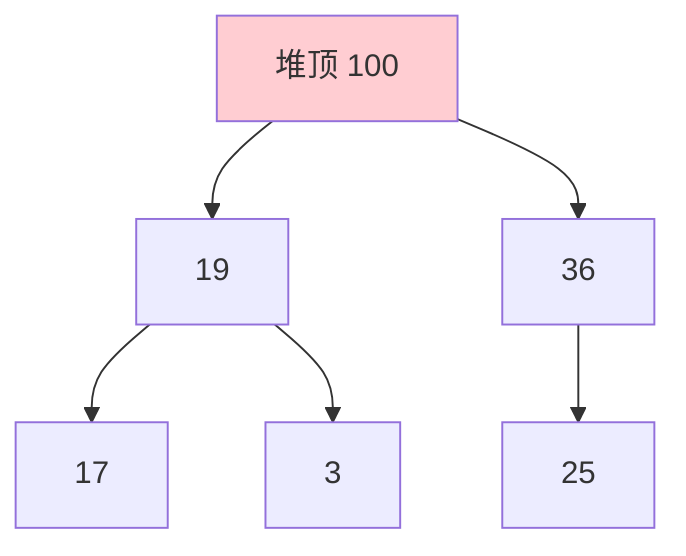

# 精通堆与 Top K

> 堆（优先队列）专治"动态求最值""Top K""第 K 大"这类问题。它能 O(log n) 插入、O(1) 取最值，是 Top K 的利器。本篇讲清堆的原理、Go 的 container/heap 用法，以及 Top K 的三种解法对比。
>
> **📅 基准：2026 年 6 月。** 代码用 Go。

---

## 一、堆的本质

**堆（Heap）** 是一棵**完全二叉树**（[12](./12-精通-二叉树.md)），满足堆序性质：

- **大顶堆（Max-Heap）**：每个节点 ≥ 其子节点 → 堆顶是最大值。
- **小顶堆（Min-Heap）**：每个节点 ≤ 其子节点 → 堆顶是最小值。

因为是完全二叉树，**用数组存储**最省（无需指针）：

```
节点 i 的：父节点 = (i-1)/2，左孩子 = 2i+1，右孩子 = 2i+2
```



堆只保证**堆顶是最值**，不保证整体有序（这点和 BST 不同）。

---

## 二、堆的操作

核心是两个调整操作：**上浮（sift up）** 和 **下沉（sift down）**，维护堆序：

- **插入**：放到数组末尾，**上浮**（和父节点比，比父大就交换，直到满足堆序）。O(log n)。
- **删除堆顶**：把末尾元素移到堆顶，**下沉**（和较大子节点比，比子小就交换，直到满足堆序）。O(log n)。
- **取堆顶**：直接返回数组第一个，O(1)。
- **建堆**：从最后一个非叶节点开始依次下沉，O(n)（不是 O(n log n)，数学可证）。

```go
// 下沉（大顶堆）：见 07 堆排序的 siftDown
func siftDown(h []int, i, n int) {
    for {
        largest, l, r := i, 2*i+1, 2*i+2
        if l < n && h[l] > h[largest] {
            largest = l
        }
        if r < n && h[r] > h[largest] {
            largest = r
        }
        if largest == i {
            break
        }
        h[i], h[largest] = h[largest], h[i]
        i = largest
    }
}
```

堆排序（[07](./07-精通-排序算法.md)）就是反复取堆顶。建堆 O(n)、每次取顶 O(log n)，排序 O(n log n)。

---

## 三、优先队列

**优先队列（Priority Queue）** 是堆的典型应用——元素按优先级出队（最高/最低优先级先出）。Go 用 `container/heap`（实现接口即可）：

```go
import "container/heap"

// 小顶堆
type MinHeap []int
func (h MinHeap) Len() int            { return len(h) }
func (h MinHeap) Less(i, j int) bool  { return h[i] < h[j] } // < 小顶堆；> 大顶堆
func (h MinHeap) Swap(i, j int)       { h[i], h[j] = h[j], h[i] }
func (h *MinHeap) Push(x any)         { *h = append(*h, x.(int)) }
func (h *MinHeap) Pop() any {
    old := *h
    n := len(old)
    x := old[n-1]
    *h = old[:n-1]
    return x
}

// 使用
h := &MinHeap{3, 1, 2}
heap.Init(h)            // 建堆 O(n)
heap.Push(h, 0)         // 插入 O(log n)
min := heap.Pop(h)      // 弹出最小 O(log n)
top := (*h)[0]          // 看堆顶 O(1)
```

要点：实现 `Less` 决定大顶/小顶堆（`<` 小顶，`>` 大顶）；`Push/Pop` 操作底层 slice。优先队列用于 Dijkstra（[14](./14-精通-图论.md)）、任务调度、Top K、合并 K 路等。

---

## 四、Top K 问题

**Top K（前 K 大/小）** 有三种解法，各有适用场景：

| 解法 | 复杂度 | 适用 |
|---|---|---|
| 全排序后取前 K | O(n log n) | 简单，但浪费（不需要全部有序） |
| **堆（大小为 K）** | O(n log k) | **K 远小于 n、数据流、海量数据** |
| **快速选择** | 平均 O(n) | 静态数组、一次性求解 |

**堆解法（求前 K 大，用大小为 K 的小顶堆）**：

```go
func topKLargest(nums []int, k int) []int {
    h := &MinHeap{} // 小顶堆，堆顶是 K 个里最小的
    heap.Init(h)
    for _, x := range nums {
        if h.Len() < k {
            heap.Push(h, x)
        } else if x > (*h)[0] { // 比堆顶（K个中最小）大，替换
            heap.Pop(h)
            heap.Push(h, x)
        }
    }
    return *h // 堆里就是前 K 大
}
```

**为什么求前 K 大用小顶堆**（反直觉但关键）：维护一个大小为 K 的小顶堆，堆顶是这 K 个里**最小**的。新元素只要比堆顶大就替换堆顶——这样堆里始终保持着"目前见过的最大的 K 个"。每个元素 O(log k)，总 O(n log k)，且**只需 O(k) 空间**，适合**数据流/海量数据**（不必全部加载，呼应 [系统设计 S10 排行榜](../system-design/S10-精通-设计排行榜与计数系统.md)）。

---

## 五、第 K 大/小

求**第 K 大**（单个值）：
- **堆**：维护大小 K 的小顶堆，堆顶就是第 K 大。O(n log k)。
- **快速选择（QuickSelect）**：基于快排 partition，平均 O(n)（见 [07](./07-精通-排序算法.md)、[09](./09-精通-分治与归并思想.md)）：

```go
// 快速选择求第 k 大（平均 O(n)）
func findKthLargest(nums []int, k int) int {
    target := len(nums) - k // 第 k 大 = 升序第 (n-k) 个
    lo, hi := 0, len(nums)-1
    for lo <= hi {
        p := partition(nums, lo, hi)
        if p == target {
            return nums[p]
        } else if p < target {
            lo = p + 1 // 只递归一侧
        } else {
            hi = p - 1
        }
    }
    return -1
}
```

**选择**：静态数组、要最快 → 快速选择（O(n)）；数据流、K 小、海量 → 堆（O(n log k)、O(k) 空间）。

---

## 六、数据流中位数

**数据流中位数**（动态加数、随时求中位数）是**双堆**经典题：

- **大顶堆**存较小的一半，**小顶堆**存较大的一半。
- 保持两堆大小平衡（差 ≤ 1）。
- 中位数 = 两堆顶（奇数取多的那堆顶，偶数取两堆顶平均）。


加数 O(log n)、取中位数 O(1)。精髓：**两个堆"背靠背"，大顶堆顶和小顶堆顶就在中位数附近**。这是"用堆维护动态有序性"的代表。

---

## 七、堆的其他应用

| 应用 | 怎么用堆 |
|---|---|
| **合并 K 个有序链表** | 小顶堆存 K 个链表当前头，每次取最小、推进（[03](./03-精通-链表技巧.md)） |
| **Dijkstra 最短路** | 小顶堆取当前最近节点（[14](./14-精通-图论.md)） |
| **任务调度/会议室** | 堆维护最早结束时间 |
| **前 K 高频元素** | 哈希计数 + 大小 K 的堆（[11](./11-精通-哈希表与设计题.md)） |
| **丑数/超级丑数** | 小顶堆每次取最小生成下一个 |

堆的通用价值：**需要反复、动态地取最值（且数据在变化）** 就用堆——比每次重新找最值（O(n)）高效得多。

---

## 陷阱清单

- **求前 K 大用大顶堆**：应该用**小顶堆**（大小 K，堆顶是 K 个中最小，新元素比它大才替换）。求前 K 小才用大顶堆。
- **Top K 用全排序**：K 远小于 n 时浪费，用堆 O(n log k) 或快选 O(n)。
- **以为堆整体有序**：堆只保证堆顶是最值，其余无序（要有序得逐个 pop）。
- **建堆复杂度记成 O(n log n)**：自底向上建堆是 O(n)。
- **Go container/heap 的 Less 方向**：`<` 是小顶堆，`>` 是大顶堆，搞反就错。
- **快速选择两侧都递归**：那是快排 O(n log n)，快选只递归一侧才 O(n)。
- **双堆不平衡**：数据流中位数要维持两堆大小差 ≤ 1，加数后要调整。
- **空堆 Pop/取顶**：先判 Len，否则 panic。

---

## 2026 现状

- **Top K / 第 K 大是高频题**：堆和快速选择两种解法都要会，并能说清"K 小用堆、静态用快选"的取舍。
- **堆是流式/海量数据利器**：数据流中位数、海量数据 Top K（内存放不下全部）用堆只需 O(k) 空间，和 [系统设计 S10 排行榜](../system-design/S10-精通-设计排行榜与计数系统.md)、Top K 一脉相承。
- **优先队列是图算法基础**：Dijkstra、Prim 等都依赖优先队列（[14](./14-精通-图论.md)）。
- **配合刷题**：LeetCode 堆/优先队列标签（前 K 大、前 K 高频、数据流中位数、合并 K 个链表、Dijkstra）必刷，配合本篇（见 [20](./20-精通-高频题型与刷题路线.md)）。

---

## 练习题

1. 堆是什么数据结构？大顶堆和小顶堆有什么区别？为什么用数组存储？

<details><summary>参考答案</summary>

堆是一种特殊的**完全二叉树**（除最后一层外每层都填满、最后一层节点从左到右连续排列），并满足**堆序性质**。按堆序方向分两种：①**大顶堆（最大堆）**——每个节点的值都 ≥ 它的子节点的值，因此**根（堆顶）是整个堆的最大值**；②**小顶堆（最小堆）**——每个节点的值都 ≤ 它的子节点的值，因此**堆顶是最小值**。注意堆**只保证堆顶是最值、父子之间满足大小关系，但不保证整体有序**（兄弟节点之间、不同分支之间没有顺序关系），这是它和二叉搜索树的重要区别（BST 中序有序，堆只有堆顶有序保证）。**为什么用数组存储**：因为堆是完全二叉树，它的节点排列是"紧凑、连续、无空洞"的，可以非常自然地按层序（从上到下、从左到右）映射到数组下标，从而**不需要任何指针**就能表示父子关系，省内存且访问高效。具体的下标关系（0 基）：节点 i 的**父节点下标 = (i-1)/2**、**左孩子 = 2i+1**、**右孩子 = 2i+2**。这样通过简单的下标算术就能在数组上完成"找父亲、找孩子"的导航，配合上浮/下沉操作维护堆序。用数组而非链式结构存储，既节省了指针开销，又利用了数组连续内存的缓存友好性，是堆实现的标准方式（堆排序、优先队列底层都这么做）。

</details>

2. 堆的插入和删除堆顶操作是怎么做的？复杂度是多少？建堆为什么是 O(n)？

<details><summary>参考答案</summary>

**插入（O(log n)）**：把新元素添加到数组的**末尾**（即完全二叉树的最后一个位置），然后执行**上浮（sift up）**——把它与父节点比较，如果违反堆序（大顶堆中它比父大、小顶堆中它比父小）就与父节点交换，不断向上重复，直到满足堆序或到达根。上浮路径最长是树高 O(log n)，所以插入是 O(log n)。**删除堆顶（O(log n)）**：堆顶是要取出的最值；删除时把**数组最后一个元素移到堆顶**位置（覆盖原堆顶）、数组长度减一，然后对新堆顶执行**下沉（sift down）**——把它与较大（大顶堆）/较小（小顶堆）的那个子节点比较，如果违反堆序就交换，不断向下重复，直到满足堆序或到达叶子。下沉路径最长是树高，所以删除堆顶也是 O(log n)。（取堆顶但不删除是 O(1)，直接读数组首元素。）**建堆为什么是 O(n)**：一种朴素想法是"逐个插入 n 个元素"，每次 O(log n)、共 O(n log n)。但更优的是**自底向上建堆（Floyd 建堆）**：从**最后一个非叶节点**开始，到根节点为止，依次对每个节点执行下沉操作。它的复杂度是 O(n) 而非 O(n log n)，原因是：下沉的代价与节点所在的高度成正比，而**完全二叉树中绝大多数节点都在靠近底部的低高度位置**——底层有约 n/2 个叶节点（高度 0，不需下沉）、上一层约 n/4 个节点（最多下沉 1 层）、再上层 n/8 个（最多下沉 2 层）……把各层节点数乘以各自的最大下沉高度求和：∑(每层节点数 × 该层高度) = n/4·1 + n/8·2 + n/16·3 + ... ，这个级数收敛到 O(n)（数学上 ∑ k/2^k 收敛于常数）。直观理解：节点越多的层下沉代价越小、下沉代价大的层节点越少，加权总和是线性的。所以自底向上建堆是 O(n)，这也是堆排序建堆阶段的复杂度。

</details>

3. 求"前 K 大的元素"用大顶堆还是小顶堆？为什么？

<details><summary>参考答案</summary>

求前 K 大的元素，要用**大小为 K 的小顶堆**（这一点常被搞反，是关键考点）。**做法**：维护一个最多容纳 K 个元素的小顶堆，遍历所有元素——堆里不足 K 个时直接把元素加入堆；堆已满 K 个时，比较当前元素与**堆顶**（小顶堆的堆顶是堆中 K 个元素里**最小**的那个）：如果当前元素**大于堆顶**，就弹出堆顶、把当前元素加入堆；否则（当前元素 ≤ 堆顶）直接丢弃。遍历结束后，堆里剩下的就是全部元素中**最大的 K 个**。**为什么用小顶堆而不是大顶堆**：因为我们要维护的是"目前为止见过的最大的 K 个元素"，需要能**快速地把这 K 个里最小的那个淘汰掉**（当遇到更大的新元素时，应该踢掉当前 Top K 中最弱的那个）。小顶堆的堆顶恰好是这 K 个里的最小值，O(1) 就能看到它、O(log k) 就能替换它——所以用小顶堆能高效完成"用更大的新元素替换掉 Top K 中最小的"。如果用大顶堆，堆顶是 K 个里最大的，但我们需要淘汰的是最小的、最大的反而要保留，大顶堆无法 O(1) 拿到要淘汰的最小元素，不合适。**复杂度**：每个元素入堆/调整是 O(log k)，共 n 个元素，总 O(n log k)；空间 O(k)。**对称地**：求"前 K 小的元素"则用**大小为 K 的大顶堆**（堆顶是 K 个里最大的，遇到更小的新元素就替换堆顶）。记忆口诀：**求前 K 大用小顶堆（淘汰最小的）、求前 K 小用大顶堆（淘汰最大的）**——堆顶始终是"当前候选集合里最该被淘汰的那个"。这种大小固定为 K 的堆解法的优势是 O(n log k) 时间、O(k) 空间，特别适合 K 远小于 n、或数据是流式/海量（内存放不下全部）的场景。

</details>

4. 求 Top K 有哪几种方法？如何根据场景选择？

<details><summary>参考答案</summary>

求 Top K（最大或最小的 K 个）主要有三种方法：①**全排序后取前 K**——把整个数组排序（O(n log n)），然后取前 K 个。优点是简单直接；缺点是**做了多余的工作**（我们只要前 K 个、不需要让全部 n 个有序），当 K 远小于 n 时浪费。适合：K 接近 n、或本来就需要完整排序、或数据量小不在乎效率的场景。②**用大小为 K 的堆**——求前 K 大用小顶堆（求前 K 小用大顶堆），遍历元素维护这个大小为 K 的堆，时间 O(n log k)、空间 **O(k)**。优点：①当 **K 远小于 n** 时，O(n log k) 优于 O(n log n)；②**空间只需 O(k)**，不必把所有数据放进内存，所以特别适合**数据流（边来边处理）**和**海量数据（内存装不下全部 n 个，但能装下 K 个）**的 Top K；③天然支持动态/在线场景。缺点：堆操作有常数开销，纯静态小数据未必比快选快。③**快速选择（QuickSelect）**——基于快排 partition，平均 **O(n)** 找到第 K 大的位置，partition 后前 K 个就是 Top K（若不要求 Top K 内部有序）。优点：平均线性 O(n)，是**静态数组、一次性求解**时最快的方法。缺点：①最坏 O(n²)（需随机化 pivot 规避）；②会**修改原数组**（原地 partition）；③不适合数据流/海量数据（要把全部数据放内存、随机访问）；④只适合一次性查询，数据动态变化时不如堆。**选择建议**：**静态数组、要最快、能一次性处理** → 快速选择（O(n)）；**K 远小于 n、数据是流式或海量（内存受限）、需要动态维护** → 堆（O(n log k)、O(k) 空间）；**K 接近 n 或本就需要全排序** → 直接排序。面试中能说出这三种并比较其复杂度和适用场景（尤其"海量数据 Top K 用堆、静态用快选"）是加分项。这也直接对应系统设计里的海量 Top K / 排行榜问题（见系统设计 S10）。

</details>

5. 如何用"双堆"维护数据流的中位数？

<details><summary>参考答案</summary>

用**一个大顶堆 + 一个小顶堆**配合，把数据流中的数动态地分成"较小的一半"和"较大的一半"两部分。设计：①**大顶堆（maxHeap）存较小的那一半数**——它的堆顶是这较小一半里的**最大值**（也就是整个数据中间偏左的值）；②**小顶堆（minHeap）存较大的那一半数**——它的堆顶是较大一半里的**最小值**（中间偏右的值）。两个堆"背靠背"：大顶堆里所有数 ≤ 小顶堆里所有数，且让两个堆的大小保持**平衡（数量相等，或其中一个比另一个多 1）**。**插入一个新数 num（O(log n)）**：先把它放入合适的堆（比如先加入大顶堆，再把大顶堆的堆顶弹出加入小顶堆——保证大顶堆的数都不大于小顶堆；然后比较两堆大小，如果不平衡就把较多的那个堆的堆顶移一个到另一个堆），最终维持"两堆有序划分 + 大小差 ≤ 1"。**求中位数（O(1)）**：如果两个堆**大小相等**（总数为偶数），中位数 = （大顶堆堆顶 + 小顶堆堆顶）/ 2（两个中间值的平均）；如果**某个堆比另一个多 1**（总数为奇数），中位数 = 那个**较多的堆的堆顶**（正中间的那个数）。**为什么有效**：中位数本质是"有序序列正中间的值（或中间两值的平均）"，而我们用两个堆把数据动态地从中间劈成两半——大顶堆顶和小顶堆顶恰好就是中间位置左右的两个数，所以取堆顶就能 O(1) 得到中位数，而无需对整个数据流排序。插入时只需 O(log n) 调整堆并维持平衡。这样支持"动态加数 + 随时 O(1) 查中位数"，是堆"用堆顶维护动态有序边界"思想的经典应用（类似地，双堆还可用于滑动窗口中位数等）。

</details>

6. 优先队列（堆）在算法中还有哪些典型应用？

<details><summary>参考答案</summary>

优先队列（堆）的核心价值是**高效地动态维护和取出最值**（O(1) 取最值、O(log n) 插入/删除），凡是需要"反复地、在变化的数据中取最大/最小"的场景都适合用它。典型应用：①**Top K / 第 K 大（小）**——用大小为 K 的堆维护前 K 个，O(n log k)，适合海量/流式数据（见上题）；②**数据流中位数**——双堆维护（见上题）；③**前 K 高频元素**——先用哈希表统计频率，再用大小为 K 的堆按频率取前 K 个（哈希表 + 堆，见 11）；④**合并 K 个有序链表/数组**——用小顶堆存 K 个链表/数组的当前最小元素，每次弹出全局最小、再把它所在链表的下一个元素入堆，O(N log k)（N 是总元素数），比两两合并更优（见 03）；⑤**Dijkstra 最短路算法**——用小顶堆（优先队列）每次取出当前距离源点最近的未确定节点，是带权图单源最短路的标准实现（见 14）；⑥**Prim 最小生成树**——用堆每次选取连接已选集合的最小权边；⑦**任务调度 / 会议室问题**——用堆维护最早结束时间或最高优先级任务（如"会议室 II"用小顶堆存各会议室的结束时间，判断能否复用）；⑧**丑数 / 超级丑数 / 第 K 小的和**等——用小顶堆每次取出当前最小、生成后续候选；⑨**带优先级的任务队列 / 限流 / 定时器**（工程中）——按优先级或到期时间出队（如延迟队列、定时任务调度，见系统设计 S14）。共同模式是：**需要动态地、反复地获取当前最值，且数据在不断增删变化**——这时用堆把"取最值"从每次 O(n) 重新扫描降到 O(log n) 维护 + O(1) 取顶，效率大幅提升。所以见到"动态最值""第 K""最近/最早/最高优先""合并多路有序"这类信号，就应想到优先队列（堆）。

</details>
