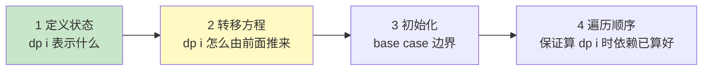
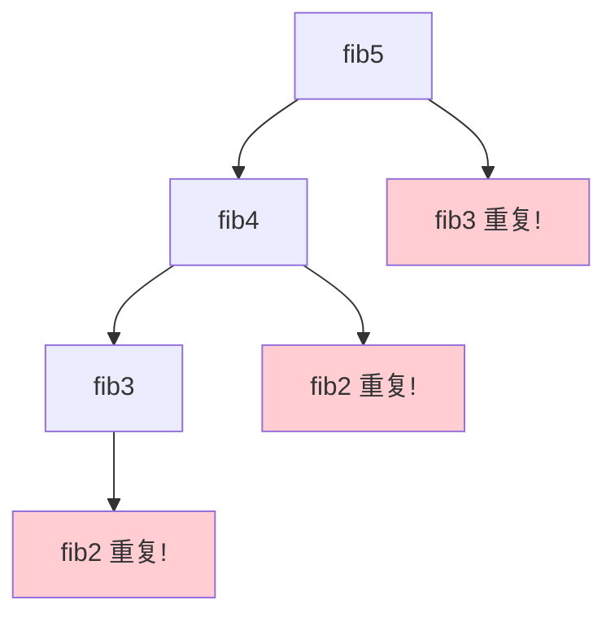

# 精通动态规划基础与思维框架

> 动态规划（DP）是算法面试的"分水岭"——很多人卡在这里。其实 DP 有清晰的思维框架：**状态定义 → 转移方程 → 初始化 → 遍历顺序**。掌握这套四步法，DP 就从"玄学"变成"套路"。本篇是 DP 的总纲，[16](./16-精通-经典DP专题.md) 讲具体题型。
>
> **📅 基准：2026 年 6 月。** 代码用 Go。

---

## 一、什么是 DP

**动态规划（Dynamic Programming）** 把复杂问题拆成**重叠的子问题**，每个子问题只算一次、存起来复用，避免重复计算。用 DP 的两个前提：

- **最优子结构**：大问题的最优解能由子问题的最优解推出（如最短路 = 子路径最短）。
- **重叠子问题**：子问题被反复用到（如斐波那契 fib(n) 多次用到 fib(n-2)）——这是 DP 比分治高效的原因（分治子问题独立不重叠，见 [09](./09-精通-分治与归并思想.md)）。

**回溯/递归 + 重叠子问题 → 用 DP（加缓存）**（见 [08](./08-精通-递归回溯与DFS.md)）。看到"求最优值（最大/最小）、方案数、能否达到"且有重叠子问题，就想 DP。

---

## 二、DP 四步法

**这是 DP 的核心方法论，每道 DP 题都按这四步推：**



1. **定义状态 dp[i]**：`dp[i]` 表示什么？（最关键、最难的一步——状态定义对了，方程往往水到渠成）
2. **转移方程**：`dp[i]` 怎么由更小的状态（dp[i-1]、dp[i-2]…）推出来？
3. **初始化**：base case，最小状态的值（dp[0]、dp[1]）。
4. **遍历顺序**：按什么顺序填表，保证算 dp[i] 时它依赖的状态都已经算好。

写出这四样，DP 就完成了。**难点 90% 在第 1 步状态定义**——状态没定义对，后面全错。

---

## 三、记忆化搜索 vs 递推

DP 有两种实现方向，等价但风格不同：

| 方向 | 名称 | 实现 |
|---|---|---|
| **自顶向下** | 记忆化搜索 | 递归 + 缓存（memo）；从大问题往下递归，算过的存起来 |
| **自底向上** | 递推（迭代） | 用 dp 数组从小到大填表 |

```go
// 自顶向下（记忆化搜索）：递归 + 缓存
func fibMemo(n int, memo map[int]int) int {
    if n < 2 {
        return n
    }
    if v, ok := memo[n]; ok { // 算过直接返回
        return v
    }
    memo[n] = fibMemo(n-1, memo) + fibMemo(n-2, memo)
    return memo[n]
}

// 自底向上（递推）：填表
func fibDP(n int) int {
    if n < 2 {
        return n
    }
    dp := make([]int, n+1)
    dp[0], dp[1] = 0, 1
    for i := 2; i <= n; i++ {
        dp[i] = dp[i-1] + dp[i-2] // 转移方程
    }
    return dp[n]
}
```

- **记忆化搜索**：更直观（就是给递归加缓存），从原问题自然展开，适合状态转移复杂、不好确定遍历顺序时。
- **递推**：没有递归开销、可做空间优化，是 DP 的"标准形态"。
- 两者复杂度相同（每个状态只算一次）。**先用记忆化搜索想清楚，再翻译成递推**是常用策略。

---

## 四、从暴力递归到 DP

理解 DP 最好的方式：看它怎么从暴力递归优化来。以斐波那契为例：

```go
// 暴力递归：O(2ⁿ)——大量重复计算 fib(n-2) 等
func fibBrute(n int) int {
    if n < 2 {
        return n
    }
    return fibBrute(n-1) + fibBrute(n-2)
}
```

`fibBrute(5)` 会重复算 `fib(3)`、`fib(2)` 很多次（递归树有大量重复节点）——这就是**重叠子问题**。加缓存（记忆化）后，每个 fib(i) 只算一次，O(2ⁿ) → **O(n)**。



**DP = 带备忘录的递归**。这就是"递归 + 重叠子问题 → DP"的本质。识别出递归里的重复计算，就知道该用 DP。

---

## 五、经典入门题

几道入门 DP，体会四步法：

```go
// 爬楼梯：每次爬 1 或 2 级，到 n 级有几种方法（本质是斐波那契）
// 状态：dp[i] = 到第 i 级的方法数；转移：dp[i] = dp[i-1] + dp[i-2]
func climbStairs(n int) int {
    if n <= 2 {
        return n
    }
    dp := make([]int, n+1)
    dp[1], dp[2] = 1, 2
    for i := 3; i <= n; i++ {
        dp[i] = dp[i-1] + dp[i-2] // 从 i-1 爬 1 级 或 从 i-2 爬 2 级
    }
    return dp[n]
}

// 打家劫舍：不能偷相邻的，求最大金额
// 状态：dp[i] = 偷到第 i 家的最大金额；转移：偷 i（dp[i-2]+nums[i]）或不偷（dp[i-1]）
func rob(nums []int) int {
    n := len(nums)
    if n == 0 {
        return 0
    }
    if n == 1 {
        return nums[0]
    }
    dp := make([]int, n)
    dp[0] = nums[0]
    dp[1] = max(nums[0], nums[1])
    for i := 2; i < n; i++ {
        dp[i] = max(dp[i-1], dp[i-2]+nums[i]) // 不偷i 或 偷i
    }
    return dp[n-1]
}
```

打家劫舍体现 DP 精髓：**每一步做选择（偷或不偷），dp[i] 记录到当前的最优解**。爬楼梯、打家劫舍、最小路径和、不同路径是 DP 入门必练。

---

## 六、空间优化

很多 DP 的 `dp[i]` 只依赖前几个状态（如 dp[i-1]、dp[i-2]），就能用**滚动数组**把空间从 O(n) 降到 O(1)：

```go
// 爬楼梯空间优化：只存前两个状态
func climbStairsOpt(n int) int {
    if n <= 2 {
        return n
    }
    prev2, prev1 := 1, 2 // 滚动变量代替整个 dp 数组
    for i := 3; i <= n; i++ {
        cur := prev1 + prev2
        prev2, prev1 = prev1, cur // 滚动
    }
    return prev1
}
```

二维 DP 也常能优化成一维（只保留上一行/当前行，如背包、[16](./16-精通-经典DP专题.md)）。**滚动数组**是 DP 常见的优化考点——`dp[i]` 只依赖有限个前驱状态时适用。

---

## 七、DP 的识别与思维框架

**怎么识别 DP**：
- 求**最优值**（最大/最小/最长/最短）、**方案数**、**能否达到**。
- 当前决策依赖之前的状态，且有**重叠子问题**（暴力递归会重复计算）。
- 通常不要求列出所有方案（那是回溯，[08](./08-精通-递归回溯与DFS.md)）。

**思维框架（卡住时这样想）**：
1. **能不能用暴力递归解？** 能的话，看递归参数 → 那往往就是状态。
2. **递归有没有重复计算？** 有 → 加缓存变记忆化 → DP。
3. **dp[i] 表示什么？** 把递归函数的返回值 + 参数想成 dp 的含义。
4. **dp[i] 怎么由更小的推来？** 就是递归关系 → 转移方程。

**先写出暴力递归 → 发现重叠 → 加记忆化 → （可选）翻译成递推 + 空间优化**，是攻克 DP 的通用路径。

---

## 陷阱清单

- **状态定义不清/错误**：DP 最大的坑。dp[i] 含义模糊会导致转移方程写不出或写错。先把状态定义清楚。
- **转移方程漏情况**：没考虑所有"上一步可能的选择"（如打家劫舍漏了"偷 i"的情况）。
- **初始化错误**：base case 没设对（dp[0]、dp[1]），或边界没处理（空数组、n=1）。
- **遍历顺序错**：算 dp[i] 时它依赖的状态还没算（如二维 DP 行列顺序错、背包正序/倒序）。
- **把求所有方案当 DP**：要列举所有方案用回溯，DP 只求最优值/计数。
- **该用 DP 却用暴力递归**：有重叠子问题不加缓存，O(2ⁿ) 超时。
- **滚动数组覆盖了还需要的值**：优化时注意更新顺序（如 01 背包要倒序）。
- **无重叠子问题硬上 DP**：子问题独立的用分治/贪心，不是所有递归都要 DP。

---

## 2026 现状

- **DP 是面试分水岭**：高频且区分度高，能否用"四步法"清晰推导 DP 体现算法功底。
- **记忆化搜索更易上手**：很多人用"暴力递归 + 缓存"更自然地写出 DP，再优化成递推——这是推荐的思考路径。
- **DP 的工程映射**：最短路（Floyd）、文本 diff（编辑距离）、资源分配（背包）、DNA 序列比对（LCS）等都是 DP 的应用。
- **配合刷题**：LeetCode DP 标签从入门（爬楼梯、打家劫舍、最大子数组）到进阶（背包、LIS、编辑距离）循序渐进，配合本篇四步法（见 [16](./16-精通-经典DP专题.md)、[20](./20-精通-高频题型与刷题路线.md)）。

---

## 练习题

1. 使用动态规划的两个前提条件是什么？DP 和分治有什么区别？

<details><summary>参考答案</summary>

使用 DP 的两个前提：①**最优子结构**——一个问题的最优解可以由其子问题的最优解组合/推导出来。也就是说，要解决大问题，只需先求出相关子问题的最优解，再据此推出大问题的最优解（例如最短路径问题中，从 A 到 C 的最短路 = A 到中间点 B 的最短路 + B 到 C 的最短路；这保证了我们可以"用子问题的最优解构建原问题的最优解"）。②**重叠子问题**——在求解过程中，相同的子问题会被**反复、多次**地求解到（例如斐波那契递归中 fib(n-2) 会被 fib(n) 和 fib(n-1) 都用到、被重复计算很多次）。正因为子问题重叠，DP 才通过"每个子问题只计算一次、把结果存起来（备忘录/dp 表）供后续复用"来避免大量重复计算，从而把指数级的暴力递归优化到多项式级。**DP 和分治的区别**：两者都是把问题分解成子问题，但关键差异在于**子问题是否重叠**。①**分治的子问题相互独立、不重叠**——分解出的子问题彼此没有交集、不会被重复求解（如归并排序左右两半独立、快速排序的两个分区独立），所以分治直接递归求解、合并即可，不需要缓存（见 09）。②**DP 的子问题重叠**——同一个子问题会被多次需要，如果像分治那样纯递归会导致指数级重复计算，所以 DP 必须把子问题的解缓存/制表（记忆化或递推）来避免重复，且要求最优子结构。简言之：**子问题独立不重叠 → 用分治；子问题重叠且有最优子结构 → 用动态规划（缓存避免重复）**。判断时常从暴力递归入手——如果递归中出现大量重复计算（重叠子问题），就该用 DP（加备忘录）。

</details>

2. 动态规划的"四步法"是什么？为什么状态定义是最关键的一步？

<details><summary>参考答案</summary>

DP 四步法（解决任何 DP 题的通用方法论）：①**定义状态**——明确 dp[i]（或 dp[i][j] 等）**表示什么含义**，即用一个（或多个）变量来刻画子问题，并确定 dp 数组每一项代表的最优值/方案数/可行性。这是设计 DP 的核心。②**写转移方程**——确定 dp[i] **如何由更小（已求解）的状态推导出来**，即状态之间的递推关系（通常对应"在当前这一步做不同选择，从哪些前驱状态转移而来、取最优"）。③**初始化（base case）**——确定最小的、可以直接得出答案的边界状态的值（如 dp[0]、dp[1]），它们是递推的起点。④**确定遍历顺序**——按什么顺序填充 dp 表，保证在计算 dp[i] 时，它所依赖的那些状态都**已经被计算好**（比如一维通常从小到大、二维要保证行列依赖关系正确、背包有正序/倒序之分）。写出这四样，再处理好返回值，DP 就完成了。**为什么状态定义最关键**：因为状态定义是整个 DP 的"地基"——它决定了你把原问题拆成了什么样的子问题、dp 数组的维度和含义。**状态定义对了，转移方程往往水到渠成**（因为方程就是"这个状态怎么由前面的同类状态推来"，含义清晰后递推关系自然浮现）；而**状态定义错了或含糊，后面三步全都做不下去或全错**——你会发现转移方程怎么都写不对、或者发现当前状态不足以推出答案（信息不够，需要增加维度）。很多 DP 难题的难点恰恰在于"想出一个合适的状态定义"（比如要不要多加一维、状态表示"以 i 结尾"还是"前 i 个"、是否需要记录额外信息如是否持有股票/剩余容量等）。所以做 DP 时要在状态定义上多花心思，定义要做到"无后效性"（当前状态包含了做后续决策所需的全部信息）。一旦状态定义准确，剩下的转移、初始化、顺序都相对机械。这就是为什么说"DP 难，90% 难在状态定义"。

</details>

3. 记忆化搜索（自顶向下）和递推（自底向上）有什么区别和联系？

<details><summary>参考答案</summary>

两者是动态规划的两种实现方式，**本质等价**（都保证每个子问题只计算一次、复杂度相同），区别在于求解的方向和实现风格。①**记忆化搜索（自顶向下，Top-Down）**——从**原问题（大问题）**出发，用**递归**把它分解成子问题求解，并用一个备忘录（memo，哈希表或数组）**缓存已经算过的子问题结果**；递归时先查备忘录，算过就直接返回、没算过才递归计算并存入备忘录。它的形式就是"普通递归 + 缓存"，写法直观——你只需按问题的自然递归关系写递归函数、再加个缓存即可，**不需要事先想清楚子问题的求解顺序**（递归会自动按需求解依赖的子问题）。适合状态转移较复杂、依赖顺序不好确定、或状态空间稀疏（只有部分状态会被用到）的情况。②**递推（自底向上，Bottom-Up）**——从**最小的子问题（base case）**开始，用**循环迭代**按从小到大的顺序逐个填充 dp 表，直到推出原问题的解。它没有递归调用（无函数调用栈开销、不会栈溢出），是 DP 的"标准/经典形态"，而且**便于做空间优化**（如滚动数组，因为你清楚地控制着填表顺序和依赖）。但它要求你**事先想清楚遍历顺序**（保证算 dp[i] 时依赖项已算好）。**联系**：两者解决的是同一个 DP，状态定义和转移方程完全相同，时间复杂度也相同（都是状态数 × 每个状态的转移代价），只是一个用递归+缓存自顶向下、一个用循环填表自底向上。**实践策略**：很多人**先用记忆化搜索把思路想清楚、验证状态和转移正确**（因为它更接近自然的递归思维），如果需要更优的常数或空间优化，再**翻译成自底向上的递推**。选择上：转移关系复杂/顺序难确定/状态稀疏 → 倾向记忆化搜索；需要空间优化/避免递归开销/状态稠密 → 倾向递推。两者都掌握、能互相转换是 DP 熟练的标志。

</details>

4. 以斐波那契为例，说明暴力递归为什么是 O(2ⁿ)，加了记忆化后为什么变成 O(n)。

<details><summary>参考答案</summary>

**暴力递归为什么 O(2ⁿ)**：斐波那契的暴力递归是 `fib(n) = fib(n-1) + fib(n-2)`，每次调用会展开成两个子调用，形成一棵**递归树**。这棵树的问题在于存在**大量重复计算**——例如计算 fib(5) 时，fib(5) 调用 fib(4) 和 fib(3)，fib(4) 又调用 fib(3) 和 fib(2)……可以看到 **fib(3) 被计算了多次、fib(2) 被计算更多次**，越往下重复越严重。递归树的节点数大致随 n 指数增长：树的高度约为 n，每个节点分裂成两个子节点，节点总数约为 2ⁿ 量级（更精确地，调用次数与 fib(n) 本身成正比，约为黄金比例 φ≈1.618 的 n 次方，仍是指数级）。所以暴力递归的时间复杂度是 **O(2ⁿ)**（指数级），n 稍大就慢到无法接受——根本原因是**同一个子问题（如 fib(3)）被反反复复地重新计算了指数多次**（这正是"重叠子问题"）。**加记忆化后为什么 O(n)**：记忆化用一个备忘录（数组或哈希表）缓存每个 fib(i) 第一次计算出的结果。这样当再次需要某个 fib(i) 时，直接从备忘录 O(1) 取出，**不再重复递归计算**。于是**每个不同的子问题 fib(0)、fib(1)、…、fib(n) 各自只会被真正计算一次**（第一次计算时存入备忘录，后续都是 O(1) 查表命中）。一共有 n+1 个不同的子问题（i 从 0 到 n），每个只算一次、每次计算是 O(1)（就是查两个已缓存的前驱相加），所以总时间是 **O(n)**（线性），空间 O(n)（备忘录 + 递归栈）。直观看，记忆化把那棵庞大的、充满重复节点的指数级递归树"剪枝"成了只有 n 个不同节点被实际计算的线性过程——重复的子问题第二次出现时直接命中缓存、不再展开子树。这就是"DP = 带备忘录的递归"消除重叠子问题、把指数降为多项式的本质。（进一步可改成自底向上递推、并用滚动变量把空间优化到 O(1)。）

</details>

5. 什么时候可以用"滚动数组"优化 DP 的空间？

<details><summary>参考答案</summary>

当 DP 的**当前状态只依赖于有限个（通常是前一个或前几个）相邻的、最近的状态**，而不需要保留整个 dp 表的所有历史状态时，就可以用"滚动数组"把空间复杂度降下来。核心判断：看转移方程 dp[i] 依赖哪些项——如果 **dp[i] 只依赖 dp[i-1]（和可能的 dp[i-2] 等少数几个前驱）**，那么在从前往后递推的过程中，一旦算出 dp[i]，更早的状态（如 dp[i-3] 及之前）就再也用不到了，没必要把它们都存着。于是可以**只用几个变量（或一个小数组）滚动地保存最近需要的那几个状态**，而不是开一个大小为 n 的完整 dp 数组。**例子**：①一维斐波那契/爬楼梯，dp[i]=dp[i-1]+dp[i-2] 只依赖前两个，可用两个变量 prev1、prev2 滚动，把 O(n) 空间降到 **O(1)**；②**二维 DP 优化成一维**——很多二维 DP（如 0-1 背包、最长公共子序列、不同路径、编辑距离）中 dp[i][j] 只依赖**上一行 dp[i-1][...] 和当前行已算的部分**，于是可以只保留"上一行"和"当前行"两行（甚至用一行原地滚动更新），把 O(m×n) 空间降到 O(n)。**注意事项**（优化时的坑）：用滚动数组（尤其原地一维滚动）时，要特别注意**更新顺序**，避免在还需要旧值时就把它覆盖了。最典型的是 **0-1 背包用一维数组时必须倒序遍历容量**（从大到小），因为正序会导致一个物品被重复使用（旧值被提前覆盖成本轮新值）；而完全背包则要正序。所以滚动数组优化的前提是"状态只依赖有限个近邻状态"，优化时要理清依赖关系、安排好遍历方向以防覆盖掉尚需使用的值。如果 dp[i] 依赖的是任意更早的、跨度很大的状态（不只是最近几个），则不能简单用滚动数组。

</details>

6. 如何判断一道题该用动态规划？给出你的思考框架。

<details><summary>参考答案</summary>

**识别该用 DP 的信号**：①题目求的是**最优值**（最大/最小、最长/最短）、**方案总数**（有多少种方法）、或**可行性**（能否达到/能否拼出），而**不要求列出所有具体方案**（要列举所有方案是回溯，见 08）；②**当前的决策/状态依赖于之前的决策/状态**，问题可以分阶段、一步步推进；③具有**最优子结构**（大问题最优解能由子问题最优解推出）和**重叠子问题**（用暴力递归会重复计算相同子问题）。看到"最多能装多少""最少几步""有几种走法""最长的××子序列""能否凑出某值"这类，且每步有选择、选择间有依赖，就应考虑 DP。**思考框架（卡住时这样推）**：①**先尝试写暴力递归/回溯**——把问题用递归表达出来（枚举每一步的选择）。这一步能帮你理解问题结构，而且**递归函数的参数往往就是 DP 的"状态"**。②**检查递归中有没有重复计算（重叠子问题）**——画一下递归树或想一想"同样的参数组合是否会被多次调用"。如果有大量重复 → 确认可以用 DP 优化（没有重复则可能是分治/回溯，不必 DP）。③**把递归改成记忆化**——给递归加一个备忘录缓存子问题结果，这就得到了一个（自顶向下的）DP，且能验证状态和转移是否正确。④**明确四要素**——把记忆化里的"递归函数返回值 + 参数含义"正式定义成 dp 状态（dp[i] 表示什么）；把"递归关系"写成转移方程；确定 base case（初始化）；如果要改成自底向上递推，再确定遍历顺序。⑤**（可选）空间优化**——若 dp[i] 只依赖最近几个状态，用滚动数组降空间。一句话总结这个框架：**"暴力递归 → 发现重叠子问题 → 加记忆化（得到 DP）→ 提炼状态与转移 →（可选）改递推 + 空间优化"**。这条路径能把"想不出 DP"的难题，转化为"先写出能跑的递归、再机械地优化"的可操作流程，是攻克 DP 最实用的方法。

</details>
