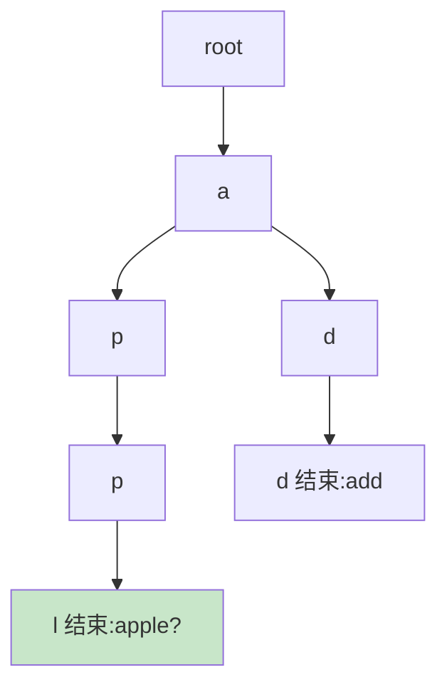

# 精通字符串高级算法

> 字符串的基础技巧（双指针、滑窗、哈希）前面讲过，本篇讲几个**进阶**算法：KMP（字符串匹配）、Trie（字典树）、Manacher（回文）、字符串哈希。它们解决朴素方法 O(nm) 的低效问题，是字符串高频考点的"硬核"部分。
>
> **📅 基准：2026 年 6 月。** 代码用 Go。

---

## 一、字符串匹配问题

**字符串匹配**：在文本串 s（长 n）里找模式串 p（长 m）的出现位置。

**朴素解法**：逐位置对齐、逐字符比较，失配就回退重来，**O(n×m)**：

```go
// 朴素匹配 O(nm)
func naiveSearch(s, p string) int {
    for i := 0; i+len(p) <= len(s); i++ {
        j := 0
        for j < len(p) && s[i+j] == p[j] {
            j++
        }
        if j == len(p) {
            return i // 匹配成功
        }
    }
    return -1
}
```

问题：失配后 i 回退到 i+1 重新比，**浪费了已匹配的信息**。KMP 就是来消除这个浪费的。

---

## 二、KMP

**KMP（Knuth-Morris-Pratt）** 把匹配优化到 **O(n+m)**：失配时，利用模式串自身的"前缀=后缀"信息，**模式串指针 j 跳到合适位置而不是从头开始**，文本指针 i 不回退。

核心是 **next 数组（部分匹配表 / 失配函数）**：`next[j]` = 模式串 p[0..j] 的**最长相同前缀后缀**的长度。失配时 j 跳到 next[j-1]，复用已匹配部分。

```go
// 构建 next 数组
func buildNext(p string) []int {
    next := make([]int, len(p))
    j := 0 // 当前最长相同前后缀长度
    for i := 1; i < len(p); i++ {
        for j > 0 && p[i] != p[j] {
            j = next[j-1] // 失配，回退 j
        }
        if p[i] == p[j] {
            j++
        }
        next[i] = j
    }
    return next
}

// KMP 匹配
func kmpSearch(s, p string) int {
    if len(p) == 0 {
        return 0
    }
    next := buildNext(p)
    j := 0
    for i := 0; i < len(s); i++ {
        for j > 0 && s[i] != p[j] {
            j = next[j-1] // 失配：模式串指针跳转（i 不回退！）
        }
        if s[i] == p[j] {
            j++
        }
        if j == len(p) {
            return i - len(p) + 1 // 找到
        }
    }
    return -1
}
```

KMP 的精髓：**next 数组记录"失配时模式串能跳到哪"**，避免文本指针回退、复用已匹配信息，把 O(nm) 降到 O(n+m)。next 数组的构建本身是"模式串自我匹配"。KMP 是字符串匹配的经典，但实现细节多、易错，要理解 next 含义。

---

## 三、Trie 字典树

**Trie（字典树 / 前缀树）**：用树结构存字符串集合，**公共前缀共享路径**，高效支持**前缀匹配、插入、查询**。



```go
type Trie struct {
    children [26]*Trie // 26 个小写字母
    isEnd    bool       // 是否是某个单词的结尾
}

func (t *Trie) Insert(word string) {
    node := t
    for i := 0; i < len(word); i++ {
        c := word[i] - 'a'
        if node.children[c] == nil {
            node.children[c] = &Trie{}
        }
        node = node.children[c]
    }
    node.isEnd = true // 标记单词结束
}

func (t *Trie) Search(word string) bool {
    node := t.find(word)
    return node != nil && node.isEnd // 存在且是完整单词
}

func (t *Trie) StartsWith(prefix string) bool {
    return t.find(prefix) != nil // 存在以 prefix 为前缀的单词
}

func (t *Trie) find(s string) *Trie {
    node := t
    for i := 0; i < len(s); i++ {
        c := s[i] - 'a'
        if node.children[c] == nil {
            return nil
        }
        node = node.children[c]
    }
    return node
}
```

Trie 的价值：**前缀相关操作高效**——查询/插入是 O(单词长度)，与单词总数无关。应用：**自动补全（[系统设计 S12](../system-design/S12-精通-设计搜索与自动补全.md)）、拼写检查、IP 路由、敏感词过滤、前缀统计**。是处理"大量字符串 + 前缀查询"的利器。

---

## 四、Manacher

**Manacher（马拉车）算法**：O(n) 求**最长回文子串**（朴素中心扩展是 O(n²)）。

核心思想：在字符间插入分隔符（统一奇偶长度），维护一个"最右回文边界"和对应中心，**利用回文的对称性复用已计算的回文半径**，避免重复扩展。

```go
// Manacher 求最长回文子串长度（简化示意）
func longestPalindrome(s string) string {
    // 预处理：插入 # 统一奇偶，如 "aba" → "#a#b#a#"
    t := "#"
    for _, c := range s {
        t += string(c) + "#"
    }
    n := len(t)
    p := make([]int, n) // p[i] = 以 i 为中心的回文半径
    center, right := 0, 0
    for i := 0; i < n; i++ {
        if i < right {
            mirror := 2*center - i
            p[i] = min(right-i, p[mirror]) // 利用对称性复用
        }
        for i-p[i]-1 >= 0 && i+p[i]+1 < n && t[i-p[i]-1] == t[i+p[i]+1] {
            p[i]++ // 中心扩展
        }
        if i+p[i] > right {
            center, right = i, i+p[i] // 更新最右边界
        }
    }
    // 找最大 p[i] 还原原串...（略）
    return s // 示意
}
```

Manacher 较难、实现细节多，面试**了解思想**（对称复用 + 统一奇偶）即可，多数回文题用**中心扩展 O(n²)** 或 **DP（[16 区间 DP](./16-精通-经典DP专题.md)）** 就够了。

---

## 五、字符串哈希

**字符串哈希（Rabin-Karp 思想）**：把字符串映射成一个数值（哈希值），**O(1) 比较两个子串是否相等**（先比哈希）。常用**滚动哈希**——窗口滑动时 O(1) 更新哈希值。

```go
// Rabin-Karp 滚动哈希匹配（思想示意）
// hash(s[i+1..i+m]) 可由 hash(s[i..i+m-1]) O(1) 更新：去掉首字符、加上新字符
```

用途：字符串匹配（Rabin-Karp）、判断子串重复、最长重复子串（二分长度 + 哈希）。优点是实现简单、可 O(1) 比较；缺点是**哈希冲突**（不同串哈希相同），需要双哈希或冲突后再比对。是 KMP 之外字符串匹配的另一思路。

---

## 六、其他

- **回文问题**：中心扩展（O(n²)）、DP（区间，[16](./16-精通-经典DP专题.md)）、Manacher（O(n)）。
- **编辑距离 / 最长公共子序列**：DP（[16](./16-精通-经典DP专题.md)）。
- **字典序**：排列的下一个排列、字典序最小等。
- **多模式匹配**：AC 自动机（Trie + KMP，敏感词过滤），进阶了解。

---

## 七、识别与套路

| 题型 | 算法 |
|---|---|
| 单模式串匹配 | KMP（O(n+m)）/ 朴素 / Rabin-Karp |
| 大量字符串前缀查询、自动补全 | **Trie** |
| 最长回文子串 | 中心扩展 / DP / Manacher |
| 子串相等比较、重复子串 | 字符串哈希（滚动哈希） |
| 多模式串（敏感词） | AC 自动机 |
| 基础（最长无重复、异位词） | 双指针/滑窗/哈希（[04](./04-精通-双指针.md)、[05](./05-精通-滑动窗口.md)、[11](./11-精通-哈希表与设计题.md)） |

---

## 陷阱清单

- **KMP next 数组理解错**：next[j] 是"最长相同前缀后缀长度"，含义搞错则跳转错。理解后再背模板。
- **KMP 文本指针回退**：KMP 的关键是 i 不回退、只 j 跳转。回退就退化成朴素了。
- **Trie 用 map 还是数组**：固定小写字母用 `[26]*Trie`（快）；字符集大用 map（省空间）。
- **Trie 忘记 isEnd**：只建路径不标记单词结尾，无法区分"完整单词"和"前缀"。
- **字符串哈希忽略冲突**：哈希相同不一定串相等，关键场景要再逐字符比对或用双哈希。
- **回文中心扩展漏偶数中心**：回文有奇数（单中心）和偶数（双中心）两种，都要扩展。
- **Manacher 死磕**：面试一般中心扩展/DP 够用，Manacher 了解思想即可，别在它上面卡太久。

---

## 2026 现状

- **KMP 是经典但低频手写**：理解其思想（next 数组、避免回退）重要，但实际匹配工程中常用库函数或 Rabin-Karp；面试要求手写 KMP 的频率在降低，但原理仍是考点。
- **Trie 是高频实用结构**：自动补全、敏感词、前缀统计、IP 路由广泛使用，手写 Trie 是常考题（[系统设计 S12](../system-design/S12-精通-设计搜索与自动补全.md)）。
- **字符串哈希实用**：实现简单、应用广（去重、匹配、最长重复子串），是 KMP 的轻量替代。
- **配合刷题**：LeetCode 字符串、Trie 标签（实现 Trie、单词搜索 II、最长回文子串、重复子串）必刷，配合本篇（见 [20](./20-精通-高频题型与刷题路线.md)）。

---

## 练习题

1. 朴素字符串匹配为什么是 O(nm)？KMP 如何优化到 O(n+m)？

<details><summary>参考答案</summary>

**朴素匹配为什么 O(nm)**：朴素算法在文本串 s（长 n）的每一个可能起始位置 i，都尝试把模式串 p（长 m）对齐过去、逐字符比较；一旦某个字符失配，就把文本指针 i 回退到下一个起始位置（i+1）、模式指针 j 重新从 0 开始比。最坏情况下（如 s="aaaa...a"、p="aaa...b"），每个起始位置都要比较接近 m 个字符才失配，共约 n 个起始位置，所以总比较次数约 n×m，即 **O(nm)**。问题的根源是：**每次失配都丢弃了已经匹配成功的信息、让文本指针回退重来**，做了大量重复比较。**KMP 如何优化到 O(n+m)**：KMP 的核心洞察是——失配时，已经匹配上的那一段（模式串的一个前缀）的内部信息（它的"最长相同前缀后缀"）可以告诉我们模式串应该往后滑动多少，从而**文本指针 i 永不回退、只让模式指针 j 跳到合适的位置继续比**，避免重复比较。它通过预处理模式串得到一个 **next 数组（失配函数）**：next[j] 表示模式串 p[0..j] 的最长"相同前缀和后缀"的长度。当在文本的第 i 位、模式的第 j 位失配时，不是把 j 重置为 0、i 回退，而是令 **j = next[j-1]**（把模式串向右滑动，使得之前匹配的后缀部分对齐到模式的相同前缀上），i 保持不动继续比较。因为 i 从头到尾只前进 n 次、j 的总移动也是均摊线性的（每次失配 j 减小、匹配时 j 增大，总增量有界），所以匹配过程是 O(n)；构建 next 数组是对模式串自身做类似的匹配，O(m)。合计 **O(n+m)**。一句话：朴素法失配后"推倒重来、i 回退"导致 O(nm)；KMP 用 next 数组记住"模式串失配后能跳到哪、复用已匹配信息、i 不回退"，把重复比较消除掉，降到 O(n+m)。

</details>

2. Trie（字典树）的结构和用途是什么？它的查询复杂度为什么与单词数量无关？

<details><summary>参考答案</summary>

**结构**：Trie（字典树/前缀树）是一棵多叉树，用来存储一组字符串（如单词集合）。它的核心特点是**用路径表示字符串、公共前缀共享节点**：从根节点出发，每条边代表一个字符，从根到某节点的路径上的字符连起来就是一个字符串的前缀；每个节点通常有若干子节点（如小写字母用 26 个槽 `children[26]`，或用 map）；每个节点有一个标记（如 isEnd 布尔值）表示"从根到这里的路径是否构成一个完整的、被插入过的单词"。拥有相同前缀的单词会共享前缀部分的路径节点（如 "apple" 和 "app" 共享 a-p-p 路径），只在前缀分叉处才分出不同分支。**用途**：高效支持与**前缀**相关的操作——①**插入**一个单词、②**精确查询**一个单词是否存在（沿路径走 + 检查终点 isEnd）、③**前缀查询**（startsWith，判断是否存在以某前缀开头的单词，只需沿路径能走通即可）。典型应用：**自动补全/输入提示**（输入前缀、找出所有以它开头的词，见系统设计 S12）、**拼写检查**、**敏感词过滤**（多模式匹配，配合 AC 自动机）、**IP 路由前缀匹配**、**前缀统计**、**单词搜索**等。**为什么查询复杂度与单词数量无关**：在 Trie 中查询（或插入）一个长度为 L 的单词/前缀，只需要从根节点开始**沿着这个单词的字符一个一个往下走 L 步**（每步在当前节点的子节点中按字符 O(1) 定位下一个节点），所以时间复杂度是 **O(L)（单词长度）**，而**与 Trie 中存储了多少个单词（单词总数 N）无关**。这是因为查询走的路径只取决于被查单词本身的字符序列、只访问这条路径上的 L 个节点，不需要去和其他单词逐个比较（不像在一个列表里查找要 O(N) 遍历、或哈希要算整串哈希）。对比：若用哈希集合存单词，精确查询是 O(L)（要算长度 L 的串的哈希）但**无法高效做前缀查询**（哈希不支持前缀匹配，得遍历所有词 O(N×L)）；而 Trie 天然支持前缀查询且都是 O(L)、与词数无关，这正是它在前缀相关场景的核心优势。代价是 Trie 比较占空间（每个节点要存子节点指针数组/表）。

</details>

3. 最长回文子串有哪几种解法？它们的复杂度分别是多少？

<details><summary>参考答案</summary>

求最长回文子串主要有三种解法：①**中心扩展法**——枚举每一个可能的回文中心，从中心向两边扩展、只要左右字符相等就继续扩展，记录最长的回文。注意回文有两种中心：**奇数长度回文以单个字符为中心**（如 "aba" 以 b 为中心），**偶数长度回文以两个相邻字符之间为中心**（如 "abba" 以中间两个 b 之间为中心），所以每个位置要分别按奇、偶两种中心扩展。共有约 2n 个中心，每个中心扩展最坏 O(n)，所以时间复杂度 **O(n²)**，空间 O(1)。这是最常用、最容易写对的方法。②**动态规划（区间 DP）**——定义 dp[i][j] 表示子串 s[i..j] 是否是回文；转移：s[i]==s[j] 且 dp[i+1][j-1] 为真（或区间长度 ≤ 2）则 dp[i][j] 为真。按区间长度从小到大递推，记录最长的回文区间。时间 **O(n²)**、空间 O(n²)（可优化）。它思路清晰、易于扩展（如统计回文子串数目），但空间比中心扩展大（见区间 DP 16）。③**Manacher（马拉车）算法**——通过在字符间插入分隔符统一奇偶长度，并维护一个"当前已知的最右回文边界"和对应中心，**利用回文的对称性复用之前已经计算出的回文半径**（在最右边界内的位置可以直接借用其对称位置的回文半径作为初始值，减少重复扩展），从而把复杂度降到**线性 O(n)**、空间 O(n)。它是理论最优解，但实现细节较多、较难写对。**总结与选择**：中心扩展 O(n²) 简单实用、是面试首选；区间 DP O(n²) 适合需要 DP 框架或统计回文数量时；Manacher O(n) 是最优但复杂，面试一般**了解其"对称复用"的思想即可**、不必死磕手写（绝大多数数据规模下 O(n²) 已足够通过）。

</details>

4. KMP 算法中 next 数组（部分匹配表）表示什么？失配时如何利用它？

<details><summary>参考答案</summary>

**next 数组的含义**：next[j]（也叫部分匹配表/失配函数）表示模式串 p 的子串 p[0..j]（前 j+1 个字符）的**最长的"相同的真前缀和真后缀"的长度**。"真前缀"指不包含最后一个字符的前缀、"真后缀"指不包含第一个字符的后缀；next[j] 就是这个子串中，既是它的前缀又是它的后缀的最长字符串的长度（不能是整个串本身）。例如对模式串 "ababa"，next 数组反映了诸如 "aba" 的最长相同前后缀是 "a"（长度 1）、"abab" 的最长相同前后缀是 "ab"（长度 2）等信息。它本质刻画了模式串**自身的重复结构**——哪些前缀同时也出现在后缀位置。**失配时如何利用它**：在 KMP 匹配过程中，当文本指针 i 处的字符 s[i] 与模式指针 j 处的字符 p[j] **失配**时（前面 p[0..j-1] 已经匹配成功），我们不把模式指针 j 重置为 0、也不回退文本指针 i，而是令 **j = next[j-1]**——也就是把模式串向右滑动，使得"已经匹配成功的那段后缀"对齐到模式串中与之相同的前缀上，然后从新的 j 位置继续和 s[i] 比较。直观理解：已匹配的部分 p[0..j-1] 有一段后缀等于它自己的某段前缀（长度为 next[j-1]），那么滑动模式串让这段前缀移动到原来后缀的位置时，这部分**天然就是匹配的、无需重新比较**，可以直接从 next[j-1] 这个位置接着比，从而跳过了大量重复比较、且文本指针 i 不用回退。如果 j 跳到 0 还失配，则 i 前进一位、j 保持 0。正是靠 next 数组提供的"失配后模式串能安全跳到哪"的信息，KMP 避免了朴素算法的回退重来，实现 O(n+m)。构建 next 数组的过程本身就是"模式串和自己做 KMP 匹配"。理解 next 的含义（最长相同前缀后缀）是理解和正确实现 KMP 的关键。

</details>

5. 字符串哈希（如 Rabin-Karp）的思想是什么？有什么优缺点？

<details><summary>参考答案</summary>

**思想**：字符串哈希把一个字符串（或子串）通过一个哈希函数映射成一个**数值（哈希值）**，从而可以用"比较两个数值是否相等"来快速判断"两个字符串是否相等"——比较哈希值是 O(1)，而逐字符比较是 O(长度)。Rabin-Karp 算法用这个思想做字符串匹配：把模式串 p 算出一个哈希值，然后在文本串 s 上用一个长度为 m（模式串长度）的滑动窗口，计算每个窗口子串的哈希值，与模式串的哈希值比较，相等就（再校验一下）认为找到匹配。关键技巧是**滚动哈希（rolling hash）**：当窗口从位置 i 滑到 i+1 时，不需要重新计算整个长度为 m 的子串哈希，而是用上一个窗口的哈希值 **O(1) 地更新**——去掉滑出窗口的那个首字符的贡献、加上新滑入的尾字符的贡献（通常用一个进制基数 base 和取模来实现多项式哈希，更新公式是减去首字符×base^(m-1)、整体乘 base、加新字符）。这样整个匹配过程是 O(n+m)。**优点**：①**实现相对简单**（比 KMP 容易理解和写对，不需要 next 数组）；②**能 O(1) 比较任意两个子串是否相等**（预处理前缀哈希后），适用面广——可用于字符串匹配、判断重复子串、求最长重复子串（二分长度 + 哈希判断）、多模式匹配、判断两子串是否相等等；③滚动哈希让滑动窗口更新 O(1)。**缺点**：①**存在哈希冲突**——不同的字符串可能算出相同的哈希值（尤其取模后），所以哈希值相等**不能 100% 保证字符串相等**，在要求绝对正确的场景需要在哈希相等后**再逐字符校验一次**（或使用**双哈希**——用两组不同的 base 和模数，两个哈希都相等才认为相等，大幅降低冲突概率）；②哈希函数设计不当（base/模数选得不好）容易被构造数据"卡哈希"产生大量冲突，使最坏退化；③涉及大数和取模，要注意溢出。**对比 KMP**：KMP 是确定性的、保证 O(n+m) 且无冲突问题，但实现较难（next 数组易错）；Rabin-Karp 实现简单、灵活（能比较任意子串），但是概率型的、需处理冲突。两者是字符串匹配的两种经典思路，实际中字符串哈希因简单灵活而常用。

</details>

6. 什么情况下应该用 Trie？它和哈希表存字符串相比有什么优劣？

<details><summary>参考答案</summary>

**应该用 Trie 的情况**：当问题涉及**大量字符串的"前缀"相关操作**时，Trie 是首选。典型场景：①**前缀查询/自动补全**——需要快速找出"以某个前缀开头的所有单词"或判断"是否存在以某前缀开头的单词"（如搜索框输入提示，见系统设计 S12）；②**按前缀分组/统计**——统计有多少单词具有某前缀、共享前缀的字符串集合；③**拼写检查、单词字典**；④**敏感词过滤、多模式串匹配**（Trie 是 AC 自动机的基础）；⑤**IP 路由的最长前缀匹配**、字符串的字典序处理等。一句话：**只要核心需求和"前缀"有关，就考虑 Trie**。**Trie vs 哈希表存字符串的优劣**：**哈希表（如 set/map 存字符串）的优势**：①**精确查找/插入快**——判断某个完整单词是否存在是 O(L)（计算长度 L 的串的哈希），平均很快；②**空间相对紧凑**（只存字符串本身，不需要为每个字符建节点）、实现简单。**哈希表的劣势**：①**无法高效支持前缀查询**——哈希把整个字符串打散成一个哈希值，丢失了前缀结构，要找"以某前缀开头的单词"只能遍历所有键逐个判断，O(N×L)（N 是字符串数量），非常低效；②不能方便地按字典序遍历、做前缀统计。**Trie 的优势**：①**前缀操作高效**——前缀查询、startsWith、找所有具有某前缀的单词都很自然且高效，查询/插入都是 O(L)、**与字符串数量 N 无关**；②**共享公共前缀节省空间**（大量有公共前缀的字符串可共用路径）、支持有序遍历（按字符顺序）；③天然适合自动补全、前缀统计等。**Trie 的劣势**：①**空间开销可能较大**——每个节点要存子节点的指针数组（如 26 个槽，即使大部分为空）或 map，当字符集大、字符串前缀重叠少时会浪费内存（可用 map 子节点、压缩 Trie/基数树等优化）；②实现比哈希表复杂。**选择**：如果只需要**精确的存在性查询、插入、删除**（不涉及前缀），用**哈希表**更简单高效；如果需要**前缀匹配、自动补全、前缀统计**等前缀相关功能，用 **Trie**（哈希表做不了或很低效）。两者解决的侧重点不同：哈希表擅长"整串精确查找"，Trie 擅长"前缀相关操作"。

</details>
