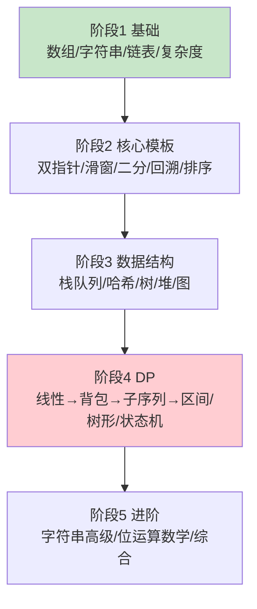
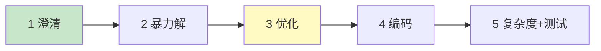

# 精通高频题型与刷题路线

> 这是算法专题的收尾——把前 19 篇的题型、模板、方法论汇总成一张"作战地图"：看到题怎么识别类型、套什么模板、按什么路线刷、面试怎么临场发挥。把它当查漏补缺和考前速记用。
>
> **📅 基准：2026 年 6 月。** 本专题讲思路模板，**配合 LeetCode 实战**。

---

## 一、题型 → 算法 速查表

**看到题先识别类型，再套对应模板**——这是高效解题的核心：

| 题目信号 | 用什么 | 章节 |
|---|---|---|
| 有序数组找值/找边界/最值判定 | 二分查找 | [06](./06-精通-二分查找.md) |
| 连续子数组/子串 + 最长最短 | 滑动窗口 | [05](./05-精通-滑动窗口.md) |
| 有序数组找配对/两端 | 双指针 | [04](./04-精通-双指针.md) |
| 所有方案/排列组合子集 | 回溯 DFS | [08](./08-精通-递归回溯与DFS.md) |
| 树形结构 | 二叉树递归 | [12](./12-精通-二叉树.md) |
| 最短路径/层级/连通 | BFS/DFS/并查集 | [14](./14-精通-图论.md) |
| 前 K 大小/动态最值 | 堆 | [13](./13-精通-堆与TopK.md) |
| 下一个更大/区间最值 | 单调栈/单调队列 | [10](./10-精通-栈与队列.md) |
| 最优值/计数/能否到达 + 重叠子问题 | 动态规划 | [15](./15-精通-动态规划基础.md)/[16](./16-精通-经典DP专题.md) |
| 局部最优能推全局 | 贪心 | [17](./17-精通-贪心算法.md) |
| 优化暴力查找/计数/判重 | 哈希表 | [11](./11-精通-哈希表与设计题.md) |
| 字符串匹配/前缀 | KMP/Trie | [18](./18-精通-字符串高级算法.md) |
| 区间和/区间更新 | 前缀和/差分 | [02](./02-精通-数组与字符串技巧.md) |
| 第 K 大、找中位数 | 快速选择/堆 | [13](./13-精通-堆与TopK.md) |

---

## 二、模板汇总

各算法的核心模板速记（详见对应章节）：

- **二分**：左闭右闭 `l<=r`、`mid=l+(r-l)/2`、`l=mid+1`/`r=mid-1`；找边界用 lower_bound。
- **滑窗**：`for right: 扩窗; for 不满足: 收窗 left++; 更新答案`。
- **双指针**：对撞（有序找配对）、快慢（原地处理）、同向（滑窗）。
- **回溯**：`做选择 → 递归 → 撤销选择`，记录结果要拷贝路径。
- **BFS**：队列 + visited（入队时标记）；层序记录层 size。
- **DFS**：递归/栈 + visited（图防环）。
- **二叉树递归**：`base case(nil) → 递归左右 → 合并`。
- **DP 四步**：状态定义 → 转移方程 → 初始化 → 遍历顺序。
- **堆 Top K**：前 K 大用大小 K 的小顶堆。
- **并查集**：find（路径压缩）+ union（按秩合并）。
- **单调栈**：维护单调性，弹出"被挡住"的元素，存下标。

---

## 三、刷题路线图

按"基础 → 核心模板 → 数据结构 → DP → 进阶"循序渐进：

| 阶段 | 内容 | 对应章节 | 建议题量 |
|---|---|---|---|
| 1 基础 | 数组、字符串、链表、复杂度 | [01](./01-精通-复杂度分析与算法面试方法论.md)-[03](./03-精通-链表技巧.md) | 30-40 |
| 2 核心模板 | 双指针、滑窗、二分、回溯、排序、分治 | [04](./04-精通-双指针.md)-[09](./09-精通-分治与归并思想.md) | 60-80 |
| 3 数据结构 | 栈队列、哈希、树、堆、图 | [10](./10-精通-栈与队列.md)-[14](./14-精通-图论.md) | 60-80 |
| 4 DP | 动态规划全套 | [15](./15-精通-动态规划基础.md)-[17](./17-精通-贪心算法.md) | 50-70 |
| 5 进阶 | 字符串高级、位运算数学 | [18](./18-精通-字符串高级算法.md)-[19](./19-精通-位运算与数学.md) | 20-30 |

**总量约 200-300 题**能覆盖绝大多数面试。质量优先于数量——**吃透一道经典题胜过刷十道类似题**。

---

## 四、面试高频题清单

按类型整理的"必刷"经典题（吃透这些，覆盖大半面试）：

| 类型 | 经典题 |
|---|---|
| 双指针 | 两数之和 II、三数之和、盛水容器、移动零 |
| 滑动窗口 | 无重复最长子串、最小覆盖子串、找异位词 |
| 二分 | 搜索旋转数组、找边界、二分答案（分割数组最大值） |
| 回溯 | 子集、全排列、组合总和、N 皇后、岛屿数量、单词搜索 |
| 链表 | 反转链表、合并两个有序链表、判环、相交、K 个一组反转 |
| 栈 | 有效括号、每日温度（单调栈）、最小栈、逆波兰 |
| 哈希/设计 | 两数之和、字母异位词分组、LRU 缓存、O(1) 随机 |
| 二叉树 | 各序遍历、最大深度、翻转、对称、路径和、LCA、层序 |
| 堆 | 前 K 高频、数据流中位数、合并 K 个链表、第 K 大 |
| 图 | 课程表（拓扑）、岛屿、冗余连接（并查集）、网络延迟（Dijkstra） |
| DP | 爬楼梯、打家劫舍、最大子数组、零钱兑换、LIS、LCS、编辑距离、背包、股票系列 |
| 贪心 | 跳跃游戏、无重叠区间、加油站、分发饼干 |

---

## 五、临场策略

面试时按**五步法**（[01](./01-精通-复杂度分析与算法面试方法论.md)）走：

1. **澄清**：问数据范围、边界、是否有序——别假设。
2. **暴力解**：先给能跑的，说清思路（"先有再优化"）。
3. **优化**：识别题型套模板、找重复劳动、空间换时间。
4. **编码**：边写边讲，注意边界。
5. **复杂度 + 测试**：说时间/空间复杂度，用例子（含边界）验证。

**卡住怎么办**：
- 说出你在想什么（面试官会引导）。
- 退回暴力解（保底有分）。
- 从小例子手算找规律。
- 想"这题像哪个见过的题型"。
- **沟通 > 沉默**——边想边说是加分项。

---

## 六、复杂度速查

**从数据规模反推该用什么复杂度的算法**（[01](./01-精通-复杂度分析与算法面试方法论.md)、[02](./02-精通-数组与字符串技巧.md)）：

| n 的规模 | 可接受复杂度 | 提示 |
|---|---|---|
| n ≤ 20 | O(2ⁿ)、O(n!) | 状压、暴力枚举子集/排列 |
| n ≤ 100-500 | O(n³) | 区间 DP、Floyd |
| n ≤ 10⁴ | O(n²) | 普通 DP、双重循环 |
| n ≤ 10⁵-10⁶ | O(n log n)、O(n) | 排序、二分、滑窗、哈希 |
| n > 10⁶ | O(n)、O(log n) | 线性、二分、数学 |

面试澄清数据范围后，**用这张表反推目标复杂度**，就知道该往哪个方向优化。

---

## 七、刷题方法论

高效刷题（不是越多越好）：

- **按专题刷，不要乱序**：一次攻一类（如这周专攻滑窗），形成肌肉记忆，比东一道西一道高效。
- **先想再看题解**：独立思考 15-20 分钟，想不出再看题解——看懂后**自己重写一遍**。
- **吃透经典题 > 刷题量**：每类题型吃透 5-10 道经典，能举一反三，胜过盲目刷几百道。
- **总结模板和套路**：每道题记"它属于什么类型、用了什么模板、坑在哪"，建自己的题型库。
- **二刷错题**：做错/卡住的题标记，隔几天重做，直到能独立写出。
- **限时训练**：模拟面试，限时（如 30 分钟/题），练临场。
- **手写 + 口述**：练习边写边讲思路（面试要边想边说）。

**核心**：算法面试本质是"模式识别 + 模板套用 + 清晰表达"。本专题给你模式和模板，刷题把它们练成本能。

---

## 陷阱清单

- **盲目追刷题量**：刷 500 道但不总结，不如吃透 200 道经典。质量 > 数量。
- **不识别题型直接硬刚**：先识别类型套模板，比每题从零想高效。
- **不澄清数据范围**：n 的规模决定目标复杂度，先问。
- **只会背模板不理解**：模板要理解原理，否则变体就不会。
- **沉默式作答**：面试要边想边说，沉默是大忌。
- **想最优解卡死**：先给暴力解保底，再优化。
- **不二刷错题**：错过的题不复习，下次还错。
- **忽略边界测试**：写完不测边界（空、单元素、极值），容易翻车。

---

## 2026 现状

- **算法面试形态在变**：AI 能秒解 LeetCode，所以面试更看重**现场沟通、思路推导、变体应对、复杂度权衡**，而非默写——本专题强调的"方法论 + 模板理解"正契合这一趋势。
- **系统设计权重上升**：编码轮之外，系统设计（[system-design](../system-design/INDEX.md)）在中高级岗权重提高，算法 + 系统设计是标配组合。
- **核心题型稳定**：双指针、滑窗、二分、回溯、树、堆、图、DP 这些核心题型多年稳定，吃透它们是长期有效的投资。
- **本专题定位**：讲思路和模板，**配合 LeetCode 按本路线刷题**，把模式识别和模板套用练成本能。
- **关联**：算法用在系统设计里（Top K → 排行榜 [S10](../system-design/S10-精通-设计排行榜与计数系统.md)、图 → 依赖调度、编辑距离 → 搜索纠错 [S12](../system-design/S12-精通-设计搜索与自动补全.md)）；数据结构语言实现见 [java/](../java/INDEX.md)、[golang/](../golang/INDEX.md)。

---

## 练习题

1. 拿到一道算法题，你识别"该用什么算法"的思考流程是什么？

参考答案

识别算法的思考流程（结合题目特征 + 数据规模 + 暴力解分析）：①**先澄清题意和数据范围**——明确输入输出、边界、以及 n 的规模（数据规模能反推目标复杂度，见下面第④步）。②**根据题目的关键特征/信号匹配题型**（最重要）：看到"有序数组找值/找边界/最值判定"想**二分**；"连续子数组/子串 + 最长/最短"想**滑动窗口**；"有序数组找配对/两端"想**双指针**；"求所有方案/排列/组合/子集"想**回溯**；"树形结构"想**二叉树递归**；"最短路径/层级/连通性"想 **BFS/DFS/并查集**；"前 K 大小/动态最值/第 K 个"想**堆或快速选择**；"下一个更大元素/区间最值"想**单调栈/单调队列**；"求最优值/方案数/能否达到 + 有重叠子问题"想**动态规划**；"局部最优能推全局"想**贪心**；"优化暴力查找/计数/判重"想**哈希表**；"字符串匹配/前缀"想 **KMP/Trie**；"区间和/区间更新"想**前缀和/差分**。③**写暴力解、找可优化点**——如果一时没认出题型，先写出暴力解（通常 O(n²)/指数级），然后分析它的"重复劳动"在哪：有重复的查找 → 哈希表；有重复计算的子问题 → DP（记忆化）；有可利用的有序性 → 排序 + 双指针/二分；要枚举所有可能 → 回溯。④**用数据规模反推目标复杂度**——n≤20 可能是状压/指数暴力；n≤几百可 O(n³)；n≤10⁴ 可 O(n²)；n≤10⁵~10⁶ 需 O(n log n) 或 O(n)；这能指引你该优化到什么程度、排除注定超时的解法。⑤**联想见过的相似题**——"这题像哪道做过的题？"往往能迁移套路。综合起来：**澄清 + 识别题型信号 + 暴力解找优化点 + 数据规模定复杂度 + 联想相似题**。核心是把"模式识别"练成本能——见多了题型信号，看到题就能条件反射地想到对应模板。这正是刷题要"按专题刷 + 总结套路"的原因。

2. 如何根据数据规模 n 反推应该用什么复杂度的算法？

参考答案

这是算法面试和竞赛的重要技巧——题目给定的数据规模 n 暗示了能接受的时间复杂度上限（一般假设 1~2 秒内、现代 CPU 每秒约处理 10⁸~10⁹ 次基本操作），据此可以反推该用什么量级的算法、排除注定超时的方案。经验对照（粗略）：①**n ≤ 约 20**——可以用 **O(2ⁿ) 或 O(n!)** 的指数级算法，如状态压缩 DP、暴力枚举所有子集（2ⁿ）或全排列（n!）、深搜回溯（这种小 n 才允许指数爆炸）。②**n ≤ 约 100~500**——可以用 **O(n³)**，如区间 DP、Floyd 全源最短路、某些三重循环。③**n ≤ 约 1000~5000（10³~几千）**——可以用 **O(n²)**，如普通的二维 DP、双重循环、朴素算法。④**n ≤ 约 10⁵~10⁶**——通常需要 **O(n log n)** 或 **O(n)**，如排序、二分查找、滑动窗口、双指针、哈希、堆等（这个规模下 O(n²)=10¹⁰~10¹² 会超时）。⑤**n ≥ 约 10⁷~10⁸ 或更大**——基本只能 **O(n)** 或 **O(log n)/O(1)**，如线性扫描、数学公式、二分（注意此规模连 O(n log n) 都可能紧张，且要注意常数和 IO）。**使用方法**：在澄清题意拿到 n 的范围后，先用这张表估出"目标复杂度"，再据此选择/优化算法——比如 n=10⁵ 而你的暴力解是 O(n²)（=10¹⁰，超时），就知道必须优化到 O(n log n)，于是去想"能不能排序+双指针/二分、能不能哈希、能不能用 DP/单调栈"等把一层循环省掉。反过来，如果 n 很小（≤20），看到指数级解法也别慌、暴力枚举/状压可能就是预期解。这种"由数据规模定复杂度目标、再反推算法"的逆向思维，能帮你快速锁定解法方向、避免写出超时代码，是非常实用的解题策略（见 01、02）。

3. 面试中遇到不会做的题，应该怎么应对？

参考答案

遇到卡住/不会的题，正确应对（核心是"保持沟通、循序渐进、争取部分分"，而不是沉默或放弃）：①**不要沉默——把你的思考过程说出来**。面试考察的是思维和沟通，边想边讲让面试官了解你的思路，他/她往往会在你接近正确方向时给出**提示和引导**（沉默则得不到任何帮助、也显得不会思考）。说"我在考虑用 XX 方法，但担心 YY 问题"远好于一言不发。②**先给暴力解保底**。哪怕想不出最优解，先写/说出一个能正确解决问题的暴力解法（如 O(n²) 或穷举），这能展示你"至少能解决问题"、拿到部分分，也为后续优化提供基准——很多最优解正是从暴力解发现重复计算后优化来的。③**从小例子手算、找规律**。拿一个具体的小输入手动模拟、画图，常能发现问题的结构、规律或可优化点（如发现重叠子问题→DP、发现单调性→双指针/二分）。④**联想题型和见过的题**。问自己"这题的特征像哪一类？（有序→二分、子串→滑窗、所有方案→回溯、最优值+重叠子问题→DP……）""它像我做过的哪道题？"，尝试迁移已知的模板套路。⑤**拆解问题、先解决简化版**。如果完整问题太难，先解决一个简化或特例（如先不考虑某约束、先做一维再推广），再逐步加回约束。⑥**主动利用面试官的提示**。面试官给提示时要顺着思考、积极回应（这是协作过程，不是考你能否独立憋出答案）。⑦**管理好心态和时间**——卡住时别慌、别钻牛角尖太久，可以说"我先用暴力解实现，再思考优化"，保证有产出。总之：**沟通优先（说出思路）、暴力保底（先求对再求优）、小例子找规律、联想题型迁移、善用提示**。面试官更看重你面对难题时的思考方式、沟通能力和应变，而不只是能不能一次写出最优解——展示出清晰的思考过程，即使没做出最优解也能有不错的评价。

4. 为什么说"吃透一道经典题胜过刷十道类似题"？如何高效刷题？

参考答案

**为什么"吃透一道经典题胜过刷十道类似题"**：算法面试的本质是**模式识别 + 模板套用 + 清晰表达**，而不是题海记忆。每一类题型背后是一个共通的"套路/模板"（如所有滑窗题都是"扩窗-收窗-更新答案"、所有回溯题都是"做选择-递归-撤销"），**真正吃透一道经典题——理解它的状态/思路为什么这样设计、模板每一步为什么这么写、坑在哪、能怎么变形——你就掌握了这一整类题的解法**，遇到同类的新题（哪怕换了外壳）都能举一反三、迅速套用。反之，如果只是刷了十道类似题、每道都对着题解抄一遍而不深究原理，你只是"见过"它们、并没有内化套路，遇到稍微变形的题还是不会，刷的量再大也是低效重复、收益递减。所以**理解的深度比刷题的数量更重要**——把一道题真正搞懂、能脱离题解独立重写、能讲清思路和变体，胜过囫囵吞枣地刷十道。**如何高效刷题**：①**按专题刷、不要乱序**——一段时间集中攻克一类题型（如本周专攻二分），密集练习同类题能快速形成肌肉记忆、归纳出模板，比东一道西一道高效得多。②**先独立思考再看题解**——给自己 15~20 分钟独立想，想不出再看题解；看懂题解后**一定要自己合上题解重写一遍**（甚至隔天再写），确保是真会而不是"看懂了"。③**做完总结套路**——每道题记录"它属于什么题型、用了什么模板/思路、关键点和易错坑在哪"，逐步建立自己的"题型-模板"库。④**二刷错题**——把做错或卡壳的题标记，隔几天回头重做，反复直到能独立 AC。⑤**限时 + 口述训练**——模拟面试限时做题、并练习边写边讲思路（面试要边想边说）。⑥**循序渐进**——按"基础→核心模板→数据结构→DP→进阶"的路线，由易到难。核心理念：**带着总结和理解去刷、按专题成体系地刷、吃透经典并举一反三**，把模式识别和模板套用练成本能，而不是盲目追求刷题数量。

5. 算法面试的核心能力是什么？这个专题如何帮你提升它？

参考答案

**算法面试的核心能力可以概括为三点：模式识别、模板套用（解题能力）、清晰表达（沟通能力）**，再加上扎实的复杂度分析功底。具体来说：①**模式识别**——能从一道陌生题的特征（数据是否有序、求什么、是子串还是子序列、是否有重叠子问题等）快速判断它属于哪一类题型、该用什么算法思想（二分？滑窗？DP？回溯？……）。这是解题的第一步、也是最关键的一步。②**解题能力（模板套用 + 优化）**——识别出题型后，能正确套用对应的模板/套路写出代码，并能从暴力解出发逐步优化（用哈希、双指针、DP 等消除重复劳动），处理好边界。③**复杂度分析**——能准确分析时间/空间复杂度、根据数据规模判断算法是否可行、在不同解法间权衡。④**清晰表达/沟通**——能把思考过程、思路、取舍清楚地讲出来，与面试官协作推进（现代面试尤其看重这点，因为 AI 能写代码、但考的是你的思维和沟通）。**这个专题如何帮你提升**：①它**按题型系统地组织**（双指针、滑窗、二分、回溯、树、堆、图、DP……），每篇讲清"这类题怎么识别、套什么模板、复杂度多少、坑在哪"，直接训练你的**模式识别**和**模板套用**能力——读完你脑中就建立了"题目信号 → 算法"的映射（见本篇速查表）；②每篇给出**可复用的代码模板和思路框架**（如 DP 四步法、回溯模板、五步解题法），让你解题有章可循、不必每题从零想；③贯穿始终强调**复杂度分析**（01 篇专讲、各篇都标复杂度、本篇有"数据规模→复杂度"速查），培养量级直觉；④反复强调**面试方法论和沟通**（五步法：澄清→暴力→优化→编码→复杂度+测试，以及卡住怎么办），训练清晰表达；⑤每篇的"陷阱清单"帮你避坑、"练习题"帮你检验理解。但要强调：**专题提供的是"模式和模板"，真正把它们内化成本能、形成肌肉记忆，必须配合 LeetCode 按路线实战刷题**（边刷边对照模板、总结套路、二刷错题）。专题是地图和方法论，刷题是把方法论练成本能的训练——两者结合，才能全面提升算法面试的核心能力。

