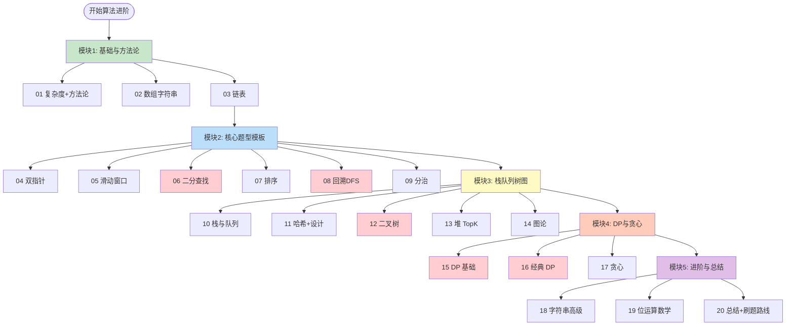
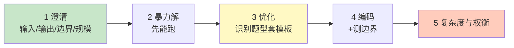
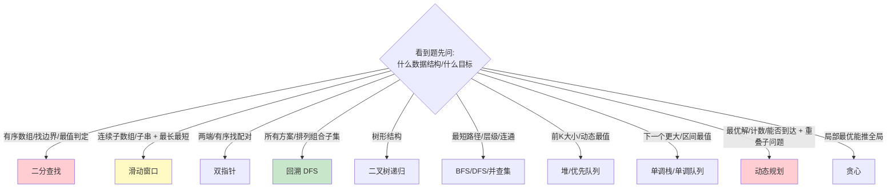
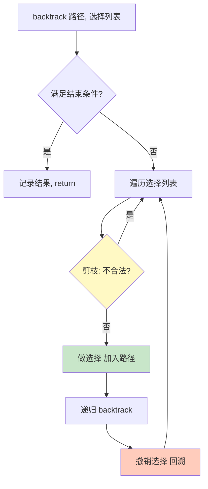
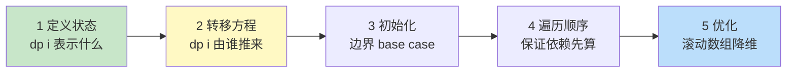
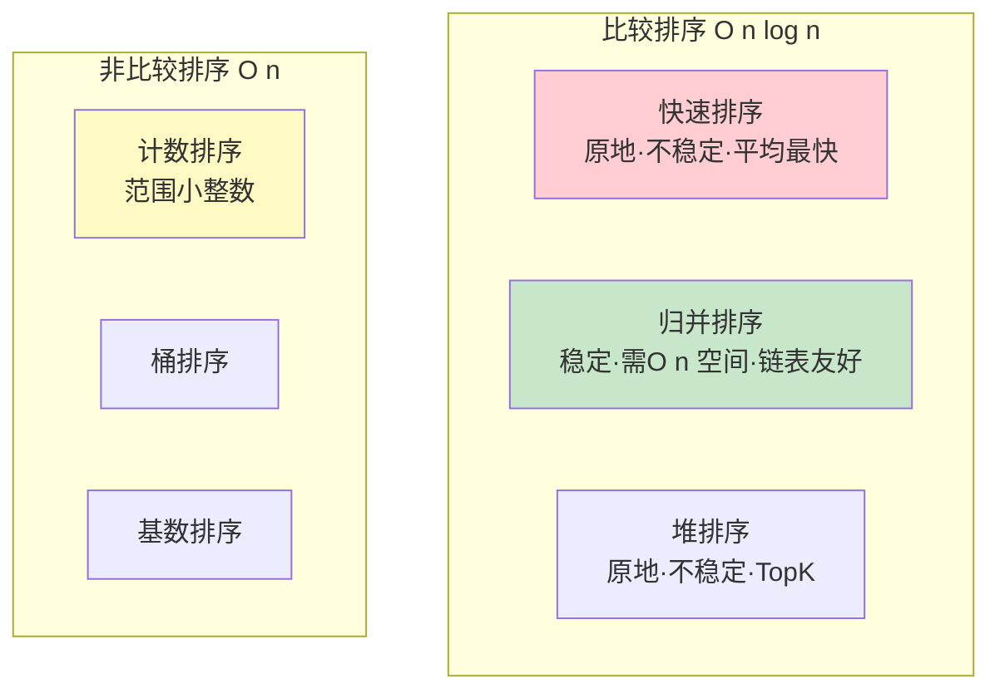

# 算法面试 路线图 · Mermaid 可视化

> 配合 [INDEX.md](./INDEX.md) 与 [QUIZ.md](./QUIZ.md) 使用
>
> **📅 内容基准：2026 年 6 月**

---

## 🗺️ 全景路线图

---

## 🧭 解题方法论五步法

---

## 🌲 题型 → 模板 速查决策树

---

## 🔁 回溯通用模板（08）

---

## 🧮 动态规划四步法（15）

---

## 📊 排序算法对比（07）

---

## 🎓 学习顺序建议

按顺序读 = 完整算法面试能力；面试突击 = 看 [INDEX.md](./INDEX.md) 的「路径 A」。
