# Backend 路线图 · Mermaid 可视化

> 配合 [INDEX.md](./INDEX.md) 与 [QUIZ.md](./QUIZ.md) 使用
>
> **📅 内容基准：2026 年 5 月**——HTTP/3 主流、TLS 1.3 + post-quantum (X25519MLKEM768)、PostgreSQL 18、Redis 8 / Valkey、Kafka 4 (KRaft)、Istio Ambient GA、K8s Gateway API GA、Passkeys、OAuth 2.1 + DPoP、OTel、Prometheus 3。

---

## 🗺️ 全景路线图

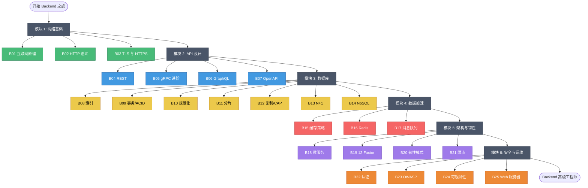

---

## 🟢 模块 1：网络基础（B01-B03）

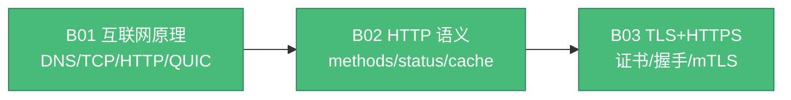

**核心心智模型**：

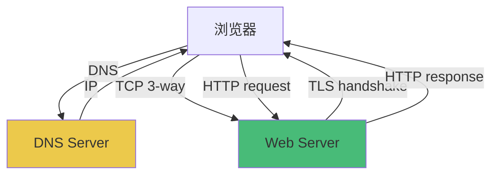

---

## 🔵 模块 2：API 设计（B04-B07）

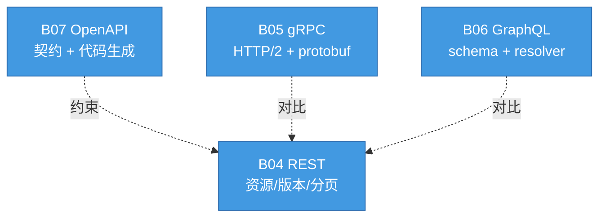

**API 选型决策树**：

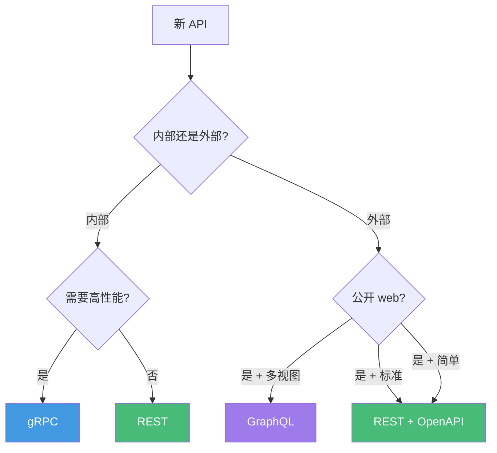

---

## 🟡 模块 3：数据库（B08-B14）

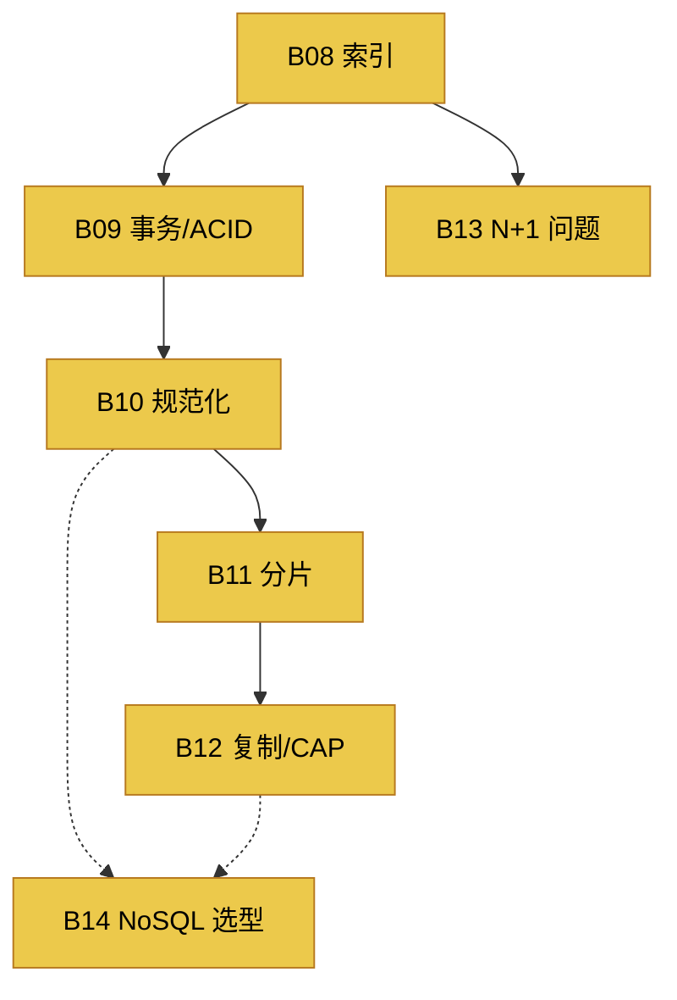

**数据库选型决策**：

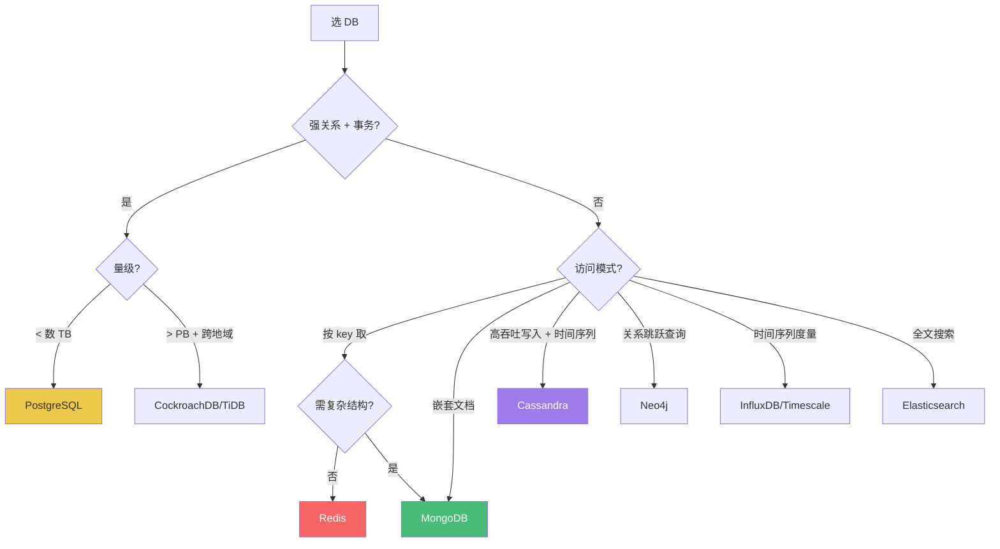

---

## 🔴 模块 4：数据加速（B15-B17）

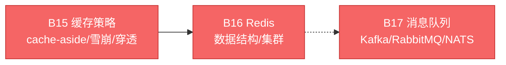

**缓存陷阱对照**：

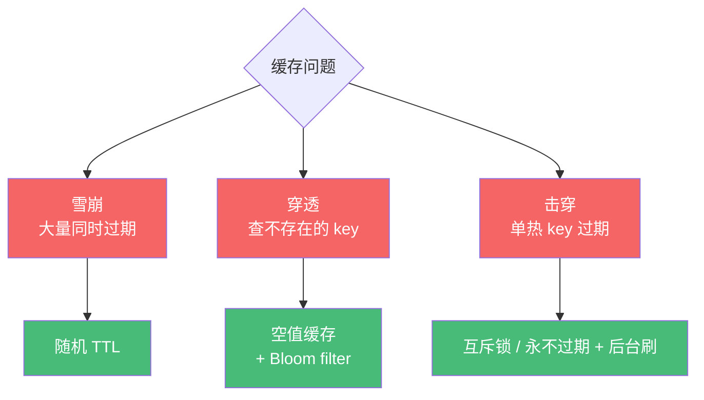

---

## 🟣 模块 5：架构与韧性（B18-B21）

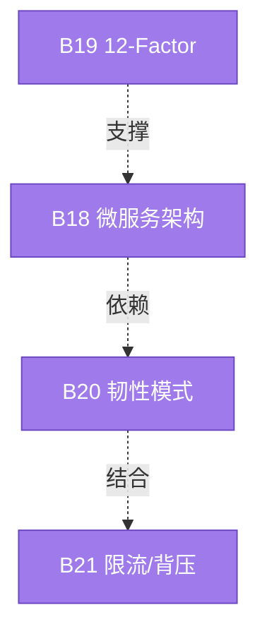

**韧性模式工具箱**：

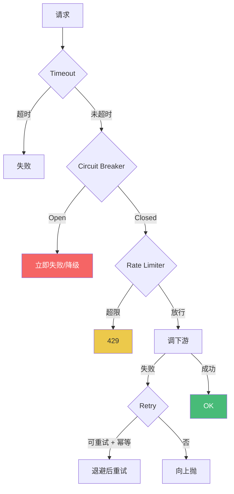

---

## 🟠 模块 6：安全与运维（B22-B25）

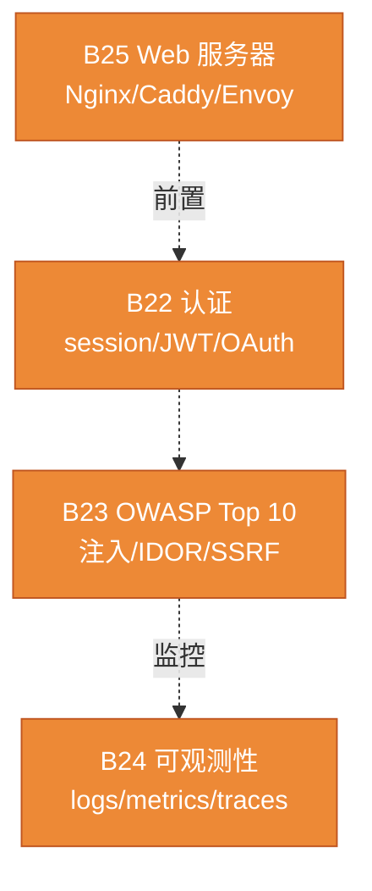

**生产架构图**：

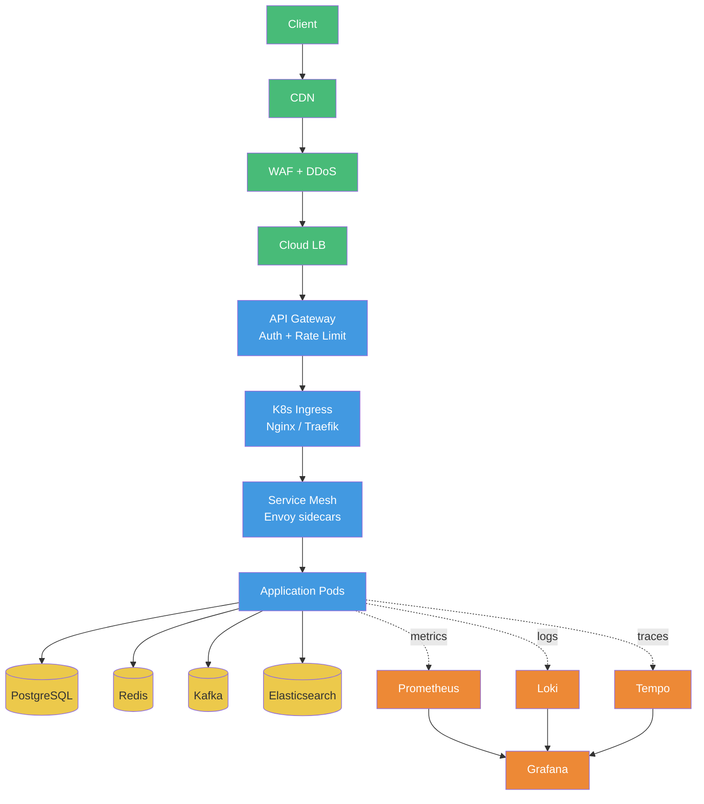

---

## 🎯 学习路径可视化

### 路径 A：完整通学（半年）

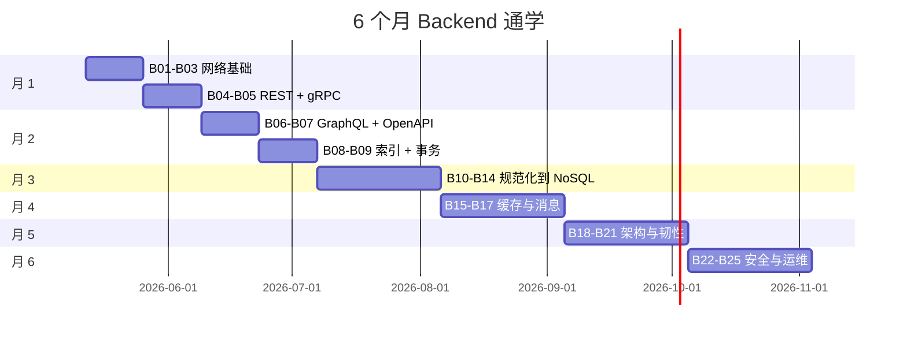

### 路径 B：API 工程师特化

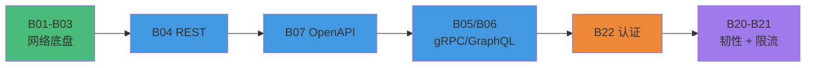

### 路径 C：数据库专精

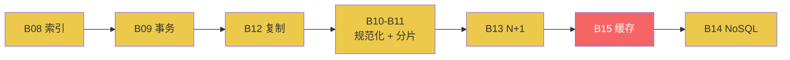

---

## 🧠 后端核心知识思维导图

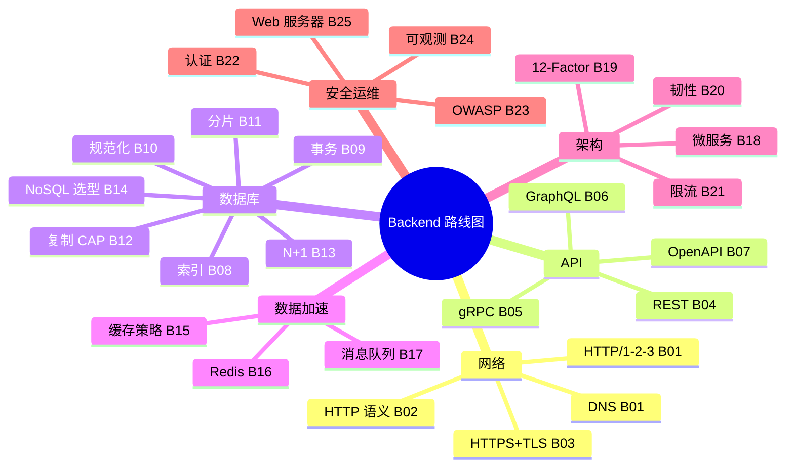

---

## 📊 难度与重要性矩阵

> Mermaid 的 `quadrantChart` 在多数渲染器（GitHub、VS Code、Hugo 等）兼容性差，这里改用表格。
> 难度：⭐ 简单 ⭐⭐ 中等 ⭐⭐⭐ 进阶 ⭐⭐⭐⭐ 难 ⭐⭐⭐⭐⭐ 极难
> 重要性：🔥🔥🔥🔥🔥 必学 → 🔥 选学

### 必学 + 难（高优先级，要花时间啃）

| 课程 | 难度 | 重要性 | 备注 |
|---|---|---|---|
| B08 索引 | ⭐⭐⭐⭐ | 🔥🔥🔥🔥🔥 | 性能问题第一根因 |
| B09 事务 ACID | ⭐⭐⭐⭐ | 🔥🔥🔥🔥🔥 | 隔离级别 / MVCC 底子 |
| B11 分片 | ⭐⭐⭐⭐⭐ | 🔥🔥🔥🔥 | 上规模必撞 |
| B12 复制/CAP | ⭐⭐⭐⭐⭐ | 🔥🔥🔥🔥 | 分布式系统认知基线 |
| B17 消息队列 | ⭐⭐⭐⭐ | 🔥🔥🔥🔥🔥 | 解耦 / 异步主力 |
| B22 认证 | ⭐⭐⭐⭐ | 🔥🔥🔥🔥🔥 | OAuth 2.1 / Passkey 必懂 |
| B24 可观测性 | ⭐⭐⭐⭐ | 🔥🔥🔥🔥🔥 | 没有就是黑盒 |

### 必学 + 简单（性价比最高）

| 课程 | 难度 | 重要性 | 备注 |
|---|---|---|---|
| B01 互联网原理 | ⭐⭐ | 🔥🔥🔥🔥🔥 | 一切上层的物理基础 |
| B02 HTTP 语义 | ⭐⭐ | 🔥🔥🔥🔥🔥 | 每天用，常被误用 |
| B03 TLS / HTTPS | ⭐⭐⭐ | 🔥🔥🔥🔥🔥 | TLS 1.3 + PQ 已主流 |
| B04 REST | ⭐⭐ | 🔥🔥🔥🔥🔥 | 接口规范基本功 |
| B07 OpenAPI | ⭐⭐⭐ | 🔥🔥🔥🔥 | 文档驱动开发 |
| B13 N+1 | ⭐⭐ | 🔥🔥🔥🔥🔥 | 95% 应用都中招 |
| B19 12-Factor | ⭐⭐ | 🔥🔥🔥🔥🔥 | 云原生入门 |

### 必学 + 中等

| 课程 | 难度 | 重要性 | 备注 |
|---|---|---|---|
| B05 gRPC | ⭐⭐⭐⭐ | 🔥🔥🔥🔥 | 内部服务首选 |
| B10 规范化 | ⭐⭐⭐ | 🔥🔥🔥🔥 | 反范式何时用 |
| B15 缓存策略 | ⭐⭐⭐ | 🔥🔥🔥🔥🔥 | Cache-aside / Write-through |
| B16 Redis | ⭐⭐⭐ | 🔥🔥🔥🔥🔥 | KV 之外的丰富用法 |
| B18 微服务 | ⭐⭐⭐⭐ | 🔥🔥🔥🔥 | 何时不该拆 |
| B20 韧性 | ⭐⭐⭐ | 🔥🔥🔥🔥🔥 | 重试 / 熔断 / 隔离 |
| B21 限流 | ⭐⭐⭐ | 🔥🔥🔥🔥 | token bucket / sliding window |
| B23 OWASP | ⭐⭐⭐ | 🔥🔥🔥🔥🔥 | Top 10 必知 |
| B25 Web 服务器 | ⭐⭐⭐ | 🔥🔥🔥🔥 | Nginx / Envoy 怎么放 |

### 选学（按需深入）

| 课程 | 难度 | 重要性 | 何时学 |
|---|---|---|---|
| B06 GraphQL | ⭐⭐⭐⭐ | 🔥🔥🔥 | BFF / 移动端聚合接口时 |
| B14 NoSQL | ⭐⭐⭐ | 🔥🔥🔥 | 文档库 / 时序 / 图场景 |

---

## 🔗 跨模块知识连接

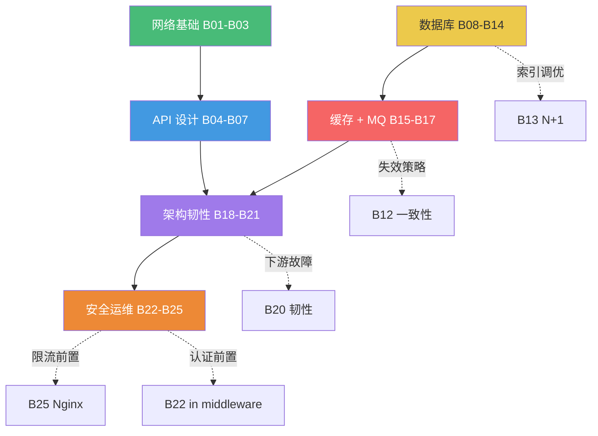

---

## ✅ 阶段性自检

### 模块 1（网络）后

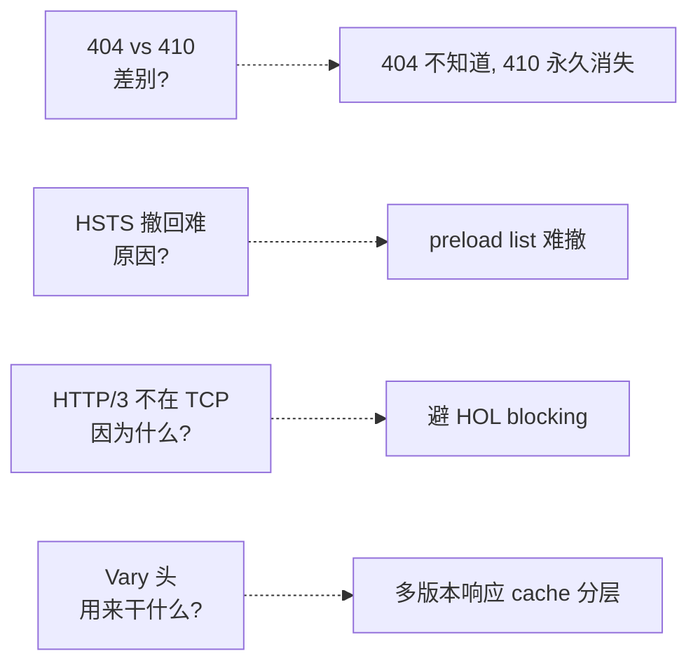

### 模块 3（数据库）后

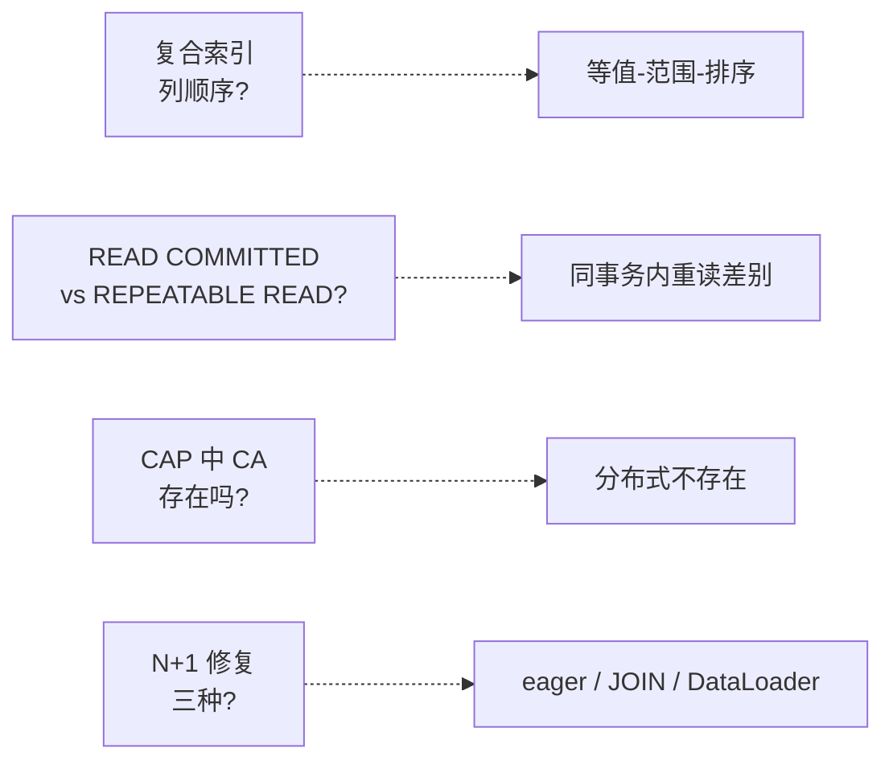

### 模块 5（韧性）后

```mermaid
graph LR
    Q1[retry 不能用<br>什么场景?] -.-> A1[非幂等 + 无 Idempotency-Key]
    Q2[circuit breaker<br>三态?] -.-> A2[Closed / Open / Half-Open]
    Q3[token bucket<br>vs leaky?] -.-> A3[burst 容忍差别]
    Q4[Bulkhead<br>是什么?] -.-> A4[资源隔离防故障扩散]
```

---

## 📌 一键速查表

| 想做什么 | 看哪章 |
|---|---|
| HTTPS 证书 | B03 |
| 设计 REST 错误响应 | B04 |
| 用 protobuf | B05、G28 |
| 加索引但还是慢 | B08 |
| 转账并发 lost update | B09 |
| 高 QPS 数据库扛不住 | B11、B15 |
| 选 PostgreSQL 还是 MongoDB | B14 |
| Redis 缓存设计 | B15、B16 |
| 异步事件 / Kafka | B17 |
| 微服务通信故障 | B20 |
| 限流策略 | B21 |
| 登录系统 | B22 |
| OWASP 自查 | B23 |
| 看不到 prod 在干啥 | B24 |
| Nginx 反代配置 | B25 |

---

## 🆕 2026 关键技术演进图

```mermaid
graph LR
    subgraph 网络与安全
    N1[HTTP/3<br>RFC 9114] --> N2[QUIC v2 / Multipath]
    N3[TLS 1.3] --> N4[X25519MLKEM768<br>后量子默认]
    N4 --> N5[ECH<br>Encrypted ClientHello]
    end

    subgraph 数据存储
    D1[PostgreSQL 17] --> D2[PostgreSQL 18<br>异步 I/O · UUIDv7]
    D3[Redis BSD] --> D4[Redis 7.4 RSALv2/SSPL]
    D4 --> D5[Redis 8 AGPLv3]
    D4 --> D6[Valkey BSD-3]
    D7[Kafka ZK] --> D8[Kafka 3.3 KRaft GA]
    D8 --> D9[Kafka 4.0 移除 ZK<br>KIP-848 新协议]
    end

    subgraph 平台基础设施
    P1[K8s Ingress] --> P2[Gateway API v1.0 GA]
    P3[Istio Sidecar] --> P4[Istio Ambient GA<br>2024-11]
    P5[Cilium CNI] --> P6[Cilium Service Mesh<br>eBPF]
    end

    subgraph 认证授权
    A1[Password] --> A2[Passkeys 主流<br>5亿+ 在用]
    A3[OAuth 2.0] --> A4[OAuth 2.1<br>PKCE 强制]
    A4 --> A5[DPoP RFC 9449<br>sender-constrained]
    end

    subgraph 可观测
    O1[Jaeger / Zipkin] --> O2[OpenTelemetry<br>CNCF Graduated]
    O3[Prometheus 2.x] --> O4[Prometheus 3.0<br>native histograms / OTLP]
    end

    style N4 fill:#fff3e0
    style D2 fill:#fff3e0
    style D5 fill:#fff3e0
    style D9 fill:#fff3e0
    style P4 fill:#fff3e0
    style A2 fill:#fff3e0
    style A5 fill:#fff3e0
    style O4 fill:#fff3e0
```

---

> 📁 本路线图位于 `/data/workspace/dp4/backend/ROADMAP.md`
> 🔁 配套：[INDEX.md](./INDEX.md) 总目录 / [QUIZ.md](./QUIZ.md) 测验
