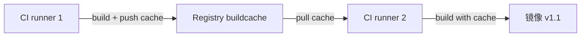
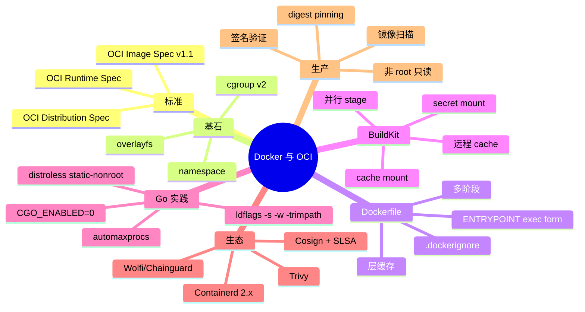

# 精通 Docker 与 OCI：多阶段构建、distroless、scratch、层缓存、BuildKit

> 课程编号：C01
> 路线图来源：云原生 · 模块一 容器与编排基础
> 难度：⭐⭐⭐
> 预计阅读时间：60 分钟
> 内容基准：2026 年 5 月（Kubernetes 1.32/1.33、Containerd 2.x、OCI Image Spec v1.1、BuildKit 默认）

---

## 引言：容器为什么这样设计

```dockerfile
FROM golang:1.24 AS build
WORKDIR /src
COPY go.mod go.sum ./
RUN go mod download
COPY . .
RUN CGO_ENABLED=0 GOOS=linux go build -ldflags="-s -w" -o /out/app ./cmd/app

FROM gcr.io/distroless/static-debian12:nonroot
COPY --from=build /out/app /app
USER nonroot:nonroot
ENTRYPOINT ["/app"]
```

这 8 行 Dockerfile，能产出一个 12 MB、零依赖、非 root、静态链接、镜像签名链完备的生产镜像。它把 2010 年代以来容器工业的所有"祖传智慧"都浓缩了：多阶段、CGO 关闭、distroless、非 root、tag pinning。然而绝大部分团队的 Dockerfile 还在写：

```dockerfile
FROM ubuntu:latest
RUN apt-get update && apt-get install -y golang
COPY . /app
WORKDIR /app
RUN go build -o myapp
CMD ["./myapp"]
```

1.2 GB 的镜像、root 运行、`latest` tag、动态链接、glibc 依赖、apt 缓存层泄漏——每一处都是生产事故的温床。本章把容器从最底层 namespace / cgroup 拆到最上层 SBOM / 签名，让你的 Dockerfile 不再是"能跑就行"。

2026 年 5 月，容器世界的几个事实：

| 事实 | 影响 |
|---|---|
| **OCI Image Spec v1.1** 正式版（2024-02 release）| `manifest`/`config`/`layers` 标准化 + `subject`/`referrers` 元数据挂载 |
| **Containerd 2.0**（2024-11 release）| Docker Engine 25+ / K8s 1.32 默认运行时；CRI v1 GA |
| **BuildKit 默认**（Docker 23.0+ 起）| 并行构建、cache mount、SSH mount、远程缓存 |
| **distroless / Wolfi / Chainguard Images** 主流 | 镜像 <20 MB、CVE 几乎为零 |
| **Cosign + SLSA + SBOM** 走进合规 | 镜像签名 / 出处验证不再可选 |

让我们从最深的地方开始。

---

## 第一章：OCI 是什么——从 Docker Image 到开放标准

### 1.1 三套 OCI 规范

容器世界的"标准三件套"由 **Open Container Initiative**（OCI）维护：

| 规范 | 全称 | 作用 |
|---|---|---|
| **OCI Image Spec** | Image Format Specification | 镜像怎么打、怎么存、怎么寻址 |
| **OCI Runtime Spec** | Runtime Specification | 容器 runtime 怎么把镜像跑起来 |
| **OCI Distribution Spec** | Distribution Specification | 镜像仓库（registry）怎么 push/pull |

```
Dockerfile → BuildKit → OCI Image (符合 Image Spec)
                          ↓ push (符合 Distribution Spec)
                       Registry
                          ↓ pull
                       Containerd / CRI-O → runc / crun (符合 Runtime Spec) → 进程
```

**关键点**：Docker 镜像、OCI 镜像、podman 镜像、buildah 镜像——本质上**都是同一个东西**。`docker pull` 和 `nerdctl pull` 拉的是同一份 manifest。2017 年起 Docker 把镜像格式捐给 OCI，从此"Docker 镜像"只是"OCI 镜像"的别名。

### 1.2 OCI Image Spec v1.1（2024-02）

v1.1 相对 v1.0 最大的变化是引入了 `subject` 字段，使得镜像可以"附挂"额外的工件（artifact）——签名、SBOM、attestation 不再需要单独的 tag 来追踪。

一个 OCI 镜像由四类 blob 组成：

```
Manifest（清单）        ←─── 镜像主入口
   ├── Config           ←─── 配置：env、cmd、layers 顺序、rootfs
   └── Layers[]         ←─── 每层一个 tar.gz blob
   
Index（多架构清单）     ←─── 列出多个 manifest（amd64、arm64、s390x…）
```

manifest 示例（简化）：

```json
{
  "schemaVersion": 2,
  "mediaType": "application/vnd.oci.image.manifest.v1+json",
  "config": {
    "mediaType": "application/vnd.oci.image.config.v1+json",
    "digest": "sha256:f7c...",
    "size": 1234
  },
  "layers": [
    {"mediaType": "application/vnd.oci.image.layer.v1.tar+gzip",
     "digest": "sha256:a1b...", "size": 32812},
    {"mediaType": "application/vnd.oci.image.layer.v1.tar+gzip",
     "digest": "sha256:c4d...", "size": 12345001}
  ],
  "annotations": {
    "org.opencontainers.image.created": "2026-05-14T08:00:00Z",
    "org.opencontainers.image.source": "https://github.com/acme/app"
  }
}
```

config 示例（简化）：

```json
{
  "architecture": "amd64",
  "os": "linux",
  "config": {
    "User": "nonroot",
    "Env": ["PATH=/usr/local/sbin:/usr/local/bin:/usr/sbin:/usr/bin:/sbin:/bin"],
    "Entrypoint": ["/app"],
    "WorkingDir": "/"
  },
  "rootfs": {
    "type": "layers",
    "diff_ids": ["sha256:xxx", "sha256:yyy"]
  },
  "history": [...]
}
```

> 注意 `layers[].digest`（压缩后 tar.gz 的哈希）和 `rootfs.diff_ids[].digest`（解压后 tar 的哈希）是两组不同的哈希。前者用于拉取、后者用于 chain id 计算（决定 overlay 目录名）。

### 1.3 Index 与多架构镜像

```json
{
  "schemaVersion": 2,
  "mediaType": "application/vnd.oci.image.index.v1+json",
  "manifests": [
    {"digest": "sha256:111...", "platform": {"os": "linux", "architecture": "amd64"}},
    {"digest": "sha256:222...", "platform": {"os": "linux", "architecture": "arm64"}}
  ]
}
```

`docker pull alpine:3.20` 时，Docker 先拉 index，根据 `uname -m` 选择对应 manifest，再拉 manifest 和 layers。这是 2017 年以来 multi-arch 的官方做法，buildx 的 `--platform linux/amd64,linux/arm64` 就是产出 Index。

### 1.4 v1.1 的 referrers API

v1.1 让 manifest 多了 `subject` 字段，registry 多了 `/v2/<name>/referrers/<digest>` API。一句话：**镜像可以被其他工件"引用"**。

```
镜像 app:v1.0 (digest: sha256:abc...)
  ↑ subject
   ├── 签名 (sig)        — Cosign / Notation
   ├── SBOM (软件物料清单) — CycloneDX / SPDX
   └── attestation       — SLSA provenance
```

实现上，每个工件是一个独立的 manifest，但它的 `subject` 字段指回原镜像 digest。registry 通过 `referrers` API 反查"谁引用了我"。这取代了 v1.0 时代 sigstore 用 `.sig` 后缀 tag 的 workaround。

```bash
# 查看一个镜像的所有挂载工件
cosign tree ghcr.io/acme/app:v1.0
# 或调原始 API
curl https://ghcr.io/v2/acme/app/referrers/sha256:abc...
```

2026 年 5 月，Docker Hub、GHCR、ECR、GCR、Harbor 2.10+、Zot 都支持 v1.1 referrers。

### 1.5 Distribution Spec：registry 怎么寻址

registry HTTP API 的几条核心路径：

```
GET  /v2/                                    # ping
GET  /v2/<name>/manifests/<tag-or-digest>    # 拉清单
GET  /v2/<name>/blobs/<digest>               # 拉 blob（layer / config）
PUT  /v2/<name>/manifests/<tag>              # 推清单
POST /v2/<name>/blobs/uploads/               # 开始 blob 上传
GET  /v2/<name>/referrers/<digest>           # v1.1：引用查询
```

镜像名 `registry.example.com/library/alpine:3.20` 拆解：

```
registry.example.com   ← Distribution Spec 主机
library                ← namespace
alpine                 ← repository
3.20                   ← tag（或 @sha256:... digest）
```

**digest pinning** 是生产黄金法则：tag 可变，digest 不可变。Helm chart / Argo CD 应用都建议引用 `image@sha256:abc...` 而不是 `image:v1.0`。

---

## 第二章：容器的三大基石——namespace、cgroup、overlayfs

许多工程师把容器当成"轻量 VM"。这是误解。容器只是 **Linux 进程**，但开了几个隔离开关。我们逐个拆。

### 2.1 Namespace：看不见的隔离

Linux namespace 让进程看到一个"独立"的内核视图。容器用到 8 类：

| Namespace | 隔离对象 | 典型表现 |
|---|---|---|
| `mnt` | 挂载点 | 容器看到自己的 `/`、`/proc` |
| `pid` | 进程号 | 容器内 PID 1 是入口进程 |
| `net` | 网络栈 | 自己的 `eth0`、路由表、iptables |
| `ipc` | System V IPC、POSIX 消息队列 | 共享内存不互通 |
| `uts` | hostname、domainname | `hostname` 命令返回容器名 |
| `user` | UID/GID 映射 | 容器内 root（uid=0）映射到宿主非 root |
| `cgroup` | cgroup 视图 | `/sys/fs/cgroup` 是容器自己的子树 |
| `time` | 时钟（5.6+ 内核） | 较少容器使用 |

```bash
# 看一个容器开了哪些 namespace
docker inspect <id> | jq '.[0].State.Pid'
# 12345
ls -l /proc/12345/ns/
# net -> net:[4026532288]
# pid -> pid:[4026532290]
# ...

# 进入一个 namespace 调试
nsenter -t 12345 -n -m bash
```

**user namespace** 是 2026 年生产建议必开的：让容器内的 root（uid=0）在宿主上其实是 uid=100000，即使容器 escape 也拿不到宿主 root。Docker `--userns-remap`、K8s `userNamespaces`（1.30 alpha→1.33 beta）都用到这点。

### 2.2 Cgroup v2：资源边界

cgroup（control group）控制一组进程能用多少资源。Linux 5.10+ 默认 cgroup v2，统一层级，2026 年生产环境基本都是 v2。

```
/sys/fs/cgroup/
├── cpu.max              ← CPU 配额：100000 200000 (ms/period)
├── memory.max           ← 内存上限：536870912 (bytes)
├── memory.swap.max      ← swap 上限
├── io.max               ← IO 带宽
├── pids.max             ← 进程数上限
└── kubepods.slice/      ← K8s Pod 子层级
```

K8s Pod 的 `resources.limits.memory: 512Mi` 落到 cgroup 就是 `memory.max=536870912`。超出 → OOMKilled。

**CPU limits 的陷阱**——cgroup v2 用 CFS bandwidth control：

```
cpu.max = "quota period"
# 100000 100000  ← 1 个 CPU
# 200000 100000  ← 2 个 CPU
# 50000 100000   ← 0.5 个 CPU
```

`limits.cpu: 100m` = 0.1 CPU = `cpu.max = 10000 100000`。如果突发使用超过 100m（哪怕只是 1 ms），CFS 把该容器**暂停**到下一个 period 开始——这就是 CPU throttling。生产中 Go 应用 GOMAXPROCS 默认是 `runtime.NumCPU()`，容器看到的是宿主 CPU 数（如 64），但 cgroup 限制 1 个，结果 64 个 P 抢 1 个核 → 严重抖动。

```go
// 解决方案：uber-go/automaxprocs（生产标配）
import _ "go.uber.org/automaxprocs"
// 启动时根据 cgroup quota 计算 GOMAXPROCS
```

### 2.3 OverlayFS：分层文件系统

镜像有那么多 layer，怎么"叠"成 `/`？答案是 overlay 文件系统：

```
upper (容器写层，可写)
  ↓ 覆盖
lower (镜像层，多个，只读)
  ↓
merged (容器看到的 /)
```

```bash
# 看 overlayfs 挂载
mount | grep overlay
# overlay on /var/lib/docker/overlay2/<id>/merged type overlay 
#   (lowerdir=L1:L2:L3, upperdir=U, workdir=W)
```

- **lowerdir**：镜像各层（从上到下）
- **upperdir**：容器写层
- **workdir**：overlayfs 内部工作目录
- **merged**：合并后的视图

写时复制（CoW）：在容器里改 `/etc/hosts`，overlayfs 把 lower 的 `/etc/hosts` 复制到 upper，再修改。镜像层永远不变——这是镜像层可缓存、可签名、可共享的根因。

**陷阱**：往 lower 里删文件会留 whiteout（特殊文件）；目录改 owner 会触发整目录复制（**whole-directory copy_up**），写小文件可能放大成 MB 级 IO。

---

## 第三章：Dockerfile 进阶——多阶段与层缓存

### 3.1 镜像是分层的，Dockerfile 每条指令一层

```dockerfile
FROM alpine:3.20         # 层 0
WORKDIR /app             # 不产生层（只改 metadata）
COPY package.json .      # 层 1
RUN npm install          # 层 2
COPY . .                 # 层 3
CMD ["node", "index.js"] # 不产生层
```

每层是一个 tar.gz blob。**层是 Dockerfile 缓存与复用的最小单位**。改 `COPY . .` 会让层 3 之后所有层失效（cache miss）。改 `package.json` 会让层 1 之后所有层失效。

**层缓存命中原则**：**变动频率从低到高排列**。

```dockerfile
# ❌ 反例：每次代码变都重装依赖
COPY . .
RUN go mod download
RUN go build

# ✅ 正例：依赖单独一层
COPY go.mod go.sum ./
RUN go mod download           # 缓存几乎永久命中
COPY . .                      # 代码变只让这层后失效
RUN go build
```

Node.js 同理：先 `COPY package*.json` 再 `npm ci`，最后 `COPY . .`。Python：先 `requirements.txt` 再 `pip install`，最后 `COPY`。

### 3.2 多阶段构建（multi-stage build）

2017 年 Docker 17.05 引入。一个 Dockerfile 写多个 `FROM`，每个 `FROM` 是一个 stage，最终镜像只保留最后一个 stage：

```dockerfile
# Stage 1: 编译
FROM golang:1.24 AS build
WORKDIR /src
COPY go.mod go.sum ./
RUN go mod download
COPY . .
RUN CGO_ENABLED=0 GOOS=linux go build -ldflags="-s -w" -trimpath -o /out/app ./cmd/app

# Stage 2: 运行
FROM gcr.io/distroless/static-debian12:nonroot
COPY --from=build /out/app /app
USER nonroot:nonroot
ENTRYPOINT ["/app"]
```

效果：
- 构建期：900 MB（含 Go 工具链 + 源码 + 中间产物）
- 运行期：12 MB（distroless base + 单个静态二进制）

**多阶段的最佳实践**：

1. **stage 命名用 `AS xxx`**：可读、可引用
2. **`COPY --from=` 指定来源**：可以是其它 stage、也可以是外部镜像（`COPY --from=registry/image:tag`）
3. **`--target`**：本地调试时只构建到指定 stage——`docker build --target=build -t myapp:dev .`
4. **多 stage 并行**：BuildKit 自动并行无依赖的 stage（见第四章）

### 3.3 .dockerignore

`COPY . .` 时哪些文件被复制？默认是构建上下文（context）里所有文件——包括 `.git/`、`node_modules/`、`*.log`、本地 `.env`！结果：上下文巨大、cache key 漂移、敏感信息泄漏。

```
# .dockerignore
.git/
.gitignore
node_modules/
.env*
*.md
Dockerfile*
docker-compose*
tests/
.vscode/
.idea/
**/*.log
```

**对工业级项目**，`.dockerignore` 等同于 `.gitignore` 的优先级——必有。

### 3.4 RUN 合并：层数 vs 可读性

```dockerfile
# ❌ 产生 4 层，apt cache 残留在中间层
RUN apt-get update
RUN apt-get install -y curl
RUN rm -rf /var/lib/apt/lists/*

# ✅ 一层，cache 清理在同层
RUN apt-get update && \
    apt-get install -y --no-install-recommends curl && \
    rm -rf /var/lib/apt/lists/*
```

为什么？层是只读的——你在层 3 删除文件，文件依然在层 1。镜像大小没变。Trivy 扫描甚至会发现"已删除"的脆弱包仍然在层中。

**额外技巧**：apk / apt / pip 的 cache mount（BuildKit 特性，见第四章）能避免每次重新下载，又不会留下 cache 层。

### 3.5 ENTRYPOINT vs CMD

```dockerfile
ENTRYPOINT ["/app"]           # exec form，PID 1 是 /app
CMD ["--config=/etc/app.yaml"] # 默认参数，可被 docker run 覆盖
```

- **exec form**（JSON 数组）：直接 `execve()`，进程是 PID 1，能收到 SIGTERM
- **shell form**（字符串）：实际 `sh -c "..."`，sh 是 PID 1，应用是 PID 2 → 收不到信号

```dockerfile
# ❌ 你写
CMD /app --config=/etc/app.yaml
# 实际 Docker 执行
sh -c "/app --config=/etc/app.yaml"
# /app 是 sh 的子进程，K8s SIGTERM 给 sh，sh 不转发 → 应用强制 SIGKILL
```

**生产强制规则**：永远用 exec form（JSON 数组）。如果非要 shell，至少 `exec`：

```dockerfile
CMD ["sh", "-c", "exec /app"]
```

或用 [tini](https://github.com/krallin/tini) 做 PID 1：

```dockerfile
ENTRYPOINT ["/tini", "--"]
CMD ["/app"]
```

distroless 的 `:debug` 变体已内置 tini。Containerd 跑 K8s 时也有 `pause` 容器接管 PID 1，但应用容器内部仍要正确处理信号。

---

## 第四章：BuildKit 与 buildx

### 4.1 BuildKit 是什么

Docker 23.0（2023-02）起，BuildKit 是**默认构建器**。它是 Moby 项目分出来的下一代 builder：

- **并行执行无依赖 stage**
- **增量重建**：只重建受影响 stage
- **cache mount**：apt/npm/go-mod cache 跨构建复用
- **secret mount**：build 时注入密钥不写进层
- **SSH mount**：build 时拉私有 repo 不泄漏 key
- **远程缓存**：cache 推到 registry，跨机器共享
- **frontend 可插拔**：Dockerfile、Buildpack、bazel、Mockerfile…

```bash
# 检查默认 builder
docker buildx ls
# NAME/NODE          DRIVER/ENDPOINT     STATUS   PLATFORMS
# default *          docker              running  linux/amd64
```

### 4.2 buildx：BuildKit 的 CLI 前端

```bash
# 创建一个支持多架构、远程缓存的 builder
docker buildx create --name multi --driver docker-container --use

# 多架构 build + push
docker buildx build \
  --platform linux/amd64,linux/arm64 \
  -t ghcr.io/acme/app:v1.0 \
  --push .
```

`docker-container` driver 在本机起一个 BuildKit 容器，能用所有 BuildKit 特性。`kubernetes` driver 把 BuildKit 跑在 K8s 集群里，多个 builder Pod 共享 cache，CI 加速利器。

### 4.3 cache mount：依赖下载零等待

```dockerfile
# syntax=docker/dockerfile:1.7
FROM golang:1.24 AS build
WORKDIR /src
COPY go.mod go.sum ./
RUN --mount=type=cache,target=/root/.cache/go-build \
    --mount=type=cache,target=/go/pkg/mod \
    go mod download
COPY . .
RUN --mount=type=cache,target=/root/.cache/go-build \
    --mount=type=cache,target=/go/pkg/mod \
    CGO_ENABLED=0 go build -o /out/app ./cmd/app
```

- `go mod` 缓存挂载在 BuildKit 内部，不进镜像层
- 第二次构建即便 `go.sum` 变了，已下载模块仍命中
- 同理：`apt` → `/var/cache/apt`、`pip` → `/root/.cache/pip`、`npm` → `/root/.npm`

**`# syntax=docker/dockerfile:1.7`** 顶部魔法注释告诉 BuildKit 加载新 frontend（支持 cache mount、heredoc 等语法）。生产 Dockerfile 强烈建议显式 pin frontend 版本。

### 4.4 secret mount：build 时密钥

```dockerfile
# syntax=docker/dockerfile:1.7
RUN --mount=type=secret,id=npmrc,target=/root/.npmrc \
    npm ci
```

```bash
# 本地或 CI：
docker buildx build --secret id=npmrc,src=$HOME/.npmrc .
```

`/root/.npmrc` 仅在该 RUN 期间存在，不会进入镜像层，不会被 `docker history` 看到。

### 4.5 SSH mount：拉私有 repo

```dockerfile
# syntax=docker/dockerfile:1.7
FROM golang:1.24
RUN --mount=type=ssh \
    git config --global url."ssh://git@github.com".insteadOf https://github.com && \
    GOPRIVATE=github.com/acme/* go mod download
```

```bash
docker buildx build --ssh default=$SSH_AUTH_SOCK .
```

SSH key 通过 agent 转发，build 容器内能 git clone 私有 repo，但 key 不留在镜像里。

### 4.6 远程 cache

```bash
# 构建时把 cache 推到 registry
docker buildx build \
  --cache-to type=registry,ref=ghcr.io/acme/app:buildcache,mode=max \
  --cache-from type=registry,ref=ghcr.io/acme/app:buildcache \
  -t ghcr.io/acme/app:v1.0 \
  --push .
```

`mode=max` 把所有 stage（含 build stage）的 cache 都推出去——CI 第二次跑能跨 runner 命中。`mode=min` 只推最终 stage 的 cache。



GHA 上推荐使用 `type=gha`（GitHub Actions cache backend）——比 registry cache 略快、不占 image 配额。

### 4.7 BuildKit frontend：dockerfile heredoc

```dockerfile
# syntax=docker/dockerfile:1.7
FROM alpine:3.20
COPY <<EOF /etc/motd
Hello, this is the welcome message.
EOF
RUN <<EOF
set -ex
apk add --no-cache curl jq
mkdir -p /data
EOF
```

heredoc 让脚本类 RUN 写得清晰、避免难看的 `&& \`。

---

## 第五章：Go 应用打镜像最佳实践

Go 是容器界的"母语"——静态链接、单二进制、CGO 可控。Go 镜像应该比绝大多数语言更小。

### 5.1 CGO_ENABLED=0：静态链接的开关

```bash
# 默认（CGO_ENABLED=1）
go build -o app ./cmd/app
ldd app
# linux-vdso.so.1
# libpthread.so.0 ← glibc 动态链接
# libc.so.6
# /lib64/ld-linux-x86-64.so.2

# 关掉 CGO
CGO_ENABLED=0 go build -o app ./cmd/app
ldd app
# not a dynamic executable ← 完全静态
```

CGO_ENABLED=0 后：

- 不能调 `import "C"`（多数后端服务不用）
- `net.LookupHost` 走 Go 内置解析器（不是 glibc resolver）
- `os/user` 走 `/etc/passwd` 解析（不是 NSS）
- 没 glibc 依赖 → 能跑 scratch / distroless static

**生产 99% 的 Go 后端选 CGO=0**。例外：用了 SQLite/某些 image library/某些 crypto FIPS module。

### 5.2 编译 flag：减体积

```bash
CGO_ENABLED=0 GOOS=linux GOARCH=amd64 \
go build \
  -ldflags="-s -w \
            -X main.Version=$(git describe --tags) \
            -X main.Commit=$(git rev-parse --short HEAD) \
            -X main.BuildTime=$(date -u +%Y-%m-%dT%H:%M:%SZ)" \
  -trimpath \
  -o /out/app \
  ./cmd/app
```

- `-s`：去 symbol table（缩小约 20-30%）
- `-w`：去 DWARF 调试信息（再缩 10-15%）
- `-X`：注入版本信息（`main.Version` 等变量）
- `-trimpath`：去掉源码路径（可复现构建、不泄漏 CI 路径）

**`-s -w` 会让 panic stack trace 没有函数符号吗？** 函数名仍在（runtime 自己维护一份），只是没有 ELF symbol。`pprof` 还能用。线上 OK，开发不要 `-s -w`。

**进一步**：用 [upx](https://upx.github.io/) 压缩，能再砍 50-70%。但代价：启动时解压、扫描器报警、Go runtime panic 信息可能错乱——**生产慎用 UPX**。

### 5.3 三种 Go base：scratch / static / debian-slim

```dockerfile
# 1. scratch（最极致，~5-15 MB）
FROM scratch
COPY --from=build /out/app /app
COPY --from=build /etc/ssl/certs/ca-certificates.crt /etc/ssl/certs/
ENTRYPOINT ["/app"]

# 2. distroless static（推荐，~10-20 MB）
FROM gcr.io/distroless/static-debian12:nonroot
COPY --from=build /out/app /app
USER nonroot:nonroot
ENTRYPOINT ["/app"]

# 3. distroless base（含 libc，~20 MB）
FROM gcr.io/distroless/base-debian12:nonroot
# 适合 CGO_ENABLED=1 的 Go 程序
```

scratch 的坑：
- 没有 `/etc/ssl/certs/ca-certificates.crt` → HTTPS 全失败！必须 `COPY` CA bundle
- 没有 `/tmp` → 某些库写 temp 文件失败
- 没有 `nsswitch.conf` → DNS 行为可能与你预期不一致

distroless static 已经把 CA、`/tmp`、`/etc/passwd`（含 `nonroot:x:65532:...`）都准备好。**99% Go 后端选 distroless static-nonroot**。

### 5.4 标准 Go Dockerfile 模板

```dockerfile
# syntax=docker/dockerfile:1.7

# ---- 1. Builder ----
FROM golang:1.24-alpine AS build
WORKDIR /src

# 依赖单独一层
COPY go.mod go.sum ./
RUN --mount=type=cache,target=/root/.cache/go-build \
    --mount=type=cache,target=/go/pkg/mod \
    go mod download

# 源码
COPY . .

# 构建参数
ARG VERSION=dev
ARG COMMIT=unknown
ARG BUILD_TIME=unknown

RUN --mount=type=cache,target=/root/.cache/go-build \
    --mount=type=cache,target=/go/pkg/mod \
    CGO_ENABLED=0 GOOS=linux \
    go build \
      -ldflags="-s -w \
                -X main.Version=${VERSION} \
                -X main.Commit=${COMMIT} \
                -X main.BuildTime=${BUILD_TIME}" \
      -trimpath \
      -o /out/app \
      ./cmd/app

# ---- 2. Runtime ----
FROM gcr.io/distroless/static-debian12:nonroot
COPY --from=build /out/app /app

# OCI 注解（仓库 UI、镜像签名工具会读）
LABEL org.opencontainers.image.source="https://github.com/acme/app"
LABEL org.opencontainers.image.licenses="Apache-2.0"
LABEL org.opencontainers.image.version="${VERSION}"

USER nonroot:nonroot
EXPOSE 8080
ENTRYPOINT ["/app"]
```

```bash
docker buildx build \
  --platform linux/amd64,linux/arm64 \
  --build-arg VERSION=$(git describe --tags) \
  --build-arg COMMIT=$(git rev-parse --short HEAD) \
  --build-arg BUILD_TIME=$(date -u +%Y-%m-%dT%H:%M:%SZ) \
  -t ghcr.io/acme/app:$(git describe --tags) \
  -t ghcr.io/acme/app:latest \
  --push .
```

### 5.5 Go 应用的健康检查信号处理

容器化 Go 服务必备：

```go
package main

import (
    "context"
    "errors"
    "log/slog"
    "net/http"
    "os"
    "os/signal"
    "syscall"
    "time"
    _ "go.uber.org/automaxprocs"  // 重要！
)

func main() {
    mux := http.NewServeMux()
    mux.HandleFunc("/healthz", func(w http.ResponseWriter, _ *http.Request) {
        w.WriteHeader(http.StatusOK)
    })
    mux.HandleFunc("/readyz", func(w http.ResponseWriter, _ *http.Request) {
        if ready() {
            w.WriteHeader(http.StatusOK)
            return
        }
        w.WriteHeader(http.StatusServiceUnavailable)
    })

    srv := &http.Server{
        Addr:              ":8080",
        Handler:           mux,
        ReadHeaderTimeout: 5 * time.Second,
    }

    ctx, stop := signal.NotifyContext(context.Background(),
        syscall.SIGTERM, syscall.SIGINT)
    defer stop()

    go func() {
        if err := srv.ListenAndServe(); err != nil && !errors.Is(err, http.ErrServerClosed) {
            slog.Error("listen error", "err", err)
            os.Exit(1)
        }
    }()
    slog.Info("server started", "addr", srv.Addr)

    <-ctx.Done()
    slog.Info("shutting down...")

    shutdownCtx, cancel := context.WithTimeout(context.Background(), 30*time.Second)
    defer cancel()
    if err := srv.Shutdown(shutdownCtx); err != nil {
        slog.Error("shutdown error", "err", err)
        os.Exit(1)
    }
    slog.Info("server stopped")
}

func ready() bool { /* 检查 DB、缓存等依赖 */ return true }
```

要点：

1. **`automaxprocs` 必装**——避免 GOMAXPROCS 误判
2. **`signal.NotifyContext`** 接 SIGTERM（K8s 终止 Pod 时发的信号）
3. **`/healthz` 与 `/readyz` 分离**——liveness 与 readiness 语义不同
4. **`srv.Shutdown` 优雅退出**——超时 30s（要 ≤ `terminationGracePeriodSeconds`）
5. **`slog`（Go 1.21+）**——结构化日志、JSON 输出，K8s 友好

---

## 第六章：distroless / Wolfi / Chainguard——极简镜像生态

### 6.1 distroless 是什么

Google 维护的极简 base image 系列，**只包含运行应用必需的最少文件**：

- 没有 shell（`sh`、`bash` 都没有）
- 没有 `apt`、`yum`、`apk`
- 没有 `curl`、`wget`、`ps`、`ls`
- 只有 `ld.so`、glibc（或没有 libc 的 static 变体）、CA 证书、tzdata、`/etc/passwd`

```
gcr.io/distroless/static-debian12       ← 完全静态（推荐 Go）
gcr.io/distroless/base-debian12         ← glibc + 几个常用 lib（推荐 Rust/C/CGO Go）
gcr.io/distroless/cc-debian12           ← 含 libstdc++ (C++ 应用)
gcr.io/distroless/java21-debian12       ← JRE
gcr.io/distroless/nodejs22-debian12     ← Node.js
gcr.io/distroless/python3-debian12      ← Python（不带 pip）
```

每个变体有 `:nonroot` 后缀（默认 uid=65532）和 `:debug` 后缀（含 busybox shell，方便排查）。

```dockerfile
# 排查问题时临时换 :debug
FROM gcr.io/distroless/static-debian12:debug-nonroot
COPY --from=build /out/app /app
USER nonroot:nonroot
ENTRYPOINT ["sh"]    # 临时给个 shell
```

### 6.2 distroless 的痛点

distroless 是 Debian 12 base。Debian 安全更新周期慢——某些 CVE 公告后修复要数天到数周。**Chainguard** 看到这点，搞了 Wolfi。

### 6.3 Wolfi 与 Chainguard Images

**Wolfi**：Chainguard 公司维护的"distro-less 发行版"。不是 Debian 也不是 Alpine——它是新写的、专为容器优化的最小化包索引。特征：

- **glibc-based**（不是 Alpine 的 musl，避开 DNS / threading 兼容陷阱）
- **rolling release**——CVE 公告几小时内有补丁包
- **每包都有 SBOM 与签名**

**Chainguard Images**：基于 Wolfi 的 hardened 镜像。提供：

```
cgr.dev/chainguard/static          ← 静态最小（替代 distroless/static）
cgr.dev/chainguard/glibc-dynamic   ← glibc base
cgr.dev/chainguard/go              ← Go 编译器
cgr.dev/chainguard/node            ← Node.js
cgr.dev/chainguard/python          ← Python
... 数百个
```

```dockerfile
# Go 应用 + Chainguard
FROM cgr.dev/chainguard/go AS build
WORKDIR /work
COPY . .
RUN go build -o /app ./cmd/app

FROM cgr.dev/chainguard/static
COPY --from=build /app /app
ENTRYPOINT ["/app"]
```

2026 年 5 月，Chainguard 镜像在金融、医疗、高合规企业广泛使用。Trivy / Snyk 扫描器对 Chainguard 镜像通常**零 CVE**——不是因为漏掉了，而是 Wolfi 实际更新就是这么快。

### 6.4 Alpine：另一条路

Alpine Linux 是 musl libc + busybox，镜像 ~5 MB，曾经是"最小镜像"的代名词：

```dockerfile
FROM alpine:3.20
RUN apk add --no-cache curl jq
```

但 Alpine 用 musl libc，与 glibc 有微妙不同：

- DNS 解析行为差异（不支持某些 NSS feature）
- Go CGO 编译需要 `apk add musl-dev` 且静态链接特殊处理
- 某些 Python wheel 是 manylinux（glibc）→ 在 Alpine 装 pip 包要重编译

2026 年的趋势：**Alpine 适合纯 shell 工具镜像、不适合应用 runtime**。应用 runtime 选 distroless static（小且 glibc 兼容）或 Chainguard static。

### 6.5 镜像大小对比（典型 Go HTTP 服务）

| Base | 镜像大小 | 备注 |
|---|---|---|
| `ubuntu:24.04` + `go build` | ~900 MB | 错误示范 |
| `golang:1.24` + 多阶段 + `alpine` | ~25 MB | 一般 |
| `golang:1.24` + 多阶段 + `distroless/static-nonroot` | ~15 MB | **推荐** |
| `golang:1.24` + 多阶段 + `scratch` + CA | ~12 MB | 极致 |
| `golang:1.24` + 多阶段 + `cgr.dev/chainguard/static` | ~12 MB | 推荐 + 安全 |

---

## 第七章：镜像扫描与签名——Trivy、Cosign、SLSA

### 7.1 Trivy：CVE 扫描

```bash
# 扫一个镜像
trivy image ghcr.io/acme/app:v1.0

# 限制只看 HIGH / CRITICAL
trivy image --severity HIGH,CRITICAL ghcr.io/acme/app:v1.0

# 生成 SARIF（接 GHA / GitLab）
trivy image --format sarif -o trivy.sarif ghcr.io/acme/app:v1.0

# 扫源码 / IaC（不只是镜像）
trivy fs --scanners vuln,secret,config .

# 生成 SBOM（CycloneDX 格式）
trivy image --format cyclonedx -o sbom.json ghcr.io/acme/app:v1.0
```

Trivy 维护一个本地 CVE 数据库（每日同步 NVD + GitHub Security Advisory 等源）。扫描覆盖：

- OS 包（apk、apt、yum）
- 语言依赖（go.mod、package-lock.json、requirements.txt 等）
- IaC 配置（Dockerfile、K8s YAML、Terraform）
- 秘密泄漏（API key、私钥等模式匹配）

**生产 CI 必备**：`trivy image --severity CRITICAL --exit-code 1` 让 CRITICAL CVE 直接挂 CI。

### 7.2 Cosign：镜像签名

[Cosign](https://github.com/sigstore/cosign)（Sigstore 项目）是 OCI 签名事实标准。两种模式：

**keyless（推荐，OIDC 短期证书）**：

```bash
# CI 里（GHA / GitLab CI 自动注入 OIDC token）
cosign sign --yes ghcr.io/acme/app:v1.0@sha256:abc123...

# 验证
cosign verify \
  --certificate-identity "https://github.com/acme/app/.github/workflows/release.yml@refs/heads/main" \
  --certificate-oidc-issuer "https://token.actions.githubusercontent.com" \
  ghcr.io/acme/app:v1.0
```

签名过程：

1. CI 拿到 OIDC token（证明"我是这个 workflow"）
2. Cosign 用 token 找 Fulcio CA 换一张短期证书（10 分钟有效）
3. 用证书私钥对镜像 digest 签名
4. 签名 + 证书 push 到 Rekor（公共透明日志）和 registry（用 v1.1 referrers 挂载到镜像上）

**好处**：没有长生命周期密钥需要管。Rekor 是公开 append-only 日志——任何人能验证你确实在某时刻签了某个镜像。

**key-based**：

```bash
cosign generate-key-pair       # 生成 cosign.pub / cosign.key
cosign sign --key cosign.key ghcr.io/acme/app:v1.0
cosign verify --key cosign.pub ghcr.io/acme/app:v1.0
```

适合不能用 OIDC 的内网环境。但要管 key（HSM、KMS、Vault）。

### 7.3 SLSA：供应链等级

[SLSA](https://slsa.dev/)（Supply-chain Levels for Software Artifacts）是 Google 提出的供应链安全等级框架：

| 等级 | 要求 |
|---|---|
| L1 | 构建过程有脚本（Dockerfile + script） |
| L2 | 构建在托管 CI（不在本地）+ 有 provenance（出处证明） |
| L3 | 构建隔离 + provenance 签名 + 不可篡改源 |
| L4 | 二人审核 + 可复现构建 |

**provenance** 是一个 JSON 文档，记录"这个镜像是怎么构建的"：源码 commit、构建参数、builder 版本、build time、materials（依赖）。GHA 通过 [slsa-github-generator](https://github.com/slsa-framework/slsa-github-generator) 自动产出符合 L3 的 provenance，attach 到镜像（用 v1.1 referrers）：

```yaml
# .github/workflows/release.yml（节选）
jobs:
  build:
    permissions:
      id-token: write
      packages: write
      contents: read
    steps:
      - uses: docker/build-push-action@v5
        id: build
        with:
          push: true
          tags: ghcr.io/acme/app:v1.0
          provenance: mode=max
          sbom: true
      - name: Sign
        run: cosign sign --yes ghcr.io/acme/app@${{ steps.build.outputs.digest }}
```

`provenance: mode=max` 让 BuildKit 自动产出 SLSA L3 provenance 并 attach。

### 7.4 部署时验证：Cosign + 准入控制

部署阶段拦截未签名镜像。Kyverno 是 K8s 原生策略引擎，常用 `verifyImages` 规则：

```yaml
apiVersion: kyverno.io/v1
kind: ClusterPolicy
metadata:
  name: require-signed-images
spec:
  validationFailureAction: Enforce
  rules:
    - name: check-signature
      match:
        any:
          - resources:
              kinds: [Pod]
      verifyImages:
        - imageReferences:
            - "ghcr.io/acme/*"
          attestors:
            - count: 1
              entries:
                - keyless:
                    subject: "https://github.com/acme/*"
                    issuer: "https://token.actions.githubusercontent.com"
```

任何 Pod 创建时，Kyverno 调 cosign 验证镜像签名，未签名 → 拒绝。

---

## 第八章：Containerd 2.x 与 nerdctl

### 8.1 容器运行时演进

```
docker engine (2013)
   │
   ├─→ containerd (2017, 捐给 CNCF)
   │      │
   │      └─→ runc / crun (low-level runtime, OCI runtime spec)
   │
   └─→ Kubernetes via CRI (Container Runtime Interface, 2016)
          │
          ├─→ Docker Shim (DEPRECATED, K8s 1.24 删除)
          ├─→ Containerd (CRI 主流)
          └─→ CRI-O (Red Hat 系)
```

2024 年起，K8s 默认 CRI 是 **Containerd**。Docker 自家也用 containerd（`/usr/bin/docker` 是给开发者的 CLI 前端，背后还是 containerd + runc）。

### 8.2 Containerd 2.0（2024-11 发布）

| 变化 | 影响 |
|---|---|
| 弃用 schema v1 镜像 | 拒绝拉 Docker Registry v1 老镜像 |
| 强制 cgroup v2 | 老内核（< 5.10）需要升级 |
| Sandboxed CRI（CRI v1） GA | 与 K8s 1.32 紧密配合 |
| NRI（Node Resource Interface）GA | 插件化扩展 CRI |
| Sandboxed 沙箱默认 runc | 也可选 kata、gVisor |

**`/etc/containerd/config.toml`** 是核心配置：

```toml
[plugins."io.containerd.grpc.v1.cri"]
  sandbox_image = "registry.k8s.io/pause:3.9"
  
  [plugins."io.containerd.grpc.v1.cri".containerd.runtimes.runc]
    runtime_type = "io.containerd.runc.v2"
    [plugins."io.containerd.grpc.v1.cri".containerd.runtimes.runc.options]
      SystemdCgroup = true              # K8s 1.25+ 强烈建议
  
  [plugins."io.containerd.grpc.v1.cri".registry]
    config_path = "/etc/containerd/certs.d"   # mirror 配置目录
```

`SystemdCgroup = true` 让 containerd 与 kubelet 都用 systemd 作为 cgroup driver——避免双 cgroup driver 冲突导致的资源统计漂移。

`config_path` 启用 [hosts.toml](https://github.com/containerd/containerd/blob/main/docs/hosts.md) registry mirror：

```toml
# /etc/containerd/certs.d/docker.io/hosts.toml
server = "https://registry-1.docker.io"

[host."https://mirror.example.cn"]
  capabilities = ["pull", "resolve"]
```

K8s 节点拉 `nginx:1.27` 时实际去 `mirror.example.cn` 拉——中国大陆环境必备。

### 8.3 nerdctl：docker CLI 替代

[nerdctl](https://github.com/containerd/nerdctl) 是 containerd 官方 CLI，命令几乎与 docker 一比一兼容：

```bash
nerdctl run -d --name web -p 8080:80 nginx:1.27
nerdctl ps
nerdctl exec -it web sh
nerdctl images
nerdctl build -t myapp:dev .       # 内置 BuildKit
nerdctl compose up                 # 兼容 docker-compose.yaml
```

K8s 节点登录后排查容器时，`nerdctl -n k8s.io ps` 直接看 kubelet 跑的所有容器（`-n k8s.io` 是 K8s 用的 namespace）：

```bash
# 节点上看 K8s Pod 的容器
nerdctl --namespace=k8s.io ps -a

# 看某容器的日志
crictl logs <container-id>           # CRI 标准工具

# 进入容器
crictl exec -it <container-id> sh
```

`crictl` 是 K8s CRI 的官方调试 CLI，应该是节点排查必备。`docker` 命令在 containerd 节点不可用（除非装了 docker-cli 包）。

### 8.4 Podman / Buildah

Red Hat 系另一条路线：

- **Podman**：rootless、daemonless 容器引擎。`alias docker=podman` 大部分场景能跑
- **Buildah**：独立的镜像构建工具，比 docker build 更脚本化
- **Skopeo**：镜像 copy / inspect 利器，跨 registry 同步神器

```bash
# skopeo 用例：把镜像从 docker hub 同步到自家 registry
skopeo copy --all \
  docker://nginx:1.27 \
  docker://registry.example.com/library/nginx:1.27
```

`--all` 复制 multi-arch index 下所有 manifest。比 `docker pull && docker push` 快、不要本地存储。

---

## 第九章：生产实践

### 9.1 镜像大小：到底关心什么

镜像大小直接影响：

1. **拉取时间**：滚动升级时新 Pod 拉镜像；自动伸缩冷启动时拉镜像
2. **存储成本**：registry 存储 + 每个节点本地存储
3. **攻击面**：每多一个二进制都是一个潜在 CVE 入口

**目标**：Go 后端 < 30 MB，Python < 200 MB，Node < 250 MB。

测量：

```bash
# 看镜像层与大小
docker history --no-trunc ghcr.io/acme/app:v1.0

# 详细分析（推荐 dive）
dive ghcr.io/acme/app:v1.0
# 显示每层加了什么、删了什么、wasted bytes
```

[dive](https://github.com/wagoodman/dive) 能可视化分析层结构，找出"哪一层意外加了 200 MB"。

### 9.2 启动时间：冷启动优化

K8s Pod 启动时间 = pull 镜像 + create container + 进程启动 + readiness 检查。优化方向：

**预拉镜像（image preload）**

```yaml
# 用 DaemonSet 把常用镜像预拉到所有节点
apiVersion: apps/v1
kind: DaemonSet
metadata:
  name: image-puller
spec:
  template:
    spec:
      initContainers:
        - name: pull-app
          image: ghcr.io/acme/app:v1.0
          command: ["true"]
      containers:
        - name: pause
          image: registry.k8s.io/pause:3.9
```

initContainer 拉完镜像存到节点本地，DaemonSet 守住"已拉"状态。新 Pod 调度到节点时镜像已存在，秒级启动。

**懒加载（lazy pulling）**

containerd 2.x 支持 stargz / SOCI 懒加载——镜像拉一小部分 metadata 就启动，按需读取层数据。AWS ECS、阿里云 ACK 已支持，K8s 节点配合 [stargz-snapshotter](https://github.com/containerd/stargz-snapshotter) 启用。

**Go 二进制的启动优化**

```go
// 别在 init() 干重活
func init() {
    db.Connect()  // ❌ 启动延迟 + 失败导致进程 crash
}

// 用 readiness 探针 + lazy init
func handler(w http.ResponseWriter, r *http.Request) {
    once.Do(func() { db.Connect() })
    ...
}
```

### 9.3 私有 registry 选型

| 产品 | 类型 | 特点 |
|---|---|---|
| Harbor | 自部署 | 企业级，含扫描、签名、replication |
| GHCR (GitHub Container Registry) | 托管 | 与 GitHub 仓库权限联动 |
| ECR / GCR / ACR | 云厂商 | VPC 内零跨域 |
| Zot | 自部署 | 轻量、纯 OCI、原生 referrers |
| Distribution（原 docker/distribution） | 自部署 | 开源 reference 实现 |

**Harbor 2.10+** 在生产里很常见：

- 多租户 + RBAC
- Trivy / Clair 内嵌扫描
- Cosign / Notation 签名
- 跨 registry replication（拉镜像同时同步到灾备 registry）
- Robot account（CI 用的长期 token）
- Image immutability rule（禁止 prod tag 被覆盖）

### 9.4 镜像复用：base image 策略

公司多个团队共享 base：

```dockerfile
# 公司维护：base/go-runtime:1.24
FROM gcr.io/distroless/static-debian12:nonroot
LABEL maintainer="platform@acme.com"
LABEL org.opencontainers.image.base.name="gcr.io/distroless/static-debian12:nonroot"
# 加 CA、tzdata 等公司统一资源
```

```dockerfile
# 业务团队
FROM base/go-runtime:1.24
COPY --from=build /out/app /app
ENTRYPOINT ["/app"]
```

好处：
- CVE 修复一次性下发（重建 base → 业务镜像重建 → 推送）
- 统一注解 / 合规
- 节省 registry 存储（共享 base layers）

**注意**：base image 升级要走严格的 release 流程，跑全公司 e2e 测试——一个 base 的小 bug 能让全公司服务挂。

### 9.5 K8s 中正确使用镜像

```yaml
apiVersion: apps/v1
kind: Deployment
metadata:
  name: app
spec:
  template:
    spec:
      containers:
        - name: app
          image: ghcr.io/acme/app@sha256:abc123...  # digest pinning
          imagePullPolicy: IfNotPresent             # 拉过就不拉（默认）
          resources:
            requests: {cpu: 100m, memory: 128Mi}
            limits:   {cpu: 1000m, memory: 512Mi}   # cpu limit 见 9.6
          securityContext:
            runAsNonRoot: true
            runAsUser: 65532
            readOnlyRootFilesystem: true
            allowPrivilegeEscalation: false
            capabilities:
              drop: [ALL]
            seccompProfile:
              type: RuntimeDefault
          livenessProbe:
            httpGet: {path: /healthz, port: 8080}
            initialDelaySeconds: 5
            periodSeconds: 10
          readinessProbe:
            httpGet: {path: /readyz, port: 8080}
      imagePullSecrets:
        - name: ghcr-pull-token
```

- `image@sha256:...`：digest pin，不可变
- `imagePullPolicy: IfNotPresent`：CI tag 不可变时用（默认 `Always` 仅 `:latest`）
- `runAsNonRoot: true` + `readOnlyRootFilesystem: true`：Pod Security Restricted profile 基线
- `capabilities.drop: [ALL]`：禁用所有 Linux capability，需要哪个加哪个
- `seccompProfile: RuntimeDefault`：syscall 白名单（Docker / containerd 默认 profile）

### 9.6 CPU limits 的争议

业界对要不要设 `limits.cpu` 有争议：

- **设**：硬隔离，恶意/异常容器不影响邻居
- **不设**：避免 CFS throttling（见 2.2 节）；让无负载邻居 P 状态空闲时本容器多吃

实务建议：

1. **batch / 非核心服务**：设 limits（隔离优先）
2. **关键 latency-sensitive 服务**：不设 limits，只设 requests（吞吐优先）
3. **特殊场景**：cpu manager `static` 策略 + Guaranteed QoS + `cpuset` 绑定核

监控指标：`container_cpu_cfs_throttled_seconds_total`——任意服务 throttling 时间 > 1% 总时间，就要警惕。

---

## 第十章：陷阱清单

### 陷阱 1：用 `:latest` tag

`docker pull nginx:latest` 今天和明天可能不是同一个镜像。生产部署用 `nginx:1.27.3` 或 `nginx@sha256:...`。CI 应禁止 `:latest`（用 Kyverno / OPA 拦截）。

### 陷阱 2：把 secret COPY 进镜像

```dockerfile
COPY .env /app/.env     # ❌ 任何能 pull 镜像的人都能看到
```

不要 COPY。用 `--mount=type=secret`（build-time）+ K8s Secret（runtime）。已经犯了？光删除是不够的，要 **rotate 密钥**——镜像在 registry / 节点本地缓存可能还在。

### 陷阱 3：忘记 `.dockerignore`

`COPY . .` 把整个仓库塞进 build context。.git 30 MB、node_modules 200 MB、tests / coverage 50 MB——全进了上下文（虽然没都进镜像，但 BuildKit 算 cache key 时全部 hash）。每次构建 cache miss 加 30 秒。**`.dockerignore` 是必须的。**

### 陷阱 4：在 RUN 里用 root 安装、运行时切 nonroot

```dockerfile
RUN mkdir /data && chown 65532:65532 /data
USER 65532
```

`/data` 写入正常。但如果应用要写 `/tmp`、`/var/log`、`/run`，又 readOnlyRootFilesystem=true，必须用 `emptyDir` volume 挂载、并 chown。生产 K8s 标准做法：

```yaml
volumeMounts:
  - {name: tmp, mountPath: /tmp}
  - {name: data, mountPath: /data}
volumes:
  - {name: tmp, emptyDir: {}}
  - {name: data, persistentVolumeClaim: {claimName: app-data}}
securityContext:
  fsGroup: 65532              # 挂载点 chown 给 fsGroup
```

### 陷阱 5：shell-form CMD 导致信号失效

```dockerfile
CMD /app          # ❌ 实际跑 sh -c "/app"
```

K8s 终止 Pod 时 SIGTERM 给 PID 1（sh），sh 不转发给应用。30 秒（terminationGracePeriodSeconds）后 SIGKILL → 数据丢失 / 连接断。**永远 JSON 数组：** `CMD ["/app"]`。

### 陷阱 6：Go 程序读取 `runtime.NumCPU()` 不考虑 cgroup

容器看到的是宿主 CPU 数。GOMAXPROCS=64，cgroup quota=200m → 严重 throttling。**装 `go.uber.org/automaxprocs`**。或者 Go 1.25+ 起 runtime 已内置 cgroup-aware GOMAXPROCS（提议中，留意 release notes）。

### 陷阱 7：Dockerfile 改顺序导致 cache 全失效

把 `COPY go.sum` 放在 `COPY . .` 后面，每次代码变都重新 `go mod download`——CI 慢 5 倍。规则：**变动频率从低到高排列**（5.4 节模板）。

### 陷阱 8：镜像扫描忽略 builder 镜像

```dockerfile
FROM golang:1.24 AS build      # 这个不算入最终镜像
FROM distroless/static
```

但你 CI 还要扫 builder（`golang:1.24` 可能本身有 CVE，影响构建产物的 supply chain 安全）。`trivy image golang:1.24` 也要做、放在 PR check 里。

### 陷阱 9：buildx 的 `--load` 不支持多平台

```bash
docker buildx build --platform linux/amd64,linux/arm64 --load .
# ERROR: docker exporter does not support multi-platform
```

多平台只能 `--push` 到 registry。本地调试只能单平台 `--load`。

### 陷阱 10：镜像签名不验证 = 没签

签了不强制验证 = 心理安慰。生产强制 Kyverno / Connaisseur / Sigstore Policy Controller 验证。CI 漏签的镜像被部署 = 供应链攻击窗口。

### 陷阱 11：在 entrypoint 写交互式命令

```dockerfile
ENTRYPOINT ["bash", "-i"]    # ❌ 容器要 TTY，K8s 默认没 TTY
```

K8s 中默认 stdin/tty 都是 false。Pod 启动后 bash 看到 stdin 关闭立即退出。用 `[\"/app\"]` 或 `[\"sleep\", \"infinity\"]`（调试用）。

### 陷阱 12：apt update 与 install 不在同一 RUN

```dockerfile
RUN apt-get update                      # 层 N
RUN apt-get install -y curl             # 层 N+1：apt cache 在前一层失效，但 metadata 已被缓存
```

第二次构建 cache 命中 → 包列表过期 → 装到老版本（含 CVE）。**永远 `update && install` 同一 RUN**。

---

## 第十一章：2026 现状

### 11.1 Docker Engine 与 Docker Desktop

- **Docker Engine 25/26**（2024/2025 release）：BuildKit 默认开、CDI（Container Device Interface）GA、cgroup v2 only、放弃 cgroupfs driver
- **Docker Desktop**：付费门槛持续——50+ 员工企业需购买。开发者圈普遍替代品：Rancher Desktop（k3s + containerd + nerdctl）、OrbStack（Mac 专属，性能极佳）、Podman Desktop、colima
- Docker Hub 仍是最大公共 registry，但拉取限速持续——企业建议用 mirror

### 11.2 BuildKit 与 buildx

- BuildKit 已是事实标准，Buildah 主要在 Red Hat / Podman 生态
- Bake：buildx 的多 target 构建 DSL（替代复杂的 Makefile / shell 脚本）
- Buildkit-shim：在 K8s 集群里跑 BuildKit Pod 池，CI 复用
- Depot.dev / Earthly：托管 BuildKit 服务，缓存极快

### 11.3 OCI 与 Sigstore

- **OCI Image Spec v1.1 正式版**（2024-02）—— `subject` / `referrers` 全面落地
- **Sigstore（Cosign + Fulcio + Rekor）** 成为镜像签名事实标准
- **SLSA L3** 在金融、医疗、政府合规变成强制
- **SBOM 必须**——欧盟 CRA（Cyber Resilience Act）2027 强制，2026 内全面准备

### 11.4 Containerd 与 K8s

- Containerd 2.0（2024-11）+ K8s 1.32+ 默认搭配
- K8s 1.33：sidecar container GA、In-Place Pod Resize beta、user namespaces beta（In-Place Pod Resize 1.35 GA）
- K8s 1.34/1.35/1.36（2025-08/12 / 2026-04）：DRA GA、In-Place Pod Resize GA 等持续完善
- 节点工具链：crictl（CRI 调试）、nerdctl（Docker CLI 替代）、ctr（containerd 原生 CLI，较底层）

### 11.5 Wolfi / Chainguard / distroless 三足鼎立

- distroless（Google 维护）：稳定、生态熟、Debian base
- Wolfi（Chainguard 维护）：rolling、glibc、CVE 修复极快
- Alpine：纯命令行工具 / 调试容器，应用 runtime 退场

### 11.6 多架构与 ARM 化

- AWS Graviton / GCP Tau T2A / 阿里云倚天 / Apple Silicon 推动 ARM 服务器普及
- 标准多架构 build：`linux/amd64,linux/arm64` 一次构建覆盖 95% 部署
- buildx + QEMU 跨平台编译流畅，原生 builder（远程 ARM 机器）更快

### 11.7 镜像格式后续演进

- **eStargz / SOCI**：懒加载镜像格式，K8s 节点冷启动 5-10 倍提升
- **OCI Artifact**：用 OCI registry 存非镜像工件（Helm chart、Wasm 模块、AI 模型）——Helm 3.8+ 默认
- **Wasm 镜像**：containerd-shim-wasm，container 跑 Wasm（不需 Linux 容器）

---

## 第十二章：练习题

**练习 1**：用多阶段 + distroless 写一个 Go HTTP 服务的 Dockerfile，要求：
- 多平台（amd64、arm64）
- BuildKit cache mount
- 注入 git commit / build time
- 非 root + 只读 rootfs 友好

**练习 2**：解释为什么以下 Dockerfile cache 命中率差，给出修正版：

```dockerfile
FROM node:20
WORKDIR /app
COPY . .
RUN npm ci
RUN npm run build
CMD ["node", "dist/main.js"]
```

**练习 3**：用 cosign keyless 给一个 GHCR 镜像签名，并写一个 Kyverno 策略，要求集群内只允许部署有签名的 `ghcr.io/acme/*` 镜像。

**练习 4**：你跑 `docker run` 一个 Go 后端服务，发现 `GOMAXPROCS=64`，但 `cpu.max=200000 100000`（即 2 个 CPU）。这会导致什么问题？怎么解决？

**练习 5**：解释 OCI Image Spec v1.1 的 `subject` / `referrers` 机制，给一个用例说明它解决了 v1.0 时代什么问题。

**练习 6**：以下 Dockerfile 有哪些问题？逐条列出。

```dockerfile
FROM ubuntu:latest
ENV PASSWORD=changeme
RUN apt-get install -y curl
RUN apt-get update
RUN apt-get install -y wget
ADD https://example.com/large.tar.gz /tmp/
RUN tar xzf /tmp/large.tar.gz -C /opt
USER root
CMD bash -c "while true; do /app/server; sleep 1; done"
```

**练习 7**：你的 K8s 节点用 containerd，拉私有 registry `harbor.example.com` 的镜像失败（401）。请说明：(a) 如何在节点配置 mirror 与认证（`/etc/containerd/`）；(b) 如何让 Pod 通过 `imagePullSecrets` 拉取。

**练习 8**：解释 scratch、distroless static、distroless base、Chainguard static、alpine 五种 base 的区别。一个 CGO_ENABLED=1 的 Go 程序、用了 SQLite，应该选哪个？为什么？

---

## 参考答案

**练习 1**：参考第 5.4 节模板，要点：

```dockerfile
# syntax=docker/dockerfile:1.7
FROM --platform=$BUILDPLATFORM golang:1.24-alpine AS build
ARG TARGETOS TARGETARCH VERSION COMMIT BUILD_TIME
WORKDIR /src
COPY go.mod go.sum ./
RUN --mount=type=cache,target=/root/.cache/go-build \
    --mount=type=cache,target=/go/pkg/mod \
    go mod download
COPY . .
RUN --mount=type=cache,target=/root/.cache/go-build \
    --mount=type=cache,target=/go/pkg/mod \
    CGO_ENABLED=0 GOOS=$TARGETOS GOARCH=$TARGETARCH \
    go build -ldflags="-s -w -X main.Version=${VERSION} -X main.Commit=${COMMIT} -X main.BuildTime=${BUILD_TIME}" \
    -trimpath -o /out/app ./cmd/app

FROM gcr.io/distroless/static-debian12:nonroot
COPY --from=build /out/app /app
USER nonroot:nonroot
ENTRYPOINT ["/app"]
```

`--platform=$BUILDPLATFORM` 让 builder 跑在原生架构（amd64 builder 上交叉编译 arm64 比 QEMU 跑 arm64 builder 快得多）。Go 是交叉编译友好语言，这套写法构建速度好。

**练习 2**：`COPY . .` 在 `npm ci` 前 → 任何代码变都让 npm ci cache 失效。修正：

```dockerfile
FROM node:20
WORKDIR /app
COPY package.json package-lock.json ./
RUN --mount=type=cache,target=/root/.npm npm ci
COPY . .
RUN npm run build
CMD ["node", "dist/main.js"]
```

进一步可以多阶段：

```dockerfile
FROM node:20 AS deps
WORKDIR /app
COPY package*.json ./
RUN --mount=type=cache,target=/root/.npm npm ci

FROM node:20 AS build
WORKDIR /app
COPY --from=deps /app/node_modules ./node_modules
COPY . .
RUN npm run build

FROM gcr.io/distroless/nodejs22-debian12:nonroot
WORKDIR /app
COPY --from=build /app/dist ./dist
COPY --from=build /app/node_modules ./node_modules
COPY --from=build /app/package.json ./
USER nonroot:nonroot
CMD ["dist/main.js"]
```

**练习 3**：CI 签名：

```yaml
# .github/workflows/release.yml
permissions:
  id-token: write
  packages: write
  contents: read
jobs:
  build:
    steps:
      - uses: docker/build-push-action@v5
        id: build
        with:
          push: true
          tags: ghcr.io/acme/app:${{ github.ref_name }}
          provenance: mode=max
      - uses: sigstore/cosign-installer@v3
      - run: cosign sign --yes ghcr.io/acme/app@${{ steps.build.outputs.digest }}
```

Kyverno 策略：

```yaml
apiVersion: kyverno.io/v1
kind: ClusterPolicy
metadata:
  name: verify-acme-signed
spec:
  validationFailureAction: Enforce
  webhookTimeoutSeconds: 30
  rules:
    - name: check-signature
      match:
        any:
          - resources:
              kinds: [Pod]
      verifyImages:
        - imageReferences: ["ghcr.io/acme/*"]
          attestors:
            - count: 1
              entries:
                - keyless:
                    subject: "https://github.com/acme/*"
                    issuer: "https://token.actions.githubusercontent.com"
                    rekor:
                      url: "https://rekor.sigstore.dev"
```

**练习 4**：问题：Go runtime 启动 64 个 P，每个 P 在 CFS quota 用完后被 throttle。表现为：QPS 抖动、tail latency 飙升、CPU 利用率看起来不高但 throttling 严重。

监控指标：`container_cpu_cfs_throttled_seconds_total / container_cpu_cfs_periods_total` 越高越糟。

解决：
1. `import _ "go.uber.org/automaxprocs"`——根据 `cpu.max` 自动设 GOMAXPROCS=2
2. 或手动 `GOMAXPROCS=2`（K8s downward API 注入 limits.cpu）
3. 或重新评估 cpu limit，给足够 quota
4. Go 1.25+ 起 runtime 内置 cgroup-aware GOMAXPROCS（关注 release notes）

**练习 5**：v1.1 引入 `subject` 字段 + registry 提供 `/v2/<name>/referrers/<digest>` API。一个工件（签名、SBOM、attestation）的 manifest 通过 `subject` 字段指回某镜像 digest，registry 维护反向索引。

v1.0 时代怎么挂载签名？sigstore 把签名作为一个新镜像 push 到 `<original-name>:sha256-<digest>.sig` 这种约定 tag 名。问题：

- tag 是约定，不是标准——不同工具用不同 suffix
- registry GC 时可能把"看似无人引用"的签名当成垃圾删掉
- 多签名（dev 签、prod 签、SBOM、provenance）tag 命名空间膨胀
- list/discover 工件难——必须扫所有 tag

v1.1 referrers 一次解决：`cosign sign` push 的是带 `subject` 的独立 manifest；registry GC 知道它"引用了"原镜像；想列工件 → `referrers` API；多签名都挂在同一个 subject 下，互不冲突。

**练习 6**：

1. `FROM ubuntu:latest` —— 不可变 tag；版本随时变；用 `ubuntu:24.04`
2. `ENV PASSWORD=changeme` —— 密码写入镜像层，所有人可见；改用 K8s Secret + 环境变量
3. `RUN apt-get install` 在 `update` 之前 —— update 没跑过；改顺序
4. update 与 install 分两层 —— cache 命中 install 时 update 跳过，装到老包；合并一个 RUN
5. install curl / wget 后无 `--no-install-recommends`、无 `rm -rf /var/lib/apt/lists/*` —— 镜像膨胀
6. `ADD` 拉远程 URL —— 不可复现、cache key 不稳定；用 `RUN curl -fsSL ... -o ... && tar xzf` 或在 builder stage 处理
7. `tar` 后未删 `/tmp/large.tar.gz` —— 文件留在层里
8. `USER root` —— 容器默认就是 root，再加 `USER root` 是显式承认错误；应该 `USER nonroot`
9. shell-form `CMD` —— 信号失效
10. `while true; do /app/server; sleep 1; done` —— 应该让 K8s restartPolicy 管理；自己 while 循环掩盖真实失败
11. 没有 `HEALTHCHECK` 或对应应用的 `/healthz` —— K8s 探针无法工作

**练习 7**：(a) 节点配置：

```toml
# /etc/containerd/config.toml
[plugins."io.containerd.grpc.v1.cri".registry]
  config_path = "/etc/containerd/certs.d"
```

```toml
# /etc/containerd/certs.d/harbor.example.com/hosts.toml
server = "https://harbor.example.com"

[host."https://harbor.example.com"]
  capabilities = ["pull", "resolve"]
  # 私有 CA 时
  ca = "/etc/containerd/certs.d/harbor.example.com/ca.crt"
```

节点的 containerd 不直接配认证；应该让 Pod 用 `imagePullSecrets`：

(b) K8s 用 Secret：

```bash
kubectl create secret docker-registry harbor-creds \
  --docker-server=harbor.example.com \
  --docker-username=robot$ci \
  --docker-password=xxx \
  --docker-email=ci@acme.com
```

```yaml
spec:
  template:
    spec:
      imagePullSecrets:
        - name: harbor-creds
      containers:
        - image: harbor.example.com/acme/app:v1.0
```

或者 ServiceAccount 关联 `imagePullSecrets`：

```bash
kubectl patch serviceaccount default \
  -p '{"imagePullSecrets":[{"name":"harbor-creds"}]}'
```

**练习 8**：

| Base | libc | 大小 | 含 shell |
|---|---|---|---|
| scratch | 无 | 0 MB | 否 |
| distroless static | 无（仅 ld.so + nss） | ~2 MB | 否 |
| distroless base | glibc | ~20 MB | 否 |
| Chainguard static | 无 | ~2 MB | 否 |
| alpine | musl | ~7 MB | 是 |

CGO_ENABLED=1 + SQLite 选 **distroless base**（glibc base）。理由：

- SQLite 是 C 库，CGO 编译产生动态链接二进制，依赖 glibc
- scratch / distroless static 无 libc → 跑不起来
- distroless base 含 glibc 与几个常用 lib（libssl 等）
- alpine 是 musl libc → 不能直接跑 glibc 链接的二进制（需要重新交叉编译 musl 版）

也可以选 `cgr.dev/chainguard/glibc-dynamic`，更新更快。

---

## 小结



| 必做 | 项 |
|---|---|
| Dockerfile | 多阶段 / .dockerignore / exec form CMD |
| Go build | CGO=0 / -s -w -trimpath / distroless-static-nonroot |
| BuildKit | cache mount / multi-arch / 远程 cache |
| 生产 | digest pinning / runAsNonRoot / readOnlyRootFilesystem |
| 安全 | Trivy 扫描 / Cosign 签名 / 镜像签名验证准入 |
| 运行时 | Containerd 2.x / cgroup v2 / automaxprocs |

把 Dockerfile 从"能跑"打磨到生产级，并不需要大量代码——它需要的是**知道每一行为什么这样写**。OCI 标准把镜像变成不可变的、可寻址的工件；BuildKit 让构建变得高效与安全；distroless / Chainguard 把攻击面砍到最小；Cosign 与 SLSA 让你能证明"这个二进制就是我构建的"。

下一章 C02 会从镜像走到 K8s 工作负载——Pod、Deployment、StatefulSet、Job 的生命周期与选型。镜像是装应用的"砖"，K8s 是把"砖"砌成系统的"工程"。

---
