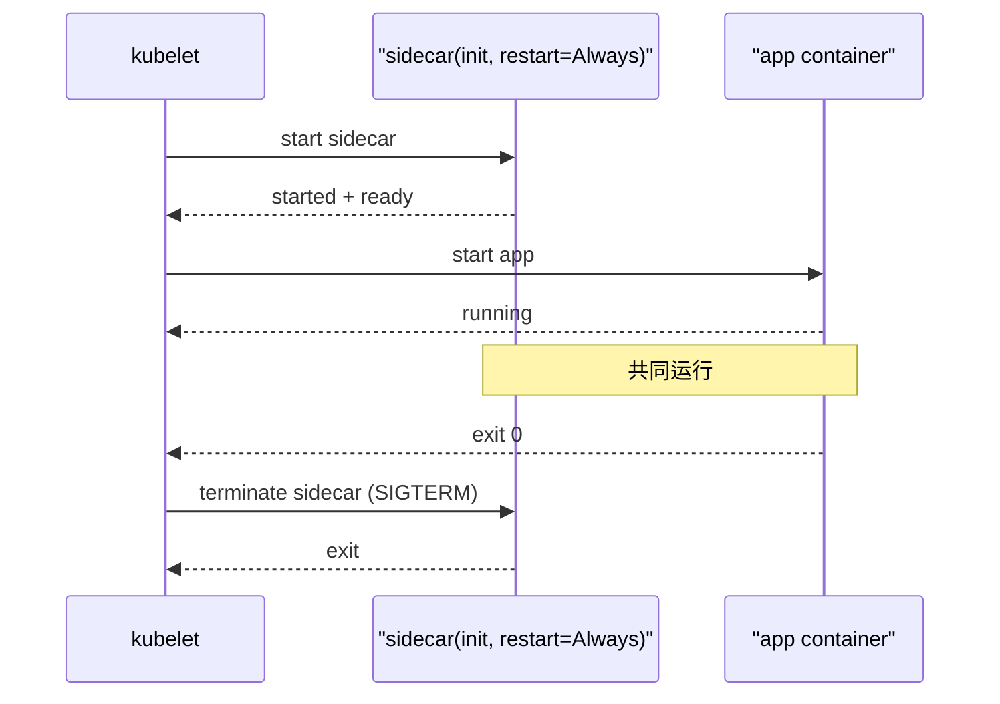
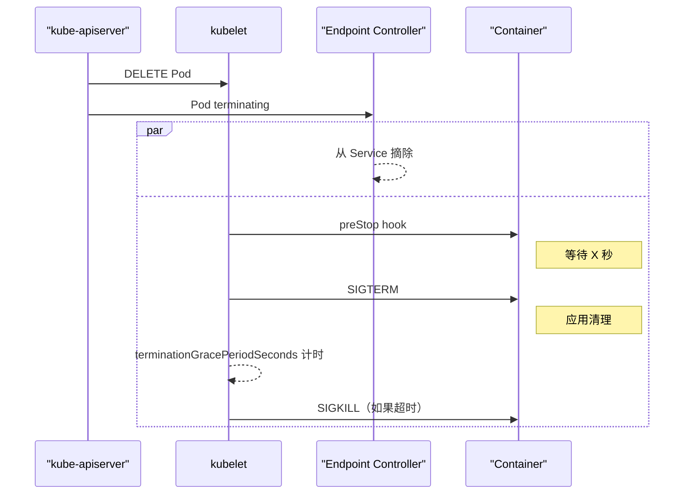
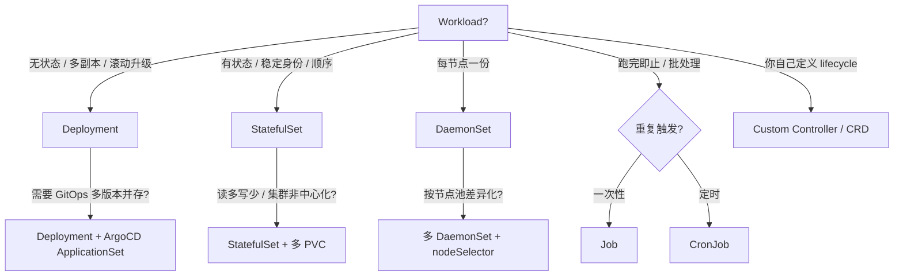

# 精通 Kubernetes 工作负载：Pod、Deployment、StatefulSet、DaemonSet、Job、CronJob

> 课程编号：C02
> 路线图来源：云原生工程 · 模块一 容器与编排基础
> 难度：⭐⭐⭐⭐
> 预计阅读时间：90 分钟
> 内容基准：2026 年 6 月（Kubernetes 1.32 / 1.33）

---

## 引言：声明式 vs 命令式

```bash
# 命令式
docker run -d --name api --restart=always -p 8080:8080 myapp:v1
docker run -d --name worker --restart=always myworker:v1
# 节点挂了？自己重新 ssh 上去拉起来。
```

```yaml
# 声明式
apiVersion: apps/v1
kind: Deployment
metadata: {name: api}
spec:
  replicas: 3
  selector: {matchLabels: {app: api}}
  template:
    metadata: {labels: {app: api}}
    spec:
      containers:
      - name: api
        image: myapp:v1
        ports: [{containerPort: 8080}]
```

两段都跑起来一个 web 服务。差别藏在第三步：节点宕机后会发生什么？

`docker run` 这条命令的本质是"现在做什么"——执行一次，丢给 dockerd，docker 在本节点把容器拉起来。一旦节点不在了，命令也跟着消失。`kind: Deployment` 这份 YAML 写的是"系统应该处于什么状态"——`replicas: 3` 不是"创建 3 个"，是"任意时刻保证有 3 个 Ready Pod"。控制平面像一台永不下班的差值机：观察 `current state`，对比 `desired state`，发现差值就用 controller 抹平。这就是 Kubernetes 的**调和循环（reconciliation loop）**。

声明式不只是语法糖，它把"运维的脑子"搬到了控制平面里。**故障恢复、滚动升级、扩缩容、亲和度调度、PDB 限制、HPA 联动**——所有这些原本要写脚本的事，都变成了"改一份 YAML，让 controller 去算"。

但声明式也有它的坑：你以为改一行 `replicas: 5` 就能马上看到 5 个 Pod，实际上要经过 deployment controller → ReplicaSet → scheduler → kubelet → 容器运行时 → CNI → 容器健康检查这一整条链路，每一步都可能卡住。后端工程师**真正要掌握的不是怎么写 YAML，而是这条链路上每一段在干什么、出问题时去哪看**。本章就把这条链路从 Pod 一路拆到 CronJob。

2026 年 5 月的 K8s 版本基准：

| 版本 | release | 关键能力 |
|---|---|---|
| **1.32** (2024-12) | image volume beta、AppArmor GA | 大规模 1.30 → 1.32 升级潮 |
| **1.33** (2025-04) | sidecar container GA、in-place pod resize beta、PSI metrics、DRA v1beta2、user namespace 持续推进 | 资源调度大跃进 |
| **1.34** (2025-08) | Job pod replacement policy GA、调度优化 | 路线规划 |
| **1.35** (2025-12) | in-place pod resize GA | 长任务资源调整不再重启 |
| **1.36** (2026-04) | 最新稳定版 | — |

本章实战代码基于 1.33；1.32 一致处不再赘述，差异处会标注 `since 1.33`。

---

## 第一章：Pod —— K8s 的最小调度单元

### 1.1 为什么是 Pod 不是容器

K8s 的最小调度单元是 **Pod** 而不是容器。一个 Pod 内可以有多个容器，它们：

- **共享 network namespace**：彼此 `localhost` 互通，端口冲突
- **共享 IPC、UTS namespace**：能 SHM、能用同一个 hostname
- **共享 volume**：emptyDir、configMap 都对所有容器可见
- **不共享 PID namespace**（默认）；显式 `shareProcessNamespace: true` 才共享
- **不共享 mount namespace**：每个容器有自己的根文件系统

这种"多容器一 Pod"的设计是为了 sidecar / init / adapter 这类**进程间紧耦合**的场景。比如：

```yaml
spec:
  containers:
  - name: app
    image: myapp:v1
  - name: logger          # sidecar：抓 app 写到 /var/log 的日志
    image: fluent-bit:3
    volumeMounts:
    - {name: logs, mountPath: /var/log}
  volumes:
  - name: logs
    emptyDir: {}
```

经验法则：**"必须一起调度、一起重启、共享盘"的进程才能放进一个 Pod**。其它情况（比如 web + redis、web + mysql）请用两个独立 Pod + Service 拼起来。

### 1.2 Pod 生命周期：5 个 Phase

Pod 的 `status.phase` 只有 5 个值——它是 Pod 整体状态的"粗粒度摘要"：

```
Pending → Running → Succeeded
              ↘   ↗
                Failed
              Unknown
```

- **Pending**：Pod 已被 API server 接收，但还有容器没启动。可能在等调度（unschedulable）、等镜像拉取（ImagePullBackOff）、等 volume 挂载、等 init container
- **Running**：所有容器已创建，至少一个还在运行（或正在 restart）
- **Succeeded**：所有容器**正常退出（exit 0）且不会再 restart**——仅 Job 类工作负载会到达此态
- **Failed**：所有容器都已终止，至少一个**异常退出**
- **Unknown**：通常因为 kubelet 与 API server 失联

但 phase 太粗，**真正诊断要看 `status.conditions` 和 `status.containerStatuses`**：

```yaml
status:
  phase: Running
  conditions:
  - type: PodScheduled    # 已被调度到节点
    status: "True"
  - type: Initialized      # init container 全部成功
    status: "True"
  - type: ContainersReady  # 所有容器 ready
    status: "True"
  - type: Ready            # = ContainersReady && readinessGates 全通过
    status: "True"
  containerStatuses:
  - name: app
    ready: true
    restartCount: 2
    state:
      running: {startedAt: "..."}
    lastState:
      terminated: {reason: "OOMKilled", exitCode: 137}
```

**故障排查口诀**：

| 现象 | 重点看 |
|---|---|
| Pending | `Events`（kubectl describe）+ `conditions.PodScheduled` |
| Running but not Ready | `readinessProbe` 日志 + `ContainersReady` reason |
| 反复重启 | `containerStatuses.lastState.terminated.reason` |
| Init 卡住 | `initContainerStatuses` + 容器日志 |

```bash
kubectl get pod web-7c9-xyz -o jsonpath='{.status.containerStatuses[*].lastState}' | jq .
```

### 1.3 容器状态：Waiting / Running / Terminated

Pod 是粗粒度，每个容器还有自己的状态机：

```
Waiting       — 正在拉镜像 / 创建容器 / 等 init container / 重启间隔
Running       — 容器已启动
Terminated    — 容器已退出（normal exit / killed / OOMKilled）
```

最常见的 `Waiting.reason`：

- `ContainerCreating`：CRI 正在创建容器
- `ImagePullBackOff`：拉镜像失败正在退避（要确认仓库凭证、镜像 tag）
- `CrashLoopBackOff`：连续 crash，kubelet 按指数退避（10s → 20s → 40s → ... → 5min）
- `CreateContainerConfigError`：configMap/secret 引用错误
- `InvalidImageName`：image 名字非法

`Terminated.reason`：

- `Completed`（exit 0）
- `Error`（exit 非 0）
- `OOMKilled`（exit 137 = 128 + SIGKILL，被 cgroup OOM killer 干掉）
- `ContainerCannotRun`、`DeadlineExceeded`、`Evicted`

### 1.4 Init container —— 在主容器前跑的初始化

```yaml
spec:
  initContainers:
  - name: wait-db
    image: busybox:1.36
    command: ['sh', '-c', 'until nc -z db 5432; do sleep 1; done']
  - name: migrate
    image: myapp/migrator:v1
    command: ['./migrate', 'up']
  containers:
  - name: app
    image: myapp:v1
```

特点：

- **顺序执行**：init container 之间按定义顺序串行；前一个 exit 0 才跑下一个
- **必须成功**：任意 init container 失败 → 整个 Pod 重启（按 restartPolicy）；Pod 处于 `Init:CrashLoopBackOff` 直到成功
- **资源占用一次性**：init container 退出后释放内存；但调度时**取 max(init 每个的 requests, app 容器之和)**——所以 init 起得猛会让 Pod 难调度
- **不参与 readiness**：init 期间整个 Pod `Ready=False`

典型用途：等依赖、做迁移、生成配置、下载 model 文件、IP table 改路由。

### 1.5 Sidecar container —— 1.29 beta，1.33 GA

K8s 1.28 起把"sidecar"做成了一等公民：用 `initContainers[*].restartPolicy: Always` 标记。1.29 beta、**1.33 GA**——这是 2026 年的标准用法。

```yaml
spec:
  initContainers:
  - name: vault-agent
    image: vault:1.18
    restartPolicy: Always    # ← 关键：把它变成 sidecar
    args: [...]
  containers:
  - name: app
    image: myapp:v1
```

**新型 sidecar 与"老式" sidecar（写在 containers 数组里）的差别**：

| 维度 | 老式 sidecar（containers 数组） | 新式 sidecar（initContainers + Always） |
|---|---|---|
| 启动顺序 | 与主容器并发启动；不保证顺序 | 在主容器之前启动并 Ready 后才跑主容器 |
| 关闭顺序 | 没有保证；常见死锁 | 主容器结束后再关闭 sidecar |
| Job 行为 | Sidecar 不退出 → Job 永不 Succeeded（经典坑） | Sidecar 在主容器 exit 后被自动 kill，Job 能完成 |
| Pod restart 策略 | 受 Pod 影响 | 独立 restartPolicy，更可控 |

**这条改动是工作负载层 2024-2026 最重要的变化之一**，下面在 Job 章节还会复用它。



---

## 第二章：容器钩子与探针

### 2.1 PostStart / PreStop —— 两个生命周期钩子

```yaml
containers:
- name: app
  image: myapp:v1
  lifecycle:
    postStart:                  # 容器创建后立刻执行（不阻塞 Running，但会延迟 Ready）
      exec:
        command: ["sh", "-c", "echo ready > /tmp/started"]
    preStop:                    # 收到 SIGTERM 之前执行
      exec:
        command: ["sh", "-c", "nginx -s quit; sleep 15"]
```

**关键事实**：

- **PostStart 与 ENTRYPOINT 并发**——它们没有顺序保证。所以 postStart 里不要假定主进程已起来。
- **PostStart 失败 → 容器被 kill**——可能进入 CrashLoopBackOff。所以 postStart 要 idempotent。
- **PreStop 在 SIGTERM 前执行**，**计入 `terminationGracePeriodSeconds`**（默认 30s）。preStop 用掉 25s + SIGTERM 后只剩 5s，到点 kubelet 发 SIGKILL。

### 2.2 三种 Probe

| Probe | 触发条件 | 失败后果 | 何时启用 |
|---|---|---|---|
| **startupProbe** | 容器启动后开始 | 失败 → 重启容器；成功后停止运行 | 启动慢的服务（JVM、Python ML） |
| **livenessProbe** | startup 通过后持续 | 失败 → kubelet 杀容器并按 restartPolicy 重启 | 防"假活"（死锁、内存泄露） |
| **readinessProbe** | 一直跑 | 失败 → 从 Service Endpoints 摘除（Pod 还在但不收流量） | 暂时不可用（依赖未连、缓存预热） |

```yaml
livenessProbe:
  httpGet:
    path: /healthz
    port: 8080
  initialDelaySeconds: 10
  periodSeconds: 10
  timeoutSeconds: 3
  failureThreshold: 3
  successThreshold: 1

readinessProbe:
  httpGet:
    path: /readyz
    port: 8080
  periodSeconds: 5
  failureThreshold: 2

startupProbe:
  httpGet:
    path: /startup
    port: 8080
  periodSeconds: 10
  failureThreshold: 30        # 5 分钟启动窗口
```

**三个 endpoint 不要混用**：

- `/healthz`（liveness）：进程**还活着**——内部线程没死锁，事件循环还在走。**不要**这里查 DB、查 Redis——否则下游抖一下你的 Pod 集体重启。
- `/readyz`（readiness）：现在**能接流量吗**——下游连接 OK、缓存预热完。**这里**可以查依赖。
- `/startup`（startup）：**初始化完成了吗**——只在启动阶段被探测。

### 2.3 Probe 的四种 handler

```yaml
# 1. HTTP GET （最常用，2xx/3xx 视为成功）
httpGet: {path: /healthz, port: 8080, scheme: HTTP}

# 2. TCP socket （端口能 connect 即成功）
tcpSocket: {port: 5432}

# 3. Exec command （exit 0 成功）
exec:
  command: [pg_isready, -U, postgres]

# 4. gRPC （k8s 1.27+ GA，要求服务实现 grpc health protocol）
grpc:
  port: 9090
  service: ""             # 留空表示整体健康
```

`exec` 是兜底——但每次启动一个进程，**消耗 CPU 远多于 HTTP**。批量集群下能用 HTTP / gRPC 优先。

### 2.4 优雅终止与 preStop —— 一图看清



**经典坑**：endpoint controller 摘除和 SIGTERM 是**并发**的——所以容器可能在还能收新连接的瞬间就被 SIGTERM 了。**所以 preStop 通常先 `sleep 5-10` 给 kube-proxy 同步留时间**：

```yaml
lifecycle:
  preStop:
    exec:
      command: ["sh", "-c", "sleep 10 && ./graceful-shutdown.sh"]
```

`terminationGracePeriodSeconds` 必须**大于** preStop 时间 + 应用清理时间。否则进入 SIGKILL 黑洞。

---

## 第三章：Deployment —— 无状态滚动发布的主力

### 3.1 三层关系：Deployment → ReplicaSet → Pod

```
Deployment（你写的 YAML）
  └── 当前 ReplicaSet（每次模板变更新创建一个 RS）
        └── Pod × replicas
  └── 历史 ReplicaSet（保留 spec.revisionHistoryLimit 个，默认 10）
```

Deployment controller 监听 Deployment，**对比 `.spec.template` 的 hash**，决定是否创建新 ReplicaSet。新 RS 创建后，按策略逐步把旧 RS 缩到 0、新 RS 扩到目标值——这就是滚动升级。

```bash
$ kubectl get deploy api
NAME   READY   UP-TO-DATE   AVAILABLE   AGE
api    3/3     3            3           7d

$ kubectl get rs -l app=api
NAME             DESIRED   CURRENT   READY   AGE
api-7c9d4b8f5    3         3         3       2h     # 当前 RS
api-6f8b2a1e3    0         0         0       1d     # 历史 RS（用于 rollback）
api-5e7a1d0c2    0         0         0       7d
```

### 3.2 RollingUpdate 的两个旋钮：maxSurge / maxUnavailable

```yaml
spec:
  strategy:
    type: RollingUpdate
    rollingUpdate:
      maxSurge: 25%           # 滚动时可超出 replicas 的最大值（数量或百分比）
      maxUnavailable: 25%     # 滚动时可少于 replicas 的最大值
```

举例：`replicas: 4`，`maxSurge: 1`，`maxUnavailable: 0`：

```
初始       4 旧
扩 +1 新   4 旧 + 1 新 (5)
旧 -1      3 旧 + 1 新 (4)        ← 当前可用永远 >= 4 - maxUnavailable = 4
扩 +1 新   3 旧 + 2 新 (5)
...
最终       4 新
```

**关键决策**：

| 场景 | 配置 | 行为 |
|---|---|---|
| 不能掉一个实例（API 高峰） | maxSurge=25%, maxUnavailable=0 | 永远先加再减，最稳但慢 |
| 节点不富裕 | maxSurge=0, maxUnavailable=25% | 永远先减再加，省资源 |
| 资源够 + 想快 | maxSurge=100%, maxUnavailable=0 | 蓝绿式，一次性双倍跑 |
| 必须立刻完成 | type=Recreate | **全部杀掉**再重建——会有停机！ |

### 3.3 Recreate 策略：什么时候用

```yaml
strategy:
  type: Recreate
```

行为：先把所有旧 Pod 杀掉，再把所有新 Pod 拉起来——中间**有停机窗口**。

用途：

- 应用**不支持多版本并存**（schema 不兼容、单写 PVC）
- 单实例服务（开发环境）
- 想强制重启

**生产几乎不用**——你需要的是 StatefulSet 或者 in-place pod resize。

### 3.4 Pause / Resume / Rollback

```bash
# 暂停（不会触发新 RS，多次改完一起放）
kubectl rollout pause deployment/api

# 改改改...
kubectl set image deploy/api app=myapp:v2
kubectl set resources deploy/api -c app --limits=memory=1Gi
kubectl set env deploy/api FOO=bar

# 恢复
kubectl rollout resume deployment/api

# 状态
kubectl rollout status deployment/api

# 历史
kubectl rollout history deployment/api
kubectl rollout history deployment/api --revision=3

# 回滚
kubectl rollout undo deployment/api                 # 回到上一个
kubectl rollout undo deployment/api --to-revision=3
```

`kubectl rollout undo` 的本质是**把 `.spec.template` 改回历史 RS 的 spec**——所以 ReplicaSet 历史就是 rollback 的"后悔药"，`revisionHistoryLimit` 不要设 0。

### 3.5 progressDeadlineSeconds —— 卡住的发布

```yaml
spec:
  progressDeadlineSeconds: 600
```

10 分钟内 ReplicaSet 没有进展（READY 数量没变）→ Deployment 进入 `Progressing=False`，condition `reason=ProgressDeadlineExceeded`。CI/CD 看到这个就**主动报警 + rollback**。

### 3.6 与 HPA 协同

```yaml
apiVersion: autoscaling/v2
kind: HorizontalPodAutoscaler
metadata: {name: api}
spec:
  scaleTargetRef:
    apiVersion: apps/v1
    kind: Deployment
    name: api
  minReplicas: 3
  maxReplicas: 30
  metrics:
  - type: Resource
    resource: {name: cpu, target: {type: Utilization, averageUtilization: 60}}
```

**关键坑：HPA 和 Deployment `replicas` 字段冲突**。当 HPA 接管后，YAML 里写 `replicas: 3` 会被 HPA 反复改回。所以：

- **GitOps 场景**：YAML 里**省略 `replicas` 字段**（K8s 1.31+ 推荐做法，避免 ArgoCD 反复 sync）
- **或者**：在 ArgoCD 里加 `IgnoreDifferences` 忽略 replicas 字段

```yaml
# argocd application
spec:
  ignoreDifferences:
  - group: apps
    kind: Deployment
    jsonPointers:
    - /spec/replicas
```

---

## 第四章：StatefulSet —— 有状态服务的正确姿势

### 4.1 它解决了什么问题

Deployment 的 Pod 名字是随机的（`api-7c9d4b8f5-xyz12`），重启后名字 / IP 都变。Pod 之间**完全等价**——这对 web、API、worker 都很合适。

但下面这些场景 Deployment 救不了：

- 数据库主从集群：每个节点要稳定 ID，主从复制依赖固定的 host
- 分布式存储 / 消息队列：Kafka broker.id、ZooKeeper myid、etcd member、Cassandra seed
- 选主算法：Raft / Paxos 需要稳定成员列表
- 单写 PVC：每个 Pod 绑定独有的盘

**StatefulSet** 提供：

- 稳定的网络标识：`<sts-name>-0`、`<sts-name>-1` ... 这种**有序的可预测名字**
- 稳定的 DNS：`<pod-name>.<service-name>.<ns>.svc.cluster.local`
- 稳定的存储：PVC 绑定到 Pod 名（`data-<sts-name>-0`），删除 Pod 不删 PVC
- **顺序**启停：默认 `0 → 1 → 2 → ...` 启动，`... → 2 → 1 → 0` 停止

### 4.2 完整示例

```yaml
apiVersion: v1
kind: Service
metadata:
  name: cassandra            # ← Headless Service：clusterIP: None
spec:
  clusterIP: None
  selector: {app: cassandra}
  ports: [{port: 9042, name: cql}]
---
apiVersion: apps/v1
kind: StatefulSet
metadata: {name: cassandra}
spec:
  serviceName: cassandra      # ← 必须指向上面的 Headless Service
  replicas: 3
  podManagementPolicy: OrderedReady   # 默认值；Parallel 走并发
  updateStrategy:
    type: RollingUpdate
    rollingUpdate:
      partition: 0
  selector: {matchLabels: {app: cassandra}}
  template:
    metadata: {labels: {app: cassandra}}
    spec:
      terminationGracePeriodSeconds: 1800
      containers:
      - name: cassandra
        image: cassandra:5
        ports: [{name: cql, containerPort: 9042}]
        env:
        - name: POD_NAME
          valueFrom: {fieldRef: {fieldPath: metadata.name}}
        - name: CASSANDRA_SEEDS
          value: "cassandra-0.cassandra,cassandra-1.cassandra"
        volumeMounts:
        - {name: data, mountPath: /var/lib/cassandra}
  volumeClaimTemplates:        # ← 每个 Pod 自动生成独立 PVC
  - metadata: {name: data}
    spec:
      accessModes: [ReadWriteOnce]
      storageClassName: ssd
      resources: {requests: {storage: 200Gi}}
```

启动后能看到：

```bash
$ kubectl get pod -l app=cassandra
NAME           READY   STATUS    RESTARTS   AGE
cassandra-0    1/1     Running   0          5m
cassandra-1    1/1     Running   0          3m
cassandra-2    1/1     Running   0          1m

$ kubectl get pvc
NAME              STATUS   VOLUME       CAPACITY   STORAGECLASS
data-cassandra-0  Bound    pvc-aaa      200Gi      ssd
data-cassandra-1  Bound    pvc-bbb      200Gi      ssd
data-cassandra-2  Bound    pvc-ccc      200Gi      ssd

$ kubectl run dnsutils --image=tutum/dnsutils -it --rm -- bash
$ nslookup cassandra-0.cassandra
Name:    cassandra-0.cassandra.default.svc.cluster.local
Address: 10.244.1.23
```

每个 Pod 都有**稳定 DNS + 稳定 PVC**，重建后 IP 变但**名字与盘不变**——这就是 StatefulSet 的核心契约。

### 4.3 podManagementPolicy：OrderedReady vs Parallel

```yaml
spec:
  podManagementPolicy: Parallel
```

- **OrderedReady（默认）**：严格按 0 → 1 → 2 ... 启动，每个 Pod Ready 后才创建下一个；删除时反过来
- **Parallel**：所有 Pod **并发创建/删除**，但**Pod 名字依然有序**

什么时候用 Parallel？

- 集群规模大（30+ replicas），OrderedReady 启动太慢
- Pod 之间**没有启动依赖**——比如分片存储、独立 worker
- 不需要"主先起，从后起"

**Parallel 不影响存储绑定语义**——每个 Pod 还是有独立 PVC、稳定 DNS。它只是改变了**创建并发度**。

### 4.4 updateStrategy 与 partition

```yaml
updateStrategy:
  type: RollingUpdate
  rollingUpdate:
    partition: 2
    maxUnavailable: 1    # 1.27+ alpha, 1.30+ beta
```

`partition: 2` 表示**只滚动 ordinal >= 2 的 Pod**，前面 0、1 保留旧版本。**金丝雀发布**经典做法：

```bash
# 先滚 partition=N-1，只升 ordinal=N-1 一台
kubectl patch sts cassandra -p '{"spec":{"updateStrategy":{"rollingUpdate":{"partition":2}}}}'
# 观察 cassandra-2 行为
# 没问题再降 partition
kubectl patch sts cassandra -p '{"spec":{"updateStrategy":{"rollingUpdate":{"partition":0}}}}'
```

`OnDelete` 策略：**只有你手动 delete Pod 时**才会用新模板重建——给极度敏感的服务（比如 etcd、ZooKeeper）人工干预的机会。

### 4.5 StatefulSet 与 PVC 的生命周期

```yaml
spec:
  persistentVolumeClaimRetentionPolicy:    # 1.27 beta, 1.32 GA
    whenDeleted: Retain                    # SS 被删除时
    whenScaled: Delete                     # 缩容时
```
**默认行为**：删 StatefulSet 不删 PVC、缩容也不删。生产**通常不改**——但 dev / 测试环境改成 `Delete` 省钱。

---

## 第五章：DaemonSet —— 节点级常驻进程

### 5.1 它解决的问题

"每个节点跑一个" 这种事：

- 日志采集：Fluent Bit、Promtail
- 网络组件：kube-proxy、CNI agent（Cilium、Calico）
- 监控 agent：Node Exporter、cAdvisor
- 存储 agent：CSI node plugin、Longhorn
- 安全 agent：Falco、Tetragon

DaemonSet 保证：**每个节点上有且只有一个匹配的 Pod**。

```yaml
apiVersion: apps/v1
kind: DaemonSet
metadata: {name: node-exporter, namespace: monitoring}
spec:
  selector: {matchLabels: {app: node-exporter}}
  updateStrategy:
    type: RollingUpdate
    rollingUpdate:
      maxUnavailable: 10%
      maxSurge: 0          # DaemonSet 1.25 GA; 同时 RollingUpdate 可以加 maxSurge
  template:
    metadata: {labels: {app: node-exporter}}
    spec:
      hostNetwork: true            # 用宿主机网络栈，监控指标更准
      hostPID: true
      tolerations:                 # 容忍所有污点（master、专用节点）
      - {operator: Exists}
      nodeSelector:                # 只装在 Linux 节点
        kubernetes.io/os: linux
      containers:
      - name: node-exporter
        image: prom/node-exporter:v1.8
        ports: [{containerPort: 9100, hostPort: 9100, name: metrics}]
        resources:
          requests: {cpu: 50m, memory: 64Mi}
          limits:   {memory: 128Mi}
```

### 5.2 节点选择：nodeSelector / Affinity / Tolerations

DaemonSet 想"全节点装"——但你常常需要排除几个：

- **不要装到 master / control-plane**：master 默认有 `node-role.kubernetes.io/control-plane:NoSchedule` 污点
- **专用节点池**：GPU 节点、ARM 节点、Windows 节点

```yaml
# 只在 GPU 节点
nodeSelector:
  hardware: gpu

# 容忍 master 污点（kube-proxy 这种核心组件就要）
tolerations:
- key: node-role.kubernetes.io/control-plane
  operator: Exists
  effect: NoSchedule

# 排除某些节点
affinity:
  nodeAffinity:
    requiredDuringSchedulingIgnoredDuringExecution:
      nodeSelectorTerms:
      - matchExpressions:
        - {key: kubernetes.io/os, operator: In, values: [linux]}
        - {key: dedicated, operator: NotIn, values: [batch]}
```

### 5.3 RollingUpdate vs OnDelete

```yaml
updateStrategy:
  type: RollingUpdate
  rollingUpdate:
    maxUnavailable: 1
    maxSurge: 0          # 1.25 GA
```

- **maxUnavailable=1**：一次只滚一个节点，最稳但慢
- **maxUnavailable=10%**：100 节点的集群一次滚 10 个
- **maxSurge=1**：允许临时 1 个节点上同时存在新旧 Pod（仅当 hostPort / hostNetwork 不冲突时有意义）

OnDelete：人工干预，**节点 reboot 时**才更新（用得很少）。

### 5.4 DaemonSet 的资源开销

DaemonSet **每节点一份**——所以即使每个 Pod 只要 50m CPU、64Mi 内存，1000 节点的集群就是 50 core + 64Gi。**做容量规划时一定算上 DaemonSet 的 N 倍开销**。

```bash
# 查节点上的 DaemonSet Pod
kubectl get pods -A --field-selector=spec.nodeName=<node> \
  -o custom-columns=NS:.metadata.namespace,NAME:.metadata.name,OWNER:.metadata.ownerReferences[0].kind \
  | grep DaemonSet | wc -l
```

一个健康的生产集群每个节点通常有 8-15 个 DaemonSet Pod（CNI、kube-proxy、日志、监控、存储、安全 ...）——这些都是**所有业务 Pod 之前**的固定开销。

---

## 第六章：Job 与 CronJob

### 6.1 Job —— 跑完即止的工作负载

```yaml
apiVersion: batch/v1
kind: Job
metadata: {name: data-import}
spec:
  completions: 1              # 总共要成功多少个 Pod
  parallelism: 1              # 并发跑多少个
  backoffLimit: 6             # 失败重试上限
  activeDeadlineSeconds: 3600 # 整个 Job 的超时墙
  ttlSecondsAfterFinished: 86400  # 完成后 24h 自动清理
  template:
    spec:
      restartPolicy: OnFailure   # OnFailure or Never (Job 不能 Always)
      containers:
      - name: import
        image: myapp/importer:v1
        command: [./import, /data/input.csv]
```

`completions × parallelism` 三种模式：

| 模式 | completions | parallelism | 行为 |
|---|---|---|---|
| 单次任务 | 1 | 1 | 跑 1 个 Pod 直到 success |
| 固定并发批 | N (>1) | M (>=1) | 串行/并发跑共 N 次成功 |
| 工作队列 | nil | M (>=1) | 一直起 M 个并发 Pod，直到第一个 Pod success 后所有 Pod 都停 |

最后一种"工作队列"模式典型用法：每个 Pod 从 Redis / RabbitMQ pull 任务，跑完退出 0；外部队列空了某个 Pod 退出 0 → Job 整体 success。

### 6.2 backoffLimit 与 podFailurePolicy

`backoffLimit: 6`（默认 6）：失败 6 次后 Job 标记为 Failed。**对所有失败一视同仁**——但有时你想区分：

- OOM → 不重试（多跑也一样）
- 应用 panic exit 1 → 重试
- 节点被驱逐 → 应该不算失败次数

**`podFailurePolicy`（1.31 GA）**——精细化的失败处理：

```yaml
spec:
  podFailurePolicy:
    rules:
    - action: FailJob          # 直接判 Job 失败，不重试
      onExitCodes:
        operator: In
        values: [42, 137]      # 137 = OOMKilled
    - action: Ignore           # 不计入 backoffLimit
      onPodConditions:
      - type: DisruptionTarget   # 节点驱逐 / preemption
    - action: Count            # 计入 backoffLimit（默认）
      onExitCodes:
        operator: In
        values: [1]
```

**生产场景**：批处理任务的"幂等失败 → 立即终止"必须配 podFailurePolicy；否则 OOM 一次重试 6 次浪费资源。

### 6.3 Job 与 sidecar —— 1.33 后的解法

Job 的经典坑：

```yaml
# 旧式 sidecar
spec:
  template:
    spec:
      restartPolicy: OnFailure
      containers:
      - name: main
        image: my-batch:v1     # 跑完 exit 0
      - name: log-sidecar
        image: fluent-bit       # 永远不退出
```

`main` 退出后 `log-sidecar` 还在跑——**Job 永远不 Succeeded**。历史解法：在 main 容器结束时主动 kill sidecar，或共享 emptyDir + 文件标记。**全是 workaround**。

**1.33 后正确做法**：把 sidecar 放进 `initContainers` + `restartPolicy: Always`：

```yaml
spec:
  template:
    spec:
      restartPolicy: OnFailure
      initContainers:
      - name: log-sidecar
        image: fluent-bit
        restartPolicy: Always    # 1.33 GA 标记为 sidecar
      containers:
      - name: main
        image: my-batch:v1
```

`main` 退出后 kubelet 自动 SIGTERM `log-sidecar`，Job 正常 Succeeded。**这条改动让 Job 与 service mesh、Vault Agent、日志采集器的组合可用**。

### 6.4 CronJob —— 定时任务

```yaml
apiVersion: batch/v1
kind: CronJob
metadata: {name: nightly-backup}
spec:
  schedule: "0 2 * * *"                    # 每天 2:00 AM
  timeZone: Asia/Shanghai                  # 1.27 GA，否则按 controller 节点时区
  startingDeadlineSeconds: 200             # 错过窗口超过 200s 不再触发
  concurrencyPolicy: Forbid                # Allow / Forbid / Replace
  successfulJobsHistoryLimit: 3
  failedJobsHistoryLimit: 1
  jobTemplate:
    spec:
      backoffLimit: 1
      activeDeadlineSeconds: 3600
      template:
        spec:
          restartPolicy: OnFailure
          containers:
          - name: backup
            image: mybackup:v1
```

`concurrencyPolicy` 选择：

- **Allow（默认）**：上次还没跑完就到下一次——并发跑。**最危险**，备份脚本会重复跑、数据库被压垮
- **Forbid**：上次没跑完，跳过这次
- **Replace**：杀掉上次，跑这次

**绝大多数生产场景用 `Forbid`**。

`timeZone` 的坑：1.27 之前只能按 controller 节点的 TZ，跨时区集群非常坑——升到 1.27+ 后**强制显式声明** `timeZone`。

### 6.5 Indexed Job —— 编号并发任务

```yaml
spec:
  completions: 5
  parallelism: 5
  completionMode: Indexed        # 1.24 GA
  template:
    spec:
      containers:
      - name: worker
        image: shard-worker:v1
        env:
        - name: JOB_COMPLETION_INDEX
          valueFrom:
            fieldRef:
              fieldPath: metadata.annotations['batch.kubernetes.io/job-completion-index']
```

每个 Pod 拿到一个**唯一 index（0..N-1）**——常用于：

- 数据分片处理（按 index 取对应分片）
- 分布式训练（每个 worker 不同 rank）
- 并发测试（每个 client 独立 ID）

Pod 名字也带 index：`myjob-0-xxxxx`、`myjob-1-xxxxx`...

---

## 第七章：Pod 资源 in-place resize（1.33 beta，1.35 GA）

### 7.1 痛点

K8s 长期的设计：**resources.requests / limits 一旦设定，修改就要重建 Pod**。对 stateless 服务无所谓——重建即可；对 stateful、对 GPU、对**长任务 Job**，重建意味着重新加载几十 GB 的内存 / model / 缓存。

### 7.2 1.33 起：in-place 修改（1.33 beta，1.35 GA）

```yaml
apiVersion: v1
kind: Pod
metadata: {name: api}
spec:
  containers:
  - name: app
    image: myapp:v1
    resources:
      requests: {cpu: 100m, memory: 256Mi}
      limits:   {cpu: 500m, memory: 512Mi}
    resizePolicy:                       # 1.27 alpha; 1.33 beta; 1.35 GA
    - {resourceName: cpu,    restartPolicy: NotRequired}
    - {resourceName: memory, restartPolicy: RestartContainer}
```

之后：

```bash
kubectl patch pod api --subresource resize --patch \
  '{"spec":{"containers":[{"name":"app","resources":{"requests":{"cpu":"500m"},"limits":{"cpu":"1"}}}]}}'
```

- **CPU 上调 / 下调**：通常 `NotRequired`——cgroup 直接改值，进程不重启
- **内存上调**：通常 `NotRequired`——cgroup memory limit 直接放大
- **内存下调**：通常 `RestartContainer`——降低内存上限存在 OOM 风险，重启更安全

**status 字段**：

```yaml
status:
  resize: "InProgress"     # 或 "Deferred"、"Infeasible"
  containerStatuses:
  - name: app
    allocatedResources:    # 已分配
      cpu: 500m
    resources:             # 实际生效（可能滞后于 allocatedResources）
      requests: {cpu: 500m}
```

### 7.3 谁会用它

- **VPA**（Vertical Pod Autoscaler）—— 1.33+ 后无需重启 Pod 动态调整（1.35 GA 之后稳定可用）
- **长跑 Job**：跑到一半发现内存不够，临时加点
- **大模型推理服务**：GPU 不能 resize（VRAM 隔离硬限），但 CPU/内存可以

注意：**节点没有这么多资源时 resize 会 Deferred**，Pod 不会被驱逐到别的节点。这是和"删了重建"的本质区别。

---

## 第八章：Pod QoS：Guaranteed / Burstable / BestEffort

### 8.1 三档

K8s 按 Pod 的 `requests / limits` 自动归类，**不让你直接写 qosClass**：

| QoS | 条件 | 行为 |
|---|---|---|
| **Guaranteed** | 所有容器：CPU & memory 的 requests == limits，且都设了 | OOM 时**最后被驱逐**；优先级最高 |
| **Burstable** | 至少有一个容器设了 request 但不等于 limit | 中间档 |
| **BestEffort** | 所有容器都**没设** request/limit | OOM 时**最先被驱逐** |

```yaml
# Guaranteed
resources:
  requests: {cpu: 500m, memory: 1Gi}
  limits:   {cpu: 500m, memory: 1Gi}

# Burstable
resources:
  requests: {cpu: 100m, memory: 256Mi}
  limits:   {cpu: 1,    memory: 1Gi}

# BestEffort
resources: {}    # 啥都不写
```

### 8.2 节点压力下的驱逐顺序

kubelet 检测节点压力（内存、磁盘）时按优先级排队驱逐：

```
1. BestEffort Pod（任意顺序）
2. Burstable Pod 中 memory 使用 > request 的部分（"超额"越多越先死）
3. Guaranteed Pod（最后）
```

### 8.3 实战经验

- **核心服务**（API、网关、数据库）**用 Guaranteed**。但代价是：requests=limits 表示你"申请了" 1G 内存，节点要按 1G 算资源池——不能"超售"
- **批处理 / 后台 worker** 用 Burstable（request 给低，limit 给高）
- **日志收集器、调试容器** 用 BestEffort——节点压力大时先被赶
- **永远不要给生产服务用 BestEffort**——它在 OOM 风暴里第一个死

### 8.4 cpu manager static policy

```yaml
# kubelet 配置
kind: KubeletConfiguration
cpuManagerPolicy: static       # Guaranteed Pod 的整数 CPU 容器独占核
```

`static` 策略下，**Guaranteed 且 CPU 是整数**的容器会绑核——避免和别人抢核。适合低延迟服务（数据库、游戏服）。代价：节点共享 CPU 池缩水。

---

## 第九章：工作负载选型决策树



**经验总览**：

- API、Web、Worker → **Deployment**
- DB、消息队列、共识系统、Redis 集群 → **StatefulSet**
- 日志、监控、CNI、安全 agent → **DaemonSet**
- 批跑、迁移、数据导入 → **Job**
- 备份、清理、报表 → **CronJob**
- 复杂生命周期（你写 controller 编排另一个 controller） → **CRD + Operator**（见 C09）

---

## 第十章：用 Go 操作工作负载

### 10.1 client-go 基础

```go
import (
    metav1 "k8s.io/apimachinery/pkg/apis/meta/v1"
    appsv1 "k8s.io/api/apps/v1"
    corev1 "k8s.io/api/core/v1"
    "k8s.io/client-go/kubernetes"
    "k8s.io/client-go/tools/clientcmd"
    "k8s.io/client-go/rest"
)

func newClient() (*kubernetes.Clientset, error) {
    // 集群外（开发）：~/.kube/config
    cfg, err := clientcmd.BuildConfigFromFlags("", os.Getenv("KUBECONFIG"))
    if err != nil {
        // 集群内（Pod 里）：使用 ServiceAccount
        cfg, err = rest.InClusterConfig()
        if err != nil {
            return nil, err
        }
    }
    return kubernetes.NewForConfig(cfg)
}
```

### 10.2 创建 Deployment

```go
func createDeployment(ctx context.Context, c *kubernetes.Clientset) error {
    replicas := int32(3)
    dep := &appsv1.Deployment{
        ObjectMeta: metav1.ObjectMeta{
            Name:      "api",
            Namespace: "default",
            Labels:    map[string]string{"app": "api"},
        },
        Spec: appsv1.DeploymentSpec{
            Replicas: &replicas,
            Selector: &metav1.LabelSelector{
                MatchLabels: map[string]string{"app": "api"},
            },
            Strategy: appsv1.DeploymentStrategy{
                Type: appsv1.RollingUpdateDeploymentStrategyType,
                RollingUpdate: &appsv1.RollingUpdateDeployment{
                    MaxSurge:       intStrPtr("25%"),
                    MaxUnavailable: intStrPtr("0"),
                },
            },
            Template: corev1.PodTemplateSpec{
                ObjectMeta: metav1.ObjectMeta{
                    Labels: map[string]string{"app": "api"},
                },
                Spec: corev1.PodSpec{
                    Containers: []corev1.Container{{
                        Name:  "app",
                        Image: "myapp:v1",
                        Ports: []corev1.ContainerPort{{ContainerPort: 8080}},
                        Resources: corev1.ResourceRequirements{
                            Requests: corev1.ResourceList{
                                corev1.ResourceCPU:    resource.MustParse("100m"),
                                corev1.ResourceMemory: resource.MustParse("256Mi"),
                            },
                            Limits: corev1.ResourceList{
                                corev1.ResourceCPU:    resource.MustParse("500m"),
                                corev1.ResourceMemory: resource.MustParse("512Mi"),
                            },
                        },
                        LivenessProbe: &corev1.Probe{
                            ProbeHandler: corev1.ProbeHandler{
                                HTTPGet: &corev1.HTTPGetAction{
                                    Path: "/healthz", Port: intstr.FromInt(8080),
                                },
                            },
                            InitialDelaySeconds: 10,
                            PeriodSeconds:       10,
                        },
                    }},
                },
            },
        },
    }
    _, err := c.AppsV1().Deployments("default").Create(ctx, dep, metav1.CreateOptions{})
    return err
}
```

### 10.3 扩缩容

```go
func scaleDeployment(ctx context.Context, c *kubernetes.Clientset, name string, replicas int32) error {
    // 方式一：Scale subresource（推荐，权限粒度小）
    s, err := c.AppsV1().Deployments("default").GetScale(ctx, name, metav1.GetOptions{})
    if err != nil {
        return err
    }
    s.Spec.Replicas = replicas
    _, err = c.AppsV1().Deployments("default").UpdateScale(ctx, name, s, metav1.UpdateOptions{})
    return err
}

// 方式二：Patch（更轻量）
func scaleViaPatch(ctx context.Context, c *kubernetes.Clientset, name string, replicas int32) error {
    patch := fmt.Sprintf(`{"spec":{"replicas":%d}}`, replicas)
    _, err := c.AppsV1().Deployments("default").Patch(
        ctx, name, types.MergePatchType, []byte(patch), metav1.PatchOptions{},
    )
    return err
}
```

### 10.4 滚动重启（rollout restart）

`kubectl rollout restart` 的实现：**给 template 加一个时间戳注解**，触发 controller 检测到模板变化，进而创建新 RS。Go 等价代码：

```go
func rolloutRestart(ctx context.Context, c *kubernetes.Clientset, name string) error {
    patch := fmt.Sprintf(
        `{"spec":{"template":{"metadata":{"annotations":{"kubectl.kubernetes.io/restartedAt":"%s"}}}}}`,
        time.Now().Format(time.RFC3339),
    )
    _, err := c.AppsV1().Deployments("default").Patch(
        ctx, name, types.StrategicMergePatchType, []byte(patch), metav1.PatchOptions{},
    )
    return err
}
```

### 10.5 等待 rollout 完成

```go
func waitRollout(ctx context.Context, c *kubernetes.Clientset, name string, timeout time.Duration) error {
    ctx, cancel := context.WithTimeout(ctx, timeout)
    defer cancel()

    w, err := c.AppsV1().Deployments("default").Watch(ctx, metav1.ListOptions{
        FieldSelector: fmt.Sprintf("metadata.name=%s", name),
    })
    if err != nil {
        return err
    }
    defer w.Stop()

    for ev := range w.ResultChan() {
        d, ok := ev.Object.(*appsv1.Deployment)
        if !ok {
            continue
        }
        if d.Generation <= d.Status.ObservedGeneration &&
            d.Status.UpdatedReplicas == *d.Spec.Replicas &&
            d.Status.AvailableReplicas == *d.Spec.Replicas &&
            d.Status.UnavailableReplicas == 0 {
            return nil
        }
        for _, cond := range d.Status.Conditions {
            if cond.Type == appsv1.DeploymentProgressing &&
                cond.Reason == "ProgressDeadlineExceeded" {
                return fmt.Errorf("rollout %s timed out", name)
            }
        }
    }
    return ctx.Err()
}
```

### 10.6 Informer + Lister —— 高效监听变化

直接 Watch 太底层，生产用 **informer**：本地缓存 + 事件分发，CRD / Operator 标配。

```go
import (
    "k8s.io/client-go/informers"
    "k8s.io/client-go/tools/cache"
)

func watchPods(ctx context.Context, c *kubernetes.Clientset) {
    factory := informers.NewSharedInformerFactory(c, 30*time.Second)
    pi := factory.Core().V1().Pods().Informer()

    pi.AddEventHandler(cache.ResourceEventHandlerFuncs{
        AddFunc: func(obj interface{}) {
            p := obj.(*corev1.Pod)
            log.Printf("Pod ADD: %s/%s phase=%s", p.Namespace, p.Name, p.Status.Phase)
        },
        UpdateFunc: func(old, cur interface{}) {
            oldP, curP := old.(*corev1.Pod), cur.(*corev1.Pod)
            if oldP.Status.Phase != curP.Status.Phase {
                log.Printf("Pod %s phase: %s -> %s",
                    curP.Name, oldP.Status.Phase, curP.Status.Phase)
            }
        },
        DeleteFunc: func(obj interface{}) {
            p := obj.(*corev1.Pod)
            log.Printf("Pod DEL: %s/%s", p.Namespace, p.Name)
        },
    })

    factory.Start(ctx.Done())
    factory.WaitForCacheSync(ctx.Done())
    <-ctx.Done()
}
```

Operator / 自定义控制器都基于 informer + workqueue（见 C09）。

### 10.7 Server-Side Apply —— 推荐的"声明式 patch"

```go
import "k8s.io/apimachinery/pkg/types"

func ssaApply(ctx context.Context, c *kubernetes.Clientset, name string) error {
    dep := &appsv1.Deployment{
        TypeMeta: metav1.TypeMeta{Kind: "Deployment", APIVersion: "apps/v1"},
        ObjectMeta: metav1.ObjectMeta{Name: name, Namespace: "default"},
        Spec: appsv1.DeploymentSpec{ /* ... */ },
    }
    data, _ := json.Marshal(dep)
    _, err := c.AppsV1().Deployments("default").Patch(
        ctx, name,
        types.ApplyPatchType,
        data,
        metav1.PatchOptions{FieldManager: "my-operator", Force: ptr(true)},
    )
    return err
}
```

Server-Side Apply（SSA，1.22 GA）让多个 controller / 工具**同时管同一个对象的不同字段**——谁是哪些字段的 owner 由 server 记账。**生产 controller 强烈推荐用 SSA 替代 Update**。

---

## 第十一章：生产实践

### 11.1 滚动发布的"黄金组合"

```yaml
apiVersion: apps/v1
kind: Deployment
metadata: {name: api}
spec:
  # 不写 replicas（让 HPA 接管）
  revisionHistoryLimit: 5
  progressDeadlineSeconds: 600
  strategy:
    type: RollingUpdate
    rollingUpdate:
      maxSurge: 25%
      maxUnavailable: 0          # ★ 关键：保证可用数永不掉
  template:
    spec:
      terminationGracePeriodSeconds: 60
      containers:
      - name: app
        image: myapp:v1
        lifecycle:
          preStop:
            exec:
              command: ["sh", "-c", "sleep 15 && curl -X POST localhost:8080/shutdown"]
        startupProbe:            # 启动慢就用
          httpGet: {path: /startup, port: 8080}
          periodSeconds: 5
          failureThreshold: 60
        readinessProbe:
          httpGet: {path: /readyz, port: 8080}
          periodSeconds: 5
          failureThreshold: 3
        livenessProbe:
          httpGet: {path: /healthz, port: 8080}
          periodSeconds: 10
          failureThreshold: 3
        resources:
          requests: {cpu: 200m, memory: 512Mi}
          limits:   {cpu: 1,    memory: 1Gi}
---
apiVersion: policy/v1
kind: PodDisruptionBudget          # 永远配 PDB
metadata: {name: api-pdb}
spec:
  minAvailable: 2
  selector: {matchLabels: {app: api}}
```

要点：

- **maxUnavailable: 0** 配合 **PDB**——节点维护 / cluster autoscaler 也保不抖
- **revisionHistoryLimit: 5**——回滚要的历史够用，又不堆垃圾
- **preStop sleep 15** + **terminationGracePeriodSeconds: 60**——给负载均衡器、kube-proxy 抹除时间
- **startup + ready + live 三探针分工明确**

### 11.2 PodDisruptionBudget（PDB）

PDB 限制**自愿驱逐**（drain、HPA 缩容、evict）下可同时被中断的 Pod 数量。**对节点宕机这种非自愿驱逐无效**——但能挡住 cluster autoscaler、节点维护。

```yaml
apiVersion: policy/v1
kind: PodDisruptionBudget
metadata: {name: api}
spec:
  minAvailable: 50%       # 或固定 minAvailable: 3
  # maxUnavailable: 1     # 二选一
  selector: {matchLabels: {app: api}}
```

**经验**：

- replicas=3 的服务 → `minAvailable: 2` 或 `maxUnavailable: 1`
- replicas=10+ → `maxUnavailable: 25%`
- **PDB 太严**会让节点 drain 卡死。例如 1 replica + minAvailable=1 → 这个 Pod 永远 drain 不掉

### 11.3 Graceful shutdown 的实战范本

Go HTTP server 收到 SIGTERM 后：

```go
package main

import (
    "context"
    "errors"
    "log"
    "net/http"
    "os"
    "os/signal"
    "sync/atomic"
    "syscall"
    "time"
)

func main() {
    var ready atomic.Bool

    mux := http.NewServeMux()
    mux.HandleFunc("/healthz", func(w http.ResponseWriter, r *http.Request) {
        w.WriteHeader(200)
    })
    mux.HandleFunc("/readyz", func(w http.ResponseWriter, r *http.Request) {
        if ready.Load() {
            w.WriteHeader(200); return
        }
        w.WriteHeader(503)
    })
    mux.HandleFunc("/", handleBusiness)

    srv := &http.Server{Addr: ":8080", Handler: mux}

    go func() {
        // 模拟启动准备（连 DB / 预热缓存）
        time.Sleep(2 * time.Second)
        ready.Store(true)
        log.Println("ready")
        if err := srv.ListenAndServe(); err != nil && !errors.Is(err, http.ErrServerClosed) {
            log.Fatalf("server error: %v", err)
        }
    }()

    // 等 SIGTERM / SIGINT
    sigCh := make(chan os.Signal, 1)
    signal.Notify(sigCh, syscall.SIGTERM, syscall.SIGINT)
    <-sigCh
    log.Println("SIGTERM received, draining...")

    // 1. 标记 not ready —— Service / Ingress 摘除流量
    ready.Store(false)

    // 2. 等一段时间让上游 LB 同步（与 preStop sleep 重叠）
    time.Sleep(5 * time.Second)

    // 3. Shutdown，等已有请求处理完
    ctx, cancel := context.WithTimeout(context.Background(), 30*time.Second)
    defer cancel()
    if err := srv.Shutdown(ctx); err != nil {
        log.Printf("shutdown error: %v", err)
    }
    log.Println("bye")
}
```

配合 YAML 里的 preStop + `terminationGracePeriodSeconds: 60`：

```
0s  | preStop 启动 sleep 15 + curl /shutdown
0s  | kubelet 在 endpoint 摘除（与 preStop 并发）
15s | preStop 退出，kubelet 发 SIGTERM
15s | 应用 ready = false，进入 5s sleep
20s | srv.Shutdown 等已有请求
30s | 剩余请求处理完，进程退出
```

**总耗时 ≈ 30 秒，但用户没看到 5xx**。

### 11.4 滚动期不掉链子的 5 条铁律

1. **`maxUnavailable: 0`**——永远只加不减
2. **`PDB`**——挡 drain、自愿驱逐
3. **`readinessProbe` 准确**——别让"还没好"的 Pod 进 endpoints
4. **`preStop sleep`**——给 endpoint 同步留时间
5. **`terminationGracePeriodSeconds`** > preStop + 应用 shutdown 总时间

### 11.5 StatefulSet 的运维要点

- **滚动升级前先备份**——状态服务的回滚通常不可逆（数据格式可能改了）
- **partition 灰度**——先升 ordinal=N-1 一台，跑一天再降 partition
- **`podManagementPolicy: Parallel`** 慎用——只有 Pod 间无启动依赖时
- **headless Service 必须**——没有它 Pod DNS 不工作
- **`persistentVolumeClaimRetentionPolicy.whenDeleted: Retain`** 防误删

### 11.6 Job 的反模式 & 正例

```yaml
# ❌ 反模式 1：没有 backoffLimit / activeDeadlineSeconds
spec:
  template: {spec: {containers: [{name: x, image: x, command: [./infinite-loop.sh]}]}}

# ❌ 反模式 2：用 Always restartPolicy（Job 不支持）
spec:
  template: {spec: {restartPolicy: Always, containers: [...]}}

# ❌ 反模式 3：旧式 sidecar（永远不退出，Job 永不 Succeeded）
spec:
  template:
    spec:
      restartPolicy: Never
      containers:
      - {name: main, image: main}
      - {name: logger, image: fluent-bit}    # ← 灾难

# ✅ 正例
spec:
  backoffLimit: 3
  activeDeadlineSeconds: 3600
  ttlSecondsAfterFinished: 86400
  podFailurePolicy:
    rules:
    - {action: FailJob, onExitCodes: {operator: In, values: [42, 137]}}
  template:
    spec:
      restartPolicy: OnFailure
      initContainers:
      - {name: logger, image: fluent-bit, restartPolicy: Always}   # 新式 sidecar
      containers:
      - {name: main, image: main}
```

---

## 第十二章：陷阱清单

### 1. Job 用了 `restartPolicy: Always`

Job/CronJob 的 Pod 只支持 `OnFailure` 或 `Never`——API 直接 reject。

### 2. Job 永远不 Succeeded（旧式 sidecar）

经典坑——`logger` 永远不退出，Job 永远不结束。**用新式 sidecar（`initContainers + restartPolicy: Always`，1.33 GA）**。

### 3. StatefulSet 没配 Headless Service

```yaml
spec:
  serviceName: my-svc        # 必须，没这个 DNS `<pod>.<svc>` 不工作
```

而且 `my-svc` 必须是 **`clusterIP: None`**（Headless）——否则 Pod 解析的是 Service 的 ClusterIP 而不是 Pod IP。

### 4. preStop 比 terminationGracePeriodSeconds 还长

```yaml
lifecycle:
  preStop:
    exec: {command: ["sleep", "120"]}
terminationGracePeriodSeconds: 30
```

preStop 用满 30s 还没结束 → SIGKILL。**`grace > preStop + shutdown` 永远成立**。

### 5. readinessProbe 写了"我能不能干活"，liveness 也写一样

readiness 检 DB 连接 → DB 抖一下，所有 Pod 摘流量；如果 liveness 也检 DB → 直接重启全部 Pod，**雪崩**。**liveness 只查"我自己活着没"**。

### 6. Deployment 改了 replicas 但有 HPA

YAML 里 `replicas: 5`，HPA 算出来要 20——controller 改回 20；下次 ArgoCD sync 又改回 5——**振荡循环**。**YAML 里省略 replicas 或在 ArgoCD ignoreDifferences**。

### 7. CronJob 没设 timeZone

1.27 前用 controller 节点的时区——跨时区集群非常坑。**显式 `timeZone: Asia/Shanghai`**。

### 8. CronJob 用了默认 `concurrencyPolicy: Allow`

数据库备份任务上次没跑完，下次又起一份——**并发跑 → 死锁 / 重复写**。**默认改成 `Forbid`**。

### 9. Init container 资源太大让 Pod 无法调度

K8s 调度器对 Pod 资源要求取 **max(每个 init 的 requests, 所有 main 容器 requests 之和)**。一个 init 申请 64 GB 内存——整个 Pod 调度都被卡住。

### 10. DaemonSet 忘了 tolerations，关键节点上没装

要装到 master / 专用节点上的 DaemonSet（CNI、kube-proxy、node-exporter）**必须显式容忍污点**。

### 11. PDB 设太严，节点永远 drain 不掉

`replicas: 1 + minAvailable: 1` → drain 这个 Pod 所在节点会永远 hang。**单副本服务不要配死板 PDB**。

### 12. terminationGracePeriodSeconds 设很大但应用收到 SIGTERM 不动作

SIGTERM 被 PID=1 的 entrypoint 吃了（典型：bash 包了一层 ENTRYPOINT），主进程没收到——白等 60 秒最终 SIGKILL。**用 tini / dumb-init 做 PID=1，或者直接 exec 主进程**。

### 13. StatefulSet 滚动重启时数据不一致

部分 Pod 升到新版本，部分还是旧版本——schema 不兼容时就乱了。**严格按 partition 灰度，先备份**。

### 14. 直接 `kubectl delete pod` 来"重启"业务

会删除 Pod 但 controller 会立刻拉一个新的。如果是 StatefulSet，Pod 名相同 PVC 也相同——表象 OK；但 Deployment 下新 Pod 名字会变，**慎用脚本依赖 Pod 名**。

### 15. CronJob 跑成"幽灵任务"

某次任务因为节点压力被卡 5 分钟，下一次又起——concurrencyPolicy=Allow 时跑了一堆同时执行的进程。**Allow 极少正确，请 Forbid 或 Replace**。

### 16. 用 `kubectl scale deploy/foo --replicas=0` 来"暂停"服务

这个会触发 ReplicaSet 缩到 0，但 Deployment 还在——HPA 一旦看到 metrics 又会扩。更优雅的方法：`kubectl rollout pause` 或直接删除 Deployment。

### 17. liveness probe `failureThreshold: 1`

一次失败立刻重启——网络抖动 / GC 暂停就重启。**至少 3 次失败再重启**。

### 18. resource limits 和 requests 差距过大

`requests: 100m / limits: 4`——好处是"突发可用"；坏处是**节点超售严重**，节点 CPU throttling 时所有 burst 任务都受影响。**Guaranteed > Burstable**（除非你确实是低优先级任务）。

---

## 第十三章：2026 现状

### 13.1 K8s 1.32 / 1.33 / 1.35 关键变化（工作负载相关）

| KEP | 状态 | 影响 |
|---|---|---|
| KEP-753 Sidecar Container | **1.33 GA** | 新式 sidecar 全面铺开 |
| KEP-1287 In-place Pod Resize | **1.33 beta，1.35 GA** | VPA / 长任务 / 大模型受益 |
| KEP-3329 PodFailurePolicy | **1.31 GA** | Job 精细化失败处理 |
| KEP-3676 PSI Metrics | **1.33 beta** | Pod 级别 PSI / 压力监控 |
| KEP-3902 PVC Retention for StatefulSet | **1.32 GA** | 不再担心缩容/删除丢盘 |
| KEP-3962 Mutable CSI Node Allocatable | **1.33 beta** | 节点存储动态调整 |
| KEP-4205 PodLifecycleSleepAction | **1.32 GA** | preStop 可以直接写 sleep 而不用 sh |
| KEP-3939 Pod Replacement Policy for Jobs | **1.34 GA** | Job 重启行为可配置 |

### 13.2 preStop 的 sleep action

1.32 GA 起：

```yaml
lifecycle:
  preStop:
    sleep:
      seconds: 15      # 不用再 ["sh", "-c", "sleep 15"]
```

镜像里没有 `sh` 也能用——尤其 distroless / scratch 镜像受益。

### 13.3 工作负载生态：还要看的几个东西

- **Argo Rollouts**：金丝雀 / 蓝绿 / 流量切分细粒度发布——比原生 Deployment 强很多
- **KEDA**：事件驱动伸缩（Kafka lag、SQS 长度、Redis stream 深度）——HPA 之外的伸缩源
- **Knative Serving**：scale-to-zero 的 Pod（serverless 模式）
- **VPA**：纵向伸缩——1.33 后配合 in-place resize 不再重启 Pod
- **Karpenter**：节点伸缩——和 HPA 联动是 2026 主流
- **Volcano / Kueue**：批处理调度——比原生 Job 更适合 ML / HPC 场景

### 13.4 工作负载的未来

1. **更精细的 Pod 资源动态化**——in-place resize、DRA 设备分配、PSI 自适应
2. **跨集群工作负载**——Karmada、ClusterAPI、KubeFed v2 都在朝着"一个 Deployment 跨多集群"演化
3. **批处理标准化**——Kueue 是 K8s 官方的 batch scheduling 旗手，2025-2026 进入主流
4. **WASM 工作负载**——containerd shim + WASM 让"用 wasm 跑 Pod"逐渐实用化，弹性更好

### 13.5 选型经验更新（2026）

- **API / web** → Deployment + HPA + PDB + 优雅终止（这是默认选择，绝大多数情况）
- **状态服务（DB / MQ / 缓存）** → 优先用云厂商托管；自建则 StatefulSet + 严格灰度
- **AI / ML 推理** → Deployment + GPU 资源 + in-place resize（1.33 beta / 1.35 GA）+ KEDA
- **训练任务** → Volcano 或 Kueue 的 Job + Indexed completion
- **数据管道** → Argo Workflows（CronJob 太弱）或 Tekton

---

## 第十四章：练习题

**练习 1**：你有一个数据导入 Job，每次跑 30 分钟，希望失败时重试 3 次；当遇到 exit code 42（数据格式不对）时不重试。写出 Job YAML。

**练习 2**：解释为什么 `kubectl rollout restart` 这条命令并没有真的"重启" Pod。它做了什么？

**练习 3**：Service `myapi`、Deployment `myapi` 3 副本。kubectl drain 一个节点，其中一个 Pod 在被驱逐时收到了 SIGTERM。在 SIGTERM 与新 Pod 起好之间，**用户的请求会不会落到这个正在死的 Pod 上**？如何避免？

**练习 4**：StatefulSet `mysql` 5 副本，从 v5 升到 v6。如何只升级 `mysql-4` 一个 Pod 做灰度？如何确认它生效一周后再继续滚？

**练习 5**：写一个 Go 程序，定时（每 5 秒）检查 `default` 命名空间下所有 Deployment 的 `ReadyReplicas != Spec.Replicas` 的，输出诊断信息。

**练习 6**：Pod A 配置 `requests: {cpu: 500m, memory: 1Gi}, limits: {cpu: 500m, memory: 1Gi}`；Pod B 配置 `requests: {cpu: 100m}, limits: {cpu: 1, memory: 2Gi}`；Pod C `resources: {}`。
- 三者各属于哪个 QoS？
- 节点内存压力时，驱逐顺序？
- 各自 OOM 风险评估？

**练习 7**：CronJob 备份任务每天 2:00 跑，跑 2 小时。但因为节点压力上次的还在跑，下一次又起了一份——结果两份并发跑写入同一个备份目录数据冲突。如何修这个问题？写出修复后的 YAML 关键字段。

**练习 8**：DaemonSet `cilium-agent` 配置了 `tolerations: [{operator: Exists}]`、`nodeSelector: {kubernetes.io/os: linux}`。新加入一台 Windows 节点后，DaemonSet 没在它上面装上。是否符合预期？如果想装在 Windows 节点上要改什么？

**练习 9**：分析下面这个 Pod 的设计错在哪：

```yaml
spec:
  restartPolicy: Always
  containers:
  - name: app
    image: myapp:v1
    livenessProbe:
      httpGet: {path: /healthz, port: 8080}
      initialDelaySeconds: 0
      periodSeconds: 5
      failureThreshold: 1
      timeoutSeconds: 1
    readinessProbe:
      httpGet: {path: /healthz, port: 8080}   # ← 和 liveness 同 path
    lifecycle:
      preStop: {exec: {command: ["sleep", "60"]}}
  terminationGracePeriodSeconds: 30
```

至少找出 3 处问题。

**练习 10**：你想把一个长期运行的 Pod 的 CPU limit 从 `500m` 调到 `2`。1.32 之前怎么做？1.33 之后呢？两种方法对内存中的状态（比如 80GB 缓存）影响有什么差别？
<details>
<summary>📝 参考答案</summary>

1. ```yaml
   apiVersion: batch/v1
   kind: Job
   spec:
     backoffLimit: 3
     activeDeadlineSeconds: 3600
     podFailurePolicy:
       rules:
       - action: FailJob   # 命中 42 立即放弃，不计入 backoff
         onExitCodes: {operator: In, values: [42]}
   ```
2. `kubectl rollout restart` 只是给 Deployment 的 PodTemplate 加一个 annotation（`kubectl.kubernetes.io/restartedAt`），改变 template hash → 触发 ReplicaSet 滚动，新 Pod 替代旧 Pod。**没有"重启"现有 Pod**。
3. **会**——Pod 还在 endpoints 里时收到的请求会落到正在死的 Pod 上。修法：① `preStop` 加 `sleep 10`，给 endpoint controller 时间移除该 Pod；② Service `publishNotReadyAddresses: false`；③ 应用层先 fail readiness probe（让 controller 摘流量）再开始 shutdown。
4. **`partition`**：StatefulSet 滚动用 `spec.updateStrategy.rollingUpdate.partition: 4` → 只有序号 ≥ 4 的 Pod（即 mysql-4）会用新版本；一周后逐步 partition: 3 → 2 → 1 → 0 完成滚动。
5. ```go
   // 伪代码
   for {
     deps, _ := clientset.AppsV1().Deployments("default").List(ctx, metav1.ListOptions{})
     for _, d := range deps.Items {
       if d.Status.ReadyReplicas != *d.Spec.Replicas {
         fmt.Printf("[!] %s: ready=%d desired=%d\n", d.Name, d.Status.ReadyReplicas, *d.Spec.Replicas)
       }
     }
     time.Sleep(5 * time.Second)
   }
   ```
6. **A**=Guaranteed（req=limit 且都有）；**B**=Burstable（有 req 但 ≠ limit）；**C**=BestEffort（什么都没设）。驱逐顺序 C → B → A。OOM 风险：C 最高（节点压力时第一波被杀）；B 中等（自身可能超 limit 被杀）；A 最低但触碰 limit 立即被 OOMKill。
7. ```yaml
   spec:
     concurrencyPolicy: Forbid   # 上次还没跑完就不再起新的
     startingDeadlineSeconds: 200
     successfulJobsHistoryLimit: 3
     failedJobsHistoryLimit: 3
   ```
   或在备份脚本本身加文件锁（flock）。
8. **符合预期**——`nodeSelector: {kubernetes.io/os: linux}` 显式排除了 Windows。要装到 Windows 节点：去掉 nodeSelector（或加 `kubernetes.io/os: windows` 的副本），并用对应 Windows 镜像。
9. ① **`initialDelaySeconds: 0`**：应用还没起 livenessProbe 就开始查，必报失败 → CrashLoopBackOff。改 30+ 或加 startupProbe。② **`failureThreshold: 1`**：一次 hiccup 就 kill，太脆。改 3-5。③ **liveness / readiness 同 path**：失败时 liveness 触发 kill 而不是仅摘流量。给 readiness 单独 `/ready` endpoint。④ **`preStop: sleep 60` 但 grace 30s**：preStop 还没跑完就 SIGKILL。把 grace 提到 90+。
10. 1.32 之前：必须**重建 Pod**（改 limits 触发 Pod 重启）→ 80GB 缓存丢光，要重新预热几小时。1.33 起 (beta) / 1.35+ (GA) 用 **In-place Pod Vertical Scaling**：`kubectl edit pod` 改 `resources.limits.cpu` → kubelet 通过 CRI 修改 cgroup，**Pod 不重启**、内存状态完全保留。这是有状态服务运维的大改进。

</details>

---

## 结语

工作负载是 K8s 的"骨架"——Pod、Deployment、StatefulSet、DaemonSet、Job、CronJob 这 6 类对象覆盖了 99% 的部署场景。但**真正决定生产稳定性**的，不是写得对不对，而是这一整套**生命周期 + 探针 + 优雅终止 + 滚动策略 + PDB + QoS** 的协调度——任意一环松了，发布就是一场惊魂。

记住核心两件事：

1. **声明 = 状态而非命令**——controller 永远在帮你 reconcile，不要试图绕过去用 imperative 方式干活
2. **节点 / Pod / 容器三个生命周期的边界**——drain、SIGTERM、preStop、readiness 摘除、endpoint 同步是有时序约束的，一处错位就是一场 5xx

下一章 [C03 — 精通 K8s 网络与 Service](./C03-精通-K8s-网络与-Service.md) 进入网络层，把"Service / Endpoint / kube-proxy / CNI / CoreDNS"这条数据平面拆开看。
