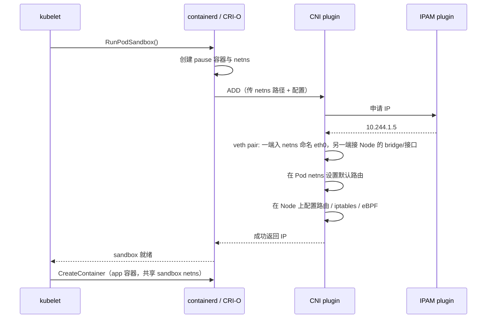
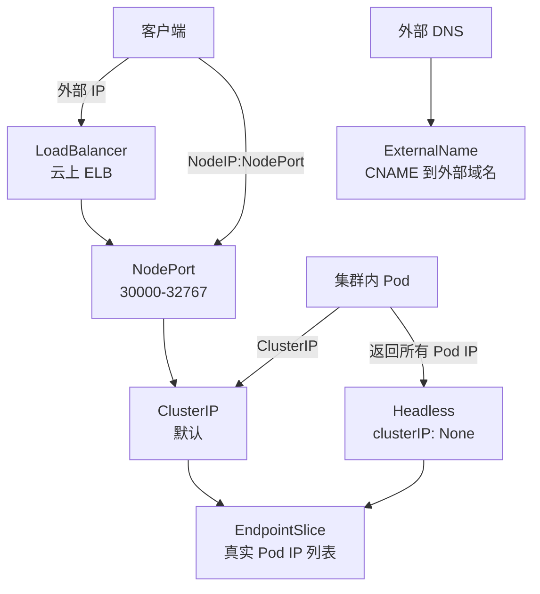
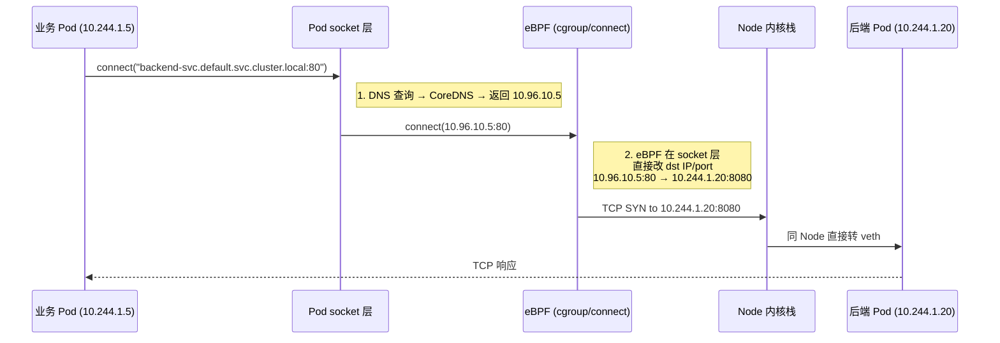
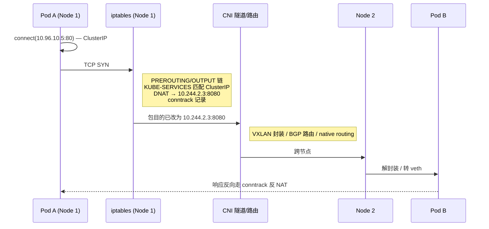
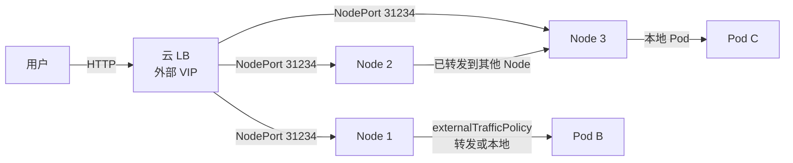

# 精通 K8s 网络与 Service：CNI、kube-proxy、CoreDNS 与 NetworkPolicy

> 课程编号：C03
> 路线图来源：云原生 / Kubernetes 工程 · 模块一 容器与编排基础
> 难度：⭐⭐⭐⭐
> 预计阅读时间：75 分钟
> 内容基准：2026 年 5 月（Kubernetes 1.32 / 1.33 · EndpointSlice 默认 · Topology Aware Routing GA · Gateway API v1 · Cilium 1.16+）

---

## 引言：K8s 网络的"四类问题"

很多人学 Kubernetes 网络栽在同一处：把它当一个整体看。其实，K8s 网络是**四类完全独立的问题**叠在一起：

```
┌─────────────────────────────────────────────────────────┐
│ ① Pod 间通信（任何 Pod 可以直接用 IP 访问任意 Pod）        │  ← CNI 负责
├─────────────────────────────────────────────────────────┤
│ ② Pod ↔ Service（虚拟 IP / 名字到 Pod 的负载均衡）         │  ← kube-proxy + CoreDNS
├─────────────────────────────────────────────────────────┤
│ ③ 外部 → 集群（南北向入站）                                │  ← Ingress / Gateway / LB
├─────────────────────────────────────────────────────────┤
│ ④ 集群 → 外部（出站）                                      │  ← SNAT / Egress Gateway
└─────────────────────────────────────────────────────────┘
```

这四类问题对应着 K8s 的"网络模型契约"——任何符合 [Kubernetes Network Model](https://kubernetes.io/docs/concepts/services-networking/) 的实现，都必须满足：

1. **Pod 之间不经 NAT 直接互通**（无论同 Node 还是跨 Node）
2. **节点上的 agent（如 kubelet）可以直接和 Pod 通信**
3. **Pod 看到的自己 IP，与外部看到的一致**

满足这三条的实现方式有 N 种——overlay、underlay、BGP、VXLAN、Geneve、eBPF——这就是 **CNI** 百花齐放的原因。

这一章我们把四类问题逐一拆开，最终能回答这种"全链路"问题：

> 用户在浏览器输入 `https://api.example.com/users/42`，请求到达节点 192.0.2.10 上的 nginx Pod，nginx 通过 `backend-svc.default.svc.cluster.local` 转发到后端 Pod，后端 Pod 又访问外部数据库 `db.rds.aliyuncs.com`。**每一步具体走的是哪条路径？**

读完本章，你应该能闭眼把这条路径画出来。

---

## 第一章：Pod 网络模型与 CNI

### 1.1 Pod 网络的"扁平"假设

K8s 的根本设计：**每个 Pod 一个独立 IP，整个集群处于一个扁平的二层/三层网络**。

```
Node A: 192.168.1.10                Node B: 192.168.1.11
├── Pod a1: 10.244.1.5              ├── Pod b1: 10.244.2.3
├── Pod a2: 10.244.1.6              ├── Pod b2: 10.244.2.4
└── Pod a3: 10.244.1.7              └── Pod b3: 10.244.2.5

10.244.1.5 ←→ 10.244.2.3 直接通，不经 NAT
```

这与传统虚拟机 / Docker 默认 bridge 模式（每个容器在 NAT 后面）截然不同。**扁平网络是 K8s 的根本契约**。

### 1.2 一个 Pod 内的"沙盒"

```
Pod
├── pause 容器（infrastructure container）  ← 拥有 network namespace
├── app 容器                                ← 共享 pause 的 netns
└── sidecar 容器                            ← 共享 pause 的 netns
```

`pause` 容器（也叫 sandbox container）专门负责持有 network namespace 和 IPC namespace。**Pod 内所有容器共享这套 ns**——所以同 Pod 容器之间可以 `127.0.0.1` 互访（包括端口共享，不能同时占同一端口）。

containerd 2.x 引入了**沙盒 API**（CRI v1），让 sandbox 的概念更显式。

### 1.3 CNI 是什么

**CNI（Container Network Interface）** 是 CNCF 的容器网络规范。它定义了一个简单的接口：

```bash
# kubelet 拉起 Pod 时，调用 CNI 插件：
CNI_COMMAND=ADD CNI_CONTAINERID=xxx CNI_NETNS=/var/run/netns/xxx \
  CNI_IFNAME=eth0 CNI_PATH=/opt/cni/bin /opt/cni/bin/calico < /etc/cni/net.d/10-calico.conf

# Pod 删除时：
CNI_COMMAND=DEL ...
```

CNI 插件做三件事：

1. **IPAM**（IP Address Management）：给这个 Pod 分配一个 IP
2. **接口连接**：在 Pod 的 netns 里创建一张网卡（通常 veth pair），把 Pod 接入网络
3. **路由 / 策略**：配置好让流量能去到该去的地方（Node 内、跨 Node、出集群）

CNI 插件实际是个独立二进制——kubelet 通过 fork+exec 调用它，传 JSON 配置和环境变量。规范见 [containernetworking/cni](https://github.com/containernetworking/cni/blob/main/SPEC.md)。

### 1.4 一个 Pod 启动时网络的真实流程



理解这条流程的好处：**Pod 网络问题首先排查 CNI 日志**。如果 CNI ADD 失败，Pod 会一直 `ContainerCreating`。

### 1.5 NetworkPolicy 与 CNI 的关系

K8s 的 `NetworkPolicy` 资源只是个**声明**——具体执行由 CNI 实现。所以：

- 用 **flannel**（裸 flannel 不支持 NetworkPolicy）→ NetworkPolicy 写了也没用
- 用 **Calico / Cilium / Antrea / Weave** → NetworkPolicy 生效

这是新手最常踩的坑：写了 NetworkPolicy，部署到集群里发现"没效果"——根本原因是 CNI 不支持。

---

## 第二章：主流 CNI 全景对比（2026）

### 2.1 四大主流

| CNI | 数据平面 | 典型部署 | 特长 |
|---|---|---|---|
| **Calico** | iptables / eBPF（可选） | 自建 / 公有云 | 成熟、BGP、丰富 NetworkPolicy |
| **Cilium** | eBPF | 自建 / EKS / GKE Dataplane V2 | eBPF、kube-proxy 替代、Hubble 可观测、Service Mesh |
| **flannel** | VXLAN / host-gw | 中小集群 | 简单、稳定，但**无 NetworkPolicy** |
| **Antrea** | OVS（Open vSwitch） | VMware Tanzu 系 | 企业级、OVS 生态、可视化好 |

### 2.2 Calico

**架构**：

```
┌── Node A ─────────────────────┐
│  ┌─────────┐   ┌────────────┐ │
│  │  Pod    │   │  felix     │ │  ← 每节点 agent
│  │ 10.1.1.5│   │  iptables  │ │     根据 etcd/k8s 同步规则
│  └────┬────┘   │  routes    │ │
│       │ veth   │  policy    │ │
│  ┌────▼────┐   └────────────┘ │
│  │ tunl0/  │       ▲          │
│  │ eth0    │   bird ←─── BGP ─┼─→ 其他 Node 的 felix
│  └─────────┘                  │
└───────────────────────────────┘
```

特点：

- **BGP 路由**：节点间通过 BGP 交换路由（无 overlay 时 = "native routing"）
- **IPIP / VXLAN**：跨子网 / 公有云不能跑 BGP 时用 overlay
- **iptables 模式**（默认）：成熟稳定，规则量大时性能下降
- **eBPF 模式**（可选）：替代 kube-proxy；性能更好，但运维门槛上来
- **NetworkPolicy**：原生 + 扩展（GlobalNetworkPolicy 跨命名空间）

**典型 conf**（`/etc/cni/net.d/10-calico.conflist`）：

```json
{
  "name": "k8s-pod-network",
  "cniVersion": "0.4.0",
  "plugins": [
    {
      "type": "calico",
      "datastore_type": "kubernetes",
      "ipam": {"type": "calico-ipam"},
      "policy": {"type": "k8s"},
      "kubernetes": {"kubeconfig": "/etc/cni/net.d/calico-kubeconfig"}
    },
    {
      "type": "portmap",
      "snat": true,
      "capabilities": {"portMappings": true}
    }
  ]
}
```

### 2.3 Cilium（eBPF 派旗舰）

**架构**：

```
┌── Node A ──────────────────────────┐
│  ┌─────────┐                       │
│  │  Pod    │ <── eth0 (veth)       │
│  └─────────┘                       │
│      ▲                             │
│      │ eBPF 程序挂在 veth、tc、     │
│      │   socket、cgroup 等 hook 点  │
│      ▼                             │
│  ┌───────────────────────────────┐ │
│  │ cilium-agent (DaemonSet)      │ │  ← 通过 BPF maps 同步策略
│  │  - 加载 eBPF 程序              │ │
│  │  - 编译 Service 转发表          │ │
│  │  - NetworkPolicy → eBPF        │ │
│  └───────────────────────────────┘ │
└────────────────────────────────────┘
```

特点：

- **kube-proxy 替代**：Service 转发由 eBPF 做，绕过 iptables（[详见第六章](#第六章kube-proxyiptables--ipvs--ebpf)）
- **L7 NetworkPolicy**：CRD `CiliumNetworkPolicy` 支持 HTTP path/method、gRPC method、Kafka topic
- **Service Mesh**（Cilium Service Mesh / Sidecarless）：eBPF + Envoy（按需）做 L7
- **Hubble**：基于 eBPF 的网络可观测（flow log、service map、metrics）
- **2026 状态**：1.16+ 稳定，**GKE Dataplane V2 / EKS / AKS** 都把 Cilium 作为官方推荐

**Cilium 安装**（最常见的 helm）：

```bash
helm repo add cilium https://helm.cilium.io/
helm install cilium cilium/cilium --version 1.16.5 \
  --namespace kube-system \
  --set kubeProxyReplacement=true \
  --set k8sServiceHost=API_SERVER_IP \
  --set k8sServicePort=6443 \
  --set hubble.enabled=true \
  --set hubble.relay.enabled=true \
  --set hubble.ui.enabled=true \
  --set ipam.mode=cluster-pool \
  --set ipam.operator.clusterPoolIPv4PodCIDRList="10.244.0.0/16"
```

**生产建议**：新建集群默认选 Cilium；老集群上 Calico 是稳妥选择。

### 2.4 flannel（最简）

```
flannel 配置（/etc/cni/net.d/10-flannel.conflist 中 flannel-cfg）：
{
  "Network": "10.244.0.0/16",
  "Backend": {"Type": "vxlan"}   // 也可 host-gw / wireguard
}
```

特点：

- **极简**：没多余概念，跨节点用 VXLAN（UDP 4789）封装
- **不支持 NetworkPolicy**——这是 flannel 的"硬伤"
- **中小集群、对功能要求低**时仍可用；生产建议升级

### 2.5 Antrea

VMware 主推、基于 **Open vSwitch（OVS）** 的 CNI：

- 强大的可视化（Antrea-UI）
- 支持 NetworkPolicy 增强（cluster-wide、tier 优先级）
- 在 vSphere 集成场景下有优势

### 2.6 选型建议（2026）

| 场景 | 选 |
|---|---|
| 自建集群、追求最强网络与 mesh 路线 | **Cilium** |
| 自建集群、追求成熟稳定、混合 BGP | **Calico** |
| GKE / EKS 上的 managed Dataplane V2 / VPC CNI | 默认（GKE = Cilium、EKS = VPC CNI 或 Cilium） |
| 学习 / dev 集群、不需要 policy | flannel |
| 已大量投资 vSphere | Antrea |

---

## 第三章：Service——稳定的"虚拟 IP"

### 3.1 为什么需要 Service

Pod IP 不稳定：

- Pod 重启 → 新 IP
- 滚动升级 → 一批 Pod 换一批
- 扩缩容 → IP 集合变化

直接用 Pod IP 调用 = 噩梦。**Service 是一个稳定的虚拟 IP（VIP）+ 名字，背后负载均衡到一组 Pod**：

```yaml
apiVersion: v1
kind: Service
metadata:
  name: backend-svc
spec:
  selector:
    app: backend             # 选中带 app=backend 的所有 Pod
  ports:
    - port: 80               # Service 端口
      targetPort: 8080       # Pod 端口
      protocol: TCP
```

部署后：

- Service 分到一个 `ClusterIP`（来自 service CIDR，如 `10.96.x.x`）
- 集群内任何 Pod 用 `10.96.x.x:80` 或 `backend-svc.default.svc.cluster.local:80` 访问
- 自动负载均衡到 selector 选中的 Pod

### 3.2 五种 Service 类型



逐个看：

#### ClusterIP（默认）

集群内可达的 VIP。**最常用**。

```yaml
spec:
  type: ClusterIP
  clusterIP: 10.96.10.5     # 可手动指定，也可省略让控制器分配
```

#### NodePort

在**所有节点**上开一个固定端口（默认 30000-32767），把外部流量转到 Service。

```yaml
spec:
  type: NodePort
  ports:
    - port: 80
      targetPort: 8080
      nodePort: 31234       # 可选
```

访问：`<任意 Node IP>:31234`

**生产慎用**：

- 端口资源受限
- 任意 Node IP 都暴露 → 安全 / 维护成本
- 一般作 LoadBalancer / Ingress 的"内部"接入层

#### LoadBalancer

云上自动创建一个外部负载均衡器（ELB / NLB / GCLB）：

```yaml
spec:
  type: LoadBalancer
  loadBalancerClass: service.k8s.aws/nlb    # 可选——选某个 LB 实现
  externalTrafficPolicy: Local              # 关键参数，下文讲
```

云控制器（cloud-controller-manager）观察到这个 Service，调云 API 创建 LB，把每个 Node 加入 LB target group，端口转 NodePort。

**裸金属 / 自建**：用 [MetalLB](https://metallb.universe.tf/)、[kube-vip](https://kube-vip.io/) 实现 LoadBalancer 类型（用 BGP 或 L2 ARP 宣告 VIP）。

#### ExternalName

DNS CNAME，把 Service 名指向集群外的域名：

```yaml
spec:
  type: ExternalName
  externalName: db.rds.aliyuncs.com
```

`backend-svc.default.svc.cluster.local` 在 CoreDNS 解析时返回 CNAME 到 `db.rds.aliyuncs.com`。**没有 VIP、没有代理**——纯 DNS 跳转。

适合：

- 在集群内**抽象**外部依赖（"未来上云后改成 ClusterIP，应用代码不动"）
- 在不同环境用同一 Service 名指不同的外部地址

#### Headless（无头 Service）

```yaml
spec:
  clusterIP: None         # 关键
  selector:
    app: cassandra
```

**不分配 VIP**。CoreDNS 直接返回**所有 Pod 的 IP**（A 记录）：

```bash
$ dig cassandra.default.svc.cluster.local +short
10.244.1.5
10.244.2.3
10.244.3.7
```

适合：

- StatefulSet（每个 Pod 唯一 DNS 名：`pod-0.cassandra.default.svc.cluster.local`）
- 客户端自己做 LB（如 gRPC 客户端、Cassandra driver）
- 不想付出 kube-proxy 的开销

---

## 第四章：Endpoint vs EndpointSlice

### 4.1 关系总览

Service 只是"查询条件"——真正记录"哪些 Pod IP / 端口可达"的是 **Endpoints**（v1，旧）或 **EndpointSlice**（v1，新，2026 默认）。

```
Service: backend-svc (selector: app=backend)
   ↓
EndpointSlice: backend-svc-abc12  ← 多个 slice 组成
   - 10.244.1.5:8080 ready=true zone=us-east-1a
   - 10.244.2.3:8080 ready=true zone=us-east-1b
   - 10.244.3.7:8080 ready=false (启动中)
```

### 4.2 为什么有 EndpointSlice

**老的 Endpoints**：

```yaml
apiVersion: v1
kind: Endpoints
metadata: {name: backend-svc}
subsets:
  - addresses: [...100 个 Pod IP...]
    ports: [{port: 8080}]
```

问题：

- **一个对象包含全部地址**——Pod 变化时整对象更新，watch 风暴
- 5000 Pod 的 Service = 单个 Endpoints 几百 KB
- ETCD 写放大，API server 推送给所有 watcher 巨贵

**EndpointSlice**（v1，1.21+ 默认）：

```yaml
apiVersion: discovery.k8s.io/v1
kind: EndpointSlice
metadata:
  name: backend-svc-abc12
  labels:
    kubernetes.io/service-name: backend-svc
addressType: IPv4
endpoints:
  - addresses: [10.244.1.5]
    conditions: {ready: true, serving: true, terminating: false}
    targetRef: {kind: Pod, name: backend-7d4-x9}
    nodeName: node-1
    zone: us-east-1a
ports:
  - name: http
    port: 8080
    protocol: TCP
```

每个 slice 默认最多 100 个 endpoint。一个 Service 可有多个 slice。

收益：

- 增量更新——只重写变化的 slice
- 带 **topology 信息**（zone / nodeName）→ Topology Aware Routing 的基础
- 带 **conditions**——`ready` / `serving` / `terminating` 三态（[第十二章 connection draining](#第十二章生产实践) 关键）

### 4.3 ready / serving / terminating 三态

这是 EndpointSlice 的"杀手特性"：

| 字段 | 含义 |
|---|---|
| `ready` | Pod 通过 readinessProbe；优雅终止时 `false` |
| `serving` | Pod 还在响应请求；**终止时仍可能是 `true`**（让已有连接继续） |
| `terminating` | Pod 正在终止 |

**ready 与 serving 的区别**：终止时 `ready=false, serving=true` —— kube-proxy 不再发新连接，但已有连接的 TCP 不被砍。这与"老 Endpoints"的"立刻摘除"语义不同，是**优雅停机的基础**。

### 4.4 用 Go 列出 Endpoint

```go
package main

import (
    "context"
    "fmt"

    discoveryv1 "k8s.io/api/discovery/v1"
    metav1 "k8s.io/apimachinery/pkg/apis/meta/v1"
    "k8s.io/client-go/kubernetes"
    "k8s.io/client-go/tools/clientcmd"
)

func main() {
    cfg, _ := clientcmd.BuildConfigFromFlags("", "/root/.kube/config")
    clientset, _ := kubernetes.NewForConfig(cfg)

    slices, _ := clientset.DiscoveryV1().EndpointSlices("default").List(
        context.Background(),
        metav1.ListOptions{LabelSelector: "kubernetes.io/service-name=backend-svc"},
    )

    for _, slice := range slices.Items {
        for _, ep := range slice.Endpoints {
            ready := ep.Conditions.Ready != nil && *ep.Conditions.Ready
            zone := ""
            if ep.Zone != nil { zone = *ep.Zone }
            fmt.Printf("addr=%v ready=%v zone=%s targetRef=%s/%s\n",
                ep.Addresses, ready, zone,
                ep.TargetRef.Kind, ep.TargetRef.Name,
            )
            _ = discoveryv1.EndpointConditions{}  // 仅为 import 演示
        }
    }
}
```

**生产实践**：自定义 controller / Operator 在做"流量切换"或"健康判定"时，看 EndpointSlice **比 ping Pod 准**。

---

## 第五章：CoreDNS 与服务发现

### 5.1 DNS 是 K8s 服务发现的"公共语言"

```
后端 Go 代码：
  resp, err := http.Get("http://backend-svc.default.svc.cluster.local/users/42")

这条 URL 走完整 DNS 解析 → 返回 ClusterIP → kube-proxy 接管
```

每个 Pod 默认有一个 `/etc/resolv.conf`：

```
nameserver 10.96.0.10           # CoreDNS Service IP
search default.svc.cluster.local svc.cluster.local cluster.local
options ndots:5
```

### 5.2 CoreDNS 的 plugin 链

CoreDNS 通过 ConfigMap 配置：

```corefile
.:53 {
    errors
    health {
       lameduck 5s
    }
    ready
    kubernetes cluster.local in-addr.arpa ip6.arpa {
       pods insecure
       fallthrough in-addr.arpa ip6.arpa
       ttl 30
    }
    prometheus :9153
    forward . /etc/resolv.conf {
       max_concurrent 1000
    }
    cache 30
    loop
    reload
    loadbalance
}
```

关键 plugins：

- **kubernetes**：解析 `.svc.cluster.local` 名（查 Service / Endpoint）
- **forward**：其他域名转给上游（节点的 `/etc/resolv.conf`，通常是 VPC DNS）
- **cache**：30s TTL 内存缓存
- **prometheus**：暴露指标

### 5.3 Pod / Service 的 DNS 名

```
Service:
  <service>.<namespace>.svc.cluster.local                   → ClusterIP
  _<port>._<proto>.<service>.<namespace>.svc.cluster.local  → SRV 记录

Headless Service:
  <service>.<namespace>.svc.cluster.local                   → A 记录返回所有 Pod IP
  <pod-name>.<service>.<namespace>.svc.cluster.local        → 单 Pod IP（仅 StatefulSet）

Pod（默认）:
  <pod-ip-dash>.<namespace>.pod.cluster.local
  例如 10.244.1.5 → 10-244-1-5.default.pod.cluster.local
```

**StatefulSet 的 Pod 稳定名**：

```yaml
# Headless Service
apiVersion: v1
kind: Service
metadata: {name: cassandra}
spec: {clusterIP: None, selector: {app: cassandra}}

# StatefulSet
spec:
  serviceName: cassandra
  replicas: 3
```

Pod 名：`cassandra-0`, `cassandra-1`, `cassandra-2`，对应 DNS：

```
cassandra-0.cassandra.default.svc.cluster.local
cassandra-1.cassandra.default.svc.cluster.local
cassandra-2.cassandra.default.svc.cluster.local
```

这是有状态服务（Cassandra / Kafka / ZooKeeper / etcd / MySQL Galera）的核心需求。

### 5.4 ndots 陷阱

`/etc/resolv.conf` 里的 `options ndots:5` 意思是：

> 如果查询的域名**少于 5 个点**，先在 search list 里依次拼接尝试，最后才作绝对域名查。

`backend-svc` 只有 0 个点 → 尝试：

```
backend-svc.default.svc.cluster.local.   ← 查
backend-svc.svc.cluster.local.           ← 查
backend-svc.cluster.local.               ← 查
backend-svc.                              ← 查（绝对）
```

**外部域名也踩坑**：

```
google.com   (1 个点) < 5
→ google.com.default.svc.cluster.local.   查（NXDOMAIN）
→ google.com.svc.cluster.local.           查（NXDOMAIN）
→ google.com.cluster.local.               查（NXDOMAIN）
→ google.com.                             查（终于）
```

每次外部访问 = 4 次 DNS 查询。短连接 + 高 QPS 场景 = DNS 压力爆炸。

**修复方法**：

1. **加点变绝对**：访问 `google.com.`（末尾加 `.`）跳过 search list
2. **业务用 FQDN**：内部 Service 用 `backend-svc.default.svc.cluster.local.`
3. **改 Pod 的 dnsConfig**：

```yaml
spec:
  dnsConfig:
    options:
      - name: ndots
        value: "2"          # 改成 2 即可
```

4. **NodeLocal DNSCache**（下文）

### 5.5 NodeLocal DNSCache

CoreDNS 默认是一组 Deployment Pod。大集群下：

- 每个查询 → 跨节点到 CoreDNS Pod
- 高 QPS → 网络压力 + CoreDNS 容量瓶颈
- conntrack 表条目暴增（UDP 53）
- CoreDNS 偶尔重启 = 全集群慢

**NodeLocal DNSCache** 解法：每个节点跑一个 DNS cache（DaemonSet），监听 `169.254.20.10:53`（节点本地 IP）。Pod 的 `/etc/resolv.conf` 改指向该地址：

```
nameserver 169.254.20.10
```

收益：

- 缓存命中无需出节点 → ~10μs
- conntrack 不再为 DNS 爆
- 上游用 TCP forward 到 CoreDNS（避开 UDP conntrack）

部署（[官方 manifest](https://github.com/kubernetes/kubernetes/blob/master/cluster/addons/dns/nodelocaldns/nodelocaldns.yaml)）：

```bash
kubectl apply -f https://k8s.io/examples/admin/dns/nodelocaldns.yaml
```

**百节点以上集群基本必装**。

---

## 第六章：kube-proxy——iptables / IPVS / eBPF

### 6.1 kube-proxy 的工作

它在每个 Node 上跑（DaemonSet），watch Service + EndpointSlice，把"虚拟 ClusterIP → 真实 Pod IP"的转发规则写进数据平面。

**关键事实**：ClusterIP **不是真正的 IP**——没有任何接口绑定它，没人能 ping 它。它只是 iptables / IPVS / eBPF 表里的"匹配条件"，匹配后做 DNAT 改包目的 IP。

### 6.2 iptables 模式（默认）

每个 Service + 每个 Pod 一条规则，链式跳转：

```bash
# 看 Service backend-svc 的规则
sudo iptables-save | grep backend-svc

# 简化示意：
-A KUBE-SERVICES -d 10.96.10.5/32 -p tcp --dport 80 -j KUBE-SVC-XXX
-A KUBE-SVC-XXX  -m statistic --mode random --probability 0.333 -j KUBE-SEP-A
-A KUBE-SVC-XXX  -m statistic --mode random --probability 0.500 -j KUBE-SEP-B
-A KUBE-SVC-XXX  -j KUBE-SEP-C
-A KUBE-SEP-A    -p tcp -j DNAT --to-destination 10.244.1.5:8080
-A KUBE-SEP-B    -p tcp -j DNAT --to-destination 10.244.2.3:8080
-A KUBE-SEP-C    -p tcp -j DNAT --to-destination 10.244.3.7:8080
```

特点：

- 简单可靠、Linux 内核原生
- O(N) 链查找——**Service / Pod 数大时性能下降**（万级 Service 规则同步几秒钟）
- 随机负载均衡（基于 `statistic` 模块）
- 不感知后端健康（只能靠 readinessProbe 让 endpoint 摘除）

### 6.3 IPVS 模式

```bash
sudo ipvsadm -L -n

TCP  10.96.10.5:80 rr
  -> 10.244.1.5:8080      Masq    1      0          0
  -> 10.244.2.3:8080      Masq    1      0          0
  -> 10.244.3.7:8080      Masq    1      0          0
```

`-m=ipvs` 启用：

```bash
kubectl -n kube-system edit cm kube-proxy
# 改 mode: "ipvs"
```

特点：

- 基于内核 IPVS（Linux Virtual Server）
- O(1) 查找，**百万级 Service 仍流畅**
- 多种调度算法：rr / wrr / lc / wlc / sh（源地址哈希，可做 sessionAffinity）
- 内核模块需加载：`ip_vs`, `ip_vs_rr`, `ip_vs_wrr`, `ip_vs_sh`, `nf_conntrack`
- Service 数大时显著优于 iptables

### 6.4 Cilium eBPF（替代 kube-proxy）

Cilium 在 `kubeProxyReplacement=true` 模式下**完全替换 kube-proxy**：

- 在 socket / cgroup / TC hook 直接做 DNAT，**无 conntrack 开销**
- Service lookup 在 BPF map 中 O(1)
- 替换效果可达 50-80% 延迟下降（依场景）

启用后**根本不再装 kube-proxy**：

```yaml
# Cilium values
kubeProxyReplacement: true
k8sServiceHost: <api-server-ip>
k8sServicePort: 6443
```

验证：

```bash
kubectl -n kube-system get ds kube-proxy
# 应该不存在 或 已删除

kubectl -n kube-system exec ds/cilium -- cilium service list
```

### 6.5 三模式选择（2026）

| 维度 | iptables | IPVS | Cilium eBPF |
|---|---|---|---|
| 小集群（<1000 Pod） | ✓ | ✓ | ✓ |
| 大集群（>5000 Pod） | ✗ 慢 | ✓ | ✓ |
| 内核需求 | 普通 | 加载 ipvs 模块 | 内核 5.4+ |
| L7 能力 | 无 | 无 | 有（与 Envoy 集成） |
| 可观测 | 弱 | 中 | 强（Hubble） |

**2026 推荐**：新集群上 Cilium eBPF；保留 iptables / IPVS 作 fallback。

---

## 第七章：原生流量路径全链路

把前几章的部件拼起来。**没有 Service Mesh、没有 Ingress** 的情况下，集群内一个 Pod 访问另一个 Pod 的 Service，走的路径如下：

### 7.1 同 Node 流量（Cilium / Calico eBPF 模式）



**关键点**：用 Cilium eBPF 时，DNAT 在 **socket 层** 完成——出去的 TCP SYN 包目的 IP 就已经是真实 Pod IP，**conntrack 完全不参与**。

### 7.2 跨 Node 流量（iptables / IPVS 模式）



**反向流量**关键：响应包通过 conntrack 查到原始 ClusterIP，自动反 SNAT/DNAT 回到 Pod A，A 看到的就是从 `10.96.10.5:80` 回来的包——**完全无感**。

### 7.3 LoadBalancer 入站流量



**externalTrafficPolicy** 是关键开关（下文详讲）：

- `Cluster`（默认）：任意 Node 收到流量都可能再转给其他 Node 上的 Pod（多一跳 + SNAT 丢源 IP）
- `Local`：只能本地 Pod 处理；如果本机没有该 Service 的 Pod，包被 drop（让云 LB 健康检查摘除该节点）

### 7.4 出站流量

```
Pod 10.244.1.5 → 外部 db.rds.aliyuncs.com (203.0.113.45):3306

1. Pod 内 DNS 查询 db.rds.aliyuncs.com → CoreDNS → forward 到节点 resolv.conf → VPC DNS → 203.0.113.45
2. Pod 发 TCP SYN，源 10.244.1.5，目 203.0.113.45
3. CNI 在 Node 上做 SNAT（masquerade）→ 包源改成 Node 的私网 IP
4. 通过 Node 的网卡出 VPC
5. 数据库回包到 Node IP → conntrack 反 SNAT → 回到 Pod
```

**重要**：Pod IP 在集群外**不可路由**。所以出集群流量必须 SNAT。这是为什么数据库白名单要加 **Node 的私网 IP**（或 NAT Gateway 的公网 IP），而不是 Pod IP。

### 7.5 用 Hubble 看真实流量

如果用 Cilium，可以用 [Hubble](https://docs.cilium.io/en/stable/observability/hubble/) 实时看每条 flow：

```bash
hubble observe --pod default/curl-pod --port 80
# 输出实时显示：源、目、协议、verdict（FORWARDED / DROPPED）、policy 命中
```

这是网络排障神器，下文还会用到。

---

## 第八章：NetworkPolicy v1 与 v2

### 8.1 NetworkPolicy v1（标准）

K8s 内置 API：

```yaml
apiVersion: networking.k8s.io/v1
kind: NetworkPolicy
metadata:
  name: backend-policy
  namespace: production
spec:
  podSelector:
    matchLabels:
      app: backend
  policyTypes:
    - Ingress
    - Egress
  ingress:
    - from:
        - podSelector:
            matchLabels:
              app: frontend
        - namespaceSelector:
            matchLabels:
              team: payments
      ports:
        - protocol: TCP
          port: 8080
  egress:
    - to:
        - ipBlock:
            cidr: 10.0.0.0/8
            except:
              - 10.0.5.0/24    # 排除某段
      ports:
        - protocol: TCP
          port: 5432           # 只允许出向 Postgres
    - to:
        - namespaceSelector: {}
          podSelector:
            matchLabels:
              k8s-app: kube-dns
      ports:
        - protocol: UDP
          port: 53             # 允许 DNS
```

要点：

- **默认 allow**：没有任何 NetworkPolicy 选中某 Pod → 该 Pod **全部开放**
- 一旦有 NetworkPolicy 选中某 Pod：未在 rules 中允许的流量 = **拒绝**
- `policyTypes` 决定管 ingress / egress / 两者
- 出向必须**显式放行 DNS**——否则连 Service 名都解析不了

### 8.2 默认 deny-all 套路

生产实践：每个 namespace 设默认拒绝，再按业务白名单：

```yaml
# 默认拒绝所有入向
apiVersion: networking.k8s.io/v1
kind: NetworkPolicy
metadata: {name: default-deny-ingress, namespace: production}
spec:
  podSelector: {}        # 选中所有 Pod
  policyTypes: [Ingress]

---
# 默认拒绝所有出向（建议同步部署 allow-dns）
apiVersion: networking.k8s.io/v1
kind: NetworkPolicy
metadata: {name: default-deny-egress, namespace: production}
spec:
  podSelector: {}
  policyTypes: [Egress]

---
# 允许出 DNS（必备）
apiVersion: networking.k8s.io/v1
kind: NetworkPolicy
metadata: {name: allow-dns, namespace: production}
spec:
  podSelector: {}
  policyTypes: [Egress]
  egress:
    - to:
        - namespaceSelector: {}
          podSelector:
            matchLabels: {k8s-app: kube-dns}
      ports:
        - {protocol: UDP, port: 53}
        - {protocol: TCP, port: 53}
```

### 8.3 v1 的局限

- **L4 only**——不能限制 HTTP path / method
- 不支持**记录命中日志**（无 audit）
- 不支持**规则优先级 / order**
- 不支持**egress to FQDN**（只能 IP CIDR）

### 8.4 NetworkPolicy v2 / 扩展 CRD

K8s 社区 [NetworkPolicy v2](https://github.com/kubernetes/enhancements/tree/master/keps/sig-network/3934-admin-network-policy)（AdminNetworkPolicy / BaselineAdminNetworkPolicy）2024-2026 推进中。同时各 CNI 提供扩展 CRD：

**Cilium**：

```yaml
apiVersion: cilium.io/v2
kind: CiliumNetworkPolicy
metadata: {name: backend-l7}
spec:
  endpointSelector:
    matchLabels: {app: backend}
  ingress:
    - fromEndpoints:
        - matchLabels: {app: frontend}
      toPorts:
        - ports: [{port: "8080", protocol: TCP}]
          rules:
            http:
              - method: GET
                path: "/api/v1/.*"
  egress:
    - toFQDNs:                          # 域名级出向控制
        - matchPattern: "*.rds.aliyuncs.com"
      toPorts: [{ports: [{port: "3306", protocol: TCP}]}]
```

**Calico**：`GlobalNetworkPolicy` / `NetworkPolicy`（命名空间或全局）+ `tier` 概念，规则可有优先级。

**Antrea**：`ClusterNetworkPolicy` / `Tier`。

**生产建议**：从 v1 起步，业务复杂后用 CNI 扩展 CRD。

---

## 第九章：Topology Aware Routing

### 9.1 问题

云上跨 AZ 流量**收钱**（AWS：跨 AZ $0.01/GB，单向）。一个 Service 横跨 3 个 AZ，默认 kube-proxy 随机选 Pod → 67% 流量跨 AZ。

### 9.2 解法

Service 加注解（1.21+ alpha → 1.27+ GA）：

```yaml
apiVersion: v1
kind: Service
metadata:
  name: backend-svc
  annotations:
    service.kubernetes.io/topology-mode: Auto    # 1.27+
spec:
  selector: {app: backend}
  ports: [{port: 80, targetPort: 8080}]
```

`topology-mode: Auto` 让 EndpointSlice controller 根据**容量与拓扑**给每个 zone 计算"hint"：

```yaml
# EndpointSlice 多出 hints 字段
endpoints:
  - addresses: [10.244.1.5]
    zone: us-east-1a
    hints:
      forZones: [{name: us-east-1a}]
```

kube-proxy / Cilium 看到 hint，**只把流量发到 hint 包含本 zone 的 endpoint**。同 AZ 优先 → 跨 AZ 流量大幅下降。

### 9.3 触发条件

并不是无条件启用：

- 每个 zone 都需要有足够的可服务端点
- 否则 fallback 到全集群（防止"流量太集中"）

### 9.4 PreferClose 模式（1.31+）

更激进：

```yaml
metadata:
  annotations:
    service.kubernetes.io/topology-mode: PreferClose
```

让 hint 优先**当前节点**所在 zone，而非 controller 计算的"全局优解"。

**注意**：会破坏 LB 行为——通常**只对集群内部 Service** 启用。

---

## 第十章：IPv4 / IPv6 双栈

### 10.1 现状（2026）

- IPv4 公网地址枯竭，移动运营商默认 IPv6 first
- AWS / GCP / Azure 都已支持双栈集群
- 在中国大陆，IPv6 普及度也突破 70%（CNNIC 数据）
- **新建集群默认双栈**已成事实标准

### 10.2 双栈配置

集群层面：

```yaml
# kubeadm config
apiVersion: kubeadm.k8s.io/v1beta3
kind: ClusterConfiguration
networking:
  podSubnet: "10.244.0.0/16,fd00:10:244::/56"
  serviceSubnet: "10.96.0.0/16,fd00:10:96::/112"
```

Service：

```yaml
apiVersion: v1
kind: Service
metadata: {name: backend-svc}
spec:
  ipFamilyPolicy: PreferDualStack       # 也可 SingleStack / RequireDualStack
  ipFamilies: [IPv4, IPv6]
  selector: {app: backend}
  ports: [{port: 80}]
```

部署后：

```bash
kubectl get svc backend-svc -o jsonpath='{.spec.clusterIPs}'
# ["10.96.10.5","fd00:10:96::a05"]
```

### 10.3 应用兼容性

Go 代码默认双栈兼容（`net.Listen("tcp", ":80")` 监听 v4+v6）。**陷阱**：

- Java / Python 旧代码可能 hardcode `0.0.0.0` → 只监听 v4
- 中间件（Redis、MySQL 等）需确认 listen 配置
- 探针 / health check 端口、客户端 SDK 都要测

---

## 第十一章：Service Mesh 之前的"原生治理"

虽然完整治理（重试、熔断、超时、流量切分）通常上 Service Mesh（C10），但 K8s 原生也能做不少：

### 11.1 客户端 LB

**Headless Service + gRPC client**：gRPC 用 `dns:///cassandra.default.svc.cluster.local:9042` 时，client 直接看到所有 Pod IP，自己 round-robin（绕过 kube-proxy）。

收益：

- 无 conntrack 中间层
- gRPC 长连接均衡到所有 Pod
- 减少 server 端连接不均

### 11.2 readinessGates

让外部信号（如"feature flag 已生效"）决定 Pod 是否被算 ready：

```yaml
spec:
  readinessGates:
    - conditionType: feature-flag-ready
```

外部 controller 写 `pod.status.conditions[type=feature-flag-ready].status=True` 才算就绪。**精细化灰度发布的基础**。

### 11.3 sessionAffinity

```yaml
spec:
  type: ClusterIP
  sessionAffinity: ClientIP
  sessionAffinityConfig:
    clientIP: {timeoutSeconds: 10800}
```

源 IP 哈希让同一 client 走同一 Pod。**单调成本**：负载可能不均。WebSocket / 状态会话才用。

---

## 第十二章：生产实践

### 12.1 externalTrafficPolicy

LoadBalancer / NodePort 类型 Service 的关键参数：

```yaml
spec:
  type: LoadBalancer
  externalTrafficPolicy: Local     # 或 Cluster（默认）
```

| 模式 | 行为 | 优点 | 缺点 |
|---|---|---|---|
| **Cluster**（默认） | 任意 Node 收流量都可转给其他 Node 的 Pod | 负载均衡好；任意 Node 都可作 LB target | **SNAT 丢源 IP**（Pod 看到的源是 Node IP）；多一跳 |
| **Local** | 只能本 Node 的 Pod 处理 | **保留真实源 IP**；少一跳 | 不均衡（每 Node Pod 数不一样）；本机无 Pod 时丢包 |

**判断**：

- 业务需要客户端真实 IP（限流、风控、日志）→ **Local**
- 不需要源 IP，最大化分布均匀 → **Cluster**

`Local` 时配合云 LB 健康检查能自动**摘掉无 Pod 的节点**——比 `Cluster` 模式更安全。

### 12.2 internalTrafficPolicy（1.22+）

控制 ClusterIP 集群内访问的路由：

```yaml
spec:
  type: ClusterIP
  internalTrafficPolicy: Local       # 默认 Cluster
```

`Local` 时：流量只走当前 Node 上的 Pod。常见于 **DaemonSet 类服务**（如 NodeLocal DNSCache、节点 sidecar），保证"就近"。

### 12.3 connection draining 与优雅停机

Pod 终止时的完整序列：

```
1. kubelet 收到 delete Pod
2. Pod 状态 → Terminating
3. 同时：
   - EndpointSlice 把该 endpoint 标 terminating=true, ready=false, serving=true
   - kubelet 发 SIGTERM 给容器（preStop hook 先执行，如果配置了）
4. kube-proxy / Cilium 不再发新连接到该 Pod
5. 已有连接继续——直到 terminationGracePeriodSeconds（默认 30s）
6. 超时仍未退 → SIGKILL
```

**陷阱**：很多应用收 SIGTERM 立刻退出，但**已有连接仍在送来**（EndpointSlice 传播需要时间）。

**生产模板**：

```yaml
spec:
  template:
    spec:
      terminationGracePeriodSeconds: 60
      containers:
        - name: app
          lifecycle:
            preStop:
              exec:
                command: ["/bin/sh", "-c", "sleep 15"]    # 等 endpoint 摘除
```

`preStop` 的 `sleep 15` 给一个**摘除缓冲**——确保 kube-proxy 完成规则更新后才让应用进入退出流程。

Go HTTP server 优雅退出范式：

```go
package main

import (
    "context"
    "log"
    "net/http"
    "os"
    "os/signal"
    "syscall"
    "time"
)

func main() {
    srv := &http.Server{Addr: ":8080", Handler: handler()}
    go func() {
        if err := srv.ListenAndServe(); err != nil && err != http.ErrServerClosed {
            log.Fatalf("listen: %v", err)
        }
    }()

    quit := make(chan os.Signal, 1)
    signal.Notify(quit, syscall.SIGTERM, syscall.SIGINT)
    <-quit
    log.Println("收到 SIGTERM，开始优雅退出")

    // 给 endpoint 摘除一点时间
    time.Sleep(5 * time.Second)
    // 然后停止接收新连接，处理完已有连接
    ctx, cancel := context.WithTimeout(context.Background(), 30*time.Second)
    defer cancel()
    if err := srv.Shutdown(ctx); err != nil {
        log.Fatalf("server shutdown: %v", err)
    }
    log.Println("退出完成")
}

func handler() http.Handler {
    mux := http.NewServeMux()
    mux.HandleFunc("/healthz", func(w http.ResponseWriter, r *http.Request) {
        w.WriteHeader(http.StatusOK)
    })
    return mux
}
```

### 12.4 readinessProbe 与 startupProbe

```yaml
containers:
  - name: app
    startupProbe:                           # 启动期专用（1.16+）
      httpGet: {path: /healthz, port: 8080}
      failureThreshold: 30
      periodSeconds: 10                     # 5min 启动时长
    readinessProbe:                         # 平时使用
      httpGet: {path: /ready, port: 8080}
      periodSeconds: 5
      failureThreshold: 3
    livenessProbe:                          # 重启依据
      httpGet: {path: /healthz, port: 8080}
      periodSeconds: 10
      failureThreshold: 6
```

**关键区分**：

- `/healthz`（liveness）：进程还活着吗？崩了重启
- `/ready`（readiness）：能处理请求吗？没就绪从 endpoint 摘除
- `startupProbe`：覆盖前两个，专门给慢启动应用一段"安全期"

**陷阱**：用同一个 endpoint 当三种 probe → 启动慢的应用被 liveness 误杀 → 滚动崩盘。

---

## 第十三章：陷阱清单

### 陷阱 1：NetworkPolicy 默认 allow

很多团队以为"装了 NetworkPolicy 就安全"。其实没有任何 NetworkPolicy 选中的 Pod 仍是**全开放**。**必须显式 default-deny**。

### 陷阱 2：flannel + NetworkPolicy

flannel 不支持 NetworkPolicy，部署的策略**完全无效**——但 kubectl 不报错。先用 `kubectl get nodes -o jsonpath='{.items[*].status.nodeInfo.kubeletVersion}'` 加 `kubectl -n kube-system get ds` 确认 CNI。

### 陷阱 3：ndots=5 导致外部域名慢

外部域名访问每次 4 次 DNS 查询。改 Pod `dnsConfig` 或访问 FQDN。

### 陷阱 4：忘记放行 DNS 出向

写了 default-deny-egress 但忘了 allow-dns → 连 `backend-svc` 都解析不了。

### 陷阱 5：externalTrafficPolicy=Cluster 丢源 IP

业务想用真实 IP 做风控，但 LB 配 `Cluster` 模式 → 看到全是 Node IP。改 `Local` 或在 LB 层用 X-Forwarded-For。

### 陷阱 6：UDP 服务 Pod 删除不优雅

UDP 无连接，EndpointSlice 摘除不会立刻反映到客户端的 conntrack 表 → 客户端继续发包到已删除 Pod → 丢包。UDP 服务**必须用客户端发现 + 自己重试**。

### 陷阱 7：sessionAffinity 让滚动升级"卡住"

`sessionAffinity: ClientIP` 设 3 小时——滚动升级新 Pod 上线但老客户端仍 stick 在老 Pod，新代码进度慢。

### 陷阱 8：preStop 不写导致 502 风暴

Pod 立刻退出，kube-proxy 规则还没更新 → 客户端 TCP 立刻 reset。**所有 server 应用都应配 preStop sleep**。

### 陷阱 9：MTU 错配

VXLAN 减 50 字节、IPIP 减 20 字节、WireGuard 减 60 字节。CNI 默认通常处理好，但**手动调网络拓扑**时容易踩坑。征兆：大包丢、小包通；ssh / git clone 卡死。`ping -M do -s 1472 <pod-ip>` 测真实 MTU。

### 陷阱 10：CoreDNS Pod 重启全集群慢

CoreDNS 是关键路径。单点故障 = 全集群业务慢。**必须**：

- 至少 2 个 replica，分布在不同节点（`topologySpreadConstraints`）
- HPA 启用（CPU based）
- 部署 NodeLocal DNSCache

### 陷阱 11：节点上 iptables 规则爆炸

大集群 + iptables 模式 → 单 Node 规则数十万 → kube-proxy 同步几秒钟阻塞 → Service 变更延迟。换 IPVS 或 Cilium eBPF。

### 陷阱 12：跨 namespace 访问 Headless StatefulSet

`pod-0.cassandra.default.svc.cluster.local` 写错命名空间或 namespace 没暴露 → DNS NXDOMAIN。每 Pod 名只在所属命名空间可达，跨 NS 需要 ServiceName 前缀完整 FQDN。

### 陷阱 13：用 NodePort 把数据库暴露公网

听起来荒唐但是真实事故。NodePort 默认 0.0.0.0 监听，把 Postgres / Redis 暴露到节点公网 IP = 几小时内被打。**生产 Service 用 LB + 安全组**，永不 NodePort 暴露公网。

### 陷阱 14：Topology Aware Routing "突然"切换

某 zone 节点全部下线 → controller 计算"该 zone 无足够端点" → 全集群跨 zone → 流量费用突涨。**关注 hint 变更指标**（Cilium `cilium_endpoint_propagation`，社区 metrics 标准）。

---

## 第十四章：2026 现状

### 14.1 Gateway API v1 GA → 替代 Ingress

`Ingress` 是历史负担——所有"高级特性"靠 annotation 黑魔法（每个 Ingress controller 自己一套）。

**Gateway API**（[gateway-api.sigs.k8s.io](https://gateway-api.sigs.k8s.io/)）已 GA：

- 强类型 CRD：`GatewayClass`, `Gateway`, `HTTPRoute`, `TLSRoute`, `GRPCRoute`, `TCPRoute`
- **跨 namespace 路由**（ReferenceGrant）
- 实现：Istio、Cilium、Envoy Gateway、Kong、Traefik、HAProxy、Contour 全支持

详见 [C04 — 精通 Ingress 与 Gateway API](./C04-精通-Ingress-与-Gateway-API.md)。

### 14.2 Multi-cluster Services（MCS）

[MCS API](https://github.com/kubernetes-sigs/mcs-api)（KEP-1645）让多集群 Service 互通：

```yaml
apiVersion: multicluster.x-k8s.io/v1alpha1
kind: ServiceExport
metadata:
  name: backend-svc
  namespace: default
---
apiVersion: multicluster.x-k8s.io/v1alpha1
kind: ServiceImport
metadata:
  name: backend-svc
  namespace: default
spec:
  type: ClusterSetIP
  ports: [{port: 80, protocol: TCP}]
```

跨集群 DNS：`backend-svc.default.svc.clusterset.local` → 解析为所有集群中该 Service 的端点合集。

主流实现：

- **Cilium Cluster Mesh**
- **Istio Multi-Primary**
- **Submariner**（Red Hat）

### 14.3 Sidecarless Service Mesh

Istio Ambient Mesh **2024-11 GA**：

- L4 由节点级 **ztunnel**（DaemonSet）处理 mTLS + 简单流量策略
- L7 按需启用 **waypoint proxy**（per-namespace Deployment）

收益：

- 不再每个 Pod 注入 sidecar → 资源开销大幅下降
- 启动速度快、网络栈干净
- 升级 mesh 无需重建 Pod

详见 [C10 — 精通 Service Mesh](./C10-精通-Service-Mesh.md)。

### 14.4 eBPF 全栈接管

Cilium 1.16+ 已能做：

- kube-proxy 替代
- L3-7 NetworkPolicy
- Service Mesh（L7 通过 Envoy）
- 可观测（Hubble）
- WireGuard / IPSec 节点间加密
- Multi-cluster
- Egress Gateway（出集群固定 IP）

eBPF 在 2026 的位置：**生产 K8s 网络的"默认运行时"**。

### 14.5 IPv6 单栈集群兴起

公网 IPv6 推广 + 内网 IPv6 用更大地址空间避免 Pod CIDR 耗尽 → 部分场景**IPv6 单栈**（NAT64 / DNS64 出向访问 v4 互联网）。

---

## 第十五章：练习题

**练习 1**：在一个安装了 Cilium kube-proxy replacement 的集群上，一个 Pod `curl backend-svc:80`，描述从 socket 调用 connect 到包到达后端 Pod 的全过程。

**练习 2**：Service `backend-svc`（ClusterIP）后端 3 Pod，跨 3 个 AZ。如何把跨 AZ 流量降到最低？解释 `topology-mode: Auto` 的工作机制和什么时候它会"失效"。

**练习 3**：用 `default-deny-egress` 写一个 NetworkPolicy，只允许 `app=frontend` 的 Pod 访问 `app=backend` 的 Pod 8080 端口，以及 kube-system 的 CoreDNS。

**练习 4**：生产 Pod 滚动升级时大量 502 / 连接拒绝。从 readiness、preStop、EndpointSlice、kube-proxy 角度排查。

**练习 5**：在 GKE 上用 Service `type: LoadBalancer`，发现业务日志里 client IP 全是 `10.x.x.x`（节点 IP）。如何拿到真实 client IP？两种方案对比。

**练习 6**：集群规模 200 节点，3000 Service，每 Service 10 Pod。kube-proxy 用 iptables 模式，Service 变更要等 5 秒才生效，期间偶发连接拒绝。给优化方案。

**练习 7**：业务有一个 Pod 访问外部 `api.openai.com`，要求"出向 IP 固定为 1.2.3.4"（OpenAI 白名单）。在 K8s 集群里如何实现？三种方案（NAT Gateway / Egress Gateway / Cilium FQDN+SNAT）对比。

---

## 参考答案

**练习 1**：

1. Pod 业务进程 `connect("backend-svc:80")` → glibc 触发 DNS 查询
2. `/etc/resolv.conf` 指向 `169.254.20.10`（NodeLocal DNSCache）→ cache miss → forward 给 CoreDNS Pod
3. CoreDNS 返回 ClusterIP（如 `10.96.10.5`）
4. Pod 调 `connect(10.96.10.5, 80)` → eBPF 程序挂在 cgroup/connect4 hook
5. eBPF 查 Service map → 选一个 backend endpoint（如 `10.244.2.3:8080`，含 topology hint）
6. 直接修改 socket 的目的地址为 `10.244.2.3:8080`，**不经过 conntrack 与 iptables NAT**
7. TCP SYN 发出，目的 IP 已是真实 Pod IP
8. 跨 Node 时通过 CNI（如 BGP native routing / VXLAN）转发
9. 到达后端 Node，CNI 转 veth 到 Pod
10. 后端 Pod 接收，因为是直接 IP 通信无 NAT 反向也不需要

**练习 2**：

启用 Topology Aware Routing：

```yaml
metadata:
  annotations:
    service.kubernetes.io/topology-mode: Auto
```

EndpointSlice controller 给每个 endpoint 加 `hints.forZones`，让 kube-proxy / Cilium 只把流量发到 hint 包含本 zone 的 endpoint。

**何时失效**：

- 某 zone 端点数 < 阈值（默认看节点 CPU 资源比例）
- controller 认为"启用 hint 会让流量过于集中"
- 此时 hint 不下发，fallback 到全 cluster 转发
- 监控 `service.kubernetes.io/topology-aware-hints` 注解状态判断

**练习 3**：

```yaml
# 1. 默认拒绝 backend 命名空间所有入向
apiVersion: networking.k8s.io/v1
kind: NetworkPolicy
metadata: {name: default-deny, namespace: production}
spec:
  podSelector: {}
  policyTypes: [Ingress, Egress]
---
# 2. 允许 frontend → backend
apiVersion: networking.k8s.io/v1
kind: NetworkPolicy
metadata: {name: allow-frontend-to-backend, namespace: production}
spec:
  podSelector:
    matchLabels: {app: backend}
  policyTypes: [Ingress]
  ingress:
    - from:
        - podSelector:
            matchLabels: {app: frontend}
      ports:
        - {protocol: TCP, port: 8080}
---
# 3. 允许所有 Pod 出向 DNS
apiVersion: networking.k8s.io/v1
kind: NetworkPolicy
metadata: {name: allow-egress-dns, namespace: production}
spec:
  podSelector: {}
  policyTypes: [Egress]
  egress:
    - to:
        - namespaceSelector:
            matchLabels: {kubernetes.io/metadata.name: kube-system}
          podSelector:
            matchLabels: {k8s-app: kube-dns}
      ports:
        - {protocol: UDP, port: 53}
        - {protocol: TCP, port: 53}
---
# 4. 允许 frontend 出向 backend
apiVersion: networking.k8s.io/v1
kind: NetworkPolicy
metadata: {name: allow-frontend-egress, namespace: production}
spec:
  podSelector:
    matchLabels: {app: frontend}
  policyTypes: [Egress]
  egress:
    - to:
        - podSelector:
            matchLabels: {app: backend}
      ports:
        - {protocol: TCP, port: 8080}
```

**练习 4**：

可能原因与排查：

1. **没有 preStop**：Pod 收 SIGTERM 立刻退出，但 EndpointSlice 还没更新，kube-proxy 仍把流量发过来 → 连接拒绝
   - 修复：加 `preStop: exec: command: ["sh", "-c", "sleep 15"]`

2. **terminationGracePeriodSeconds 太短**：默认 30s 不够长连接处理完
   - 修复：调到 60-120s

3. **应用收 SIGTERM 不优雅退出**：直接退 process
   - 修复：捕获 signal、Shutdown(ctx) 完成已有请求

4. **readinessProbe 太宽松**：新 Pod 起来还没就绪就上 endpoint
   - 修复：调 path / 频率 / failureThreshold

5. **maxUnavailable 太大**：一次砍太多 Pod
   - 修复：Deployment strategy `maxUnavailable: 0` + `maxSurge: 1`

排查工具：

- `kubectl get endpointslice -l kubernetes.io/service-name=xxx -o yaml` 看 conditions
- `hubble observe --pod xxx` 看真实流量 + verdict
- Pod 应用日志 + 客户端日志比对时间戳

**练习 5**：

两种方案：

1. **`externalTrafficPolicy: Local`**：

   ```yaml
   spec:
     type: LoadBalancer
     externalTrafficPolicy: Local
   ```

   - 优点：无 SNAT，应用直接看到 client IP
   - 缺点：负载不均衡（每 Node Pod 数不同）；本 Node 无 Pod 时丢包（云 LB 健康检查会摘除）
   - **推荐**

2. **Cluster 模式 + Proxy Protocol / X-Forwarded-For**：

   - Layer 7 LB（如 GCLB HTTPS LB）：自动加 `X-Forwarded-For`，应用读 header 即可
   - L4 LB（NLB）：配 Proxy Protocol v2，应用层解析（Nginx ingress、Envoy 都支持）
   - 优点：流量均衡
   - 缺点：应用需配合（信任的 LB IP 白名单避免伪造）

**练习 6**：

- **换 IPVS 模式**：单节点几万 Service 仍 O(1) 查找
  ```bash
  kubectl -n kube-system edit cm kube-proxy
  # mode: "ipvs"
  kubectl -n kube-system rollout restart ds kube-proxy
  ```
- **更激进：换 Cilium kube-proxy replacement**：eBPF socket-level DNAT，完全绕开 iptables 与 kube-proxy
- **减少 Service 数**：合并相似 Service、用 Gateway API 通过路由分流而非建多个 Service
- **NodeLocal DNSCache**：减少 DNS 相关的 conntrack 与 Service 跳转
- **EndpointSlice maxEndpointsPerSlice 调整**：默认 100，可调到 1000 让 slice 更少（但内存占用上升）
- **kube-proxy 调参**：`--iptables-min-sync-period` / `--iptables-sync-period` 微调

**练习 7**：

| 方案 | 实现 | 优点 | 缺点 |
|---|---|---|---|
| **VPC NAT Gateway** | Pod 出 VPC 时统一走 NAT GW，公网 IP = NAT GW IP（如 1.2.3.4） | 云原生、性能好、运维简单 | 整集群所有出向都走这个 IP；NAT GW 收钱 |
| **Egress Gateway**（Istio / Cilium） | 业务 Pod 出向先到 Egress GW Pod（部署在打了某节点 label 的 Node），从该 Node 出 → Node IP 为 1.2.3.4（弹性 IP 绑定） | 可按 Service / Pod 选择走 Egress；多租户控制粒度细 | 多一跳；Egress GW 故障是单点 |
| **Cilium Egress Gateway** | 用 CRD `CiliumEgressGatewayPolicy` 选择 Pod → SNAT 到指定 Egress IP | 内核级、性能好、无单独 GW Pod | 仅 Cilium；需要每节点绑额外 IP |

**生产推荐**：

- 小集群 / 单一出向需求：VPC NAT Gateway
- 多 Pod / 多目标精细控制：Cilium Egress Gateway（用 Cilium 时）/ Istio Egress（用 Istio 时）

---

## 小结

| 知识点 | 关键记忆 |
|---|---|
| **K8s 网络契约** | Pod 间不经 NAT 直通；扁平网络 |
| **CNI** | IPAM + 接口 + 路由；Calico / Cilium / flannel / Antrea |
| **Service** | 五种类型；ClusterIP 是 iptables/eBPF 规则不是真 IP |
| **EndpointSlice** | 默认；带 topology；三态 ready/serving/terminating |
| **kube-proxy** | iptables（默认）/ IPVS / Cilium eBPF（无 kube-proxy） |
| **CoreDNS** | 解析 .svc.cluster.local；NodeLocal DNSCache 几乎必装 |
| **ndots:5** | 外部域名访问要小心；FQDN 末尾加点跳过 search |
| **NetworkPolicy** | v1 默认 allow，必须 default-deny；flannel 不支持；Cilium 有 L7 扩展 |
| **Topology Aware** | 同 zone 优先；节省跨 AZ 流量费 |
| **双栈** | 2026 默认；ipFamilyPolicy + ipFamilies |
| **生产** | preStop sleep 必备；externalTrafficPolicy=Local 拿真实 IP |
| **2026** | Gateway API v1 GA；MCS；Cilium eBPF 主流；Ambient Mesh 替代 sidecar |

下一篇 [**C04 — 精通 Ingress 与 Gateway API**](./C04-精通-Ingress-与-Gateway-API.md) 把南北向流量入口讲透：Gateway / HTTPRoute / TLSRoute、与 Service Mesh 集成、Istio / Cilium / Envoy Gateway / Kong 多实现对比。

---
