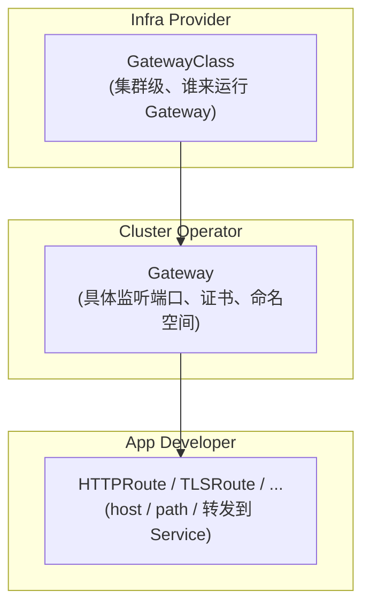
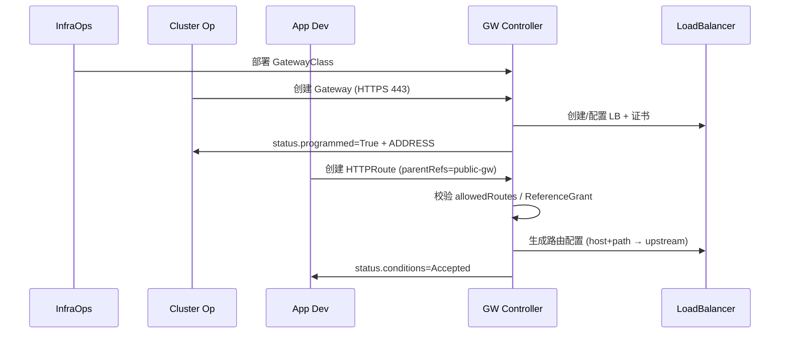
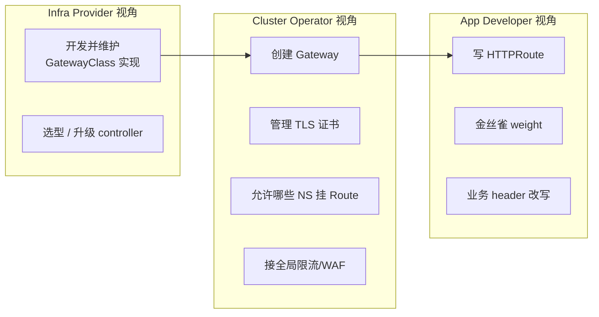
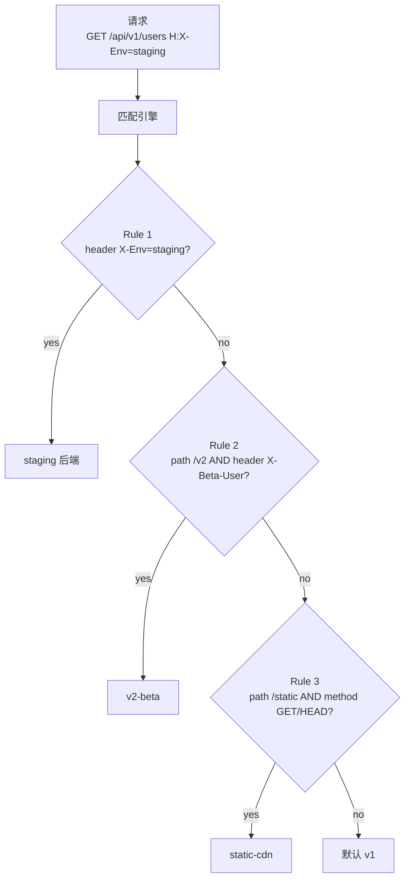
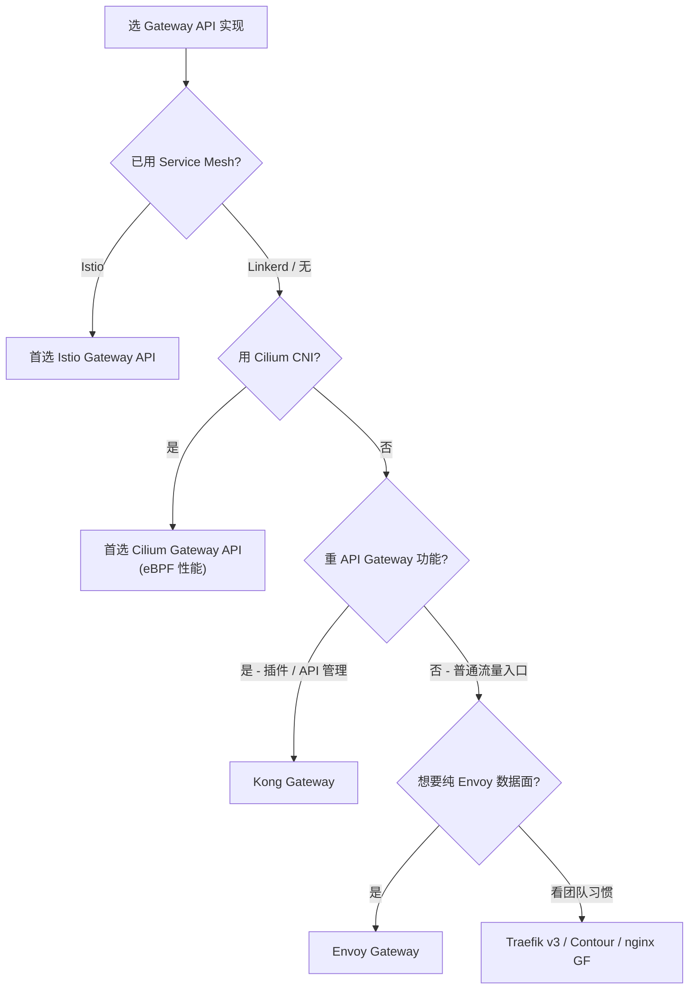
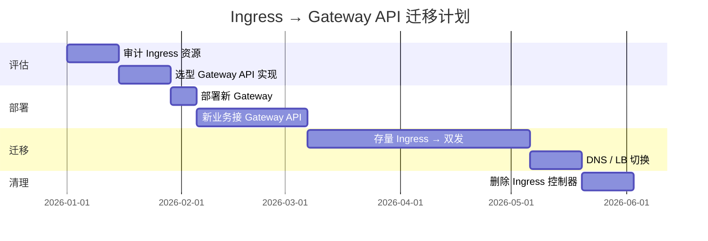
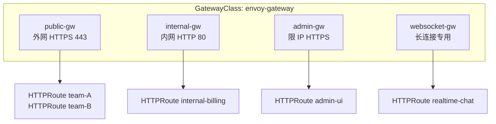
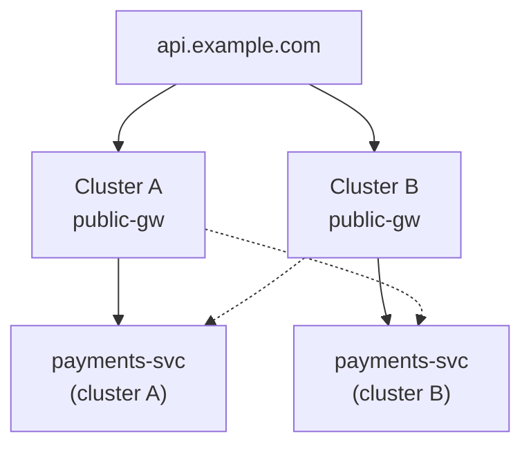

# 精通 Ingress 与 Gateway API：从 annotation 地狱到三层模型的范式转移

> 课程编号：C04
> 路线图来源：云原生 / Kubernetes 系列 · 模块二 流量入口与配置
> 难度：⭐⭐⭐⭐
> 预计阅读时间：65 分钟
> 内容基准：2026 年 5 月（Kubernetes 1.32-1.36、Gateway API v1.3、Istio 1.24+、Envoy Gateway 1.3+、Cilium 1.17+、Kong Gateway 3.x、Traefik v3、Contour v1.30）

---

## 引言：为什么 Ingress 之后还需要 Gateway API

如果你 2018 年第一次写 Kubernetes 的流量入口，大概率写过这种 YAML：

```yaml
apiVersion: networking.k8s.io/v1
kind: Ingress
metadata:
  name: api-ingress
  annotations:
    nginx.ingress.kubernetes.io/rewrite-target: /$1
    nginx.ingress.kubernetes.io/ssl-redirect: "true"
    nginx.ingress.kubernetes.io/proxy-body-size: "50m"
    nginx.ingress.kubernetes.io/canary: "true"
    nginx.ingress.kubernetes.io/canary-weight: "10"
    nginx.ingress.kubernetes.io/cors-allow-origin: "https://app.example.com"
    cert-manager.io/cluster-issuer: "letsencrypt-prod"
spec:
  rules:
  - host: api.example.com
    http:
      paths:
      - path: /v1/(.*)
        pathType: ImplementationSpecific
        backend:
          service:
            name: api-v1
            port:
              number: 80
```

七行 `spec` 配上六行 `annotations`——而且这六行 annotation **只在 nginx-ingress 上生效**。换 traefik 要重写、换 kong 要重写、换 contour 一半特性消失。

这就是 2018-2022 年 Kubernetes 流量入口的常态：**Ingress 资源是同的，但语义靠 annotation 拼凑，移植性接近零**。社区把这个问题称作 **annotation hell（annotation 地狱）**。

2019 年 SIG-Network 启动一个新项目 **Gateway API**，目标只有一个——**把 Ingress 重新做对**。经过四年迭代，**v1.0 在 2023-10-31 GA**，到 2026 年已经是 v1.3（2025-04 发布）稳定版，主流实现（Istio / Cilium / Envoy Gateway / Kong / Traefik / Contour / GKE / AKS）全数实现。

这一篇要回答的核心问题：

- 老 Ingress 到底有什么问题？
- Gateway API 的三层模型（GatewayClass / Gateway / xRoute）解决了什么？
- 流量切分、mTLS、跨命名空间引用怎么写？
- 主流实现该怎么选？
- 如何把现有 Ingress 平滑迁移过来？

读完这一篇，你应该能对你的集群说："Ingress 我们冻结，新业务一律走 Gateway API"。

---

## 第一章：传统 Ingress 的设计与局限

### 1.1 Ingress 的诞生背景

Kubernetes 1.1（2015）就有了 Ingress——目的是为集群提供"七层"入口（Service 只提供四层）。它的设计很朴素：

```
┌─────────────┐    ┌──────────────────┐    ┌─────────┐
│   Internet  │───▶│  Ingress         │───▶│ Service │───▶ Pod
│  (LB / DNS) │    │  Controller(Pod) │    │         │
└─────────────┘    └──────────────────┘    └─────────┘
                          ▲
                          │ watch
                  ┌───────────────┐
                  │ Ingress (CR)  │
                  │ host + path   │
                  └───────────────┘
```

一个 `Ingress` 资源 + 一个 controller（nginx-ingress / traefik / haproxy-ingress 等）实现"按 host/path 路由到 Service"。

> **澄清两个概念**：`Ingress` 是 **API 资源**（YAML），`Ingress Controller` 是 **运行时**（Pod 内跑 nginx/envoy/etc）。一个集群可以装多个 controller，用 `IngressClass` 区分。

### 1.2 三大缺陷

经过五年生产使用，社区总结出 Ingress 的三大设计缺陷：

#### 缺陷 1：annotation 爆炸

Ingress spec 只支持 host / path / TLS 这三件套，其余功能（金丝雀、重定向、限流、CORS、超时、Header 改写、grpc、weight）全部塞进 **vendor 私有 annotation**：

```yaml
annotations:
  nginx.ingress.kubernetes.io/canary-by-header: "X-Canary"      # nginx 私有
  traefik.ingress.kubernetes.io/router.middlewares: "default-r" # traefik 私有
  konghq.com/plugins: "rate-limit"                              # kong 私有
  haproxy.org/rate-limit-requests: "10"                         # haproxy 私有
```

后果：

- 同一份 Ingress 切 controller 必须重写
- annotation 没 schema，YAML 写错只能上线发现
- 多 controller 不同的语义（路径匹配、TLS 默认）造成"看似一样实际不一样"
- 平台团队要维护一份私有 annotation 翻译手册

#### 缺陷 2：协议覆盖弱

Ingress spec 几乎**只为 HTTP/HTTPS 设计**：

| 协议 | Ingress 支持 |
|---|---|
| HTTP / HTTPS | ✅ 一等公民 |
| HTTP/2 | ⚠️ 依赖实现 |
| gRPC | ❌ 私有 annotation |
| TCP / UDP | ❌ 完全不支持（实现自己造 ConfigMap） |
| WebSocket | ⚠️ 依赖实现 |
| TLS Passthrough | ⚠️ 依赖实现 |

nginx-ingress 用 `tcp-services` ConfigMap 凑出 TCP——但这是 nginx-ingress 的私有约定，**根本不是 Ingress 标准**。换 controller 等于业务断流。

#### 缺陷 3：角色不分离

Ingress 资源把"基础设施"和"路由策略"塞进一个 YAML。考虑这个场景：

- 平台团队：管 LB、证书、Gateway 实例，希望严格控制
- 应用团队：管自己业务的路由（path、host、weight），希望灵活

Ingress 没有这个分层。**应用团队改一个 Ingress 可能把整个 LB 配置打挂**，因为 `tls.hosts` `tls.secretName` 都写在同一个资源里。RBAC 控制只能粗粒度到"能不能写 Ingress"。

### 1.3 一个失败的修补：IngressClass + 多 Ingress

Kubernetes 1.18 引入 `IngressClass` 想缓解角色问题：

```yaml
apiVersion: networking.k8s.io/v1
kind: IngressClass
metadata:
  name: nginx
spec:
  controller: k8s.io/ingress-nginx
```

每个 Ingress `spec.ingressClassName: nginx` 指定走哪个 controller。但这只解决"多 controller 共存"，没解决 annotation 与协议问题。

社区终于承认：**Ingress 不能向前演进**，必须重写。这就是 Gateway API 的起点。

---

## 第二章：Gateway API 的三层模型

### 2.1 设计目标

Gateway API（**项目地址：sigs.k8s.io/gateway-api**）的核心目标：

1. **角色分离**：Infrastructure provider / Cluster operator / Application developer 三层独立
2. **可移植**：跨实现的语义统一（Conformance test 保证）
3. **协议丰富**：HTTP / HTTPS / TLS / TCP / UDP / gRPC 都是一等公民
4. **可扩展**：不靠 annotation，靠 policy attachment（PolicyTargetReference）
5. **类型安全**：CRD 有完整 schema，kubectl 直接报错

### 2.2 三个 API 资源 + 三种角色



| 资源 | 角色 | 类比 | 数量 |
|---|---|---|---|
| `GatewayClass` | Infra Provider | nginx 公司发布的产品型号 | 通常 1-3 个 |
| `Gateway` | Cluster Operator | 平台买回来的一台 LB（实例） | 几个~几十 |
| `HTTPRoute` 等 | App Developer | 业务方写的路由规则 | 几十~几千 |

每一层各管各的，**RBAC 可以精细到角色**：

```yaml
# 应用团队只能写 HTTPRoute，不能改 Gateway
apiVersion: rbac.authorization.k8s.io/v1
kind: Role
metadata:
  namespace: team-payments
  name: app-developer
rules:
- apiGroups: ["gateway.networking.k8s.io"]
  resources: ["httproutes", "grpcroutes"]
  verbs: ["*"]
```

### 2.3 GatewayClass——谁实现 Gateway

```yaml
apiVersion: gateway.networking.k8s.io/v1
kind: GatewayClass
metadata:
  name: envoy-gateway
spec:
  controllerName: gateway.envoyproxy.io/gatewayclass-controller
  description: "Envoy Gateway 1.3 主控制器"
```

`controllerName` 是字符串约定，每个实现固定自己的 controller name：

| 实现 | controllerName |
|---|---|
| Envoy Gateway | `gateway.envoyproxy.io/gatewayclass-controller` |
| Istio | `istio.io/gateway-controller` |
| Cilium | `io.cilium/gateway-controller` |
| Kong | `konghq.com/kic-gateway-controller` |
| Traefik | `traefik.io/gateway-controller` |
| Contour | `projectcontour.io/gateway-controller` |
| GKE Gateway | `gke.io/gateway-controller` |
| AWS Gateway API Controller | `gateway.api.aws/v1` |

一个集群可以装多个实现并共存，应用按 `parentRefs` 指定 Gateway 即可。

### 2.4 Gateway——一个监听器实例

```yaml
apiVersion: gateway.networking.k8s.io/v1
kind: Gateway
metadata:
  name: public-gw
  namespace: gateway-system
spec:
  gatewayClassName: envoy-gateway
  listeners:
  - name: http
    protocol: HTTP
    port: 80
    allowedRoutes:
      namespaces:
        from: All
  - name: https
    protocol: HTTPS
    port: 443
    tls:
      mode: Terminate
      certificateRefs:
      - kind: Secret
        name: wildcard-example-com
    allowedRoutes:
      namespaces:
        from: Selector
        selector:
          matchLabels:
            shared-gateway-access: "true"
```

要点：

- **每个 listener 一个端口 + 协议**；同一个 Gateway 可以挂多个 listener
- `allowedRoutes.namespaces` 决定哪些命名空间能挂 Route——`All` / `Same` / `Selector`
- `tls.mode` 有 `Terminate`（在 Gateway 解密）和 `Passthrough`（透传到后端）
- `certificateRefs` 默认在同 Namespace，跨 Namespace 需要 `ReferenceGrant`（下文）

创建 Gateway 后，控制器会给出实际 IP / 主机名：

```bash
kubectl get gateway public-gw -n gateway-system
# NAME        CLASS           ADDRESS         PROGRAMMED   AGE
# public-gw   envoy-gateway   35.230.123.45   True         3m
```

### 2.5 xRoute——业务路由规则

Gateway API 的 Route 是**多种资源**：

| Route 类型 | 用途 |
|---|---|
| `HTTPRoute` | HTTP / HTTPS 七层路由 |
| `GRPCRoute` | gRPC 路由（service/method 匹配） |
| `TLSRoute` | SNI 路由 + TLS Passthrough |
| `TCPRoute` | 透明 TCP 端口转发 |
| `UDPRoute` | 透明 UDP 端口转发 |

一个最小的 HTTPRoute：

```yaml
apiVersion: gateway.networking.k8s.io/v1
kind: HTTPRoute
metadata:
  name: payments-api
  namespace: team-payments
  labels:
    shared-gateway-access: "true"
spec:
  parentRefs:
  - name: public-gw
    namespace: gateway-system
  hostnames:
  - api.example.com
  rules:
  - matches:
    - path:
        type: PathPrefix
        value: /payments
    backendRefs:
    - name: payments-svc
      port: 80
```

读 spec 的三步思维：

1. `parentRefs`：挂哪个 Gateway（跨 Namespace 引用，受 `allowedRoutes` 控制）
2. `hostnames`：监听哪些 host
3. `rules`：匹配条件 + 后端 + 可选 filters

### 2.6 三层资源的工作流



每个资源都有 `status.conditions`，控制器会回填验证结果——**调试时永远先看 status**。

---

## 第三章：角色分离的实际运作

### 3.1 三个角色的边界



### 3.2 RBAC 拆分示例

```yaml
# 1) 平台团队 ClusterRole——可以管所有 Gateway/GC
apiVersion: rbac.authorization.k8s.io/v1
kind: ClusterRole
metadata:
  name: gateway-operator
rules:
- apiGroups: ["gateway.networking.k8s.io"]
  resources: ["gatewayclasses", "gateways"]
  verbs: ["*"]
- apiGroups: [""]
  resources: ["secrets"]
  verbs: ["get", "list", "watch"]
---
# 2) 业务团队 Role——只能写自己 NS 内的 Route
apiVersion: rbac.authorization.k8s.io/v1
kind: Role
metadata:
  namespace: team-payments
  name: app-developer
rules:
- apiGroups: ["gateway.networking.k8s.io"]
  resources: ["httproutes", "grpcroutes", "tlsroutes"]
  verbs: ["*"]
- apiGroups: [""]
  resources: ["services"]
  verbs: ["get", "list", "watch"]
```

这种拆分**在 Ingress 时代是做不到的**——因为 Ingress 把"挂证书"和"路由"耦在一个对象里，应用团队改 Ingress 就能改 TLS。

### 3.3 多 Gateway 模式：public / internal / admin

生产里通常会建至少 3 个 Gateway：

```yaml
# Gateway 1: 公网入口
apiVersion: gateway.networking.k8s.io/v1
kind: Gateway
metadata:
  name: public-gw
  namespace: gateway-system
spec:
  gatewayClassName: envoy-gateway
  listeners:
  - name: https
    protocol: HTTPS
    port: 443
    tls: { mode: Terminate, certificateRefs: [{kind: Secret, name: public-tls}] }
    allowedRoutes:
      namespaces:
        from: Selector
        selector: { matchLabels: { gateway: public } }
---
# Gateway 2: 内网入口（VPC peering / 内部调用）
apiVersion: gateway.networking.k8s.io/v1
kind: Gateway
metadata:
  name: internal-gw
  namespace: gateway-system
  annotations:
    # 各云有约定的 LB 类型 annotation——这是少数仍需 annotation 的地方
    service.beta.kubernetes.io/aws-load-balancer-internal: "true"
spec:
  gatewayClassName: envoy-gateway
  listeners:
  - name: http
    protocol: HTTP
    port: 80
    allowedRoutes:
      namespaces:
        from: Selector
        selector: { matchLabels: { gateway: internal } }
---
# Gateway 3: 管控面（仅限运维 IP）
apiVersion: gateway.networking.k8s.io/v1
kind: Gateway
metadata:
  name: admin-gw
  namespace: gateway-system
spec:
  gatewayClassName: envoy-gateway
  infrastructure:
    annotations:
      loadbalancer.envoyproxy.io/source-ranges: "10.0.0.0/8,192.168.0.0/16"
  listeners:
  - name: https
    protocol: HTTPS
    port: 443
    tls: { mode: Terminate, certificateRefs: [{kind: Secret, name: admin-tls}] }
    allowedRoutes:
      namespaces:
        from: Selector
        selector: { matchLabels: { gateway: admin } }
```

NS 加 label 决定能挂哪个 Gateway：

```bash
kubectl label namespace team-payments    gateway=public
kubectl label namespace internal-billing gateway=internal
kubectl label namespace platform-ops     gateway=admin
```

---

## 第四章：路由匹配——比 Ingress 强大十倍

### 4.1 五大匹配维度

HTTPRoute 的 `matches` 字段支持：

| 维度 | 字段 | 示例 |
|---|---|---|
| Path | `path.type` + `path.value` | `Exact` / `PathPrefix` / `RegularExpression` |
| Header | `headers[].name/value/type` | `Exact` / `RegularExpression` |
| Method | `method` | `GET` / `POST` / ... |
| QueryParam | `queryParams[].name/value/type` | `Exact` / `RegularExpression` |
| Hostname | `hostnames` | host SNI 级别 |

实战例子：

```yaml
apiVersion: gateway.networking.k8s.io/v1
kind: HTTPRoute
metadata:
  name: rich-matching
spec:
  parentRefs:
  - name: public-gw
    namespace: gateway-system
  hostnames:
  - api.example.com
  rules:
  # 规则 1：内部测试 header 走 staging 后端
  - matches:
    - headers:
      - name: X-Env
        value: staging
        type: Exact
    backendRefs:
    - name: api-staging
      port: 80
  # 规则 2：beta 用户走新版本
  - matches:
    - path:
        type: PathPrefix
        value: /v2
      headers:
      - name: X-Beta-User
        value: "true"
    backendRefs:
    - name: api-v2-beta
      port: 80
  # 规则 3：只允许 GET/HEAD 走静态资源
  - matches:
    - path:
        type: PathPrefix
        value: /static
      method: GET
    - path:
        type: PathPrefix
        value: /static
      method: HEAD
    backendRefs:
    - name: static-cdn
      port: 80
  # 规则 4：默认兜底
  - backendRefs:
    - name: api-v1
      port: 80
```

> 同一规则里的多个 `matches` 是 **OR**；同一 match 内的多个字段（path/header/method）是 **AND**。

### 4.2 路由优先级与冲突解决

Gateway API 规范定义了**确定的优先级算法**（不像 Ingress 不同 controller 行为各异）：

1. 优先匹配 `Exact` path > `PathPrefix` > 短 prefix（**最长前缀优先**）
2. path 相同，匹配数多的优先（header 数 > 同 path 优先）
3. 仍相同，按"创建时间早 + Namespace/Name 字典序"决胜



### 4.3 流量权重 weight

`backendRefs` 是数组，每个有 `weight`（默认 1）：

```yaml
rules:
- matches: [{path: {type: PathPrefix, value: /}}]
  backendRefs:
  - name: api-v1
    port: 80
    weight: 90
  - name: api-v2
    port: 80
    weight: 10
```

90/10 流量切分。`weight` 0 表示**保留路由不发流量**——可以作"准备就绪未启用"占位。

### 4.4 Filter——比 annotation 强

HTTPRoute 的 `filters` 提供 vendor-neutral 改写能力：

```yaml
rules:
- matches: [{path: {type: PathPrefix, value: /api}}]
  filters:
  - type: RequestHeaderModifier
    requestHeaderModifier:
      set: [{name: X-Forwarded-For, value: gateway}]
      add: [{name: X-Request-ID, value: "{{uuid}}"}]
      remove: [Cookie]
  - type: URLRewrite
    urlRewrite:
      path:
        type: ReplacePrefixMatch
        replacePrefixMatch: /
  - type: RequestRedirect
    requestRedirect:
      scheme: https
      statusCode: 301
  - type: RequestMirror
    requestMirror:
      backendRef:
        name: api-shadow
        port: 80
  backendRefs:
  - name: api-v1
    port: 80
```

支持的 filter 类型：

| Filter | 作用 | 支持级别 |
|---|---|---|
| `RequestHeaderModifier` | 改 req header | Core |
| `ResponseHeaderModifier` | 改 resp header | Core |
| `RequestRedirect` | 重定向 | Core |
| `URLRewrite` | 路径重写 | Core |
| `RequestMirror` | 流量镜像（影子） | Extended |
| `ExtensionRef` | vendor 扩展（Envoy Gateway 的 RateLimitPolicy 等） | Extended |

> Core / Extended 标记是 Conformance 体系的一部分——Core 必须支持，Extended 可选。看实现的 Conformance Report 就知道支持到哪。

---

## 第五章：跨命名空间引用——ReferenceGrant

### 5.1 默认禁跨 NS

Gateway API 的安全模型**禁止隐式跨 NS 访问资源**——这是和 Ingress 的关键差异。例子：

```yaml
# team-frontend 想用 platform-tls NS 里的 wildcard 证书
apiVersion: gateway.networking.k8s.io/v1
kind: Gateway
metadata:
  name: frontend-gw
  namespace: team-frontend
spec:
  gatewayClassName: envoy-gateway
  listeners:
  - name: https
    protocol: HTTPS
    port: 443
    tls:
      mode: Terminate
      certificateRefs:
      - kind: Secret
        name: wildcard-example-com
        namespace: platform-tls   # 跨 NS！
```

如果没有显式授权，controller 会把 listener 状态置为 `Programmed=False, Reason=RefNotPermitted`。

### 5.2 用 ReferenceGrant 显式授权

```yaml
apiVersion: gateway.networking.k8s.io/v1beta1
kind: ReferenceGrant
metadata:
  name: tls-from-frontend
  namespace: platform-tls   # 注意：放在被引用方（Secret 所在）
spec:
  from:
  - group: gateway.networking.k8s.io
    kind: Gateway
    namespace: team-frontend
  to:
  - group: ""
    kind: Secret
    name: wildcard-example-com   # 可以省略 name 来授权整个 kind
```

要点：

- ReferenceGrant 放在**被引用的资源**所在 Namespace
- `from` 描述谁能引用，`to` 描述能引用谁
- 同样适用于 HTTPRoute 引用其他 NS 的 Service
- 这是**反向授权**模式，让被引用方主动同意，不让引用方单方面绑定

### 5.3 跨 NS 后端 Service

应用方案场景：team-A 的 HTTPRoute 想转发到 team-B 的 Service：

```yaml
# team-B namespace 里
apiVersion: gateway.networking.k8s.io/v1beta1
kind: ReferenceGrant
metadata:
  name: allow-team-a-route
  namespace: team-b
spec:
  from:
  - group: gateway.networking.k8s.io
    kind: HTTPRoute
    namespace: team-a
  to:
  - group: ""
    kind: Service
---
# team-A namespace 里
apiVersion: gateway.networking.k8s.io/v1
kind: HTTPRoute
metadata:
  name: a-uses-b
  namespace: team-a
spec:
  parentRefs:
  - name: public-gw
    namespace: gateway-system
  hostnames: [api.example.com]
  rules:
  - matches: [{path: {type: PathPrefix, value: /b}}]
    backendRefs:
    - name: team-b-svc
      namespace: team-b
      port: 80
```

不开 ReferenceGrant，Route 的 `BackendNotFound` 也会标记为不可达。

---

## 第六章：主流实现对比（2026 版）

### 6.1 实现矩阵

| 实现 | Conformance Profile | 数据面 | 优势 | 劣势 |
|---|---|---|---|---|
| **Istio** | Gateway / Mesh 全 Profile | Envoy | Mesh 一体化、最强 traffic policy | 资源占用大 |
| **Envoy Gateway** | Gateway 全 Profile | Envoy | CNCF 一手 Envoy、轻量 | 生态较新 |
| **Cilium** | Gateway 全 Profile | eBPF + Envoy (sidecarless) | eBPF 性能、与 CNI 一体 | 数据面绑 Cilium CNI |
| **Kong Gateway** | Gateway 部分 | Kong (nginx + lua) | 插件生态强、API Gateway 老牌 | Mesh 偏弱 |
| **Traefik v3** | Gateway 部分 | 自研 Go 代理 | 配置简单、Let's Encrypt 集成 | 大规模性能一般 |
| **Contour** | Gateway 全 Profile | Envoy | 老牌 CNCF 项目、稳定 | 演进较慢 |
| **GKE / AKS / EKS Gateway** | Gateway 部分 | 云厂自维护 | 与 LB 深度集成 | 跨云不通用 |
| **nginx Gateway Fabric** | Gateway 部分 | nginx | nginx 用户习惯延续 | 部分 filter 不全 |

### 6.2 选型决策树



### 6.3 Istio Ambient + Gateway API（2026 主流组合）

Istio 1.24（2024-11，Ambient Mode GA）让 Ambient Mesh GA、可选用（sidecar 仍为默认数据面，ambient 需显式启用；2026 年稳定线已是 1.28+），与 Gateway API 深度整合：

```yaml
# 用 Istio 实现的 Gateway，开 Ambient
apiVersion: gateway.networking.k8s.io/v1
kind: Gateway
metadata:
  name: istio-gw
  namespace: gateway-system
spec:
  gatewayClassName: istio
  listeners:
  - name: http
    protocol: HTTP
    port: 80
    allowedRoutes:
      namespaces: { from: All }
---
# Istio 特有的 Waypoint Gateway（东西向 mesh 入口）
apiVersion: gateway.networking.k8s.io/v1
kind: Gateway
metadata:
  name: waypoint
  namespace: team-payments
  labels:
    istio.io/waypoint-for: service
spec:
  gatewayClassName: istio-waypoint
  listeners:
  - name: mesh
    protocol: HBONE
    port: 15008
```

Gateway API 标准化了"南北向 Gateway"（公网入口）和"东西向 Waypoint"（mesh 内）的概念——**两者用同样的 API**。

### 6.4 Cilium Gateway API（eBPF 主义）

Cilium 1.16+ 的 Gateway API 实现独特之处：

- **数据面 sidecarless**，Pod 不挂 sidecar，由 eBPF + 节点本地 Envoy 处理
- 跨 zone 流量优化（Topology Aware Routing 整合）
- Hubble 直接出 L7 trace

```bash
# 安装 Cilium 时开 Gateway API
helm upgrade --install cilium cilium/cilium \
  --namespace kube-system \
  --set gatewayAPI.enabled=true \
  --set gatewayAPI.enableAlpn=true \
  --set kubeProxyReplacement=true
```

### 6.5 Envoy Gateway 极简上手

```bash
# 一行命令装
helm install eg oci://docker.io/envoyproxy/gateway-helm \
  --version 1.3.0 -n envoy-gateway-system --create-namespace

# Envoy Gateway 自带 default GatewayClass
kubectl get gatewayclass
# NAME    CONTROLLER                                      ACCEPTED
# eg      gateway.envoyproxy.io/gatewayclass-controller   True
```

Envoy Gateway 的优势是**轻量纯净**：没有 Mesh、没有 CNI 耦合、就一个网关。适合单纯需要 API Gateway 的场景。

---

## 第七章：流量切分实战

### 7.1 金丝雀（Canary）—— weight

最常见的渐进式发布：

```yaml
# Day 1: 5% canary
apiVersion: gateway.networking.k8s.io/v1
kind: HTTPRoute
metadata:
  name: payments-canary
spec:
  parentRefs: [{name: public-gw, namespace: gateway-system}]
  hostnames: [api.example.com]
  rules:
  - matches: [{path: {type: PathPrefix, value: /payments}}]
    backendRefs:
    - name: payments-stable
      port: 80
      weight: 95
    - name: payments-canary
      port: 80
      weight: 5
```

通过 CI/CD 步进 5 → 25 → 50 → 100：

```bash
#!/usr/bin/env bash
# canary-step.sh: 阶梯式提升 canary 权重
set -euo pipefail

NS="${1:-team-payments}"
ROUTE="${2:-payments-canary}"
NEW_WEIGHT="${3:-25}"
STABLE_WEIGHT=$((100 - NEW_WEIGHT))

kubectl patch httproute "$ROUTE" -n "$NS" --type=json -p="[
  {\"op\":\"replace\",\"path\":\"/spec/rules/0/backendRefs/0/weight\",\"value\":$STABLE_WEIGHT},
  {\"op\":\"replace\",\"path\":\"/spec/rules/0/backendRefs/1/weight\",\"value\":$NEW_WEIGHT}
]"

echo "canary=$NEW_WEIGHT% stable=$STABLE_WEIGHT%"
kubectl get httproute "$ROUTE" -n "$NS" -o jsonpath='{.spec.rules[0].backendRefs}' | jq .
```

更进阶用 **Argo Rollouts** / **Flagger** 自动化阶梯——它们内部就是 patch HTTPRoute。

### 7.2 蓝绿（Blue/Green）—— header 切换 + weight 兜底

蓝绿的关键是**瞬时切换 + 可快速回滚**：

```yaml
apiVersion: gateway.networking.k8s.io/v1
kind: HTTPRoute
metadata:
  name: payments-bluegreen
spec:
  parentRefs: [{name: public-gw, namespace: gateway-system}]
  hostnames: [api.example.com]
  rules:
  # 预热阶段：内部测试 header 强制走 green
  - matches:
    - headers: [{name: X-Color, value: green}]
    backendRefs: [{name: payments-green, port: 80}]
  - matches:
    - headers: [{name: X-Color, value: blue}]
    backendRefs: [{name: payments-blue, port: 80}]
  # 默认 100% blue（生产）
  - matches: [{path: {type: PathPrefix, value: /payments}}]
    backendRefs:
    - name: payments-blue
      port: 80
      weight: 100
    - name: payments-green
      port: 80
      weight: 0
```

切换：

```bash
# 翻盘命令：blue 0%, green 100%
kubectl patch httproute payments-bluegreen --type=json -p='[
  {"op":"replace","path":"/spec/rules/2/backendRefs/0/weight","value":0},
  {"op":"replace","path":"/spec/rules/2/backendRefs/1/weight","value":100}
]'

# 回滚：
kubectl patch httproute payments-bluegreen --type=json -p='[
  {"op":"replace","path":"/spec/rules/2/backendRefs/0/weight","value":100},
  {"op":"replace","path":"/spec/rules/2/backendRefs/1/weight","value":0}
]'
```

### 7.3 A/B 测试 —— header / cookie 分流

按用户特征分流：

```yaml
rules:
# VIP 用户走新算法
- matches:
  - headers: [{name: X-User-Tier, value: premium}]
  backendRefs: [{name: rec-engine-v2, port: 80}]
# 5% beta cookie 用户
- matches:
  - headers:
    - name: Cookie
      type: RegularExpression
      value: ".*beta=true.*"
  backendRefs: [{name: rec-engine-v2, port: 80}]
# 默认走稳定版
- backendRefs: [{name: rec-engine-v1, port: 80}]
```

### 7.4 流量镜像（影子流量）

把生产流量复制到新版本验证，**不影响真实响应**：

```yaml
rules:
- matches: [{path: {type: PathPrefix, value: /payments}}]
  filters:
  - type: RequestMirror
    requestMirror:
      backendRef:
        name: payments-shadow
        port: 80
  backendRefs: [{name: payments-stable, port: 80}]
```

注意：

- 镜像后端的响应被**丢弃**
- 写操作（POST/PUT）镜像要慎重——会真写一份到影子
- 通常配合"只读 Mock 模式"用

---

## 第八章：TLS 三种模式

### 8.1 三种 TLS 模式对比

| 模式 | 解密点 | 后端协议 | 典型场景 |
|---|---|---|---|
| **Terminate** | Gateway 解密 | HTTP / HTTP2 | 网关统一证书；mesh 内部 mTLS 由其他层做 |
| **Passthrough** | 后端解密 | TLS（透传） | 后端自管证书；端到端加密；TLS 客户证书 |
| **Re-encrypt** | Gateway 解密后再加密 | HTTPS | 内部强制 TLS；多团队多证书 |

### 8.2 Terminate——最常见

```yaml
apiVersion: gateway.networking.k8s.io/v1
kind: Gateway
spec:
  listeners:
  - name: https
    protocol: HTTPS
    port: 443
    hostname: "*.example.com"
    tls:
      mode: Terminate
      certificateRefs:
      - kind: Secret
        name: wildcard-example-com
```

证书 Secret 是标准 `kubernetes.io/tls` 类型：

```bash
kubectl create secret tls wildcard-example-com \
  --cert=fullchain.pem \
  --key=privkey.pem
```

生产里证书通常用 **cert-manager 自动签发**：

```yaml
apiVersion: cert-manager.io/v1
kind: Certificate
metadata:
  name: wildcard-example-com
  namespace: gateway-system
spec:
  secretName: wildcard-example-com
  issuerRef:
    name: letsencrypt-prod
    kind: ClusterIssuer
  commonName: "*.example.com"
  dnsNames:
  - "*.example.com"
  - "example.com"
```

### 8.3 Passthrough + TLSRoute

如果后端要做客户端证书校验，必须 Passthrough：

```yaml
apiVersion: gateway.networking.k8s.io/v1
kind: Gateway
spec:
  listeners:
  - name: tls
    protocol: TLS
    port: 443
    tls:
      mode: Passthrough
    allowedRoutes:
      kinds: [{kind: TLSRoute}]
---
apiVersion: gateway.networking.k8s.io/v1alpha2
kind: TLSRoute
metadata:
  name: mtls-backend
spec:
  parentRefs: [{name: public-gw, namespace: gateway-system}]
  hostnames: ["secure.example.com"]
  rules:
  - backendRefs: [{name: mtls-svc, port: 8443}]
```

TLSRoute 只看 **SNI（hostnames）**——TLS 内容不解析，因此不能匹配 path/header。

### 8.4 Re-encrypt（后端 HTTPS）

```yaml
# 标记后端 Service 为 HTTPS：
apiVersion: v1
kind: Service
metadata:
  name: internal-https-svc
  annotations:
    gateway.envoyproxy.io/upstream-tls: "true"   # vendor 扩展（Envoy Gateway）
spec:
  ports:
  - name: https
    port: 443
    targetPort: 8443
```

每个实现暴露后端 TLS 的方式不同，目前是 **Gateway API 标准未覆盖区域**——属于 vendor 扩展。社区在 `BackendTLSPolicy` 标准化中（Extended 状态，2025 进 GA 路径）。

### 8.5 BackendTLSPolicy（2026 新标准）

```yaml
apiVersion: gateway.networking.k8s.io/v1alpha3
kind: BackendTLSPolicy
metadata:
  name: backend-https
spec:
  targetRefs:
  - group: ""
    kind: Service
    name: internal-https-svc
  validation:
    caCertificateRefs:
    - kind: ConfigMap
      name: internal-ca-bundle
    hostname: internal-svc.cluster.local
```

这是 Gateway API 通过 **Policy Attachment** 扩展能力的标志案例——不污染 HTTPRoute spec，按需附加。

---

## 第九章：从 Ingress 迁移到 Gateway API

### 9.1 迁移策略：双轨并行

实战不建议"一刀切"，推荐**双轨并行 + 渐进切换**：



### 9.2 工具：ingress2gateway

社区维护的转换工具：

```bash
# 安装
go install sigs.k8s.io/ingress2gateway@latest

# 转换 nginx Ingress
ingress2gateway print --providers ingress-nginx --namespace team-payments

# 转换 traefik IngressRoute
ingress2gateway print --providers traefik --namespace team-frontend

# 整集群一键扫描
ingress2gateway print --all-namespaces > gateway-api.yaml
```

输出已经是 Gateway / HTTPRoute YAML。当然——**annotation 不能 100% 自动翻译**，比如 nginx 私有的 `nginx.ingress.kubernetes.io/server-snippet`，工具会跳过并打 warning，需要人工评估。

### 9.3 典型映射

| Ingress | Gateway API 对应 |
|---|---|
| `kind: Ingress` | `kind: HTTPRoute` |
| `spec.ingressClassName: nginx` | `parentRefs: [{name: nginx-gw, ...}]` |
| `spec.tls[]` | Gateway `listener.tls` |
| `host: api.example.com` | `hostnames: [api.example.com]` |
| `path: /v1` `pathType: Prefix` | `path: {type: PathPrefix, value: /v1}` |
| annotation `canary-weight: 10` | `backendRefs[].weight` |
| annotation `rewrite-target: /$1` | filter `URLRewrite` |
| annotation `permanent-redirect-code: 301` | filter `RequestRedirect` |

### 9.4 案例：一个 nginx Ingress → HTTPRoute

**Before**：

```yaml
apiVersion: networking.k8s.io/v1
kind: Ingress
metadata:
  name: api
  annotations:
    nginx.ingress.kubernetes.io/canary: "true"
    nginx.ingress.kubernetes.io/canary-weight: "10"
    nginx.ingress.kubernetes.io/rewrite-target: /$2
spec:
  ingressClassName: nginx
  tls:
  - hosts: [api.example.com]
    secretName: api-tls
  rules:
  - host: api.example.com
    http:
      paths:
      - path: /v1(/|$)(.*)
        pathType: ImplementationSpecific
        backend:
          service:
            name: api-v1
            port: { number: 80 }
```

**After**：

```yaml
# Gateway 由平台运维一次性创建
---
apiVersion: gateway.networking.k8s.io/v1
kind: Gateway
metadata:
  name: api-gw
  namespace: gateway-system
spec:
  gatewayClassName: envoy-gateway
  listeners:
  - name: https
    protocol: HTTPS
    port: 443
    hostname: api.example.com
    tls:
      mode: Terminate
      certificateRefs: [{kind: Secret, name: api-tls, namespace: platform-tls}]
    allowedRoutes:
      namespaces: { from: Selector, selector: { matchLabels: { gateway: public } } }
---
# 应用团队的 HTTPRoute
apiVersion: gateway.networking.k8s.io/v1
kind: HTTPRoute
metadata:
  name: api
  namespace: team-api
spec:
  parentRefs: [{name: api-gw, namespace: gateway-system}]
  hostnames: [api.example.com]
  rules:
  - matches: [{path: {type: PathPrefix, value: /v1}}]
    filters:
    - type: URLRewrite
      urlRewrite:
        path: { type: ReplacePrefixMatch, replacePrefixMatch: / }
    backendRefs:
    - name: api-v1
      port: 80
      weight: 90
    - name: api-canary
      port: 80
      weight: 10
```

注意几点：

- TLS 证书是平台资产，搬到 `platform-tls` NS 并通过 ReferenceGrant 授权
- `ingressClassName` 概念消失，由 `parentRefs` 显式选择
- canary 不再靠 annotation，直接 `weight`
- rewrite 用 filter

### 9.5 切换流量：两个方案

**方案 A：DNS 切换**（推荐）

```
api.example.com   A  35.x.x.x  (老 nginx-ingress LB)
                  ↓ DNS TTL 60s
api.example.com   A  35.y.y.y  (新 Gateway LB)
```

短 TTL DNS 切换；老 LB 保留 24h 兜底回滚。

**方案 B：iptables / SNI 切换**

同一个外部 LB 后接两套上游，**先把 80/443 转到 Gateway，再把 Ingress controller 后端撤掉**。适合云厂托管 LB。

### 9.6 灰度迁移：单 host 内分流

可以让 nginx-ingress 与 Gateway 共享一个 LB（同 LB IP），按 `path` 分流到两个 controller——这种过渡方案对老旧业务最友好。

---

## 第十章：生产实践

### 10.1 多 Gateway 模式 + 共享 GatewayClass

一个集群至少配 3-4 个 Gateway：



好处：

- 不同业务的故障域隔离（一个 Gateway 配置错误不影响其他）
- 可以独立扩缩容（websocket 长连接对资源消耗大）
- 流量类型按需分配资源（admin 流量小、用最低配 Pod；public 用 HPA）

### 10.2 限流 / WAF 通过 Policy 注入

Gateway API 标准还没把限流标准化（在 Roadmap 中）。各实现通过 **PolicyAttachment** 提供：

**Envoy Gateway**：

```yaml
apiVersion: gateway.envoyproxy.io/v1alpha1
kind: BackendTrafficPolicy
metadata:
  name: rate-limit-payments
spec:
  targetRefs:
  - group: gateway.networking.k8s.io
    kind: HTTPRoute
    name: payments-api
  rateLimit:
    type: Global
    global:
      rules:
      - clientSelectors:
        - headers: [{name: X-API-Key, type: Distinct}]
        limit:
          requests: 100
          unit: Minute
```

**Istio**：

```yaml
apiVersion: networking.istio.io/v1
kind: EnvoyFilter
metadata:
  name: ratelimit
spec:
  configPatches:
  - applyTo: HTTP_FILTER
    match:
      context: GATEWAY
    patch:
      operation: INSERT_BEFORE
      value:
        name: envoy.filters.http.local_ratelimit
        ...
```

**Kong**：

```yaml
apiVersion: configuration.konghq.com/v1
kind: KongPlugin
metadata:
  name: rate-limit
plugin: rate-limiting
config:
  minute: 100
```

> **建议**：策略归策略，路由归路由。Policy 资源用 `targetRefs` 挂到 Gateway / HTTPRoute / Service，不污染 HTTPRoute 本身。这样应用团队改路由不会影响策略。

### 10.3 监控指标

每个实现都会暴露 Prometheus 指标，关键看：

| 指标 | 说明 |
|---|---|
| `gateway_api_request_total` | 总请求数（按 route/code/method） |
| `gateway_api_request_duration_seconds` | 延迟分布（p50/p95/p99） |
| `gateway_api_upstream_rq_5xx` | 后端 5xx 计数 |
| `gateway_api_listener_downstream_cx_total` | 长连接数 |
| `gateway_api_route_status_*` | Conditions 状态（Accepted/Programmed） |

**关键 PromQL**：

```promql
# 1. 5xx 错误率
sum(rate(envoy_http_downstream_rq_xx{envoy_http_conn_manager_prefix="public_http",envoy_response_code_class="5"}[5m]))
  /
sum(rate(envoy_http_downstream_rq_total{envoy_http_conn_manager_prefix="public_http"}[5m]))

# 2. 路由级 p99
histogram_quantile(0.99,
  sum by (route_name, le) (rate(gateway_request_duration_bucket[5m]))
)

# 3. 路由是否 Accepted
gateway_api_httproute_condition{type="Accepted",status="False"}
```

### 10.4 弹性与 HPA

Gateway 自身要扛流量，记得给 controller 配 HPA：

```yaml
apiVersion: autoscaling/v2
kind: HorizontalPodAutoscaler
metadata:
  name: envoy-gateway
  namespace: envoy-gateway-system
spec:
  scaleTargetRef:
    apiVersion: apps/v1
    kind: Deployment
    name: envoy-default
  minReplicas: 3
  maxReplicas: 30
  metrics:
  - type: Resource
    resource:
      name: cpu
      target: { type: Utilization, averageUtilization: 60 }
  - type: Resource
    resource:
      name: memory
      target: { type: Utilization, averageUtilization: 70 }
```

> **三副本起步**：Gateway 数据面是无状态的，至少 3 副本跨节点 / 跨 AZ。

### 10.5 PDB 与升级安全

```yaml
apiVersion: policy/v1
kind: PodDisruptionBudget
metadata:
  name: envoy-pdb
  namespace: envoy-gateway-system
spec:
  minAvailable: 2
  selector:
    matchLabels: { app.kubernetes.io/name: envoy-default }
```

Gateway controller 升级时 PDB 防止整组下线。

### 10.6 客户端 IP 保留

四层 LB → Gateway 这一跳会丢失客户端真实 IP，必须开 **PROXY Protocol** 或保留 source IP：

```yaml
# 云厂 LB 注解（保留客户端 IP）
apiVersion: gateway.networking.k8s.io/v1
kind: Gateway
metadata:
  annotations:
    service.beta.kubernetes.io/aws-load-balancer-type: nlb
    service.beta.kubernetes.io/aws-load-balancer-proxy-protocol: "*"
```

后端拿到的 `X-Forwarded-For` 顺序：`真实IP, LB1, LB2, Gateway`，最左是客户端。

### 10.7 多集群 Gateway

Gateway API 1.2+ 支持多集群（Multi-Cluster Gateway / MCS-API 集成）。常见架构：



通过 **MCS-API**（Multi-Cluster Services）把 Service 跨集群暴露，HTTPRoute 引用 `ServiceImport` 代替本地 Service：

```yaml
rules:
- matches: [{path: {type: PathPrefix, value: /}}]
  backendRefs:
  - group: multicluster.x-k8s.io
    kind: ServiceImport
    name: payments
    port: 80
```

---

## 第十一章：陷阱清单

写过 Gateway API 的人最容易踩的 18 个坑：

| # | 陷阱 | 修复 |
|---|---|---|
| 1 | `parentRefs` 没写 Gateway 的 `namespace`，默认就是 Route 自己的 NS | 显式写 `namespace`，跨 NS 必填 |
| 2 | Gateway 的 `allowedRoutes.namespaces.from: Same` 限制了跨 NS | 改 `All` 或 `Selector` |
| 3 | TLS Secret 跨 NS 引用，忘了 `ReferenceGrant` | 在 Secret 所在 NS 加 ReferenceGrant |
| 4 | HTTPRoute `status.conditions=Accepted False` 没看就 debug 半天 | 永远先 `kubectl describe httproute` 看 conditions |
| 5 | `hostname` 在 Gateway listener 和 HTTPRoute 都写但不匹配 | 二者必须相容（HTTPRoute 是 Gateway 的子集） |
| 6 | 路径优先级理解错——以为 Rule 顺序生效（实际是规范定义的优先级） | 看[官方匹配算法](https://gateway-api.sigs.k8s.io/api-types/httproute/#conflicts) |
| 7 | `path.type: Exact` 不带尾斜杠匹配不到 `/api/` | 写 `Exact` 时精确到底；不确定用 `PathPrefix` |
| 8 | TLS Passthrough 和 TLSRoute，listener `protocol: TLS` 写成 `HTTPS` | TLS Passthrough 必须 `protocol: TLS` |
| 9 | 把 limits 写错——Gateway controller Pod OOM 时整个集群入口挂 | 强制 limits/requests + HPA + PDB |
| 10 | 多 Gateway 共享 GatewayClass，一个 Gateway 写崩 controller 影响其他 | 用 controller deployment per Gateway（Envoy Gateway 支持） |
| 11 | nginx-ingress 与 Gateway API 共存，DNS 切换没走透——浏览器 HSTS 缓存 | 提前两周降低 DNS TTL；HSTS max-age 临时调小 |
| 12 | `weight: 0` 不等于"删除"，仍要保持 Service 可达 | 真删除把 backendRef 移除 |
| 13 | filter `URLRewrite` 与 backend port 80/443 混用 | 后端 Service `targetPort` 校对清楚 |
| 14 | 跨 NS Service 没开 ReferenceGrant → `ResolvedRefs=False` | 加 grant 或同 NS |
| 15 | TLS 证书 cert-manager 没及时刷新，listener 状态变 `Degraded` | cert-manager Prometheus 报警 |
| 16 | HTTP/2 over cleartext (h2c) 没显式声明，gRPC 后端报 502 | 用 `GRPCRoute` 或 BackendTLSPolicy 标 ALPN |
| 17 | Gateway 升级 controller 前没看 Conformance 矩阵——新版掉了某个 filter | 升级前看 release notes + Conformance Report |
| 18 | Argo Rollouts 用旧版本 Plugin 不识别新 HTTPRoute 字段 | 升级 Rollouts 到 v1.7+ |

### 11.1 调试三连

```bash
# 1) 看资源 status
kubectl describe gateway public-gw -n gateway-system
kubectl describe httproute payments-api -n team-payments

# 2) 看 controller 日志
kubectl logs -n envoy-gateway-system -l app.kubernetes.io/name=envoy-gateway --tail=200

# 3) 查 conditions 状态（适合脚本）
kubectl get httproute payments-api -n team-payments -o jsonpath='{.status.parents[*].conditions}' | jq .
```

`status.parents[].conditions[]` 一定要看，**所有路由问题 90% 直接告诉你原因**：

```json
[
  {
    "type": "Accepted",
    "status": "True",
    "reason": "Accepted",
    "message": "Route is accepted"
  },
  {
    "type": "ResolvedRefs",
    "status": "False",
    "reason": "BackendNotFound",
    "message": "Service team-payments/payments-svc does not exist"
  }
]
```

---

## 第十二章：2026 现状速览

### 12.1 Gateway API 版本演进

| 版本 | 发布 | 关键变化 |
|---|---|---|
| v0.1 | 2020-04 | service-apis 首发 |
| v0.5 | 2022-07 | beta；GatewayClass / Gateway / HTTPRoute beta |
| **v1.0 GA** | **2023-10-31** | Gateway / GatewayClass / HTTPRoute GA |
| v1.1 | 2024-05 | GRPCRoute GA；ReferenceGrant 稳定 |
| v1.2 | 2024-11 | BackendTLSPolicy beta；多协议增强 |
| v1.2.x | 2025 | TLSRoute / TCPRoute / UDPRoute v1alpha2 持续打磨 |
| **2026 状态** | - | **v1.2 普及；v1.3 即将带 BackendTLSPolicy GA、限流标准化路径** |

### 12.2 主流实现 Conformance 完成度（2026-05）

| 实现 | Core Profile | Mesh Profile | 备注 |
|---|---|---|---|
| Istio | 100% | 100% | 全实现 + Mesh 标准 |
| Envoy Gateway | 100% | n/a | 网关方向标杆 |
| Cilium | ~95% | 100% (实验) | eBPF 路线 |
| Kong | ~90% | n/a | 部分 filter 演进中 |
| Contour | ~95% | n/a | 老牌稳定 |
| Traefik v3 | ~85% | n/a | 简单上手 |
| nginx Gateway Fabric | ~80% | n/a | 后起 |
| GKE Gateway | ~90% | n/a | 与云 LB 一体 |

### 12.3 GAMMA 工作组与 Service Mesh

**GAMMA**（Gateway API for Mesh Management and Administration）是 2023 启动的子工作组，把 Gateway API 扩展到**东西向 mesh**。2026 主流 mesh 都用同一套 API：

```yaml
# 同一份 HTTPRoute 既可挂 Gateway（南北向）也可挂 Service（东西向 / mesh）
apiVersion: gateway.networking.k8s.io/v1
kind: HTTPRoute
metadata:
  name: mesh-route
spec:
  parentRefs:
  - kind: Service           # ← GAMMA：mesh 入口
    name: payments-svc
    namespace: team-payments
  rules:
  - matches: [{path: {type: PathPrefix, value: /}}]
    backendRefs:
    - name: payments-v2
      port: 80
      weight: 5
    - name: payments-v1
      port: 80
      weight: 95
```

这是 2026 的重要趋势：**"Gateway API 即 Service Mesh API"**——南北向网关与东西向 mesh 不再是两套 API。

### 12.4 与 SMI / Istio VirtualService 关系

| API | 状态（2026） |
|---|---|
| SMI（Service Mesh Interface） | 已归档（archived）—— GAMMA 取而代之 |
| Istio VirtualService / Gateway | 仍可用、但 Istio 文档推荐新部署用 Gateway API |
| Linkerd ServiceProfile | 兼容 GAMMA、推荐迁移 HTTPRoute |
| Cilium CiliumNetworkPolicy + Envoy 配置 | 与 Gateway API 并行 |

**结论：新项目从第一天起就用 Gateway API；存量逐步迁移。**

### 12.5 Argo Rollouts / Flagger 支持

| 工具 | Gateway API 支持 |
|---|---|
| **Argo Rollouts** | v1.6+ 原生 HTTPRoute trafficRouting |
| **Flagger** | v1.30+ 原生 HTTPRoute / GAMMA |

```yaml
# Argo Rollouts 用 HTTPRoute
apiVersion: argoproj.io/v1alpha1
kind: Rollout
spec:
  strategy:
    canary:
      trafficRouting:
        plugins:
          argoproj-labs/gatewayAPI:
            httpRoute: payments-canary
            namespace: team-payments
      steps:
      - setWeight: 5
      - pause: { duration: 5m }
      - setWeight: 25
      - pause: { duration: 10m }
      - setWeight: 50
      - pause: { duration: 10m }
```

### 12.6 厂商动态

- **AWS** 2024 推出 VPC Lattice Gateway API Controller（跨账户 / 跨 VPC）
- **Google** GKE Gateway 集成 Cloud Load Balancer，外部 / 内部 / 区域多形态
- **Azure** AKS Application Gateway for Containers 2025 GA
- **Cloudflare** 推出 Cloudflare Gateway API Provider（用 Worker + Tunnel 实现）

云原生集群入口的"标准化战争"基本结束——Gateway API 是赢家。

---

## 第十三章：练习题

### 基础题

**T1**. 解释 Ingress 资源最严重的三个设计问题，并给出 Gateway API 是如何解决每一个的。

**T2**. 列出 Gateway API 的三个核心资源对应的角色，并说明 RBAC 上一个普通业务团队应当只能写哪些资源。

**T3**. 写出一份最小的 HTTPRoute：`api.example.com` 的 `/api/v1/*` 100% 转发到 `api-v1` Service:80；其他 path 返回 404。

### 进阶题

**T4**. 实现一个金丝雀流量切分：默认 95% 走 `stable`，5% 走 `canary`；同时让 header `X-Internal: yes` 的请求 100% 走 `canary`（用于内部测试）。

**T5**. 业务 NS `team-app` 想用平台 NS `platform-tls` 里的 TLS Secret，写出 Gateway + ReferenceGrant 的完整 YAML，并说明如果不加 ReferenceGrant 会观察到什么错误。

**T6**. 写出一条 Gateway listener，要求：监听 443 端口、协议 HTTPS、Hostname `*.example.com`、TLS 由 Gateway 终结、只接受打了 label `gateway=public` 的 NS 里的 HTTPRoute。

### 实战题

**T7**. 你的集群跑着 nginx-ingress，30 个 Ingress 资源用了 `nginx.ingress.kubernetes.io/canary-weight` 做金丝雀。给出一个 30 天的迁移计划，包括：

- 双轨期如何避免一份流量被两个 controller 同时处理
- DNS / LB 切换策略（含回滚)
- 自动化转换 + 人工 review 的比例估计
- 监控告警怎么设计验证迁移成功

**T8**. 用 Envoy Gateway 实现一个限流策略：所有走 HTTPRoute `payments-api` 的请求，每个 `X-API-Key` 每分钟最多 100 次，超出返回 429。给出 BackendTrafficPolicy 完整 YAML。

**T9**. 用 GAMMA（东西向 mesh）实现：mesh 内 Service `recommend-svc` 的调用，将 10% 流量灰度到 `recommend-svc-v2`，并把所有失败请求镜像到 `recommend-svc-shadow`。给出 HTTPRoute YAML 并说明用哪个 mesh 实现。

### 思考题

**T10**. Gateway API 强调"角色分离"，但很多小团队没有 InfraOps / Cluster Operator / App Dev 三个角色。在这种场景下，三层模型反而是负担。你会怎么裁剪？给出实施建议。

**T11**. 假设你的公司有 5 个生产集群分布在 3 个云厂（AWS / GCP / Azure）。结合 Gateway API + MCS-API，画出一个跨集群 / 跨云的流量入口架构，并说明 DNS 层、Gateway 层、Service 层各自的职责。

**T12**. 在 Service Mesh 已经存在 East-West mTLS 的场景下，Gateway 还需要做 mTLS 吗？如果做，是在 Gateway 上 Terminate 后转发明文，还是 Passthrough 让 mesh 接管？详细论述权衡。

<details>
<summary>📝 参考答案</summary>

**T1**. Ingress 三大设计问题：① **annotation 地狱**——金丝雀/限流/重写都靠厂商 annotation，跨实现完全不通；② **L4 / 多协议缺失**——TCP / UDP / TLS passthrough / gRPC 都要厂商扩展；③ **角色边界模糊**——Ingress 单资源把 listener / route / TLS / 实现混在一起，RBAC 难拆。Gateway API 解：① 标准 CRD 字段（filters / weights / matches）；② 多 Route 类型（HTTP/TLS/TCP/UDP/GRPC）；③ GatewayClass + Gateway + Route 三层资源天然对应平台 / 集群管理员 / 应用开发者。

**T2**. GatewayClass 由 Controller 厂商发布（Infra）；Gateway 由集群管理员配置（Cluster Operator）；HTTPRoute/TLSRoute 由应用团队配置（App Dev）。普通业务团队 RBAC 只放开 `httproutes` `tlsroutes` 等 Route 资源（namespaced）；Gateway / GatewayClass 不应放开。

**T3**. ```yaml
apiVersion: gateway.networking.k8s.io/v1
kind: HTTPRoute
metadata: {name: api-v1}
spec:
  parentRefs: [{name: my-gateway}]
  hostnames: ["api.example.com"]
  rules:
  - matches: [{path: {type: PathPrefix, value: /api/v1}}]
    backendRefs: [{name: api-v1, port: 80}]
  - filters:    # 其他 path 返回 404
    - type: ResponseHeaderModifier
      responseHeaderModifier: {set: [{name: x-not-found, value: "true"}]}
    backendRefs: []   # 或用 DirectResponse extension
```
真正 404 需厂商扩展（如 Envoy Gateway 的 `directResponse`），标准 API 暂用空 backend。

**T4**. ```yaml
rules:
- matches: [{headers: [{name: x-internal, value: "yes"}]}]
  backendRefs: [{name: canary, port: 80, weight: 100}]
- backendRefs:
  - {name: stable, port: 80, weight: 95}
  - {name: canary, port: 80, weight: 5}
```
顺序很重要：header match 必须在 weighted 规则之前。

**T5**. Gateway 在 `infra` ns，TLS Secret 在 `platform-tls` ns；`platform-tls` ns 需 `ReferenceGrant`：
```yaml
apiVersion: gateway.networking.k8s.io/v1beta1
kind: ReferenceGrant
metadata: {namespace: platform-tls, name: allow-gateway}
spec:
  from: [{group: gateway.networking.k8s.io, kind: Gateway, namespace: infra}]
  to: [{group: "", kind: Secret, name: wildcard-tls}]
```
不加：Gateway status condition `ResolvedRefs=False, reason=RefNotPermitted`，监听器拒绝启动。

**T6**. ```yaml
listeners:
- name: https
  port: 443
  protocol: HTTPS
  hostname: "*.example.com"
  tls:
    mode: Terminate
    certificateRefs: [{name: wildcard, kind: Secret}]
  allowedRoutes:
    namespaces:
      from: Selector
      selector: {matchLabels: {gateway: public}}
```

**T7**. ① 先在新 GatewayClass 上完整复刻一份 Gateway 与 HTTPRoute，**用不同 hostname** 避免双 controller 抢流量；② DNS 层用权重做切换（5%→20%→50%→100%），保留旧 hostname 做回滚；③ 30 个 annotation 中约 20% 是 canary-weight / rewrite 这类标准能力（自动转换），剩下 20-30% 是限流 / auth 等厂商扩展（人工 review）；④ 监控：双轨期看两侧 5xx + 延迟差异 + DNS 流量分布。

**T8**. ```yaml
apiVersion: gateway.envoyproxy.io/v1alpha1
kind: BackendTrafficPolicy
metadata: {name: payments-rl}
spec:
  targetRefs: [{group: gateway.networking.k8s.io, kind: HTTPRoute, name: payments-api}]
  rateLimit:
    type: Global
    global:
      rules:
      - clientSelectors:
        - headers: [{name: x-api-key, type: Distinct}]
        limit: {requests: 100, unit: Minute}
```

**T9**. ```yaml
apiVersion: gateway.networking.k8s.io/v1
kind: HTTPRoute
metadata: {name: recommend, namespace: prod}
spec:
  parentRefs: [{kind: Service, name: recommend-svc}]   # GAMMA: 挂到 Service
  rules:
  - backendRefs:
    - {name: recommend-svc, port: 80, weight: 90}
    - {name: recommend-svc-v2, port: 80, weight: 10}
    filters:
    - type: RequestMirror
      requestMirror: {backendRef: {name: recommend-svc-shadow, port: 80}}
```
Istio Ambient 已支持 GAMMA，挂到 Service 而非 Gateway。

**T10**. 小团队裁剪：① 一个团队同时担任三角色——只用 Gateway + HTTPRoute 两层（跳过 GatewayClass 决策）；② Gateway 用 Helm chart 一键部署，平台层固化；③ 应用团队只学 HTTPRoute；④ RBAC 不必严格分层，但保留 namespace 隔离即可。**不要因为简单就回 Ingress**——Gateway API 在小团队上手成本也就一两小时。

**T11**. 三层职责：① **DNS 层** Route53/CloudDNS 做 latency / geo / health-based routing，把用户引到最近的可用 Gateway；② **Gateway 层** 各云独立部署本地 GatewayClass（AWS=Envoy Gateway，GCP=GKE Gateway，Azure=AGIC），统一 HTTPRoute 配置由 GitOps 分发；③ **Service 层** 用 MCS API 的 `ServiceExport` / `ServiceImport` 让 Gateway 能解析其他集群的 backend，跨集群 failover 走 Service mesh / Submariner / Cilium ClusterMesh。

**T12**. 选项 A——**Gateway Terminate + 内部明文**：内部已有 mesh mTLS 接管，Gateway 解密后转明文也安全；优点是 Gateway 能看 HTTP header 做 routing / 限流 / WAF。选项 B——**Passthrough**：Gateway 只看 SNI 转发，证书延伸到后端 Pod；优点是真正端到端加密、合规更强（金融 / 医疗 / 零信任），缺点是 Gateway 不能做 L7。**实务**：90% 场景用 A（mesh 已经 mTLS，Gateway 之后到 Pod 这段 1ms 内网风险可控）；银行 / PCI-DSS 选 B。

</details>

---

> 完成本章后，你应该对你的集群拥有"流量入口"层面的完整心智：从 GatewayClass 的选型，到 Gateway 的多形态部署，到 HTTPRoute 的精细匹配，再到流量切分、TLS、跨 NS / 跨集群、迁移与生产化。后续章节 **C05 ConfigMap/Secret** 会切到"配置入口"，**C10 Service Mesh** 会从南北向延展到东西向治理。
