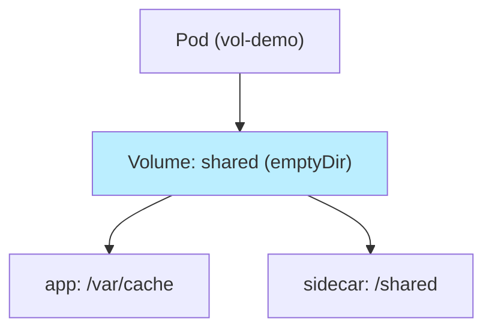
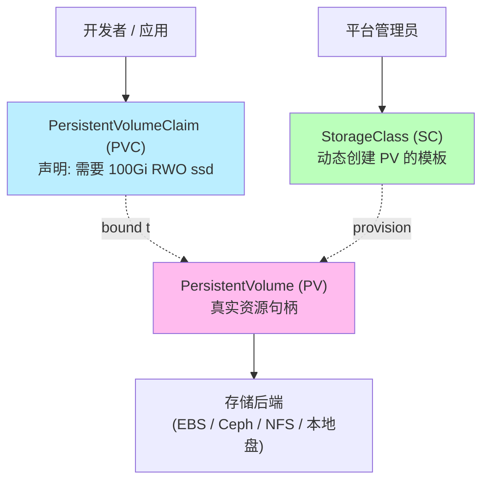
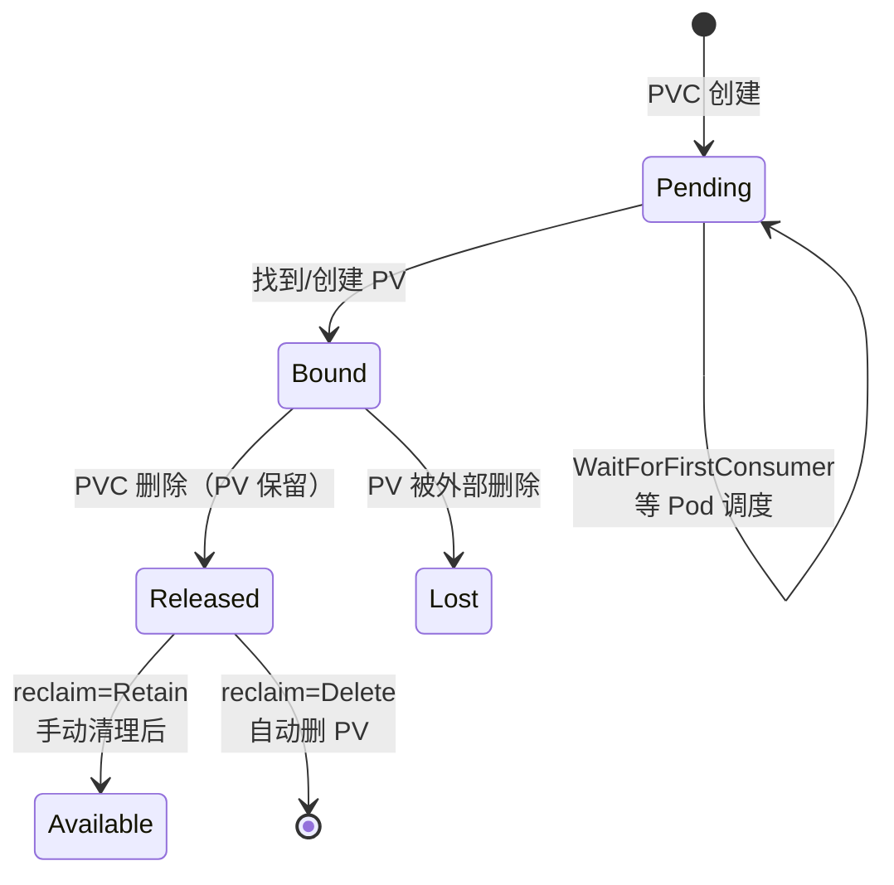
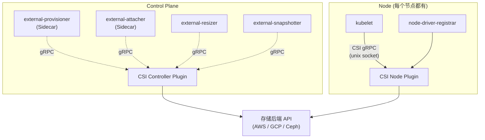
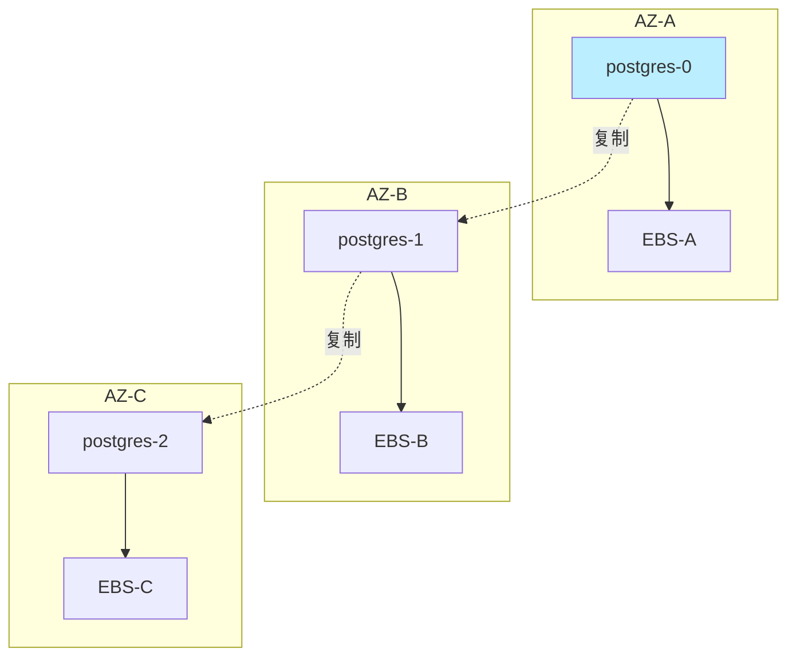

# 精通 Storage 与 PVC：Volume、PV/PVC/StorageClass、CSI 与有状态生产实践

> 课程编号：C07
> 路线图来源：云原生 · 模块三 资源与存储
> 难度：⭐⭐⭐⭐
> 预计阅读时间：90 分钟
> 内容基准：2026 年 6 月（Kubernetes 1.34/1.35、CSI spec v1.10、Velero 1.15+、Rook 1.15、Longhorn 1.7、OpenEBS 4.x）

---

## 引言：容器存储的"原罪"

容器最初的设计哲学是"无状态"——一个容器跑完就销毁，数据跟着消失。这套模型在 Web 前端、API Gateway、CDN 边缘节点这些场景下工作得很好。但凡是写过一行 SQL、跑过一次 Kafka、配过一台 Redis 的工程师都知道：**真实业务的"重心"几乎都在有状态**。

K8s 早期甚至默认不推荐跑数据库——"先把无状态做好，状态留给云厂商托管"是 2017-2019 年的主流建议。但 2020 年之后，CSI 标准化、Operator 成熟、StatefulSet 改进，让"K8s 上跑生产数据库"从禁忌变成主流。2026 年的现状：**Postgres / MySQL / Redis / Kafka / MinIO / 向量库**，绝大多数严肃业务都在 K8s 上落地有状态部署。

但代价是：你必须真的理解存储这一层——不是当黑盒。否则你会撞上：

- PVC 卡在 Pending 永远 bound 不上
- 跨可用区调度让 Pod 永远起不来
- 删完 PVC 后底层 EBS 卷悄悄留下账单
- StatefulSet 扩容时第 4 个 Pod 等了 30min 才有 PV
- Velero 备份恢复后 Pod 起不来——因为 Region 跨了
- RWX 文件系统的 Postgres 比单盘慢 5 倍
- 集群升级后 in-tree volume plugin 被移除，所有 PVC 失联

这一篇拆开 K8s 存储的完整模型：从 `Volume` 这个最底层的概念，到 `PersistentVolume` / `PersistentVolumeClaim` / `StorageClass` 三层抽象，再到 `CSI`（Container Storage Interface）驱动架构、`VolumeSnapshot` 备份、`StatefulSet` 持久化、跨可用区调度、生产备份恢复。读完后你不仅能看懂任何 PVC YAML、写出生产级 StatefulSet，还能在 Pod 起不来时第一时间定位是 PVC、SC、CSI 还是节点的问题。

读者要求：熟悉 Pod / Deployment / StatefulSet 基本概念（见 C02）、知道 Kubernetes Controller Loop 模型、看得懂 YAML、用过 `kubectl` 和云厂商一种磁盘。

---

## 第一章：Volume——Pod 内最基础的存储抽象

### 1.1 一切的起点：Volume

K8s 的 `Volume` 不是"一块盘"——它是 **Pod 内多个容器共享的一个目录**。Volume 的生命周期**绑定到 Pod**（不是容器）：Pod 重启容器不会丢 Volume，Pod 整体销毁 Volume（多数类型）才销毁。

```yaml
apiVersion: v1
kind: Pod
metadata:
  name: vol-demo
spec:
  containers:
    - name: app
      image: nginx
      volumeMounts:
        - name: shared
          mountPath: /var/cache
    - name: sidecar
      image: busybox
      command: ["sh", "-c", "while true; do echo $(date) >> /shared/log; sleep 5; done"]
      volumeMounts:
        - name: shared
          mountPath: /shared
  volumes:
    - name: shared
      emptyDir: {}
```

这是最经典的 Volume 用法——两个容器共享同一个 `shared` 目录。`volumes` 在 Pod spec 顶层定义，`volumeMounts` 在容器级别引用。



K8s 内置约 **20+ 种** Volume 类型。2026 年实际生产中常用的不到一半，下面只讲这些。

### 1.2 emptyDir：Pod 内临时盘

```yaml
volumes:
  - name: scratch
    emptyDir: {}                # 默认存节点本地盘
  - name: ramdisk
    emptyDir:
      medium: Memory            # tmpfs，存内存
      sizeLimit: 1Gi
```

特点：

- **Pod 删除时一起销毁**——重启容器留住，删 Pod 没了
- 默认存储在节点的 `/var/lib/kubelet/pods/<pod-uid>/volumes/kubernetes.io~empty-dir/<name>`
- `medium: Memory` 走 tmpfs（内存）——速度极快但占内存
- 1.32 起 emptyDir 的 `sizeLimit` 默认走 ephemeral storage 配额——容器写超量被驱逐

典型用途：
- 多容器共享缓存（如 sidecar 与主容器交换文件）
- 计算中间结果（Job 解压、临时大文件）
- 内存盘加速（小 Redis、临时索引）

### 1.3 hostPath：直接挂节点目录

```yaml
volumes:
  - name: docker-sock
    hostPath:
      path: /var/run/docker.sock
      type: Socket
  - name: host-logs
    hostPath:
      path: /var/log/myapp
      type: DirectoryOrCreate
```

`type` 决定预期类型与是否自动创建：

| type | 行为 |
|---|---|
| `""` | 不校验 |
| `Directory` | 必须存在且是目录 |
| `DirectoryOrCreate` | 不存在则创建（0755 / kubelet 用户） |
| `File` | 必须存在且是普通文件 |
| `FileOrCreate` | 不存在则创建 |
| `Socket` | 必须是 socket |
| `CharDevice` / `BlockDevice` | 设备文件 |

**生产警告**：`hostPath` 是**安全大坑**。

- 容器逃逸面：挂 `/`、`/var/run/docker.sock`、`/proc` 等都能轻松提权
- 调度漂移：Pod 飘到另一台节点，数据丢失
- Pod Security Admission `restricted` profile 默认禁止 hostPath

合法场景仅限：**节点级 agent / DaemonSet**（CNI、CSI driver、node-exporter、Falco、Fluentbit）。业务 Pod 用 hostPath = 等出事。

### 1.4 configMap / secret：配置投射

详见 C05，这里只总结挂载形态：

```yaml
volumes:
  - name: cfg
    configMap:
      name: app-config
      items:                          # 选择性投射
        - key: app.yaml
          path: app.yaml              # 改名
          mode: 0444
      defaultMode: 0444
  - name: secrets
    secret:
      secretName: db-credentials
      defaultMode: 0400               # secret 默认 0644，应改严
```

ConfigMap / Secret 挂载到容器后是**只读 tmpfs**——即使容器 `chmod` 也不会影响。修改 ConfigMap 后**默认会同步**到 Pod（约 60-120s 由 kubelet 检测）——但**环境变量形式不会更新**。所以热更新配置走文件挂载，不走 env。

### 1.5 projected：多源投射合一

```yaml
volumes:
  - name: combined
    projected:
      sources:
        - configMap:
            name: app-config
        - secret:
            name: db-credentials
        - downwardAPI:
            items:
              - path: "labels"
                fieldRef:
                  fieldPath: metadata.labels
        - serviceAccountToken:
            audience: vault
            expirationSeconds: 3600
            path: vault-token
```

`projected` 把多个源（ConfigMap、Secret、DownwardAPI、ServiceAccountToken）合并到**一个挂载点**，避免 spec 里堆 5 个 mountPath。`serviceAccountToken` 投射是 BoundServiceAccountToken 的标配——配 Vault / 云 IAM 时几乎一定要用。

### 1.6 persistentVolumeClaim：真正持久化的入口

```yaml
volumes:
  - name: data
    persistentVolumeClaim:
      claimName: pgdata
```

PVC 才是 K8s 持久化存储的"正门"。剩下的章节都围绕它展开。

---

## 第二章：PV / PVC / StorageClass 三层抽象

### 2.1 为什么是三层



三层的角色分工：

| 对象 | 谁创建 | 含义 | 范围 |
|---|---|---|---|
| **PV** | 静态：管理员；动态：CSI provisioner | 真实存储资源（一块盘/一个 NFS 路径） | **集群级**（无 namespace） |
| **PVC** | 应用 / 开发者 | "我需要多大 / 什么 access mode" | namespace 级 |
| **SC** | 平台管理员 | 动态供应 PV 的模板（driver、参数、binding mode） | 集群级 |

为什么要拆三层？早期 K8s 只有 PVC ↔ PV（静态供应）：管理员预先创建一批 PV，应用 PVC 自动 bind 一个。但这模式太重——开发者总得等管理员。**StorageClass + 动态供应**解决了：PVC 请求一来，CSI driver 立刻按 SC 模板**自动创建** PV，开发者不用等。

### 2.2 静态供应（已较少用）

```yaml
# 1. 管理员手动建一个 NFS PV
apiVersion: v1
kind: PersistentVolume
metadata:
  name: pv-nfs-001
spec:
  capacity:
    storage: 50Gi
  accessModes: ["ReadWriteMany"]
  persistentVolumeReclaimPolicy: Retain
  nfs:
    server: nfs.example.com
    path: /export/data1
  storageClassName: ""       # 静态供应时显式为空字符串
---
# 2. 应用 PVC
apiVersion: v1
kind: PersistentVolumeClaim
metadata:
  name: legacy-data
spec:
  accessModes: ["ReadWriteMany"]
  resources:
    requests:
      storage: 50Gi
  storageClassName: ""       # 必须显式空串才会匹配静态 PV
  volumeName: pv-nfs-001     # 可选：直接绑定到指定 PV
```

K8s 的 PV controller 会用以下规则匹配：accessModes 子集匹配、capacity ≥ 请求量、storageClassName 相同、selector 标签匹配。能 bind 上的就 bound。

静态供应**今天仍有用**的场景：

- 已有 NFS / SAN 共享存储池（不想跑 CSI driver）
- 不允许动态创建底层资源（合规 / 配额）
- 测试集群快速挂个固定盘

### 2.3 动态供应（主流）

```yaml
# 1. 集群只需要一次：创建 StorageClass
apiVersion: storage.k8s.io/v1
kind: StorageClass
metadata:
  name: gp3-encrypted
provisioner: ebs.csi.aws.com
parameters:
  type: gp3
  iops: "3000"
  throughput: "125"
  encrypted: "true"
  kmsKeyId: arn:aws:kms:us-east-1:123:key/abc-def
reclaimPolicy: Delete
allowVolumeExpansion: true
volumeBindingMode: WaitForFirstConsumer
mountOptions:
  - noatime
---
# 2. 应用 PVC——动态触发
apiVersion: v1
kind: PersistentVolumeClaim
metadata:
  name: postgres-data
spec:
  accessModes: ["ReadWriteOnce"]
  storageClassName: gp3-encrypted
  resources:
    requests:
      storage: 100Gi
```

只要这个 PVC 一被创建，CSI provisioner 会：

1. 监听 PVC 事件，发现 StorageClass 匹配
2. 调 AWS API 创建 EBS gp3 卷
3. K8s API 创建对应 PV，自动 bind PVC
4. Pod 调度后，CSI node plugin 在节点上 attach 卷、mount 到 Pod 路径

整个过程几秒到几十秒。开发者 100% 不需要管 PV。

### 2.4 PVC 生命周期与状态



PVC 状态可见：

```bash
$ kubectl get pvc
NAME            STATUS   VOLUME                CAPACITY   ACCESS MODES   STORAGECLASS    AGE
postgres-data   Bound    pvc-7f8b...           100Gi      RWO            gp3-encrypted   2m
```

PV 状态：

| PV 状态 | 含义 |
|---|---|
| `Available` | 没有任何 PVC 绑定，可被新 PVC 拿走 |
| `Bound` | 已与某个 PVC 绑定 |
| `Released` | PVC 删除了，但 PV 还在（reclaim=Retain） |
| `Failed` | 自动回收失败 |

### 2.5 binding mode：Immediate vs WaitForFirstConsumer

```yaml
volumeBindingMode: Immediate              # 默认
# 或
volumeBindingMode: WaitForFirstConsumer
```

- **Immediate**：PVC 创建立刻 provision PV、立刻 bind。问题是 PV 创建出来后**所在 AZ 锁定**——如果之后 Pod 被调度到别的 AZ，永远 attach 不上。
- **WaitForFirstConsumer**（WFFC）：PVC 创建后**等到第一个 Pod 调度好**，再决定在哪个 AZ provision PV。这才是云盘的正确姿势。

**2026 生产唯一正确选择**：`WaitForFirstConsumer`。云厂商的默认 SC 现在基本都已经默认 WFFC（AWS / GCP / Azure 都是）。

---

## 第三章：accessModes——RWO / ROX / RWX / RWOP

`accessModes` 描述卷的**多节点访问能力**。注意是**节点级**而不是 Pod 级——这个常被新手误读。

### 3.1 四种模式

| 缩写 | 全名 | 含义 |
|---|---|---|
| **RWO** | ReadWriteOnce | 同时只能被**一个节点**挂载读写 |
| **ROX** | ReadOnlyMany | 多个节点同时只读挂载 |
| **RWX** | ReadWriteMany | 多个节点同时读写挂载 |
| **RWOP** | ReadWriteOncePod | 同时只能被**一个 Pod**挂载读写（1.29 GA） |

### 3.2 RWO 是云盘的默认

EBS / GCP PD / Azure Disk 这些"块存储"本质是**一对一**附加到一台 VM。它们一定是 **RWO**：

```yaml
accessModes: ["ReadWriteOnce"]
```

RWO 不限制同一节点上有多少个 Pod 挂——理论上同一节点上 5 个 Pod 可以挂同一个 PVC（实际数据库等不会这么做，但有时 sidecar 共享是合法的）。

### 3.3 RWX：共享文件系统

**只有共享文件系统**才能 RWX：

- NFS（最经典）
- CephFS（Rook）
- Longhorn（带 RWX 模式）
- AWS EFS / GCP Filestore / Azure Files
- JuiceFS / Alluxio / OpenEBS NFS provisioner

```yaml
accessModes: ["ReadWriteMany"]
storageClassName: efs-sc
```

**RWX 的"陷阱"**：

1. **性能远低于 RWO**——NFS / CephFS 的 IOPS、延迟普遍是云盘的 1/3 到 1/10
2. **文件锁不可靠**——分布式 NFS 的 flock / fcntl 实现不一致
3. **Postgres / MySQL / etcd 这种走 fsync 的库不要用 RWX**——出过太多数据损坏 case

合法 RWX 场景：

- Web 服务共享静态资源（图片、HTML）
- AI / ML 共享模型权重、训练数据集
- CI 共享 build cache
- 多 Pod 读同一份配置 / 软件包

### 3.4 RWOP：Pod 级独占（1.29 GA）

```yaml
accessModes: ["ReadWriteOncePod"]
```

跟 RWO 的差别：**RWO 同节点多 Pod 可共享，RWOP 同节点也只能一个 Pod**。

用途：**避免 StatefulSet 滚动时新旧 Pod 同时挂同一个卷**——RWO 时这种情况会出现（同节点新旧 Pod 同时存在的几秒），RWOP 直接禁止。

数据库类工作负载 2026 年的最佳实践是 **RWOP + StatefulSet**。

### 3.5 同一 PV 多 mode

```yaml
accessModes: ["ReadWriteOnce", "ReadOnlyMany"]
```

PV 可以声明支持多种模式——PVC 绑定时按所需 mode 选其一。但运行时**一个 Pod 用一种 mode**，不能切换。

### 3.6 一张表对比

| 类型 | 典型 backend | accessMode | 性能 | 跨 AZ |
|---|---|---|---|---|
| 云盘 | EBS / PD / Disk | RWO / RWOP | 高 | 不能（锁定 AZ） |
| 本地盘 | Local PV / TopoLVM | RWO | 极高 | 不能（锁定节点） |
| NFS | nfs-server / EFS | RWX | 中-低 | 可以 |
| 分布式块 | Ceph RBD / Longhorn | RWO / RWX | 中 | 可以 |
| 分布式文件 | CephFS / JuiceFS | RWX | 中 | 可以 |
| 对象 | S3（via Mountpoint / s3fs） | RWX | 高吞吐低 IOPS | 可以 |

---

## 第四章：reclaimPolicy 与 PV 回收

### 4.1 三种策略（一种已废）

| 策略 | 行为 | 2026 状态 |
|---|---|---|
| `Retain` | PVC 删除后，PV 保留（状态 Released），底层数据**不删** | 主流 |
| `Delete` | PVC 删除后，PV **和底层资源（EBS、磁盘）都删** | 主流 |
| `Recycle` | PVC 删除后，运行 `rm -rf` 清空 PV 后变 Available | **长期 deprecated，至今未移除（不建议使用）** |

`Recycle` 早就被废弃（K8s 1.11 起 deprecated），但截至 1.33+ 仍被支持、并未移除（仅 NFS/HostPath 支持，官方建议用动态供应替代）——不要再用。

### 4.2 Retain：默认保险

```yaml
apiVersion: storage.k8s.io/v1
kind: StorageClass
metadata:
  name: critical-data
reclaimPolicy: Retain
```

**生产数据库的标配**：误删 PVC 还能从 PV 恢复。

恢复流程：

```bash
# 1. PVC 被误删后，PV 进入 Released
$ kubectl get pv pvc-7f8b...
NAME         CAPACITY   STATUS     RECLAIM POLICY
pvc-7f8b...  100Gi      Released   Retain

# 2. 清掉 claimRef，让 PV 回到 Available
$ kubectl patch pv pvc-7f8b... -p '{"spec":{"claimRef":null}}'

# 3. 创建新 PVC 指向这个 PV
$ kubectl apply -f - <<EOF
apiVersion: v1
kind: PersistentVolumeClaim
metadata:
  name: postgres-data-restored
spec:
  accessModes: ["ReadWriteOnce"]
  resources:
    requests:
      storage: 100Gi
  volumeName: pvc-7f8b...   # 指向旧 PV
  storageClassName: critical-data
EOF
```

### 4.3 Delete：自动清理

```yaml
reclaimPolicy: Delete
```

PVC 一删，CSI driver 调云 API 删 EBS 卷——底层资源**真的消失**。

适合：开发环境、临时数据、Cache、明确不要的数据。

**坑**：很多用户在生产环境用了云厂商的默认 SC（多数是 Delete），下次升级时手滑删 PVC，数据库瞬间没了。

### 4.4 修改 reclaimPolicy

PV 创建后还能改：

```bash
$ kubectl patch pv pvc-7f8b... -p '{"spec":{"persistentVolumeReclaimPolicy":"Retain"}}'
```

但**改 StorageClass 的 reclaimPolicy 不影响已存在的 PV**——只影响后续动态创建的。

### 4.5 实战建议

```yaml
# 生产数据库
apiVersion: storage.k8s.io/v1
kind: StorageClass
metadata:
  name: database
provisioner: ebs.csi.aws.com
reclaimPolicy: Retain                # ← 数据库一律 Retain
allowVolumeExpansion: true
volumeBindingMode: WaitForFirstConsumer
parameters:
  type: gp3
  encrypted: "true"
---
# 缓存 / 临时数据
apiVersion: storage.k8s.io/v1
kind: StorageClass
metadata:
  name: cache
provisioner: ebs.csi.aws.com
reclaimPolicy: Delete                # ← 缓存可以 Delete
allowVolumeExpansion: true
volumeBindingMode: WaitForFirstConsumer
parameters:
  type: gp3
```

---

## 第五章：CSI——Container Storage Interface

### 5.1 为什么有 CSI

K8s 1.13 之前，所有存储驱动**编译进 kubelet 二进制**（叫 in-tree volume plugin）。每加一个云厂商存储就要改 K8s 源码、发版、所有用户升级。这导致：

- K8s 版本与存储驱动绑死
- 厂商驱动 bug 影响整个 kubelet
- 上游 K8s 团队维护成本爆炸

**CSI（Container Storage Interface）** 是 2017 年 K8s / Mesos / Docker 联合发起的**跨编排器标准**：把存储驱动从 K8s 里抽出来变成**独立进程**（一般是 DaemonSet + Deployment），通过 gRPC 与 K8s 通讯。

2026 年 K8s 已经几乎所有 in-tree 都迁移到 CSI Migration（EBS、PD、Azure Disk、Cinder、vSphere、Portworx 等都迁完了），in-tree 代码逐步删除。**写新代码必须用 CSI**。

### 5.2 CSI 架构



主要组件：

| 组件 | 部署形态 | 职责 |
|---|---|---|
| **CSI Driver** | 厂商提供 | 实现 CSI gRPC 接口 |
| **external-provisioner** | Deployment | 监听 PVC，调 CSI `CreateVolume` |
| **external-attacher** | Deployment | 监听 VolumeAttachment，调 `ControllerPublishVolume` |
| **external-resizer** | Deployment | 监听 PVC 容量变化 |
| **external-snapshotter** | Deployment | 监听 VolumeSnapshot，调快照接口 |
| **node-driver-registrar** | DaemonSet | 向 kubelet 注册 CSI driver |

### 5.3 CSI 三大 RPC 接口

CSI 把存储操作分为三类：

```
1. Identity Service     ← driver 元信息
   - GetPluginInfo
   - GetPluginCapabilities
   - Probe

2. Controller Service   ← 控制面（创建/删除/快照）
   - CreateVolume
   - DeleteVolume
   - ControllerPublishVolume    (= attach)
   - ControllerUnpublishVolume  (= detach)
   - CreateSnapshot / DeleteSnapshot
   - ControllerExpandVolume

3. Node Service         ← 节点面（挂载/格式化）
   - NodeStageVolume       (= 全局挂载到 /var/lib/kubelet/plugins/.../staging)
   - NodePublishVolume     (= 从 staging bind mount 到 Pod 路径)
   - NodeUnpublishVolume
   - NodeUnstageVolume
   - NodeExpandVolume       (= 在线扩容文件系统)
```

完整的 PV 从创建到挂载的链路：

```
PVC 创建
  → external-provisioner 监听
  → CSI Controller.CreateVolume         ← 调云 API 建盘
  → PV 创建
  → Pod 调度到 Node N
  → external-attacher 创建 VolumeAttachment
  → CSI Controller.ControllerPublishVolume   ← attach 盘到 Node N
  → kubelet 调用 CSI Node.NodeStageVolume    ← 全局挂载、格式化
  → kubelet 调用 CSI Node.NodePublishVolume  ← bind mount 到 Pod 路径
  → 容器启动，看到 /data 目录
```

整个过程任何一步失败都会导致 Pod 卡在 ContainerCreating。

### 5.4 CSI driver 速览

| Driver | 后端 | 备注 |
|---|---|---|
| `ebs.csi.aws.com` | AWS EBS | gp3 是 2026 主流；io2 高 IOPS |
| `disk.csi.azure.com` | Azure Disk | Premium SSD v2 |
| `pd.csi.storage.gke.io` | GCE PD | balanced / ssd |
| `rook-ceph.cephfs.csi.ceph.com` | CephFS | RWX |
| `rook-ceph.rbd.csi.ceph.com` | Ceph RBD | RWO |
| `driver.longhorn.io` | Longhorn | 自研分布式块，RWO/RWX |
| `csi.openebs.io` (LocalPV) | 本地盘 + LVM/ZFS | 高性能本地 |
| `topolvm.io` | TopoLVM | LVM 动态切分本地盘 |
| `cephfs.csi.ceph.com` / `rbd.csi.ceph.com` | 独立 Ceph | 不用 Rook 的情况 |
| `s3.csi.aws.com` | Mountpoint for S3 | 对象存储挂载，特殊语义 |
| `efs.csi.aws.com` | AWS EFS | RWX |

查集群正在跑哪些 driver：

```bash
$ kubectl get csidriver
NAME                       ATTACHREQUIRED   PODINFOONMOUNT   STORAGECAPACITY   MODES
ebs.csi.aws.com            true             false            true              Persistent
efs.csi.aws.com            false            false            false             Persistent
```

### 5.5 in-tree 迁移现状

K8s 1.27+ 默认启用 CSI Migration（in-tree 调用自动转 CSI）。1.30+ 开始陆续移除 in-tree 代码。**升级集群前一定要确认所有 PVC 已经迁完**：

```bash
# 检查 PV 的 source（如果还是 awsElasticBlockStore 而不是 csi 字段，需要迁移）
$ kubectl get pv -o json | jq '.items[].spec | keys'
```

迁移命令各厂商不同，通常是更新 CSI driver 后让 kubelet 重启自动迁移。

---

## 第六章：常见存储后端选型

### 6.1 本地盘：极致性能

**Local PV** 是 K8s 原生支持（不需要 CSI）：

```yaml
apiVersion: v1
kind: PersistentVolume
metadata:
  name: local-pv-1
spec:
  capacity:
    storage: 500Gi
  accessModes: ["ReadWriteOnce"]
  persistentVolumeReclaimPolicy: Retain
  storageClassName: local-storage
  local:
    path: /mnt/disks/ssd1
  nodeAffinity:
    required:
      nodeSelectorTerms:
        - matchExpressions:
            - key: kubernetes.io/hostname
              operator: In
              values: ["node-1"]
```

**特点**：

- 性能极高（直接走节点 NVMe）
- 但与节点强绑定：节点挂了数据可能丢
- 必须显式 nodeAffinity（不会自动调度）
- WFFC 几乎是强制（否则 Pod 起不来）

升级方案：

| 方案 | 特点 |
|---|---|
| **OpenEBS LocalPV** | 把节点本地盘做成动态供应；支持 hostpath / device / LVM / ZFS |
| **TopoLVM** | LVM 动态切分；支持 thin provisioning、snapshot |
| **OpenEBS Mayastor** | 高性能 SPDK；NVMe-oF |

实战推荐：**OpenEBS LocalPV-LVM** 或 **TopoLVM**。优势：

- 动态供应（不用手建 PV）
- 支持 snapshot
- 容量超额配置（thin provisioning）
- 节点失效时数据丢失风险**仅限单节点范围**（业务层做副本即可）

适合：Kafka、Elasticsearch、ClickHouse、Cassandra、TiKV、etcd 等**自带副本机制**的有状态系统——它们不需要存储层再复制一份。

### 6.2 云盘：稳定够用

```yaml
# AWS EBS gp3
apiVersion: storage.k8s.io/v1
kind: StorageClass
metadata:
  name: ebs-gp3
provisioner: ebs.csi.aws.com
volumeBindingMode: WaitForFirstConsumer
allowVolumeExpansion: true
parameters:
  type: gp3
  iops: "3000"
  throughput: "125"
  encrypted: "true"
  kmsKeyId: "alias/k8s-ebs"
reclaimPolicy: Retain
```

云盘的好处：

- 完全托管，**节点挂掉数据不丢**（云厂商保证）
- 跨 AZ 复制（同 AZ 多副本，但**不跨 AZ**——这点要记牢）
- 备份方便（云原生 snapshot）

**关键参数**：

| 参数 | AWS EBS | GCP PD | Azure Disk |
|---|---|---|---|
| 通用 SSD | gp3 | balanced / ssd | Premium SSD v2 |
| 高 IOPS | io2 / io2 Block Express | extreme | Ultra Disk |
| 廉价 | st1 / sc1 | standard | Standard HDD |
| IOPS 上限 | 256k (io2 BE) | 100k | 160k |
| 跨 AZ | ❌ | ❌ | ❌ |

**生产 tip**：跑 PostgreSQL / MySQL，gp3 默认 3000 IOPS 通常**远远不够**。先用 `iostat` 算业务 IOPS，再设 SC：

```yaml
parameters:
  type: gp3
  iops: "12000"      # 上限 16000
  throughput: "500"  # 上限 1000 MiB/s
```

### 6.3 分布式存储：Ceph / Longhorn / Rook

#### Rook + Ceph

最经典的"自建分布式块存储"方案。Rook 是 Operator，把 Ceph 集群通过 CRD 管理：

```yaml
apiVersion: ceph.rook.io/v1
kind: CephCluster
metadata:
  name: rook-ceph
  namespace: rook-ceph
spec:
  cephVersion:
    image: quay.io/ceph/ceph:v18.2.4
  storage:
    useAllNodes: false
    useAllDevices: false
    nodes:
      - name: "node-1"
        devices:
          - name: "nvme0n1"
      - name: "node-2"
        devices:
          - name: "nvme0n1"
      - name: "node-3"
        devices:
          - name: "nvme0n1"
  mon:
    count: 3
    allowMultiplePerNode: false
```

Rook 自动建 Ceph mon / OSD / MDS / RGW，自动注册 CSI driver。一个集群提供：

- **RBD（块设备）** — RWO，给数据库
- **CephFS（文件系统）** — RWX，给共享数据
- **RGW（对象）** — S3 协议

适合：自建机房、不想绑死云厂商、需要 RWX。代价：**运维复杂**——Ceph 集群本身的运维比 K8s 还重。

#### Longhorn

Rancher 出品的分布式块存储，K8s 原生：

```yaml
apiVersion: longhorn.io/v1beta2
kind: Engine
# Longhorn 把 Pod 数据复制到多个节点（默认 3 副本）
```

特点：
- 安装超简单（一键 Helm chart）
- 默认 3 副本
- 内置 snapshot / backup（可推 S3）
- 支持 RWX（通过 NFS 转发实现）
- 性能弱于 Ceph，胜在易用

适合：中小集群、不想运维 Ceph 的团队、边缘集群。

### 6.4 选型矩阵

| 场景 | 推荐 |
|---|---|
| 云上单 AZ 应用 | 云盘（gp3 / pd-ssd） |
| 云上跨 AZ 应用 | 应用层多副本 + 多 AZ 节点池 + 云盘 |
| 高性能数据库（Postgres / MySQL） | gp3 (12k+ IOPS) 或 io2 |
| Kafka / ES / Cassandra | OpenEBS LocalPV-LVM + 业务层副本 |
| 需要 RWX 共享 | EFS / Filestore / CephFS / Longhorn(RWX) |
| 私有云自建 | Rook+Ceph（大集群） / Longhorn（中小） |
| 边缘 / 单节点 | OpenEBS Hostpath / LocalPV |
| 极致 IOPS（AI 训练） | LocalPV (NVMe) + 业务层副本 |

---

## 第七章：VolumeSnapshot 与备份

### 7.1 VolumeSnapshot CRD

K8s 通过三个 CRD 标准化快照（CSI snapshotter v1 GA 多年了）：

```yaml
# 1. VolumeSnapshotClass — 类似 StorageClass，定义如何打快照
apiVersion: snapshot.storage.k8s.io/v1
kind: VolumeSnapshotClass
metadata:
  name: ebs-snapshot
driver: ebs.csi.aws.com
deletionPolicy: Retain
parameters:
  encrypted: "true"
---
# 2. VolumeSnapshot — 用户的请求
apiVersion: snapshot.storage.k8s.io/v1
kind: VolumeSnapshot
metadata:
  name: postgres-snap-20260514
spec:
  volumeSnapshotClassName: ebs-snapshot
  source:
    persistentVolumeClaimName: postgres-data
---
# 3. VolumeSnapshotContent — 真实快照资源（类似 PV）
# 一般由 CSI snapshotter 自动创建
```

创建后查看：

```bash
$ kubectl get volumesnapshot
NAME                      READYTOUSE   SOURCEPVC        RESTORESIZE
postgres-snap-20260514    true         postgres-data    100Gi
```

### 7.2 从 snapshot 恢复 PVC

```yaml
apiVersion: v1
kind: PersistentVolumeClaim
metadata:
  name: postgres-data-restored
spec:
  accessModes: ["ReadWriteOnce"]
  storageClassName: ebs-gp3
  resources:
    requests:
      storage: 100Gi
  dataSource:
    name: postgres-snap-20260514
    kind: VolumeSnapshot
    apiGroup: snapshot.storage.k8s.io
```

CSI provisioner 看到 `dataSource` 是 snapshot，会从快照创建新卷。**比从备份恢复快得多**（云厂商通常是增量快照，几分钟出新卷）。

### 7.3 周期性快照

CSI 本身**不带定时**——只是单次操作。要周期性快照，常见做法：

1. **VolumeSnapshotSchedule（Longhorn / Velero 等扩展）**
2. **K8s CronJob 调 kubectl**：

```yaml
apiVersion: batch/v1
kind: CronJob
metadata:
  name: postgres-snap-daily
spec:
  schedule: "0 2 * * *"
  jobTemplate:
    spec:
      template:
        spec:
          serviceAccountName: snapshot-creator
          containers:
            - name: kubectl
              image: bitnami/kubectl:1.32
              command:
                - sh
                - -c
                - |
                  TS=$(date +%Y%m%d-%H%M)
                  cat <<EOF | kubectl apply -f -
                  apiVersion: snapshot.storage.k8s.io/v1
                  kind: VolumeSnapshot
                  metadata:
                    name: postgres-snap-${TS}
                    namespace: db
                  spec:
                    volumeSnapshotClassName: ebs-snapshot
                    source:
                      persistentVolumeClaimName: postgres-data
                  EOF
          restartPolicy: OnFailure
```

3. **Velero**（推荐生产用，下一节展开）。

### 7.4 一致性问题

CSI snapshot 是**卷级 / 块级**的，**不知道应用层状态**。直接 snapshot 一个跑着的 Postgres 卷，文件系统状态可能不一致（buffer 没刷盘）。生产做法：

- **fsfreeze**（CSI driver 支持时自动 freeze 文件系统）
- **应用层 hook**：`pre-freeze` 调 `pg_start_backup()`，`post-thaw` 调 `pg_stop_backup()`
- **逻辑备份兜底**：定期跑 `pg_dump`、`mysqldump`，与卷快照分层备份

Velero 等工具支持 PreHook / PostHook 协调应用一致性。

---

## 第八章：StatefulSet 持久化

### 8.1 volumeClaimTemplates

```yaml
apiVersion: apps/v1
kind: StatefulSet
metadata:
  name: postgres
spec:
  serviceName: postgres-headless
  replicas: 3
  selector:
    matchLabels:
      app: postgres
  template:
    metadata:
      labels:
        app: postgres
    spec:
      containers:
        - name: postgres
          image: postgres:16
          volumeMounts:
            - name: data
              mountPath: /var/lib/postgresql/data
  volumeClaimTemplates:
    - metadata:
        name: data
      spec:
        accessModes: ["ReadWriteOnce"]
        storageClassName: ebs-gp3
        resources:
          requests:
            storage: 100Gi
  persistentVolumeClaimRetentionPolicy:
    whenDeleted: Retain
    whenScaled: Delete
```

`volumeClaimTemplates` 是 StatefulSet 与 Deployment 最大的差别——每个 Pod 拿到**专属**的 PVC：

```
postgres-0 → data-postgres-0
postgres-1 → data-postgres-1
postgres-2 → data-postgres-2
```

PVC 名字格式：`<volumeClaimTemplate.name>-<statefulset.name>-<ordinal>`。这意味着：

- Pod 重启后挂回同一个 PVC（数据延续）
- 滚动升级新 Pod 用旧 PVC
- 缩容时（默认）PVC 不删——再扩容回来还是同一份数据

### 8.2 PVC 保留策略（1.27 GA）

```yaml
persistentVolumeClaimRetentionPolicy:
  whenDeleted: Retain        # StatefulSet 删除时
  whenScaled: Delete         # 缩容时
```

| 字段 | 选项 | 含义 |
|---|---|---|
| `whenDeleted` | Retain / Delete | StatefulSet 整体删除时 PVC 怎么处理 |
| `whenScaled` | Retain / Delete | 缩容时被裁掉的 Pod 对应 PVC 怎么处理 |

**生产推荐**：

- 数据库 / 关键数据：`whenDeleted: Retain` + `whenScaled: Retain`（保险）
- Kafka / ES / Cache：`whenDeleted: Retain` + `whenScaled: Delete`（缩容后实例下线，数据无意义）

### 8.3 顺序性与 PVC

StatefulSet 滚动 / 启动**严格按 ordinal 顺序**——但 PVC 创建是**并行**的（1.27+ 默认）。这导致一个常见误区：

> "我创建 5 副本 StatefulSet，5 个 PVC 一起 Pending 等 PV——这是 bug 吗？"

不是 bug——是行为。PVC 是 Pod 调度前就触发创建的。Pod 才严格按顺序起。

### 8.4 单 Pod 多卷

```yaml
volumeClaimTemplates:
  - metadata:
      name: data
    spec: ...   # 数据盘
  - metadata:
      name: wal
    spec: ...   # WAL 单独一块（高 IOPS）
```

PostgreSQL 把 `wal` 单独放一块 io2 高 IOPS 盘，是生产常见做法。

### 8.5 跨可用区调度

```yaml
apiVersion: apps/v1
kind: StatefulSet
metadata:
  name: cassandra
spec:
  ...
  template:
    spec:
      topologySpreadConstraints:
        - maxSkew: 1
          topologyKey: topology.kubernetes.io/zone
          whenUnsatisfiable: DoNotSchedule
          labelSelector:
            matchLabels:
              app: cassandra
```

把 3 个 Cassandra Pod 强制分散到 3 个 AZ——配合 WFFC 的 SC，PV 跟 Pod 同 AZ 创建。

但**注意**：一旦 Pod 进入"重启循环"，调度器试图把它重新调度到原 AZ（因为 PVC 锁了），如果原 AZ 挂了——Pod 永远起不来。生产数据库 K8s 部署最大的坑就是这条。

---

## 第九章：Volume Expansion / Resize

### 9.1 启用 expansion

```yaml
apiVersion: storage.k8s.io/v1
kind: StorageClass
metadata:
  name: ebs-gp3
provisioner: ebs.csi.aws.com
allowVolumeExpansion: true     # ← 关键
```

CSI driver 支持 expansion 才能用（绝大多数现代 driver 支持）。

### 9.2 在线扩容

```bash
# 直接 edit PVC 或 patch
$ kubectl patch pvc postgres-data -p '{"spec":{"resources":{"requests":{"storage":"200Gi"}}}}'
```

K8s 控制平面：

1. `external-resizer` 监听 PVC 容量变化
2. 调 CSI `ControllerExpandVolume` — 在云端扩盘
3. 卷状态变 `FileSystemResizePending`
4. kubelet 检测到，调 CSI `NodeExpandVolume` — 在节点上 `resize2fs` / `xfs_growfs`
5. 文件系统扩到新容量

整个过程**应用不需要重启**（在线扩容）。`xfs` / `ext4` 都支持。

### 9.3 缩容不支持

K8s 至今**不支持缩容 PVC**（CSI spec 也没有 `ShrinkVolume`）。要"缩容"只能：
1. 新建小 PVC
2. 数据迁移
3. 删旧 PVC

### 9.4 StatefulSet 扩容存量 PVC

StatefulSet 的 `volumeClaimTemplates` 修改后**不影响存量 PVC**——只对新增的 Pod 生效。要扩容已存在的 PVC：

```bash
$ for i in 0 1 2; do
    kubectl patch pvc data-postgres-$i -p '{"spec":{"resources":{"requests":{"storage":"200Gi"}}}}'
  done
```

1.31+ 起有 alpha 特性 `RecursiveReadOnlyMounts` 和增强的 StatefulSet PVC 模板同步，但容量同步还不在 stable 之列。

### 9.5 速率限制

云厂商对 EBS 扩容有 cooldown（AWS 是 6 小时——同一卷扩完得等 6h 才能再扩）。生产**不要小步扩**，每次至少翻倍：

```bash
100Gi → 200Gi → 500Gi → 1Ti
```

而不是 100 → 110 → 120。

---

## 第十章：CSI Ephemeral / Generic Ephemeral

### 10.1 CSI Ephemeral Volume

某些 CSI driver 支持**完全 inline 的卷**（不需要 PVC）：

```yaml
apiVersion: v1
kind: Pod
metadata:
  name: vault-secret-injector
spec:
  containers:
    - name: app
      image: myapp
      volumeMounts:
        - name: secrets
          mountPath: /etc/secrets
  volumes:
    - name: secrets
      csi:
        driver: secrets-store.csi.k8s.io
        readOnly: true
        volumeAttributes:
          secretProviderClass: vault-secrets
```

典型例子：**Secrets Store CSI Driver**——挂载 Vault / AWS Secrets Manager 等动态密钥。**不需要 PVC**——卷生命周期完全跟 Pod 走。

### 10.2 Generic Ephemeral Volume

```yaml
apiVersion: v1
kind: Pod
metadata:
  name: scratch-pod
spec:
  containers:
    - name: app
      image: workload
      volumeMounts:
        - name: scratch
          mountPath: /scratch
  volumes:
    - name: scratch
      ephemeral:
        volumeClaimTemplate:
          metadata:
            labels:
              type: scratch
          spec:
            accessModes: ["ReadWriteOnce"]
            storageClassName: ebs-gp3
            resources:
              requests:
                storage: 50Gi
```

**generic ephemeral** 是 1.23 GA 的特性：在 Pod spec 里**内联 PVC template**。K8s 自动创建一个 PVC 跟 Pod 同生共死（Pod 删了 PVC 删，盘也删）。

适合：

- Job / CronJob 临时大盘
- AI 训练任务的临时数据集解压目录
- 跑完即扔的批处理

比 `emptyDir` 强的是：
- 支持**任意 StorageClass**（emptyDir 只能本地节点）
- 支持**任意大小**（emptyDir 受节点 ephemeral storage 限制）
- 支持**任意性能等级**（io2 高 IOPS）

比手动 PVC 强的是：
- 不需要写两个对象
- Pod 删 PVC 自动删（不会留垃圾）

---

## 第十一章：生产实践

### 11.1 数据库选型与卷配置

#### PostgreSQL 生产配置

```yaml
apiVersion: storage.k8s.io/v1
kind: StorageClass
metadata:
  name: postgres-prod
provisioner: ebs.csi.aws.com
volumeBindingMode: WaitForFirstConsumer
reclaimPolicy: Retain
allowVolumeExpansion: true
parameters:
  type: gp3
  iops: "12000"           # 远超默认 3000
  throughput: "500"
  encrypted: "true"
  kmsKeyId: alias/k8s-prod-db
mountOptions:
  - noatime               # 不写 access time（数据库不用）
  - nodiratime
---
apiVersion: apps/v1
kind: StatefulSet
metadata:
  name: postgres
  namespace: db
spec:
  serviceName: postgres-headless
  replicas: 3              # 主 + 2 副本（应用层复制）
  template:
    spec:
      affinity:
        podAntiAffinity:
          requiredDuringSchedulingIgnoredDuringExecution:
            - labelSelector:
                matchLabels:
                  app: postgres
              topologyKey: topology.kubernetes.io/zone
      containers:
        - name: postgres
          image: postgres:16
          resources:
            requests:
              cpu: 4
              memory: 16Gi
            limits:
              cpu: 8
              memory: 16Gi    # mem limit == request 避免 OOM 抖动
          volumeMounts:
            - name: data
              mountPath: /var/lib/postgresql/data
              subPath: pgdata
            - name: wal
              mountPath: /var/lib/postgresql/wal
  volumeClaimTemplates:
    - metadata: { name: data }
      spec:
        accessModes: ["ReadWriteOncePod"]    # RWOP 更安全
        storageClassName: postgres-prod
        resources:
          requests:
            storage: 500Gi
    - metadata: { name: wal }
      spec:
        accessModes: ["ReadWriteOncePod"]
        storageClassName: postgres-prod-wal  # 更高 IOPS 的盘
        resources:
          requests:
            storage: 100Gi
  persistentVolumeClaimRetentionPolicy:
    whenDeleted: Retain
    whenScaled: Retain
```

要点解释：

- **RWOP** 而不是 RWO——防新旧 Pod 同时挂卷
- **WFFC** 让 PV 与 Pod 同 AZ
- **podAntiAffinity** 跨 AZ 散开（应用层复制）
- WAL 单独一块盘，IOPS 不被数据盘抢
- `noatime` 减少元数据 I/O
- `whenScaled: Retain` 缩容后 PVC 保留（人工确认再删）
- mem `limit == request`（Postgres 对内存敏感）
- 用 [CloudNativePG](https://cloudnative-pg.io/) 这类 Operator 接管复制 / 备份才是 2026 正确姿势

#### Redis 生产配置

Redis 内存数据库——磁盘其实只为 RDB / AOF 持久化：

```yaml
volumeClaimTemplates:
  - metadata: { name: data }
    spec:
      accessModes: ["ReadWriteOnce"]
      storageClassName: ebs-gp3   # 一般够用
      resources:
        requests:
          storage: 50Gi           # 比内存大 1-2 倍即可（AOF 历史）
```

Redis 一般用 Sentinel / Cluster 模式跑多副本，单实例数据丢失风险可接受 — gp3 即可。

#### Kafka 生产配置

```yaml
volumeClaimTemplates:
  - metadata: { name: data }
    spec:
      accessModes: ["ReadWriteOnce"]
      storageClassName: openebs-lvm-localpv   # 本地盘 + 业务层副本
      resources:
        requests:
          storage: 2Ti
```

Kafka 有 ISR 副本机制——直接用本地盘最优。给业务层管副本数（`replication.factor=3`、`min.insync.replicas=2`）。

### 11.2 跨可用区策略

**核心矛盾**：云盘 PV **锁定 AZ**，但应用要跨 AZ 才高可用。



正确姿势：

1. **WFFC StorageClass** — PV 跟 Pod 同 AZ
2. **podAntiAffinity by zone** — Pod 散到不同 AZ
3. **应用层复制** — Postgres physical replication / Cassandra replication / Kafka ISR

错误姿势（常见踩坑）：

- 用 Immediate binding 然后期待 PV 跟 Pod 走
- 期待 EBS 卷能跨 AZ attach（不行）
- 一个 AZ 挂了，期待 Pod 自动飘到别的 AZ 复用旧 PV（不行）

### 11.3 Velero 备份恢复

Velero 是 K8s 生态的 **de facto** 备份工具：

```bash
# 安装
$ velero install \
    --provider aws \
    --plugins velero/velero-plugin-for-aws:v1.10.0 \
    --bucket velero-backups-prod \
    --backup-location-config region=us-east-1 \
    --snapshot-location-config region=us-east-1 \
    --use-volume-snapshots=true

# 创建备份
$ velero backup create db-daily-20260514 \
    --include-namespaces db \
    --snapshot-volumes=true \
    --include-resources persistentvolumeclaims,persistentvolumes,statefulsets,secrets,configmaps,services

# 查看备份
$ velero backup describe db-daily-20260514 --details
```

**Velero 干什么**：

1. 把 namespace 内 K8s 对象 export 成 YAML → S3
2. 调 CSI snapshot 给 PVC 打快照
3. 可选：用 **Restic / Kopia** 走 file-level 备份（不依赖 CSI snapshot）

恢复：

```bash
# 跨 namespace 恢复
$ velero restore create --from-backup db-daily-20260514 \
    --namespace-mappings db:db-restored

# 只恢复 PVC（数据迁移场景）
$ velero restore create --from-backup db-daily-20260514 \
    --include-resources persistentvolumeclaims,persistentvolumes
```

**核心 tips**：

- 跨 region 恢复需要 backup location 在 region B 也能访问
- VolumeSnapshot **不能跨 region**（云厂商 snapshot 是 region 内）；跨 region 恢复必须走 Restic / Kopia 文件级备份（速度慢但通用）
- 用 `--pre-hook` / `--post-hook` 协调应用一致性
- **生产强烈建议**：备份策略 = 卷快照（快速恢复） + Restic（跨 region 兜底）+ 应用层逻辑备份（pg_dump）

### 11.4 监控 storage 健康

关键指标：

| 指标 | Prometheus 表达 | 告警阈值 |
|---|---|---|
| 卷使用率 | `kubelet_volume_stats_used_bytes / kubelet_volume_stats_capacity_bytes` | > 80% warning, > 95% critical |
| 卷 IOPS | `rate(node_disk_reads_completed_total[5m])` | 接近 SC 上限 |
| CSI 操作失败率 | `csi_sidecar_operations_total{status!="ok"}` | > 1% |
| PVC Pending 时长 | `kube_persistentvolumeclaim_status_phase{phase="Pending"}` | > 10min |
| VolumeAttachment 失败 | `kubelet_volume_metric_collection_duration_seconds` | error 增长 |

Prometheus + Grafana 已有现成的 storage dashboard（kubernetes-mixin / kube-prometheus-stack 默认带）。

### 11.5 升级 K8s 时的存储注意事项

- 1.26+ 后 in-tree volume plugin 大量移除——升级前确认 PV 都已迁 CSI
- CSI driver 版本要跟着 K8s 版本走（厂商有 compatibility matrix）
- 升级前**强烈建议先做一次 Velero 全量备份**
- 跨大版本（1.27 → 1.30）建议中间停一站

---

## 第十二章：陷阱清单

### 12.1 PVC 卡 Pending 永远 bound 不上

症状：

```
$ kubectl get pvc
NAME            STATUS    VOLUME   CAPACITY   ACCESS MODES   STORAGECLASS   AGE
postgres-data   Pending                                       ebs-gp3        15m
```

排查顺序：

```bash
# 1. 看 PVC 事件
$ kubectl describe pvc postgres-data
# 关注 Events 区域

# 2. SC 是否存在
$ kubectl get sc ebs-gp3

# 3. CSI provisioner 是否运行
$ kubectl get pods -n kube-system | grep ebs-csi-controller

# 4. Provisioner 日志
$ kubectl logs -n kube-system deploy/ebs-csi-controller -c csi-provisioner

# 5. WFFC 时——Pod 是否已经被创建？没有 Pod 触发，PVC 永远 Pending
$ kubectl get pod -l app=postgres
```

常见原因：

- StorageClass 写错（`storageClassName` typo）
- CSI driver 没装 / 崩溃
- WFFC 但没 Pod 引用（这是**预期行为**——别误判为 bug）
- IAM 权限不足（云盘 driver 调云 API 失败）
- 超过云厂商配额（如 EBS 卷数 / 容量上限）
- AZ 没有可用容量（少见但偶尔）

### 12.2 RWX 慢得离谱

NFS / EFS / CephFS 跑 OLTP 数据库 — IOPS 比单盘低 5-10 倍是常态。**RWX 不要跑数据库**。

如果业务真的需要 RWX，做好预期管理：
- 用于"读多写少"场景（共享配置、模型权重）
- 不要拿来跑 fsync-heavy 应用
- 文件锁不可靠——别依赖

### 12.3 跨 zone 调度失败

```
Warning  FailedScheduling  ...  0/6 nodes are available: 6 node(s) had volume node affinity conflict
```

经典症状：Pod 之前在 AZ-A，AZ-A 挂了 → K8s 想把它调度到 AZ-B 节点 → 但 PVC 锁定 AZ-A 卷 → 永远调不上。

解决方案：
- **应用层做 HA**——Pod 死了让另一个 replica 接管（它在 AZ-B 有自己的 PV）
- **绝不要**期待 K8s 自己把数据搬到另一个 AZ
- 监控告警："多个 Pod 同时在一个 AZ" → 提前散开

### 12.4 删除 PVC 不删 PV / 反过来

```yaml
reclaimPolicy: Retain
```

下，删 PVC：

```bash
$ kubectl delete pvc postgres-data
```

PV 进入 `Released` 状态，云端 EBS 卷**还在**——继续计费。如果几个月没清理，账单可能比应用本身还贵。

定期巡检：

```bash
$ kubectl get pv | grep Released
# 确认是否需要清理
```

反过来——`reclaimPolicy: Delete` 时手滑删 PVC，云盘**立刻消失**。生产环境**严禁用 Delete + 关键数据**。

### 12.5 finalizer 阻塞 PVC / PV 删除

```bash
$ kubectl delete pvc postgres-data
persistentvolumeclaim "postgres-data" deleted
# 然后挂在 Terminating 状态半小时
```

原因：finalizer（如 `kubernetes.io/pvc-protection`）阻止删除——可能是 Pod 还在用、CSI 还在处理 detach、或者 CSI driver 死了。

诊断：

```bash
$ kubectl get pvc postgres-data -o json | jq '.metadata.finalizers'
[
  "kubernetes.io/pvc-protection"
]

# 看 PVC 是否还有 Pod 引用
$ kubectl get pod -A -o json | jq '.items[] | select(.spec.volumes[]?.persistentVolumeClaim.claimName=="postgres-data") | .metadata.name'
```

**警告**：直接 `kubectl patch -p '{"metadata":{"finalizers":null}}'` 移除 finalizer 是**核武器**——可能导致云端资源泄露或挂载残留。先确认根因。

### 12.6 节点重启后挂载残留

罕见但出过：节点 reboot 时 CSI driver 没干净 detach，重启后卷处于"VolumeAttachment 存在但实际未挂载"状态。表现：Pod 起来无法挂卷。

解决：
- 删 VolumeAttachment 对象（让 CSI 重新 attach）
- 节点上手动 `umount` 残留 mount point
- 重启 CSI node plugin

### 12.7 ConfigMap / Secret 改了但容器没生效

```yaml
volumes:
  - name: cfg
    configMap:
      name: app-config
```

ConfigMap 修改后**默认会同步到容器**——但有延迟（kubelet 60-120s）。而**用 env 注入的 ConfigMap 不会更新**——必须重启 Pod。

热更新最佳实践：
- 走文件挂载（不走 env）
- 应用监听文件变化（fsnotify）
- 或者 Reloader / Stakater 等 Operator 检测 ConfigMap/Secret 变化自动重启 Pod

### 12.8 ext4 vs xfs

CSI driver 默认 ext4。但跑大库（> 5TB）xfs 元数据扩展性更好：

```yaml
parameters:
  csi.storage.k8s.io/fstype: xfs
```

注意：**已经创建的 PVC 不能改 fstype**——只能新建。

### 12.9 大量 PVC 同时挂载

云厂商对单节点 attach 卷数有上限（AWS 28-39 / GCP 16 / Azure 32）。把 50 个 Pod 调度到一个节点 — 全部挂 PVC — 第 30 个开始 attach 失败。

监控：
```promql
sum by (node) (kubelet_volume_stats_capacity_bytes != 0)
```

接近上限的节点要扩容或限制调度。

### 12.10 StatefulSet 扩容时 PV 创建在错 AZ

`WaitForFirstConsumer` 应该解决这个——但有 bug case：StatefulSet 在 AZ-A 起了 3 个，扩到 4 时第 4 个 Pod 调度到 AZ-B 节点，PV 在 AZ-B 创建。后续节点维护把 Pod 调回 AZ-A，PV 在 AZ-B 取不回。

防御：
- `topologySpreadConstraints` 限定每个 AZ 副本数
- 监控"Pod 与 PV 不在同 AZ"

---

## 第十三章：2026 现状

### 13.1 主要变化

| 维度 | 2024 状态 | 2026 状态 |
|---|---|---|
| **CSI Migration** | 进行中 | EBS / GCE PD / Azure Disk / vSphere 全部完成；in-tree 代码大量删除 |
| **VolumeSnapshot** | GA | 主流；周期化通过 Velero / Operator 完成 |
| **PVC Retention Policy** | 1.27 GA | 生产标配 |
| **RecursiveReadOnlyMounts** | alpha | 1.31 beta |
| **VolumeAttributesClass** | 1.29 alpha | GA（1.34）；用于动态调整卷 IOPS/带宽 |
| **In-place Volume Expansion** | GA | 主流 |
| **Generic Ephemeral** | GA | 主流 |
| **CSI ephemeral inline** | GA | secrets-store / vault 标配 |

### 13.2 新趋势：VolumeAttributesClass（VAC）

K8s 1.29 引入 `VolumeAttributesClass`（1.34 GA，API 升级至 `storage.k8s.io/v1`）— 允许**不重建卷**就动态调 IOPS / throughput：

```yaml
apiVersion: storage.k8s.io/v1
kind: VolumeAttributesClass
metadata:
  name: ebs-high-iops
driverName: ebs.csi.aws.com
parameters:
  iops: "16000"
  throughput: "1000"
---
apiVersion: v1
kind: PersistentVolumeClaim
metadata:
  name: postgres-data
spec:
  resources: { requests: { storage: 500Gi } }
  storageClassName: ebs-gp3
  volumeAttributesClassName: ebs-high-iops    # ← 在线切换
```

2026 年逐步成熟，AWS / GCP / Azure CSI 都已支持。用例：白天高负载切高 IOPS，晚上回普通——按需省钱。

### 13.3 对象存储挂载普及

**Mountpoint for S3** / **JuiceFS** / **GeeseFS** 这类对象存储挂载工具被 CSI 化：

```yaml
apiVersion: v1
kind: PersistentVolume
metadata:
  name: s3-pv
spec:
  accessModes: ["ReadWriteMany"]
  capacity: { storage: 10Ti }
  csi:
    driver: s3.csi.aws.com
    volumeHandle: my-bucket
    volumeAttributes:
      bucketName: my-bucket
```

适合 AI 训练数据集、模型权重共享——**TB 级数据按对象存储计价**。但语义跟文件系统不完全一样（没有原子 rename、性能 profile 不同）——别拿来跑数据库。

### 13.4 ZFS / btrfs 重新流行

OpenEBS ZFS-LocalPV / btrfs CSI 借助 ZFS 的 send/receive、snapshot、压缩、去重，在某些场景下成为本地盘的"超能力增强"。2026 年在 AI 训练（重 IO + 大数据集）场景增长明显。

### 13.5 边缘场景：K3s + Longhorn / OpenEBS

边缘 / 嵌入式 K3s 集群，Longhorn 1.7 与 OpenEBS LocalPV 是事实标准。

### 13.6 备份方案
 
- **Velero** + **Restic/Kopia** 仍是开源主流
- **Kasten K10**（Veeam 旗下）—— 商业，企业级
- **CloudCasa**——SaaS 备份
- **Trilio**——大型企业

云原生备份相比传统 VM 备份的优势：基于 K8s API 而非主机层抓取——更准确捕捉 application state。

---

## 第十四章：练习题

### 题 1（基础）：accessMode 选择

下面哪些场景适合 RWX？

- A. PostgreSQL 主从同步
- B. 多个 Web 服务 Pod 共享静态资源
- C. Kafka brokers 数据存储
- D. AI 训练任务共享模型权重 / 数据集
- E. Redis 持久化

**答案**：B、D

A、C、E 都需要 fsync 一致性或被设计为单卷写，用 RWX 风险大。B 和 D 是典型多 Pod 读共享，RWX 合适。

### 题 2（实战）：写一个生产级 StatefulSet 配置

要求：
- 3 副本 Cassandra
- 跨 3 个 AZ 分散
- 数据盘 1Ti，本地 NVMe（OpenEBS LocalPV-LVM）
- StatefulSet 删除时 PVC 保留
- 缩容时 PVC 删除

提示：用 `topologySpreadConstraints` + `volumeBindingMode: WaitForFirstConsumer` + `persistentVolumeClaimRetentionPolicy`。

### 题 3（排查）：PVC 一直 Pending

诊断步骤是什么？请列出至少 5 个排查命令。

**参考答案**：
```bash
kubectl describe pvc <name>                                          # 看 Events
kubectl get sc <storage-class>                                       # 确认 SC 存在
kubectl get pods -n kube-system -l app.kubernetes.io/component=csi-provisioner  # provisioner 跑没跑
kubectl logs <provisioner-pod> -c csi-provisioner                    # 日志
kubectl get pod -l <app-label>                                       # WFFC 时检查是否有 Pod 触发
kubectl get csidriver                                                # driver 是否注册
kubectl describe sc <storage-class>                                  # 参数 / topology 配置
```

### 题 4（设计）：备份策略设计

为一个 50TB Postgres on K8s（跨 region 多活）设计完整备份策略，要求：

- RPO ≤ 15min
- RTO ≤ 2h
- 跨 region 容灾
- 7 天保留

提示：分层备份 = WAL streaming + VolumeSnapshot（区内快恢复）+ Velero/Restic（跨 region 兜底）+ pg_dump 周期逻辑备份。

### 题 5（陷阱）：一段 YAML 找问题

```yaml
apiVersion: storage.k8s.io/v1
kind: StorageClass
metadata:
  name: db
provisioner: ebs.csi.aws.com
reclaimPolicy: Delete
volumeBindingMode: Immediate
parameters:
  type: gp2
```

至少找出 3 个问题。

**参考答案**：
1. `reclaimPolicy: Delete` 用于数据库 — 极危险
2. `volumeBindingMode: Immediate` — 跨 AZ Pod 调度有问题
3. `type: gp2` — 2026 年应该用 gp3（性能更好、价格更便宜）
4. 没开 `allowVolumeExpansion`
5. 没加密
6. 没指定 IOPS / throughput——gp3 默认 3000 IOPS 数据库不够

### 题 6（深入）：CSI 流程

描述从应用提交 `kubectl apply -f pvc.yaml` 到 Pod 成功挂载卷的**完整** CSI 调用链。至少列出 6 个 CSI gRPC 调用。

### 题 7（架构）：本地 PV vs 云盘

什么类型的应用适合本地 PV，什么适合云盘？至少各列 3 个例子并解释原因。

### 题 8（实战）：跨 AZ 数据库高可用方案

设计一个 K8s 上的 PostgreSQL HA 方案：
- 3 个 AZ
- 1 主 2 副本
- 主挂掉后 30s 内自动 failover
- 副本同步延迟 < 1s

提示：用 CloudNativePG / Patroni Operator + WFFC + podAntiAffinity + 应用层流复制；不要试图用 K8s 自己做"数据迁移"。

### 题 9（思考）：何时**不**应该在 K8s 上跑数据库？

至少列 3 种场景。

提示：
- 团队对 K8s 与对应数据库都不熟
- 单实例 100TB+ 极致 IOPS 场景（PCIe 直通 VM 更合适）
- 强监管 / 合规要求严格 audit trail 的金融场景（云厂商托管更省心）

### 题 10（自由发挥）：写一个数据迁移 Job

需求：把一个 RWO 单盘 200Gi 数据迁移到一个 RWX 共享盘上。要求最小停机时间、并验证一致性。

---

## 总结

K8s 存储是云原生工程师的"必修但常被忽视"领域。本章覆盖：

- **底层抽象**：Volume → PV/PVC/SC → CSI 三层模型
- **accessModes**：RWO / ROX / RWX / RWOP 各自的语义与陷阱
- **reclaimPolicy**：Retain / Delete 的生产权衡
- **CSI 架构**：control plane sidecar + node DaemonSet + gRPC 协议
- **后端选型**：云盘 / 本地盘 / 分布式（Ceph / Longhorn）/ 共享文件（NFS / EFS）的取舍
- **VolumeSnapshot**：快照、恢复、一致性
- **StatefulSet 持久化**：volumeClaimTemplates、PVC 保留策略、跨 AZ
- **Expansion**：在线扩容、缩容限制
- **Ephemeral**：CSI inline 与 generic ephemeral 两种"不要 PVC"的方案
- **生产实践**：Postgres / Redis / Kafka 不同 workload 的 SC + StatefulSet 模板，跨 AZ HA，Velero 备份
- **陷阱**：Pending PVC、RWX 慢、跨 zone 调度失败、reclaimPolicy 误用、finalizer 卡删除
- **2026 现状**：CSI Migration 完成、VolumeAttributesClass、对象存储 CSI 化、备份方案

下一章 **C08 Helm 与 Kustomize** 将进入应用打包与部署的世界。掌握了存储这一层，你写的 Helm chart 才能真正 production-ready。

---

> 配套阅读：
> - [Kubernetes Storage 官方文档](https://kubernetes.io/docs/concepts/storage/)
> - [CSI Spec](https://github.com/container-storage-interface/spec)
> - [CSI Drivers 列表](https://kubernetes-csi.github.io/docs/drivers.html)
> - [Velero 文档](https://velero.io/docs/)
> - [Rook 文档](https://rook.io/docs/rook/latest/)
> - [Longhorn 文档](https://longhorn.io/docs/)
> - [CloudNativePG](https://cloudnative-pg.io/)
> - C02 工作负载（StatefulSet 基础）
> - C06 资源管理（QoS 与卷的资源关系）
> - C09 Operator（数据库 Operator 实现原理）
