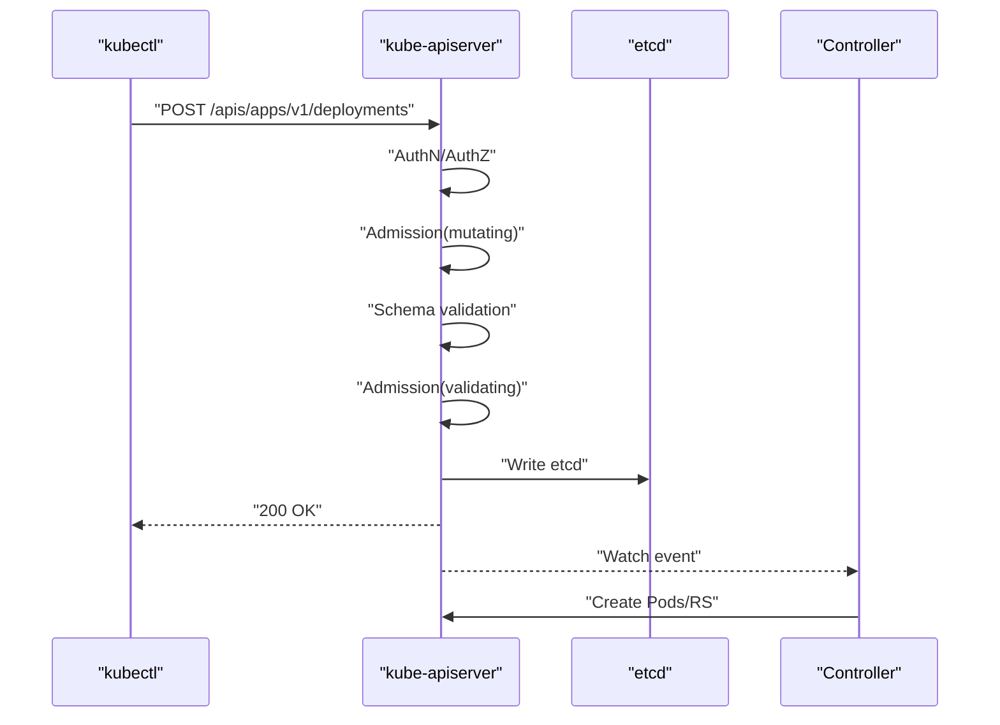
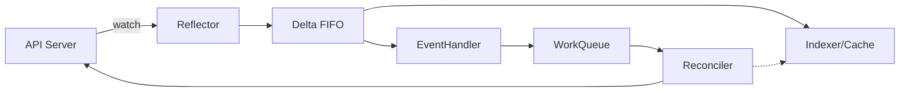

# C09 精通 Operator 与 CRD

> 面向中高级 Go 工程师的 Kubernetes 控制器深度课程。基线版本：controller-runtime 0.18+、Kubebuilder 4.x、Kubernetes 1.30+，时间锚点 2026-05。

## 1. 引言：从手册到自动化的十年

2016 年 11 月，CoreOS 发表了一篇题为《Introducing Operators》的博文，提出了一个简单但震撼的想法：把"运维工程师做的事情"用代码固化下来，跑在 Kubernetes 里。这个想法的直接动机是他们维护 etcd 集群的痛苦——升级、备份、扩缩容这些操作步骤虽然有 runbook，但每次执行都需要一个懂 etcd 内部机制的人坐在终端前，按部就班。CoreOS 把这些操作编码成一个 Go 程序，让它持续观察集群状态，并自动驱动状态向期望方向收敛。这就是 Operator 模式的起点。

十年过去，Operator 已经从一个工程小聪明，演变成了云原生世界里管理有状态应用的事实标准。CNCF 项目里几乎每一个数据库（Postgres、Cassandra、TiDB、ClickHouse）、消息队列（Kafka、RabbitMQ、NATS）、监控系统（Prometheus、Loki、Jaeger）、机器学习平台（Kubeflow、Ray、KServe）都有自己的 Operator。2026 年的 OperatorHub 上注册的 Operator 已经超过 700 个，覆盖从数据库到向量索引、从 LLM 推理到工作流编排的几乎所有领域。

Operator 模式的核心是一对概念：**CRD（CustomResourceDefinition）** 与 **Controller**。CRD 是给 Kubernetes API server 注册一种新的资源类型，让 `kubectl get postgresclusters` 这样的命令能工作；Controller 是一个常驻进程，持续监视这种资源，并把 spec 里描述的期望状态转化为集群中真实的资源（Pod、Service、PVC、Secret……）。这两者结合，本质上是把 Kubernetes 的声明式 API 模型从内置资源（Deployment、StatefulSet）扩展到了任意领域对象。

但 Operator 不是没有代价的。一个生产级 Operator 涉及的细节远比"写个 reconcile 函数"复杂：API 版本演进、conversion webhook、leader election、finalizer、status condition、informer cache 的延迟、workqueue 的退避策略、调和循环的幂等性……每一个都可以踩坑半天。本课希望系统地把这些知识串起来，让你写出来的 Operator 不是 demo 级，而是能扛住生产流量、升级、故障注入的工业级代码。

读完本课，你应当能够：

- 设计一个清晰、可演进的 CRD schema，包括 OpenAPI 校验、status 子资源、printer columns
- 用 controller-runtime 0.18+ 实现一个幂等、最终一致的 reconcile 循环
- 用 Kubebuilder 4.x scaffold 出符合社区惯例的 Operator 项目
- 配置 webhook（mutating / validating / conversion）并理解证书与高可用细节
- 用 envtest 写出可重复的单元测试与集成测试
- 知道 Operator 在生产中的指标、限流、leader election、热升级等关键实践
- 避开 reconcile 无限循环、cache 一致性、finalizer 死锁等典型陷阱

## 2. 原理：CRD 与 Controller 在 API 链路里到底干了什么

### 2.1 CRD：让 API server 学会一个新名词

要理解 CRD，先回忆 Kubernetes API server 的工作流程。当你 `kubectl apply -f deployment.yaml` 的时候，发生了这些事：



API server 对 Deployment 这个资源的"知识"来自编译进二进制的内置类型定义。CRD 的精髓就是把这套知识做成"运行时可扩展"——你可以提交一个 CRD 对象，API server 就会动态地为这个新类型注册一组 RESTful 端点，比如 `/apis/db.example.com/v1/namespaces/default/postgresclusters`。从此 `kubectl get postgresclusters` 就能用了，而 API server 完全不知道 Postgres 是什么。

CRD 自身是 `apiextensions.k8s.io/v1` 这个 group 下的内置资源。一个最小的 CRD 大概长这样：

```yaml
apiVersion: apiextensions.k8s.io/v1
kind: CustomResourceDefinition
metadata:
  name: postgresclusters.db.example.com
spec:
  group: db.example.com
  names:
    kind: PostgresCluster
    listKind: PostgresClusterList
    singular: postgrescluster
    plural: postgresclusters
    shortNames: [pgc]
  scope: Namespaced
  versions:
  - name: v1
    served: true
    storage: true
    schema:
      openAPIV3Schema:
        type: object
        required: [spec]
        properties:
          spec:
            type: object
            required: [replicas, version]
            properties:
              replicas:
                type: integer
                minimum: 1
                maximum: 9
              version:
                type: string
                pattern: '^\d+\.\d+$'
              storageGB:
                type: integer
                default: 20
          status:
            type: object
            properties:
              phase:
                type: string
                enum: [Pending, Running, Failed]
              readyReplicas:
                type: integer
              observedGeneration:
                type: integer
                format: int64
              conditions:
                type: array
                items:
                  type: object
                  required: [type, status, lastTransitionTime]
                  properties:
                    type:
                      type: string
                    status:
                      type: string
                      enum: ["True", "False", "Unknown"]
                    lastTransitionTime:
                      type: string
                      format: date-time
                    reason:
                      type: string
                    message:
                      type: string
    subresources:
      status: {}
      scale:
        specReplicasPath: .spec.replicas
        statusReplicasPath: .status.readyReplicas
    additionalPrinterColumns:
    - name: Version
      type: string
      jsonPath: .spec.version
    - name: Replicas
      type: integer
      jsonPath: .spec.replicas
    - name: Ready
      type: integer
      jsonPath: .status.readyReplicas
    - name: Phase
      type: string
      jsonPath: .status.phase
    - name: Age
      type: date
      jsonPath: .metadata.creationTimestamp
```

这里有几个关键点：

**`openAPIV3Schema`** 描述了对象的字段结构。API server 在每次 CREATE / UPDATE 时都会用这个 schema 校验请求体，类型不对、字段不在 enum 里、超出 minimum/maximum，都会被直接拒绝。生产中务必把 schema 写完整、写严格——schema 是 API 契约，未来再加 required 字段会破坏向后兼容。

**`subresources.status`** 打开 status 子资源。打开之后，`/postgresclusters/foo/status` 是一个独立端点；spec 与 status 分别只能由各自端点修改。这意味着 controller 写 status 时不会触发 spec 的 watch 事件，避免 reconcile 自激震荡。同时 RBAC 也可以分开授权——比如让 controller 只能改 status，运维只能改 spec。

**`subresources.scale`** 打开 scale 子资源后，`kubectl scale postgrescluster foo --replicas=3` 这种命令就能工作了，HPA 也能直接对它扩缩容。这是写 CRD 时一个性价比极高的功能，加一行配置换来全套生态兼容。

**`additionalPrinterColumns`** 决定 `kubectl get pgc` 输出哪些列。默认只有 NAME 与 AGE，加上 Version / Ready / Phase 让运维人员一眼看到关键状态。

**`scope`** 是 Namespaced 还是 Cluster。绝大多数业务 CRD 是 Namespaced，便于隔离与多租户；只有少数全局资源（如集群级配置、节点池）才用 Cluster。

### 2.2 schema 校验的几个进阶能力

Kubernetes 1.25 起 CRD 支持 **CEL（Common Expression Language）校验规则**，让你能写出 OpenAPI 表达不了的约束，比如"replicas 必须大于 status.readyReplicas"或者"如果开启了 ssl，那么必须提供 certSecret"。例：

```yaml
properties:
  ssl:
    type: object
    properties:
      enabled:
        type: boolean
      certSecret:
        type: string
    x-kubernetes-validations:
    - rule: "!self.enabled || has(self.certSecret)"
      message: "certSecret is required when ssl is enabled"
```

CEL 比 webhook 校验快几个数量级（在 API server 内嵌执行，无网络往返），写得动的约束尽量用 CEL，写不动的再上 validating webhook。

另一类有用的注解是 `x-kubernetes-preserve-unknown-fields: true`，允许字段下保留未声明的子字段（透传给底层资源）；`x-kubernetes-list-type: map` 用来让 patch 时按 key 合并而非整体替换；`x-kubernetes-int-or-string: true` 让一个字段既能填 80 也能填 "80%"。

### 2.3 Controller：informer / workqueue / reconcile 三件套

Controller 这一侧的核心结构是一组协作机制：**informer** 维护本地 cache、**workqueue** 收集变更事件、**reconcile loop** 把当前状态推向期望状态。



**Reflector** 通过 List + Watch 维护一个本地 cache 副本，cache 用 Indexer 提供按 namespace / labels 的快速查询。任何时候 reconciler 需要读对象，都从 cache 读，不打 API server；这把 API server 的压力从 O(reconcile 次数) 降到了 O(变更次数)。

**EventHandler** 在 cache 收到 Add/Update/Delete 时被调用。controller-runtime 的默认 handler 是把对象的 namespace/name 入队 workqueue（注意：**入队的是 key，不是对象本身**）。这一点至关重要——它意味着同一个对象的多次变更会被合并成一次 reconcile，自然实现了"水平触发"。

**WorkQueue** 是一个带去重、延迟、限速能力的队列：

- **去重**：同一个 key 多次 Add 只会被处理一次（直到上次处理结束）
- **延迟**：reconciler 可以让 key 在 N 秒后再回到队列（用于退避或定期巡检）
- **限速**：默认指数退避，第 N 次失败后下次入队延迟 `min(baseDelay * 2^N, maxDelay)`

**Reconciler** 拿到 key，反查 cache 得到对象，然后做"对账"——比较 spec 与实际，发出 patch/create/delete API 调用。这一函数必须满足**幂等性**（同一个对象状态被 reconcile 多次应该等价于一次）与**水平触发**（不依赖事件历史，只依赖当前 spec 与实际状态）。

这一整套机制对你的影响是：你写的 reconcile 函数不一定每次外部变更都被调用一次，但 cache 与队列保证了——只要还有未处理的变更，最终一定会有一次 reconcile 看到最新状态。这就是 "level-triggered, eventual consistency" 的实现。

### 2.4 CRD 版本化与 conversion webhook

CRD 支持多版本共存，每个版本对应一个 schema 与一组端点。比如 `db.example.com/v1alpha1` 与 `db.example.com/v1` 可以同时 served。但 etcd 只存储一种格式（标记为 `storage: true` 的那一个版本），其他版本的请求会被自动转换到 storage version。

转换分两种：

- **None 策略**：版本之间字段对齐时可直接换 group/version，API server 不改 payload。仅适合非破坏性版本号变化（v1beta1 → v1，字段未变）。
- **Webhook 策略**：API server 在读写时调用你的 conversion webhook，由 webhook 把对象在版本间互相转换。

```yaml
spec:
  conversion:
    strategy: Webhook
    webhook:
      conversionReviewVersions: [v1]
      clientConfig:
        service:
          name: pg-operator-webhook
          namespace: pg-system
          path: /convert
        caBundle: <base64>
```

版本化的真实复杂度在于"如何安全演进"。社区惯例是：

1. v1alpha1 不保证兼容（试验阶段，可随意改）
2. v1beta1 内部小幅迭代但不破坏既有用户
3. v1 之后必须保证向后兼容

每一次新增 storage version，conversion webhook 必须能从所有 served 版本到 storage version 双向转换；老的 served 版本即便不再推荐，仍要至少保留一个 release 周期以便用户迁移。

## 3. 实战：用 Kubebuilder 4 从零写一个 Operator

### 3.1 项目脚手架

```bash
mkdir pg-operator && cd pg-operator
kubebuilder init \
  --domain example.com \
  --repo github.com/example/pg-operator \
  --license apache2

kubebuilder create api \
  --group db \
  --version v1 \
  --kind PostgresCluster \
  --resource --controller
```

这两条命令生成的目录结构是：

```
.
├── api/v1/postgrescluster_types.go
├── cmd/main.go
├── config/
├── internal/controller/postgrescluster_controller.go
├── Dockerfile
├── Makefile
├── go.mod
└── PROJECT
```

Kubebuilder 4 与 3 相比有几个变化：默认使用 controller-runtime 0.18+，cobra 风格 cmd 入口，metrics 端点默认开 HTTPS，与 OpenShift / OLM 集成的注解默认更完善。注意它生成的 go.mod 里 require 的版本号会过时，新项目最好先 `go get -u sigs.k8s.io/controller-runtime@latest` 一下。

### 3.2 定义 CRD 类型

`api/v1/postgrescluster_types.go`：

```go
package v1

import (
    metav1 "k8s.io/apimachinery/pkg/apis/meta/v1"
)

// PostgresClusterSpec defines the desired state of PostgresCluster.
type PostgresClusterSpec struct {
    // Replicas is the desired number of PostgreSQL instances.
    // +kubebuilder:validation:Minimum=1
    // +kubebuilder:validation:Maximum=9
    // +kubebuilder:default=1
    Replicas int32 `json:"replicas"`

    // Version of PostgreSQL, e.g. "16.2".
    // +kubebuilder:validation:Pattern=`^\d+\.\d+$`
    Version string `json:"version"`

    // StorageGB is the volume size per replica.
    // +kubebuilder:validation:Minimum=1
    // +kubebuilder:default=20
    StorageGB int32 `json:"storageGB,omitempty"`

    // Image overrides the default Postgres image.
    // +optional
    Image string `json:"image,omitempty"`

    // Resources for each Postgres container.
    // +optional
    Resources *ResourceRequirements `json:"resources,omitempty"`
}

type ResourceRequirements struct {
    CPU    string `json:"cpu,omitempty"`
    Memory string `json:"memory,omitempty"`
}

// PostgresClusterStatus defines the observed state of PostgresCluster.
type PostgresClusterStatus struct {
    // ObservedGeneration is the generation observed by the controller.
    // +optional
    ObservedGeneration int64 `json:"observedGeneration,omitempty"`

    // ReadyReplicas is the number of replicas that are ready and accepting traffic.
    // +optional
    ReadyReplicas int32 `json:"readyReplicas,omitempty"`

    // Phase summarizes overall cluster phase.
    // +kubebuilder:validation:Enum=Pending;Running;Failed
    // +optional
    Phase string `json:"phase,omitempty"`

    // Conditions describe detailed state transitions.
    // +optional
    // +patchMergeKey=type
    // +patchStrategy=merge
    // +listType=map
    // +listMapKey=type
    Conditions []metav1.Condition `json:"conditions,omitempty" patchStrategy:"merge" patchMergeKey:"type"`
}

// +kubebuilder:object:root=true
// +kubebuilder:subresource:status
// +kubebuilder:subresource:scale:specpath=.spec.replicas,statuspath=.status.readyReplicas
// +kubebuilder:resource:shortName=pgc
// +kubebuilder:printcolumn:name="Version",type=string,JSONPath=`.spec.version`
// +kubebuilder:printcolumn:name="Replicas",type=integer,JSONPath=`.spec.replicas`
// +kubebuilder:printcolumn:name="Ready",type=integer,JSONPath=`.status.readyReplicas`
// +kubebuilder:printcolumn:name="Phase",type=string,JSONPath=`.status.phase`
// +kubebuilder:printcolumn:name="Age",type=date,JSONPath=`.metadata.creationTimestamp`
type PostgresCluster struct {
    metav1.TypeMeta   `json:",inline"`
    metav1.ObjectMeta `json:"metadata,omitempty"`

    Spec   PostgresClusterSpec   `json:"spec,omitempty"`
    Status PostgresClusterStatus `json:"status,omitempty"`
}

// +kubebuilder:object:root=true
type PostgresClusterList struct {
    metav1.TypeMeta `json:",inline"`
    metav1.ListMeta `json:"metadata,omitempty"`
    Items           []PostgresCluster `json:"items"`
}

func init() {
    SchemeBuilder.Register(&PostgresCluster{}, &PostgresClusterList{})
}
```

注释里的 `+kubebuilder:...` 是 controller-gen 用来生成 CRD YAML 的标记。`make manifests` 会扫描这些注释，输出 `config/crd/bases/db.example.com_postgresclusters.yaml`，里面就是上一节那种完整的 CRD 定义。

几个 design 决策值得展开：

- **`Conditions` 用 `metav1.Condition` 而不是自定义类型**：这是 Kubernetes 1.19+ 引入的标准 condition 类型，sigs.k8s.io/controller-runtime 与 kubectl 都对它有特殊支持。新写的 Operator 一律用它，不要再自造轮子。
- **patchMergeKey + listType=map**：让 patch 时按 `type` 字段合并 condition，避免每次 reconcile 覆盖整个数组。
- **`+kubebuilder:default`**：CRD schema 里的 default 是 server-side default，由 API server 在写入时填充，不依赖客户端工具。这是 1.16+ 的能力，旧版本 default 必须客户端自己填。
- **`+kubebuilder:subresource:status`**：必须显式声明，否则 controller 改 status 会触发 spec 的 watch 事件，可能引发自激震荡。

### 3.3 Reconcile 函数

`internal/controller/postgrescluster_controller.go` 是核心。我们一步步把它写厚。

```go
package controller

import (
    "context"
    "fmt"
    "time"

    appsv1 "k8s.io/api/apps/v1"
    corev1 "k8s.io/api/core/v1"
    apierrors "k8s.io/apimachinery/pkg/api/errors"
    "k8s.io/apimachinery/pkg/api/meta"
    "k8s.io/apimachinery/pkg/api/resource"
    metav1 "k8s.io/apimachinery/pkg/apis/meta/v1"
    "k8s.io/apimachinery/pkg/runtime"
    "k8s.io/apimachinery/pkg/types"
    ctrl "sigs.k8s.io/controller-runtime"
    "sigs.k8s.io/controller-runtime/pkg/client"
    "sigs.k8s.io/controller-runtime/pkg/controller/controllerutil"
    "sigs.k8s.io/controller-runtime/pkg/log"

    dbv1 "github.com/example/pg-operator/api/v1"
)

const (
    finalizerName = "db.example.com/postgrescluster-finalizer"

    conditionReady           = "Ready"
    conditionProgressing     = "Progressing"
    conditionStorageReady    = "StorageReady"
    conditionStatefulSetSync = "StatefulSetSynced"

    reasonReconciling     = "Reconciling"
    reasonReconcileError  = "ReconcileError"
    reasonReady           = "AllReplicasReady"
    reasonScaling         = "Scaling"
    reasonImageMismatch   = "ImageMismatch"
)

type PostgresClusterReconciler struct {
    client.Client
    Scheme *runtime.Scheme
}

// +kubebuilder:rbac:groups=db.example.com,resources=postgresclusters,verbs=get;list;watch;create;update;patch;delete
// +kubebuilder:rbac:groups=db.example.com,resources=postgresclusters/status,verbs=get;update;patch
// +kubebuilder:rbac:groups=db.example.com,resources=postgresclusters/finalizers,verbs=update
// +kubebuilder:rbac:groups=apps,resources=statefulsets,verbs=get;list;watch;create;update;patch;delete
// +kubebuilder:rbac:groups="",resources=services;configmaps;secrets,verbs=get;list;watch;create;update;patch;delete
// +kubebuilder:rbac:groups="",resources=persistentvolumeclaims,verbs=get;list;watch;create;update;patch;delete
// +kubebuilder:rbac:groups="",resources=events,verbs=create;patch

func (r *PostgresClusterReconciler) Reconcile(ctx context.Context, req ctrl.Request) (ctrl.Result, error) {
    logger := log.FromContext(ctx).WithValues("pgc", req.NamespacedName)

    // 1. 从 cache 读取对象
    var pgc dbv1.PostgresCluster
    if err := r.Get(ctx, req.NamespacedName, &pgc); err != nil {
        if apierrors.IsNotFound(err) {
            return ctrl.Result{}, nil
        }
        return ctrl.Result{}, err
    }

    // 2. 处理删除：finalizer 与级联
    if !pgc.DeletionTimestamp.IsZero() {
        return r.reconcileDelete(ctx, &pgc)
    }

    // 3. 确保 finalizer 存在
    if !controllerutil.ContainsFinalizer(&pgc, finalizerName) {
        controllerutil.AddFinalizer(&pgc, finalizerName)
        if err := r.Update(ctx, &pgc); err != nil {
            return ctrl.Result{}, err
        }
        return ctrl.Result{Requeue: true}, nil
    }

    // 4. 调和子资源
    if err := r.reconcileHeadlessService(ctx, &pgc); err != nil {
        r.setCondition(&pgc, conditionReady, metav1.ConditionFalse, reasonReconcileError, err.Error())
        _ = r.patchStatus(ctx, &pgc)
        return ctrl.Result{}, err
    }

    ss, err := r.reconcileStatefulSet(ctx, &pgc)
    if err != nil {
        r.setCondition(&pgc, conditionStatefulSetSync, metav1.ConditionFalse, reasonReconcileError, err.Error())
        _ = r.patchStatus(ctx, &pgc)
        return ctrl.Result{}, err
    }

    // 5. 计算 status
    pgc.Status.ObservedGeneration = pgc.Generation
    pgc.Status.ReadyReplicas = ss.Status.ReadyReplicas
    switch {
    case ss.Status.ReadyReplicas == pgc.Spec.Replicas:
        pgc.Status.Phase = "Running"
        r.setCondition(&pgc, conditionReady, metav1.ConditionTrue, reasonReady, "all replicas ready")
        r.setCondition(&pgc, conditionProgressing, metav1.ConditionFalse, reasonReady, "rollout complete")
    case ss.Status.ReadyReplicas < pgc.Spec.Replicas:
        pgc.Status.Phase = "Pending"
        r.setCondition(&pgc, conditionReady, metav1.ConditionFalse, reasonScaling,
            fmt.Sprintf("%d/%d replicas ready", ss.Status.ReadyReplicas, pgc.Spec.Replicas))
        r.setCondition(&pgc, conditionProgressing, metav1.ConditionTrue, reasonScaling, "scaling up")
    }

    if err := r.patchStatus(ctx, &pgc); err != nil {
        return ctrl.Result{}, err
    }
    logger.V(1).Info("reconciled", "ready", pgc.Status.ReadyReplicas, "phase", pgc.Status.Phase)

    // 未就绪时主动 requeue，避免错过 watch event
    if pgc.Status.Phase != "Running" {
        return ctrl.Result{RequeueAfter: 30 * time.Second}, nil
    }
    return ctrl.Result{}, nil
}
```

这段代码体现了几个不可妥协的原则：

**幂等**：每个 reconcile 都从头开始 Get 对象、读子资源、对比、修补。任何中间状态都来自 API server / cache，不是 controller 进程内的临时变量。这意味着 controller 进程随时可以被 kill，下次启动从 cache 拿到最新状态继续推进。

**最终一致 / 水平触发**：reconcile 不关心"是哪一次变更触发了我"，它只关心"现在 spec 是什么，实际是什么，差距是什么"。即便 controller 错过了几次 watch event，下一次被触发时也会把所有差距一次性补齐。

**短路返回**：每一步出错都尽可能写一次 status，方便用户 `kubectl describe` 看到错误，然后返回 err，让 workqueue 用指数退避重试。

**主动 requeue**：在"暂未到稳态"的情况下，主动设置 `RequeueAfter`。这是一道保险：即便 informer cache 出问题没有事件传过来，30 秒后也会再 reconcile 一次。

#### 3.3.1 reconcile 子资源：用 CreateOrUpdate

```go
func (r *PostgresClusterReconciler) reconcileStatefulSet(
    ctx context.Context,
    pgc *dbv1.PostgresCluster,
) (*appsv1.StatefulSet, error) {
    ss := &appsv1.StatefulSet{
        ObjectMeta: metav1.ObjectMeta{
            Name:      pgc.Name,
            Namespace: pgc.Namespace,
        },
    }

    _, err := controllerutil.CreateOrUpdate(ctx, r.Client, ss, func() error {
        // 1. 设置 owner reference，保证级联删除
        if err := controllerutil.SetControllerReference(pgc, ss, r.Scheme); err != nil {
            return err
        }

        labels := map[string]string{
            "app.kubernetes.io/name":     "postgres",
            "app.kubernetes.io/instance": pgc.Name,
        }
        ss.Spec.ServiceName = pgc.Name + "-headless"
        ss.Spec.Replicas = &pgc.Spec.Replicas
        ss.Spec.Selector = &metav1.LabelSelector{MatchLabels: labels}
        ss.Spec.Template = corev1.PodTemplateSpec{
            ObjectMeta: metav1.ObjectMeta{Labels: labels},
            Spec: corev1.PodSpec{
                Containers: []corev1.Container{
                    {
                        Name:  "postgres",
                        Image: imageFor(pgc),
                        Env: []corev1.EnvVar{
                            {Name: "POSTGRES_PASSWORD", ValueFrom: &corev1.EnvVarSource{
                                SecretKeyRef: &corev1.SecretKeySelector{
                                    LocalObjectReference: corev1.LocalObjectReference{Name: pgc.Name + "-secret"},
                                    Key:                  "password",
                                },
                            }},
                        },
                        Ports: []corev1.ContainerPort{{ContainerPort: 5432, Name: "pg"}},
                        VolumeMounts: []corev1.VolumeMount{
                            {Name: "data", MountPath: "/var/lib/postgresql/data"},
                        },
                        Resources: resourcesFor(pgc),
                    },
                },
            },
        }
        ss.Spec.VolumeClaimTemplates = []corev1.PersistentVolumeClaim{
            {
                ObjectMeta: metav1.ObjectMeta{Name: "data"},
                Spec: corev1.PersistentVolumeClaimSpec{
                    AccessModes: []corev1.PersistentVolumeAccessMode{corev1.ReadWriteOnce},
                    Resources: corev1.VolumeResourceRequirements{
                        Requests: corev1.ResourceList{
                            corev1.ResourceStorage: resource.MustParse(
                                fmt.Sprintf("%dGi", pgc.Spec.StorageGB)),
                        },
                    },
                },
            },
        }
        return nil
    })
    if err != nil {
        return nil, err
    }
    return ss, nil
}

func imageFor(pgc *dbv1.PostgresCluster) string {
    if pgc.Spec.Image != "" {
        return pgc.Spec.Image
    }
    return "postgres:" + pgc.Spec.Version
}

func resourcesFor(pgc *dbv1.PostgresCluster) corev1.ResourceRequirements {
    if pgc.Spec.Resources == nil {
        return corev1.ResourceRequirements{}
    }
    req := corev1.ResourceList{}
    if pgc.Spec.Resources.CPU != "" {
        req[corev1.ResourceCPU] = resource.MustParse(pgc.Spec.Resources.CPU)
    }
    if pgc.Spec.Resources.Memory != "" {
        req[corev1.ResourceMemory] = resource.MustParse(pgc.Spec.Resources.Memory)
    }
    return corev1.ResourceRequirements{Requests: req, Limits: req}
}
```

`controllerutil.CreateOrUpdate` 是社区惯用模式：它先 Get，存在则把传入的 mutate 函数应用到既有对象再 Update，不存在则 Create。注意 mutate 函数里要做的事情是**把字段设置成期望值**——不要写 `if ss.Spec.Replicas == nil { ss.Spec.Replicas = &replicas }`，那是"只在第一次设置"的语义，违反了水平触发原则。每次都设。

`SetControllerReference` 把 PostgresCluster 作为 StatefulSet 的 owner。一旦 PostgresCluster 被删，垃圾回收器会级联删除 StatefulSet 及其下面的 Pod、PVC（如果回收策略允许）。这是 Operator 实现"删除 CR 即删除整个集群"的标准手段。

#### 3.3.2 patch status：用 status subresource

```go
func (r *PostgresClusterReconciler) patchStatus(ctx context.Context, pgc *dbv1.PostgresCluster) error {
    return r.Status().Patch(ctx, pgc, client.Merge)
}

func (r *PostgresClusterReconciler) setCondition(
    pgc *dbv1.PostgresCluster,
    t string, s metav1.ConditionStatus, reason, msg string,
) {
    meta.SetStatusCondition(&pgc.Status.Conditions, metav1.Condition{
        Type:               t,
        Status:             s,
        Reason:             reason,
        Message:            msg,
        ObservedGeneration: pgc.Generation,
    })
}
```

`r.Status()` 返回一个专门写 status 子资源的子客户端。`meta.SetStatusCondition` 是 apimachinery 提供的工具，自动维护 lastTransitionTime（type+status 不变时不刷新，避免日志噪音）。

#### 3.3.3 删除处理与 finalizer

```go
func (r *PostgresClusterReconciler) reconcileDelete(
    ctx context.Context,
    pgc *dbv1.PostgresCluster,
) (ctrl.Result, error) {
    logger := log.FromContext(ctx)
    if !controllerutil.ContainsFinalizer(pgc, finalizerName) {
        return ctrl.Result{}, nil
    }

    // 1. 执行外部清理：例如调用云厂商 API 释放快照
    if err := r.cleanupExternal(ctx, pgc); err != nil {
        logger.Error(err, "external cleanup failed, will retry")
        return ctrl.Result{RequeueAfter: 10 * time.Second}, nil
    }

    // 2. 等待 owner refs 级联完成（也可以主动 Delete 子资源以加速）
    // 这里假定我们依靠 GC

    // 3. 移除 finalizer，让 API server 真正删除对象
    controllerutil.RemoveFinalizer(pgc, finalizerName)
    if err := r.Update(ctx, pgc); err != nil {
        return ctrl.Result{}, err
    }
    return ctrl.Result{}, nil
}

func (r *PostgresClusterReconciler) cleanupExternal(
    ctx context.Context,
    pgc *dbv1.PostgresCluster,
) error {
    // 占位：调用云 API 把对应的 RDS 快照、对象存储桶清理掉
    return nil
}
```

finalizer 是一个字符串数组（`metadata.finalizers`），只要不为空，API server 不会真正从 etcd 中删除对象。Controller 在监控到 `DeletionTimestamp` 不为零时，先做清理，再移除自己注册的 finalizer。这是 Operator 实现"删除前的副作用"的唯一可靠手段——比如调用云 API 退订资源、上传最后一次备份等。

注意：finalizer 是**一个对象多个 controller 协作**的协议。每一个负责清理的 controller 注册自己的 finalizer，清理完就移除；最后一个移除的负责"通知" API server 可以删了。绝对不要在自己的 controller 里删别人的 finalizer。

#### 3.3.4 SetupWithManager

```go
func (r *PostgresClusterReconciler) SetupWithManager(mgr ctrl.Manager) error {
    return ctrl.NewControllerManagedBy(mgr).
        For(&dbv1.PostgresCluster{}).
        Owns(&appsv1.StatefulSet{}).
        Owns(&corev1.Service{}).
        Owns(&corev1.Secret{}).
        WithOptions(controller.Options{
            MaxConcurrentReconciles: 5,
            RateLimiter: workqueue.NewTypedItemExponentialFailureRateLimiter[reconcile.Request](
                100*time.Millisecond, 30*time.Second),
        }).
        Complete(r)
}
```

`For` 是主资源（reconcile 入口），`Owns` 是它"控制"的子资源——当子资源变化时，controller-runtime 会自动把对应 owner 的 key 入队。这是 Operator 自动感知子资源变化的关键。

`MaxConcurrentReconciles` 控制并发度。默认是 1（串行），对于业务繁忙的 Operator 可以调到 5~20。但要小心：你的 reconcile 函数必须线程安全，而且并发越高，对 API server 的 QPS 压力越大。

`RateLimiter` 控制失败退避。默认是指数 5ms ~ 1000s，对于大多数 Operator 太长，建议显式设置上下限。

### 3.4 main.go：Manager 与 Leader Election

```go
func main() {
    var (
        metricsAddr          string
        probeAddr            string
        enableLeaderElection bool
    )
    flag.StringVar(&metricsAddr, "metrics-bind-address", ":8443", "Metrics address")
    flag.StringVar(&probeAddr, "health-probe-bind-address", ":8081", "Probe address")
    flag.BoolVar(&enableLeaderElection, "leader-elect", false, "Enable leader election")
    flag.Parse()

    ctrl.SetLogger(zap.New(zap.UseDevMode(false)))

    mgr, err := ctrl.NewManager(ctrl.GetConfigOrDie(), ctrl.Options{
        Scheme:                  scheme,
        Metrics:                 server.Options{BindAddress: metricsAddr, SecureServing: true},
        HealthProbeBindAddress:  probeAddr,
        LeaderElection:          enableLeaderElection,
        LeaderElectionID:        "pg-operator.db.example.com",
        LeaderElectionResourceLock: "leases",
        Cache: cache.Options{
            DefaultNamespaces: map[string]cache.Config{
                "default": {},   // 限定监听的 namespace
            },
        },
    })
    if err != nil {
        setupLog.Error(err, "unable to start manager")
        os.Exit(1)
    }

    if err := (&controller.PostgresClusterReconciler{
        Client: mgr.GetClient(),
        Scheme: mgr.GetScheme(),
    }).SetupWithManager(mgr); err != nil {
        os.Exit(1)
    }

    if err := mgr.AddHealthzCheck("healthz", healthz.Ping); err != nil {
        os.Exit(1)
    }
    if err := mgr.AddReadyzCheck("readyz", healthz.Ping); err != nil {
        os.Exit(1)
    }
    if err := mgr.Start(ctrl.SetupSignalHandler()); err != nil {
        os.Exit(1)
    }
}
```

`ctrl.NewManager` 是 controller-runtime 的核心组件，它负责：

- 创建并维护一个共享 cache（所有 controller 共用一份 informer 工厂）
- 创建并维护一个共享 client（Get/List 走 cache，Create/Update/Delete 走 API）
- 提供 metrics、health、webhook server
- 协调 leader election
- 收到 SIGTERM 时优雅停止所有 controller

**Leader Election** 用 `coordination.k8s.io/leases` 实现：N 个副本里只有一个成为 leader，其余处于热备状态。leader 进程通过定期更新 Lease 对象续约（默认每 2s），其他进程通过 watch Lease 知道当前 leader 是谁，并在 leader 失联（超过 leaseDuration 默认 15s）后竞争上岗。

Leader election 用 lease 而非 configmap，是因为 lease 体积小、更新频繁、API server 优化更好。生产中 leader election ID 必须全集群唯一，建议用 `{operator}.{api-group}` 的格式。

## 4. Webhook：mutating / validating / conversion

Webhook 让你在 API server 写入对象前/后插一段自定义逻辑。它本质上是一个 HTTPS server，API server 通过 `AdmissionReview` 请求体传过来一个对象的"修改前"与"修改后"快照，让你返回 patch 或者拒绝。

### 4.1 Mutating Webhook：默认值与字段注入

Mutating webhook 用来在对象进入 etcd 之前**修改它**。典型场景：

- 给所有 Pod 注入 sidecar（Istio、Linkerd 用这个）
- 给 PVC 默认填 storageClassName
- 给 PostgresCluster 默认填 image（Spec 里没填时用全局配置）

```go
// +kubebuilder:webhook:path=/mutate-db-example-com-v1-postgrescluster,mutating=true,failurePolicy=fail,sideEffects=None,groups=db.example.com,resources=postgresclusters,verbs=create;update,versions=v1,name=mpgc.kb.io,admissionReviewVersions=v1

type PostgresClusterDefaulter struct{}

func (d *PostgresClusterDefaulter) Default(ctx context.Context, obj runtime.Object) error {
    pgc, ok := obj.(*dbv1.PostgresCluster)
    if !ok {
        return fmt.Errorf("expected PostgresCluster, got %T", obj)
    }
    if pgc.Spec.Image == "" {
        pgc.Spec.Image = "postgres:" + pgc.Spec.Version
    }
    if pgc.Spec.StorageGB == 0 {
        pgc.Spec.StorageGB = 20
    }
    return nil
}
```

注意 `Default` 函数必须是**幂等**的——同一个对象多次走 mutating，结果应当一致。否则 controller-runtime 在 retry / dry-run 时会出错。

### 4.2 Validating Webhook：跨字段校验

Validating webhook 只能**接受**或**拒绝**对象，不能修改。典型场景：

- 跨字段联动校验（CEL 写不动的）
- 引用外部资源校验（如 secret 是否存在）
- 业务级唯一性校验

```go
// +kubebuilder:webhook:path=/validate-db-example-com-v1-postgrescluster,mutating=false,failurePolicy=fail,sideEffects=None,groups=db.example.com,resources=postgresclusters,verbs=create;update;delete,versions=v1,name=vpgc.kb.io,admissionReviewVersions=v1

type PostgresClusterValidator struct {
    Client client.Client
}

func (v *PostgresClusterValidator) ValidateCreate(ctx context.Context, obj runtime.Object) (admission.Warnings, error) {
    pgc, ok := obj.(*dbv1.PostgresCluster)
    if !ok {
        return nil, fmt.Errorf("expected PostgresCluster")
    }
    return v.validate(ctx, pgc)
}

func (v *PostgresClusterValidator) ValidateUpdate(ctx context.Context, oldObj, newObj runtime.Object) (admission.Warnings, error) {
    oldPgc := oldObj.(*dbv1.PostgresCluster)
    newPgc := newObj.(*dbv1.PostgresCluster)

    if oldPgc.Spec.Version != newPgc.Spec.Version {
        // 简单升级策略：禁止跨大版本升级
        oldMajor := strings.Split(oldPgc.Spec.Version, ".")[0]
        newMajor := strings.Split(newPgc.Spec.Version, ".")[0]
        if oldMajor != newMajor {
            return nil, fmt.Errorf("major version upgrade not allowed: %s -> %s", oldPgc.Spec.Version, newPgc.Spec.Version)
        }
    }
    if newPgc.Spec.StorageGB < oldPgc.Spec.StorageGB {
        return nil, fmt.Errorf("storage shrink not allowed: %d -> %d", oldPgc.Spec.StorageGB, newPgc.Spec.StorageGB)
    }
    return v.validate(ctx, newPgc)
}

func (v *PostgresClusterValidator) ValidateDelete(ctx context.Context, obj runtime.Object) (admission.Warnings, error) {
    return nil, nil
}

func (v *PostgresClusterValidator) validate(ctx context.Context, pgc *dbv1.PostgresCluster) (admission.Warnings, error) {
    var warns admission.Warnings
    if pgc.Spec.Replicas == 1 {
        warns = append(warns, "single replica is not HA")
    }
    return warns, nil
}
```

`admission.Warnings` 是 1.19+ 引入的能力——webhook 可以返回 warning 而不拒绝，kubectl 会以黄字打印给用户。这是给用户友好的 nudge 而不阻塞自动化的好工具。

### 4.3 Conversion Webhook：版本之间的桥梁

当 CRD 跨大版本（如 v1alpha1 → v1）改了字段结构，必须写 conversion webhook。controller-runtime 提供了 `conversion.Convertible` 接口，每个 served 版本都要实现 ConvertTo / ConvertFrom 到 hub version。

```go
// api/v1/postgrescluster_conversion.go
// 假设 v1 是 hub，v1alpha1 需要 convert 到 v1

// api/v1alpha1/postgrescluster_conversion.go
func (src *PostgresCluster) ConvertTo(dstRaw conversion.Hub) error {
    dst := dstRaw.(*v1.PostgresCluster)
    dst.ObjectMeta = src.ObjectMeta
    dst.Spec.Replicas = src.Spec.Replicas
    dst.Spec.Version = src.Spec.PgVersion // 字段重命名
    dst.Spec.StorageGB = src.Spec.StorageGB
    return nil
}

func (dst *PostgresCluster) ConvertFrom(srcRaw conversion.Hub) error {
    src := srcRaw.(*v1.PostgresCluster)
    dst.ObjectMeta = src.ObjectMeta
    dst.Spec.Replicas = src.Spec.Replicas
    dst.Spec.PgVersion = src.Spec.Version
    dst.Spec.StorageGB = src.Spec.StorageGB
    return nil
}
```

API server 在 v1alpha1 端点收到请求时，调用 webhook 把对象转成 v1（storage version），写入 etcd；客户端从 v1alpha1 端点读时，又调用 webhook 把 v1 转回 v1alpha1。Conversion webhook 是无状态的，必须可重入。

### 4.4 证书与高可用细节

Webhook 必须用 HTTPS，且 API server 信任的证书必须在 webhook 配置的 `caBundle` 里。生产中通常用 [cert-manager](https://cert-manager.io/) 自动签发并注入：

```yaml
apiVersion: cert-manager.io/v1
kind: Certificate
metadata:
  name: pg-operator-serving-cert
spec:
  dnsNames:
  - pg-operator-webhook.pg-system.svc
  - pg-operator-webhook.pg-system.svc.cluster.local
  issuerRef:
    name: pg-operator-selfsigned-issuer
    kind: Issuer
  secretName: pg-operator-webhook-tls
```

Webhook server 在 controller-runtime 中是与 manager 一体的，只需在 main.go 里 `mgr.GetWebhookServer().Register(...)`。多副本时所有副本都监听同样端口，service 用 round-robin 分发——这意味着 webhook 必须是无状态的，且容错好（任一副本故障不影响整体）。

`failurePolicy: Fail` 意味着 webhook 调用失败时 API 请求被拒绝。生产中要谨慎——如果 webhook 自身崩溃，整个集群创建 PostgresCluster 都会失败。建议对自身管理的 namespace 用 Fail，对其他 namespace 用 `Ignore`，或者在 `namespaceSelector` 上严格限定作用域。

## 5. 测试：envtest + Ginkgo

Operator 的测试有三层：

1. **单元测试**：纯函数逻辑（如 `imageFor`、`setCondition`），不依赖 Kubernetes
2. **集成测试 / envtest**：起一个 etcd + kube-apiserver 的本地副本，跑真实的 client，但没有 scheduler / kubelet
3. **e2e**：完整集群（kind / k3d / EKS），跑 Operator + 真实 Pod

envtest 是中间层，速度快（启动 5~10s）、覆盖度高，是 Operator 测试的主力。controller-runtime 直接集成。

```go
package controller_test

import (
    "context"
    "path/filepath"
    "testing"
    "time"

    . "github.com/onsi/ginkgo/v2"
    . "github.com/onsi/gomega"
    appsv1 "k8s.io/api/apps/v1"
    corev1 "k8s.io/api/core/v1"
    metav1 "k8s.io/apimachinery/pkg/apis/meta/v1"
    "k8s.io/apimachinery/pkg/types"
    "k8s.io/client-go/kubernetes/scheme"
    ctrl "sigs.k8s.io/controller-runtime"
    "sigs.k8s.io/controller-runtime/pkg/client"
    "sigs.k8s.io/controller-runtime/pkg/envtest"
    logf "sigs.k8s.io/controller-runtime/pkg/log"
    "sigs.k8s.io/controller-runtime/pkg/log/zap"

    dbv1 "github.com/example/pg-operator/api/v1"
    "github.com/example/pg-operator/internal/controller"
)

var (
    cfg       *rest.Config
    k8sClient client.Client
    testEnv   *envtest.Environment
    ctx       context.Context
    cancel    context.CancelFunc
)

func TestAPIs(t *testing.T) {
    RegisterFailHandler(Fail)
    RunSpecs(t, "Controller Suite")
}

var _ = BeforeSuite(func() {
    logf.SetLogger(zap.New(zap.UseDevMode(true)))
    ctx, cancel = context.WithCancel(context.Background())

    testEnv = &envtest.Environment{
        CRDDirectoryPaths:     []string{filepath.Join("..", "..", "config", "crd", "bases")},
        ErrorIfCRDPathMissing: true,
    }
    var err error
    cfg, err = testEnv.Start()
    Expect(err).NotTo(HaveOccurred())

    Expect(dbv1.AddToScheme(scheme.Scheme)).To(Succeed())

    k8sClient, err = client.New(cfg, client.Options{Scheme: scheme.Scheme})
    Expect(err).NotTo(HaveOccurred())

    mgr, err := ctrl.NewManager(cfg, ctrl.Options{Scheme: scheme.Scheme})
    Expect(err).NotTo(HaveOccurred())

    Expect((&controller.PostgresClusterReconciler{
        Client: mgr.GetClient(),
        Scheme: mgr.GetScheme(),
    }).SetupWithManager(mgr)).To(Succeed())

    go func() {
        defer GinkgoRecover()
        Expect(mgr.Start(ctx)).To(Succeed())
    }()
})

var _ = AfterSuite(func() {
    cancel()
    Expect(testEnv.Stop()).To(Succeed())
})

var _ = Describe("PostgresCluster controller", func() {
    Context("when a new PostgresCluster is created", func() {
        It("should create a StatefulSet with matching replicas", func() {
            pgc := &dbv1.PostgresCluster{
                ObjectMeta: metav1.ObjectMeta{Name: "pg1", Namespace: "default"},
                Spec:       dbv1.PostgresClusterSpec{Replicas: 3, Version: "16.2", StorageGB: 20},
            }
            Expect(k8sClient.Create(ctx, pgc)).To(Succeed())

            Eventually(func(g Gomega) {
                var ss appsv1.StatefulSet
                g.Expect(k8sClient.Get(ctx, types.NamespacedName{Name: "pg1", Namespace: "default"}, &ss)).To(Succeed())
                g.Expect(*ss.Spec.Replicas).To(Equal(int32(3)))
                g.Expect(ss.Spec.Template.Spec.Containers[0].Image).To(Equal("postgres:16.2"))
            }, 5*time.Second, 100*time.Millisecond).Should(Succeed())
        })

        It("should reconcile to Pending when replicas not ready", func() {
            // envtest 没有 scheduler / kubelet，所以 StatefulSet 永远不会真正 Ready
            // 我们手动设置 status 模拟
            Eventually(func(g Gomega) {
                var pgc dbv1.PostgresCluster
                g.Expect(k8sClient.Get(ctx, types.NamespacedName{Name: "pg1", Namespace: "default"}, &pgc)).To(Succeed())
                g.Expect(pgc.Status.Phase).To(Equal("Pending"))
                g.Expect(pgc.Status.ObservedGeneration).To(Equal(pgc.Generation))
            }, 5*time.Second).Should(Succeed())
        })
    })
})
```

envtest 的几个注意事项：

- **没有 scheduler / kubelet**：Pod、StatefulSet 不会真正 Ready，需要手动设置 status 来模拟。这意味着 envtest 适合测 "controller 创建/更新子资源是否正确"，不适合测"端到端流转"。
- **没有 controller-manager**：内置控制器（如 ServiceAccount 自动创建）不工作，需要测试代码自己造数据。
- **CRD 路径**：必须指向 generated CRD yaml；每次改完 `_types.go` 跑 `make manifests` 再跑测试。
- **`Eventually`** 是 Ginkgo/Gomega 的异步断言——不要用 `time.Sleep` 然后断言，那样要么慢要么 flake。

## 6. 生产实践

### 6.1 指标与可观测性

controller-runtime 自带一套 Prometheus 指标，端点默认在 `:8443/metrics`：

| 指标 | 含义 |
|------|------|
| `controller_runtime_reconcile_total` | reconcile 调用次数，按 controller / result 标签 |
| `controller_runtime_reconcile_errors_total` | reconcile 出错次数 |
| `controller_runtime_reconcile_time_seconds` | reconcile 耗时直方图 |
| `controller_runtime_max_concurrent_reconciles` | 最大并发度配置值 |
| `workqueue_depth` | 当前队列深度 |
| `workqueue_adds_total` | 累计入队数 |
| `workqueue_queue_duration_seconds` | 入队到出队的等待时长 |
| `workqueue_unfinished_work_seconds` | 当前处理中任务已花费时间 |

生产中务必监控：

- **reconcile 错误率**：突增意味着代码 bug 或下游故障
- **reconcile 耗时 p99**：超过 5s 通常意味着卡在某个 API 调用，需要优化
- **workqueue depth**：持续 > 0 意味着 reconcile 处理不过来，要么并发上调、要么有热点 key 反复入队
- **leader election lease 续约时间**：超过 leaseDuration 一半就该告警

业务指标建议自己暴露：

```go
var (
    pgcPhase = prometheus.NewGaugeVec(
        prometheus.GaugeOpts{Name: "pgc_phase", Help: "PostgresCluster phase (1=Running,0=other)"},
        []string{"namespace", "name"},
    )
)

func init() {
    metrics.Registry.MustRegister(pgcPhase)
}
```

### 6.2 限流与 API 友好

Operator 是 API server 最重的客户端之一。一个写得糙的 Operator 能把 API server 打到 500。几个最佳实践：

- **优先读 cache**：controller-runtime 的 client 默认 Get/List 走 cache，自动满足
- **List 加 label selector**：`client.MatchingLabels{...}`，不要全集群 list
- **避免在 reconcile 里大量 Get**：如果需要扫描很多对象，加索引（`mgr.GetCache().IndexField(...)`）
- **客户端 QPS 限制**：默认 20 QPS / 30 burst，busy 集群里可以调到 100 / 200，但要监控 API server

```go
cfg := ctrl.GetConfigOrDie()
cfg.QPS = 100
cfg.Burst = 200
mgr, err := ctrl.NewManager(cfg, opts)
```

- **使用 ssa（server-side apply）**：从 controller-runtime 0.15 起原生支持，`client.Apply` patch type。SSA 把"字段所有权"概念引入，多 controller 同写一个对象不会互相覆盖。生产建议逐步迁到 SSA。

### 6.3 优雅升级与零中断

Operator 自身的滚动升级要注意几件事：

- **leader election ID 不变**：升级时新版本启动、老版本退出，leader 会在新老版本之间漂移。如果代码兼容性好，这是无缝的；如果不兼容（schema 改了），先 stop 老版本再 start 新版本（用 OnDelete StatefulSet 策略 + 人工触发）。
- **CRD 版本兼容**：新 Operator 必须能处理老版本的 CR；老 Operator 看到不认识的字段要 ignore（OpenAPI schema 的 `preserveUnknownFields: false` 默认就是这个行为）。
- **状态字段不要破坏性变更**：删除 status 字段意味着升级中观察者会看到 "字段消失"，影响监控。

### 6.4 profile 与性能调优

```go
import _ "net/http/pprof"

func main() {
    go func() {
        _ = http.ListenAndServe(":6060", nil)
    }()
    // ...
}
```

启用 pprof 后 `go tool pprof http://operator-pod:6060/debug/pprof/heap` 抓堆，`/profile` 抓 CPU。常见性能瓶颈：

- Cache 占用过大：默认监听所有 namespace 的所有目标资源，内存可能上 GB。用 `cache.Options.DefaultNamespaces` 或 `ByObject` 限定范围。
- DeepCopy 开销：每次从 cache 读对象都会 deepcopy，热路径中可以 `client.UnsafeDisableDeepCopy` 但要保证 reconciler 只读不改。
- workqueue 热点：同一个 key 反复入队导致 reconcile 串行处理。检查是不是写完 status 立刻又触发了 watch 事件（spec/status 子资源不分时会这样）。

## 7. 陷阱清单

### 7.1 Reconcile 无限循环

**症状**：metrics 里 `reconcile_total` 持续高速增长，单个对象的 reconcile 几乎每秒都跑一次。

**常见原因**：

1. 写 spec 而不是 status：在 reconcile 里 `r.Update(ctx, pgc)` 改了 spec，触发了 watch 事件，又 reconcile。修复：只读 spec，只写 status。
2. status 子资源没开：`subresources.status: {}` 缺失，写 status 时整个对象都重写，spec 的 watch 也触发。修复：CRD 加 status 子资源。
3. CreateOrUpdate 里写了"如果是 nil 才设置"逻辑，导致每次 reconcile 都看到字段不一致然后 Update。修复：mutate 函数无条件赋值期望值。
4. 子资源被外部组件改了（如 HPA 改 StatefulSet replicas），controller 又改回去，又被改回去。修复：把被外部管理的字段从 reconcile 中剔除，或用 SSA。

### 7.2 Cache 不一致

**症状**：刚 Create 一个对象，紧接着 Get 不到。

**原因**：controller-runtime client 默认 Get/List 走 cache，cache 是从 watch 来的，有几十毫秒延迟。

**修复**：

- 大多数情况下：不要紧接着 Get 自己刚 Create 的对象——让 watch 事件触发下一次 reconcile，那时一定看得到。
- 必须立刻 Get：用 `client.New(cfg, options)` 创建一个直接打 API server 的 client，专门用于这种场景。

### 7.3 删除竞态

**症状**：CR 被删后子资源没有被清理，或者反过来子资源被孤立。

**典型场景**：

1. Finalizer 注册时序错：controller 启动前 CR 已经被删了，finalizer 没机会加上。修复：第一次 Get 到没有 finalizer 的活对象，先加 finalizer 再做其他事；删除分支检查 `ContainsFinalizer` 防御。
2. Owner reference 与 finalizer 冲突：两个 controller 都给同一个对象注册 finalizer，A 先删除自己 finalizer，B 还在等待，CR 没消失但 owner refs 已经断开。修复：协调清理时序，或者用 `ownerReferences.blockOwnerDeletion`。
3. 跨 namespace owner：owner reference 不支持跨 namespace。如果 Operator 在 namespace A 创建了 namespace B 的对象，删 A 时 B 的对象不会被级联删。修复：自己写 finalizer 显式清理。

### 7.4 Webhook 启动顺序

**症状**：Operator 部署后第一次创建 CR 偶尔失败，提示 webhook 不可达。

**原因**：webhook 配置已经生效，但 webhook server 还没启动 / 证书还没注入。

**修复**：

- `failurePolicy: Ignore` 在启动阶段，然后切到 Fail。但这一般做不到。
- 用 `namespaceSelector` 排除 kube-system，避免 cert-manager 等依赖被卡住。
- 用就绪探针，确保 service endpoints 只在 webhook 准备好之后才转发。

### 7.5 status 漂移

**症状**：status 上的字段总是落后于 spec，或者偶尔出现"读到的对象其实是上一次 reconcile 写完的"。

**原因**：Update 用了整个对象（包括 spec），但 spec 是从 cache 读的旧版本——一旦中间有别的更新，自己的 Update 会把别人的 spec 改回去（write-write 冲突）。

**修复**：

- 永远用 `Status().Patch(ctx, obj, client.Merge)` 写 status
- 写完 status 不要再 `Update(ctx, obj)` 同一对象的其他字段；如果非得改 spec，分两步操作，每步重新 Get
- 用 `resourceVersion` 做乐观锁，冲突时 retry（client-go 自带 `retry.RetryOnConflict`）

### 7.6 RBAC 不足

**症状**：reconcile 失败，日志里 forbidden / cannot list / cannot create。

**原因**：`+kubebuilder:rbac` 注释没覆盖所有用到的资源。

**修复**：每加一种子资源操作就更新注释，跑 `make manifests` 重新生成 ClusterRole。注意 `*/status` 与 `*/finalizers` 是独立资源。

### 7.7 Cache 启动失败

**症状**：Operator 启动后立刻 panic，错误是 "failed to wait for caches to sync"。

**原因**：watch 的某个 GVK 集群里不存在（如依赖一个还没安装的 CRD），cache 永远 sync 不上。

**修复**：

- 用 `controller.Manager.GetCache().WaitForCacheSync(ctx)` 显式同步并处理超时
- 对于可选依赖，运行时再注册 watch（`mgr.GetCache().GetInformerForKind(...)`）
- 启动顺序中先确保 CRD 装好（OLM、helm wait）

### 7.8 多 Operator 共写一个对象

**症状**：Operator A 写完，Operator B 立刻又改回去，循环往复。

**修复**：用 server-side apply。SSA 让每个 controller 持有自己关心字段的"所有权"，互不覆盖。

```go
patch := client.Apply
opts := []client.PatchOption{client.ForceOwnership, client.FieldOwner("pg-operator")}
if err := r.Patch(ctx, ss, patch, opts...); err != nil {
    return err
}
```

## 8. 2026 现状

### 8.1 OLM（Operator Lifecycle Manager）

OLM 是 Red Hat 主推的 Operator 包管理器，已经事实成为 OpenShift 上的标准发布渠道。2025 年底社区版 OLM v1 GA，相比 v0 的主要变化：

- 取消了 `OperatorGroup` / `ClusterServiceVersion` 那一堆中间对象，改为直接管理 `ClusterExtension`
- 支持 OCI 镜像作为分发格式（替代旧的 OperatorHub bundle）
- 与 catalogd 配合实现增量元数据拉取，原来全量 catalog 几百 MB 的体验大幅改善

2026 年 5 月，OLM v1 在 vanilla Kubernetes 上的安装也已经稳定。如果你在做内部平台，OLM v1 + catalogd 是一个值得评估的发布通道。

### 8.2 Operator SDK 与 Kubebuilder

Operator SDK 与 Kubebuilder 在 2024 年完成了"两个工具，同一份代码"的对齐——Operator SDK 4.x 的 Go 项目内部完全使用 Kubebuilder 4 的 scaffold 引擎，差异只在最外层 CLI 与 OLM 集成 helper。新项目直接用 Kubebuilder 4，省一层依赖；如果你要做 Helm Operator 或 Ansible Operator（非 Go），就用 Operator SDK。

Kubebuilder 4 的几个新特性：

- 默认 metrics 端点 HTTPS + bearer token
- 默认 webhook server 端口 9443 + cert-manager 集成模板
- 默认 ServiceMonitor scaffold（与 Prometheus Operator 配合）
- `--plugins=grafana/v1-alpha` 一键生成 Grafana dashboard 模板

### 8.3 AI 与 Operator 的合流

2025 年下半年以来，一个明显趋势是"AI 工作负载的 Operator 化"：

- **KServe**：Knative-based 推理服务 Operator，支持 vLLM / TGI / TensorRT-LLM 后端切换
- **Kueue + Kueue.x-k8s.io/v1**：批处理排队 Operator，专为大模型训练设计的 ResourceFlavor、ClusterQueue
- **Ray Operator**：RayCluster CRD 持续迭代，2026 Q1 RC 集成 Ray Serve 自动扩缩容
- **vLLM Operator**：vLLM 团队官方维护的 Operator，提供 ModelDeployment CRD，支持模型权重热加载、多 lora 路由

这些 Operator 的共同特点是：

1. **复杂的子资源依赖**：一个推理服务可能涉及 Deployment + Service + HPA + Gateway API HTTPRoute + Secret(模型权重) + ConfigMap(模板)
2. **跨 CRD 联动**：常常引用 ModelRepository、HuggingFaceSecret 等共享资源
3. **算力调度集成**：必须与 device plugin / GPU operator / Volcano / Yunikorn 协作

写这类 Operator 的难度比 Postgres 高一个量级，但思路一脉相承——CRD 设计要演进性强，reconcile 要幂等，子资源要 SSA，status 要丰富。

### 8.4 多集群与 Multi-Cluster Operator

Cluster API（CAPI）、Argo CD ApplicationSet、Karmada 等项目把"管理多个集群"也变成了 Operator 问题。这一领域几个值得关注的方向：

- **gitops + operator**：FluxCD / Argo CD 自身就是 Operator，CRD 描述 git repo → cluster 的同步关系
- **cross-cluster CR**：一个集群里的 CR 描述另一个集群里要发生什么，靠中心 controller 协调（如 Argo CD ApplicationSet）
- **跨集群 watch**：controller-runtime 0.18 起原生支持 multi-cluster manager（`cluster.Cluster` 接口），同一个 reconciler 可以 watch 多个 kubeconfig

### 8.5 controller-runtime 演进

2026 年 5 月 controller-runtime 主流版本是 0.18 / 0.19，重要变化：

- 完全切换到 generic workqueue（`workqueue.TypedRateLimitingInterface[reconcile.Request]`），消除了之前的 interface{} 类型不安全
- Cache 选项重构：`ByObject` 支持精细到字段的 transform，可以在 cache 层就丢弃不关心的字段，省内存
- Webhook server 默认 require TLS 1.3
- 实验性 `priorityqueue`：高优先级 reconcile（如带 `node-role.kubernetes.io/control-plane` label 的对象）插队

写新 Operator 直接用 0.18+，老项目升级时关注 manager option 重构、webhook 端口默认值改动。

## 9. 练习题

1. **CRD schema 演进**：你的 PostgresCluster v1 有字段 `replicas int32`。现在产品要求支持"读副本"概念，希望区分 `writerReplicas` 与 `readerReplicas`。设计 v2 schema 与 conversion webhook，让 v1 的 CR 自动迁移（v1 的 replicas 全部作为 writerReplicas，readerReplicas 默认 0）。考虑：默认值放哪里？双向转换是否无损？

2. **reconcile 幂等性**：阅读以下代码，找出 4 个违反幂等原则的问题并修复。

   ```go
   func (r *Reconciler) Reconcile(ctx context.Context, req ctrl.Request) (ctrl.Result, error) {
       var pgc dbv1.PostgresCluster
       _ = r.Get(ctx, req.NamespacedName, &pgc)
       if pgc.Spec.Image == "" {
           pgc.Spec.Image = "postgres:16.2"
           r.Update(ctx, &pgc)
       }
       pgc.Status.LastReconcileTime = metav1.Now()
       r.Status().Update(ctx, &pgc)
       counter++
       if counter > 100 {
           return ctrl.Result{}, fmt.Errorf("too many reconciles")
       }
       return ctrl.Result{}, nil
   }
   ```

3. **Finalizer 协议设计**：你的 Operator 创建了一个 S3 bucket 作为备份存储，bucket 名字保存在 status 里。删 PostgresCluster 时希望先把 bucket 清空再删除 bucket，最后删 CR。写一个 finalizer 流程，要求：
   - 网络失败可重试
   - 不会出现"bucket 删了但 CR 还在"的中间态被运维误以为完成
   - 给运维一个"跳过备份清理强制删除"的逃生口

4. **Webhook 性能**：你写了一个 validating webhook，p99 耗时 500ms（因为要去查一个外部数据库）。集群里每秒有 200 次 CR CRUD 操作，webhook 副本只有 2 个。计算：
   - webhook 是否会成为瓶颈？
   - 如果 webhook 副本扩到 N 个，N 应该是多少？
   - 如何在 webhook 内部加缓存，把 p99 降到 50ms？需要注意什么一致性问题？

5. **envtest 与并发**：写一个 envtest 用例，验证当两个 PostgresCluster 同时创建时，controller 的 MaxConcurrentReconciles=2 确实让它们被并发处理。提示：用 channel 在 reconcile 函数里同步，断言两个 reconcile 函数被同时进入。

6. **多 Operator 协作**：假设有两个 Operator A、B 都要给同一个 ConfigMap 写不同的字段。用 server-side apply 设计字段所有权，让它们和平共处，不互相覆盖。考虑：如果 A 不小心写了 B 的字段会发生什么？怎么检测？

7. **CRD 配额防御**：你的 Operator 允许每个 namespace 创建 PostgresCluster。运维担心被滥用——如果某个用户写脚本创建一万个 CR，会拖垮 controller。设计一种基于 webhook 的配额机制（不能用内置 ResourceQuota，因为它不识别自定义资源）。

8. **观测设计**：列出至少 8 个你会为这个 Operator 暴露的 Prometheus 指标，及对应的 alertmanager 告警规则。包括：reconcile 健康度、业务健康度、依赖健康度、leader 健康度。

9. **AI 场景延伸**：参考 vLLM Operator 的 ModelDeployment 设计一个 CRD：spec 描述模型仓库地址、并发请求数、GPU 类型；status 包含已加载模型版本、qps、latency p99。reconcile 逻辑要协调 Deployment + HPA + ServiceMonitor + Gateway HTTPRoute。先画 mermaid 流程图，再用 Go 写 spec/status struct。

10. **生产事故复盘**：阅读以下场景，找出 3 个根因并提出修复方案。

    > 某天凌晨，运维收到告警：postgres-operator 大量 reconcile 失败。日志里几乎全是 "the object has been modified; please apply your changes to the latest version and try again"。同一时间 API server 的 5xx 也在飙升，etcd 的 raft 提案速率比平时高 50 倍。运维登上 leader pod 看到 workqueue depth 持续在 30000，重启进程也没用。

    思考：是什么变更引发了这次事故？为什么重启没用？长期解法？

练习题没有标准答案，建议先独立思考、写代码、用 envtest 验证，再回头对照本文。Operator 的工程化复杂度高于 80% 的 Go 业务代码，把这些题都做完，你写出来的 Operator 就具备了生产级的雏形。

<details>
<summary>📝 参考思路</summary>

1. **CRD schema 演进**：v2 同时保留 `writerReplicas` `readerReplicas`，把 `replicas` 标 deprecated。Conversion webhook v1→v2：`v2.WriterReplicas = v1.Replicas; v2.ReaderReplicas = 0`；v2→v1：`v1.Replicas = v2.WriterReplicas`（损失 readerReplicas 信息，可用 v1 annotation `db.io/reader-replicas` 实现"近无损"）。默认值用 `+kubebuilder:default=0` 而非 webhook（CR Create 时就生效）。
2. **Reconcile 幂等问题**：① `r.Get` 错误被吞，必须 return；② 在 Reconcile 改 `Spec` 反 K8s 哲学（Spec 是用户的真相）——defaulting 用 mutating webhook 而不是 Reconcile；③ `counter++` 全局可变状态，并发执行不安全，改 Prometheus 指标或 per-key map；④ `Status().Update` 没读最新 resourceVersion，冲突时未重试。修法：`controllerutil.CreateOrUpdate` / `client.Apply` + retry on conflict；defaulting 走 webhook；counter 用 metric。
3. **Finalizer 设计**：CR 加 finalizer `db.io/cleanup-s3`。① 收到 `deletionTimestamp` 后进入 cleanup 分支；② 调 S3 list+delete objects 再 deleteBucket，失败 requeue 指数退避；③ 成功后 `RemoveFinalizer` + Update；④ status 推 `phase: Terminating` 让运维清晰看到中间态；⑤ 留逃生口 annotation `db.io/force-delete: "true"`，命中时直接 remove finalizer 跳过清理。
4. **Webhook 性能**：200 QPS × 0.5s = 需要 100 并发 capacity。2 副本不够（API server 30s 超时）；N ≥ 4 + 缓存。缓存方案：外部 DB 查询结果按 key 缓存 sync.Map TTL=10s；一致性问题——缓存窗口内数据修改感知滞后，要么走 DB watch 主动失效、要么接受 10s 最终一致；幂等校验则可以放宽一致性。
5. **envtest 并发**：在 Reconcile 里塞 `barrier := make(chan struct{}); <-barrier`；测试中创建两个 CR；`time.After(100ms)` 后断言 `len(activeReconciles) == 2`；最后 `close(barrier)`。要点：用 `ctx.Cancel()` 收尾，不要用 `SetupSignalHandler`。
6. **Server-side Apply 字段所有权**：A 用 `FieldOwner("operator-a")` Apply `data.config-a`；B 用 `FieldOwner("operator-b")` Apply `data.config-b`；K8s API server 按 owner 记录 managedFields，互不覆盖。A 写 B 字段：API server 返回 `Conflict`（除非 `--force=true`）。检测：`kubectl get -o yaml | yq '.metadata.managedFields'`，或 audit policy 监控异常 owner。
7. **CRD 配额防御**：mutating webhook 在 CREATE 时：① 查询本 ns 下已有 PostgresCluster 数量（informer cache，不实时 List API）；② 与自定义 `PostgresClusterQuota` CRD 对比；③ 超额返回 `denied: quota exceeded`。
8. **观测指标**：① `controller_runtime_reconcile_total{controller,result}`；② `controller_runtime_reconcile_time_seconds`；③ `workqueue_depth`；④ `workqueue_adds_total`；⑤ `leader_election_master_status`；⑥ `postgres_cluster_phase{phase}`（业务）；⑦ `postgres_cluster_replicas_ready` vs `desired`；⑧ `s3_api_call_errors_total`（依赖）。告警：reconcile error rate > 5%、workqueue depth > 100 持续 5min、leader 切换 > 3 次/min、phase=Failed > 10min。
9. **vLLM-style CRD**：spec `{modelRepo, gpuType, replicas, maxConcurrentRequests}`；status `{loadedVersion, qps, p99LatencyMs, phase}`。Reconcile：① 渲染 Deployment（init container 下载模型、container resources `nvidia.com/gpu: 1`）；② 渲染 HPA（externalMetric=qps）；③ 渲染 ServiceMonitor 让 Prometheus 抓 `/metrics`；④ 渲染 HTTPRoute 挂到 Gateway。流程：CR→预下载→Deployment Ready→HPA 接管→Route 暴露。
10. **生产事故**：根因——① 某 PR 把 spec/status 写到了同一次 Update（互相覆盖触发 resourceVersion 冲突无限重试）；② Reconcile 无背压一直 requeue，workqueue 雪崩拖垮 API server；③ 重启没用因为 etcd 里已有大量待处理事件，新进程立刻又卡同样位置。长期解：spec / status 严格分开（status subresource）；workqueue rate limiter 配指数退避；observe `apiserver_request_duration` 给 etcd 设保护性熔断；reconcile 加 max concurrency + max retries。

</details>

完成