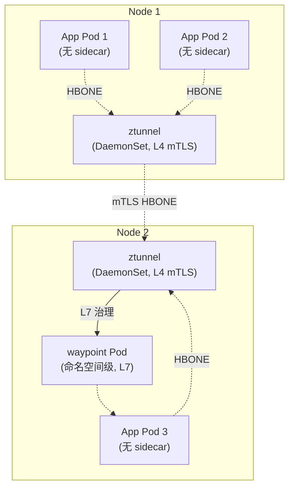
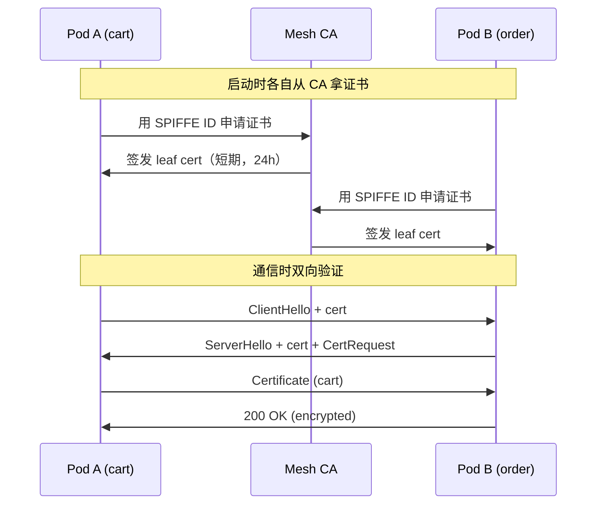
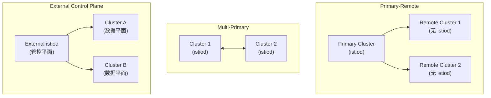
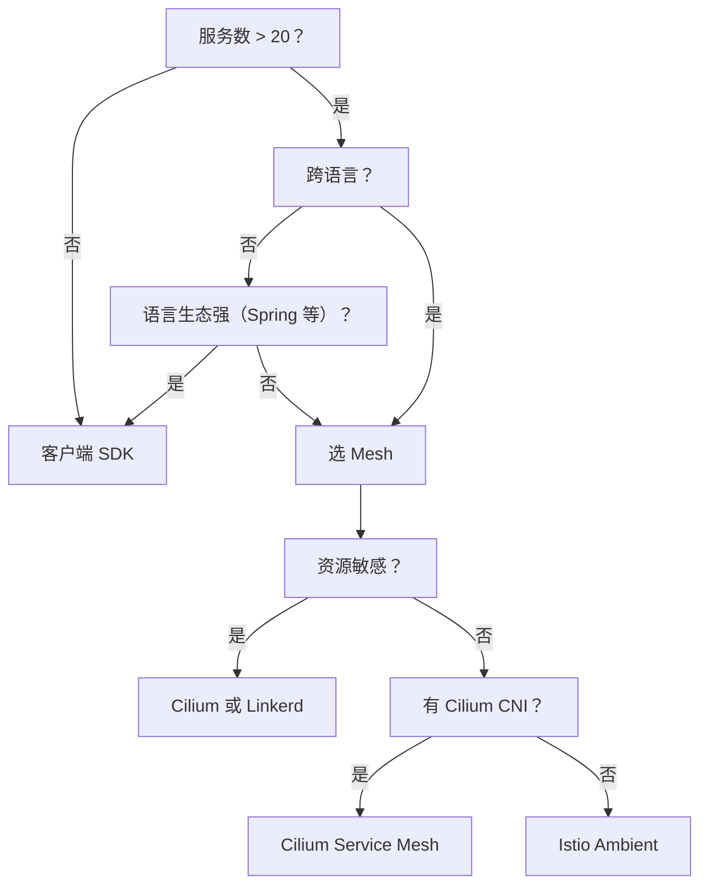

# 精通 Service Mesh：Istio Ambient、Cilium、Linkerd 与 mTLS 流量治理全景

> 课程编号：C10
> 路线图来源：云原生 · 模块五 网格、可观测、安全
> 难度：⭐⭐⭐⭐⭐
> 预计阅读时间：90 分钟
> 内容基准：2026 年 6 月（Istio 1.24 / Ambient GA、Cilium 1.16+、Linkerd 2.16+、Gateway API v1.1）

---

## 引言：Service Mesh 到底解决什么

把一个微服务从单体拆开的那一刻，三件事悄悄变成了你的问题：

1. **东西向 mTLS**——内网不再"可信"，零信任要求服务间双向认证
2. **跨语言可观测**——Go / Java / Python / Node 团队各写一遍 metrics + tracing 显然不科学
3. **流量治理下沉**——重试、超时、熔断、金丝雀，要做就 100 个服务都做

如果用 SDK 解决：每个语言写一遍、每次升级 100 个服务发版、新加一种语言再写一遍。微服务架构的"运维债"在 2015-2018 年快速堆积，于是诞生了 Service Mesh 的核心想法：

> **把所有跨进程通信的治理逻辑，从应用进程剥离到一个独立的数据平面，由控制平面集中下发配置。**

```
┌──────────────────────────────────────────────────────┐
│           应用进程 (Go / Java / Python ...)            │
│   ↓ 只负责业务逻辑、不感知 mTLS / 重试 / 拓扑           │
├──────────────────────────────────────────────────────┤
│   数据平面（Envoy / Linkerd-proxy / ztunnel / eBPF）   │
│   ↑ 透明拦截流量，做：mTLS / 路由 / 重试 / 指标         │
├──────────────────────────────────────────────────────┤
│   控制平面（istiod / linkerd-controller / cilium）     │
│   ↑ 监听 K8s CRD，下发配置给数据平面                   │
└──────────────────────────────────────────────────────┘
```

2026 年 5 月的现状是：**Sidecar 不再是 Mesh 的唯一形态**。Istio Ambient 在 2024-11 GA、Cilium Service Mesh 完全 sidecarless、Linkerd 仍然走轻量 sidecar——三条技术路线并存且各有所长。本章把这三家拆开讲，并给出 2026 年的选型方法论。

Service Mesh **不是银弹**：它会增加延迟（哪怕只有 0.5ms）、增加复杂度、增加排障难度。这一章最后一节给出"何时不上 Mesh"的清单——读完你会知道，对于一些场景，简单的客户端 SDK + Gateway API 反而是更好的解法。

---

## 第一章：Sidecar 模式——经典 Istio / Linkerd 的代价

### 1.1 Sidecar 拦截原理

经典 Istio（Sidecar 模式）的数据平面：

```
Pod 内部（共享 network namespace）：
┌─────────────────────────────────────┐
│  Container A (app)    Container B    │
│         ↓                ↑            │
│      127.0.0.1        127.0.0.1      │
├─────────────────────────────────────┤
│            ↑                          │
│      iptables NAT                    │
│  (REDIRECT 15006 入站 / 15001 出站)    │
│            ↓                          │
│       Envoy sidecar                  │
│   (端口 15006/15001/15090 等)        │
│            ↑                          │
│      eth0 (Pod 网络接口)              │
└─────────────────────────────────────┘
```

Pod 启动时由 `istio-init` initContainer 改写 iptables 规则，把所有入站 / 出站流量重定向到 Envoy。应用进程**完全无感**——它以为自己直连了上游，实际上每个连接都经过了 Envoy。

```bash
# 看 sidecar 注入后的 Pod
kubectl get pod myapp -o yaml | grep -A 3 containers
# containers:
# - name: myapp
# - name: istio-proxy   <-- 这就是 Envoy
```

### 1.2 Sidecar 的好处

- **零应用改造**：业务代码不变，部署时加注入即可
- **跨语言一致**：Go / Java / Python 同一套治理逻辑
- **强大功能**：Envoy 是工业级 L7 代理，几乎能做任何流量操作
- **故障隔离**：sidecar 死掉只影响一个 Pod（Pod 内重启）

### 1.3 Sidecar 的代价

代价才是 Ambient 出现的根本原因：

| 代价 | 数字（典型值） | 谁来买单 |
|---|---|---|
| **资源开销** | 每 Pod 额外 ~100MB 内存 + 0.1-0.5 CPU | Node 资源 |
| **冷启动延迟** | Pod 启动多 1-3s | 弹性伸缩、灰度 |
| **数据路径增长** | 每跳多 2 次 hop（出 sidecar、入 sidecar） | 端到端延迟 + 0.5-2ms |
| **运维复杂** | 注入失败、版本错位、容器顺序问题 | SRE |
| **升级困难** | 升级 Istio 需要重启所有 Pod | 业务窗口 |

举个直观的数：1000 个 Pod 的集群上 sidecar，光内存开销就要 ~100GB。对于规模化集群这是真金白银的浪费。

### 1.4 Sidecar 启动顺序坑

K8s 1.33 之前的经典坑：

```yaml
# 应用容器启动时 sidecar 还没就绪 → 应用调外部 API 失败
# 应用容器先退出但 sidecar 不死 → Pod 永远不 terminate
```

**K8s 1.28 alpha → 1.29 beta → 1.33 GA 的 Sidecar Container（`restartPolicy: Always` 的 initContainer）解决了这个问题**：

```yaml
spec:
  initContainers:
  - name: istio-proxy
    image: istio/proxyv2
    restartPolicy: Always   # 1.28 alpha / 1.29 beta / 1.33 GA：让 init 容器变成"sidecar"
    # ...
```

Istio 1.20+ 已经支持 Sidecar Container（默认需通过 `ENABLE_NATIVE_SIDECARS=true` 启用，1.27+ 默认开启）。但**升级前的存量集群仍然要小心**，并且 Ambient 模式彻底绕开了这个问题。

---

## 第二章：Ambient 模式——Istio 2024-11 GA 的革命

### 2.1 为什么需要 Ambient

Ambient 的设计目标用一句话总结：

> **L4 mTLS 和 L7 治理拆开——大多数服务只需要 L4，按需上 L7。**

经典 Sidecar 的问题在于**"全有全无"**——一旦注入 sidecar，所有流量都过 Envoy，哪怕你只想要 mTLS。Ambient 把这层撕开：

```
经典 Sidecar：              Ambient：
   每 Pod 一个 Envoy          每 Node 一个 ztunnel (L4)
   (重)                       按需 waypoint (L7)
                              (按需 + 轻)
```

### 2.2 ztunnel + waypoint 双层架构



**ztunnel**：

- Rust 写的轻量 L4 代理，DaemonSet 部署（每节点一个）
- 只做 mTLS + L4 路由（不解析 HTTP）
- 用 HBONE 协议（HTTP/2 CONNECT 隧道）传输 mTLS 流量
- 资源开销极低（典型 < 50MB / 节点）

**waypoint**：

- 标准 Envoy，但**部署模式不同**——按命名空间或按服务部署
- 只有需要 L7 治理（重试、超时、HTTPRoute、AuthorizationPolicy on L7）时才走 waypoint
- 普通 mTLS 流量直接在 ztunnel 之间走，不经过 waypoint

### 2.3 启用 Ambient 模式

Ambient 在 Istio 1.22 起默认 profile 可用，1.24（2024-11）GA：

```bash
# 安装 Ambient
istioctl install --set profile=ambient --skip-confirmation

# 启用某个 namespace 的 Ambient（dataplane mode）
kubectl label namespace prod istio.io/dataplane-mode=ambient

# 验证：Pod 没有 sidecar，但流量自动走 ztunnel
kubectl get pods -n prod
# NAME      READY   STATUS    <-- READY 1/1，不是 2/2
# myapp-x   1/1     Running
```

加 namespace label 后**已运行的 Pod 不需要重启**——ztunnel 通过节点级流量重定向接管。这是 Ambient 相对 Sidecar 的运维优势之一。

### 2.4 启用 L7（waypoint）

只有需要 HTTP 级治理时才需要 waypoint：

```bash
# 给 namespace 部署一个 waypoint
istioctl waypoint apply --namespace prod --enroll-namespace
```

或者用 Gateway API（推荐）：

```yaml
apiVersion: gateway.networking.k8s.io/v1
kind: Gateway
metadata:
  name: waypoint
  namespace: prod
  labels:
    istio.io/waypoint-for: service  # 服务级 waypoint
spec:
  gatewayClassName: istio-waypoint
  listeners:
  - name: mesh
    port: 15008
    protocol: HBONE
```

```yaml
# 给特定 service 启用 L7
apiVersion: v1
kind: Service
metadata:
  name: cart
  namespace: prod
  labels:
    istio.io/use-waypoint: "waypoint"
```

应用 HTTPRoute 即可做 L7 流量切分：

```yaml
apiVersion: gateway.networking.k8s.io/v1
kind: HTTPRoute
metadata:
  name: cart-canary
  namespace: prod
spec:
  parentRefs:
  - name: cart
    kind: Service
    group: ""
  rules:
  - matches:
    - headers:
      - name: x-canary
        value: "true"
    backendRefs:
    - name: cart-v2
      port: 80
  - backendRefs:
    - name: cart-v1
      port: 80
      weight: 90
    - name: cart-v2
      port: 80
      weight: 10
```

### 2.5 Ambient 的核心好处

| 维度 | Sidecar 模式 | Ambient 模式 |
|---|---|---|
| **Pod 资源** | 每 Pod +100MB / +0.1 CPU | 0 |
| **节点资源** | 每节点 N × sidecar | 1 × ztunnel (~50MB) |
| **启动延迟** | +1-3s | 0 |
| **升级影响** | 全 Pod 重启 | 只重启 ztunnel / waypoint |
| **L7 治理** | 永远开 | 按需开（waypoint） |
| **故障排查** | Pod 内 Envoy 日志 | ztunnel + waypoint 分层 |
| **生态成熟度** | 极成熟 | 2024-11 GA，2026 中等成熟 |

### 2.6 Ambient 的当前坑

2026 年 5 月，Ambient 仍有几个需要注意的点：

- **WASM 插件**：经典 sidecar 的 WASM Filter 在 Ambient 上需要部署到 waypoint
- **Egress Gateway**：迁移到 waypoint 的 egress 模式
- **多版本共存**：sidecar 与 ambient namespace 可以共存于同集群，但跨网格调用需注意
- **某些 EnvoyFilter**：不再直接生效，需要改写为 waypoint 配置

---

## 第三章：Cilium Service Mesh——eBPF 路线

### 3.1 eBPF 视角下的 Mesh

Cilium 的核心理念：**内核里能做的事，不放到用户态**。

经典 sidecar：
```
App → kernel → iptables NAT → kernel → Envoy(user) → kernel → wire
                  3 次内核⇄用户态切换 + iptables 规则查找
```

Cilium eBPF：
```
App → kernel (XDP/TC eBPF) → wire
       L4 mTLS / 路由 / 策略全部内核态
```

L7 治理时按需走 Envoy（DaemonSet），不是 sidecar。

### 3.2 启用 Cilium Service Mesh

Cilium 已经在大部分集群作为 CNI 存在，启用 Service Mesh 只需配置：

```bash
helm upgrade cilium cilium/cilium \
  --namespace kube-system \
  --reuse-values \
  --set kubeProxyReplacement=true \
  --set ingressController.enabled=true \
  --set gatewayAPI.enabled=true \
  --set envoy.enabled=true \
  --set authentication.mutual.spire.enabled=true   # mTLS via SPIRE
```

### 3.3 Cilium 的 L7 治理（CiliumEnvoyConfig）

```yaml
apiVersion: cilium.io/v2
kind: CiliumEnvoyConfig
metadata:
  name: api-canary
spec:
  services:
  - name: api
    namespace: prod
  resources:
  - "@type": type.googleapis.com/envoy.config.route.v3.RouteConfiguration
    name: api-routes
    virtual_hosts:
    - name: api
      domains: ["*"]
      routes:
      - match: { prefix: "/" }
        route:
          weighted_clusters:
            clusters:
            - { name: "prod/api-v1", weight: 90 }
            - { name: "prod/api-v2", weight: 10 }
```

### 3.4 Cilium 的优劣势

**优势**：

- **零 sidecar**：彻底 sidecarless，资源开销最低
- **CNI + Mesh 合一**：底层已经在用 Cilium 做 CNI，自然延伸
- **Hubble**：内置基于 eBPF 的可观测（流量拓扑、L4/L7 metrics、丢包）
- **NetworkPolicy 强大**：CiliumNetworkPolicy 支持 L7（HTTP/Kafka/DNS）

**劣势**：

- **L7 功能不如 Istio 丰富**：流量治理 DSL 不够成熟
- **mTLS 需要 SPIRE**：不像 Istio 内置 CA 那么开箱即用
- **生态偏向 CNI**：很多 Service Mesh 高级特性（如 WASM）不直接支持
- **内核版本要求**：建议 5.10+

---

## 第四章：Linkerd 2.16+——Rust 写的极简 Mesh

### 4.1 Linkerd 的设计哲学

Linkerd 一直坚持："**做少但做好**"。

- 数据平面用 Rust 写的 `linkerd2-proxy`（不是 Envoy）
- 极简配置：很少的 CRD、很少的概念
- mTLS、负载均衡、重试、超时、tap、metrics——这些"必须"功能开箱即用
- 不做：复杂 EnvoyFilter、WASM、Egress Gateway 的复杂场景

### 4.2 安装与启用

```bash
linkerd install --crds | kubectl apply -f -
linkerd install | kubectl apply -f -
linkerd check

# 给 namespace 启用注入
kubectl annotate namespace prod linkerd.io/inject=enabled
kubectl rollout restart deployment -n prod
```

### 4.3 资源开销对比

| Mesh | 数据平面进程 | 典型每 Pod 内存 | 典型每 Pod CPU |
|---|---|---|---|
| Istio (sidecar) | Envoy (C++) | 80-150MB | 0.1-0.5 |
| Istio (Ambient) | ztunnel (Rust, per-node) | ~50MB / 节点 | 极低 |
| Cilium | Envoy (按需，per-node) | ~80MB / 节点 | 视流量 |
| **Linkerd** | linkerd2-proxy (Rust) | **10-30MB** | 0.05-0.2 |

Linkerd 的 Rust proxy 是当前**单 Pod 资源最优**的 sidecar 方案。

### 4.4 Linkerd 的流量治理（HTTPRoute）

Linkerd 2.14+ 完全拥抱 Gateway API：

```yaml
apiVersion: gateway.networking.k8s.io/v1beta1
kind: HTTPRoute
metadata:
  name: api-route
  namespace: prod
spec:
  parentRefs:
  - name: api
    kind: Service
    group: ""
  rules:
  - matches:
    - path: { type: PathPrefix, value: "/" }
    backendRefs:
    - name: api-v1
      port: 80
      weight: 90
    - name: api-v2
      port: 80
      weight: 10
```

### 4.5 何时选 Linkerd

- 团队对 Istio CRD 体量过敏
- 资源极度敏感（边缘 / 中小集群）
- 不需要复杂 L7 编排
- 想要 Rust 数据平面的性能与安全

---

## 第五章：mTLS——零信任网络的基石

### 5.1 mTLS 工作原理

经典 TLS：客户端验证服务端证书（HTTPS）。
mTLS：**双向验证**——服务端也要求客户端出示证书。



证书的"身份"用 **SPIFFE ID** 表示：
```
spiffe://cluster.local/ns/prod/sa/cart-sa
       └────────┬────────┘ └─┬─┘ └──┬──┘
          trust domain      namespace  service account
```

### 5.2 Istio mTLS 配置

Istio 默认开启 PERMISSIVE 模式（同时接受加密和明文）：

```yaml
apiVersion: security.istio.io/v1beta1
kind: PeerAuthentication
metadata:
  name: default
  namespace: prod
spec:
  mtls:
    mode: STRICT     # 强制 mTLS（PERMISSIVE / DISABLE / STRICT）
```

针对特定 Service：

```yaml
apiVersion: security.istio.io/v1beta1
kind: PeerAuthentication
metadata:
  name: cart-strict
  namespace: prod
spec:
  selector:
    matchLabels:
      app: cart
  mtls:
    mode: STRICT
  portLevelMtls:
    8080:
      mode: PERMISSIVE   # 调试端口豁免
```

### 5.3 证书轮换

Istio 的证书有效期默认 24h，每 12h 自动轮换。这是 Mesh 的**杀手锏**：

- 应用代码不需要管证书
- Cert Manager / Vault / SPIRE 自动签发
- 短期证书泄漏影响有限
- 大规模轮换无运维负担

```bash
# 查看 Pod 当前证书
istioctl proxy-config secret <pod>.<namespace> -o json | \
  jq -r '.dynamicActiveSecrets[].secret.tlsCertificate.certificateChain.inlineBytes' | \
  base64 -d | openssl x509 -text -noout | head -20
```

### 5.4 AuthorizationPolicy 授权

mTLS 解决"是谁"的问题，AuthorizationPolicy 解决"能做什么"：

```yaml
apiVersion: security.istio.io/v1beta1
kind: AuthorizationPolicy
metadata:
  name: cart-allow-order
  namespace: prod
spec:
  selector:
    matchLabels:
      app: cart
  action: ALLOW
  rules:
  - from:
    - source:
        principals: ["cluster.local/ns/prod/sa/order-sa"]
    to:
    - operation:
        methods: ["GET", "POST"]
        paths: ["/cart/*"]
```

**零信任的实践**：默认拒绝（DENY-ALL）+ 显式 ALLOW。

```yaml
# 默认全拒绝
apiVersion: security.istio.io/v1beta1
kind: AuthorizationPolicy
metadata:
  name: deny-all
  namespace: prod
spec: {}     # 空 spec = 默认 deny
```

### 5.5 Ambient 模式下的 mTLS

Ambient 通过 ztunnel 实现 mTLS——所有 Pod 间流量自动加密，**不需要应用感知**。

```bash
# 检查 Ambient mTLS 状态
istioctl ztunnel-config workloads <node>
# NAMESPACE   NAME    STATUS    PROTOCOL    NODE
# prod        cart    Healthy   HBONE       node-1   <-- HBONE 表示 mTLS
```

---

## 第六章：流量治理——VirtualService / DestinationRule / 重试 / 超时 / 熔断

### 6.1 VirtualService：路由规则

Istio 经典模式（在 Ambient 下推荐用 Gateway API HTTPRoute 替代）：

```yaml
apiVersion: networking.istio.io/v1beta1
kind: VirtualService
metadata:
  name: cart
  namespace: prod
spec:
  hosts: ["cart"]
  http:
  # 按 header 路由
  - match:
    - headers:
        x-canary:
          exact: "true"
    route:
    - destination:
        host: cart
        subset: v2

  # 按权重切分
  - route:
    - destination:
        host: cart
        subset: v1
      weight: 90
    - destination:
        host: cart
        subset: v2
      weight: 10
    # 全局重试 / 超时
    retries:
      attempts: 3
      perTryTimeout: 2s
      retryOn: "5xx,reset,connect-failure"
    timeout: 10s
```

### 6.2 DestinationRule：上游策略

```yaml
apiVersion: networking.istio.io/v1beta1
kind: DestinationRule
metadata:
  name: cart
  namespace: prod
spec:
  host: cart
  subsets:
  - name: v1
    labels: { version: v1 }
  - name: v2
    labels: { version: v2 }
  trafficPolicy:
    # 连接池（限流）
    connectionPool:
      tcp:
        maxConnections: 100
      http:
        http2MaxRequests: 1000
        maxRequestsPerConnection: 10
    # 熔断
    outlierDetection:
      consecutive5xxErrors: 5
      interval: 30s
      baseEjectionTime: 30s
      maxEjectionPercent: 50
    # 负载均衡策略
    loadBalancer:
      simple: LEAST_REQUEST  # ROUND_ROBIN / LEAST_REQUEST / RANDOM / PASSTHROUGH
```

### 6.3 重试与超时的工程实践

**核心原则**：

1. 只对**幂等**操作重试（GET / PUT，POST 慎重）
2. `retryOn` 严格选择——`5xx,reset,connect-failure` 是常见安全集合
3. 不要在每一层都加重试——**重试风暴**会瞬间放大流量
4. `perTryTimeout` × `attempts` 应该 < 上游整体 timeout

```yaml
# 推荐的保守配置
retries:
  attempts: 2                                      # 不要超过 3
  perTryTimeout: 2s
  retryOn: "gateway-error,connect-failure,refused-stream"
  retryRemoteLocalities: false
```

### 6.4 熔断（Circuit Breaking）

Envoy 的熔断分两层：

**连接池熔断**：

```yaml
connectionPool:
  http:
    http2MaxRequests: 1000        # 并发上限
    maxPendingRequests: 100        # 队列上限
    maxRequestsPerConnection: 10
```

超出上限的请求直接返回 503，**不打到上游**——保护慢上游不被打垮。

**异常检测（实例驱逐）**：

```yaml
outlierDetection:
  consecutive5xxErrors: 5     # 连续 5 次 5xx 触发驱逐
  interval: 30s                # 检测间隔
  baseEjectionTime: 30s        # 基础驱逐时长
  maxEjectionPercent: 50       # 最多驱逐 50% 实例
```

实例被驱逐后**临时**从负载均衡剔除——给慢实例恢复时间。

### 6.5 故障注入（Fault Injection）

Mesh 一大杀器：**在不改代码的情况下注入故障，验证韧性**。

```yaml
apiVersion: networking.istio.io/v1beta1
kind: VirtualService
metadata:
  name: cart-chaos
spec:
  hosts: ["cart"]
  http:
  - match:
    - headers:
        x-chaos: { exact: "true" }
    fault:
      delay:
        percentage: { value: 50.0 }
        fixedDelay: 5s            # 50% 请求延迟 5s
      abort:
        percentage: { value: 10.0 }
        httpStatus: 503           # 10% 直接 503
    route:
    - destination: { host: cart }
```

线上**只对带 chaos header 的流量**注入故障——既能演练又不影响真实用户。

---

## 第七章：金丝雀 / 镜像流量 / A-B 测试

### 7.1 金丝雀发布（Weighted Routing）

最简单的渐进发布：

```yaml
# v2 灰度 5% → 25% → 50% → 100%
spec:
  http:
  - route:
    - destination: { host: cart, subset: v1 }
      weight: 95
    - destination: { host: cart, subset: v2 }
      weight: 5
```

配合 Argo Rollouts 或 Flagger 可以做**指标驱动的自动金丝雀**：

```yaml
# Argo Rollouts 例子
apiVersion: argoproj.io/v1alpha1
kind: Rollout
metadata:
  name: cart
spec:
  strategy:
    canary:
      trafficRouting:
        istio:
          virtualService: { name: cart }
      steps:
      - setWeight: 5
      - pause: { duration: 10m }
      - analysis:
          templates:
          - templateName: success-rate    # Prometheus 成功率 > 99%
      - setWeight: 25
      - pause: { duration: 10m }
      - setWeight: 50
      - pause: { duration: 10m }
```

### 7.2 镜像流量（Shadow / Mirror）

把生产流量**复制一份**打到新版本，**不影响响应**——线上验证新版本的最佳工具：

```yaml
apiVersion: networking.istio.io/v1beta1
kind: VirtualService
metadata:
  name: cart-mirror
spec:
  hosts: ["cart"]
  http:
  - route:
    - destination: { host: cart, subset: v1 }
    mirror:
      host: cart
      subset: v2
    mirrorPercentage:
      value: 100.0   # 100% 镜像
```

**关键**：

- 镜像请求的响应被丢弃（不影响用户）
- 上游需要做幂等性——**不能让影子流量产生副作用**（例如重复扣款）
- Shadow 流量也算上游负载——容量需要预留

### 7.3 A/B 测试（Header / Cookie 路由）

```yaml
spec:
  http:
  # 按 user-agent 路由
  - match:
    - headers:
        user-agent: { regex: ".*iPhone.*" }
    route:
    - destination: { host: cart, subset: v2-mobile }
  # 按 cookie 路由
  - match:
    - headers:
        cookie: { regex: ".*beta=true.*" }
    route:
    - destination: { host: cart, subset: v2 }
  # 默认
  - route:
    - destination: { host: cart, subset: v1 }
```

### 7.4 滚动 vs 金丝雀 vs 蓝绿

| 策略 | 流量切换 | 资源 | 回滚速度 | 适用 |
|---|---|---|---|---|
| **Rolling** | 按 Pod 滚 | 1x（+ surge） | 慢（要回滚 Pod） | 常规升级 |
| **Canary** | 按比例 | 1x | 快（改权重） | 灰度验证 |
| **Blue-Green** | 100% 切换 | 2x | 极快（改 selector） | 重大版本 |
| **Shadow** | 0%（仅镜像） | 2x | N/A | 线上验证 |

---

## 第八章：可观测性——Mesh 自带的眼睛

### 8.1 Mesh 提供的三件套

**Metrics**（金信号）：Mesh 在数据平面拦截所有 RPC，自动暴露 RED 指标：

- **R**equest rate（QPS）
- **E**rror rate（错误率）
- **D**uration（延迟分位）

```
istio_requests_total{
  source_workload="cart",
  destination_workload="order",
  response_code="200"
} 12345

istio_request_duration_milliseconds_bucket{
  source_workload="cart",
  destination_workload="order",
  le="100"
} 9876
```

**Tracing**：Mesh 自动注入 / 转发 trace header（B3、W3C TraceContext）。**但应用仍需在自己的代码里 propagate header**——Mesh 只能透传，不能凭空造调用链。

**Access Log**：Envoy / linkerd-proxy 输出标准化日志：

```
[2026-05-14T08:00:00.000Z] "GET /api/cart HTTP/1.1" 200 - 0 1234 5 4 "-"
   "cart/1.0" "abc123" "cart.prod.svc:8080" "10.0.0.5:8080"
```

### 8.2 Kiali：拓扑可视化

Kiali 把 Mesh 的实时拓扑画成图：

```bash
istioctl install --set values.kiali.enabled=true
# 或独立安装
helm install kiali kiali/kiali-server -n istio-system
```

打开 Kiali UI 能看到：

- 服务调用关系图（节点 = 服务，边 = 调用）
- 实时 QPS、错误率、延迟
- mTLS 状态（每条边是否加密）
- 异常服务高亮（红 / 黄）

这是排查"为什么 A 调 B 慢"最快的工具。

### 8.3 Hubble（Cilium）

Cilium 的 Hubble 基于 eBPF，**不需要 sidecar 也能看流量**：

```bash
hubble observe --pod prod/cart --follow
# May 14 08:00:01.234 prod/cart-x:42334 -> prod/order-y:8080 SYN
# May 14 08:00:01.235 prod/cart-x:42334 <- prod/order-y:8080 SYN-ACK
# May 14 08:00:01.236 prod/cart-x:42334 -> prod/order-y:8080 ACK
# May 14 08:00:01.240 prod/cart-x:42334 -> prod/order-y:8080 HTTP GET /api/orders
# May 14 08:00:01.245 prod/cart-x:42334 <- prod/order-y:8080 HTTP/1.1 200 OK
```

eBPF 视角的可观测性是 Mesh 的有力补充——尤其是排查"Mesh 也不知道发生了什么"的问题。

### 8.4 Mesh metrics 的金标准 dashboard

Prometheus + Grafana 的经典面板：

| 指标 | PromQL |
|---|---|
| 全局 QPS | `sum(rate(istio_requests_total[1m]))` |
| 错误率 | `sum(rate(istio_requests_total{response_code=~"5.."}[1m])) / sum(rate(istio_requests_total[1m]))` |
| P99 延迟 | `histogram_quantile(0.99, sum by(le)(rate(istio_request_duration_milliseconds_bucket[1m])))` |
| 调用关系 Top10 | `topk(10, sum by(source_workload, destination_workload)(rate(istio_requests_total[5m])))` |

---

## 第九章：多集群 Mesh

### 9.1 为什么要多集群 Mesh

- **跨区域容灾**：A 区挂了流量切 B 区
- **混合云 / 多云**：AWS + GCP + 自建
- **故障域隔离**：把测试 / 生产分到不同集群但仍要联调
- **接近用户**：边缘集群本地服务发现

### 9.2 三种多集群拓扑



**Primary-Remote**：一个控制平面管多个集群——简单但单点风险。
**Multi-Primary**：每集群一个控制平面，相互发现——HA 但配置复杂。
**External Control Plane**：控制平面跑在专用集群，数据平面分布——企业级。

### 9.3 跨集群服务发现

Istio 通过 **East-West Gateway** 让集群间互访：

```yaml
apiVersion: networking.istio.io/v1beta1
kind: Gateway
metadata:
  name: cross-network-gateway
  namespace: istio-system
spec:
  selector:
    istio: eastwestgateway
  servers:
  - port:
      number: 15443
      name: tls
      protocol: TLS
    tls:
      mode: AUTO_PASSTHROUGH    # mTLS 透传到目标 Pod
    hosts: ["*.local"]
```

跨集群 Service 共享同 namespace + name 即可被自动发现并合并：

```bash
# Cluster A:
kubectl get svc cart -n prod   # ClusterIP 10.96.0.5

# Cluster B:
kubectl get svc cart -n prod   # ClusterIP 10.97.0.5

# 应用调 cart.prod.svc.cluster.local
# Mesh 自动负载均衡到两个集群的实例
```

### 9.4 信任域（Trust Domain）

多集群 mTLS 需要共享 CA 或建立信任：

```bash
# 方案 1：共享根 CA（所有集群签发的证书都被信任）
istioctl install --set values.global.meshID=mesh1 \
  --set values.global.network=network1 \
  --set values.global.multiCluster.clusterName=cluster1
```

```yaml
# 方案 2：跨信任域显式声明
apiVersion: security.istio.io/v1beta1
kind: PeerAuthentication
metadata:
  name: trust-domain-bridge
spec:
  mtls:
    mode: STRICT
# + 在 MeshConfig 配置 trustDomainAliases
```

---

## 第十章：Gateway API 与 Mesh 协同

### 10.1 Gateway API 与 Mesh 的边界

Gateway API 在 2026 年是**南北向**（外部 → 集群）和**东西向**（集群内）的统一抽象。

```
[外部用户]
     ↓ HTTPS
[GatewayClass: istio / cilium / envoy-gateway]
[Gateway: prod-edge]
     ↓ HTTPRoute
[Service: cart]   ←  内部调用走 Mesh（waypoint / sidecar / ztunnel）
     ↓
[Service: order]
```

### 10.2 Istio Ambient 用 Gateway API 做 L7

Ambient 下，**waypoint 本质就是一个 Gateway**：

```yaml
apiVersion: gateway.networking.k8s.io/v1
kind: Gateway
metadata:
  name: waypoint
  namespace: prod
  labels:
    istio.io/waypoint-for: service
spec:
  gatewayClassName: istio-waypoint
  listeners:
  - name: mesh
    port: 15008
    protocol: HBONE
```

然后绑 HTTPRoute 即可——和南北向 Gateway 用法**完全一致**。这是 2026 年的趋势：**Gateway API 一套 DSL 走南北向 + 东西向**。

### 10.3 Cilium Gateway + Mesh

Cilium 同时提供 Gateway 实现和 Mesh：

```yaml
# 南北向：Gateway
apiVersion: gateway.networking.k8s.io/v1
kind: Gateway
metadata:
  name: edge
spec:
  gatewayClassName: cilium
  listeners:
  - name: https
    port: 443
    protocol: HTTPS
---
# 东西向：CiliumEnvoyConfig（即将被 Gateway API 内部使用替代）
apiVersion: cilium.io/v2
kind: CiliumEnvoyConfig
# ...
```

### 10.4 Linkerd + Gateway API

Linkerd 2.14+ 用 Gateway API 完全替代了自家的 ServiceProfile / TrafficSplit。配置 HTTPRoute 即可做流量切分（前面第四章 4.4 已展示）。

---

## 第十一章：性能与开销实测

### 11.1 基线对比

实测数据（基于 8 vCPU / 16GB 节点，2026 年主流版本）：

| Mesh | P50 延迟增加 | P99 延迟增加 | CPU 开销 | 内存开销 |
|---|---|---|---|---|
| 无 Mesh | 0 (基线) | 0 | 0 | 0 |
| Istio sidecar | +0.5ms | +2-5ms | +10-15% | 100MB/Pod |
| **Istio Ambient (L4 only)** | **+0.2ms** | **+1ms** | **+3-5%** | **~50MB/Node** |
| Istio Ambient (L4+L7) | +0.5ms | +2-3ms | +8-10% | 50MB/Node + waypoint |
| Cilium (eBPF L4) | +0.1ms | +0.5ms | +2-3% | ~50MB/Node |
| Linkerd | +0.3ms | +1.5ms | +5-8% | 20MB/Pod |

**Ambient 与 Cilium 是当前性能最优的方案**。Sidecar 的固有开销已经被多年优化压缩，但**两次额外 hop**是绕不开的物理代价。

### 11.2 压测方法论

```bash
# fortio——Istio 官方压测工具
fortio load -c 50 -qps 1000 -t 60s -h2 http://cart.prod:8080/api/cart

# 对比有 / 无 Mesh
# 1. 基线：直接打 Pod IP（绕过 Service / Mesh）
# 2. Service：经 K8s Service（kube-proxy）
# 3. Mesh：经 Mesh
```

观察：

- **吞吐**：QPS 上限
- **延迟分布**：P50 / P90 / P99 / P999
- **CPU / Memory**：`kubectl top pod` + cAdvisor
- **错误率**：HTTP / 连接错误

### 11.3 优化技巧

**Sidecar 模式**：

```yaml
# 限制 Envoy 资源
apiVersion: v1
kind: Pod
metadata:
  annotations:
    sidecar.istio.io/proxyCPU: "100m"
    sidecar.istio.io/proxyMemory: "128Mi"
    sidecar.istio.io/proxyCPULimit: "500m"
    sidecar.istio.io/proxyMemoryLimit: "256Mi"

# 关闭不需要的功能
apiVersion: networking.istio.io/v1beta1
kind: Sidecar
metadata:
  name: minimal
  namespace: prod
spec:
  egress:
  - hosts:
    - "./*"
    - "istio-system/*"     # 只允许本 namespace + istio-system
```

**Ambient 模式**：调 ztunnel 的资源（kubectl edit ds ztunnel -n istio-system），按节点 RPS 配置 CPU / memory。

**Cilium**：开启 `bpf.masquerade=true`，避免 iptables MASQUERADE。

---

## 第十二章：选型决策——何时不上 Mesh

### 12.1 上 Mesh 的前置条件

```
[ ] 服务数量 > 20（否则 SDK 治理更简单）
[ ] 跨语言团队（不是清一色 Java/Go）
[ ] 已有 K8s 集群 + 运维能力
[ ] 需要 mTLS / 零信任合规
[ ] 流量治理需求（金丝雀 / A-B / 熔断）超出 SDK 能力
[ ] 团队能承担 Mesh 的复杂度（至少 1-2 个专职 SRE）
```

### 12.2 不上 Mesh 的场景

- **服务数 < 10**：客户端 SDK + Gateway 通常够用
- **单一语言栈**：Spring Cloud / go-kit / Helidon 等 SDK 治理更直接
- **极端延迟敏感**：高频交易、L1 cache miss 都心疼的场景
- **运维资源不足**：没有人能搞懂 Envoy 日志的团队
- **简单架构**：纯前后端 + DB，没复杂调用链

### 12.3 替代方案对比

| 需求 | Mesh | 替代方案 |
|---|---|---|
| mTLS | Istio / Cilium / Linkerd | 应用内 TLS、SPIFFE / SPIRE 直接集成 |
| 重试 / 超时 | VirtualService | Resilience4j / go-retryablehttp |
| 熔断 | DestinationRule | Hystrix / sentinel / opossum |
| 金丝雀 | VirtualService weight | Argo Rollouts + Service selector |
| 可观测 | Mesh metrics | OpenTelemetry SDK |

### 12.4 选型决策树



---

## 第十三章：生产实践——逐步引入 Mesh

### 13.1 三阶段引入策略

**阶段 1：可观测先行（无侵入）**

- 安装 Istio，**不开 mTLS、不开 PolicyEnforcement**
- 用 PERMISSIVE 模式注入
- 收 metrics、看 Kiali 拓扑
- 团队熟悉 Mesh 心智模型

**阶段 2：mTLS 灰度**

- 选 1-2 个非核心 namespace 开 STRICT mTLS
- 观察 1-2 周（关注证书错误、连接失败）
- 逐 namespace 滚到 STRICT

**阶段 3：流量治理**

- 选 1 个高频迭代服务开始用 VirtualService
- 金丝雀 / 镜像流量替换原有发布流程
- 引入 AuthorizationPolicy 做零信任

### 13.2 命名空间灰度

```bash
# step 1: dev 环境注入
kubectl label namespace dev istio-injection=enabled

# step 2: 灰度生产某个 namespace
kubectl label namespace prod-experimental istio-injection=enabled

# step 3: 全量
kubectl label namespace prod istio-injection=enabled

# Ambient 同理（用 dataplane-mode=ambient）
```

### 13.3 升级策略

Istio Sidecar 升级是个大工程：

```bash
# 1. 升级控制平面（不影响数据平面）
istioctl upgrade

# 2. revision-based 升级（推荐）
istioctl install --revision=1-24
kubectl label namespace prod istio.io/rev=1-24 --overwrite
kubectl rollout restart deployment -n prod   # 这一步会重启 Pod

# 3. 老 revision 下线
istioctl uninstall --revision=1-22
```

**Ambient 升级更平滑**：只需重启 ztunnel DaemonSet，应用 Pod 不动。

### 13.4 GitOps + Mesh

Mesh CRD 数量多，**强烈推荐 GitOps 管理**：

```yaml
# argocd app
apiVersion: argoproj.io/v1alpha1
kind: Application
metadata:
  name: mesh-config
spec:
  source:
    repoURL: git@github.com:org/mesh-config.git
    path: prod
  destination:
    namespace: prod
    server: https://k8s.prod
  syncPolicy:
    automated: { prune: true, selfHeal: true }
```

仓库结构：

```
mesh-config/
  prod/
    peer-auth.yaml          # mTLS 策略
    authz/                  # AuthorizationPolicy
    routes/                 # VirtualService / HTTPRoute
    destinations/           # DestinationRule
    gateways/               # Gateway
```

### 13.5 故障注入演练（混沌工程）

每月一次的 Mesh-driven Chaos：

```bash
# 模拟 cart 服务 50% 慢
kubectl apply -f - <<EOF
apiVersion: networking.istio.io/v1beta1
kind: VirtualService
metadata:
  name: cart-chaos
spec:
  hosts: ["cart"]
  http:
  - fault:
      delay:
        percentage: { value: 50 }
        fixedDelay: 5s
    route: [{destination: {host: cart}}]
EOF

# 观察上游 (checkout) 的 P99 延迟、错误率
# 验证：上游是否优雅降级？是否触发熔断？

# 清理
kubectl delete virtualservice cart-chaos
```

---

## 第十四章：陷阱清单（按踩坑频次排序）

### 14.1 注入 / 启动顺序

- **Pod 启动时 sidecar 还没就绪 → 调外部 API 失败**
  - 修：升级到 K8s 1.33+ (Sidecar Container GA) + Istio 1.20+，或 Ambient
- **应用退出但 sidecar 不死 → Pod 永不 Terminate**
  - 修：同上；旧方案用 `holdApplicationUntilProxyStarts` + `EXIT_ON_ZERO_ACTIVE_CONNECTIONS`
- **CrashLoopBackOff 的 Pod sidecar 也被重启** → 让症状难定位
  - 修：先 `kubectl logs <pod> -c istio-proxy --previous`

### 14.2 mTLS / 证书

- **PERMISSIVE → STRICT 切换打挂未注入的客户端**
  - 修：先用 `istioctl experimental authz check` 看哪些来源没 mTLS
- **DNS over mTLS 的怪问题**
  - 修：CoreDNS / 节点 DNS 别走 mesh
- **跨集群 mTLS 失败**：trust domain 不一致
  - 修：共享 CA 或显式配 `trustDomainAliases`

### 14.3 流量治理

- **重试风暴**：每一层都加重试 → N^层 流量放大
  - 修：只在入口层 / 边缘层重试
- **超时设置错位**：`perTryTimeout * attempts > timeout`
  - 修：算术：perTry × attempts < global timeout < 客户端 timeout
- **熔断太激进**：少量错误把上游剔除完
  - 修：`maxEjectionPercent: 50` 保留半数实例
- **VirtualService 不生效**：host 写错 / namespace 选择器漏
  - 修：`istioctl analyze`

### 14.4 性能

- **sidecar 资源没限**：Envoy OOM 拖累宿主 Pod
  - 修：annotation 限制 + Limit Range
- **大流量节点 ztunnel CPU 打满**
  - 修：调 ztunnel resources、节点 sharding
- **Egress 流量全过 sidecar**：调外部 API 慢
  - 修：`outboundTrafficPolicy: REGISTRY_ONLY` 反而显著降低 sidecar 资源

### 14.5 可观测性 / 排障

- **trace 断**：应用没 propagate header → 调用链断成两段
  - 修：用 OpenTelemetry SDK 显式 propagate
- **Kiali 拓扑缺边**：流量太低 / metrics 抓取间隔过长
  - 修：`prometheus.scrape_interval=15s` + 加压
- **诡异的 503**：upstream 没问题但客户端报错
  - 修：`istioctl proxy-config cluster <pod> -o json` 看 outlier detection 状态

### 14.6 多集群

- **service 重名导致跨集群乱串**
  - 修：跨集群同 namespace + 同 name = 视为同服务（设计如此）
- **跨集群延迟没考虑**：locality 优先没配
  - 修：`localityLbSetting` + region/zone label

### 14.7 升级

- **Sidecar 老版本与控制平面新版本不匹配**
  - 修：revision-based 升级
- **EnvoyFilter 在新版本失效**
  - 修：升级前用 `istioctl analyze` 提前发现
- **CRD 版本 v1beta1 → v1 强制**
  - 修：升级前批量改 CRD apiVersion

### 14.8 Ambient 特定坑

- **从 sidecar 迁到 Ambient 时 namespace label 没改全**
  - 修：检查 `istio-injection` 和 `istio.io/dataplane-mode` 不要同时存在
- **EnvoyFilter / WasmPlugin 不生效**：Ambient 数据平面是 ztunnel 不是 Envoy
  - 修：迁到 waypoint
- **某些 AuthorizationPolicy 只在 L7 生效**
  - 修：开 waypoint 才能用 path / method 维度的策略

---

## 第十五章：2026 现状

2026 年 5 月，Service Mesh 生态格局：

### 15.1 三条路线收敛

| 路线 | 代表 | 状态 |
|---|---|---|
| **Sidecar** | Istio (classic), Linkerd | 仍主流，Linkerd 2.16+ 持续优化 |
| **Sidecarless (节点级)** | Istio Ambient, Cilium | 增长最快，Ambient 2024-11 GA |
| **In-Process** | Dapr, gRPC xDS | 小众但有特定场景 |

### 15.2 趋势观察

- **Gateway API 统一南北向 + 东西向**：HTTPRoute 同时在 Ingress 和 Mesh 两边用
- **eBPF 渗透**：Cilium + Hubble 把可观测 / 安全做到内核态
- **Ambient 从"实验"走向"主流"**：Istio 1.24-1.26 期 Ambient 工具链补全
- **多集群 Mesh 标准化**：MCS（Multi-Cluster Services）API 进入 K8s 1.30+
- **WASM 插件成熟**：但 Ambient 路线下 WASM 主要跑在 waypoint
- **零信任合规**：金融 / 医疗 等行业把 mTLS + AuthorizationPolicy 当合规线
- **Mesh + AI Workload**：LLM 推理服务的流量治理（按 token 限流、模型路由）成为新场景

### 15.3 与上一代差异（2022 → 2026）

| 维度 | 2022 | 2026 |
|---|---|---|
| 数据平面 | 几乎全 sidecar | Sidecar + Ambient + Cilium 三足 |
| 配置 DSL | Istio CRD（VS/DR） | **Gateway API HTTPRoute 主流** |
| mTLS | 大企业才搞 | **零信任合规线** |
| 多集群 | 黑魔法 | Multi-Primary 标准做法 |
| 可观测 | Prometheus + Jaeger | OTel 标准 + Hubble eBPF |
| 性能开销 | Sidecar 10-20% | Ambient/Cilium 2-5% |

### 15.4 选型一句话

> **新建集群**：Cilium CNI + Cilium Service Mesh 或 Istio Ambient + Gateway API
> **存量 Istio**：逐步迁 Ambient，保留 sidecar 给重 L7 治理的 namespace
> **轻量需求**：Linkerd 2.16+
> **多云 / 复杂治理**：Istio Ambient + Multi-Primary

---

## 第十六章：练习题

### 基础题（理解概念）

1. **Sidecar 模式 vs Ambient 模式的根本差异是什么？为什么 Ambient 资源开销低这么多？**

2. **ztunnel 和 waypoint 分别工作在 OSI 哪一层？为什么 Istio 要做这个拆分？**

3. **解释 HBONE 协议是什么、为什么 Istio Ambient 用它而不是直接 TCP+mTLS。**

4. **mTLS 中的 SPIFFE ID 由哪几部分组成？为什么用 ServiceAccount 而不是 Pod 名作身份？**

5. **VirtualService 和 DestinationRule 各自负责什么？为什么要分两个 CRD？**

### 实战题（动手）

6. **在本地 kind 集群安装 Istio Ambient，部署一个 echo 服务并验证 ztunnel 已经接管流量（用 `istioctl ztunnel-config` 验证）。**

7. **给一个 Deployment 配置：当上游连续 5 次返回 5xx 时触发熔断、驱逐 30s。验证：人为造 5xx，观察客户端是否短暂收到 503。**

8. **用 VirtualService 配置：99% 流量到 v1、1% 流量到 v2；带 `x-canary: true` 头的请求 100% 到 v2。**

9. **配置 100% 镜像流量到 v2，验证：v2 收到了请求但用户响应仍然来自 v1。**

10. **用 Argo Rollouts + Istio 实现自动金丝雀：每 5 分钟切 10% 流量，若 Prometheus 5xx > 1% 自动回滚。**

### 进阶题（生产场景）

11. **场景**：你的集群有 200 个微服务，全部 sidecar 注入，每个 Pod sidecar 占 100MB。给出迁移到 Ambient 的分阶段计划，包括如何识别哪些 namespace 必须保留 L7 治理（需要 waypoint）。

12. **场景**：金融业务要求所有内网流量加密，但有 3 个老服务（无法改造）不支持 mTLS。如何配置 Mesh 满足合规又不破坏老服务？

13. **场景**：服务 A → B → C，链路 P99 延迟超标。设计一个用 Mesh 工具排查的步骤（Kiali / istioctl / Envoy 日志 / Hubble），定位是 A→B 还是 B→C 慢。

14. **场景**：双集群（北京 + 上海）部署同一套服务，用户希望"就近访问 + 跨区容灾"。设计 Istio multi-primary 配置 + DestinationRule 的 localityLbSetting，并描述某集群挂掉时的故障切换流程。

15. **场景**：上线一个 LLM 推理服务，需要：(a) 按 token 数限流；(b) 按 model 名路由到不同后端；(c) 单请求超时 60s 但保持长流式连接。在 Istio Ambient + Gateway API 下设计配置。

<details>
<summary>📝 参考答案</summary>

1. **Sidecar vs Ambient 根本差异**：Sidecar 每 Pod 注 envoy（2 个容器、+CPU/+内存、+启动延迟），Ambient 节点级 ztunnel 共享。资源开销低是因为：① N 个 Pod 共享 1 个 ztunnel（M:1）而不是 N:N；② L4 走 ztunnel（轻量 Rust），L7 才按需起 waypoint；③ 没有 sidecar 与 app 互相等待的启动顺序问题。
2. **ztunnel vs waypoint**：ztunnel 工作在 **L4**（HBONE 隧道 + mTLS），waypoint 工作在 **L7**（Envoy，做 HTTPRoute / 重试 / JWT）。拆分动机：L4 安全（mTLS）所有流量都需要，应该廉价 ubiquitous；L7 治理只有部分服务需要，按需付费——把"必做"和"选做"分层。
3. **HBONE**：HTTP/2 over mTLS 隧道协议（CONNECT 方法 + TLS）。比裸 TCP+mTLS 优势：① 用 HTTP/2 复用、流控、头压缩；② 中间 hop（ztunnel ↔ waypoint）能识别原始目标 SNI；③ 与现有 HTTP 基础设施友好（LB / Gateway 都能处理）；④ 元数据头部（client identity）可传递。
4. **SPIFFE ID** = `spiffe://<trust-domain>/ns/<ns>/sa/<sa>`，三部分：信任域、namespace、ServiceAccount。用 SA 不用 Pod 名：① Pod 名易变（重建即变），SA 稳定；② 应用身份本就是 SA 而非 Pod；③ RBAC / 策略 / mTLS 都围绕 SA，一致。
5. **VirtualService vs DestinationRule**：VS 描述"如何路由到 service"（match / weight / rewrite / mirror），DR 描述"到 service 的 host 怎么连"（mTLS / load balancer / outlier detection / subsets）。分开因为：路由 = 应用关注（前向流量），连接策略 = 平台关注（后向行为）；二者迭代节奏不同；RBAC 也常分开。
6. **kind + Istio Ambient 验证**：
   ```bash
   istioctl install --set profile=ambient
   kubectl label ns default istio.io/dataplane-mode=ambient
   kubectl apply -f echo.yaml
   istioctl ztunnel-config workloads | grep echo
   ```
   READY 1/1（不是 2/2 即代表无 sidecar），ztunnel 输出中应该看到 echo Pod 的 SPIFFE 身份。
7. **熔断配置**：
   ```yaml
   apiVersion: networking.istio.io/v1beta1
   kind: DestinationRule
   spec:
     trafficPolicy:
       outlierDetection:
         consecutive5xxErrors: 5
         interval: 10s
         baseEjectionTime: 30s
         maxEjectionPercent: 50
   ```
   人造 5xx 后客户端短暂 503，30s 内自动剔除该实例。
8. **金丝雀 + Header 路由**：
   ```yaml
   http:
   - match: [{headers: {x-canary: {exact: "true"}}}]
     route: [{destination: {host: app, subset: v2}, weight: 100}]
   - route:
     - {destination: {host: app, subset: v1}, weight: 99}
     - {destination: {host: app, subset: v2}, weight: 1}
   ```
9. **流量镜像**：`mirror: {host: app, subset: v2}; mirrorPercentage: {value: 100}`。用户响应来自 v1（route 100% v1），v2 收到副本但响应被丢弃——用于真实流量回归测试。
10. **Argo Rollouts + Istio canary**：用 Rollout `spec.strategy.canary.steps` 配 setWeight 10/20/.../100 各 pause 5m，`analysis` 用 Prometheus query `rate(http_requests_total{status=~"5.."}[2m]) / rate(http_requests_total[2m]) < 0.01`，失败自动 rollback。
11. **200 服务迁移 Ambient**：① 先 audit 哪些服务用了 L7 治理（VirtualService 的重试/超时/重写、AuthorizationPolicy with L7 path） → 需要 waypoint，否则不需要；② 灰度按 namespace 切：标 `istio.io/dataplane-mode=ambient`，sidecar 与 ambient 在同 ns 不能共存——必须 ns 整体切；③ 每个 ns 切前先复制 sidecar 端的 VS/DR 到 waypoint 上验证；④ 监控指标对比（latency / 5xx / mTLS 覆盖率）；⑤ 完成后回收 sidecar 资源（节省 ~50% mesh CPU/MEM）。
12. **3 个老服务不支持 mTLS**：用 `PeerAuthentication` 在那 3 个 Pod 的 ns 设 `mtls.mode: PERMISSIVE`（同时接受 mTLS 与明文），客户端用 `DestinationRule.trafficPolicy.tls.mode: DISABLE` 显式明文调用；其它 mesh 内部分仍 STRICT。审计补丁：写规则只允许 3 个特定 SA 调这些服务，其余 deny。长期目标：用 sidecar/waypoint 做 termination 把 mTLS 拉到老服务前端（应用无感）。
13. **A→B→C P99 排查步骤**：① Kiali 看拓扑图 latency 上色，定位慢的那一跳；② istioctl `pc cluster <pod>` 看 envoy outlier；③ trace（Tempo/Jaeger）找具体 trace_id 看每 hop 时长；④ Envoy access log 看 upstream/downstream timing；⑤ Hubble flow log 看 TCP 层 retrans。区分点：A→B 慢 → 看 A 的 outbound 与 B 的 inbound；B→C 慢 → 看 B 的 outbound 与 C 的 inbound；网络 vs 应用 → upstream_service_time vs duration 的差距。
14. **双集群 multi-primary + locality**：① 两集群同一 trust domain，root CA 互信；② 装 east-west gateway；③ DestinationRule `localityLbSetting.enabled: true` + `distribute` 配 `from: bj/* to: bj/*: 80, sh/*: 20`；④ failover：`from: bj/* to: sh: 100` 当本地全挂；⑤ Service 用 Global mark 让对端集群可见。某集群挂：outlierDetection 触发 → localityLb failover 到对端 → 用户感知一次 retry。
15. **LLM 推理服务**：(a) token 限流——Gateway 上做不到精确（看不到 token），所以在应用前加一层"LLM Gateway"做 token counter（见 A11），Mesh 只做 RPM-level rate limit；(b) 按 model 路由——HTTPRoute match `headers: x-model: claude-sonnet` 到 `backend-claude`，`gpt-5` 到 `backend-openai`；(c) 60s 超时但保持流式——Gateway / VirtualService `timeout: 60s`，HTTP/1.1 keep-alive 配 `idleTimeout: 0`（不断流），SSE 走 HTTP/1.1 chunked 或 HTTP/2 stream；waypoint 配 `streamIdleTimeout: 0` 防止流被切。

</details>

---

至此，Service Mesh 一章完。读完应该能：

- 解释 Sidecar / Ambient / Cilium / Linkerd 的架构差异与各自代价
- 给定场景做出选型（甚至说服老板"我们不需要 Mesh"）
- 配置 mTLS、流量治理、金丝雀、镜像流量
- 用 Mesh 可观测工具排查跨服务调用问题
- 规划生产环境的 Mesh 引入与升级路径
- 识别 Ambient 时代的 2026 新模式（waypoint、HBONE、Gateway API 东西向）

下一章 [C11 K8s 可观测性](./C11-精通-K8s-可观测性.md) 会把"看见流量"这件事做完——Mesh 给了基础 metrics，但完整可观测还需要 Prometheus、Loki、Tempo、Pixie 的协同。
