# 精通 K8s 可观测性：Metrics、Logs、Traces、eBPF 与 Profile 的全景战法

> 课程编号：C11
> 路线图来源：云原生模块五 · 网格、可观测、安全
> 难度：⭐⭐⭐⭐
> 预计阅读时间：90 分钟
> 内容基准：2026 年 5 月（Kubernetes 1.33、Prometheus 3.0、OpenTelemetry CNCF Graduated、Loki 3.x、Tempo 2.x、Pixie / Hubble / Cilium 1.16+、Parca / Pyroscope）

---

## 引言：K8s 可观测的独特挑战

```yaml
apiVersion: v1
kind: Pod
metadata:
  name: tx-svc-7c9d4-x2k8r       # 副本，5 分钟后被销毁
  labels:
    app: tx-svc
    version: v3.2.1
spec:
  containers:
    - name: app
      image: registry.example.com/tx-svc:v3.2.1
```

K8s 把"应用"变成"短生命周期的副本群"——`tx-svc-7c9d4-x2k8r` 这种 Pod 名 5 分钟前不存在，5 分钟后也不存在。容器、节点、命名空间、负载层层叠加，再叠上多租户、多集群——传统 VM 时代"装个 Zabbix Agent + tail -f /var/log/messages"的玩法在这里完全破产。

K8s 的可观测挑战可归纳为五条：

1. **短生命周期**：Pod 平均寿命可能只有几分钟（CI Job、HPA 扩缩、Spot 抢占），日志/指标必须**在 Pod 死前**导出，否则现场全失
2. **容器边界**：单进程 -> 单容器 -> Pod -> Node -> Cluster -> Region，任何指标都要能**沿这条树往上聚合、往下下钻**
3. **多租户**：单集群上百个团队、上千个命名空间，"我的指标"和"你的指标"必须能干净分离，且不能互相打爆 Prometheus
4. **维度爆炸**：每个 Pod 自带 `pod`、`namespace`、`node`、`container`、`uid` 五个 label，再叠业务 label，cardinality 极易失控
5. **多源整合**：内核（cAdvisor、node-exporter）、控制面（kube-apiserver metrics）、应用（业务 metrics + OTel SDK）、Sidecar（Istio/Envoy）、eBPF（Hubble/Pixie）——五条流必须能在一块仪表板上对齐

本章把生产级 **K8s 可观测**拆开：从数据源 → Metrics 抓取 → Logs 流水线 → Traces 通路 → eBPF 增量 → 持续 Profiling → Service Mesh 自带指标 → Grafana 仪表板 → 告警 → 多集群 → 成本控制 → 陷阱 → 2026 现状。

2026 年 5 月可观测栈版图：

| 维度 | 主流栈 | 备选 |
|---|---|---|
| Metrics 抓取 | **Prometheus 3.0**（含 OTLP 接收） | VictoriaMetrics、Mimir、Cortex |
| 长期存储 / 多集群 | **Thanos**、**Grafana Mimir** | M3DB、VictoriaMetrics Cluster |
| Logs | **Loki 3.x** + Promtail / Fluent Bit / Vector | ELK、ClickHouse |
| Traces | **Tempo 2.x** + OTel Collector | Jaeger、SkyWalking |
| Profiling | **Parca**、**Pyroscope**（已合入 Grafana） | gProfiler、Datadog Profiler |
| eBPF 增量 | **Hubble**（Cilium）、**Pixie**、**Coroot**、**Inspektor Gadget** | Falco、Cilium Tetragon |
| 仪表板 | **Grafana** | Perses（CNCF）、Kibana |
| 协议 | **OTLP**（OpenTelemetry，CNCF Graduated） | Prometheus remote write |

记住一句口号：**指标说"有事"，日志说"什么事"，链路说"在哪一段"，eBPF 说"内核看到什么"，Profile 说"代码烧在哪一行"**。五者拼在一起，才是 2026 年的 K8s 可观测全景。

---

## 第一章：数据源全景——K8s 集群里到底有哪些"信号源"

### 1.1 信号源分层

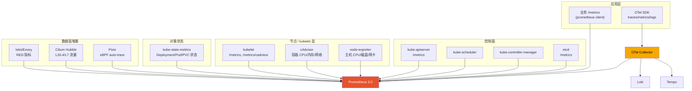

### 1.2 kube-state-metrics（KSM）

**kube-state-metrics** 不监控"性能"，只暴露"对象状态"——Deployment 期望副本数 vs 实际副本数、Pod phase、PVC 容量、Node condition……

```promql
# Deployment 副本不达标的告警源
kube_deployment_status_replicas_available
  / kube_deployment_spec_replicas < 1

# Pod 处于非 Running 状态超过 5 分钟
kube_pod_status_phase{phase!="Running"} == 1

# Node 不可调度
kube_node_spec_unschedulable == 1

# PVC 容量水位
kubelet_volume_stats_used_bytes / kubelet_volume_stats_capacity_bytes > 0.85
```

KSM 是 K8s 控制面"对象层"的眼睛——出了"Pod 处于 Pending 30 分钟"或"Deployment 滚动卡住"这种问题，KSM 是第一现场。

部署方式（kube-prometheus-stack 默认包含）：

```bash
helm upgrade --install kube-prom prometheus-community/kube-prometheus-stack \
  --namespace monitoring --create-namespace \
  --set kubeStateMetrics.enabled=true
```

### 1.3 cAdvisor（kubelet 内嵌）

**cAdvisor**（Container Advisor）由 Google 开源，2018 年起以 Library 形式集成进 kubelet。它通过 cgroup v1/v2 文件系统读取每个容器的：

- CPU 使用（user/system，节流次数）
- 内存（RSS、Cache、Working Set、OOM 计数）
- 网络（按接口 RX/TX 字节、包）
- 文件系统（读写）

抓取端点：

```
https://<node-ip>:10250/metrics/cadvisor   # kubelet 暴露（需认证）
https://<node-ip>:10250/metrics/resource   # 简化版（kubelet 自己提供）
```

核心指标举例：

```promql
# 容器 CPU 节流（CFS quota throttling）
rate(container_cpu_cfs_throttled_seconds_total[5m]) > 0.1

# 容器内存接近 Limit
container_memory_working_set_bytes
  / container_spec_memory_limit_bytes > 0.9

# Pod 网络丢包
rate(container_network_receive_packets_dropped_total[5m]) > 0
```

### 1.4 node-exporter（主机层）

cAdvisor 只看**容器**，node-exporter 看**主机**——节点的 CPU 负载、磁盘 IOPS、网卡错误、ext4/xfs 文件系统、内核版本……

部署：DaemonSet 方式跑在每个节点（hostNetwork: true）。kube-prometheus-stack 也默认包含。

```promql
# 节点 CPU 总使用率
1 - avg(rate(node_cpu_seconds_total{mode="idle"}[5m])) by (instance)

# 节点磁盘可用率
node_filesystem_avail_bytes{mountpoint="/"}
  / node_filesystem_size_bytes{mountpoint="/"}

# 节点内存压力
node_memory_MemAvailable_bytes / node_memory_MemTotal_bytes < 0.1
```

### 1.5 API server 指标（控制面）

`kube-apiserver` 自带 `/metrics`，暴露请求 QPS、延迟、etcd 调用、watch 缓存命中等。**生产排查 API server 慢/限流必看**：

```promql
# API server 请求 p99 延迟（按 verb/resource 切）
histogram_quantile(0.99,
  sum(rate(apiserver_request_duration_seconds_bucket[5m])) by (le, verb, resource))

# 限流次数（被 priority and fairness 限）
rate(apiserver_flowcontrol_dispatched_requests_total[5m])

# etcd 请求延迟（控制面的瓶颈往往在 etcd）
histogram_quantile(0.99, rate(etcd_request_duration_seconds_bucket[5m]))
```

托管 K8s（EKS/GKE/AKS）通常**不暴露**控制面 metrics，需走云厂商自己的 dashboard。自建集群一定要把控制面 metrics 抓上。

### 1.6 信号源 vs 指标快速对照表

| 数据源 | 答 "什么" | 关键指标前缀 | 部署形态 |
|---|---|---|---|
| **kubelet** | 节点上跑了什么 Pod、状态 | `kubelet_*` | 节点上内置 |
| **cAdvisor** | 容器 CPU/内存/网络 | `container_*` | kubelet 内嵌 |
| **node-exporter** | 节点 CPU/磁盘/网卡 | `node_*` | DaemonSet |
| **kube-state-metrics** | K8s 对象状态 | `kube_*` | Deployment |
| **API server** | 控制面 QPS、延迟、错误 | `apiserver_*`、`etcd_*` | 控制面内置 |
| **应用 /metrics** | 业务 RED/USE/自定义 | 任意 | Pod 内 |
| **OTel SDK** | metrics + traces + logs | OTLP | Pod 内 |
| **Istio/Envoy** | 服务间 RED | `istio_*`、`envoy_*` | Sidecar/Ambient |
| **Hubble/Pixie** | 网络流量、HTTP 调用 | `hubble_*` / `pixie_*` | DaemonSet + eBPF |

---

## 第二章：Metrics——Prometheus 3.0 抓取与 ServiceMonitor

### 2.1 抓取模型：拉 vs 推

Prometheus 是**拉模型**：服务端定时去目标的 `/metrics` 抓。这是它和 InfluxDB、StatsD 等"推模型"最大的区别。拉模型在 K8s 里如鱼得水——目标自动通过 Service Discovery 发现，挂掉立即从池子里摘掉。

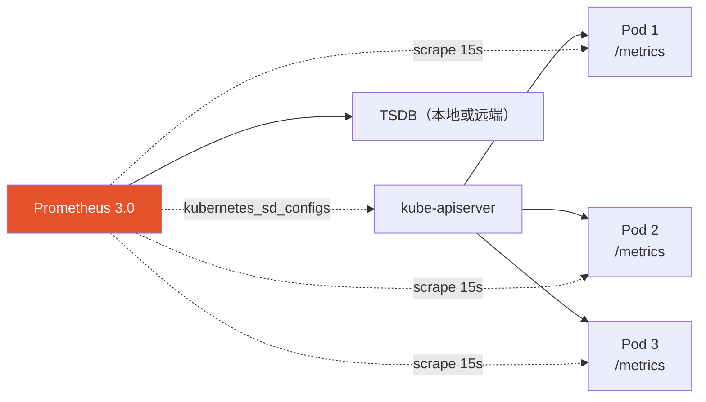

少数场景用 **Pushgateway**：批处理任务（Job/CronJob）跑得太短被抓不到时用 push 模式，跑完把指标 push 到 Pushgateway，Prometheus 再去 Pushgateway 拉。**绝不**用 Pushgateway 当通用消息总线。

### 2.2 ServiceMonitor / PodMonitor（Prometheus Operator 时代标配）

裸 Prometheus 时代要手写 `scrape_configs` YAML——上百个微服务时维护地狱。**Prometheus Operator** 把这块 CRD 化：

```yaml
apiVersion: monitoring.coreos.com/v1
kind: ServiceMonitor
metadata:
  name: tx-svc
  namespace: monitoring
  labels:
    release: kube-prom              # 必须匹配 Prometheus CR 的 selector
spec:
  selector:
    matchLabels:
      app: tx-svc                   # 选择带这个 label 的 Service
  namespaceSelector:
    matchNames: ["payments", "checkout"]
  endpoints:
    - port: http-metrics            # Service 的端口名
      interval: 15s
      scrapeTimeout: 10s
      path: /metrics
      relabelings:
        - sourceLabels: [__meta_kubernetes_pod_node_name]
          targetLabel: node
      metricRelabelings:
        # 丢弃高基数 label
        - sourceLabels: [request_id]
          action: labeldrop
```

要点：

- **ServiceMonitor** 通过 K8s **Service** 间接选 Pod
- **PodMonitor** 直接通过 Pod 选——适合无 Service 的工作负载
- `labels.release` 必须和 Prometheus CR 的 `serviceMonitorSelector` 对得上，否则 Operator 不会 reconcile 到它
- `relabelings` 在抓取**前**改 label（target label）；`metricRelabelings` 在抓取**后**改 label（指标本身）
- 高基数 label（request_id、user_id、trace_id）一律 `labeldrop`

PodMonitor 例子：

```yaml
apiVersion: monitoring.coreos.com/v1
kind: PodMonitor
metadata:
  name: kafka-broker
spec:
  selector:
    matchLabels:
      app: kafka
  podMetricsEndpoints:
    - port: jmx-metrics
      interval: 30s
```

### 2.3 kube-prometheus-stack 一键栈

**kube-prometheus-stack** 是社区维护的 "K8s 监控全家桶 Helm Chart"：

- Prometheus（含 Operator）
- Alertmanager
- Grafana（带几十个预置 dashboard）
- node-exporter（DaemonSet）
- kube-state-metrics
- 默认 ServiceMonitor 覆盖控制面 + kubelet + node-exporter + KSM

部署：

```bash
helm repo add prometheus-community https://prometheus-community.github.io/helm-charts
helm upgrade --install kube-prom prometheus-community/kube-prometheus-stack \
  --namespace monitoring --create-namespace \
  --version 65.x \
  -f values.yaml
```

`values.yaml` 关键项：

```yaml
prometheus:
  prometheusSpec:
    retention: 15d                          # 本地保留
    retentionSize: 100GB
    enableFeatures:
      - native-histograms                   # 启用 native histogram
      - otlp-write-receiver                 # OTLP 接收
    serviceMonitorSelectorNilUsesHelmValues: false  # 允许所有命名空间的 SM
    storageSpec:
      volumeClaimTemplate:
        spec:
          storageClassName: ssd-retain
          resources:
            requests:
              storage: 200Gi
    remoteWrite:
      - url: http://mimir.monitoring.svc:8080/api/v1/push  # 推到 Mimir

alertmanager:
  config:
    route:
      receiver: oncall
      group_by: ["alertname", "namespace"]
      group_wait: 30s
      group_interval: 5m
      repeat_interval: 4h

grafana:
  adminPassword: "$(vault kv get -field=password ops/grafana)"
  persistence:
    enabled: true
    size: 10Gi
```

部署完即得**生产级 base line**：节点资源、Pod 状态、API server 健康、etcd、kubelet ——开箱即用。

### 2.4 Prometheus 3.0 关键升级

**Prometheus 3.0**（2024-11 发布，2026 已是主流）相对 2.x 的关键变化：

| 特性 | 2.x | 3.0 |
|---|---|---|
| **Native Histograms** | experimental（必须 feature flag） | GA-track，默认更稳 |
| **UTF-8 metric/label name** | 不支持 | **默认支持**（含 `.`、中文） |
| **OTLP 接收** | 实验性 | 原生 `/api/v1/otlp/v1/metrics` |
| **Remote Write 2.0** | 1.0 | 2.0（string interning，CPU/带宽降 60-90%） |
| **Agent 模式** | beta | GA（纯转发不存盘） |
| **Web UI** | 经典 | 全新 PromLens 风格（tree view + explorer） |
| **PromQL** | 经典 | 加了 `info()`、`sort_by_label_desc()` 等 |

**Native Histograms** 是 K8s 时代的关键解锁：

```go
// Go 应用：用 native histogram
hist := prometheus.NewHistogram(prometheus.HistogramOpts{
    Name: "rpc_duration_seconds",
    Help: "RPC duration in seconds",
    NativeHistogramBucketFactor:     1.1,   // 指数增长
    NativeHistogramMaxBucketNumber:  100,
    NativeHistogramMinResetDuration: time.Hour,
})
```

效果：

- 经典 histogram：12 个固定 bucket，跨服务聚合需要 bucket 边界完全一致，否则不可加
- Native histogram：指数 bucket 自适应，**单一时序就能精确表达完整分布**；存储/传输降一个量级；任意百分位精准

**OTLP 接收**让 Prometheus 直接吃 OpenTelemetry metrics，无需 OTel Collector 中转：

```yaml
# OTel SDK 配置
exporters:
  otlphttp:
    endpoint: http://prometheus.monitoring.svc:9090/api/v1/otlp
```

参考：[Prometheus 3.0 release blog](https://prometheus.io/blog/2024/11/14/prometheus-3-0/)

### 2.5 USE / RED / Golden Signals 在 K8s 里的落地

**USE**（资源）—— 节点 + Pod 容器：

```promql
# CPU Utilization（节点）
1 - avg(rate(node_cpu_seconds_total{mode="idle"}[5m])) by (node)

# Saturation（容器层 CFS throttling）
rate(container_cpu_cfs_throttled_periods_total[5m])
  / rate(container_cpu_cfs_periods_total[5m])

# Errors（OOM kill 计数）
increase(container_oom_events_total[1h])
```

**RED**（服务）—— 应用层 + Service Mesh：

```promql
# Rate（每秒请求）
sum by (service) (rate(http_requests_total[1m]))

# Errors
sum by (service) (rate(http_requests_total{status=~"5.."}[1m]))
  / sum by (service) (rate(http_requests_total[1m]))

# Duration（p99，native histogram 版）
histogram_quantile(0.99,
  sum by (le, service) (rate(http_request_duration_seconds_bucket[5m])))
```

**Golden Signals**（Google SRE）：Latency / Traffic / Errors / Saturation——其实就是 RED + Saturation。

### 2.6 应用埋点：Go 客户端最小集

```go
package main

import (
    "net/http"
    "github.com/prometheus/client_golang/prometheus"
    "github.com/prometheus/client_golang/prometheus/promauto"
    "github.com/prometheus/client_golang/prometheus/promhttp"
)

var (
    httpRequests = promauto.NewCounterVec(
        prometheus.CounterOpts{
            Name: "http_requests_total",
            Help: "Total HTTP requests",
        },
        []string{"method", "path", "status"},
    )
    httpDuration = promauto.NewHistogramVec(
        prometheus.HistogramOpts{
            Name: "http_request_duration_seconds",
            Help: "HTTP request duration",
            // 启用 native histogram
            NativeHistogramBucketFactor:     1.1,
            NativeHistogramMaxBucketNumber:  100,
            NativeHistogramMinResetDuration: 0,
        },
        []string{"method", "path"},
    )
    inflight = promauto.NewGauge(
        prometheus.GaugeOpts{
            Name: "http_requests_inflight",
            Help: "In-flight requests",
        },
    )
)

func main() {
    http.Handle("/metrics", promhttp.Handler())
    http.HandleFunc("/api/", instrument(handleAPI))
    http.ListenAndServe(":8080", nil)
}
```

要点：

- 用 **promauto** 自动注册，避免 init 顺序坑
- label 选低基数：`method`、`path`（路由名，不是带参 URL）、`status`
- **不要**把 `user_id`、`request_id` 当 label——cardinality 爆炸
- `path` 必须是**路由模板**（`/users/:id`）而非实际 URL（`/users/12345`）

---

## 第三章：Logs——Loki、Vector、Fluent Bit 与结构化日志

### 3.1 K8s 里 log 的物理位置

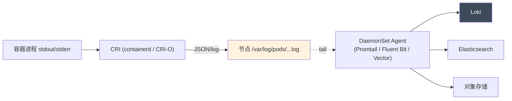

K8s 里**绝对不要**让应用写文件——所有 log 走 **stdout/stderr**。container runtime 接管后落到 `/var/log/pods/<ns>_<pod>_<uid>/<container>/0.log`，DaemonSet Agent 在每个节点 tail 这些文件。

### 3.2 Loki：日志的 Prometheus

**Loki**（Grafana 出品，2018 年）的核心理念：**只索引 label，不索引内容**。

- 像 Prometheus 一样按 label 切片（`namespace`、`pod`、`container`、`app`）
- 日志内容压缩后扔对象存储（S3/GCS/MinIO）
- 查询用 **LogQL**：`{namespace="payments"} |= "error" | json | duration > 5s`

成本对比：传统 ELK 索引全文本，1TB 日志 = 数 TB 索引；Loki 1TB 日志 = 10GB 索引。**省一个量级**。

LogQL 速查：

```logql
# 基础选择
{namespace="payments", app="tx-svc"}

# 关键字过滤
{namespace="payments"} |= "ERROR"

# JSON 解析后过滤
{namespace="payments"} | json | level="error" | duration_ms > 1000

# 正则提取
{app="nginx"} | regexp `status=(?P<status>\d+)` | status >= "500"

# 计数（变成 metric）
sum by (app) (rate({namespace="payments"}[5m]))

# 错误率
sum by (app) (rate({namespace="payments"} |= "ERROR" [5m]))
  / sum by (app) (rate({namespace="payments"}[5m]))
```

### 3.3 Promtail / Fluent Bit / Vector 三选一

| 工具 | 强项 | 弱点 | 建议 |
|---|---|---|---|
| **Promtail** | Loki 官方搭档，配置最简单 | 处理能力弱、几乎无扩展 | 入门 Loki / 简单需求 |
| **Fluent Bit** | C 语言写、超高吞吐、生态广 | 配置语法古怪 | 大集群 / 多目的地 |
| **Vector** | Rust 写、配置 TOML/YAML 简洁、性能极强 | 生态比 Fluent Bit 略小 | 2026 首选 |

**Vector** 在 2026 年快速占领高端市场。它的 DaemonSet 配置：

```yaml
sources:
  k8s_logs:
    type: kubernetes_logs
    extra_label_selector: "app!=noisy-job"

transforms:
  parse_json:
    type: remap
    inputs: ["k8s_logs"]
    source: |
      . = parse_json!(.message)
      .trace_id = .trace_id ?? ""
      .level = downcase(string!(.level))

  drop_debug:
    type: filter
    inputs: ["parse_json"]
    condition: .level != "debug"

sinks:
  loki:
    type: loki
    inputs: ["drop_debug"]
    endpoint: http://loki.monitoring.svc:3100
    labels:
      namespace: "{{ kubernetes.pod_namespace }}"
      app: "{{ kubernetes.pod_labels.app }}"
      level: "{{ level }}"           # 注意：低基数 label
    encoding:
      codec: json
```

**Fluent Bit** 的等效配置：

```yaml
[INPUT]
    Name              tail
    Path              /var/log/pods/*/*/*.log
    Parser            cri
    Tag               kube.*
    Refresh_Interval  5
    Mem_Buf_Limit     50MB

[FILTER]
    Name kubernetes
    Match kube.*
    Kube_URL https://kubernetes.default.svc:443
    Merge_Log On

[OUTPUT]
    Name loki
    Match kube.*
    Host loki.monitoring.svc
    Labels namespace=$kubernetes['namespace_name'], app=$kubernetes['labels']['app']
```

### 3.4 结构化日志最佳实践

**Go slog**（1.21+ 标准库）是 2026 主流选择：

```go
package main

import (
    "context"
    "log/slog"
    "os"

    "go.opentelemetry.io/otel/trace"
)

func main() {
    logger := slog.New(slog.NewJSONHandler(os.Stdout, &slog.HandlerOptions{
        Level:     slog.LevelInfo,
        AddSource: true,
    }))
    slog.SetDefault(logger)
}

func handleRequest(ctx context.Context, userID string) error {
    span := trace.SpanFromContext(ctx)
    log := slog.With(
        "trace_id", span.SpanContext().TraceID().String(),
        "span_id", span.SpanContext().SpanID().String(),
        "user_id", userID,
    )

    log.InfoContext(ctx, "processing payment", "amount", 99.9)
    if err := charge(ctx, userID); err != nil {
        log.ErrorContext(ctx, "charge failed", "err", err)
        return err
    }
    log.InfoContext(ctx, "payment ok")
    return nil
}
```

**必备字段**：

```json
{
  "time": "2026-05-14T10:30:00.123Z",
  "level": "ERROR",
  "msg": "db query failed",
  "service": "tx-svc",
  "version": "v3.2.1",
  "pod": "tx-svc-7c9d4-x2k8r",
  "namespace": "payments",
  "trace_id": "abc123def456",
  "span_id": "0123456789abcdef",
  "user_id": "u_42",
  "request_id": "r_xyz",
  "duration_ms": 5023,
  "error": "connection refused"
}
```

**铁律**：

1. **永远 JSON 输出**（DEBUG 阶段除外）
2. **trace_id 必须有**——log ↔ trace 双向跳转的桥
3. **不输出敏感**：密码、token、信用卡号、PII（按合规标准）
4. **超大 payload 限长**：单条 log > 1MB 必被 Loki 拒，应用应自截断
5. **采样**：INFO 日志可 10% 采样降本，**ERROR 永不采样**

### 3.5 日志关联到 trace 的实战

OTel Logs Bridge：让 slog 输出自带 trace context、并把日志也发到 OTel Collector：

```go
import (
    otelslog "go.opentelemetry.io/contrib/bridges/otelslog"
)

logger := otelslog.NewLogger("tx-svc",
    otelslog.WithSource(true),
    otelslog.WithLoggerProvider(otelLoggerProvider))
slog.SetDefault(logger)
```

OTel Collector 配置同时输出到 Loki 和 Tempo，且能保证 `trace_id` 一致：

```yaml
receivers:
  otlp:
    protocols:
      grpc:
exporters:
  loki:
    endpoint: http://loki.monitoring.svc:3100/loki/api/v1/push
  otlp/tempo:
    endpoint: tempo.monitoring.svc:4317
    tls:
      insecure: true
service:
  pipelines:
    logs:
      receivers: [otlp]
      exporters: [loki]
    traces:
      receivers: [otlp]
      exporters: [otlp/tempo]
```

在 Grafana 里点 log 行能直接跳 trace，反向亦然——这是观测三柱"贯通"的核心体验。

---

## 第四章：Traces——Tempo、Jaeger 与 OpenTelemetry auto-instrument

### 4.1 OpenTelemetry：CNCF Graduated

2024-09，**OpenTelemetry 项目正式从 CNCF Incubating 升级为 Graduated**——和 Kubernetes、Prometheus 同级。这是可观测领域的里程碑：**OTel 已是 vendor-neutral 的事实标准**，所有主流后端（Tempo / Jaeger / Datadog / NewRelic / Honeycomb / Splunk）都接 OTLP。

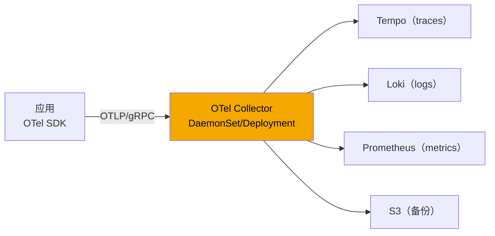

OTel 的三件套：

- **API**：应用代码调用的（`tracer.Start`、`logger.Info`、`meter.Counter`）
- **SDK**：把 API 调用编译/导出（采样、批处理、retry）
- **Collector**：聚合层，做转换/采样/路由/重试

### 4.2 Tempo vs Jaeger

| 维度 | Tempo 2.x | Jaeger 1.x |
|---|---|---|
| 厂家 | Grafana Labs | CNCF（最初 Uber） |
| 存储 | 对象存储（S3/GCS）+ Parquet | Cassandra / Elasticsearch / 对象存储 |
| 查询 | TraceQL（强大） | UI 查 + Jaeger API |
| 协议 | OTLP 优先 | OTLP / Jaeger native |
| Grafana 整合 | 原生顶级 | 良好 |
| 性价比 | **极高**（对象存储） | 高（依存储选） |

2026 主流选 **Tempo**——对象存储成本极低、TraceQL 表达力强、和 Loki/Prometheus 一套 Grafana 闭环。Jaeger 仍是合理选择，特别是已有 ES/Cassandra 基础设施。

Tempo 部署（kube-prometheus-stack 兄弟项目）：

```bash
helm repo add grafana https://grafana.github.io/helm-charts
helm upgrade --install tempo grafana/tempo-distributed \
  --namespace monitoring \
  --set storage.trace.backend=s3 \
  --set storage.trace.s3.bucket=tempo-traces \
  --set storage.trace.s3.endpoint=s3.us-east-1.amazonaws.com
```

### 4.3 TraceQL 速查

```traceql
# 所有 latency > 2s 的 trace
{ duration > 2s }

# 特定 service 的 5xx
{ resource.service.name = "tx-svc" && span.http.status_code >= 500 }

# 含 DB 慢查询的 trace（任意 span 满足）
{ span.db.statement =~ "SELECT.*" && span.duration > 1s }

# 跨服务关联：同时有 A 调 B
{ service.name = "api" } && { service.name = "db-proxy" }
```

### 4.4 OTel auto-instrumentation：零侵入埋点

K8s 上有两种自动埋点模式：

**方式 A：OTel Operator + 注解**

```yaml
apiVersion: opentelemetry.io/v1alpha1
kind: Instrumentation
metadata:
  name: my-instrumentation
spec:
  exporter:
    endpoint: http://otel-collector.monitoring.svc:4318
  propagators: ["tracecontext", "baggage"]
  sampler:
    type: parentbased_traceidratio
    argument: "0.1"
  go:
    image: ghcr.io/open-telemetry/opentelemetry-go-instrumentation:latest
  java:
    image: ghcr.io/open-telemetry/opentelemetry-operator/autoinstrumentation-java:latest
  python:
    image: ghcr.io/open-telemetry/opentelemetry-operator/autoinstrumentation-python:latest
```

应用 Pod 加注解即可注入：

```yaml
metadata:
  annotations:
    instrumentation.opentelemetry.io/inject-go: "true"
    instrumentation.opentelemetry.io/otel-go-auto-target-exe: /app/server
```

**方式 B：SDK 内显式 + 库 instrumentation**

Go 没法字节码注入，但可以用 eBPF 自动 instrument（OTel Go Auto Instrumentation 项目）。代码侧最小集：

```go
package main

import (
    "context"
    "go.opentelemetry.io/otel"
    "go.opentelemetry.io/otel/exporters/otlp/otlptrace/otlptracegrpc"
    "go.opentelemetry.io/otel/propagation"
    "go.opentelemetry.io/otel/sdk/resource"
    sdktrace "go.opentelemetry.io/otel/sdk/trace"
    semconv "go.opentelemetry.io/otel/semconv/v1.27.0"
)

func initTracer(ctx context.Context) (*sdktrace.TracerProvider, error) {
    exporter, err := otlptracegrpc.New(ctx,
        otlptracegrpc.WithEndpoint("otel-collector.monitoring.svc:4317"),
        otlptracegrpc.WithInsecure(),
    )
    if err != nil { return nil, err }

    res, _ := resource.New(ctx,
        resource.WithAttributes(
            semconv.ServiceName("tx-svc"),
            semconv.ServiceVersion("v3.2.1"),
            semconv.DeploymentEnvironment("prod"),
        ),
    )
    tp := sdktrace.NewTracerProvider(
        sdktrace.WithBatcher(exporter),
        sdktrace.WithResource(res),
        sdktrace.WithSampler(sdktrace.TraceIDRatioBased(0.1)),
    )
    otel.SetTracerProvider(tp)
    otel.SetTextMapPropagator(propagation.NewCompositeTextMapPropagator(
        propagation.TraceContext{}, propagation.Baggage{},
    ))
    return tp, nil
}
```

HTTP server / client 自动注入 trace context：

```go
import "go.opentelemetry.io/contrib/instrumentation/net/http/otelhttp"

handler := otelhttp.NewHandler(myHandler, "tx-svc")
http.ListenAndServe(":8080", handler)

client := http.Client{
    Transport: otelhttp.NewTransport(http.DefaultTransport),
}
```

### 4.5 OpenTelemetry GenAI Semantic Conventions

2025 起 OTel 引入 **GenAI Semantic Conventions** ——对 LLM 应用的统一埋点标准。Claude、OpenAI、Gemini 调用都按这套打：

```go
import semconv "go.opentelemetry.io/otel/semconv/v1.27.0"

span.SetAttributes(
    semconv.GenAISystemAnthropic,                    // gen_ai.system
    semconv.GenAIRequestModel("claude-opus-4-7"),    // gen_ai.request.model
    semconv.GenAIRequestMaxTokens(4096),
    semconv.GenAIRequestTemperature(0.7),
    semconv.GenAIUsageInputTokens(1234),             // gen_ai.usage.input_tokens
    semconv.GenAIUsageOutputTokens(567),
    semconv.GenAIResponseFinishReasons("stop"),
)
```

效果：在 Grafana / Tempo / Datadog 里能按 `gen_ai.system="anthropic"` 切，分析所有 LLM 调用的 token 用量、延迟、错误。这是 AI Native 时代可观测的"必须"。详见 A 系列课程。

### 4.6 采样策略

trace 数据量极大，**100% 采样**几乎只在 staging。生产常用：

- **Head-based**（入口决定）：`TraceIDRatioBased(0.1)` 抽 10%。简单，但漏掉很多错请求
- **Tail-based**（链路完成后决定）：把"所有错"、"所有慢"全部保留，"正常"采 1%

Tail-based 用 OTel Collector：

```yaml
processors:
  tail_sampling:
    decision_wait: 30s
    policies:
      - name: errors
        type: status_code
        status_code: {status_codes: [ERROR]}
      - name: slow
        type: latency
        latency: {threshold_ms: 500}
      - name: random_1pct
        type: probabilistic
        probabilistic: {sampling_percentage: 1}
```

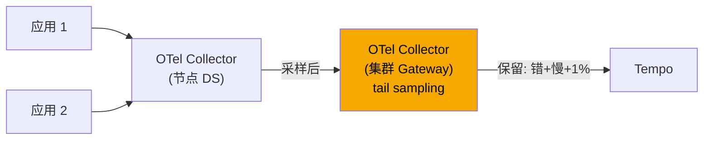

---

## 第五章：eBPF 可观测——Pixie、Hubble、Coroot、Inspektor Gadget

### 5.1 eBPF：内核级零侵入

**eBPF**（extended Berkeley Packet Filter）让用户态在内核中安全运行小程序。对可观测的意义：**不改一行应用代码、不重启 Pod，就能拿到内核能看到的一切信号**——syscall、socket、HTTP request、TLS handshake、DNS 查询、文件 I/O……

K8s 上 eBPF 可观测工具四件套：

| 工具 | 强项 | 部署 | 厂家 |
|---|---|---|---|
| **Hubble** | 网络 L3/L4/L7 流量地图 | 随 Cilium CNI | Isovalent / Cilium |
| **Pixie** | auto-trace HTTP/gRPC/DB；脚本化分析 | DaemonSet | New Relic / CNCF Sandbox |
| **Coroot** | 自动 RED / SLO / 根因分析 | Operator | Coroot |
| **Inspektor Gadget** | 内核诊断工具集合 | DaemonSet | Inspektor 项目 |

### 5.2 Hubble（Cilium）

**Cilium** 用 eBPF 替代 iptables 当 CNI；**Hubble** 是它的可观测组件，提供 L3/L4/L7 流量地图、流量过滤、流量审计。

```bash
# 实时看流
hubble observe -f --namespace payments

# 看 7 层 HTTP
hubble observe --type l7

# 看流量被 NetworkPolicy 拒
hubble observe --verdict DROPPED
```

Hubble UI 在 Grafana 里可嵌入服务依赖图：

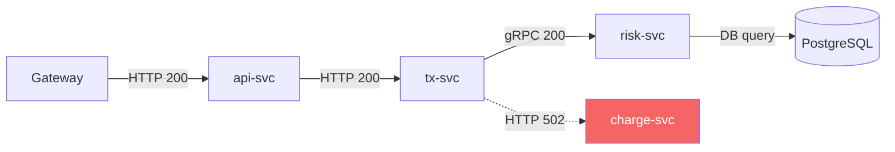

Hubble 指标也通过 Prometheus 暴露：

```promql
# 服务之间的 L7 流量
hubble_http_requests_total

# 被 NetworkPolicy 拒的流量（潜在合规问题或攻击）
hubble_drop_total
```

### 5.3 Pixie：脚本化 auto-trace

**Pixie** 2024 进 CNCF Sandbox。它最大特色：**用 PxL（Python 子集）脚本直接在 K8s 内查每个 Pod 的 HTTP/gRPC/MySQL/Redis 调用，无需 Sidecar、无需改代码**。

部署：

```bash
helm install pixie pixie-operator/pixie-operator-chart \
  --namespace pl --create-namespace
```

PxL 脚本示例：

```python
import px

# 所有 HTTP 请求
df = px.DataFrame(table='http_events', start_time='-5m')
df = df[df.namespace == 'payments']
df.latency_ms = df.latency / 1000000
df.req_path = px.uri_recompose_http(df.req_path)
px.display(df[['time_', 'service', 'req_method', 'req_path', 'resp_status', 'latency_ms']])
```

Pixie 数据**默认保存在节点本地**（短期），不出集群——契合数据驻留合规要求。

### 5.4 Coroot：自动根因

**Coroot** 2024 开源，重点是把 eBPF 数据**自动转成 SLO + 根因分析**：

- 自动发现服务依赖图
- 自动计算每个服务的 RED + SLO
- 出问题时自动定位"瓶颈在哪个服务的哪个调用、是 CPU 还是 GC 还是 DB"

适合从零搭可观测的小团队——不用写一行 PromQL。

### 5.5 eBPF 何时用、何时不用

**用**：

- 想看真实流量但应用没埋点
- 想拿 TLS 内部的明文 HTTP（kernel uprobe）
- 容器内子进程 / 短进程难追踪
- L4 层的连接级问题（重传、RST）

**不用**：

- 老内核（< 5.4，建议 5.10+；2026 主流已 6.x）
- 嵌入式 / 受限内核（GKE Autopilot 严格限制 eBPF 能力）
- 应用层语义比内核语义更准（如 user_id 这种业务字段，eBPF 拿不到）

---

## 第六章：持续 Profiling——Parca 与 Pyroscope

### 6.1 为什么持续 Profiling

传统 `go tool pprof` 在出问题时**临时**抓——但问题已发生，性能事件可能错过。**持续 Profiling**：每个 Pod 每 10-60 秒自动采样 CPU / heap，长期保存，**事后对比**就能定位"哪段时间、哪个版本、哪个 Pod 上、哪行代码"在烧 CPU 或泄漏内存。

### 6.2 Parca（CNCF Sandbox）

**Parca** 是 K8s 原生的持续 profiling：

```yaml
# Parca Server
apiVersion: apps/v1
kind: Deployment
metadata:
  name: parca
spec:
  template:
    spec:
      containers:
        - name: parca
          image: ghcr.io/parca-dev/parca:v0.22.0
          args:
            - --storage-active-memory=4294967296
            - --storage-path=/var/lib/parca
          ports:
            - containerPort: 7070
```

```yaml
# Parca Agent (DaemonSet, eBPF 抓 CPU profile)
apiVersion: apps/v1
kind: DaemonSet
metadata:
  name: parca-agent
spec:
  template:
    spec:
      hostPID: true
      containers:
        - name: parca-agent
          image: ghcr.io/parca-dev/parca-agent:v0.34.0
          securityContext:
            privileged: true              # 需要装 BPF
          args:
            - --node=$(NODE_NAME)
            - --remote-store-address=parca:7070
            - --remote-store-insecure
```

Parca Agent 用 eBPF 直接采每个 cgroup 的 stack trace——**无需在 Go 应用启用 pprof，也无需重启**。这是 2026 持续 profiling 的杀手锏。

### 6.3 Pyroscope（已合入 Grafana）

**Pyroscope** 2023 被 Grafana 收购，2024 合入 Grafana 生态。和 Loki/Tempo/Prometheus 同 UI 闭环：

```yaml
apiVersion: monitoring.grafana.com/v1
kind: GrafanaPyroscope
metadata:
  name: pyroscope
spec:
  storage:
    backend: s3
    s3:
      bucketName: pyroscope-profiles
```

Pyroscope 也用 eBPF（grafana-agent / alloy）抓所有 Pod 的 profile。Grafana 上能看到 **flamegraph 对比**——前 24 小时 vs 现在，CPU 烧多了的函数一眼就出来。

### 6.4 Go 应用配合

不依赖 eBPF 也能做：Go 应用开 pprof：

```go
import _ "net/http/pprof"

go func() {
    http.ListenAndServe("localhost:6060", nil)
}()
```

Parca / Pyroscope 也支持去 scrape `/debug/pprof`（pull 模式），适合不能用 eBPF 的环境（GKE Autopilot、Fargate）。

---

## 第七章：Service Mesh 自带的可观测

### 7.1 Istio / Linkerd 的"白送"

Service Mesh 让每个 Pod 旁边（sidecar）或节点上（Ambient）有一个 Envoy/proxy 看到所有进出流量——这意味着**应用什么都不埋点，也能拿到 RED 指标**。

Istio 默认暴露的 `istio_*` 指标：

```promql
# 服务请求 QPS
sum(rate(istio_requests_total[1m])) by (destination_service)

# 错误率（5xx）
sum(rate(istio_requests_total{response_code=~"5.."}[1m]))
  / sum(rate(istio_requests_total[1m]))

# p99 延迟
histogram_quantile(0.99,
  sum(rate(istio_request_duration_milliseconds_bucket[1m])) by (le, destination_service))

# TCP 连接（数据面、不只 HTTP）
istio_tcp_connections_opened_total
```

Linkerd 类似的 `linkerd_*`。Cilium Service Mesh（eBPF）走 Hubble 指标。

### 7.2 mTLS、流量切分指标

Service Mesh 还能告诉你**安全态势**：

```promql
# 多少流量是 mTLS 加密的
sum(rate(istio_requests_total{security_policy="mutual_tls"}[5m]))
  / sum(rate(istio_requests_total[5m]))

# 金丝雀切流比例（v1 vs v2）
sum by (destination_version) (rate(istio_requests_total{destination_service="tx-svc"}[5m]))
```

### 7.3 配合分布式 Trace

Istio 自动生成 trace（W3C tracecontext），但需要应用**透传 header**——这是 sidecar 时代的痛点。Ambient Mesh 时代 ztunnel/waypoint 在 L4 透传更容易；L7 trace 在 waypoint 自动注入。详见 C10。

---

## 第八章：Grafana 仪表板——USE / RED / SLO 与多源整合

### 8.1 Grafana：可观测的统一前端

**Grafana** 是 2026 事实标准的可观测前端，支持几十种数据源：

- Prometheus（metrics）
- Loki（logs）
- Tempo / Jaeger（traces）
- Pyroscope / Parca（profiles）
- 任意 SQL（PostgreSQL、ClickHouse）
- 云厂商（CloudWatch、Azure Monitor）
- ……

数据源添加：

```yaml
apiVersion: v1
kind: ConfigMap
metadata:
  name: grafana-datasources
data:
  datasources.yaml: |
    apiVersion: 1
    datasources:
      - name: Prometheus
        type: prometheus
        url: http://prometheus.monitoring.svc:9090
        isDefault: true
      - name: Loki
        type: loki
        url: http://loki.monitoring.svc:3100
        jsonData:
          derivedFields:
            - datasourceUid: tempo
              matcherRegex: "trace_id=(\\w+)"
              name: TraceID
              url: "$${__value.raw}"
      - name: Tempo
        type: tempo
        uid: tempo
        url: http://tempo.monitoring.svc:3200
        jsonData:
          tracesToLogs:
            datasourceUid: loki
            tags: ["pod", "namespace"]
```

**derivedFields** 让 Loki 行内容里的 `trace_id=xxx` 自动变成可点的链接 → 跳 Tempo。`tracesToLogs` 反向：从 Tempo 的 span 跳回 Loki 找日志。

### 8.2 USE / RED 仪表板模板

每个团队应有一套**标准 dashboard**——按团队/服务复制。最小模板：

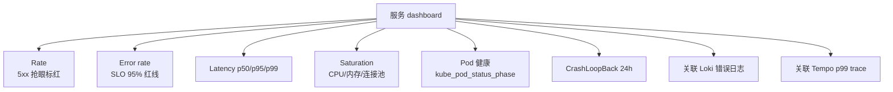

Grafana 13+ 的 **Scenes / dashboards-as-code** 用 Go 编排：

```go
// 用 grafana-foundation-sdk 写 dashboard
import (
    dashboards "github.com/grafana/grafana-foundation-sdk/go/dashboard"
    "github.com/grafana/grafana-foundation-sdk/go/prometheus"
)

builder := dashboards.NewDashboardBuilder("tx-svc RED").
    Tags([]string{"red", "service"}).
    Refresh("30s").
    Time("now-6h", "now").
    WithRow(dashboards.NewRowBuilder("Rate / Error / Duration"))
```

### 8.3 SLO 仪表板

SLO（Service Level Objective）—— "p99 延迟 < 500ms 的请求占比 99.9%"。错误预算（error budget）= 1 - SLO。

Prometheus Operator 配套的 **Sloth** 一键生成 SLO 规则：

```yaml
apiVersion: sloth.slok.dev/v1
kind: PrometheusServiceLevel
metadata:
  name: tx-svc
spec:
  service: "tx-svc"
  labels:
    team: payments
  slos:
    - name: "availability"
      objective: 99.9
      sli:
        events:
          error_query: sum(rate(http_requests_total{service="tx-svc",status=~"5.."}[{{.window}}]))
          total_query: sum(rate(http_requests_total{service="tx-svc"}[{{.window}}]))
      alerting:
        name: TxSvcAvailability
        page_alert: {labels: {severity: page}}
        ticket_alert: {labels: {severity: ticket}}
```

生成的告警遵循 Google 的 **multi-burn-rate** 算法：1 小时 14.4 倍速消耗预算 → page；6 小时 6 倍速 → ticket；24 小时 3 倍速 → ticket。

---

## 第九章：告警——Alertmanager 与告警工程

### 9.1 Alertmanager 架构

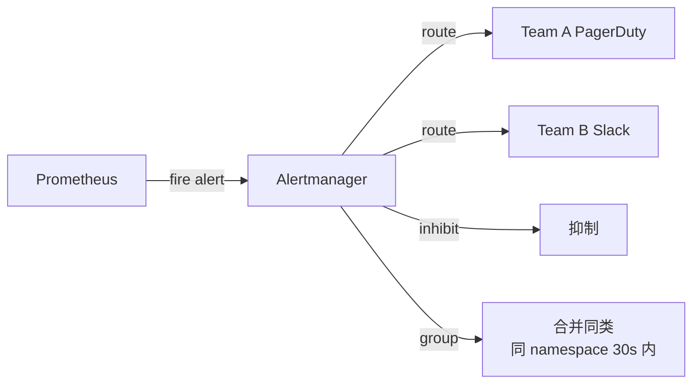

Alertmanager 做三件事：

1. **去重**：多个 Prometheus 副本都发了同一条 → 合一条
2. **分组**：同 `alertname + namespace` 30 秒内合一条
3. **抑制**：高优告警发了，低优同源被抑制；维护窗口手动 silence

配置示例：

```yaml
route:
  receiver: default
  group_by: ["alertname", "namespace"]
  group_wait: 30s
  group_interval: 5m
  repeat_interval: 4h
  routes:
    - matchers: ["severity=page"]
      receiver: pagerduty
      group_wait: 0s
    - matchers: ["team=payments"]
      receiver: payments-slack

receivers:
  - name: default
    slack_configs:
      - api_url: $SLACK_WEBHOOK
        channel: "#ops"
  - name: pagerduty
    pagerduty_configs:
      - service_key: $PAGER_KEY
  - name: payments-slack
    slack_configs:
      - api_url: $SLACK_WEBHOOK
        channel: "#payments-oncall"

inhibit_rules:
  - source_matchers: ["alertname=NodeDown"]
    target_matchers: ["alertname=PodDown"]
    equal: ["node"]
```

### 9.2 告警工程的铁律

1. **每条告警必须 actionable**——半夜叫醒人后他知道该干啥；不能 action 的不该告警
2. **症状告警 > 原因告警**——告"用户感知到错"，不告"CPU 80%"
3. **基于 SLO 而非阈值**——固定阈值（"延迟 > 100ms"）几乎必错；SLO 容错预算告警更聪明
4. **多老化窗口**——1h + 6h + 24h 三个燃烧速率组合，避开抖动 + 早期发现
5. **runbook 内嵌**：每条告警的 annotation 带 runbook URL

PrometheusRule 例子：

```yaml
apiVersion: monitoring.coreos.com/v1
kind: PrometheusRule
metadata:
  name: payments-slo
spec:
  groups:
    - name: payments.slo
      interval: 30s
      rules:
        # Pod CrashLoopBackOff 超过 5 分钟
        - alert: PodCrashLooping
          expr: |
            kube_pod_container_status_waiting_reason{reason="CrashLoopBackOff",namespace="payments"} == 1
          for: 5m
          labels:
            severity: page
            team: payments
          annotations:
            summary: "{{ $labels.pod }} CrashLoopBackOff"
            runbook: "https://wiki.example.com/runbooks/crashloop"

        # 容器 OOM
        - alert: ContainerOOMKilled
          expr: increase(container_oom_events_total{namespace="payments"}[10m]) > 0
          labels:
            severity: page
          annotations:
            summary: "Container OOM killed: {{ $labels.pod }}"

        # API server 慢
        - alert: APIServerSlow
          expr: |
            histogram_quantile(0.99,
              sum(rate(apiserver_request_duration_seconds_bucket[5m])) by (le, verb)
            ) > 1
          for: 10m
          labels:
            severity: page
```

---

## 第十章：多集群可观测——Thanos 与 Mimir

### 10.1 为什么单 Prometheus 不够

单 Prometheus 单机存储——通常 15-30 天就满；要长期存储 + 跨集群聚合查询，必须用上**水平扩展 + 对象存储**方案。

两条主流路线：

| 方案 | 厂家 | 架构 |
|---|---|---|
| **Thanos** | 开源 / Bitnami | sidecar/receiver + store + compactor + query |
| **Mimir** | Grafana | 微服务架构（distributor/ingester/store-gateway/querier/compactor） |
| VictoriaMetrics | VictoriaMetrics | 单 binary 或集群版 |
| Cortex | 已合并入 Mimir | - |

### 10.2 Thanos 架构

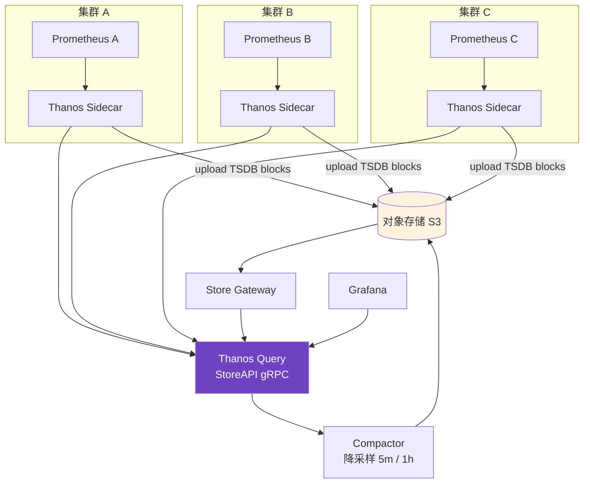

Thanos Sidecar 部署：

```yaml
spec:
  containers:
    - name: thanos-sidecar
      image: thanosio/thanos:v0.36.0
      args:
        - sidecar
        - --tsdb.path=/prometheus
        - --prometheus.url=http://localhost:9090
        - --objstore.config-file=/etc/thanos/objstore.yaml
      volumeMounts:
        - mountPath: /prometheus
          name: prometheus-data
```

### 10.3 Mimir：横向扩展更彻底

**Grafana Mimir**（Cortex 的继承者）是微服务架构——distributor / ingester / store-gateway / querier / compactor，每个组件独立扩展，单集群可处理**十亿级时序**。

```yaml
# 应用侧把 metrics push 到 Mimir
prometheus:
  prometheusSpec:
    remoteWrite:
      - url: http://mimir-distributor.monitoring.svc:8080/api/v1/push
        headers:
          X-Scope-OrgID: tenant-payments      # 多租户切分
```

Mimir 自带原生多租户，每个 OrgID 数据隔离——单集群多团队场景最大杀器。

### 10.4 选型决策

- **3 个以下集群、< 1 亿时序**：单 Prometheus 或 Prometheus + Thanos sidecar 即可
- **多团队、单集群 K8s**：Mimir + 多 OrgID
- **跨地域多集群、PB 级数据**：Mimir 微服务 + 对象存储
- **极致简单 / 单租户**：VictoriaMetrics 单 binary

---

## 第十一章：生产实践——采样、保留期、cardinality 与成本

### 11.1 Cardinality 爆炸

**最经典的灾难**：上线后 Prometheus OOM。原因 99% 是某个 label cardinality 失控：

```promql
# 看哪些指标 cardinality 高
topk(10, count by (__name__)({__name__=~".+"}))

# 看某个指标的 label 组合数
count(count by (user_id) (http_requests_total))
```

**红线**：

| 数量级 | 状态 |
|---|---|
| < 10 万 | 健康 |
| 10-100 万 | 偏高，关注 |
| > 100 万 | 警戒 |
| > 1000 万 | 必爆 |

**易爆点**：

- 把 `user_id`、`request_id`、`trace_id` 当 label → **永远禁止**
- URL 里带参数（`/users/12345`）→ 应该是路由模板（`/users/:id`）
- IP 地址当 label → 改 hash 或不放
- 异常状态码（`status=200/201/202/204/...`）每个都建时序 → 桶化（`2xx/3xx/4xx/5xx`）
- Sidecar 自动注入 `pod_template_hash` 这种随版本变的 label

`metric_relabel_configs` 救场：

```yaml
metric_relabel_configs:
  - source_labels: [pod_template_hash]
    action: labeldrop
  - source_labels: [user_id]
    action: labeldrop
  - source_labels: [__name__, status]
    regex: 'http_requests_total;(\d)\d\d'
    target_label: status_class
    replacement: '${1}xx'
```

### 11.2 保留期与成本

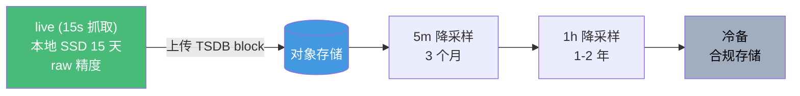

| 数据 | 保留期 | 介质 | 用途 |
|---|---|---|---|
| Prometheus raw | 15 天 | 本地 SSD | dashboard + 告警 |
| Thanos/Mimir block | 90 天 | S3 标准 | 历史分析 |
| 5min 降采样 | 1 年 | S3 IA | 容量规划 |
| 1h 降采样 | 5 年 | S3 Glacier | 合规 |
| Loki logs | 7-30 天 | S3 标准 | debug |
| Loki logs | 1 年 | S3 IA | 合规审计 |
| Tempo traces | 7-30 天 | S3 标准 | 排障 |
| Profile | 30 天 | S3 标准 | 性能回溯 |

### 11.3 成本三板斧

1. **降基数**：见 11.1
2. **降采样 + 分层存储**：上面表的 raw → 5m → 1h
3. **trace 采样**：head 10% + tail 拿错和慢；正常采 1%
4. **log 采样**：INFO 采 10%，ERROR 100%；DEBUG 关
5. **Loki Volume Limit**：每个租户设 `max_streams_per_user` + `ingestion_rate_mb`，防一个团队爆 chunk

### 11.4 容量规划

经验数据（2026 实际生产）：

- 每 1000 个抓取目标 + 1000 series/target + 15s 间隔 ≈ 80GB / 月 raw（压缩前 ~500GB）
- 每 1 亿 active series：raw 200-300GB / 月；Thanos 后 S3 大概 50-80GB / 月
- 每 100 万 traces / day（带采样后存的）≈ 50GB / 月 Tempo block
- Loki：1TB 日志压缩后 ~150GB；索引 ~10GB
- Profile：1000 个 Pod，每 30s 采样，每天 ~50GB

### 11.5 高可用拓扑

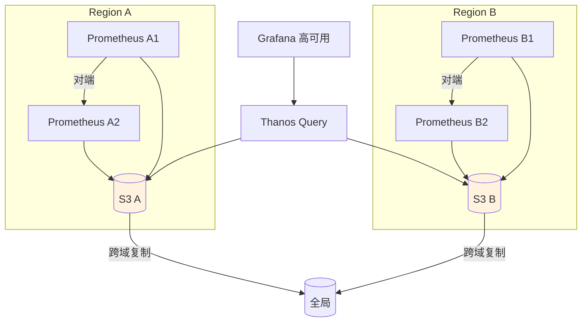

两份 Prometheus 副本抓相同目标，Alertmanager 去重——单点宕机不丢告警。Alertmanager 自身做 cluster mode（gossip）。

---

## 第十二章：陷阱清单（生产踩过的坑）

1. **`/metrics` 暴露在公网**——非授权暴露内部细节，攻击面巨大。务必走 Service mTLS / 网络策略
2. **kube-state-metrics 单实例 OOM**——大集群（> 1000 节点 / > 5 万 Pod）KSM 单实例可能要 4-8GB 内存。开 `--metric-allowlist` 或上 sharding
3. **scrape_interval 太短**——5s 抓取在 1000 个目标 × 1000 series 时把 Prometheus 卡死。15-30s 是甜点
4. **Histogram bucket 边界乱定**——经典 histogram 用了 `[0.1, 0.5, 1, 5, 10]` 但实际 p99 在 0.3s—— bucket 太粗根本算不出准 p99。要么用 native histogram，要么按业务实际分布精细化
5. **logfmt 假装结构化**——`level=info msg="error happened" k=v` 不是真 JSON，下游 parser 一旦碰到 message 含空格立即崩溃。统一 JSON
6. **OTel SDK 默认 retry 死循环**——Collector 挂了应用 OOM。务必设 `max_queue_size` 和 `BatchTimeout`
7. **trace 100% 采样**——本地 staging 可以，生产必崩。head 10% + tail 错/慢全留
8. **Alertmanager 没有 inhibit**——节点挂了所有 Pod 都告警，淹没寻呼。配 `NodeDown → PodDown` 抑制
9. **告警阈值固定**——业务流量随昼夜波动，固定阈值半夜全是误报。改 SLO 燃烧率
10. **Loki 单 stream 过载**——`{app="nginx"}` 单 stream 每秒 100MB → ingester 崩。要细分 label（按 pod/instance）
11. **Tempo 没配 retention**——traces 永久存 S3，账单一年后翻 100 倍。设 30 天 lifecycle
12. **CrashLoopBackOff 时 log 没采到**——容器死太快 Promtail/Fluent Bit 还没来得及 tail。务必配 `tail_from_beginning: true` + 应用启动初期不要直接 panic（先 log）
13. **Service Mesh 重复埋点**：应用自己埋了一份 + Istio 也埋了一份 = 双倍 cardinality。统一一个口子
14. **Grafana dashboard 没版本控制**——上百块 dashboard 改坏没人记得。dashboard as code（Grafonnet / Foundation SDK）+ Git
15. **没准备 Prometheus 重启**——重启时本地 WAL replay 30 分钟，期间告警全瞎。两副本对端 + remote write 兜底
16. **eBPF 在 GKE Autopilot 受限**——某些 eBPF 工具直接装不上。选集群形态时确认
17. **DaemonSet Agent 抢资源**：Fluent Bit / Promtail / Vector 默认无 limit，节点 CPU 高峰被 log agent 抢，业务受影响。务必设 limit + LowPriorityClass
18. **`for: 0s` 告警风暴**：抖动直接 fire。最少 `for: 1m`
19. **多版本指标冲突**：同名指标新旧版本 label 不同（如加了 `cluster`），导致旧 dashboard 全 break。改 metric 名当作 breaking change 走灰度
20. **Prometheus 抓 HTTP/2**——某些 client 不支持，建议关 `enable_http2: false`

---

## 第十三章：2026 现状速览

### 13.1 编排与监控基线

- **Kubernetes 1.33** 主流；1.32 LTS 仍大量使用
- **kube-prometheus-stack 65.x** 是事实标准 helm chart
- **Prometheus 3.0** 主流；Prometheus 2.x 在 EOL 倒计时
- **OpenTelemetry CNCF Graduated**（2024-09 升级），已是 vendor-neutral 标准
- **eBPF 工具**（Hubble / Pixie / Parca / Coroot）从"实验"变"主流"

### 13.2 技术演进

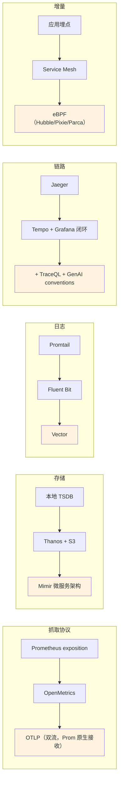

### 13.3 趋势

1. **OTLP 一统天下**：metrics/logs/traces 都用同一协议；Prometheus 3.0 / Tempo / Loki / 各家 SaaS 都收 OTLP
2. **eBPF 标配**：新建集群默认 Cilium CNI + Hubble；Pixie/Parca 不再是"高端玩具"
3. **持续 Profiling 主流化**：Parca/Pyroscope 像 Prometheus 一样默认装
4. **Native Histogram 普及**：经典 histogram 在新项目几乎不再用
5. **AI 辅助分析**：Grafana 13+ 加 AI panel，根因初判从 5 分钟降到 5 秒；Coroot/Robusta 自动根因
6. **GenAI Semantic Conventions**：LLM 应用按 OTel 标准埋 `gen_ai.*` —— 2026 已是 AI 工程默认
7. **可观测成本治理**：Mimir / Thanos / Loki 都内置成本仪表板，按 team 计费成事实标准
8. **GitOps 可观测**：dashboard / alert / SLO 全部走 GitOps（ArgoCD/Flux），跟代码一起 review

### 13.4 SaaS vs 自建

2026 选型矩阵：

| 团队规模 | 推荐 |
|---|---|
| < 10 人，重业务轻基建 | Datadog / NewRelic / Grafana Cloud |
| 10-50 人，预算紧 | 自建 kube-prometheus-stack + Loki + Tempo + Grafana |
| 50-200 人，多集群 | 自建 Mimir + Loki + Tempo + Grafana + ArgoCD |
| 200+ 人，自有 IDC | 全自建 + 多租户切分 + 内部计费 |

---

## 第十四章：练习题

> 把这 10 道题做完，K8s 可观测能从"会装"到"会运营"。

### 基础（30 分钟）

1. **指标识别**：给定下列 PromQL，分别属于 USE / RED / Golden Signals 的哪一类？为什么？
   - `histogram_quantile(0.99, rate(http_request_duration_seconds_bucket[5m]))`
   - `1 - avg(rate(node_cpu_seconds_total{mode="idle"}[5m]))`
   - `rate(container_cpu_cfs_throttled_seconds_total[5m])`
   - `sum(rate(http_requests_total{status=~"5.."}[5m])) / sum(rate(http_requests_total[5m]))`

2. **ServiceMonitor 写作**：写一个 ServiceMonitor，抓 `payments` 命名空间下所有带 `app=tx-svc` 标签的 Service 的 `http-metrics` 端口，每 30s 抓一次，去掉 `request_id` 这个 label。

3. **kubectl 检查**：用 `kubectl` 命令检查：
   - 某 Pod 最近 1 小时是否 OOM 过？
   - 某节点上有几个 Pod 处于 Pending？
   - kube-prometheus-stack 的 Prometheus 实例当前抓取了多少个 target？

### 进阶（60 分钟）

4. **Cardinality 排查**：Prometheus 内存暴涨 10x，怎么定位是哪个 metric / 哪个 label 的责任？写出至少 3 条 PromQL + 1 个 Prometheus API 调用。

5. **trace + log + metric 串起来**：实现一个 Go HTTP 服务，要求：
   - 用 `slog` 输出 JSON 日志，自带 `trace_id`
   - 用 OTel SDK 发 trace 到 Tempo
   - 用 prometheus client 暴露 native histogram 形式的 RED 指标
   - 给出对应的 ServiceMonitor + Loki 解析 + Tempo↔Loki 关联 Grafana 数据源配置

6. **告警工程**：为 `tx-svc` 写一组 PrometheusRule，包含：
   - 5 分钟 burn rate 14.4 倍 + 1 小时 6 倍的 multi-burn-rate SLO 告警（SLO=99.9%）
   - 容器 OOM 告警
   - Pod CrashLoopBackOff > 5 分钟告警
   - 节点上 disk 使用率 > 85% 告警
   要求每条告警有 runbook URL annotation。

### 实战（90 分钟）

7. **eBPF 引入**：在已有 kube-prometheus-stack 的集群部署 Hubble + Pixie + Parca。给出：
   - 哪一项需要替换 CNI？前置条件是什么？
   - 三者怎么在 Grafana 里整合（导入 dashboard / 数据源）？
   - 一个具体场景的诊断流程：HTTP 请求 5xx 突增，先看 Hubble 还是 Pixie 还是 Parca？

8. **多集群方案**：3 个 K8s 集群（dev/staging/prod）+ 50 个团队 + 全局合规存档要求 1 年。给出：
   - Thanos 还是 Mimir？为什么？
   - 多租户怎么切？metrics / logs / traces 三方面
   - 成本估算：节点 200 / Pod 5000 / req 1000 QPS

9. **故障演练**：一个真实场景——半夜告警"tx-svc 错误率 5%"。给出你的诊断步骤（从哪个 dashboard / 用哪个查询 / 怎么下钻到具体 trace / 怎么对比变更）。要求 15 分钟内定位到具体的 commit。

### 思考（开放题）

10. **设计题**：从零搭建一个 SaaS 公司的可观测平台，要求支持 100 个客户租户、每个租户最多 100 个微服务、合规要求数据隔离。给出：
    - 架构图（含组件、数据流、租户切分）
    - 容量与成本估算（年）
    - 与开发 / SRE 团队的工作流（dashboard / alert / SLO 的 onboarding）
    - 三个最大的技术风险与缓解方案

<details>
<summary>📝 参考答案</summary>

1. **指标识别**：
   - histogram_quantile P99 延迟 → **RED 的 Duration / Golden 的 Latency**
   - 1 - CPU idle = CPU 使用率 → **USE 的 Utilization**
   - cpu_cfs_throttled → **USE 的 Saturation**（饱和度，资源不够用的信号）
   - 5xx / total → **RED 的 Errors / Golden 的 Errors**
2. **ServiceMonitor**：
   ```yaml
   apiVersion: monitoring.coreos.com/v1
   kind: ServiceMonitor
   metadata: {name: tx-svc, namespace: payments}
   spec:
     namespaceSelector: {matchNames: [payments]}
     selector: {matchLabels: {app: tx-svc}}
     endpoints:
     - port: http-metrics
       interval: 30s
       metricRelabelings:
       - action: labeldrop
         regex: request_id
   ```
3. **kubectl 检查**：
   - OOM: `kubectl get events -n <ns> --field-selector reason=OOMKilling` 或 `kubectl describe pod | grep -i oom`；更严：查 `kubectl logs -p`（previous container）日志中的 OOMKilled 退出。
   - Pending: `kubectl get pods --all-namespaces --field-selector spec.nodeName=<node>,status.phase=Pending`
   - Prom targets: `kubectl exec -n monitoring prometheus-0 -- wget -qO- localhost:9090/api/v1/targets | jq '.data.activeTargets | length'`
4. **Cardinality 排查**：
   ```
   topk(10, count by(__name__)({__name__=~".+"}))                # 哪个 metric series 多
   topk(10, count by(__name__, namespace)({...}))               # 拆 ns
   curl localhost:9090/api/v1/status/tsdb | jq .data.seriesCountByLabelValuePair  # 哪个 label 值多
   ```
   常见元凶：`user_id` `trace_id` `request_id` 等高基 label 被误塞进 metric。
5. **三柱串起**：
   ```go
   // logger
   slog.New(slog.NewJSONHandler(os.Stdout, nil)).With("trace_id", traceID)
   // tracer
   otel.Tracer("app").Start(ctx, "handler")
   // metric
   prometheus.NewHistogramVec(prometheus.HistogramOpts{
     Name: "http_request_duration_seconds",
     NativeHistogramBucketFactor: 1.1,
   }, []string{"method","status"})
   ```
   Grafana datasource：Tempo 的 `tracesToLogsV2` 字段配置匹配 `trace_id`；Loki 的 `derivedFields` 提取 trace_id 跳转 Tempo；SLO 看板用 native histogram 的 `histogram_quantile`。
6. **告警**（关键片段）：
   ```yaml
   groups:
   - name: tx-svc.slo
     rules:
     - alert: TxSvcErrorBudgetBurnFast
       expr: |
         (sum(rate(http_requests_total{job="tx-svc",status=~"5.."}[5m]))
          / sum(rate(http_requests_total{job="tx-svc"}[5m]))) > (1 - 0.999) * 14.4
         and
         (sum(rate(http_requests_total{job="tx-svc",status=~"5.."}[1h]))
          / sum(rate(http_requests_total{job="tx-svc"}[1h]))) > (1 - 0.999) * 6
       for: 2m
       annotations: {runbook_url: "https://wiki/runbooks/tx-svc-burn"}
   - alert: ContainerOOMKilled
     expr: increase(kube_pod_container_status_last_terminated_reason{reason="OOMKilled"}[5m]) > 0
   - alert: PodCrashLoopBackOff
     expr: increase(kube_pod_container_status_restarts_total[15m]) > 5
   - alert: NodeDiskAlmostFull
     expr: 1 - node_filesystem_avail_bytes / node_filesystem_size_bytes > 0.85
   ```
7. **eBPF 引入**：① Hubble 必须用 Cilium 作 CNI（替换 Calico/flannel）；Pixie / Parca 不替换 CNI，作为 DaemonSet 部署。② Hubble → Grafana 用 Hubble UI + Prometheus exporter；Pixie 自带 UI 与 Grafana plugin；Parca 提供 Grafana datasource。③ 5xx 突增诊断序：先 Hubble（看 L4/L7 flow 是否有 reset / 服务间错误）→ Pixie（看具体 HTTP request / SQL query）→ Parca（看 CPU profile 排除性能瓶颈）。
8. **多集群方案**：选 **Thanos**——3 集群规模没必要 Mimir 的高基数能力，Thanos sidecar + S3 + Querier 简洁；50 个团队多租户用 namespace label `tenant=` + Grafana orgs / RBAC；logs 用 Loki 多租户 X-Scope-OrgID；traces 用 Tempo orgs。成本估算（年）：节点 200 × Prom scrape ~50K series/节点 = 10M series；Thanos 压缩比 ~10× → S3 ~5TB/年 ~$1500；Loki ~30TB/年 ~$8000；Tempo 采样 1% ~5TB ~$1500；总存储 ~$11K + 计算节点（Querier/Compactor）~$10K，合计 **~$20-25K/year**。
9. **故障诊断 15 分钟流程**：① RED 看板看 tx-svc 错误率开始时间 → 锁定时间点；② Grafana annotations 显示该时间点附近有无 deploy / config change；③ 错误率分维度下钻（endpoint / version / region）；④ Tempo "show errored traces" → 看具体 trace 拓扑；⑤ trace 中失败 span → 跳到对应 Loki 日志；⑥ 比对当前 vs 上版本的代码差异（GitHub release link 在 Grafana annotation）→ 定位 commit。
10. **SaaS 平台设计**：架构——每集群 Prom + Loki + Tempo agent → 中心 Mimir/Thanos+Loki+Tempo 多租户模式（X-Scope-OrgID）→ Grafana 多 org；租户切分：metric label `tenant_id` + Mimir tenant header + Grafana orgs；合规：高敏感租户独立存储后端（cluster-per-tenant 5 个白金 + 共享 95 个）。容量：100 租户 × 100 svc × 平均 10K series ≈ 100M series → Mimir 大约需 30-50 节点；50TB/年 metric + 200TB/年 logs。Onboarding 流程：terraform module 自动建 tenant org / API key / 默认 dashboard / SLO 模板 → 团队 self-service。三大风险：① 多租户性能隔离（一个租户爆查询拖垮全员，缓解：Mimir per-tenant rate limit + Loki query frontend split）；② 成本失控（缓解：cardinality 告警 + 自动 reject high-cardinality push）；③ 合规审计跨租户泄漏（缓解：写入路径 enforce tenant_id + 网络层 NetworkPolicy + 定期渗透测试）。

</details>

---

## 总结

K8s 可观测的核心不是"装一堆工具"，而是**让短生命周期、多容器、多租户的环境也能可解释**。

记住三句话：

1. **没有 trace_id，三柱不通**——任何一条 log、任何一个 metric label、任何一个 span 都该绑得到 trace_id
2. **没有 SLO，告警都是噪音**——基于 SLO 燃烧率才能让寻呼不疯
3. **没有成本治理，可观测会反噬业务**——cardinality / 采样 / 保留期 / 分层存储，每一条都要在 day 1 设计

2026 的 K8s 可观测已经不是 "Prometheus + Grafana" 的双件套时代——eBPF、持续 Profiling、OTel 标准、Service Mesh 自带、多集群 Mimir/Thanos、AI 根因分析……能用的工具远比能掌握的多。**先把骨架搭好（kube-prometheus-stack + Loki + Tempo），再按业务规模/形态逐步加 eBPF / Profile / Mesh**。

最后一句送给所有 SRE：**可观测不是奢侈品，而是生产线的安全带——出事时它救你，没事时它让你看路**。
