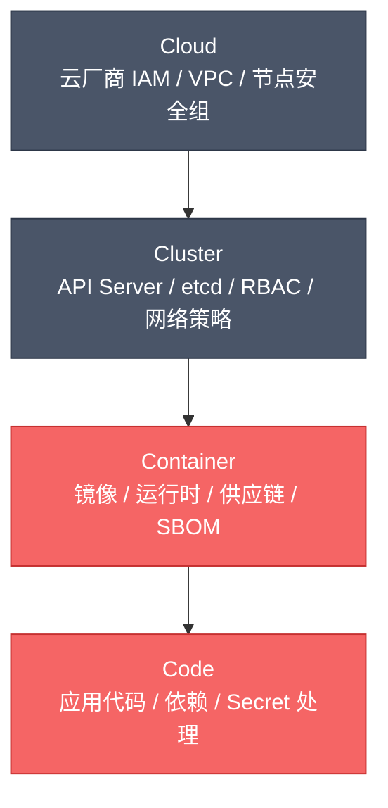
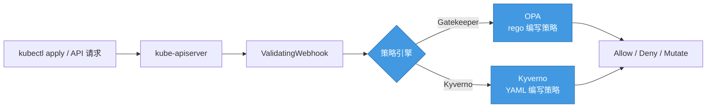
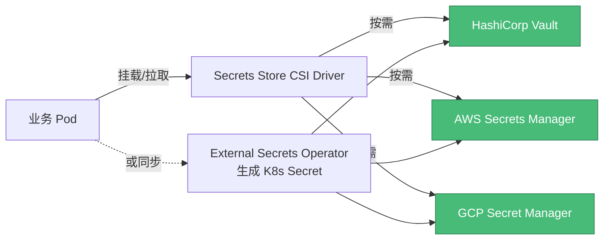
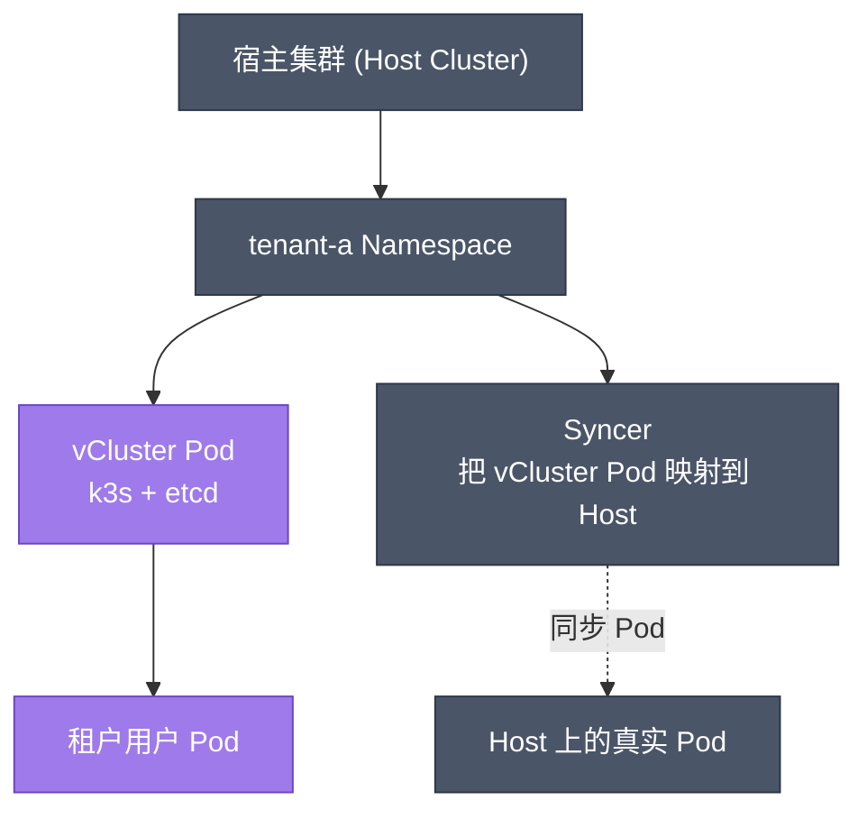
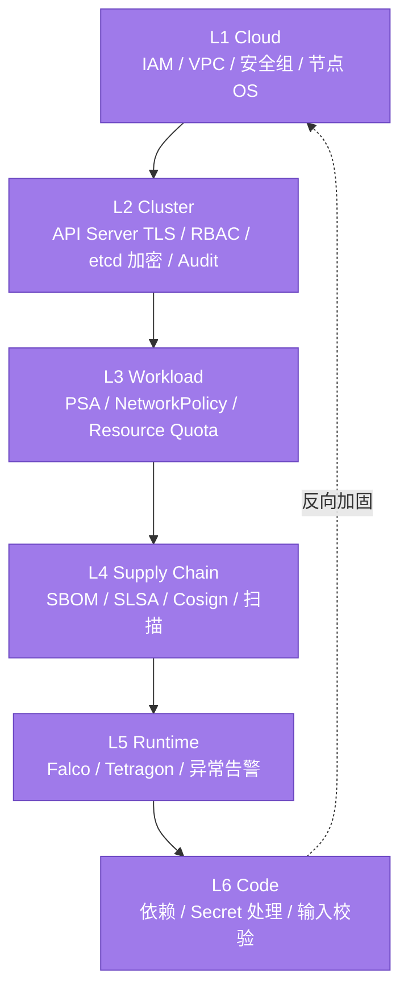
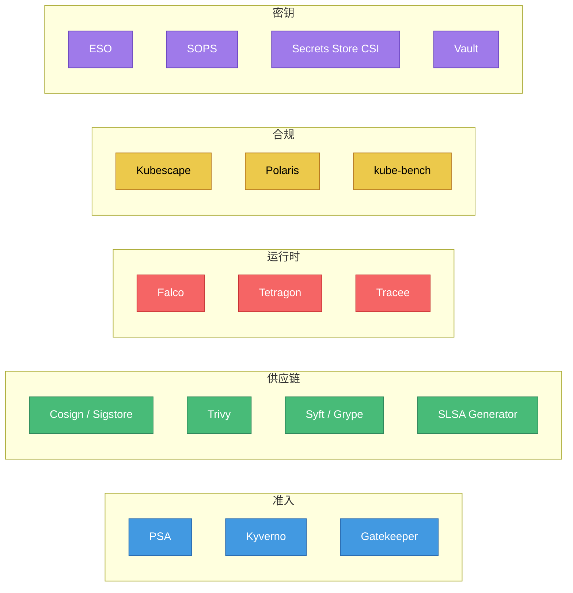

# 精通 Kubernetes 安全：RBAC、PSA、NetworkPolicy、供应链与运行时

> 课程编号：C12
> 路线图来源：云原生工程师 · 模块五 网格 / 可观测 / 安全
> 难度：⭐⭐⭐⭐⭐
> 预计阅读时间：80 分钟
> 内容基准：2026 年 5 月（Kubernetes 1.32/1.33、PSA GA、Kyverno 1.13+、OPA Gatekeeper 3.18、Cosign 2.x、Falco 0.39+、Tetragon 1.x、SLSA v1.1）

---

## 引言：四 C 模型与"默认不安全"

```
"内网集群没人攻击"           ← 横向移动一跳就到生产
"镜像是我们自己 build 的"     ← 基础镜像里塞了挖矿
"K8s 默认就够安全"           ← 默认每个 Pod 都能 list 全集群
```

K8s 是一个**默认权限很大、默认网络全通、默认信任所有镜像、默认不审计**的系统。安全不是"装个 Falco 就完事"，而是**从 Cloud 到 Code 四层防御**的系统工程。

CNCF 推广的 **4C 安全模型**（Cloud / Cluster / Container / Code）把 K8s 安全分四圈：



外圈控制不了里面，但里面被打穿外圈也跟着崩——**每一层都要独立可防**。

2026 年的关键变化：

- **PSP 彻底死亡**：Kubernetes 1.25 移除 PodSecurityPolicy，**Pod Security Admission（PSA）** 是官方继任者，2026 年所有云厂商默认开启
- **供应链法规收紧**：美国 NIST SSDF、欧盟 CRA（Cyber Resilience Act）已落地，**SBOM 是合规必交项**
- **eBPF 运行时安全成主流**：Tetragon / Tracee 渗透率快速上升，Falco 仍是事实标准
- **签名验证准入**：Cosign + Kyverno / Gatekeeper 在生产集群普及，镜像不签名不让跑
- **TokenRequest 短期 token GA**：长效 ServiceAccount Token 被视为反模式

本章按 4C 模型由内向外讲：从 RBAC、ServiceAccount，到 PSA / NetworkPolicy / 策略引擎，再到镜像供应链、运行时安全、多租户与审计。

---

## 第一章：RBAC——一切访问控制的起点

### 1.1 RBAC 四元素

```
Subject (谁)  →  Role/ClusterRole (有什么权限)  →  via Binding  →  Resource (操作什么)
```

四种核心对象：

| 对象 | 作用域 | 用途 |
|---|---|---|
| `Role` | Namespace | 在某 ns 内授权 |
| `ClusterRole` | Cluster | 集群范围授权（或被 RoleBinding 用于某 ns） |
| `RoleBinding` | Namespace | 把 (Cluster)Role 绑给某个 subject |
| `ClusterRoleBinding` | Cluster | 把 ClusterRole 绑给某 subject（集群范围生效） |

**Subject** 三类：`User`（外部）、`Group`（外部）、`ServiceAccount`（K8s 内部，绑 ns）。

### 1.2 一个最小权限示例

某个微服务只需要在自己的 ns 读 ConfigMap：

```yaml
---
apiVersion: v1
kind: ServiceAccount
metadata:
  name: payment-svc
  namespace: payment
---
apiVersion: rbac.authorization.k8s.io/v1
kind: Role
metadata:
  name: payment-config-reader
  namespace: payment
rules:
- apiGroups: [""]
  resources: ["configmaps"]
  verbs: ["get", "list", "watch"]
  resourceNames: ["payment-conf", "payment-feature-flags"]  # 限定到具体 CM
---
apiVersion: rbac.authorization.k8s.io/v1
kind: RoleBinding
metadata:
  name: payment-svc-config-reader
  namespace: payment
subjects:
- kind: ServiceAccount
  name: payment-svc
  namespace: payment
roleRef:
  kind: Role
  name: payment-config-reader
  apiGroup: rbac.authorization.k8s.io
```

注意 `resourceNames`——这是**收紧 RBAC 的杀手锏**，把"读所有 CM"收成"只读这两个"。

### 1.3 verbs 全集

```
get / list / watch       读类
create / update / patch  写类
delete / deletecollection 删类
*                        全权限（危险）
```

特殊 verb：
- `bind` / `escalate`：限制谁能给别人发 Role
- `impersonate`：扮演其他用户（kubectl --as 用的就是这个）
- `use`：用于 PSP / PSA / IngressClass / SecurityContextConstraints（OpenShift）

### 1.4 ClusterRole 的两种用法

```yaml
# 用法 1：集群级权限（看所有 Node）
apiVersion: rbac.authorization.k8s.io/v1
kind: ClusterRoleBinding
metadata: { name: node-watcher }
subjects: [{ kind: User, name: alice }]
roleRef:
  kind: ClusterRole
  name: system:node      # 内置
  apiGroup: rbac.authorization.k8s.io
```

```yaml
# 用法 2：把 ClusterRole 借用到某个 ns（避免重复定义同样的 Role）
apiVersion: rbac.authorization.k8s.io/v1
kind: RoleBinding
metadata:
  name: alice-can-view
  namespace: dev
subjects: [{ kind: User, name: alice }]
roleRef:
  kind: ClusterRole       # 注意这里仍是 ClusterRole
  name: view              # 内置：只读所有非 secret 资源
  apiGroup: rbac.authorization.k8s.io
```

第二种用法在工程上**非常常用**——内置 ClusterRole（`view`、`edit`、`admin`、`cluster-admin`）配合 RoleBinding 落到具体 ns。

### 1.5 内置 ClusterRole

```
cluster-admin   全权限（神级，慎给）
admin           ns 内全权限（不含 ResourceQuota / Namespace）
edit            ns 内读写（不含 RBAC、不含 secret 的某些操作）
view            ns 内只读（不含 secret）
```

`view` 默认**不能看 Secret**——这是 1.21+ 的安全修正。要看 Secret 必须 `edit` 或自定义 Role。

### 1.6 最小权限设计原则

**不要这样写**：

```yaml
# ❌ 反模式
rules:
- apiGroups: ["*"]
  resources: ["*"]
  verbs: ["*"]
```

**该这样写**：

```yaml
# ✅ 显式列出
rules:
- apiGroups: [""]                       # core API group
  resources: ["pods"]
  verbs: ["get", "list", "watch"]
- apiGroups: ["apps"]
  resources: ["deployments"]
  verbs: ["get", "list", "watch", "update", "patch"]
- apiGroups: [""]
  resources: ["pods/log"]               # 子资源：pod log
  verbs: ["get"]
- apiGroups: [""]
  resources: ["pods/exec"]              # 子资源：exec
  verbs: ["create"]
```

**子资源**易被忽略：`pods/exec`、`pods/portforward`、`pods/attach` 都是**等效于 SSH 进 pod** 的权限，单独审计。

### 1.7 RBAC 审计——找出过宽权限

```bash
# 谁能 get secrets？
kubectl auth can-i get secrets --as=system:serviceaccount:default:my-sa -n default

# 列出所有有 cluster-admin 的 binding
kubectl get clusterrolebinding -o json | \
  jq -r '.items[] | select(.roleRef.name=="cluster-admin") | .metadata.name + " -> " + (.subjects//[]|map(.kind+"/"+.name)|join(","))'

# 谁能 create pod（变相 RCE，因为可以挂任意 SA）
kubectl auth can-i create pods -n kube-system --as=...

# 用 rbac-lookup（社区工具）反向查询
rbac-lookup alice               # alice 有哪些权限？
rbac-lookup --kind serviceaccount  # 列出所有 SA 及其权限
```

工具推荐：

- `rbac-lookup`（FairwindsOps）：反向查权限
- `rakkess`：可视化 access matrix
- `audit2rbac`：从审计日志自动生成最小 RBAC
- `kubectl-who-can`：找出"谁能做某操作"

### 1.8 危险权限清单（必须特别审计）

| 权限 | 风险 |
|---|---|
| `pods/exec` `create` | 直接在 Pod 内执行命令 |
| `pods/portforward` `create` | 转发 Pod 端口出来 |
| `secrets` `get/list` | 读所有密码 / token |
| `pods` `create` | 可挂任意 SA、提权到 cluster-admin |
| `nodes/proxy` `*` | 直连 kubelet（高危） |
| `*/scale` `update` | 改副本数（DOS / 资源耗尽） |
| `clusterroles` `bind/escalate` | RBAC 自我提权 |
| `tokenrequests` `create` | 给其他 SA 签 token |
| `certificatesigningrequests` `create` | 申请客户端证书 |
| `pods/eviction` `create` | 驱逐其他 Pod |

**`pods` `create` 的提权链**：用户能 create pod → 可指定 `serviceAccountName: kube-system/clusterrole-aggregation-controller` → Pod 起来后用那个 SA token 创 ClusterRoleBinding → cluster-admin 到手。**因此给 create pod 权限时务必同时限制 SA / PSA**。

---

## 第二章：ServiceAccount 与 Token——身份的基础

### 2.1 ServiceAccount 是什么

K8s 内置的"机器用户"：
- 每个 ns 默认有个 `default` SA
- Pod 创建时不指定就用 `default`
- Pod 内自动挂载 SA token 到 `/var/run/secrets/kubernetes.io/serviceaccount/token`
- 应用用这个 token 调 API Server

```yaml
apiVersion: v1
kind: Pod
metadata: { name: api-caller }
spec:
  serviceAccountName: my-sa     # 不指定 = default
  automountServiceAccountToken: true   # 不挂载 = false
  containers:
  - name: app
    image: my-app:1.0
```

### 2.2 Token 的两个时代

**老式（1.21 及之前）**：

```bash
$ kubectl create sa my-sa
# 自动生成 Secret，里面有永不过期的 token
$ kubectl get secret my-sa-token-xxxxx -o jsonpath='{.data.token}' | base64 -d
eyJhbGc...
```

**问题**：token 长期有效；Secret 泄露 = 永久后门；轮换困难。

**新式（1.22+）**：**Projected ServiceAccount Token**，由 kubelet 通过 **TokenRequest API** 周期性签发短期 token。

```yaml
# Pod 自动挂载（1.22+ 默认行为）
volumes:
- name: kube-api-access
  projected:
    sources:
    - serviceAccountToken:
        path: token
        audience: ""           # 默认 audience = kube-apiserver
        expirationSeconds: 3607  # ~1h，自动续签
    - configMap:
        name: kube-root-ca.crt
        items:
        - key: ca.crt
          path: ca.crt
    - downwardAPI:
        items:
        - path: namespace
          fieldRef:
            fieldPath: metadata.namespace
```

**关键改进**：
- Token 有效期 1 小时（kubelet 自动续签）
- Token 绑定到 Pod（Pod 删了 token 失效）
- 支持 `audience`——给外部系统签专用 token（如 Vault）
- 不再生成 Secret 对象

### 2.3 TokenRequest API：按需签发

代码示例：给 SA `payment-svc` 签发一个 5 分钟有效、给外部 audience `vault` 的 token：

```bash
kubectl create token payment-svc \
  --audience=vault.example.com \
  --duration=5m \
  -n payment
```

Go 代码：

```go
import (
    authv1 "k8s.io/api/authentication/v1"
    metav1 "k8s.io/apimachinery/pkg/apis/meta/v1"
    "k8s.io/client-go/kubernetes"
)

func issueToken(clientset *kubernetes.Clientset, ns, sa string) (string, error) {
    req := &authv1.TokenRequest{
        Spec: authv1.TokenRequestSpec{
            Audiences:         []string{"vault.example.com"},
            ExpirationSeconds: ptr.To[int64](300),  // 5min
        },
    }
    tr, err := clientset.CoreV1().
        ServiceAccounts(ns).
        CreateToken(context.TODO(), sa, req, metav1.CreateOptions{})
    if err != nil {
        return "", err
    }
    return tr.Status.Token, nil
}
```

**典型场景**：Vault 用 K8s auth method，应用拿短期 SA token 换 Vault 临时凭证——全程无长期凭证。

### 2.4 关掉自动挂载

很多 Pod **根本不需要调 API**（比如纯 Web 后端）。挂载 token 只增加风险。

```yaml
# 方式 1：在 SA 上关
apiVersion: v1
kind: ServiceAccount
metadata: { name: nobody }
automountServiceAccountToken: false
---
# 方式 2：在 Pod 上关（优先级更高）
apiVersion: v1
kind: Pod
spec:
  automountServiceAccountToken: false
  containers: [...]
```

**生产建议**：所有不需要调 API 的 Pod 都关掉，用 OPA / Kyverno 强制。

### 2.5 BoundServiceAccountTokenVolume 与 audience 校验

API Server 端：

```yaml
# kube-apiserver flags
--service-account-issuer=https://kubernetes.default.svc
--service-account-signing-key-file=/etc/k8s/sa.key
--api-audiences=kubernetes.default.svc,vault.example.com,sts.amazonaws.com
```

外部系统（如 Vault、AWS STS）拿到 token 后调 **TokenReview** 验签：

```bash
curl -k -X POST https://k8s-api/apis/authentication.k8s.io/v1/tokenreviews \
  -H "Authorization: Bearer <admin-token>" \
  -d @- <<EOF
{
  "kind": "TokenReview",
  "apiVersion": "authentication.k8s.io/v1",
  "spec": {
    "token": "$TOKEN_FROM_POD",
    "audiences": ["vault.example.com"]
  }
}
EOF
```

返回 `status.authenticated=true` 才放行。这是 **IRSA、Pod Identity、Workload Identity** 的基础机制。

---

## 第三章：Pod Security Admission（PSA）——PSP 的继任者

### 3.1 为什么 PSP 死了

`PodSecurityPolicy`（PSP）有几个硬伤：
- 配置复杂、容易写错
- 准入失败错误信息不清楚
- 升级路径混乱、和 RBAC 耦合
- 默认拒绝 vs 默认允许的判断需要看多个 binding

K8s 1.21 弃用，**1.25 移除**。继任者是更简单的 **Pod Security Admission（PSA）**——内置 admission controller，按 **Pod Security Standards** 三档判定。

### 3.2 三档 Pod Security Standard

| Level | 用途 | 限制 |
|---|---|---|
| `privileged` | 系统组件、CNI、CSI | 无限制 |
| `baseline` | 一般业务 | 禁 host*，禁 privileged，禁 unsafe sysctl 等 |
| `restricted` | 严格安全（金融 / 合规） | 强制 runAsNonRoot、only seccomp RuntimeDefault、drop ALL capabilities |

详细规则见 [Pod Security Standards](https://kubernetes.io/docs/concepts/security/pod-security-standards/)。

### 3.3 三种模式（三种 label）

每个 ns 可挂 PSA label，控制三种行为：

```yaml
apiVersion: v1
kind: Namespace
metadata:
  name: payment
  labels:
    # enforce: 违反就拒绝（hard fail）
    pod-security.kubernetes.io/enforce: restricted
    pod-security.kubernetes.io/enforce-version: latest

    # audit: 违反记审计日志（不拒绝）
    pod-security.kubernetes.io/audit: restricted
    pod-security.kubernetes.io/audit-version: latest

    # warn: 违反给 kubectl 输出 warning
    pod-security.kubernetes.io/warn: restricted
    pod-security.kubernetes.io/warn-version: latest
```

**滚动升级策略**：先 `warn` + `audit`（不影响生产），观察一段时间无新违规后再切 `enforce`。

### 3.4 集群级默认（API Server 配置）

```yaml
# admission-control-config.yaml
apiVersion: apiserver.config.k8s.io/v1
kind: AdmissionConfiguration
plugins:
- name: PodSecurity
  configuration:
    apiVersion: pod-security.admission.config.k8s.io/v1
    kind: PodSecurityConfiguration
    defaults:
      enforce: "baseline"           # 集群默认所有 ns enforce baseline
      enforce-version: "latest"
      audit: "restricted"           # audit restricted
      audit-version: "latest"
      warn: "restricted"
      warn-version: "latest"
    exemptions:
      usernames: []
      runtimeClasses: []
      namespaces: ["kube-system", "kube-public", "kube-node-lease"]
```

加到 kube-apiserver flag：`--admission-control-config-file=/etc/kubernetes/admission.yaml`。

### 3.5 一个 restricted Pod 该长什么样

```yaml
apiVersion: v1
kind: Pod
metadata:
  name: secure-app
  namespace: payment
spec:
  automountServiceAccountToken: false
  securityContext:                  # Pod 级
    runAsNonRoot: true
    runAsUser: 10001
    runAsGroup: 10001
    fsGroup: 10001
    seccompProfile:
      type: RuntimeDefault
  containers:
  - name: app
    image: my-app:1.2.3@sha256:abc...   # digest 锁定
    securityContext:                # Container 级
      allowPrivilegeEscalation: false
      readOnlyRootFilesystem: true
      capabilities:
        drop: ["ALL"]
        # 仅在必要时 add，如 NET_BIND_SERVICE（绑定 <1024 端口）
      runAsNonRoot: true
      runAsUser: 10001
    resources:
      requests: { cpu: 100m, memory: 128Mi }
      limits:   { cpu: 500m, memory: 512Mi }
    volumeMounts:
    - name: tmp
      mountPath: /tmp
    - name: cache
      mountPath: /var/cache
  volumes:
  - name: tmp
    emptyDir: { medium: Memory, sizeLimit: 64Mi }
  - name: cache
    emptyDir: { sizeLimit: 256Mi }
```

要点：
- `runAsNonRoot: true` + 非 0 UID
- `readOnlyRootFilesystem: true`，需写的目录用 emptyDir 挂出来
- `drop: [ALL]`，按需 add
- `seccompProfile.type: RuntimeDefault` 或 `Localhost`
- `allowPrivilegeEscalation: false`（禁止 setuid 提权）

### 3.6 PSA 的局限性

PSA **只校验 Pod 字段**——它做不到：
- 限制镜像来源（"只允许 registry.company.com 的镜像"）
- 检查标签 / 注解
- 跨资源校验（如"Service 必须配 NetworkPolicy"）

这些场景需要 **OPA Gatekeeper / Kyverno**（见第六章）。**PSA + 策略引擎** 是 2026 年的标配组合。

---

## 第四章：NetworkPolicy——默认拒绝 + 显式放通

### 4.1 K8s 网络的"默认全通"

裸 K8s 集群里，**任意 Pod 可以访问任意 Pod**——包括 kube-system 的 etcd（如果 etcd 暴露给 Pod 网络的话）。这是和云厂商 VPC 完全相反的"默认开放"模型。

收敛要靠 **NetworkPolicy**——但它需要 CNI 实现支持：

| CNI | 支持 NP | 备注 |
|---|---|---|
| Calico | ✅ | 完整 + 扩展（GlobalNetworkPolicy） |
| Cilium | ✅ | 完整 + L7（CiliumNetworkPolicy 扩展） |
| Flannel | ❌ | 需配合 Calico for policy |
| AWS VPC CNI | ✅ | 2023 起原生支持，更早需 Calico |
| Azure CNI | ✅ | Azure Network Policies |

### 4.2 默认拒绝模板

每个 ns 一上来都该 apply 这两个：

```yaml
---
# 默认拒绝所有入站
apiVersion: networking.k8s.io/v1
kind: NetworkPolicy
metadata:
  name: default-deny-ingress
  namespace: payment
spec:
  podSelector: {}                # 匹配 ns 内所有 Pod
  policyTypes: ["Ingress"]
---
# 默认拒绝所有出站
apiVersion: networking.k8s.io/v1
kind: NetworkPolicy
metadata:
  name: default-deny-egress
  namespace: payment
spec:
  podSelector: {}
  policyTypes: ["Egress"]
```

注意 NetworkPolicy 是**叠加白名单**——只要有一个 policy 选中了 Pod，就只允许其中明确放通的流量。

### 4.3 放通示例：只允许某个 Pod 访问数据库

```yaml
apiVersion: networking.k8s.io/v1
kind: NetworkPolicy
metadata:
  name: db-allow-payment-svc
  namespace: payment
spec:
  podSelector:
    matchLabels:
      app: postgres
  policyTypes: ["Ingress"]
  ingress:
  - from:
    - podSelector:
        matchLabels:
          app: payment-svc
    - namespaceSelector:
        matchLabels:
          team: payment
      podSelector:
        matchLabels:
          app: payment-batch
    ports:
    - protocol: TCP
      port: 5432
```

理解 `from` 的两个元素：
- 第一个 `{podSelector}`：同 ns 内匹配 `app=payment-svc` 的 Pod
- 第二个 `{namespaceSelector + podSelector}`：标签 `team=payment` 的 ns 内 `app=payment-batch` Pod

**陷阱**：`namespaceSelector` 和 `podSelector` 在同一个 `from` 元素里是 **AND**；分开成两个元素是 **OR**。

### 4.4 出站：DNS 不能忘

```yaml
apiVersion: networking.k8s.io/v1
kind: NetworkPolicy
metadata:
  name: payment-svc-egress
  namespace: payment
spec:
  podSelector:
    matchLabels:
      app: payment-svc
  policyTypes: ["Egress"]
  egress:
  # 必须放 DNS，否则 svc 解析全挂
  - to:
    - namespaceSelector:
        matchLabels:
          kubernetes.io/metadata.name: kube-system
      podSelector:
        matchLabels:
          k8s-app: kube-dns
    ports:
    - protocol: UDP
      port: 53
    - protocol: TCP
      port: 53
  # 访问 DB
  - to:
    - podSelector:
        matchLabels:
          app: postgres
    ports:
    - { protocol: TCP, port: 5432 }
  # 访问外部 API（注意 NP 不支持域名，只能 CIDR）
  - to:
    - ipBlock:
        cidr: 0.0.0.0/0
        except:
        - 10.0.0.0/8        # 排除内网
        - 169.254.169.254/32 # 排除云元数据
    ports:
    - { protocol: TCP, port: 443 }
```

**99% 的"NetworkPolicy 配完应用全 timeout"都是因为忘记放 DNS**。

### 4.5 L7 策略：CiliumNetworkPolicy

原生 NetworkPolicy 只到 L4（IP + 端口）。需要 L7（HTTP path / method、Kafka topic、gRPC method）需要 CNI 扩展，Cilium 最强：

```yaml
apiVersion: cilium.io/v2
kind: CiliumNetworkPolicy
metadata:
  name: payment-api-l7
  namespace: payment
spec:
  endpointSelector:
    matchLabels:
      app: payment-api
  ingress:
  - fromEndpoints:
    - matchLabels:
        app: frontend
    toPorts:
    - ports:
      - { port: "8080", protocol: TCP }
      rules:
        http:
        - method: "GET"
          path: "/api/v1/orders.*"
        - method: "POST"
          path: "/api/v1/payments$"
```

前端只能调读单 / 提交订单，不能 DELETE。**纵深防御里 L7 NP 比 ingress 限流更近一层**。

### 4.6 调试 NetworkPolicy

```bash
# 模拟请求
kubectl run debug --image=nicolaka/netshoot -it --rm -- bash
> curl postgres.payment:5432

# Cilium：直接看 policy verdict
cilium monitor --type=drop
hubble observe --verdict DROPPED -f
```

工具推荐：
- **`np-viewer`** / **`kubectl-np-viewer`**：看某个 Pod 实际生效的 policy
- **`netshoot`**：丰富网络工具的调试 Pod
- **Cilium Hubble UI**：可视化 service map
- **Calicoctl**：Calico 高级调试

---

## 第五章：securityContext——Pod 与容器隔离原语

### 5.1 全字段速查

```yaml
spec:
  securityContext:                 # Pod 级
    runAsUser: 10001               # 容器进程 UID
    runAsGroup: 10001              # 主 GID
    runAsNonRoot: true             # 强制非 root，UID 0 拒绝启动
    fsGroup: 10001                 # 挂载卷的 GID（含 emptyDir）
    fsGroupChangePolicy: OnRootMismatch  # 减少大目录 chown 开销
    supplementalGroups: [20001, 20002]
    seccompProfile:
      type: RuntimeDefault         # 用 runtime 的默认 seccomp
    seLinuxOptions:
      level: "s0:c123,c456"
    sysctls:
    - { name: net.core.somaxconn, value: "1024" }
    windowsOptions: {}             # Windows Node 用
  containers:
  - name: app
    securityContext:               # Container 级（覆盖 Pod 级）
      runAsUser: 10001
      runAsNonRoot: true
      readOnlyRootFilesystem: true
      allowPrivilegeEscalation: false
      capabilities:
        drop: ["ALL"]
        add: ["NET_BIND_SERVICE"]
      privileged: false
      procMount: Default
```

### 5.2 Linux Capabilities

Root 权限被拆分成 ~40 个 capability。**默认 K8s 给容器 14 个**：

```
CAP_AUDIT_WRITE        CAP_CHOWN             CAP_DAC_OVERRIDE
CAP_FOWNER             CAP_FSETID            CAP_KILL
CAP_MKNOD              CAP_NET_BIND_SERVICE  CAP_NET_RAW
CAP_SETFCAP            CAP_SETGID            CAP_SETPCAP
CAP_SETUID             CAP_SYS_CHROOT
```

**生产应 `drop: [ALL]`**，按需 add。常见 add：
- `NET_BIND_SERVICE`：绑 <1024 端口
- `CHOWN`：改文件 owner（很多镜像启动脚本要）
- `DAC_OVERRIDE`：忽略文件权限

危险 capability（基本不该 add）：
- `SYS_ADMIN`：≈ root，能 mount / 改 cgroup
- `NET_ADMIN`：iptables / 改路由
- `SYS_PTRACE`：trace 其他进程
- `SYS_MODULE`：load 内核模块

### 5.3 seccomp：限制系统调用

容器默认能调所有 ~330 个 Linux 系统调用。seccomp BPF 过滤器把白名单收紧。

```yaml
seccompProfile:
  type: RuntimeDefault   # 用 containerd / CRI-O 内置的默认 profile（推荐）
```

```yaml
# 自定义 profile
seccompProfile:
  type: Localhost
  localhostProfile: profiles/my-app.json
```

profile 文件放在 kubelet `--root-dir` 下的 `seccomp/profiles/my-app.json`：

```json
{
  "defaultAction": "SCMP_ACT_ERRNO",
  "syscalls": [
    {
      "names": ["read","write","open","openat","close","fstat","lseek","mmap","mprotect","munmap","brk","rt_sigaction","rt_sigprocmask","rt_sigreturn","ioctl","pread64","pwrite64","readv","writev","access","pipe","select","sched_yield","mremap","msync","mincore","madvise"],
      "action": "SCMP_ACT_ALLOW"
    }
  ]
}
```

**生成 profile 的工具**：
- `oci-seccomp-bpf-hook`（Red Hat）
- `Inspektor Gadget seccomp gadget`：跑应用、自动生成 profile

### 5.4 AppArmor / SELinux

LSM 层加固，平台差异大：
- AppArmor（Ubuntu / Debian）：路径白名单
- SELinux（RHEL / CentOS / Bottlerocket）：标签 / type enforcement

K8s 注解（1.30 已 GA 为字段）：

```yaml
metadata:
  annotations:
    container.apparmor.security.beta.kubernetes.io/<container>: runtime/default
```

OR 1.30+ 字段：

```yaml
spec:
  securityContext:
    appArmorProfile:
      type: RuntimeDefault    # 或 Localhost + localhostProfile
```

---

## 第六章：策略引擎——OPA Gatekeeper vs Kyverno

PSA 校验"Pod 字段是否合规"。但很多需求 PSA 做不到：

- "禁止使用 `:latest` tag"
- "Service 必须有 `team` 标签"
- "镜像必须来自 `registry.company.com`"
- "Deployment 副本数 ≥ 2"
- "Ingress host 必须以 `.example.com` 结尾"

这些是 **Admission Controller** 的工作。两大主流：**OPA Gatekeeper**（Open Policy Agent + rego）和 **Kyverno**（YAML DSL）。

### 6.1 架构对比



### 6.2 Gatekeeper：约束 + 约束模板

两层抽象：
- **ConstraintTemplate**：用 rego 写策略逻辑
- **Constraint**：实例化模板、绑参数

```yaml
# 模板：禁止 latest tag
apiVersion: templates.gatekeeper.sh/v1
kind: ConstraintTemplate
metadata:
  name: k8sdisallowedlatesttag
spec:
  crd:
    spec:
      names: { kind: K8sDisallowedLatestTag }
  targets:
  - target: admission.k8s.gatekeeper.sh
    rego: |
      package k8sdisallowedlatesttag

      violation[{"msg": msg}] {
        container := input.review.object.spec.containers[_]
        endswith(container.image, ":latest")
        msg := sprintf("image %v uses :latest, forbidden", [container.image])
      }

      violation[{"msg": msg}] {
        container := input.review.object.spec.containers[_]
        not contains(container.image, ":")
        msg := sprintf("image %v has no tag (defaults to :latest)", [container.image])
      }
```

```yaml
# 约束实例
apiVersion: constraints.gatekeeper.sh/v1beta1
kind: K8sDisallowedLatestTag
metadata:
  name: no-latest-tag
spec:
  enforcementAction: deny       # 或 warn / dryrun
  match:
    kinds:
    - apiGroups: [""]
      kinds: ["Pod"]
    excludedNamespaces: ["kube-system"]
```

**Gatekeeper 优势**：
- rego 表达力强，可写复杂跨资源策略
- OPA 生态广（API GW、CI/CD 通用）
- 支持 Mutation（1.x 起）

**劣势**：
- rego 学习曲线陡（"declarative datalog"）
- 错误信息可读性差
- 测试需要 OPA CLI

### 6.3 Kyverno：YAML 即策略

```yaml
apiVersion: kyverno.io/v1
kind: ClusterPolicy
metadata:
  name: disallow-latest-tag
spec:
  validationFailureAction: Enforce
  background: true       # 也对已有资源审计
  rules:
  - name: require-image-tag
    match:
      any:
      - resources:
          kinds: ["Pod"]
    validate:
      message: "镜像必须明确 tag，禁止 :latest"
      pattern:
        spec:
          containers:
          - image: "!*:latest & *:*"   # 简单模式匹配
```

**Mutation 示例**——自动注入标签：

```yaml
apiVersion: kyverno.io/v1
kind: ClusterPolicy
metadata: { name: add-team-label }
spec:
  rules:
  - name: add-team
    match:
      any: [{ resources: { kinds: ["Pod"] } }]
    mutate:
      patchStrategicMerge:
        metadata:
          labels:
            team: "{{ request.object.metadata.namespace }}"
```

**Generation 示例**——给每个新 ns 自动生成 default NetworkPolicy：

```yaml
apiVersion: kyverno.io/v1
kind: ClusterPolicy
metadata: { name: add-default-deny }
spec:
  rules:
  - name: generate-deny
    match:
      any: [{ resources: { kinds: ["Namespace"] } }]
    generate:
      apiVersion: networking.k8s.io/v1
      kind: NetworkPolicy
      name: default-deny
      namespace: "{{ request.object.metadata.name }}"
      data:
        spec:
          podSelector: {}
          policyTypes: ["Ingress", "Egress"]
```

**Kyverno 优势**：
- YAML 原生，门槛低
- 支持 Validate + Mutate + Generate + VerifyImages
- 错误信息友好

**劣势**：
- 表达能力弱于 rego（复杂逻辑要堆好几条规则）
- 跨资源校验弱

### 6.4 选型建议

| 场景 | 推荐 |
|---|---|
| 团队不懂 rego、想快速起步 | Kyverno |
| 跨多个引擎复用策略（API GW / Terraform） | Gatekeeper（OPA 通用） |
| 需要复杂规则 / 数据复制 | Gatekeeper |
| 需要 Mutation + Generation | Kyverno（更顺手） |
| 需要镜像签名验证 | 两者都行（Kyverno verifyImages 更直接） |

2026 年趋势：**Kyverno 在企业里渗透率反超 Gatekeeper**，因为 YAML 友好；Gatekeeper 仍是云厂商 / 红色巨头偏好。

### 6.5 必备策略清单

无论用哪个，集群应至少有这些策略：

```
1. 禁止 :latest tag
2. 镜像必须来自白名单 registry
3. 镜像必须用 digest 锁定（生产）
4. 必须设置 resources.requests / limits
5. 必须 runAsNonRoot
6. 必须 readOnlyRootFilesystem（除非显式标注例外）
7. 禁止 hostNetwork / hostPID / hostIPC
8. 禁止 privileged
9. 必须有 livenessProbe + readinessProbe
10. 必须有 team / owner / contact 标签
11. 镜像必须有 Cosign 签名
12. 每个 ns 必须有 NetworkPolicy
13. 副本数 ≥ 2（生产 ns）
14. PVC 必须指定 StorageClass
```

---

## 第七章：镜像供应链——SBOM、SLSA、Cosign

### 7.1 为什么供应链是 K8s 安全的"最大缺口"

容器镜像由层叠加而成：
- 基础镜像（Debian / Alpine / Distroless）
- 语言运行时（Go / Python / Node）
- 依赖包（pip / npm / Go modules）
- 你的代码

**任何一层被污染**，整个镜像就被污染——历史事件：
- 2021 codecov 上传脚本被改 → CI 泄露 token
- 2024 多个 npm 包被恶意接管
- 2025 多次 PyPI typosquatting（包名拼错攻击）

**应对范式**：SBOM（说明镜像里有什么）+ SLSA（说明镜像怎么构建的）+ Cosign（保证镜像没被篡改）。

### 7.2 SBOM（软件物料清单）

**SBOM = Software Bill of Materials**。镜像的"成分表"。

两大格式：
- **CycloneDX**（OWASP）：JSON / XML / Protobuf
- **SPDX**（Linux Foundation）：JSON / RDF / Tag-value

```bash
# 用 syft 生成 SBOM
syft my-app:1.0 -o cyclonedx-json > sbom.cdx.json
syft my-app:1.0 -o spdx-json      > sbom.spdx.json

# 同时生成多格式
syft my-app:1.0 -o cyclonedx-json=sbom.json -o spdx-json=sbom.spdx.json
```

CycloneDX 样例片段：

```json
{
  "bomFormat": "CycloneDX",
  "specVersion": "1.5",
  "components": [
    {
      "type": "library",
      "name": "github.com/gin-gonic/gin",
      "version": "v1.10.0",
      "purl": "pkg:golang/github.com/gin-gonic/gin@v1.10.0",
      "licenses": [{"license": {"id": "MIT"}}]
    }
  ]
}
```

`purl`（Package URL）是统一的依赖标识，被 OSV、GitHub Advisory 用作主键。

**Build 时把 SBOM 内嵌镜像**：

```dockerfile
# 用 BuildKit attestation
# docker buildx build --provenance=true --sbom=true -t my-app:1.0 .
```

或者用 Cosign attach（见 7.4）。

### 7.3 SLSA：构建可信度等级

**SLSA = Supply chain Levels for Software Artifacts**，Google 主导，2026 年最新 v1.1。

四个级别（v1.1 重构后是三档 Build Level）：

| Level | 关键要求 |
|---|---|
| L1 | 自动化构建、provenance 公开 |
| L2 | 托管构建平台、签名 provenance |
| L3 | 隔离构建、不可篡改 provenance、双方独立验签 |

**Provenance**：一份 attestation，描述"构建过程"：用什么源码、什么 builder、什么参数。

GitHub Actions 自动生成 SLSA L3 provenance：

```yaml
# .github/workflows/build.yml
jobs:
  build:
    permissions:
      id-token: write
      packages: write
      attestations: write
    uses: slsa-framework/slsa-github-generator/.github/workflows/builder_container-slsa3.yml@v2.0.0
    with:
      image: ghcr.io/myorg/my-app
      digest: ${{ needs.build-image.outputs.digest }}
      registry-username: ${{ github.actor }}
    secrets:
      registry-password: ${{ secrets.GITHUB_TOKEN }}
```

### 7.4 Cosign：镜像签名

[Sigstore](https://www.sigstore.dev/) 的核心工具。两种签名模式：

**Keyless（推荐，2026 主流）**：用 OIDC 身份签，证书写进 Rekor 透明日志：

```bash
# CI 里签（无密钥，用 GitHub OIDC）
cosign sign --yes \
  --identity-token=$ACTIONS_ID_TOKEN_REQUEST_TOKEN \
  ghcr.io/myorg/my-app@sha256:abc...

# 验证
cosign verify ghcr.io/myorg/my-app@sha256:abc... \
  --certificate-identity=https://github.com/myorg/my-app/.github/workflows/build.yml@refs/heads/main \
  --certificate-oidc-issuer=https://token.actions.githubusercontent.com
```

**Key-based（传统）**：

```bash
cosign generate-key-pair                    # 生成 cosign.key / cosign.pub
cosign sign --key cosign.key my-app:1.0     # 签
cosign verify --key cosign.pub my-app:1.0   # 验
```

**Attach SBOM / SLSA provenance**：

```bash
# Attach SBOM
cosign attach sbom --sbom sbom.cdx.json my-app:1.0
cosign sign --key cosign.key --attachment sbom my-app:1.0

# 用 attestation 推荐方式
cosign attest --predicate sbom.cdx.json \
  --type cyclonedx \
  --key cosign.key \
  my-app@sha256:abc...

# 验证 attestation
cosign verify-attestation --key cosign.pub \
  --type cyclonedx \
  my-app@sha256:abc...
```

### 7.5 集群准入：只允许签名镜像

**Kyverno verifyImages 策略**：

```yaml
apiVersion: kyverno.io/v1
kind: ClusterPolicy
metadata: { name: verify-image-signature }
spec:
  validationFailureAction: Enforce
  rules:
  - name: verify-cosign
    match:
      any: [{ resources: { kinds: ["Pod"] } }]
    verifyImages:
    - imageReferences:
      - "ghcr.io/myorg/*"
      attestors:
      - entries:
        - keyless:
            subject: "https://github.com/myorg/*/.github/workflows/*"
            issuer: "https://token.actions.githubusercontent.com"
            rekor:
              url: https://rekor.sigstore.dev
    - imageReferences:
      - "registry.company.com/*"
      mutateDigest: true       # 验证后把 tag 改写为 digest
      attestors:
      - entries:
        - keys:
            publicKeys: |
              -----BEGIN PUBLIC KEY-----
              MFkwEwYHKoZIzj0CAQYIKoZIzj0DAQcDQgAE...
              -----END PUBLIC KEY-----
```

**Gatekeeper / Sigstore policy-controller** 也能做，sigstore policy-controller 是专门为此设计的：

```yaml
apiVersion: policy.sigstore.dev/v1beta1
kind: ClusterImagePolicy
metadata: { name: must-be-signed }
spec:
  images:
  - glob: "ghcr.io/myorg/**"
  authorities:
  - keyless:
      identities:
      - issuer: "https://token.actions.githubusercontent.com"
        subjectRegExp: "^https://github.com/myorg/.+/.github/workflows/.+@refs/heads/main$"
```

### 7.6 实战 CI 流水线

完整的 GitHub Actions——build / SBOM / sign / SLSA：

```yaml
name: build-and-sign
on: { push: { branches: [main] } }

permissions:
  contents: read
  id-token: write          # OIDC for cosign keyless
  packages: write
  attestations: write      # GitHub native attestations

jobs:
  build:
    runs-on: ubuntu-latest
    outputs:
      digest: ${{ steps.build.outputs.digest }}
    steps:
    - uses: actions/checkout@v4

    - uses: docker/setup-buildx-action@v3
    - uses: docker/login-action@v3
      with: { registry: ghcr.io, username: ${{ github.actor }}, password: ${{ secrets.GITHUB_TOKEN }} }

    # Build with BuildKit provenance + SBOM
    - id: build
      uses: docker/build-push-action@v6
      with:
        push: true
        tags: ghcr.io/${{ github.repository }}:${{ github.sha }}
        provenance: mode=max
        sbom: true

    # Cosign keyless sign
    - uses: sigstore/cosign-installer@v3
    - run: |
        cosign sign --yes \
          ghcr.io/${{ github.repository }}@${{ steps.build.outputs.digest }}

    # Syft SBOM + attest
    - uses: anchore/sbom-action@v0
      with:
        image: ghcr.io/${{ github.repository }}@${{ steps.build.outputs.digest }}
        format: cyclonedx-json
        output-file: sbom.cdx.json
    - run: |
        cosign attest --yes --predicate sbom.cdx.json --type cyclonedx \
          ghcr.io/${{ github.repository }}@${{ steps.build.outputs.digest }}

    # Trivy scan (gate)
    - uses: aquasecurity/trivy-action@master
      with:
        image-ref: ghcr.io/${{ github.repository }}@${{ steps.build.outputs.digest }}
        severity: CRITICAL,HIGH
        exit-code: 1
```

部署流水线在 K8s 上的 admission（见 7.5）只放跑通这条链路、且 digest 匹配的镜像。

---

## 第八章：镜像扫描——Trivy / Grype / Snyk

### 8.1 扫什么

| 维度 | 工具 |
|---|---|
| 已知 CVE（OS + app 依赖） | Trivy / Grype / Snyk |
| 配置错误（Dockerfile / IaC） | Trivy / Checkov / KICS |
| 敏感信息（API key 等） | Trivy / gitleaks |
| Licence | Syft + 自定义工具 |
| Malware 行为 | DataDog CWPP / Aqua / Sysdig |

### 8.2 Trivy（事实标准）

```bash
# 镜像
trivy image my-app:1.0
trivy image --severity HIGH,CRITICAL my-app:1.0
trivy image --ignore-unfixed my-app:1.0    # 忽略未发布修复的 CVE

# 文件系统 / git repo
trivy fs .
trivy repo https://github.com/myorg/myapp

# K8s 集群（扫描所有 Pod 镜像）
trivy k8s --report summary cluster
trivy k8s --report summary -n payment cluster

# IaC
trivy config ./terraform/
trivy config ./helm/
```

**生产**：`trivy operator` 装到集群，持续扫描所有运行中的镜像，结果以 CRD 输出，配 Prometheus + 告警：

```bash
helm install trivy-operator aqua/trivy-operator \
  --namespace trivy-system \
  --create-namespace \
  --set="trivy.ignoreUnfixed=true"
```

```bash
kubectl get vulnerabilityreports -A
kubectl get configauditreports -A
kubectl get exposedsecretreports -A
```

### 8.3 Grype（Anchore）

```bash
grype my-app:1.0
grype my-app:1.0 --only-fixed --fail-on=high
grype sbom:./sbom.cdx.json   # 直接扫 SBOM（不下载镜像，CI 友好）
```

Grype 优势：扫 SBOM 不下镜像，速度快；和 syft 同家配合好。

### 8.4 Snyk（商业）

闭源、强分析、和 GitHub PR check 整合最好。免费 tier 适合小团队，企业版按 SBOM 持续监控。

### 8.5 扫描应该 fail build 吗？

**误区**："任何 HIGH/CRITICAL 都 fail"——很快没人理你了，因为基础镜像 CVE 是常态。

**实践**：
- **Critical + 已修复**：fail
- **High + 已修复 + 评估有可达性**：fail
- **未修复**：标记、告警，但不 block（用 `.trivyignore`）
- **CI gate 是过滤器，不是宗教**

```
# .trivyignore
CVE-2023-12345  # 已评估，不影响（不可达代码路径），延期到下版本
```

### 8.6 用 SBOM 做"漏洞监控"

SBOM 入库后，订阅 OSV / GitHub Advisory，**镜像不动也能发现新 CVE**：

```bash
# Dependency-Track 是个开源 SBOM + 漏洞监控平台
docker run -p 8081:8080 dependencytrack/apiserver
# 上传 SBOM → 持续监控
```

2026 年 SBOM 仓库化、漏洞影响面查询是合规标配。

---

## 第九章：运行时安全——Falco / Tracee / Tetragon

### 9.1 为什么需要运行时

之前的章节都是"预防"（admission）。但**已 running** 的 Pod 出问题怎么办？

- 攻击者用应用漏洞拿到 shell
- 恶意 sidecar 想往外发数据
- 加密货币挖矿进程被偷偷起来
- 异常 `kubectl exec` 操作

**运行时安全**：实时监控容器的系统调用 / 网络行为，发现异常报警/阻断。

### 9.2 三大玩家

| 工具 | 实现 | 特点 |
|---|---|---|
| **Falco**（CNCF Graduated） | 内核模块 / eBPF | 规则 DSL、生态最广、被 Sysdig 维护 |
| **Tracee**（Aqua） | eBPF | 灵活、原生 eBPF 程序 |
| **Tetragon**（Isovalent / Cilium） | eBPF | 不仅观察、还能阻断（Enforcer mode） |

2026 年 eBPF 已是默认实现，内核模块路径基本退场。

### 9.3 Falco 规则示例

`/etc/falco/falco_rules.local.yaml`：

```yaml
- macro: payment_namespace
  condition: k8s.ns.name = "payment"

- rule: Shell in Payment Container
  desc: Detect shell execution inside payment ns Pods
  condition: >
    payment_namespace and spawned_process and
    (proc.name in (bash, sh, zsh, ksh, fish))
  output: >
    Shell opened in payment Pod (user=%user.name
    pod=%k8s.pod.name container=%container.id
    cmd=%proc.cmdline parent=%proc.pname)
  priority: WARNING
  tags: [container, shell, payment]

- rule: Crypto Miner Process
  desc: Detect known crypto miner binaries
  condition: >
    spawned_process and
    (proc.name in (xmrig, ethminer, minerd, kdevtmpfsi))
  output: Crypto miner started in %container.name
  priority: CRITICAL
```

部署：

```bash
helm repo add falcosecurity https://falcosecurity.github.io/charts
helm install falco falcosecurity/falco \
  --namespace falco \
  --create-namespace \
  --set driver.kind=modern_ebpf \
  --set falcosidekick.enabled=true \
  --set falcosidekick.config.slack.webhookurl=$SLACK_WEBHOOK
```

`falcosidekick` 把告警转发到 Slack / PagerDuty / Loki / Prometheus alertmanager。

### 9.4 Tetragon：观察 + 阻断

Tetragon 的杀手锏：**eBPF in-kernel enforcer**，可以同步阻断系统调用，而不是事后告警。

```yaml
apiVersion: cilium.io/v1alpha1
kind: TracingPolicy
metadata: { name: block-shell-in-prod }
spec:
  kprobes:
  - call: "sys_execve"
    syscall: true
    args:
    - index: 0
      type: "string"
    selectors:
    - matchPIDs:
      - operator: In
        values: ["k8s:payment"]   # 限制到 payment ns（Tetragon Pod Identity）
      matchArgs:
      - index: 0
        operator: "Equal"
        values: ["/bin/bash", "/bin/sh"]
      matchActions:
      - action: Sigkill            # 直接 kill -9 进程
```

**注意**：Sigkill 是终极武器，误判直接 crash 业务——线上先 `audit`，规则稳定后才 `enforce`。

### 9.5 Tracee：灵活探针

Aqua 出品，可写自定义 eBPF policy，更接近"研究工具"性质。生产部署相对少，但功能丰富，适合做 incident response：

```bash
tracee --events container_create,security_file_open \
  --filter "container=true"
```

### 9.6 异常检测：基线 vs 规则

**规则法**（Falco）：写明已知坏行为。**漏掉新型攻击**。

**基线法**（部分商业方案 Sysdig / Aqua）：观察学习期、建立"正常行为"基线，**偏离即告警**。误报率高，但抗未知。

2026 年成熟实践：**规则覆盖已知 + 基线 + ML 异常检测**多层。

---

## 第十章：Secret 与 etcd 加密（深入篇）

C05 讲了 Secret 基础。这里补深度。

### 10.1 Secret 在 etcd 里是 base64 还是加密？

**默认是 base64 编码（不是加密！）**——能 dump etcd 就能 dump 所有 Secret。

```bash
# 解码 Secret（任何拿到 base64 的人都能）
echo "cGFzc3dvcmQxMjM=" | base64 -d   # → password123
```

### 10.2 EncryptionConfiguration：API Server 层加密

启用 etcd 静态加密——kube-apiserver flag：

```yaml
--encryption-provider-config=/etc/kubernetes/encryption.yaml
```

`encryption.yaml`：

```yaml
apiVersion: apiserver.config.k8s.io/v1
kind: EncryptionConfiguration
resources:
- resources: ["secrets", "configmaps"]
  providers:
  - aescbc:
      keys:
      - name: key1
        secret: <base64 of 32-byte random key>
  - identity: {}   # 兜底
```

Provider 优先级：

| Provider | 备注 |
|---|---|
| `identity` | 不加密（默认） |
| `aescbc` | AES-CBC-256，速度快、IV 较弱 |
| `aesgcm` | AES-GCM-256，强但需要轮换 nonce |
| `secretbox` | XSalsa20-Poly1305 |
| `kms` (v1/v2) | 外部 KMS（AWS KMS / GCP KMS / Vault Transit）|

**生产用 KMS v2**——key 不落盘，云厂商 KMS 托管，自动轮换。

### 10.3 KMS v2 配置（AWS 示例）

```yaml
apiVersion: apiserver.config.k8s.io/v1
kind: EncryptionConfiguration
resources:
- resources: ["secrets"]
  providers:
  - kms:
      apiVersion: v2
      name: aws-kms-provider
      endpoint: unix:///var/run/kmsplugin/socket.sock
      timeout: 3s
  - identity: {}
```

部署 KMS 插件（如 [aws-encryption-provider](https://github.com/kubernetes-sigs/aws-encryption-provider)）作为 static Pod，跑在 control plane 节点。

### 10.4 切换加密后的 re-encrypt

修改 EncryptionConfiguration 不会自动重新加密已有 Secret——需要手动触发：

```bash
# 全集群所有 Secret 重新写一遍（触发再加密）
kubectl get secrets --all-namespaces -o json | \
  kubectl replace -f -
```

或用 `kubectl get secrets -A -o yaml | kubectl apply -f -`（注意大集群分批做）。

### 10.5 外部 Secret 管理（推荐）

**别把所有 Secret 存进 etcd**。模式：



**External Secrets Operator (ESO)** 模式：

```yaml
---
apiVersion: external-secrets.io/v1
kind: ClusterSecretStore
metadata: { name: vault-backend }
spec:
  provider:
    vault:
      server: "https://vault.example.com"
      path: "kv"
      version: "v2"
      auth:
        kubernetes:
          mountPath: "kubernetes"
          role: "payment-role"
          serviceAccountRef:
            name: payment-svc
            namespace: payment
---
apiVersion: external-secrets.io/v1
kind: ExternalSecret
metadata:
  name: payment-db
  namespace: payment
spec:
  refreshInterval: 1h
  secretStoreRef:
    name: vault-backend
    kind: ClusterSecretStore
  target:
    name: payment-db-secret      # 生成的 K8s Secret 名
    creationPolicy: Owner
  data:
  - secretKey: password
    remoteRef:
      key: payment/db
      property: password
```

ESO 自动从 Vault 拉、同步成 K8s Secret、定期刷新（含轮换）。

**Secrets Store CSI Driver** 模式：完全不创建 K8s Secret，从 Vault 直接挂载文件，泄露面更小。

### 10.6 SealedSecrets / SOPS（GitOps 友好）

要把 Secret 提交进 Git（GitOps），但又不能明文——两条路：

**Bitnami Sealed Secrets**：

```bash
echo -n "password123" | kubectl create secret generic mypass \
  --dry-run=client --from-file=password=/dev/stdin -o yaml | \
  kubeseal --controller-namespace=kube-system -o yaml > mypass-sealed.yaml
```

`mypass-sealed.yaml` 是加密的，只有目标集群的 controller 能解开。可放心进 Git。

**Mozilla SOPS + age**：

```bash
sops --encrypt --age <recipient> --in-place secrets.yaml
```

SOPS 配 Flux / ArgoCD 的 Kustomize plugin 实现自动解密。**SOPS 比 SealedSecrets 更通用**（支持 KMS / age / PGP / Vault），是 2026 年 GitOps 主流。

---

## 第十一章：多租户隔离

### 11.1 隔离的三个级别

```
Soft Multi-tenancy   Namespace 软隔离（同一集群，不同 ns）
Hard Multi-tenancy   独立 control plane（vCluster）
Hardest              独立集群（云厂商托管 + Karmada / Cluster API）
```

### 11.2 Namespace 软隔离

最低成本，**最不安全**。基本套餐：

```yaml
---
# 1) ResourceQuota：限制租户 ns 资源用量
apiVersion: v1
kind: ResourceQuota
metadata: { name: quota, namespace: tenant-a }
spec:
  hard:
    requests.cpu: "20"
    requests.memory: 40Gi
    limits.cpu: "40"
    limits.memory: 80Gi
    pods: "100"
    services.loadbalancers: "2"
    persistentvolumeclaims: "10"
---
# 2) LimitRange：默认 / 最小 / 最大
apiVersion: v1
kind: LimitRange
metadata: { name: limits, namespace: tenant-a }
spec:
  limits:
  - type: Container
    default:        { cpu: 500m, memory: 512Mi }   # 默认 limit
    defaultRequest: { cpu: 100m, memory: 128Mi }   # 默认 request
    max:            { cpu: "4",  memory: 8Gi }
    min:            { cpu: 10m,  memory: 32Mi }
---
# 3) PSA enforce restricted
apiVersion: v1
kind: Namespace
metadata:
  name: tenant-a
  labels:
    pod-security.kubernetes.io/enforce: restricted
---
# 4) NetworkPolicy 默认拒绝（见 §4.2）
---
# 5) RBAC：租户管理员只能 admin 自己的 ns
apiVersion: rbac.authorization.k8s.io/v1
kind: RoleBinding
metadata: { namespace: tenant-a, name: tenant-admin }
subjects: [{ kind: Group, name: tenant-a-admins }]
roleRef: { kind: ClusterRole, name: admin, apiGroup: rbac.authorization.k8s.io }
```

**软隔离的根本问题**：所有租户共享 API Server / etcd / Node。任何 kernel CVE、CRI bug、CNI bug 一爆，全集群租户跟着炸。

### 11.3 vCluster：每租户一个虚拟控制面

[vCluster](https://www.vcluster.com/) 在一个 K8s ns 内启动一个"虚拟 K8s 集群"——独立 API Server（轻量 k3s / k0s）、独立 etcd（或 SQLite）、独立 RBAC。



```bash
vcluster create tenant-a --namespace vcluster-tenant-a
vcluster connect tenant-a --namespace vcluster-tenant-a
# 现在 kubectl 直连进 vCluster，租户内独立的 API
kubectl get ns                   # 看到 default / kube-system 等 vCluster 自己的 ns
kubectl create ns my-app         # 不会在 host 集群创建 ns
```

**优势**：
- 租户拿到"完整 K8s"体验，可装自己的 Operator / CRD
- 故障域局限到 vCluster 内部
- 升级独立、版本独立

**代价**：
- 每租户一个 control plane Pod，开销随租户增加
- 跨 vCluster 网络 / 镜像策略仍依赖宿主

### 11.4 Karmada / Cluster API：多集群联邦

真正硬隔离需要**多集群**。

- **Cluster API**：声明式管理多集群生命周期（创建、升级、销毁）
- **Karmada**（CNCF Incubating）：跨集群调度、应用分发、统一 API
- **OCM**（Open Cluster Management）：Red Hat 的多集群治理

```yaml
# Karmada PropagationPolicy
apiVersion: policy.karmada.io/v1alpha1
kind: PropagationPolicy
metadata: { name: deploy-payment, namespace: default }
spec:
  resourceSelectors:
  - apiVersion: apps/v1
    kind: Deployment
    name: payment-api
  placement:
    clusterAffinity:
      clusterNames: [prod-us-east, prod-us-west, prod-eu]
    replicaScheduling:
      replicaSchedulingType: Divided
      replicaDivisionPreference: Weighted
      weightPreference:
        staticWeightList:
        - targetCluster: { clusterNames: [prod-us-east] }
          weight: 2
        - targetCluster: { clusterNames: [prod-us-west] }
          weight: 1
        - targetCluster: { clusterNames: [prod-eu] }
          weight: 1
```

适合金融 / 大企业、多 region / 多账号 / 强隔离场景。

### 11.5 选型矩阵

| 场景 | 方案 |
|---|---|
| 内部团队、信任度高 | Namespace 软隔离 + PSA + NP |
| SaaS 多租户、轻量 | vCluster |
| 合规高 / 故障域隔离 | 独立集群 + Karmada |
| 多 region 全球 | Karmada / Cluster API + GitOps |

---

## 第十二章：审计日志——Kubernetes Audit Policy

### 12.1 为什么需要 Audit Log

发生事件时回答这些问题：
- 谁在什么时候做了什么操作？
- 哪个 SA 拉了 secrets？
- 谁删了那个 Deployment？

K8s **不默认开 audit log**——必须手动配置。

### 12.2 Audit Policy 文件

```yaml
# /etc/kubernetes/audit-policy.yaml
apiVersion: audit.k8s.io/v1
kind: Policy
# 不记录这些（噪音）
omitStages: ["RequestReceived"]
rules:
# 完全不记的——健康检查、leader election lease
- level: None
  users: ["system:apiserver", "system:kube-controller-manager"]
  verbs: ["get", "watch", "list"]
  resources:
  - group: "coordination.k8s.io"
    resources: ["leases"]

# Secret / ConfigMap 操作：记 RequestResponse（含完整内容是危险的；用 Metadata）
- level: Metadata
  resources:
  - group: ""
    resources: ["secrets", "configmaps"]

# 写类操作：记 Request（请求体，但不记响应）
- level: Request
  verbs: ["create", "update", "patch", "delete"]
  resources:
  - group: "*"
    resources: ["*"]

# 认证 / 授权：完整 RequestResponse
- level: RequestResponse
  resources:
  - group: "authentication.k8s.io"
  - group: "authorization.k8s.io"
  - group: "rbac.authorization.k8s.io"

# 其它：Metadata
- level: Metadata
```

四种 level：

| Level | 内容 |
|---|---|
| `None` | 不记 |
| `Metadata` | 元数据（who/when/what）不含 body |
| `Request` | + 请求 body |
| `RequestResponse` | + 响应 body |

**记 RequestResponse 涉及 Secret 资源会把 Secret 内容写日志**——慎用。

### 12.3 启用 Audit

kube-apiserver flags：

```yaml
--audit-policy-file=/etc/kubernetes/audit-policy.yaml
--audit-log-path=/var/log/kubernetes/audit.log
--audit-log-maxage=30                          # 保留天数
--audit-log-maxbackup=10                       # 保留个数
--audit-log-maxsize=100                        # MB
# 或推到 webhook（采集到 ELK / Loki）
--audit-webhook-config-file=/etc/kubernetes/audit-webhook.yaml
--audit-webhook-batch-max-size=400
```

### 12.4 一条 audit 事件长什么样

```json
{
  "kind": "Event",
  "apiVersion": "audit.k8s.io/v1",
  "level": "RequestResponse",
  "auditID": "abcdef-1234",
  "stage": "ResponseComplete",
  "requestURI": "/api/v1/namespaces/payment/secrets/db-password",
  "verb": "get",
  "user": {
    "username": "alice@example.com",
    "groups": ["system:authenticated", "payment-team"]
  },
  "sourceIPs": ["10.0.1.42"],
  "userAgent": "kubectl/v1.32.0",
  "objectRef": {
    "resource": "secrets",
    "namespace": "payment",
    "name": "db-password"
  },
  "responseStatus": { "code": 200 },
  "requestReceivedTimestamp": "2026-05-10T10:23:01Z",
  "stageTimestamp": "2026-05-10T10:23:01.045Z"
}
```

### 12.5 集中收集与告警

```bash
# Fluent-bit / Vector tail audit.log → Loki / ElasticSearch
# 也可直接 audit-webhook 推到 Falco（Falco 支持 K8s Audit 作为输入源）
```

**Falco K8s Audit 规则示例**：

```yaml
- rule: Unauthorized Secret Read
  desc: Non-admin user reads Secret outside their team's ns
  condition: >
    ka.verb=get and ka.objectref.resource=secrets and
    not (ka.user.groups in (cluster-admins, system:masters))
  output: >
    Unauthorized secret access (user=%ka.user.name
    secret=%ka.objectref.name ns=%ka.objectref.namespace
    sourceIPs=%ka.sourceips)
  priority: WARNING
```

### 12.6 必查事件

- `create` Secrets 频繁失败 → 凭证暴破
- 非 admin 用户 `get` 大量 secrets → 横向移动
- `create` clusterrolebindings → 提权
- `exec` / `attach` / `portforward` → SSH 进 Pod 的等效操作
- `delete` 大量资源 → 勒索 / 误操作

---

## 第十三章：生产实践——分层防御 + 合规扫描

### 13.1 分层防御模型



**任何一层不能假设其他层完美**。L4 已验证签名，L3 仍要限制能力；L3 PSA 已 enforce restricted，L5 仍要监控异常。

### 13.2 Kubescape：合规一站扫

[Kubescape](https://kubescape.io/)（CNCF Sandbox）覆盖 NSA / CIS / MITRE ATT&CK 等多个 framework。

```bash
# 扫整个集群
kubescape scan framework nsa --submit
kubescape scan framework cis-v1.10.0
kubescape scan framework mitre

# 扫单个 manifest（CI 集成）
kubescape scan ./deploy.yaml --format json --output result.json

# 扫 Helm chart
kubescape scan ./charts/myapp
```

输出：每个 control（如"Allow privilege escalation"）的 pass/fail 列表。

**生产**：装 Kubescape Operator 持续扫描，结果汇总进 Grafana。

### 13.3 Polaris：YAML 配置审计

[Polaris](https://polaris.docs.fairwinds.com/)（Fairwinds）更专注于 K8s YAML 配置最佳实践：

```bash
polaris audit --audit-path=./deploy.yaml
polaris dashboard --port=8080    # 启 web dashboard
```

```yaml
# polaris-config.yaml
checks:
  hostNetworkSet: danger
  hostPIDSet: danger
  hostIPCSet: danger
  privilegeEscalationAllowed: danger
  notReadOnlyRootFilesystem: warning
  livenessProbeMissing: warning
  readinessProbeMissing: warning
  cpuRequestsMissing: warning
  cpuLimitsMissing: warning
  memoryRequestsMissing: warning
  memoryLimitsMissing: warning
  imagePullPolicyNotAlways: warning
  tagNotSpecified: danger
```

### 13.4 CIS Benchmark + kube-bench

[kube-bench](https://github.com/aquasecurity/kube-bench)（Aqua）专门跑 CIS Kubernetes Benchmark：

```bash
# 在 master 节点上跑
kube-bench --benchmark cis-1.10
kube-bench run --targets=node
```

输出按章节的合规情况——CIS Benchmark 是金融 / 政府的常见审计基线。

### 13.5 综合扫描流水线

```bash
#!/usr/bin/env bash
# scripts/full-security-scan.sh
set -euo pipefail

IMAGE="$1"

echo "=== 1. Trivy: 镜像 CVE ==="
trivy image --severity CRITICAL,HIGH --exit-code 1 "$IMAGE"

echo "=== 2. Syft: 生成 SBOM ==="
syft "$IMAGE" -o cyclonedx-json > sbom.cdx.json

echo "=== 3. Cosign: 验证签名 ==="
cosign verify --key cosign.pub "$IMAGE"
cosign verify-attestation --key cosign.pub --type cyclonedx "$IMAGE"

echo "=== 4. Polaris: K8s YAML 配置 ==="
polaris audit --audit-path=./deploy/ --format=score

echo "=== 5. Kubescape: NSA / CIS framework ==="
kubescape scan framework nsa ./deploy/ --severity-threshold high

echo "=== 6. kube-bench: 节点 CIS（在 CI 跳过，节点上做） ==="

echo "=== All passed ✓ ==="
```

把这个挂 CI 必跑，过不了不让上 prod。

### 13.6 生产建议清单

**Day 0（集群搭建）**：
- API Server 启 audit
- etcd 加密（KMS v2）
- 所有 ns 默认 PSA `enforce: baseline`，敏感 ns `restricted`
- 装 Trivy Operator + Falco + Kubescape
- 装 ESO 或 SOPS 处理 Secret

**Day 1（业务上线）**：
- 每个 ns 必带 default-deny NetworkPolicy
- CI 强制 cosign sign + SBOM
- Admission 强制 imagePolicy（只允许签名镜像）
- RBAC 走"内置 view/edit + 必要扩展"，避免自造 ClusterRole

**Day N（运营）**：
- 周度 Kubescape 扫描报告
- audit log → Loki，关键操作有告警
- Falco / Tetragon 规则随事件迭代
- 定期 RBAC 权限审计（rbac-lookup / audit2rbac）
- 镜像滚动更新（基础镜像 CVE 修复）

---

## 第十四章：陷阱清单

按踩雷频率排序。

### 14.1 RBAC 过宽
- ❌ `verbs: ["*"]` 万能 verb
- ❌ `resources: ["*"]` 万能资源
- ❌ 给业务 SA 绑 cluster-admin
- ❌ 用 `create pods` 权限不限 SA → 实际等同 cluster-admin
- ✅ 用 `resourceNames` 收紧到具体对象

### 14.2 镜像信任失控
- ❌ `image: redis`（隐式 docker.io + :latest，每次都是新镜像）
- ❌ `image: my-app:v1.2`（tag 可被覆盖重推）
- ✅ `image: my-app@sha256:abc...`（digest 锁定）
- ❌ 不校验签名
- ✅ Kyverno verifyImages 强制 Cosign 验证

### 14.3 host* 泄露
- ❌ `hostNetwork: true`（除非真的需要，如 CNI）—— Pod 看到 Node 网络栈
- ❌ `hostPID: true` —— Pod 看到 Node 所有进程
- ❌ `hostIPC: true` —— 共享 IPC 命名空间
- ❌ `hostPath: /` —— 容器越狱第一步
- ✅ PSA `restricted` 全部禁止

### 14.4 ServiceAccount 默认共享
- ❌ 多个无关应用共用 default SA
- ❌ default SA 被绑高权限 → 所有 Pod 跟着提权
- ✅ 每业务一个独立 SA，不需 API 调用就 `automountServiceAccountToken: false`

### 14.5 NetworkPolicy 半完整
- ❌ 写了 ingress 没写 egress → 出站不受限
- ❌ 写了 egress 没放 DNS → DNS 全挂
- ❌ 没考虑 `kube-public` / 控制面命名空间
- ❌ 没拒绝 metadata 服务（169.254.169.254）→ Pod 抢 IAM 角色
- ✅ default-deny 双向 + 必要白名单

### 14.6 Secret 处理失控
- ❌ Secret 内容 `kubectl get -o yaml` 直接打印（含 base64）
- ❌ 把 Secret 写进 ConfigMap "图方便"
- ❌ 应用日志输出 Secret 值
- ❌ Init container env 把 secret 抛出（kubectl describe 看得见）
- ✅ 用 ESO / SOPS / Vault / Secrets Store CSI

### 14.7 容器以 root 跑
- ❌ Dockerfile 没 `USER`
- ❌ 没 `securityContext.runAsNonRoot: true`
- ❌ 应用启动要 chmod / chown 大目录 → 想 root —— **改 image 提前做**
- ✅ 编译期非 root + PSA restricted

### 14.8 readOnlyRootFilesystem 忘了配
- ❌ Web 容器写日志到 `/var/log/app.log` → 应用磁盘满
- ❌ 给攻击者写 webshell 的能力
- ✅ `readOnlyRootFilesystem: true` + 需写的目录用 `emptyDir`

### 14.9 镜像扫描"看完不修"
- ❌ 扫描结果只产报表，没人 follow up
- ❌ 把所有 HIGH/CRITICAL 都 `.trivyignore` 加白名单
- ❌ 基础镜像永不更新
- ✅ 上线分级 SLA：Critical 24h、High 7d、Medium 30d

### 14.10 audit log 没采
- ❌ kube-apiserver 没启 audit
- ❌ audit log 写本地、节点轮转就丢
- ❌ 不告警，事后才查
- ✅ audit → 中央日志 + 关键事件实时告警

### 14.11 升级延迟 → 漏洞累积
- ❌ K8s 版本停在 1.24（已 EOL）
- ❌ 节点 OS 不打补丁
- ❌ 镜像基础层半年不更新
- ✅ K8s 至少跟支持版本（每年滚 1-2 版本）

### 14.12 etcd 暴露
- ❌ etcd 监听 0.0.0.0 + 无 client cert
- ❌ etcd 备份明文存对象存储
- ✅ etcd 只在 control plane 内网监听 + mTLS + 加密备份

### 14.13 准入策略只 audit 不 enforce
- ❌ PSA `audit` 配了几个月也没切 `enforce`
- ❌ Kyverno `validationFailureAction: Audit` 永远不 `Enforce`
- ✅ audit/warn 一周后切 enforce（除非真有不可控例外）

### 14.14 Cosign 验证用 tag 而非 digest
- ❌ Kyverno verifyImages 后没 `mutateDigest: true`
- ❌ tag 被重推后签名不匹配但已经验过
- ✅ 验完写回 digest，运行时锁死

### 14.15 Falco 规则太松或太严
- ❌ 默认规则全开 → 误报海啸 → 团队屏蔽告警
- ❌ 全关 → 失去检测意义
- ✅ 起步只开高置信规则 + 调优、白名单业务正常行为

---

## 第十五章：2026 现状与法规

### 15.1 PSA / PSP 时代彻底切换

- **PSP**：2021 弃用，2025（1.25）移除——**今天还在用 PSP 的集群必须升级**
- **PSA**：1.25 GA，2026 年所有云厂商托管集群（EKS / GKE / AKS）默认开启
- 趋势：PSA + Kyverno/Gatekeeper 双栈

### 15.2 供应链法规

| 法规 / 标准 | 状态 | 影响 |
|---|---|---|
| **NIST SSDF**（Secure Software Development Framework） | 美国联邦合同强制 | 必须有 SBOM、SLSA 证据 |
| **EU CRA**（Cyber Resilience Act） | 2024 通过，2027 全面执行 | 欧盟销售软件必须有漏洞披露 / SBOM |
| **OpenSSF Scorecards** | 行业事实标准 | OSS 项目供应链评分 |
| **SLSA v1.1** | 2025 发布 | 主流 CI 平台默认支持 L3 |
| **NIST AI RMF** | 2024 起 | 涉及 AI 工作负载（如 LLM 推理服务）需做 risk management |

国内层面：
- **等保 2.0 三级** 对 K8s 集群的审计、加密、RBAC 提出明确要求
- **关基保护条例** 涉及电力 / 金融 / 通信
- **数据出境**：K8s 跨境部署需关注 Karmada 多集群的数据 residency

### 15.3 NIST AI RMF 与 K8s

K8s 是大多数 LLM 推理服务的运行平台。AI RMF 中"Govern / Map / Measure / Manage"在 K8s 上落地：
- **模型供应链**：模型权重等价于"镜像"——也要 SBOM（model card）、签名、出处证明
- **Prompt injection / 数据泄露**：运行时观察异常出站流量
- **资源滥用**：GPU 资源被偷跑 → ResourceQuota + Falco

### 15.4 eBPF 安全栈成熟

2026 年的核心趋势：**eBPF 一栈到底**：
- 网络：Cilium（CNI + LB + Service Mesh）
- 可观测：Pixie / Hubble / Inspektor Gadget
- 安全：Tetragon / Tracee
- 性能：bpftrace / Parca / Pyroscope

eBPF 不再是"黑科技"，是事实标准。Cilium 已 graduated，Tetragon 在快速 incubating。

### 15.5 Sigstore / 透明日志普及

- **Cosign keyless** 已是 OSS 项目签名默认方式（CNCF 项目全部强制）
- **Rekor 透明日志**：所有签名公开可审计，类似 CT logs（TLS 证书透明度）
- 企业内部也部署 private Sigstore（Chainloop / Sigstack）

### 15.6 后量子准备

- TLS 1.3 + Kyber 实验性部署（kube-apiserver client/server）
- etcd 数据加密迁移到 hybrid（AES + ML-KEM）

不是当务之急，但 2026 年开始有标准草案落地。

### 15.7 工具地图（2026 主流）



---

## 第十六章：练习题

### 基础（巩固概念）

1. 解释 Kubernetes 4C 安全模型的四层，并各举一个具体的安全控制。

2. 一个 ServiceAccount 默认能调用 API Server 的哪些操作？如何关闭自动挂载？给出 YAML。

3. `Role` 和 `ClusterRole` 的区别是什么？什么场景下用 `ClusterRole` + `RoleBinding`？

4. PSA 的三档（privileged / baseline / restricted）分别禁用什么？给一个 restricted 不允许、baseline 允许的字段例子。

5. NetworkPolicy 默认是"拒绝"还是"允许"？为什么写了 NetworkPolicy 后应用容易 timeout？

6. SBOM 是什么？CycloneDX 和 SPDX 主要差异是？

7. Cosign 的 keyless 签名是怎么工作的？OIDC 在其中扮演什么角色？

### 进阶（落地实操）

8. 写一份 Kyverno ClusterPolicy，**禁止任何 Pod 使用 `latest` tag，且强制 image 必须来自 `registry.company.com`**。

9. 写一份 NetworkPolicy，使 `frontend` Pod 只能：（a）入站接受来自 ingress-nginx 的流量；（b）出站访问 `backend` Service、kube-dns 和 `*.amazonaws.com`（CIDR 用 `52.94.236.0/22` 假设）。

10. 在一个 ns 启用 PSA `restricted`，并改造一个原本以 root 启动、写文件到 `/data` 的 web 应用（给出 Deployment YAML，需 emptyDir / fsGroup 处理）。

11. 设计一条 CI 流水线，要求：（a）build 镜像；（b）syft 生成 CycloneDX SBOM；（c）cosign keyless 签名；（d）trivy 扫描 fail 在 CRITICAL；（e）attest SBOM。给出 GitHub Actions YAML 主干。

12. 写一个 Kubescape 自动化扫描：（a）每天定时扫整个集群（nsa framework）；（b）把 fail 项推到 Slack。给出 CronJob + 调用脚本。

### 高级（系统设计）

13. 你的金融业务集群被审计要求"任何对 Secret 的 get 操作都要记录、且涉及生产环境的需要管理员 approve"。设计一套方案，结合 audit policy、Kyverno、外部 approval（如 Open Policy Agent gatekeeper-mutation 或 webhook）。

14. 一个云原生 SaaS 平台要给 100 个租户做隔离。预算敏感、希望大部分能软隔离，但 5 个白金客户要求"独立 control plane"。给出整体架构：用什么组合？租户上下线流程？跨租户网络如何隔离？审计日志如何分租户？

15. 你接手一个集群发现：cluster-admin 绑给了 12 个 SA，全部业务 Pod 都用 default SA 且自动挂载 token。设计一份"3 周收敛 RBAC"的渐进式计划，确保不影响业务。

16. 设计 K8s 集群的"零信任"网络架构：列出 NetworkPolicy / Cilium L7 / mTLS 各自承担哪一段、节点间链路如何加密、metadata 服务怎么屏蔽。

17. 公司决定从下个季度起所有镜像必须 Cosign 签名，否则不让上 prod。给出 90 天 rollout 计划：开发流程改造、CI 改造、admission policy（audit → warn → enforce）切换节奏、回滚方案。

18. 集群刚出过一次事故：攻击者通过应用 RCE 拿到 Pod shell，挂载 SA token 调 API 列出所有 secrets。把这个事故复盘到 4C 模型每一层——每层应该哪一个具体控制能阻断这次攻击？

### 思考题

19. PSA 的设计哲学是"内置 + 简单"。但很多公司还是装 Kyverno / Gatekeeper。这两者的边界应该怎么划？什么策略归 PSA、什么归策略引擎？

20. SBOM 已经是合规标配，但很多团队反映"生成的 SBOM 没人看、CVE 太多修不完"。这是 SBOM 工具的问题、流程的问题、还是组织的问题？你怎么让 SBOM 真正产生价值？

21. eBPF 让运行时安全从"采样 + 上报"变成"内核态实时阻断"。这给 SRE / Sec 团队带来什么新的边界问题？谁能改这些规则？规则错了怎么回滚？

22. 在 K8s 集群上跑 LLM 推理服务，安全风险和传统 Web 服务有什么不同？模型权重应该怎么签名 / 验证？运行时如何检测 prompt injection 引发的异常出站？

<details>
<summary>📝 参考答案</summary>

### 基础

1. **4C 模型**：Cloud（IAM / VPC）/ Cluster（RBAC / etcd 加密）/ Container（镜像扫描 / SBOM / 签名）/ Code（应用安全 / 依赖扫描）。每层都有独立控制。
2. **默认 SA 能力**：能读自己 namespace 下基本资源（看运营版本），调用 self-subject 相关 API。关闭自动挂载：
   ```yaml
   spec:
     automountServiceAccountToken: false
   ```
   也可在 SA 级 `automountServiceAccountToken: false`。
3. **Role vs ClusterRole**：Role 限 ns 内，ClusterRole 集群级。**ClusterRole + RoleBinding** 用于：在多个 ns 复用同一份 ClusterRole 定义，但 binding 时只让它在该 ns 生效——避免每个 ns 复制粘贴 Role 定义。
4. **PSA 三档**：privileged 几乎不限；baseline 禁 hostNetwork/hostPID/hostPath/privileged/不允许 capabilities 添加大部分；restricted 进一步要求 `runAsNonRoot=true`、`seccompProfile=RuntimeDefault`、drop ALL capabilities、`readOnlyRootFilesystem` 推荐等。例子：`allowPrivilegeEscalation: true` baseline 允许，restricted 禁。
5. **NetworkPolicy 默认 allow**——没有 NetworkPolicy 时全通。写完 timeout 常见因为：① 第一次写时只放了 ingress 没放 egress（默认值是"如果有 policy 选 Pod，那就只允许列出的"）；② 漏放 kube-dns（53）；③ 漏放 metrics-server 抓取。
6. **SBOM**：软件物料清单——一个镜像里"我有什么"的标准化清单。CycloneDX：OWASP，专注安全 / 漏洞场景；SPDX：Linux Foundation，专注许可证合规。功能上重叠，安全场景更多用 CycloneDX。
7. **Cosign keyless**：用 Sigstore Fulcio 颁发短期证书（< 10min），证书 subject 来自 OIDC provider（GitHub Actions OIDC、GitLab、Google）。OIDC 提供"是谁在签"的可信身份；Rekor（透明日志）记录签名事件不可篡改。验证时用 OIDC claim（如 `workflow=.github/.../release.yml`）做断言。

### 进阶

8. **Kyverno disallow latest + registry**：
   ```yaml
   apiVersion: kyverno.io/v1
   kind: ClusterPolicy
   metadata: {name: image-policy}
   spec:
     validationFailureAction: Enforce
     rules:
     - name: no-latest
       match: {any: [{resources: {kinds: [Pod]}}]}
       validate:
         message: "禁止使用 :latest"
         pattern:
           spec:
             containers:
             - image: "!*:latest & !*:*"   # 必须有 tag 且不为 latest
     - name: require-registry
       match: {any: [{resources: {kinds: [Pod]}}]}
       validate:
         message: "镜像必须来自 registry.company.com"
         pattern:
           spec:
             containers:
             - image: "registry.company.com/*"
   ```
9. **NetworkPolicy frontend**：
   ```yaml
   apiVersion: networking.k8s.io/v1
   kind: NetworkPolicy
   metadata: {name: frontend, namespace: app}
   spec:
     podSelector: {matchLabels: {app: frontend}}
     policyTypes: [Ingress, Egress]
     ingress:
     - from: [{namespaceSelector: {matchLabels: {kubernetes.io/metadata.name: ingress-nginx}}}]
     egress:
     - to: [{podSelector: {matchLabels: {app: backend}}}]
     - to: [{namespaceSelector: {matchLabels: {kubernetes.io/metadata.name: kube-system}},
             podSelector: {matchLabels: {k8s-app: kube-dns}}}]
       ports: [{protocol: UDP, port: 53}]
     - to: [{ipBlock: {cidr: 52.94.236.0/22}}]
   ```
10. **restricted 改造**：runAsNonRoot=true 需镜像 USER 非 0；`/data` 用 emptyDir + fsGroup 让非 root 写。
    ```yaml
    spec:
      securityContext:
        runAsNonRoot: true
        runAsUser: 1000
        fsGroup: 2000
        seccompProfile: {type: RuntimeDefault}
      containers:
      - name: web
        image: web:v1
        securityContext:
          allowPrivilegeEscalation: false
          capabilities: {drop: [ALL]}
          readOnlyRootFilesystem: true
        volumeMounts:
        - {name: data, mountPath: /data}
        - {name: tmp, mountPath: /tmp}
      volumes:
      - {name: data, emptyDir: {}}
      - {name: tmp, emptyDir: {}}
    ```
11. **CI 流水线主干**：
    ```yaml
    jobs:
      build-sign:
        permissions: {id-token: write, contents: read}
        steps:
        - uses: docker/build-push-action@v5
        - uses: anchore/sbom-action@v0
          with: {format: cyclonedx-json, output-file: sbom.json}
        - uses: sigstore/cosign-installer@v3
        - run: cosign sign --yes $IMAGE
        - uses: aquasecurity/trivy-action@master
          with: {image-ref: $IMAGE, severity: CRITICAL, exit-code: 1}
        - run: cosign attest --yes --predicate sbom.json --type cyclonedx $IMAGE
    ```
12. **Kubescape CronJob**：
    ```yaml
    apiVersion: batch/v1
    kind: CronJob
    spec:
      schedule: "0 2 * * *"
      jobTemplate:
        spec:
          template:
            spec:
              serviceAccountName: kubescape-scanner
              containers:
              - name: scan
                image: kubescape/kubescape:latest
                command:
                - sh
                - -c
                - |
                  kubescape scan framework nsa --format json --output /tmp/r.json
                  jq -r '.results[] | select(.status.status=="failed")' /tmp/r.json |
                    jq -s '.' |
                    curl -X POST $SLACK_WEBHOOK -d @-
    ```

### 高级

13. **金融审计 Secret get**：① audit policy 设 `verb: get, resource: secrets, namespace: prod` → level: RequestResponse；② Kyverno admission policy 拒绝直接 get（业务应只用 mount）；③ 真需要 get 的运维操作走自研 break-glass 工具：发起 → 写到 Slack approval → 双人审批 → 临时颁发 token（10min TTL）→ 操作 → 自动回收 + 审计录像。
14. **100 租户 + 5 白金**：① 95 普通租户共享集群，按 ns 软隔离（Kyverno enforce label / NetworkPolicy / ResourceQuota / LimitRange）；② 5 白金独立 control plane（vCluster / Kamaji 或独立 cluster）；③ 上下线：terraform module 一键开 ns / SA / RBAC / quota，下线 finalizer 清理残留；④ 跨租户网络：默认 default-deny，only-platform 放白名单；⑤ 审计：日志按 tenant label 索引，多租户存储后端隔离。
15. **3 周收敛 RBAC**：第 1 周——审计现状：用 `rbac-lookup` 列出所有 cluster-admin 绑定 / 用 `audit2rbac` 录制 Pod 实际调用收敛权限；第 2 周——逐 SA 替换：先创建窄权限 Role，灰度切换某个 Pod 的 SA，观察 7×24h；第 3 周——清理 cluster-admin 绑定，强制业务用 default SA + `automountServiceAccountToken: false`，需要调 API 的明确加专属 SA。回滚方案：每步前做 audit baseline，发现业务报错可在 5min 内 kubectl apply 回退 RoleBinding。
16. **零信任网络**：NetworkPolicy 做 L3/L4 namespace 间默认拒绝；Cilium L7 做 HTTP method / path 级别授权；mTLS（mesh）做工作负载身份认证；节点间链路用 WireGuard / Cilium encrypt（节点级 IPsec/WG）；屏蔽 metadata：cloud-provider 用 IMDSv2 + NetworkPolicy 拒绝 Pod 访问 `169.254.169.254`，或装 imds-egress-proxy 中转。
17. **90 天 Cosign rollout**：D1-D14 工具链改造（CI 加 sign / attest 步骤，admission policy 装上但只 audit）；D15-D45 监控 audit log，列出未签名镜像 owner 推动整改；D46-D75 切到 warn 模式（部署会有警告但不阻断）；D76-D90 切 enforce（按 ns 灰度，最后到 prod）。回滚：admission policy 一行 disable 立即失效，且业务 Pod 已部署的不受影响。
18. **事故复盘到 4C**：① Code 层——RCE 漏洞（输入校验 / 静态扫描应拦下）；② Container 层——容器 readOnlyRootFilesystem + seccomp 限制能阻止部分 RCE 落地 shell；③ Cluster 层——Pod 用 default SA 自动挂 token 是关键漏洞，应 `automountServiceAccountToken: false` + 加 NetworkPolicy 限制对 API server 的 egress；④ Cloud 层——cloud IAM 限制 metadata / 控制面 IP 出向，即使 token 被偷也调不到资源。

### 思考题

19. **PSA vs Kyverno/Gatekeeper**：PSA 管"Pod 配置层面的基础合规"（三档已定义清楚），不可自定义；Kyverno/Gatekeeper 管"组织特定策略"（镜像 registry / label 命名 / 网络拓扑）。划分：能用 PSA 表达的就别上策略引擎（运维成本低），策略引擎留给真正个性化的部分。两者并行不冲突。
20. **SBOM 价值**：是三方共同问题——工具早期只产清单不产 actionable；流程上没有把 CVE → 优先级 → 修复 owner → 时限串起来；组织上"产生 SBOM"和"修 CVE"是两个团队，常断链。让 SBOM 有价值：① 自动关联 CVE 与运行时（只告警在跑的镜像里）；② 按 reachability / KEV 优先级排序（不是所有 CVE 都要修）；③ 把"修复期"写到 SLO，超期自动升级到 leader；④ 把 SBOM 接到合规与采购流程，外部供应商交付必带 SBOM。
21. **eBPF 阻断**：边界——Security 团队定规则，SRE 团队管运行；改规则需双签（PR + on-call approval）；规则错回滚：① eBPF 程序 `bpftool prog show / detach` 立即生效（秒级回滚）；② 但已被 kill 的进程回不来——所以**先 audit 模式跑 1 周收集**再 enforce；③ 规则推荐用 CRD 管理（Tetragon TracingPolicy），GitOps 化、可 diff、可回滚版本。
22. **LLM 推理特殊风险**：① 模型权重是核心资产，比代码更有价值——用 OCI Artifact + Cosign 签名权重，pull 前验签，离线计算 SHA 入策略；② Prompt injection 引发模型调外部 API（如 SSRF），运行时 NetworkPolicy / egress proxy 白名单 + Tetragon 监控异常 syscall / TCP connect；③ Tool use 容易被诱导执行危险操作——所有 tool 调用必须经业务侧校验层，不让模型直连数据库 / 文件系统；④ 推理 Pod 多 GPU 共享，secrets 容易跨租户泄漏——独立 namespace + Pod-level GPU MIG 隔离 + 推理结束清显存。

</details>

---

> **下一篇预告**：C13《精通生产调优》——节点池设计、NodeLocal DNS、容量规划、热点节点、K8s 性能调优、多集群拓扑。
