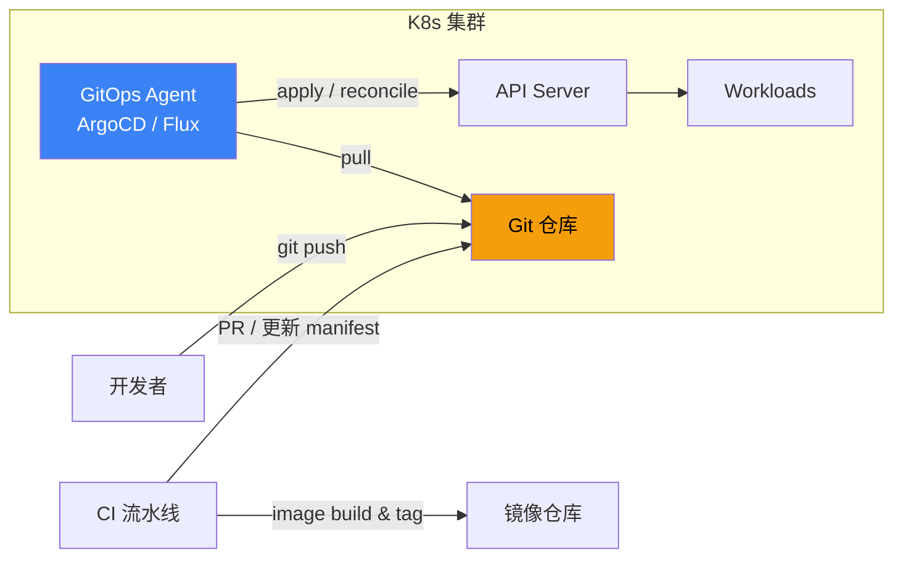
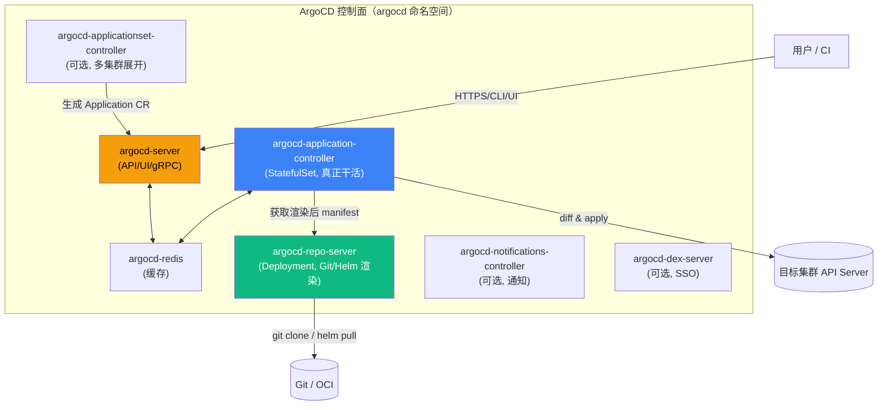
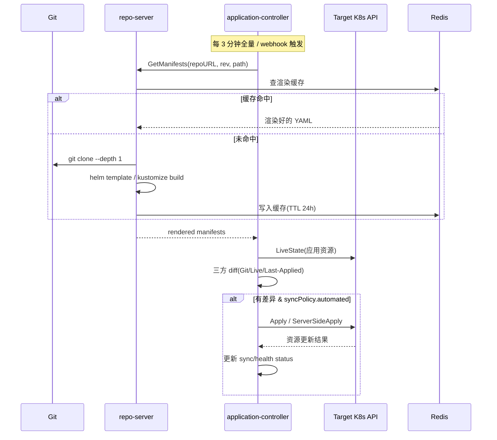
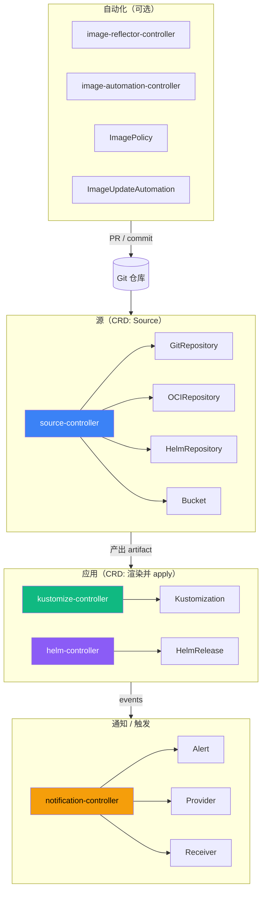
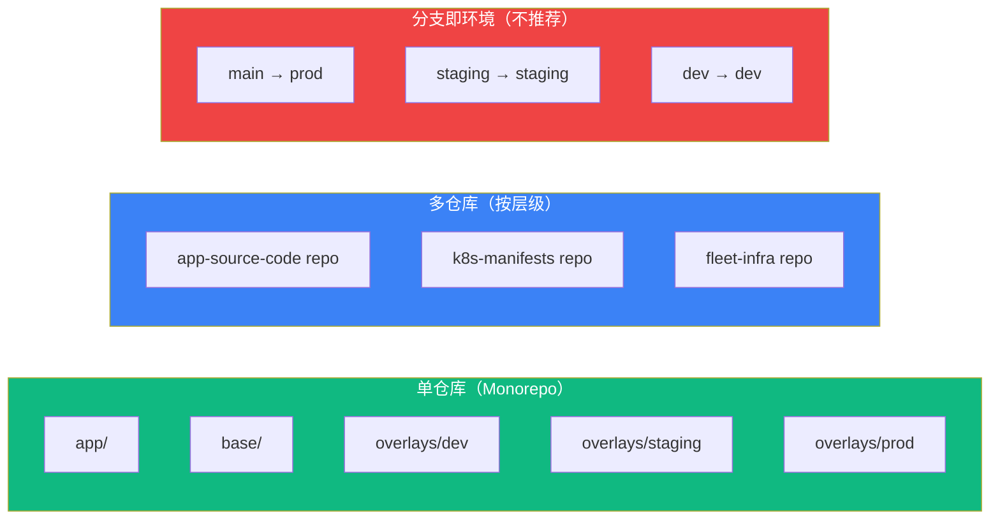
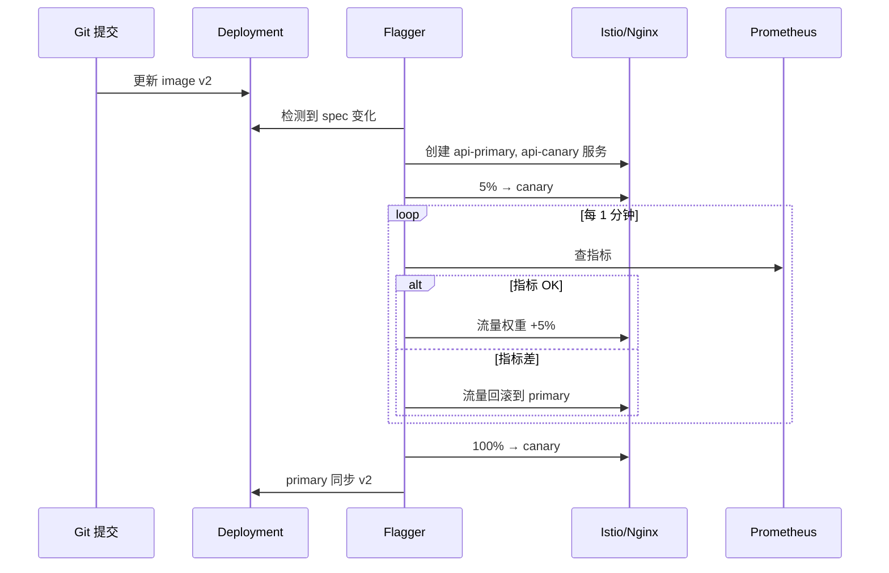

# 精通 GitOps：ArgoCD / Flux v2 / 渐进式发布

> 课程编号：C14
> 路线图来源：云原生 · 模块六 生产化
> 难度：⭐⭐⭐⭐
> 预计阅读时间：80 分钟
> 内容基准：2026 年 5 月（ArgoCD 3.x、Flux v2.4+、Argo Rollouts 1.8+、Flagger 1.40+）

---

## 引言：从"kubectl apply"到"Git 是唯一真实源"

```bash
# 老派部署
ssh prod-bastion
kubectl set image deployment/api api=registry/api:v1.2.3
kubectl rollout status deployment/api

# GitOps 部署
git commit -m "bump api to v1.2.3"
git push
# ...集群里有个东西在 30s 内自动 reconcile
```

第二种叫 **GitOps**——把"集群状态"完全交给 Git 决定，再让集群里的 controller 自动拉取并对齐。它不是某个工具，而是一套工程纪律。Weaveworks 在 2017 年首次提出，2023 年 CNCF 把 ArgoCD、Flux 双双毕业（Graduated）。到 2026 年，"GitOps 是不是部署的默认范式"已经不再是问题——是问题，是**怎么用对**。

### GitOps 四原则（OpenGitOps 1.0）

CNCF OpenGitOps 工作组在 2022 年正式确立四条原则，2026 年仍然是判断"这是不是真 GitOps"的金标准：

1. **声明式（Declarative）**：系统期望状态用声明式描述（YAML / HCL / Jsonnet），而不是命令式脚本
2. **版本化与不可变（Versioned and Immutable）**：所有状态存在 Git，提交不可变，每次变更都有历史与签名
3. **自动拉取（Pulled Automatically）**：集群里的 agent **主动 pull**（不是 CI **push**），减少凭据暴露面
4. **持续 reconcile（Continuously Reconciled）**：agent 持续比对实际状态与期望状态，发现漂移自动修复或告警

第三条是关键。传统 CI/CD 是 `Jenkins → kubectl apply` 的 push 模型，要把 kubeconfig 塞进 CI runner——这是历史上 K8s 凭证泄漏的头号原因。GitOps 反过来：集群里跑个 controller，自己去 Git 拉，CI 只管把 YAML 推到 Git。



本章把 2026 年生产级 GitOps 拆开：ArgoCD 3.x 的 Server / Controller / Repo Server 架构，Flux v2 的 source-controller / kustomize-controller / helm-controller / notification 四件套，ApplicationSet 多集群部署，Sync Wave 与 Sync Hook，与 Helm / Kustomize 的深度整合，配置漂移检测，渐进式发布（Argo Rollouts vs Flagger），多租户 RBAC，image tag 自动化更新（Image Updater / PR 回写），以及 14 个生产陷阱。

读完应能独立设计一套"开发-预发-生产"三环境的 GitOps 部署体系，并解释每一个 controller 的 reconcile 行为。

---

## 第一章：ArgoCD 架构深度拆解

ArgoCD 是 Intuit 在 2018 年开源、2022 年 CNCF Graduated 的 GitOps 工具，**有 UI、有 CLI、有 API**。它是目前装机量最大的 GitOps 控制器（CNCF 2025 调查显示企业份额约 65%）。

### 1.1 五大核心组件



逐个拆：

**argocd-server（API Server）**
- 暴露 REST/gRPC API、Web UI、`argocd` CLI 的后端
- 无状态——多副本水平扩展
- 处理认证、RBAC、Project 校验、Application CRUD
- **不直接对集群 apply**——只是控制面入口

**argocd-application-controller（核心）**
- 真正的"reconcile 大脑"。StatefulSet 部署，2.7+ 起支持**分片**（每个分片管一部分集群）
- 监听 Application CR 变化，调用 repo-server 拿渲染好的 manifest，diff 后 apply 到目标集群
- 维护每个 Application 的 sync status、health status
- 每隔 `--app-resync` 秒（默认 180s）做一次全量 reconcile

**argocd-repo-server（渲染器）**
- 唯一接触 Git 凭证和 Helm/Kustomize 二进制的组件
- 接收"渲染请求"：仓库 URL + revision + path + 参数 → 返回纯净 YAML
- 无状态 + 缓存（基于 Redis）。所有 Helm template、Kustomize build、Jsonnet eval 都在这里跑
- 2.6+ 起的 **CMP（Config Management Plugin）v2** 让你用 sidecar 模式接入自定义渲染器（cdk8s、Pulumi、Tanka）

**argocd-redis（缓存）**
- 缓存 repo-server 渲染结果与 application-controller 的状态
- 重启会丢——但只是性能影响，不丢"真相"（真相在 Git 与目标集群）

**argocd-applicationset-controller（多集群展开）**
- 处理 `ApplicationSet` CR，按 generator（List/Cluster/Git/Matrix/Merge/SCM Provider 等）生成多个 Application
- 见第五章详解

### 1.2 Application CR 详解

```yaml
apiVersion: argoproj.io/v1alpha1
kind: Application
metadata:
  name: api-prod
  namespace: argocd
  finalizers:
  - resources-finalizer.argocd.argoproj.io  # 删除 App 时级联删 K8s 资源
spec:
  project: payments                          # 关联 AppProject（多租户隔离）
  source:
    repoURL: https://github.com/acme/k8s-manifests
    targetRevision: main                     # 分支 / tag / commit SHA
    path: apps/api/overlays/prod             # 单仓库时用
    # 也可以指定 Helm
    # chart: api
    # helm:
    #   releaseName: api
    #   valueFiles: [values-prod.yaml]
  destination:
    server: https://kubernetes.default.svc   # 本集群；多集群时换 URL
    namespace: api
  syncPolicy:
    automated:
      prune: true                            # 自动删除 Git 删掉的资源
      selfHeal: true                         # 漂移时自动拉回
      allowEmpty: false                      # 防止误删全量
    syncOptions:
    - CreateNamespace=true
    - PrunePropagationPolicy=foreground
    - PruneLast=true
    - ServerSideApply=true                   # 3.x 推荐
    retry:
      limit: 5
      backoff:
        duration: 5s
        factor: 2
        maxDuration: 3m
  revisionHistoryLimit: 20                   # 保留 20 个历史版本供回滚
```

要点：

- `source` 既可以指 Kustomize/Plain YAML 路径，也可以指 Helm chart（含 `repoURL` 是 OCI 也支持）
- `destination.server` 是**目标集群的 K8s API Server URL**——`https://kubernetes.default.svc` 是 ArgoCD 自己所在集群
- `syncPolicy.automated` 不写就是手动 sync——需要 UI/CLI 点
- `selfHeal: true` + `automated.prune: true` = 全自动同步（漂移就拉回、删除就同步）。但**生产建议先关 selfHeal**，避免运维 hotfix 被 ArgoCD 立刻覆盖（见第八章）

### 1.3 Sync 工作流：从 commit 到 apply

一次完整的 reconcile 走完这些步骤：



关键细节：

- ArgoCD 的 diff 是**三方 diff**：Git 中的期望 vs 集群中的实际 vs 上次 apply 的快照。这样能区分"用户改了集群"与"ArgoCD 还没 apply"
- Webhook 不是必需，但配置后能把 3 分钟延迟降到秒级——Git 仓库（GitHub/GitLab/Gitea）配置 push webhook 推 `https://argocd.example.com/api/webhook`
- Repo server 缓存命中率直接影响延迟——大型实例可加副本数

### 1.4 健康检查与 Lua 自定义

ArgoCD 用 Lua 脚本判断每个资源的 health 状态（Healthy / Progressing / Degraded / Suspended / Missing）。内置覆盖了 Deployment / StatefulSet / DaemonSet / Job / Argo Rollouts 等。CRD 自定义健康检查写在 ConfigMap：

```yaml
apiVersion: v1
kind: ConfigMap
metadata:
  name: argocd-cm
  namespace: argocd
data:
  resource.customizations.health.cert-manager.io_Certificate: |
    hs = {}
    if obj.status ~= nil and obj.status.conditions ~= nil then
      for i, c in ipairs(obj.status.conditions) do
        if c.type == "Ready" then
          if c.status == "True" then
            hs.status = "Healthy"
          else
            hs.status = "Progressing"
          end
          hs.message = c.message
          return hs
        end
      end
    end
    hs.status = "Progressing"
    hs.message = "Waiting for certificate"
    return hs
```

3.x 起健康检查脚本可以打包进 `argo-cd-extension` ConfigMap 仓库统一管理。

---

## 第二章：Flux v2 架构深度拆解

Flux 是 Weaveworks 在 2017 年首创、2023 年 CNCF Graduated。**Flux v2（GitOps Toolkit）**是 2020 年完全重写的版本，原 v1 已 EOL。v2 的核心理念是"把 GitOps 拆成可组合的 controller"。

### 2.1 四件套 + 通知



四个核心 controller：

**source-controller**：负责"获取 artifact"。`GitRepository` 周期性 clone Git，把指定 commit 打成 tar 暴露给其他 controller；`OCIRepository` pull OCI 镜像（Flux 2.2+ 支持把 manifest 打包成 OCI artifact）；`HelmRepository` 拉 Helm 仓库 index；`Bucket` 拉 S3/GCS 等对象存储。

**kustomize-controller**：消费 source 提供的 artifact，渲染 Kustomize（或纯 YAML），apply 到集群。每个 `Kustomization` CR 是一个"部署单元"——可以指定 dependsOn、prune、healthChecks、wait 等。

**helm-controller**：消费 `HelmRepository` 或 `GitRepository` 中的 chart，执行 Helm install/upgrade/rollback。`HelmRelease` CR 是声明式的 Helm 安装。

**notification-controller**：把 controller 产生的事件转发到 Slack / Teams / Discord / generic webhook（Provider + Alert），或反向接收 webhook 触发 reconcile（Receiver）。

可选的 **image-reflector-controller** + **image-automation-controller** 实现 image tag 自动更新——见第十二章。

### 2.2 GitRepository + Kustomization 最小例子

```yaml
---
apiVersion: source.toolkit.fluxcd.io/v1
kind: GitRepository
metadata:
  name: app-manifests
  namespace: flux-system
spec:
  interval: 1m                                 # 每分钟检查一次 Git
  url: https://github.com/acme/k8s-manifests
  ref:
    branch: main
  secretRef:
    name: github-deploy-key                    # 私有仓库时
---
apiVersion: kustomize.toolkit.fluxcd.io/v1
kind: Kustomization
metadata:
  name: api-prod
  namespace: flux-system
spec:
  interval: 5m
  path: ./apps/api/overlays/prod
  sourceRef:
    kind: GitRepository
    name: app-manifests
  prune: true                                  # 等价 ArgoCD 的 prune
  wait: true                                   # 等所有资源 Ready 才报 success
  timeout: 5m
  targetNamespace: api
  healthChecks:
  - apiVersion: apps/v1
    kind: Deployment
    name: api
    namespace: api
  postBuild:
    substitute:
      cluster_name: prod-us-east-1             # 变量替换（envsubst）
    substituteFrom:
    - kind: ConfigMap
      name: cluster-vars
```

要点：

- Source 和 Apply 是**解耦**的：一个 `GitRepository` 可被多个 `Kustomization` 引用
- `interval` 是 Flux 风格——每个 CR 单独配
- `prune: true` 删除 Git 删掉的资源（**默认是 false**——和 ArgoCD 默认行为不同）
- `postBuild.substitute` 是 Flux 的特色：在 kustomize build 后再做一次变量替换，**官方不推荐用于多环境**（多环境推荐 overlay 而非变量），但用于"集群名"这类元数据合适

### 2.3 HelmRelease 例子

```yaml
---
apiVersion: source.toolkit.fluxcd.io/v1
kind: HelmRepository
metadata:
  name: bitnami
  namespace: flux-system
spec:
  interval: 1h
  url: https://charts.bitnami.com/bitnami
  # OCI 仓库时：
  # type: oci
  # url: oci://registry-1.docker.io/bitnamicharts
---
apiVersion: helm.toolkit.fluxcd.io/v2
kind: HelmRelease
metadata:
  name: redis
  namespace: cache
spec:
  interval: 10m
  chart:
    spec:
      chart: redis
      version: "20.x"                          # SemVer 范围
      sourceRef:
        kind: HelmRepository
        name: bitnami
        namespace: flux-system
  values:
    architecture: replication
    auth:
      enabled: true
      existingSecret: redis-auth
  install:
    remediation:
      retries: 3
  upgrade:
    remediation:
      retries: 3
      strategy: rollback                       # 升级失败自动 rollback
```

与 `helm install` 的区别：**HelmRelease 是声明式且持续 reconcile** 的——chart 版本更新（`20.0.1 → 20.0.2`）会被 Flux 自动 apply。

### 2.4 Flux CLI 引导集群

```bash
# 一键 bootstrap：把 Flux 自身写进 Git
flux bootstrap github \
  --owner=acme \
  --repository=fleet-infra \
  --branch=main \
  --path=clusters/prod-us-east-1 \
  --personal=false

# 该命令做四件事：
# 1. 在 fleet-infra 仓库的 clusters/prod-us-east-1/flux-system/ 写入 Flux 自身 manifest
# 2. 部署 Flux 四个 controller 到集群
# 3. 创建 GitRepository 指向 fleet-infra
# 4. 创建 Kustomization 让 Flux 自己管理自己
```

**Flux 管理 Flux**——bootstrap 后 Flux 自己的升级也走 GitOps。这是 ArgoCD 与 Flux 的一个气质差异：ArgoCD 强调 UI 与人的交互，Flux 强调"全 CLI + 全声明式"。

---

## 第三章：ArgoCD vs Flux 选型

两者都过了 CNCF Graduated，都生产可用。差异在工程哲学：

| 维度 | ArgoCD | Flux v2 |
|---|---|---|
| UI | 一流（Web UI + 资源拓扑可视化） | 几乎没有（Weave GitOps Open Source 提供基础 UI） |
| CLI | argocd CLI（多数操作可走 UI） | flux CLI（一切走 CLI） |
| 部署单元 | `Application`（含 source + dest） | `GitRepository` + `Kustomization` / `HelmRelease`（解耦） |
| 多集群 | ApplicationSet 集中管理 | "hub-spoke"：每个集群独立 Flux（推荐）或 Cluster API |
| RBAC | 内建 Project + ArgoCD RBAC + SSO（Dex） | 用 K8s 原生 RBAC（按 namespace） |
| Helm | repo-server 内置 helm template，再 apply | helm-controller 真调 helm install/upgrade |
| Kustomize | 内置 kustomize build | kustomize-controller |
| Image 更新 | Argo CD Image Updater（独立项目） | image-automation-controller（一等公民） |
| 渐进式发布 | Argo Rollouts（同家） | Flagger（同家，但也支持 ArgoCD） |
| 操作模式 | "拉一拉、点 sync" | "声明完就走" |
| 团队规模 | 中大型团队（需要 UI + 多 project + SSO） | 小中型团队 / 平台工程师 |
| 网络模型 | 集中式（一个 ArgoCD 管多集群） | 分布式（每集群一个 Flux） |
| 故事熟度 | UI/UX 工程优先 | Unix 哲学，组合式 |

实践经验：

- **如果你有一个平台团队 + 几十个业务团队需要自助部署**：ArgoCD。UI + Project + SSO 一站式
- **如果你做 SRE / 平台工程**：Flux。声明式、可组合、`flux check` 与 `kubectl get gitrepositories` 等命令式调试体验更好
- **如果你的核心人员 < 5 个但要管几十个集群**：Flux。每集群独立 Flux 减少爆炸半径
- **如果你已经深度用了 Argo Rollouts/Workflows**：ArgoCD（一家人，集成无缝）
- **如果你已经深度用了 Flagger 或想要 Helm 真正执行**：Flux

也有"两者共用"的：用 Flux 引导集群（含 cert-manager / external-secrets 等基础设施），用 ArgoCD 给业务团队提供自助 UI。OK 但增加心智负担——通常不建议。

---

## 第四章：仓库结构与环境策略

GitOps 第一周的灵魂拷问：**仓库怎么组织？分支策略怎么定？**

### 4.1 三大流派



**1) 单仓库 + 目录分环境（推荐）**

```
k8s-manifests/
├── apps/
│   ├── api/
│   │   ├── base/                  # Kustomize base
│   │   │   ├── deployment.yaml
│   │   │   ├── service.yaml
│   │   │   └── kustomization.yaml
│   │   └── overlays/
│   │       ├── dev/
│   │       │   ├── kustomization.yaml
│   │       │   └── replicas-patch.yaml
│   │       ├── staging/
│   │       └── prod/
│   └── worker/
└── infra/
    ├── cert-manager/
    ├── external-secrets/
    └── monitoring/
```

每个环境是一个 ArgoCD Application 或 Flux Kustomization，指向相应 overlay 路径。升级流程：合并 PR → 该环境的 ArgoCD App 检测到变化 → reconcile。

**2) 应用代码 + manifest 双仓库（业界主流）**

应用源码仓 `acme/api`，manifest 仓 `acme/k8s-manifests`。CI 在应用仓构建镜像，**自动 PR 或 commit 到 manifest 仓**更新 image tag。GitOps controller 只看 manifest 仓。

好处：清晰的关注分离；manifest 仓的修改全部走 PR review，审计友好；应用代码 reset 不影响 K8s 状态。

**3) 分支即环境（不推荐但常见）**

`main → prod`、`staging → staging`、`develop → dev`。看起来很 git-flow，但实践有大坑：

- 多环境间 cherry-pick / merge 经常出错（"已经合到 staging 但忘记合到 main"）
- 长生命周期分支违反 trunk-based 思想
- ArgoCD/Flux 的 targetRevision 写死分支名，紧急回滚需要 force push 历史

业界共识：**目录分环境 >> 分支分环境**。少数场景（合规要求环境完全隔离）才用分支或独立仓库。

### 4.2 升级路径模板

一次代码改动从 dev 走到 prod 的标准流程：

```
1. 开发者在 acme/api 提交代码 → 触发 CI
2. CI 跑测试、构建镜像 acme/api:abc1234（commit SHA）
3. CI 自动 PR 到 acme/k8s-manifests:
   - apps/api/overlays/dev/kustomization.yaml 中 newTag: abc1234
4. dev 环境的 PR 自动 merge（如 trusted），ArgoCD 部署 dev
5. 验证后，人工开 PR：把同样的 tag 写进 staging overlay
6. PR review + 自动化测试 → merge → 部署 staging
7. 验证后，人工开 PR：写进 prod overlay（可能附带 changelog）
8. 部署 prod；如失败，revert PR 即回滚
```

每一步都有 Git commit、有 reviewer、有 CI 状态——这就是 GitOps 的审计能力。

---

## 第五章：App-of-Apps 与 ApplicationSet

部署几十个 ArgoCD Application 时不可能手动一个一个写。两种自动化方案：

### 5.1 App-of-Apps（老派）

一个 ArgoCD Application 的 source 是一个**含其他 Application 定义的目录**。控制器渲染这些 Application CR 后，自己作为资源 apply，从而创建子 Application。

```yaml
apiVersion: argoproj.io/v1alpha1
kind: Application
metadata:
  name: root
  namespace: argocd
spec:
  project: default
  source:
    repoURL: https://github.com/acme/k8s-manifests
    path: argocd/apps                       # 目录里有一堆 Application yaml
    targetRevision: main
  destination:
    server: https://kubernetes.default.svc
    namespace: argocd
  syncPolicy:
    automated:
      prune: true
      selfHeal: true
```

`argocd/apps/` 目录下放各个业务的 Application：

```yaml
# argocd/apps/api.yaml
apiVersion: argoproj.io/v1alpha1
kind: Application
metadata:
  name: api
  namespace: argocd
spec:
  source:
    repoURL: https://github.com/acme/k8s-manifests
    path: apps/api/overlays/prod
    targetRevision: main
  destination:
    server: https://kubernetes.default.svc
    namespace: api
  syncPolicy:
    automated: { prune: true, selfHeal: true }
```

简单粗暴。但有局限：每个子 Application 都要手写一份，多环境多集群时复制粘贴。

### 5.2 ApplicationSet（2026 主流）

`ApplicationSet` 用 generator 程序化生成 Application。2023+ 已是 ArgoCD 一等公民。

**List Generator**：明确列出参数

```yaml
apiVersion: argoproj.io/v1alpha1
kind: ApplicationSet
metadata:
  name: api-multi-env
  namespace: argocd
spec:
  generators:
  - list:
      elements:
      - env: dev
        cluster: https://kubernetes.default.svc
        namespace: api-dev
      - env: staging
        cluster: https://staging.k8s.acme.com
        namespace: api-staging
      - env: prod
        cluster: https://prod.k8s.acme.com
        namespace: api-prod
  template:
    metadata:
      name: 'api-{{env}}'
    spec:
      project: payments
      source:
        repoURL: https://github.com/acme/k8s-manifests
        path: 'apps/api/overlays/{{env}}'
        targetRevision: main
      destination:
        server: '{{cluster}}'
        namespace: '{{namespace}}'
      syncPolicy:
        automated: { prune: true, selfHeal: true }
```

**Git Generator**：扫描 Git 目录自动生成

```yaml
spec:
  generators:
  - git:
      repoURL: https://github.com/acme/k8s-manifests
      revision: main
      directories:
      - path: apps/*/overlays/prod          # 自动发现所有 app 的 prod overlay
  template:
    metadata:
      name: '{{path.basename}}'             # api / worker / cron / ...
    spec:
      source:
        repoURL: https://github.com/acme/k8s-manifests
        path: '{{path}}'
        targetRevision: main
      destination:
        server: https://kubernetes.default.svc
        namespace: '{{path.basename}}'
      syncPolicy:
        automated: { prune: true, selfHeal: true }
```

**Cluster Generator**：自动生成针对每个注册集群的 Application

```yaml
spec:
  generators:
  - clusters:
      selector:
        matchLabels:
          env: prod                          # 只匹配带 env=prod 标签的集群
  template:
    metadata:
      name: 'cert-manager-{{name}}'         # name 是 cluster 名
    spec:
      source:
        chart: cert-manager
        repoURL: https://charts.jetstack.io
        targetRevision: v1.x.x
        helm:
          values: |
            installCRDs: true
      destination:
        server: '{{server}}'
        namespace: cert-manager
```

**Matrix Generator**：两个 generator 笛卡尔积（如 `cluster × env`）

```yaml
spec:
  generators:
  - matrix:
      generators:
      - clusters:
          selector:
            matchLabels: { env: prod }
      - git:
          repoURL: https://github.com/acme/k8s-manifests
          revision: main
          directories:
          - path: apps/*
  template:
    metadata:
      name: '{{path.basename}}-{{name}}'    # api-prod-us-east, api-prod-eu-west, ...
    # ...
```

ApplicationSet **极度强大**——一份模板覆盖几十个集群、几十个应用、上百个组合。Flux 等价物是 "用 kustomization 配合 patches" + "每集群独立 Flux 实例"。

### 5.3 集群注册

ArgoCD 管多集群需要先注册：

```bash
# 把 kubeconfig 中的集群注册到 ArgoCD
argocd cluster add prod-us-east --label env=prod --label region=us-east

# 列出已注册集群
argocd cluster list

# 添加自定义标签（供 ApplicationSet Cluster Generator 选择）
kubectl label secret -n argocd cluster-prod-us-east env=prod region=us-east
```

注册过程在 `argocd` 命名空间创建一个 Secret，含目标集群的 token 和 CA。注意：这意味着 ArgoCD 集群拥有所有目标集群的 cluster-admin 权限——**ArgoCD 集群本身的安全要求非常高**。

---

## 第六章：Sync Wave、Sync Hook 与依赖编排

K8s 资源有依赖（如 CRD 必须先创建才能用 CR），ArgoCD/Flux 都支持编排顺序。

### 6.1 ArgoCD Sync Wave

Sync Wave 通过 annotation 给资源排序，wave 数越小越早：

```yaml
apiVersion: apps/v1
kind: Deployment
metadata:
  name: api
  annotations:
    argocd.argoproj.io/sync-wave: "10"    # 较晚部署
---
apiVersion: v1
kind: Namespace
metadata:
  name: api
  annotations:
    argocd.argoproj.io/sync-wave: "-10"   # 最早创建
```

执行顺序：从最小 wave 到最大 wave。同一 wave 内并行。ArgoCD 默认按 K8s 资源类型有内置顺序（CRD > Namespace > NetworkPolicy > ResourceQuota > LimitRange > PSP > ServiceAccount > Secret > ConfigMap > Service > Deployment > ...）——Sync Wave 是在此基础上的细粒度控制。

典型用法：

```
wave -2: namespace
wave -1: CRD (cert-manager.io)
wave  0: 默认（Service / Deployment / Secret / ConfigMap）
wave  1: 业务 CR（Certificate, IngressRoute）
wave  5: Job（数据库 migration）
wave 10: 应用 Deployment
```

### 6.2 Sync Hook：PreSync / Sync / PostSync / SyncFail

Sync Hook 是"在 sync 过程的特定时机执行的资源"，常用于跑数据库 migration、cache warmup 等。

```yaml
apiVersion: batch/v1
kind: Job
metadata:
  name: db-migration
  annotations:
    argocd.argoproj.io/hook: PreSync                      # PreSync / Sync / PostSync / SyncFail
    argocd.argoproj.io/hook-delete-policy: BeforeHookCreation,HookSucceeded
spec:
  template:
    spec:
      restartPolicy: Never
      containers:
      - name: migrate
        image: acme/api:abc1234
        command: ["./migrate", "up"]
```

四种 hook 时机：

- `PreSync`：sync 前。常用于数据库 migration、备份
- `Sync`：主同步阶段
- `PostSync`：所有资源 healthy 后。常用于 smoke test、缓存预热
- `SyncFail`：sync 失败时。用于清理、回滚通知

`hook-delete-policy`：
- `HookSucceeded`：成功后删（避免堆积）
- `HookFailed`：失败后删
- `BeforeHookCreation`：下次创建前先删旧的（同名 Job 替换）

注意：**Hook 资源不参与 prune**——它们不在"期望状态"里。

### 6.3 Flux 的 dependsOn

Flux 没有 sync-wave annotation，而是用 CR 之间的 `dependsOn`：

```yaml
apiVersion: kustomize.toolkit.fluxcd.io/v1
kind: Kustomization
metadata:
  name: api
  namespace: flux-system
spec:
  dependsOn:
  - name: cert-manager
  - name: external-secrets
  interval: 5m
  path: ./apps/api/overlays/prod
  sourceRef:
    kind: GitRepository
    name: app-manifests
```

Flux 的设计哲学是"每个部署单元一个 CR"，所以依赖在 CR 之间表达。要在 Kustomization 内部的资源间排序，用 Kustomize 自己的 `resources` 顺序与 `wait` 字段——Flux 会等所有 healthCheck 通过才继续。

---

## 第七章：Helm 与 Kustomize 整合

GitOps 不"重新发明"模板系统，而是消费 Helm 和 Kustomize。

### 7.1 ArgoCD + Helm

```yaml
spec:
  source:
    repoURL: https://charts.jetstack.io
    chart: cert-manager
    targetRevision: v1.x.x
    helm:
      releaseName: cert-manager
      valueFiles:
      - values.yaml                       # 来自同仓库的另一个 source？看下文
      values: |                           # 内联 values
        installCRDs: true
        replicaCount: 3
      parameters:
      - name: image.tag
        value: v1.x.x
      ignoreMissingValueFiles: false
      skipCrds: false
      passCredentials: false
```

**关键陷阱**：单 `source` 时 `valueFiles` 必须在同一个 chart 内部。要从另一个仓库取 values 文件，用 **multi-source**（2.6+）：

```yaml
spec:
  sources:
  - repoURL: https://charts.bitnami.com/bitnami
    chart: redis
    targetRevision: 20.x.x
    helm:
      valueFiles:
      - $values/charts/redis/values-prod.yaml
  - repoURL: https://github.com/acme/k8s-manifests
    targetRevision: main
    ref: values                           # 起别名供上面引用
```

第二个 source 不部署，只是给第一个 source 提供 values 文件（`$values` 是引用别名）。这种模式让"chart 来自上游 + values 来自自己 Git 仓库"成为可能——**生产用 Helm chart 的最佳实践**。

ArgoCD 默认把 Helm chart `helm template` 渲染后 apply，**不调用真正的 helm**。这意味着 `helm history`、`helm rollback` 不工作——回滚靠 Git revert。如要让 ArgoCD 真用 helm，配置 Helm plugin（罕见）。

### 7.2 ArgoCD + Kustomize

```yaml
spec:
  source:
    repoURL: https://github.com/acme/k8s-manifests
    path: apps/api/overlays/prod
    targetRevision: main
    kustomize:
      images:
      - acme/api:abc1234                  # 覆盖 image tag（Image Updater 友好）
      namePrefix: prod-
      commonLabels:
        env: prod
      commonAnnotations:
        managed-by: argocd
```

`kustomize.images` 是被 Image Updater 写的"接缝"——见第十二章。

### 7.3 Flux + Helm

如前述 `HelmRelease`。Flux 与 ArgoCD 的核心差异：

```yaml
spec:
  install: { ... }
  upgrade: { ... }
  rollback: { ... }                       # Flux 真的会执行 helm rollback
  test:
    enable: true                          # 执行 helm test
```

Flux 真用 Helm SDK，所以 `helm history` 工作。但代价是 helm-controller 需要更高权限，且无法 server-side apply。

### 7.4 Flux + Kustomize

`Kustomization` CR 直接消费 kustomize 目录，已在第二章详述。Flux 还支持 **patches**：

```yaml
spec:
  patches:
  - target:
      kind: Deployment
      name: api
    patch: |
      - op: replace
        path: /spec/replicas
        value: 5
```

适合在不修改上游 kustomize 的前提下做集群级 patch。

---

## 第八章：配置漂移检测与修复

GitOps 第二大价值（仅次于审计）：**漂移检测**。

### 8.1 什么是漂移

漂移（Drift）= 集群里的实际状态 ≠ Git 里的期望状态。常见原因：

1. 紧急 hotfix：值班工程师 `kubectl edit` 改了 replica 数
2. HPA 修改了 Deployment.spec.replicas（这是合法的，**不算漂移**）
3. Mutating Webhook 注入了 sidecar（如 Istio）
4. 第三方 controller 给资源加了字段（如 cert-manager 的 status）
5. 人工误操作

### 8.2 ArgoCD 漂移行为

```yaml
spec:
  syncPolicy:
    automated:
      selfHeal: true              # 漂移自动拉回
      prune: true                 # 删除 Git 删掉的资源
```

`selfHeal: true` 是"自动覆盖漂移"。**慎用**：

- ✅ 推荐场景：dev / staging、纯无状态服务、basic infra
- ❌ 慎用场景：生产 + 高频运维干预；建议关闭 selfHeal 仅报告 OutOfSync

不写 selfHeal 时，ArgoCD 会标记 `OutOfSync` 但不自动 apply——值班看到告警可手动评估。

**忽略字段**：HPA 会改 replicas，要让 ArgoCD 不把它当漂移：

```yaml
spec:
  ignoreDifferences:
  - group: apps
    kind: Deployment
    jsonPointers:
    - /spec/replicas
  - group: ""
    kind: ConfigMap
    jqPathExpressions:
    - '.data["dynamic-value"]'
```

或全局忽略：

```yaml
# argocd-cm ConfigMap
data:
  resource.customizations.ignoreDifferences.apps_Deployment: |
    jsonPointers:
    - /spec/replicas
```

ServerSideApply（3.x 推荐）解决了一类漂移问题——ArgoCD 只管理自己拥有的字段，其他 manager 改的字段不算漂移。

### 8.3 Flux 漂移行为

Flux 的 `Kustomization` 默认行为：

- 不 prune（要显式 `prune: true`）
- 始终 apply（等价于 selfHeal: true）

Flux 没有"只报告不修复"的内置模式。要做漂移监控，依赖 `notification-controller` 把 reconcile 事件发到 Slack/Prometheus，外部观察哪些 CR 频繁报"applied"——这就是漂移。

### 8.4 工具：argocd-diff-preview / kubectl-diff

PR review 时想看到"这个 PR 会改集群的什么"：

```bash
# ArgoCD CLI 模拟 diff
argocd app diff api-prod --revision=main --local=./manifests

# 在 PR 上做 diff 评论的工具
# - argo-cd-diff-action（GitHub Action）
# - argocd-diff-preview
```

这是 GitOps PR 流程的"reviewer 武器"——把"这个 PR 会变什么"可视化到 PR comment 里。

---

## 第九章：凭证管理

GitOps 涉及多种凭证：访问 Git 仓库的、注册的目标集群的、与外部系统通信的。

### 9.1 Git 仓库凭证

私有 Git 仓库需要 deploy key 或 token：

```bash
# ArgoCD
argocd repo add https://github.com/acme/k8s-manifests \
  --username argocd-bot \
  --password ghp_xxxx

# 或 SSH key
argocd repo add git@github.com:acme/k8s-manifests.git \
  --ssh-private-key-path ~/.ssh/argocd_id_ed25519
```

凭证以 Secret 存在 `argocd` 命名空间，类型 `repository`。**强烈推荐用 GitHub App 凭证**而不是 PAT——可吊销、可审计、有速率限制更宽松。

Flux 用 deploy key 或 token：

```bash
flux create secret git github-creds \
  --url=https://github.com/acme/k8s-manifests \
  --username=argo-bot \
  --password=$GITHUB_TOKEN
```

或 bootstrap 时自动生成 SSH key 并 push 到 GitHub。

### 9.2 目标集群凭证

ArgoCD 多集群管理时，每个目标集群需要 ServiceAccount + token：

```bash
argocd cluster add prod-us-east --service-account argocd-manager --label env=prod
```

ArgoCD 会在目标集群创建 `argocd-manager` ServiceAccount + ClusterRoleBinding（默认 cluster-admin），再把 token 存回控制面集群。

**生产最小权限**：避免 cluster-admin。让 ArgoCD ServiceAccount 只能管 `default` 以外的命名空间，或限制特定 CRD：

```yaml
apiVersion: v1
kind: ServiceAccount
metadata:
  name: argocd-manager
  namespace: kube-system
---
apiVersion: rbac.authorization.k8s.io/v1
kind: ClusterRole
metadata:
  name: argocd-manager
rules:
- apiGroups: ["*"]
  resources: ["*"]
  verbs: ["*"]
  # 实际生产应排除：
  # - cluster-role / clusterrolebinding（防止权限提升）
  # - PodSecurityPolicy / ValidatingAdmissionPolicy（防止破坏策略）
```

### 9.3 仓库内 Secret 加密

Git 仓库不能存明文 Secret。两个主流方案：

**1) Sealed Secrets**（Bitnami）

在仓库存"密封后"的 Secret，集群里的 controller 用私钥解密：

```bash
# 生成密钥对（一次性）
kubeseal --fetch-cert > pub-cert.pem

# 加密
echo -n 'password=hunter2' | kubectl create secret generic db --dry-run=client --from-literal=password=hunter2 -o yaml | \
  kubeseal --cert pub-cert.pem -o yaml > db-sealed.yaml

# db-sealed.yaml 提交到 Git；集群里 sealed-secrets-controller 自动解密成 Secret
```

特点：私钥在集群里，仓库可公开。

**2) External Secrets Operator + Vault / AWS Secrets Manager / GCP SM**

在仓库存 `ExternalSecret` CR（不含敏感数据），ESO 去外部 vault 拉真实值生成 Secret：

```yaml
apiVersion: external-secrets.io/v1beta1
kind: ExternalSecret
metadata:
  name: api-db
spec:
  refreshInterval: 1h
  secretStoreRef:
    name: vault-backend
    kind: ClusterSecretStore
  target:
    name: api-db-secret
  data:
  - secretKey: password
    remoteRef:
      key: secret/data/api/db
      property: password
```

ESO 是 2026 年主流——值真正放在 Vault / Secrets Manager（带轮转、审计），K8s Secret 只是 ESO 同步过来的副本。

---

## 第十章：渐进式发布——Argo Rollouts vs Flagger

普通 Deployment 的 RollingUpdate 没有"看指标决定继续"的能力。Progressive Delivery 工具给你 canary、blue-green、experiment。

### 10.1 Argo Rollouts

`Rollout` CRD 替代 `Deployment`，多了 `strategy.canary` / `strategy.blueGreen`：

```yaml
apiVersion: argoproj.io/v1alpha1
kind: Rollout
metadata:
  name: api
spec:
  replicas: 10
  selector:
    matchLabels:
      app: api
  template:
    metadata:
      labels:
        app: api
    spec:
      containers:
      - name: api
        image: acme/api:v1.2.3
  strategy:
    canary:
      canaryService: api-canary       # Service 路由 canary
      stableService: api-stable        # Service 路由 stable
      trafficRouting:
        istio:
          virtualService:
            name: api-vs
            routes: [primary]
      steps:
      - setWeight: 5                   # 5% 流量到新版
      - pause: { duration: 2m }
      - analysis:                      # 看指标决定继续
          templates:
          - templateName: success-rate
          args:
          - name: service-name
            value: api-canary
      - setWeight: 25
      - pause: { duration: 5m }
      - setWeight: 50
      - pause: { duration: 5m }
      - setWeight: 100
```

```yaml
# AnalysisTemplate 定义"成功率 > 95%"
apiVersion: argoproj.io/v1alpha1
kind: AnalysisTemplate
metadata:
  name: success-rate
spec:
  args:
  - name: service-name
  metrics:
  - name: success-rate
    interval: 30s
    successCondition: result[0] >= 0.95
    failureLimit: 3
    provider:
      prometheus:
        address: http://prometheus.monitoring:9090
        query: |
          sum(rate(http_requests_total{service="{{args.service-name}}",code!~"5.."}[2m]))
          /
          sum(rate(http_requests_total{service="{{args.service-name}}"}[2m]))
```

Argo Rollouts 是**控制器驱动**——它自己改 Deployment / ReplicaSet 比例，分阶段。流量切分需配合 Istio / Nginx Ingress / SMI / Gateway API。

支持的策略：
- **Canary**：分批切流，可看指标
- **BlueGreen**：维护两个完整 ReplicaSet，瞬间切流
- **Experiment**：临时跑 A/B 实验，独立 ReplicaSet 不带流量

### 10.2 Flagger

Flagger 是同名 Weaveworks 项目（现 Flux 家族）。和 Rollouts 类似但模型不同：**保留 Deployment + 自动 fork ReplicaSet**。

```yaml
apiVersion: flagger.app/v1beta1
kind: Canary
metadata:
  name: api
spec:
  targetRef:
    apiVersion: apps/v1
    kind: Deployment
    name: api
  service:
    port: 80
    gateways: [public-gateway.istio-system.svc.cluster.local]
    hosts: [api.acme.com]
  analysis:
    interval: 1m
    threshold: 5
    maxWeight: 50
    stepWeight: 5
    metrics:
    - name: request-success-rate
      thresholdRange:
        min: 99
      interval: 1m
    - name: request-duration
      thresholdRange:
        max: 500
      interval: 30s
    webhooks:
    - name: load-test
      type: rollout
      url: http://flagger-loadtester.test/
      metadata:
        cmd: "hey -z 1m -q 10 -c 2 http://api-canary.test/"
```

工作流：



### 10.3 Rollouts vs Flagger 选型

| 维度 | Argo Rollouts | Flagger |
|---|---|---|
| 资源模型 | 新 CRD（Rollout 替代 Deployment） | 保留 Deployment，自动管 ReplicaSet |
| Helm chart 改动 | 需要把 Deployment 换成 Rollout | 不改 chart，加 Canary CR |
| UI | ArgoCD UI 一等公民 | 无 UI（Grafana 看进度） |
| 实验性 A/B | Experiment 资源原生 | 通过 webhook 模拟 |
| 流量提供者 | Istio / Nginx / ALB / SMI / Gateway API | 同上 |
| 与 GitOps 集成 | ArgoCD 无缝 | Flux 无缝；也支持 ArgoCD |
| 生态活跃度 | 高 | 高 |

经验：

- 重 ArgoCD：选 Rollouts
- 重 Flux 或不想改 Deployment：选 Flagger
- 都试过的话：Rollouts 的 UI 直观，Flagger 的"无需改 chart"更优雅

---

## 第十一章：多租户 GitOps

平台团队给 N 个业务团队提供 ArgoCD/Flux，怎么隔离？

### 11.1 ArgoCD AppProject

`AppProject` 是 ArgoCD 的"租户单元"：

```yaml
apiVersion: argoproj.io/v1alpha1
kind: AppProject
metadata:
  name: payments
  namespace: argocd
spec:
  description: Payments team
  sourceRepos:                              # 白名单 Git 仓库
  - https://github.com/acme/payments-*
  destinations:                              # 白名单部署目标
  - server: https://kubernetes.default.svc
    namespace: payments-*
  - server: https://prod-eu.k8s.acme.com
    namespace: payments-*
  clusterResourceWhitelist:                  # 允许的集群级资源
  - group: ''
    kind: Namespace
  namespaceResourceBlacklist:                # 禁止的 namespace 级资源
  - group: ''
    kind: ResourceQuota
  roles:
  - name: developer
    policies:
    - p, proj:payments:developer, applications, get, payments/*, allow
    - p, proj:payments:developer, applications, sync, payments/*, allow
    groups:
    - acme:payments-developers              # SSO group
  - name: admin
    policies:
    - p, proj:payments:admin, applications, *, payments/*, allow
    groups:
    - acme:payments-admins
```

AppProject 限制业务团队**只能从指定 Git 仓库**部署**到指定命名空间**。配合 SSO（Dex/OIDC）+ ArgoCD RBAC，实现自助式部署。

### 11.2 Flux 多租户

Flux 的多租户基于 K8s 原生 RBAC + ServiceAccount impersonation：

```yaml
apiVersion: kustomize.toolkit.fluxcd.io/v1
kind: Kustomization
metadata:
  name: payments-api
  namespace: payments                       # 业务团队 namespace
spec:
  serviceAccountName: payments-deployer     # 用业务团队 SA 执行
  # ...
```

`serviceAccountName` 是关键——Flux 用这个 SA impersonate 去 apply 资源，所以业务团队的部署能力被 SA 的 RoleBinding 限制。

Flux 多租户的"硬隔离"模式：每个业务团队一个独立 Flux 实例（namespace），相互不可见——但运维成本高。生产实践通常是单 Flux 实例 + namespace RBAC。

---

## 第十二章：CI 与 CD 边界——Image Tag 更新策略

GitOps 的"image tag 怎么更新"是个高频面试题。三种主流方式：

### 12.1 ArgoCD Image Updater

独立项目，部署在 ArgoCD 同集群，监控镜像仓库：

```yaml
# Application 上加 annotation
apiVersion: argoproj.io/v1alpha1
kind: Application
metadata:
  name: api-prod
  annotations:
    argocd-image-updater.argoproj.io/image-list: api=acme/api
    argocd-image-updater.argoproj.io/api.update-strategy: semver
    argocd-image-updater.argoproj.io/api.allow-tags: regexp:^v\d+\.\d+\.\d+$
    argocd-image-updater.argoproj.io/write-back-method: git
    argocd-image-updater.argoproj.io/git-branch: main
```

工作模式两种：

- **argocd**：直接调 ArgoCD API 改 Application（不回 commit Git）——**违反 GitOps**，不推荐
- **git**：把新 tag commit 回 Git 仓库，让 ArgoCD 通过 Git 触发——推荐

更新策略：
- `semver`：选最大 SemVer
- `latest`：按 push 时间最新
- `name`：按字典序最新
- `digest`：跟踪 mutable tag 的 digest 变化（如 `latest`、`main`）

### 12.2 Flux Image Automation

Flux 自家方案，两个 CRD：

```yaml
apiVersion: image.toolkit.fluxcd.io/v1beta2
kind: ImageRepository
metadata:
  name: api
  namespace: flux-system
spec:
  image: acme/api
  interval: 1m
---
apiVersion: image.toolkit.fluxcd.io/v1beta2
kind: ImagePolicy
metadata:
  name: api
  namespace: flux-system
spec:
  imageRepositoryRef:
    name: api
  policy:
    semver:
      range: '>=1.0.0'
---
apiVersion: image.toolkit.fluxcd.io/v1beta2
kind: ImageUpdateAutomation
metadata:
  name: app-manifests
  namespace: flux-system
spec:
  interval: 5m
  sourceRef:
    kind: GitRepository
    name: app-manifests
  git:
    checkout:
      ref:
        branch: main
    commit:
      author:
        name: fluxcdbot
        email: fluxcdbot@acme.com
      messageTemplate: |
        Automated image update
        Files:
        {{ range $filename, $_ := .Updated.Files -}}
        - {{ $filename }}
        {{ end -}}
    push:
      branch: main
  update:
    path: ./apps/api/overlays/prod
    strategy: Setters
```

在 Kustomize 文件里用 marker：

```yaml
# apps/api/overlays/prod/kustomization.yaml
images:
- name: acme/api
  newTag: v1.2.3 # {"$imagepolicy": "flux-system:api:tag"}
```

注释里的 marker 告诉 Flux "把这里替换为 ImagePolicy api 的最新 tag"，并 commit 回 Git。

### 12.3 CI 直接写 manifest 仓（最简）

不用任何 Image Updater，让 CI 直接修改 manifest 仓：

```yaml
# .github/workflows/deploy.yml（应用源码仓）
- name: Update manifests
  run: |
    cd /tmp
    git clone https://github.com/acme/k8s-manifests
    cd k8s-manifests
    yq -i ".images[0].newTag = \"${{ github.sha }}\"" apps/api/overlays/dev/kustomization.yaml
    git config user.email "ci@acme.com"
    git config user.name "ci-bot"
    git commit -am "deploy api ${{ github.sha }} to dev"
    git push
```

或者用 PR 而非直接 push（生产推荐）：

```bash
gh pr create --base main --head deploy/api-${SHA} \
  --title "deploy api ${SHA} to dev" \
  --body "Auto-generated by CI"
```

三种方式选型：

| 场景 | 推荐 |
|---|---|
| 用 ArgoCD + 简单镜像策略 + 不想给 CI 写 Git 权限 | ArgoCD Image Updater (git mode) |
| 用 Flux + 自动化优先 | Flux Image Automation |
| CI 已成熟、想自由控制 + 想要 PR review | CI 直接 PR |
| 多团队 / 重审计 | CI 直接 PR（每次部署都有 PR） |

业界共识 2026：**生产 prod 环境推荐 CI PR**——每次发布都是有人 review 的 PR，留下完整审计；dev / staging 可自动化。

---

## 第十三章：生产实践

### 13.1 环境策略

- **dev / staging / prod 三环境**：dev 自动部署（PR merge 即上），staging 自动 + 人工 verify，prod 必须人工 approve PR
- **promote 模式**：dev → staging → prod 是"复制 image tag 到下一个 overlay"——保证三环境跑的是同一份镜像，只是配置不同
- **不要用 latest**：永远用具体 commit SHA 或 SemVer

### 13.2 回滚演练

GitOps 回滚 = `git revert`：

```bash
# 找到引入问题的 commit
git log --oneline apps/api/overlays/prod/

# revert
git revert <bad-commit>
git push

# ArgoCD/Flux 自动应用回滚（30s ~ 几分钟）
```

但要注意：

- **数据库 migration 不可逆**——回滚 image 但 DB schema 已变。生产实践：所有 migration 必须向后兼容；先发部署 1（兼容代码 + 新 migration）→ 再发部署 2（用新字段）
- **回滚 image 速度 vs 紧急止血**：如果 30s 太慢，配合"功能开关（feature flag）"在 N 秒内关掉新功能
- **演练**：每季度做一次"故意推坏代码到 prod"演练，验证回滚链路真能用

### 13.3 通知与告警

不可少：

- ArgoCD 通知：Slack / PagerDuty 收 `OutOfSync`、`Degraded`、`SyncFailed`
- Flux：`Alert` + `Provider` 发到同样的渠道
- Prometheus：ArgoCD/Flux 都有 metrics endpoint，用 PromQL 告警 `sync_status != Synced && health != Healthy` 持续 > 10m

### 13.4 审计

- 所有变更走 Git PR → 自然有完整审计
- ArgoCD 操作日志：UI 操作（sync、refresh、rollback）有 audit log；接入 SIEM
- 凭证轮转：deploy key / token 每 90 天轮转
- ImagePolicy 必须配合**镜像签名校验**（Cosign / Sigstore + Kyverno）防止恶意 tag

### 13.5 性能扩展

ArgoCD 大集群（>500 Application）调优：

- **application-controller 分片**：`ARGOCD_CONTROLLER_REPLICAS=3`，每个分片管一部分集群
- **repo-server 副本**：渲染密集，加副本数（4-8）
- **Redis HA**：argocd-redis-ha chart
- **Git 仓库浅克隆**：repo-server 默认 `--shallow-clone-depth=1`
- **关闭未用的 controller**：notifications / applicationset 按需启用

Flux 大集群调优：

- **分实例**：每个业务团队 / 每个集群独立 Flux
- **kustomize-controller --concurrent=10**：并发数提高
- **source-controller storage**：用 PVC 缓存大仓库

---

## 第十四章：陷阱清单

### 14.1 OutOfSync 噪声

**症状**：ArgoCD 一直显示 OutOfSync，但用户没改 Git。

**原因**：
- HPA 改了 `spec.replicas`
- Mutating Webhook 注入了字段（Istio sidecar、Kyverno mutation）
- K8s 默认值（如 `imagePullPolicy: IfNotPresent`）被 server 补上但 Git 没写
- `kubectl.kubernetes.io/last-applied-configuration` annotation 差异

**对策**：
- 用 `ignoreDifferences` 忽略已知字段
- 切到 `ServerSideApply=true`（3.x 推荐）
- 给 chart 显式补全所有字段

### 14.2 auto-sync + selfHeal 把运维 hotfix 覆盖

**症状**：值班 `kubectl edit` 改 replicas 应急，30s 后 ArgoCD 把它改回去，服务再次过载。

**对策**：
- 生产关 `selfHeal`，仅报警
- 提供 break-glass 流程：临时 `argocd app set api --sync-policy none` → 手改 → 通过 Git PR 转正

### 14.3 prune: true 误删全量

**症状**：path 配错或 Git 仓库被清空，ArgoCD 把全 namespace 资源删了。

**对策**：
- `syncOptions: [ApplyOutOfSyncOnly=true]` 减少全量 apply 副作用
- 设置 `syncPolicy.automated.allowEmpty: false`——空 manifest 不 sync
- 关键资源加 finalizer 防误删
- 使用 `argocd.argoproj.io/sync-options: Prune=false` annotation 保护特定资源

### 14.4 CRD 版本不兼容

**症状**：升级 Operator 后旧 CR 字段被删，ArgoCD 一直 OutOfSync。

**对策**：
- Operator 的 conversion webhook 必须先升级
- ArgoCD 加 `argocd.argoproj.io/sync-options: SkipDryRunOnMissingResource=true`
- 跨大版本 CRD 升级前先备份

### 14.5 Helm hook 与 ArgoCD sync hook 互相干扰

**症状**：Helm chart 自己定义了 `helm.sh/hook: pre-install`，ArgoCD 渲染后也作为 sync hook 执行，导致逻辑双跑。

**对策**：
- ArgoCD 默认把 Helm hook 转成 ArgoCD hook
- 用 `argocd.argoproj.io/hook` annotation 显式标注
- 要避免冲突，Helm chart 中 hook 资源做 idempotent

### 14.6 Webhook 没配，部署慢

**症状**：dev 环境 PR 合并后等 3 分钟才部署。

**对策**：
- 配置 ArgoCD/Flux 的 webhook（GitHub/GitLab/Gitea push event）
- ArgoCD 也支持 GitHub App webhook，配置后秒级响应

### 14.7 大仓库慢 / OOM

**症状**：repo-server 内存爆，渲染超时。

**对策**：
- 拆仓库：基础设施仓 + 业务仓
- 浅克隆默认开启
- 大型 chart 用 OCI registry 而非 git path
- 启用 repo-server side-car 模式分摊渲染

### 14.8 多集群凭证泄漏

**症状**：ArgoCD 集群被攻破 → 所有集群被攻破。

**对策**：
- ArgoCD 集群作为最高权限单元，独立网络、独立 IAM
- 限制 ArgoCD ServiceAccount 权限（不给 cluster-admin）
- 启用 ArgoCD audit log + SIEM
- 多个 ArgoCD 实例按 blast radius 分（如 prod ArgoCD 与 dev ArgoCD 分开）

### 14.9 ApplicationSet 模板错误炸全场

**症状**：改 ApplicationSet template 中的字段错误，几十个 Application 同时报错。

**对策**：
- ApplicationSet 改动**必须在 dev 集群先验证**
- `--dry-run` + `argocd appset validate`
- Git PR 上做 diff preview
- 生产推荐 `goTemplate: true`——比 fasttemplate 强，错误更明显

### 14.10 Flux substitute 滥用

**症状**：用 `postBuild.substitute` 做多环境差异，导致 manifest 不可直接渲染审计。

**对策**：
- 多环境差异用 kustomize overlay
- substitute 仅用于"集群元数据"（cluster_name、region）

### 14.11 Image Updater 写回 Git 频率太高

**症状**：CI 高频 push 镜像，Image Updater 每 2 分钟 commit 一次，Git 历史爆炸。

**对策**：
- 设置 `allow-tags` 严格过滤
- 用 `semver` 而非 `latest`
- 仅对 dev 环境开自动更新；staging/prod 走 PR

### 14.12 同名资源跨 App 冲突

**症状**：两个 Application 都管同一个 ConfigMap，互相覆盖。

**对策**：
- 用 `argocd.argoproj.io/tracking-id` 让 ArgoCD 区分（开 `application.instanceLabelKey: argocd.argoproj.io/instance`）
- 启用 ServerSideApply：每个 controller 只管自己的字段
- Project 限制 destinations 防止越界

### 14.13 Flux dependsOn 死锁

**症状**：A 依赖 B，B 依赖 C，C 又意外依赖 A —— 全部 Pending。

**对策**：
- 依赖关系做拓扑校验
- `flux tree kustomization root` 可视化依赖
- 基础设施和应用层分两个 Flux 实例

### 14.14 PR 改了但 ArgoCD 不刷

**症状**：合并 PR 后 UI 显示还是旧 SHA。

**原因**：
- ArgoCD 缓存了 Git revision；`argocd app get api --refresh` 强刷
- repo-server Redis 缓存——重启 repo-server 清缓存
- `targetRevision: main` 但 branch protection 阻止 merge

**对策**：webhook + `--refresh` 按钮 + 监控 git_sync_age 指标

---

## 第十五章：2026 现状速览

| 项目 | 2026 状态 |
|---|---|
| **ArgoCD** | 3.x 主线（2024-12 GA）；ApplicationSet 一等公民；Gateway API rollout 支持；CMP v2 稳定 |
| **Flux v2** | 2.4+ 稳定；OCI artifact 主流；Pipeline 概念 alpha；FluxCD CLI 工程化体验持续提升 |
| **Argo Rollouts** | 1.8+；支持 Gateway API HTTPRoute；Plugin 系统让分析提供者扩展更轻 |
| **Flagger** | 1.40+；支持 Gateway API；Apple Pkl 等新模板系统初步集成 |
| **GitOps 实践** | OCI repository 存 Helm chart 主流；Cosign 签名 + Kyverno 校验链路普及；SLSA 3 级供应链可达 |
| **Cluster API + GitOps** | 全生命周期"Day 0 集群自身也走 GitOps"——Flux/ArgoCD 管 Cluster API CR |
| **Pull-Request driven** | PR-as-deployment 模式（每个 PR 自动建临时环境）普及，配合 vCluster / kind / virtual cluster |
| **多租户 SaaS GitOps** | 出现 OSS 产品（如 Capsule + ArgoCD、Akuity Platform）做"GitOps 即服务" |
| **AI 辅助** | LLM 辅助生成 Application/Kustomization、自动 diff PR 评审、自然语言 query 集群状态（早期） |

### 行业最佳实践共识

1. **目录分环境 >> 分支分环境**（除非合规要求）
2. **prod 必须 PR review，selfHeal off**
3. **migration 必须向后兼容**
4. **Image 自动更新仅限非生产**
5. **签名 + 策略校验是供应链安全底线**
6. **每个集群一个 GitOps controller（Flux）或单 controller 分片（ArgoCD），别让一个实例管太多**
7. **PR 评论里出 diff preview**

---

## 练习题

### 第一组：概念

1. 描述 GitOps 四原则。你的公司目前哪一条做得不够？
2. 用一段话解释 ArgoCD 中 application-controller、repo-server、API server 的分工。
3. Flux v2 为何要把 source 和 apply 拆成两个 controller？
4. ArgoCD 与 Flux 的"多集群模型"差异是什么？给出选型建议。
5. Sync Wave 和 Sync Hook 解决什么不同的问题？

### 第二组：实战

6. 写一个 ArgoCD ApplicationSet，用 Cluster Generator 把 cert-manager 部署到所有带 `env=prod` 标签的集群，用 Helm chart 安装。
7. 用 Flux 实现：监控 GitRepository `app-manifests` 的 main 分支，每 1 分钟拉取，部署 `./apps/api` 到 `api` 命名空间，依赖 `external-secrets` Kustomization。
8. 设计三环境（dev/staging/prod）的 Kustomize 目录结构，描述一次镜像从 v1.2.3 走完全程的 PR 流程。
9. 写一个 Argo Rollouts canary 策略：5% → 25% → 50% → 100%，每步暂停 5 分钟并检查 success rate ≥ 99%。
10. 给 ArgoCD AppProject `payments` 写 RBAC，让 `payments-developers` 组只能 sync 不能 delete。

### 第三组：故障排查

11. 一个 Application 总是 OutOfSync，diff 显示 `spec.replicas` 不一致。诊断步骤？
12. ArgoCD 同步成功但 Pod 一直 ImagePullBackOff。Sync 状态、Health 状态各是什么？怎么改善 health check？
13. Flux 的 Kustomization 卡在 `Reconciling`，原因可能有哪些？
14. ApplicationSet 改了一个字段后导致 50 个 Application 同时挂。如何安全验证 ApplicationSet 改动？
15. 紧急情况下要绕过 GitOps 手动改 prod 集群。说出至少三个步骤保证事后回到 GitOps 一致状态。

### 第四组：架构与权衡

16. 为什么"分支即环境"反 GitOps？给出至少三个具体痛点。
17. 比较 Sealed Secrets 与 External Secrets Operator 的设计取舍。何时用哪个？
18. 数据库 migration 与 GitOps 部署的冲突：如果是非向后兼容的 migration，你的部署流程怎么设计？
19. 你的公司有 200 个微服务、5 个 K8s 集群、3 个环境。设计一套完整的 GitOps 仓库结构 + ArgoCD/Flux 部署方案，并解释为什么。
20. ArgoCD Image Updater 与 CI 直接 PR 两种方式的对比：审计、安全、灵活性、运维成本各有什么差异？生产环境你选哪个？

<details>
<summary>📝 参考答案</summary>

### 概念

1. **GitOps 四原则**：① 声明式（系统状态用代码描述）；② 版本化（Git 是唯一真实源）；③ 自动 pull（agent 主动同步）；④ 持续 reconcile（drift 自动修正）。常见缺漏：第四条——很多团队"sync 一次就走"，没有持续 drift detection 与自动修正。
2. **ArgoCD 三组件**：API server（UI + gRPC，处理用户与 RBAC）；repo-server（clone Git + 渲染 manifest，无状态可水平扩展）；application-controller（reconcile loop，对比 desired vs live，触发 sync）。三者通过 Redis 协调缓存。
3. **Flux source vs apply 拆分**：source-controller（拉 Git/Helm/OCI 到本地缓存）与 kustomize/helm-controller（apply manifest）分离，让"取数据"和"应用变更"独立扩展、独立失败、独立 RBAC——比如 source 拉成功但 apply 失败时容易精确定位。
4. **多集群差异**：ArgoCD 默认 hub-spoke（一个 ArgoCD 控制多集群，控制面单点）；Flux 默认每集群自治（每集群跑一份 Flux）。选 ArgoCD：要中央 UI / RBAC 集中 / ApplicationSet 批量管理；选 Flux：故障域隔离 / 集群自治 / 不想要中央依赖。
5. **Sync Wave vs Hook**：Sync Wave 是 manifest **顺序** 控制（CRD wave=-1，CR wave=0，App wave=1）；Sync Hook 是 **生命周期事件** 钩子（PreSync 跑 migration Job，PostSync 跑 smoke test）。Wave 解决"先后"，Hook 解决"额外动作"。

### 实战

6. **ApplicationSet cert-manager**：
   ```yaml
   apiVersion: argoproj.io/v1alpha1
   kind: ApplicationSet
   metadata: {name: cert-manager}
   spec:
     generators:
     - clusters: {selector: {matchLabels: {env: prod}}}
     template:
       metadata: {name: 'cert-manager-{{name}}'}
       spec:
         project: platform
         destination: {server: '{{server}}', namespace: cert-manager}
         source:
           repoURL: https://charts.jetstack.io
           chart: cert-manager
           targetRevision: v1.14.x
           helm: {parameters: [{name: installCRDs, value: "true"}]}
         syncPolicy:
           automated: {prune: true, selfHeal: true}
           syncOptions: [CreateNamespace=true]
   ```
7. **Flux Kustomization**：
   ```yaml
   apiVersion: source.toolkit.fluxcd.io/v1
   kind: GitRepository
   metadata: {name: app-manifests, namespace: flux-system}
   spec:
     url: https://github.com/org/app-manifests
     ref: {branch: main}
     interval: 1m
   ---
   apiVersion: kustomize.toolkit.fluxcd.io/v1
   kind: Kustomization
   metadata: {name: api, namespace: flux-system}
   spec:
     sourceRef: {kind: GitRepository, name: app-manifests}
     path: ./apps/api
     targetNamespace: api
     interval: 1m
     prune: true
     dependsOn: [{name: external-secrets}]
   ```
8. **Kustomize 目录 + PR 流程**：
   ```
   base/api/
   overlays/{dev,staging,prod}/api/kustomization.yaml  (image tag override)
   ```
   流程：① 业务 PR merge 到 api 仓库；② CI build image 推到 registry tag=sha；③ CI 自动写 PR 改 `overlays/dev/api` image tag；④ dev 自动 sync，跑 smoke；⑤ 手动 PR 复制 dev → staging；⑥ 灰度后 PR 复制 staging → prod。
9. **Argo Rollouts canary**：
   ```yaml
   strategy:
     canary:
       steps:
       - setWeight: 5
       - pause: {duration: 5m}
       - setWeight: 25
       - pause: {duration: 5m}
       - setWeight: 50
       - pause: {duration: 5m}
       - setWeight: 100
       analysis:
         templates: [{templateName: success-rate}]
         args: [{name: service-name, value: api}]
   ```
   AnalysisTemplate Prometheus query：`sum(rate(http_requests_total{status!~"5..",service="{{args.service-name}}"}[2m])) / sum(rate(http_requests_total{service="{{args.service-name}}"}[2m])) >= 0.99`。
10. **AppProject RBAC**：
    ```yaml
    apiVersion: argoproj.io/v1alpha1
    kind: AppProject
    metadata: {name: payments}
    spec:
      sourceRepos: ['https://github.com/org/payments-*']
      destinations: [{namespace: 'payments-*', server: '*'}]
      roles:
      - name: developers
        policies:
        - p, proj:payments:developers, applications, sync, payments/*, allow
        - p, proj:payments:developers, applications, delete, payments/*, deny
        groups: [payments-developers]
    ```

### 故障排查

11. **OutOfSync replicas 不一致**：常见原因——HPA 在改 replicas 但 git 里也写了 `replicas: 3`。① 移除 git 里的 replicas 字段（让 HPA 单独管）；② 或在 Application 加 `ignoreDifferences: [{group: apps, kind: Deployment, jsonPointers: [/spec/replicas]}]`。
12. **Sync OK 但 ImagePullBackOff**：Sync=Synced（manifest 正确 apply 了），Health=Degraded（Pod 拉不起来）。改善 health check：自定义 lua 脚本检查 Pod ready，或 Argo 默认 Deployment health 已能识别 ImagePullBackOff——这种情况 Health 必为 Degraded。**Sync 与 Health 是两个独立维度**。
13. **Flux Kustomization 卡 Reconciling**：① source 还没 ready（GitRepository 报错）；② kustomize build 慢（大量资源 / 远程 base）；③ apply 时遇到 webhook 慢 / 资源冲突；④ healthCheck 配错等错对象。`flux logs --kind=Kustomization` 看具体。
14. **ApplicationSet 误改炸 50 个**：① 永远在 PR 上跑 `argocd appset render --dry-run` 看会生成什么；② 用 `--progressive-sync`（ApplicationSet v0.4+）按 cluster label 灰度；③ 改高风险字段（如 destination / project）必须双人审批；④ 紧急 `kubectl scale deploy argocd-applicationset-controller --replicas=0` 暂停。
15. **绕过 GitOps 改 prod 后回归**：① 立即记录改动（kubectl diff + 截图）；② 把改动反向同步到 git PR；③ 在 ArgoCD 暂时禁用该 Application 的 selfHeal；④ PR merge 后开启 selfHeal 确保 Git=cluster；⑤ 写 post-mortem 总结紧急通道流程。

### 架构与权衡

16. **分支即环境反 GitOps**：① merge 冲突频发（dev/staging/prod 配置差异分散在分支）；② cherry-pick 难追踪；③ 同一文件不同分支版本无法同时 diff；④ release 流程绑死分支策略，不灵活；⑤ 与 trunk-based 开发冲突。正解：单分支 + 目录分环境。
17. **Sealed Secrets vs ESO**：Sealed Secrets：Git 即真理（加密 Secret 直接存仓库），简单但密钥轮换难、跨集群难复用；ESO：拉取外部 secret manager（Vault / AWS SM），密钥轮换由源头管，多云一致，但多一个外部依赖。**用 Sealed Secrets**：单集群 / 团队小 / 不想引外部 KMS；**用 ESO**：多集群 / 已有 Vault / 合规需要轮换审计。
18. **非向后兼容 migration**：① 用 PreSync hook 在新版本部署前跑 migration Job，但 schema 改前要先停旧版（不能"双跑"）；② 更好——分两次发布：v1.1 加新 schema（向后兼容），v1.2 切代码用新 schema 并删除旧字段；③ 紧急回滚：保留旧 schema 不删，回滚时只回代码不回 schema。
19. **200 微服务 / 5 集群 / 3 环境**：仓库结构——`apps/` 每服务一个 Helm/Kustomize base + `clusters/<env>/<cluster>/` 各集群的 ApplicationSet 与 overlay；ArgoCD 跑在 dedicated 管理集群，用 ApplicationSet Cluster generator 自动给 5 集群 × 200 服务 = 1000 Application；分 3 个 AppProject（dev/staging/prod）做 RBAC 隔离；选 ArgoCD 而非 Flux 因为 UI / RBAC / 多集群体验更顺。
20. **Image Updater vs CI PR**：Image Updater：自动监听 registry → 直接改 Application 字段；审计弱（没 PR）、灵活性高、运维成本低但容错难。CI PR：CI build 后开 PR 改 image tag；审计强（每次都有 PR 与 commit）、可 review、可回滚清晰、运维成本中。**生产选 CI PR**——审计与 reviewability 是生产硬要求；Image Updater 只在 dev 环境用降低人工。

</details>

---

读完这一章，你应该能：

- 解释 ArgoCD 三大组件与 Flux 四大 controller 的内部协作
- 设计单仓库 vs 多仓库的目录结构，并解释 trade-off
- 使用 ApplicationSet 或 dependsOn 编排多环境多集群部署
- 配置 Sync Wave、Sync Hook 实现 CRD 与应用的有序部署
- 集成 Helm / Kustomize 并理解 ArgoCD multi-source 的价值
- 部署 Argo Rollouts 或 Flagger 实现 Canary / BlueGreen 渐进式发布
- 设计多租户 RBAC 隔离方案
- 用 Image Updater 或 CI 直接 PR 实现镜像自动化更新
- 识别并规避 14 个常见生产陷阱
- 设计回滚演练与审计流程

GitOps 不是工具栈，是工程纪律。Git 是真相，集群是状态——剩下的都是自动化。
