# 云原生路线图 · Mermaid 可视化

> 配合 [INDEX.md](./INDEX.md) 与 [QUIZ.md](./QUIZ.md) 使用
>
> **📅 内容基准：2026 年 6 月**——Kubernetes 1.36（2026-04，1.34/1.35 仍广泛在用）、Gateway API GA、Istio Ambient GA、Cilium eBPF 主流、Helm 3.x、ArgoCD 3.x。

---

## 🗺️ 全景路线图

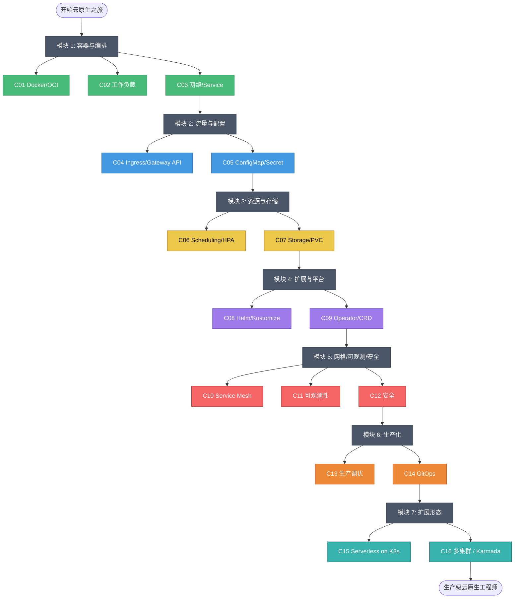

---

## 🟢 模块 1：容器与编排基础（C01-C03）

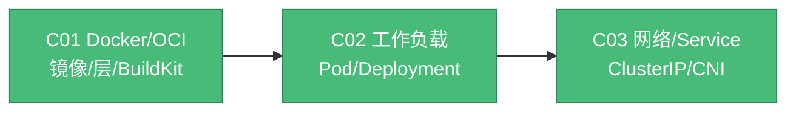

**工作负载选型**：

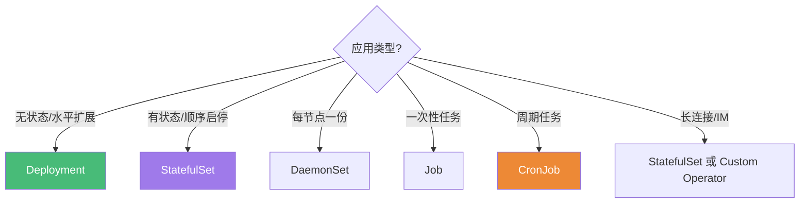

---

## 🔵 模块 2：流量与配置（C04-C05）

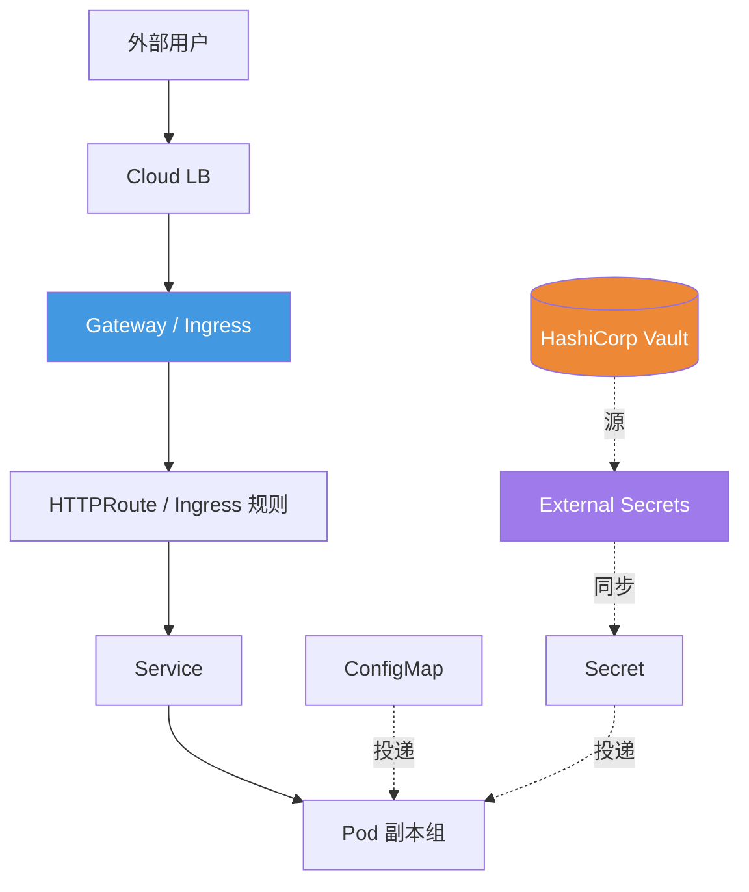

**Ingress vs Gateway API**：

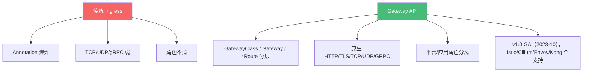

---

## 🟡 模块 3：资源与存储（C06-C07）

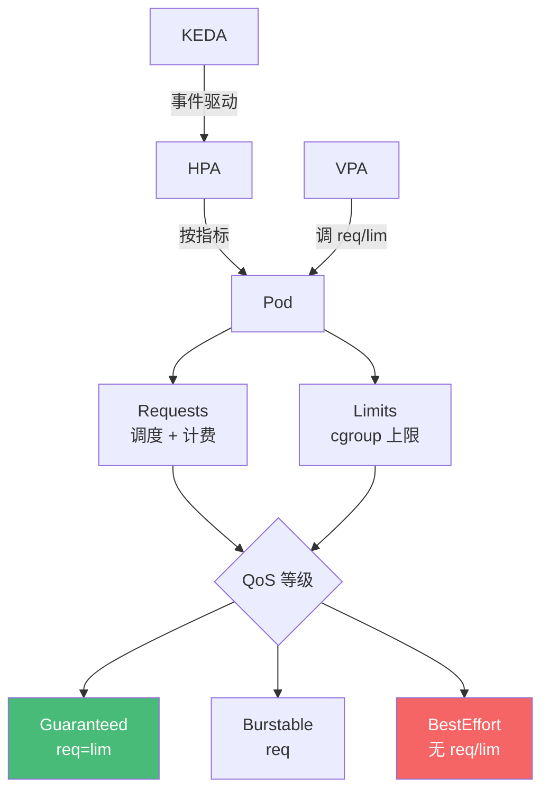

**存储抽象层次**：

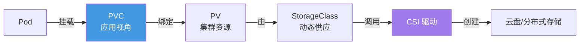

---

## 🔴 模块 4：扩展与平台（C08-C09）

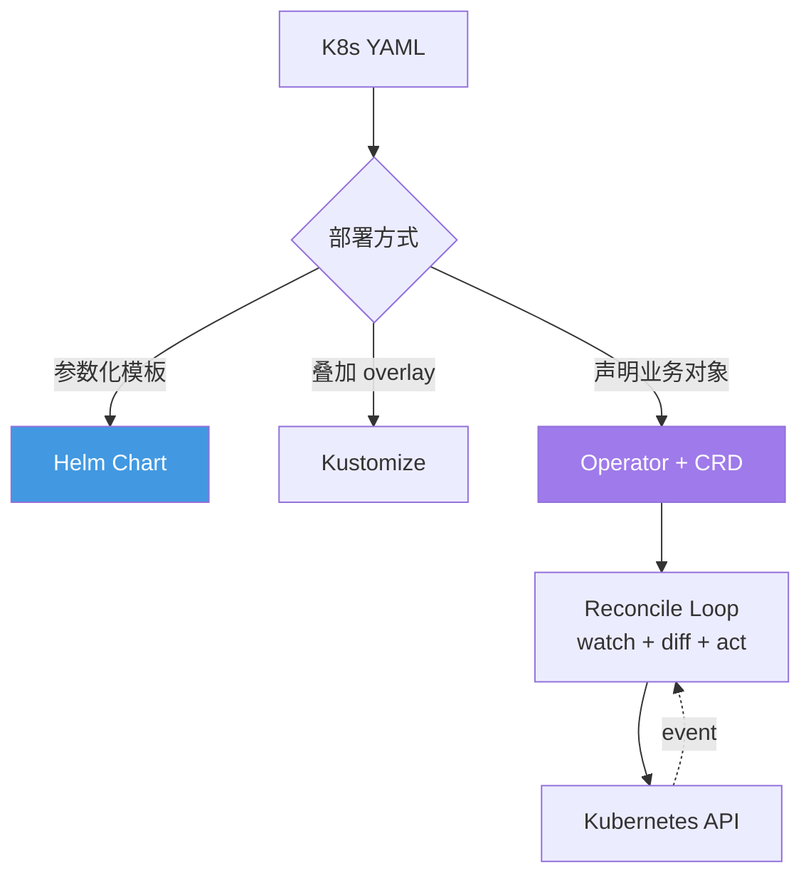

**Helm vs Kustomize**：

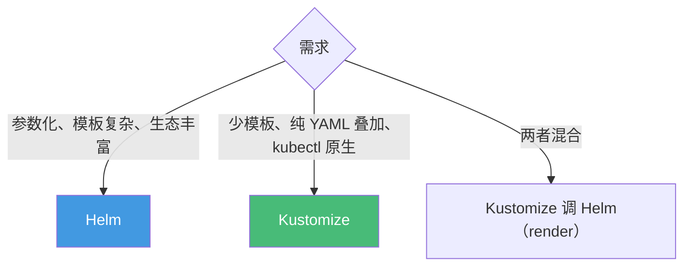

---

## 🟣 模块 5：网格、可观测、安全（C10-C12）

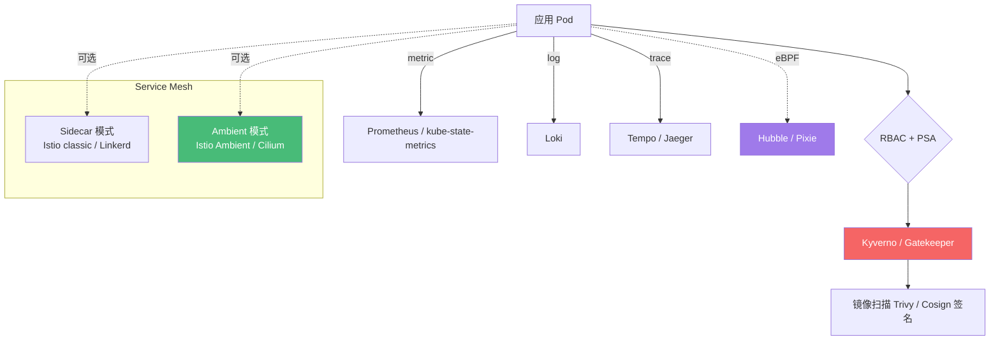

**Service Mesh 演进**：

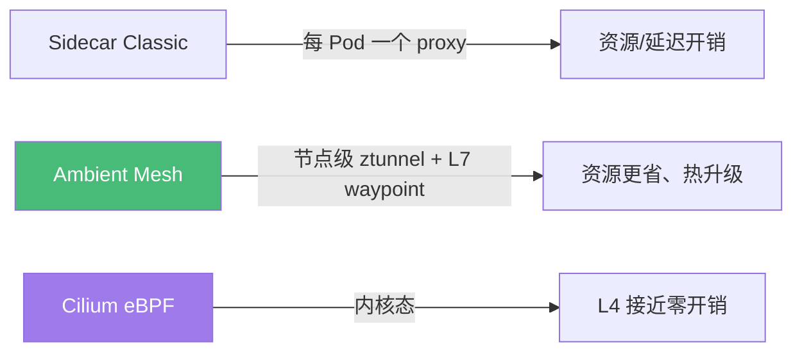

---

## 🟠 模块 6：生产化（C13-C14）

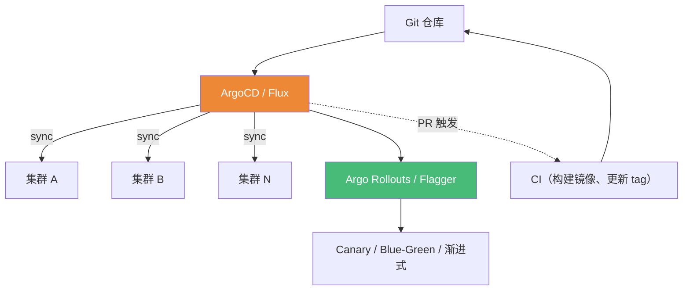

**生产架构总览**：

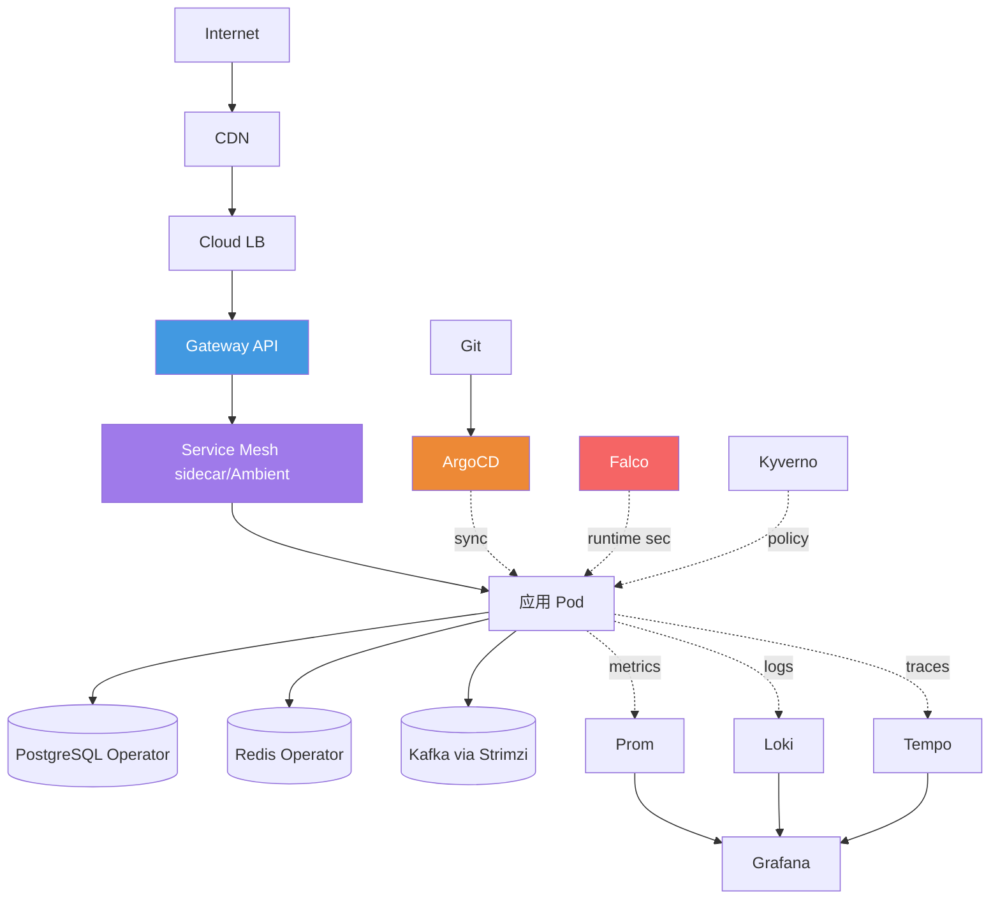

---

## 🎯 学习路径可视化

### 路径 A：完整通学（3-4 个月）

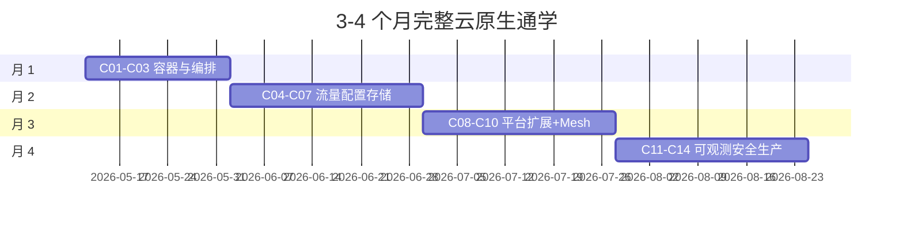

### 路径 B：应用开发者切入

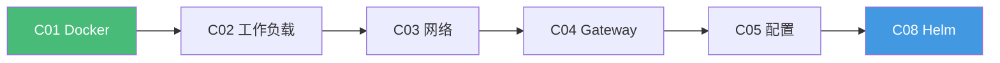

### 路径 C：平台 / SRE 工程师

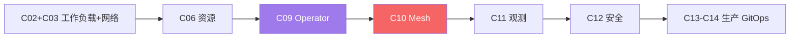

---

## 🧠 云原生核心知识思维导图

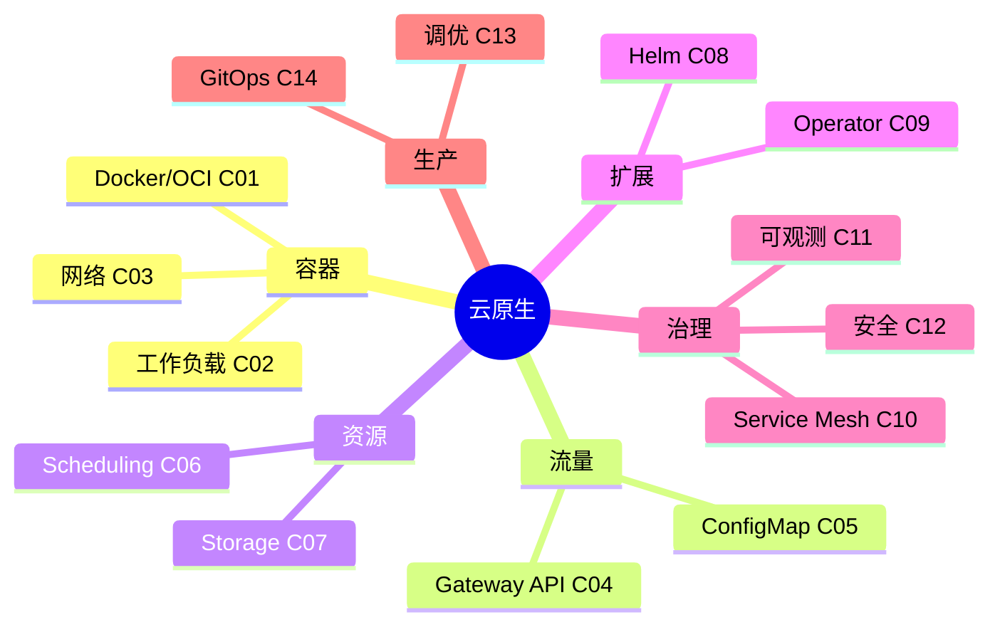

---

## 📊 难度与重要性矩阵

| 课程 | 难度 | 重要性 | 备注 |
|---|---|---|---|
| C01 Docker/OCI | ⭐⭐⭐ | 🔥🔥🔥🔥🔥 | 一切起点 |
| C02 工作负载 | ⭐⭐⭐⭐ | 🔥🔥🔥🔥🔥 | K8s 心智模型 |
| C03 网络/Service | ⭐⭐⭐⭐ | 🔥🔥🔥🔥🔥 | 流量怎么转一定要懂 |
| C04 Gateway API | ⭐⭐⭐⭐ | 🔥🔥🔥🔥 | 2026 新标准 |
| C05 ConfigMap/Secret | ⭐⭐⭐ | 🔥🔥🔥🔥 | 配置不能硬编码 |
| C06 Scheduling | ⭐⭐⭐⭐ | 🔥🔥🔥🔥🔥 | 容量与稳定基础 |
| C07 Storage | ⭐⭐⭐⭐ | 🔥🔥🔥 | 有状态服务必备 |
| C08 Helm/Kustomize | ⭐⭐⭐ | 🔥🔥🔥🔥 | 部署体感 |
| C09 Operator | ⭐⭐⭐⭐⭐ | 🔥🔥🔥🔥 | 自动化天花板 |
| C10 Service Mesh | ⭐⭐⭐⭐⭐ | 🔥🔥🔥🔥 | 大规模微服务必选 |
| C11 可观测性 | ⭐⭐⭐⭐ | 🔥🔥🔥🔥🔥 | 没观测 = 黑盒 |
| C12 安全 | ⭐⭐⭐⭐⭐ | 🔥🔥🔥🔥🔥 | 越早越省事 |
| C13 生产调优 | ⭐⭐⭐⭐ | 🔥🔥🔥🔥 | 规模化必读 |
| C14 GitOps | ⭐⭐⭐⭐ | 🔥🔥🔥🔥🔥 | 现代发布事实标准 |

---

## 🔗 与已有课程的关系

| 云原生章节 | 关联已有课程 |
|---|---|
| C01 Docker | golang/G17 Go Modules（多阶段构建） |
| C02 工作负载 | backend/B19 12-Factor App |
| C03 网络 | backend/B01 互联网、B02 HTTP |
| C04 Gateway API | backend/B25 Web 服务器与反向代理 |
| C09 Operator | golang/G27 net/http、G14 context |
| C10 Service Mesh | backend/B18 微服务、B20 韧性 |
| C11 可观测性 | backend/B24 可观测性 |
| C12 安全 | backend/B22 认证、B23 OWASP |
| C13 生产调优 | golang/G22 pprof（容器内 profiling） |
| C14 GitOps | backend/B19 12-Factor |

---

## 🆕 2026 关键技术演进

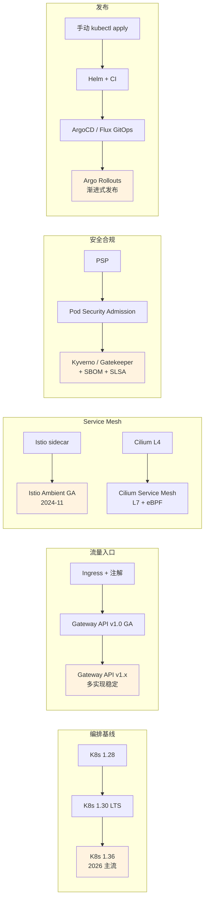
