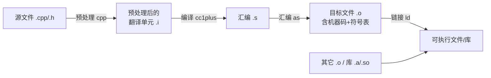
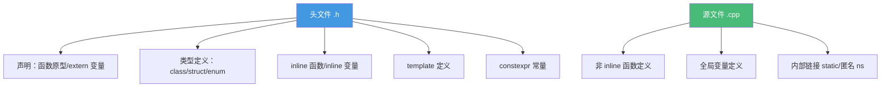

# 精通 C++ 编译模型与构建

> 课程编号：C01
> 路线图来源：现代 C++ 全栈深度课程 — 编译与构建
> 难度：⭐⭐⭐⭐
> 预计阅读时间：55 分钟
> 📅 内容基准：**C++23**（ISO/IEC 14882:2024）+ GCC 14 / Clang 18 / MSVC 19.4x

---

## 引言：链接错误从哪来

```cpp
// math.h
int add(int a, int b);          // 声明

// main.cpp
#include "math.h"
int main() { return add(1, 2); }
```

```
$ g++ main.cpp -o app
/usr/bin/ld: undefined reference to `add(int, int)'    // 为什么？
```

三个问题，能立刻回答吗？

1. 上面报错发生在哪个阶段——编译还是链接？为什么编译能过、链接却失败？
2. 如果把 `int add(int a, int b);` 改成 `int add(int a, int b) { return a + b; }` 放进头文件，被两个 `.cpp` 都 `#include`，会发生什么？
3. C 里 `add` 的符号就叫 `add`，C++ 里它叫什么？为什么 `extern "C"` 能解决 C/C++ 混编？

答案：① 报错在**链接**阶段——`add` 只有声明没有定义，编译每个翻译单元时只要看见声明就行，但链接器找不到 `add` 的实现（机器码）；② 多个翻译单元各自定义 `add`，链接时**重复定义（multiple definition）**报错——这违反 ODR（单一定义规则）；③ C++ 因为重载，符号名经过 **name mangling**（如 `_Z3addii`），而 C 不 mangle，`extern "C"` 让 C++ 按 C 方式产生符号名。

C++ 是**编译型 + 分离编译**语言。不理解"翻译单元 / ODR / 声明与定义 / 链接 / name mangling"，就会在一大类"莫名其妙的链接错误"前束手无策。这一章是整个系列的地基——它决定了你怎么组织头文件、为什么 `inline`/`template` 能放头文件、Modules（C28）解决了什么。

---

## 第一章：编译流水线

一个 `.cpp` 变成可执行文件，经过四个阶段：



### 1.1 预处理（preprocessing）

处理所有 `#` 指令：`#include` 展开（把头文件内容**文本插入**）、`#define` 宏替换、`#if`/`#ifdef` 条件编译、`#pragma`。输出是纯 C++ 代码（无 `#` 指令）的**翻译单元（translation unit）**。

```bash
g++ -E main.cpp -o main.i      # 只做预处理，看展开后的样子
```

⚠️ `#include` 是**纯文本插入**——头文件几千行全被复制进每个包含它的 `.cpp`。这是 C++ 编译慢、以及 Modules（C28）要解决的核心问题。

### 1.2 编译（compilation）

把预处理后的翻译单元做词法/语法/语义分析、模板实例化、优化，生成**汇编代码**。这一步检查语法错误、类型错误、未声明的标识符。

```bash
g++ -S main.cpp -o main.s      # 编译到汇编
```

### 1.3 汇编（assembly）

汇编器把 `.s` 翻译成机器码，产出**目标文件（object file，`.o`/`.obj`）**——含机器码 + **符号表**（这个文件定义了哪些符号、引用了哪些外部符号）。

```bash
g++ -c main.cpp -o main.o      # 编译+汇编，到目标文件（不链接）
nm main.o                      # 看符号表：T=定义，U=未定义引用
```

### 1.4 链接（linking）

链接器把多个 `.o` 和库**拼起来**：解析符号引用（把 `main.o` 里对 `add` 的 `U`ndefined 引用，对应到 `math.o` 里 `add` 的定义）、分配地址、生成最终可执行文件或库。

**引言的链接错误就发生在这里**：`add` 全程只有声明（U），没有任何 `.o` 提供定义（T），链接器报 `undefined reference`。

---

## 第二章：翻译单元与 ODR

### 2.1 翻译单元（Translation Unit, TU）

**一个 `.cpp` + 它递归 `#include` 的所有内容 = 一个翻译单元**。编译器**一次编译一个 TU**，TU 之间互相独立、互不知晓——这就是"分离编译"。每个 TU 编译成一个 `.o`，最后链接。

含义：
- 一个 TU 里的 `static`/匿名命名空间符号，别的 TU 看不见。
- 模板、`inline` 函数要让多个 TU 都能用，必须放头文件（每个 TU 各自实例化/定义）——见 2.3。

### 2.2 ODR——单一定义规则（One Definition Rule）

C++ 最重要的规则之一：

- **声明**可以出现任意多次。
- **定义**：在**单个 TU 内**，一个实体（变量、函数、类、模板）只能定义一次。
- **跨 TU**：非 inline 的函数/变量，在整个程序里只能定义一次；类、inline 函数、模板可以在多个 TU 定义，但**所有定义必须逐字节相同（token 一致）**。

违反 ODR 的后果：链接期 `multiple definition` 报错，或更糟——**未定义行为**（如不同 TU 对同一类有不同定义，链接器随便挑一个，行为诡异且不报错）。

```cpp
// ❌ 违反 ODR：非 inline 函数定义放头文件，被多个 .cpp 包含
// util.h
int square(int x) { return x * x; }    // 定义！
// a.cpp 和 b.cpp 都 #include "util.h" → 链接器：multiple definition of `square'
```

修正：头文件放**声明**，定义放某个 `.cpp`；或给函数加 `inline`（见 2.3）。

### 2.3 为什么 `inline`/`template` 能放头文件

`inline` 和 `template` 是 ODR 的"例外"——它们**允许在多个 TU 出现相同定义**：

```cpp
// util.h
inline int square(int x) { return x * x; }   // ✅ inline：多 TU 定义 OK
template<class T> T max(T a, T b) {            // ✅ template：每个 TU 按需实例化
    return a > b ? a : b;
}
```

`inline` 在现代 C++ 的真正含义**不是"建议内联展开"**，而是"**允许多重定义（ODR 豁免）**"。这就是为什么 header-only 库、模板库能全部放头文件。C++17 还加了 `inline` 变量，让头文件里能定义全局变量。

---

## 第三章：声明 vs 定义

精确区分这两者是理解链接的关键。

| | 声明（declaration） | 定义（definition） |
|---|---|---|
| 作用 | 告诉编译器"有这个东西，类型是 X" | 真正分配存储/给出实现 |
| 函数 | `int f(int);` | `int f(int x) { return x; }` |
| 变量 | `extern int g;` | `int g;` 或 `int g = 5;` |
| 类 | `class C;`（前向声明） | `class C { ... };` |
| 次数 | 任意多次 | 单 TU 内一次（ODR） |

```cpp
extern int counter;     // 声明：counter 在别处定义
int counter = 0;        // 定义：分配存储

void f();               // 声明
void f() { }            // 定义

class Widget;           // 前向声明（incomplete type）：能用指针/引用，不能用大小/成员
class Widget { int x; };// 定义
```

### 3.1 前向声明（forward declaration）

只声明类名而不给完整定义——足以声明指针/引用，但不能创建对象、访问成员（**不完整类型 incomplete type**）。前向声明能打破头文件循环依赖、减少编译依赖：

```cpp
// widget.h
class Gadget;            // 前向声明，不用 #include "gadget.h"
class Widget {
    Gadget* g;          // ✅ 指针只需声明
    // Gadget  value;   // ❌ 需要完整定义（要知道大小）
};
```

---

## 第四章：链接与符号

### 4.1 链接性（linkage）

每个名字有**链接性**，决定它在 TU 之间的可见性：

- **外部链接（external linkage）**：跨 TU 可见。普通全局函数/变量、类成员。
- **内部链接（internal linkage）**：仅本 TU 可见。`static` 全局、匿名命名空间、`const`/`constexpr` 全局（默认内部）。
- **无链接（no linkage）**：局部变量。

```cpp
static int helper() { ... }      // 内部链接：别的 TU 看不见，不会冲突
namespace { int counter; }       // 匿名命名空间：内部链接（现代首选，替代 static）
int global_func() { ... }        // 外部链接：可被别的 TU 引用
```

把"仅本文件用"的函数/变量声明为 `static` 或放匿名命名空间——避免污染全局符号、避免 ODR 冲突。

### 4.2 Name Mangling

C++ 支持**重载**（同名不同参数），所以编译器把函数签名（名字 + 参数类型 + 命名空间 + 类）编码进符号名——**name mangling（名字修饰）**：

```cpp
int add(int, int);       // → _Z3addii  (GCC/Clang)
int add(double, double); // → _Z3adddd
```

```bash
nm app | c++filt         # 把 mangled 符号还原成可读形式
echo "_Z3addii" | c++filt   # → add(int, int)
```

### 4.3 `extern "C"`——C/C++ 混编

C 没有重载，符号名就是函数名（不 mangle）。C++ 调用 C 库、或暴露 C++ 函数给 C，要用 `extern "C"` 关闭 mangling：

```cpp
extern "C" {
    #include "c_library.h"      // C 库头文件，按 C 方式产生符号
}
extern "C" void api_func();      // 这个函数符号就叫 api_func（供 C 调用）
```

这是写动态库 API、与 C 互操作的必备（也和 dlopen、稳定 ABI 相关）。

---

## 第五章：头文件与防重复包含

### 5.1 include guard / `#pragma once`

同一头文件在一个 TU 里被间接 `#include` 多次会导致重复定义。用 include guard 或 `#pragma once` 防护：

```cpp
// 传统 include guard（最可移植）
#ifndef WIDGET_H
#define WIDGET_H
class Widget { ... };
#endif

// 或现代写法（几乎所有编译器支持）
#pragma once
class Widget { ... };
```

### 5.2 头文件该放什么



原则：**头文件放声明 + 必须跨 TU 共享定义的东西（inline/template/类）；`.cpp` 放实现**。减少头文件里的 `#include`（用前向声明），能显著加快编译。

---

## 第六章：构建系统 CMake

手动 `g++` 管几个文件还行，真实项目用构建系统。**CMake** 是事实标准：

```cmake
cmake_minimum_required(VERSION 3.28)
project(MyApp CXX)

set(CMAKE_CXX_STANDARD 23)           # 用 C++23
set(CMAKE_CXX_STANDARD_REQUIRED ON)

add_executable(app main.cpp math.cpp)   # 可执行目标
target_link_libraries(app PRIVATE fmt)  # 链接依赖

add_library(mylib STATIC lib.cpp)       # 静态库（.a）
# add_library(mylib SHARED lib.cpp)     # 动态库（.so/.dll）
```

```bash
cmake -B build -G Ninja        # 配置（生成构建文件）
cmake --build build            # 构建
```

CMake 管理：编译选项、依赖、多平台、库链接、测试。现代 C++ 项目还会配合包管理器（vcpkg / Conan）。CMake 3.28+ 开始支持 C++20 Modules 的构建（C28）。

### 6.1 静态库 vs 动态库

| | 静态库 `.a`/`.lib` | 动态库 `.so`/`.dll` |
|---|---|---|
| 链接时机 | 编译期拷进可执行文件 | 运行期加载 |
| 体积 | 可执行文件大 | 可执行文件小，库单独 |
| 更新 | 要重新链接 | 换库文件即可 |
| ABI | 不敏感 | **敏感**（接口变了要兼容） |

---

## 第七章：编译器与标准

### 7.1 三大编译器

| 编译器 | 平台 | 标准库 |
|---|---|---|
| **GCC**（g++） | Linux 主流 | libstdc++ |
| **Clang**（clang++） | macOS/跨平台 | libc++ / libstdc++ |
| **MSVC**（cl） | Windows | MSVC STL |

### 7.2 指定标准 + 常用选项

```bash
g++ -std=c++23 -Wall -Wextra -O2 main.cpp -o app
```

| 选项 | 作用 |
|---|---|
| `-std=c++23` | 用 C++23（也有 `c++20`/`c++17`） |
| `-Wall -Wextra` | 开启常用警告（**强烈建议**） |
| `-Werror` | 警告当错误 |
| `-O0/-O1/-O2/-O3` | 优化级别（`-O2` 常用） |
| `-g` | 调试信息（配合 gdb/lldb） |
| `-fsanitize=address` | AddressSanitizer 查内存错误（C31） |
| `-fsanitize=undefined` | UBSan 查未定义行为 |

⚠️ **`-Wall -Wextra` 几乎必开**——C++ 很多 bug（未初始化、隐式转换、未使用返回值）编译器能警告，但默认不开。

---

## 第八章：常见陷阱清单

### ❌ 陷阱 1：定义放头文件导致 multiple definition

```cpp
// util.h
int g = 0;                  // ❌ 非 inline 全局变量定义，多 TU 包含即冲突
```
修正：头文件 `inline int g = 0;`（C++17）或 `extern int g;`（定义放 .cpp）。

### ❌ 陷阱 2：忘记 include guard

```cpp
// 头文件无防护，间接多次包含 → 重复定义
```
修正：`#pragma once` 或 include guard。

### ❌ 陷阱 3：声明与定义不一致

```cpp
// a.h:   int f(int);
// a.cpp: long f(int) { ... }   // ❌ 返回类型不同，链接找不到 int f(int)
```
签名必须完全一致。

### ❌ 陷阱 4：链接顺序（GCC 静态库）

```bash
g++ main.o -lmylib    # 若 mylib 用到 main 之后的库，顺序错会 undefined reference
```
GCC 链接库有顺序敏感性（被依赖的放后面）。

### ❌ 陷阱 5：C/C++ 混编忘了 extern "C"

```cpp
// C++ 调 C 函数没包 extern "C" → name mangling 不匹配 → undefined reference
```

### ❌ 陷阱 6：模板定义放 .cpp

```cpp
// tpl.h: template<class T> T f(T);   // 只声明
// tpl.cpp: template<class T> T f(T){...}  // 定义在 .cpp
// main.cpp 用 f<int> → 链接错误（模板要在用的 TU 可见定义）
```
修正：模板定义放头文件（或显式实例化）。

---

## 第九章：练习题

**练习 1**：下面报错在编译期还是链接期？
```cpp
// main.cpp
void foo();
int main() { foo(); }
```

**练习 2**：判断真假——"`inline` 的主要作用是让编译器把函数内联展开。"

**练习 3**：为什么模板函数的定义通常要放在头文件里？

**练习 4**：`static int x;` 放在头文件被两个 `.cpp` 包含，会冲突吗？为什么？

**练习 5**：`extern "C"` 解决什么问题？

---

## 参考答案与解析

**练习 1**：**链接期**。`foo` 有声明，`main` 编译时只需声明就能通过编译；链接时找不到 `foo` 的定义 → `undefined reference to 'foo()'`。

**练习 2**：**假**。`inline` 在现代 C++ 的核心语义是"**允许跨 TU 多重定义（ODR 豁免）**"，使函数能放头文件。"是否真的内联展开"由编译器自行决定（与 `inline` 关键字基本无关）。

**练习 3**：模板是"按需实例化"——编译器在**使用模板的那个 TU** 里，看到具体类型后才生成代码。如果定义在另一个 `.cpp`，使用模板的 TU 看不到定义，无法实例化 → 链接错误。所以模板定义放头文件，让每个用它的 TU 都能实例化。

**练习 4**：**不冲突**。`static` 给变量**内部链接**——每个 TU 各有一份独立的 `x`，互不可见，不会 ODR 冲突。（但每个 TU 一份副本，通常不是你想要的；共享全局用 `inline` 变量或 extern + 单一定义。）

**练习 5**：解决 **C/C++ 混编时的符号名不匹配**。C++ 对函数做 name mangling（编码签名），C 不做。`extern "C"` 让 C++ 按 C 方式生成符号名（不 mangle），使 C++ 能调用 C 库、或暴露函数给 C 调用。

---

## 小结

| 知识点 | 关键记忆 |
|---|---|
| 编译流水线 | 预处理 → 编译 → 汇编 → 链接；`#include` 是文本插入 |
| 翻译单元 | 一个 .cpp + 其 include = 一个 TU；分离编译、互相独立 |
| ODR | 单 TU 内定义一次；跨 TU 非 inline 只一次；违反→链接错误/UB |
| inline/template | ODR 豁免，可放头文件；`inline` ≠ 内联展开，是"允许多定义" |
| 声明 vs 定义 | 声明任意多次；定义受 ODR；前向声明 = 不完整类型 |
| 链接性 | external（跨TU）/ internal（static/匿名ns）/ no |
| name mangling | C++ 编码签名；`extern "C"` 关闭它做 C 混编 |
| 头文件 | 放声明 + inline/template/类；`#pragma once` 防重复 |
| 构建 | CMake + `-std=c++23 -Wall -Wextra`；静态库 vs 动态库 |

---

## 📅 2026 现状/更新

- **C++23**（ISO/IEC 14882:2024）是当前标准；**C++26** 正在制定（反射、契约、`std::execution` 等是热点）。GCC 14 / Clang 18 / MSVC 19.4x 对 C++23 支持已较完整。
- **Modules（C++20，C28）** 旨在取代 `#include` 的文本插入模型，大幅加快编译、消除宏污染；CMake 3.28+ 与三大编译器的 Modules 工具链在 2026 趋于可用，但生态迁移仍在进行。
- 构建生态：CMake 仍是事实标准，配合 **vcpkg / Conan** 包管理；**Ninja** 是主流构建后端。

---

> 🔁 下一篇 **C02 — 精通 C++ 类型系统与 auto**：值/引用/指针、`const`/`volatile`、`auto`/`decltype` 类型推导规则、CTAD（类模板实参推导）、以及类型转换的四种 cast。
>
> 反馈：C++ 的一切从"编译模型"开始——把 ODR、声明 vs 定义、链接性这三件事彻底搞清，后面模板、inline、Modules 都会顺理成章。
