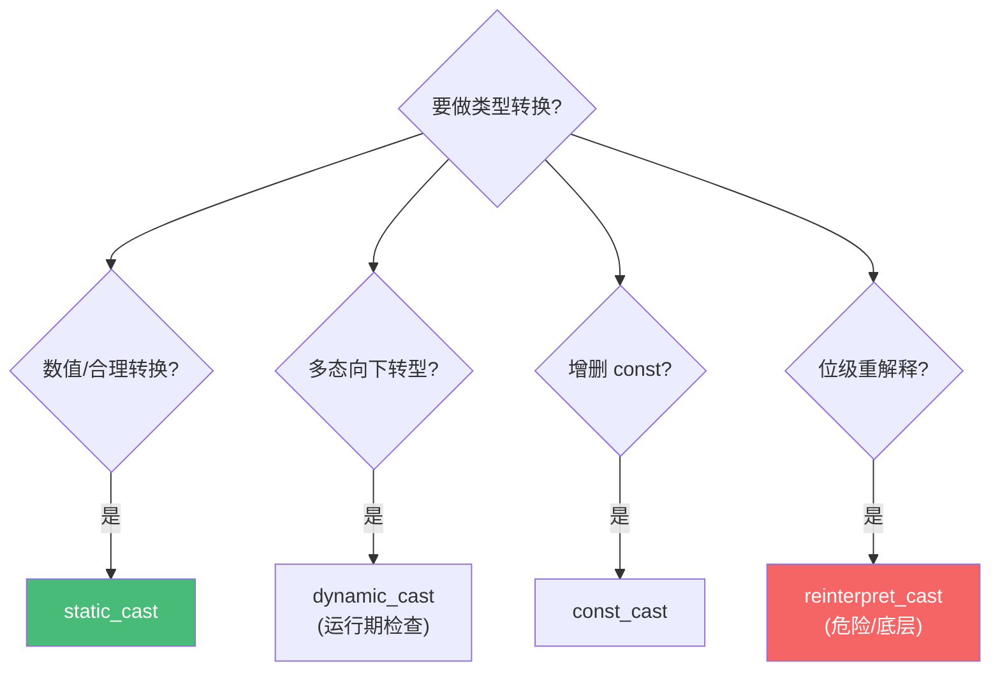

# 精通 C++ 类型系统与 auto

> 课程编号：C02
> 路线图来源：现代 C++ 全栈深度课程 — 类型系统
> 难度：⭐⭐⭐⭐
> 预计阅读时间：55 分钟
> 📅 内容基准：**C++23** + GCC 14 / Clang 18 / MSVC 19.4x

---

## 引言：auto 到底推出了什么类型

```cpp
#include <vector>
int main() {
    int x = 42;
    const int& rx = x;

    auto a = rx;            // a 的类型是？const int& 还是 int？
    auto& b = rx;           // b 的类型是？
    const auto& c = x;      // c 的类型是？

    std::vector<int> v{1, 2, 3};
    for (auto e : v) e++;   // v 里的元素被改了吗？
    for (auto& e : v) e++;  // 这次呢？

    auto&& d = 42;          // d 是什么引用？
}
```

答案：① `auto a = rx` 推出 **`int`**——`auto` 值推导会**丢弃顶层 const 和引用**，所以 a 是 int 的拷贝；② `auto& b` 是 **`const int&`**（保留 const）；③ `const auto& c` 是 `const int&`；④ `auto e` 是拷贝，`e++` 改的是副本，v 不变；`auto& e` 是引用，v 被改成 `{2,3,4}`；⑤ `auto&& d` 是**右值引用 `int&&`**（转发引用规则，C04 详解）。

C++ 的类型系统是它最强大也最容易出错的部分。`auto`/`decltype` 的推导规则、`const` 的位置、引用与指针的语义——搞不清就会写出"以为是引用其实是拷贝"的性能 bug 或正确性 bug。这一章把类型推导讲透，为模板（C11）、移动语义（C03）打基础。

---

## 第一章：值、引用、指针

### 1.1 三种"间接"

```cpp
int x = 10;
int  v = x;     // 值（value）：拷贝，v 和 x 独立
int& r = x;     // 引用（reference）：x 的别名，r 就是 x
int* p = &x;    // 指针（pointer）：存 x 的地址
```

| | 值 | 引用 | 指针 |
|---|---|---|---|
| 语义 | 独立拷贝 | 别名 | 地址 |
| 可空 | — | **不可为空** | 可为 nullptr |
| 可重绑 | — | **不可**（绑定后不变） | 可改指向 |
| 需解引用 | 否 | 否（透明） | 是（`*p`） |

引用是"绑定后不可改的别名"——一旦 `int& r = x`，r 永远是 x 的别名，`r = y` 是把 y 的值赋给 x，不是让 r 改指向 y。

### 1.2 引用必须初始化

```cpp
int& r;          // ❌ 编译错误：引用必须初始化
int& r = x;      // ✅
```

---

## 第二章：const 与 constexpr

### 2.1 const 的位置——从右往左读

```cpp
const int  a = 1;       // a 是 const int
int const  b = 1;       // 同上（const 在 int 左右等价）

const int* p;           // p 指向 const int（不能改 *p，能改 p）
int* const q = &x;      // q 是 const 指针（不能改 q，能改 *q）
const int* const r = &x;// 都 const

const int& cr = x;      // 常量引用：不能通过 cr 改 x
```

口诀：**从右往左读**。`int* const q` → "q is a const pointer to int"；`const int* p` → "p is a pointer to const int"。`*` 左边的 const 修饰被指对象，`*` 右边的 const 修饰指针本身。

### 2.2 const 引用能延长临时量生命周期

```cpp
const int& r = 42;          // ✅ const 引用可绑定右值/临时量，生命周期延长到 r
// int& r = 42;             // ❌ 非 const 左值引用不能绑右值
std::string s = "hi";
const std::string& cs = s + "!";   // 临时量生命周期延长到 cs
```

这是函数参数用 `const T&` 的基础——能接受左值、右值、临时量，且不拷贝。

### 2.3 constexpr——编译期常量

`const` 表示"运行期只读"，`constexpr` 表示"**编译期可求值**"（更强）：

```cpp
const int n = get_runtime_value();    // 运行期初始化的只读
constexpr int m = 10 * 10;            // 编译期常量，可用作数组大小、模板参数
int arr[m];                            // ✅ m 是编译期常量
constexpr int factorial(int n) {       // constexpr 函数（C27 详解）
    return n <= 1 ? 1 : n * factorial(n - 1);
}
constexpr int f5 = factorial(5);       // 编译期算出 120
```

C++23 还有 `consteval`（必须编译期）、`constinit`（保证静态初始化）——见 C27。

---

## 第三章：auto 类型推导

`auto` 用模板实参推导的规则。核心三条：

### 3.1 规则一：`auto x = expr` 丢弃引用和顶层 const

```cpp
const int  ci = 1;
const int& cr = ci;
auto a = ci;     // int（丢弃 const）
auto b = cr;     // int（丢弃引用和 const）
auto c = &ci;    // const int*（底层 const 保留！丢的是顶层）
```

`auto`（值形式）拷贝一份，所以**顶层 const 和引用被丢弃**（拷贝当然可以改、不是别名）。但**底层 const 保留**（指向 const 的指针，指向的还是 const）。

### 3.2 规则二：`auto&` 保留 const，是引用

```cpp
const int ci = 1;
auto& r = ci;    // const int&（保留 const，是引用）
// r = 2;        // ❌ r 是 const int&
auto& r2 = 42;   // ❌ 非 const 引用不能绑右值
```

### 3.3 规则三：`auto&&` 是转发引用

```cpp
auto&& a = 42;   // int&&（绑右值 → 右值引用）
int x = 1;
auto&& b = x;    // int&（绑左值 → 左值引用，引用折叠）
```

`auto&&` 不是"右值引用"，而是**转发引用（forwarding reference）**——绑左值就是左值引用，绑右值就是右值引用（C04 详解引用折叠）。

### 3.4 范围 for 的 auto 选择

```cpp
std::vector<std::string> v{"a", "b"};
for (auto s : v)        { }   // 每个元素拷贝（string 拷贝有开销！）
for (auto& s : v)       { }   // 引用，可修改
for (const auto& s : v) { }   // const 引用，只读不拷贝（遍历的首选）
for (auto&& s : v)      { }   // 转发引用（泛型代码用，能完美转发）
```

**经验法则**：只读遍历用 `const auto&`（不拷贝）；要改用 `auto&`；泛型/转发用 `auto&&`。无脑 `auto` 会悄悄拷贝大对象。

---

## 第四章：decltype

`decltype(expr)` 推导表达式的**精确类型**（保留引用和 const，与 auto 不同）：

```cpp
int x = 0;
const int& cr = x;

decltype(x)  a;      // int
decltype(cr) b = x;  // const int&（保留引用和 const！）
decltype((x)) c = x; // int&（注意：带括号的 (x) 是左值表达式 → 引用！）
```

⚠️ `decltype(x)` 和 `decltype((x))` 不同：`x` 是名字 → 变量类型 `int`；`(x)` 是左值表达式 → 加引用 `int&`。这是经典陷阱。

### 4.1 `decltype(auto)`

完美保留推导类型（用于返回类型转发，C04）：

```cpp
int x = 1;
int& getRef() { return x; }
auto           a = getRef();   // int（auto 丢引用）
decltype(auto) b = getRef();   // int&（保留引用！）

// 完美转发返回值
template<class F, class... Args>
decltype(auto) call(F f, Args&&... args) {
    return f(std::forward<Args>(args)...);   // 精确保留 f 的返回类型
}
```

---

## 第五章：CTAD——类模板实参推导（C++17）

C++17 起，构造对象时类模板参数能自动推导，不用显式写：

```cpp
std::pair p(1, 2.0);                // 推出 std::pair<int, double>（不用 <int,double>）
std::vector v{1, 2, 3};             // std::vector<int>
std::lock_guard lk(mtx);           // std::lock_guard<std::mutex>
std::array a{1, 2, 3};             // std::array<int, 3>

// 自定义推导指引（deduction guide）
template<class T> struct Box { T value; };
Box(const char*) -> Box<std::string>;   // 让 Box("hi") 推成 Box<std::string>
Box b("hi");
```

CTAD 让模板类用起来像普通类，减少冗余的类型标注。

---

## 第六章：类型转换——四种 cast

C 风格 `(int)x` 危险（隐藏意图、可能做危险转换）。C++ 用四种明确的 cast：

### 6.1 `static_cast`——编译期检查的常规转换

```cpp
double d = 3.9;
int i = static_cast<int>(d);        // 3（数值转换）
Base* b = static_cast<Derived*>(d); // 向下转型（无运行期检查，要确保安全）
void* p = ...; int* ip = static_cast<int*>(p);  // void* 还原
```

最常用，做"合理的、编译期可验证"的转换。

### 6.2 `dynamic_cast`——带运行期检查的多态向下转型

```cpp
Base* b = get();
if (Derived* d = dynamic_cast<Derived*>(b)) {   // 失败返回 nullptr（指针）
    d->derivedMethod();
}
Derived& dr = dynamic_cast<Derived&>(*b);       // 失败抛 std::bad_cast（引用）
```

用 RTTI 在运行期检查类型，安全但有开销，要求多态类型（有虚函数）。C08 详解。

### 6.3 `const_cast`——增删 const

```cpp
const int ci = 1;
int& mutable_ref = const_cast<int&>(ci);   // 去掉 const
```

⚠️ 通过 `const_cast` 修改**真正 const 的对象**是未定义行为。主要用于和不规范的旧 API 接口（API 该用 const 却没用）。

### 6.4 `reinterpret_cast`——位级重解释

```cpp
int x = 0x41424344;
char* bytes = reinterpret_cast<char*>(&x);   // 按字节看
std::uintptr_t addr = reinterpret_cast<std::uintptr_t>(&x);  // 指针↔整数
```

最危险——直接重解释二进制，几乎总是平台相关/UB 边缘。仅用于底层（序列化、硬件、指针↔整数）。



---

## 第七章：常见陷阱清单

### ❌ 陷阱 1：`auto` 悄悄拷贝大对象

```cpp
for (auto s : big_string_vector) { }   // 每次拷贝 string！
```
修正：`const auto&`。

### ❌ 陷阱 2：以为 `auto` 保留 const/引用

```cpp
const int& cr = x;
auto a = cr;       // int，不是 const int&！可以改、是拷贝
```
要保留用 `auto&` / `decltype(auto)`。

### ❌ 陷阱 3：`decltype((x))` 多括号变引用

```cpp
decltype(x)   a;   // int
decltype((x)) b;   // int&（陷阱）
```

### ❌ 陷阱 4：const 位置读错

```cpp
const int* p;     // 指向 const 的指针（能改 p，不能改 *p）
int* const q;     // const 指针（能改 *q，不能改 q）
```
从右往左读。

### ❌ 陷阱 5：用 C 风格 cast

```cpp
int* p = (int*)some_ptr;   // 隐藏了是 static 还是 reinterpret，危险
```
用明确的 C++ cast。

### ❌ 陷阱 6：悬空引用

```cpp
const std::string& bad() {
    std::string s = "tmp";
    return s;       // ❌ 返回局部变量的引用，s 已析构 → 悬空
}
```

---

## 第八章：练习题

**练习 1**：各推出什么类型？
```cpp
const int ci = 1; const int& cr = ci;
auto a = cr;
auto& b = cr;
decltype(cr) c = ci;
```

**练习 2**：`int* const p` 和 `const int* p` 区别？

**练习 3**：下面遍历有什么性能问题？
```cpp
std::vector<std::string> names = {...};
for (auto name : names) print(name);
```

**练习 4**：哪种 cast 用于多态向下转型且需要运行期安全检查？

**练习 5**：`constexpr` 和 `const` 的区别？

---

## 参考答案与解析

**练习 1**：`a` 是 `int`（auto 丢引用和 const）；`b` 是 `const int&`（auto& 保留）；`c` 是 `const int&`（decltype 精确保留）。

**练习 2**：`int* const p` 是 **const 指针**——指向不可变（不能改 p 的指向），但能改 `*p`；`const int* p` 是**指向 const 的指针**——能改 p 指向别处，但不能通过 p 改值。

**练习 3**：`auto name` 每次迭代**拷贝一个 string**（堆分配 + 拷贝字符）。只读遍历应该用 `const auto& name`，零拷贝。

**练习 4**：`dynamic_cast`——用 RTTI 在运行期检查，失败返回 nullptr（指针）或抛 bad_cast（引用）。要求类型多态（有虚函数）。

**练习 5**：`const` 是"运行期只读"（值可以是运行期算出的）；`constexpr` 是"**编译期可求值**"（更强，能用作数组大小、模板参数、编译期计算）。所有 `constexpr` 都隐含 const，反之不然。

---

## 小结

| 知识点 | 关键记忆 |
|---|---|
| 值/引用/指针 | 引用是别名、不可空不可重绑、必须初始化 |
| const 位置 | 从右往左读；`*` 左修饰被指对象，右修饰指针 |
| const 引用 | 可绑右值/临时量并延长其生命周期 |
| constexpr | 编译期可求值（强于 const） |
| auto 值 | **丢弃顶层 const 和引用**；底层 const 保留 |
| auto& / auto&& | & 保留 const 是引用；&& 是转发引用 |
| 范围 for | 只读用 `const auto&`（不拷贝） |
| decltype | 精确保留类型；`(x)` 多括号 → 引用 |
| CTAD | C++17 类模板实参自动推导 |
| 四种 cast | static（常规）/ dynamic（多态检查）/ const（增删const）/ reinterpret（位级危险） |

---

## 📅 2026 现状/更新

- C++23 的 `auto(x)`（decay-copy，显式产生衰减拷贝）让"强制拷贝一份"更清晰。
- CTAD 自 C++17 持续完善（C++20 给聚合类型加了 CTAD）；现代代码大量依赖它简化模板类使用。
- C++26 方向：反射（reflection）将让"类型即数据"，可能改变类型操作范式——但 2026 尚未标准化。
- 工具：`-Wconversion` 帮你发现隐式窄化转换；clang-tidy 的 `cppcoreguidelines` 检查危险 cast。

---

> 🔁 下一篇 **C03 — 精通 C++ 值类别与移动语义**：lvalue/rvalue/xvalue 三大值类别、移动构造与移动赋值、`std::move` 的真相（它不移动任何东西）、以及移动如何避免昂贵的深拷贝。
>
> 反馈：`auto` 的"丢引用丢顶层 const"规则务必背熟——它是 C++ 性能 bug 的高发区。
