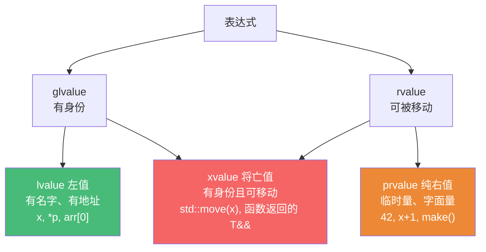

# 精通 C++ 值类别与移动语义

> 课程编号：C03
> 路线图来源：现代 C++ 全栈深度课程 — 移动语义
> 难度：⭐⭐⭐⭐⭐
> 预计阅读时间：60 分钟
> 📅 内容基准：**C++23** + GCC 14 / Clang 18 / MSVC 19.4x

---

## 引言：std::move 移动了什么？

```cpp
#include <string>
#include <vector>

std::string make() {
    std::string s = "a very long string that allocates heap memory...";
    return s;                    // 这里发生拷贝还是移动？
}

void demo() {
    std::vector<std::string> v;
    std::string s = "hello";
    v.push_back(s);              // 1) 拷贝还是移动？
    v.push_back(std::move(s));   // 2) 这之后 s 还能用吗？是什么值？
    std::string s2 = std::move(s); // 3) std::move 真的"移动"了吗？
}
```

答案：① `return s` 通常**移动**（甚至直接省略，NRVO，见 C31）；② `push_back(s)` **拷贝**（s 是左值），`push_back(std::move(s))` **移动**（把 s 的堆内存"偷"给 vector）；③ 移动后 s 处于"**有效但未指定**"状态——还能用（如赋新值），但内容不确定（通常是空）；④ **`std::move` 本身不移动任何东西**——它只是一个 `static_cast` 到右值引用，真正的移动发生在移动构造/赋值里。

移动语义（C++11 引入）是现代 C++ 性能的基石——它让"返回大对象""容器扩容""传递所有权"避免昂贵的深拷贝。但要用对，必须理解**值类别（value category）**和**右值引用**。这一章是 C++ 性能的关键一课，也是 C04（完美转发）、C05（智能指针）的基础。

---

## 第一章：值类别

C++ 每个表达式有一个**值类别**。C++11 起分五类，核心理解三个：



实用的二分法：

- **lvalue（左值）**：有名字、能取地址、持久存在。`x`、`arr[i]`、`*ptr`、返回左值引用的函数。
- **rvalue（右值）**：临时的、即将销毁、可以"偷"其资源。又分：
  - **prvalue（纯右值）**：字面量 `42`、表达式 `x+1`、返回值的函数 `make()`。
  - **xvalue（将亡值）**：`std::move(x)`、返回 `T&&` 的函数——有身份但被标记为"可移动"。

**判断口诀**：能取地址、能放在赋值号左边的是左值；临时的、字面量、`std::move` 的结果是右值。

```cpp
int x = 10;
x;              // lvalue（有名字）
42;             // prvalue（字面量）
x + 1;          // prvalue（临时结果）
std::move(x);   // xvalue（被标记可移动）
std::string{};  // prvalue（临时对象）
```

---

## 第二章：左值引用 vs 右值引用

### 2.1 两种引用

```cpp
int x = 10;
int&  lr = x;            // 左值引用：绑左值
int&& rr = 42;           // 右值引用：绑右值（临时量、std::move 的结果）
// int&& bad = x;        // ❌ 右值引用不能绑左值
int&& rr2 = std::move(x);// ✅ std::move(x) 是 xvalue（右值）

const int& clr = 42;     // const 左值引用：可绑右值（历史特例）
```

| | 左值引用 `T&` | 右值引用 `T&&` |
|---|---|---|
| 绑定 | 左值 | 右值（临时/将亡） |
| 含义 | 别名 | "这个资源可以被偷" |
| 用途 | 避免拷贝、修改实参 | 移动语义、完美转发 |

### 2.2 右值引用本身是左值！

一个反直觉但关键的点：**具名的右值引用变量，本身是左值**：

```cpp
void f(std::string&& s) {       // s 是右值引用
    // 在函数体内，s 有名字 → s 是 lvalue！
    g(s);                        // 调用拷贝版本（s 是左值）
    g(std::move(s));             // 调用移动版本（重新标记为右值）
}
```

"有名字的东西是左值"——即使类型是 `T&&`。所以在转发时需要再次 `std::move`/`std::forward`（C04）。

---

## 第三章：移动构造与移动赋值

### 3.1 拷贝 vs 移动

考虑一个管理堆内存的类：

```cpp
class Buffer {
    char* data_;
    size_t size_;
public:
    // 拷贝构造：深拷贝（分配新内存 + 复制内容）—— 昂贵
    Buffer(const Buffer& o) : size_(o.size_) {
        data_ = new char[size_];
        std::memcpy(data_, o.data_, size_);
    }

    // 移动构造：偷取资源（O(1)，不分配不复制）—— 廉价
    Buffer(Buffer&& o) noexcept : data_(o.data_), size_(o.size_) {
        o.data_ = nullptr;       // 把源置空，防止双重释放
        o.size_ = 0;
    }

    ~Buffer() { delete[] data_; }
};
```

移动的本质：**把源对象的资源指针"偷"过来，再把源置空**——O(1)，不分配、不复制。这就是为什么移动比拷贝快得多（对管理堆资源的对象）。

### 3.2 移动赋值

```cpp
Buffer& operator=(Buffer&& o) noexcept {
    if (this != &o) {            // 防自赋值
        delete[] data_;          // 释放自己的资源
        data_ = o.data_;         // 偷
        size_ = o.size_;
        o.data_ = nullptr;       // 源置空
        o.size_ = 0;
    }
    return *this;
}
```

### 3.3 移动后的状态

被移动的对象处于**"有效但未指定（valid but unspecified）"** 状态：

```cpp
std::string s = "hello";
std::string s2 = std::move(s);
// s 现在有效但内容未指定（标准库实现通常是空）
// 能做：s = "new";  s.clear();  s.size();  （任何不依赖具体值的操作）
// 不该做：依赖 s 的旧内容
```

---

## 第四章：std::move 的真相

### 4.1 它只是一个 cast

```cpp
// std::move 的实现（简化）
template<class T>
constexpr std::remove_reference_t<T>&& move(T&& t) noexcept {
    return static_cast<std::remove_reference_t<T>&&>(t);
}
```

**`std::move` 不移动任何东西**——它只是把实参 `static_cast` 成右值引用（xvalue），从而**让重载决议选中移动构造/赋值**。真正的移动发生在那些移动函数里。

```cpp
std::string s = "hi";
std::string s2 = std::move(s);   // std::move(s) 标记 s 为右值 → 选中移动构造
// 如果 string 没有移动构造，std::move 后还是拷贝！
```

理解这点的实益：`std::move` 一个 const 对象是**无效**的（移动构造要非 const 才能"偷"），会悄悄退化成拷贝：

```cpp
const std::string cs = "hi";
std::string s = std::move(cs);   // 退化成拷贝！（const 不能被偷）
```

### 4.2 什么时候用 std::move

- 把局部变量"转移"给另一个对象（之后不再用它）：`return std::move(member)`（但返回局部变量别 move，见陷阱）。
- 把参数转移进容器：`v.push_back(std::move(x))`。
- 转移所有权：`p2 = std::move(unique_ptr)`。

---

## 第五章：移动语义带来的收益

### 5.1 返回大对象不再昂贵

```cpp
std::vector<int> make_big() {
    std::vector<int> v(1000000);
    // ...
    return v;                    // 移动（或 NRVO 直接省略），不深拷贝百万元素
}
auto data = make_big();          // 廉价
```

### 5.2 容器扩容

```cpp
std::vector<std::string> v;
v.push_back("...");              // vector 扩容时，旧元素被移动到新内存（而非拷贝）
```

⚠️ **但有个关键条件**：vector 扩容时，只有当元素的移动构造是 `noexcept` 才会用移动（否则用拷贝，为了异常安全保证）。所以**移动构造一定要标 `noexcept`**（见 5.3）。

### 5.3 移动构造必须 noexcept

```cpp
Buffer(Buffer&& o) noexcept { ... }   // ✅ noexcept，vector 才会用移动
```

如果移动构造可能抛异常，标准容器在"强异常保证"的操作（如 vector 扩容）里会**退回用拷贝**——你的移动优化失效。这是性能关键点：**移动构造/赋值几乎总应 `noexcept`**。

---

## 第六章：五法则与移动

如果一个类管理资源，定义了析构/拷贝，通常也要定义移动（C06 详解"五法则"）：

```cpp
class Resource {
public:
    ~Resource();                              // 析构
    Resource(const Resource&);                // 拷贝构造
    Resource& operator=(const Resource&);     // 拷贝赋值
    Resource(Resource&&) noexcept;            // 移动构造
    Resource& operator=(Resource&&) noexcept; // 移动赋值
};
```

**更好的做法（零法则）**：用 RAII 类型（`std::vector`、`std::string`、`std::unique_ptr`，C05）管理资源，让编译器自动生成正确的移动/拷贝，自己一个特殊函数都不写。

---

## 第七章：常见陷阱清单

### ❌ 陷阱 1：以为 std::move 会移动

```cpp
const std::string cs = "hi";
auto s = std::move(cs);   // 退化成拷贝（const 不能被偷）！
```

### ❌ 陷阱 2：move 后还用源对象的值

```cpp
std::string s = "hi";
auto s2 = std::move(s);
std::cout << s;           // s 内容未指定（依赖旧值是 bug）
```
move 后只能赋新值或析构。

### ❌ 陷阱 3：返回局部变量时多此一举 std::move

```cpp
std::string f() {
    std::string s = "...";
    return std::move(s);  // ❌ 阻止 NRVO！直接 return s 更好（C31）
}
```
返回局部变量直接 `return s`，编译器会用 NRVO（拷贝消除）或移动。`std::move` 反而禁用 NRVO。

### ❌ 陷阱 4：移动构造没标 noexcept

```cpp
Buffer(Buffer&& o) { ... }   // 没 noexcept → vector 扩容退回拷贝，移动优化失效
```

### ❌ 陷阱 5：具名右值引用当右值用

```cpp
void f(std::string&& s) {
    other(s);              // s 有名字是左值 → 调拷贝！要 other(std::move(s))
}
```

### ❌ 陷阱 6：移动后忘记置空源（自定义移动）

```cpp
Buffer(Buffer&& o) : data_(o.data_) { }   // 忘了 o.data_ = nullptr → 双重 free！
```

---

## 第八章：练习题

**练习 1**：判断左值还是右值：`x`、`42`、`x+1`、`std::move(x)`、`std::string{}`。

**练习 2**：`std::move` 到底做了什么？为什么对 const 对象无效？

**练习 3**：为什么移动构造要标 `noexcept`？

**练习 4**：找 bug：
```cpp
class S {
    int* p;
public:
    S(S&& o) : p(o.p) {}   // 移动构造
    ~S() { delete p; }
};
```

**练习 5**：下面哪个更好？为什么？
```cpp
// A
std::string f() { std::string s = "x"; return std::move(s); }
// B
std::string f() { std::string s = "x"; return s; }
```

---

## 参考答案与解析

**练习 1**：`x` 左值；`42` 右值（prvalue）；`x+1` 右值（prvalue）；`std::move(x)` 右值（xvalue）；`std::string{}` 右值（prvalue，临时对象）。

**练习 2**：`std::move(x)` 只是 `static_cast<T&&>(x)`——把 x 标记为右值（xvalue），使重载决议选中移动构造/赋值。它本身不移动数据。对 const 对象：移动需要"偷"源的资源（修改源、置空），const 不可修改，所以移动构造（参数 `T&&` 非 const）匹配不上，退化到拷贝构造（`const T&`）。

**练习 3**：标准容器（如 vector）在需要"强异常保证"的操作（扩容）里，只有当元素移动构造 `noexcept` 时才用移动，否则退回拷贝（保证异常安全）。不标 noexcept → 移动优化失效，扩容仍深拷贝。

**练习 4**：移动构造**没有把源 `o.p` 置空**。`o` 析构时 `delete o.p`，`*this` 析构时又 `delete p`（同一指针）→ **双重释放**。修正：`S(S&& o) : p(o.p) { o.p = nullptr; }`。

**练习 5**：**B 更好**。`return s`（局部变量）触发 NRVO（命名返回值优化，C31）——直接在返回位置构造，零拷贝零移动。`return std::move(s)`（A）反而**禁用 NRVO**（因为返回的是右值引用表达式而非具名局部变量），最多得到移动，不如 NRVO 的"完全省略"。

---

## 小结

| 知识点 | 关键记忆 |
|---|---|
| 值类别 | lvalue（有名/有地址）/ rvalue（临时/可偷）；xvalue=std::move 结果 |
| 右值引用 | `T&&` 绑右值；**具名右值引用本身是左值** |
| 移动构造 | 偷资源指针 + 源置空，O(1)；vs 拷贝深复制 |
| std::move | 只是 `static_cast<T&&>`，**不移动**；对 const 退化成拷贝 |
| 移动后状态 | 有效但未指定，只能赋新值/析构 |
| noexcept | 移动构造**务必 noexcept**，否则容器扩容退回拷贝 |
| 返回值 | 返回局部变量直接 `return s`（NRVO），别 `std::move` |
| 零法则 | 优先用 RAII 类型，让编译器自动生成移动 |

---

## 📅 2026 现状/更新

- 移动语义自 C++11 是性能基石；C++17 的**保证拷贝消除（guaranteed copy elision）**让 prvalue 返回零拷贝（C31）。
- C++23 的 `std::move_only_function`、各种"只移动"类型（如 `unique_ptr`、协程句柄）让所有权语义更明确。
- 编译器对 NRVO 的支持已很成熟；`-Wpessimizing-move`（多余的 std::move）、`-Wredundant-move` 帮你发现误用。
- 核心准则：**资源管理类标 noexcept 移动 + 遵循零/五法则**；日常优先零法则（用标准 RAII 类型）。

---

> 🔁 下一篇 **C04 — 精通 C++ 完美转发与引用折叠**：转发引用（`T&&` 在模板里的特殊含义）、引用折叠规则、`std::forward` 如何保持值类别、以及为什么万能引用能同时接受左值和右值。
>
> 反馈：把"std::move 只是 cast、具名右值引用是左值"这两条钉死——它们是移动语义所有困惑的根源。
