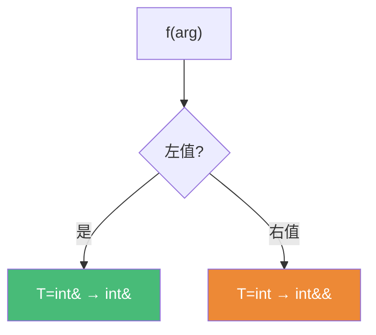

# 精通 C++ 完美转发与引用折叠

> 课程编号：C04 ｜ 难度：⭐⭐⭐⭐⭐ ｜ 📅 内容基准：C++23 + GCC 14 / Clang 18 / MSVC

## 引言：同一个 T&& 为什么行为不同

```cpp
void process(int& x){}    // 左值版
void process(int&& x){}   // 右值版
template<class T>
void wrapper(T&& arg){
    process(arg);                   // 永远调左值版（arg 具名是左值）
    process(std::forward<T>(arg));  // 完美转发：传啥调啥
}
```

模板里的 `T&&` 不是右值引用，而是**转发引用**。完美转发是泛型库（make_unique/emplace_back）的核心，需要两块拼图：转发引用 + 引用折叠。

## 第一章：转发引用 vs 右值引用

识别转发引用两条件：① 形式恰好裸 `T&&`；② T 正在推导。

```cpp
template<class T> void a(T&& x);              // ✅ 转发引用
template<class T> void b(const T&& x);        // ❌ 右值引用（有 const）
template<class T> void c(std::vector<T>&& x); // ❌ 右值引用（非裸）
template<class T> class C{ void d(T&& x); };  // ❌ 右值引用（T 不推导）
```

## 第二章：引用折叠

口诀：**只要有一个 `&` 就折叠成 `&`，只有 `&& &&` 才是 `&&`**。

| 组合 | 结果 |
|---|---|
| `T& &` / `T& &&` / `T&& &` | `T&` |
| `T&& &&` | `T&&` |

```cpp
int x=10;
f(x);  // 传左值: T=int&, T&&=int& && → int&
f(20); // 传右值: T=int,  T&&=int&&
```

传左值时 T 推成引用类型（`int&`），这是转发引用能绑左值的原理。



## 第三章：std::forward

具名参数是左值（C03），转发需 `std::forward<T>` 恢复值类别：

```cpp
template<class T> void wrapper(T&& arg){
    target(std::forward<T>(arg));  // 传左值→左值，传右值→右值
}
// 实现（靠引用折叠）
template<class T>
constexpr T&& forward(std::remove_reference_t<T>& t) noexcept {
    return static_cast<T&&>(t);
}
```

**move vs forward**：`move` 无条件转右值（确定移动）；`forward` 有条件保持值类别。右值引用场景用 move，转发引用 `T&&` 场景用 forward。

## 第四章：应用

```cpp
// make_unique 完美转发构造参数
template<class T,class... Args>
std::unique_ptr<T> make_unique(Args&&... a){
    return std::unique_ptr<T>(new T(std::forward<Args>(a)...));
}
// emplace 就地构造省临时对象
v.emplace_back("hi");  // 容器内直接构造（vs push_back 创建临时再移动）
// 透明包装（decltype(auto) 转发返回值）
template<class F,class... A>
decltype(auto) timed(F&& f, A&&... a){
    decltype(auto) r = std::forward<F>(f)(std::forward<A>(a)...);
    return r;
}
```

## 第五章：局限与重载陷阱

完美转发不"完美"：`f({1,2,3})` 无法推导、`NULL` 推成整型、重载函数名无法推导。

转发引用太贪婪，精确匹配常击败需转换的普通重载：

```cpp
template<class T> void process(T&&);  // 匹配一切
void process(int);
short s=1; process(s);  // 调转发引用版！(short→int 要转换)
```

解决：用 Concepts（C14）约束。

## 第六章：陷阱清单

- ❌ 模板 `T&&` 当右值引用（实为转发引用）
- ❌ 转发忘了 forward（`target(x)` → x 具名是左值）
- ❌ 该 forward 却 move（传左值也强移，毁实参）
- ❌ `const T&&` / `vector<T>&&` / 类模板 T&& 不是转发引用
- ❌ 转发引用抢重载（用 concepts 约束）

## 第七章：练习题

1. `template<class T>void a(T&&)`、`void b(int&&)`、`template<class T>void c(const T&&)`、`auto&& d=foo()` 哪些是转发引用？
2. `int& &&`、`int&& &`、`int&& &&` 折叠成什么？
3. move 和 forward 区别？
4. 补全 `return ____<F>(f)(____<Args>(a)...);`
5. 为什么传左值时 T 推成 `int&`？

## 参考答案

1. a 转发引用；b/c 右值引用；d 转发引用。
2. `int&`、`int&`、`int&&`。
3. move 无条件转右值；forward 有条件保持值类别。转发引用 `T&&` 用 forward。
4. `std::forward<F>(f)(std::forward<Args>(a)...)`。
5. 传左值时 T 推成 `int&`，`T&&`=`int& &&` 折叠成 `int&` 才能绑左值。

## 小结

| 知识点 | 关键记忆 |
|---|---|
| 转发引用 | 裸 `T&&`(T推导)/`auto&&` |
| 引用折叠 | 有 `&` 就 `&`，全 `&&` 才 `&&` |
| forward | 有条件保持值类别 |
| move vs forward | move 强转右值；forward 保持转发 |

## 📅 2026 现状/更新

- 完美转发是泛型库支柱（emplace/make_*/std::invoke）。
- C++20 Concepts 缓解转发引用抢重载。
- C++23 `std::forward_like` 帮助转发成员。

---

> 🔁 下一篇 **C05 — RAII 与智能指针**：unique_ptr/shared_ptr/weak_ptr、自定义删除器、循环引用、零法则。
