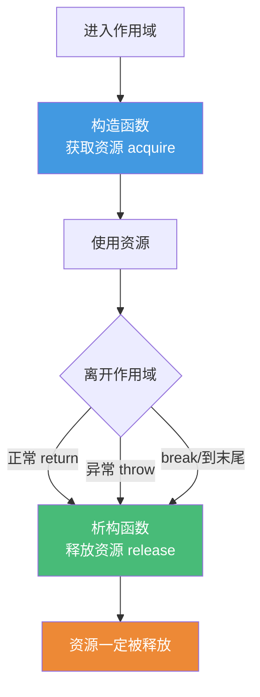
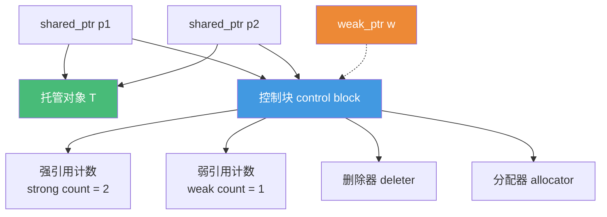
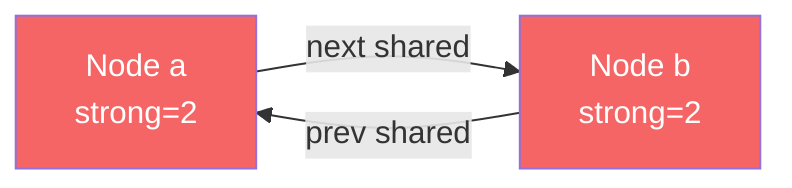
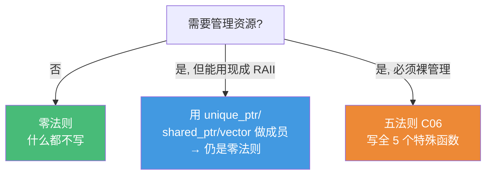

# 精通 C++ RAII 与智能指针

> 课程编号：C05
> 路线图来源：现代 C++ 全栈深度课程 — 资源管理
> 难度：⭐⭐⭐⭐
> 预计阅读时间：55 分钟
> 📅 内容基准：**C++23** + GCC 14 / Clang 18 / MSVC 19.4x

---

## 引言：谁来 delete 它？

```cpp
#include <memory>
#include <stdexcept>

void process() {
    int* p = new int(42);          // 1) 手动分配
    do_work();                     // 2) 如果这里抛异常呢？
    delete p;                      // 3) 这行还会执行吗？
}

void better() {
    auto p = std::make_unique<int>(42);  // 4) 这里有什么不同？
    do_work();                            // 抛异常也没关系
}                                         // 5) p 怎么被释放的？
```

三个问题，能立刻回答吗？

1. `process()` 里如果 `do_work()` 抛异常，`delete p` 会执行吗？内存会怎样？
2. `make_unique` 返回的 `unique_ptr` 凭什么能保证不泄漏？
3. `shared_ptr` 多了一个"控制块"，它存了什么？为什么每次拷贝都有原子操作的开销？

答案：① **不会执行**——异常在 `do_work()` 抛出后栈展开（stack unwinding）直接跳过 `delete p`，`p` 指向的内存**泄漏**。这就是手动 `new/delete` 的根本问题：任何提前退出（异常、`return`、`break`）都可能跳过释放；② `unique_ptr` 是个**栈对象**，函数退出（无论正常还是异常）时它的**析构函数**一定被调用，析构里 `delete` 持有的指针——这就是 **RAII**；③ `shared_ptr` 的控制块存"强引用计数 + 弱引用计数 + 删除器 + 分配器"，多线程下引用计数用**原子操作**增减，所以拷贝 `shared_ptr` 比拷贝裸指针/`unique_ptr` 贵。

**RAII（Resource Acquisition Is Initialization，资源获取即初始化）** 是 C++ 区别于其它语言、也是其最强大的思想：把资源（内存、文件、锁、socket）的生命周期**绑定到栈对象的生命周期**，靠"对象析构一定会被调用"这条铁律来保证资源一定被释放。智能指针是 RAII 在"动态内存"上的标准实现。这一章是写出**无泄漏、异常安全**代码的基石，也是 C06（五法则）、C30（内存管理）的前置。

---

## 第一章：RAII——资源管理的核心思想

### 1.1 问题：手动管理为什么总出错

```cpp
void bad() {
    FILE* f = fopen("a.txt", "r");
    Lock* lk = acquire_lock();
    if (!parse(f)) return;          // ❌ 忘了 fclose / 释放锁 → 泄漏
    if (error) throw Err{};         // ❌ 异常跳过清理 → 泄漏
    release_lock(lk);
    fclose(f);                      // 只有"一切顺利"才走到这
}
```

手动配对 `acquire/release`、`new/delete`、`lock/unlock` 的根本缺陷：**控制流有很多出口**（多个 return、异常、break），每个出口都要记得清理，漏一个就泄漏。

### 1.2 RAII：把清理交给析构函数

核心洞察：C++ 保证**栈对象离开作用域时，析构函数一定被调用**（无论正常返回还是异常展开）。把资源释放写进析构函数，就再也不会忘：

```cpp
class FileHandle {
    FILE* f_;
public:
    explicit FileHandle(const char* path) : f_(fopen(path, "r")) {
        if (!f_) throw std::runtime_error("open failed");
    }
    ~FileHandle() { if (f_) fclose(f_); }   // 析构自动关闭——这就是 RAII

    FileHandle(const FileHandle&) = delete;            // 禁拷贝（独占资源）
    FileHandle& operator=(const FileHandle&) = delete;

    FILE* get() const { return f_; }
};

void good() {
    FileHandle f("a.txt");          // 构造里获取资源
    if (!parse(f.get())) return;    // ✅ return 时 f 析构 → 自动 fclose
    if (error) throw Err{};         // ✅ 异常展开时 f 析构 → 自动 fclose
}                                   // ✅ 正常结束 f 析构 → 自动 fclose
```



**RAII 三要素**：① 构造函数获取资源；② 析构函数释放资源；③ 对象生命周期 = 资源生命周期。标准库的 `unique_ptr`/`shared_ptr`/`lock_guard`/`fstream`/`vector` 全是 RAII 类型。

---

## 第二章：unique_ptr——独占所有权

### 2.1 基本用法

`std::unique_ptr<T>` 表示**独占**一个堆对象——同一时刻只有一个 `unique_ptr` 拥有它，析构时自动 `delete`：

```cpp
#include <memory>

auto p = std::make_unique<int>(42);   // ✅ 优先用 make_unique
std::unique_ptr<int> q(new int(42));  // 也可，但不如 make_unique（见 4.x）

*p = 100;                  // 像裸指针一样解引用
int v = *p;
p->member;                 // 若 T 是类
int* raw = p.get();        // 取裸指针（不转移所有权）
p.reset();                 // 提前释放，p 变 nullptr
if (p) { ... }             // 转 bool：非空判断
```

### 2.2 只移动，不可拷贝

`unique_ptr` **不能拷贝**（独占语义不允许两个指针拥有同一对象），只能**移动**（转移所有权）：

```cpp
auto p1 = std::make_unique<int>(1);
// auto p2 = p1;             // ❌ 编译错误：拷贝构造被 delete
auto p2 = std::move(p1);     // ✅ 移动：所有权从 p1 转给 p2
// 现在 p1 == nullptr，p2 拥有对象
```

这正是 C03 移动语义的应用：`unique_ptr` 是典型的"只移动类型（move-only）"。函数返回 `unique_ptr` 是惯用法（转移所有权给调用者）：

```cpp
std::unique_ptr<Widget> make_widget() {
    return std::make_unique<Widget>();   // 移动（或省略）出去
}
```

### 2.3 零开销抽象

`unique_ptr` 的关键卖点：**和裸指针一样大、一样快**（默认删除器时）。它不存引用计数，析构就是一句 `delete`，编译器能完全内联优化掉：

```cpp
static_assert(sizeof(std::unique_ptr<int>) == sizeof(int*));  // 通常成立
```

所以**默认就该用 `unique_ptr`**——它几乎零成本地解决了内存泄漏，没有理由再用裸 `new/delete`。

### 2.4 自定义删除器

不是所有资源都用 `delete` 释放（FILE 用 `fclose`、malloc 用 `free`）。`unique_ptr` 第二个模板参数是删除器：

```cpp
// 用 lambda 删除器管理 FILE*
auto closer = [](FILE* f) { if (f) fclose(f); };
std::unique_ptr<FILE, decltype(closer)> fp(fopen("a.txt", "r"), closer);

// 管理 C 风格资源
std::unique_ptr<void, decltype(&free)> mem(malloc(1024), free);
```

⚠️ 注意：**有状态删除器（如捕获的 lambda、函数指针）会让 `unique_ptr` 变大**（要存删除器）。无捕获 lambda 作为类型参数时通常仍是零额外开销。

### 2.5 管理数组

```cpp
auto arr = std::make_unique<int[]>(10);  // T[] 特化：用 delete[] 释放
arr[0] = 1;                               // 提供 operator[]
// （实践中数组优先用 std::vector，更安全方便）
```

---

## 第三章：shared_ptr——共享所有权

### 3.1 引用计数与控制块

`std::shared_ptr<T>` 表示**多个指针共享一个对象**，靠**引用计数**管理：每多一个 `shared_ptr` 指向它，计数 +1；每析构一个，计数 -1；计数归零时才 `delete` 对象。

```cpp
auto p1 = std::make_shared<int>(42);   // 引用计数 = 1
{
    auto p2 = p1;                       // 拷贝：计数 = 2
    std::cout << p1.use_count();        // 2
}                                       // p2 析构：计数 = 1
// 计数仍 1，对象还活着
// p1 析构：计数 = 0 → delete 对象
```

`shared_ptr` 实际有**两个指针**：一个指向对象，一个指向**控制块（control block）**。控制块里存：



- **强引用计数（strong count）**：有多少 `shared_ptr` 拥有对象。归零 → 销毁**对象**。
- **弱引用计数（weak count）**：有多少 `weak_ptr` 观察对象（+1 给 shared 自己）。归零且强计数也为零 → 销毁**控制块**。

### 3.2 为什么 shared_ptr 比 unique_ptr 贵

两个层面的开销，必须理解：

1. **空间**：`shared_ptr` 是两个指针大小（对象指针 + 控制块指针），是 `unique_ptr` 的 2 倍。
2. **时间 + 同步**：引用计数的增减是**原子操作（atomic）**——因为同一个对象可能被多个线程的 `shared_ptr` 拷贝/析构，计数必须线程安全。原子操作比普通 `++` 慢（涉及缓存一致性、内存屏障）。

```cpp
void f(std::shared_ptr<T> p);   // ❌ 按值传参：每次调用都原子 +1/-1
void g(const T& p);             // ✅ 不涉及所有权时，传引用，零计数开销
```

**准则**：只有真正需要**共享所有权**时才用 `shared_ptr`；只是"访问"对象不用 `shared_ptr`（传引用或裸指针/`T*`/`unique_ptr&`）。默认用 `unique_ptr`，必要时再升级到 `shared_ptr`。

⚠️ **重要澄清**：引用计数本身是线程安全的（原子），但**被管理的对象不是**——多线程同时写同一个对象仍需自己加锁。

### 3.3 make_shared vs shared_ptr(new)

```cpp
auto p = std::make_shared<Widget>(args);     // ✅ 推荐
std::shared_ptr<Widget> q(new Widget(args)); // 次选
```

`make_shared` 的优势：**一次分配**把"对象 + 控制块"放在同一块连续内存里，而 `shared_ptr(new T)` 要**两次分配**（一次 new 对象，一次 new 控制块）。一次分配更快、缓存更友好、还能避免一类异常安全问题。

但 `make_shared` 有个**权衡**：对象和控制块共享一块内存，只要还有 `weak_ptr` 存活（弱计数 > 0），**整块内存（含对象大小）都无法释放**——即使对象本身已析构。对**大对象 + 长寿命 weak_ptr** 的场景，反而 `shared_ptr(new)` 更省内存（对象内存可单独释放）。

---

## 第四章：weak_ptr——打破循环引用

### 4.1 循环引用：shared_ptr 的致命陷阱

引用计数有个天生的弱点——**无法处理循环引用**：

```cpp
struct Node {
    std::shared_ptr<Node> next;
    std::shared_ptr<Node> prev;   // ❌ 双向都用 shared_ptr
};

auto a = std::make_shared<Node>();
auto b = std::make_shared<Node>();
a->next = b;     // b 的强计数 = 2
b->prev = a;     // a 的强计数 = 2
// 离开作用域：a、b 局部变量析构，各自强计数 -1 → 都还剩 1
// 互相引用，计数永远不归零 → 两个 Node 都泄漏！
```



局部变量 `a`、`b` 销毁后，两个 Node 还互相把对方的计数顶在 1，谁也释放不了——**内存泄漏**。引用计数 GC 的固有缺陷。

### 4.2 weak_ptr：观察但不拥有

`std::weak_ptr<T>` 指向 `shared_ptr` 管理的对象，但**不增加强引用计数**——它"观察"对象而不"拥有"对象。用它打破循环：

```cpp
struct Node {
    std::shared_ptr<Node> next;   // 一个方向用 shared（拥有）
    std::weak_ptr<Node>   prev;   // ✅ 另一个方向用 weak（不拥有）
};
// 现在 prev 不增加 a 的强计数 → 局部变量销毁后计数能正常归零
```

**经典规则**：父→子用 `shared_ptr`（父拥有子），子→父用 `weak_ptr`（子不拥有父）。观察者、缓存、回调里的"反向引用"都该用 `weak_ptr`。

### 4.3 lock()——安全地使用 weak_ptr

`weak_ptr` 不能直接解引用（对象随时可能已被销毁）。要用必须先 `lock()` 升级成 `shared_ptr`：

```cpp
std::weak_ptr<Node> w = some_shared;

if (auto sp = w.lock()) {   // lock() 返回 shared_ptr；对象还活着则非空
    sp->use();              // ✅ 此期间 sp 持有强引用，对象保证存活
} else {
    // 对象已被销毁（expired）
}

bool gone = w.expired();    // 检查对象是否已销毁
```

`lock()` 是**原子地**"检查对象是否还活 + 拿到强引用"——这是线程安全访问可能已销毁对象的唯一正确方式。先 `expired()` 再用是**竞态 bug**（检查后、使用前对象可能被别的线程销毁）。

---

## 第五章：enable_shared_from_this

### 5.1 问题：在成员函数里要一个指向自己的 shared_ptr

```cpp
struct Widget {
    std::shared_ptr<Widget> get_self() {
        return std::shared_ptr<Widget>(this);   // ❌ 灾难！
    }
};
```

这创建了一个**全新的、独立的控制块**——和原来管理 `this` 的 `shared_ptr` 互不知晓，强计数各算各的。结果：对象被 `delete` 两次（**double free**）。

### 5.2 正确做法：继承 enable_shared_from_this

```cpp
struct Widget : std::enable_shared_from_this<Widget> {
    std::shared_ptr<Widget> get_self() {
        return shared_from_this();   // ✅ 返回与现有控制块共享的 shared_ptr
    }
};

auto w = std::make_shared<Widget>();
auto self = w->get_self();           // self 和 w 共享同一控制块，计数正确
```

原理：`enable_shared_from_this` 在基类里藏了一个 `weak_ptr`，当对象被 `shared_ptr` 接管时这个 `weak_ptr` 被设置好，`shared_from_this()` 就用它 `lock()` 出一个共享的 `shared_ptr`。

⚠️ **前提**：对象必须**已经被某个 `shared_ptr` 管理**，才能调 `shared_from_this()`。对栈对象或还没交给 shared_ptr 的对象调用，C++17 起明确**抛 `std::bad_weak_ptr`**（C++11/14 是 UB）：

```cpp
Widget w;
w.get_self();          // ❌ 抛 std::bad_weak_ptr：w 不由 shared_ptr 管理
```

---

## 第六章：零法则——最好的资源管理是不写

C06 会详谈三/五/零法则，这里先点出**零法则（Rule of Zero）**——它和智能指针是绝配：

```cpp
// ❌ 手动管理：要写析构、拷贝、移动（五法则），容易出错
class Bad {
    int* data_;
public:
    Bad() : data_(new int[100]) {}
    ~Bad() { delete[] data_; }
    Bad(const Bad&);             // 还得写拷贝、移动……一堆
    // ...
};

// ✅ 零法则：用 RAII 成员，编译器自动生成正确的全部特殊函数
class Good {
    std::unique_ptr<int[]> data_;        // 或 std::vector<int>
public:
    Good() : data_(std::make_unique<int[]>(100)) {}
    // 不写析构、拷贝、移动——编译器自动生成且正确！
};
```

**零法则**：让每个类要么"只管理资源"（用现成的 RAII 类型如 `unique_ptr`/`vector`/`string`），要么"只组织数据"——这样**一个特殊成员函数都不用自己写**，编译器自动生成的就是对的。这是现代 C++ 最重要的工程准则。



---

## 第七章：常见陷阱清单

### ❌ 陷阱 1：用裸 new/delete

```cpp
Widget* w = new Widget();
// ... 中间任何 return/throw 都泄漏
delete w;
```
修正：`auto w = std::make_unique<Widget>();` ——永不泄漏。

### ❌ 陷阱 2：从同一个裸指针构造两个 shared_ptr

```cpp
Widget* raw = new Widget();
std::shared_ptr<Widget> p1(raw);
std::shared_ptr<Widget> p2(raw);   // ❌ 两个独立控制块 → double free
```
修正：拷贝 `shared_ptr` 本身（`p2 = p1`），或一开始就 `make_shared`，永远不让裸指针被接管两次。

### ❌ 陷阱 3：循环引用泄漏

```cpp
struct N { std::shared_ptr<N> peer; };
// 两个对象互指 → 计数永不归零
```
修正：一方改用 `weak_ptr`。

### ❌ 陷阱 4：shared_ptr 按值到处传

```cpp
void f(std::shared_ptr<Widget> p);   // 每次调用原子计数 +1/-1
```
修正：不需要所有权时传 `const Widget&` 或 `Widget*`；需要"延长生命周期"才按值传。

### ❌ 陷阱 5：shared_ptr(this)

```cpp
return std::shared_ptr<Widget>(this);   // ❌ 新控制块 → double free
```
修正：继承 `enable_shared_from_this`，用 `shared_from_this()`。

### ❌ 陷阱 6：unique_ptr 管数组用了单对象版

```cpp
std::unique_ptr<int> p(new int[10]);   // ❌ 析构调 delete（非 delete[]）→ UB
```
修正：`std::unique_ptr<int[]>` 或直接用 `std::vector<int>`。

### ❌ 陷阱 7：先 expired() 再用

```cpp
if (!w.expired()) w.lock()->use();   // ❌ 检查后对象可能被别的线程销毁
```
修正：`if (auto sp = w.lock()) sp->use();` ——一步原子完成。

---

## 第八章：练习题

**练习 1**：解释 RAII 三要素，以及为什么它能保证异常安全下也不泄漏。

**练习 2**：`unique_ptr` 和 `shared_ptr` 各占多大、各有什么开销？什么时候用哪个？

**练习 3**：控制块里存了什么？为什么 `shared_ptr` 拷贝有原子操作开销？

**练习 4**：下面代码为什么泄漏？怎么修？
```cpp
struct Node {
    std::shared_ptr<Node> next, prev;
};
auto a = std::make_shared<Node>();
auto b = std::make_shared<Node>();
a->next = b; b->prev = a;
```

**练习 5**：找 bug：
```cpp
struct W {
    std::shared_ptr<W> self() { return std::shared_ptr<W>(this); }
};
auto p = std::make_shared<W>();
auto q = p->self();
```

---

## 参考答案与解析

**练习 1**：三要素——① 构造函数获取资源（分配内存/打开文件/加锁）；② 析构函数释放资源；③ 对象生命周期等于资源生命周期。异常安全的关键：C++ 保证栈对象在离开作用域时（包括异常**栈展开**时）析构函数一定被调用，所以无论控制流从哪个出口离开，资源都会被释放——这是手动 `new/delete` 做不到的。

**练习 2**：`unique_ptr`（默认删除器）= 一个指针大小，开销几乎为零（析构就是 `delete`），**默认首选**；`shared_ptr` = 两个指针大小（对象指针 + 控制块指针），拷贝/析构有**原子引用计数**开销。**只有真正需要共享所有权时才用 `shared_ptr`**，否则用 `unique_ptr`。

**练习 3**：控制块存：强引用计数、弱引用计数、删除器、分配器。原子开销的原因：同一对象可能被多个线程的 `shared_ptr` 同时拷贝/析构，引用计数的增减必须线程安全，所以用**原子操作**（涉及内存屏障、缓存一致性），比普通整数 `++` 慢得多。

**练习 4**：**循环引用**。`a->next` 持有 b（b 强计数=2），`b->prev` 持有 a（a 强计数=2）。局部变量 `a`、`b` 析构后各 -1，都剩 1，互相把对方顶住，计数永不归零，两个 Node 泄漏。修正：把 `prev`（或 `next`）改成 `std::weak_ptr<Node>`，打破循环。

**练习 5**：`self()` 用 `shared_ptr<W>(this)` 从裸指针 `this` 构造了一个**全新的、独立控制块**的 `shared_ptr`，与 `p` 的控制块互不知晓。两个控制块各自计数，对象会被 `delete` 两次（**double free**）。修正：`struct W : std::enable_shared_from_this<W>`，`self()` 里 `return shared_from_this();`。

---

## 小结

| 知识点 | 关键记忆 |
|---|---|
| RAII | 资源生命周期绑定栈对象；析构一定被调用 → 异常安全不泄漏 |
| unique_ptr | 独占、只移动、零开销；**默认首选**；优先 make_unique |
| shared_ptr | 共享、引用计数、两指针大小、原子开销；真正共享才用 |
| 控制块 | 强计数 + 弱计数 + 删除器 + 分配器；强=0 销毁对象，弱也=0 销毁控制块 |
| make_shared | 一次分配（对象+控制块连续）；但 weak_ptr 在则内存难全释放 |
| weak_ptr | 观察不拥有，破循环引用；用前 `lock()` 升级成 shared_ptr |
| 循环引用 | shared 互指→计数不归零泄漏；一方改 weak_ptr |
| enable_shared_from_this | 成员函数里要 shared(this) 时用，避免 double free |
| 零法则 | 用 RAII 成员，编译器自动生成正确特殊函数，啥都不写 |

---

## 📅 2026 现状/更新

- 智能指针自 C++11/14（`make_unique` 是 C++14）已是默认实践；**裸 `new/delete` 在现代代码中应近乎绝迹**，由 `make_unique`/`make_shared`/容器取代。
- C++ Core Guidelines 明确：默认 `unique_ptr`，共享所有权才 `shared_ptr`，反向引用用 `weak_ptr`，传参不必要不传智能指针（传引用/`gsl::not_null` 等）。
- `shared_ptr` 的原子计数开销在高并发热路径上仍是性能点；C++ 没有"无原子开销的 local shared_ptr"标准方案，热点处常用 `unique_ptr` + 引用传递规避。
- C++23 的 `std::out_ptr`/`std::inout_ptr` 让智能指针与 C API（输出参数为 `T**`）的互操作更顺；`std::atomic<std::shared_ptr<T>>`（C++20）提供更好的并发共享指针支持，取代弃用的 `atomic_*` 自由函数。

---

> 🔁 下一篇 **C06 — 精通 C++ 拷贝控制与五法则**：五个特殊成员函数（析构/拷贝构造/拷贝赋值/移动构造/移动赋值）、三/五/零法则、`=default`/`=delete`、copy-and-swap 惯用法、以及编译器何时隐式生成、何时禁止生成这些函数。
>
> 反馈：把"RAII = 析构一定被调用"和"默认 unique_ptr、共享才 shared、反向用 weak"两条钉死——它们解决了 C++ 一大半的资源管理问题。
