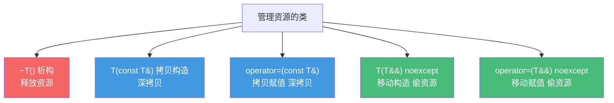
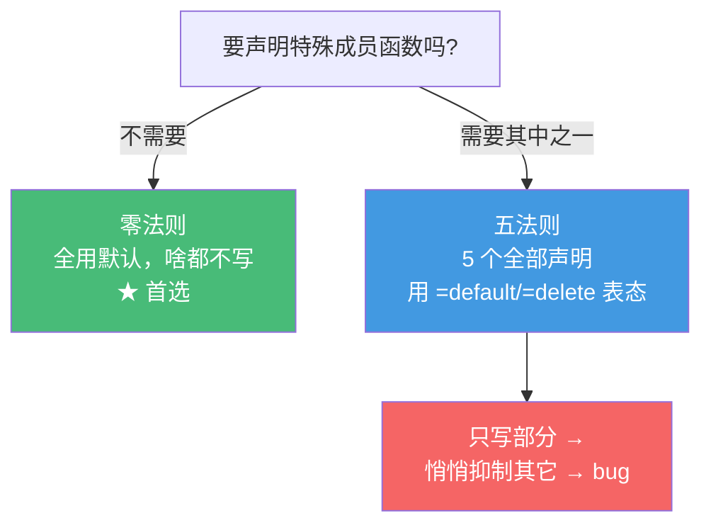

# 精通 C++ 拷贝控制与五法则

> 课程编号：C06
> 路线图来源：现代 C++ 全栈深度课程 — 特殊成员函数
> 难度：⭐⭐⭐⭐
> 预计阅读时间：55 分钟
> 📅 内容基准：**C++23** + GCC 14 / Clang 18 / MSVC 19.4x

---

## 引言：编译器悄悄给你生成了什么？

```cpp
#include <cstring>

class String {
    size_t len_;
    char* data_;
public:
    String(const char* s) : len_(strlen(s)), data_(new char[len_ + 1]) {
        std::memcpy(data_, s, len_ + 1);
    }
    ~String() { delete[] data_; }
    // 没写拷贝构造、拷贝赋值、移动……
};

void demo() {
    String a("hello");
    String b = a;          // 1) 这行发生了什么？
}                          // 2) 离开作用域时呢？
```

三个问题，能立刻回答吗？

1. 只写了构造和析构，`String b = a;` 用的是哪个函数？它是谁生成的？
2. `demo()` 结束时会发生什么严重错误？
3. 既然写了析构函数，编译器还会自动生成移动构造吗？

答案：① 用编译器**隐式生成的拷贝构造函数**，它做**逐成员拷贝（member-wise copy）**——把 `a.data_`（一个指针）直接复制给 `b.data_`，于是 **a 和 b 的 `data_` 指向同一块堆内存**（浅拷贝）；② `demo()` 结束，`b` 先析构 `delete[] data_`，`a` 再析构 `delete[]` **同一指针** → **double free**（崩溃或 UB）；③ **不会**——一旦你声明了析构函数，编译器**不再自动生成移动构造/移动赋值**（移动操作被抑制），拷贝操作也处于"已弃用但仍生成"的状态。

这就是 C++ 最容易踩坑的领域：**特殊成员函数（special member functions）** 的隐式生成规则。编译器会在你不注意时自动生成（或不生成）这些函数，行为可能完全不是你想要的。**三/五/零法则** 就是管理这件事的准则。这一章紧接 C03（移动语义）、C05（RAII），是写出正确的资源管理类的核心，也是面试高频考点。

---

## 第一章：六个特殊成员函数

编译器可能为一个类**隐式生成**这些"特殊成员函数"：

```cpp
class Widget {
public:
    Widget();                              // 1) 默认构造函数
    ~Widget();                             // 2) 析构函数
    Widget(const Widget&);                 // 3) 拷贝构造函数
    Widget& operator=(const Widget&);      // 4) 拷贝赋值运算符
    Widget(Widget&&) noexcept;             // 5) 移动构造函数
    Widget& operator=(Widget&&) noexcept;  // 6) 移动赋值运算符
};
```

本章聚焦后五个（拷贝控制相关）。它们的默认行为：

| 函数 | 默认行为 | 触发场景 |
|---|---|---|
| 析构 | 逐成员析构（声明逆序） | 对象销毁 |
| 拷贝构造 | 逐成员拷贝 | `T b = a;` `f(a)` 按值传参 |
| 拷贝赋值 | 逐成员拷贝赋值 | `b = a;`（b 已存在） |
| 移动构造 | 逐成员移动 | `T b = std::move(a);` |
| 移动赋值 | 逐成员移动赋值 | `b = std::move(a);` |

**关键**：默认的拷贝是**浅拷贝**——对指针成员只复制指针值，不复制其指向的内容。对管理裸资源的类，这就是 bug 的根源（引言的 double free）。

---

## 第二章：三法则（Rule of Three）

### 2.1 规则

**三法则**（C++98 时代）：如果你需要自定义**析构函数、拷贝构造、拷贝赋值**三者之一，那么通常**三个都需要**自定义。

原因：需要自定义析构，往往意味着类管理某种资源（堆内存、文件句柄）。而默认的拷贝是**浅拷贝**——会导致多个对象共享同一资源、重复释放。所以管理资源的类必须把拷贝也改成**深拷贝**。

### 2.2 修复引言的 String

```cpp
class String {
    size_t len_;
    char* data_;
public:
    String(const char* s) : len_(strlen(s)), data_(new char[len_ + 1]) {
        std::memcpy(data_, s, len_ + 1);
    }

    ~String() { delete[] data_; }                         // 1) 析构

    String(const String& o) : len_(o.len_),               // 2) 拷贝构造：深拷贝
                              data_(new char[o.len_ + 1]) {
        std::memcpy(data_, o.data_, len_ + 1);            // 分配新内存 + 复制内容
    }

    String& operator=(const String& o) {                  // 3) 拷贝赋值：深拷贝
        if (this != &o) {                                 // 防自赋值
            char* tmp = new char[o.len_ + 1];             // 先分配（异常安全）
            std::memcpy(tmp, o.data_, o.len_ + 1);
            delete[] data_;                               // 再释放旧的
            data_ = tmp;
            len_ = o.len_;
        }
        return *this;
    }
};
```

现在 `String b = a;` 是深拷贝——`a` 和 `b` 各有独立的堆内存，析构互不干扰。

### 2.3 拷贝赋值的异常安全顺序

注意拷贝赋值里**"先分配新的、成功后再释放旧的"** 的顺序——如果 `new` 抛异常，`*this` 还保持原状（**强异常保证**）。反过来"先 delete 旧的再 new 新的"，若 new 失败，对象就处于已释放的损坏状态。下一章的 copy-and-swap 能更优雅地保证这点。

---

## 第三章：五法则（Rule of Five）

### 3.1 加上移动

C++11 引入移动语义后，三法则升级为**五法则**：管理资源的类，除了析构 + 拷贝两件，还应提供**移动构造 + 移动赋值**（性能优化——转移资源而非深拷贝）：

```cpp
class String {
    char* data_ = nullptr;
    size_t len_ = 0;
public:
    // ...（构造、析构、拷贝构造、拷贝赋值如前）

    String(String&& o) noexcept                  // 4) 移动构造：偷资源
        : data_(o.data_), len_(o.len_) {
        o.data_ = nullptr;                        // 源置空，防 double free
        o.len_ = 0;
    }

    String& operator=(String&& o) noexcept {      // 5) 移动赋值
        if (this != &o) {
            delete[] data_;                       // 释放自己的
            data_ = o.data_;                      // 偷
            len_ = o.len_;
            o.data_ = nullptr;                    // 源置空
            o.len_ = 0;
        }
        return *this;
    }
};
```

⚠️ 回顾 C03：**移动构造/移动赋值务必标 `noexcept`**，否则 `vector` 扩容等"强异常保证"操作会退回用拷贝，移动优化失效。

### 3.2 五个函数全景



---

## 第四章：编译器隐式生成规则

这是本章最容易混淆、也最重要的部分。**声明某些特殊函数会抑制另一些的自动生成**。

### 4.1 抑制规则表

| 你声明了 | 隐式拷贝构造 | 隐式拷贝赋值 | 隐式移动构造 | 隐式移动赋值 |
|---|---|---|---|---|
| 什么都不声明 | ✅ 生成 | ✅ 生成 | ✅ 生成 | ✅ 生成 |
| **任意拷贝操作** | — | — | ❌ **不生成** | ❌ **不生成** |
| **任意移动操作** | ❌ 删除 | ❌ 删除 | — | — |
| **析构函数** | ⚠️ 生成（已弃用） | ⚠️ 生成（已弃用） | ❌ **不生成** | ❌ **不生成** |

记忆要点：

- **声明了移动操作 → 拷贝操作被 `delete`**（既然你定义了移动，编译器认为默认拷贝不安全）。
- **声明了拷贝操作或析构 → 移动操作不生成**（退化为拷贝）。
- **声明了析构 → 拷贝仍生成但"已弃用"**（这正是引言 String 浅拷贝的来源——只写了析构，拷贝被默默生成成浅拷贝）。

### 4.2 这意味着什么——"全有或全无"

```cpp
class Buggy {
    std::unique_ptr<int> p_;
public:
    ~Buggy() { log("destroyed"); }   // 只是想加个日志……
    // 后果：移动操作不再自动生成！
};

Buggy a;
Buggy b = std::move(a);   // 不是移动——退化成拷贝；而 unique_ptr 不可拷贝 → 编译错误！
```

只是想给析构加一行日志，结果意外禁用了移动语义。这就是为什么准则是：**要么一个特殊函数都不写（零法则），要么把相关的全写齐（五法则）**——不要只写一两个。



---

## 第五章：=default 与 =delete

### 5.1 =default：要默认行为，但要显式

`=default` 让编译器生成默认实现，同时**显式声明"我要这个函数"**——既表达意图，又能恢复被抑制的生成：

```cpp
class Widget {
public:
    ~Widget() { /* 自定义析构 */ }

    Widget(const Widget&) = default;             // 显式要默认拷贝
    Widget& operator=(const Widget&) = default;
    Widget(Widget&&) = default;                  // 恢复被析构抑制的移动
    Widget& operator=(Widget&&) = default;
};
```

`=default` 生成的函数仍是"用户声明的"，但行为等同隐式版本（逐成员）。它比手写更高效（编译器可标记为 trivial）、更不易出错。

### 5.2 =delete：禁止某个操作

`=delete` 显式**禁止**一个函数——任何调用它的代码编译报错：

```cpp
class NonCopyable {
public:
    NonCopyable() = default;
    NonCopyable(const NonCopyable&) = delete;             // 禁拷贝
    NonCopyable& operator=(const NonCopyable&) = delete;
    NonCopyable(NonCopyable&&) = default;                 // 允许移动
    NonCopyable& operator=(NonCopyable&&) = default;
};
```

经典用途：独占资源的类（如 `unique_ptr`、锁、文件句柄）禁止拷贝、只允许移动。`=delete` 还能禁止特定重载、隐式转换：

```cpp
void f(int);
void f(double) = delete;   // 禁止用 double 调用 f（防隐式转换）
```

### 5.3 显式表态最清晰

现代风格：管理资源的类**显式列出全部五个**（用 `=default`/`=delete` 或自定义），让读者一眼看清拷贝/移动语义：

```cpp
class Resource {
public:
    Resource();
    ~Resource();
    Resource(const Resource&) = delete;             // 不可拷贝
    Resource& operator=(const Resource&) = delete;
    Resource(Resource&&) noexcept;                  // 可移动
    Resource& operator=(Resource&&) noexcept;
};
```

---

## 第六章：copy-and-swap 惯用法

### 6.1 一个赋值搞定拷贝与移动

`copy-and-swap` 是写赋值运算符的经典惯用法——**异常安全、自动防自赋值、拷贝与移动复用同一份代码**：

```cpp
class String {
    size_t len_;
    char* data_;
public:
    friend void swap(String& a, String& b) noexcept {   // 1) 提供 noexcept swap
        std::swap(a.data_, b.data_);
        std::swap(a.len_, b.len_);
    }

    String(const String& o) : len_(o.len_), data_(new char[o.len_ + 1]) {
        std::memcpy(data_, o.data_, len_ + 1);
    }
    String(String&& o) noexcept : data_(nullptr), len_(0) {
        swap(*this, o);                                 // 移动 = 和空对象交换
    }

    // 2) 一个赋值，同时处理拷贝赋值和移动赋值！
    String& operator=(String o) {        // ★ 按值传参：拷贝或移动在这里发生
        swap(*this, o);                  // 与副本交换：把副本的资源换给自己
        return *this;
    }                                    // o（持有旧资源）析构时释放旧资源
};
```

### 6.2 为什么它优雅

- **参数按值传**：调用方传左值则**拷贝**进 `o`，传右值（`std::move`）则**移动**进 `o`——一个函数自动支持拷贝赋值和移动赋值。
- **自动防自赋值**：先做了副本，`swap` 不会有问题。
- **强异常保证**：拷贝（可能抛异常的部分）发生在进入函数体**之前**（构造参数 `o` 时）；一旦进入函数体，只剩 `swap`（`noexcept`），不会失败。若构造 `o` 时抛异常，`*this` 完全没被碰过。

代价：`copy-and-swap` 的赋值即使在不需要时也会做一次完整拷贝/交换，比手写"原地复用已有缓冲区"的版本略慢。性能极端敏感处可手写，多数情况 copy-and-swap 的清晰与安全更值得。

---

## 第七章：常见陷阱清单

### ❌ 陷阱 1：管理资源却用默认浅拷贝

```cpp
class Buf { char* p_; public: ~Buf(){ delete[] p_; } };
Buf b = a;   // 浅拷贝 → 两个对象 delete 同一指针 → double free
```
修正：遵循五法则，提供深拷贝的拷贝构造/赋值（或用 `vector`/`unique_ptr` 成员走零法则）。

### ❌ 陷阱 2：只写析构，意外禁用移动

```cpp
class X { std::vector<int> v_; public: ~X(){ log(); } };
X b = std::move(a);   // 退化成拷贝（移动被析构抑制）→ 深拷贝 vector，性能损失
```
修正：`X(X&&)=default; X& operator=(X&&)=default;` 显式恢复移动。

### ❌ 陷阱 3：移动构造没标 noexcept

```cpp
String(String&& o) { ... }   // 没 noexcept → vector 扩容退回拷贝
```
修正：加 `noexcept`。

### ❌ 陷阱 4：拷贝赋值忘了防自赋值（手写版）

```cpp
String& operator=(const String& o) {
    delete[] data_;                       // ❌ 若 o 就是自己，先删了自己的数据
    data_ = new char[o.len_+1];           //    再从已释放的 o.data_ 复制 → UB
    std::memcpy(data_, o.data_, ...);
    return *this;
}
```
修正：`if (this != &o)`，或用 copy-and-swap（天然免疫）。

### ❌ 陷阱 5：移动后没置空源

```cpp
String(String&& o) : data_(o.data_) {}   // 忘了 o.data_=nullptr → double free
```
修正：移动后把源的指针置空。

### ❌ 陷阱 6：基类该 virtual 析构却没写

```cpp
struct Base { ~Base(); };                 // 非虚
Base* p = new Derived();
delete p;                                 // ❌ 只调 ~Base，Derived 部分泄漏（UB）
```
修正：多态基类析构声明 `virtual`（详见 C08）；声明了虚析构记得 `=default` 恢复移动。

---

## 第八章：练习题

**练习 1**：什么是三法则、五法则、零法则？三者关系？

**练习 2**：只声明了析构函数，编译器还会生成哪些特殊函数？哪些不再生成？

**练习 3**：一个类只写了 `~T(){ log(); }`，成员是 `std::vector<int>`。`T b = std::move(a);` 会移动还是拷贝？为什么？怎么修？

**练习 4**：解释 copy-and-swap 为什么能同时实现拷贝赋值和移动赋值，且异常安全。

**练习 5**：找出问题：
```cpp
class Buffer {
    int* p_; size_t n_;
public:
    Buffer(size_t n) : p_(new int[n]), n_(n) {}
    ~Buffer() { delete[] p_; }
};
Buffer a(100);
Buffer b = a;
```

---

## 参考答案与解析

**练习 1**：**三法则**——需要自定义析构/拷贝构造/拷贝赋值之一，通常三个都要（资源管理类需深拷贝）。**五法则**——C++11 后加上移动构造/移动赋值（性能）。**零法则**——优先用 RAII 类型（`vector`/`string`/`unique_ptr`）做成员，让编译器自动生成全部特殊函数，自己一个都不写。关系：零法则是首选；非写不可时写齐五个（五法则），不要只写一两个。

**练习 2**：声明析构后，**拷贝构造和拷贝赋值仍会生成**（但标准里标记为"已弃用"，行为是浅拷贝）；**移动构造和移动赋值不再生成**（被抑制，相关操作退化为拷贝）。

**练习 3**：会**拷贝**（深拷贝整个 vector）。因为声明了析构函数，编译器**不再自动生成移动构造**，`std::move(a)` 找不到移动构造，退而匹配拷贝构造。修复：显式 `T(T&&)=default; T& operator=(T&&)=default;`（最好五个都用 `=default` 显式列出）。

**练习 4**：赋值运算符**按值接收参数** `T o`——调用方传左值时拷贝构造 `o`，传右值时移动构造 `o`，于是一个函数同时支持两种赋值。函数体只做 `swap(*this, o)`（`noexcept`）。异常安全：可能抛异常的拷贝发生在进入函数体之前（构造 `o` 时），若失败 `*this` 毫发无损（强异常保证）；进入函数体后只有不会抛的 `swap`。`o` 析构时带走旧资源。还天然防自赋值。

**练习 5**：`Buffer` 声明了析构（管理 `new[]` 的内存），但**没有自定义拷贝构造**。`Buffer b = a;` 用隐式生成的拷贝构造——**浅拷贝**，`b.p_` 和 `a.p_` 指向同一块内存。离开作用域时 `b`、`a` 先后 `delete[]` 同一指针 → **double free**。修正：遵循五法则补深拷贝的拷贝构造/赋值 + 移动构造/赋值；或更好——把 `int* p_` 换成 `std::vector<int>`，走零法则，一个特殊函数都不用写。

---

## 小结

| 知识点 | 关键记忆 |
|---|---|
| 特殊成员函数 | 默认构造/析构/拷贝构造/拷贝赋值/移动构造/移动赋值 |
| 默认拷贝 | 逐成员**浅拷贝**——对裸指针只复制指针 → double free 根源 |
| 三法则 | 需要自定义析构/拷贝之一 → 通常三个都要（深拷贝） |
| 五法则 | C++11 加移动构造/赋值；移动务必 `noexcept` |
| 零法则 | **首选**：用 RAII 成员，编译器自动生成正确的全部 |
| 抑制规则 | 声明移动→删拷贝；声明拷贝/析构→不生成移动 |
| =default | 显式要默认实现，恢复被抑制的生成 |
| =delete | 禁止某操作（独占类禁拷贝、禁隐式转换） |
| copy-and-swap | 按值传参 + swap：拷贝/移动合一、强异常保证、防自赋值 |

---

## 📅 2026 现状/更新

- 五法则/零法则是现代 C++ 工程基石；C++ Core Guidelines 强烈推荐**零法则**——绝大多数类不该手写任何特殊成员函数。
- "声明析构抑制移动生成"长期是隐藏陷阱；编译器警告（`-Wdeprecated-copy`、Clang 的相关诊断）能帮你发现"只写了部分特殊函数"的类。
- C++20 起，编译器对 `=default` 的特殊函数能更好地推导 `constexpr`、`noexcept`、三路比较（`<=>` 可 `=default`，见 C10）。
- 准则不变：**默认走零法则**；确需手动管理资源时，五个特殊函数显式列全（`=default`/`=delete`/自定义），移动标 `noexcept`，赋值优先 copy-and-swap。

---

> 🔁 下一篇 **C07 — 精通 C++ 类与对象布局**：对象在内存里的真实排布、`alignof`/`alignas` 对齐与 padding、空基类优化（EBO）、`[[no_unique_address]]`、trivial/standard-layout/POD 的精确定义、位域与 `offsetof`。
>
> 反馈：把"默认拷贝是浅拷贝""声明析构会抑制移动""零法则优先"三条钉死——它们是 C++ 资源管理类一切 bug 的源头与解药。
