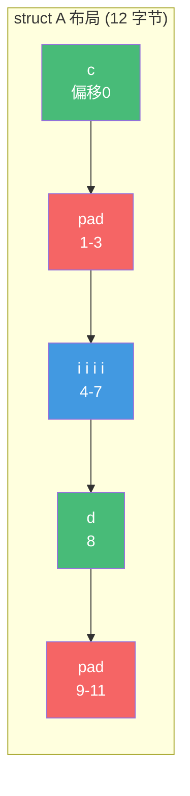
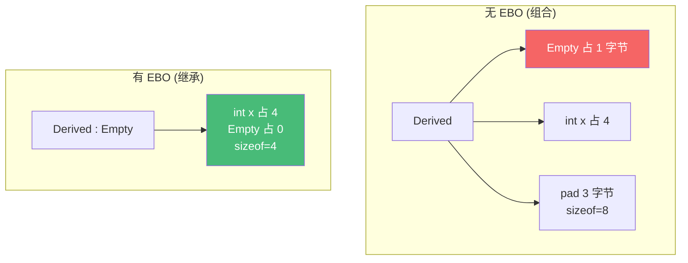
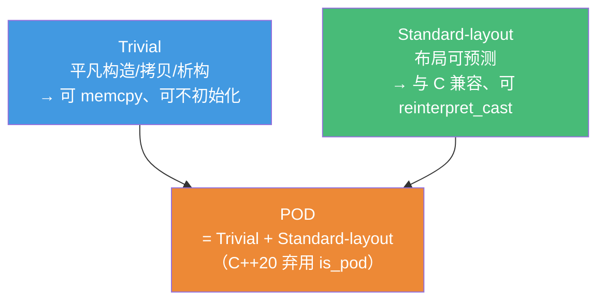

# 精通 C++ 类与对象布局

> 课程编号：C07
> 路线图来源：现代 C++ 全栈深度课程 — 对象模型
> 难度：⭐⭐⭐⭐
> 预计阅读时间：55 分钟
> 📅 内容基准：**C++23** + GCC 14 / Clang 18 / MSVC 19.4x

---

## 引言：sizeof 为什么不是成员之和？

```cpp
#include <cstddef>

struct A {
    char  c;      // 1 字节
    int   i;      // 4 字节
    char  d;      // 1 字节
};

struct B {
    int   i;      // 4 字节
    char  c;      // 1 字节
    char  d;      // 1 字节
};

static_assert(sizeof(A) == ?);   // 1) 是 6 吗？
static_assert(sizeof(B) == ?);   // 2) 和 A 一样吗？
struct Empty {};
static_assert(sizeof(Empty) == ?);  // 3) 空类多大？
```

三个问题，能立刻回答吗？

1. `A` 的成员加起来是 1+4+1 = 6，但 `sizeof(A)` 是 6 吗？
2. `B` 成员完全一样，只是顺序不同，大小会一样吗？
3. 一个没有任何成员的空类，`sizeof` 是 0 吗？

答案：① `sizeof(A) == 12`（不是 6）——`int i` 要求 4 字节**对齐**，`char c` 后面要填 3 字节 **padding** 才能让 `i` 落在 4 的倍数地址；`d` 后面再填 3 字节让整个结构体大小是最大成员对齐（4）的倍数；② `sizeof(B) == 8`——同样的成员，把大的放前面、小的聚在一起，padding 更少！**成员顺序影响对象大小**；③ `sizeof(Empty) == 1`（不是 0）——C++ 要求每个对象有**唯一地址**，所以空类也占至少 1 字节（但作为基类时可被优化掉，见 EBO）。

理解**对象在内存里的真实布局**——对齐、padding、布局类别——是写出**缓存友好的高性能代码**（C31）、做**底层互操作（与 C/硬件/网络协议）**、用 `mmap`/序列化的基础。这一章揭开"`class` 编译后到底长什么样"，是 C08（虚函数 vtable 布局）、C30（内存管理）的前置。

---

## 第一章：对齐（alignment）

### 1.1 为什么需要对齐

CPU 访问内存不是逐字节的，而是按**字（word）** 成块读取。一个 4 字节的 `int` 如果落在 4 的倍数地址上，CPU 一次就能读到；若跨越边界（misaligned），可能要两次访问再拼接——慢，某些架构（旧 ARM、SPARC）甚至直接**硬件异常崩溃**。所以每种类型有一个**对齐要求（alignment requirement）**：其对象地址必须是该值的倍数。

```cpp
#include <cstddef>

alignof(char);      // 1
alignof(int);       // 4（典型）
alignof(double);    // 8（典型）
alignof(void*);     // 8（64 位）
```

**规则**：一个类型的对齐通常等于其**最大成员的对齐**；基本类型的对齐通常等于其大小。

### 1.2 padding——为对齐而填充的空洞

为了让每个成员都落在其对齐边界上，编译器在成员之间（和末尾）插入**填充字节（padding）**：

```cpp
struct A {
    char  c;      // 偏移 0，占 1 字节
    // padding：偏移 1,2,3（3 字节填充，让 i 对齐到 4）
    int   i;      // 偏移 4，占 4 字节
    char  d;      // 偏移 8，占 1 字节
    // padding：偏移 9,10,11（尾部填充，让 sizeof 是 4 的倍数）
};                // sizeof(A) == 12, alignof(A) == 4
```



### 1.3 成员重排省内存

把成员**按对齐从大到小排列**，能把 padding 挤到最少：

```cpp
struct B {
    int   i;      // 偏移 0，占 4
    char  c;      // 偏移 4，占 1
    char  d;      // 偏移 5，占 1
    // padding：偏移 6,7（尾部填充到 8）
};                // sizeof(B) == 8，比 A 省 4 字节
```

**实战准则**：大量创建的结构体，把成员按大小降序排列（指针/`double` → `int` → `short` → `char`），能显著减小内存占用、提升缓存命中（C31）。

### 1.4 alignas——手动指定对齐

`alignas` 可**加大**对齐（不能减小），常用于 SIMD、缓存行对齐、避免伪共享（false sharing，C23）：

```cpp
alignas(64) struct CacheLine {   // 对齐到 64 字节缓存行
    std::atomic<int> counter;
};

struct alignas(16) Vec4 {        // SIMD 要求 16 字节对齐
    float x, y, z, w;
};

// C++17：缓存行大小常量
// std::hardware_destructive_interference_size  通常 64
```

---

## 第二章：空类与空基类优化（EBO）

### 2.1 空类为什么占 1 字节

```cpp
struct Empty {};
static_assert(sizeof(Empty) == 1);   // 不是 0！
```

C++ 要求**任意两个不同对象有不同地址**（`&a != &b`）。如果空类大小为 0，数组 `Empty arr[3]` 里三个元素就会同地址——违反规则。所以独立的空对象至少占 1 字节（一个"占位符"）。

### 2.2 EBO：作为基类时可以是 0

但当空类作为**基类**时，这个占位符可以被省掉——**空基类优化（Empty Base Optimization, EBO）**：

```cpp
struct Empty {};                 // sizeof == 1

struct Derived : Empty {         // 继承空类
    int x;
};
static_assert(sizeof(Derived) == 4);   // ✅ EBO：Empty 部分占 0，不是 5！
```

EBO 之所以可行：`Derived` 对象本身有地址，`Empty` 子对象可以和 `Derived` 共享地址（不需要独立的占位字节），同时仍满足"不同对象不同地址"。



### 2.3 EBO 的实际用途

标准库大量用 EBO：`std::vector` 把（通常为空的）**分配器**作为基类继承，避免每个 vector 多占空间；`std::unique_ptr` 把无状态**删除器**做 EBO，保持和裸指针一样大。这是"无状态策略对象不占空间"的关键技术。

### 2.4 [[no_unique_address]]——组合也能 EBO

C++20 的属性 `[[no_unique_address]]` 让**成员**（而非基类）也享受 EBO——空成员可以不占独立空间：

```cpp
struct Empty {};

struct Widget {
    int x;
    [[no_unique_address]] Empty e;   // 空成员可占 0 字节
};
static_assert(sizeof(Widget) == 4);  // ✅ e 不额外占空间（实现允许）

// 用途：无状态比较器/分配器作为成员，不再被迫用继承来 EBO
template<class T, class Compare>
class FlatSet {
    std::vector<T> data_;
    [[no_unique_address]] Compare cmp_;   // Compare 无状态时不占空间
};
```

注意：`[[no_unique_address]]` 是**允许**而非强制；MSVC 历史上需 `[[msvc::no_unique_address]]`（ABI 原因）。

---

## 第三章：布局类别——trivial / standard-layout / POD

C++ 对类型的"内存规整程度"有精确分类，决定能否做 `memcpy`、能否与 C 互操作。

### 3.1 Trivial（平凡）

类型是 **trivial** 的，若它的特殊成员函数（构造/拷贝/移动/析构）全部是平凡的（编译器生成、无自定义逻辑），且无虚函数/虚基类。Trivial 类型可以用 `memcpy` 拷贝、不需要构造即可"存在"：

```cpp
#include <type_traits>

struct T1 { int a; double b; };          // trivial
struct T2 { T2() {} int a; };            // ❌ 非 trivial（自定义构造）
struct T3 { virtual void f(); };         // ❌ 非 trivial（有 vtable）

static_assert(std::is_trivial_v<T1>);
static_assert(std::is_trivially_copyable_v<T1>);   // 可安全 memcpy
```

`std::is_trivially_copyable` 是关键——它决定能否 `memcpy`/`memmove`/`memset` 一个对象（序列化、容器扩容优化都依赖它）。

### 3.2 Standard-layout（标准布局）

**standard-layout** 关注内存排布的可预测性：所有非静态成员有相同访问控制、没有虚函数/虚基类、不在多个类里都有非静态成员（继承链里）等。标准布局类型**保证与 C 结构体布局兼容**，可安全跨语言/网络传递：

```cpp
struct S1 { int a; int b; };             // standard-layout（且可与 C 互操作）
struct S2 { public: int a; private: int b; };  // ❌ 非 standard-layout（访问控制不一致）

static_assert(std::is_standard_layout_v<S1>);
// 标准布局类：首个成员地址 == 对象地址（可 reinterpret_cast）
```

### 3.3 POD（Plain Old Data）

**POD = trivial + standard-layout**——既能 `memcpy`，又有 C 兼容布局。C++20 起 `std::is_pod` 已**弃用**，改用更精确的 `is_trivial` + `is_standard_layout` 组合：



### 3.4 检查布局的实用 traits

```cpp
std::is_trivial_v<T>;              // 平凡（构造/拷贝/析构都平凡）
std::is_trivially_copyable_v<T>;   // 能 memcpy（最实用）
std::is_standard_layout_v<T>;      // C 兼容布局
std::has_unique_object_representations_v<T>;  // 无 padding 空洞（可逐字节 hash）
```

---

## 第四章：offsetof 与位域

### 4.1 offsetof——成员的字节偏移

`offsetof(Type, member)` 给出成员相对对象起始的字节偏移——序列化、与 C 结构体对接、调试布局时用：

```cpp
#include <cstddef>

struct A { char c; int i; char d; };
offsetof(A, c);   // 0
offsetof(A, i);   // 4（c 后有 3 字节 padding）
offsetof(A, d);   // 8
```

⚠️ `offsetof` 仅对 **standard-layout** 类型有保证；对有虚函数/复杂继承的类是 UB（条件支持）。

### 4.2 位域（bit-field）——按位打包

位域让多个字段共享字节、精确控制位宽——用于硬件寄存器、协议头、节省内存：

```cpp
struct Flags {
    unsigned ready    : 1;    // 1 位
    unsigned error    : 1;    // 1 位
    unsigned mode     : 3;    // 3 位（0-7）
    unsigned reserved : 27;   // 填满 32 位
};
static_assert(sizeof(Flags) == 4);

struct RGB {
    uint16_t r : 5;   // 红 5 位
    uint16_t g : 6;   // 绿 6 位
    uint16_t b : 5;   // 蓝 5 位
};                    // 共 16 位 = 2 字节
```

⚠️ **位域的可移植性陷阱**：位的排列顺序（从高位还是低位开始）、跨字节边界的行为是**实现定义**的。用位域对接固定协议格式时不可移植——跨平台序列化更稳妥的是手动位运算（`<<`/`&`/`|`）。

---

## 第五章：内存布局全景示例

```cpp
struct Mixed {
    bool   flag;     // 偏移 0，1 字节
    // pad 3
    int    id;       // 偏移 4，4 字节
    double value;    // 偏移 8，8 字节
    char   tag;      // 偏移 16，1 字节
    // pad 7（尾部，对齐到 8）
};
static_assert(sizeof(Mixed) == 24);
static_assert(alignof(Mixed) == 8);   // 最大成员 double → 对齐 8
```

重排后：

```cpp
struct MixedPacked {
    double value;    // 0-7
    int    id;       // 8-11
    bool   flag;     // 12
    char   tag;      // 13
    // pad 2（尾部对齐到 8）
};
static_assert(sizeof(MixedPacked) == 16);   // 省 8 字节！
```

24 → 16 字节，仅靠重排成员顺序。大规模数组下这是巨大的内存与缓存收益。可用编译器查看真实布局：

```bash
g++ -Wpadded a.cpp           # 警告哪里插了 padding
clang++ -Xclang -fdump-record-layouts a.cpp   # 打印完整布局
# 或 pahole 工具分析 DWARF 调试信息里的结构体空洞
```

---

## 第六章：常见陷阱清单

### ❌ 陷阱 1：以为 sizeof 等于成员之和

```cpp
struct S { char c; int i; };   // 不是 5，是 8（padding）
```
对齐导致 padding。用 `-Wpadded` 检查。

### ❌ 陷阱 2：成员顺序随意，浪费内存

```cpp
struct Bad { char a; double b; char c; };   // 24 字节
struct Good { double b; char a; char c; };  // 16 字节
```
按对齐降序排成员。

### ❌ 陷阱 3：memcpy 非 trivially-copyable 类型

```cpp
std::string s;
char buf[sizeof(s)];
std::memcpy(buf, &s, sizeof(s));   // ❌ string 有指针/析构，memcpy 破坏不变量 → UB
```
只对 `is_trivially_copyable` 类型 memcpy。

### ❌ 陷阱 4：用位域对接固定二进制协议

```cpp
struct Header { uint8_t version:4; uint8_t type:4; };
// 位序是实现定义的，换平台/编译器可能字段错位
```
跨平台协议用显式位运算，不用位域布局。

### ❌ 陷阱 5：对非 standard-layout 用 offsetof / reinterpret_cast

```cpp
struct V { virtual void f(); int x; };
offsetof(V, x);   // ❌ 有 vtable，非 standard-layout，UB
```

### ❌ 陷阱 6：以为空类 sizeof 是 0

```cpp
struct E {};
sizeof(E);   // 1，不是 0（唯一地址要求）
```
作为基类或 `[[no_unique_address]]` 成员才可能占 0。

---

## 第七章：练习题

**练习 1**：解释为什么 `struct{ char c; int i; }` 的 `sizeof` 是 8 而非 5。

**练习 2**：下面两个结构体大小分别是多少？为什么不同？
```cpp
struct A { char a; double b; char c; };
struct B { double b; char a; char c; };
```

**练习 3**：空类 `sizeof` 是多少？什么是 EBO？`[[no_unique_address]]` 解决什么问题？

**练习 4**：trivial、standard-layout、POD 分别保证什么？哪个决定能否 `memcpy`？哪个决定能否与 C 互操作？

**练习 5**：判断 `sizeof`：
```cpp
struct S {
    char  a;
    short b;
    int   c;
    char  d;
};
```

---

## 参考答案与解析

**练习 1**：`int i` 的对齐要求是 4，必须落在 4 的倍数地址。`char c` 占偏移 0，于是偏移 1-3 插入 3 字节 padding，让 `i` 落在偏移 4。结构体总大小还要是其对齐（4）的倍数，4+4=8 已是 4 的倍数，无尾部填充。故 `sizeof == 8`。

**练习 2**：`A` = 24，`B` = 16。`A` 中 `char a`(0) 后要 7 字节 padding 让 `double b` 对齐到 8（偏移 8），`b` 占 8-15，`char c`(16) 后再 7 字节尾部填充对齐到 8 → 24。`B` 把 `double b` 放最前（0-7），`a`(8)、`c`(9) 紧挨，尾部填充到 16 → 16。**成员按对齐降序排能减少 padding**。

**练习 3**：空类 `sizeof == 1`（C++ 要求对象有唯一地址）。**EBO（空基类优化）**：空类作为**基类**时其子对象可占 0 字节（与派生对象共享地址），使继承空类不增大对象。`[[no_unique_address]]`（C++20）把这个优化扩展到**成员**——无状态成员（如分配器、比较器）可不占独立空间，无需为了 EBO 而改用继承。

**练习 4**：**Trivial**——构造/拷贝/移动/析构都平凡、无虚函数，保证可 `memcpy` 拷贝、可不经初始化存在（`is_trivially_copyable` 决定能否 `memcpy`）。**Standard-layout**——布局可预测、与 **C 结构体兼容**，可安全 `reinterpret_cast`、与 C/网络互操作。**POD** = Trivial + Standard-layout（C++20 弃用 `is_pod`，改用两者组合）。memcpy 看 trivially-copyable；C 互操作看 standard-layout。

**练习 5**：`sizeof(S) == 12`。`char a`(0)；`short b` 对齐 2 → pad 偏移 1，`b` 占 2-3；`int c` 对齐 4 → `c` 占 4-7；`char d`(8)；尾部对齐到 4 → pad 9-11。总 12。

---

## 小结

| 知识点 | 关键记忆 |
|---|---|
| 对齐 | 类型对齐 = 最大成员对齐；地址须为对齐的倍数；`alignof` 查 |
| padding | 为对齐插入的填充字节；成员间 + 尾部；`sizeof` ≥ 成员之和 |
| 成员顺序 | 按对齐降序排可减少 padding，省内存、提升缓存 |
| alignas | 加大对齐（SIMD、缓存行、防伪共享） |
| 空类 | `sizeof == 1`（唯一地址）；作基类可被 EBO 优化到 0 |
| EBO / no_unique_address | 空基类/空成员不占空间；标准库分配器/删除器靠它 |
| trivial | 可 memcpy、可不初始化；`is_trivially_copyable` 最实用 |
| standard-layout | C 兼容布局、可 reinterpret_cast / 互操作 |
| POD | trivial + standard-layout；C++20 弃用 is_pod |
| 位域 / offsetof | 按位打包（位序实现定义，跨平台慎用）；offsetof 仅 standard-layout |

---

## 📅 2026 现状/更新

- 对象布局是性能与底层互操作的根基；数据导向设计（DOD）/ ECS 架构（游戏、高频交易）高度依赖手工控制布局、消除 padding、缓存友好（C31）。
- `[[no_unique_address]]`（C++20）已被三大编译器支持，标准库和高性能模板库广泛用于无状态策略对象（MSVC 因 ABI 用 `[[msvc::no_unique_address]]`）。
- `std::is_pod` 自 C++20 弃用，统一用 `is_trivial`/`is_trivially_copyable`/`is_standard_layout` 精确表达需求。
- 工具链成熟：`-Wpadded`、`clang -fdump-record-layouts`、`pahole` 可视化结构体空洞；C++23 的 `std::start_lifetime_as` 让"把字节流当对象用"有了合法路径（替代部分 `reinterpret_cast` UB）。

---

> 🔁 下一篇 **C08 — 精通 C++ 虚函数与多态**：vtable/vptr 在对象里怎么排布、虚函数调用的间接跳转开销、为什么基类析构要 `virtual`、`override`/`final` 的作用、以及 RTTI（`dynamic_cast`/`typeid`）的机制。
>
> 反馈：把"对齐决定 padding""成员顺序影响 sizeof""trivially-copyable 才能 memcpy"三条钉死——它们是高性能 C++ 和底层互操作的命脉。
