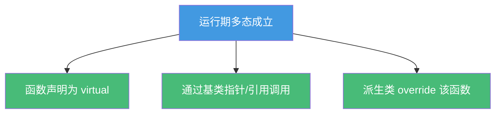
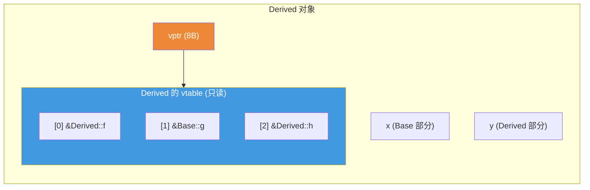

# 精通 C++ 虚函数与多态

> 课程编号：C08
> 路线图来源：现代 C++ 全栈深度课程 — 对象模型与 OOP
> 难度：⭐⭐⭐⭐⭐
> 预计阅读时间：60 分钟
> 📅 内容基准：**C++23** + GCC 14 / Clang 18 / MSVC 19.4x

---

## 引言：这段代码会调用哪个函数？

```cpp
#include <iostream>

struct Base {
    virtual void who() { std::cout << "Base\n"; }
    ~Base() { std::cout << "~Base\n"; }      // 注意：不是 virtual
};
struct Derived : Base {
    void who() override { std::cout << "Derived\n"; }
    ~Derived() { std::cout << "~Derived\n"; }
};

void demo() {
    Base* p = new Derived();
    p->who();                 // 1) 打印 Base 还是 Derived？
    delete p;                 // 2) 会打印 ~Derived 吗？

    Derived d;
    Base b = d;               // 3) b.who() 打印什么？
}
```

答案：① 打印 **Derived**——`who()` 是虚函数，通过 `p` 的**动态类型**分派（运行期决定）；② **只打印 `~Base`**——基类析构不是 `virtual`，`delete p` 只调用 `Base::~Base`，`Derived` 的析构被跳过，这是**经典内存/资源泄漏**（未定义行为）；③ 打印 **Base**——`Base b = d` 发生**对象切片（slicing）**，只拷贝了 `Base` 子对象，`b` 的动态类型就是 `Base`（C09 详解切片）。

虚函数是 C++ **运行期多态**的核心机制。但"虚"不是魔法——它由编译器用一张**虚函数表（vtable）** 和一个**虚指针（vptr）** 实现。不理解 vtable/vptr 的内存布局，就解释不了"为什么基类析构要 virtual""为什么构造期间调虚函数不多态""为什么虚函数有调用开销"。这一章把多态的底层机制彻底拆开。

---

## 第一章：虚函数与动态分派

### 1.1 静态绑定 vs 动态绑定

```cpp
struct Animal {
    void eat()         { std::cout << "Animal eat\n"; }  // 非虚：静态绑定
    virtual void sound(){ std::cout << "Animal sound\n"; }// 虚：动态绑定
};
struct Dog : Animal {
    void eat()          { std::cout << "Dog eat\n"; }
    void sound() override { std::cout << "Woof\n"; }
};

void call(Animal& a) {
    a.eat();    // 静态绑定：永远调 Animal::eat（看引用的"静态类型"）
    a.sound();  // 动态绑定：看 a 实际指向的"动态类型"
}

int main() {
    Dog d;
    call(d);    // 输出：Animal eat / Woof
}
```

**关键区分**：

- **静态类型（static type）**：变量声明时的类型（编译期已知）。`Animal& a` 的静态类型是 `Animal`。
- **动态类型（dynamic type）**：对象运行时的实际类型。`a` 引用一个 `Dog`，动态类型是 `Dog`。
- **非虚函数**：按**静态类型**分派（编译期定死）。
- **虚函数**：按**动态类型**分派（运行期查 vtable）。

只有通过**指针或引用**调用虚函数才会触发动态分派；按值调用（如切片后）只看静态类型。

### 1.2 多态成立的三个条件



三者缺一不可：非虚 → 静态绑定；按值 → 切片；没 override → 调基类版本。

---

## 第二章：vtable 与 vptr 的内存布局

这是本章的核心。虚函数的动态分派**不是**编译器内置的语言魔法，而是用两样东西实现的：

- **vtable（虚函数表）**：每个**有虚函数的类**有一张表，是一个**函数指针数组**，存放该类所有虚函数的地址。vtable 在编译期生成，整个程序每个类只有一份（放在只读数据段）。
- **vptr（虚指针）**：每个**多态对象**里隐藏一个指针，指向其类的 vtable。vptr 由构造函数自动设置，通常放在对象内存的**最前面**。

```cpp
struct Base {
    int x;
    virtual void f();
    virtual void g();
};
struct Derived : Base {
    int y;
    void f() override;       // 覆盖 Base::f
    virtual void h();        // 新增虚函数
};
```

内存布局（64 位，指针 8 字节）：



### 2.1 一次虚调用发生了什么

`p->f()` 当 `f` 是虚函数时，编译器生成的伪代码大致是：

```cpp
// p->f()  等价于：
(*(p->vptr[index_of_f]))(p);   // 取 vptr → 查表第 index 项 → 间接调用，传 this
```

三步：① 从对象取出 vptr；② 用编译期已知的**槽位下标**索引 vtable；③ 间接调用该函数指针。**多态的本质**：`Base*` 和 `Derived*` 指向的对象 vptr 不同 → 同一个 `f` 槽位指向不同函数 → 实现"同一调用，不同行为"。

### 2.2 验证 vptr 占空间

```cpp
struct NoVirtual { int x; };               // sizeof = 4
struct HasVirtual { int x; virtual void f(); }; // sizeof = 16（vptr 8 + int x 4 + 尾部 padding 4）

static_assert(sizeof(NoVirtual)  == 4);
static_assert(sizeof(HasVirtual) == 16);   // 多了一个 vptr！
```

只要类**有任何虚函数**（含虚析构），每个对象就多出一个 vptr（8 字节）。这是"虚"的空间成本——对大量小对象很可观（C07 对象布局）。

---

## 第三章：虚析构——为什么基类析构必须 virtual

引言第 ② 个坑：通过基类指针 `delete` 派生对象，若基类析构非虚，**只调用基类析构**，派生类的析构被跳过 → 资源泄漏 / 未定义行为。

```cpp
struct Base {
    virtual ~Base() { std::cout << "~Base\n"; }   // ✅ virtual
};
struct Derived : Base {
    std::string* big = new std::string(1000, 'x');
    ~Derived() override { delete big; std::cout << "~Derived\n"; }
};

void ok() {
    Base* p = new Derived();
    delete p;        // virtual → 先 ~Derived（释放 big）再 ~Base。✅ 不泄漏
}
```

**机制**：析构也是虚函数。`delete p` 时，若 `~Base` 是虚的，运行期查 vtable 找到**最派生的析构** `~Derived` 先执行，再沿继承链向上依次执行基类析构。非虚则直接静态绑定到 `~Base`，跳过派生析构。

**准则**：**只要一个类要被当多态基类用（通过基类指针 delete），它的析构就必须 `virtual`。** 反之，如果一个类不打算被继承/多态使用，就别加虚函数（避免 vptr 开销），可用 `final` 封死。

```cpp
struct NotForPolymorphism final {  // final：禁止继承，析构无需 virtual
    ~NotForPolymorphism() {}
};
```

---

## 第四章：override、final 与纯虚

### 4.1 override —— 让编译器替你检查

```cpp
struct Base { virtual void f(int) const; };
struct Derived : Base {
    void f(int);            // ❌ 漏了 const！这是"新函数"，没覆盖，编译器不报错（隐患）
    void g(int) override;   // ❌ 编译错误：Base 没有 virtual g(int) 可覆盖
};
```

`override` 显式声明"我要覆盖基类虚函数"。如果签名不匹配（const、参数类型、返回类型不符），编译器**报错**——把"以为覆盖了其实没有"的隐蔽 bug 变成编译错误。**每个覆盖都应写 `override`**。

```cpp
struct Good : Base {
    void f(int) const override;   // ✅ 签名匹配，明确意图
};
```

### 4.2 final —— 封死覆盖与继承

```cpp
struct A { virtual void f(); };
struct B : A { void f() final; };   // f 不能再被覆盖
struct C : B { /* void f(); */ };   // ❌ 若覆盖 f 编译错误
struct D final {};                  // D 不能被继承
```

`final` 既能用于**虚函数**（禁止进一步覆盖）也能用于**类**（禁止继承）。除语义清晰外，`final` 还能帮编译器**去虚化（devirtualization）**——确定没有更派生的覆盖时，把虚调用优化成直接调用甚至内联。

### 4.3 纯虚函数与抽象类

```cpp
struct Shape {
    virtual double area() const = 0;   // 纯虚：= 0，无（或可有）实现
    virtual ~Shape() = default;        // 多态基类 → 虚析构
};
// Shape s;                            // ❌ 抽象类不能实例化

struct Circle : Shape {
    double r;
    explicit Circle(double r) : r(r) {}
    double area() const override { return 3.14159 * r * r; }  // 必须实现
};
```

含至少一个纯虚函数的类是**抽象类（abstract class）**——不能创建对象，只能作基类/接口。派生类必须实现所有纯虚函数才能实例化。这是 C++ 表达"接口"的方式。

> 纯虚函数**也可以有实现**（`= 0` 后另给定义），派生类用 `Shape::area()` 显式调用作为公共逻辑。

---

## 第五章：RTTI —— typeid 与 dynamic_cast

**RTTI（运行期类型信息）** 让你在运行期查询/转换多态对象的真实类型。

### 5.1 dynamic_cast

```cpp
struct Base { virtual ~Base() = default; };
struct Cat : Base { void meow(); };
struct Dog : Base { void bark(); };

void handle(Base* p) {
    if (Dog* d = dynamic_cast<Dog*>(p)) {   // 指针版：失败返回 nullptr
        d->bark();
    }
    // 引用版：失败抛 std::bad_cast
    // Dog& dr = dynamic_cast<Dog&>(*p);
}
```

`dynamic_cast` 沿继承层次做**安全的向下转型（downcast）**：运行期检查 `p` 真实类型是否真是 `Dog`，是则转换，否则指针版返回 `nullptr`、引用版抛 `std::bad_cast`。它**只能用于多态类型**（至少一个虚函数），因为它要靠 vptr 找到类型信息。

### 5.2 typeid

```cpp
#include <typeinfo>
Base* p = new Dog();
std::cout << typeid(*p).name() << '\n';      // Dog（解引用 → 看动态类型）
std::cout << typeid(p).name()  << '\n';      // Base*（不解引用 → 静态类型）
if (typeid(*p) == typeid(Dog)) { /* 精确匹配 */ }
```

⚠️ `typeid(*p)` 解引用才看**动态类型**；`typeid(p)`（指针本身）是**静态类型**。`typeid` 做精确类型匹配，`dynamic_cast` 做"是不是某基类的子类"——语义不同。

| | dynamic_cast | typeid |
|---|---|---|
| 用途 | 安全向下/交叉转型 | 查询确切类型 |
| 匹配 | "是 X 或其派生" | "恰好是 X" |
| 失败 | nullptr / bad_cast | 比较为 false |
| 前提 | 多态类型 | 多态对象才看动态类型 |

> 性能与设计提示：频繁 `dynamic_cast`/`typeid` 常是设计味道（应优先用虚函数派发）。RTTI 也有运行期开销，部分嵌入式项目用 `-fno-rtti` 关闭。

---

## 第六章：虚函数的开销与去虚化

虚调用比普通调用慢，原因有三：

1. **间接性**：要先取 vptr、查表、间接跳转——多了内存访问。
2. **难以内联**：编译期不知道实际调哪个函数，通常无法内联（内联是优化收益最大的来源之一，C31）。
3. **缓存/分支预测**：间接跳转对 CPU 分支预测不友好。

```cpp
// 普通调用：编译期已知地址，可内联
obj.normal();      // → 直接 call 固定地址，甚至展开

// 虚调用：运行期间接
pbase->virt();     // → mov vptr; mov func = vptr[i]; call func
```

### 6.1 去虚化（devirtualization）

编译器在**能确定动态类型**时会把虚调用优化成直接调用：

```cpp
Derived d;
d.f();                 // d 的类型确定 → 直接调 Derived::f（去虚化）
Base* p = new Derived();
static_cast<Derived*>(p)->f();   // final 类、LTO 等也能帮助去虚化
```

`final` 关键字、链接期优化（LTO）、`-O2` 以上都能促成去虚化。**别为"性能"盲目去虚**——先测量；虚函数的开销在多数场景可忽略，设计清晰更重要。

---

## 第七章：两个反直觉的坑

### 7.1 构造/析构期间调用虚函数——不多态

```cpp
struct Base {
    Base() { init(); }                 // 构造期间调虚函数
    virtual void init() { std::cout << "Base::init\n"; }
};
struct Derived : Base {
    void init() override { std::cout << "Derived::init\n"; }
};

int main() {
    Derived d;     // 输出：Base::init（不是 Derived::init！）
}
```

**为什么**：对象**从基类到派生**逐层构造。执行 `Base()` 时，`Derived` 部分尚未构造，对象的 vptr 此刻指向 **`Base` 的 vtable**（每层构造函数会把 vptr 设成本层的表）。所以构造期间虚调用只会到达**当前正在构造的那一层**，绝不会"向下"调到尚未存在的派生部分。析构期间同理（vptr 逐层"退回"基类）。

**准则**：**不要在构造/析构函数里调用虚函数并期望多态**——它不会按你想的派发。需要"初始化后多态"用两阶段初始化或工厂函数。

### 7.2 虚函数不要用默认参数

```cpp
struct Base {
    virtual void f(int x = 10) { std::cout << "Base " << x << '\n'; }
};
struct Derived : Base {
    void f(int x = 20) override { std::cout << "Derived " << x << '\n'; }
};

int main() {
    Base* p = new Derived();
    p->f();       // 输出：Derived 10  ← 函数体是 Derived 的，但默认参数是 Base 的！
}
```

**为什么**：**默认参数是静态绑定的**（编译期按静态类型 `Base` 取默认值 `10`），而**函数体是动态绑定的**（运行期派发到 `Derived::f`）。结果是"Derived 的逻辑 + Base 的默认值"——几乎一定不是你想要的。

**准则**：**虚函数别用默认参数**。如需默认值，用非虚的包装函数（NVI 模式）：

```cpp
struct Base {
    void f(int x = 10) { do_f(x); }      // 非虚，统一默认值
private:
    virtual void do_f(int x) { /* 多态实现 */ }
};
```

---

## 第八章：常见陷阱清单

### ❌ 陷阱 1：多态基类析构非 virtual

```cpp
struct Base { ~Base(); };                 // 非虚
Base* p = new Derived(); delete p;        // 只调 ~Base → 泄漏/UB
```
多态基类析构**必须** `virtual`。

### ❌ 陷阱 2：以为 override 是可选的注释

```cpp
struct D : Base { void f(int); };         // 漏了 const/参数不符 → 没覆盖，悄悄变新函数
```
加 `override` 让编译器替你检查。

### ❌ 陷阱 3：构造函数里调虚函数期待多态

```cpp
Base() { init(); }   // 调到 Base::init，不是派生版
```

### ❌ 陷阱 4：虚函数加默认参数

```cpp
virtual void f(int x = 10);   // 默认值静态绑定，函数体动态绑定 → 不一致
```

### ❌ 陷阱 5：对非多态类型用 dynamic_cast

```cpp
struct A {};                  // 无虚函数
dynamic_cast<B*>(pa);         // ❌ 编译错误：A 不是多态类型
```

### ❌ 陷阱 6：按值传递导致切片，多态失效

```cpp
void f(Base b);               // 传 Derived 进来被切片，b.virt() 只调 Base 版
```
多态要用 `Base&` / `Base*`（C09 切片）。

### ❌ 陷阱 7：用 typeid(p) 而非 typeid(*p)

```cpp
typeid(p)     // 静态类型 Base*
typeid(*p)    // 动态类型 Derived（要解引用）
```

---

## 第九章：练习题

**练习 1**：`sizeof(struct{ int x; virtual void f(); })` 在 64 位下是多少？为什么？

**练习 2**：用一句话说清"虚函数如何实现动态分派"（vptr/vtable）。

**练习 3**：为什么基类析构要 `virtual`？不加会怎样？

**练习 4**：预测输出并解释：
```cpp
struct B { B(){ f(); } virtual void f(){ puts("B"); } };
struct D : B { void f() override { puts("D"); } };
int main(){ D d; }
```

**练习 5**：找问题：
```cpp
struct Base { virtual void g(double x = 1.0) { /*...*/ } };
struct Der : Base { void g(double x = 2.0) override { /*...*/ } };
// Base* p = new Der(); p->g();  // 用了什么默认值？逻辑是谁的？
```

---

## 参考答案与解析

**练习 1**：**16 字节**。Itanium ABI 下 `vptr`（8）位于对象**最前面**（偏移 0），其后是 `int x`（4）+ 4 字节尾部 padding（对齐到 8）= 16。只要有虚函数，对象就多一个 vptr（8 字节），并按指针对齐。

**练习 2**：每个多态对象含一个 vptr 指向其类的 vtable（函数指针数组）；虚调用 = 取 vptr → 用编译期固定的槽位下标查表 → 间接调用。不同动态类型的 vptr 指向不同 vtable，同一槽位指向不同实现，从而"同一调用、不同行为"。

**练习 3**：因为析构是虚函数才会在 `delete 基类指针` 时按动态类型派发到最派生析构，再逐层向上析构。不加 `virtual`：`delete p` 静态绑定到基类析构，**跳过派生类析构**，泄漏派生类资源——标准规定为未定义行为。

**练习 4**：输出 **B**。`D d` 先构造基类 `B`，`B()` 里调 `f()`；此时对象 vptr 指向 `B` 的 vtable（`D` 部分还没构造），派发到 `B::f`。构造期间虚函数不"向下"多态。

**练习 5**：`p->g()` 用的是 **`Base` 的默认值 `1.0`**（默认参数按静态类型 `Base*` 静态绑定），但执行的是 **`Der::g` 的函数体**（动态绑定）。即"Der 的逻辑 + Base 的默认值"，几乎一定是 bug。修正：虚函数别用默认参数，或用 NVI 包装。

---

## 小结

| 知识点 | 关键记忆 |
|---|---|
| 动态分派 | 虚函数按**动态类型**派发；需 virtual + 指针/引用 + override |
| vtable/vptr | 每类一张 vtable（函数指针数组）；每对象一个 vptr 指向它 |
| 虚调用机制 | 取 vptr → 查固定槽位 → 间接调用，多 1 次内存访问 |
| 虚析构 | 多态基类析构**必须 virtual**，否则 delete 泄漏/UB |
| override/final | override 让编译器查覆盖；final 封死覆盖/继承、助去虚化 |
| 纯虚/抽象类 | `= 0` 定义接口，抽象类不可实例化 |
| RTTI | dynamic_cast 安全向下转型；typeid(*p) 看动态类型 |
| 开销 | vptr 占空间、虚调用间接且难内联；可去虚化 |
| 构造期虚调用 | 不多态——vptr 逐层设置，只到当前层 |
| 默认参数 | 静态绑定 → 虚函数别用默认参数 |

---

## 📅 2026 现状/更新

- 虚函数模型（vtable/vptr）自 C++ 诞生稳定至今；`override`/`final`（C++11）已是事实标准写法，`-Wsuggest-override`/`-Wnon-virtual-dtor` 帮你发现遗漏。
- **去虚化** 在 `-O2`/LTO 下日益强大；`final` 是给优化器的明确提示。
- C++23 的 **deducing this（显式对象形参，C32）** 让部分"奇异递归/静态多态"写法更简洁，但不取代运行期多态。
- 设计趋势：能用**静态多态（模板/CRTP，C09）** 或 `std::variant + std::visit` 表达的封闭集合，常比虚函数更快、更易内联；开放集合（插件式）仍用虚函数。先按可读性选择，性能用 profiler 定夺。

---

> 🔁 下一篇 **C09 — 精通 C++ 继承与 CRTP**：public/protected/private 继承的语义、菱形继承与虚继承的内存布局、对象切片为什么危险、以及用 CRTP 实现"零开销"的静态多态、mixin 与策略组合。
>
> 反馈：把"vtable/vptr 如何实现分派""多态基类析构必须 virtual""构造期虚调用不多态"这三条钉死——它们是 C++ 对象模型一切困惑的根源。
