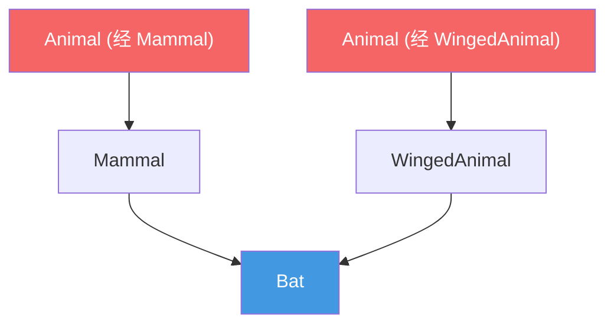
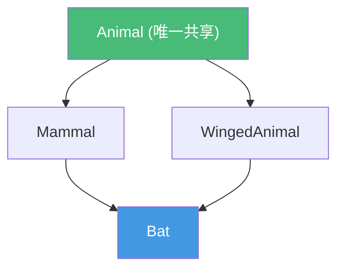
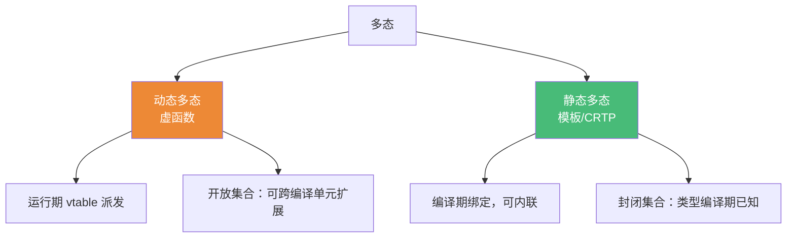

# 精通 C++ 继承与 CRTP

> 课程编号：C09
> 路线图来源：现代 C++ 全栈深度课程 — 对象模型与 OOP
> 难度：⭐⭐⭐⭐
> 预计阅读时间：60 分钟
> 📅 内容基准：**C++23** + GCC 14 / Clang 18 / MSVC 19.4x

---

## 引言：这几个继承问题，你能立刻答对吗？

```cpp
struct Base { int x = 1; void hi(); };

struct A : public Base {};     // 1) A 对象能在外部访问 x 吗？
struct B : private Base {};     // 2) B 对象能在外部访问 x 吗？B 内部呢？

struct Animal { virtual void sound(); };
struct Dog : Animal { void sound() override; int leash; };

void feed(Animal a);            // 3) 传一个 Dog 进来会发生什么？

struct D1 : Base {}; struct D2 : Base {};
struct Diamond : D1, D2 {};      // 4) Diamond 里有几份 Base::x？
```

答案：① **能**——`public` 继承保持基类公有成员对外可见；② **不能在外部访问**，但 **B 内部可以**——`private` 继承把基类公有/保护成员都变成 B 的私有；③ **对象切片**——`Animal a` 按值接收，只拷贝 `Dog` 的 `Animal` 子对象，`leash` 丢失，且 `a.sound()` 只调 `Animal` 版（多态失效）；④ **两份**！`Diamond` 经 D1、D2 各继承一份 `Base`，`diamond.x` **二义性**（编译错误）——这就是菱形继承，需 `virtual` 继承解决。

继承是 OOP 的支柱，但 C++ 的继承细节极多：三种继承访问、菱形/虚继承的内存布局、切片陷阱。而 **CRTP（奇异递归模板模式）** 提供了一条"零运行期开销"的多态之路——**静态多态**。这一章把"动态多态"与"静态多态"放在一起对比，让你知道什么时候该用哪个。

---

## 第一章：三种继承访问

继承方式（`public`/`protected`/`private`）控制**基类成员在派生类中的访问级别**，以及**派生类对外是否表现为"是一个"基类**。

```cpp
struct Base {
public:    int pub;
protected: int prot;
private:   int priv;
};

struct Pub : public Base {
    // pub→public, prot→protected, priv→不可访问
};
struct Prot : protected Base {
    // pub→protected, prot→protected, priv→不可访问
};
struct Priv : private Base {
    // pub→private, prot→private, priv→不可访问
};
```

| 基类成员 | `public` 继承 | `protected` 继承 | `private` 继承 |
|---|---|---|---|
| public | public | protected | private |
| protected | protected | protected | private |
| private | 不可访问 | 不可访问 | 不可访问 |

**注意**：派生类**永远访问不到基类的 private 成员**（不论哪种继承）。private 成员只是"存在并被继承（占内存）"，但不可直接访问。

### 1.1 "is-a" vs "用基类实现"

```cpp
class Stack : private std::vector<int> {  // private 继承：Stack "用 vector 实现"
public:                                    // 但 Stack 不是 vector（不能当 vector 用）
    using std::vector<int>::push_back;     // 选择性暴露
    using std::vector<int>::pop_back;
    int top() const { return back(); }
};
```

- **`public` 继承 = "is-a"（是一个）**：`Derived` 可以当 `Base` 用，是真正的子类型，多态的基础。
- **`private`/`protected` 继承 = "用…实现"**：复用基类实现细节但**不**是子类型，外部不能把它当基类用。

⚠️ 现代准则：**优先用组合（成员）而非 private 继承**——`Stack` 持有一个 `std::vector` 成员通常更清晰。private 继承主要用于需要访问 protected 成员、EBO（空基类优化，C07）或覆盖虚函数的少数场景。

---

## 第二章：对象切片（slicing）

引言第 ③ 个坑。**按值**把派生对象赋给/传给基类，只拷贝基类子对象，派生部分被"切掉"。

```cpp
struct Animal { virtual void sound() { std::cout << "..."; } int legs = 4; };
struct Dog : Animal { void sound() override { std::cout << "Woof"; } int leash = 1; };

void byValue(Animal a) { a.sound(); }   // ❌ 切片：a 是纯 Animal

int main() {
    Dog d;
    byValue(d);             // 切片 → 输出 "..."（Animal 版），leash 丢失
    Animal a = d;           // 切片：a 只含 Animal 部分，vptr 是 Animal 的

    std::vector<Animal> v;
    v.push_back(d);         // ❌ 容器存值 → 整个 vector 全是被切片的 Animal
}
```

**为什么切片破坏多态**：`Animal a = d` 调用的是 `Animal` 的拷贝构造，只复制 `Animal` 子对象，**并把 `a` 的 vptr 设为 `Animal` 的 vtable**。所以 `a.sound()` 静态/动态都只到 `Animal`。

**避免切片**：多态一律用**引用或指针**，存多态对象用 `std::vector<std::unique_ptr<Animal>>`：

```cpp
void byRef(Animal& a) { a.sound(); }              // ✅ 引用，多态正常
std::vector<std::unique_ptr<Animal>> zoo;
zoo.push_back(std::make_unique<Dog>());            // ✅ 存指针，不切片
```

---

## 第三章：菱形继承与虚继承

### 3.1 菱形问题

```cpp
struct Animal { int age; };
struct Mammal : Animal {};
struct WingedAnimal : Animal {};
struct Bat : Mammal, WingedAnimal {};   // 菱形！

Bat b;
// b.age;                 // ❌ 二义性：Mammal::Animal::age 还是 WingedAnimal::Animal::age？
b.Mammal::age = 1;        // 要显式指定走哪条路径
b.WingedAnimal::age = 2;  // 这是另一份 age！
```

`Bat` 里有**两份** `Animal` 子对象（一份来自 Mammal，一份来自 WingedAnimal）。访问 `age` 二义，且逻辑上 `Bat` 应该只有一个 `age`。



### 3.2 虚继承解决

```cpp
struct Animal { int age; };
struct Mammal : virtual Animal {};        // virtual 继承
struct WingedAnimal : virtual Animal {};  // virtual 继承
struct Bat : Mammal, WingedAnimal {};

Bat b;
b.age = 5;                // ✅ 只有一份 Animal，不再二义
```

`virtual` 继承让 `Bat` 中**只有一份共享的 `Animal` 子对象**，Mammal 和 WingedAnimal 共用它。



### 3.3 虚继承的内存代价

虚继承不是免费的。为了让多个派生路径共享同一个虚基类子对象，编译器引入**间接**：每个虚继承的子对象里多一个 **vbptr（虚基类指针）/ 偏移信息**，运行期通过它定位共享虚基类的位置。

```cpp
struct Empty {};
struct V1 : virtual Empty {};
// sizeof(V1) 通常 > 1：含定位虚基类的指针/偏移
```

后果：① 对象更大（多了 vbptr）；② 访问虚基类成员要一次间接寻址；③ 虚基类由**最派生类**负责初始化（构造顺序特殊）。

```cpp
struct Animal { int age; Animal(int a) : age(a) {} };
struct Mammal : virtual Animal { Mammal() : Animal(0) {} };
struct WingedAnimal : virtual Animal { WingedAnimal() : Animal(0) {} };
struct Bat : Mammal, WingedAnimal {
    Bat() : Animal(3) {}   // ✅ 最派生类直接初始化虚基类；中间类的 Animal(0) 被忽略
};
```

**准则**：菱形继承尽量避免；接口（纯虚、无数据成员）的菱形用虚继承代价小且常见（如 iostream 体系）。带数据的菱形要谨慎。

---

## 第四章：CRTP —— 静态多态

**CRTP（Curiously Recurring Template Pattern，奇异递归模板模式）**：派生类把**自己**作为模板实参传给基类。

```cpp
template <class Derived>
struct Base {
    void interface() {
        // 把 this 转成 Derived，调用派生类实现——编译期绑定！
        static_cast<Derived*>(this)->impl();
    }
};

struct Concrete : Base<Concrete> {       // 把自己传给 Base
    void impl() { std::cout << "Concrete::impl\n"; }
};

int main() {
    Concrete c;
    c.interface();   // → 编译期解析到 Concrete::impl，可内联，零虚开销
}
```

**机制**：`Base<Derived>` 在编译期就知道派生类型，`static_cast<Derived*>(this)->impl()` 是**静态绑定**——没有 vtable、没有 vptr、没有间接跳转，**可被内联**。这就是"静态多态"：用模板在编译期实现"基类调用派生实现"的效果。

### 4.1 CRTP 典型用途：复用接口

```cpp
template <class Derived>
struct Comparable {
    bool operator!=(const Derived& o) const {
        // 用派生类的 == 自动派生 !=
        return !static_cast<const Derived&>(*this).operator==(o);
    }
};

struct Point : Comparable<Point> {
    int x, y;
    bool operator==(const Point& o) const { return x == o.x && y == o.y; }
    // != 由 CRTP 基类免费提供（C++20 后可直接靠 == 自动生成，见 C10）
};
```

### 4.2 CRTP 计数器（统计实例数）

```cpp
template <class T>
struct Counter {
    static inline int count = 0;
    Counter()  { ++count; }
    ~Counter() { --count; }
};
struct Widget : Counter<Widget> {};   // 每个派生类有独立计数（不同 T → 不同静态成员）
```

---

## 第五章：mixin 与策略组合

**mixin**：用模板把一组"可拼装"的行为混入一个类。常配合 CRTP 或多重继承实现。

```cpp
// 各自独立的能力
template <class T> struct Printable {
    void print() const { std::cout << static_cast<const T&>(*this).to_string() << '\n'; }
};
template <class T> struct Serializable {
    std::string serialize() const { return static_cast<const T&>(*this).to_string(); }
};

// 组合多个 mixin
struct Message : Printable<Message>, Serializable<Message> {
    std::string body;
    std::string to_string() const { return "Msg(" + body + ")"; }
};

int main() {
    Message m{ .body = "hi" };
    m.print();           // 来自 Printable
    m.serialize();       // 来自 Serializable
}
```

mixin 让能力**按需组合**而非僵硬的单继承层次，且全是编译期绑定（零开销）。**策略模式（policy-based design）** 是其推广：把可变行为作为模板参数注入。

```cpp
template <class StoragePolicy>
class Container : private StoragePolicy {   // 注入存储策略
    using StoragePolicy::allocate;          // 复用策略实现
};
```

---

## 第六章：静态多态 vs 动态多态



| 维度 | 动态多态（virtual） | 静态多态（CRTP/模板） |
|---|---|---|
| 绑定时机 | 运行期（vtable） | 编译期 |
| 开销 | vptr + 间接调用，难内联 | 零运行期开销，可内联 |
| 灵活性 | 运行期可换类型、异构容器 | 类型编译期定死 |
| 扩展 | 开放：插件、跨 DLL | 封闭：需重编译 |
| 代码膨胀 | 一份代码 | 每个类型实例化一份 |
| 错误信息 | 清晰 | 模板报错冗长 |
| 典型场景 | GUI 控件、插件、`Shape*` 集合 | 数值库、表达式模板、零开销接口 |

**怎么选**：

- 需要**运行期才知道类型**、**异构容器**（`vector<unique_ptr<Base>>`）、**跨编译边界扩展**（插件）→ **动态多态**。
- 类型**编译期已知**、对**性能敏感**（热路径、数值计算）、要内联 → **静态多态（CRTP）**。
- C++17 的 `std::variant + std::visit` 是第三条路：**封闭集合**的多态，无虚函数、无堆分配（C32）。

---

## 第七章：常见陷阱清单

### ❌ 陷阱 1：按值传递/存储多态对象 → 切片

```cpp
void f(Base b);                 // 切片！要 Base& / Base*
std::vector<Base> v;            // 切片！要 vector<unique_ptr<Base>>
```

### ❌ 陷阱 2：误用 private 继承表达 is-a

```cpp
class Cat : private Animal {};   // 外部不能把 Cat 当 Animal，多态失效
```
is-a 用 `public` 继承；复用实现优先用组合。

### ❌ 陷阱 3：带数据成员的菱形不用虚继承

```cpp
struct D : B1, B2 {};   // B1,B2 各含一份 Base → 二义、双份数据
```
共享语义要 `virtual` 继承。

### ❌ 陷阱 4：CRTP 里 static_cast 到错误的 Derived

```cpp
struct Wrong : Base<Concrete> {};   // 传错类型 → static_cast 到 Concrete 是 UB
```
CRTP 必须传"自己"：`struct X : Base<X>`。

### ❌ 陷阱 5：虚基类初始化交给中间类

```cpp
struct Bat : Mammal, WingedAnimal { Bat() {} };  // 忘了初始化虚基类 Animal（若无默认构造则错）
```
**最派生类**负责初始化虚基类。

### ❌ 陷阱 6：CRTP 基类在 Derived 不完整时访问其成员

```cpp
template<class D> struct Base {
    using X = typename D::value_type;   // 实例化时 D 可能还不完整 → 编译错误
};
```
访问派生类型成员要延迟到成员函数体内（此时 D 已完整）。

---

## 第八章：练习题

**练习 1**：`private` 继承下，基类的 public 成员在派生类外部能访问吗？派生类内部呢？

**练习 2**：解释对象切片，并说出两种避免方式。

**练习 3**：菱形继承不加 `virtual` 会有几份基类子对象？加了呢？谁负责初始化虚基类？

**练习 4**：CRTP 如何在不用虚函数的情况下实现"基类调用派生实现"？它相比虚函数的优劣？

**练习 5**：下面要表达"Stack 是用 vector 实现的，但不是 vector"，用哪种继承？或更好的方案是什么？
```cpp
class Stack /* : ??? std::vector<int> */ { /*...*/ };
```

---

## 参考答案与解析

**练习 1**：外部**不能**访问（private 继承把基类 public 成员变成派生类的 private）；派生类**内部能**访问（它对自己的 private 成员可见）。

**练习 2**：切片 = 把派生对象按值赋给/传给基类时，只拷贝基类子对象、丢弃派生部分，且 vptr 被设为基类的 → 多态失效。避免：① 多态一律用引用/指针（`Base&`/`Base*`）；② 容器存 `std::unique_ptr<Base>` 而非 `Base`。

**练习 3**：不加 `virtual`：**两份**基类子对象（每条继承路径一份），访问共享成员二义。加 `virtual`：**一份**共享子对象。**最派生类**负责直接初始化虚基类（中间类对虚基类的初始化被忽略）。

**练习 4**：基类是模板 `Base<Derived>`，编译期已知派生类型，用 `static_cast<Derived*>(this)->impl()` **静态绑定**调用派生实现——无 vtable/vptr，可内联（零运行期开销）。劣势：类型编译期定死（不能异构容器、不能运行期扩展）、代码膨胀、模板报错冗长。

**练习 5**：可用 `private` 继承（"用 vector 实现，非 is-a"），配合 `using` 选择性暴露接口。但**更推荐组合**：`class Stack { std::vector<int> v; ... };`——更清晰、耦合更低，是现代首选。

---

## 小结

| 知识点 | 关键记忆 |
|---|---|
| 三种继承 | public=is-a；private/protected=用…实现，非子类型 |
| private 成员 | 被继承占内存，但派生类不可直接访问 |
| 对象切片 | 按值赋给基类 → 丢派生部分 + vptr 变基类；用引用/指针避免 |
| 菱形继承 | 默认两份基类、二义；`virtual` 继承共享一份 |
| 虚继承代价 | 多 vbptr/偏移、间接寻址；最派生类初始化虚基类 |
| CRTP | `X : Base<X>`，static_cast 到 Derived，编译期静态多态 |
| mixin/策略 | 模板拼装行为，零开销组合 |
| 静态 vs 动态 | 编译期已知+性能→CRTP；运行期/异构/扩展→virtual |

---

## 📅 2026 现状/更新

- 现代准则（C++ Core Guidelines）：**public 继承表达 is-a，其余优先组合**；多态用引用/指针；避免带数据的菱形。
- **CRTP** 仍是高性能库的常用手法，但 C++23 的 **deducing this（显式对象形参，C32）** 在很多场景能替代 CRTP，写法更直观：`void f(this Self&& self)` 直接拿到派生类型。
- **`std::variant + std::visit`** 作为"封闭集合多态"日益流行——无虚函数、无堆分配、编译期穷尽检查，是 `Shape*` 体系的现代替代之一。
- 空基类优化（EBO，C07）让无状态 mixin/策略不增加对象大小；`[[no_unique_address]]`（C++20）进一步用于成员组合。

---

> 🔁 下一篇 **C10 — 精通 C++ 运算符重载与三路比较**：operator 重载规则与成员/非成员的选择、`explicit` 转换、C++20 三路比较 `<=>`（strong/weak/partial_ordering）如何一行省掉六个比较运算符、`==` 的自动生成、用户定义字面量与函数调用运算符。
>
> 反馈：把"切片为什么破坏多态""虚继承为什么共享一份""CRTP 如何零开销静态多态"三条钉死——它们贯穿整个 C++ 对象模型。
