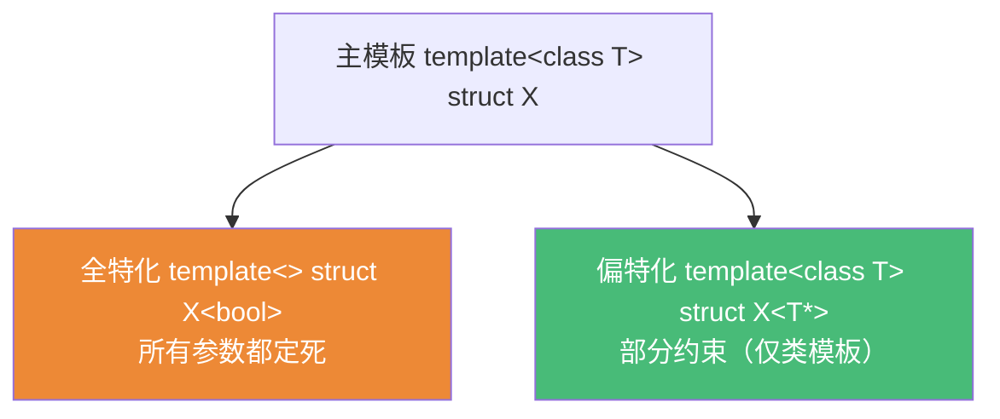

# 精通 C++ 模板基础

> 课程编号：C11
> 路线图来源：现代 C++ 全栈深度课程 — 模板与泛型
> 难度：⭐⭐⭐⭐
> 预计阅读时间：60 分钟
> 📅 内容基准：**C++23** + GCC 14 / Clang 18 / MSVC 19.4x

---

## 引言：模板到底"是"什么？

```cpp
template<class T>
T max(T a, T b) { return a > b ? a : b; }

int main() {
    max(1, 2);          // 1) 这里发生了什么？编译了几个函数？
    max(1.0, 2.0);      // 2) 和上面是同一个函数吗？
    max(1, 2.0);        // 3) 能编译吗？
    max<double>(1, 2);  // 4) 这又是什么意思？
}
```

答案：① 编译器看到 `max(1,2)` 时**推导** `T=int`，**实例化**出一个 `max<int>` 函数——模板本身不是函数，是"生成函数的配方"；② `max(1.0,2.0)` 推出 `T=double`，是**另一个**实例化的函数（与 `max<int>` 完全独立的代码）；③ **编译失败**——`1` 推 `T=int`、`2.0` 推 `T=double`，同一个 `T` 不能既是 `int` 又是 `double`（模板实参推导不做隐式转换）；④ `max<double>(1,2)` **显式指定** `T=double`，`1`、`2` 被转换成 `double`，正常工作。

**模板不是代码，是生成代码的蓝图。** 编译器在你用到它的时候，按实参"填空"，生成具体的函数/类——这个过程叫**实例化**。理解"模板是配方、实例化才产代码"是后续所有泛型（C12 可变参数、C13 元编程、C14 Concepts）的基础。

---

## 第一章：函数模板

### 1.1 定义与实参推导

```cpp
template<typename T>     // typename 与 class 在这里完全等价
T add(T a, T b) { return a + b; }

add(1, 2);               // 推导 T=int → 实例化 add<int>
add(1.5, 2.5);           // 推导 T=double → 实例化 add<double>
add<long>(1, 2);         // 显式指定 T=long
```

实参推导的核心规则：**编译器从调用实参的类型反推模板参数**，但**不做隐式转换**（除少数退化，如数组退化为指针、顶层 const 忽略）。

```cpp
template<class T> void f(T x);
template<class T> void g(const T& x);

int a[10];
f(a);          // T=int*（数组退化为指针）
const int ci=0;
f(ci);         // T=int（按值传递，顶层 const 被忽略）
g(ci);         // T=int（引用绑 const，const 进入引用本身）
```

### 1.2 模板参数的三种形式

```cpp
template<class T>            void a();   // ① 类型参数
template<int N>             void b();   // ② 非类型参数（NTTP）：编译期常量
template<template<class> class C> void c();  // ③ 模板模板参数
```

| 形式 | 例子 | 说明 |
|---|---|---|
| 类型参数 | `template<class T>` | 最常见，T 是一个类型 |
| 非类型参数 | `template<int N>` / `template<auto V>` | 编译期常量（整数、指针、引用、C++20 起的字面类型） |
| 模板模板参数 | `template<template<class> class C>` | 参数本身是一个模板 |

```cpp
template<class T, std::size_t N>
struct Array { T data[N]; };           // N 是非类型参数（数组大小要编译期常量）
Array<int, 16> arr;                    // N=16
```

---

## 第二章：类模板

### 2.1 定义与显式实参

类模板和函数模板的关键区别：**类模板不能从构造实参推导模板参数**（C++17 前），必须显式写出（或靠 CTAD，见 2.3）。

```cpp
template<class T>
class Stack {
    std::vector<T> data_;
public:
    void push(const T& x) { data_.push_back(x); }
    void push(T&& x)      { data_.push_back(std::move(x)); }
    T pop() { T v = std::move(data_.back()); data_.pop_back(); return v; }
    bool empty() const { return data_.empty(); }
};

Stack<int> s;            // 必须写 <int>（C++17 前）
s.push(42);
```

### 2.2 类外定义成员

```cpp
template<class T>
class Box {
    T value_;
public:
    T get() const;       // 声明
};

// 类外定义：每个成员都要重复 template 头，并加 Box<T>::
template<class T>
T Box<T>::get() const { return value_; }
```

### 2.3 CTAD（类模板实参推导，C++17）

C++17 起，类模板也能从构造实参推导：

```cpp
std::vector v{1, 2, 3};      // CTAD：推导 std::vector<int>
std::pair p{1, 2.0};         // std::pair<int,double>

template<class T> struct Wrap { Wrap(T); };
Wrap w{42};                  // 推导 Wrap<int>（隐式推导指引）
```

---

## 第三章：特化与偏特化

模板是"通用配方"，但某些类型需要**特殊处理**——这就是特化。



### 3.1 全特化（full specialization）

为某个**具体类型**提供完全不同的实现：

```cpp
template<class T>
struct TypeName { static const char* get() { return "unknown"; } };

template<>                                  // 空 template<>
struct TypeName<int> { static const char* get() { return "int"; } };

template<>
struct TypeName<bool> { static const char* get() { return "bool"; } };

TypeName<int>::get();    // "int"（命中全特化）
TypeName<double>::get(); // "unknown"（落回主模板）
```

### 3.2 偏特化（partial specialization）

为**一类类型**（如"所有指针"）定制——**只有类模板能偏特化，函数模板不能**：

```cpp
template<class T>
struct IsPointer { static constexpr bool value = false; };

template<class T>                    // 仍有模板参数 T
struct IsPointer<T*> { static constexpr bool value = true; };  // 偏特化：匹配所有指针

IsPointer<int>::value;   // false
IsPointer<int*>::value;  // true（命中偏特化）
```

### 3.3 函数模板为什么不能偏特化？

**函数模板不能偏特化**（只能全特化），但可以用**重载**达到等效效果——而且重载通常是更好的选择：

```cpp
template<class T> void f(T);        // 主模板
// template<class T> void f(T*);   // ❌ 这不是偏特化，而是另一个重载！
template<class T> void f(T*);       // ✅ 正确理解：这是函数模板重载
```

原因：函数有重载决议机制，偏特化会与重载规则产生歧义，标准索性禁止。**记住：类模板偏特化，函数模板用重载。**

---

## 第四章：实例化——隐式 vs 显式

### 4.1 隐式实例化

默认情况下，编译器**只在你用到时**才实例化，且**只实例化用到的成员**：

```cpp
template<class T>
struct Widget {
    void used()   { /* ... */ }
    void unused() { T{}.no_such_method(); }  // 即使非法，没调用就不实例化
};

Widget<int> w;
w.used();        // 只实例化 used()，unused() 从未实例化 → 不报错
```

这是模板"按需实例化"的特性：未被使用的成员函数不会被检查实例化。

### 4.2 显式实例化

可以**强制**编译器在某处实例化（常用于把模板定义藏进 .cpp、减少编译开销）：

```cpp
// foo.cpp 里
template<class T> T square(T x) { return x*x; }
template int square<int>(int);          // 显式实例化定义：在此 TU 生成 square<int>

// foo.h 里（其他 TU 用）
extern template int square<int>(int);   // 显式实例化声明：别在我这 TU 再生成
```

`extern template`（C++11）告诉编译器"这个实例在别处生成了，别重复生成"，能显著减少编译时间和目标文件膨胀。

---

## 第五章：两阶段查找（two-phase lookup）

模板里的名字查找分**两个阶段**，这是模板最反直觉的机制之一：


- **阶段一（定义时）**：解析**非依赖名**（不依赖模板参数的名字）、语法检查。
- **阶段二（实例化时）**：解析**依赖名**（依赖模板参数 `T` 的名字），此时才知道 `T` 是什么。

```cpp
template<class T>
struct Derived : T {
    void f() {
        // helper();        // ❌ 阶段一就查找，找不到基类的 helper（基类依赖 T）
        this->helper();     // ✅ this-> 使其成为依赖名，推迟到阶段二查找
        T::helper();        // ✅ 显式限定也可以
    }
};
```

这就是为什么 CRTP / 继承模板基类时，调基类成员常要写 `this->` 或 `Base::`——**让名字变成依赖名，推迟到知道 T 之后再查找**（C15 详解依赖名与 `typename`/`template` 消歧）。

---

## 第六章：模板与重载决议

当函数模板与普通函数都能匹配时，决议规则是：

1. **普通（非模板）函数优先**——若匹配度相同，选非模板。
2. 模板之间，**更特化的优先**（偏序规则）。
3. 需要类型转换的匹配，输给精确匹配。

```cpp
template<class T> void f(T)        { std::puts("template"); }
void f(int)                        { std::puts("plain int"); }
template<class T> void f(T*)       { std::puts("template T*"); }

f(42);        // "plain int"（非模板优先于同等匹配的模板）
f(42.0);      // "template"（只有模板能匹配 double）
int x; f(&x); // "template T*"（T* 比 T 更特化）
```

| 候选 | 规则 |
|---|---|
| 非模板 vs 模板，匹配相同 | 非模板赢 |
| 模板 vs 模板 | 更特化的赢（偏序） |
| 精确匹配 vs 需转换 | 精确匹配赢 |

⚠️ 与转发引用结合时要小心：`template<class T> void f(T&&)` 会"贪婪"匹配一切，常意外击败普通重载（C04 第五章），需用 Concepts（C14）约束。

---

## 第七章：常见陷阱清单

### ❌ 陷阱 1：以为模板定义能放 .cpp

```cpp
// box.h
template<class T> struct Box { T get(); };
// box.cpp
template<class T> T Box<T>::get() { ... }   // ❌ 其他 TU 用 Box<int> 时找不到定义 → 链接错误
```
模板的**定义**（不只是声明）必须对实例化处可见，因此**通常整个写在头文件里**（或用显式实例化，见 4.2）。

### ❌ 陷阱 2：实参推导期望隐式转换

```cpp
template<class T> T max(T a, T b);
max(1, 2.0);             // ❌ T 既要 int 又要 double，推导失败
max<double>(1, 2.0);     // ✅ 显式指定 T
```

### ❌ 陷阱 3：试图偏特化函数模板

```cpp
template<class T> void f(T);
template<class T> void f<T*>(T*);  // ❌ 语法错误：函数模板不能偏特化
template<class T> void f(T*);      // ✅ 用重载
```

### ❌ 陷阱 4：忘了 typename 修饰依赖类型

```cpp
template<class T> void f() {
    T::value_type x;            // ❌ 编译器不知 value_type 是类型还是值
    typename T::value_type y;   // ✅ typename 声明它是类型（C15 详解）
}
```

### ❌ 陷阱 5：调基类模板成员不加 this->

```cpp
template<class T> struct D : Base<T> {
    void f() { method(); }       // ❌ 两阶段查找：阶段一找不到
    void g() { this->method(); } // ✅ 变依赖名，阶段二查找
};
```

### ❌ 陷阱 6：非类型参数用了非常量

```cpp
template<int N> struct A {};
int n = 10;
A<n> a;          // ❌ n 不是编译期常量
constexpr int m = 10;
A<m> b;          // ✅ constexpr
```

---

## 第八章：练习题

**练习 1**：`max(1, 2.0)` 为什么编译失败？两种修法各是什么？

**练习 2**：以下哪些是合法的模板参数？`template<class T>`、`template<int N>`、`template<double D>`（C++20 前）、`template<auto V>`、`template<template<class> class C>`。

**练习 3**：函数模板能偏特化吗？想"针对指针特殊处理"应该怎么做？

**练习 4**：解释下面为什么报错，怎么修：
```cpp
template<class T> struct D : T {
    void run() { helper(); }   // helper 是 T 的成员
};
```

**练习 5**：`extern template` 有什么用？什么场景下值得用？

---

## 参考答案与解析

**练习 1**：`1` 推 `T=int`、`2.0` 推 `T=double`，同一个 `T` 矛盾——实参推导不做隐式转换。修法：① 显式指定 `max<double>(1, 2.0)`；② 改签名为两个参数 `template<class T, class U>`（再用 `common_type` 推返回类型）。

**练习 2**：合法：`template<class T>`、`template<int N>`、`template<auto V>`、`template<template<class> class C>`。`template<double D>` 在 **C++20 前非法**（浮点不能作非类型参数）；C++20 起浮点和字面类类型可作 NTTP。

**练习 3**：**函数模板不能偏特化**（只能全特化）。针对指针特殊处理用**重载**：`template<class T> void f(T*);`——它与主模板 `f(T)` 构成重载，决议时 `T*` 更特化会被优先选中。

**练习 4**：`helper` 是依赖名（来自依赖基类 `T`），但写成裸 `helper()` 时编译器在**阶段一**就尝试查找，此时不查依赖基类 → 报错。修：`this->helper();` 或 `T::helper();`——让它成为依赖名，推迟到**阶段二**（实例化时）查找。

**练习 5**：`extern template`（C++11）声明"该模板实例在别的 TU 已显式实例化，本 TU 别再生成"。值得用的场景：某模板（如 `std::vector<MyType>`）在很多 TU 被实例化，导致编译变慢、目标文件膨胀——在头里 `extern template` 声明 + 在一个 .cpp 里显式实例化定义，可大幅减少重复实例化。

---

## 小结

| 知识点 | 关键记忆 |
|---|---|
| 模板本质 | 生成代码的配方，实例化才产代码；定义须放头文件 |
| 实参推导 | 从实参反推 T，**不做隐式转换** |
| 模板参数 | 类型 / 非类型(NTTP) / 模板模板，三种 |
| 全特化 | `template<>`，针对具体类型 |
| 偏特化 | 仅类模板可偏特化；函数模板用重载 |
| 实例化 | 隐式（按需，未用成员不检查）/ 显式（`extern template` 省编译） |
| 两阶段查找 | 非依赖名定义时查，依赖名实例化时查；基类成员加 `this->` |
| 重载决议 | 非模板优先 → 更特化优先 → 精确匹配优先 |

---

## 📅 2026 现状/更新

- 模板是 C++ 泛型的根基；C++20 **Concepts**（C14）让模板约束从晦涩的 SFINAE 转向可读的 `requires`，是模板编程的最大改善。
- C++17 **CTAD** 让类模板像函数模板一样能推导实参，配合推导指引大幅减少 `<...>` 噪音。
- C++20 起浮点、字面类类型可作**非类型模板参数**，编译期可携带更丰富的"值"。
- 编译期诊断更友好：GCC/Clang 对模板错误的输出持续改进，`-fconcepts-diagnostics-depth` 帮助定位约束失败。
- 核心准则：**模板定义放头文件、依赖名加 `this->`/`typename`、能用 Concepts 就别裸 SFINAE。**

---

> 🔁 下一篇 **C12 — 精通 C++ 可变参数模板**：parameter pack 与 `sizeof...`、递归展开 vs 折叠表达式（C++17）、完美转发参数包、`index_sequence` 与 tuple 的实现思路。
>
> 反馈：把"模板是配方、实例化才产代码"和"两阶段查找"这两条钉死——它们是模板所有困惑的根源。
