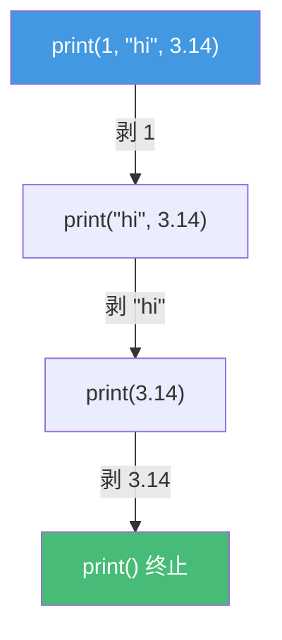
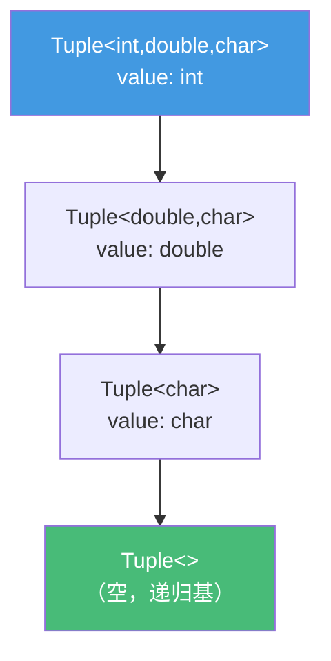

# 精通 C++ 可变参数模板

> 课程编号：C12
> 路线图来源：现代 C++ 全栈深度课程 — 模板与泛型
> 难度：⭐⭐⭐⭐⭐
> 预计阅读时间：60 分钟
> 📅 内容基准：**C++23** + GCC 14 / Clang 18 / MSVC 19.4x

---

## 引言：printf 为什么不安全，而它能？

```cpp
template<class... Args>
void log(Args... args) {
    (std::cout << ... << args) << '\n';   // 1) 这一行在做什么？
}

log(1, "hi", 3.14, 'x');     // 2) 几个参数？类型不同也行？
log();                       // 3) 零个参数能编译吗？
```

答案：① `(std::cout << ... << args)` 是 **C++17 折叠表达式**，把 `std::cout << 1 << "hi" << 3.14 << 'x'` 一次性展开——**类型安全、无格式串、任意个数**；② 四个参数，类型各异完全没问题——可变参数模板对"个数"和"类型"都泛化；③ 零参数也能编译——折叠表达式对空包有良好定义（`<<` 的一元左折叠空包是错误，但这里有初值 `std::cout`，是二元折叠，空包合法）。

可变参数模板（C++11）+ 折叠表达式（C++17）是现代 C++ 泛型库的支柱：`std::make_unique`、`emplace_back`、`std::tuple`、`std::format`、`std::invoke` 全靠它。它把"任意个数、任意类型的参数"变成**类型安全、零运行时开销**的编译期展开。

---

## 第一章：parameter pack 基础

### 1.1 三个位置的 `...`

```cpp
template<class... Ts>          // ① 模板参数包：Ts 代表 0 个或多个类型
void f(Ts... args) {           // ② 函数参数包：args 代表 0 个或多个参数
    g(args...);                // ③ 包展开：把 args 逐个展开成 a1, a2, a3...
}
```

| 位置 | 形式 | 含义 |
|---|---|---|
| 模板参数包 | `class... Ts` | 一组类型 |
| 函数参数包 | `Ts... args` | 一组函数实参 |
| 包展开 | `args...` / `pattern...` | 把包按模式逐个铺开 |

**关键直觉**：`...` 在声明位置是"打包"，在使用位置是"拆包（展开）"。

### 1.2 sizeof... 求包大小

```cpp
template<class... Ts>
void count(Ts... args) {
    std::cout << sizeof...(Ts) << '\n';     // 类型包的个数
    std::cout << sizeof...(args) << '\n';   // 参数包的个数（与上面相等）
}
count(1, 2, 3);   // 输出 3 和 3
```

`sizeof...` 是**编译期常量**，求的是包里**元素个数**（不是字节大小），可用于编译期分支、数组大小等。

### 1.3 展开模式（pattern expansion）

展开时 `...` 前面的整个**模式**会对每个元素重复：

```cpp
template<class... Ts>
void demo(Ts... args) {
    g(args...);                  // → g(a1, a2, a3)
    g(func(args)...);            // → g(func(a1), func(a2), func(a3))
    g(args + 1 ...);             // → g(a1+1, a2+1, a3+1)
    h(args)..., something;       // 模式可嵌套
}
```

---

## 第二章：递归展开（C++17 前的主流写法）

C++17 折叠表达式出现前，处理参数包靠**递归**：每次"剥掉"一个参数，直到空包触发终止重载。

```cpp
// 终止函数：零参数（递归基）
void print() { std::cout << '\n'; }

// 递归函数：剥掉第一个 first，其余 rest 继续递归
template<class T, class... Rest>
void print(T first, Rest... rest) {
    std::cout << first << ' ';
    print(rest...);              // 参数少一个，递归调用
}

print(1, "hi", 3.14);
// → print(1, "hi", 3.14)：打印 1，调 print("hi", 3.14)
// → print("hi", 3.14)   ：打印 hi，调 print(3.14)
// → print(3.14)         ：打印 3.14，调 print()
// → print()             ：换行，结束
```



**机制**：每层递归是**不同**的函数实例（`print<int,const char*,double>`、`print<const char*,double>`...），编译期全部生成。代价是模板实例化多、编译慢，且需要写终止重载——这正是折叠表达式要解决的痛点。

---

## 第三章：折叠表达式（C++17）

折叠表达式让"对包里每个元素套用同一个二元运算符"**一行搞定**，无需递归、无需终止函数。

### 3.1 四种形式

```cpp
template<class... Ts>
auto sum(Ts... args) {
    return (args + ...);          // 一元右折叠：a1 + (a2 + (a3 + ...))
}
template<class... Ts>
auto sum2(Ts... args) {
    return (... + args);          // 一元左折叠：((a1 + a2) + a3)
}
template<class... Ts>
auto sum3(Ts... args) {
    return (args + ... + 0);      // 二元右折叠：a1 + (a2 + (a3 + 0))；带初值 0
}
template<class... Ts>
auto sum4(Ts... args) {
    return (0 + ... + args);      // 二元左折叠：((0 + a1) + a2) + a3
}
```

| 形式 | 写法 | 展开 | 空包 |
|---|---|---|---|
| 一元右折叠 | `(pack op ...)` | `e1 op (e2 op (e3))` | 多数运算符**报错** |
| 一元左折叠 | `(... op pack)` | `((e1 op e2) op e3)` | 多数运算符**报错** |
| 二元右折叠 | `(pack op ... op init)` | `e1 op (e2 op (e3 op init))` | 返回 init（合法） |
| 二元左折叠 | `(init op ... op pack)` | `((init op e1) op e2) op e3` | 返回 init（合法） |

**记忆**：`...` 在运算符**右边**是右折叠，在**左边**是左折叠；**有 init（两个运算符）**就是二元折叠，对空包安全。

> 例外：一元折叠对空包，`&&` 退化为 `true`、`||` 为 `false`、`,` 为 `void()`——仅这三个运算符空包合法。

### 3.2 实战：常见折叠

```cpp
// 全部为真
template<class... Ts> bool all(Ts... a) { return (a && ...); }
// 任一为真
template<class... Ts> bool any(Ts... a) { return (a || ...); }
// 依次打印（用逗号运算符 + lambda 做副作用）
template<class... Ts>
void print(Ts... a) { ((std::cout << a << ' '), ...); }
// 把每个元素 push 进容器
template<class C, class... Ts>
void push_all(C& c, Ts... a) { (c.push_back(a), ...); }
```

逗号折叠 `(expr, ...)` 是"对每个元素执行一个语句"的惯用法——它把副作用按顺序铺开。

---

## 第四章：完美转发参数包

可变参数 + 转发引用 + `std::forward` = 泛型库的"参数透传"核心（呼应 C04）。

```cpp
template<class T, class... Args>
std::unique_ptr<T> make_unique(Args&&... args) {     // Args&&... 是转发引用包
    return std::unique_ptr<T>(
        new T(std::forward<Args>(args)...));         // 逐个完美转发
}
```

展开 `std::forward<Args>(args)...` 时，**`Args` 和 `args` 同步展开**：

```cpp
// 调用 make_unique<Widget>(a, std::move(b), 42) 时展开为：
new Widget(std::forward<A>(a), std::forward<B>(std::move(b)), std::forward<int>(42));
// 左值保持左值、右值保持右值——完美转发到构造函数
```

⚠️ **必须 `std::forward<Args>(args)...`**，不能写 `args...`——具名的 `args` 是左值（C03），裸传会把右值实参也当左值，丢失移动语义。

---

## 第五章：index_sequence 与 tuple

### 5.1 std::index_sequence：编译期下标包

很多时候我们需要"0, 1, 2, ..., N-1"这一串**编译期下标**来索引 tuple/数组。`std::index_sequence`（C++14）就是把它打包成模板参数：

```cpp
template<class Tuple, std::size_t... Is>     // Is 是下标包 0,1,2,...
void print_tuple_impl(const Tuple& t, std::index_sequence<Is...>) {
    ((std::cout << std::get<Is>(t) << ' '), ...);   // 折叠展开每个下标
}

template<class... Ts>
void print_tuple(const std::tuple<Ts...>& t) {
    print_tuple_impl(t, std::index_sequence_for<Ts...>{});  // 生成 0..N-1
}

print_tuple(std::make_tuple(1, "hi", 3.14));   // 1 hi 3.14
```

`std::make_index_sequence<N>` 生成 `index_sequence<0,1,...,N-1>`；`std::index_sequence_for<Ts...>` 是 `make_index_sequence<sizeof...(Ts)>` 的快捷写法。**这是"把 tuple 元素逐个铺开"的标准惯用法**——通过下标包，把无法直接遍历的 tuple 转成可折叠的形式。

### 5.2 tuple 实现思路

`std::tuple` 的核心是"用可变参数 + 递归继承存储异构类型"：

```cpp
template<class... Ts> struct Tuple;            // 主模板

template<> struct Tuple<> {};                  // 空 tuple（递归基）

template<class Head, class... Tail>            // 剥头存储，尾递归
struct Tuple<Head, Tail...> : Tuple<Tail...> {
    Head value;
    Tuple(Head h, Tail... t) : Tuple<Tail...>(t...), value(h) {}
};

Tuple<int, double, char> t{1, 2.5, 'x'};
// 继承链：Tuple<int,double,char> : Tuple<double,char> : Tuple<char> : Tuple<>
// 每层存一个 value，靠继承把异构类型串起来
```



真实 `std::tuple` 用更复杂的技巧（EBO 优化、下标定位）避免深继承的开销，但"可变参数递归 + 异构存储"的核心思想就是这样。`std::get<N>` 通过编译期下标定位到对应层取 `value`。

---

## 第六章：常见陷阱清单

### ❌ 陷阱 1：转发参数包忘了 forward

```cpp
template<class... Args>
auto wrap(Args&&... args) {
    return target(args...);                      // ❌ 具名 args 是左值，丢失右值性
}
// ✅ return target(std::forward<Args>(args)...);
```

### ❌ 陷阱 2：一元折叠用在空包上

```cpp
template<class... Ts> auto sum(Ts... a) { return (a + ...); }
sum();           // ❌ 一元折叠 + 空包 → 编译错误（+ 没有恒等元）
// ✅ 用二元折叠给初值：return (a + ... + 0);
```

### ❌ 陷阱 3：误以为 sizeof... 求字节数

```cpp
template<class... Ts> void f(Ts... a) {
    char buf[sizeof...(a)];      // 这是"参数个数"，不是字节大小！
}
```

### ❌ 陷阱 4：展开模式写错层级

```cpp
template<class... Ts> void f(Ts... a) {
    g((a + 1)...);     // ✅ → g(a1+1, a2+1, ...)
    g(a... + 1);       // ❌ 语法错误：... 必须在完整模式之后
}
```

### ❌ 陷阱 5：逗号折叠求值顺序误解（C++17 起有保证）

```cpp
template<class... Ts> void push(std::vector<int>& v, Ts... a) {
    (v.push_back(a), ...);   // ✅ C++17 起折叠表达式保证从左到右求值
}
```
（注意：函数实参求值顺序仍**无**保证，但折叠表达式有。）

### ❌ 陷阱 6：递归展开忘写终止重载

```cpp
template<class T, class... R> void print(T f, R... r) {
    std::cout << f; print(r...);   // ❌ 最后 print() 无匹配 → 编译错误
}
// ✅ 加 void print() {} 终止；或直接改用折叠表达式
```

---

## 第七章：练习题

**练习 1**：写出"求所有参数之积"的折叠表达式，并保证空包返回 1。

**练习 2**：`(args + ...)`、`(... + args)`、`(args + ... + 0)` 分别是哪种折叠？展开顺序如何？

**练习 3**：为什么 `make_unique` 里必须写 `std::forward<Args>(args)...` 而不是 `args...`？

**练习 4**：`std::index_sequence` 解决什么问题？为什么遍历 tuple 需要它？

**练习 5**：找 bug：
```cpp
template<class... Ts>
void print(Ts... a) { (std::cout << a); }
```

---

## 参考答案与解析

**练习 1**：`(args * ... * 1)`——二元右折叠，带初值 `1`，空包时返回 `1`（乘法恒等元）。写成一元 `(args * ...)` 对空包会报错。

**练习 2**：`(args + ...)` 一元右折叠，展开 `a1+(a2+(a3))`，从右往左结合；`(... + args)` 一元左折叠，`((a1+a2)+a3)`，从左往右；`(args + ... + 0)` 二元右折叠，`a1+(a2+(a3+0))`，带初值且空包安全。

**练习 3**：`args` 是函数体内的**具名变量**——具名右值引用本身是左值（C03/C04）。直接 `args...` 会把所有实参当左值转发，传入的右值实参丢失移动语义（变成拷贝）。`std::forward<Args>(args)...` 按 `Args` 推导出的类别恢复原值类别：左值还左值、右值还右值。

**练习 4**：tuple 存的是**异构类型**，不能用普通循环遍历（每个元素类型不同，`std::get<I>` 的 `I` 必须是编译期常量）。`std::index_sequence<0,1,...,N-1>` 把下标打包成参数包，配合折叠表达式 `std::get<Is>(t)...` 把 tuple 元素逐个"铺开"成编译期已知下标的访问——这是连接"运行时无法遍历"与"编译期包展开"的桥梁。

**练习 5**：bug：① `(std::cout << a)` **不是折叠表达式**——它只是把 `a` 当成单个表达式，但 `a` 是参数包，缺少 `...`，编译错误（包未展开）。② 即便写成折叠也缺分隔/换行。修：`((std::cout << a << ' '), ...);`——逗号折叠展开每个元素。

---

## 小结

| 知识点 | 关键记忆 |
|---|---|
| parameter pack | `class... Ts` 打包；`args...` 拆包（展开） |
| sizeof... | 编译期常量，求**元素个数**（非字节） |
| 递归展开 | 剥一个 + 递归 + 终止重载；C++17 前主流 |
| 折叠表达式 | `...` 右=右折叠、左=左折叠；带 init=二元，空包安全 |
| 完美转发包 | `Args&&... args` + `std::forward<Args>(args)...` |
| index_sequence | 编译期下标包，遍历 tuple 的钥匙 |
| tuple 思路 | 可变参数递归继承 + 异构存储 |

---

## 📅 2026 现状/更新

- 折叠表达式（C++17）已基本取代手写递归展开，代码更短、编译更快、无需终止重载。
- `std::make_unique`/`emplace_back`/`std::format`/`std::invoke`/`std::apply` 全建立在可变参数 + 完美转发之上。
- C++20 Concepts（C14）可约束参数包：`template<std::integral... Ts>`，让"对每个包元素加约束"变直观。
- C++23 起 `std::print`/`std::println` 用可变参数 + 编译期格式串检查，安全替代 `printf`。
- C++26 进展中的**包索引（pack indexing）** `Ts...[I]` 将允许直接按下标取包元素，减少对 `index_sequence` 的依赖。
- 核心准则：**优先折叠表达式、转发包务必 `std::forward`、遍历 tuple 用 `index_sequence`/`std::apply`。**

---

> 🔁 下一篇 **C13 — 精通 C++ 模板元编程与 SFINAE**：SFINAE 与 `enable_if`、`type_traits`、`void_t` 检测惯用法、`if constexpr` 编译期分支、tag dispatch，以及它们与 Concepts（C14）的关系。
>
> 反馈：把"`...` 声明处打包、使用处拆包"和"二元折叠对空包安全"这两条钉死。
