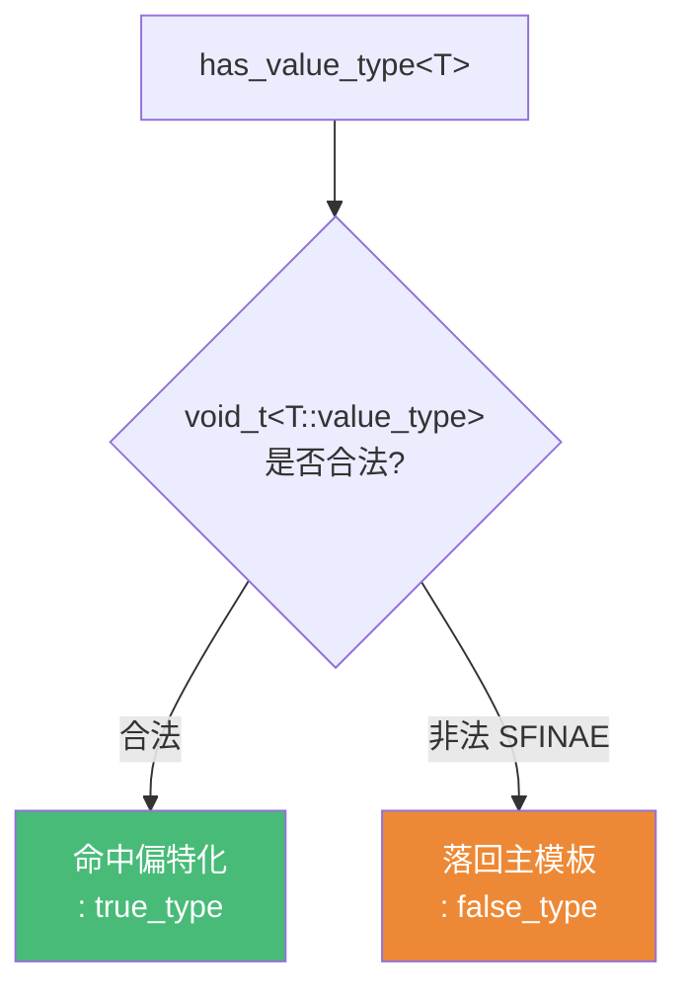
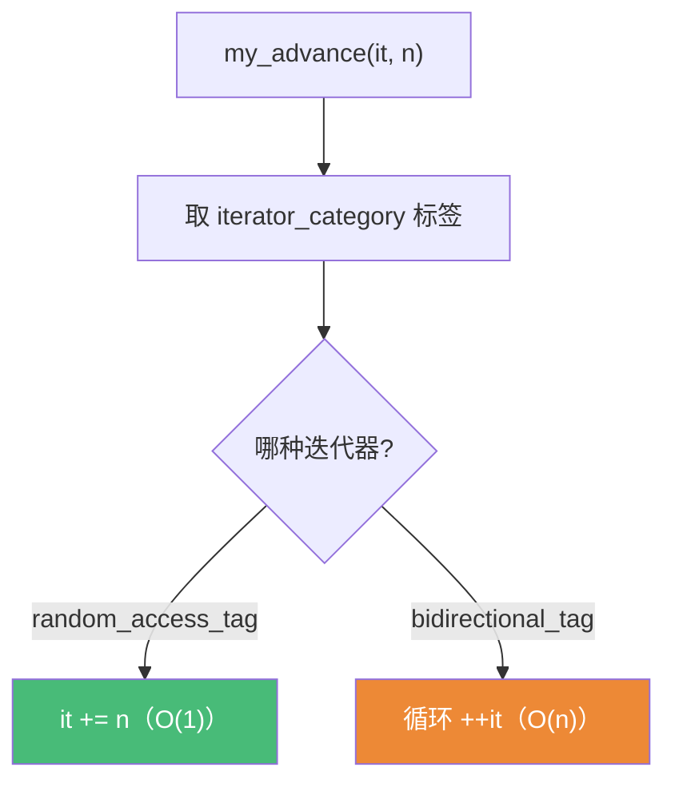

# 精通 C++ 模板元编程与 SFINAE

> 课程编号：C13
> 路线图来源：现代 C++ 全栈深度课程 — 模板与泛型
> 难度：⭐⭐⭐⭐⭐
> 预计阅读时间：65 分钟
> 📅 内容基准：**C++23** + GCC 14 / Clang 18 / MSVC 19.4x

---

## 引言：编译器怎么"挑"重载？

```cpp
template<class T>
auto serialize(const T& x) -> decltype(x.to_json(), std::string{}) {
    return x.to_json();          // 1) 这个 decltype 在干什么？
}
std::string serialize(...) {     // 2) ... 是什么重载？
    return "<binary>";
}

struct A { std::string to_json() const { return "{}"; } };
struct B {};

serialize(A{});   // 3) 调哪个？
serialize(B{});   // 4) B 没有 to_json，会编译失败吗？
```

答案：① `decltype(x.to_json(), std::string{})` 用逗号运算符"试探" `x.to_json()` 是否合法——合法则整个表达式类型是 `std::string`；② `...` 是匹配一切但优先级最低的兜底重载；③ `serialize(A{})` 调**第一个**（A 有 `to_json`，模板可用，比 `...` 更优）；④ `serialize(B{})` **不会**编译失败——B 没有 `to_json`，第一个模板的 `decltype` 推导失败，但这**不是错误，只是把该模板从候选集移除**，于是选中 `...` 兜底版。

这就是 **SFINAE**（Substitution Failure Is Not An Error，替换失败不是错误）：模板实参替换时若产生非法类型/表达式，编译器**默默丢弃该候选**而非报错。它是 C++ 在 Concepts 出现前进行**编译期分支、能力检测、约束重载**的核心机制——也是 C13 的主题：让计算和决策发生在**编译期**。

---

## 第一章：type_traits——编译期的"类型计算"

模板元编程（TMP）把类型和编译期常量当"数据"，把模板当"函数"来计算。标准库 `<type_traits>` 提供了一整套现成的"类型函数"。

### 1.1 两类 trait

```cpp
#include <type_traits>

std::is_integral<int>::value;        // true（类型谓词：返回 bool）
std::is_integral_v<int>;             // C++17 _v 后缀，等价更简洁

std::remove_const<const int>::type;  // int（类型变换：返回类型）
std::remove_const_t<const int>;      // C++14 _t 后缀，等价更简洁
```

| 类别 | 例子 | 取值方式 |
|---|---|---|
| 类型谓词 | `is_integral` / `is_pointer` / `is_same` | `::value` 或 `_v` |
| 类型变换 | `remove_reference` / `decay` / `conditional` | `::type` 或 `_t` |

### 1.2 自己写一个 trait

trait 的本质就是"主模板 + 特化"（C11 第三章）：

```cpp
// is_pointer 的手写实现
template<class T> struct is_pointer      { static constexpr bool value = false; };
template<class T> struct is_pointer<T*>  { static constexpr bool value = true;  };  // 偏特化匹配指针

// integral_constant：把编译期常量包装成类型（标准库用它做基类）
template<class T, T v>
struct integral_constant { static constexpr T value = v; };
using true_type  = integral_constant<bool, true>;
using false_type = integral_constant<bool, false>;
```

`std::true_type`/`std::false_type` 是元编程的"布尔值"，配合标签分派（第五章）极其常用。

---

## 第二章：SFINAE 与 enable_if

### 2.1 SFINAE 原理

**替换失败发生在"立即上下文"才被静默忽略**：

```cpp
template<class T>
typename T::value_type first(const T& c) { return c[0]; }  // 需要 T::value_type

first(std::vector<int>{1,2});   // ✅ vector 有 value_type
first(42);                      // ❌→静默移除：int 没有 value_type，该模板被丢弃
```

`int::value_type` 非法，但因为它出现在**函数签名（立即上下文）**，SFINAE 把这个候选移出重载集，而不是报硬错误。

### 2.2 std::enable_if：可控的"启用/禁用"

`enable_if<cond, T>` 在 `cond` 为真时有 `::type`（值为 T），为假时**没有** `::type`——后者触发 SFINAE 丢弃该重载：

```cpp
// enable_if 实现
template<bool B, class T = void> struct enable_if {};            // 主模板：无 ::type
template<class T>               struct enable_if<true, T> { using type = T; };  // true 才有

// 用法：仅对整数类型启用
template<class T>
std::enable_if_t<std::is_integral_v<T>, T>      // 条件假 → 无 type → 移除候选
process(T x) { return x * 2; }

template<class T>
std::enable_if_t<std::is_floating_point_v<T>, T>
process(T x) { return x / 2; }

process(10);    // 调整数版
process(2.0);   // 调浮点版
```

### 2.3 enable_if 的三种放置位置

```cpp
// ① 返回类型（最常见）
template<class T>
std::enable_if_t<std::is_integral_v<T>, T> f1(T);

// ② 额外的默认模板参数（适用于构造函数等无返回类型场景）
template<class T, std::enable_if_t<std::is_integral_v<T>, int> = 0>
void f2(T);

// ③ 默认函数参数
template<class T>
void f3(T, std::enable_if_t<std::is_integral_v<T>, int> = 0);
```

---

## 第三章：void_t 检测惯用法

`std::void_t<...>`（C++17）= "不管给它什么合法类型，都映射成 `void`"。它是**检测"某表达式/类型是否合法"** 的利器。

```cpp
template<class...> using void_t = void;     // 实现就这么一行
```

### 3.1 检测"有没有某成员类型"

```cpp
// 主模板：默认"没有 value_type"
template<class T, class = void>
struct has_value_type : std::false_type {};

// 偏特化：当 void_t<T::value_type> 合法时命中 → "有"
template<class T>
struct has_value_type<T, std::void_t<typename T::value_type>> : std::true_type {};

has_value_type<std::vector<int>>::value;   // true
has_value_type<int>::value;                // false（int::value_type 非法 → 偏特化被 SFINAE 掉 → 落回主模板）
```



### 3.2 检测"有没有某成员函数/表达式"

```cpp
template<class T, class = void>
struct has_serialize : std::false_type {};

template<class T>
struct has_serialize<T,
    std::void_t<decltype(std::declval<T>().serialize())>   // 试探能否调 .serialize()
> : std::true_type {};
```

`std::declval<T>()` 造一个"假想的 T 右值"（仅用于不求值语境如 `decltype`），让我们无需真的构造对象就能探测其能力。

---

## 第四章：if constexpr——编译期分支（C++17）

`if constexpr` 让"根据编译期条件**选择性编译**代码分支"变得极其简单，是 SFINAE 在很多场景的现代替代。

```cpp
template<class T>
void describe(const T& x) {
    if constexpr (std::is_integral_v<T>) {
        std::cout << "整数: " << x;
    } else if constexpr (std::is_floating_point_v<T>) {
        std::cout << "浮点: " << x;
    } else {
        std::cout << "其他";
    }
}
```

**关键**：未选中的分支会被**丢弃（不实例化）**——所以分支里可以写"只对某些类型合法"的代码：

```cpp
template<class T>
auto get_value(T t) {
    if constexpr (std::is_pointer_v<T>)
        return *t;        // 只在 T 是指针时实例化（非指针不会编译这行）
    else
        return t;
}
```

对比：用 SFINAE/`enable_if` 写两个重载要写两个函数 + 一堆 `enable_if` 噪音；`if constexpr` 一个函数搞定，可读性大幅提升。**能用 `if constexpr` 就别裸 SFINAE。**

| 机制 | 适用 | 代价 |
|---|---|---|
| `enable_if` SFINAE | 重载集筛选、库接口约束 | 噪音大、错误信息差 |
| `if constexpr` | 单函数内编译期分支 | 简洁清晰；不能跨重载筛选 |
| Concepts (C14) | 约束模板参数 | 最清晰，C++20 起 |

---

## 第五章：编译期计算与 tag dispatch

### 5.1 编译期数值计算

经典 TMP：用递归模板做编译期计算（如今多被 `constexpr` 函数取代，见 C27，但理解原理有价值）：

```cpp
// 编译期阶乘（递归模板）
template<int N> struct Factorial { static constexpr int value = N * Factorial<N-1>::value; };
template<>      struct Factorial<0> { static constexpr int value = 1; };  // 递归基（全特化）

static_assert(Factorial<5>::value == 120);   // 编译期算出

// 现代等价写法：constexpr 函数（更可读，C27 详解）
constexpr int factorial(int n) { return n <= 1 ? 1 : n * factorial(n-1); }
static_assert(factorial(5) == 120);
```

### 5.2 tag dispatch（标签分派）

用**类型标签**在编译期选择实现——比 `enable_if` 更直观，标准库迭代器算法广泛使用：

```cpp
// 标准库迭代器分类标签：random_access_iterator_tag / bidirectional_iterator_tag ...
template<class It>
void advance_impl(It& it, int n, std::random_access_iterator_tag) {
    it += n;                                   // 随机访问：O(1)
}
template<class It>
void advance_impl(It& it, int n, std::bidirectional_iterator_tag) {
    while (n-- > 0) ++it;                       // 双向：O(n)
}

template<class It>
void my_advance(It& it, int n) {
    advance_impl(it, n,
        typename std::iterator_traits<It>::iterator_category{});  // 取标签 → 选重载
}
```

**机制**：用 `iterator_category` 这个标签类型当**额外参数**，让重载决议在编译期挑中对应实现——零运行时开销，没有运行时 `if`。



---

## 第六章：常见陷阱清单

### ❌ 陷阱 1：SFINAE 错误不在"立即上下文"

```cpp
template<class T>
void f(T x) {
    typename T::value_type v;   // ❌ 错误在函数体内 → 硬错误，不会 SFINAE！
}
```
只有出现在**签名（立即上下文）**的替换失败才静默移除；函数体内的错误是硬错误。

### ❌ 陷阱 2：两个 enable_if 重载"签名相同"

```cpp
template<class T, std::enable_if_t<cond1<T>, int> = 0> void f();
template<class T, std::enable_if_t<cond2<T>, int> = 0> void f();
// ❌ 默认模板实参不参与签名 → 两者签名相同 → 重定义错误！
// ✅ 改用不同形式（如返回类型 enable_if，或不同的默认参数类型/位置）
```

### ❌ 陷阱 3：void_t 检测忘了 typename

```cpp
template<class T>
struct has_vt<T, std::void_t<T::value_type>> ...;          // ❌ 缺 typename
template<class T>
struct has_vt<T, std::void_t<typename T::value_type>> ...; // ✅
```

### ❌ 陷阱 4：用普通 if 代替 if constexpr 做类型分支

```cpp
template<class T> auto f(T t) {
    if (std::is_pointer_v<T>) return *t;   // ❌ 非指针也会实例化 *t → 编译错误
    else return t;
}
// ✅ if constexpr：未选分支不实例化
```

### ❌ 陷阱 5：constexpr 函数里用了运行时设施

```cpp
constexpr int bad(int n) {
    std::cout << n;        // ❌ I/O 不能编译期求值（在常量上下文里非法）
    return n;
}
```

### ❌ 陷阱 6：enable_if 用错布尔——给了类型而非 value

```cpp
std::enable_if_t<std::is_integral<T>, T>     // ❌ is_integral<T> 是类型不是 bool
std::enable_if_t<std::is_integral_v<T>, T>   // ✅ 用 _v 取 value
```

---

## 第七章：练习题

**练习 1**：SFINAE 全称是什么？为什么"替换失败"不算错误？哪种失败才算？

**练习 2**：`std::enable_if<cond, T>` 在 `cond` 为真和假时分别有什么？它如何实现"启用/禁用重载"？

**练习 3**：解释 `void_t` 检测惯用法：为什么 `int` 会落回 `false_type`？

**练习 4**：下面用 `if` 为什么编译失败，怎么修：
```cpp
template<class T> auto deref(T t) {
    if (std::is_pointer_v<T>) return *t; else return t;
}
```

**练习 5**：tag dispatch 相比运行时 `if` 有什么优势？标准库哪里用了它？

---

## 参考答案与解析

**练习 1**：SFINAE = Substitution Failure Is Not An Error（替换失败不是错误）。模板实参替换进签名时若产生非法类型/表达式，编译器把该候选**移出重载集**而非报错——这让"对某类型不适用的重载"自动退场，实现按能力选择重载。**只有"立即上下文"（签名）的失败**才静默；函数体内的错误是硬错误。

**练习 2**：`cond` 为真时 `enable_if<true,T>` 有 `::type = T`；为假时主模板 `enable_if<false>` **没有** `::type`。把 `enable_if_t<cond,T>` 放在返回类型/模板参数处，`cond` 为假就因"无 type"触发替换失败 → 该重载被 SFINAE 移除，从而"禁用"它。

**练习 3**：偏特化 `has_value_type<T, void_t<typename T::value_type>>` 只在 `T::value_type` 合法时才是有效特化。对 `int`，`int::value_type` 非法 → 偏特化在替换时失败被 SFINAE 丢弃 → 没有更特化的匹配 → 落回主模板（继承 `false_type`）。对 `vector<int>`，`value_type` 合法 → 命中偏特化（`true_type`）。

**练习 4**：普通 `if` 是**运行时**分支，两个分支都要**实例化编译**。当 `T` 不是指针时，`*t` 这一分支仍被编译 → 对非指针解引用非法 → 编译错误。修：用 `if constexpr (std::is_pointer_v<T>)`——未选中的分支被丢弃，不实例化。

**练习 5**：tag dispatch 在**编译期**通过重载决议选实现，**零运行时开销、无分支预测成本**，且每个实现独立（可写只对该类别合法的代码）；运行时 `if` 需所有分支都能编译、有运行时判断成本。标准库 `std::advance`/`std::distance` 用 `iterator_category` 标签分派，对随机访问迭代器用 O(1)、对双向用 O(n)。

---

## 小结

| 知识点 | 关键记忆 |
|---|---|
| type_traits | 类型谓词（`_v`）+ 类型变换（`_t`）；本质是模板+特化 |
| SFINAE | 替换失败静默移除候选；仅"立即上下文"生效 |
| enable_if | 真有 `::type`、假无；放返回类型/默认模板参数 |
| void_t | 检测成员/表达式是否合法的惯用法 |
| declval | 造"假想对象"供 `decltype` 探测，不求值 |
| if constexpr | 编译期分支，未选分支不实例化；优先用它 |
| tag dispatch | 标签类型 + 重载，编译期选实现、零开销 |
| 编译期计算 | 递归模板（旧）/ `constexpr` 函数（新，C27） |

---

## 📅 2026 现状/更新

- **C++20 Concepts（C14）是 SFINAE/enable_if 的现代继任者**：`requires`、约束、`std::integral` 等可读性和错误信息远胜裸 SFINAE——新代码应优先用 Concepts。
- `if constexpr`（C++17）已取代大量"两个 enable_if 重载"的写法，单函数内分支更清晰。
- `constexpr`/`consteval`（C27）让编译期计算用普通函数语法书写，递归模板式 TMP 大幅减少。
- `void_t`、tag dispatch 仍出现在标准库实现和老代码中，理解它们是读懂 STL 源码的前提。
- C++26 进展中的**反射**有望让"检测成员/能力"无需 `void_t` 技巧，直接内省类型。
- 核心准则：**新代码优先 Concepts / `if constexpr`；SFINAE/`void_t` 用于理解既有库与无 Concepts 的环境。**

---

> 🔁 下一篇 **C14 — 精通 C++ Concepts**：`concept` 定义、`requires` 子句与 requires 表达式、约束如何替代 SFINAE、约束的偏序与重载、标准库 concepts。把本篇的 `enable_if`/`void_t` 与下一篇的 `requires` 对照着学，会立刻看清 Concepts 解决了什么痛点。
>
> 反馈：把"SFINAE 只在立即上下文生效""`if constexpr` 未选分支不实例化"这两条钉死。
