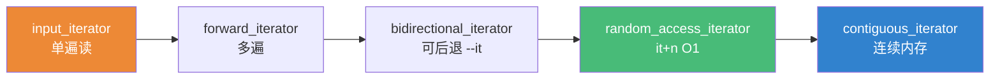
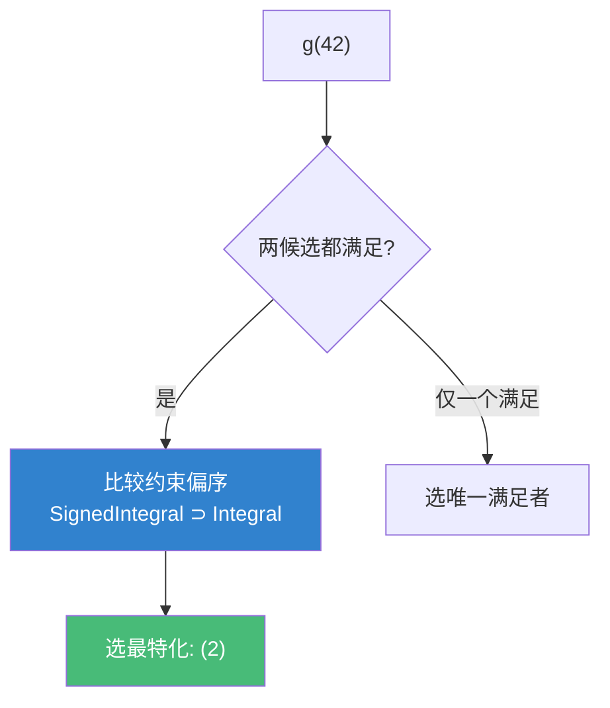

# 精通 C++ Concepts

> 课程编号：C14
> 路线图来源：现代 C++ 全栈深度课程 — 模板与泛型
> 难度：⭐⭐⭐⭐
> 预计阅读时间：55 分钟
> 📅 内容基准：**C++23** + GCC 14 / Clang 18 / MSVC 19.4x

---

## 引言：从一页报错到一行报错

```cpp
#include <list>
#include <algorithm>

int main() {
    std::list<int> l{3, 1, 2};
    std::sort(l.begin(), l.end());   // ❌ list 迭代器不是随机访问，怎么报错？
}
```

C++17 里，这行错误会喷出**几十行**模板实例化栈，错误指向 `sort` 内部某个 `__a - __b`（迭代器不支持减法）。你得逆向推理才知道"哦，list 不能用 std::sort"。

C++20 的 Concepts 让同样的错误变成：

```
error: no matching function for call to 'sort'
note: constraints not satisfied: 'random_access_iterator' is not satisfied
```

**一句话点中要害**。Concepts（概念）是 C++20 四大特性之一，它把"模板参数必须满足的要求"变成**可命名、可组合、参与重载决议**的一等公民。它替代了晦涩的 SFINAE（C13），让泛型代码的**约束显式化、报错人类化**。

---

## 第一章：concept 定义与基本用法

一个 `concept` 就是一个**编译期的 bool**——对类型求值为 true/false 的谓词。

```cpp
#include <concepts>

// 定义：用 requires 表达式描述"T 要满足什么"
template<class T>
concept Addable = requires(T a, T b) {
    a + b;                  // 要求：a + b 这个表达式合法
};

// 用法 1：作为模板形参约束（最简洁）
template<Addable T>
T sum(T a, T b) { return a + b; }

// 用法 2：requires 子句
template<class T> requires Addable<T>
T sum2(T a, T b) { return a + b; }

// 用法 3：约束 auto（缩写函数模板）
Addable auto sum3(Addable auto a, Addable auto b) { return a + b; }
```

三种写法等价。`concept` 本质是 `constexpr bool`，但**只能用于约束**，不能当普通变量用。

```cpp
static_assert(Addable<int>);          // ✅ int 可加
static_assert(!Addable<std::string*>);// ✅ 指针相加非法 → false（不报错，只是 false）
```

关键区别：普通表达式写错会编译失败；**concept 里的表达式写"错"只会让 concept 求值为 false**——这正是 SFINAE 的"软失败"被提升为语言特性。

---

## 第二章：requires 表达式

`requires(形参) { 要求; }` 是 concept 的核心构件，里面可以写四种"要求"。

```cpp
template<class T>
concept Container = requires(T c, const T cc) {
    // ① 简单要求：表达式必须合法（不求值，只检查能否编译）
    c.begin();
    c.end();

    // ② 类型要求：某个嵌套类型必须存在
    typename T::value_type;
    typename T::iterator;

    // ③ 复合要求：检查表达式合法 + 返回类型约束
    { c.size() } -> std::convertible_to<std::size_t>;
    { c.empty() } -> std::same_as<bool>;

    // ④ 嵌套要求：嵌套一个 bool 约束（用 requires）
    requires std::is_default_constructible_v<T>;
};
```

| 要求种类 | 语法 | 含义 |
|---|---|---|
| 简单要求 | `expr;` | `expr` 能编译（不执行） |
| 类型要求 | `typename T::X;` | 嵌套类型 `T::X` 存在 |
| 复合要求 | `{ expr } -> C;` | `expr` 合法且 `decltype((expr))` 满足 concept `C` |
| 嵌套要求 | `requires bool-expr;` | 嵌套布尔约束为真 |

⚠️ **复合要求的返回类型检查很微妙**：`{ c.size() } -> std::convertible_to<std::size_t>` 实际展开为 `convertible_to<decltype((c.size())), std::size_t>`——concept `C` 的**第一个实参被自动填入表达式的类型**，你只写后面的参数。

```cpp
// requires 也能当作 requires 子句里的"即时"约束（requires requires）
template<class T>
void f(T x) requires requires { x.foo(); } {  // 内层 requires 是表达式
    x.foo();
}
```

---

## 第三章：标准库 concepts

`<concepts>` 提供了一套基础概念，`<iterator>`/`<ranges>` 提供了迭代器与范围概念。优先复用它们，别重复造轮子。

```cpp
#include <concepts>

template<class T> concept _ =
    std::same_as<T, int>          ||  // 类型相同
    std::convertible_to<T, long>  ||  // 可隐式转换
    std::integral<T>              ||  // 整型
    std::floating_point<T>        ||  // 浮点
    std::signed_integral<T>       ||  // 有符号整型
    std::totally_ordered<T>       ||  // 支持 < <= > >= == !=
    std::movable<T>               ||  // 可移动构造/赋值
    std::copyable<T>              ||  // 可拷贝
    std::default_initializable<T> ||  // 可默认构造
    std::invocable<T, int>;           // T 能以 int 调用
```

常用迭代器概念（按能力递增，下一层包含上一层）：



回到引言：`std::sort` 要求 `random_access_iterator`，而 `std::list` 只提供 `bidirectional_iterator`，所以约束不满足——这就是那行清晰报错的来源。

```cpp
// 自己写算法也该约束迭代器
template<std::random_access_iterator It>
void my_sort(It first, It last);   // list 迭代器传进来直接被拒，报错清晰
```

---

## 第四章：约束的偏序与最特化

Concepts 不只过滤——它还参与**重载决议**：当多个候选都满足时，选**约束更强（更特化）**的那个。这叫**约束包含（subsumption）/ 偏序**。

```cpp
template<class T> concept Integral      = std::integral<T>;
template<class T> concept SignedIntegral = Integral<T> && std::is_signed_v<T>;

template<Integral T>       void g(T)  { /* (1) 整型版 */ }
template<SignedIntegral T> void g(T)  { /* (2) 有符号整型版 */ }

g(42);   // 调 (2)：int 同时满足两者，但 SignedIntegral 更强（包含 Integral）→ 最特化
g(42u);  // 调 (1)：unsigned 只满足 Integral
```

**为什么 (2) 胜出**？编译器做约束的"逻辑包含"分析：`SignedIntegral` 的约束在逻辑上**蕴含**了 `Integral`（`A && B` 蕴含 `A`），所以 (2) 比 (1) 约束更严、更特化，优先选中。



⚠️ **包含分析靠语法结构，不靠语义**：只有用 `&&`/`||` 组合的**具名 concept** 才参与包含。如果你把约束写成一坨 `requires (...)` 表达式或用 `&&` 拼裸 type_traits，编译器可能认不出蕴含关系，导致"二义性调用"。**这是优先用具名 concept 而非裸 `requires` 的关键原因**。

---

## 第五章：替代 SFINAE

C13 里我们用 `std::enable_if` 做"编译期分支选重载"。Concepts 让这一切更可读。

```cpp
// ❌ SFINAE 旧写法：晦涩、报错糟糕
template<class T,
         std::enable_if_t<std::is_integral_v<T>, int> = 0>
void process(T x);
template<class T,
         std::enable_if_t<std::is_floating_point_v<T>, int> = 0>
void process(T x);

// ✅ Concepts 新写法：意图一目了然
template<std::integral T>       void process(T x) { /* 整型 */ }
template<std::floating_point T> void process(T x) { /* 浮点 */ }
```

`if constexpr` 也能配 concept 在一个函数里分支：

```cpp
template<class T>
auto serialize(const T& x) {
    if constexpr (std::integral<T>)            return to_int_bytes(x);
    else if constexpr (std::floating_point<T>) return to_float_bytes(x);
    else                                       return to_generic_bytes(x);
}
```

| 维度 | SFINAE (`enable_if`) | Concepts |
|---|---|---|
| 可读性 | 差（约束藏在签名缝里） | 好（命名约束） |
| 报错 | 长、指向库内部 | 短、指向"哪个约束没满足" |
| 重载选择 | 需手写互斥条件 | 自动偏序选最特化 |
| 复用 | 难拼装 | `&&`/`||` 自由组合 |
| 诊断工具 | 无 | `requires` 可单独测、`static_assert` |

---

## 第六章：常见陷阱清单

### ❌ 陷阱 1：concept 里写错表达式以为会报错

```cpp
template<class T>
concept Bad = requires(T t) { t.nonexistent_method(); };
static_assert(!Bad<int>);   // 不报错，只是求值为 false
```
`requires` 表达式里的"非法"只导致 concept 为 false，**不是编译错误**——这正是它的设计。

### ❌ 陷阱 2：复合要求的返回类型搞反参数位置

```cpp
{ c.size() } -> std::convertible_to<std::size_t>;
// 等价 convertible_to<decltype((c.size())), size_t>，表达式类型是【第一个】实参
```

### ❌ 陷阱 3：用裸 type_traits 拼约束，丢失偏序

```cpp
template<class T> requires std::is_integral_v<T> && std::is_signed_v<T>
void h(T);   // 与另一个 is_integral_v 重载可能二义（包含分析认不出）
// 修：定义具名 concept SignedIntegral 再用
```

### ❌ 陷阱 4：以为 concept 检查"语义"

```cpp
template<class T> concept Hashable = requires(T t){ std::hash<T>{}(t); };
// 只检查"能调用 hash"，不保证 hash 实现正确/无冲突——concept 是语法契约
```

### ❌ 陷阱 5：约束写在错误位置

```cpp
template<class T>
concept C = std::integral<T>;
// C<T> v;        // ❌ concept 不能定义变量
// 它只能出现在模板形参约束 / requires 子句 / 缩写 auto
```

---

## 第七章：练习题

**练习 1**：写一个 concept `Stringifiable<T>`，要求 `std::to_string(T{})` 合法且返回 `std::string`。

**练习 2**：下面 `g(42)` 调哪个？为什么？
```cpp
template<class T> concept A = std::integral<T>;
template<class T> concept B = A<T> && (sizeof(T) >= 4);
template<A T> void g(T);   // (1)
template<B T> void g(T);   // (2)
```

**练习 3**：复合要求 `{ *it } -> std::same_as<int&>;` 检查了什么？写出它等价的 `same_as<...>`。

**练习 4**：把这段 SFINAE 改写成 Concepts：
```cpp
template<class T, std::enable_if_t<std::is_pointer_v<T>, int> = 0>
void f(T);
```

**练习 5**：为什么"用 `&&` 拼裸 `is_integral_v` 的两个重载"可能二义，而"用具名 concept"不会？

---

## 参考答案与解析

**练习 1**：
```cpp
template<class T>
concept Stringifiable = requires(T t) {
    { std::to_string(t) } -> std::same_as<std::string>;
};
```
复合要求同时检查"`to_string(t)` 合法"与"返回类型恰为 `std::string`"。

**练习 2**：调 **(2)**。`int` 满足 A 和 B；`B` 在结构上写成 `A<T> && ...`，逻辑上**蕴含** `A`，故 (2) 更特化（偏序更强），重载决议选中。

**练习 3**：检查 ① `*it` 表达式合法；② `decltype((*it))` 恰为 `int&`。等价 `std::same_as<decltype((*it)), int&>`——表达式类型自动填到第一个参数。

**练习 4**：
```cpp
template<class T> concept Ptr = std::is_pointer_v<T>;
template<Ptr T> void f(T);
// 或 template<class T> requires std::is_pointer_v<T> void f(T);
```

**练习 5**：约束的**包含（subsumption）分析基于约束的语法结构**——它把约束分解成具名 concept 与原子约束的合取/析取范式来比较。两个**具名 concept** 用 `&&` 组合时，编译器能识别 `X && Y` 蕴含 `X`；而裸 type_traits（如 `is_integral_v<T>`）是**原子约束**，编译器把"相同拼法"才视作相同原子，不同重载里拼写不一致就认不出蕴含关系，于是判定"互不包含"→ 二义。具名 concept 提供了稳定的"原子单位"，让偏序可判定。

---

## 小结

| 知识点 | 关键记忆 |
|---|---|
| concept | 编译期 bool 谓词，只能用于约束 |
| requires 表达式 | 四种要求：简单/类型/复合/嵌套 |
| 复合要求 | `{ e } -> C` = `C<decltype((e)), ...>`，类型填第一参 |
| 标准 concepts | `integral`/`convertible_to`/`movable`/迭代器概念，优先复用 |
| 约束偏序 | 多候选满足时选**最特化**（约束蕴含更强者） |
| 替代 SFINAE | 更可读、报错更短、自动选最特化 |
| 软失败 | concept 内表达式非法 → 求值 false，不报错 |
| 具名优先 | 用具名 concept 而非裸 traits，保住包含分析 |

---

## 📅 2026 现状/更新

- Concepts 自 C++20 已是泛型库标配；标准库（Ranges、`std::format`）全面以 concept 约束接口。
- C++23 进一步补全了 Ranges 相关概念；`std::ranges` 算法的约束让"传错容器"在调用点即报错。
- 三大编译器（GCC 14 / Clang 18 / MSVC 19.4x）对 Concepts 与缩写函数模板（`Addable auto`）支持成熟。
- 实践准则：**对外接口用具名 concept 约束**，内部分支用 `if constexpr (concept<T>)`，淘汰几乎所有 `enable_if`。

---

> 🔁 下一篇 **C15 — 精通 C++ 模板进阶**：依赖名与 `typename`/`template` 消歧、两阶段查找、ADL 实参依赖查找、CRTP 高级用法、策略模式（policy）、表达式模板与类型擦除。
>
> 反馈：把"concept 是软失败的 bool"和"偏序选最特化"两条钉死——前者解释为什么写错不报错，后者解释为什么重载能自动分流。
