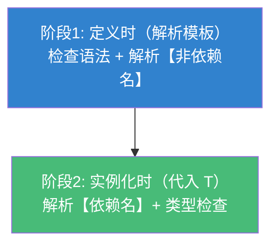
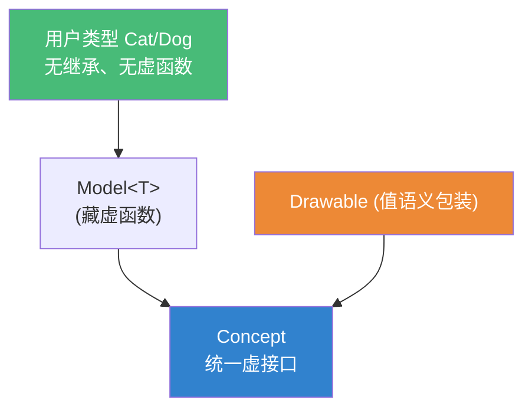

# 精通 C++ 模板进阶

> 课程编号：C15
> 路线图来源：现代 C++ 全栈深度课程 — 模板与泛型
> 难度：⭐⭐⭐⭐⭐
> 预计阅读时间：65 分钟
> 📅 内容基准：**C++23** + GCC 14 / Clang 18 / MSVC 19.4x

---

## 引言：为什么这行模板代码编译不过？

```cpp
template<class T>
struct Wrapper {
    void f() {
        T::value_type x;        // ❌ error: need 'typename' before 'T::value_type'
        T::template rebind<int> r;  // ❌ need 'template'
        helper();               // ❌ 在基类模板里定义的 helper 可能找不到
    }
};
```

模板里有一类只在"看到具体类型才知道含义"的名字——**依赖名（dependent name）**。编译器在解析模板时（还没代入 `T`）必须**猜**：`T::value_type` 是类型还是静态成员？`<` 是模板尖括号还是小于号？猜错就编译失败。这一篇讲清模板最深的几个机制：依赖名消歧、两阶段查找、ADL，以及把它们组合出威力的设计技法——CRTP、策略模式、表达式模板、类型擦除。

---

## 第一章：依赖名与 typename / template 消歧

**规则**：依赖名**默认被当作"非类型"**。若它其实是类型，须加 `typename`；若它是成员模板，须加 `template`。

```cpp
template<class T>
void f() {
    typename T::value_type x;          // ✅ 告诉编译器这是类型
    typename T::template rebind<int>::other y;  // ✅ rebind 是成员模板
    T::static_member;                  // 非依赖类型场景无需 typename
}
```

为什么需要消歧？看这个歧义：

```cpp
template<class T> void g() {
    T::x * p;   // 这是【声明 p 为 T::x 类型的指针】还是【T::x 乘以 p】？
}
```

`T::x` 是依赖名，编译器默认当它是**值/变量**，于是把上面解析成"乘法表达式"。若 `T::x` 实为类型、你想声明指针，必须 `typename T::x* p;`。

```cpp
// 同理 template 消歧：t.foo<int>() 里 < 默认当小于号
template<class T> void h(T t) {
    t.template foo<int>();   // ✅ foo 是成员模板，须 template 关键字
}
```

> C++23 起，**类作用域内**许多原本必须写 `typename` 的位置已可省略（编译器能从上下文推断）；但跨依赖类型时仍常需要。安全做法：报错说"need typename/template"就加上。

---

## 第二章：两阶段查找

模板被编译**两次**：



- **阶段一**（看到模板定义时）：检查语法、解析所有**非依赖名**（不依赖模板参数的名字）。
- **阶段二**（实例化、代入具体 `T` 时）：解析**依赖名**，做完整类型检查。

这导致一个经典坑：**继承自模板基类时，基类成员是依赖名，阶段一找不到**。

```cpp
template<class T> struct Base { void hello(); int n; };

template<class T> struct Derived : Base<T> {
    void f() {
        // hello();      // ❌ 阶段一：非依赖名，不去 Base<T> 里找！
        this->hello();   // ✅ 加 this-> 使其成为依赖名 → 阶段二再查
        Base<T>::hello();// ✅ 显式限定
        // n = 1;        // ❌ 同理找不到
        this->n = 1;     // ✅
    }
};
```

**为什么编译器不去基类找**？因为 `Base<T>` 可能被**特化**成完全不同的样子，阶段一时它还不知道 `Base<T>` 长啥样，于是干脆不在依赖基类里查非限定名。加 `this->` 把名字变成依赖名，推迟到阶段二（此时 `Base<T>` 已知）再查。

| 名字形式 | 何时解析 | 在基类模板里找得到吗 |
|---|---|---|
| `hello()` 非限定 | 阶段一 | ❌ 找不到 |
| `this->hello()` | 阶段二 | ✅ |
| `Base<T>::hello()` | 阶段二 | ✅ |

---

## 第三章：ADL —— 实参依赖查找

**ADL（Argument-Dependent Lookup，又称 Koenig 查找）**：调用非限定函数时，编译器**额外**在"实参类型所属的命名空间"里找候选。

```cpp
namespace lib {
    struct Widget {};
    void print(const Widget&);   // 与 Widget 同命名空间
}

lib::Widget w;
print(w);   // ✅ 没写 lib::print，ADL 在 lib 里找到了 print
```

ADL 是 `std::swap`、运算符重载、`begin/end` 能"自动找到对的版本"的根基。经典惯用法：

```cpp
template<class T>
void do_swap(T& a, T& b) {
    using std::swap;   // 把 std::swap 拉进候选集（兜底）
    swap(a, b);        // 非限定调用：ADL 优先找 T 所在命名空间的自定义 swap
}
```

**为什么不直接 `std::swap(a,b)`**？因为那样会**屏蔽用户为自己类型写的更高效 swap**。`using std::swap` + 非限定调用是"自定义优先、std 兜底"的标准模式——Ranges 的 `std::ranges::swap`/`begin`（CPO，定制点对象）正是把这套封装好了。

⚠️ ADL 也会"误伤"：

```cpp
namespace lib { struct X{}; template<class T> void f(T); }
lib::X x;
f(x);        // ADL 找到 lib::f
f<int>(x);   // ⚠️ 显式模板实参时，编译器得先知道 f 是模板才解析 <>，纯 ADL 可能失败
```

---

## 第四章：CRTP 高级用法

**CRTP（Curiously Recurring Template Pattern）**：派生类把自己作为模板实参传给基类，实现**静态多态**（无 vtable 开销，C09 已介绍基础）。

```cpp
template<class Derived>
struct Shape {
    double area() const {
        // 静态转型到派生类，调用其实现——编译期绑定，可内联
        return static_cast<const Derived&>(*this).area_impl();
    }
};

struct Circle : Shape<Circle> {
    double r;
    double area_impl() const { return 3.14159 * r * r; }
};

Circle c{.r = 2};
c.area();   // 无虚调用，可被内联成 3.14159*2*2
```

进阶用法：

```cpp
// ① 注入式接口（mixin）：基类基于派生类的一个操作派生出一堆操作
template<class D>
struct Comparable {
    friend bool operator>(const D& a, const D& b)  { return b < a; }
    friend bool operator==(const D& a, const D& b) { return !(a<b) && !(b<a); }
    friend bool operator!=(const D& a, const D& b) { return !(a==b); }
};
struct Money : Comparable<Money> {
    int cents;
    friend bool operator<(const Money& a, const Money& b){ return a.cents<b.cents; }
};  // 只写了 <，自动获得 > == !=（C++20 可改用 <=> 更省事）

// ② 对象计数器：每个派生类型独立计数（static 成员按 D 分别实例化）
template<class D> struct Counter {
    static inline int count = 0;
    Counter(){ ++count; }   ~Counter(){ --count; }
};
```

**CRTP 的代价**：基类是模板，**没有共同基类型**——不能把不同 `Shape<X>` 放进同一个容器统一遍历。要"运行期异构集合"还得虚函数或类型擦除（第七章）。

---

## 第五章：策略模式（policy-based design）

把类的**可变行为拆成模板参数（policy）**，编译期组合，零运行期开销。

```cpp
// 两个正交策略：线程安全 + 校验
struct NoLock     { void lock(){} void unlock(){} };
struct MutexLock  { std::mutex m; void lock(){m.lock();} void unlock(){m.unlock();} };

struct NoCheck    { static void check(int){} };
struct RangeCheck { static void check(int i){ if(i<0) throw std::out_of_range{"i"}; } };

template<class LockPolicy = NoLock, class CheckPolicy = NoCheck>
class Stack : private LockPolicy {       // 继承策略 → 空策略可被 EBO 优化掉
    std::vector<int> data_;
public:
    void push(int x) {
        CheckPolicy::check(x);
        this->lock();
        data_.push_back(x);
        this->unlock();
    }
};

Stack<> s1;                       // 默认：无锁无校验，零开销
Stack<MutexLock, RangeCheck> s2;  // 线程安全 + 校验
```

| 维度 | 策略模式（模板） | 经典策略（虚函数/std::function） |
|---|---|---|
| 绑定时机 | 编译期 | 运行期 |
| 开销 | 零（可内联，空策略 EBO） | 间接调用 + 可能堆分配 |
| 灵活性 | 类型在编译期固定 | 运行期可换 |
| 代码膨胀 | 每种组合一份代码 | 一份代码 |

`std::unique_ptr` 的删除器、`std::vector` 的 allocator、`std::map` 的比较器都是策略参数的实例——空策略（如默认 `less<>`）经 EBO（空基类优化，C07）不占空间。

---

## 第六章：表达式模板简介

朴素的向量运算会产生**大量临时对象**：

```cpp
Vec a, b, c, d;
Vec r = a + b + c + d;   // 朴素实现：(a+b)→tmp1, (tmp1+c)→tmp2, ... 多次分配+多遍循环
```

**表达式模板**让 `a+b` 不立即计算，而是返回一个**表示"加法表达式"的轻量类型**，整个表达式树到赋值时才**一遍循环**求值：

```cpp
template<class L, class R>
struct AddExpr {                 // 惰性：只记住操作数，不分配
    const L& l; const R& r;
    double operator[](std::size_t i) const { return l[i] + r[i]; }
    std::size_t size() const { return l.size(); }
};

template<class L, class R>
AddExpr<L,R> operator+(const L& l, const R& r){ return {l, r}; }

struct Vec {
    std::vector<double> d;
    template<class E>            // 赋值时才真正循环求值
    Vec& operator=(const E& e){
        d.resize(e.size());
        for(std::size_t i=0;i<e.size();++i) d[i] = e[i];  // 单遍，零临时
        return *this;
    }
    double operator[](std::size_t i) const { return d[i]; }
    std::size_t size() const { return d.size(); }
};
// r = a+b+c+d  →  类型 AddExpr<AddExpr<AddExpr<Vec,Vec>,Vec>,Vec>，单遍循环，无临时向量
```

这是 Eigen、Blaze 等线性代数库高性能的核心机制——**用类型编码计算图，延迟到落地时融合（fusion）成一个循环**。

⚠️ 陷阱：表达式模板存的是**引用**，绝不能让表达式对象活过其操作数（`auto x = a+b;` 后 a/b 销毁就是悬垂）。

---

## 第七章：类型擦除

CRTP 给你静态多态但失去"共同基类型"。**类型擦除（type erasure）**反过来：用模板**接受任意类型**，对外暴露**统一的运行期接口**——`std::function`、`std::any`、`std::shared_ptr` 的删除器都是它。

```cpp
// 手写一个能装"任何可 draw() 的对象"的 Drawable
class Drawable {
    struct Concept {                       // 擦除后的统一接口
        virtual ~Concept() = default;
        virtual void draw() const = 0;
        virtual std::unique_ptr<Concept> clone() const = 0;
    };
    template<class T>                       // 把具体 T 包进来
    struct Model : Concept {
        T obj;
        Model(T o): obj(std::move(o)) {}
        void draw() const override { obj.draw(); }   // 转发到 T::draw（非虚！）
        std::unique_ptr<Concept> clone() const override {
            return std::make_unique<Model>(*this);
        }
    };
    std::unique_ptr<Concept> self_;
public:
    template<class T>                       // 模板构造：T 无需继承任何基类
    Drawable(T x): self_(std::make_unique<Model<T>>(std::move(x))) {}
    Drawable(const Drawable& o): self_(o.self_->clone()) {}
    void draw() const { self_->draw(); }
};

struct Cat { void draw() const { /* 喵 */ } };  // 无继承、无虚函数
struct Dog { void draw() const { /* 汪 */ } };

std::vector<Drawable> v;
v.push_back(Cat{});   // 不相关的类型
v.push_back(Dog{});   // 装进同一个容器
for (auto& d : v) d.draw();   // 运行期多态，但 Cat/Dog 互不知情、无侵入
```

**机制**：模板构造把具体类型 `T` 包进 `Model<T>`，`Model<T>` 内部用虚函数实现统一接口——**虚函数被"藏在"实现里**，对用户类型零侵入。这就是"鸭子类型 + 值语义 + 运行期多态"的融合。



---

## 第八章：常见陷阱清单

### ❌ 陷阱 1：忘了 typename / template

```cpp
T::value_type x;          // ❌ 须 typename T::value_type x;
t.foo<int>();             // ❌ 须 t.template foo<int>();
```

### ❌ 陷阱 2：模板基类成员不加 this->

```cpp
template<class T> struct D : Base<T> {
    void f(){ hello(); }   // ❌ 阶段一找不到 → this->hello() 或 Base<T>::hello()
};
```

### ❌ 陷阱 3：用 `std::swap(a,b)` 而非 `using std::swap; swap(a,b)`

```cpp
std::swap(a, b);   // ❌ 屏蔽用户自定义 swap；应 using + 非限定调用让 ADL 生效
```

### ❌ 陷阱 4：CRTP 在基类构造里调派生成员

```cpp
template<class D> struct B { B(){ static_cast<D*>(this)->init(); } };
// ❌ 基类构造时派生部分尚未构造完，UB
```

### ❌ 陷阱 5：表达式模板/类型擦除存引用导致悬垂

```cpp
auto e = a + b;   // e 存 a、b 的引用，a/b 一销毁 → 悬垂；别 auto 接表达式模板
```

### ❌ 陷阱 6：以为 CRTP 能做运行期异构集合

```cpp
std::vector<Shape<???>> v;   // ❌ Shape<Circle> 与 Shape<Square> 是不同类型，没共同基
// 要异构集合 → 用类型擦除或虚函数
```

---

## 第九章：练习题

**练习 1**：下面哪里要加 `typename`/`template`？
```cpp
template<class T> void f(T t){
    T::iterator it;
    t.get<0>();
}
```

**练习 2**：为什么 `Derived<T> : Base<T>` 里直接调 `hello()` 会失败？两种修法？

**练习 3**：解释 `using std::swap; swap(a,b);` 这个惯用法为什么优于直接 `std::swap(a,b)`。

**练习 4**：CRTP 与虚函数实现多态各有什么取舍？什么时候只能用虚函数 / 类型擦除？

**练习 5**：`std::function<void()>` 用了哪种本章技法？它如何做到能装任意可调用对象却暴露统一调用接口？

---

## 参考答案与解析

**练习 1**：`typename T::iterator it;`（`iterator` 是依赖类型）；`t.template get<0>();`（`get` 是依赖的成员模板，`<` 须靠 `template` 消歧）。

**练习 2**：`hello()` 是**非限定、非依赖名**，在**阶段一**解析，而编译器不在依赖基类 `Base<T>`（可能被特化）里查非限定名，故找不到。修法：① `this->hello();`（变成依赖名，推迟到阶段二查）；② `Base<T>::hello();`（显式限定）。

**练习 3**：非限定调用 `swap(a,b)` 触发 **ADL**，会在 `T` 所在命名空间找用户为该类型写的（通常更高效的）`swap`；`using std::swap` 只是把标准版拉进候选**兜底**。直接 `std::swap(a,b)` 是限定调用，**屏蔽 ADL**，永远用标准（可能退化为三次移动的）版本。

**练习 4**：CRTP——编译期绑定、可内联、零开销，但类型在编译期固定、无共同基类型、会代码膨胀；虚函数——运行期绑定、有共同基类、可异构集合，但有 vptr 间接调用、难内联且要求**侵入式继承**。需要"运行期决定 + 异构容器"时用虚函数；想要"运行期多态 + 值语义 + 对用户类型零侵入"时用**类型擦除**。

**练习 5**：用了**类型擦除**。`std::function` 内部有一个抽象 `Concept`（带虚 `invoke`）和模板 `Model<F>` 把具体可调用体 `F` 包起来，`Model<F>::invoke` 转发到 `F::operator()`。对外只暴露 `operator()`，对内用虚函数分发——所以任意 lambda/函数指针/仿函数都能塞进同一个 `std::function`，且无需它们继承任何基类（常配合小对象优化避免堆分配）。

---

## 小结

| 知识点 | 关键记忆 |
|---|---|
| 依赖名消歧 | 类型加 `typename`，成员模板加 `template` |
| 两阶段查找 | 非依赖名阶段一解析；依赖名阶段二解析 |
| 模板基类成员 | 须 `this->` 或 `Base<T>::` 才找得到 |
| ADL | 非限定调用在实参命名空间找；`using std::swap`+非限定 |
| CRTP | 派生传自身给基类，静态多态零开销，但无共同基 |
| 策略模式 | 行为拆成模板参数，编译期组合，空策略 EBO |
| 表达式模板 | 用类型编码计算图，延迟到赋值时单遍融合 |
| 类型擦除 | 模板构造 + 内藏虚函数，统一接口装任意类型 |

---

## 📅 2026 现状/更新

- C++20 Concepts（C14）大幅替代了模板里的 SFINAE 约束，但依赖名/两阶段/ADL 仍是模板写作的基本功。
- C++20 `<=>`（C10）让 CRTP 的比较运算注入大多被一行 `auto operator<=>(...)=default;` 取代。
- Ranges 的**定制点对象（CPO）/ `tag_invoke`** 是 ADL 惯用法的现代封装，正逐步统一"可定制接口"的写法。
- C++23 `std::move_only_function`、`std::function_ref` 丰富了类型擦除工具箱；`deducing this`（C32）让 CRTP 的部分场景可用显式对象参数更简洁地实现。

---

> 🔁 下一篇 **C16 — 精通 C++ STL 容器内部**：vector 扩容与容量增长因子、各容器迭代器失效规则、map（红黑树）vs unordered_map（哈希桶/负载因子/rehash）、deque 分段、list、小对象优化（SSO）与 reserve。
>
> 反馈：把"两阶段查找 + this->"和"类型擦除=模板构造藏虚函数"两条钉死——前者是模板继承所有疑难的根，后者是 std::function/any 的灵魂。
