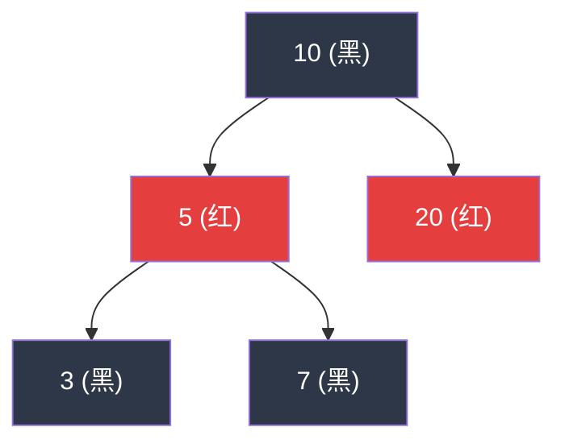
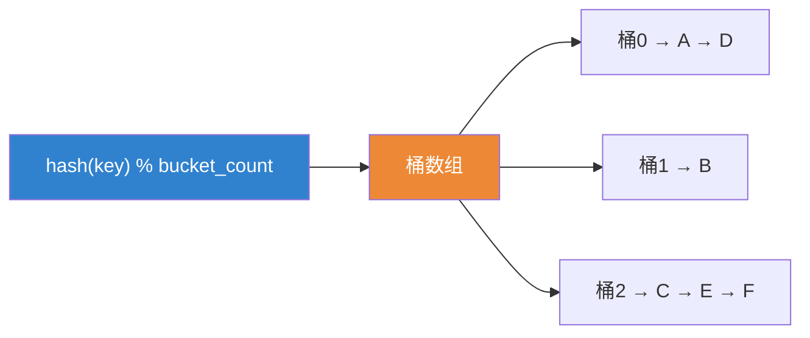
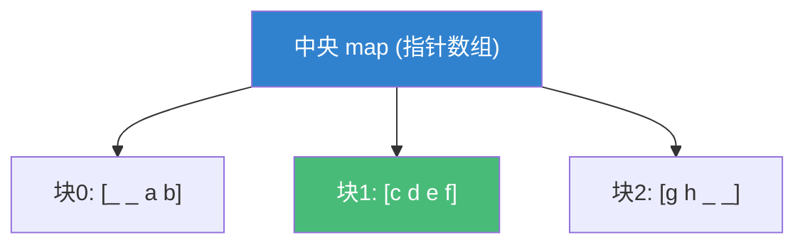
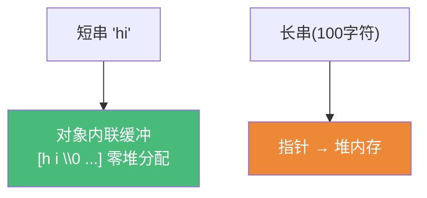

# 精通 C++ STL 容器内部

> 课程编号：C16
> 路线图来源：现代 C++ 全栈深度课程 — STL
> 难度：⭐⭐⭐⭐
> 预计阅读时间：60 分钟
> 📅 内容基准：**C++23** + GCC 14 / Clang 18 / MSVC 19.4x

---

## 引言：这段代码为什么崩？

```cpp
#include <vector>
std::vector<int> v{1, 2, 3};
int& first = v[0];          // 拿到第一个元素的引用
for (int i = 0; i < 100; ++i)
    v.push_back(i);         // 不断追加……
std::cout << first;         // ❌ 这里很可能是悬垂引用，UB！
```

`first` 指向 vector 内部的某块堆内存。当 `push_back` 触发**扩容**时，vector 分配一块更大的新内存、把旧元素搬过去、释放旧内存——`first` 还指着已被释放的旧地址。这就是**迭代器/引用失效**。

要写出正确高效的 STL 代码，必须理解容器的**内部数据结构**：vector 怎么扩容、map 凭什么有序、unordered_map 的桶和负载因子、deque 为什么"两端快"、string 的 SSO。这一篇拆开 STL 容器的"引擎盖"。

---

## 第一章：vector —— 连续内存与扩容

vector 是一段**连续的堆内存**，维护三个指针：


- `size()` = `end - begin`（当前元素个数）
- `capacity()` = `cap - begin`（已分配能装多少）
- 当 `size == capacity` 再 push，触发**扩容**。

```cpp
std::vector<int> v;
for (int i = 0; i < 10; ++i) {
    std::cout << "size=" << v.size() << " cap=" << v.capacity() << '\n';
    v.push_back(i);
}
// GCC/Clang(libstdc++/libc++) 容量序列：0 1 2 4 8 16...（×2 增长）
// MSVC：0 1 2 3 4 6 9 13...（约 ×1.5 增长）
```

**扩容的代价**：分配新内存 → 把旧元素逐个**移动**（移动构造 noexcept 时，否则拷贝，C03）到新内存 → 销毁旧元素 → 释放旧内存。这是 O(n) 操作。

**为什么用倍增（×2 或 ×1.5）而不是每次 +1**？倍增让 n 次 push_back 的**总搬运次数**为 O(n)，**摊还（amortized）单次 O(1)**。若每次 +1，总搬运是 1+2+...+n = O(n²)。

| 增长因子 | 代表实现 | 权衡 |
|---|---|---|
| ×2 | libstdc++ / libc++ | 扩容次数少；但新块 > 已释放块总和，旧内存无法复用 |
| ×1.5 | MSVC | 内存复用更友好；扩容次数略多 |

`reserve` 一次性预留容量，避免反复扩容（见第六章）。

---

## 第二章：迭代器失效规则（各容器）

"失效"=该迭代器/引用/指针不再指向有效元素。**这是 STL 最易踩的雷**，按容器记牢：

| 容器 | 插入导致失效 | 删除导致失效 |
|---|---|---|
| **vector** | 扩容→**全部**失效；不扩容→插入点之后失效 | 删除点**及之后**失效 |
| **deque** | 中间插入→**迭代器和引用/指针全部失效**；两端插入→迭代器失效、**引用/指针不失效** | 两端删除→仅被删元素失效；中间删除→全部失效 |
| **list** | **不失效**（仅被删节点的迭代器） | 仅被删节点失效 |
| **map/set**（红黑树） | **不失效** | 仅被删节点失效 |
| **unordered_map/set** | rehash 时**迭代器全部失效**（引用/指针**不失效**）；不 rehash 不失效 | 仅被删元素失效 |

**记忆主线**：
- **连续内存（vector）** 最脆：扩容全废。
- **节点容器（list/map/unordered_map）** 稳：每个元素独立分配，插入新节点不动老节点；删除只影响被删者。
- **deque** 特殊：迭代器比引用更易失效（迭代器要遍历分段结构，引用直接指元素）。

经典 erase 循环陷阱与正解：

```cpp
// ❌ 错误：erase 后 it 失效，++it 是 UB
for (auto it = v.begin(); it != v.end(); ++it)
    if (*it == x) v.erase(it);

// ✅ 正确：erase 返回下一个有效迭代器
for (auto it = v.begin(); it != v.end(); )
    if (*it == x) it = v.erase(it);
    else          ++it;

// ✅ 更好（C++20）：批量删除一条龙
std::erase(v, x);                    // 等价 erase-remove 惯用法
std::erase_if(v, [](int n){return n%2;});
```

---

## 第三章：map（红黑树）vs unordered_map（哈希表）

两者都是关联容器，但底层数据结构与性能特征完全不同。

### 3.1 map —— 红黑树（有序）

`std::map`/`set` 是**自平衡二叉搜索树（红黑树）**：每个元素是一个独立节点，按 key 排序。



- 查找/插入/删除：**O(log n)**（树高受红黑性质约束在 2·log n 内）。
- **有序**：可范围查询、`lower_bound`/`upper_bound`、按序遍历。
- 节点独立分配 → 缓存不友好（节点散落堆各处）。

### 3.2 unordered_map —— 哈希桶

`std::unordered_map`/`unordered_set` 是**哈希表**：一个桶数组，每个桶挂一条链表（拉链法），key 经 hash 落到某桶。



- 查找/插入/删除：**平均 O(1)**，最坏 O(n)（全冲突挤一个桶）。
- **无序**：遍历顺序不可预测。
- **负载因子（load factor）** = `size / bucket_count`。超过 `max_load_factor`（默认 1.0）触发 **rehash**：重新分配更多桶、把所有元素重新散列。

```cpp
std::unordered_map<int,int> m;
std::cout << m.max_load_factor();  // 默认 1.0
m.reserve(1000);                   // 预留：保证装 1000 个不 rehash（提前扩桶）
std::cout << m.bucket_count();     // 桶数（通常是 >=1000/max_load 的某质数/2的幂）
```

### 3.3 怎么选

| 维度 | map（红黑树） | unordered_map（哈希） |
|---|---|---|
| 查找复杂度 | O(log n) 稳定 | 平均 O(1)，最坏 O(n) |
| 有序遍历/范围查询 | ✅ 支持 | ❌ 无序 |
| 插入删除迭代器失效 | 不失效 | rehash 时迭代器失效 |
| 内存/缓存 | 每节点带颜色+三指针 | 桶数组+节点，需好 hash |
| 适用 | 要有序、要 range、key 可比较 | 只要按 key 查、追求平均最快 |

**默认首选 `unordered_map`**（平均更快）；需要有序/范围查询/稳定迭代器时用 `map`。注意 unordered 的"平均 O(1)"依赖**好的哈希函数**——坏 hash 退化成 O(n) 链表。

---

## 第四章：deque 与 list

### 4.1 deque —— 分段连续

`std::deque`（双端队列）不是单块连续内存，而是**一个指针数组（map），每个指针指向一块固定大小的连续"块（chunk）"**：



- **两端 push/pop O(1)**：在头/尾块的空位写入，满了就在 map 两端挂新块——**无需搬动已有元素**（这是 deque 优于 vector 的关键）。
- 随机访问 O(1)：先算在哪个块、再算块内偏移（两次寻址，略慢于 vector 一次）。
- 元素不连续：不能像 vector 那样拿 `&v[0]` 当 C 数组用。

**为什么 deque 两端插入引用不失效，迭代器却失效**？引用直接指向块内元素（块不动）；迭代器内部记着"当前块指针+块内位置+中央 map 位置"，中央 map 扩张/重排时迭代器的这些内部状态就失效了。

### 4.2 list —— 双向链表

`std::list` 是**双向链表**，每个元素是带 prev/next 指针的独立节点。

```cpp
std::list<int> l{1, 2, 3};
auto it = std::next(l.begin());
l.insert(it, 99);     // 任意位置 O(1) 插入（只改指针），且【不失效】其他迭代器
l.splice(l.end(), other);  // O(1) 把另一个 list 整段"接驳"过来，不搬元素
```

- 任意位置插入/删除 O(1)（改指针）、迭代器稳定。
- **不支持随机访问**（要 O(n) 走链表）；缓存极不友好（节点散布）。
- 实际中很少用——`vector` 的连续内存在现代 CPU 上常比 list 快得多，即使理论复杂度更差。**list 只在"频繁中间插删 + 需稳定迭代器 + 不随机访问"时才值得**。

---

## 第五章：小对象优化（SSO）

`std::string`（以及部分实现的 `std::function`、`std::any`）用 **SSO（Small String Optimization）**：短字符串**直接存在 string 对象内部的栈缓冲区**，不分配堆内存。

```cpp
std::string s = "hi";        // 短：存在对象内部缓冲（无 heap 分配，无 new）
std::string big(100, 'x');   // 长：超过内部缓冲 → 分配堆内存
```



- 典型内部缓冲约 15 字节（libstdc++ SSO 阈值 15，64 位下 string 对象通常 32 字节）。
- 收益：绝大多数程序里的字符串都很短（标识符、键名），SSO **省掉了最常见路径上的堆分配**，还提升缓存局部性。
- 代价：string 对象本身变大（带内联缓冲）；移动短串时是**逐字节拷贝缓冲**而非偷指针（短串移动≈拷贝，但本来就便宜）。

```cpp
// 想避免拷贝且只读 → 用 string_view（不拥有、不分配，C29）
void log(std::string_view sv);   // 接受 string/字面量都零拷贝
```

---

## 第六章：reserve —— 预留容量

知道大致规模时，`reserve`（vector/string）或 `reserve`（unordered_*）**一次性分配**，消除反复扩容/rehash：

```cpp
std::vector<int> v;
v.reserve(1000);            // 一次分配，之后 1000 次 push_back 不再扩容、不失效
for (int i = 0; i < 1000; ++i) v.push_back(i);

std::unordered_map<int,int> m;
m.reserve(1000);            // 提前扩桶，避免插入过程中多次 rehash
```

**收益**：① 省去多次"分配+搬运"；② 整个填充过程中**迭代器/引用不失效**（容量足够，不扩容）。

⚠️ 注意 `reserve` vs `resize`：
- `reserve(n)`：只改 **capacity**，不构造元素，`size` 不变。
- `resize(n)`：改 **size**，会构造/销毁元素。

```cpp
std::vector<int> v;
v.reserve(10);   // size=0, cap=10  —— v[0] 仍是 UB（没有元素）
v.resize(10);    // size=10, cap>=10 —— 10 个值初始化的 0，v[0] 合法
```

`map`/`list` **没有 reserve**（节点逐个分配，无"容量"概念）。

---

## 第七章：常见陷阱清单

### ❌ 陷阱 1：持有 vector 元素引用后 push_back

```cpp
int& r = v[0];
v.push_back(x);   // 可能扩容 → r 悬垂！需 reserve 或重新取引用
```

### ❌ 陷阱 2：erase 后继续用旧迭代器

```cpp
for (auto it=v.begin(); it!=v.end(); ++it)
    if (*it==x) v.erase(it);   // ❌ 用 it = v.erase(it); 并避免 ++
```

### ❌ 陷阱 3：用 unordered_map 还指望遍历有序

```cpp
for (auto& [k,v] : umap) ...;   // 顺序不可预测；要有序用 std::map
```

### ❌ 陷阱 4：reserve 后用下标访问"预留"的位置

```cpp
v.reserve(10);
v[5] = 1;   // ❌ size 还是 0！越界 UB。要 resize 或 push_back
```

### ❌ 陷阱 5：在 deque/vector 上拿 `&v[0]` 当连续数组——deque 不连续

```cpp
some_c_api(&dq[0], dq.size());   // ❌ deque 内存分段，不连续！vector 才行
```

### ❌ 陷阱 6：为"O(1) 中间插入"盲目用 list

```cpp
// list 复杂度好看，但缓存差；多数场景 vector 更快。实测再决定
```

---

## 第八章：练习题

**练习 1**：vector 为什么用倍增扩容而非每次 +1？说出摊还复杂度。

**练习 2**：下面哪些操作后 `it` 仍有效？
```cpp
std::vector<int> v{1,2,3}; auto it=v.begin();
v.push_back(4);          // (a)
std::list<int> l{1,2,3}; auto lit=l.begin();
l.push_back(4);          // (b)
std::map<int,int> m; auto mit=m.begin(); m[1]=1; // (c)
```

**练习 3**：负载因子是什么？什么时候触发 rehash？rehash 让什么失效？

**练习 4**：deque 为什么两端插入快、且引用不失效但迭代器失效？

**练习 5**：`reserve(100)` 之后 `v.size()`、`v.capacity()` 各是多少？`v[50]` 合法吗？

---

## 参考答案与解析

**练习 1**：倍增使 n 次 push_back 的总搬运为 O(n)（几何级数求和），**摊还单次 O(1)**；每次 +1 则总搬运 1+2+…+n=O(n²)，摊还 O(n)。倍增用"偶尔一次昂贵搬运"换"绝大多数次 O(1)"。

**练习 2**：(a) **失效**——push_back 可能扩容，vector 全部迭代器失效；(b) **有效**——list 是节点容器，插入不影响其他节点；(c) `mit` 是 `begin()`，插入 `m[1]` 后 map 不失效迭代器，但 `mit` 原本指向空 map 的 `end()`，插入后 `begin()` 变了——严格说原 `mit`（曾等于 end）语义已变，应重新取。map 已有元素时插入不失效现存迭代器。

**练习 3**：负载因子 = `size / bucket_count`，衡量桶的拥挤程度。当负载因子超过 `max_load_factor`（默认 1.0）时插入触发 **rehash**：分配更多桶、把所有元素按新桶数重新散列。rehash 使**所有迭代器失效**，但**引用/指针不失效**（元素节点本身不动，只是重新挂到新桶）。

**练习 4**：两端各有一个"当前块+空位"，push 时直接写空位、块满则在中央 map 末端挂一个新块——**不搬动任何已有元素**，故 O(1)。引用直接指向块内元素，块不动 → **引用不失效**；迭代器内部维护"中央 map 位置+块指针+块内偏移"，中央 map 可能重排/扩张，使迭代器的内部坐标失效。

**练习 5**：`size()` = **0**（reserve 不构造元素），`capacity()` >= **100**。`v[50]` **非法**（UB）——只有 0 个元素，下标越界。要让 `v[50]` 合法须 `resize(51)` 或先 push 够元素。

---

## 小结

| 容器 | 结构 | 查找 | 插入失效 | 何时用 |
|---|---|---|---|---|
| vector | 连续内存 | O(1) 下标 | 扩容→全失效 | 默认首选，随机访问/连续 |
| deque | 分段连续 | O(1) 下标 | 中间→全失效，两端→迭代器失效引用不失效 | 两端频繁增删 |
| list | 双向链表 | O(n) | 不失效 | 频繁中间插删+稳定迭代器 |
| map | 红黑树 | O(log n) | 不失效 | 要有序/范围查询 |
| unordered_map | 哈希桶 | 平均 O(1) | rehash→迭代器失效 | 默认关联容器，按 key 查最快 |

**核心心法**：连续内存（vector）扩容会让一切失效——`reserve` 预留 + 别长期持有元素引用；节点容器（list/map/unordered）插入稳，删除只伤被删者；unordered 靠负载因子触发 rehash；string 短串走 SSO 零分配。

---

## 📅 2026 现状/更新

- C++17 引入 `std::erase`/后由 C++20 标准化的 `std::erase`/`std::erase_if` 让"删除元素"不再需要 erase-remove 惯用法。
- C++17 `node_handle`（`extract`/`merge`）允许在关联容器间**搬移节点**而不重新分配。
- C++23 `std::flat_map`/`flat_set`（底层用排序 vector）：有序 + 缓存友好 + 查找快，但插入 O(n)——"读多写少的有序映射"新选择。
- 实践准则：**默认 vector / unordered_map**；测得瓶颈再换结构；永远 `reserve` 已知规模；用 `string_view` 避免短串拷贝。

---

> 🔁 下一篇 **C17 — 精通 C++ 迭代器与范围**：迭代器五大类别、sentinel（哨兵）与 C++20 范围、迭代器适配器、以及各容器迭代器的失效规则系统化梳理。
>
> 反馈：把"vector 扩容全失效""unordered rehash 失效迭代器不失效引用""deque 引用比迭代器稳"三条钉死——它们是 STL 90% 崩溃的根源。
