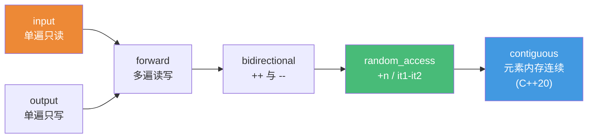
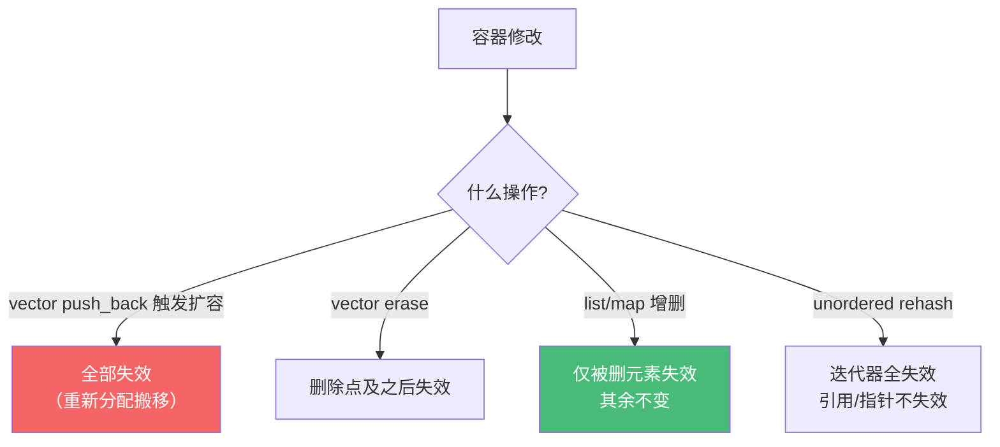

# 精通 C++ 迭代器与范围

> 课程编号：C17
> 路线图来源：现代 C++ 全栈深度课程 — STL
> 难度：⭐⭐⭐⭐
> 预计阅读时间：55 分钟
> 📅 内容基准：**C++23** + GCC 14 / Clang 18 / MSVC 19.4x

---

## 引言：为什么 sort 能排 vector 却排不了 list？

```cpp
#include <vector>
#include <list>
#include <algorithm>

std::vector<int> v{3,1,2};
std::list<int>   l{3,1,2};

std::sort(v.begin(), v.end());   // ✅ 可以
// std::sort(l.begin(), l.end()); // ❌ 编译错误！
l.sort();                         // list 必须用成员函数
```

答案：`std::sort` 要求**随机访问迭代器**（能 `it + n`、能 `it1 - it2`），而 `std::list` 是双向链表，只能 `++/--`，提供的是**双向迭代器**。算法对迭代器的"能力"有要求——这种"能力"就是**迭代器类别（iterator category）**。

迭代器是 STL 的黏合剂：**容器提供迭代器，算法消费迭代器**，两者通过迭代器解耦（你写一个 `sort` 就能排所有支持随机访问的容器）。理解迭代器类别、`iterator_traits`、C++20 的哨兵（sentinel），以及失效规则，是用对 STL 与 Ranges（C19）的前提。

---

## 第一章：迭代器五种类别

迭代器按"支持的操作"分层，能力从弱到强逐级递增（后者包含前者）：



| 类别 | 支持操作 | 典型来源 | 能用于 |
|---|---|---|---|
| **input** | `*it`(读)、`++`、`==`，单遍 | `istream_iterator` | `find`、`count` |
| **output** | `*it=v`(写)、`++`，单遍 | `back_inserter`、`ostream_iterator` | `copy` 的目标 |
| **forward** | input + 多遍 + 可写 | `forward_list`、`unordered_*` | `replace`、`fill` |
| **bidirectional** | forward + `--` | `list`、`map`、`set` | `reverse`、`next_permutation` |
| **random_access** | bidi + `it+n`、`it-it`、`it[n]`、`<` | `deque` | `sort`、`nth_element` |
| **contiguous** (C++20) | random + 元素物理连续（`&*it` 连续） | `vector`、`array`、`string`、裸指针 | 可传给需要 `T*` 的 C API |

关键点：**类别决定了哪些算法能用**。`std::sort` 需要 random_access，所以排不了 `list`；`std::reverse` 只需 bidirectional，`list` 可以。

```cpp
std::vector<int> v;
std::list<int>   l;
std::forward_list<int> fl;

std::reverse(v.begin(), v.end());  // ✅ vector 随机访问 ⊇ 双向
std::reverse(l.begin(), l.end());  // ✅ list 双向
// std::reverse(fl.begin(), fl.end()); // ❌ forward_list 只有前向，无 --
```

> contiguous 是 C++20 才从 random_access 中细分出来的——它保证 `&*(it+n) == &*it + n`，这正是把容器数据传给 `read(fd, &v[0], n)` 这类 C 接口的前提。`vector<bool>` 是著名例外：它位压缩存储，**不是** contiguous。

---

## 第二章：iterator_traits — 算法如何"问"迭代器

算法是模板，拿到一个迭代器类型 `It`，怎么知道它的"值类型""类别"？靠 **`std::iterator_traits<It>`** 这层间接：

```cpp
template <class It>
typename std::iterator_traits<It>::value_type     // 元素类型
sum(It first, It last) {
    typename std::iterator_traits<It>::value_type acc{};
    for (; first != last; ++first) acc += *first;
    return acc;
}
```

`iterator_traits` 暴露五个关联类型：

| 成员 | 含义 |
|---|---|
| `value_type` | 元素类型（`*it` 去引用） |
| `difference_type` | 两迭代器之差的类型（通常 `ptrdiff_t`） |
| `pointer` | `it->` 的返回类型 |
| `reference` | `*it` 的返回类型 |
| `iterator_category` | 类别 tag（见下） |

类别用**空标签类型**表示，可用于"标签分派（tag dispatch）"在编译期选最优实现：

```cpp
// std::advance：随机访问 O(1)，其它 O(n) —— 用类别 tag 分派
template <class It>
void advance_impl(It& it, int n, std::random_access_iterator_tag) {
    it += n;                       // O(1)：一步到位
}
template <class It>
void advance_impl(It& it, int n, std::input_iterator_tag) {
    while (n--) ++it;              // O(n)：只能逐个走
}
template <class It>
void my_advance(It& it, int n) {
    advance_impl(it, n,
        typename std::iterator_traits<It>::iterator_category{});  // 选重载
}
```

**为什么需要 traits 这层间接？** 因为裸指针 `int*` 也是合法迭代器，但它没有 `int*::value_type` 这种成员。`iterator_traits` 对指针做了偏特化（`value_type = int`、类别 = contiguous），让"指针"和"类类型迭代器"在算法里统一对待。

> C++20 起，Ranges 用 **concepts**（`std::random_access_iterator` 等）取代了 tag dispatch，把"能力要求"写进函数签名，错误信息更友好（C14/C19）。但 traits 机制仍是底层基础。

---

## 第三章：哨兵 sentinel（C++20）

经典迭代器对 `[begin, end)` 要求 begin 和 end **同类型**。C++20 放宽：**end 可以是不同类型的"哨兵"**，只要能和迭代器比较 `==`。

```cpp
// 经典：end 必须是真迭代器，得先遍历整个 C 串才知道长度
const char* s = "hello";
// 现代：用哨兵表示"遇到 \0 就停"，无需预先求长度
struct null_sentinel {
    friend bool operator==(const char* p, null_sentinel) { return *p == '\0'; }
};
for (const char* p = s; p != null_sentinel{}; ++p) { /* ... */ }
```

为什么这是大改进？经典 `strlen` 风格要"先扫一遍求 end，再扫一遍处理"。哨兵让"何时停止"成为一个**条件**而非一个**位置**，于是：

- C 字符串、`istream`（读到 EOF 停）、无限序列（`views::iota(0)`）都能纳入统一的 range 模型。
- 编译器更易优化：`begin != end` 可能是廉价的状态检查而非指针比较。

C++20 的 range 因此定义为 `[begin, sentinel)`，`std::ranges::end(r)` 返回的可能是哨兵：

```cpp
#include <ranges>
auto r = std::views::iota(0);              // 0,1,2,... 无限
auto v = r | std::views::take(5);          // 取前 5：靠哨兵知道何时停
// std::ranges::begin(v) 与 std::ranges::end(v) 可能是不同类型
```

---

## 第四章：写一个自定义迭代器

写迭代器的本质：实现类别要求的那组操作 + 暴露关联类型。下面写一个 forward 迭代器（最常见的"够用"级别）。C++20 后只要满足 concept，无需再继承 `std::iterator`（已废弃）。

```cpp
#include <iterator>
#include <cstddef>

template <class T>
class Ring {                          // 极简环形缓冲，演示迭代器
    T* buf_; std::size_t cap_, head_, len_;
public:
    class iterator {
        T* buf_; std::size_t cap_, pos_, idx_;
    public:
        // 1) 暴露关联类型（让 iterator_traits 能读到）
        using iterator_category = std::forward_iterator_tag;
        using value_type        = T;
        using difference_type   = std::ptrdiff_t;
        using pointer           = T*;
        using reference         = T&;

        iterator() = default;   // forward_iterator 要求 semiregular（可默认构造）
        iterator(T* b, std::size_t c, std::size_t p, std::size_t i)
            : buf_(b), cap_(c), pos_(p), idx_(i) {}

        // 2) 实现 forward 要求的操作
        reference operator*()  const { return buf_[pos_]; }       // 去引用
        pointer   operator->() const { return &buf_[pos_]; }      // 成员访问
        iterator& operator++() {                                  // 前置 ++
            pos_ = (pos_ + 1) % cap_; ++idx_; return *this;
        }
        iterator  operator++(int) { auto t = *this; ++*this; return t; } // 后置
        bool operator==(const iterator& o) const { return idx_ == o.idx_; }
        bool operator!=(const iterator& o) const { return !(*this == o); }
    };

    iterator begin() { return {buf_, cap_, head_, 0}; }
    iterator end()   { return {buf_, cap_, head_, len_}; }   // 哨兵：走满 len 就停
};
```

写迭代器的检查清单：

| 要素 | forward 必需 | bidirectional 加 | random_access 加 |
|---|---|---|---|
| 五个关联类型 | ✅ | ✅ | ✅ |
| `* -> ++ ==` | ✅ | ✅ | ✅ |
| `--`（前/后置） | — | ✅ | ✅ |
| `+ - += -= [] < <=> ` | — | — | ✅ |

> 写完用 concept 自检：`static_assert(std::forward_iterator<Ring<int>::iterator>);`。编译器会逐条告诉你缺哪个操作——比手动核对清单可靠得多。

---

## 第五章：迭代器失效规则

迭代器是"指向容器内部"的句柄。容器一旦增删/扩容，旧迭代器可能指向已释放或已搬移的内存——**使用失效迭代器是未定义行为**（C16 详解容器内部）。



| 容器 | 插入 | 删除 |
|---|---|---|
| `vector` | 扩容→全部失效；否则插入点之后失效 | 删除点及之后失效 |
| `deque` | 两端插入使迭代器失效（引用/指针不失效）；中间插入迭代器和引用全失效 | 中间删使全部失效；两端删仅端点 |
| `list`/`forward_list` | 不失效 | 仅被删元素 |
| `map`/`set`（红黑树） | 不失效 | 仅被删元素 |
| `unordered_*` | rehash 时迭代器全失效（引用/指针不失效） | 仅被删元素 |

经典坑：边遍历边删除。`erase` 返回"下一个有效迭代器"，必须接住：

```cpp
// ❌ 错误：erase 后 it 已失效，++it 是 UB
for (auto it = v.begin(); it != v.end(); ++it)
    if (*it % 2 == 0) v.erase(it);

// ✅ 正确：用 erase 的返回值推进
for (auto it = v.begin(); it != v.end(); )
    if (*it % 2 == 0) it = v.erase(it);   // erase 返回下一个有效迭代器
    else ++it;

// ✅ 更好（C++20）：erase-remove 一行（C18）或 std::erase_if
std::erase_if(v, [](int x){ return x % 2 == 0; });
```

---

## 第六章：常见陷阱清单

### ❌ 陷阱 1：对 list 用 std::sort

```cpp
std::list<int> l;
// std::sort(l.begin(), l.end());  // 编译错误：list 非随机访问
l.sort();                          // list 有专属成员 sort（归并，O(n log n)）
```

### ❌ 陷阱 2：边遍历边 erase 不接返回值

```cpp
for (auto it = m.begin(); it != m.end(); ++it)
    if (cond(*it)) m.erase(it);   // erase 后 ++it 是 UB
// 正确：it = m.erase(it); 或对关联容器用返回值
```

### ❌ 陷阱 3：扩容后还用旧迭代器/引用

```cpp
auto& ref = v[0];
v.push_back(x);                   // 可能扩容→重新分配
// 用 ref 是 UB（旧内存已释放）
```

### ❌ 陷阱 4：解引用 end()

```cpp
*v.end();                         // UB：end 是"尾后"，不指向元素
```

### ❌ 陷阱 5：把单遍（input）迭代器当多遍用

```cpp
std::istream_iterator<int> it(std::cin), end;
auto copy = it;                   // input 迭代器单遍：复制后两份都用会读乱
```

### ❌ 陷阱 6：自定义迭代器忘了关联类型

```cpp
struct MyIt { /* 有 * ++ == 但没 value_type 等 */ };
// std::find(MyIt{}, MyIt{}, 1);  // 算法里 iterator_traits 读不到类型 → 编译失败
```

---

## 第七章：练习题

**练习 1**：`vector`、`list`、`forward_list`、`map`、`deque` 各自提供哪种迭代器类别？

**练习 2**：为什么 `std::sort` 排不了 `std::list`，而 `std::reverse` 可以？

**练习 3**：`iterator_traits` 暴露哪五个关联类型？它为什么对裸指针也能工作？

**练习 4**：哨兵（sentinel）相比经典 end 迭代器解决了什么问题？举一个适合用哨兵的场景。

**练习 5**：找 bug：
```cpp
std::vector<int> v{1,2,3,4};
for (auto it = v.begin(); it != v.end(); ++it)
    if (*it == 2) v.erase(it);
```

---

## 参考答案与解析

**练习 1**：`vector` → contiguous（含 random_access）；`deque` → random_access（但非 contiguous，分段存储）；`list` → bidirectional；`map`/`set` → bidirectional；`forward_list` → forward。

**练习 2**：`std::sort` 用快排/内省排序，需要 `it+n`、`it1-it2`、`it[n]` 等随机访问操作（random_access 迭代器）；`list` 只有 bidirectional（`++/--`），不满足。`std::reverse` 只需 bidirectional（从两端向中间交换），`list` 满足。

**练习 3**：`value_type`、`difference_type`、`pointer`、`reference`、`iterator_category`。对裸指针能工作是因为 `iterator_traits` 对 `T*` 做了偏特化（`value_type=T`、类别=contiguous_iterator_tag），使指针和类类型迭代器在算法中统一。

**练习 4**：哨兵把"何时停止"从"一个位置"变成"一个条件"，且允许 end 与迭代器**不同类型**。适合：C 字符串（遇 `\0` 停，无需预先求长度）、输入流（读到 EOF 停）、无限序列（`views::iota(0) | take(n)`）。

**练习 5**：`v.erase(it)` 后 `it` 失效，循环的 `++it` 是未定义行为（且删除点之后的迭代器全失效）。修正：`if (*it==2) it = v.erase(it); else ++it;`，或直接 `std::erase(v, 2);`。

---

## 小结

| 知识点 | 关键记忆 |
|---|---|
| 迭代器类别 | input/output → forward → bidirectional → random_access → contiguous(C++20) |
| 类别决定算法 | sort 需 random_access；reverse 需 bidirectional |
| iterator_traits | 五关联类型；对裸指针偏特化，统一指针与类迭代器 |
| 标签分派 | 用 `iterator_category` tag 在编译期选最优实现（如 advance） |
| 哨兵 sentinel | C++20：end 可与迭代器异类型，"何时停"变成条件 |
| 失效规则 | vector 扩容/erase 失效；list/map 增删仅影响被删元素；unordered rehash 迭代器失效 |
| 边删边遍历 | 用 `it = c.erase(it)` 接返回值，或 `std::erase_if` |

---

## 📅 2026 现状/更新

- C++20 用 **iterator concepts**（`std::random_access_iterator` 等）取代 tag dispatch，写自定义迭代器时 `static_assert` 自检更友好。
- contiguous 类别让"传容器给 C API"有了类型级保证；`std::to_address` 安全取裸指针。
- Ranges（C19）建立在 `[begin, sentinel)` 模型上，哨兵从"高级技巧"变成日常基础设施。
- 实务建议：日常优先用 range-based for 与 ranges 算法，少手写迭代器循环；确需写迭代器时，先满足 forward concept，按需升级。

---

> 🔁 下一篇 **C18 — 精通 C++ STL 算法**：算法库分类、谓词与函数对象、erase-remove 惯用法、执行策略（par/par_unseq）、`sort/find/accumulate/transform` 常用算法，以及"算法 vs 手写循环"的取舍。
>
> 反馈：把"类别决定能用哪些算法"和"失效规则表"这两条钉死——它们是 STL 误用的最大来源。
