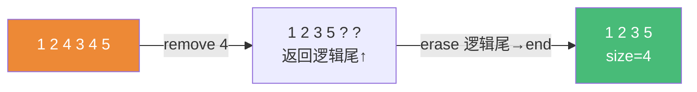

# 精通 C++ STL 算法

> 课程编号：C18
> 路线图来源：现代 C++ 全栈深度课程 — STL
> 难度：⭐⭐⭐
> 预计阅读时间：50 分钟
> 📅 内容基准：**C++23** + GCC 14 / Clang 18 / MSVC 19.4x

---

## 引言：删除偶数为什么要写两步？

```cpp
#include <vector>
#include <algorithm>

std::vector<int> v{1,2,3,4,5,6};

// 直觉写法：remove 一下不就删了？
std::remove(v.begin(), v.end(), 4);
// 此时 v 是 {1,2,3,5,6, ?, ?}？size 还是 6！元素没真删掉！

// 正确：erase-remove 惯用法
v.erase(std::remove(v.begin(), v.end(), 4), v.end());  // 现在 size=5
```

答案：`std::remove` **不能改变容器大小**——算法只持有迭代器，看不到容器本身（C17 讲的解耦）。它把"要保留的元素"前移、返回新逻辑尾，真正的"删除"要容器的 `erase` 来做。这就是著名的 **erase-remove 惯用法**，也是理解"STL 算法和容器为何分离"的最佳例子。

STL 算法库（`<algorithm>`/`<numeric>`）有上百个泛型算法，配合谓词、函数对象和 C++17 执行策略，能用一行表达意图、还能自动并行。本章讲分类、常用算法、惯用法，以及"该用算法还是手写循环"。

---

## 第一章：算法库分类

`<algorithm>` 与 `<numeric>` 按用途大致分几类：

| 类别 | 代表算法 | 一句话 |
|---|---|---|
| **非修改** | `find` `count` `all_of` `for_each` `search` | 只读，不改元素 |
| **修改** | `copy` `transform` `replace` `fill` `generate` | 写入目标 |
| **删除** | `remove` `unique` `remove_if` | 逻辑删除（配合 erase） |
| **排序相关** | `sort` `stable_sort` `partial_sort` `nth_element` | 需随机访问迭代器 |
| **二分（有序区间）** | `lower_bound` `upper_bound` `binary_search` `equal_range` | 前提：已排序 |
| **集合（有序区间）** | `set_union` `set_intersection` `merge` | 前提：已排序 |
| **数值** | `accumulate` `reduce` `inner_product` `partial_sum` `iota` | 在 `<numeric>` |
| **堆** | `make_heap` `push_heap` `pop_heap` | 优先队列底层 |
| **min/max** | `min_element` `max_element` `clamp` `minmax` | |

记忆要点：**带 `_if` 后缀**收一个谓词；**带 `_copy` 后缀**写到另一区间而非原地；**`stable_` 前缀**保持相等元素的相对顺序。

```cpp
std::remove(b, e, 4);          // 删等于 4 的
std::remove_if(b, e, pred);    // 删满足谓词的
std::replace(b, e, 4, 9);      // 原地：4→9
std::replace_copy(b,e,out,4,9);// 写到 out，原区间不变
```

---

## 第二章：谓词与函数对象

很多算法收一个**可调用对象**：谓词（返回 bool）、比较器、变换函数。可调用对象有四种形态：

```cpp
bool is_odd(int x) { return x % 2; }        // 1) 函数指针
struct IsOdd { bool operator()(int x) const { return x % 2; } }; // 2) 函数对象(仿函数)
auto lam = [](int x){ return x % 2; };      // 3) lambda（C20）
std::function<bool(int)> f = is_odd;        // 4) std::function（类型擦除，有开销，C20）

std::count_if(v.begin(), v.end(), is_odd);
std::count_if(v.begin(), v.end(), IsOdd{});
std::count_if(v.begin(), v.end(), lam);     // 最常用
```

**函数对象（仿函数）相比函数指针的优势**：① 可携带状态；② 调用通常能**内联**（类型在编译期已知），函数指针常无法内联。这就是为什么 `std::sort` 配 lambda/仿函数比配函数指针更快：

```cpp
struct GreaterThan {                  // 携带状态的仿函数
    int bound;
    bool operator()(int x) const { return x > bound; }
};
auto n = std::count_if(v.begin(), v.end(), GreaterThan{10});  // 内联 + 带参数
```

标准库还提供"透明运算符仿函数"：`std::less<>`、`std::greater<>`（C++14 起空尖括号支持异构比较）。

```cpp
std::sort(v.begin(), v.end(), std::greater<>{});  // 降序
```

> lambda 是匿名函数对象的语法糖（C20 详解闭包类型）。日常写谓词，优先 lambda。

---

## 第三章：erase-remove 惯用法

为什么算法不能真删？因为算法只拿到 `[first, last)` 一对迭代器，**够不到容器**（不知道怎么释放、怎么改 size）。`remove` 的做法是"覆盖前移"：



```cpp
// remove 把"保留元素"压到前面，返回新逻辑尾（之后是"垃圾值"，仍占位）
auto new_end = std::remove(v.begin(), v.end(), 4);
v.erase(new_end, v.end());                 // erase 才真正缩容

// 合并成一行（经典惯用法）
v.erase(std::remove_if(v.begin(), v.end(),
                       [](int x){ return x < 0; }),
        v.end());
```

C++20 起有更简洁的自由函数，**优先用它们**（一步到位，不易写错）：

```cpp
std::erase(v, 4);                          // 删所有等于 4 的
std::erase_if(v, [](int x){ return x<0; });// 删所有满足谓词的
```

类似地，去重要先排序（`unique` 只去**相邻**重复）：

```cpp
std::sort(v.begin(), v.end());
v.erase(std::unique(v.begin(), v.end()), v.end());  // 去全局重复
```

---

## 第四章：常用算法实战

### 4.1 sort / 自定义比较

```cpp
std::sort(v.begin(), v.end());                       // 默认升序（operator<）
std::sort(v.begin(), v.end(), std::greater<>{});     // 降序
std::sort(people.begin(), people.end(),
          [](const auto& a, const auto& b){ return a.age < b.age; }); // 按字段

std::stable_sort(...);   // 保持相等元素相对顺序（归并，稳定）
std::partial_sort(b, b+10, e);  // 只把最小 10 个排到前面（topK，比全排快）
std::nth_element(b, b+k, e);     // 让第 k 位就位，左<右（O(n) 求中位数）
```

> ⚠️ 比较器必须满足**严格弱序**（`comp(a,a)` 恒为 false）。写成 `<=` 会违反，导致 UB（越界）。

### 4.2 find / 查找

```cpp
auto it = std::find(v.begin(), v.end(), 42);
if (it != v.end()) { /* 找到 */ }

auto it2 = std::find_if(v.begin(), v.end(), [](int x){ return x>100; });

// 有序区间用二分（O(log n)）
std::sort(v.begin(), v.end());
bool yes = std::binary_search(v.begin(), v.end(), 42);
auto lb  = std::lower_bound(v.begin(), v.end(), 42); // 第一个 >=42
```

### 4.3 accumulate / reduce（求和、归约）

```cpp
#include <numeric>
int sum = std::accumulate(v.begin(), v.end(), 0);          // 0 是初值（也定类型！）
double avg = std::accumulate(v.begin(), v.end(), 0.0) / v.size(); // 注意 0.0
int prod = std::accumulate(v.begin(), v.end(), 1, std::multiplies<>{});

// C++17 reduce：可乱序/并行（要求操作满足结合律、交换律）
int s = std::reduce(std::execution::par, v.begin(), v.end());
```

> 经典坑：`accumulate(v.begin(), v.end(), 0)` 对 `vector<double>` 会**截断为 int**——初值类型决定累加类型，要写 `0.0`。

### 4.4 transform（映射）

```cpp
std::vector<int> out(v.size());
std::transform(v.begin(), v.end(), out.begin(),
               [](int x){ return x * x; });               // 一元：平方

std::transform(a.begin(), a.end(), b.begin(), out.begin(),
               std::plus<>{});                            // 二元：a+b 逐元素
```

---

## 第五章：执行策略（C++17 并行算法）

C++17 给多数算法加了**执行策略**参数（`<execution>`），一行开启并行/向量化：

| 策略 | 含义 | 适用 |
|---|---|---|
| `seq` | 顺序（默认） | 小数据、有依赖 |
| `par` | 多线程并行 | 大数据、操作独立 |
| `par_unseq` | 并行 + 向量化(SIMD)，可交错 | 无锁、无顺序依赖的纯计算 |
| `unseq`(C++20) | 单线程向量化 | SIMD 友好的循环 |

```cpp
#include <execution>
std::sort(std::execution::par, v.begin(), v.end());           // 并行排序
std::for_each(std::execution::par_unseq, v.begin(), v.end(),
              [](auto& x){ x = std::sqrt(x); });
double s = std::reduce(std::execution::par, v.begin(), v.end()); // 并行求和
```

```mermaid
graph TD
    A["数据量大?"] -->|否| S["seq（默认）"]
    A -->|是| B{元素操作独立?}
    B -->|否(有共享/顺序依赖)| S
    B -->|是| C{操作内有锁/同步?}
    C -->|有| P["par"]
    C -->|无、纯计算| PU["par_unseq"]
    style S fill:#a0aec0,color:#fff
    style P fill:#48bb78,color:#fff
    style PU fill:#4299e1,color:#fff
```

**关键约束**：`par_unseq` 下两次调用可能在**同一线程交错执行**，所以函数体内**不能加锁、不能用线程不安全的全局状态**（否则死锁/UB）。`par` 则要求各元素操作无数据竞争。

> 实测：并行有线程调度开销，**小数据反而更慢**。要 benchmark，别盲目加 `par`。GCC 的并行算法依赖 Intel TBB（链接 `-ltbb`）。

---

## 第六章：算法 vs 手写循环

什么时候用算法、什么时候手写 for？

**优先用算法**，因为：① **表达意图**（`std::any_of` 比"循环+flag+break"一眼看懂）；② 不易出错（边界、失效）；③ 可换执行策略并行；④ 编译器熟悉这些模式、优化更好。

```cpp
// 手写：意图被淹没在循环细节里
bool found = false;
for (auto& x : v) if (x == target) { found = true; break; }

// 算法：意图即代码
bool found = std::find(v.begin(), v.end(), target) != v.end();
bool any   = std::any_of(v.begin(), v.end(), pred);  // 更直接
```

**手写循环更合适的场景**：① 一次遍历做多件事（用一个算法表达不了，多个算法要多遍）；② 复杂控制流（提前 return、跨元素状态机）；③ range-based for 已经足够清晰时。

```cpp
// 这种"一遍同时求 min/max/sum"手写更清晰（或用 minmax_element + accumulate 两遍）
int mn=v[0], mx=v[0]; long sum=0;
for (int x : v) { mn=std::min(mn,x); mx=std::max(mx,x); sum+=x; }
```

> C++20 Ranges（C19）调和了这对矛盾：`v | filter | transform` 既有算法的表达力，又能**单遍惰性**完成多步，不必为每步建临时容器。

---

## 第七章：常见陷阱清单

### ❌ 陷阱 1：以为 remove 会真删

```cpp
std::remove(v.begin(), v.end(), 4);   // size 不变！要配 erase 或用 std::erase(v,4)
```

### ❌ 陷阱 2：accumulate 初值类型错

```cpp
std::vector<double> v{1.5, 2.5};
auto s = std::accumulate(v.begin(), v.end(), 0);   // 截断成 int！应 0.0
```

### ❌ 陷阱 3：比较器不满足严格弱序

```cpp
std::sort(b, e, [](int a, int b){ return a <= b; });  // <= 违反严格弱序 → UB
```

### ❌ 陷阱 4：transform 目标空间不够

```cpp
std::vector<int> out;                 // 空！
std::transform(v.begin(), v.end(), out.begin(), f);  // UB：写越界
// 修正：out.resize(v.size()) 或用 std::back_inserter(out)
```

### ❌ 陷阱 5：对未排序区间用二分/unique

```cpp
std::binary_search(v.begin(), v.end(), x);  // 未排序 → 结果错（非 UB 但无意义）
std::unique(v.begin(), v.end());            // 只去相邻重复，未排序去不干净
```

### ❌ 陷阱 6：par_unseq 里加锁

```cpp
std::for_each(std::execution::par_unseq, b, e,
    [&](auto& x){ std::lock_guard g(mtx); /*...*/ });  // 同线程交错 → 可能死锁
```

---

## 第八章：练习题

**练习 1**：为什么 `std::remove` 不能真正删除元素？写出删除 vector 中所有 0 的两种正确写法。

**练习 2**：`accumulate(v.begin(), v.end(), 0)` 对 `vector<double>` 有什么问题？

**练习 3**：`par` 和 `par_unseq` 的区别是什么？在 `par_unseq` 的函数体里能不能加锁？

**练习 4**：要从一万个数里找最小的 10 个，用 `sort` 还是 `partial_sort`？为什么？

**练习 5**：找 bug：
```cpp
std::vector<int> in{1,2,3}, out;
std::transform(in.begin(), in.end(), out.begin(),
               [](int x){ return x*2; });
```

---

## 参考答案与解析

**练习 1**：算法只持有迭代器，够不到容器本身（无法改 size/释放内存），`remove` 只能把保留元素前移并返回新逻辑尾。两种写法：`v.erase(std::remove(v.begin(),v.end(),0), v.end());` 或 C++20 的 `std::erase(v, 0);`。

**练习 2**：初值 `0` 是 `int`，使累加器为 `int`，每步把 double 截断为 int，结果错误。应写 `0.0`（或 `std::reduce`/显式模板参数）。

**练习 3**：`par` 多线程并行，各元素操作之间无数据竞争即可；`par_unseq` 在并行基础上还允许同一线程内**交错/向量化**执行多个元素，因此函数体内**不能加锁、不能有顺序依赖**（同线程交错会死锁/UB）。所以 par_unseq 里不能加锁。

**练习 4**：用 `partial_sort(b, b+10, e)`（或 `nth_element`）。`sort` 全排是 O(n log n)；`partial_sort` 只保证前 10 个有序，平均更快，意图也更清晰。

**练习 5**：`out` 为空，`out.begin()` 不指向可写空间，`transform` 写入越界（UB）。修正：先 `out.resize(in.size())`，或用 `std::back_inserter(out)` 作为输出迭代器（边写边 push_back）。

---

## 小结

| 知识点 | 关键记忆 |
|---|---|
| 算法/容器分离 | 算法只持迭代器，改不了 size → 需 erase |
| erase-remove | `v.erase(remove(...), end())`；C++20 优先 `std::erase/erase_if` |
| 谓词/函数对象 | 仿函数/lambda 可内联、带状态，优于函数指针 |
| 常用算法 | sort/find/binary_search/accumulate/transform |
| accumulate 初值 | 初值类型决定累加类型（double 要 0.0） |
| 严格弱序 | 比较器用 `<` 不用 `<=`，否则 UB |
| 执行策略 | seq/par/par_unseq；par_unseq 内禁锁；小数据别并行 |
| 算法 vs 循环 | 表达意图优先算法；多事一遍或复杂控制流可手写；Ranges 兼得 |

---

## 📅 2026 现状/更新

- C++20 的 `std::erase`/`std::erase_if` 让 erase-remove 惯用法基本退役（更短、不易错）。
- C++17 并行算法在 GCC 需链接 TBB；C++23 起 ranges 算法（C19）逐步覆盖经典算法，签名更安全（收 range 而非迭代器对）。
- `std::ranges::sort(v)` 直接传容器，省去 `begin()/end()`，且用 concept 约束报错友好。
- 实务准则：先用最能表达意图的算法/ranges；要并行先 benchmark；删除统一用 `erase_if`。

---

> 🔁 下一篇 **C19 — 精通 C++ Ranges**：range 概念、views 惰性求值、管道 `|`、常用 view（filter/transform/take/drop/iota/split）、ranges 算法、投影 projection，以及 C++23 新增的 zip/enumerate/chunk。
>
> 反馈：把"算法改不了容器大小→erase-remove"和"par_unseq 内禁锁"两条钉死——前者是 STL 新手第一大坑，后者是并行第一大坑。
