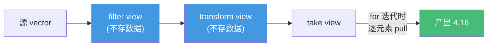

# 精通 C++ Ranges

> 课程编号：C19
> 路线图来源：现代 C++ 全栈深度课程 — STL
> 难度：⭐⭐⭐⭐
> 📅 内容基准：**C++23** + GCC 14 / Clang 18 / MSVC 19.4x

---

## 引言：为什么 Ranges 不建临时容器还更快？

```cpp
#include <ranges>
#include <vector>
namespace rv = std::views;

std::vector<int> v{1,2,3,4,5,6,7,8};

// 经典写法：每步一个临时容器，三次遍历 + 两次分配
// auto a = filter(v, even);   // 临时1
// auto b = transform(a, sq);  // 临时2
// 取前两个

// Ranges：一条管道，惰性、单遍、零额外容器
auto r = v | rv::filter([](int x){ return x % 2 == 0; })  // 留偶数
           | rv::transform([](int x){ return x * x; })    // 平方
           | rv::take(2);                                  // 取前两个
for (int x : r) /* 4, 16 */;
```

答案：管道里的 `filter`/`transform`/`take` 都是 **view（视图）**——它们**不拷贝数据、不立即计算**，只是描述"如何按需产出元素"。真正的计算发生在 `for` 迭代时，**逐元素流过整条管道**（pull 模型）。所以没有临时容器，且 `take(2)` 一旦取够就停——`filter`/`transform` 也只算了刚好够的元素。

Ranges（C++20）是 STL 的现代化重写：用 range 概念取代"迭代器对"，用 view + 管道取代"嵌套算法调用"，让数据处理像 Unix 管道一样可组合、可读。本章讲 range 概念、view 惰性、管道 `|`、常用 view、ranges 算法与投影，以及 C++23 新 view。

---

## 第一章：range 概念

**range** 就是"能 `begin()`/`end()` 的东西"——任何容器、数组、view 都是 range。C++20 把它形式化为 concept：

```cpp
template <class T>
concept range = requires(T& t) {
    std::ranges::begin(t);   // 起点迭代器
    std::ranges::end(t);     // 终点（迭代器或哨兵 sentinel，见 C17）
};
```

range 按能力分层（concept 细化）：

| concept | 含义 |
|---|---|
| `range` | 有 begin/end |
| `input_range` / `forward_range` / ... | 迭代器类别对应（C17） |
| `sized_range` | `size()` O(1) 可得 |
| `view` | 轻量、可拷贝(O(1))、不拥有元素 |
| `borrowed_range` | 即使 range 是临时量，迭代器仍有效 |
| `viewable_range` | 能安全转成 view（可进管道） |

ranges 算法直接收 range，不必再写 `begin()/end()`：

```cpp
std::ranges::sort(v);                  // vs std::sort(v.begin(), v.end())
auto it = std::ranges::find(v, 42);
int n   = std::ranges::count_if(v, [](int x){ return x>0; });
```

> **owning vs view**：`vector` **拥有**元素（析构时释放）；view **不拥有**，只是"看向"别处的数据，拷贝 view 是 O(1)（拷一对迭代器）。这是惰性管道廉价的根本。

---

## 第二章：views 惰性求值

view 的核心是**惰性（lazy）**：构造 view 不做任何计算，迭代时才逐元素求值。



对比 eager（立即）与 lazy（惰性）：

```cpp
// eager（传统算法）：每步算完整个容器、建临时
std::vector<int> a; std::copy_if(v.begin(),v.end(),back_inserter(a),even); // 全算
std::vector<int> b; std::transform(a.begin(),a.end(),back_inserter(b),sq); // 全算

// lazy（views）：迭代时才算，且 take(2) 让上游只算 2 个有效元素
auto r = v | rv::filter(even) | rv::transform(sq) | rv::take(2);
```

惰性的两大收益：① **零中间容器**（省内存与分配）；② **短路**——`take`/`find` 取够即停，上游不多算。甚至能处理**无限序列**：

```cpp
auto squares = rv::iota(1)                     // 1,2,3,... 无限
             | rv::transform([](int n){ return n*n; })
             | rv::take(5);                     // 惰性使无限可用：1,4,9,16,25
```

> ⚠️ 惰性的代价：view **不缓存**，重复迭代会**重复计算**；`filter` 等的 `begin()` 可能不是 O(1)（要找第一个满足的）。需要结果多次用时，用 `ranges::to`（见第六章）物化成容器。

---

## 第三章：管道 `|` 与常用 view

`|` 是 view 的组合运算符：`r | adaptor` 等价于 `adaptor(r)`，多个串联从左到右流动，读起来就是数据处理步骤。

```cpp
auto r = data | rv::filter(p) | rv::transform(f) | rv::take(n);
//       数据    留下满足p的     映射成f(x)         取前n个
```

常用 view 速查：

| view | 作用 | 示例 |
|---|---|---|
| `filter(pred)` | 留下满足谓词的 | `v | filter(even)` |
| `transform(f)` | 逐元素映射 | `v | transform(sq)` |
| `take(n)` | 取前 n 个 | `v | take(3)` |
| `take_while(pred)` | 取到第一个不满足为止 | |
| `drop(n)` | 跳过前 n 个 | `v | drop(2)` |
| `drop_while(pred)` | 跳到第一个不满足 | |
| `reverse` | 反向 | `v | reverse` |
| `iota(a[,b])` | 生成 a,a+1,...（[,b) 或无限） | `iota(0,5)` |
| `split(d)` | 按分隔符切分成子范围 | `s | split(' ')` |
| `join` | 把"范围的范围"摊平 | |
| `keys`/`values` | 取 map 的键/值 | `m | values` |
| `elements<N>` | 取 tuple 的第 N 元 | |

```cpp
// 综合：取字符串里每个单词的长度
std::string text = "the quick brown fox";
auto lens = text
    | rv::split(' ')
    | rv::transform([](auto word){ return std::ranges::distance(word); });
for (auto n : lens) /* 3,5,5,3 */;
```

> 注意求值顺序：`filter` 在 `transform` 前 vs 后，性能不同——先 `filter` 减少 `transform` 的工作量，通常更优（与 SQL 谓词下推同理）。

---

## 第四章：ranges 算法与投影 projection

ranges 算法（`std::ranges::sort` 等）在 `std::ranges` 命名空间，比经典算法多两个好处：① 收 range（省 begin/end）；② 支持**投影（projection）**——一个"先抽取再比较"的回调，省去自定义比较器。

```cpp
struct Person { std::string name; int age; };
std::vector<Person> ps = /* ... */;

// 经典：要写完整 lambda 比较器
std::sort(ps.begin(), ps.end(),
          [](auto& a, auto& b){ return a.age < b.age; });

// ranges + 投影：&Person::age 是投影，比较"投影后的值"
std::ranges::sort(ps, {}, &Person::age);            // {} 是默认比较 less
std::ranges::sort(ps, std::greater{}, &Person::age);// 按 age 降序

auto it = std::ranges::find(ps, "Bob", &Person::name); // 按 name 找
int total = std::ranges::count_if(ps,
                [](int a){ return a >= 18; }, &Person::age); // 谓词作用于投影值
```

投影的本质：算法在比较/判断前，先对每个元素调用投影 `proj(elem)`，再把结果喂给比较器/谓词。签名是 `algo(range, comp = {}, proj = {})`。


> 投影可以是成员指针 `&Person::age`、成员函数指针 `&Person::name`、或任意 lambda。它把"提取要比较的字段"从比较器里抽离，大幅减少样板代码。

---

## 第五章：C++23 新增 view

C++23 大幅扩充 view，补齐了数据处理常用操作：

| view (C++23) | 作用 | 示例 |
|---|---|---|
| `zip` | 多个 range 并行打包成 tuple | `zip(names, ages)` |
| `zip_transform(f, ...)` | zip 后立即映射 | |
| `enumerate` | 配对 (索引, 元素) | `v | enumerate` |
| `chunk(n)` | 切成每 n 个一组 | `v | chunk(3)` |
| `slide(n)` | 滑动窗口（相邻 n 个） | `v | slide(2)` |
| `chunk_by(pred)` | 按相邻关系分组 | |
| `stride(n)` | 每隔 n 个取一个 | `v | stride(2)` |
| `cartesian_product` | 笛卡尔积 | |
| `join_with(d)` | join 时插入分隔符 | |
| `repeat(x[,n])` | 重复 x（无限或 n 次） | |

```cpp
std::vector<std::string> names{"Tom","Amy","Bob"};
std::vector<int> ages{20, 25, 30};

// zip：并行遍历多个容器（取代手写下标）
for (auto [name, age] : rv::zip(names, ages))
    std::print("{}: {}\n", name, age);

// enumerate：带索引遍历（取代 size_t i=0; ++i）
for (auto [i, name] : names | rv::enumerate)
    std::print("[{}] {}\n", i, name);

// chunk：分批处理
for (auto group : rv::iota(1,10) | rv::chunk(3))
    /* group: {1,2,3} 然后 {4,5,6} 然后 {7,8,9} */;
```

> `zip` 取**最短**那个 range 的长度；`zip`/`enumerate` 产出的是 **tuple/pair 的引用**，配结构化绑定 `auto [i, x]` 食用最佳。这些 view 在 GCC 14 / Clang 17+ 可用。

---

## 第六章：物化 ranges::to（C++23）

惰性 view 不缓存、不拥有数据。需要一个真容器（要多次用、要返回、要存储）时，用 **`std::ranges::to`** 物化：

```cpp
#include <ranges>
auto evens = v | rv::filter(even) | rv::transform(sq);

// C++23：一行把 view 收集成容器
auto vec = evens | std::ranges::to<std::vector>();      // → std::vector
auto st  = evens | std::ranges::to<std::set>();         // → std::set（去重排序）
auto m   = rv::zip(keys, vals) | std::ranges::to<std::map>(); // → std::map

// C++20（无 ranges::to 时）手动物化
std::vector<int> v2(evens.begin(), evens.end());
```

何时该物化？

- view 结果要**多次遍历**（避免重复计算）。
- 要**返回**给调用者（返回悬垂 view 危险——见陷阱）。
- 需要 `size()`、随机访问，或要把数据存起来。

否则保持惰性最省。

---

## 第七章：常见陷阱清单

### ❌ 陷阱 1：返回引用临时量的 view（悬垂）

```cpp
auto bad() {
    std::vector<int> v{1,2,3};
    return v | rv::transform(sq);   // v 析构后 view 悬垂！返回时 UB
}
// 修正：返回前物化 `| std::ranges::to<std::vector>()`
```

### ❌ 陷阱 2：以为 view 缓存结果

```cpp
auto r = v | rv::transform(expensive);
for (auto x : r) {}   // 算一遍
for (auto x : r) {}   // 又算一遍！view 不缓存。要复用先 to<vector>()
```

### ❌ 陷阱 3：filter 后改元素破坏谓词

```cpp
auto evens = v | rv::filter(even);
for (auto& x : evens) x += 1;   // 改成奇数后再迭代 filter，行为未定义（缓存的 begin 失配）
```

### ❌ 陷阱 4：对 view 用经典算法的迭代器对

```cpp
auto r = v | rv::filter(even);
// std::sort(r.begin(), r.end());  // filter view 非随机访问，且 sort 要可写连续 → 失败
```

### ❌ 陷阱 5：zip 长度不齐误判

```cpp
rv::zip(a, b);   // 长度取 min(a,b)，多出的元素被悄悄丢弃——确认这是你要的
```

### ❌ 陷阱 6：在管道里做有副作用的 transform 依赖求值次数

```cpp
auto r = v | rv::transform([&](int x){ ++calls; return x; }) | rv::take(2);
// take(2) 让上游只算 2 次；若你以为 transform 跑了全程，calls 计数会出乎意料
```

---

## 第八章：练习题

**练习 1**：解释为什么 `v | filter(even) | transform(sq) | take(2)` 不创建任何中间容器，且不会算完整个 v。

**练习 2**：什么是投影（projection）？用 `std::ranges::sort` 把 `vector<Person>` 按 `age` 降序排序（不写比较 lambda）。

**练习 3**：view 是否缓存计算结果？什么时候应该用 `ranges::to` 物化？

**练习 4**：用 C++23 的 view 实现"带索引遍历 names"和"把 names、ages 并行打包"。

**练习 5**：找 bug：
```cpp
auto make() {
    std::vector<int> v{1,2,3};
    return v | std::views::filter([](int x){ return x>1; });
}
```

---

## 参考答案与解析

**练习 1**：`filter`/`transform`/`take` 都是 view，惰性且不拥有数据——构造时不计算、不分配。迭代时元素逐个被"拉"过管道（pull 模型），`take(2)` 取够 2 个有效元素就停止向上游索取，因此 `filter`/`transform` 只对刚够产出 2 个的前缀求值，不算完整个 v，也没有中间容器。

**练习 2**：投影是算法在比较/判断前先对元素调用的"字段提取"回调。`std::ranges::sort(ps, std::greater{}, &Person::age);`——`&Person::age` 把元素投影成 age，`greater` 对投影值降序比较。

**练习 3**：不缓存，每次迭代重新计算。应物化的情形：结果要多次遍历、要返回给调用者、要 `size()`/随机访问、或需长期存储。用 `r | std::ranges::to<std::vector>()`。

**练习 4**：`for (auto [i, name] : names | std::views::enumerate) ...;` 带索引；`for (auto [name, age] : std::views::zip(names, ages)) ...;` 并行打包。

**练习 5**：返回的 filter view 引用局部 `v`，函数返回后 `v` 析构，view 悬垂——后续迭代是 UB。修正：返回前物化 `return v | ... | std::ranges::to<std::vector>();`（按值返回拥有数据的容器）。

---

## 小结

| 知识点 | 关键记忆 |
|---|---|
| range 概念 | 有 begin/end 的东西；view 不拥有、O(1) 拷贝 |
| 惰性求值 | view 迭代时才算；零中间容器、可短路、可无限序列 |
| 管道 `|` | `r | adaptor`，从左到右流；先 filter 再 transform 更优 |
| 常用 view | filter/transform/take/drop/iota/split/reverse |
| ranges 算法 | 收 range 省 begin/end；`ranges::sort(v)` |
| 投影 projection | `algo(range, comp, proj)`，proj 抽字段免写比较器 |
| C++23 新 view | zip/enumerate/chunk/slide/stride/cartesian_product |
| 物化 | `ranges::to<容器>()`；复用/返回/需 size 时用 |

---

## 📅 2026 现状/更新

- C++20 引入 Ranges；C++23 补齐 `zip`/`enumerate`/`chunk`/`ranges::to` 等，实用性大跨步。
- 编译器支持：GCC 14、Clang 17+、MSVC 19.4x 基本完整；早期版本对 C++23 view 支持参差，注意版本。
- ranges 算法逐步成为默认写法（签名安全、支持投影）；惰性管道在数据处理/ETL 风格代码中替代手写循环。
- 实务准则：**默认惰性**（最省），需要复用/返回时 `ranges::to` 物化；返回 view 务必先物化防悬垂；先 filter 后 transform。

---

> 🔁 下一篇 **C20 — 精通 C++ lambda 与函数对象**：闭包类型、捕获（值/引用/init capture/this/*this）、mutable、泛型 lambda（auto 参数）、`std::function` 的类型擦除与开销、无捕获 lambda 转函数指针、C++20 模板 lambda。
>
> 反馈：把"view 惰性不缓存、返回前要物化"和"投影免写比较器"两条钉死——它们是 Ranges 用对用爽的关键。
