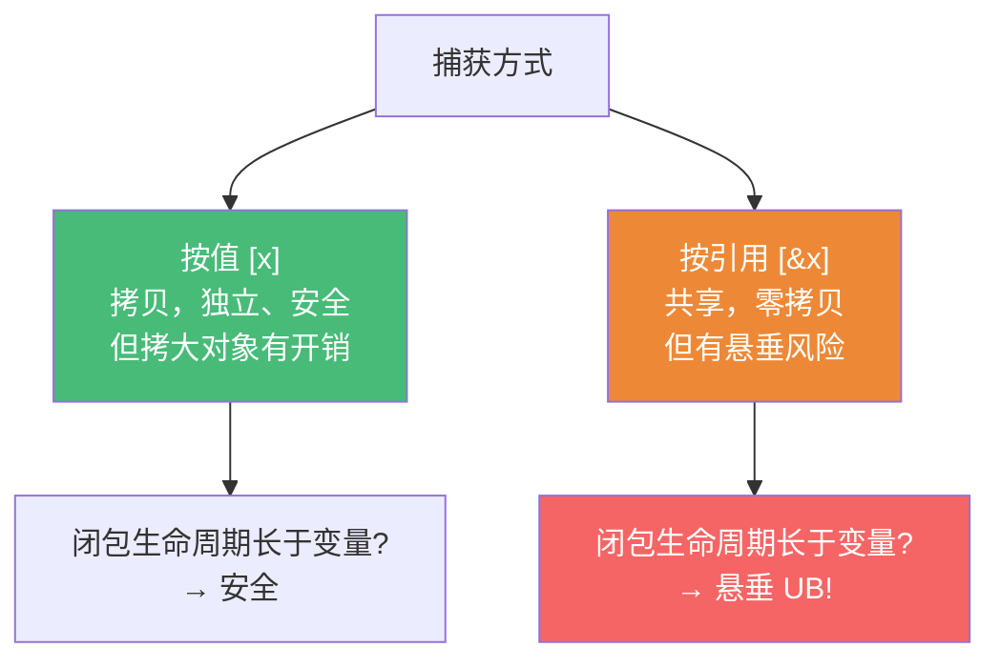

# 精通 C++ lambda 与函数对象

> 课程编号：C20
> 路线图来源：现代 C++ 全栈深度课程 — STL
> 难度：⭐⭐⭐⭐
> 📅 内容基准：**C++23** + GCC 14 / Clang 18 / MSVC 19.4x

---

## 引言：lambda 到底是什么？

```cpp
int factor = 3;
auto f = [factor](int x){ return x * factor; };   // 这是什么类型？
int r = f(10);                                    // 30
```

`f` 不是函数指针，也不是 `std::function`。编译器看到这个 lambda，会**生成一个匿名类**（闭包类型），大致等价于：

```cpp
struct __lambda {                       // 编译器生成的闭包类（名字不可知）
    int factor;                         // 捕获的变量 → 成员
    int operator()(int x) const { return x * factor; }  // 函数体 → operator()
};
__lambda f{factor};                     // 用捕获值构造一个对象
```

所以 **lambda 是"匿名函数对象的语法糖"**：捕获列表变成成员，函数体变成 `operator()`。理解这一点，捕获、`mutable`、转函数指针、`std::function` 开销全都迎刃而解。

lambda（C++11 引入，C++14/17/20 持续增强）是现代 C++ 写谓词、回调、局部逻辑的首选。本章拆解闭包机制、各种捕获、泛型与模板 lambda，以及 `std::function` 的类型擦除代价。

---

## 第一章：闭包类型与基本语法

```cpp
[捕获](参数) mutable -> 返回类型 { 函数体 };
//  ↑       ↑      ↑        ↑
// 捕获列表 参数列表 可选限定  可选返回类型
```

每个 lambda 表达式都有一个**独一无二的闭包类型**（即使两个 lambda 写得一模一样，类型也不同）：

```cpp
auto a = [](int x){ return x; };
auto b = [](int x){ return x; };
// decltype(a) 与 decltype(b) 是不同类型！
static_assert(!std::is_same_v<decltype(a), decltype(b)>);
```

闭包对象的特性：

| 特性 | 说明 |
|---|---|
| 类型唯一 | 每个 lambda 表达式一个匿名类型，不可拼写 |
| 有 `operator()` | 函数体即调用运算符；默认 `const` |
| 大小 = 捕获总和 | 无捕获 → 空类（通常 1 字节）；捕获越多越大 |
| 可拷贝 | 捕获可拷贝则闭包可拷贝 |

```cpp
auto g = [](int x){ return x*x; };
std::cout << sizeof(g);      // 1（无捕获，空类）
int big = 0;
auto h = [big](int x){ return x+big; };
std::cout << sizeof(h);      // sizeof(int) = 4
```

---

## 第二章：捕获——值、引用与陷阱

捕获把外部变量"装进闭包"。两种基本方式：

```cpp
int a = 1, b = 2;
[a]      // 按值捕获 a（拷贝进闭包，独立副本）
[&a]     // 按引用捕获 a（闭包持引用，改的是原变量）
[=]      // 按值捕获用到的所有外部变量
[&]      // 按引用捕获用到的所有外部变量
[=, &b]  // b 按引用，其余按值
[&, a]   // a 按值，其余按引用
```



**头号陷阱：按引用捕获后局部变量销毁**——闭包活得比变量久就悬垂：

```cpp
std::function<int()> make() {
    int local = 42;
    return [&local]{ return local; };  // ❌ 返回后 local 销毁，引用悬垂 → UB
}
// 修正：[local]（按值，拷一份进闭包）
```

经验：**回调要存起来/异步执行 → 按值捕获**；只在当前作用域同步用（如传给算法）→ 按引用更省。

---

## 第三章：init capture 与捕获 this

### 3.1 init capture（C++14，广义捕获）

C++14 允许在捕获里**初始化一个新成员**，常用于"捕获移动后的值"或计算表达式：

```cpp
auto p = std::make_unique<int>(42);
// 移动捕获：只移动型对象（unique_ptr）无法按值拷贝捕获，必须 init capture
auto f = [ptr = std::move(p)]{ return *ptr; };   // ptr 是闭包新成员
// 也可捕获任意表达式
auto g = [sum = a + b]{ return sum; };
```

### 3.2 捕获 this 与 *this

成员函数里的 lambda 想用成员变量，要捕获 `this`：

```cpp
struct Widget {
    int data = 10;
    auto by_this()   { return [this]{  return data; }; }  // 捕获指针 this
    auto by_value()  { return [*this]{ return data; }; }  // C++17：拷贝整个对象
};
```

| 捕获 | 含义 | 风险 |
|---|---|---|
| `[this]` | 捕获 this **指针**，访问当前对象成员 | 对象先于闭包销毁 → 悬垂 |
| `[=]`（旧） | 隐式捕获 this 指针（**不是**拷贝成员！） | 易误以为拷了成员，实则悬垂 |
| `[*this]`（C++17） | 拷贝**整个对象**进闭包，独立副本 | 安全，但拷贝有开销 |

```cpp
// 异步回调里务必小心：[this] 在对象死后调用 = 悬垂
struct Server {
    std::string name;
    void async_log() {
        // run_later([this]{ use(name); });   // ❌ Server 若先析构则悬垂
        run_later([*this]{ use(name); });     // ✅ C++17：拷贝对象副本
    }
    void use(const std::string&);
};
```

> C++20 起，`[=]` 隐式捕获 this 被**弃用**（要写 `[=, this]` 或 `[=, *this]` 表明意图）——正是为了消除"以为拷了成员、其实捕了指针"的悬垂坑。

---

## 第四章：mutable 与泛型 lambda

### 4.1 mutable

闭包的 `operator()` 默认是 **const**，所以按值捕获的成员**默认不可改**。加 `mutable` 解除：

```cpp
int count = 0;
auto counter = [count]() mutable { return ++count; };  // mutable 才能改捕获副本
counter(); counter();   // 1, 2（改的是闭包内副本，外部 count 仍为 0）
```

注意：`mutable` 改的是**闭包内部的副本**，不影响外部变量（按值捕获是独立副本）。这让 lambda 能持有"跨调用的状态"——本质就是带可变成员的函数对象。

### 4.2 泛型 lambda（C++14）

参数写 `auto`，编译器把 `operator()` 变成模板——一个 lambda 处理多种类型：

```cpp
auto add = [](auto a, auto b){ return a + b; };  // operator() 是模板
add(1, 2);        // int
add(1.5, 2.5);    // double
add(std::string("a"), "b");  // string

// 等价于：
struct __lambda {
    template <class A, class B>
    auto operator()(A a, B b) const { return a + b; }
};
```

泛型 lambda 配 ranges/算法极顺手：

```cpp
std::ranges::sort(people, {}, &Person::age);
std::ranges::for_each(v, [](const auto& x){ std::print("{}\n", x); });
```

C++20 还能用 `auto&&` 配 `std::forward` 做完美转发（C04）：

```cpp
auto wrapper = [](auto&& f, auto&&... args) -> decltype(auto) {
    return std::forward<decltype(f)>(f)(std::forward<decltype(args)>(args)...);
};
```

---

## 第五章：无捕获 lambda 转函数指针

**无捕获**的 lambda 可以隐式转成普通**函数指针**（有捕获的不行——函数指针装不下状态）：

```cpp
int (*fp)(int) = [](int x){ return x*2; };   // ✅ 无捕获 → 转函数指针
fp(10);                                       // 20

// 用于需要 C 风格回调的 API（如 qsort、pthread_create）
std::qsort(arr, n, sizeof(int),
    [](const void* a, const void* b) -> int {        // 无捕获，可作 C 回调
        return (*(const int*)a - *(const int*)b);
    });

// 有捕获则不行
int k = 2;
// int (*bad)(int) = [k](int x){ return x*k; };  // ❌ 有状态，函数指针装不下
```

为什么无捕获能转？无捕获闭包是**空对象**、`operator()` 无依赖状态，等价于一个自由函数——编译器为它合成一个静态函数并返回其地址。有捕获则携带运行时状态，无处安放。

> 需要把"带捕获的 lambda"传给只收函数指针的 C API 时，常见技巧是用一个 `void* user_data` 传上下文，回调里转回来——或改用 `std::function`（但跨 C 边界不行）。

---

## 第六章：std::function 的类型擦除与开销

每个 lambda 类型唯一、不可拼写。要把"不同 lambda 存进同一容器/成员/返回同一类型"，需要 **`std::function`** 做**类型擦除**——统一的可调用包装器：

```cpp
#include <functional>
std::function<int(int)> f;
f = [](int x){ return x+1; };        // 存 lambda
f = some_free_function;              // 也能存函数指针
f = MyFunctor{};                     // 也能存仿函数
std::vector<std::function<void()>> callbacks;   // 异构可调用对象的容器
```

代价不可忽视：

| 维度 | 直接用 lambda | `std::function` |
|---|---|---|
| 调用 | 通常**内联**（类型已知） | **虚分派**（间接调用，难内联） |
| 内存 | 栈上空对象 | 可能**堆分配**（捕获大时，超过 SBO） |
| 类型 | 唯一、编译期 | 擦除、运行时统一 |

```mermaid
graph TD
    A["可调用对象"] --> B{需要统一类型?<br>(存容器/成员/返回)}
    B -->|否，类型已知| L["直接用 auto/模板参数<br>零开销、可内联"]
    B -->|是| F["std::function<br>类型擦除，有间接+可能堆分配"]
    style L fill:#48bb78,color:#fff
    style F fill:#ed8936,color:#fff
```

准则：**能用模板参数/`auto` 就别用 `std::function`**。模板参数保留具体类型、零开销、可内联；`std::function` 只在"必须擦除类型"时才用（存异构容器、作为类成员存回调、稳定 ABI 边界）。

```cpp
// ✅ 热路径：模板参数，可内联
template <class F> void each(std::vector<int>& v, F f) { for (auto x : v) f(x); }

// 仅在必须擦除时：
class Button { std::function<void()> on_click; };   // 成员要存"某种"回调 → 合理
```

> C++23 的 `std::move_only_function` 支持只移动的可调用对象（如捕获了 `unique_ptr` 的 lambda），且可标 `const`/`noexcept`，比 `std::function` 更精确。`std::function_ref`（C++26）则是非拥有、零分配的轻量引用。

---

## 第七章：C++20 模板 lambda 与其它增强

C++20 给 lambda 加了**显式模板参数列表**，比 `auto` 更可控（能命名类型、约束、取得类型关系）：

```cpp
// 显式模板参数：能拿到类型 T 本身
auto first_type = []<class T>(const std::vector<T>& v){ return v.front(); };

// 约束 + 拿到尺寸
auto sum = []<class T, std::size_t N>(const std::array<T, N>& a){
    T s{}; for (auto& x : a) s += x; return s;
};

// 配 concept 约束参数（C14）
auto inc = []<std::integral T>(T x){ return x + 1; };
```

其它 C++20 增强：

```cpp
auto def = []{ return 0; };       // 无捕获 lambda 可默认构造、可赋值（C++20）
decltype(def) g;                   // ✅ 默认构造
// lambda 可用于未求值上下文（如做无状态比较器类型）
std::set<int, decltype([](int a,int b){ return a>b; })> s;  // C++20
```

> 模板 lambda 解决了泛型 lambda 用 `auto` 时"拿不到模板参数本身"的问题——以前要 `decltype` 绕，现在直接 `<class T>`。

---

## 第八章：常见陷阱清单

### ❌ 陷阱 1：按引用捕获局部变量后返回/异步

```cpp
auto f = [&local]{ return local; };  // local 销毁后悬垂 → UB。存起来/异步用 [local]
```

### ❌ 陷阱 2：`[=]` 以为拷了成员，其实捕了 this 指针

```cpp
struct W { int d; auto get(){ return [=]{ return d; }; } };  // 捕的是 this 指针！
// 对象先死则悬垂。要拷成员用 [*this]（C++17）。C++20 已弃用 [=] 隐式捕 this
```

### ❌ 陷阱 3：忘记 mutable 改不了按值捕获

```cpp
auto f = [n=0]{ return ++n; };   // ❌ 编译错：operator() 默认 const
auto g = [n=0]() mutable { return ++n; };  // ✅
```

### ❌ 陷阱 4：有捕获 lambda 想转函数指针

```cpp
int k=2; void(*fp)() = [k]{};   // ❌ 有状态装不进函数指针。只有无捕获能转
```

### ❌ 陷阱 5：热路径滥用 std::function

```cpp
std::function<int(int)> f = [](int x){ return x; };
for (...) f(x);   // 每次间接调用、难内联。模板参数/auto 零开销
```

### ❌ 陷阱 6：dangling reference in init capture

```cpp
auto f = [&r = some_local]{ ... };   // init capture 也能引用捕获 → 同样悬垂风险
```

---

## 第九章：练习题

**练习 1**：lambda 的"闭包类型"是什么？写出 `[factor](int x){ return x*factor; }` 编译器大致生成的等价类。

**练习 2**：`[=]`、`[&]`、`[this]`、`[*this]` 各捕获什么？哪个在异步回调里最安全，为什么？

**练习 3**：为什么按值捕获的变量默认不能在 lambda 体内修改？怎么解除？

**练习 4**：为什么无捕获 lambda 能转函数指针、有捕获的不能？

**练习 5**：什么时候该用 `std::function`、什么时候该用模板参数？各自的开销是什么？

---

## 参考答案与解析

**练习 1**：闭包类型是编译器为每个 lambda 表达式生成的、唯一的匿名类，捕获变成成员、函数体变成 `operator()`。等价类：
```cpp
struct __c { int factor; int operator()(int x) const { return x * factor; } };
```

**练习 2**：`[=]` 按值捕获用到的外部变量（成员函数里隐式捕 this **指针**，非拷贝成员）；`[&]` 按引用捕获；`[this]` 捕 this 指针（共享对象）；`[*this]`（C++17）拷贝**整个对象**到闭包。异步最安全的是 `[*this]`——它持有独立副本，原对象销毁也不悬垂；`[this]`/`[=]` 在对象先死时悬垂。

**练习 3**：闭包的 `operator()` 默认是 `const`，故不能修改按值捕获的非 mutable 成员。加 `mutable` 让 `operator()` 非 const，即可修改（改的是闭包内副本，不影响外部变量）。

**练习 4**：无捕获闭包是空对象、调用不依赖任何运行时状态，等价于一个自由函数，编译器能合成静态函数并返回地址；有捕获的闭包携带运行时状态（成员），函数指针只是一个代码地址、装不下状态，故不能转换。

**练习 5**：必须**擦除类型**时用 `std::function`——存异构可调用对象的容器、作为类成员保存回调、稳定的 ABI 边界。开销：间接（虚）调用难内联、捕获大时可能堆分配。其余情况（尤其热路径、类型已知）用模板参数/`auto`——保留具体类型、零开销、可内联。

---

## 小结

| 知识点 | 关键记忆 |
|---|---|
| 闭包类型 | lambda=匿名函数对象；捕获→成员，体→operator()；类型唯一 |
| 值/引用捕获 | `[x]` 拷贝独立安全；`[&x]` 共享零拷贝但悬垂风险 |
| init capture | C++14：`[p=std::move(x)]` 捕获移动型/表达式 |
| this 捕获 | `[this]` 捕指针（悬垂险）；`[*this]`(C++17) 拷整个对象 |
| mutable | 解除 operator() 的 const，改闭包内副本 |
| 泛型 lambda | C++14 `auto` 参数 → operator() 是模板 |
| 模板 lambda | C++20 `<class T>` 显式模板参，能命名/约束类型 |
| 无捕获转函数指针 | 仅无捕获可转；有状态装不下 |
| std::function | 类型擦除：可统一异构可调用；代价=间接调用+可能堆分配 |
| 准则 | 能模板参数/auto 就别 std::function |

---

## 📅 2026 现状/更新

- C++20 弃用 `[=]` 隐式捕获 this（写 `[=, this]`/`[=, *this]` 表意），消除悬垂坑；支持无捕获 lambda 默认构造、模板 lambda、未求值上下文使用。
- C++23 `std::move_only_function`（支持只移动可调用、可标 const/noexcept）补 `std::function` 短板；`std::bind_front`/`bind_back` 取代老旧的 `std::bind`。
- C++26 进展：`std::function_ref`（非拥有、零分配的可调用引用），热路径传回调更省。
- 实务准则：写谓词/回调首选 lambda；异步存储用 `[*this]` 或按值捕获防悬垂；热路径用模板参数，仅在需类型擦除时用 `std::function`/`move_only_function`。

---

> 🔁 下一篇 **C21 — 精通 C++ 线程与 std::thread**：`thread`/`jthread`、`join`/`detach`、传参与所有权、`thread_local`、停止令牌（stop_token），以及为什么悬垂 thread 会 terminate。
>
> 反馈：把"lambda 是匿名函数对象"和"能模板参数就别 std::function"两条钉死——前者解释一切捕获行为，后者是性能关键。
