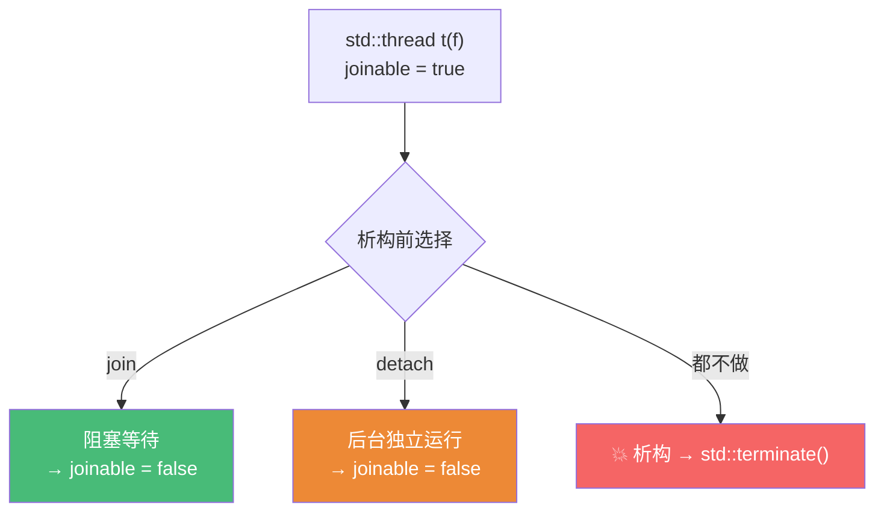
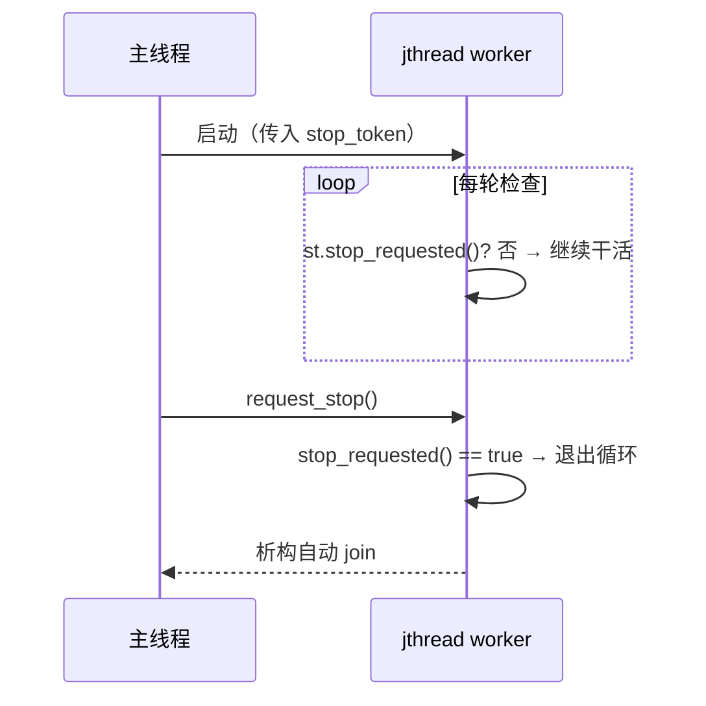
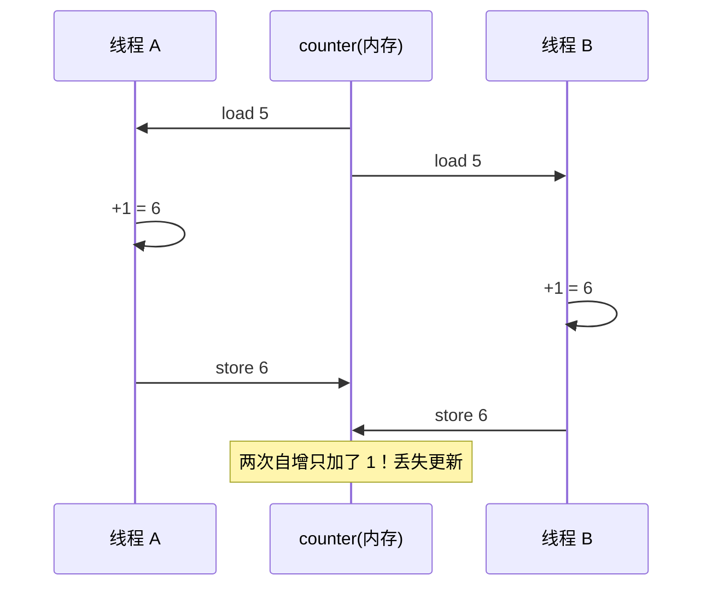

# 精通 C++ 线程与 std::thread

> 课程编号：C21
> 路线图来源：现代 C++ 全栈深度课程 — 并发：线程
> 难度：⭐⭐⭐⭐
> 预计阅读时间：55 分钟
> 📅 内容基准：**C++23**（ISO/IEC 14882:2024）+ GCC 14 / Clang 18 / MSVC 19.4x

---

## 引言：这段代码会发生什么

```cpp
#include <thread>
#include <iostream>

void task(int& counter) {
    for (int i = 0; i < 100000; ++i)
        ++counter;               // 多个线程同时改它
}

int main() {
    int counter = 0;
    std::thread t1(task, std::ref(counter));
    std::thread t2(task, std::ref(counter));
    // 1) 不 join 直接结束会怎样？
    std::cout << counter << '\n';  // 2) 一定是 200000 吗？
}
```

三个问题，能立刻回答吗？

1. `std::thread` 析构时如果还 joinable（没 join 也没 detach），会发生什么？
2. 两个线程各 `++counter` 十万次，最后一定是 200000 吗？
3. 如果不写 `std::ref`，`task` 收到的是同一个 `counter` 还是副本？

答案：① **`std::terminate()`——程序直接崩溃**。`std::thread` 的析构函数规定：若线程仍 joinable，调用 `terminate`（标准委员会故意如此——逼你显式决定 join 还是 detach）；② **不一定**——`++counter` 是"读-改-写"三步，两个线程交错执行会丢失更新，这就是**数据竞争（data race）**，结果是**未定义行为**，可能是任意值；③ 不写 `std::ref` 会**按值拷贝** counter 到线程，`task` 的 `int&` 绑到的是副本（实际上这里会编译失败，因为右值不能绑非 const 引用——这正是 `std::ref` 存在的原因）。

并发是现代 C++（多核时代）的必修。这一章打地基：怎么启动线程、怎么传参、`join`/`detach` 的生死、C++20 的 `jthread` 如何让线程"自己收尾"，以及**数据竞争**这个贯穿 C22（锁）、C23（原子）的核心概念。

---

## 第一章：启动线程

### 1.1 std::thread 基础

`std::thread` 构造时**立即启动**一个新线程，运行传入的可调用对象：

```cpp
#include <thread>

void hello() { std::puts("hi from thread"); }

int main() {
    std::thread t(hello);        // 立即启动新线程跑 hello
    t.join();                    // 等它结束（阻塞当前线程）
}                                // t 析构时必须已 join 或 detach
```

可调用对象可以是函数、lambda、函数对象、成员函数指针：

```cpp
std::thread t1(hello);                           // 普通函数
std::thread t2([]{ std::puts("lambda"); });      // lambda
std::thread t3(&Foo::method, &fooObj, 42);       // 成员函数：参数1是对象指针
```

### 1.2 join vs detach

线程对象析构前，**必须**做出选择——要么 `join`，要么 `detach`：

| | `join()` | `detach()` |
|---|---|---|
| 含义 | 等待线程结束 | 让线程在后台独立运行 |
| 阻塞 | 阻塞调用者直到线程完成 | 不阻塞，立即返回 |
| 之后 | 线程对象不再 joinable | 线程对象不再关联（守护线程） |
| 资源 | join 后回收 | 线程自己结束时回收 |

```cpp
std::thread t(work);
t.join();        // 选项 A：等它干完

std::thread t2(work);
t2.detach();     // 选项 B：放养，后台跑（小心：主程序退出时它可能被强杀）
```



⚠️ **忘记 join/detach = 程序崩溃**。这是 `std::thread` 最常见的坑，也是 C++20 `jthread`（自动 join，见第四章）要解决的痛点。

### 1.3 detach 的危险

detach 后线程访问的对象若已销毁 → 悬垂引用：

```cpp
void oops() {
    int local = 42;
    std::thread t([&]{ use(local); });   // 捕获局部变量引用
    t.detach();                          // ❌ oops 返回后 local 销毁，线程仍在用它！
}
```

detach 适合真正的"守护任务"（日志刷盘、心跳），且只能访问全局/持久对象。绝大多数场景应该 **join**（或用 `jthread`）。

---

## 第二章：给线程传参

### 2.1 参数按值拷贝（默认）

`std::thread` 的构造参数会被**拷贝/移动到线程内部存储**，再传给函数：

```cpp
void f(std::string s);
std::string msg = "hello";
std::thread t(f, msg);       // msg 被拷贝进线程（即使 f 按值收，也是先拷进 thread 再拷给 f）
```

### 2.2 传引用必须 std::ref

因为参数默认拷贝，想传**真正的引用**必须用 `std::ref`/`std::cref`：

```cpp
void modify(int& x) { x = 99; }

int n = 0;
// std::thread t(modify, n);     // ❌ 编译错误：拷贝的临时量不能绑 int&
std::thread t(modify, std::ref(n));  // ✅ 传引用，线程能改 n
t.join();
// 现在 n == 99
```

`std::ref(n)` 产生一个 `reference_wrapper`，能在拷贝时保持引用语义。

### 2.3 传 move-only 对象

`unique_ptr` 等只移动类型用 `std::move` 传入：

```cpp
void consume(std::unique_ptr<int> p);
auto p = std::make_unique<int>(42);
std::thread t(consume, std::move(p));   // 把所有权移交给线程
t.join();
```

| 想传递 | 写法 |
|---|---|
| 值（拷贝） | `std::thread(f, x)` |
| 引用 | `std::thread(f, std::ref(x))` |
| const 引用 | `std::thread(f, std::cref(x))` |
| 所有权（move-only） | `std::thread(f, std::move(p))` |
| 成员函数 | `std::thread(&C::m, &obj, args...)` |

---

## 第三章：thread_local 与硬件并发

### 3.1 thread_local 存储期

`thread_local` 变量**每个线程各有一份独立副本**，线程启动时构造、结束时析构：

```cpp
thread_local int tls_counter = 0;   // 每个线程一份

void work() {
    ++tls_counter;          // 改的是本线程的副本，无数据竞争
}
```

用途：每线程独立的缓存、随机数引擎、错误码（类似 `errno`）。它把"共享变量需要加锁"的问题，变成"每线程一份不用锁"。

```cpp
thread_local std::mt19937 rng{std::random_device{}()};  // 每线程独立随机引擎
```

### 3.2 查询硬件并发数

`std::thread::hardware_concurrency()` 返回硬件支持的并发线程数（通常是逻辑核心数），用于决定线程池大小：

```cpp
unsigned n = std::thread::hardware_concurrency();   // 0 表示无法确定
unsigned pool = (n == 0) ? 4 : n;                   // 兜底
```

⚠️ 它是**提示**而非保证——可能返回 0。开太多线程（远超核心数）会因上下文切换变慢，不是越多越快。

---

## 第四章：C++20 std::jthread

### 4.1 自动 join

`std::jthread`（joining thread）析构时**自动 join**——彻底告别"忘记 join 崩溃"：

```cpp
#include <thread>

void demo() {
    std::jthread t([]{ work(); });
    // 不用手动 join！t 析构时自动 join
}                                    // 这里自动 join，安全
```

| | `std::thread` | `std::jthread`（C++20） |
|---|---|---|
| 析构未 join | `std::terminate()` 💥 | **自动 join** ✅ |
| 协作取消 | 无 | 内置 `stop_token` |
| 推荐 | 旧代码 | **新代码首选** |

### 4.2 stop_token 协作取消

`jthread` 支持**协作式取消**——通过 `std::stop_token` 请求线程停止（线程自己检查并退出，不是强杀）：

```cpp
#include <thread>

std::jthread t([](std::stop_token st) {        // 第一个参数自动收到 stop_token
    while (!st.stop_requested()) {             // 循环检查是否被请求停止
        do_chunk_of_work();
    }
    // 收到停止请求，干净退出
});

// 某处：
t.request_stop();   // 请求停止（jthread 析构时也会自动调用）
// t 析构 → 自动 request_stop() + join()
```



`request_stop()` 只是**设置标志**——线程必须主动检查 `stop_requested()` 才会停。这是"协作式"取消：安全（不会在任意点强杀导致资源泄漏），但需要工作循环配合。

### 4.3 stop_callback

可以注册回调，在收到停止请求时触发（如唤醒阻塞的条件变量，见 C22）：

```cpp
std::stop_callback cb(st, []{ std::puts("收到停止请求，做清理"); });
```

---

## 第五章：数据竞争——并发的头号敌人

### 5.1 什么是数据竞争

**数据竞争（data race）**：两个及以上线程**并发访问同一内存**，**至少一个是写**，且**没有同步**。后果是 **未定义行为（UB）**——不只是"结果不确定"，而是编译器可以假设它不发生，做出任意优化。

```cpp
int x = 0;
// 线程 A: x = 1;
// 线程 B: int y = x;   // 与 A 并发，一读一写无同步 → 数据竞争 → UB
```

### 5.2 为什么 ++counter 不安全

`++counter` 看似一条语句，实际是三步：

```
1. load  counter → 寄存器     (读)
2. add   寄存器 +1            (改)
3. store 寄存器 → counter     (写)
```

两个线程交错时会**丢失更新**：



引言里两个线程各加十万次，结果远小于 20 万——正是大量这种交错。

### 5.3 怎么解决（预告 C22/C23）

| 方案 | 章节 | 适用 |
|---|---|---|
| `std::mutex` + lock | C22 | 保护任意临界区 |
| `std::atomic<int>` | C23 | 简单计数器、标志 |
| `thread_local` | 本章 3.1 | 干脆不共享 |

```cpp
// 用 atomic 修正引言（C23 详解）
std::atomic<int> counter{0};
void task() { for (int i=0;i<100000;++i) ++counter; }  // 原子自增，安全
```

---

## 第六章：常见陷阱清单

### ❌ 陷阱 1：忘记 join/detach → terminate

```cpp
void f() {
    std::thread t(work);
}                            // ❌ t 仍 joinable，析构 → std::terminate()
```
修正：`t.join()` / `t.detach()`，或直接用 `std::jthread`。

### ❌ 陷阱 2：传引用忘了 std::ref

```cpp
void g(int& x);
std::thread t(g, n);         // ❌ 编译错（拷贝量不能绑 int&）
std::thread t(g, std::ref(n));  // ✅
```

### ❌ 陷阱 3：detach 后访问已销毁的局部对象

```cpp
void f() {
    int local = 1;
    std::thread([&]{ use(local); }).detach();  // ❌ local 悬垂
}
```

### ❌ 陷阱 4：异常路径漏 join

```cpp
std::thread t(work);
risky();                     // 若抛异常 → 跳过下面的 join → terminate
t.join();
```
修正：用 `jthread`（RAII 自动 join），或 try/catch。

### ❌ 陷阱 5：以为 request_stop 会强制杀线程

```cpp
std::jthread t([]{ while(true) busy(); });   // 没检查 stop_token
t.request_stop();            // ❌ 没用！线程不检查就永远不停
```

### ❌ 陷阱 6：循环里 detach 线程访问循环变量

```cpp
for (int i = 0; i < n; ++i)
    std::thread([&]{ use(i); }).detach();   // ❌ 所有线程引用同一个 i（且已变/销毁）
```
修正：按值捕获 `[i]`。

---

## 第七章：练习题

**练习 1**：`std::thread` 对象析构时若仍 joinable（没 join 也没 detach），会发生什么？为什么标准这样设计？

**练习 2**：要给线程函数传一个能被它修改的 `int`，应该怎么写？为什么直接传变量名不行？

**练习 3**：`std::jthread` 相比 `std::thread` 多了哪两个关键能力？

**练习 4**：`request_stop()` 会立即终止线程吗？解释"协作式取消"。

**练习 5**：为什么 `++counter`（counter 被多线程共享）是数据竞争？最简单的修正是什么？

---

## 参考答案与解析

**练习 1**：调用 **`std::terminate()`**，程序异常终止。标准故意如此——线程的生命周期需要程序员**显式决定** join（等待）还是 detach（放养），默认行为不应是"悄悄等待"或"悄悄放养"（两者都可能是 bug），所以选择"崩溃"来强制你做决定。`jthread` 用"自动 join"提供了更安全的默认。

**练习 2**：`std::thread t(f, std::ref(n));`。直接传 `n` 不行，因为 `std::thread` 会**拷贝**参数到内部存储，函数的 `int&` 会绑到那个临时副本（实际编译失败：右值不能绑非 const 左值引用）。`std::ref(n)` 用 `reference_wrapper` 保持引用语义。

**练习 3**：① **析构自动 join**（不再 terminate）；② 内置 **`stop_token` 协作取消**（`request_stop()` + 线程检查 `stop_requested()`）。

**练习 4**：**不会立即终止**。`request_stop()` 只设置一个停止标志。"协作式取消"指线程必须**主动周期性检查** `stop_token::stop_requested()`，发现被请求后**自己干净地退出**。好处是不会在任意指令处被强杀（避免锁未释放、资源泄漏），代价是工作循环必须配合检查。

**练习 5**：`++counter` 是"读-改-写"三步非原子操作；多线程并发执行时步骤交错，会**丢失更新**（两个线程都读到旧值、各加一、写回同一个值，只生效一次），且无同步的并发读写本身就是 UB。最简单修正：把类型换成 `std::atomic<int>`（C23），`++` 变原子操作。

---

## 小结

| 知识点 | 关键记忆 |
|---|---|
| 启动 | `std::thread t(f, args)` 立即启动；可调用对象/lambda/成员函数 |
| join/detach | 析构前**必须**二选一，否则 `terminate()` |
| 传参 | 默认拷贝；引用用 `std::ref`；所有权用 `std::move` |
| thread_local | 每线程一份独立副本，避免共享 |
| hardware_concurrency | 提示性核心数，可能返回 0 |
| jthread (C++20) | **析构自动 join** + `stop_token` 协作取消，新代码首选 |
| stop_token | `request_stop()` 设标志，线程查 `stop_requested()` 自行退出 |
| 数据竞争 | 并发访问 + 至少一写 + 无同步 = UB；`++共享变量` 是典型 |

---

## 📅 2026 现状/更新

- `std::jthread` + `stop_token`（C++20）已成新代码的**默认选择**——RAII 自动 join 消除最常见的并发 bug，GCC 14 / Clang 18 / MSVC 19.4x 均完整支持。
- 更高层并发优先考虑：`std::async`/`future`（C24）做任务、协程（C25）做异步、`std::execution`（C++26，C32）做结构化并发——裸 `std::thread` 越来越多用于实现底层基础设施。
- 线程消毒器 **ThreadSanitizer**（`-fsanitize=thread`）是查数据竞争的利器，CI 必备。
- 核心准则：**能不共享就不共享（thread_local / 消息传递）；必须共享就用 atomic（C23）或 mutex（C22）同步**。

---

> 🔁 下一篇 **C22 — 精通 C++ 互斥与同步**：`mutex`/`shared_mutex`、`lock_guard`/`unique_lock`/`scoped_lock`、`condition_variable`（虚假唤醒与谓词）、死锁四条件与避免、`std::lock`，以及 C++20 的 `latch`/`barrier`/`semaphore`。
>
> 反馈：先把"忘记 join 会崩、数据竞争是 UB"钉死——前者是工程纪律（用 jthread），后者是后续两章所有同步机制存在的理由。
