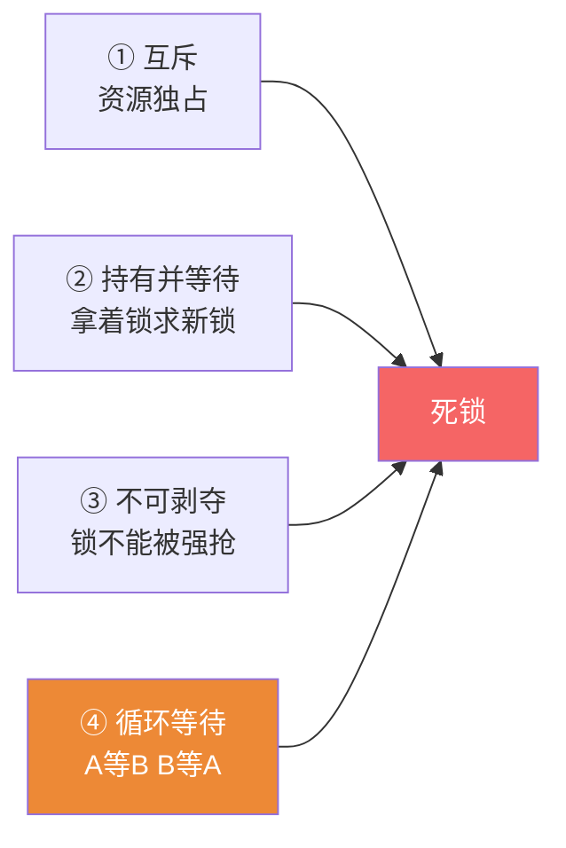
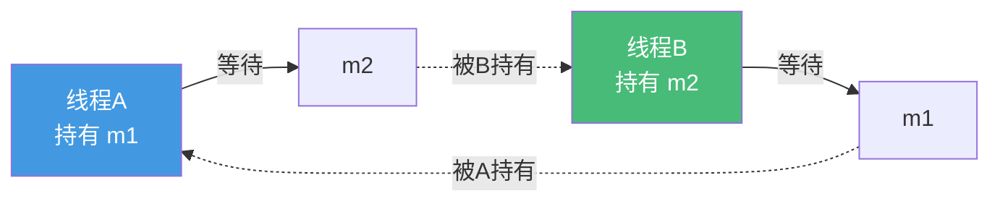
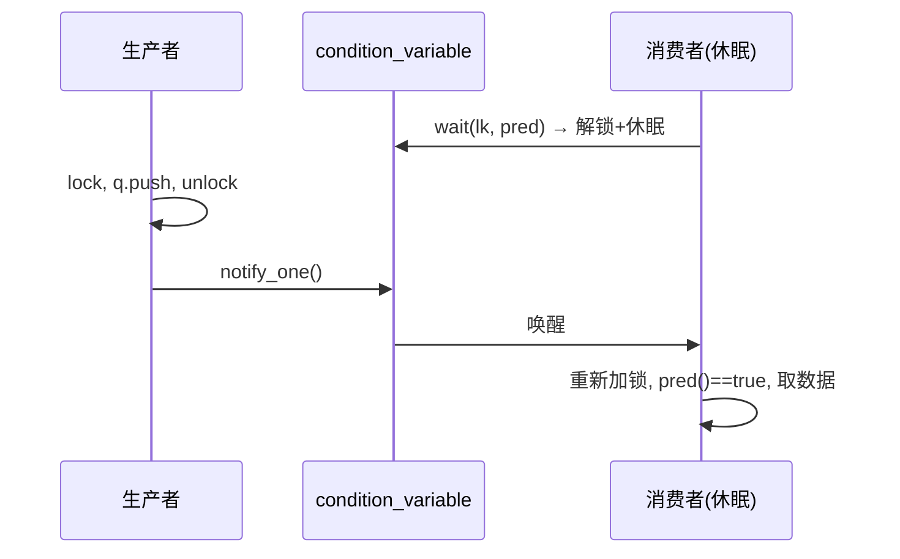

# 精通 C++ 互斥与同步

> 课程编号：C22
> 路线图来源：现代 C++ 全栈深度课程 — 并发：互斥与同步
> 难度：⭐⭐⭐⭐⭐
> 预计阅读时间：65 分钟
> 📅 内容基准：**C++23**（ISO/IEC 14882:2024）+ GCC 14 / Clang 18 / MSVC 19.4x

---

## 引言：这把锁为什么会死锁

```cpp
#include <mutex>
std::mutex m1, m2;

void threadA() {
    std::lock_guard lk1(m1);     // 先锁 m1
    std::lock_guard lk2(m2);     // 再锁 m2
    // ...
}
void threadB() {
    std::lock_guard lk1(m2);     // 先锁 m2
    std::lock_guard lk2(m1);     // 再锁 m1
    // ...
}
```

三个问题，能立刻回答吗？

1. 上面两个线程同时运行，可能发生什么？为什么？
2. 同一个线程对**同一个** `std::mutex` 连续 `lock()` 两次会怎样？
3. 用条件变量等待时，为什么 `if (条件)` 不够、必须用 `while (条件)`（或带谓词的 `wait`）？

答案：① **死锁（deadlock）**——A 持有 m1 等 m2，B 持有 m2 等 m1，互相等待永不释放（这是死锁的"循环等待"条件）；② **死锁/未定义行为**——普通 `std::mutex` **不可重入**，同一线程二次 lock 会自己锁死自己（要可重入用 `recursive_mutex`）；③ 因为存在**虚假唤醒（spurious wakeup）**——条件变量可能在没人通知时被唤醒，必须用循环重新检查条件，否则会在条件不满足时往下执行。

互斥与同步是并发正确性的核心工具。C21 讲了"数据竞争是 UB"，这一章给出**最通用的解药**：用锁保护临界区。但锁用不好会带来死锁、性能塌方。这章讲清各种 mutex、RAII 锁管理、条件变量的正确姿势、死锁的成因与避免，以及 C++20 的新同步原语。

---

## 第一章：mutex 家族

### 1.1 std::mutex 基础

`mutex`（互斥量）保证同一时刻只有一个线程进入**临界区**：

```cpp
#include <mutex>
std::mutex m;
int shared = 0;

void inc() {
    m.lock();            // 获取锁（若被占用则阻塞）
    ++shared;            // 临界区：独占访问
    m.unlock();          // 释放锁
}
```

⚠️ 手动 `lock`/`unlock` 危险——异常或提前 return 会漏掉 `unlock`。**永远用 RAII 锁**（第二章）。

### 1.2 四种 mutex

| 类型 | 特性 | 用途 |
|---|---|---|
| `std::mutex` | 基本互斥，不可重入 | 默认选择 |
| `std::recursive_mutex` | 同线程可重复 lock（计数） | 递归函数/重入回调 |
| `std::timed_mutex` | 支持 `try_lock_for`/`try_lock_until` | 带超时获取 |
| `std::shared_mutex`（C++17） | 读写锁：多读 or 单写 | 读多写少 |

```cpp
std::recursive_mutex rm;
void recurse(int n) {
    std::lock_guard lk(rm);      // 同线程可多次进入
    if (n > 0) recurse(n - 1);   // 递归再次 lock 同一个 rm，OK
}

std::timed_mutex tm;
if (tm.try_lock_for(std::chrono::milliseconds(100))) {  // 最多等 100ms
    // 拿到锁
    tm.unlock();
}                                // 没拿到则放弃，避免无限等待
```

### 1.3 shared_mutex 读写锁

读多写少时，多个读者可并发、写者独占：

```cpp
#include <shared_mutex>
std::shared_mutex rw;
std::map<int,int> cache;

int read(int k) {
    std::shared_lock lk(rw);     // 共享锁（读）：多个读者可同时持有
    return cache.at(k);
}
void write(int k, int v) {
    std::unique_lock lk(rw);     // 独占锁（写）：排他
    cache[k] = v;
}
```

---

## 第二章：RAII 锁管理

手动 lock/unlock 是 bug 之源。标准库提供 RAII 包装，**构造时 lock、析构时自动 unlock**（异常安全）：

### 2.1 三种锁守卫

| 工具 | 特性 | 用途 |
|---|---|---|
| `std::lock_guard` | 最简单，构造锁/析构解锁，**不能手动控制** | 简单临界区 |
| `std::unique_lock` | 可延迟/手动 lock-unlock、可移动、配合条件变量 | 灵活、配 cv |
| `std::scoped_lock`（C++17） | 一次锁**多个** mutex，**无死锁**（内部用 std::lock） | 多锁 |

```cpp
{
    std::lock_guard lk(m);       // 进作用域锁，出作用域自动解锁
    ++shared;
}                                // 这里自动 unlock，即使中途抛异常

std::unique_lock ul(m, std::defer_lock);  // 先不锁
// ... 做点别的
ul.lock();                       // 需要时再锁
ul.unlock();                     // 可手动解锁（lock_guard 做不到）

std::scoped_lock lk(m1, m2);     // 同时锁两个，自动按避免死锁的顺序
```

### 2.2 unique_lock vs lock_guard

`unique_lock` 更灵活但略有开销（多一个"是否持有锁"的标志）：

- 需要**条件变量**（`wait` 要能解锁/重锁）→ 必须 `unique_lock`。
- 需要**延迟锁定**、**手动 unlock**、**转移锁所有权** → `unique_lock`。
- 只是简单包住临界区 → `lock_guard`（更轻量）。

```cpp
// 类成员加锁的经典写法
class Counter {
    mutable std::mutex m_;
    int n_ = 0;
public:
    void inc() { std::lock_guard lk(m_); ++n_; }
    int get() const { std::lock_guard lk(m_); return n_; }  // m_ 是 mutable
};
```

---

## 第三章：死锁

### 3.1 死锁的四个必要条件

死锁发生当且仅当**同时满足**四个条件（Coffman 条件）：



破坏任意一个即可避免死锁。最实用的是破坏**④循环等待**——统一加锁顺序。

引言的死锁正是循环等待：



### 3.2 避免死锁的手段

**手段 1：固定加锁顺序**——所有线程都按同一顺序锁（如按地址排序）：

```cpp
void transfer(Account& a, Account& b) {
    // 总是先锁地址小的，破坏循环等待
    if (&a > &b) std::swap... // 或直接用 scoped_lock（推荐）
}
```

**手段 2：`std::scoped_lock` / `std::lock`** 一次锁多个——内部用免死锁算法（同时获取，失败则全部释放重试）：

```cpp
void transfer(Account& from, Account& to, int amt) {
    std::scoped_lock lk(from.m, to.m);   // ✅ 同时锁两个，无死锁顺序问题
    from.balance -= amt;
    to.balance += amt;
}
```

`std::lock(m1, m2)` 是底层版本，`scoped_lock` 是 C++17 的 RAII 封装，**多锁场景首选 `scoped_lock`**。

**手段 3：缩小锁范围、避免在持锁时调用未知代码**（回调可能再次加锁→死锁）。

### 3.3 锁粒度

- **粗粒度**：一把大锁保护所有数据——简单但并发度低（所有线程排队）。
- **细粒度**：多把小锁保护不同数据——并发度高但易死锁、难维护。

```cpp
// 锁的持有时间要短：只在真正访问共享数据时持锁
void process() {
    auto data = compute_locally();   // 耗时计算放锁外
    {
        std::lock_guard lk(m);
        shared.push_back(data);      // 临界区尽量小
    }
}
```

原则：**临界区尽量小、尽量短**；不要在持锁时做 I/O、耗时计算或调用外部回调。

---

## 第四章：条件变量

### 4.1 为什么需要条件变量

线程要"等某个条件成立"（如队列非空），不能忙等（浪费 CPU）。**条件变量（condition_variable）** 让线程**阻塞休眠**，直到被其他线程**通知**：

```cpp
#include <condition_variable>
#include <queue>

std::mutex m;
std::condition_variable cv;
std::queue<int> q;

// 消费者：等队列非空
void consumer() {
    std::unique_lock lk(m);      // 必须 unique_lock
    cv.wait(lk, []{ return !q.empty(); });  // 等待 + 谓词
    int x = q.front(); q.pop();
}

// 生产者：放数据后通知
void producer(int x) {
    {
        std::lock_guard lk(m);
        q.push(x);
    }
    cv.notify_one();             // 唤醒一个等待者
}
```

### 4.2 wait 的机制与虚假唤醒

`cv.wait(lk, pred)` 的内部逻辑：

```cpp
// 等价于：
while (!pred()) {          // 1. 检查谓词
    cv.wait(lk);           // 2. 不满足 → 原子地"解锁 + 休眠"
}                          // 3. 被唤醒 → 重新加锁 → 回到 1 再检查
```

**两个关键点**：

- **原子地解锁并休眠**：`wait` 内部先 unlock（让生产者能拿锁改数据），再休眠；被唤醒时重新 lock。这避免了"检查条件"和"休眠"之间的竞态。
- **虚假唤醒（spurious wakeup）**：操作系统可能在**没有通知**时唤醒线程。所以必须**循环检查谓词**——带谓词的 `wait` 帮你做了这个循环。

⚠️ **永远用带谓词的 `wait`**（或手写 `while`），绝不要裸 `wait` + `if`：

```cpp
// ❌ 错误：虚假唤醒会让它在条件不满足时往下走
if (q.empty()) cv.wait(lk);
// ✅ 正确：谓词版自动循环
cv.wait(lk, []{ return !q.empty(); });
```

### 4.3 notify_one vs notify_all



- `notify_one()`：唤醒**一个**等待者（生产-消费，唤醒一个消费者就够）。
- `notify_all()`：唤醒**所有**等待者（条件变化影响多个线程，或不确定该唤醒谁）。

⚠️ 通知前**不必持锁**，但修改共享数据时必须持锁。`jthread` 的 `stop_token` 可配合 `condition_variable_any::wait` 实现可取消的等待。

---

## 第五章：C++20 新同步原语

### 5.1 latch（一次性倒计数）

`std::latch` 是**一次性**计数门闩——计数到 0 前所有等待者阻塞：

```cpp
#include <latch>
std::latch done(3);              // 倒数 3

// 3 个工作线程
auto worker = [&]{ work(); done.count_down(); };   // 干完减 1
// 主线程
done.wait();                     // 等到计数归 0（3 个都干完）
```

用途：等待 N 个任务全部完成（如并行初始化）。**不可重置**。

### 5.2 barrier（可重用屏障）

`std::barrier` 是**可重复**使用的同步点——所有线程到齐才一起继续，适合分阶段并行（每轮迭代同步）：

```cpp
#include <barrier>
std::barrier sync(3, []{ std::puts("一轮完成"); });  // 到齐后执行完成回调

auto worker = [&]{
    for (int round = 0; round < 10; ++round) {
        compute_phase(round);
        sync.arrive_and_wait();  // 等所有线程到达本轮屏障，再一起进下一轮
    }
};
```

| | `latch` | `barrier` |
|---|---|---|
| 重用 | ❌ 一次性 | ✅ 多轮 |
| 完成回调 | 无 | 有（每轮触发） |
| 用途 | 等 N 个任务完成 | 分阶段并行同步 |

### 5.3 semaphore（信号量）

`std::counting_semaphore` 控制**同时访问资源的线程数**（限流）：

```cpp
#include <semaphore>
std::counting_semaphore<4> sem(4);   // 最多 4 个并发

void access_resource() {
    sem.acquire();               // 取一个许可（无则阻塞）
    use_limited_resource();
    sem.release();               // 归还许可
}
```

`std::binary_semaphore`（= `counting_semaphore<1>`）可做轻量的线程间信号通知，比条件变量更简单（无需 mutex + 谓词）。

---

## 第六章：常见陷阱清单

### ❌ 陷阱 1：手动 lock/unlock 漏 unlock

```cpp
m.lock();
if (cond) return;            // ❌ 提前返回，没 unlock → 死锁
m.unlock();
```
修正：用 `lock_guard`/`unique_lock`（RAII 自动解锁）。

### ❌ 陷阱 2：多锁顺序不一致 → 死锁

```cpp
// A: lock(m1); lock(m2);   B: lock(m2); lock(m1);  → 死锁
```
修正：`std::scoped_lock(m1, m2)` 或统一顺序。

### ❌ 陷阱 3：裸 wait + if（不防虚假唤醒）

```cpp
if (q.empty()) cv.wait(lk);  // ❌ 虚假唤醒后条件仍不满足却往下走
```
修正：`cv.wait(lk, []{ return !q.empty(); });`。

### ❌ 陷阱 4：普通 mutex 当可重入用

```cpp
std::mutex m;
void f() { std::lock_guard lk(m); g(); }
void g() { std::lock_guard lk(m); }   // ❌ 同线程二次锁同一 mutex → 死锁
```
修正：重构避免重入，或用 `recursive_mutex`（通常前者更好）。

### ❌ 陷阱 5：持锁时调用外部回调

```cpp
std::lock_guard lk(m);
callback();                  // ❌ 回调可能再次加锁/耗时 → 死锁或长时间持锁
```

### ❌ 陷阱 6：const 成员函数里 mutex 没标 mutable

```cpp
class C {
    std::mutex m_;
    int get() const { std::lock_guard lk(m_); ... }  // ❌ const 里不能锁非 mutable
};
```
修正：`mutable std::mutex m_;`。

---

## 第七章：练习题

**练习 1**：手动 `m.lock()` / `m.unlock()` 有什么风险？应该用什么替代？

**练习 2**：两个线程分别按 `(m1,m2)` 和 `(m2,m1)` 的顺序加锁，会发生什么？说出两种避免方法。

**练习 3**：条件变量为什么必须配合循环（或谓词）使用？解释"虚假唤醒"。

**练习 4**：`lock_guard`、`unique_lock`、`scoped_lock` 各适合什么场景？

**练习 5**：`latch` 和 `barrier` 的区别是什么？

---

## 参考答案与解析

**练习 1**：风险是**漏掉 unlock**——临界区中途 `return`、`break`、`continue` 或**抛异常**时，`unlock()` 不会执行，导致锁永久持有（死锁），或破坏不变量。替代：用 RAII 锁守卫（`lock_guard`/`unique_lock`/`scoped_lock`），构造时 lock、析构时自动 unlock，异常安全。

**练习 2**：可能**死锁**——线程 A 持 m1 等 m2，线程 B 持 m2 等 m1，循环等待，永不释放。避免方法：① **统一加锁顺序**（所有线程都先 m1 后 m2）；② 用 **`std::scoped_lock(m1, m2)`**（内部用免死锁算法同时获取，失败全释放重试）。

**练习 3**：① **虚假唤醒**——操作系统可能在没有任何 `notify` 的情况下唤醒等待线程；② 即使被正常通知，从唤醒到重新加锁之间条件可能已被其他线程改变（如另一个消费者抢先取走了数据）。所以唤醒后必须**重新检查条件**，不满足则继续等。带谓词的 `wait(lk, pred)` 自动做了 `while (!pred()) wait(lk);` 这个循环。

**练习 4**：`lock_guard`——简单临界区，构造锁/析构解锁，最轻量，不能手动控制；`unique_lock`——需要延迟锁定、手动 unlock、转移所有权，或**配合条件变量**（`wait` 要能解锁/重锁）时必须用；`scoped_lock`——**同时锁多个 mutex**，内部用免死锁算法，多锁场景首选。

**练习 5**：`latch` 是**一次性**倒计数门闩（计数归 0 后不可重用），用于"等 N 个任务全部完成"；`barrier` 是**可重复**使用的同步点，所有线程到齐后一起继续并可触发完成回调，用于"分阶段并行"（每轮迭代同步一次）。

---

## 小结

| 知识点 | 关键记忆 |
|---|---|
| mutex 家族 | mutex / recursive（可重入）/ timed（超时）/ shared（读写锁） |
| RAII 锁 | `lock_guard`（简单）/ `unique_lock`（灵活+cv）/ `scoped_lock`（多锁免死锁） |
| 死锁四条件 | 互斥 / 持有并等待 / 不可剥夺 / 循环等待；破坏循环等待最实用 |
| 避免死锁 | 统一加锁顺序 或 `scoped_lock`/`std::lock` 一次锁多个 |
| 锁粒度 | 临界区尽量小尽量短；勿在持锁时做 I/O/回调 |
| condition_variable | `unique_lock` + **带谓词 wait**（防虚假唤醒）；notify_one/all |
| C++20 同步 | latch（一次性）/ barrier（多轮）/ semaphore（限流/信号） |

---

## 📅 2026 现状/更新

- C++17 的 `scoped_lock` 已是**多锁的标准答案**（取代手写 `std::lock` + 多个 guard）；`shared_mutex` 读写锁在缓存类场景普及。
- C++20 的 `latch`/`barrier`/`semaphore` 在 GCC 14 / Clang 18 / MSVC 19.4x 完整可用，让常见同步模式无需手搓条件变量。
- 趋势：能用更高层抽象就别手搓锁——`std::async`/`future`（C24）、协程（C25）、`std::execution`（C++26）减少裸锁。但**锁仍是临界区保护的通用底座**。
- **ThreadSanitizer**（`-fsanitize=thread`）能检测死锁倾向与数据竞争；锁竞争用 `perf`/锁剖析定位热点。
- 核心准则：**RAII 锁 + 统一顺序/scoped_lock 防死锁 + 带谓词的 cv + 小临界区**。

---

> 🔁 下一篇 **C23 — 精通 C++ 原子与内存模型**：`std::atomic`、`memory_order`（relaxed/acquire/release/seq_cst）、happens-before 关系、CAS（`compare_exchange`）、无锁计数器与栈、ABA 问题、false sharing，以及 `atomic_ref`。
>
> 反馈：把"死锁四条件 + scoped_lock 破循环等待""带谓词 wait 防虚假唤醒"两条钉死——它们是 90% 并发 bug 的来源与解药。
