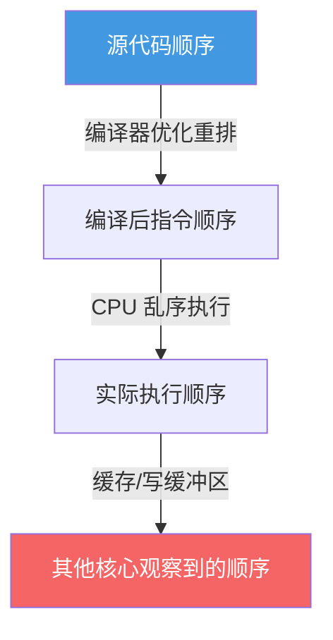
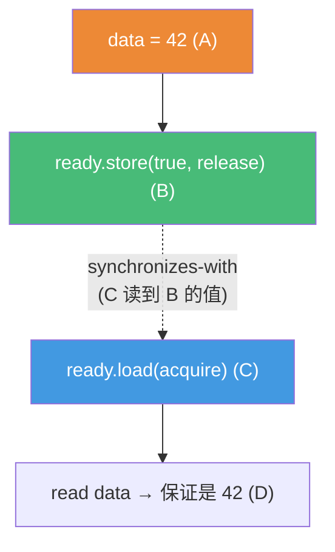
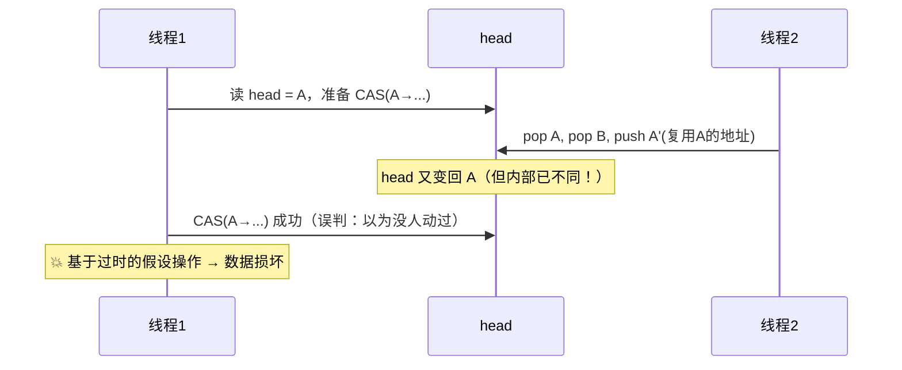

# 精通 C++ 原子与内存模型

> 课程编号：C23
> 路线图来源：现代 C++ 全栈深度课程 — 并发：原子与内存模型
> 难度：⭐⭐⭐⭐⭐
> 预计阅读时间：70 分钟
> 📅 内容基准：**C++23**（ISO/IEC 14882:2024）+ GCC 14 / Clang 18 / MSVC 19.4x

---

## 引言：这段无锁代码为什么会出错

```cpp
#include <atomic>
#include <thread>

int data = 0;
std::atomic<bool> ready{false};

void producer() {
    data = 42;                                   // ① 写普通数据
    ready.store(true, std::memory_order_relaxed);// ② 置标志（relaxed!）
}
void consumer() {
    while (!ready.load(std::memory_order_relaxed)) {}  // ③ 等标志
    assert(data == 42);                          // ④ 这个断言一定成立吗？
}
```

三个问题，能立刻回答吗？

1. 上面用 `relaxed` 内存序，`assert(data == 42)` 一定成立吗？
2. `data` 是普通 `int`，多线程读写它，为什么这里不是数据竞争（UB）？
3. 把 `relaxed` 换成 `release`/`acquire` 之后，行为有什么变化？

答案：① **不一定成立**！`relaxed` 只保证 `ready` 这个变量本身的原子性，**不保证** `data=42`（①）对消费者可见——编译器/CPU 可能**重排**，让 consumer 看到 `ready==true` 时 `data` 还是 0；② 严格说**这是数据竞争**（`data` 被并发读写且 relaxed 不建立同步），需要正确的内存序来**建立 happens-before 关系**才安全；③ 把 store 改成 `release`、load 改成 `acquire` 后，就建立了"release-acquire 同步"——consumer 看到 `ready==true` 时，**保证**能看到 release 之前的所有写（包括 `data=42`），断言成立。

原子与内存模型是 C++ 并发**最难也最深**的一章。它回答"无锁编程为什么难"——不是 API 难，而是**多核 CPU 和编译器会重排内存操作**，你必须用 `memory_order` 精确控制可见性。这一章讲清原子操作、六种内存序、happens-before、CAS 和无锁数据结构的真正难点。

---

## 第一章：std::atomic 基础

### 1.1 为什么需要原子

C21 讲过 `++counter` 是"读-改-写"非原子操作，多线程会丢失更新。`std::atomic` 让这些操作**不可分割**：

```cpp
#include <atomic>
std::atomic<int> counter{0};

void inc() {
    ++counter;                   // 原子自增，等价 fetch_add(1)，不会丢失更新
    counter.fetch_add(1);        // 同上，显式写法
    counter.store(5);            // 原子写
    int v = counter.load();      // 原子读
}
```

无锁（lock-free）的 atomic 比 mutex 快得多（无系统调用、无阻塞），但**只能保护单个变量**——保护复合的临界区仍需 mutex（C22）。

### 1.2 原子操作集合

```cpp
std::atomic<int> a{0};
a.store(10);                     // 写
int x = a.load();                // 读
int old = a.exchange(20);        // 写新值，返回旧值
a.fetch_add(5);                  // 原子 +=，返回旧值
a.fetch_sub(3); a.fetch_or(1); a.fetch_and(0xF);  // 原子位/算术运算
```

### 1.3 is_lock_free

不是所有 `atomic<T>` 都无锁——大对象可能内部用锁实现：

```cpp
std::atomic<int> ai;
std::atomic<BigStruct> as;
static_assert(std::atomic<int>::is_always_lock_free);  // int 通常无锁
bool b = as.is_lock_free();      // 运行期查；大类型可能 false（内部加锁）
```

`is_always_lock_free`（编译期常量）告诉你该类型是否保证无锁。无锁才有性能优势。

---

## 第二章：内存模型——为什么会重排

### 2.1 单线程的假象

单线程里代码"按顺序执行"是**假象**——编译器和 CPU 为了性能会**重排**指令，只要保证单线程结果不变（as-if 规则）：

```cpp
int a = 1;   // 这两行无依赖
int b = 2;   // 编译器/CPU 可能先执行 b=2 再 a=1，单线程看不出区别
```

单线程无所谓，但**多线程**里，一个线程看到的另一个线程的写入顺序，可能与源码顺序不同。这就是内存模型要管的事。

### 2.2 三层重排



- **编译器重排**：优化时调整指令顺序。
- **CPU 乱序执行**：现代 CPU 不按顺序执行指令。
- **缓存可见性**：每个核心有自己的缓存/写缓冲，一个核心的写不会立刻被别的核心看到。

`memory_order` 就是告诉编译器和 CPU "**哪些重排不许做**"，从而建立跨线程的可见性保证。

---

## 第三章：六种内存序

### 3.1 概览

| memory_order | 含义 | 开销 |
|---|---|---|
| `relaxed` | 只保证原子性，**无顺序保证** | 最低 |
| `consume` | 数据依赖顺序（已不推荐，当 acquire 用） | 低 |
| `acquire` | 读屏障：之后的读写不能重排到它**之前** | 中 |
| `release` | 写屏障：之前的读写不能重排到它**之后** | 中 |
| `acq_rel` | 同时 acquire + release（用于 RMW） | 中 |
| `seq_cst` | 顺序一致：全局单一顺序（**默认**） | 最高 |

### 3.2 relaxed——只要原子性

`relaxed` 只保证操作本身原子，**不建立任何跨线程顺序**。适合无需顺序的场景，如纯计数器：

```cpp
std::atomic<int> hits{0};
void on_request() {
    hits.fetch_add(1, std::memory_order_relaxed);  // 只要计数准，不关心顺序
}
// 最后统计：所有 relaxed 自增的总数仍然正确（原子性保证）
```

⚠️ 引言的 bug 正是误用 relaxed——它不保证 `data` 的可见性。

### 3.3 acquire-release——建立同步

这是无锁编程的**主力**。`release` 写 + `acquire` 读配对，建立 happens-before：

```cpp
int data = 0;
std::atomic<bool> ready{false};

void producer() {
    data = 42;                                    // A
    ready.store(true, std::memory_order_release); // B：release，A 不能重排到 B 之后
}
void consumer() {
    while (!ready.load(std::memory_order_acquire)) {}  // C：acquire
    assert(data == 42);                           // D：保证看到 A！
}
```

**机制**：`release`（B）像一道"向下的栅栏"——B 之前的所有写（包括 A）都不能跨到 B 之后；`acquire`（C）像"向上的栅栏"——C 之后的读不能提到 C 之前。当 C 读到 B 写的值时，**B release 之前的所有写对 C acquire 之后都可见**。



### 3.4 seq_cst——最强也最贵

`seq_cst`（顺序一致，**默认**）保证所有 seq_cst 操作有一个**全局单一的总顺序**，所有线程看到相同顺序。最易推理，但开销最大（常需全屏障/`mfence`，阻止 CPU 的存储缓冲优化）：

```cpp
std::atomic<int> x{0};
x.store(1);                  // 默认 seq_cst
int v = x.load();            // 默认 seq_cst
```

**为什么 seq_cst 贵**：它要求全局顺序，CPU 必须刷新存储缓冲区、插入完整内存屏障，破坏了乱序/缓存优化。性能敏感的无锁代码会降级到 acquire-release 甚至 relaxed——但难度陡增。

---

## 第四章：happens-before

### 4.1 核心关系

`memory_order` 的目的是建立 **happens-before** 关系——若 A happens-before B，则 A 的效果对 B 可见：

- **同线程内**：源码顺序的前者 happens-before 后者（sequenced-before）。
- **跨线程**：release 操作 happens-before 读到它的 acquire 操作（**synchronizes-with**）。
- **传递性**：A hb B，B hb C ⟹ A hb C。

```
没有 happens-before 关系的两个访问（至少一写）= 数据竞争 = UB
```

这是判断并发正确性的**唯一标准**：要么用锁、要么用原子建立 happens-before，否则就是数据竞争。

### 4.2 用它理解引言

引言 relaxed 版本：A(`data=42`) 与 D(`read data`) 之间**没有** happens-before（relaxed 不建立 synchronizes-with）→ 数据竞争 → 断言可能失败。改 release/acquire 后建立了 synchronizes-with → A hb D → 安全。

---

## 第五章：CAS 与无锁编程

### 5.1 compare_exchange

CAS（Compare-And-Swap）是无锁编程的基石——"**比较并交换**"：若当前值等于期望值，则改成新值；否则把当前值写回期望值（供重试）。是一个原子的"读-改-写"：

```cpp
std::atomic<int> a{0};
int expected = 0;
bool ok = a.compare_exchange_strong(expected, 1);
// 若 a == expected(0)：设 a = 1，返回 true
// 若 a != expected：expected 被更新为 a 的当前值，返回 false
```

### 5.2 无锁更新的经典循环

任何"读当前值-计算新值-写回（仅当没被别人改过）"都用 CAS 循环：

```cpp
// 无锁地把 atomic 乘以 2
void atomic_double(std::atomic<int>& a) {
    int old = a.load(std::memory_order_relaxed);
    while (!a.compare_exchange_weak(old, old * 2,
                                    std::memory_order_acq_rel,
                                    std::memory_order_relaxed)) {
        // CAS 失败：old 已被刷新为最新值，自动重试
    }
}
```

`compare_exchange_weak` 可能**伪失败**（即使相等也返回 false），但在 CAS 循环里更高效（某些平台），所以循环里用 weak、单次用 strong。

### 5.3 无锁栈（演示难点）

```cpp
template<class T>
class LockFreeStack {
    struct Node { T val; Node* next; };
    std::atomic<Node*> head{nullptr};
public:
    void push(T v) {
        Node* n = new Node{std::move(v), head.load()};
        // CAS：若 head 没被别人改，就把 head 指向 n
        while (!head.compare_exchange_weak(n->next, n)) {}  // 失败则 n->next 被更新，重试
    }
    // pop 远比 push 难——见下节 ABA / 内存回收问题
};
```

push 看似简单，但 **pop 极难**：取下头节点后要 `delete` 它，但别的线程可能正持有该指针 → 释放后被访问（悬垂）。安全的内存回收（hazard pointer / RCU / `atomic<shared_ptr>`）是无锁编程的核心难点。

---

## 第六章：无锁的陷阱——ABA 与 false sharing

### 6.1 ABA 问题

CAS 比较的是"**值**"而非"是否被改过"。若值从 A 变成 B 又变回 A，CAS 会**误以为没变**：



**ABA 典型场景**：无锁栈/队列中节点被释放又重新分配到同一地址。解决：带版本号的 CAS（`atomic<pair<ptr,counter>>` / DCAS）、hazard pointer、延迟回收。

### 6.2 false sharing（伪共享）

CPU 缓存以**缓存行（cache line，通常 64 字节）**为单位。两个线程改各自的变量，但它们**落在同一缓存行**，会导致缓存行在核心间反复失效弹跳——性能暴跌，尽管逻辑上无共享：

```cpp
struct Bad {
    std::atomic<int> a;          // 线程1 频繁改
    std::atomic<int> b;          // 线程2 频繁改 —— 与 a 同一缓存行 → 伪共享！
};

struct Good {
    alignas(64) std::atomic<int> a;   // 对齐到缓存行
    alignas(64) std::atomic<int> b;   // 各占一行，互不干扰
};
// C++17: std::hardware_destructive_interference_size 给出缓存行大小
```

伪共享是高性能并发的隐形杀手——`perf c2c` 可以检测。用 `alignas` 或 padding 隔开高频写的原子变量。

### 6.3 atomic_ref（C++20）

`std::atomic_ref` 对**已存在的非原子对象**临时施加原子操作（无需把类型声明成 atomic）：

```cpp
#include <atomic>
int data[1000];
void worker(int i) {
    std::atomic_ref<int> r(data[i]);   // 对 data[i] 做原子操作
    r.fetch_add(1, std::memory_order_relaxed);
}
```

用于对数组元素、已有结构体字段做原子访问，避免把整个类型改成 atomic。

---

## 第七章：常见陷阱清单

### ❌ 陷阱 1：用 relaxed 传递数据/标志

```cpp
data = 42;
flag.store(true, std::memory_order_relaxed);  // ❌ 不保证 data 可见
```
修正：用 `release`（写）+ `acquire`（读）建立同步。

### ❌ 陷阱 2：以为 atomic 能保护复合操作

```cpp
std::atomic<int> a;
if (a.load() == 0) a.store(1);   // ❌ load 和 store 之间有竞态窗口（非原子）
```
修正：用 `compare_exchange`（CAS）做原子的"检查并设置"。

### ❌ 陷阱 3：无锁栈 pop 直接 delete

```cpp
Node* old = head.load();
head.store(old->next);
delete old;                  // ❌ 别的线程可能正持有 old → 悬垂访问
```
需要安全内存回收（hazard pointer / RCU）。

### ❌ 陷阱 4：忽视 ABA

```cpp
// 无锁结构只比较指针值，A→B→A 会误判 → 用版本号/标签指针
```

### ❌ 陷阱 5：高频原子变量挤在一个缓存行（伪共享）

```cpp
std::atomic<int> counters[N];   // ❌ 多线程各改一个，但相邻 → 伪共享
```
修正：`alignas(64)` 或填充隔开。

### ❌ 陷阱 6：所有 atomic 都用默认 seq_cst 却抱怨慢

```cpp
counter.fetch_add(1);        // 默认 seq_cst，纯计数其实 relaxed 就够
```
能用 relaxed/acquire-release 就别用 seq_cst（但先确保正确性！）。

---

## 第八章：练习题

**练习 1**：`std::atomic<int>` 的 `++` 和普通 `int` 的 `++`（多线程）有什么区别？

**练习 2**：引言里把 `relaxed` 换成 `release`/`acquire`，为什么断言就能成立？解释 happens-before。

**练习 3**：`seq_cst` 为什么比 `acquire`/`release` 慢？

**练习 4**：什么是 ABA 问题？举一个会触发它的场景。

**练习 5**：什么是 false sharing？如何避免？

---

## 参考答案与解析

**练习 1**：`atomic<int>` 的 `++` 是**原子的"读-改-写"**（`fetch_add`），不可分割，多线程并发也不丢失更新；普通 `int` 的 `++` 是三步（load/add/store）非原子，多线程交错会丢失更新，且无同步的并发读写本身是**数据竞争（UB）**。

**练习 2**：`release` store（生产者）与读到它的 `acquire` load（消费者）建立 **synchronizes-with** 关系。于是 `data=42`（release 之前，sequenced-before store）happens-before 消费者 acquire load 之后的 `read data`。happens-before 保证前者的效果对后者可见，所以读到的 `data` 一定是 42。relaxed 不建立 synchronizes-with，无 happens-before，就是数据竞争。

**练习 3**：`seq_cst` 要求所有 seq_cst 操作存在一个**全局单一总顺序**、所有线程观察一致。为此 CPU 必须刷新存储缓冲区、插入**完整内存屏障**（如 x86 的 `mfence`、ARM 的 `dmb`），破坏了乱序执行和写缓冲优化。`acquire`/`release` 只是**单向**屏障（只约束一个方向的重排），无需全局顺序，开销小得多。

**练习 4**：ABA 是 CAS 只比较"值"导致的问题——某位置的值从 A 变 B 又变回 A，CAS 看到值还是 A 就**误判"没人动过"**，但实际中间已经发生了变化。典型场景：无锁栈中节点 A 被 pop 并 delete，新分配的节点恰好复用了 A 的地址再 push 回来，此时持有旧 A 指针的线程 CAS 成功，却操作了语义已不同的节点。解决：带版本号/标签的指针、hazard pointer、延迟回收。

**练习 5**：false sharing（伪共享）指两个线程修改**各自独立**的变量，但它们位于**同一缓存行（64 字节）**，导致缓存行在核心间反复失效、来回弹跳，性能暴跌——尽管逻辑上没有共享。避免：用 `alignas(64)`（或 `std::hardware_destructive_interference_size`）让高频写的变量各占一个缓存行，或加 padding 隔开。

---

## 小结

| 知识点 | 关键记忆 |
|---|---|
| atomic | 单变量原子操作（load/store/fetch_add/exchange）；无锁才快 |
| 内存重排 | 编译器 + CPU 乱序 + 缓存可见性；单线程无感、多线程致命 |
| relaxed | 只保原子性，无顺序——仅适合纯计数 |
| acquire/release | 配对建立 synchronizes-with，无锁主力；单向屏障 |
| seq_cst | 默认，全局总顺序，最易推理但最贵 |
| happens-before | 并发正确性的唯一标准；无 hb 的并发读写 = UB |
| CAS | `compare_exchange`，无锁循环基石；weak 用于循环 |
| 无锁难点 | 安全内存回收、ABA（用版本号）、false sharing（用 alignas） |
| atomic_ref | 对已有非原子对象临时施加原子操作（C++20） |

---

## 📅 2026 现状/更新

- 内存模型（C++11 引入）至今稳定；C++20 加入 `atomic_ref`、`atomic<shared_ptr>`、`atomic::wait/notify`（原子的高效阻塞等待），GCC 14 / Clang 18 / MSVC 19.4x 均支持。
- 无锁编程仍是**专家领域**——实践准则是"**先用锁（C22）跑对，剖析确认锁是瓶颈，再考虑无锁**"。绝大多数场景 mutex/atomic 计数足够。
- 安全内存回收正在标准化方向演进（hazard pointer、RCU 在 C++26 提案中）；当前生产无锁结构多依赖成熟库（如 folly、boost.lockfree）。
- **ThreadSanitizer** 检测数据竞争，`perf c2c` 检测伪共享，[godbolt](https://godbolt.org) 看不同 memory_order 生成的屏障指令差异。
- 核心准则：**能用锁就别手搓无锁；必须无锁则 acquire-release 为主、relaxed 谨慎、seq_cst 兜底，并防 ABA 与 false sharing**。

---

> 🔁 下一篇 **C24 — 精通 C++ future / async / promise**：`std::future`/`std::promise` 传递结果与异常、`std::async` 的启动策略（async/deferred）、`std::packaged_task`，以及为什么这些"基于任务"的并发比裸线程更好用。
>
> 反馈：把"内存会重排、happens-before 是正确性唯一标准、acquire-release 配对建立同步"三条钉死——这是无锁编程所有困惑的根源。
